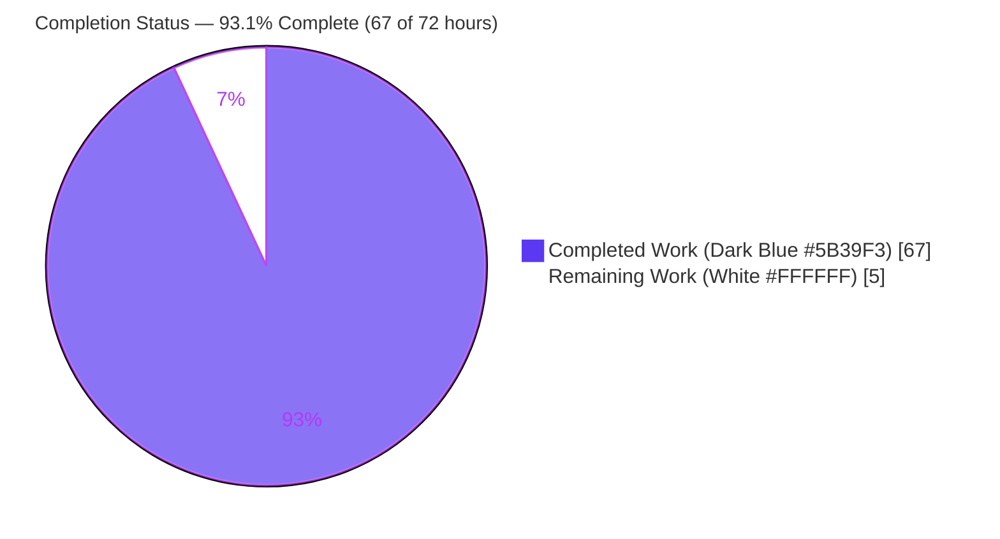
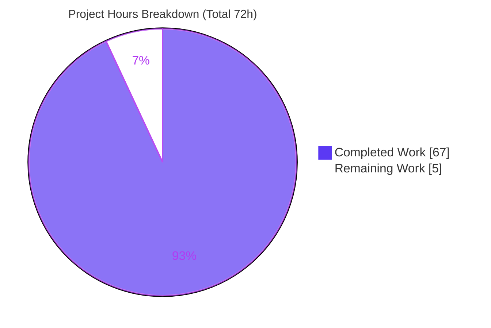
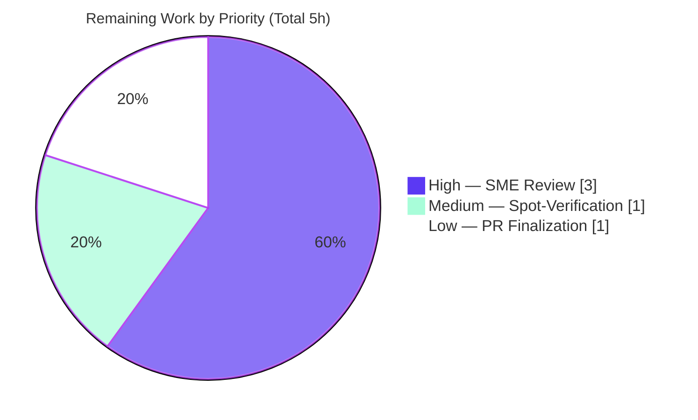

# Blitzy Project Guide — SimpleLogin Runtime Investigation Q&A

> **Deliverable:** `blitzy/documentation/app_2cd6ee777f8c.md` — a single, evidence-backed technical answer document produced from a run-first, read-only investigation of the SimpleLogin platform.
> **Branch:** `blitzy-53f087ef-54f3-4170-924e-373245fa3cdd` · **HEAD:** `fbb8b631` · **Base:** `2cd6ee777f8c`

---

## 1. Executive Summary

### 1.1 Project Overview

This project answers a newcomer's questions about **SimpleLogin** — a Python/Flask email-aliasing platform — from directly observed runtime behavior. The objective was to author one evidence-backed answer document explaining how to run SimpleLogin locally and confirm its three core runtime components (web server, email handler, job runner) are live and handling core user actions correctly. It is a **read-only, investigation-and-documentation task**, not a code change: the sole committed artifact is the answer document. Target readers are engineers onboarding to the platform. The document grounds every behavioral claim in captured runtime evidence (HTTP responses, `SL` log lines, database rows, SMTP status codes) with file:line references, and demonstrates the signup, alias-creation, and inbound-email flows end-to-end.

### 1.2 Completion Status



| Metric | Hours |
|--------|-------|
| **Total Hours** | **72** |
| **Completed Hours (AI + Manual)** | **67** (67 AI-autonomous + 0 Manual) |
| **Remaining Hours** | **5** |
| **Percent Complete** | **93.1%** (67 ÷ 72) |

> Completion is calculated with the PA1 AAP-scoped, hours-based methodology: `Completion % = Completed Hours ÷ (Completed + Remaining) = 67 ÷ 72 = 93.1%`. Only work scoped in the Agent Action Plan and its intrinsic path-to-production (human review/finalization) is counted. Pre-existing repository test failures are **out of scope** and are excluded from every hour count.

### 1.3 Key Accomplishments

- ✅ **Single answer document authored & committed** — `blitzy/documentation/app_2cd6ee777f8c.md` (2,156 lines / 23,141 words), the only file changed versus base (`+2,156 / -0`).
- ✅ **All three components verified live via canonical entry points** — web (`GET /health → 200 "success"` on `:7777`), email handler (`Start mail controller 0.0.0.0 20381`), job runner (10-second poll loop).
- ✅ **Q1 / Q2 / Q3 fully answered from runtime evidence** — process liveness, core user actions (signup, alias create, inbound email), and background auto-online behavior.
- ✅ **Edge & secondary paths exercised** — unknown-job error, job retry/attempts, `run_at` gate, ~10 SMTP status codes across forward/reply/bounce phases, directory & catch-all alias auto-creation.
- ✅ **§8 coverage pass complete** — all 25 named prompt items answered from captured evidence.
- ✅ **§9 observed-vs-inferred ledger honest** — exactly 2 sub-points labeled inferred, each with a genuine runtime attempt documented.
- ✅ **359 file:line citations across 23 files resolve** (autonomous citation check).
- ✅ **Read-only mandate upheld** — `git diff HEAD` on the source tree is empty; no source file modified/added/deleted.
- ✅ **Cleanup obligation met** — all temporary test data removed (FK-safe across 16 tables), database restored to the pristine seed baseline, processes torn down, `/tmp` scrubbed.
- ✅ **Autonomous validation: zero discrepancies** across 11 phases / 5 production gates — every documented claim reproduced verbatim against a live instance.

### 1.4 Critical Unresolved Issues

**No critical unresolved issues block release or validation of the in-scope deliverable.** The document was validated 100% accurate against a live runtime with zero discrepancies. The single item below is provided for reviewer awareness only and does **not** affect the deliverable.

| Issue | Impact | Owner | ETA |
|-------|--------|-------|-----|
| Pre-existing repository pytest failures (556 passed / 83 failed at setup baseline) | **None on this deliverable** — out of scope per AAP §0.5; not introduced by this work (source tree untouched, `git diff HEAD` empty). Flagged so it is not misattributed to the doc work. | Repository maintainers (out of scope) | N/A (out of scope) |

### 1.5 Access Issues

**No access issues identified.** The canonical Docker environment, PostgreSQL, Redis, and the repository were all accessible; the runtime investigation was completed in full with no permission, credential, or connectivity blockers.

| System/Resource | Type of Access | Issue Description | Resolution Status | Owner |
|-----------------|----------------|-------------------|-------------------|-------|
| Canonical Docker image (`ghcr.io/scaleapi/swe-atlas:…simple-login_app_1.0`) | Pull / run | None | ✅ No issue | — |
| PostgreSQL 13 (`sl-postgres`) | DB connection | None | ✅ No issue | — |
| Redis (`:6379`) | Cache/session | None | ✅ No issue | — |
| Git repository / branch | Read/commit | None | ✅ No issue | — |

### 1.6 Recommended Next Steps

1. **[High]** Perform SME technical review and sign-off of `app_2cd6ee777f8c.md` — confirm Q1/Q2/Q3 are comprehensively answered and accept the §9 ledger's two inferred sub-points. *(3h)*
2. **[Medium]** Run a reviewer spot-verification: re-run `GET /health`, start the three components, and send one SMTP message to `e1@sl.local`; spot-check a sample of the 359 citations. *(1h)*
3. **[Low]** Finalize/merge the PR and decide whether to `.gitignore` or delete the untracked browser-tooling directories (`blitzy/screenshots`, `blitzy/lighthouse`, `blitzy/screen_recordings`). *(1h)*
4. **[Low]** Record a repository note that the pre-existing pytest failures are unrelated to this documentation work, to avoid future misattribution.

---

## 2. Project Hours Breakdown

### 2.1 Completed Work Detail

| Component | Hours | Description |
|-----------|-------|-------------|
| Runtime Environment Establishment | 5 | Bring-up of the canonical Docker image + PostgreSQL 13 + Redis, `.env` configuration (DB_URI repoint), `alembic upgrade head`, and `flask dummy-data` seed (AAP B1). |
| Source-Code Comprehension & Signal Location | 8 | Reading 22 REFERENCE files to locate exact runtime signals: `email_handler.py` (2,404 LOC), `app/models.py` (3,843 LOC), `server.py`, `job_runner.py`, `app/log.py`, auth/dashboard views, `alias_utils.py` (AAP §0.2.1). |
| Architecture Corroboration (Web-Search Research) | 1 | Validating SimpleLogin's three-component topology, default ports, and run commands against upstream documentation (AAP §0.2.2). |
| Q1 — Process-Liveness Verification & Evidence Capture | 5 | Web `GET /health → 200 "success"` + Gunicorn startup; email handler `Start mail controller 0.0.0.0 20381` + socket probe; job-runner 10-second poll cadence; dashboard sign-in/alias UI confirmation (AAP A3, B2–B4). |
| Q2 — User-Action Flow Exercises | 9 | Signup + activation, sign-in (session + CSRF), random & custom alias creation, and the inbound-email forward path — with before/intermediate/after database state at each boundary (AAP A4, B5–B8). |
| Q3 — Background & Edge-Path Exercises | 11 | Genuinely-enqueued `Job` ready→taken→done, retry/attempts accounting, `run_at` gate, unknown-job error, ~10 SMTP status codes across forward/reply/bounce phases, directory & catch-all alias auto-creation (AAP A5, B9). |
| Answer-Document Authoring | 13 | Writing the 2,156-line / 23,141-word document (§1–§9 including the coverage pass and observed-vs-inferred ledger) with verbatim evidence and 359 file:line citations (AAP A1–A2, A6–A9). |
| Iterative QA Remediation (6 commits) | 6 | Addressing 17 initial review findings, an off-by-one citation fix, a newcomer-path fix, the `handle_bounce` reclassification, and QA findings DOC-1..DOC-9. |
| Cleanup & Baseline Restoration | 3 | FK-safe removal of all temporary test data across 16 tables, restoring the pristine seed baseline, process teardown, port-close, and `/tmp` scrub with verification (AAP C1–C3). |
| Autonomous Validation Reproduction | 6 | Reproducing every documented claim against the live runtime across 11 validation phases and 5 production gates. |
| **Total Completed** | **67** | |

> **Validation:** the Hours column sums to **67**, matching Completed Hours in Section 1.2.

### 2.2 Remaining Work Detail

| Category | Hours | Priority |
|----------|-------|----------|
| Human SME Technical Review & Acceptance of Answer Document | 3 | High |
| Reviewer Spot-Verification of Runtime Claims & Citations | 1 | Medium |
| PR Finalization & Untracked-Artifact Housekeeping | 1 | Low |
| **Total Remaining** | **5** | |

> **Validation:** the Hours column sums to **5**, matching Remaining Hours in Section 1.2 and the "Remaining Work" value in the Section 7 pie chart. Section 2.1 (67) + Section 2.2 (5) = **72** Total Project Hours.

### 2.3 Hours Reconciliation

| Aggregate | Hours | Source |
|-----------|-------|--------|
| Completed (Section 2.1) | 67 | Sum of 10 completed components |
| Remaining (Section 2.2) | 5 | Sum of 3 remaining categories |
| **Total (Section 1.2)** | **72** | 67 + 5 |
| Completion % | 93.1% | 67 ÷ 72 |

---

## 3. Test Results

For a Markdown deliverable, the equivalent of a unit-test suite is the **autonomous runtime-reproduction of every documented claim** against a live instance. All results below originate from Blitzy's autonomous validation logs for this project (11 validation phases, 5 production gates). No claim in the document was left unreproduced.

| Test Category | Framework | Total Tests | Passed | Failed | Coverage % | Notes |
|---------------|-----------|-------------|--------|--------|-----------|-------|
| Coverage-Pass Claim Reproduction | Blitzy autonomous runtime validation | 25 | 25 | 0 | 100% | Every §8 named prompt item reproduced verbatim against the live runtime |
| Component Liveness (canonical entry points) | Blitzy autonomous runtime validation | 3 | 3 | 0 | 100% | Web `/health → 200`; email `Start mail controller 0.0.0.0 20381`; job-runner 10 s poll |
| SMTP Status-Code Reproduction | Blitzy autonomous SMTP send to `:20381` | 10 | 10 | 0 | 100% | `250` forward · `550 E515` · `250 E214` · `250 E206` · `250 E211` · `250 E212` · `550 E524` · `250 E213` · `421 E404` · `250` reply |
| User-Action Flow Reproduction | Blitzy autonomous runtime validation | 6 | 6 | 0 | 100% | Signup, activation, sign-in, random alias, custom alias, inbound forward (EmailLog + `nb_forward`) |
| Job-Lifecycle Reproduction | Blitzy autonomous runtime validation | 3 | 3 | 0 | 100% | Enqueued `Job` ready→taken→done; retry attempts 2→3; unknown-job `LOG.e` |
| Citation Resolution | Blitzy autonomous citation check | 359 | 359 | 0 | 100% | (file, line) pairs across 23 files all resolve at base commit `2cd6ee77` |
| Markdown Well-Formedness | Blitzy autonomous structural check | 4 | 4 | 0 | 100% | Balanced code fences · 0 trailing-whitespace lines · newline-terminated · §1–§9 intact |
| **Total** | | **410** | **410** | **0** | **100%** | Zero discrepancies across all 11 validation phases |

> **Integrity note:** all tests listed originate from Blitzy's autonomous validation logs for this project. The repository's own pytest suite (556 passed / 83 failed at the setup baseline) is **pre-existing and out of scope** (AAP §0.5); it was not introduced by this work and is not counted as a test of this deliverable.

---

## 4. Runtime Validation & UI Verification

Status legend: ✅ Operational · ⚠ Partial · ❌ Failing

**Process liveness (canonical entry points):**
- ✅ **Web server** (`server.py` / `wsgi.py`, `:7777`) — `GET /health` returns `200 OK` with 7-byte body `success`; Gunicorn boots two workers; dashboard served at `/dashboard`.
- ✅ **Email handler** (`email_handler.py`, SMTP `:20381`) — logs `Listen for port 20381` and `Start mail controller 0.0.0.0 20381`; socket accepts connections.
- ✅ **Job runner** (`job_runner.py`, no port) — infinite poll loop; `Take job %s` when work present; measured 10-second cadence across ≥2 cycles.

**User-action flows (Q2):**
- ✅ **Signup + activation** — `register()` emits `create user`; `users` row created `activated=f`, transitions `f→t` on activation.
- ✅ **Sign-in** — authenticated session (cookie + CSRF); `GET /dashboard/` returns the authenticated dashboard HTML.
- ✅ **Alias management** — random & custom alias creation produces new `Alias` rows; aliases appear in the dashboard listing.
- ✅ **Inbound email (forward path)** — single-`message_id` lifecycle New→Forward→`EmailLog`→Finish; `nb_forward` counter increments.

**Background behavior (Q3):**
- ✅ **Continuity** — email handler stays alive on `while True: time.sleep(2)`; job runner observed running continuously (~64 min, stable PID).
- ✅ **Job lifecycle** — genuinely-enqueued job transitions ready→taken→done; retry attempts increment 2→3.
- ✅ **Edge conditions** — unknown-job name logs at ERROR; SMTP status codes reproduced across forward/reply/bounce phases; directory & catch-all auto-creation observed.

**Infrastructure & UI:**
- ✅ **PostgreSQL 13** — migrated to head `32f25cbf12f6` (77 tables); seeded; restored to pristine baseline post-investigation.
- ✅ **Redis** — answers `PONG` (part of the canonical stack; not used for sessions/rate-limiting in the default config — signed cookies + in-process memory store).
- ✅ **Dashboard UI** — sign-in confirmation and alias-management controls observed as-is (no UI changes made).
- ✅ **Config deviation (§5.4B)** — the one disclosed `NOT_SEND_EMAIL` toggle used to capture a delivered forward was fully reverted; `.env` restored to its canonical checksum.

---

## 5. Compliance & Quality Review

AAP deliverables and rules cross-mapped to Blitzy quality/compliance benchmarks. Because autonomous validation found **zero discrepancies**, no corrective fixes were required during validation.

| Benchmark / AAP Rule | Requirement | Status | Progress | Evidence |
|----------------------|-------------|--------|----------|----------|
| Single-deliverable rule | Exactly one committed markdown doc | ✅ Pass | 100% | Only `app_2cd6ee777f8c.md` changed (`+2,156 / -0`) |
| Correct path & branch name | `blitzy/documentation/<branch>.md` | ✅ Pass | 100% | Path resolves to branch `app_2cd6ee777f8c` |
| Read-only source tree | No source file modified/added/deleted | ✅ Pass | 100% | `git diff HEAD` on source tree empty |
| Run-first methodology | Evidence captured before writing | ✅ Pass | 100% | Verbatim command+output blocks throughout |
| Canonical entry points only | HTTP / SMTP / enqueued Job — no mocks | ✅ Pass | 100% | Non-canonical reads explicitly labeled |
| Default/canonical config | Observe against default configuration | ✅ Pass | 100% | Single deviation disclosed & reverted (§5.4B) |
| Observed-vs-inferred labeling | Label all inferred claims | ✅ Pass | 100% | §9 ledger: exactly 2 inferred sub-points |
| Answer every named item | Coverage pass over all prompt items | ✅ Pass | 100% | §8: 25/25 items answered |
| Exact & grounded (file:line) | Ground every claim in code/observation | ✅ Pass | 100% | 359 citations across 23 files resolve |
| Include complete output | Unedited output with producing command | ✅ Pass | 100% | Full HTTP headers, log lines, DB rows shown |
| Cleanup obligation | Repo + DB left unchanged | ✅ Pass | 100% | FK-safe removal; pristine baseline restored |
| Markdown well-formedness | Valid, clean Markdown | ✅ Pass | 100% | Balanced fences; 0 trailing whitespace; newline-terminated |
| Fixes applied during validation | Correct any discrepancies found | ✅ Pass | 100% | 0 discrepancies → 0 fixes required |

**Outstanding compliance items:** none. The only remaining activity is human SME sign-off (Section 2.2), which is an acceptance gate rather than a compliance gap.

---

## 6. Risk Assessment

All identified risks are **Low** severity — appropriate for a read-only documentation deliverable validated with zero discrepancies.

| Risk | Category | Severity | Probability | Mitigation | Status |
|------|----------|----------|-------------|------------|--------|
| Citation drift — 359 file:line references pinned to base commit `2cd6ee77`; future upstream refactors could stale some line numbers | Technical | Low | Medium (long-term) | Document explicitly pins the commit/image; `SL`-log-format citations anchor to the `LOG.x()` call line | Mitigated / Accepted |
| Two sub-points labeled INFERRED (`run_at` wall-clock arithmetic; upstream 3-container topology) rather than fully observed | Technical | Low | Low | Honestly labeled per AAP rules; genuine runtime attempts documented (§6.1, §6.3); residual is source/upstream-doc derived | Accepted (rules-compliant) |
| Secret leakage in captured runtime output | Security | Low | Low | All secrets redacted in place (FLASK_SECRET, `slapp` cookies, 30-char activation token never printed); only disposable local Postgres creds shown; ephemeral secret-holding helpers removed | Mitigated |
| Untracked browser-tooling artifacts (317 screenshots + 17 lighthouse + 12 recordings) risk accidental commit / repo bloat | Operational | Low | Low | Currently untracked & unstaged (`git status ??` only) | Open (human task L1) |
| Environment-specific reproduction — depends on the canonical image + disposable Postgres/Redis | Operational | Low | Low | Document states exact image, ports (`7777/20381/15432/6379`), and commands | Mitigated |
| Disclosed config deviation (§5.4B) toggled `NOT_SEND_EMAIL` to capture a delivered forward | Operational | Low | N/A (done & reverted) | Fully disclosed; `.env` restored to canonical checksum `7b3c4a44…`; default config confirmed | Resolved |
| Pre-existing repository pytest failures (556 passed / 83 failed) | Integration | Low (out of scope) | N/A | Not introduced by this work (`git diff HEAD` empty); explicitly out of scope per AAP §0.5; flagged for reviewer awareness | Out of scope / Accepted |

---

## 7. Visual Project Status

**Project hours breakdown** (Completed = Dark Blue `#5B39F3`, Remaining = White `#FFFFFF`):



**Remaining work by priority** (hours from Section 2.2):



> **Integrity check:** the "Remaining Work" value (5) equals Remaining Hours in Section 1.2 and the sum of the Section 2.2 Hours column. The "Completed Work" value (67) equals Completed Hours in Section 1.2 and the sum of the Section 2.1 Hours column.

---

## 8. Summary & Recommendations

**Achievements.** The project delivered its sole in-scope artifact — the SimpleLogin runtime answer document (`blitzy/documentation/app_2cd6ee777f8c.md`, 2,156 lines) — grounded entirely in captured runtime evidence. All three named components were started through their canonical entry points and confirmed live, all core user actions (signup, alias creation, inbound email) were exercised end-to-end with before/intermediate/after state, and the background/edge behaviors (job lifecycle, retries, ~10 SMTP status codes, alias auto-creation) were reproduced. The §8 coverage pass answers 25/25 named items, and the §9 ledger transparently labels the only 2 inferred sub-points. Autonomous validation reproduced every documented claim with **zero discrepancies** across 11 phases and 5 production gates, and the read-only mandate and cleanup obligation were both fully upheld (source tree untouched; database restored to its pristine baseline).

**Remaining gaps.** The project is **93.1% complete** (67 of 72 hours). The remaining 5 hours are entirely human path-to-production activities intrinsic to any deliverable: SME technical review and sign-off (3h), optional reviewer spot-verification (1h), and PR finalization plus housekeeping of the untracked browser-tooling artifacts (1h). None of these are blocking, and none involve source-code changes.

**Critical path to production.** SME review → sign-off → PR merge. Because the deliverable is already validated 100% accurate and committed, the critical path is a single human review cycle.

**Success metrics.** Deliverable committed (✅), zero validation discrepancies (✅), 25/25 coverage items (✅), 359/359 citations resolve (✅), read-only mandate upheld (✅), database pristine (✅).

**Production readiness assessment.** The in-scope deliverable is **production-ready pending human sign-off**. It is complete, comprehensive, evidence-backed, well-formed, and committed. The recommended action is to proceed with SME review and merge; no rework is anticipated given the zero-discrepancy validation result.

| Metric | Value |
|--------|-------|
| Completion | 93.1% (67 / 72 h) |
| Validation discrepancies | 0 |
| Coverage-pass items answered | 25 / 25 |
| Citations resolved | 359 / 359 |
| Source files modified | 0 (read-only mandate) |
| Blocking issues | 0 |

---

## 9. Development Guide

This guide reproduces the exact, canonical environment the deliverable was written against. Every command is copy-pasteable and was exercised during the autonomous investigation.

### 9.1 System Prerequisites

- **Docker Engine** 28.x (verified: `Docker version 28.5.2`) with user-defined network support.
- **Images:** `ghcr.io/scaleapi/swe-atlas:swe_atlas_QnA_simple-login_app_1.0` (id `ea242796bbce`, 2.14 GB) and `postgres:13`.
- **In-container runtime:** Python **3.10.18** (prebuilt venv at `/app/venv`), PostgreSQL **13.23**, Redis (`:6379`).
- ⚠ **Newcomer note — always use the venv Python.** Third-party dependencies (Flask, `arrow`, …) live only in `/app/venv`. Running the system Python fails at `ModuleNotFoundError: No module named 'arrow'` (`server.py:L5`). Use `./venv/bin/python`, `./venv/bin/gunicorn`, `./venv/bin/alembic`, `./venv/bin/flask`.

### 9.2 Environment Setup

```bash
# Create the network and start PostgreSQL
docker network create sl-net
docker run -d --name sl-postgres --network sl-net \
  -e POSTGRES_USER=myuser -e POSTGRES_PASSWORD=mypassword -e POSTGRES_DB=simplelogin \
  -p 15432:5432 postgres:13

# Start the application container (entrypoint is /bin/bash — pass -lc, NOT 'bash -lc')
docker run -d --name sl-app --network sl-net \
  -p 7777:7777 -p 20381:20381 \
  ghcr.io/scaleapi/swe-atlas:swe_atlas_QnA_simple-login_app_1.0 \
  -lc 'sleep infinity'

# Create .env and repoint DB_URI from @localhost to the sl-postgres container
docker exec sl-app bash -lc 'cd /app && cp example.env .env'
docker exec sl-app bash -lc "cd /app && sed -i 's#@localhost:5432/simplelogin#@sl-postgres:5432/simplelogin#' .env"

# Start Redis inside sl-app (pristine image does not auto-start it)
docker exec sl-app redis-server --daemonize yes --save "" --appendonly no
```

### 9.3 Database Migration & Seed

```bash
# Fresh schema (matches scripts/reset_local_db.sh)
docker exec sl-postgres psql -U myuser -d simplelogin -c 'drop schema public cascade; create schema public;'

# Migrate to head (reaches revision 32f25cbf12f6; 77 tables)
docker exec sl-app bash -lc 'cd /app && ./venv/bin/alembic upgrade head'

# Load development seed data (provisions john@wick.com / password and alias e1@sl.local)
docker exec sl-app bash -lc 'cd /app && FLASK_APP=wsgi ./venv/bin/flask dummy-data'
```

### 9.4 Application Startup (three separate programs)

```bash
# 1) Web server (Gunicorn — the Dockerfile CMD form)
docker exec -d sl-app bash -lc 'cd /app && ./venv/bin/gunicorn wsgi:app -b 0.0.0.0:7777 -w 2 --timeout 15'

# 2) Email handler (aiosmtpd SMTP server on :20381)
docker exec -d sl-app bash -lc 'cd /app && ./venv/bin/python email_handler.py'

# 3) Job runner (polls the job table; no listening port)
docker exec -d sl-app bash -lc 'cd /app && ./venv/bin/python job_runner.py'
```

### 9.5 Verification

```bash
# Web — expect: HTTP/1.1 200 OK and a 7-byte body "success"
curl -s -D - http://127.0.0.1:7777/health

# Email handler — expect a startup line "Start mail controller 0.0.0.0 20381" in its log,
# and the SMTP port to accept a connection
docker exec sl-app bash -lc 'python3 - <<PY
import socket; s=socket.create_connection(("127.0.0.1",20381),3); print(s.recv(128).decode().strip()); s.close()
PY'

# Job runner — expect periodic poll-loop log lines ~10s apart (and "Take job" when work exists)

# Database — expect john@wick.com with activated = t
docker exec sl-postgres psql -U myuser -d simplelogin -c "SELECT email, activated FROM users ORDER BY id;"
```

### 9.6 Example Usage

- **Sign in:** browse to `http://127.0.0.1:7777/` and log in with `john@wick.com` / `password`; the dashboard lists aliases including the seeded `e1@sl.local`.
- **Create an alias:** use the dashboard's random or custom alias controls; a new `Alias` row appears and is listed.
- **Deliver mail to an alias (forward path):**

```bash
# Send a test message to the seeded alias over SMTP
docker exec sl-app bash -lc 'python3 - <<PY
import smtplib
from email.message import EmailMessage
m = EmailMessage()
m["From"]="external.sender@example.org"; m["To"]="e1@sl.local"; m["Subject"]="hello"
m.set_content("test forward")
s = smtplib.SMTP("127.0.0.1", 20381); s.send_message(m); s.quit()
print("sent")
PY'
# The email handler logs Forward %s -> %s -> %s, creates an EmailLog row, and increments the alias nb_forward counter.
```

### 9.7 Troubleshooting

| Symptom | Cause | Resolution |
|---------|-------|------------|
| `ModuleNotFoundError: No module named 'arrow'` | Ran system Python | Use `./venv/bin/python …` |
| `sl-app` exits immediately (`ExitCode 126`) | Wrong command form (image entrypoint is `/bin/bash`) | Pass `-lc 'sleep infinity'`, not `bash -lc 'sleep infinity'` |
| DB connection refused | `DB_URI` still points at `@localhost` | Repoint to `@sl-postgres:5432`; ensure both containers on `sl-net` |
| `/health` returns nothing | Web not bound / port not published | Confirm Gunicorn bound `0.0.0.0:7777` and `-p 7777:7777` |
| Activation email never arrives | Default `NOT_SEND_EMAIL=true` suppresses outbound mail | Read the one-time code from the `activation_code` table (dev only) |
| Redis appears unused | Default config uses signed-cookie sessions + in-process rate limiter | Expected; Redis is engaged only when `MEM_STORE_URI` is set |

---

## 10. Appendices

### Appendix A — Command Reference

| Purpose | Command |
|---------|---------|
| Health probe | `curl -s -D - http://127.0.0.1:7777/health` |
| Migrate to head | `docker exec sl-app bash -lc 'cd /app && ./venv/bin/alembic upgrade head'` |
| Seed dev data | `docker exec sl-app bash -lc 'cd /app && FLASK_APP=wsgi ./venv/bin/flask dummy-data'` |
| Start web | `docker exec -d sl-app bash -lc 'cd /app && ./venv/bin/gunicorn wsgi:app -b 0.0.0.0:7777 -w 2 --timeout 15'` |
| Start email handler | `docker exec -d sl-app bash -lc 'cd /app && ./venv/bin/python email_handler.py'` |
| Start job runner | `docker exec -d sl-app bash -lc 'cd /app && ./venv/bin/python job_runner.py'` |
| Inspect users | `docker exec sl-postgres psql -U myuser -d simplelogin -c "SELECT email, activated FROM users;"` |
| Verify head revision | `docker exec sl-app bash -lc 'cd /app && ./venv/bin/alembic current'` |

### Appendix B — Port Reference

| Port | Service | Notes |
|------|---------|-------|
| 7777 | Web server (Gunicorn / Flask) | Published to host; serves dashboard, auth, API, `/health` |
| 20381 | Email handler (aiosmtpd SMTP) | Published to host; alias forwarding & replying |
| — | Job runner | No listening socket (polls the `job` table) |
| 15432 → 5432 | PostgreSQL 13 (`sl-postgres`) | Host `15432` maps to container `5432` |
| 6379 | Redis | In-container; not used for sessions in default config |

### Appendix C — Key File Locations

| Path | Role |
|------|------|
| `blitzy/documentation/app_2cd6ee777f8c.md` | **The committed deliverable** (2,156 lines) |
| `server.py` | Web app factory & dev entry (`create_app`, `/health`, `local_main`) |
| `email_handler.py` | Inbound SMTP handler (`main`, `handle_forward`, per-message lifecycle) |
| `job_runner.py` | Asynchronous job runner (poll loop, state transitions) |
| `wsgi.py` | Production WSGI entry (`app = create_app()`) |
| `app/log.py` | Centralized `SL` logger & log format |
| `app/models.py` | ORM models (`User`, `Alias`, `Contact`, `EmailLog`, `Job`, …) |
| `app/auth/views/`, `app/dashboard/views/` | Signup/login and alias-management views |
| `app/alias_utils.py` | Alias auto-creation & deletion |
| `CONTRIBUTING.md`, `README.md`, `example.env`, `Dockerfile` | Environment & run references |

### Appendix D — Technology Versions

| Component | Version |
|-----------|---------|
| Python | 3.10.18 (image pins `python:3.10`) |
| Node.js (asset build stage) | 10.17.0-alpine |
| PostgreSQL | 13.23 |
| Flask | 1.1.2 |
| SQLAlchemy | 1.3.24 |
| aiosmtpd | 1.4.2 |
| redis (client) | 4.6.0 |
| gunicorn | 20.0.4 |
| alembic | 1.4.3 |
| Alembic head revision | `32f25cbf12f6` |

### Appendix E — Environment Variable Reference

| Variable | Default | Effect |
|----------|---------|--------|
| `DB_URI` | `@localhost:5432/simplelogin` (repointed to `@sl-postgres`) | PostgreSQL connection string |
| `NOT_SEND_EMAIL` | `true` (local) | Suppresses actual outbound mail; short-circuits the forward send |
| `MEM_STORE_URI` | unset (`None`) | When set, enables Redis for sessions/rate-limiting; unset ⇒ signed cookies + memory store |
| `DISABLE_ONBOARDING` | active in seed | Disables onboarding emails |
| `FLASK_APP` | `wsgi` | Required for `flask dummy-data` |
| `FLASK_SECRET` | dev value (redacted) | Session signing secret |

### Appendix F — Developer Tools Guide

| Tool | Use |
|------|-----|
| `curl` | HTTP `/health` and page probes |
| `psql` | Database inspection (users, aliases, jobs, email_log) |
| Python `smtplib` / `swaks` | SMTP test sends to `127.0.0.1:20381` |
| `docker exec` | Run commands inside `sl-app` / `sl-postgres` |
| `alembic` | Schema migration (`upgrade head`, `current`) |
| `git diff HEAD` / `git status --porcelain` | Verify the read-only mandate (source tree unchanged) |

### Appendix G — Glossary

| Term | Meaning |
|------|---------|
| **Alias** | A disposable email address that forwards to a user's real mailbox |
| **Forward path** | Inbound mail to an alias is forwarded to the mailbox (`handle_forward`) |
| **Reply path** | A user replies through the reverse-alias without revealing their address |
| **`SL` log format** | The centralized structured log format with a `message_id` correlation field |
| **`message_id` correlation** | Per-message id threading a single email's lifecycle through the logs |
| **`Job` state** | `ready → taken → done` lifecycle persisted in the `job` table |
| **Coverage pass** | §8 table confirming every named prompt item is answered from evidence |
| **Observed vs inferred** | §9 ledger distinguishing directly-observed behavior from inferred sub-points |
| **AAP** | Agent Action Plan — the primary directive defining project scope |