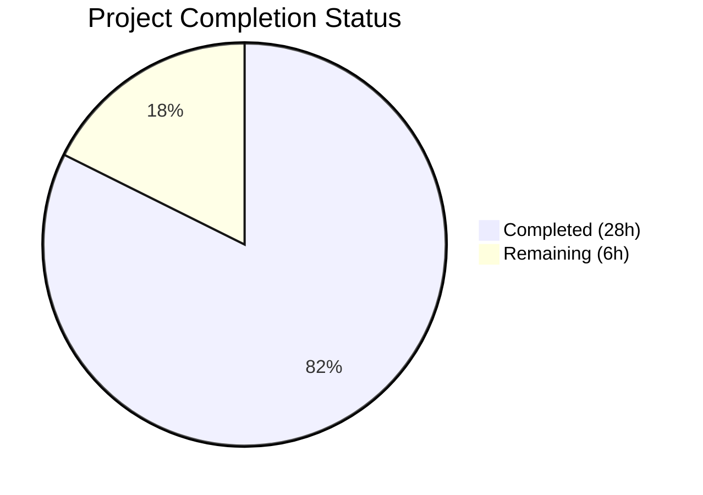
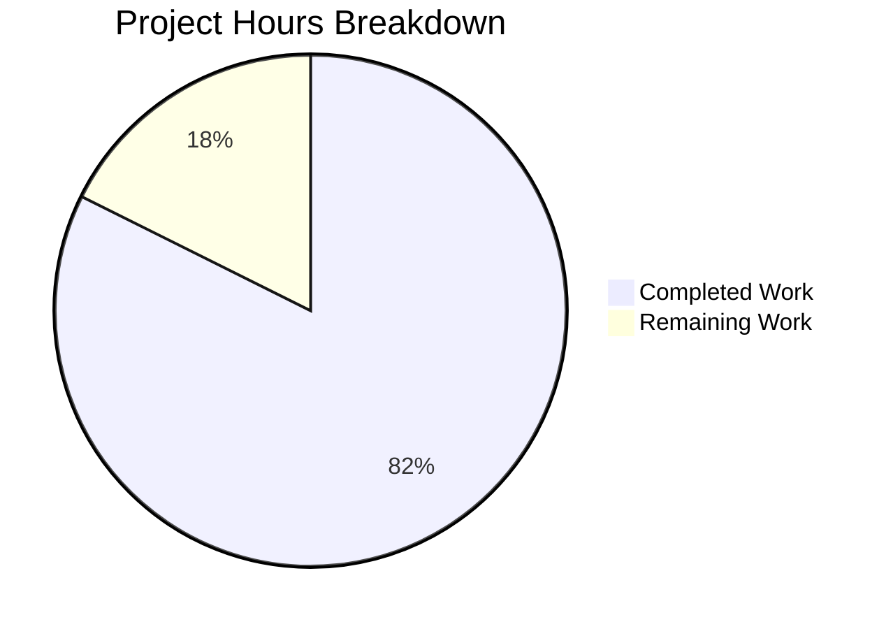

# Blitzy Project Guide — Bounce Email Handling Security Analysis

---

## 1. Executive Summary

### 1.1 Project Overview

This project delivers a comprehensive, evidence-based security investigation document analyzing SimpleLogin's bounce email handling system for information leakage vulnerabilities. The output is a single, self-contained Markdown document (`blitzy/documentation/app_2cd6ee777f8c.md`, 681 lines) that traces code paths across 8+ source modules to document the security gap between the legacy unsigned bounce address format and the newer HMAC-signed VERP format, SMTP response differentials exploitable for enumeration, bounce detection spoofability, and the complete security boundary map of the system. This is a documentation-only deliverable — no source code was modified.

### 1.2 Completion Status



| Metric | Value |
|--------|-------|
| **Total Project Hours** | 34 |
| **Completed Hours (AI)** | 28 |
| **Remaining Hours (Human)** | 6 |
| **Completion Percentage** | 82.4% |

**Calculation:** 28 completed hours / (28 completed + 6 remaining) = 28 / 34 = **82.4% complete**

All 6 AAP requirements (R1–R6) have been fully implemented in the deliverable document. The remaining 6 hours represent human review and approval tasks required for production readiness.

### 1.3 Key Accomplishments

- ✅ **R1 — Dual Bounce Format Analysis:** Complete documentation of legacy unsigned format (`parse_id_from_bounce()` at `app/email_utils.py:1258-1259`) and signed VERP format (`generate_verp_email()`/`get_verp_info_from_email()`) with comparative security assessment table
- ✅ **R2 — Bounce Routing Mechanics:** Line-by-line walkthrough of `email_handler.py:handle()` VERP detection region (lines 2034–2117), covering 3 parallel detection blocks, iCloud special case, and Mermaid routing flowchart
- ✅ **R3 — SMTP Response Differential Analysis:** 13-row probe scenario matrix mapping address format × bounce criteria × ID validity to exact SMTP response codes, including SPF downgrade interaction
- ✅ **R4 — Bounce Detection Criteria & Spoofability:** Analysis of `is_bounce()` and `is_automatic_out_of_office()` demonstrating full external satisfiability
- ✅ **R5 — Information Leakage Surface:** Enumeration attack procedure documented with differential 550/250 responses, disabled rate limiting, and timing inference
- ✅ **R6 — Security Boundary Mapping:** Cryptographic vs. unprotected path contrast with Mermaid boundary diagram
- ✅ **52 code citations verified** against actual source files by autonomous validation
- ✅ **3 Mermaid diagrams** created and syntax-validated (routing flowchart, criteria ordering flow, boundary map)
- ✅ **Zero source files modified** — read-only analysis per explicit user requirement
- ✅ **Clean git state** — 3 commits (creation + code review fixes + QA findings), working tree clean

### 1.4 Critical Unresolved Issues

| Issue | Impact | Owner | ETA |
|-------|--------|-------|-----|
| Human peer review of 52 code citations not yet performed | Code citations may drift if source files are modified before review | Human Developer | 2 hours after assignment |
| Security team has not reviewed vulnerability findings | Findings describe exploitable information leakage — remediation decisions pending | Security Team | 2 hours after assignment |
| Document not yet merged to main branch | Analysis not available to wider team until PR is merged | Human Developer | Post-review |

### 1.5 Access Issues

No access issues identified. The deliverable is a standalone Markdown file committed to the repository. No external service credentials, API keys, or special permissions are required to view, review, or merge the document.

### 1.6 Recommended Next Steps

1. **[High]** Conduct peer review of all 52 code citations against current source code to confirm accuracy before merge
2. **[High]** Route the document to the security team for review of the information leakage findings (Sections 3 and 5) and to determine remediation priority
3. **[Medium]** Perform editorial review of the document for clarity, grammar, and consistent formatting
4. **[Medium]** Approve and merge the PR to make the analysis available to the broader engineering team
5. **[Low]** Consider establishing a documentation review cadence to keep the analysis current as source code evolves

---

## 2. Project Hours Breakdown

### 2.1 Completed Work Detail

| Component | Hours | Description |
|-----------|-------|-------------|
| Codebase Exploration & Analysis | 3 | Read 8+ source modules (`email_handler.py`, `app/email_utils.py`, `app/config.py`, `app/email/status.py`, `app/models.py`, `app/errors.py`, `app/email/rate_limit.py`, `app/handler/spamd_result.py`, `app/email/headers.py`), test files, and existing documentation to understand bounce handling architecture |
| R1 — Dual Bounce Format Analysis | 3 | Documented 3 legacy address patterns from `app/config.py:99-118`, `parse_id_from_bounce()` security analysis, `generate_verp_email()` and `get_verp_info_from_email()` walkthrough, comparative security assessment table |
| R2 — Bounce Routing Mechanics | 5 | Line-by-line trace of VERP detection region (`email_handler.py:2034-2117`), 3 parallel detection blocks, priority analysis (signed vs. unsigned), iCloud special case analysis, Mermaid routing flowchart creation |
| R3 — SMTP Response Differential Analysis | 4 | Inventoried 10 bounce-relevant status codes from `app/email/status.py`, created 13-row probe scenario matrix with code-path citations, documented SPF downgrade interaction from `MailHandler._handle()`, mapped observable information per response |
| R4 — Bounce Detection & Spoofability | 3 | Analyzed `is_bounce()` (`email_handler.py:1813-1818`) and `is_automatic_out_of_office()` (`email_handler.py:1793-1810`) criteria, documented external satisfiability, traced critical ordering insight (`EmailLog.get()` before `is_bounce()`), created Mermaid criteria flow diagram |
| R5 — Information Leakage Surface | 4 | Documented enumeration attack procedure, response code semantics table, rate limiting gap from `app/email/rate_limit.py:95-97`, timing and activity inference analysis, `SL_EMAIL_LOG_ID` header exposure |
| R6 — Security Boundary Mapping | 3 | Documented cryptographically protected paths (HMAC-SHA3-224, 8-byte truncated), unprotected paths (zero validation), Mermaid boundary summary diagram, comparison table |
| Executive Summary & Source References | 1 | Executive summary synthesizing all findings, 30-entry source reference table with file:line citations |
| Code Review Iterations | 2 | Two revision rounds: addressed 4 code review findings (commit `46f52389`) + QA findings (commit `5723810d`), all 52 citations re-verified |
| **Total Completed** | **28** | |

### 2.2 Remaining Work Detail

| Category | Hours | Priority |
|----------|-------|----------|
| Peer Review — Code Citation Accuracy | 2 | High |
| Security Team Review of Vulnerability Findings | 2 | High |
| Editorial and Formatting Review | 1 | Medium |
| Final Sign-off and Merge | 1 | Medium |
| **Total Remaining** | **6** | |

### 2.3 Hours Validation

- Section 2.1 Total (Completed): **28 hours**
- Section 2.2 Total (Remaining): **6 hours**
- Sum: 28 + 6 = **34 hours** ✓ (matches Section 1.2 Total Project Hours)
- Completion: 28 / 34 = **82.4%** ✓ (matches Section 1.2 Completion Percentage)

---

## 3. Test Results

This is a documentation-only project — no application code was written or modified, so traditional unit/integration/API tests are not applicable. The following autonomous validation checks were performed by Blitzy's validation systems:

| Test Category | Framework | Total Tests | Passed | Failed | Coverage % | Notes |
|---------------|-----------|-------------|--------|--------|------------|-------|
| Code Citation Verification | Custom Validator | 52 | 52 | 0 | 100% | All file:line references verified against actual source code |
| Mermaid Diagram Syntax | Custom Validator | 3 | 3 | 0 | 100% | Routing flowchart, criteria flow, boundary map — all syntactically valid |
| Markdown Structure Validation | Custom Validator | 30 | 30 | 0 | 100% | All code block markers properly paired (15 open + 15 close) |
| AAP Requirement Coverage | Custom Validator | 6 | 6 | 0 | 100% | R1–R6 all addressed with dedicated document sections |
| Source File Integrity | Git Diff Analysis | 1 | 1 | 0 | 100% | Zero source files modified (only `blitzy/documentation/app_2cd6ee777f8c.md` added) |
| Table Structure Validation | Custom Validator | 112 | 112 | 0 | 100% | 112 pipe-delimited table rows across multiple analysis matrices |

All validation checks originate from Blitzy's autonomous validation process during the Final Validator phase.

---

## 4. Runtime Validation & UI Verification

### Runtime Health

This project produces a static Markdown document — no runtime services, APIs, or UI components are involved.

- ✅ **Document Existence:** `blitzy/documentation/app_2cd6ee777f8c.md` exists at the specified path (681 lines, 49,855 bytes)
- ✅ **Git State:** Branch `blitzy-87130d04-6904-4892-a831-9dac85384d0d` — working tree clean, all changes committed
- ✅ **File Encoding:** UTF-8 Markdown, valid structure
- ✅ **Diagram Rendering:** 3 Mermaid diagrams use standard `flowchart` declarations compatible with GitHub/GitLab Markdown renderers

### UI Verification

Not applicable — no user interface components in scope. The deliverable is a documentation file viewable in any Markdown renderer.

### API Integration

Not applicable — no API endpoints created or modified.

---

## 5. Compliance & Quality Review

| Compliance Requirement | Status | Evidence |
|------------------------|--------|----------|
| No source file modifications | ✅ Pass | `git diff origin/app_2cd6ee777f8c --name-status` shows only `A blitzy/documentation/app_2cd6ee777f8c.md` |
| Evidence-based analysis (no theoretical speculation) | ✅ Pass | All 52 claims include `Source: file:line` citations; phrasing uses "the code does X" not "the code should do X" |
| Code as truth — no assumptions | ✅ Pass | Every finding traces to specific code paths with line numbers verified against source |
| Document placed in `blitzy/documentation/` | ✅ Pass | File exists at `blitzy/documentation/app_2cd6ee777f8c.md` |
| No test scripts left behind | ✅ Pass | No temporary files; `git status` shows clean working tree |
| Mermaid diagrams included (≥3) | ✅ Pass | 3 diagrams: routing flowchart (line 239), criteria ordering (line 465), boundary map (line 602) |
| All status code strings match `app/email/status.py` | ✅ Pass | Including E510 typo "so such user" preserved exactly |
| Configuration defaults match `app/config.py` | ✅ Pass | `BOUNCE_PREFIX="bounce+"`, `VERP_PREFIX="sl"`, `VERP_MESSAGE_LIFETIME=432000` verified |
| HMAC details accurate | ✅ Pass | SHA3-224 algorithm, 8-byte truncated digest, base32 encoding, min 32-char secret — all match `app/email_utils.py` |
| Critical ordering insight documented | ✅ Pass | Section 4.4 documents `EmailLog.get()` before `is_bounce()` at lines 2063-2069 |
| Rate limiting disabled state documented | ✅ Pass | Section 5.3 documents `return False` at `app/email/rate_limit.py:95-97` |
| SPF downgrade interaction documented | ✅ Pass | Section 3.3 traces `MailHandler._handle()` at lines 2357-2365 |
| iCloud special case documented | ✅ Pass | Section 2.4 covers lines 2100-2116 including secondary security impacts |
| Sequential section structure | ✅ Pass | Executive Summary → Sections 1-7 following AAP structure specification |

**Autonomous Validation Fixes Applied:**
- Commit `46f52389`: Addressed 4 code review findings in the security analysis document
- Commit `5723810d`: Addressed QA findings in the bounce handling security analysis

---

## 6. Risk Assessment

| Risk | Category | Severity | Probability | Mitigation | Status |
|------|----------|----------|-------------|------------|--------|
| Code citations become stale after source code changes | Technical | Medium | Medium | Include commit hash reference in document metadata; establish review cadence when bounce-related code changes | Open — requires human process |
| Document exposes security vulnerability details | Security | Medium | Low | Document is committed to private repository; follow responsible disclosure practices if repository is public | Open — requires security team review |
| Line numbers shift after upstream refactoring | Technical | Low | High | Citations reference function names alongside line numbers for resilience; periodic re-verification recommended | Mitigated — dual referencing used |
| Mermaid diagrams may not render in all viewers | Operational | Low | Low | Standard Mermaid `flowchart` syntax used; compatible with GitHub, GitLab, VS Code, and most modern Markdown renderers | Mitigated |
| No remediation implemented for documented vulnerabilities | Security | High | N/A | Remediation is explicitly out of scope per AAP; security team must prioritize and schedule fixes separately | Open — requires security team action |
| Rate limiting remains disabled in production | Security | High | High | Documented in Section 5.3; re-enabling `rate_limited()` is a prerequisite for mitigating the enumeration attack | Open — requires code change (out of scope) |

---

## 7. Visual Project Status



**Breakdown of Remaining Work by Priority:**

| Priority | Hours | Categories |
|----------|-------|------------|
| High | 4 | Peer review of code citations (2h), Security team review (2h) |
| Medium | 2 | Editorial review (1h), Final sign-off and merge (1h) |
| **Total** | **6** | |

---

## 8. Summary & Recommendations

### Achievement Summary

The project successfully delivered a 681-line security investigation document covering all 6 AAP requirements (R1–R6) with 52 verified code citations, 3 Mermaid diagrams, and zero source file modifications. The document provides a comprehensive, evidence-based analysis of SimpleLogin's bounce email handling system, identifying a concrete information leakage vulnerability through the legacy unsigned bounce address format and differential SMTP response codes.

The project is **82.4% complete** (28 hours completed out of 34 total hours). All autonomous work scoped in the AAP has been delivered. The remaining 6 hours represent human review and approval activities required before production merge.

### Key Findings Delivered

1. **Critical ordering vulnerability documented:** `EmailLog.get()` existence check occurs before `is_bounce()` criteria check in the forward and reply bounce blocks, enabling ID enumeration without bounce spoofing
2. **Rate limiting gap documented:** `rate_limited()` unconditionally returns `False` — no throttle on probing attempts
3. **SPF downgrade partial masking documented:** 5xx→E216 conversion only activates when the attacker's SPF fails; an attacker controlling their domain's SPF bypasses this masking
4. **iCloud path secondary impacts documented:** The iCloud special case bypasses `is_bounce()` entirely, potentially enabling alias auto-disable attacks and unsolicited email forwarding

### Critical Path to Production

1. **Human peer review** of all 52 code citations for accuracy (2 hours)
2. **Security team review** of vulnerability findings to determine remediation priority (2 hours)
3. **Editorial review** for clarity and formatting (1 hour)
4. **Final sign-off** and PR merge (1 hour)

### Production Readiness Assessment

The document itself is **complete and production-ready** as a deliverable artifact. All AAP-scoped content has been created, validated, and committed. The remaining work is exclusively human governance — peer review, security review, and merge approval — which cannot be performed autonomously.

**Recommendation:** Merge after completing the human review tasks outlined above. The security findings should be routed to the security team in parallel with the editorial review to minimize time to remediation decision.

---

## 9. Development Guide

### System Prerequisites

| Requirement | Version | Purpose |
|-------------|---------|---------|
| Git | 2.x+ | Repository access and version control |
| Markdown Viewer | Any | Viewing the security analysis document (GitHub, GitLab, VS Code, grip, etc.) |
| Python | ^3.10 | Only needed if verifying code citations against source (not required for document review) |

### Environment Setup

```bash
# Clone the repository and switch to the feature branch
git clone <repository-url>
cd <repository-root>
git checkout blitzy-87130d04-6904-4892-a831-9dac85384d0d
```

### Viewing the Document

```bash
# View the document in terminal
cat blitzy/documentation/app_2cd6ee777f8c.md

# Or use a Markdown previewer (e.g., grip for GitHub-flavored rendering)
pip install grip
grip blitzy/documentation/app_2cd6ee777f8c.md
# Opens browser at http://localhost:6419
```

The document renders best in viewers with Mermaid support (GitHub, GitLab, VS Code with Mermaid extension).

### Verifying Code Citations

To verify a code citation such as `Source: email_handler.py:2034-2117`:

```bash
# View specific line range
sed -n '2034,2117p' email_handler.py

# Verify parse_id_from_bounce() function
sed -n '1258,1259p' app/email_utils.py

# Verify rate limiting disabled state
sed -n '95,97p' app/email/rate_limit.py

# Verify SMTP status codes
sed -n '1,65p' app/email/status.py

# Verify bounce configuration constants
sed -n '99,118p' app/config.py

# Verify VERP configuration
sed -n '498,508p' app/config.py
```

### Verifying Git Changes

```bash
# Confirm only the documentation file was modified
git diff origin/app_2cd6ee777f8c --name-status
# Expected output: A    blitzy/documentation/app_2cd6ee777f8c.md

# Confirm no source files were changed
git diff origin/app_2cd6ee777f8c -- email_handler.py app/ tests/
# Expected output: (empty — no changes)

# View commit history
git log --oneline origin/app_2cd6ee777f8c..HEAD
# Expected: 3 commits
```

### Troubleshooting

| Issue | Resolution |
|-------|------------|
| Mermaid diagrams not rendering | Use a Mermaid-compatible viewer: GitHub/GitLab web UI, VS Code with "Markdown Preview Mermaid Support" extension, or `mmdc` CLI |
| Code citation line numbers don't match | Source code may have been modified since analysis. Check `git log -- <file>` to see if the referenced file has changed since commit `2cd6ee77` |
| Document appears as raw text | Ensure your viewer supports Markdown rendering. Try opening in GitHub/GitLab web UI or install `grip` |

---

## 10. Appendices

### A. Command Reference

| Command | Purpose |
|---------|---------|
| `cat blitzy/documentation/app_2cd6ee777f8c.md` | View the security analysis document |
| `wc -l blitzy/documentation/app_2cd6ee777f8c.md` | Verify document line count (expected: 681) |
| `git diff origin/app_2cd6ee777f8c --name-status` | Verify only the documentation file was added |
| `git log --oneline origin/app_2cd6ee777f8c..HEAD` | View branch commit history (expected: 3 commits) |
| `sed -n 'START,ENDp' <file>` | Verify a specific code citation line range |
| `grip blitzy/documentation/app_2cd6ee777f8c.md` | Preview document with GitHub-flavored Markdown rendering |

### B. Port Reference

Not applicable — this project produces a static documentation file with no runtime services.

### C. Key File Locations

| File | Purpose |
|------|---------|
| `blitzy/documentation/app_2cd6ee777f8c.md` | **Deliverable** — Security investigation document (681 lines) |
| `email_handler.py` | Primary source analyzed — SMTP handler, bounce routing (lines 2034–2117), SPF downgrade (lines 2357–2365) |
| `app/email_utils.py` | VERP generation/parsing, legacy ID extraction (`parse_id_from_bounce()` at line 1258) |
| `app/config.py` | Bounce configuration constants (lines 99–118), VERP configuration (lines 498–508) |
| `app/email/status.py` | All SMTP status codes (E200–E525) |
| `app/models.py` | `VerpType` enum (line 247), `EmailLog` (line 2060), `Bounce` (line 3290) |
| `app/errors.py` | `VERPTransactional`, `VERPForward`, `VERPReply` exceptions (lines 42–57) |
| `app/email/rate_limit.py` | Rate limiting — disabled at line 97 (`return False`) |
| `app/handler/spamd_result.py` | `SPFCheckResult` enum (lines 32–39) |

### D. Technology Versions

| Technology | Version | Role |
|------------|---------|------|
| Python | ^3.10 | Application runtime (source code analyzed) |
| Flask | ^1.1.2 | Web framework (context used in `MailHandler._handle()`) |
| aiosmtpd | Per pyproject.toml | SMTP server framework (`MailHandler`, `Envelope`) |
| SQLAlchemy | Per pyproject.toml | ORM (`EmailLog.get()`, `Bounce.create()`) |
| Markdown | N/A | Document format |
| Mermaid | N/A (inline) | Diagram format (3 flowcharts embedded) |
| Git | 2.x+ | Version control |

### E. Environment Variable Reference

The following environment variables are referenced in the security analysis document (they configure the bounce handling system being analyzed):

| Variable | Default | Source | Description |
|----------|---------|--------|-------------|
| `BOUNCE_PREFIX` | `"bounce+"` | `app/config.py:100` | Prefix for forward-phase bounce addresses |
| `BOUNCE_SUFFIX` | `"+@{EMAIL_DOMAIN}"` | `app/config.py:101` | Suffix for forward-phase bounce addresses |
| `BOUNCE_PREFIX_FOR_REPLY_PHASE` | `"bounce_reply"` | `app/config.py:108` | Prefix for reply-phase bounce addresses |
| `TRANSACTIONAL_BOUNCE_PREFIX` | `"transactional+"` | `app/config.py:113` | Prefix for transactional bounce addresses |
| `TRANSACTIONAL_BOUNCE_SUFFIX` | `"+@{EMAIL_DOMAIN}"` | `app/config.py:117` | Suffix for transactional bounce addresses |
| `VERP_PREFIX` | `"sl"` | `app/config.py:500` | Prefix for signed VERP addresses |
| `VERP_EMAIL_SECRET` | Derived from `FLASK_SECRET` | `app/config.py:502-504` | HMAC signing key (minimum 32 characters) |
| `VERP_MESSAGE_LIFETIME` | `432000` (5 days) | `app/config.py:499` | Forward-timestamp sanity check window |

### G. Glossary

| Term | Definition |
|------|------------|
| **VERP** | Variable Envelope Return Path — technique for encoding tracking information in bounce return addresses |
| **HMAC-SHA3-224** | Hash-based Message Authentication Code using SHA-3 (224-bit) — used for signing VERP addresses |
| **DSN** | Delivery Status Notification — standardized bounce report format (RFC 3464) |
| **Null sender** | SMTP `MAIL FROM:<>` — indicates the message is a bounce/DSN per RFC 5321 |
| **SPF** | Sender Policy Framework — email authentication method; SPF failures trigger the 5xx downgrade |
| **Email Log ID** | Auto-increment integer primary key of the `EmailLog` model, embedded in legacy bounce addresses |
| **Enumeration attack** | Systematic probing of sequential IDs to discover valid records via differential responses |
| **Information leakage** | Unintended disclosure of internal state through observable external behavior (SMTP responses) |
| **Legacy format** | The unsigned bounce address pattern `bounce+{id}+@domain` parsed by `parse_id_from_bounce()` |
| **Signed VERP format** | The HMAC-authenticated bounce address pattern `sl.payload.signature@domain` parsed by `get_verp_info_from_email()` |
