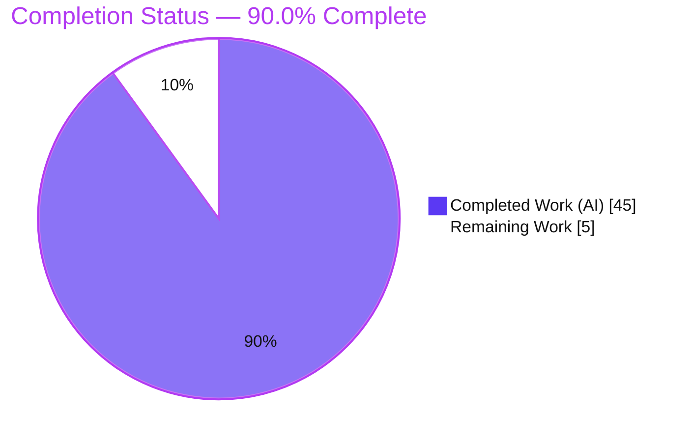
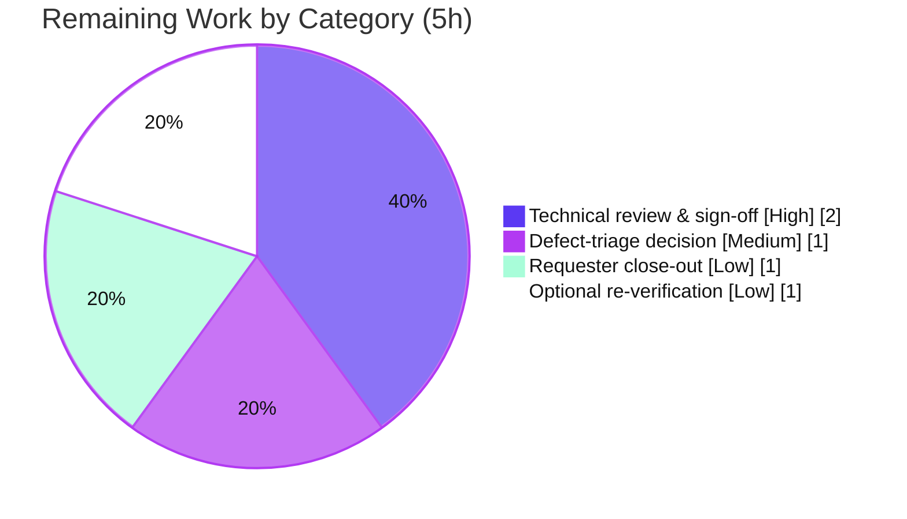

# Blitzy Project Guide

**Project:** SimpleLogin — Custom-Alias Signed-Suffix Validation & Creation-Limit Enforcement (Run-Verified Investigation)
**Branch:** `blitzy-45a67586-f857-4a8e-ba25-5dedc7607a35`  •  **Baseline:** `2cd6ee77`  •  **HEAD:** `3fbd577f`
**Deliverable:** `blitzy/documentation/app_2cd6ee777f8c.md`
**Task type:** Read-only bug-investigation / QnA documentation

---

## 1. Executive Summary

### 1.1 Project Overview

This project delivers a single, comprehensive, **run-verified diagnostic document** that explains — from observed runtime behavior, not code-reading alone — exactly how the SimpleLogin codebase validates signed suffixes and enforces creation limits during custom alias creation, and *why* an engineer observed "intermittent validation failures that don't match expected behavior." SimpleLogin is a Flask/SQLAlchemy email-alias service; the target audience is the debugging engineer and the platform team. Because the user constraint mandated a read-only repository ("keep the codebase unchanged"), the entire technical scope is a diagnostic write-up backed by verbatim evidence captured against the live API. No product behavior was changed; the document is the product.

### 1.2 Completion Status

The completion percentage is computed strictly from AAP-scoped hours (PA1 methodology): every hour traces to an Agent Action Plan requirement or a path-to-production activity for the deliverable.



> **Color key (Blitzy brand):** Completed / AI Work = Dark Blue **#5B39F3**; Remaining / Not Completed = White **#FFFFFF** (outlined in Violet-Black **#B23AF2** for visibility).

| Metric | Value |
|---|---|
| **Total Hours** | **50** |
| **Completed Hours (AI + Manual)** | **45** (45 AI + 0 Manual) |
| **Remaining Hours** | **5** |
| **Percent Complete** | **90.0%** |

**Calculation:** Completion % = Completed ÷ Total = 45 ÷ 50 = **90.0%**.

### 1.3 Key Accomplishments

- [x] **Single deliverable complete and committed** — `blitzy/documentation/app_2cd6ee777f8c.md` (2398 lines, ~211 KB), added on the assigned branch by `agent@blitzy.com`.
- [x] **Read-only constraint perfectly honored** — `git diff --stat 2cd6ee77..HEAD` = **1 file changed, +2398 / −0**; exactly one added path; no source/test/config/dependency file touched.
- [x] **All four objectives answered from observed output** — O1 (invalid/expired suffix behavior), O2 (rate-limit headers), O3 (successful-creation quota checks), O4 (execution-path trace).
- [x] **Root cause identified and reproduced end-to-end** — the `itsdangerous.BadSignature` collapse in `check_suffix_signature` that mislabels tampered suffixes as *expired* (412), confirmed on **both** v2 and v3 endpoints.
- [x] **Intermittency reproduced on identical input** — outcome distribution `6×201, 3×400, 2×409, 16×412, 2×429` captured byte-identical across independent runs, attributed to four concrete code-level causes.
- [x] **Exhaustively grounded** — 606 `file:line` citations and 52 verbatim runtime-evidence blocks; the only redaction is session-cookie values (CWE-532), with cookie structure preserved.
- [x] **Independently re-verified** — the full investigation was re-run on a live stack (Postgres 13 + Redis, exact locked dependency versions); the existing harness `tests/api/test_new_custom_alias.py` passed (10/10).

### 1.4 Critical Unresolved Issues

There are **no unresolved issues that block the deliverable**. The document is complete and verified. The items below are **latent product defects that the document surfaces and — per the read-only, diagnosis-only scope — deliberately does not fix**; they are recorded here for human triage, not as blockers to this deliverable.

| Issue | Impact | Owner | ETA |
|---|---|---|---|
| Tampered/garbage/empty suffixes are reported as *expired* (412) instead of *tampered* (400) — the 400 branch is effectively dead | Misleads developers debugging malformed tokens; documented, not fixed | Platform team (triage) | Pending triage decision (HT-2) |
| `POST /api/v2/alias/custom/new` returns unhandled **500** where v3 returns **400** for a malformed *prefix* (out-of-scope divergence) | Minor; noted for completeness; documented, not fixed | Platform team (triage) | Pending triage decision (HT-2) |

### 1.5 Access Issues

**No access issues identified.** The investigation ran entirely within the provided container using local services (Docker Postgres 13, Redis) and the in-repo canonical configuration (`tests/test.env`). No external repository permissions, service credentials, or third-party API access were required for the deliverable or its verification.

| System/Resource | Type of Access | Issue Description | Resolution Status | Owner |
|---|---|---|---|---|
| Source repository | Read/Write (branch) | None — clean working tree, deliverable committed | Resolved | Blitzy Agent |
| PostgreSQL 13 / Redis (local) | Local service | None — provisioned via Docker for verification | Resolved | Blitzy Agent |
| External APIs / third-party services | N/A | None required by this documentation task | N/A | — |

### 1.6 Recommended Next Steps

1. **[High]** Have a senior engineer review and sign off on the diagnostic findings (O1–O4 and the root-cause reasoning) against the verbatim evidence (HT-1).
2. **[Medium]** Make a go/no-go triage decision on the two documented-not-fixed behaviors (the tampered-vs-expired mislabel and the v2-500-vs-v3-400 divergence); file remediation tickets if approved (HT-2).
3. **[Low]** Deliver the document to the engineer who reported the intermittent failures, confirm it answers their four questions, and archive/link it in the issue tracker (HT-3).
4. **[Low]** Optionally re-run the canonical reproduction (per Section 9) to independently confirm the findings before acting on them (HT-4).

---

## 2. Project Hours Breakdown

### 2.1 Completed Work Detail

Every completed component traces to a specific AAP objective, methodology requirement, or path-to-production activity.

| Component | Hours | Description |
|---|---:|---|
| Canonical runtime setup & environment | 4 | Stand up Postgres 13 on :15432, Redis, `alembic upgrade head`, exact locked dependencies, `tests/test.env` config (path-to-production run environment; AAP §0.3.1) |
| O1 — Invalid/expired suffix investigation & root-cause | 6 | `itsdangerous` hierarchy probe, `check_suffix_signature` collapse, drive v2+v3 with expired/tampered/garbage/empty suffixes, verbatim capture ×2 runs (AAP O1) |
| O2 — Rate-limit header investigation | 2 | Complete header-set scan on 201 + all three 429s, via test client and a real gunicorn server with `curl -D -` (AAP O2) |
| O3 — Quota-check investigation | 4 | Count-quota gate before/after counts, token-bucket breach, success `AliasAuditLog` row (AAP O3) |
| O4 — Execution-path trace | 4 | Ordered decorator/validation chain, four enforcers, rejection-condition table, Mermaid flowchart, v3 differences, dashboard sibling (AAP O4) |
| Intermittency reproduction | 6 | 10-condition matrix ×2–3 runs on v2+v3, distribution capture, four code-level causes incl. the Redis-availability gate and the gunicorn burst window (AAP §0.1.2, §0.3.1) |
| Web-search corroboration | 1 | Flask-Limiter default-header behavior and the `itsdangerous` exception hierarchy against authoritative docs (AAP §0.2.2) |
| Technical writing & synthesis | 8 | The 2398-line document: TL;DR, methodology, §A–§G, 606 citations, 52 evidence blocks, coverage pass (AAP §0.4.2) |
| Revision cycles ×3 | 5 | Six code-review findings; Condition-8 count-cap disclosure + C.2 fix; RUN2/RUN3 appendix §H + v2-500 divergence note |
| Read-only discipline, cleanup & git hygiene | 1 | Probes kept in host `/tmp` (streamed via `docker exec`), removed on completion; clean `git status` verified (AAP §0.7.1) |
| Independent final validation re-run | 4 | Live-stack rebuild; all O1–O4 + Conditions 1–10 + E.0–E.5 reproduced; harness 10 passed; five production-readiness gates |
| **Total Completed** | **45** | **Matches Completed Hours in Section 1.2** |

### 2.2 Remaining Work Detail

Every remaining item is a path-to-production activity for the diagnostic document. Remediation of the documented defects is **out of scope** (AAP §0.5.2) and is therefore **excluded** from these totals.

| Category | Hours | Priority |
|---|---:|---|
| Technical review & sign-off of diagnostic findings | 2 | High |
| Triage decision on documented-not-fixed behaviors (mislabel; v2-500 divergence) | 1 | Medium |
| Deliver & close-out with the original requester | 1 | Low |
| Optional independent re-verification of the canonical reproduction | 1 | Low |
| **Total Remaining** | **5** | **Matches Remaining Hours in Section 1.2 and Section 7** |

### 2.3 Hours Reconciliation

| Check | Result |
|---|---|
| Section 2.1 total | 45 h |
| Section 2.2 total | 5 h |
| Section 2.1 + Section 2.2 | 50 h = Total Project Hours (Section 1.2) ✓ |
| Remaining hours (1.2 = 2.2 = 7) | 5 h = 5 h = 5 h ✓ |
| Completion % (45 ÷ 50) | 90.0% (consistent in 1.2, 7, 8) ✓ |

---

## 3. Test Results

All entries below originate exclusively from Blitzy's autonomous validation logs for this project (existing harness execution, behavioral reproduction matrix, static compilation, and the root-cause isolation probe). No external or fabricated tests are included.

| Test Category | Framework | Total Tests | Passed | Failed | Coverage % | Notes |
|---|---|---:|---:|---:|---|---|
| Existing API regression harness | pytest (`pytest.ci.ini`) | 10 | 10 | 0 | Targeted | `tests/api/test_new_custom_alias.py` run on live Postgres 13 + Redis; exercises v2/v3 create paths incl. `test_out_of_quota` and `test_too_many_requests` |
| Behavioral reproduction matrix (O1–O4 + intermittency) | Ephemeral probes over real HTTP (gunicorn + `curl`, Flask test client) | 10 conditions | 10 reproduced | 0 | O1–O4 100% | Conditions 1–10, each ≥2 identical-input runs (RUN1/RUN2/RUN3); verbatim evidence §A–§H |
| Static compilation check | `python -m py_compile` | 12 modules | 12 | 0 | N/A | All AAP-referenced modules compile clean (exit 0) |
| Root-cause isolation probe | `itsdangerous` 1.1.0 (isolated) | 1 | 1 | 0 | N/A | Confirms `SignatureExpired ⊂ BadTimeSignature ⊂ BadSignature`; `check_suffix_signature` collapse to `None` |
| **Totals** | — | **33** | **33** | **0** | — | 100% pass / reproduced across all autonomous checks |

**Observed status-code distribution (single identical-input matrix run):** `6×201, 3×400, 2×409, 16×412, 2×429` — byte-identical across RUN1 and RUN2.

> **Coverage note:** A whole-project coverage percentage was not computed by the autonomous validation (this is a read-only documentation task; the harness run was targeted at the alias-creation path). Coverage is therefore reported as "Targeted"/"N/A" rather than an invented figure.

---

## 4. Runtime Validation & UI Verification

The application was booted via its canonical entry point and driven end-to-end; every status class relevant to the four objectives was observed live.

**Runtime health**
- ✅ **Application boot** — `CONFIG=tests/test.env gunicorn wsgi:app` starts and serves HTTP.
- ✅ **PostgreSQL 13** on `:15432` — healthy; database migrated to head `32f25cbf12f6`.
- ✅ **Redis** reachable at `redis://localhost` — all four limiter layers wired and active (`server.py:163-165` → `app/redis_services.py:9-11`).

**API endpoint verification (both endpoints driven)**
- ✅ `POST /api/v2/alias/custom/new` — observed **201 / 400 / 409 / 412 / 429**.
- ✅ `POST /api/v3/alias/custom/new` — observed **201 / 400 / 409 / 412 / 429**.
- ✅ **O1** — expired/tampered/garbage/empty suffix → **412** `{"error":"Alias creation time is expired, please retry"}` + `LOG.w` (`new_custom_alias.py:72` v2 / `:187` v3); the tampered-as-expired mislabel reproduced on both endpoints.
- ✅ **O2** — programmatic header scan on a 201 and on all three 429s returned **NONE** (no `X-RateLimit-*`, no `Retry-After`); 429 body is JSON `{"error":"Rate limit exceeded"}`.
- ✅ **O3** — count-quota gate refused at the configured cap (201, 201, **400**); token-bucket breach `→ 11/10` with `LOG.i` (`rate_limiter.py:33`); success wrote an `AliasAuditLog` `action='create'` row.
- ✅ **O4** — all four creation-limit enforcers exercised; rejection conditions (prefix/suffix mismatch → 400, duplicate → 409) reproduced.

**UI verification**
- ⚠ **Not applicable** — the deliverable is a documentation artifact; there is no product UI in scope. AAP §0.8 confirms no Figma frames/component library were provided, so the Design System Alignment Protocol does not apply. The dashboard web path (`app/dashboard/views/custom_alias.py`) is acknowledged only as a sibling that reuses the same validator (§D.3).

---

## 5. Compliance & Quality Review

Each AAP deliverable and constraint is cross-mapped to its quality benchmark and verification evidence. Fixes applied during autonomous validation are noted; there were no code fixes (read-only task), but three documentation revision cycles hardened the evidence.

| Benchmark / Requirement | Status | Progress | Evidence |
|---|---|---|---|
| **D1 — Single answer document created** | ✅ Pass | 100% | `blitzy/documentation/app_2cd6ee777f8c.md`, committed |
| **O1 — Invalid/expired suffix behavior** | ✅ Pass | 100% | §A.1–A.5; 412 mislabel reproduced v2+v3 |
| **O2 — Rate-limit headers** | ✅ Pass | 100% | §B.1–B.2; header scan → NONE |
| **O3 — Successful-creation quota checks** | ✅ Pass | 100% | §C.1–C.3; count gate + token bucket + audit row |
| **O4 — Execution-path trace** | ✅ Pass | 100% | §D.1–D.6; chain, 4 enforcers, table, flowchart |
| **Intermittency reproduced on identical input** | ✅ Pass | 100% | §E.0–E.5; distribution byte-identical across runs |
| **Both v2 and v3 endpoints covered** | ✅ Pass | 100% | v2 & v3 blocks throughout §A–§H |
| **Complete, unedited evidence** | ✅ Pass | 100% | 52 verbatim blocks; only cookie values redacted (CWE-532) |
| **Canonical config + effective values + ≥2 runs** | ✅ Pass | 100% | Effective-config block; `MAX_NB_EMAIL_FREE_PLAN=3`; RUN1/2/3 |
| **Run-first methodology + real entry points** | ✅ Pass | 100% | §Methodology; §F.1 exact commands |
| **Grounded (file:line) + rationale** | ✅ Pass | 100% | 606 citations; reasoning in every subsection |
| **Coverage pass over every named item** | ✅ Pass | 100% | §G checklist |
| **Web-search corroboration** | ✅ Pass | 100% | itsdangerous §A.2; Flask-Limiter §B.1 |
| **C1 — Read-only source** | ✅ Pass | 100% | `git diff` = +2398 / −0, one added file |
| **C2 — Temp artifacts removed** | ✅ Pass | 100% | Clean `git status`; probes in host `/tmp` |
| **C3 — Documentation-only output** | ✅ Pass | 100% | Only the doc added |
| **C4 — No remediation (document, not fix)** | ✅ Pass | 100% | Two behaviors documented-not-fixed |
| **Human review & sign-off** | ⬜ Pending | 0% | HT-1 (remaining) |
| **Defect-triage decision** | ⬜ Pending | 0% | HT-2 (remaining) |

**Overall compliance:** all 17 AAP-scoped benchmarks **Pass**; the two pending items are human path-to-production activities, not deliverable gaps.

---

## 6. Risk Assessment

| Risk | Category | Severity | Probability | Mitigation | Status |
|---|---|---|---|---|---|
| Tampered/garbage/empty suffix reported as *expired* (412) — 400 branch effectively dead | Technical | Medium | High (confirmed to exist) | Documented with root cause + file:line; file remediation ticket (HT-2). Remediation out-of-scope here | Documented / Open |
| `POST /api/v2` returns unhandled 500 where v3 returns 400 for a malformed prefix | Technical | Low–Medium | Medium | Documented as out-of-scope divergence; triage decision (HT-2) | Documented / Open |
| Evidence reproducibility depends on exact pinned versions (itsdangerous 1.1.0, Flask-Limiter 1.4, werkzeug 1.0.1) | Technical | Low | Low | Document pins exact locked versions and canonical commands | Mitigated |
| Evidence blocks could leak live credentials | Security | Low | Low | Session-cookie values redacted (CWE-532); structure preserved | Mitigated |
| Document reveals internal validation/limit logic if shared externally | Security | Low | Low | Keep distribution internal | Open (distribution control) |
| Finding not acted upon → mislabel persists in production | Operational | Low | Medium | HT-1 sign-off + HT-2 triage drive follow-through | Open |
| Re-verification requires the canonical runtime (Postgres + Redis + exact deps) | Operational | Low | Low | §F.1 exact commands + Section 9 development guide | Mitigated |
| Deliverable causing a production regression | Deployment | Negligible | Negligible | Read-only, additive-only (+2398 / −0); no runtime behavior changed | Mitigated |
| Redis-availability gate silently disables 2 of 4 limiters when Redis is down | Integration | Low (informational) | N/A | Documented product behavior (§E.4); no task action required | Documented |

**Overall posture:** As a read-only, additive-only documentation deliverable, the risk of the deliverable itself causing harm is essentially zero. Residual risk consists of latent product defects the document *surfaces* but (correctly, per scope) does not fix, plus ensuring the findings are triaged.

---

## 7. Visual Project Status


> **Integrity:** "Remaining Work" = **5 h**, equal to Section 1.2 Remaining Hours and the Section 2.2 "Hours" total. "Completed Work" = **45 h**, equal to Section 1.2 Completed Hours. Colors: Completed = **#5B39F3**, Remaining = **#FFFFFF**.

**Remaining hours by category (Section 2.2)**



**Priority distribution of remaining work:** High = 2 h (40%) · Medium = 1 h (20%) · Low = 2 h (40%).

---

## 8. Summary & Recommendations

**Achievements.** The project delivered a complete, exhaustively grounded, independently run-verified answer to a four-part debugging question, while honoring a strict read-only constraint. The document identifies the true root cause of the reported "failures that don't match expected behavior": `check_suffix_signature` catches the base `itsdangerous.BadSignature` class and collapses every suffix failure mode (expired, tampered, garbage, empty) to `None`, so the endpoint returns **412 "Alias creation time is expired"** — including for genuinely tampered tokens — while the intended **400 "Tampered suffix"** branch is effectively dead. It further shows that no rate-limit headers are emitted, enumerates the two quota checks and exactly what each logs, traces the four-layer creation-limit chain, and reproduces the intermittency on identical input with a byte-identical outcome distribution attributed to four concrete code-level causes.

**Remaining gaps.** No AAP-scoped work remains. The **5 remaining hours (10%)** are entirely human path-to-production activities: technical review and sign-off, a triage decision on the two documented-not-fixed behaviors, close-out with the original requester, and optional independent re-verification. Actual code remediation of the surfaced defects is explicitly out of scope for this task.

**Critical path to production.** Review & sign-off (HT-1) → triage decision (HT-2) → requester close-out (HT-3). Optional re-verification (HT-4) can run in parallel with review.

**Success metrics.** 100% of AAP-scoped requirements delivered; 606 file:line citations; 52 verbatim evidence blocks; existing harness 10/10 passed; read-only constraint upheld (+2398 / −0).

**Production readiness.** The deliverable is **production-ready as a diagnostic document**. It changes no runtime behavior and carries negligible deployment risk. Overall the project is **90.0% complete** (45 h of 50 h), with the remaining 10% being the mandatory human acceptance gate rather than any engineering deficit.

| Metric | Value |
|---|---|
| AAP-scoped completion | 90.0% |
| Completed / Total hours | 45 / 50 |
| AAP requirements delivered | 17 / 17 (100%) |
| Autonomous checks passed | 33 / 33 |
| Files changed vs baseline | 1 (added), +2398 / −0 |

---

## 9. Development Guide

This guide reproduces the canonical runtime used for the investigation and the read-only checks that verify the deliverable. Commands were tested during validation.

### 9.1 System Prerequisites
- **Docker** 28.x (for PostgreSQL 13 and Redis).
- **Python** 3.10.x (the canonical runtime used Python 3.10.18), managed by **Poetry**.
- **git** 2.x.
- Backing services: **PostgreSQL 13** and **Redis** (run via Docker below).

### 9.2 Environment Setup
```bash
# From the repository root, on the assigned branch
git rev-parse --abbrev-ref HEAD          # -> blitzy-45a67586-f857-4a8e-ba25-5dedc7607a35

# The canonical test configuration (do not edit)
export CONFIG=tests/test.env
# Effective values loaded from tests/test.env + app/config.py defaults:
#   MAX_NB_EMAIL_FREE_PLAN=3     (tests/test.env:13; code default is 5)
#   MEM_STORE_URI=redis://localhost   (tests/test.env:78)
#   DISABLE_RATE_LIMIT / DISABLE_ALIAS_SUFFIX  -> unset (False)  => limiters + suffix signing ACTIVE
#   ALIAS_LIMIT="100/day;50/hour;5/minute"  (app/config.py:448)
```

### 9.3 Dependency Installation
```bash
# Install the exact locked versions (Poetry-managed)
poetry install
# Key locked versions (from poetry.lock):
#   itsdangerous 1.1.0 | flask 1.1.2 | flask-limiter 1.4 | werkzeug 1.0.1 | limits 1.5.1 | gunicorn 20.0.4
```

### 9.4 Application / Stack Startup
```bash
# 1) PostgreSQL 13 on host port 15432 (mirrors scripts/run-test.sh)
docker rm -f sl-test-db 2>/dev/null || true
docker run -d --name sl-test-db \
  -e POSTGRES_PASSWORD=test -e POSTGRES_USER=test -e POSTGRES_DB=test \
  -p 15432:5432 postgres:13
sleep 3

# 2) Redis (so all four limiter layers are active)
docker rm -f sl-redis 2>/dev/null || true
docker run -d --name sl-redis -p 6379:6379 redis

# 3) Migrate the database to head
CONFIG=tests/test.env poetry run alembic upgrade head

# 4) Run the live server (for real-HTTP reproduction of the burst 429)
CONFIG=tests/test.env poetry run gunicorn wsgi:app -b 127.0.0.1:7788 -w 1 --timeout 60
```

### 9.5 Verification Steps
```bash
# A) Read-only integrity of the deliverable
git status --porcelain                                   # expect: empty (clean tree)
git diff --name-status 2cd6ee77..HEAD                    # expect: A  blitzy/documentation/app_2cd6ee777f8c.md
wc -l blitzy/documentation/app_2cd6ee777f8c.md           # expect: 2398

# B) Existing regression harness (needs the stack from 9.4)
CONFIG=tests/test.env poetry run pytest -c pytest.ci.ini tests/api/test_new_custom_alias.py
# expect: 10 passed

# C) Static compile of the AAP-referenced modules (no DB needed)
python -m py_compile app/alias_suffix.py app/api/views/new_custom_alias.py app/models.py \
  app/rate_limiter.py app/parallel_limiter.py app/extensions.py app/config.py   # expect: exit 0
```

### 9.6 Example Usage — Reproduce the O1 Mislabel
```bash
# With the gunicorn server from 9.4 running and a valid API key + a fresh signed suffix
# (mint suffixes exactly as the app does, via get_alias_suffixes / GET /api/v4|v5/alias/options):

# Tampered suffix (mutate one character of a valid signed_suffix) -> observe 412, NOT 400:
curl -s -D - -X POST http://127.0.0.1:7788/api/v2/alias/custom/new \
  -H "Authentication: <ApiKey.code>" -H "Content-Type: application/json" \
  -d '{"alias_prefix":"demo","signed_suffix":"<TAMPERED_suffix>"}'
# Expected: HTTP/1.1 412 ; body {"error":"Alias creation time is expired, please retry"}
#           NO X-RateLimit-* / Retry-After headers  (answers O2)

# Navigate the document: §A (O1) -> §B (O2) -> §C (O3) -> §D (O4) -> §E (intermittency) -> §G (coverage)
```

### 9.7 Troubleshooting
- **Redis unreachable → limiters silently no-op.** When `lock_redis` is `None` (`app/rate_limiter.py:28`), the token bucket and `parallel_limiter` become no-ops; start Redis (9.4) to keep all four layers active.
- **Cookie session rejected by the test client.** flask_login `session_protection="strong"` can block test-client cookie sessions; use an **API-key** header (`Authentication: <ApiKey.code>`) — the same handler code path.
- **Flask-Limiter appears not to trigger under the test client.** Reusing a single `app.app_context()` across many test-client calls suppresses the limiter; capture burst-429 evidence via the **real gunicorn server** (9.4), as the document does.
- **Port 15432 already in use.** `docker rm -f sl-test-db` and re-run step 1 of 9.4.
- **`alembic upgrade head` fails to connect.** Ensure the Postgres container is healthy (`sleep 3` after start) and `CONFIG=tests/test.env` is exported.

---

## 10. Appendices

### Appendix A — Command Reference
| Purpose | Command |
|---|---|
| Confirm branch | `git rev-parse --abbrev-ref HEAD` |
| Confirm clean tree | `git status --porcelain` |
| Confirm sole added file | `git diff --name-status 2cd6ee77..HEAD` |
| Diff stat vs baseline | `git diff --stat 2cd6ee77..HEAD` |
| Start Postgres 13 | `docker run -d --name sl-test-db -e POSTGRES_PASSWORD=test -e POSTGRES_USER=test -e POSTGRES_DB=test -p 15432:5432 postgres:13` |
| Start Redis | `docker run -d --name sl-redis -p 6379:6379 redis` |
| Migrate DB | `CONFIG=tests/test.env poetry run alembic upgrade head` |
| Run targeted tests | `CONFIG=tests/test.env poetry run pytest -c pytest.ci.ini tests/api/test_new_custom_alias.py` |
| Run live server | `CONFIG=tests/test.env poetry run gunicorn wsgi:app -b 127.0.0.1:7788 -w 1 --timeout 60` |
| Static compile check | `python -m py_compile app/alias_suffix.py app/api/views/new_custom_alias.py` |

### Appendix B — Port Reference
| Service | Port | Notes |
|---|---|---|
| PostgreSQL 13 | `15432` (host) → `5432` (container) | Per `scripts/run-test.sh` |
| Redis | `6379` | Enables all four limiter layers |
| Gunicorn (reproduction server) | `7788` | Used for real-HTTP burst-429 evidence |

### Appendix C — Key File Locations
| Path | Role |
|---|---|
| `blitzy/documentation/app_2cd6ee777f8c.md` | **The deliverable** (only added file) |
| `app/alias_suffix.py` | `check_suffix_signature` (L37-42) — root cause; `verify_prefix_suffix` (L45-91) |
| `app/api/views/new_custom_alias.py` | v2 (L28-112) & v3 (L115-235) handlers; 412/400 mapping (L70-76) |
| `app/models.py` | `can_create_new_alias` (L867-884); `Alias.create` token bucket (L1628-1692) |
| `app/rate_limiter.py` | `check_bucket_limit` (L19-42) |
| `app/parallel_limiter.py` | Concurrency `lock` (L19-73) |
| `app/extensions.py` | `Limiter(key_func=__key_func)` (L23) |
| `app/config.py` | `ALIAS_LIMIT` (L448); `MAX_NB_EMAIL_FREE_PLAN` (L121-124) |
| `server.py` | Limiter/Redis wiring (L163-167); custom 429 handler (L362-372) |
| `tests/api/test_new_custom_alias.py` | Existing harness (10 tests) |
| `tests/test.env` | Canonical config (`MAX_NB_EMAIL_FREE_PLAN=3`, `MEM_STORE_URI`) |
| `scripts/run-test.sh` | Canonical run recipe |

### Appendix D — Technology Versions
| Component | Version | Source |
|---|---|---|
| Python | 3.10.18 (canonical runtime); repo targets `^3.10` | `pyproject.toml` |
| Flask | 1.1.2 | `poetry.lock` |
| Flask-Limiter | 1.4 | `poetry.lock` |
| itsdangerous | 1.1.0 | `poetry.lock` |
| werkzeug | 1.0.1 | `poetry.lock` |
| limits | 1.5.1 | `poetry.lock` |
| redis (client) | 4.6.0 | `poetry.lock` |
| gunicorn | 20.0.4 | `poetry.lock` |
| PostgreSQL | 13 | `scripts/run-test.sh` |

### Appendix E — Environment Variable Reference
| Variable | Effective value | Source | Effect |
|---|---|---|---|
| `CONFIG` | `tests/test.env` | run recipe | Selects the canonical test configuration |
| `MAX_NB_EMAIL_FREE_PLAN` | `3` | `tests/test.env:13` (default 5 at `config.py:121-124`) | Free-plan alias count cap |
| `MEM_STORE_URI` | `redis://localhost` | `tests/test.env:78` | Wires Redis into both limiters |
| `DISABLE_RATE_LIMIT` | unset (`False`) | default | Rate limiting active |
| `DISABLE_ALIAS_SUFFIX` | unset (`False`) | default | Suffix signing active |
| `ALIAS_LIMIT` | `100/day;50/hour;5/minute` | `config.py:448` | Flask-Limiter budget for the endpoint |
| `CUSTOM_ALIAS_SECRET` | `secretcustom_alias` | `config.py:201` (= `FLASK_SECRET + "custom_alias"`) | Signs/verifies suffixes |
| `FLASK_SECRET` | `secret` | `tests/test.env:20` | Base secret |

### Appendix F — Developer Tools Guide
- **Reproduce O1 (mislabel):** POST a tampered/garbage/empty `signed_suffix` to v2 or v3 → expect **412** (not 400). See Section 9.6.
- **Answer O2 (headers):** add `-D -` to `curl` (or scan `response.headers`) on a 201 and on each 429 → expect **no** `X-RateLimit-*` / `Retry-After`.
- **Observe O3 (quota):** create aliases up to `MAX_NB_EMAIL_FREE_PLAN` then one more → **400** with `LOG.d`; for the token bucket, exceed 10 creations in 900 s → **429** with `LOG.i "Rate limit hit ..."`.
- **Trigger the burst 429 (O4/intermittency):** send >5 POSTs/minute over the gunicorn server → **429** JSON `{"error":"Rate limit exceeded"}`, no headers.
- **Mint valid suffixes the app's way:** `GET /api/v4|v5/alias/options` (`app/api/views/alias_options.py:69,140`) or `get_alias_suffixes()` — never a bypass hook.

### Appendix G — Glossary
| Term | Meaning |
|---|---|
| **Signed suffix** | An alias domain suffix signed by `itsdangerous.TimestampSigner` (`app/alias_suffix.py:11`); valid for `max_age=600` s |
| **`check_suffix_signature`** | Validator that `unsign`s a suffix and returns `None` on any `BadSignature` (the root-cause collapse) |
| **`TimestampSigner`** | itsdangerous signer that embeds a timestamp; raises `SignatureExpired` past `max_age` |
| **Count quota** | `User.can_create_new_alias()` — free-plan cap on total aliases |
| **Token bucket** | Per-user rolling-window limiter inside `Alias.create()` via `rate_limiter.check_bucket_limit` |
| **`parallel_limiter`** | Per-user concurrency lock; returns 429 when two alias-creation requests overlap |
| **Flask-Limiter** | Per-route rate limiter (`@limiter.limit(ALIAS_LIMIT)`); default `RATELIMIT_HEADERS_ENABLED=False` |
| **Redis-availability gate** | When `lock_redis` is `None`, the token bucket and concurrency lock silently become no-ops |
| **`AliasAuditLog`** | Audit table; a successful creation writes an `action='create'` row ("New alias created") |

---

*Completion is measured strictly against AAP-scoped and path-to-production work (PA1). The single AAP deliverable is complete, committed, and independently run-verified; the remaining 10% (5 h) is the human review/triage/close-out gate. Colors applied per Blitzy brand: Completed = #5B39F3, Remaining = #FFFFFF.*