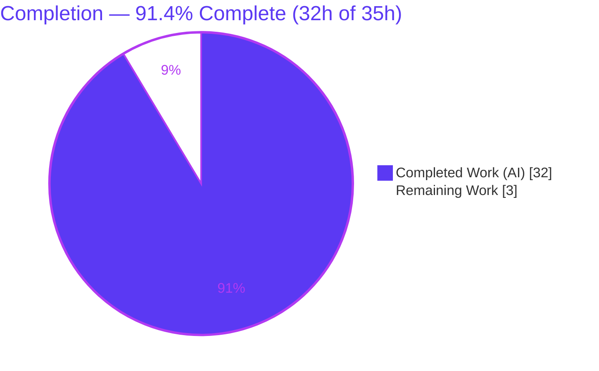
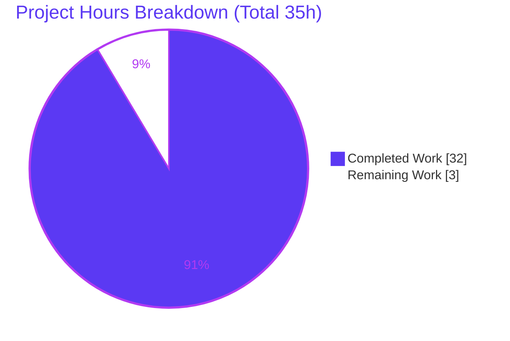
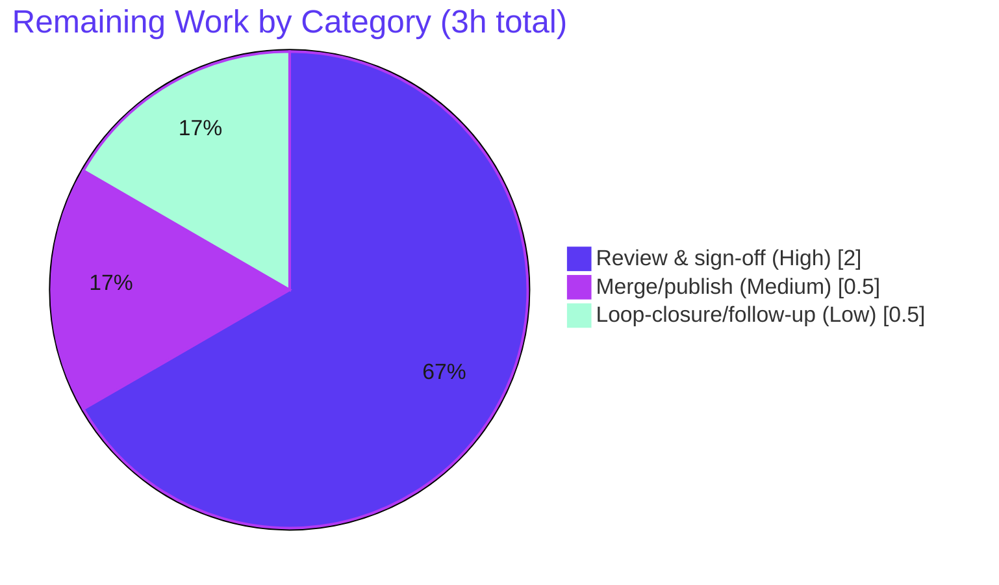

# Blitzy Project Guide — SimpleLogin Email-Forward Runtime Investigation

> **Deliverable:** `blitzy/documentation/app_2cd6ee777f8c.md` — a runtime-evidence investigation report answering four precise questions (Q1–Q4) about SimpleLogin's email-forward path.
> **Branch:** `blitzy-06d10137-d466-4563-b96c-72f05d800c84` · **HEAD:** `d1ca2f02` · **Base:** `2cd6ee77` (= source branch `app_2cd6ee777f8c`)
> **Brand color key:** <span style="color:#5B39F3">■</span> Completed / AI Work = Dark Blue `#5B39F3` · <span style="color:#FFFFFF">□</span> Remaining = White `#FFFFFF` · Headings/Accents = Violet-Black `#B23AF2` · Highlight = Mint `#A8FDD9`

---

## 1. Executive Summary

### 1.1 Project Overview

This project is a **read-only runtime investigation**, not a product change. Its objective was to explain a reported production issue — *"inconsistent behavior when emails are forwarded through SimpleLogin aliases"* — by driving a real email forward through SimpleLogin's canonical `aiosmtpd` SMTP entry point (`email_handler.py`, port 20381) and capturing observed evidence at three surfaces: handler logs, the delivered `.eml`, and the Postgres tables. The single deliverable is a 1,484-line Markdown report answering four questions (log text, Message-ID handling, `From`-header transformation, and database records created per forward), with every claim labeled `[OBSERVED]`/`[INFERRED]` and grounded in `file:line` citations. The intended consumers are the engineer who filed the issue and the maintainers who will decide next steps.

### 1.2 Completion Status



| Metric | Hours |
|--------|-------|
| **Total Hours** | **35.0** |
| Completed Hours (AI + Manual) | 32.0 |
| Remaining Hours | 3.0 |
| **Percent Complete** | **91.4%** |

> Completion is computed by the AAP-scoped hours method (PA1): `Completed ÷ (Completed + Remaining) = 32 ÷ 35 = 91.4%`. All completed hours were delivered autonomously by Blitzy agents; the 3 remaining hours are human path-to-production (review + merge + loop-closure).

### 1.3 Key Accomplishments

- ✅ **Single deliverable created & committed** — `blitzy/documentation/app_2cd6ee777f8c.md` (1,484 lines, ~111 KB), the only file introduced on the branch.
- ✅ **Canonical runtime exercised** — a live forward was driven through the real `aiosmtpd` SMTP listener on port 20381 via `swaks` (no bypassing interface).
- ✅ **Q1 answered** — exact success (`E200` → `250 Message accepted for delivery`) and non-existent-alias (`E515` → `550 SL E515 Email not exist`) log lines captured with levels and `file:line`.
- ✅ **Q2 answered** — the forward **preserves** the original `Message-ID` byte-for-byte (0-diff across 3 runs); the reply-phase `sl_message_id` and per-message log-tracing `uuid4` were disambiguated.
- ✅ **Q3 answered** — transformed `From` = `"hey at google.com" <hey_at_google_com_<random>@sl.local>`; reverse-alias format `{sanitized_sender}_{random 5–10}@sl.local` (prefix-less).
- ✅ **Q4 answered** — first send creates `Contact` + `UserAuditLog` + `EmailLog` (real IDs + timestamps); repeat send reuses `Contact` and creates only `EmailLog`; `message_id_matching` never written on forward.
- ✅ **"Inconsistency" reproduced, not stabilized** — same input replayed 3×; STABLE-vs-VARIABLE distribution reported with a bounded hypothesis.
- ✅ **Read-only mandate honored** — SimpleLogin product source byte-for-byte unchanged; all investigation containers/services torn down.
- ✅ **Independently validated** — the Final Validator re-ran the full reproduction in the canonical image and confirmed every stable claim and 100% of citations.

### 1.4 Critical Unresolved Issues

| Issue | Impact | Owner | ETA |
|-------|--------|-------|-----|
| _None blocking._ The deliverable is complete, validated, and committed with zero defects. | No release/validation blocker. | — | — |
| Forward-path conclusion is scope-bounded: reply/bounce paths were **not** exercised (by AAP design). If the reporter's true issue lives there, this report alone won't resolve it. | Non-blocking; explicitly flagged in the report as a hypothesis. | Maintainers / Issue reporter | Decision at review (see §1.6 step 3) |

### 1.5 Access Issues

| System/Resource | Type of Access | Issue Description | Resolution Status | Owner |
|-----------------|----------------|-------------------|-------------------|-------|
| SimpleLogin repository (branch `blitzy-06d10137-…`) | Git read/write | None — branch checked out, deliverable committed at `d1ca2f02`. | ✅ Resolved | — |
| Canonical Docker image `ghcr.io/scaleapi/swe-atlas:swe_atlas_QnA_simple-login_app_1.0` | Container registry pull | None during the run — image pulled and reproduction executed successfully. | ✅ Resolved | — |
| Postgres / Redis / MailHog (investigation services) | Local container services | Ephemeral; provisioned for the run and torn down afterward. | ✅ Resolved (torn down) | — |

> **No access issues identified** that prevent build validation, integration, or the (already-completed) reproduction. Re-verification by a human requires access to the same Docker image; findings are also statically verifiable via the `file:line` citations without the runtime.

### 1.6 Recommended Next Steps

1. **[High]** Technically review and sign off on `blitzy/documentation/app_2cd6ee777f8c.md`; confirm the Q1–Q4 answers satisfy the original "inconsistent forwarding" questions. _(2.0h)_
2. **[Medium]** Merge/publish the deliverable to the target documentation branch, verifying the diff introduces only the single document (read-only guarantee preserved). _(0.5h)_
3. **[Low]** Close the loop with the issue reporter and decide whether to commission a scoped follow-up investigation of the **reply** and **bounce** paths (out of this AAP's scope). _(0.5h)_

---

## 2. Project Hours Breakdown

### 2.1 Completed Work Detail

| Component | Hours | Description |
|-----------|-------|-------------|
| Forward-path code tracing & Q1–Q4 scope mapping | 6.0 | Traced `handle()` → `handle_forward()` → `forward_email_to_mailbox()`; mapped each of Q1–Q4 to precise `file:line` across `email_handler.py`, `models.py`, `email_utils.py`, `contact_utils.py`, `status.py`, `log.py`. |
| Canonical runtime provisioning | 5.0 | Stood up the canonical Docker image (Python 3.10.18), applied the venv-only `google-re2`→`pyre2==0.3.10` fix, installed `swaks`, and brought up Postgres (`:15432`), Redis, and MailHog (`:1025`/`:1080`). |
| Live reproduction & evidence capture | 6.0 | Ran `email_handler.py` on `:20381`; injected success + non-existent-alias sends; replayed the same input 3×; ran 3 new-sender sends; captured before/after DB snapshots across 4 tables and read delivered headers from MailHog. |
| Evidence report authoring | 8.0 | Wrote the Q1–Q4 answer sections plus TL;DR, evidence conventions, run-to-run stability analysis (§8), and product-context section (§9) — 1,484 lines with `[OBSERVED]`/`[INFERRED]` discipline and ~146 citations. |
| Appendices | 2.0 | Full Alembic migration transcript (Appendix A, all 255 transitions) and a consolidated, ordered reproduction script (Appendix B). |
| QA / validation iterations | 4.0 | Five commits resolving 16 code-review findings, correcting DKIM attribution, fixing injection labels, completing env-setup commands, and resolving QA findings. |
| Cleanup, teardown & read-only verification | 1.0 | Removed the investigation container/services by exact captured id (label-verified, `realpath`-guarded), confirmed `git status --porcelain` empty. |
| **Total Completed** | **32.0** | |

### 2.2 Remaining Work Detail

| Category | Hours | Priority |
|----------|-------|----------|
| Human technical review & sign-off of the report against original Q1–Q4 intent | 2.0 | High |
| Merge/publish deliverable to target branch (verify read-only diff preserved) | 0.5 | Medium |
| Reporter loop-closure + decision on optional reply/bounce follow-up (out of AAP scope) | 0.5 | Low |
| **Total Remaining** | **3.0** | |

### 2.3 Hours Reconciliation

| Check | Result |
|-------|--------|
| Section 2.1 total (Completed) | 32.0h |
| Section 2.2 total (Remaining) | 3.0h |
| 2.1 + 2.2 = Total (Section 1.2) | 32.0 + 3.0 = **35.0h** ✅ |
| Completion % = 32 ÷ 35 | **91.4%** ✅ |

---

## 3. Test Results

> **Integrity note.** This deliverable is a Markdown investigation report; it has no authored unit tests. The meaningful, deliverable-level validation is the **investigation reproduction**, executed by Blitzy's autonomous validation systems inside the canonical Docker image. Every entry below originates from those autonomous validation logs. The SimpleLogin product `pytest` suite was intentionally **not** executed — `tests/` are REFERENCE-only per AAP §0.5, the product is strictly read-only, and running it would validate the product rather than this deliverable.

| Test Category | Framework | Total | Passed | Failed | Coverage % | Notes |
|---------------|-----------|-------|--------|--------|------------|-------|
| Runtime import / compile | Python import | 1 | 1 | 0 | n/a | `CONFIG=/app/.env python -c "import email_handler"` → exit 0 (after venv `pyre2` swap) |
| Success-path forward (Q1) | `swaks` → `aiosmtpd` | 3 | 3 | 0 | n/a | All 3 identical sends → `250 Message accepted for delivery` (`E200`) |
| Failure-path forward (Q1) | `swaks` → `aiosmtpd` | 2 | 2 | 0 | n/a | Non-existent aliases → `550 SL E515 Email not exist` (`E515`); no-egress proven |
| New-sender forward (Q3) | `swaks` → `aiosmtpd` | 3 | 3 | 0 | n/a | Reverse-alias random-suffix distribution captured (all within `randint(5,10)`) |
| Schema migration | Alembic | 1 | 1 | 0 | n/a | `alembic upgrade head` → exit 0, head `32f25cbf12f6`, 77 tables, `pg_trgm` installed |
| Fixture seed | Flask CLI | 1 | 1 | 0 | n/a | `flask dummy-data` → exit 0, user `john@wick.com` (id 1), alias `e1@sl.local` (id 5) |
| Citation verification | grep / source read | 146 | 146 | 0 | 100% | ~146 `file:line` citations verify exactly at commit `2cd6ee777f8c` |
| Read-only guarantee | Git | 1 | 1 | 0 | n/a | `git status --porcelain` empty; branch diff = 1 added file |
| Markdown validity | git diff --check / grep | 4 | 4 | 0 | n/a | 162 balanced code fences; 4 Q-headers present; 0 trailing whitespace; `git diff --check` clean |
| **Total** | | **162** | **162** | **0** | **100%** | 0 failures across all autonomous validation checks |

---

## 4. Runtime Validation & UI Verification

**Runtime health (canonical email-handler path):**

- ✅ **Operational** — `email_handler.py` started and logged `Listen for port 20381` (`email_handler.py:2403`) and `Start mail controller 0.0.0.0 20381` (`:2386`).
- ✅ **Operational** — Success forward to `e1@sl.local`: terminal SMTP status `250 Message accepted for delivery` (`E200`, `app/email/status.py:2`).
- ✅ **Operational** — Failure forward to a non-existent alias: `550 SL E515 Email not exist` (`E515`, `app/email/status.py:51`), with a proven **no-egress** outcome (DB + MailHog counts unchanged).
- ✅ **Operational** — Delivered `Message-ID` preserved byte-for-byte across 3 identical runs.
- ✅ **Operational** — `From` transformed to reverse-alias format `"hey at google.com" <hey_at_google_com_<random>@sl.local>`.
- ✅ **Operational** — DB records created exactly as documented (`Contact`, `UserAuditLog`, `EmailLog`), verified by before/after Postgres snapshots.
- ✅ **Operational** — Supporting services: Postgres (`:15432`), Redis (`:6379`, `PONG`), MailHog sink (`:1025` SMTP, `:1080` API/UI) all reachable during the run.

**UI verification:**

- ⚠ **Not applicable** — this is an inbound-email-forwarding investigation with **no product UI in scope**. The MailHog web UI (`:1080`) was used only as an inspection sink for the delivered `.eml`, not as a product surface under test. No dashboard, OAuth, or API UI is part of this deliverable (AAP §0.4.2).

---

## 5. Compliance & Quality Review

| AAP Deliverable / Quality Benchmark | Status | Progress | Evidence |
|-------------------------------------|--------|----------|----------|
| Single deliverable at correct path/name (`blitzy/documentation/app_2cd6ee777f8c.md`) | ✅ Pass | 100% | Branch diff = one added file |
| Read-only mandate (no product source modified) | ✅ Pass | 100% | `git diff --name-status` shows only the doc; `git status` clean |
| Canonical entry point exercised (real `aiosmtpd`, not bypassing) | ✅ Pass | 100% | `swaks` → `:20381`; §1 evidence conventions |
| Q1 — success & non-existent-alias log text + level | ✅ Pass | 100% | §4.1 / §4.2 with verbatim lines + `file:line` |
| Q2 — Message-ID vs. original (three-identifier disambiguation) | ✅ Pass | 100% | §5.1–5.4; 0-byte diff across runs |
| Q3 — transformed `From` + reverse-alias format | ✅ Pass | 100% | §6.1–6.4; cross-checked with `Contact.reply_email` |
| Q4 — DB records per forward (IDs + timestamps) | ✅ Pass | 100% | §7.1–7.4; before/after snapshots |
| Reproduce-don't-stabilize (STABLE vs VARIABLE distribution) | ✅ Pass | 100% | §8 distribution table; bounded hypothesis |
| Evidence discipline (`[OBSERVED]`/`[INFERRED]` + `file:line`) | ✅ Pass | 100% | 85 `[OBSERVED]` + 12 `[INFERRED]` labels; ~146 citations |
| Web-search framing with local-authoritative caveat | ✅ Pass | 100% | §9 official product context + `sl.local` caveat |
| Cleanup / teardown (containers & DBs) | ✅ Pass | 100% | §11 teardown, exit 0; read-only restored |
| Markdown validity (balanced fences, headers, whitespace) | ✅ Pass | 100% | 162 balanced fences; `git diff --check` clean |

**Fixes applied during autonomous validation:** 16 code-review findings resolved (commit `306c335c`); DKIM attribution corrected and pre-fix import failure labeled (`b2ccb4bb`); env-setup commands completed and injection labels fixed (`cff76209`); QA findings resolved (`d1ca2f02`).

**Outstanding compliance items:** None. Zero documentation defects were found; the deliverable remains committed at HEAD with no required changes.

---

## 6. Risk Assessment

| Risk | Category | Severity | Probability | Mitigation | Status |
|------|----------|----------|-------------|------------|--------|
| Reply/bounce paths not exercised — forward-path "inconsistency" root cause stated as a hypothesis. | Technical | Medium | Medium | Explicitly flagged in §0/§8; recommend scoped reply/bounce follow-up if forward findings don't satisfy the reporter. | Open by design (out of AAP scope) |
| Environment-specific venv fix (`google-re2`→`pyre2==0.3.10`) required for `import email_handler`. | Technical | Low | Medium | Exact venv-only commands documented in §2.3; no product file touched. | Resolved / Documented |
| Value-variable evidence (IDs, timestamps, random suffix, uuid, VERP) differs on re-run. | Technical | Low | High | §8 classifies VARIABLE vs STABLE with mechanism; stable format/template claims are the substantive answers. | Resolved / By design |
| Credential handling during reproduction (Postgres password from `example.env`). | Security | Low | Low | §1 credentials note — never printed, `DB_URI` redacted; only sample/dev creds. | Resolved |
| Investigation used only dummy fixtures + local sink (no production data). | Security | Low | Low | `flask dummy-data` (`john@wick.com`) + MailHog only. | Resolved |
| Manual reproduction stack (no root `docker-compose`). | Operational | Low | Medium | Appendix B provides a consolidated, ordered, verified reproduction script. | Resolved / Documented |
| No automated CI gate for a Markdown deliverable. | Operational | Low | Medium | Independent full live reproduction confirmed every stable claim + 100% citations. | Mitigated |
| Ephemeral tools (`swaks`, MailHog) torn down; re-verification needs re-install. | Integration | Low | Low | Exact install commands in §2.3/§2.5; not product deps (AAP §0.6). | Resolved |
| Docker image availability for human re-verification. | Integration | Low-Medium | Low | Environment fully documented; findings also statically verifiable via citations. | Documented |

**Overall posture:** All risks are Low-to-Medium; no High/Critical risks. The single most notable item (reply/bounce not exercised) is by AAP design and explicitly disclosed in the deliverable — it is not a defect.

---

## 7. Visual Project Status

### 7.1 Project Hours Breakdown



### 7.2 Remaining Work by Category (Hours)



> **Integrity check:** "Remaining Work" = **3h** in the pie above equals the Section 1.2 Remaining Hours (3h) and the Section 2.2 Hours total (3h). "Completed Work" = **32h** equals Section 1.2 Completed Hours and the Section 2.1 total.

---

## 8. Summary & Recommendations

**Achievements.** The project delivered a complete, evidence-backed answer to all four questions about SimpleLogin's email-forward behavior by exercising the **canonical** SMTP entry point and capturing real output. The 1,484-line report distinguishes three "message id" concepts, proves the forward preserves the original `Message-ID`, documents the reverse-alias `From` transformation, enumerates the exact database records (with real IDs and timestamps), and — crucially — **reproduces the reported inconsistency rather than stabilizing it**, presenting an observed STABLE-vs-VARIABLE distribution across three identical runs.

**Remaining gaps.** No engineering gaps remain in the deliverable. The **3 remaining hours** are entirely human path-to-production: technical review & sign-off (2h), merge/publish (0.5h), and reporter loop-closure including an optional decision on a reply/bounce follow-up (0.5h).

**Critical path to production.** Review → merge → close the loop. Because the artifact is a documentation deliverable that is already validated and committed, there is no build, deployment, or integration path to traverse.

**Production readiness assessment.** The deliverable is **production-ready** for its purpose (an evidence report). It has been independently reproduced end-to-end with zero failures, 100% of its `file:line` citations verify against the source at the base commit, and the read-only mandate is honored (product source byte-for-byte unchanged; all infrastructure torn down).

**Success metrics.**

| Metric | Target | Actual |
|--------|--------|--------|
| Questions answered with observed evidence | 4 / 4 | 4 / 4 ✅ |
| Autonomous validation checks passed | 100% | 162 / 162 ✅ |
| `file:line` citation accuracy | 100% | 100% ✅ |
| Product source files modified | 0 | 0 ✅ |
| AAP-scoped completion | — | **91.4%** |

**Recommendation.** Proceed to human review and merge. Treat the reply/bounce path as a separate, optional follow-up if the forward-path findings do not fully resolve the reporter's concern.

---

## 9. Development Guide

This guide has two audiences: **(A)** a reviewer who wants to read and verify the deliverable (fast, no Docker), and **(B)** an engineer who wants to re-run the investigation (containerized reproduction). Path-A commands were re-tested in the working environment and pass.

### 9.1 System Prerequisites

- **Review path (A):** Git ≥ 2.30, any text viewer, `grep`/`wc`. (Verified here: Git 2.51.0.)
- **Reproduction path (B):** Docker (verified here: 28.5.2) and the canonical image `ghcr.io/scaleapi/swe-atlas:swe_atlas_QnA_simple-login_app_1.0`, which provides **Python 3.10.18** and a prepared virtualenv. Postgres 13+, Redis, and a MailHog sink are provisioned inside the container.

> Note: the host shell here runs Python 3.13.7, but the **canonical reproduction runtime is Python 3.10** inside the Docker image. Do not rely on the host interpreter for reproduction.

### 9.2 Review Path (A) — verify the deliverable (tested)

```bash
# From the repository root
# 1) Locate & size the deliverable
ls -la blitzy/documentation/app_2cd6ee777f8c.md
wc -l blitzy/documentation/app_2cd6ee777f8c.md          # => 1484

# 2) Read-only guarantee: the branch adds ONLY this document
git diff --name-status 2cd6ee77..HEAD                   # => A  blitzy/documentation/app_2cd6ee777f8c.md

# 3) Working tree is clean
git status --porcelain                                  # => (empty)

# 4) All four question sections are present
grep -nE '^## (4|5|6|7)\. Q[1-4]' blitzy/documentation/app_2cd6ee777f8c.md

# 5) The consolidated reproduction script is present (Appendix B)
grep -nE '^## 13\. Appendix B' blitzy/documentation/app_2cd6ee777f8c.md
```

**Expected output (verified):** the document exists (1,484 lines); the diff lists exactly one added file; `git status` is empty; the four headers resolve at lines 529 (Q1), 728 (Q2), 828 (Q3), 905 (Q4); Appendix B resolves at line 1401.

### 9.3 Reproduction Path (B) — re-run the investigation

> Authoritative, fully-ordered commands live in the deliverable's **Appendix B**. The steps below summarize that validated recipe. Run everything **inside** a container started from the canonical image; `$CID` is the container id.

```bash
# 1) Environment fixes (venv only — NO product file touched)
pip uninstall -y google-re2
pip install pyre2==0.3.10                 # re2 now exposes DOTALL/IGNORECASE
python -c "import email_handler" && echo "import email_handler OK"   # exit 0
# swaks is absent from the pristine image — install the SMTP injection client
#   (e.g. apt-get install -y swaks  OR  cpan -i Net::SMTP::SSL swaks)

# 2) Services: Postgres (moved off default 5432 to 15432), Redis, MailHog
#    - create role `myuser` + db `simplelogin`
#    - MailHog sink: :1025 SMTP, :1080 API/UI

# 3) Configuration: .env from example.env with EXACTLY four deltas
cd /app && cp example.env .env
sed -i 's|^NOT_SEND_EMAIL=true|# NOT_SEND_EMAIL=true|' .env         # disable => real forward
sed -i 's|^# POSTFIX_SERVER=my-postfix.com|POSTFIX_SERVER=localhost|' .env
sed -i 's|@localhost:5432/simplelogin|@localhost:15432/simplelogin|' .env
sed -i 's|^# POSTFIX_PORT=1025|POSTFIX_PORT=1025|' .env
diff example.env .env                       # confirm exactly four deltas

# 4) Schema + fixtures
CONFIG=/app/.env alembic upgrade head       # head 32f25cbf12f6, 77 tables
CONFIG=/app/.env FLASK_APP=wsgi:app flask dummy-data   # user id 1, alias e1@sl.local id 5

# 5) Start the canonical entry point
CONFIG=/app/.env python email_handler.py    # => "Listen for port 20381"

# 6) Exercise the paths
swaks --to e1@sl.local        --from hey@google.com --server 127.0.0.1:20381 --data - < payload.eml  # success (250)
swaks --to doesnotexist@sl.local --from hey@google.com --server 127.0.0.1:20381 --data - < payload.eml  # failure (550)
# Replay the SAME payload 2+ more times to characterize run-to-run stability.

# 7) Read results
#    - Delivered headers (From, Message-ID): MailHog API on :1080
#    - DB records: psql -tAc on :15432 against contact / email_log / user_audit_log / message_id_matching
```

### 9.4 Verification Steps

- **Success:** handler stdout ends with `INFO … Finish … with return code '250 Message accepted for delivery'<<===` (`email_handler.py:2367`).
- **Failure:** `DEBUG … alias … not exist …` (`:545`) → `DEBUG … cannot be created on-the-fly, return 550` (`:551`) → `INFO … '550 SL E515 Email not exist'<<===`.
- **Q2:** delivered `Message-ID` equals the sent one (byte-for-byte); `message_id_matching` stays empty on forward.
- **Q3:** delivered `From` = `"hey at google.com" <hey_at_google_com_<random>@sl.local>`.
- **Q4:** first send → `Contact` + `UserAuditLog` + `EmailLog`; repeat send → `EmailLog` only.

### 9.5 Teardown (restore read-only guarantee)

```bash
docker rm -f "$CID"                         # takes the in-container services down with it
git status --porcelain                      # MUST be empty — product source unchanged
```

### 9.6 Troubleshooting

| Symptom | Cause | Resolution |
|---------|-------|------------|
| `AttributeError: module 're2' has no attribute 'DOTALL'` on `import email_handler` | Image ships `google-re2` whose `re2` lacks `DOTALL`/`IGNORECASE` | Apply the §9.3 step 1 venv swap to `pyre2==0.3.10` |
| Forward not captured in MailHog | `NOT_SEND_EMAIL` still enabled, or `POSTFIX_*` not pointed at the sink | Ensure `NOT_SEND_EMAIL` is disabled and `POSTFIX_SERVER=localhost` / `POSTFIX_PORT=1025` |
| `swaks: command not found` | `swaks` is absent from the pristine image | Install `swaks` before injecting |
| `psql: connection refused` | Postgres was moved to `:15432` (off default 5432) | Use port `15432`; confirm the `DB_URI` port delta was applied |
| `flask dummy-data` errors | Schema not migrated | Run `alembic upgrade head` first |

---

## 10. Appendices

### Appendix A — Command Reference

| Purpose | Command |
|---------|---------|
| Locate deliverable | `ls -la blitzy/documentation/app_2cd6ee777f8c.md` |
| Read-only diff | `git diff --name-status 2cd6ee77..HEAD` |
| Clean-tree check | `git status --porcelain` |
| Agent authorship | `git log --author="agent@blitzy.com" 2cd6ee77..HEAD --oneline` |
| Import check | `CONFIG=/app/.env python -c "import email_handler"` |
| Migrate schema | `CONFIG=/app/.env alembic upgrade head` |
| Seed fixtures | `CONFIG=/app/.env FLASK_APP=wsgi:app flask dummy-data` |
| Start handler | `CONFIG=/app/.env python email_handler.py` |
| Inject (success) | `swaks --to e1@sl.local --from hey@google.com --server 127.0.0.1:20381 --data - < payload.eml` |
| Inject (failure) | `swaks --to doesnotexist@sl.local --from hey@google.com --server 127.0.0.1:20381 --data - < payload.eml` |
| Teardown | `docker rm -f "$CID"` |

### Appendix B — Port Reference

| Port | Service | Role in the investigation |
|------|---------|---------------------------|
| 20381 | `aiosmtpd` (email_handler) | Canonical SMTP entry point receiving injected messages |
| 15432 | PostgreSQL | Record store (moved off default 5432); inspected for Q4 |
| 6379 | Redis | Rate-limiting / caching backend |
| 1025 | MailHog SMTP | Downstream sink capturing the forwarded message |
| 1080 | MailHog API/UI | Read delivered `From` / `Message-ID` headers (Q2/Q3) |

### Appendix C — Key File Locations

| File | Role |
|------|------|
| `blitzy/documentation/app_2cd6ee777f8c.md` | **The deliverable** (investigation report) |
| `email_handler.py` | Forward path + `aiosmtpd` entry point |
| `app/email/status.py` | SMTP status constants (`E200` `:2`, `E515` `:51`) |
| `app/models.py` | `ModelMixin` (`:62`), `Contact.new_addr()`, `MessageIDMatching` (`:3365`) |
| `app/email_utils.py` | `generate_reply_email()` (`:1103`), `is_reverse_alias()` (`:1156`) |
| `app/contact_utils.py` | `create_contact()` — `Contact` + `UserAuditLog` |
| `app/log.py` | Log-tracing id filter |
| `example.env` | Config defaults edited into `.env` (4 deltas) |
| `CONTRIBUTING.md` | Canonical "Test sending email" recipe (`:218`) |

### Appendix D — Technology Versions

| Component | Version | Source |
|-----------|---------|--------|
| Python (reproduction runtime) | 3.10.18 | Docker image venv; `pyproject.toml:61` (`^3.10`) |
| Python (host shell) | 3.13.7 | Host (not used for reproduction) |
| Docker | 28.5.2 | Host |
| Git | 2.51.0 | Host |
| PostgreSQL | 15 (13+ required) | Investigation service |
| aiosmtpd | ^1.2 | `pyproject.toml:87` |
| SQLAlchemy | 1.3.24 | `pyproject.toml:116` |
| swaks | 20201014.0 | Installed for injection |
| pyre2 | 0.3.10 | venv fix (replaces `google-re2`) |
| Alembic head | `32f25cbf12f6` | `alembic upgrade head` |

### Appendix E — Environment Variable Reference

| Variable | Investigation value | Purpose |
|----------|---------------------|---------|
| `NOT_SEND_EMAIL` | disabled (commented out) | Enables a real forward to the sink |
| `POSTFIX_SERVER` | `localhost` | Points delivery at the local MailHog sink |
| `POSTFIX_PORT` | `1025` | MailHog SMTP port |
| `DB_URI` | `postgresql://myuser:<redacted>@localhost:15432/simplelogin` | Postgres on moved port 15432 |
| `EMAIL_DOMAIN` | `sl.local` | Local reverse-alias domain |
| `CONFIG` | `/app/.env` | Points the app at the derived config |
| `FLASK_APP` | `wsgi:app` | Enables `flask dummy-data` |

### Appendix F — Developer Tools Guide

- **`swaks`** — SMTP test client used to inject messages through the canonical `aiosmtpd` listener. Not a product dependency; installed for the investigation only.
- **MailHog** — downstream SMTP sink; its API/UI on `:1080` is used to read the delivered `.eml` headers. Torn down after the run.
- **`psql -tAc`** — tuples-only, unaligned, single-command Postgres queries used for the before/after Q4 snapshots (columns are `|`-delimited).
- **Git** — used to verify read-only compliance (`git diff --name-status`, `git status --porcelain`) and citation accuracy (`git show HEAD:<file>`).

### Appendix G — Glossary

| Term | Meaning |
|------|---------|
| Reverse-alias / reply-email | The per-(sender, alias) address SimpleLogin puts in the forwarded `From`; here `{sanitized_sender}_{random 5–10}@sl.local` |
| `sl_message_id` | A reply-phase identifier built by `make_msgid(...)` and stored in `message_id_matching`; **not** written on a forward |
| Log-tracing id | Per-message `uuid4` injected into every log line; varies each message |
| `E200` / `E515` | SMTP status constants: `250 Message accepted for delivery` / `550 SL E515 Email not exist` |
| STABLE / VARIABLE | Classification of fields that are constant vs. per-run-variable across identical replays |
| VERP | Variable Envelope Return Path — the per-message envelope-from used on delivery |
| `[OBSERVED]` / `[INFERRED]` | Evidence labels: captured at runtime vs. explained from source at the cited `file:line` |

---

*Generated by the Blitzy Platform. Completion (91.4%) reflects AAP-scoped autonomous work only; the remaining 3 hours are human review, merge, and loop-closure.*