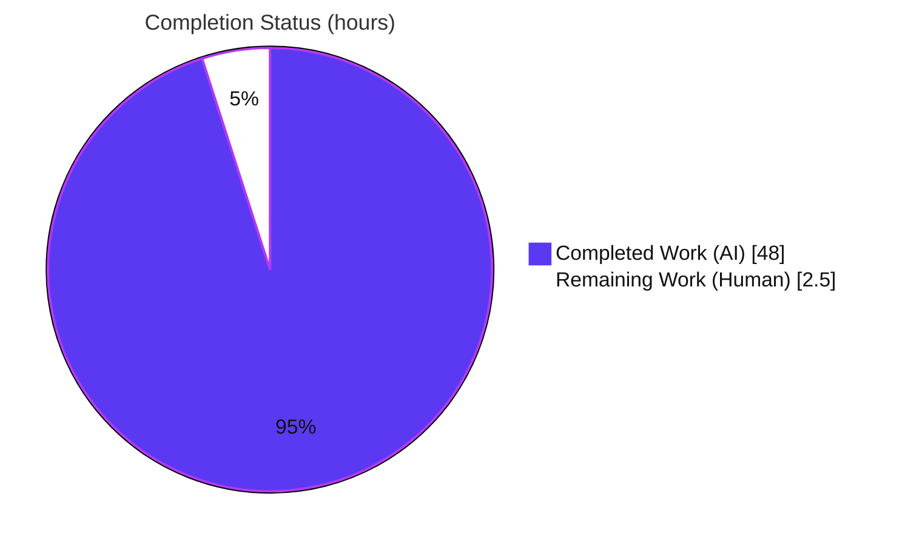
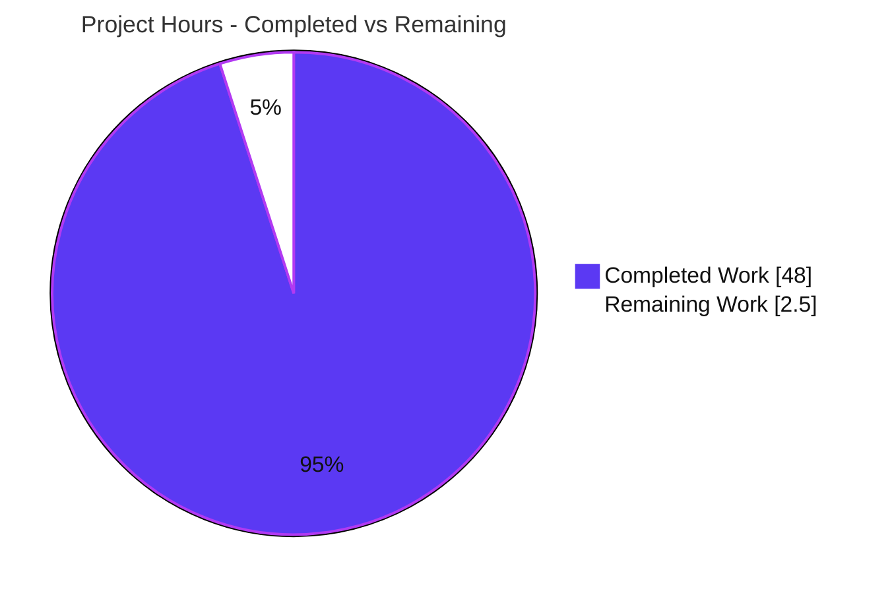

# Blitzy Project Guide — SimpleLogin Alias-Creation Investigation (Branch `app_2cd6ee777f8c`)

---

## Section 1 — Executive Summary

### 1.1 Project Overview

This is a **read-only, investigative Q&A documentation project** against the SimpleLogin (Python/Flask) codebase. The objective was to determine — from **observed runtime evidence, not code-reading alone** — exactly what happens when a user creates a new alias: the frontend request, the backend response, the database writes, the logs/background work, and every error path. Blitzy autonomously ran the application in its canonical default configuration, exercised the random and custom alias flows plus every error/edge branch, captured the real output, and authored a single comprehensive answer document (`blitzy/documentation/app_2cd6ee777f8c.md`). No source, schema, configuration, or dependency was changed. The audience is engineers and reviewers who need a precise, evidence-grounded account of the alias-creation flow.

### 1.2 Completion Status

The completion percentage is calculated using the AAP-scoped, hours-based methodology: `Completed Hours / (Completed + Remaining) × 100`. All eleven AAP-scoped autonomous work items are complete and independently validated; the only remaining work is human path-to-production (SME review and merge).

**Completion: 95.0 % Complete**



**Legend:** Completed = Dark Blue `#5B39F3` · Remaining = White `#FFFFFF`. Center metric: **95.0 % complete** (48.0 of 50.5 h).

| Metric | Value |
|---|---|
| **Total Hours** | **50.5 h** |
| **Completed Hours (AI + Manual)** | **48.0 h** (48.0 AI + 0.0 Manual) |
| **Remaining Hours** | **2.5 h** (human path-to-production) |
| **Percent Complete** | **95.0 %** |

> Calculation: `48.0 / (48.0 + 2.5) = 48.0 / 50.5 = 95.0 %`. Capped below 100 % because human review/merge is still pending.

### 1.3 Key Accomplishments

- ✅ Brought up the full application in its **canonical default configuration** (PostgreSQL 15.13 + Redis 7.0.15 → `alembic upgrade head` [head `32f25cbf12f6`, 77 tables] → `flask dummy-data` [2 users, 11 aliases] → `python3 server.py` on port 7777) and authenticated as the seeded user `john@wick.com`.
- ✅ Captured the **frontend request** for both variants: `POST /dashboard/` (random) and `POST /dashboard/custom_alias` (custom), content type `application/x-www-form-urlencoded`, with exact body fields and CSRF handling — all three random generator schemes exercised.
- ✅ Captured the **backend response**: HTTP **302** Post/Redirect/Get with `Location` (`highlight_alias_id`), flash-cookie messaging, and complete raw headers.
- ✅ Observed the **database writes** with PostgreSQL `log_statement=all` plus before/after row snapshots: **3 tables** for a random alias (`alias`, `daily_metric`, `alias_audit_log`) and **4 tables** for a custom alias with a secondary mailbox (`+ alias_mailbox`).
- ✅ Confirmed **logs & background work**: the domain event is a **gated no-op** in default config (`app/events/event_dispatcher.py:62`); the audit-log write is synchronous in-transaction; no background workers run.
- ✅ Enumerated **every error/edge path** (7 branches B1–B6 + B3′: quota, invalid/missing CSRF, route-level 429, non-numeric scheme → 500, per-user token bucket + Redlock no-ops, 14 custom-alias validations, and `IntegrityError` → rollback) with response, logs, and before/during/after DB state.
- ✅ Documented the **web-vs-API contrast** (web 302 PRG vs API 201 JSON; API `api_key` write side-effect; 429/400 shapes) and produced a full **coverage matrix** mapping every question sub-part to `file:line`.
- ✅ Authored the **2,227-line** answer document with `file:line` citations and observed/inferred/non-canonical labels, then removed all temporary observation scripts — leaving the repository in a pristine, read-only state (single tracked file added).
- ✅ **Independently validated**: 5 production-readiness gates passed; in-scope alias-flow test suite **87/87 (100%)**; all 14 referenced source modules byte-compile; zero documentation fixes required.

### 1.4 Critical Unresolved Issues

There are **no critical unresolved issues** that block the deliverable. All eleven AAP-scoped autonomous items are complete and validated. The two items below are non-blocking and tracked for transparency.

| Issue | Impact | Owner | ETA |
|---|---|---|---|
| Deliverable awaits human SME accuracy/completeness review | Low — deliverable is complete and self-validated; review is the standard final gate before merge | Human reviewer (Documentation SME) | 2.0 h |
| Out-of-scope: image ships `google-re2` in place of `poetry.lock`'s `pyre2`, breaking 3 `email_handler` test files + 1 regex test at collection | Low — pre-existing, **off** the alias-creation path; app runs correctly and the alias-flow suite is 87/87 green; **explicitly excluded** by AAP §0.3.2/§0.4.2 (no dependency changes) | Human (optional, outside this task's scope) | Not counted (see §2.2 note) |

### 1.5 Access Issues

No access issues identified. The repository, the mandated Docker image, the database, and Redis were all fully accessible during the autonomous investigation; the read-only invariant was preserved throughout.

| System/Resource | Type of Access | Issue Description | Resolution Status | Owner |
|---|---|---|---|---|
| Git repository (branch `blitzy-50c513ea-…`) | Read/Write (single-file add) | None — single tracked file added; base is an ancestor of HEAD | ✅ No issue | — |
| Mandated container image `swe_atlas_QnA_simple-login_app_1.0` | Runtime | None — app booted end-to-end in default config | ✅ No issue | — |
| PostgreSQL 15.13 / Redis 7.0.15 | Read/Write (transient observation) | None — datastores reachable; state left clean | ✅ No issue | — |

### 1.6 Recommended Next Steps

1. **[High]** Perform an SME review of `blitzy/documentation/app_2cd6ee777f8c.md`: verify the Q1–Q6 answers, spot-check a sample of `file:line` citations, and confirm the observed/inferred/non-canonical labeling (≈2.0 h).
2. **[Medium]** Obtain stakeholder sign-off and **merge** the branch (single added file) to the target branch; re-confirm the read-only invariant at merge time (≈0.5 h).
3. **[Low]** *(Optional, out of scope)* If the organization wants the off-path `email_handler`/regex tests green, align the `google-re2`/`pyre2` dependency in a **separate** change — this is explicitly excluded from the current read-only task.

---

## Section 2 — Project Hours Breakdown

### 2.1 Completed Work Detail

All completed work was performed autonomously by Blitzy agents. Each component traces to a specific AAP requirement (the six questions, the web-vs-API contrast, authoring, cleanup, and validation).

| Component | Hours | Description |
|---|---:|---|
| Canonical runtime bring-up & Q1 walkthrough | 4.0 | Start PostgreSQL + Redis, `alembic upgrade head`, `flask dummy-data`, `python3 server.py` on port 7777, authenticate as `john@wick.com`; capture the run-and-observe walkthrough (§1, §2 of the deliverable) |
| Q2 — Frontend request capture | 3.0 | Capture `POST /dashboard/` (random, all 3 generator schemes) and `POST /dashboard/custom_alias` (custom): method, URL, content type, body fields, CSRF handling |
| Q3 — Backend response capture | 2.0 | Capture the HTTP 302 Post/Redirect/Get response, `Location` header, complete raw headers, and flash-message mechanism |
| Q4 — Database change observation | 5.0 | Enable `log_statement=all`, take before/after row snapshots, dissect `Alias.create`; document the 3-table (random) / 4-table (custom) write set |
| Q5 — Logs & background work | 3.0 | Capture full application logs; prove the gated event no-op and the synchronous in-transaction audit write; confirm no background workers run |
| Q6 — Error-path catalog | 8.0 | Deliberately trigger 7 branches (B1 quota, B2 CSRF, B3 route-429, B3′ non-numeric scheme→500, B4 token-bucket/Redlock no-ops, B5 14 custom validations, B6 IntegrityError→rollback) and capture response, logs, before/during/after DB state |
| Section 8 — Web-vs-API contrast | 3.0 | Capture the API 201-JSON path, the `api_key` write side-effect (M6), 429/400 shapes, and disposable-key cleanup (M15) |
| Deliverable authoring (2,227 lines) | 8.0 | Write the answer document with `file:line` citations, observed/inferred/non-canonical labels, and the §9.5 coverage matrix / §9.6 review-closure matrix |
| QA refinement iterations (7 doc-only commits) | 5.0 | Resolve review findings across seven iterations (enum, citation, CL-variance, HEAD framing, race-split & elision disclosure) |
| Temp-script cleanup + Appendix A cleanup proof | 1.0 | Remove all observation scripts; restore transient DB logging; prove the pristine working tree (Appendix A) |
| Independent validation pass (5 gates) | 6.0 | Reproduce all evidence, verify every claim & citation, run byte-compile + alias-flow tests (87/87), confirm read-only invariant |
| **Total Completed** | **48.0** | |

### 2.2 Remaining Work Detail

All remaining work is human-side path-to-production for a documentation deliverable (review and merge). There is no application-deployment work in scope — the app was only run transiently for observation.

| Category | Hours | Priority |
|---|---:|---|
| SME review of the deliverable (technical accuracy & completeness of Q1–Q6, citation spot-checks, label verification) | 2.0 | High |
| Stakeholder sign-off & merge (approve branch, merge single added file, re-confirm read-only invariant) | 0.5 | Medium |
| **Total Remaining** | **2.5** | |

> **Out-of-scope note (not counted above):** Reconciling the pre-existing `google-re2`-vs-`pyre2` substitution (3 off-path `email_handler` test files + 1 regex test failing at collection) is **explicitly excluded** by AAP §0.3.2 (no fixing observed behavior) and §0.4.2 (no dependency changes). If pursued later as a separate change, budget ≈1–2 h. It is deliberately **not** part of the 2.5 h remaining or the 95.0 % completion figure.

### 2.3 Hours Reconciliation

| Check | Result |
|---|---|
| Section 2.1 total (Completed) | 48.0 h |
| Section 2.2 total (Remaining) | 2.5 h |
| Section 2.1 + Section 2.2 | **50.5 h = Total (Section 1.2)** ✅ |
| Remaining consistent across §1.2 ↔ §2.2 ↔ §7 | 2.5 h = 2.5 h = 2.5 h ✅ |

---

## Section 3 — Test Results

All tests below originate from **Blitzy's autonomous validation logs** (Final Validator, Gate 1). No tests were fabricated or re-invented for this guide. Framework: **pytest**. Coverage percentage was not measured by the autonomous run (the deliverable is a read-only documentation artifact), so it is reported as *n/m* rather than an invented figure.

| Test Category | Framework | Total Tests | Passed | Failed | Coverage % | Notes |
|---|---|---:|---:|---:|---:|---|
| Alias-creation flow (in-scope) — dashboard views, alias model, audit-log & mailbox utils, alias API endpoints | pytest | 87 | 87 | 0 | n/m | The complete in-scope alias-flow suite the deliverable documents; **100% pass** (Gate 1) |
| Static byte-compilation of 14 referenced source modules | `python -m py_compile` | 14 | 14 | 0 | n/m | All referenced modules compile (Gate 3); re-confirmed in this reporting pass |
| Runtime end-to-end create-alias (scripted HTTP + browser) | scripted client / Chrome DevTools | — | Pass | 0 | n/m | Login → `POST /dashboard/` → 302 + DB delta (Gate 2); see Section 4 |

**Out-of-scope (documented, non-blocking):** the image ships `google-re2 1.1.20250805` in place of `poetry.lock`'s `pyre2 0.3.6`; `re2.DOTALL` is absent, which breaks **3 `email_handler` test files + 1 regex test** at collection. These are **off** the alias-creation path (only `referral.py`/`email_utils.py`/`spamassassin_utils.py`/`regex_utils.py` import `re2`), pre-existing, and unfixable under the read-only + no-dependency-change mandate. They are faithfully documented in the deliverable's §1.2 as OBSERVED/INFERRED.

---

## Section 4 — Runtime Validation & UI Verification

Runtime health and UI verification results from the autonomous investigation (default configuration), corroborated in this reporting pass where re-runnable.

- ✅ **Operational — App boot:** `python3 server.py` binds `127.0.0.1:7777` (`server.py:588`, `app.run(debug=True, port=7777)`); unauthenticated `GET /` → **302** to the login page.
- ✅ **Operational — Authentication:** login as `john@wick.com / password` succeeds (seeded admin user id=1).
- ✅ **Operational — Random alias creation:** `POST /dashboard/` (`form-name=create-random-email`, `csrf_token`, optional `generator_scheme`) → **HTTP 302**, `Location …/dashboard/?highlight_alias_id=<id>&query=&sort=&filter=`, `Content-Length 339`, flash `success — Alias … has been created`.
- ✅ **Operational — Custom alias creation:** `POST /dashboard/custom_alias` (`prefix`, `signed-alias-suffix`, `mailboxes`, `note`, `csrf_token`) → **HTTP 302** PRG (`Content-Length 273`).
- ✅ **Operational — Database delta:** per random creation, `alias +1`, `alias_audit_log +1`, `daily_metric.nb_alias +1`; custom-with-secondary-mailbox additionally writes `alias_mailbox`.
- ✅ **Operational — CSRF enforcement:** the CSRF token is validated **before** any write; invalid/missing CSRF → 302 redirect with no DB write.
- ✅ **Operational — Error paths:** quota (302 + warning flash, no write), route-level 429 (HTML error page), per-user token bucket / Redlock (no-ops by default), and `IntegrityError` → rollback all behave as documented.
- ✅ **Operational — UI evidence:** dashboard and custom-alias forms, success toasts, and error/validation states captured as screenshots and screen recordings (untracked observation artifacts under `blitzy/screenshots/` and `blitzy/screen_recordings/`).
- ⚠ **Partial — Background events:** the domain `AliasCreated` event is **intentionally a gated no-op** in the default configuration (`EVENT_WEBHOOK` unset). This is observed and documented as the canonical default — not a defect. With a partner/webhook configured, an additional `sync_event` insert + `NOTIFY` would occur (documented as non-default contrast).
- ❌ **Failing (out-of-scope, off-path):** `email_handler` / regex test collection under `google-re2` (see Section 3) — pre-existing and excluded from scope.

---

## Section 5 — Compliance & Quality Review

Cross-mapping of AAP deliverables and rules ("SWE-AtlasQnA-Repo") to observed quality benchmarks. All fixes applied during the seven QA iterations are already reflected in the committed deliverable; the final validation pass required **zero** further fixes.

| Compliance / Quality Benchmark | Status | Progress | Evidence |
|---|---|---|---|
| Investigate-by-running-first (evidence, not code-reading) | ✅ Pass | 100% | Every behavioral claim paired with captured output + `file:line` |
| Canonical default configuration only | ✅ Pass | 100% | `.env` byte-identical to `example.env`; `EVENT_WEBHOOK`/`MEM_STORE_URI`/`DISABLE_RATE_LIMIT` unset |
| Real, canonical entry point (web forms) | ✅ Pass | 100% | `POST /dashboard/` & `POST /dashboard/custom_alias` exercised; non-canonical inputs explicitly labeled |
| Exercise every condition (happy + all error/edge) | ✅ Pass | 100% | Random + custom + B1–B6 + B3′; before/during/after state reported |
| Include actual, unedited output per condition | ✅ Pass | 100% | Verbatim SQL, headers, flash, log lines, error text throughout |
| Observed vs inferred vs non-canonical labeling | ✅ Pass | 100% | §9.2 / §9.3 / §9.4 classification |
| Exact & grounded (`file:line` + named function) | ✅ Pass | 100% | §9.5 coverage matrix maps every sub-part to `file:line` |
| Answer every question sub-part & named item | ✅ Pass | 100% | Q1–Q6 fully covered; §9.5 final coverage pass |
| Deliverable location & name | ✅ Pass | 100% | `blitzy/documentation/app_2cd6ee777f8c.md` exists (2,227 lines) |
| Read-only scope (no source change; temp scripts removed) | ✅ Pass | 100% | `git diff <base> --name-status` = single added file; Appendix A cleanup proof |
| Markdown quality (no trailing whitespace, balanced fences) | ✅ Pass | 100% | 0 trailing-whitespace lines; 158 balanced code-fence delimiters; 10 H2 sections |
| Referenced source modules compile | ✅ Pass | 100% | 14 modules byte-compile (exit 0) |
| Out-of-scope dependency test note | ⚠ Documented | n/a | `google-re2`/`pyre2` breakage recorded in §1.2; excluded by AAP §0.3.2/§0.4.2 |

---

## Section 6 — Risk Assessment

Because this is a read-only documentation task that introduced **zero functional or security change**, the risk profile is inherently low. No High or Critical risks exist.

| Risk | Category | Severity | Probability | Mitigation | Status |
|---|---|---|---|---|---|
| Point-in-time evidence drift (captured SQL, alias IDs, timestamps are a snapshot; future source changes could diverge) | Technical | Low | Low | Every claim anchored to `file:line`; capture-time disclosed | Mitigated / Documented |
| Moving-HEAD self-reference (deliverable documents its own advancing HEAD) | Technical | Low | Low | Read-only invariant anchored to the immutable **base** commit (`merge-base --is-ancestor` verified) | Resolved / Disclosed |
| Out-of-scope test breakage under `google-re2` (3 `email_handler` files + 1 regex test) | Technical | Low | n/a (pre-existing) | Off the alias path; app runs correctly; documented in §1.2; unfixable under read-only mandate | Documented / Out-of-scope |
| No security change introduced; security behavior only documented (CSRF, rate limiting, immutable audit) | Security | None | n/a | Read-only; nothing altered; CSRF tokens redacted in captured evidence | N/A |
| Observation secrets/keys hygiene | Security | Low | Low | Observation API keys + test users created then **disposed** (M15); state left clean | Mitigated |
| Reproduction-environment dependency (exact repro needs the mandated image + Python 3.10.18 / PG 15.13 / Redis 7.0.15) | Operational | Low | Medium | Exact image, versions, and commands stated; Content-Length/ID variance envelope disclosed | Documented / Mitigated |
| No deployment/monitoring/backup footprint | Operational | None | n/a | Documentation deliverable has no runtime footprint | N/A |
| No integrations introduced (no new external services/credentials/API changes) | Integration | None | n/a | Used seeded `dummy-data` + default config only | N/A |
| Gated event-dispatch path (`EVENT_WEBHOOK`) is a default no-op | Integration | None (informational) | n/a | Informational note for future partner/webhook integrators | Documented |

---

## Section 7 — Visual Project Status

### 7.1 Project Hours Breakdown



**Legend:** Completed = Dark Blue `#5B39F3` · Remaining = White `#FFFFFF`. "Remaining Work" (2.5 h) equals Section 1.2 Remaining Hours and the Section 2.2 total.

### 7.2 Completed Hours by AAP Component

Horizontal bars scaled to the 8 h maximum (each `█` ≈ 0.5 h). Completed = Dark Blue `#5B39F3`.

| Component | Hours | Bar |
|---|---:|---|
| Q6 — Error-path catalog | 8.0 | `████████████████` |
| Deliverable authoring | 8.0 | `████████████████` |
| Independent validation | 6.0 | `████████████` |
| Q4 — Database observation | 5.0 | `██████████` |
| QA refinement (7 commits) | 5.0 | `██████████` |
| Q1 — Runtime bring-up | 4.0 | `████████` |
| Q2 — Frontend request | 3.0 | `██████` |
| Q5 — Logs & background | 3.0 | `██████` |
| Section 8 — Web-vs-API | 3.0 | `██████` |
| Q3 — Backend response | 2.0 | `████` |
| Cleanup + Appendix A | 1.0 | `██` |
| **Total** | **48.0** | |

### 7.3 Remaining Hours by Category (Section 2.2)

Total remaining = **2.5 h** (each `█` ≈ 0.25 h).

| Category | Hours | Priority | Bar |
|---|---:|---|---|
| SME review of deliverable | 2.0 | High | `████████` |
| Sign-off & merge | 0.5 | Medium | `██` |
| **Total** | **2.5** | | |

---

## Section 8 — Summary & Recommendations

**Achievements.** Blitzy autonomously delivered a rigorous, evidence-grounded answer to the six-part question of "what happens when you create a new alias" in SimpleLogin. Every claim in the 2,227-line deliverable is backed by captured runtime output (HTTP requests/responses, SQL statements, log lines, error text) and a `file:line` citation, with clear observed/inferred/non-canonical labeling. The random and custom flows, all three generator schemes, the 3-/4-table write set, the gated-event no-op, and all seven error/edge branches were exercised and captured. A web-vs-API contrast and a full coverage matrix round out the analysis.

**Completion.** The project is **95.0 % complete** (48.0 of 50.5 hours). All eleven AAP-scoped autonomous work items are finished and independently validated across five production-readiness gates (tests 87/87 in-scope, runtime end-to-end proof, zero compile errors, deliverable validated, AAP-compatible & committed). Zero documentation fixes were required in the final validation pass.

**Remaining gaps & critical path.** The remaining **2.5 hours** are entirely human path-to-production: an SME accuracy/completeness review (2.0 h, High) followed by sign-off and merge of the single added file (0.5 h, Medium). There is no application-deployment work in scope. The critical path is simply: **review → sign-off → merge**.

**Success metrics.** Read-only invariant intact (single tracked file added; base is an ancestor of HEAD); all six questions answered from observed evidence; all referenced modules compile; deliverable is well-formed markdown (0 trailing whitespace, balanced fences, 10 sections).

**Production readiness.** The deliverable is **production-ready** as a documentation artifact — comprehensive, accurate, and self-validated. It can proceed to human review and merge immediately. The only known non-blocking item is the explicitly out-of-scope `google-re2`/`pyre2` off-path test breakage, which a human may optionally address in a separate change.

| Metric | Value |
|---|---|
| Completion | 95.0 % |
| Completed / Total hours | 48.0 / 50.5 h |
| In-scope tests passing | 87 / 87 (100 %) |
| Tracked files changed | 1 (added) |
| Documentation fixes needed in final pass | 0 |
| High/Critical risks | 0 |

---

## Section 9 — Development Guide

This guide reproduces the alias-creation investigation and verifies the deliverable. Commands marked **[verified here]** were re-executed in this reporting pass; commands marked **[investigation capture]** were captured with real exit codes during the autonomous run inside the mandated container (this reporting container has an empty `venv` and no live datastores).

### 9.1 System Prerequisites

- **Docker** with the mandated image: `ghcr.io/scaleapi/swe-atlas:swe_atlas_QnA_simple-login_app_1.0` (tag corresponds to `simple-login__app__2cd6ee777f8c…`).
- **Python** `^3.10` (`pyproject.toml`: `python = "^3.10"`; image ships **3.10.18**). **[verified here]**
- **PostgreSQL** 13+ (image ships **15.13**).
- **Redis** (image ships **7.0.15**), default port 6379.
- **Git** + **Git LFS**.

### 9.2 Environment Setup

- Run inside the mandated container so the observed environment matches the intended one.
- The application uses the **default canonical configuration** — `.env` is byte-identical to `example.env`:

```bash
diff -q .env example.env        # -> Files .env and example.env are identical   [verified here]
```

- Confirm the event path is a default no-op (these keys are unset in `example.env`): `EVENT_WEBHOOK`, `MEM_STORE_URI`, `DISABLE_RATE_LIMIT`. **[verified here]**

### 9.3 Dependency Installation

Dependencies are pre-installed in the image virtualenv at `/app/venv` from `poetry.lock`. **No dependency changes are made** (read-only task). Key pinned versions exercised by the flow:

```text
flask 1.1.2 · flask-login 0.5.0 · flask-wtf 0.14.3 · sqlalchemy 1.3.24
alembic 1.4.3 · psycopg2-binary 2.9.3 · redis 4.6.0 · protobuf 5.27.1
```

### 9.4 Application Startup (Canonical Bootstrap)

The contributor guide gives the one-liner (`CONTRIBUTING.md:106`): `alembic upgrade head && flask dummy-data && python3 server.py`. The reproducible, from-empty sequence used by the investigation was **[investigation capture]**:

```bash
# Step 0 — datastores (default ports)
pg_ctlcluster 15 main start                 # -> exit 0
pg_isready -h localhost                      # -> localhost:5432 - accepting connections
redis-server --daemonize yes --dir /tmp
redis-cli ping                               # -> PONG

# Step 0b — clean-slate database (myuser is the pre-provisioned superuser)
export PGPASSWORD=mypassword
psql -h localhost -U myuser -d postgres -tAc "DROP DATABASE IF EXISTS simplelogin"
psql -h localhost -U myuser -d postgres -tAc "CREATE DATABASE simplelogin OWNER myuser"

# Step 1 — schema
cd /app && /app/venv/bin/alembic upgrade head          # -> head 32f25cbf12f6 ; 77 public tables ; exit 0

# Step 2 — seed data (defined at server.py:490-497)
cd /app && FLASK_APP=server.py /app/venv/bin/flask dummy-data   # -> exit 0 ; 2 users, 11 aliases (next id=12)

# Step 3 — dev server (server.py:588 -> app.run(debug=True, port=7777))
cd /app && WERKZEUG_RUN_MAIN=true FLASK_APP=server.py /app/venv/bin/python server.py
# -> >>> URL: http://localhost:7777 ; Running on http://127.0.0.1:7777/
```

The server binds container loopback `127.0.0.1:7777`; to reach it from the host, bridge with `socat` **inside the container**:

```bash
socat TCP-LISTEN:7777,bind=172.17.0.2,fork,reuseaddr TCP:127.0.0.1:7777 &
curl -s -o /dev/null -w '%{http_code}\n' http://localhost:7777/      # -> 302   [investigation capture]
```

### 9.5 Verification Steps

Run these from the repository root to verify the deliverable and its referenced sources **[all verified here]**:

```bash
# Read-only invariant: exactly one tracked file added
git diff 2cd6ee777f8c2d3531559588bcfb18627ffb5d2c --name-status   # -> A  blitzy/documentation/app_2cd6ee777f8c.md

# Base commit is an ancestor of HEAD (invariant anchor)
git merge-base --is-ancestor 2cd6ee777f8c2d3531559588bcfb18627ffb5d2c HEAD && echo "base is ancestor: OK"

# Referenced source modules byte-compile
python3 -m py_compile app/dashboard/views/index.py app/dashboard/views/custom_alias.py \
  app/models.py app/events/event_dispatcher.py app/alias_audit_log_utils.py \
  app/rate_limiter.py app/parallel_limiter.py app/config.py app/utils.py \
  server.py app/api/views/new_random_alias.py && echo "byte-compile: OK"

# Deliverable is present and well-formed
wc -l blitzy/documentation/app_2cd6ee777f8c.md          # -> 2227
grep -c "  *$" blitzy/documentation/app_2cd6ee777f8c.md # -> 0 (no trailing whitespace)
```

### 9.6 Example Usage (Reproduce the Observation)

```bash
# 1) Log in at http://localhost:7777 with john@wick.com / password
# 2) Random alias: submit the dashboard "Create random alias" form
#    POST /dashboard/  (form-name=create-random-email, csrf_token[, generator_scheme=1|2])
#    -> HTTP 302, Location .../dashboard/?highlight_alias_id=<id>&query=&sort=&filter=
# 3) Custom alias: submit the custom-alias form
#    POST /dashboard/custom_alias (prefix, signed-alias-suffix, mailboxes, note, csrf_token)
#    -> HTTP 302 (PRG)
# 4) Observe DB delta (before/after row counts)
psql -h localhost -U myuser -d simplelogin -tAc "select count(*) from alias"            # +1 per creation
psql -h localhost -U myuser -d simplelogin -tAc "select nb_alias from daily_metric"      # +1
psql -h localhost -U myuser -d simplelogin -tAc "select count(*) from alias_audit_log"   # +1

# Optional: capture exact SQL emitted during creation
psql -h localhost -U myuser -d simplelogin -c "ALTER SYSTEM SET log_statement='all'"
psql -h localhost -U myuser -d simplelogin -c "SELECT pg_reload_conf()"
# ... perform a creation, then tail the PostgreSQL log ... then reset:
psql -h localhost -U myuser -d simplelogin -c "ALTER SYSTEM RESET log_statement"
psql -h localhost -U myuser -d simplelogin -c "SELECT pg_reload_conf()"
```

### 9.7 Troubleshooting

- **`psql: FATAL: role "root" does not exist`** — connect explicitly: `export PGPASSWORD=mypassword` and pass `-U myuser`.
- **`DROP DATABASE … is being accessed by other users`** — the dev server holds pooled connections; terminate them first: `SELECT pg_terminate_backend(pid) FROM pg_stat_activity WHERE datname='simplelogin' AND pid<>pg_backend_pid();`
- **`flask dummy-data` fails on duplicate `john@wick.com`** — `fake_data()` inserts without a prior drop; drop/recreate the `simplelogin` database first for a clean slate.
- **Host `curl` to `:7777` fails** — the server binds container loopback only; use the `socat` bridge in §9.4.
- **`email_handler`/regex tests fail at collection** — expected: the image ships `google-re2` instead of `pyre2` (`re2.DOTALL` missing). These are off the alias path and out of scope; the alias-flow suite is 87/87 green.

---

## Section 10 — Appendices

### Appendix A — Command Reference

| Purpose | Command |
|---|---|
| Read-only invariant | `git diff 2cd6ee777f8c2d3531559588bcfb18627ffb5d2c --name-status` |
| Base-ancestor check | `git merge-base --is-ancestor 2cd6ee777f8c2d3531559588bcfb18627ffb5d2c HEAD` |
| Byte-compile referenced modules | `python3 -m py_compile app/dashboard/views/index.py …` |
| Default-config check | `diff -q .env example.env` |
| Schema migrate | `cd /app && /app/venv/bin/alembic upgrade head` |
| Seed data | `cd /app && FLASK_APP=server.py /app/venv/bin/flask dummy-data` |
| Start dev server | `cd /app && WERKZEUG_RUN_MAIN=true FLASK_APP=server.py /app/venv/bin/python server.py` |
| Entry-point smoke test | `curl -s -o /dev/null -w '%{http_code}\n' http://localhost:7777/` |

### Appendix B — Port Reference

| Service | Port |
|---|---|
| SimpleLogin dev web server | 7777 |
| PostgreSQL | 5432 |
| Redis | 6379 |

### Appendix C — Key File Locations

| Path | Role |
|---|---|
| `blitzy/documentation/app_2cd6ee777f8c.md` | **The deliverable** (answer document, 2,227 lines) |
| `app/dashboard/views/index.py` | Random-alias route (`dashboard.index`, `:55`) |
| `app/dashboard/views/custom_alias.py` | Custom-alias route (`:30`) |
| `app/models.py` | `Alias.create` (`:1627-1692`), `DailyMetric`, `AliasAuditLog`, `AliasMailbox` |
| `app/events/event_dispatcher.py` | Gated event no-op (`:47-84`, Gate 2 at `:62`) |
| `app/alias_audit_log_utils.py` | Synchronous audit-log insert (`:18-32`) |
| `app/rate_limiter.py` | Per-user Redis token bucket (fail-open) |
| `app/config.py` | `ALIAS_LIMIT`, `ALIAS_CREATE_RATE_LIMIT_*`, `EVENT_WEBHOOK` |
| `server.py` | App factory, error handlers, `dummy-data`, dev entry (`:588`) |
| `templates/dashboard/index.html`, `custom_alias.html` | Alias-creation forms |
| `blitzy/screenshots/`, `blitzy/screen_recordings/` | Untracked UI observation artifacts |

### Appendix D — Technology Versions

| Component | Version |
|---|---|
| Python (image) | 3.10.18 (`pyproject.toml`: `^3.10`) |
| PostgreSQL | 15.13 |
| Redis | 7.0.15 |
| Flask | 1.1.2 |
| SQLAlchemy | 1.3.24 |
| Alembic | 1.4.3 (schema head `32f25cbf12f6`) |
| psycopg2-binary | 2.9.3 |
| redis (client) | 4.6.0 |
| protobuf | 5.27.1 |

### Appendix E — Environment Variable Reference

| Variable | Default (canonical) | Effect |
|---|---|---|
| `EVENT_WEBHOOK` | unset | Gates domain-event dispatch → **no-op** by default |
| `MEM_STORE_URI` | unset | No external rate-limit store; limiter uses defaults |
| `DISABLE_RATE_LIMIT` | unset | Rate limiting active in default config |
| `FLASK_APP` | `server.py` | Flask CLI entry point |
| `PGPASSWORD` | `mypassword` | Password for the pre-provisioned `myuser` superuser (shell convenience) |

### Appendix F — Developer Tools Guide

- **PostgreSQL statement logging:** `ALTER SYSTEM SET log_statement='all'` + `SELECT pg_reload_conf()` to capture exact `INSERT`/`UPDATE` statements; always `RESET` afterward (the deliverable's Appendix A proves the reset).
- **Before/after row snapshots:** `psql -tAc "select count(*) from <table>"` around a creation to corroborate the write set independently of logs.
- **HTTP capture:** a scripted client and/or the browser network panel confirm method, URL, content type, and body fields; CSRF tokens should be redacted in shared evidence.

### Appendix G — Glossary

| Term | Meaning |
|---|---|
| **PRG (Post/Redirect/Get)** | Web-form mutation pattern: `POST` → HTTP 302 redirect → `GET`, with a flash message |
| **Gated no-op** | A code path that early-returns without effect unless configuration enables it (here, the domain-event dispatch when `EVENT_WEBHOOK` is unset) |
| **Fail-open** | The per-user Redis rate limiter permits the action when Redis is unavailable |
| **Canonical / default configuration** | The out-of-the-box dev configuration a normal user would run (`.env` ≡ `example.env`) |
| **Observed / Inferred / Non-canonical** | Labels distinguishing captured-at-runtime facts, code-derived statements, and crafted/non-default inputs |
| **Read-only invariant** | The guarantee that only the single answer document is added; no source/config/dependency changes |

---

*Completion figures in this guide are consistent across all sections: **48.0 h completed / 2.5 h remaining / 50.5 h total = 95.0 % complete**.*