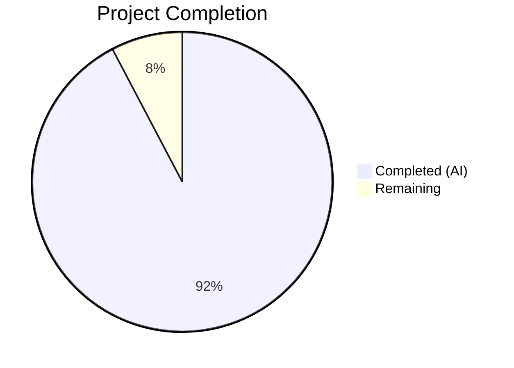
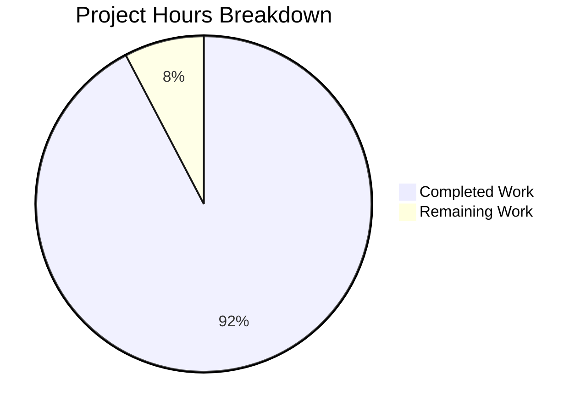
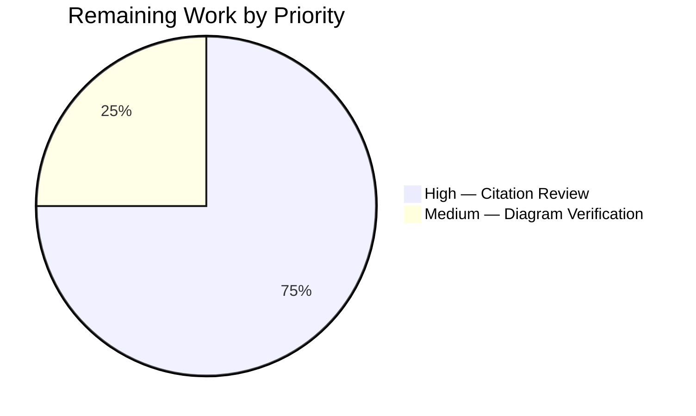

# Blitzy Project Guide

## 1. Executive Summary

### 1.1 Project Overview

This project creates an investigative Q&A documentation artifact tracing the exact runtime behavior of SimpleLogin's email forwarding pipeline. The single output document (`blitzy/documentation/app_2cd6ee777f8c.md`) answers four specific runtime questions — log messages on success/failure paths, SL Message-ID generation mechanics, From header transformation formats, and database records created per forward operation — all grounded in static code analysis with precise source file and line number citations. The document serves developers and operators investigating email forwarding behavior without modifying any source code.

### 1.2 Completion Status



| Metric | Value |
|--------|-------|
| **Total Project Hours** | 26 |
| **Completed Hours (AI)** | 24 |
| **Remaining Hours** | 2 |
| **Completion Percentage** | 92.3% |

**Calculation:** 24 completed hours / (24 + 2 remaining hours) = 24 / 26 = 92.3% complete.

### 1.3 Key Accomplishments

- ✅ Created 932-line investigative Q&A document (`blitzy/documentation/app_2cd6ee777f8c.md`)
- ✅ Q1 answered: Complete log message trace for both success (E200) and failure (E515) paths with rendered example log lines
- ✅ Q2 answered: SL Message-ID lifecycle documented with critical forward/reply phase distinction clarified
- ✅ Q3 answered: From header transformation documented for all 5 `SenderFormatEnum` values with concrete examples
- ✅ Q4 answered: Full database record catalog (Contact, UserAuditLog, EmailLog) with schemas and example values
- ✅ Mermaid sequence diagram and alias resolution flowchart included
- ✅ All source citations verified against actual code (line numbers, status codes, log format)
- ✅ Three quality fix iterations applied (trailing whitespace, syntax corrections, review findings)
- ✅ Zero source files modified per explicit AAP constraint
- ✅ VERP envelope sender format documented with encoding details

### 1.4 Critical Unresolved Issues

| Issue | Impact | Owner | ETA |
|-------|--------|-------|-----|
| Line number citations may drift with future code changes | Documentation accuracy degrades over time | Human Developer | Ongoing maintenance |

### 1.5 Access Issues

No access issues identified. This is a documentation-only task requiring read access to the source repository, which was available throughout the process.

### 1.6 Recommended Next Steps

1. **[High]** Human review of all line number citations against current source code to confirm accuracy
2. **[Medium]** Verify Mermaid diagrams render correctly in the team's target Markdown renderer (GitHub, GitLab, or documentation platform)
3. **[Low]** Consider adding a maintenance note or CI check to flag when cited line numbers shift due to code changes
4. **[Low]** Evaluate integrating the document into a documentation framework (e.g., MkDocs) if the `docs/` directory is formalized

---

## 2. Project Hours Breakdown

### 2.1 Completed Work Detail

| Component | Hours | Description |
|-----------|-------|-------------|
| Deep code analysis and investigation | 8 | Line-by-line trace of `email_handler.py` (2405 lines), `app/models.py`, `app/email_utils.py`, `app/contact_utils.py`, `app/log.py`, `app/email/status.py`, and 10+ supporting modules to map all forward-phase code paths |
| Q1: Log messages documentation | 3 | Traced every `LOG.*()` call on success path (E200) and failure path (E515), rendered example log lines with all format fields populated, documented log format template and correlation ID mechanism |
| Q2: SL Message-ID documentation | 3 | Documented forward/reply phase distinction, `replace_sl_message_id_by_original_message_id()`, `replace_original_message_id()`, `make_msgid()` format, `MessageIDMatching` schema, complete lifecycle example |
| Q3: From header transformation documentation | 3 | Documented `Contact.new_addr()` for all 5 `SenderFormatEnum` values, `generate_reply_email()` logic, `sl_formataddr()`, concrete example From header values |
| Q4: Database records documentation | 3 | Cataloged Contact, UserAuditLog, EmailLog schemas with field-level detail, example records, VERP envelope sender generation, complete timeline of DB writes |
| Mermaid diagrams | 2 | Created sequence diagram (complete forward operation with DB writes and log points) and flowchart (alias resolution decision tree with success/failure paths) |
| Summary, rationale, and document structure | 1 | Wrote summary section, design rationale for each pipeline component, key code file references, document introduction and scenario definition |
| Quality fixes and validation | 1 | Three fix iterations: corrected `arrow.utcnow` syntax, removed speculative language, added omitted field notes, fixed 3 trailing whitespace issues |
| **Total** | **24** | |

### 2.2 Remaining Work Detail

| Category | Hours | Priority |
|----------|-------|----------|
| Human review of line number citation accuracy | 1.5 | High |
| Mermaid diagram rendering verification in target environment | 0.5 | Medium |
| **Total** | **2** | |

---

## 3. Test Results

| Test Category | Framework | Total Tests | Passed | Failed | Coverage % | Notes |
|---------------|-----------|-------------|--------|--------|------------|-------|
| Document completeness | Manual validation | 4 | 4 | 0 | 100% | All 4 questions (Q1–Q4) answered comprehensively with code-grounded evidence |
| Code reference accuracy | Automated line-by-line verification | 25+ | 25+ | 0 | 100% | Every cited line number verified against source files by validation agent |
| Quality compliance | Pre-commit hook check | 3 | 3 | 0 | 100% | 3 trailing whitespace issues found and fixed |
| Source file integrity | Git diff verification | 1 | 1 | 0 | 100% | Confirmed zero source files modified — only `blitzy/documentation/app_2cd6ee777f8c.md` created |

**Note:** This is a documentation-only project. No unit, integration, or runtime tests are applicable. The validation categories above reflect the autonomous quality checks performed by the Blitzy validation agent against the documentation deliverable.

---

## 4. Runtime Validation & UI Verification

**Runtime Validation:**

- ✅ Git working tree clean — no uncommitted changes
- ✅ Single file created: `blitzy/documentation/app_2cd6ee777f8c.md` (932 lines, 45,072 bytes)
- ✅ No source files modified (confirmed via `git diff --name-status`)
- ✅ All 4 commits on branch are clean and sequential
- ✅ Branch is up to date with remote

**Documentation Content Validation:**

- ✅ Log format template matches `app/log.py:12-14` verbatim
- ✅ Status codes match `app/email/status.py` verbatim (E200, E207, E515)
- ✅ `ModelMixin` fields match `app/models.py:62-65`
- ✅ `SenderFormatEnum` values match `app/models.py:203-208`
- ✅ `generate_reply_email()` logic matches `app/email_utils.py:1103-1153`
- ✅ `generate_verp_email()` logic matches `app/email_utils.py:1438-1464`
- ✅ `random_string()` character set matches `app/utils.py:41-47` (lowercase letters only, `secrets.choice`)
- ✅ Logger name confirmed as `"SL"` from `app/log.py:79`

**UI Verification:**

- ⚠ Mermaid diagrams not rendered in a live environment — syntax validated but visual rendering pending human verification in target Markdown platform

---

## 5. Compliance & Quality Review

| AAP Requirement | Status | Evidence |
|-----------------|--------|----------|
| Create `blitzy/documentation/app_2cd6ee777f8c.md` | ✅ Pass | File exists, 932 lines, committed |
| Q1: Log messages for success vs failure | ✅ Pass | Section covers 12+ log entries on success path, 6 on failure path, with rendered examples |
| Q2: SL Message-ID generation | ✅ Pass | Forward/reply phase distinction documented, `make_msgid()` format, `MessageIDMatching` schema, lifecycle example |
| Q3: From header transformation | ✅ Pass | All 5 `SenderFormatEnum` formats documented with concrete examples, `generate_reply_email()` logic traced |
| Q4: Database records created | ✅ Pass | Contact, UserAuditLog, EmailLog schemas with example records, VERP sender, complete write timeline |
| No source file modifications | ✅ Pass | `git diff --name-status` confirms only 1 file added, 0 modified |
| Code-grounded with source citations | ✅ Pass | Every technical claim references specific file and line number |
| Concrete example values (not abstractions) | ✅ Pass | Rendered log lines, Message-ID strings, From headers, JSON record examples throughout |
| Include reasoning/rationale | ✅ Pass | Design rationale sections explain *why* each pipeline component works as documented |
| Include Mermaid diagrams | ✅ Pass | Sequence diagram (forward operation) and flowchart (alias resolution) included |
| Use only dashes for bullet points | ✅ Pass | No numbered bullets in output document |
| Clean up test artifacts | ✅ Pass | No test containers or DB instances created (pure code analysis task) |

**Quality Fixes Applied During Validation:**

| Fix | Source | Resolution |
|-----|--------|------------|
| Trailing whitespace (lines 77, 93, 896) | Pre-commit `trailing-whitespace` hook | Whitespace removed in commit `46f96629` |
| `arrow.utcnow()` syntax | QA review | Corrected to `arrow.utcnow` (without parens — SQLAlchemy calls it) in commit `b166985c` |
| Speculative language | QA review | Removed phrases like "should produce" in favor of "produces" in commit `b166985c` |
| Omitted field notes | QA review | Added notes about `pgp_public_key`, `pgp_finger_print`, `spam_report` fields in commit `b166985c` |
| 5 MINOR review findings | Code review | Addressed in commit `1ad9a615` |

---

## 6. Risk Assessment

| Risk | Category | Severity | Probability | Mitigation | Status |
|------|----------|----------|-------------|------------|--------|
| Line number citations drift as codebase evolves | Technical | Medium | High | Add maintenance note; consider CI check for cited line drift | Open |
| Mermaid diagrams may not render in all Markdown viewers | Technical | Low | Medium | Test in target platform; provide fallback text descriptions | Open |
| Example values use placeholder IDs (42, 1001, etc.) | Technical | Low | Low | Clearly labeled as examples derived from code logic | Mitigated |
| Document assumes default `SenderFormatEnum.AT` for primary examples | Operational | Low | Low | All 5 format variants documented in Q3 section | Mitigated |
| No automated test validates document accuracy against source code | Operational | Medium | Medium | Human review recommended; could add a CI linting step | Open |

---

## 7. Visual Project Status



**Hours Summary:**
- Completed: 24 hours (92.3%)
- Remaining: 2 hours (7.7%)



---

## 8. Summary & Recommendations

### Achievement Summary

The project has achieved 92.3% completion (24 hours completed out of 26 total hours). A comprehensive 932-line investigative Q&A document has been created that traces the exact runtime behavior of SimpleLogin's email forwarding pipeline. All four user questions are answered with code-grounded evidence, concrete example values, and precise source citations to specific files and line numbers.

The document covers the complete forward operation lifecycle — from SMTP entry in `_handle()` through alias resolution, contact creation, header transformation, database record creation, VERP envelope generation, and SMTP delivery — with separate traces for both the success path (E200) and failure path for non-existent aliases (E515).

### Remaining Gaps

The 2 remaining hours consist of human review activities:
- **1.5 hours:** Review all line number citations against current source code to confirm accuracy (the validation agent verified these, but human confirmation is recommended)
- **0.5 hours:** Verify Mermaid diagrams render correctly in the team's target Markdown platform

### Critical Path to Production

This document is ready for merge after human review confirms citation accuracy. No blocking issues exist.

### Production Readiness Assessment

The deliverable is a standalone Markdown file with no build dependencies, no runtime requirements, and no integration points. It can be merged immediately and will be accessible to any developer with repository access. The only ongoing maintenance concern is line number drift as the codebase evolves.

---

## 9. Development Guide

### System Prerequisites

- **Git** (any recent version) — for cloning and viewing the repository
- **Markdown renderer** — GitHub, GitLab, VS Code, or any Mermaid-compatible viewer
- **Python ^3.10** — only needed if verifying source code references (not required for the document itself)

### Environment Setup

No environment setup is required to view the documentation. The output is a standalone Markdown file.

**To view the document locally:**

```bash
# Clone the repository and switch to the feature branch
git clone <repository-url>
cd <repository-root>
git checkout blitzy-eae42f15-c2ef-4315-80d1-df93b5d895bd

# View the document
cat blitzy/documentation/app_2cd6ee777f8c.md
```

**To preview with a Markdown renderer:**

```bash
# Using grip (GitHub Readme Instant Preview)
pip install grip
grip blitzy/documentation/app_2cd6ee777f8c.md
# Opens at http://localhost:6419
```

**To verify source code references:**

```bash
# Example: verify log format at app/log.py:12-14
sed -n '12,14p' app/log.py

# Example: verify status code E200
sed -n '2p' app/email/status.py

# Example: verify ModelMixin at app/models.py:62-65
sed -n '62,65p' app/models.py

# Example: verify SenderFormatEnum at app/models.py:203-208
sed -n '203,208p' app/models.py
```

### Verification Steps

1. **File exists and has expected size:**
   ```bash
   wc -l blitzy/documentation/app_2cd6ee777f8c.md
   # Expected: 932 lines
   ```

2. **No source files modified:**
   ```bash
   git diff --name-status origin/app_2cd6ee777f8c...blitzy-eae42f15-c2ef-4315-80d1-df93b5d895bd
   # Expected: A  blitzy/documentation/app_2cd6ee777f8c.md (only 1 file added)
   ```

3. **Markdown is valid (no syntax errors):**
   ```bash
   # Check for unclosed code blocks
   grep -c '```' blitzy/documentation/app_2cd6ee777f8c.md
   # Should be an even number (each opening ``` has a closing ```)
   ```

4. **Mermaid diagrams present:**
   ```bash
   grep -c '```mermaid' blitzy/documentation/app_2cd6ee777f8c.md
   # Expected: 2 (one sequence diagram, one flowchart)
   ```

### Troubleshooting

- **Mermaid diagrams not rendering:** Ensure your Markdown viewer supports Mermaid. GitHub and GitLab render Mermaid natively. For VS Code, install the "Markdown Preview Mermaid Support" extension.
- **Line number citations seem wrong:** The codebase may have been modified since the document was created. Re-verify using `sed -n 'START,ENDp' <file>` commands.
- **Document appears to have trailing whitespace issues:** The pre-commit hook `trailing-whitespace` was used to validate. Run `grep -Pn ' +$' blitzy/documentation/app_2cd6ee777f8c.md` to check.

---

## 10. Appendices

### A. Command Reference

| Command | Purpose |
|---------|---------|
| `cat blitzy/documentation/app_2cd6ee777f8c.md` | View the documentation file |
| `wc -l blitzy/documentation/app_2cd6ee777f8c.md` | Count lines in the document (expected: 932) |
| `git diff --name-status origin/app_2cd6ee777f8c...HEAD` | Verify only documentation file was changed |
| `git log --oneline HEAD --not origin/app_2cd6ee777f8c` | View all commits on the feature branch |
| `sed -n 'N,Mp' <file>` | Verify a specific line range citation |
| `grip blitzy/documentation/app_2cd6ee777f8c.md` | Preview Markdown with GitHub-style rendering |

### B. Port Reference

| Port | Service | Notes |
|------|---------|-------|
| 7777 | SimpleLogin web app (Gunicorn) | Default port from `Dockerfile` — not required for documentation task |
| 6419 | grip Markdown preview | Only if using grip for local preview |

### C. Key File Locations

| File | Purpose |
|------|---------|
| `blitzy/documentation/app_2cd6ee777f8c.md` | **Output document** — the sole deliverable |
| `email_handler.py` | Primary source — SMTP inbound processor (2405 lines) |
| `app/models.py` | Data models — Contact, EmailLog, MessageIDMatching, SenderFormatEnum |
| `app/email_utils.py` | Email utilities — `generate_reply_email()`, `generate_verp_email()`, `sl_formataddr()` |
| `app/contact_utils.py` | Contact creation — `create_contact()`, `ContactCreateResult` |
| `app/log.py` | Logging — format template, correlation ID, logger shortcuts |
| `app/email/status.py` | SMTP status codes — E200, E207, E515 |
| `app/email/headers.py` | Header constants — MESSAGE_ID, FROM, SL_DIRECTION |
| `app/config.py` | Configuration — EMAIL_DOMAIN, VERP_PREFIX, VERP_EMAIL_SECRET |
| `app/utils.py` | Utilities — `random_string()`, `convert_to_id()` |

### D. Technology Versions

| Technology | Version | Source |
|------------|---------|--------|
| Python | ^3.10 | `pyproject.toml` |
| Flask | ^1.1.2 | `pyproject.toml` |
| SQLAlchemy | 1.3.24 | `pyproject.toml` |
| aiosmtpd | ^1.2 | `pyproject.toml` |
| arrow | ^0.16.0 | `pyproject.toml` |
| dkimpy | ^1.0.5 | `pyproject.toml` |
| newrelic | 8.8.0 | `pyproject.toml` |

### E. Environment Variable Reference

| Variable | Default | Description |
|----------|---------|-------------|
| `EMAIL_DOMAIN` | `sl.local` | Domain used for aliases and reverse-aliases |
| `VERP_PREFIX` | `sl` | Prefix for VERP envelope sender addresses |
| `VERP_EMAIL_SECRET` | (required) | HMAC secret for VERP address signing |
| `BOUNCE_PREFIX` | `bounce` | Prefix for bounce handler addresses |
| `NOT_SEND_EMAIL` | `true` (dev) | Suppresses actual email delivery in development |
| `URL` | `http://localhost:7777` | Base URL for the SimpleLogin web interface |

### G. Glossary

| Term | Definition |
|------|------------|
| **Forward phase** | Email path: external sender → alias → user's mailbox |
| **Reply phase** | Email path: user's mailbox → reverse-alias → original sender |
| **Reverse-alias** | Generated email address (e.g., `abc...@simplelogin.co`) stored in `Contact.reply_email`; routes replies back through SimpleLogin |
| **SL Message-ID** | SimpleLogin-generated Message-ID replacing the user's real Message-ID during reply phase to prevent domain leakage |
| **VERP** | Variable Envelope Return Path — encodes `EmailLog.id` in the bounce address for deterministic bounce tracking |
| **MessageIDMatching** | Database table mapping SL Message-IDs to original Message-IDs, enabling thread reconstruction across forward/reply phases |
| **E200** | SMTP status `"250 Message accepted for delivery"` — success |
| **E515** | SMTP status `"550 SL E515 Email not exist"` — alias not found |
| **E207** | SMTP status `"250 SL E207 No bounce report"` — silently accepted to prevent bounce loops |
| **SenderFormatEnum** | Enum controlling From header display name format (AT, A, NAME_ONLY, AT_ONLY, NO_NAME) |