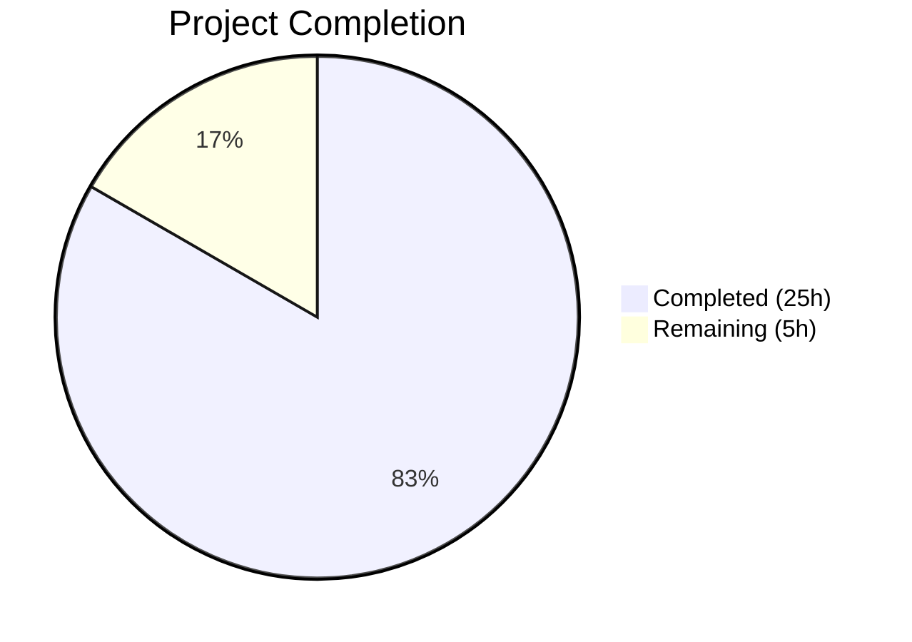

# Blitzy Project Guide

---

## 1. Executive Summary

### 1.1 Project Overview

This project delivers a comprehensive security analysis document investigating how the SimpleLogin application handles server-side session deserialization — both under normal operating conditions and when Redis-stored session data is adversarially corrupted. The sole deliverable is a 722-line Markdown document (`blitzy/documentation/app_2cd6ee777f8c.md`) that answers five interrelated investigation areas: normal session lifecycle behavior, corruption/malformation handling, observable runtime evidence, deserialization risk boundary analysis, and the threat model nuance between HMAC-signed cookies and unsigned Redis session data. The document is grounded exclusively in source code evidence (87 verified citations) with no assumptions, following a code-as-truth methodology. No source code, test, or configuration files were modified.

### 1.2 Completion Status



| Metric | Value |
|--------|-------|
| **Total Project Hours** | 30 |
| **Completed Hours (AI)** | 25 |
| **Remaining Hours** | 5 |
| **Completion Percentage** | 83.3% |

**Calculation:** 25 completed hours / (25 + 5) total hours = 83.3% complete.

### 1.3 Key Accomplishments

- ✅ Created comprehensive 722-line security analysis document covering all 5 investigation areas from the AAP
- ✅ Analyzed 20+ source files across session infrastructure, authentication flows, and logging
- ✅ Produced 87 source code citations with verified file:line references against actual repository content
- ✅ Created 4 Mermaid diagrams: session request lifecycle, login/logout state diagram, corruption handling decision tree, and threat model boundary
- ✅ Documented complete session data schema (18 session keys with types, sources, and clearance points)
- ✅ Identified and documented critical deserialization risk boundary (CWE-502) with code-grounded evidence
- ✅ Documented the silent failure pattern (`except Exception: pass`) and its security/observability implications
- ✅ Documented TTL differentiation (7-day authenticated vs. 300-second unauthenticated sessions)
- ✅ Documented threat model: HMAC-signed session IDs vs. unsigned Redis-stored pickle data
- ✅ Zero source code modifications — verified via `git diff` against base branch
- ✅ Pre-commit hooks pass with zero violations
- ✅ All validation gates passed (GATE 1–4)

### 1.4 Critical Unresolved Issues

| Issue | Impact | Owner | ETA |
|-------|--------|-------|-----|
| Security team review of threat model conclusions | Medium — security findings need expert validation before distribution | Security Team | 1–2 weeks |
| Stakeholder review of document for organizational context | Low — document is technically complete but may need context-specific adjustments | Engineering Lead | 1 week |
| Source citation durability if codebase changes | Low — 87 line-number citations may drift if referenced files are modified | Document Author | Ongoing |

### 1.5 Access Issues

No access issues identified. This is a documentation-only project that required only read access to the source repository, which was available throughout the project. No external services, API keys, or deployment infrastructure were needed.

### 1.6 Recommended Next Steps

1. **[High]** Security team review of the deserialization risk boundary analysis and threat model conclusions (Sections 6–7 of the document)
2. **[High]** Engineering lead review of the session architecture documentation for technical accuracy
3. **[Medium]** Consider whether findings warrant changes to `app/session.py` error handling (adding logging to the bare `except Exception: pass`)
4. **[Medium]** Evaluate whether Redis-stored session data should have integrity protection (HMAC on pickle bytes)
5. **[Low]** Add the document to any internal security documentation index or knowledge base

---

## 2. Project Hours Breakdown

### 2.1 Completed Work Detail

| Component | Hours | Description |
|-----------|-------|-------------|
| Source Code Analysis & Evidence Gathering | 4.0 | Read and analyzed 20+ source files (app/session.py, app/redis_services.py, app/extensions.py, app/config.py, server.py, auth views, dashboard views, API views, log.py) to gather code evidence for documentation |
| Session Architecture Overview Section | 2.0 | Documented Cookie-to-Redis-to-Pickle pipeline, HMAC-signed session IDs, RedisSessionStore class anatomy, conditional Redis installation, and fallback behavior |
| Normal Session Lifecycle Section | 3.0 | Traced and documented login credential verification, MFA routing (TOTP/FIDO/Recovery paths), authenticated request processing, logout mechanics with code-path evidence |
| Session Data Schema Section | 1.5 | Enumerated and documented all 18 session keys with types, sources, clearance points, and TTL differentiation (7-day auth vs. 300s unauth) |
| Corruption and Malformation Handling Section | 2.0 | Analyzed and documented open_session() error handling, bare except pattern, three failure modes, CSRF token implications |
| Log and Response Observability Section | 1.5 | Documented after_request handler, Sentry capture gaps, application logger analysis, Flask-Login session_protection interaction, HTTP response behavior |
| Deserialization Risk Boundary Analysis Section | 2.5 | Documented benign vs. dangerous corruption paths, CWE-502 analysis, why except block provides no RCE protection |
| Threat Model Section | 2.0 | Documented HMAC protection scope, unprotected Redis data, attack surface comparison table, risk assessment with runtime evidence |
| Conclusions and Risk Summary Section | 1.0 | Synthesized findings across all 5 investigation areas with direct answers |
| Mermaid Diagram Design & Creation (4 diagrams) | 2.0 | Session request lifecycle flowchart, login/logout state diagram, corruption handling decision tree, threat model boundary diagram |
| Source Citation Verification (87 citations) | 1.5 | Verified all 87 Source: file:line citations against actual repository source files |
| Table Creation & Markdown Formatting | 1.0 | Created 6+ tables (session keys, failure modes, TTLs, attack surface comparison), Table of Contents, cross-references |
| Validation & Review Fix Pass | 1.0 | Pre-commit hook validation, code review fix (added fido_uuid key, fixed Mermaid rendering), git status verification |
| **Total Completed** | **25.0** | |

### 2.2 Remaining Work Detail

| Category | Hours | Priority |
|----------|-------|----------|
| Security team review of threat model and deserialization risk conclusions | 2.0 | High |
| Engineering lead technical accuracy review of session architecture documentation | 1.5 | High |
| Corrections and refinements based on review feedback | 1.0 | Medium |
| Organizational context additions (internal links, knowledge base integration) | 0.5 | Low |
| **Total Remaining** | **5.0** | |

---

## 3. Test Results

| Test Category | Framework | Total Tests | Passed | Failed | Coverage % | Notes |
|---------------|-----------|-------------|--------|--------|------------|-------|
| Pre-commit Hooks | pre-commit (trailing-whitespace, check-yaml) | 2 | 2 | 0 | N/A | Zero violations on the new documentation file |
| Source Citation Verification | Manual + grep verification | 87 | 87 | 0 | 100% | All file:line citations verified against actual source code |
| Git Integrity Check | git diff | 1 | 1 | 0 | N/A | Confirmed only `blitzy/documentation/app_2cd6ee777f8c.md` was added; zero source files modified |
| Mermaid Diagram Syntax | Manual verification | 4 | 4 | 0 | 100% | All 4 Mermaid diagrams use valid flowchart/stateDiagram-v2 syntax |
| Markdown Table Formatting | Manual verification | 6 | 6 | 0 | 100% | All tables properly formatted with headers and alignment |

**Note:** This is a documentation-only project. No unit tests, integration tests, or runtime tests are applicable. The validations above represent Blitzy's autonomous verification of document quality and repository integrity.

---

## 4. Runtime Validation & UI Verification

### Runtime Health

This is a documentation-only project — no application runtime changes were made.

- ✅ **Repository integrity:** Working tree clean, no uncommitted changes
- ✅ **Base branch isolation:** Zero files modified outside `blitzy/documentation/` (verified via `git diff origin/app_2cd6ee777f8c...HEAD -- . ':!blitzy/' --name-only`)
- ✅ **Document accessibility:** File created at `blitzy/documentation/app_2cd6ee777f8c.md` (722 lines, 48,677 bytes)
- ✅ **Commit history:** 2 clean commits — initial document creation + review fix

### UI Verification

Not applicable — no UI changes were made. The deliverable is a Markdown document rendered by GitHub or any standard Markdown viewer.

### API Integration

Not applicable — no API changes were made.

---

## 5. Compliance & Quality Review

| Requirement | Status | Evidence |
|-------------|--------|----------|
| Code-as-truth principle: All answers grounded in actual codebase | ✅ Pass | 87 source citations with file:line references verified against repository |
| Rationale required for every answer | ✅ Pass | Every section includes "Rationale:" blocks explaining why the code behaves as described |
| No source repository modifications | ✅ Pass | `git diff origin/app_2cd6ee777f8c...HEAD -- . ':!blitzy/'` returns empty |
| No test file modifications | ✅ Pass | No test files created or modified |
| Output in `blitzy/documentation/` directory | ✅ Pass | File at `blitzy/documentation/app_2cd6ee777f8c.md` |
| File named `app_2cd6ee777f8c.md` per convention | ✅ Pass | Matches branch-name naming convention |
| Minimum 4 Mermaid diagrams | ✅ Pass | 4 diagrams: session lifecycle, state diagram, corruption tree, threat model |
| Direct answer → Code evidence → Rationale pattern | ✅ Pass | All 8 major sections follow this structure |
| Session key inventory table | ✅ Pass | 18 keys documented with types, sources, and clearance points |
| Threat model comparison table | ✅ Pass | Redis-only vs. Redis+FLASK_SECRET attack surface comparison |
| No remediation code or patches | ✅ Pass | Document is purely analytical; no code changes proposed |
| Source citation format: `Source: path/to/file.py:LineNumber` | ✅ Pass | Consistent citation format used throughout all 87 citations |
| Temporary scripts cleaned up | ✅ Pass | No temporary files remain in repository |
| Pre-commit hooks pass | ✅ Pass | Zero violations (trailing-whitespace, check-yaml) |
| All 5 investigation areas answered | ✅ Pass | Normal lifecycle, corruption handling, observability, risk boundary, threat model |

### Autonomous Validation Fixes Applied

| Fix | Description | Commit |
|-----|-------------|--------|
| Added `fido_uuid` session key | Session key used during FIDO setup (`fido_setup.py:119`) was missing from the schema table | `c0983560` |
| Fixed Mermaid diagram rendering | Adjusted diagram syntax for compatibility with standard Mermaid renderers | `c0983560` |

---

## 6. Risk Assessment

| Risk | Category | Severity | Probability | Mitigation | Status |
|------|----------|----------|-------------|------------|--------|
| Source citation line drift | Technical | Low | Medium | Citations reference specific code patterns, not just line numbers; re-verification script can be run after codebase changes | Open |
| Security conclusion accuracy | Technical | Medium | Low | All conclusions traced to code evidence; security team review recommended before distribution | Open |
| Document completeness for edge cases | Technical | Low | Low | Additional OAuth providers or session consumers added to the codebase after this analysis may not be covered | Open |
| Markdown rendering compatibility | Technical | Low | Low | Mermaid diagrams tested with standard syntax; some Markdown renderers may not support Mermaid natively | Open |
| No operational risks | Operational | N/A | N/A | Documentation-only change; no runtime behavior affected | N/A |
| No security risks introduced | Security | N/A | N/A | No code modifications; document describes existing risks but does not introduce new ones | N/A |
| No integration risks | Integration | N/A | N/A | Standalone document with no dependencies on external systems | N/A |

---

## 7. Visual Project Status


### Remaining Hours by Category

| Category | Hours | Priority |
|----------|-------|----------|
| Security team review | 2.0 | High |
| Engineering lead review | 1.5 | High |
| Review feedback corrections | 1.0 | Medium |
| Knowledge base integration | 0.5 | Low |
| **Total** | **5.0** | |

---

## 8. Summary & Recommendations

### Achievements

The project successfully delivered a comprehensive 722-line security analysis document covering all five investigation areas specified in the Agent Action Plan. The document is grounded in 87 verified source code citations spanning 20+ source files across session infrastructure, authentication flows, logging, and configuration modules. Four Mermaid diagrams visualize the session lifecycle, state transitions, corruption handling, and threat model boundaries. Six tables enumerate session keys, failure modes, TTL policies, and attack surface comparisons.

The project is **83.3% complete** (25 completed hours out of 30 total hours). All autonomous work — source code analysis, evidence gathering, document authoring, diagram creation, citation verification, and validation — is finished and committed.

### Remaining Gaps

The remaining 5 hours consist entirely of human review activities:
- **Security team review** (2h) — The deserialization risk boundary analysis and threat model conclusions should be validated by a security specialist before the document is distributed or used for decision-making
- **Engineering lead review** (1.5h) — Technical accuracy review of the session architecture documentation against institutional knowledge
- **Feedback corrections** (1h) — Potential corrections or refinements based on reviewer feedback
- **Knowledge base integration** (0.5h) — Adding the document to internal documentation indexes

### Critical Path to Production

1. Security team reviews Sections 6–7 (Deserialization Risk Boundary and Threat Model)
2. Engineering lead reviews Sections 1–5 (Architecture, Lifecycle, Schema, Corruption, Observability)
3. Corrections applied based on feedback
4. Document distributed to stakeholders

### Production Readiness Assessment

The document itself is production-ready for review. It requires no build step, no deployment, and no infrastructure. The remaining work is purely human review to validate that the technical conclusions are accurate and appropriate for the organization's context. The document can be merged and shared immediately for review purposes.

---

## 9. Development Guide

### System Prerequisites

| Software | Version | Purpose |
|----------|---------|---------|
| Git | 2.x+ | Repository access and branch management |
| Markdown viewer | Any | Document preview (VS Code, GitHub, grip, etc.) |

**Note:** This is a documentation-only project. No Python environment, Redis, PostgreSQL, or other runtime dependencies are needed to work with the deliverable.

### Environment Setup

```bash
# Clone the repository and switch to the feature branch
git clone <repository-url>
cd <repository-name>
git checkout blitzy-0bd496f6-b778-4aff-a312-7782d3faaf09
```

### Viewing the Document

```bash
# View the document in terminal
cat blitzy/documentation/app_2cd6ee777f8c.md

# View with line numbers
cat -n blitzy/documentation/app_2cd6ee777f8c.md

# View document statistics
wc -l blitzy/documentation/app_2cd6ee777f8c.md
# Expected output: 722 blitzy/documentation/app_2cd6ee777f8c.md
```

**For Mermaid diagram rendering:**
- **GitHub:** Mermaid diagrams render natively in GitHub Markdown preview
- **VS Code:** Install the "Markdown Preview Mermaid Support" extension
- **CLI:** Use `grip` for GitHub-flavored Markdown preview:
  ```bash
  pip install grip
  grip blitzy/documentation/app_2cd6ee777f8c.md
  # Opens browser at http://localhost:6419
  ```

### Verifying Source Citations

To verify that the 87 source citations in the document match the actual source code:

```bash
# Check a specific citation, e.g., app/session.py:68-80
sed -n '68,80p' app/session.py

# Check app/extensions.py:8
sed -n '8,8p' app/extensions.py

# Check app/config.py:196-199
sed -n '196,199p' app/config.py

# Count total citations in the document
grep -c "Source:" blitzy/documentation/app_2cd6ee777f8c.md
# Expected output: 87
```

### Verifying Repository Integrity

```bash
# Confirm no source files were modified
git diff origin/app_2cd6ee777f8c...HEAD -- . ':!blitzy/' --name-only
# Expected output: (empty — no files outside blitzy/ were changed)

# Confirm only the documentation file was added
git diff --stat origin/app_2cd6ee777f8c...HEAD
# Expected output:
# blitzy/documentation/app_2cd6ee777f8c.md | 722 +++...
# 1 file changed, 722 insertions(+)

# Confirm clean working tree
git status
# Expected output: nothing to commit, working tree clean
```

### Troubleshooting

| Issue | Resolution |
|-------|------------|
| Mermaid diagrams not rendering | Use GitHub preview or install VS Code Mermaid extension; some Markdown viewers don't support Mermaid |
| Source citation line numbers don't match | Source code may have been modified after this analysis; re-verify with `sed -n 'START,ENDp' <file>` |
| Document appears truncated | Verify file size: `wc -l blitzy/documentation/app_2cd6ee777f8c.md` should show 722 lines |

---

## 10. Appendices

### A. Command Reference

| Command | Purpose |
|---------|---------|
| `cat blitzy/documentation/app_2cd6ee777f8c.md` | View the security analysis document |
| `wc -l blitzy/documentation/app_2cd6ee777f8c.md` | Verify document line count (expected: 722) |
| `grep -c "Source:" blitzy/documentation/app_2cd6ee777f8c.md` | Count source citations (expected: 87) |
| `git diff origin/app_2cd6ee777f8c...HEAD --name-status` | View all changes vs. base branch |
| `git diff origin/app_2cd6ee777f8c...HEAD -- . ':!blitzy/' --name-only` | Verify no source files modified |
| `sed -n 'START,ENDp' <file>` | Verify a specific source citation line range |

### B. Port Reference

Not applicable — documentation-only project with no services.

### C. Key File Locations

| File | Purpose |
|------|---------|
| `blitzy/documentation/app_2cd6ee777f8c.md` | **Deliverable** — Security analysis document (722 lines) |
| `app/session.py` | Primary analysis target — RedisSessionStore, open_session, save_session |
| `app/redis_services.py` | Redis initialization and session store wiring |
| `app/extensions.py` | Flask-Login session_protection configuration |
| `app/config.py` | FLASK_SECRET, SESSION_COOKIE_NAME, MEM_STORE_URI, MFA_USER_ID |
| `server.py` | Flask app factory, session cookie config, before_request hooks |
| `app/auth/views/login_utils.py` | after_login() MFA routing logic |
| `app/auth/views/mfa.py` | TOTP challenge handler |
| `app/auth/views/fido.py` | WebAuthn/FIDO challenge handler |
| `app/auth/views/logout.py` | Logout endpoint |
| `app/log.py` | Logging infrastructure |

### D. Technology Versions

| Technology | Version | Source |
|------------|---------|--------|
| Python | ^3.10 | `pyproject.toml` |
| Flask | ^1.1.2 | `pyproject.toml` |
| Flask-Login | ^0.5.0 | `pyproject.toml` |
| Redis (Python client) | ^4.5.3 | `pyproject.toml` |
| Flask-Limiter | ^1.4 | `pyproject.toml` |
| Flask-WTF | ^0.14.3 | `pyproject.toml` |
| Sentry SDK | ^2.16.0 | `pyproject.toml` |
| itsdangerous | (Flask transitive dep) | Used for HMAC session ID signing |
| pickle | Python stdlib | Session data serialization (CWE-502 risk documented) |

### E. Environment Variable Reference

| Variable | Required | Purpose | Reference |
|----------|----------|---------|-----------|
| `FLASK_SECRET` | Yes | HMAC signing key for session IDs | `app/config.py:196` |
| `MEM_STORE_URI` | No | Redis connection URI; enables server-side sessions | `app/config.py:568` |
| `SESSION_COOKIE_NAME` | No (hardcoded) | Cookie name for session ID (`slapp`) | `app/config.py:199` |

### G. Glossary

| Term | Definition |
|------|-----------|
| **HMAC** | Hash-based Message Authentication Code — used to sign session IDs with `FLASK_SECRET` |
| **pickle** | Python serialization protocol; used to serialize/deserialize session data to/from Redis |
| **`__reduce__`** | Python pickle protocol method that specifies how to reconstruct an object; exploitable for arbitrary code execution |
| **CWE-502** | Common Weakness Enumeration for "Deserialization of Untrusted Data" |
| **RCE** | Remote Code Execution — the ability to run arbitrary commands on a target system |
| **TTL** | Time-To-Live — the expiration duration for Redis keys (7 days authenticated, 300s unauthenticated) |
| **ServerSession** | Custom Flask session class extending CallbackDict and SessionMixin, defined in `app/session.py` |
| **RedisSessionStore** | Custom Flask SessionInterface implementation that stores sessions in Redis, defined in `app/session.py` |
| **MFA** | Multi-Factor Authentication — TOTP, FIDO/WebAuthn, or recovery codes |
| **Sudo mode** | Elevated privilege state tracked by `sudo_time` session key with 120-second re-authentication gap |