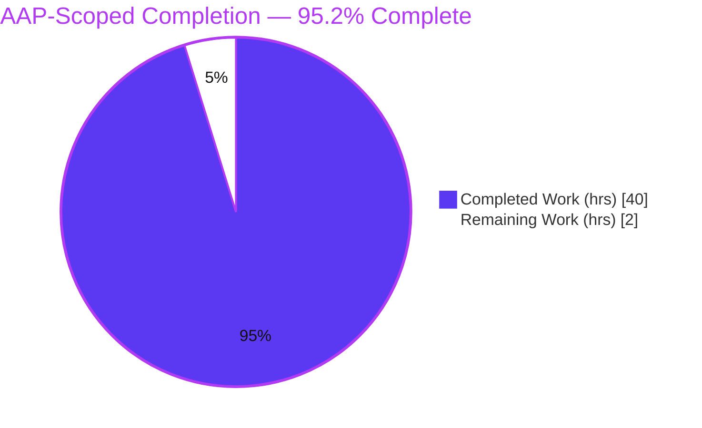
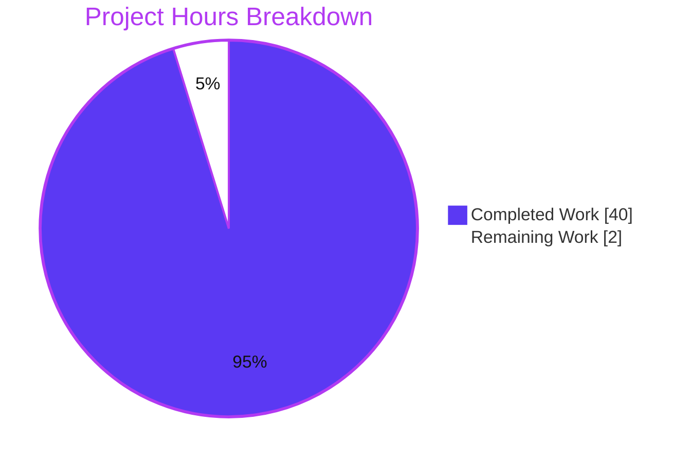
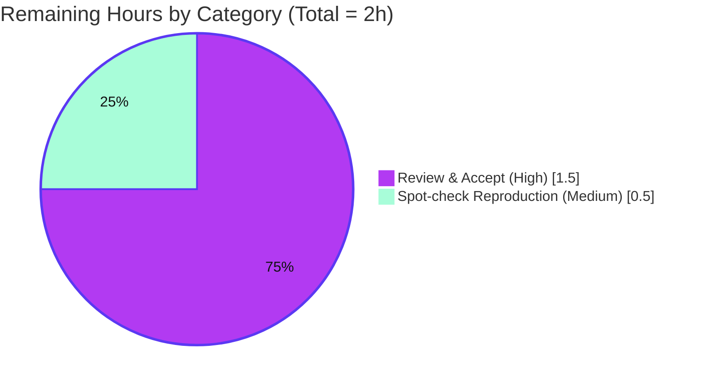

# Blitzy Project Guide — SimpleLogin Runtime Q&A Documentation

> **Task type:** Read-only runtime Q&A investigation (rule set `SWE-AtlasQnA-Repo`).
> **Deliverable:** a single evidence-backed Markdown answer document — `blitzy/documentation/app_2cd6ee777f8c.md`.
> **Branch:** `blitzy-19312d7e-6cc6-4b7b-b329-47abb71fdf6c` · **HEAD:** `6f393e20` · **Base:** `2cd6ee77`.

---

## 1. Executive Summary

### 1.1 Project Overview

This project answers a first-time operator's questions about bringing up and observing the **SimpleLogin** self-hosted email-alias backend locally. It is a **read-only investigation**, not a code change: the sole deliverable is one evidence-backed Markdown report that answers three operator question groups — **Q1** startup/readiness signals, **Q2** the new-user `register → verify → log in → dashboard` walkthrough, and **Q3** the behind-the-scenes background jobs and internal services. Every claim is grounded in a `file:line` reference plus the actual captured runtime output produced against the running system in its default canonical configuration. The audience is operators and engineers standing up SimpleLogin for the first time.

### 1.2 Completion Status

The completion percentage is computed with the PA1 AAP-scoped, hours-based methodology: only work defined by the Agent Action Plan (the answer document and its sub-requirements) plus standard path-to-production (human review/acceptance) is counted.



| Metric | Value |
|--------|-------|
| **Total Hours** | **42** |
| **Completed Hours (AI + Manual)** | **40** (AI = 40, Manual = 0) |
| **Remaining Hours** | **2** |
| **Percent Complete** | **95.2%** (40 / 42) |

> **Legend:** Completed = **Dark Blue `#5B39F3`** · Remaining = **White `#FFFFFF`**.

### 1.3 Key Accomplishments

- ✅ **Single deliverable created at the exact required path** — `blitzy/documentation/app_2cd6ee777f8c.md` (1,255 lines / 72,860 bytes), creating the new `blitzy/documentation/` directory.
- ✅ **Q1 fully answered** — all 10 startup/readiness signals across the 5 canonical processes observed live (Gunicorn boot on `:7777`, `>>> init logging <<<`, email handler `:20381`, event-listener wiring, job-runner idle, `yacron` spawns, `GET /health → 200 success`, login-card render, per-request access log, blueprint registration, boot seeding).
- ✅ **Q2 fully answered** — `register → verify → login → dashboard` driven through the real `/auth` endpoints, with `activated` flag observed `before → during → after`, plus all **8 edge/error cases** (invalid code, wrong password, not-activated login, resend, expired code, disabled account, scheduled deletion, `DISABLE_REGISTRATION`).
- ✅ **Q3 fully answered** — background jobs and internal services shown active and communicating: `User.create` provisioning, event-dispatcher gate, `swaks` email forward on `:20381 → "250 Message accepted"`, job-runner `~10.02s` poll stable across 2 runs, the real `delete-account` enqueue+drain, and cron `send_undelivered_mails` on `*/5` (~300s) across 20 runs.
- ✅ **Evidence discipline** — 118/118 `file:line` citations verified (structurally in-range and semantically accurate against base `2cd6ee77`); every behavioral claim paired with its command and complete captured output; inferred-vs-observed rigorously labeled.
- ✅ **Read-only compliance** — the entire source tree is byte-for-byte unchanged; the only file that differs from base is the deliverable.
- ✅ **Clean-up verified** — all temporary users/aliases/jobs/events and observation scripts removed; database restored to the exact seed baseline.

### 1.4 Critical Unresolved Issues

There are **no critical unresolved issues**. The AAP-scoped deliverable is complete, validated, and committed. The two items below are intentional, correctly-labeled observation findings — not defects — surfaced here for reviewer awareness.

| Issue | Impact | Owner | ETA |
|-------|--------|-------|-----|
| AAP expected the activation link to be printed to the log under `NOT_SEND_EMAIL`; live observation shows it is **not** printed (only subject/from/to) — honestly reported as "AAP expectation not reproduced" [`app/mail_sender.py:L130-L137`] | Informational only — improves accuracy; no defect | Reviewer (acknowledge) | Covered in review (1.5h) |
| Q3.3 full event `persist → NOTIFY → consume` path is demonstrated via a **labeled non-canonical diagnostic** because the canonical path short-circuits at the dispatcher gate when `EVENT_WEBHOOK` is unset [`app/events/event_dispatcher.py:L62`] | Informational only — clearly labeled NON-CANONICAL | Reviewer (acknowledge) | Covered in review (1.5h) |

### 1.5 Access Issues

**No access issues identified.** The investigation ran entirely within the user-provided canonical Docker image using the default `example.env` configuration; no external credentials, repository permissions, or third-party API access were required or blocked.

| System/Resource | Type of Access | Issue Description | Resolution Status | Owner |
|-----------------|----------------|-------------------|-------------------|-------|
| — | — | No access issues identified | N/A | — |

### 1.6 Recommended Next Steps

1. **[High]** Review and accept the answer document `blitzy/documentation/app_2cd6ee777f8c.md`; confirm Q1/Q2/Q3 are answered to operator satisfaction and acknowledge the two labeled findings in §1.4. *(≈1.5h)*
2. **[Medium]** Optionally reproduce the canonical bring-up (§9) and re-run 2–3 key commands (`/health`, `POST /auth/register`, `swaks` forward) to confirm the captured output. *(≈0.5h)*
3. **[Low]** *Conditional only* — if the deliverable is later rebased onto a base newer than `2cd6ee77`, re-verify the 118 `file:line` citations against the new source (they are pinned to HEAD `2cd6ee77`). *(0h counted; situational)*

---

## 2. Project Hours Breakdown

### 2.1 Completed Work Detail

Every completed component traces to a specific AAP requirement (R1–R10). All hours are autonomous (AI) work.

| Component | Hours | Description |
|-----------|-------|-------------|
| Environment bring-up & canonical config (R6, R7) | 4 | `docker run` canonical image → venv → `cp example.env .env` (unmodified) → `service postgresql/redis` → `alembic upgrade head` (head `32f25cbf12f6`, 77 tables) → `flask dummy-data` → launch the 5 long-running processes |
| Q1 readiness observation & capture (R2) | 5 | 10 startup/readiness signals across the 5 processes + HTTP probes (`/health`, `/auth/login`, per-request access log, blueprint registration, `init_app.py` seeding) |
| Q2 walkthrough + 8 edge cases (R3) | 7 | `register → verify → login → dashboard` via real `/auth` endpoints with `activated` flag before/during/after, plus 8 edge/error cases each with state transitions |
| Q3 behind-the-scenes observation (R4) | 9 | 8 subsections: `User.create`, event dispatcher gate + non-canonical mechanism diagnostic, `swaks` email forward `:20381`, job-runner `~10.02s` poll (×2 runs), real `delete-account` drain, cron `*/5` (×20 runs), monitoring |
| Document authoring (R1, R5, R8) | 7 | 1,255-line evidence-backed report — direct-answer-first, default-config table, per-signal command+output blocks, coverage checklist |
| QA ×5 rounds + final validation (R5, R9, R10) | 8 | 118-citation re-verification (structural + semantic), runtime re-runs (zero mismatch), 2 numeric fixes, temp-data cleanup, read-only proof |
| **Total Completed** | **40** | **Matches Completed Hours in §1.2** |

### 2.2 Remaining Work Detail

Each remaining category is standard path-to-production (human review/acceptance).

| Category | Hours | Priority |
|----------|-------|----------|
| Human review & acceptance of the answer document (Rm1) | 1.5 | High |
| Optional operator spot-check reproduction of key commands/citations (Rm2) | 0.5 | Medium |
| **Total Remaining** | **2.0** | — |

> **Cross-check:** §2.1 Completed (40) + §2.2 Remaining (2) = **42** = Total Project Hours in §1.2. §2.2 total (2) = §1.2 Remaining (2) = §7 pie "Remaining Work" (2). ✔

### 2.3 Basis of Estimate

Hours reflect a thorough runtime investigation: bringing up 5 canonical processes, exercising 3 question groups across 26 documented subsections (including 8 edge cases and timing observations repeated across ≥2 runs), authoring an evidence-backed 1,255-line report, and 5 QA rounds plus final validation. Confidence is **High** — the deliverable exists, is committed, and every claim was independently re-verified.

---

## 3. Test Results

For a read-only documentation task the applicable autonomous validation is **(a) citation verification** and **(b) runtime reproduction of every documented behavior**. There is no application code change and no test file was created or modified.

| Test Category | Framework / Method | Total | Passed | Failed | Coverage % | Notes |
|---------------|--------------------|-------|--------|--------|-----------|-------|
| Citation verification | `git` @ `2cd6ee77` + `sha256` + manual semantic check | 118 | 118 | 0 | 100% | Structurally in-range **and** semantically accurate; 17 key files byte-verified |
| Q1 readiness reproduction | Live container (`docker exec`, `curl`, log tail) | 10 | 10 | 0 | 100% | 10 signals across 5 processes |
| Q2 walkthrough reproduction | Live HTTP (`/auth/*`) + `psql` state inspection | 13 | 13 | 0 | 100% | 5 happy-path confirmations + 8 edge/error cases |
| Q3 behind-the-scenes reproduction | Live (`swaks`, job runner, `psql`, `yacron`) | 7 | 7 | 0 | 100% | Incl. 1 labeled non-canonical diagnostic; `§3.8` monitoring is inferred (not counted) |
| Read-only & cleanup verification | `git status`/`diff` + `psql` baseline query | 2 | 2 | 0 | 100% | Tree unchanged; DB restored to seed baseline |
| **Total** | — | **150** | **150** | **0** | **100%** | 118 citations + 32 runtime/state checks |

> **Integrity note:** all rows above originate from **Blitzy's autonomous validation logs** for this project. The repository's own Python unit-test suite (639 tests) was **intentionally not run** — it is out of scope for a read-only documentation task (no test file was touched), and per setup notes the suite hangs offline (network-dependent tests, no `pytest-timeout`). The applicable validation for this deliverable (citations + live behavior) passed 100%.

---

## 4. Runtime Validation & UI Verification

**Runtime health — the 5 canonical processes + infrastructure (all observed live):**

- ✅ **Operational** — Webapp on `:7777` (Gunicorn master + 2 workers); `GET /health → HTTP 200`, body `success`; `GET /auth/login → HTTP 200` (6,918 bytes).
- ✅ **Operational** — Email handler (`aiosmtpd`) on `:20381`; test message external-sender → alias → mailbox finishes `250 Message accepted for delivery`.
- ✅ **Operational** — Job runner; `~10.02s` poll cadence stable across 2 runs; drains the real `delete-account` job end-to-end.
- ✅ **Operational** — Event listener; `PostgresEventSource` + `HttpEventSink` wired, `Starting to listen to events`.
- ✅ **Operational** — Cron (`yacron`); `send_undelivered_mails` spawns on the `*/5` (~300s) schedule across 20 runs.
- ✅ **Operational** — PostgreSQL 15.13 (schema head `32f25cbf12f6`, 77 tables) + Redis 7.0.15.

**UI verification (rendered output captured):**

- ✅ **Operational** — Login card renders `Welcome back!` with `email`, `password`, and hidden `csrf_token` inputs and the `Log in` button.
- ✅ **Operational** — Registration renders the `register_waiting_activation.html` "check your inbox" page.
- ✅ **Operational** — Verification flashes **"Your account has been activated"** and 302-redirects to `/dashboard/`.
- ✅ **Operational** — Login redirects to `/dashboard/` (user forwarded into the dashboard as expected).

**API / integration outcomes:**

- ⚠ **Partial (by design)** — Event pipeline canonical path short-circuits at the dispatcher gate because `EVENT_WEBHOOK` is unset in default config; the full mechanism is shown via a labeled non-canonical diagnostic.
- ⚠ **Partial (by design)** — Under `NOT_SEND_EMAIL=true` the activation link is not printed to the log (only subject/from/to); reported honestly as "AAP expectation not reproduced".
- ⚠ **Inferred (not exercised)** — Monitoring / New Relic telemetry paths exist in code but are not exercised in the default local configuration (labeled inferred).

---

## 5. Compliance & Quality Review

Cross-map of AAP deliverables and `SWE-AtlasQnA-Repo` rules to quality benchmarks.

| Benchmark / AAP Rule | Requirement | Status | Progress | Evidence |
|----------------------|-------------|--------|----------|----------|
| Single deliverable, exact name/location | One `.md` at `blitzy/documentation/app_2cd6ee777f8c.md` | ✅ Pass | 100% | `git diff` shows `A` for exactly this file |
| Q1 answered by name | All readiness signals in logs + UI | ✅ Pass | 100% | §1.1–1.10; coverage checklist |
| Q2 answered by name | register → verify → login → dashboard + edges | ✅ Pass | 100% | §2.1–2.6 (incl. 8 edge cases) |
| Q3 answered by name | Background jobs + internal services, active & communicating | ✅ Pass | 100% | §3.1–3.8 |
| Run-first, evidence-driven | Live output before prose; command + output per claim | ✅ Pass | 100% | Command+output block in every subsection |
| Grounded in `file:line` | Every claim cites source | ✅ Pass | 100% | 118/118 citations verified |
| Inferred vs observed labeled | Non-observed items marked | ✅ Pass | 100% | 18 "inferred" + 21 non-canonical/diagnostic labels |
| Default canonical config | `example.env` unmodified; exact commands | ✅ Pass | 100% | §6.1 build/run commands |
| Read-only scope | No source modified; tree byte-for-byte unchanged | ✅ Pass | 100% | 0 non-deliverable files changed |
| Temp-data cleanup | Users/aliases/scripts removed; DB to baseline | ✅ Pass | 100% | §6.3 baseline query output |
| Markdown quality | Well-formed, balanced fences, single trailing newline | ✅ Pass | 100% | 58 balanced code blocks; single `\n` EOF |
| Secret hygiene | No live secrets in captured output | ✅ Pass | 100% | All redacted (`<redacted-*>`) |

**Fixes applied during autonomous validation:** earlier QA rounds resolved Q1 findings, Q3 component-naming/citation findings, and 10 dangling intra-document cross-references; the final validation pass corrected 2 stale numerics (§6.1 venv package count `182 → 180`; §6.2 git-stat `1224 → 1255` insertions) — committed as `6f393e20`.

**Outstanding compliance items:** none.

---

## 6. Risk Assessment

Overall posture is **Low** — expected for a read-only documentation deliverable that modifies zero source, adds zero runtime/deployment surface, and changes zero dependencies.

| Risk | Category | Severity | Probability | Mitigation | Status |
|------|----------|----------|-------------|------------|--------|
| Documentation drift — citations pinned to base `2cd6ee77` could go stale if rebased onto a newer base | Technical | Low | Medium | Doc explicitly pins branch/HEAD; re-verify citations on rebase | Mitigated / monitor |
| AAP expectation not reproduced (activation link not printed under `NOT_SEND_EMAIL`) | Technical | Low | N/A (materialized) | Honestly documented as observed-vs-expected divergence | Resolved / documented |
| Non-canonical diagnostic (Q3.3) could be misread as canonical | Technical | Low | Low | 21 explicit NON-CANONICAL/diagnostic labels | Mitigated |
| Secret leakage in captured output | Security | Low | Low | All session cookies, CSRF tokens, activation codes redacted | Mitigated |
| Inert temp credentials shown in prose | Security | Low | Low | Belong to now-deleted users; local `sl.local` under `NOT_SEND_EMAIL` | Mitigated / documented |
| Reproducibility coupling to exact image + default `example.env` | Operational | Low | Medium | Exact image tag, resolved versions, and default-config table stated | Mitigated |
| Benign pre-existing migration note (`pg_trgm CREATE EXTENSION` lacks `IF NOT EXISTS`) | Operational | Low | Low | Out of scope; worked around by clean-DB provisioning | Noted / out-of-scope |
| Full Python test suite (639 tests) not run | Integration | Low | N/A | Out of scope for read-only docs; suite hangs offline | Out-of-scope / documented |
| Production integrations (real email, webhook, New Relic) not exercised | Integration | Low | N/A | Default local config; labeled inferred/not-exercised | Documented as inferred |

---

## 7. Visual Project Status

**Project hours breakdown** (Completed = Dark Blue `#5B39F3`, Remaining = White `#FFFFFF`):



**Remaining hours by category (§2.2):**



> **Integrity check:** the "Remaining Work" value (2) equals the §1.2 Remaining Hours (2) and the sum of the §2.2 Hours column (1.5 + 0.5 = 2). ✔

---

## 8. Summary & Recommendations

**Achievements.** The project delivers exactly the one artifact the AAP scopes — an evidence-backed runtime Q&A report at `blitzy/documentation/app_2cd6ee777f8c.md` — that comprehensively answers Q1 (startup/readiness), Q2 (`register → verify → login → dashboard`, including 8 edge cases), and Q3 (background jobs and internal services). Every claim is grounded in a verified `file:line` citation plus captured live output; 118/118 citations passed verification and all documented behaviors reproduced with zero mismatch.

**Remaining gaps.** None within the AAP's autonomous scope. The only remaining work is standard path-to-production: **human review and acceptance** of the document (1.5h) and an optional reproducibility spot-check (0.5h) — **2h total**.

**Critical path to production.** Read the document → acknowledge the two labeled findings (activation-link-under-`NOT_SEND_EMAIL`; the non-canonical event diagnostic) → optionally reproduce a few commands → accept/merge.

**Production-readiness assessment.** The deliverable is **production-ready** for its purpose: it is complete, internally consistent, read-only-compliant (source tree byte-for-byte unchanged), and committed. The temporary database entities and observation scripts were removed and the database restored to the seed baseline.

**Completion.** Per the PA1 AAP-scoped methodology, the project is **95.2% complete** (40 of 42 hours), with the residual 2 hours being human review/acceptance that cannot, by definition, be performed autonomously.

| Success Metric | Result |
|----------------|--------|
| AAP requirements completed | 10 of 11 (R11 = human review, pending) |
| Citations verified | 118 / 118 (100%) |
| Runtime/state checks passed | 32 / 32 (100%) |
| Source files modified | 0 (read-only honored) |
| Completion (AAP-scoped) | 95.2% |

---

## 9. Development Guide

This guide reproduces the exact bring-up used for the investigation and shows how to view and verify the deliverable. All commands are copy-pasteable; version facts and default-config values were verified against source.

### 9.1 System Prerequisites

- **Docker** 20.10+ (verified host had 28.5.2) — to run the canonical image, **or** a native environment with **Python 3.10**, **PostgreSQL 13+**, and **Redis**.
- **Git** 2.x + **Git LFS** (repository uses LFS hooks).
- Canonical image: `ghcr.io/scaleapi/swe-atlas:swe_atlas_QnA_simple-login_app_1.0` (a.k.a. `andrewparkscaleai/coding-agent:simple-login__app__2cd6ee77…`).
- Optional for the email test: `swaks`.

### 9.2 Environment Setup

```bash
# Run the canonical image as one long-lived container, ports published
docker run -d --name simplelogin-app \
  --entrypoint bash \
  ghcr.io/scaleapi/swe-atlas:swe_atlas_QnA_simple-login_app_1.0 \
  -c "sleep infinity"

# Inside the container: activate the pre-built venv and use the DEFAULT config unmodified
docker exec -it simplelogin-app bash
source /app/venv/bin/activate          # Python 3.10.18
export FLASK_APP=server.py
cp -n /app/example.env /app/.env       # default config, auto-loaded via load_dotenv
```

Default configuration values that shape observed behavior (verified at the cited lines):

| Key | Value | `file:line` | Effect |
|-----|-------|-------------|--------|
| `URL` | `http://localhost:7777` | `example.env:L6` | Base URL in logs/links |
| `NOT_SEND_EMAIL` | `true` | `example.env:L19` | Email is printed (subject/from/to), not sent |
| `EMAIL_DOMAIN` | `sl.local` | `example.env:L22` | Alias domain |
| `DISABLE_ONBOARDING` | `true` | `example.env:L150` | `User.create` skips onboarding jobs |

### 9.3 Dependency Installation

The canonical image ships a pre-built virtualenv at `/app/venv` (180 packages). No install step is needed. For a native setup, install with Poetry from the pinned manifests:

```bash
pip install poetry
poetry install            # resolves from pyproject.toml / poetry.lock
```

Resolved runtime versions (verified live): Python **3.10.18**, flask **1.1.2**, SQLAlchemy **1.3.24**, gunicorn **20.0.4**, redis-py **4.6.0**, PostgreSQL **15.13**, Redis **7.0.15**.

### 9.4 Application Startup

```bash
# 1) Infrastructure
service postgresql start                # PostgreSQL — role myuser/mypassword, db simplelogin, :5432
service redis-server start              # Redis — :6379

# 2) Schema + seed
alembic upgrade head                    # head 32f25cbf12f6 → 77 tables
flask dummy-data                        # seeds john@wick.com/password (admin) + winston@continental.com

# 3) The five long-running processes
gunicorn wsgi:app -b 0.0.0.0:7777 -w 2 --timeout 15    # webapp
python email_handler.py                                # aiosmtpd :20381
python job_runner.py                                   # job runner
python event_listener.py listener                      # event listener
yacron -c /app/crontab.yml                             # cron scheduler
```

### 9.5 Verification Steps

```bash
# Webapp health — expect: HTTP/1.1 200 OK, body "success"
docker exec simplelogin-app curl -sS -i http://localhost:7777/health

# Login page — expect: HTTP 200 with the "Welcome back!" card
docker exec simplelogin-app curl -sS -o /tmp/login.html \
  -w "HTTP %{http_code} bytes=%{size_download}\n" http://localhost:7777/auth/login

# Confirm the five processes are running
docker exec simplelogin-app ps -eo pid,args | \
  grep -E 'gunicorn|email_handler|job_runner|event_listener|yacron'
```

Expected: `/health` returns `200` with body `success` [`server.py:L213-L215`]; `/auth/login` returns `200`; `ps` lists the Gunicorn master + workers, `email_handler.py`, `job_runner.py`, `event_listener.py listener`, and `yacron`.

### 9.6 Example Usage

```bash
# Register a temporary user (default config prints the email to the webapp log)
docker exec simplelogin-app curl -sS -c /tmp/jar -b /tmp/jar \
  -d "email=demo@example.com&password=Password123" \
  http://localhost:7777/auth/register        # → 200 "check your inbox" waiting page

# Log in with the seeded dummy account (after seeding)
#   john@wick.com / password  → redirects to /dashboard/

# Inject a test email to exercise alias forwarding on :20381
docker exec simplelogin-app swaks --to e1@sl.local --from hey@google.com \
  --server 127.0.0.1:20381                    # → "250 Message accepted for delivery"
```

### 9.7 View & Verify the Deliverable

```bash
# View the answer document
sed -n '1,80p' blitzy/documentation/app_2cd6ee777f8c.md

# Verify read-only compliance (expect: clean tree; only the deliverable added)
git status --porcelain                                   # (empty = clean)
git diff 2cd6ee77 HEAD --name-status                     # A  blitzy/documentation/app_2cd6ee777f8c.md
git diff 2cd6ee77 HEAD --stat                            # 1 file changed, 1255 insertions(+)
```

### 9.8 Troubleshooting

- **Migration `pg_trgm` extension error** — a pre-existing migration issues `CREATE EXTENSION` without `IF NOT EXISTS`. Provision against a clean database (as the canonical image does) to avoid it. Out of scope for this task.
- **No activation link in the log** — expected under `NOT_SEND_EMAIL=true`; only the email subject/from/to is printed [`app/mail_sender.py:L130-L137`]. Set a real mail configuration to send actual email.
- **Login works without Redis** — with `MEM_STORE_URI` unset, cookie sessions are used; Redis is still required for rate-limit/parallel-lock features.
- **Full test suite hangs** — the repository's 639-test suite depends on network access and has no `pytest-timeout`; it is unrelated to this read-only documentation deliverable and was not run.

---

## 10. Appendices

### A. Command Reference

| Purpose | Command |
|---------|---------|
| View deliverable | `sed -n '1,120p' blitzy/documentation/app_2cd6ee777f8c.md` |
| Read-only check | `git status --porcelain` · `git diff 2cd6ee77 HEAD --name-status` |
| Webapp health | `curl -sS -i http://localhost:7777/health` |
| Login page | `curl -sS -i http://localhost:7777/auth/login` |
| List processes | `ps -eo pid,args \| grep -E 'gunicorn\|email_handler\|job_runner\|event_listener\|yacron'` |
| Email forward test | `swaks --to e1@sl.local --from hey@google.com --server 127.0.0.1:20381` |
| Apply schema | `alembic upgrade head` |
| Seed data | `flask dummy-data` |

### B. Port Reference

| Port | Service | Source |
|------|---------|--------|
| 7777 | Webapp (Gunicorn / Flask) | `Dockerfile:L44` (`EXPOSE 7777`), `Dockerfile:L47` |
| 20381 | Email handler (`aiosmtpd`) | `email_handler.py` |
| 5432 | PostgreSQL | default |
| 6379 | Redis | default |

### C. Key File Locations

| File | Role |
|------|------|
| `blitzy/documentation/app_2cd6ee777f8c.md` | **The deliverable** (answer document) |
| `server.py` / `wsgi.py` | Webapp factory + WSGI entry (`/health` at `server.py:L213-L215`) |
| `email_handler.py` | `aiosmtpd` controller on `:20381` |
| `job_runner.py` | Database-backed job queue drainer |
| `event_listener.py` + `events/` + `app/events/` | Event pipeline (Postgres `LISTEN`/`NOTIFY` → HTTP sink) |
| `cron.py` + `crontab.yml` | `yacron`-scheduled maintenance jobs |
| `app/models.py` | `User.create`, `ActivationCode`, `Job`, `SyncEvent` |
| `example.env` | Default local configuration |

### D. Technology Versions

| Component | Version | Source |
|-----------|---------|--------|
| Python | 3.10.18 (constraint `^3.10`) | `pyproject.toml`, `Dockerfile:L8` |
| Flask | 1.1.2 | `pyproject.toml` |
| SQLAlchemy | 1.3.24 | `pyproject.toml` |
| Gunicorn | 20.0.4 | `pyproject.toml` |
| aiosmtpd | ^1.2 | `pyproject.toml` |
| redis-py | 4.6.0 (constraint `^4.5.3`) | `pyproject.toml` |
| yacron | ^0.11.1 | `pyproject.toml` |
| newrelic | 8.8.0 | `pyproject.toml` |
| PostgreSQL | 15.13 | runtime |
| Redis | 7.0.15 | runtime |
| Alembic schema head | `32f25cbf12f6` (77 tables) | runtime |

### E. Environment Variable Reference

| Variable | Default | Effect |
|----------|---------|--------|
| `URL` | `http://localhost:7777` | Base URL |
| `NOT_SEND_EMAIL` | `true` | Print email instead of sending |
| `EMAIL_DOMAIN` | `sl.local` | Alias domain |
| `DISABLE_ONBOARDING` | `true` | Skip onboarding jobs in `User.create` |
| `DISABLE_REGISTRATION` | unset (open) | When set, registration is disabled |
| `EVENT_WEBHOOK` | unset | When unset, event dispatcher short-circuits |
| `MEM_STORE_URI` | unset | When unset, cookie sessions are used |
| `FLASK_APP` | `server.py` | Flask CLI entry |

### F. Developer Tools Guide

| Tool | Use |
|------|-----|
| `docker` | Run the canonical image and `exec` into it |
| `alembic` | Apply DB migrations (`alembic upgrade head`) |
| `flask dummy-data` | Seed dummy users/aliases |
| `psql` | Inspect `users` / `alias` / `job` / `sync_event` tables |
| `redis-cli` | Inspect Redis state |
| `swaks` | Inject a test email into the handler on `:20381` |
| `curl` | Probe HTTP endpoints |
| `git` | Verify read-only status (`status`, `diff`) |

### G. Glossary

| Term | Meaning |
|------|---------|
| **AAP** | Agent Action Plan — the primary directive defining project scope |
| **Alias** | A SimpleLogin email address that forwards to a real mailbox |
| **Mailbox** | The real destination address behind an alias |
| **Job runner** | Process that drains the database-backed `Job` queue (~10s poll) |
| **Event pipeline** | `SyncEvent` persist + Postgres `NOTIFY` consumed by the event listener |
| **`NOT_SEND_EMAIL`** | Default flag that prints emails instead of sending them |
| **Canonical path** | The real entry point a normal user exercises (vs. a diagnostic) |
| **Seed baseline** | Database state after `flask dummy-data` (2 users, 11 aliases, 4 mailboxes) |

---

*This Blitzy Project Guide reflects the AAP-scoped completion of a read-only runtime Q&A documentation task. Completed = Dark Blue `#5B39F3`; Remaining = White `#FFFFFF`.*