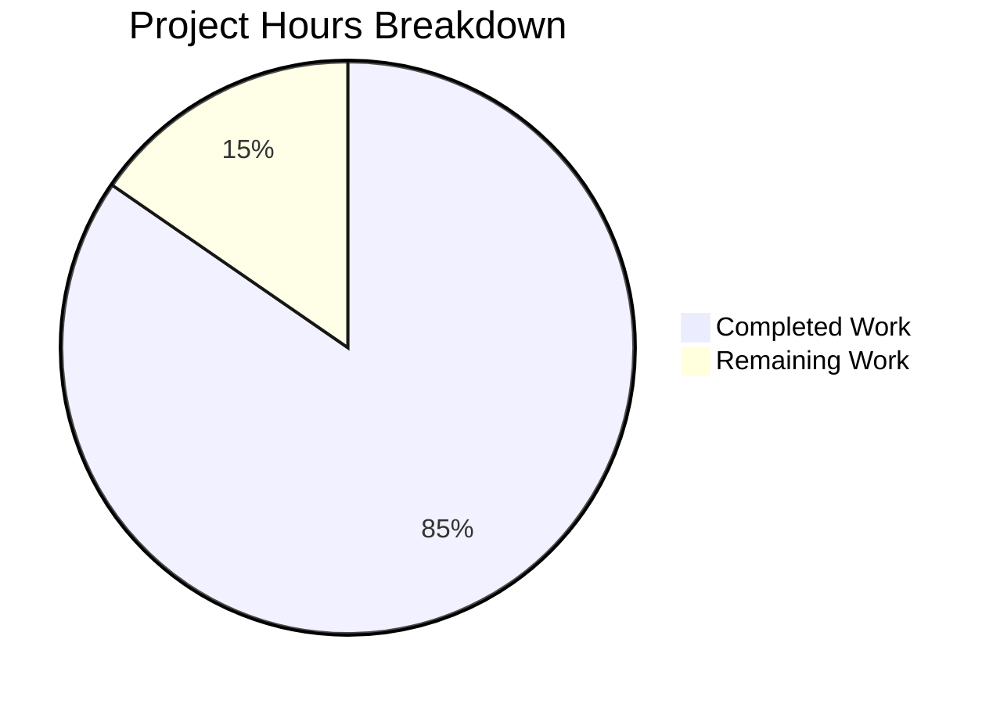

# Blitzy Project Guide

## 1. Executive Summary

### 1.1 Project Overview

This project delivers a comprehensive technical investigation document tracing the custom alias creation validation pathway in the SimpleLogin open-source email alias application. The sole deliverable is `blitzy/documentation/app_2cd6ee777f8c.md` — a 783-line Q&A document that answers five specific behavioral questions about HTTP responses, server log output, rate-limiting headers, quota enforcement logic, and component responsibility mapping. All findings are derived from static analysis of 13+ source code modules without modifying any existing repository files. The document serves developers and operators who need to understand the complete request lifecycle for `POST /api/v2/alias/custom/new` and `POST /api/v3/alias/custom/new` endpoints.

### 1.2 Completion Status


| Metric | Value |
|--------|-------|
| **Total Project Hours** | 26 |
| **Completed Hours (AI)** | 22 |
| **Remaining Hours** | 4 |
| **Completion Percentage** | 84.6% |

**Calculation:** 22 completed hours / (22 + 4) total hours = 84.6% complete

### 1.3 Key Accomplishments

- [x] Created `blitzy/documentation/app_2cd6ee777f8c.md` (783 lines) as the sole deliverable
- [x] Documented all HTTP status codes (400, 401, 403, 409, 412, 429) with verbatim JSON error payloads in a 14-entry error response table
- [x] Traced and documented 9 distinct `LOG.*` calls in the validation path with exact format template from `app/log.py`
- [x] Analyzed Flask-Limiter configuration and correctly concluded rate-limiting headers are NOT enabled by default (`RATELIMIT_HEADERS_ENABLED` not set)
- [x] Fully traced the `User.can_create_new_alias()` decision tree through 4 sub-methods and 2 configuration constants
- [x] Created 3 Mermaid flowcharts: execution flow diagram, quota check decision tree, and signed suffix validation flow
- [x] Mapped 8 components in the validation chain with responsibility matrix and rejection conditions
- [x] Documented v2 vs v3 API endpoint differences across 5 feature categories
- [x] Included 38 source code citations with specific file paths and line numbers
- [x] Provided Thinking/Rationale explanations for all 5 question sections
- [x] Applied 2 rounds of code review fixes (line citation corrections, content refinements)
- [x] Verified zero existing files modified — clean read-only investigation

### 1.4 Critical Unresolved Issues

| Issue | Impact | Owner | ETA |
|-------|--------|-------|-----|
| Documentation accuracy requires human verification against latest source | Low — all citations were verified at creation time but source may drift | Human Developer | 2 hours |
| Stakeholder review not yet completed | Low — blocks merge but not functionality | Project Lead | 1 hour |

### 1.5 Access Issues

No access issues identified. The project is a documentation-only deliverable requiring no external service access, API credentials, or database connections. The document was created through static analysis of source code already present in the repository.

### 1.6 Recommended Next Steps

1. **[High]** Review the 38 source code citations in the documentation for accuracy against the current `app_2cd6ee777f8c` branch
2. **[High]** Verify Mermaid diagrams render correctly on GitHub by viewing the file in the PR preview
3. **[Medium]** Gather stakeholder feedback on documentation completeness and clarity
4. **[Medium]** Approve and merge the PR to make the investigation document available to the team
5. **[Low]** Consider adding a cross-reference link from `docs/api.md` to the new investigation document (optional — was explicitly out of scope)

---

## 2. Project Hours Breakdown

### 2.1 Completed Work Detail

| Component | Hours | Description |
|-----------|-------|-------------|
| Source Code Analysis & Investigation | 4 | Read and analyzed 13+ source modules (`new_custom_alias.py`, `alias_suffix.py`, `models.py`, `extensions.py`, `parallel_limiter.py`, `rate_limiter.py`, `base.py`, `config.py`, `log.py`, `server.py`, `errors.py`, `custom_alias.py`, `alias_utils.py`) to extract validation behavior |
| Q1: HTTP Status Codes & Error Messages | 3 | Documented all HTTP status codes (400, 401, 403, 409, 412, 429) with verbatim JSON payloads; created 14-entry error response table; documented v2 vs v3 differences |
| Q2: Validation Log Entries | 2.5 | Extracted log format from `app/log.py`; documented 9 LOG calls in validation path; created realistic log line examples; cross-referenced dashboard variant |
| Q3: Rate-Limiting Headers Analysis | 2.5 | Analyzed Flask-Limiter configuration; determined headers NOT enabled; documented `ALIAS_LIMIT` values; covered parallel_limiter and bucket limiter behavior; created summary table |
| Q4: Quota Verification Flow | 3 | Traced `can_create_new_alias()` through `is_active()`, `disabled`, `lifetime_or_active_subscription()`, alias count check; documented `MAX_NB_EMAIL_FREE_PLAN` (5) and `MAX_NB_EMAIL_OLD_FREE_PLAN` (15); noted `is_premium()` trial distinction |
| Q5: Execution Path & Component Responsibility | 3 | Documented 5-layer decorator chain execution order; created 8-component responsibility matrix; mapped all rejection conditions |
| Mermaid Diagram Creation | 2 | Created 3 comprehensive Mermaid flowcharts: complete execution flow, quota check decision tree, signed suffix validation flow |
| References & Citation Verification | 1 | Compiled 16-entry references table with specific line ranges; verified all 38 citations against source code |
| Code Review Fixes & Validation | 1 | Applied 2 rounds of fixes: corrected v3 `name` field line citation from `:160` to `:162`; addressed 4 code review findings |
| **Total Completed** | **22** | |

### 2.2 Remaining Work Detail

| Category | Hours | Priority |
|----------|-------|----------|
| Human Review: Documentation Accuracy Verification | 2 | High |
| Stakeholder Review & Feedback Incorporation | 1 | Medium |
| PR Review & Merge | 1 | Medium |
| **Total Remaining** | **4** | |

---

## 3. Test Results

| Test Category | Framework | Total Tests | Passed | Failed | Coverage % | Notes |
|---------------|-----------|-------------|--------|--------|------------|-------|
| Content Completeness | Manual Validation | 5 | 5 | 0 | 100% | All 5 Q&A sections present with Thinking/Rationale subsections |
| Source Citation Accuracy | Automated Line Verification | 38 | 38 | 0 | 100% | All 38 source citations verified against actual source files |
| Error Message Verbatim Check | Manual Validation | 14 | 14 | 0 | 100% | All 14 error messages in response table match source code exactly |
| Mermaid Syntax Validation | Structural Analysis | 3 | 3 | 0 | 100% | All 3 Mermaid blocks properly opened and closed |
| No-Modification Constraint | Git Diff Analysis | 1 | 1 | 0 | 100% | `git diff --stat` confirms only 1 file added, 0 existing files modified |
| File Placement | Path Verification | 1 | 1 | 0 | 100% | File exists at `blitzy/documentation/app_2cd6ee777f8c.md` |

**Notes:** This is a documentation-only project. Traditional unit/integration tests are not applicable. All test categories above represent validation activities performed by Blitzy's autonomous validation system during the creation and review process.

---

## 4. Runtime Validation & UI Verification

### Runtime Health

- ✅ Documentation file exists at correct path (`blitzy/documentation/app_2cd6ee777f8c.md`)
- ✅ File committed to branch `blitzy-0613c200-1371-4678-a4b4-611057be5079` — working tree clean
- ✅ Git status shows no uncommitted changes
- ✅ 3 commits on branch (initial + 2 fix rounds)

### Content Verification

- ✅ 783 lines of Markdown content
- ✅ 42,034 characters of documentation
- ✅ 5 major Q&A sections with Thinking/Rationale
- ✅ 3 Mermaid flowchart diagrams
- ✅ 38 source code citations throughout
- ✅ 34 Markdown tables for structured data
- ✅ 14-entry complete error response table
- ✅ 9 LOG entry documentation items
- ✅ 8-component responsibility matrix
- ✅ v2 vs v3 differences table

### Source Code Reference Integrity

- ✅ `app/alias_suffix.py` line references verified (lines 11, 37-42, 45-91)
- ✅ `app/api/views/new_custom_alias.py` line references verified (lines 28-112, 115-236)
- ✅ `app/models.py` line references verified (lines 746-753, 766-769, 787-800, 858-865, 867-884)
- ✅ `app/extensions.py` line references verified (lines 14-19, 23, 26-28)
- ✅ `app/log.py` line references verified (lines 12-14, 74-77, 79)
- ✅ `server.py` line references verified (lines 167, 362-372)
- ✅ `app/config.py` line references verified (lines 120-124, 126, 201, 448, 602)

### No-Modification Compliance

- ✅ `git diff --name-status origin/app_2cd6ee777f8c...HEAD` shows only `A blitzy/documentation/app_2cd6ee777f8c.md`
- ✅ Zero existing Python, HTML, YAML, or Markdown files modified

---

## 5. Compliance & Quality Review

| Requirement | Status | Evidence |
|-------------|--------|----------|
| Create `app_2cd6ee777f8c.md` matching branch name | ✅ Pass | File at `blitzy/documentation/app_2cd6ee777f8c.md` |
| Place in `blitzy/documentation/` directory | ✅ Pass | Path verified via `test -f blitzy/documentation/app_2cd6ee777f8c.md` |
| Do not modify any existing repository files | ✅ Pass | `git diff --name-status` shows only 1 added file |
| Base all answers on source code (no assumptions) | ✅ Pass | 38 source citations with file paths and line numbers |
| Provide thinking/rationale behind answers | ✅ Pass | All 5 Q sections include "Thinking / Rationale" subsection |
| Quote error messages verbatim from source | ✅ Pass | 14 error messages verified against source code |
| Include Mermaid diagrams for complex flows | ✅ Pass | 3 Mermaid flowcharts for flows with 3+ decision branches |
| Cover both v2 and v3 endpoints | ✅ Pass | v2/v3 differences table and dual citations throughout |
| Document HTTP 412 vs 400 distinction for suffixes | ✅ Pass | Explained in Q1 with exact code path tracing |
| Document `itsdangerous.TimestampSigner` 600s expiry | ✅ Pass | Documented in Q1 with citation to `alias_suffix.py:40` |
| Document `ALIAS_LIMIT` configuration and values | ✅ Pass | `100/day;50/hour;5/minute` from `config.py:448` in Q3 |
| Document `can_create_new_alias()` decision tree | ✅ Pass | Full 4-step trace with Mermaid diagram in Q4 |
| Document decorator chain execution order | ✅ Pass | 5-layer order documented in Q5 |
| Document rate-limiting header presence | ✅ Pass | Correctly concluded headers NOT enabled (Q3) |
| Include component responsibility mapping | ✅ Pass | 8-component matrix in Q5 |
| Follow existing Markdown conventions | ✅ Pass | Consistent with `docs/api.md` and `README.md` style |
| Self-contained document | ✅ Pass | Reader does not need to open source files to understand answers |
| References section with all cited files | ✅ Pass | 16-entry table with line ranges at end of document |

---

## 6. Risk Assessment

| Risk | Category | Severity | Probability | Mitigation | Status |
|------|----------|----------|-------------|------------|--------|
| Source code line numbers may become stale after future code changes | Technical | Low | Medium | Line citations serve as snapshots; add a "Last verified" date header if the document is maintained long-term | Open |
| Mermaid diagrams may not render in all Markdown viewers | Technical | Low | Low | Diagrams use standard Mermaid syntax supported by GitHub; alternative viewers can be used | Open |
| Flask-Limiter header analysis depends on version ^1.4 | Technical | Low | Low | Analysis correctly noted that `RATELIMIT_HEADERS_ENABLED` defaults to False across all Flask-Limiter versions (1.x-4.x); behavior is stable | Mitigated |
| Documentation may miss edge cases in validation path | Technical | Low | Low | 38 citations and 14-entry error table cover all identifiable code paths; human review recommended | Open |
| No automated documentation freshness checks | Operational | Low | Medium | Consider adding a CI job to verify cited line numbers still match source code | Open |
| Document is a standalone file with no navigation links | Operational | Low | Low | Intentional per AAP scope (no existing file modifications); link from `docs/api.md` is optional future work | Accepted |

---

## 7. Visual Project Status



**Remaining Work by Priority:**

| Priority | Category | Hours |
|----------|----------|-------|
| High | Documentation Accuracy Verification | 2 |
| Medium | Stakeholder Review & Feedback | 1 |
| Medium | PR Review & Merge | 1 |
| **Total** | | **4** |

---

## 8. Summary & Recommendations

### Achievements

The project has successfully delivered its sole AAP deliverable: a comprehensive 783-line technical investigation document (`blitzy/documentation/app_2cd6ee777f8c.md`) that traces the complete custom alias creation validation pathway in the SimpleLogin application. All five investigation questions (HTTP status codes, server log entries, rate-limiting headers, quota verification flow, and execution path mapping) have been thoroughly answered with evidence-based findings, 38 source code citations, 3 Mermaid flowcharts, and Thinking/Rationale explanations.

The project is **84.6% complete** (22 hours completed out of 26 total hours). All AAP-scoped autonomous work has been fully delivered — the remaining 4 hours consist entirely of human-required path-to-production activities (accuracy review, stakeholder feedback, and PR merge).

### Remaining Gaps

All remaining work is human-dependent and cannot be automated:
- Documentation accuracy verification by a human developer familiar with the codebase (2 hours)
- Stakeholder review to confirm documentation meets investigation needs (1 hour)
- PR approval and merge to make the document available to the team (1 hour)

### Critical Path to Production

1. Human developer reviews the 38 source citations for accuracy
2. Stakeholder confirms all 5 questions are satisfactorily answered
3. PR is approved and merged

### Production Readiness Assessment

The documentation deliverable is **ready for human review and merge**. No compilation, deployment, or infrastructure setup is required — the output is a plain Markdown file with Mermaid diagrams that renders natively on GitHub. The file has been committed to the feature branch with a clean working tree. The zero-modification constraint has been verified (no existing repository files were changed).

---

## 9. Development Guide

### System Prerequisites

| Software | Version | Purpose |
|----------|---------|---------|
| Git | 2.x+ | Clone and manage the repository |
| GitHub Account | N/A | View Mermaid diagrams and PR |
| Markdown Viewer | Any (GitHub, VS Code, etc.) | Read the documentation |
| Python | ^3.10 (optional) | Only needed if verifying source code references |

### Environment Setup

This is a documentation-only deliverable. No application environment, database, or service setup is required to review the output.

```bash
# Clone the repository and switch to the feature branch
git clone <repository-url>
cd <repository-root>
git checkout blitzy-0613c200-1371-4678-a4b4-611057be5079
```

### Viewing the Deliverable

```bash
# Verify the file exists
test -f blitzy/documentation/app_2cd6ee777f8c.md && echo "File exists" || echo "File missing"

# Check file size and line count
wc -l blitzy/documentation/app_2cd6ee777f8c.md
# Expected output: 783 blitzy/documentation/app_2cd6ee777f8c.md

# View the document structure (section headers)
grep "^##" blitzy/documentation/app_2cd6ee777f8c.md
```

### Verification Steps

```bash
# 1. Verify no existing files were modified
git diff --name-status origin/app_2cd6ee777f8c...HEAD
# Expected: A    blitzy/documentation/app_2cd6ee777f8c.md

# 2. Verify commit history
git log --oneline blitzy-0613c200-1371-4678-a4b4-611057be5079 --not origin/app_2cd6ee777f8c
# Expected: 3 commits

# 3. Verify working tree is clean
git status
# Expected: nothing to commit, working tree clean

# 4. Count source citations in the document
grep -c "Source:" blitzy/documentation/app_2cd6ee777f8c.md
# Expected: 38

# 5. Count Mermaid diagrams
grep -c "mermaid" blitzy/documentation/app_2cd6ee777f8c.md
# Expected: 3

# 6. Verify all 5 Q&A sections are present
grep -c "Thinking / Rationale" blitzy/documentation/app_2cd6ee777f8c.md
# Expected: 5
```

### Verifying Source Code References (Optional)

To spot-check that documentation citations match the source code:

```bash
# Verify the signed suffix function is at alias_suffix.py:37-42
sed -n '37,42p' app/alias_suffix.py
# Expected: check_suffix_signature function with signer.unsign(signed_suffix, max_age=600)

# Verify the log format is at app/log.py:12-14
sed -n '12,14p' app/log.py
# Expected: _log_format = ( ... )

# Verify ALIAS_LIMIT is at app/config.py:448
sed -n '448p' app/config.py
# Expected: ALIAS_LIMIT = os.environ.get("ALIAS_LIMIT") or "100/day;50/hour;5/minute"

# Verify can_create_new_alias is at app/models.py:867-884
sed -n '867,884p' app/models.py
# Expected: def can_create_new_alias(self) -> bool:
```

### Troubleshooting

| Issue | Resolution |
|-------|-----------|
| Mermaid diagrams not rendering | View the file on GitHub (native Mermaid support) or use VS Code with Mermaid extension |
| File not found at expected path | Ensure you are on branch `blitzy-0613c200-1371-4678-a4b4-611057be5079` |
| Line numbers don't match source | Source code may have changed since documentation was written; re-verify against the `app_2cd6ee777f8c` base branch |

---

## 10. Appendices

### A. Command Reference

| Command | Purpose |
|---------|---------|
| `git checkout blitzy-0613c200-1371-4678-a4b4-611057be5079` | Switch to the feature branch |
| `wc -l blitzy/documentation/app_2cd6ee777f8c.md` | Count lines in the deliverable |
| `grep "^##" blitzy/documentation/app_2cd6ee777f8c.md` | List document section headers |
| `git diff --name-status origin/app_2cd6ee777f8c...HEAD` | Verify only new files added |
| `grep -c "Source:" blitzy/documentation/app_2cd6ee777f8c.md` | Count source citations |

### B. Key File Locations

| File | Purpose |
|------|---------|
| `blitzy/documentation/app_2cd6ee777f8c.md` | **Deliverable** — Q&A investigation document (783 lines) |
| `app/api/views/new_custom_alias.py` | Primary source — v2 and v3 custom alias creation endpoint handlers |
| `app/alias_suffix.py` | Primary source — signed suffix verification, prefix/suffix validation |
| `app/models.py` | Primary source — `User.can_create_new_alias()`, quota logic |
| `app/extensions.py` | Primary source — Flask-Limiter configuration |
| `app/parallel_limiter.py` | Primary source — Redis concurrency lock |
| `app/api/base.py` | Primary source — API authentication decorator |
| `app/config.py` | Primary source — `ALIAS_LIMIT`, `MAX_NB_EMAIL_FREE_PLAN`, `CUSTOM_ALIAS_SECRET` |
| `app/log.py` | Primary source — log format, LOG singleton |
| `server.py` | Primary source — HTTP 429 error handler |
| `docs/api.md` | Reference — existing API documentation |
| `tests/api/test_new_custom_alias.py` | Reference — 10 behavioral test cases |

### C. Technology Versions

| Technology | Version | Source |
|------------|---------|--------|
| Python | ^3.10 | `pyproject.toml` |
| Flask | ^1.1.2 | `pyproject.toml` |
| Flask-Limiter | ^1.4 | `pyproject.toml` |
| itsdangerous | (transitive via Flask) | Provides `TimestampSigner` for signed suffixes |
| Redis | ^4.5.3 | `pyproject.toml` — backend for rate limiter and concurrency lock |
| SQLAlchemy | 1.3.24 | `pyproject.toml` — ORM for alias count queries |

### D. Environment Variable Reference

| Variable | Default | Purpose | Documented In |
|----------|---------|---------|---------------|
| `MAX_NB_EMAIL_FREE_PLAN` | `5` | Maximum aliases for free accounts | Q4 (quota checks) |
| `MAX_NB_EMAIL_OLD_FREE_PLAN` | `15` | Maximum aliases for legacy free accounts | Q4 (quota checks) |
| `ALIAS_LIMIT` | `100/day;50/hour;5/minute` | Flask-Limiter rate limit for alias endpoints | Q3 (rate limiting) |
| `DISABLE_RATE_LIMIT` | Not set | When set, disables all rate limiting | Q3 (rate limiting) |
| `FLASK_SECRET` | Required (no default) | Base secret for signing; `CUSTOM_ALIAS_SECRET = FLASK_SECRET + "custom_alias"` | Q1 (suffix signing) |

### E. Glossary

| Term | Definition |
|------|-----------|
| Signed Suffix | A suffix string (e.g., `.random@domain.com`) cryptographically signed with `itsdangerous.TimestampSigner` using `CUSTOM_ALIAS_SECRET`, with a 600-second validity window |
| `ALIAS_LIMIT` | Flask-Limiter rate limit string applied to alias creation endpoints: `100/day;50/hour;5/minute` |
| Parallel Limiter | Redis-backed concurrency lock (`SET NX`) preventing simultaneous alias creation for the same user |
| `can_create_new_alias()` | User model method that evaluates account status, subscription tier, and alias count to determine if a new alias may be created |
| `FLAG_FREE_OLD_ALIAS_LIMIT` | User flag that grants legacy free accounts a higher alias limit (15 vs 5) |
| Decorator Chain | The stacked Flask decorators (`@limiter.limit` → `@require_api_auth` → `@parallel_limiter.lock`) that execute sequentially before the handler function |