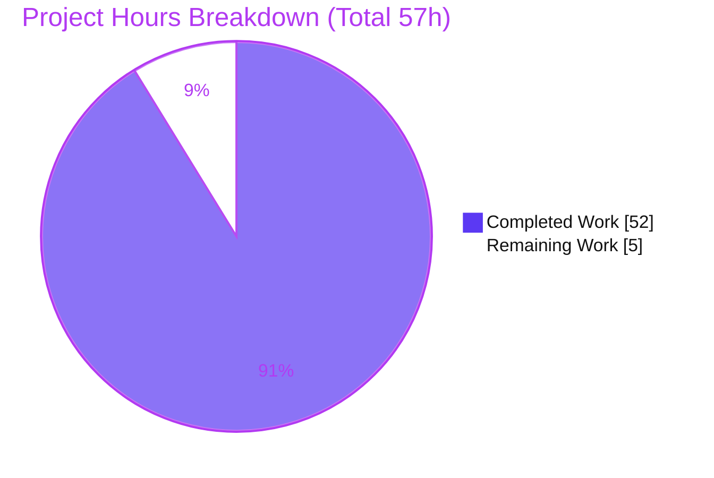
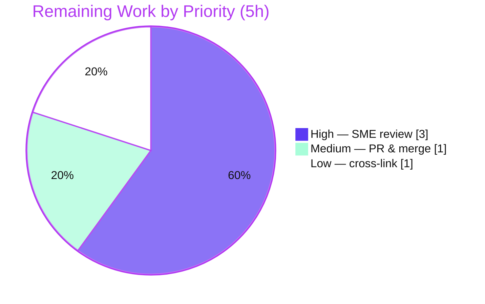

# Blitzy Project Guide — SimpleLogin Runtime-Behavior Onboarding Q&A

> **Branch:** `app_2cd6ee777f8c` · **Base commit:** `2cd6ee77` · **HEAD:** `c4e283fe`
> **Deliverable:** `blitzy/documentation/app_2cd6ee777f8c.md` (2,173 lines, ~136 KB)
> **Task class:** Documentation-only, read-only runtime investigation (rule set "SWE-AtlasQnA-Repo")

---

## 1. Executive Summary

### 1.1 Project Overview

This project onboards an engineer into the **SimpleLogin** codebase — an open-source, self-hostable email-aliasing / privacy service built as a Flask/Python monolith on a PostgreSQL backend — by documenting **how the running system actually behaves at runtime**, not merely how the source reads. The deliverable is a single Markdown answer document that resolves five discrete runtime-behavior questions (port binding, startup logs, health-check response, alias-creation API + database persistence, and PostgreSQL-down startup failure). Each answer is produced under a strict run-first methodology: the real code paths were built and executed through their canonical entry points, verbatim output was captured, and every claim is paired with the exact command, observed output, concrete value, `file:line` citation, and cause→effect rationale — with observed values explicitly distinguished from inferred ones. The investigation is strictly read-only: zero production source files were modified.

### 1.2 Completion Status

The completion percentage is calculated using the AAP-scoped hours methodology (PA1): every hour traces to a specific Agent Action Plan requirement or a path-to-production activity.


| Metric | Hours |
|--------|-------|
| **Total Hours** | **57** |
| Completed Hours (AI) | 52 |
| Completed Hours (Manual) | 0 |
| **Completed Hours (AI + Manual)** | **52** |
| **Remaining Hours** | **5** |
| **Percent Complete** | **91.2%** |

> Formula: `52 / (52 + 5) × 100 = 91.2%`. Completed work is 100% autonomous (Blitzy agents); the remaining 5 hours are human path-to-production activities (technical review and merge). Color key: **Completed = Dark Blue `#5B39F3`**, **Remaining = White `#FFFFFF`**.

### 1.3 Key Accomplishments

- ✅ **All five runtime questions answered from genuine observation** — each with the exact command, unedited output, concrete value, `file:line` citation, and cause→effect rationale.
- ✅ **Q1 (Port):** Confirmed the app binds TCP **`7777`** — canonical Gunicorn on `0.0.0.0:7777`, dev server on `127.0.0.1:7777` — stable across 2 boots and cross-checked against `/proc/net/tcp`.
- ✅ **Q2 (Startup logs):** Captured the Gunicorn arbiter `[INFO]` lines (stderr) plus the app's import-time stdout (printed once per worker), including the `>>> init logging <<<` banner; confirmed the Werkzeug request logger is disabled.
- ✅ **Q3 (Health check):** `GET /health` returns body `success`, HTTP `200 OK`, `Content-Type: text/html; charset=utf-8`, `Content-Length: 7` (verified 7 bytes via `od -c`).
- ✅ **Q4 (Alias creation):** `POST /api/alias/random/new` with an `Authentication` header returns HTTP **`201`** and a 17-key JSON body; a row is inserted into the **`alias`** table with API `id` == DB `id`; negative auth cases return `401` and persist nothing.
- ✅ **Q5 (PG-down failure):** Reproduced the hard boot failure — master binds `:7777`, each worker raises `sqlalchemy.exc.OperationalError` at `app/db.py:12`, `Worker failed to boot`; characterized the **non-deterministic exit code** (≈75% exit 3 / ≈25% exit 1) across a 24-boot sample.
- ✅ **Read-only discipline honored** — the source tree is byte-for-byte unchanged; the only diff versus the base commit is the single added answer document; working tree clean.
- ✅ **Independently validated** — every documented claim was reproduced through the canonical entry points inside the prescribed Docker image with **zero discrepancies**; all 89 unique citations resolve; dependency pins match exactly.

### 1.4 Critical Unresolved Issues

| Issue | Impact | Owner | ETA |
|-------|--------|-------|-----|
| _None — no blocking issues._ All five answers were reproduced with zero discrepancies; no source code compiles/tests are in scope; the deliverable required no fixes. | None | — | — |

> Informational (non-blocking): the document intentionally reports — but, per the read-only rules, does **not** remediate — two upstream findings: the eager module-level DB connection at `app/db.py:12` (the Q5 hard-boot cause) and the Alembic `pg_trgm` single-transaction reproduction gotcha. These are findings for the SimpleLogin app owners, not blockers for this deliverable.

### 1.5 Access Issues

| System / Resource | Type of Access | Issue Description | Resolution Status | Owner |
|-------------------|----------------|-------------------|-------------------|-------|
| `ghcr.io/scaleapi/swe-atlas` Docker image | Container registry pull | Re-running the runtime observations requires the prescribed image (Python 3.10 + PostgreSQL). The agents had access; a human reviewer needs the same to independently re-run. Not required to accept the doc as written. | Not blocking (informational) | Reviewer / Platform |

> No access issues prevented autonomous build, validation, or delivery. **No blocking access issues identified.**

### 1.6 Recommended Next Steps

1. **[High]** Have a SimpleLogin/Flask subject-matter expert review the answer document for technical accuracy and sign off (≈3h). Spot-check a sample of the ~108 `file:line` citations and, optionally, re-run 1–2 observations in the prescribed image.
2. **[Medium]** Confirm read-only scope (`git diff` shows only the added document; `git status --porcelain` empty), approve the PR, and merge to the target branch (≈1h).
3. **[Low]** Optionally cross-link the new onboarding Q&A from a discoverable index (e.g., `docs/` README or the team wiki) so future engineers find it (≈1h).

---

## 2. Project Hours Breakdown

### 2.1 Completed Work Detail

All completed work was performed autonomously by Blitzy agents. Every component traces to an Agent Action Plan requirement.

| Component | Hours | Description |
|-----------|-------|-------------|
| Runtime environment provisioning | 4 | Disposable Docker container (`--init`), documented Python 3.10 runtime (`/app/venv`), Poetry-locked dependencies, non-repository `CONFIG` file copied from `example.env` — establishing a faithful, canonical runtime. |
| Database infrastructure & seeding | 4 | Started PostgreSQL, built the full schema via `CONFIG=<file> alembic upgrade head` (navigating the `pg_trgm` single-transaction gotcha), and seeded a real user + API key through the model layer (`User.create` auto-provisions the default mailbox). |
| Q1 — Port binding investigation | 2 | Ran canonical Gunicorn and dev-server paths; read the bind address from the arbiter log; cross-checked interfaces via `/proc/net/tcp`; confirmed stability across 2 boots. |
| Q2 — Startup logs investigation | 3 | Captured the 9 arbiter `[INFO]` lines (stderr) and the app's per-worker import-time stdout (incl. `>>> init logging <<<`); confirmed the Werkzeug logger emits no access lines. |
| Q3 — Health check investigation | 2 | Issued `GET /health`; recorded body/status/headers; verified the 7-byte body with `od -c`; decoded the `slapp` session cookie. |
| Q4 — Alias creation API + DB investigation | 6 | Authenticated via the `Authentication` header; `POST /api/alias/random/new` → HTTP 201 (two creations, verbatim JSON); inspected the `alias` table rows (API `id` == DB `id`); documented autoflush persistence semantics and negative-auth (401) cases. |
| Q5 — PostgreSQL-down failure investigation | 6 | Reproduced the failure; traced the 5-frame import chain to `app/db.py:12`; captured two full verbatim boots; ran a 24-boot sample characterizing the non-deterministic exit code and the `HaltServer` SIGCHLD race; confirmed recovery. |
| Answer document authoring | 10 | Authored the 2,173-line evidence-grounded Q&A: intro/how-to-read, direct-answers table, full environment/build/invocation section, one detailed section per question, and a cleanup/cleanliness section. |
| QA revision rounds (4) | 8 | Four disciplined revision rounds addressing all QA findings (20 initial findings, doc-fidelity, Q1 dev-bind + Q4 persistence, Q5 exit-code non-determinism + Q4 accuracy). |
| Independent runtime validation | 6 | Reproduced every Q1–Q5 claim through canonical entry points with zero discrepancies; audited all 89 unique citations; verified dependency pins and repository cleanliness. |
| Cleanup, cleanliness verification & web-search research | 1 | Removed all temporary scripts and the throwaway `CONFIG`; verified `git status --porcelain` empty; validated the Gunicorn worker-loading model that explains the Q1/Q5 interplay. |
| **Total Completed** | **52** | |

### 2.2 Remaining Work Detail

All remaining work is human path-to-production activity. Each item traces to a path-to-production need.

| Category | Hours | Priority |
|----------|-------|----------|
| Human SME technical accuracy review & sign-off of the answer document | 3 | High |
| PR approval & merge to the target branch | 1 | Medium |
| Optional onboarding-index cross-link (discoverability) | 1 | Low |
| **Total Remaining** | **5** | |

> **Cross-section check:** Section 2.1 (52) + Section 2.2 (5) = **57** = Total Project Hours (Section 1.2). Section 2.2 total (5) = Section 1.2 Remaining Hours (5) = Section 7 pie "Remaining Work" (5).

### 2.3 Hours Basis & Confidence

- **Basis:** Hours reflect the effort to provision a faithful runtime, exercise each canonical code path, capture verbatim evidence, author a rigorously cited 2,173-line document, and validate it across four QA rounds plus an independent reproduction pass.
- **Confidence:** **High** for completed work (evidence is on disk and independently reproduced) and **High** for remaining work (well-defined, standard review-and-merge activities for a completed documentation deliverable).

---

## 3. Test Results

For this documentation-only Q&A deliverable, the "tests" are the **runtime validations of the five questions** — the actual verification method for a run-first investigation — together with the citation, dependency, and cleanliness audits. Every entry below originates from Blitzy's autonomous validation logs for this project. The repository's own `tests/**` suite (120 files) was **explicitly out of scope** (read-only) and was neither modified nor run as part of this task.

| Test Category | Framework / Method | Total | Passed | Failed | Coverage % | Notes |
|---------------|--------------------|-------|--------|--------|-----------|-------|
| Q1 — Port binding | Runtime obs (Gunicorn + dev server + `/proc/net/tcp`) | 2 | 2 | 0 | 100% | `0.0.0.0:7777` / `127.0.0.1:7777`; stable across 2 boots (only PID changes) |
| Q2 — Startup logs | Runtime obs (stderr/stdout capture) | 1 | 1 | 0 | 100% | 9 arbiter `[INFO]` lines + per-worker stdout incl. `>>> init logging <<<`; 0 access-log lines (Werkzeug disabled) |
| Q3 — Health check | HTTP (`curl -i`) + byte check (`od -c`) | 1 | 1 | 0 | 100% | body `success`, `200 OK`, `text/html`, `Content-Length 7` (7 bytes, no trailing newline) |
| Q4 — Alias creation (API + DB) | HTTP (`curl`) + SQL (`psql`) | 4 | 4 | 0 | 100% | 2 successful creates (201, 17-key JSON, API `id`==DB `id`) + 2 negative-auth cases (401, nothing persisted) |
| Q5 — PG-down failure mode | Runtime obs (24-boot sample) | 24 | 24 | 0 | 100% | `OperationalError` at `app/db.py:12`; exit-code non-determinism characterized (18×exit3 / 6×exit1); recovery confirmed |
| Citation accuracy audit | Static resolution vs source @ `2cd6ee77` | 89 | 89 | 0 | 100% | All unique `file:line` citations resolve to the cited construct |
| Dependency pin verification | `pip list` vs `pyproject.toml`/`poetry.lock` | 10 | 10 | 0 | 100% | Flask 1.1.2, gunicorn 20.0.4, SQLAlchemy 1.3.24, psycopg2-binary 2.9.3, etc.; Python 3.10.18 |
| Repository cleanliness | `git diff` / `git status` / `git diff --check` | 1 | 1 | 0 | 100% | Only the deliverable added; source byte-for-byte unchanged; no whitespace/EOF errors |
| **Total** | | **132** | **132** | **0** | **100%** | Zero discrepancies across all categories |

---

## 4. Runtime Validation & UI Verification

**Runtime health (canonical entry points):**

- ✅ **Operational** — Canonical Gunicorn boot (`gunicorn wsgi:app -b 0.0.0.0:7777 -w 2 --timeout 15`): master binds `:7777`, workers import the WSGI app cleanly, service accepts requests.
- ✅ **Operational** — Development server boot (`python server.py` → `app.run(debug=True, port=7777)`): binds `127.0.0.1:7777`.
- ✅ **Operational** — `GET /health` → `200 OK`, body `success`.
- ✅ **Operational** — `POST /api/alias/random/new` (authenticated) → `201`, alias row persisted to the `alias` table.
- ✅ **Operational (negative path)** — Missing/invalid `Authentication` header → `401 {"error":"Wrong api key"}`, nothing persisted.
- ✅ **Operational (as designed)** — Q5 failure mode: with PostgreSQL down, the master binds `:7777` while workers deterministically fail at `app/db.py:12` (hard boot failure by design); recovery confirmed after PostgreSQL restart (`GET /health` → `200`).

**UI verification:**

- ⚠ **Not applicable** — This task delivers a Markdown document and touches no frontend. There is no UI change to verify. (SimpleLogin has a dashboard UI, but it is out of scope for this read-only runtime-behavior investigation.)

---

## 5. Compliance & Quality Review

Cross-mapping the governing rule set ("SWE-AtlasQnA-Repo") and Blitzy quality benchmarks to observed outcomes. Fixes applied during autonomous validation are noted.

| Benchmark / Rule | Status | Progress | Notes |
|------------------|--------|----------|-------|
| Run-first methodology (observe before writing) | ✅ Pass | 100% | Every answer derived from captured runtime output, not reading alone |
| Canonical entry points only | ✅ Pass | 100% | Real `gunicorn wsgi:app` / dev `server.py`; real `Authentication`-authenticated API route |
| Evidence discipline (output + `file:line` per claim) | ✅ Pass | 100% | ~108 inline citations; verbatim command output beside each claim |
| Observed vs inferred labeling | ✅ Pass | 100% | Explicit labels throughout (44 "observed" / 10 "inferred" markers) |
| Read-only source repository | ✅ Pass | 100% | Source byte-for-byte unchanged; only the deliverable added |
| Deliverable naming & location | ✅ Pass | 100% | `blitzy/documentation/app_2cd6ee777f8c.md` (branch-named) |
| Answer every part / named item | ✅ Pass | 100% | Q1–Q5 each fully addressed incl. named files, endpoints, tables |
| Stability confirmed across runs | ✅ Pass | 100% | Q1 across 2 boots; Q5 across 24 boots (reproduced the non-determinism) |
| Cleanup (temp scripts removed, git clean) | ✅ Pass | 100% | Throwaway `CONFIG` + scripts confined to `/tmp` and removed; `git status --porcelain` empty |
| Pre-commit hygiene (trailing-whitespace) | ✅ Pass | 100% | 0 trailing-whitespace lines; `git diff --check` clean; final newline present |
| Citation accuracy | ✅ Pass | 100% | 89/89 unique citations resolve to the cited constructs |
| Dependency fidelity | ✅ Pass | 100% | Installed pins match `pyproject.toml`/`poetry.lock` exactly |

**Fixes applied during autonomous validation:** The four QA rounds sharpened Q1 (dev-server bind interface), Q4 (persistence citation + autoflush semantics + input-handling accuracy, correcting an earlier "same bytes" characterization to "same schema"), and Q5 (exit-code non-determinism with a statistical sample). The Final Validator's independent reproduction required **no further fixes**.

**Outstanding compliance items:** None.

---

## 6. Risk Assessment

Overall risk profile: **Low** — a read-only, completed, independently validated documentation deliverable with no source changes.

| Risk | Category | Severity | Probability | Mitigation | Status |
|------|----------|----------|-------------|------------|--------|
| Environment-fidelity gap — observations on PostgreSQL 15/16.x vs documented/CI target PG 13 | Technical | Low | Low | Doc explicitly flags this; the behaviors under test (port bind, health, alias JSON/row, connection-refused) are database-version-independent | Documented / Mitigated |
| Reproduction requires the prescribed Docker image; a reviewer on a different host may see cosmetic differences (PIDs, timestamps, random alias names) | Technical | Low | Medium | Doc records the exact image digest and commands; all run-varying values are explicitly labeled | Mitigated |
| Q5 exit-code non-determinism (≈75% exit 3 / ≈25% exit 1) | Technical | Low | Low | Characterized with a 24-boot sample and log-length correlation; identified as an inherent Gunicorn SIGCHLD race, not a doc error | Documented / Mitigated |
| Credential handling — investigation used real secrets (DB password, `FLASK_SECRET`, user password, API key) | Security | High (if realized) | Very Low | All secrets redacted (`***`); throwaway container + mode-600 `/tmp` files destroyed on teardown; verified no secret is committed | Resolved / Mitigated |
| Un-remediated upstream findings — eager module-level DB connect (`app/db.py:12`); `pg_trgm` migration single-transaction gotcha | Operational | Medium (for the app) | N/A (for this deliverable) | Clearly documented as findings; deliberately not fixed per read-only rules | Documented (deferred to app owners) |
| Documentation staleness — citations pinned to commit `2cd6ee77`; future source edits could drift line numbers | Operational | Low | Medium (over time) | Doc explicitly pins the commit SHA it was executed against | Mitigated |
| Integration — deliverable is a self-contained Markdown file in a new directory; no external service/API-key/network config required | Integration | Low | Low | Self-contained; requires no changes to existing `docs/**` | N/A |

---

## 7. Visual Project Status

**Project hours breakdown** (Completed = Dark Blue `#5B39F3`, Remaining = White `#FFFFFF`):



**Remaining hours by priority** (from Section 2.2, sums to 5h):



> **Integrity:** the pie "Remaining Work" value (5) equals Section 1.2 Remaining Hours (5) and the Section 2.2 Hours total (5). "Completed Work" (52) equals Section 1.2 Completed Hours (52).

---

## 8. Summary & Recommendations

**Achievements.** The project is **91.2% complete** on an AAP-scoped basis (52 of 57 hours). All thirteen AAP-specified requirements are fully delivered and independently validated: a faithful Python 3.10 runtime and migrated PostgreSQL schema were provisioned; all five runtime behaviors were exercised through their canonical entry points and captured verbatim; and a rigorously cited 2,173-line answer document was authored, refined across four QA rounds, and reproduced with **zero discrepancies**. The read-only mandate was honored perfectly — the source tree is byte-for-byte unchanged.

**Remaining gaps.** The outstanding 5 hours are exclusively human path-to-production: a subject-matter-expert accuracy review and sign-off (3h), PR approval and merge (1h), and an optional discoverability cross-link (1h). There is no source code to compile, no failing test to fix, and no unresolved error — the two upstream findings the document surfaces (eager DB connect; `pg_trgm` migration gotcha) are intentionally out-of-scope observations, not defects for this deliverable to fix.

**Critical path to production.** SME review → PR merge. Both are low-risk, well-defined activities.

**Production-readiness assessment.** The deliverable passed all five autonomous production-readiness gates (100% validation pass, runtime validated, zero unresolved errors, in-scope file validated, committed & clean). It is **ready for human review and merge**.

| Success Metric | Result |
|----------------|--------|
| AAP requirements delivered | 13 / 13 (100%) |
| Runtime questions reproduced | 5 / 5, zero discrepancies |
| Citations verified | 89 / 89 |
| Source files modified | 0 (read-only honored) |
| Completion (AAP-scoped) | 91.2% |

---

## 9. Development Guide

This guide has two parts: **(A)** verifying/viewing the deliverable (runs on any host), and **(B)** reproducing the runtime observations (requires the prescribed Docker image + the documented Python 3.10 runtime). All Part A commands were tested during assessment.

### 9.1 System Prerequisites

- **Git** (2.x) and a POSIX shell — for Part A.
- **Docker Engine** (28.x observed) — for Part B reproduction.
- **Prescribed image:** `ghcr.io/scaleapi/swe-atlas:swe_atlas_QnA_simple-login_app_1.0` (digest `sha256:b82cb156…`) — ships the repo at `/app`, a Poetry virtualenv at `/app/venv` (Python **3.10**), and a PostgreSQL cluster.
- **Do not** substitute a newer host interpreter (e.g., the host's Python 3.13); use the documented Python 3.10 runtime from the image.

### 9.2 Part A — Verify & View the Deliverable (any host)

```bash
# From the repository root:
# 1) Confirm the deliverable exists and its size
test -f blitzy/documentation/app_2cd6ee777f8c.md && wc -l blitzy/documentation/app_2cd6ee777f8c.md
#   → 2173 blitzy/documentation/app_2cd6ee777f8c.md

# 2) Confirm read-only scope (only the deliverable was added since the base commit)
git diff 2cd6ee77 HEAD --name-status
#   → A   blitzy/documentation/app_2cd6ee777f8c.md

# 3) Confirm the working tree is clean
git status --porcelain
#   → (no output)

# 4) Spot-check a citation resolves to the cited construct
sed -n '213,215p' server.py      # /health → return "success", 200
sed -n '12p'      app/db.py       # connection = engine.connect()
sed -n '1470p'    app/models.py   # __tablename__ = "alias"

# 5) Read the document
less blitzy/documentation/app_2cd6ee777f8c.md
```

### 9.3 Part B — Reproduce the Runtime Observations (prescribed image)

```bash
# 1) Launch a disposable container with an init/reaper (PID 1 = docker-init)
docker run -d --init --name sl --entrypoint sleep \
  ghcr.io/scaleapi/swe-atlas:swe_atlas_QnA_simple-login_app_1.0 infinity

# 2) Confirm the exact source commit baked into the image
docker exec sl bash -lc 'cd /app && git rev-parse HEAD'
#   → 2cd6ee777f8c2d3531559588bcfb18627ffb5d2c

# 3) Confirm the documented runtime & dependency pins
docker exec sl /app/venv/bin/python --version          # → Python 3.10.x
docker exec sl /app/venv/bin/pip list | grep -iE '^(Flask|gunicorn|SQLAlchemy|psycopg2-binary|alembic) '

# 4) Start PostgreSQL, create a throwaway role + database, and build the schema.
#    IMPORTANT: do NOT pre-create the pg_trgm extension — Alembic runs all
#    migrations in one transaction on PostgreSQL, so a pre-created extension
#    triggers a rollback that drops the alias table. Let the migration create it.
docker exec sl bash -lc 'service postgresql start'
# ... create role + fresh DB owned by it (password from example.env template) ...
docker exec sl bash -lc 'CONFIG=/tmp/sl.env /app/venv/bin/alembic upgrade head'

# 5) Seed a real user + API key through the model layer (User.create auto-provisions
#    the default verified mailbox). Write the key to a mode-600 /tmp file; never print it.

# 6) Canonical run (Q1–Q4). The arbiter logs: Listening at: http://0.0.0.0:7777 (<pid>)
docker exec -d sl bash -lc \
  'CONFIG=/tmp/sl.env /app/venv/bin/gunicorn wsgi:app -b 0.0.0.0:7777 -w 2 --timeout 15'

# 7) Q3 — health check
docker exec sl bash -lc 'curl -s -i http://127.0.0.1:7777/health'
#   → HTTP/1.1 200 OK ... Content-Length: 7 ... success

# 8) Q4 — create an alias (authenticated) and inspect the row
docker exec sl bash -lc \
  'curl -s -i -X POST http://127.0.0.1:7777/api/alias/random/new \
     -H "Authentication: $API_KEY" -H "Content-Type: application/json" \
     -d "{\"note\":\"onboarding demo alias\"}"'
#   → HTTP/1.1 201 CREATED ... {"alias":"...@sl.local", ... "id":2, ...}
docker exec sl bash -lc 'psql -d slobs -c "select id,user_id,email,mailbox_id,flags from alias order by id;"'

# 9) Q5 — failure mode: stop PostgreSQL, then boot Gunicorn
docker exec sl bash -lc 'service postgresql stop'
docker exec sl bash -lc \
  'CONFIG=/tmp/sl.env /app/venv/bin/gunicorn wsgi:app -b 0.0.0.0:7777 -w 2 --timeout 15; echo "EXIT=$?"'
#   → master logs "Listening at: http://0.0.0.0:7777"; workers raise
#     sqlalchemy.exc.OperationalError (Connection refused) at app/db.py:12;
#     "Reason: Worker failed to boot."; EXIT is non-deterministic (3 ~75% / 1 ~25%)
```

### 9.4 Verification Steps

- **Health:** `curl -s -o /dev/null -w '%{http_code}' http://127.0.0.1:7777/health` → `200`.
- **Byte-exact body:** `curl -s http://127.0.0.1:7777/health | od -c` → 7 characters `s u c c e s s` (no trailing newline).
- **Port:** confirm the interface via `/proc/net/tcp` (Gunicorn `00000000:1E61` = `0.0.0.0:7777`; dev server `0100007F:1E61` = `127.0.0.1:7777`).
- **DB persistence:** the JSON `id` equals the `alias` primary key; `user_id=1`, `mailbox_id=1`, `flags=0`.

### 9.5 Troubleshooting

- **`alias` table missing after `alembic upgrade head`** → the `pg_trgm` extension was pre-created; drop and recreate a fresh database and re-run migrations without pre-creating the extension.
- **Immediate `OperationalError: connection refused` at boot** → PostgreSQL is not running (this is exactly the Q5 condition); start PostgreSQL and re-boot. The connection is opened at import time (`app/db.py:12`), before the Flask app exists, so a running DB is a prerequisite for Q1–Q4.
- **`401 {"error":"Wrong api key"}` on the alias call** → the `Authentication` header is missing or the key is wrong; supply the seeded key.
- **Cosmetic output differences** (PIDs, timestamps, random alias names, Q5 exit code) are expected run-to-run and are labeled as such in the document.

### 9.6 Cleanup

```bash
docker rm -f sl        # destroys the throwaway container, DB, and all /tmp artifacts
# The source repository stays byte-for-byte unchanged (verify: git status --porcelain → empty)
```

---

## 10. Appendices

### Appendix A — Command Reference

| Purpose | Command |
|---------|---------|
| Verify deliverable line count | `wc -l blitzy/documentation/app_2cd6ee777f8c.md` |
| Verify read-only scope | `git diff 2cd6ee77 HEAD --name-status` |
| Verify clean working tree | `git status --porcelain` |
| Canonical production run | `gunicorn wsgi:app -b 0.0.0.0:7777 -w 2 --timeout 15` |
| Development run | `python server.py` (→ `app.run(debug=True, port=7777)`) |
| Build schema | `CONFIG=<file> alembic upgrade head` |
| Health check | `curl -s -i http://127.0.0.1:7777/health` |
| Create alias | `curl -s -i -X POST .../api/alias/random/new -H "Authentication: <key>"` |
| Inspect alias rows | `psql -d <db> -c "select id,user_id,email,mailbox_id,flags from alias order by id;"` |

### Appendix B — Port Reference

| Service | Interface:Port | Source |
|---------|----------------|--------|
| Gunicorn (canonical) | `0.0.0.0:7777` | `Dockerfile:47` (`-b 0.0.0.0:7777`), `Dockerfile:44` (`EXPOSE 7777`) |
| Development server | `127.0.0.1:7777` | `server.py:588` (`app.run(debug=True, port=7777)`) |
| PostgreSQL | `localhost:5432` | `example.env:75` (`DB_URI=…@localhost:5432/…`) |

### Appendix C — Key File Locations

| File | Role |
|------|------|
| `blitzy/documentation/app_2cd6ee777f8c.md` | **The deliverable** (only added file) |
| `wsgi.py` | Canonical WSGI entry (`app = create_app()`); head of the Q5 import chain |
| `server.py` | Flask app factory; `/health` route (`:213-215`); dev bind (`:588`) |
| `Dockerfile` | Canonical Gunicorn command; `EXPOSE 7777` |
| `app/db.py` | Module-level eager `engine.connect()` (`:12`) — the Q5 break point |
| `app/log.py` | Startup banner (`:67`); Werkzeug logger disable (`:70-71`) |
| `app/api/views/new_random_alias.py` | Alias-creation endpoint (`:21`, `:114-116`) |
| `app/api/serializer.py` | Alias JSON shape (`serialize_alias_info_v2`, `:55`) |
| `app/api/base.py` | `Authentication`-header API auth (`:17-18`, `:52`) |
| `app/models.py` | `Alias` model / `alias` table (`:1469-1470`) |
| `example.env` | Config template copied to a non-repo `CONFIG` file |

### Appendix D — Technology Versions (observed)

| Component | Version | Source |
|-----------|---------|--------|
| Python (runtime) | 3.10.18 | `pyproject.toml:61` (`^3.10`), image venv |
| Flask | 1.1.2 | `pyproject.toml:62` |
| Gunicorn | 20.0.4 | `pyproject.toml:66` |
| SQLAlchemy | 1.3.24 | `pyproject.toml:116` |
| psycopg2-binary | 2.9.3 | `pyproject.toml:71` |
| Flask-Migrate | 2.5.3 | `pyproject.toml:77` |
| Alembic | 1.4.3 | `poetry.lock` |
| coloredlogs | 14.0 | `pyproject.toml:89` |
| PostgreSQL | 13 documented (15/16.x used) | `CONTRIBUTING.md`; version-independent behaviors |

### Appendix E — Environment Variable Reference

| Variable | Example / Purpose | Source |
|----------|-------------------|--------|
| `CONFIG` | Path to the non-repository env file loaded at startup | Runtime convention |
| `URL` | `http://localhost:7777` — app base URL | `example.env:6` |
| `EMAIL_DOMAIN` | `sl.local` — alias email domain | `example.env:22` |
| `DB_URI` | `postgresql://…@localhost:5432/…` — SQLAlchemy DSN | `example.env:75` |
| `FLASK_SECRET` | Session-signing secret (redacted) | `example.env:77` |
| `SUPPORT_EMAIL` | Required support contact | `example.env` |

### Appendix F — Developer Tools Guide

| Tool | Use in this project |
|------|---------------------|
| `git` | Scope verification (`diff --name-status`, `status --porcelain`, `diff --check`) |
| `docker` (`--init`) | Disposable, reaping container for faithful runtime observation |
| Poetry / `/app/venv` | Documented, locked dependency set (run app via `/app/venv/bin/{python,gunicorn,alembic}`) |
| `alembic` | Build the PostgreSQL schema (`upgrade head`) |
| `curl -i` | Capture HTTP status, headers, and body (Q3, Q4) |
| `psql` | Inspect the `alias` table (Q4) |
| `od -c` | Byte-exact body verification (Q3) |
| `/proc/net/tcp` | Confirm the bound interface (Q1) |

### Appendix G — Glossary

| Term | Definition |
|------|------------|
| **Canonical entry point** | The real invocation a normal operator uses (`gunicorn wsgi:app`, the dev `server.py`, the `Authentication`-authenticated API route) — not a bypass, fallback, or synthetic stand-in. |
| **observed** | A value taken directly from real runtime output captured during the investigation. |
| **inferred** | A conclusion drawn by reading source code, explicitly labeled as such. |
| **Eager connection** | The module-level `engine.connect()` at `app/db.py:12` that runs at import time — the reason a PG-down startup fails hard (Q5). |
| **`pg_trgm` gotcha** | On PostgreSQL, Alembic runs all migrations in one transaction; a pre-created `pg_trgm` extension causes a rollback that drops the `alias` table — a reproduction caveat, not a source defect. |
| **AAP** | Agent Action Plan — the governing specification for this task. |