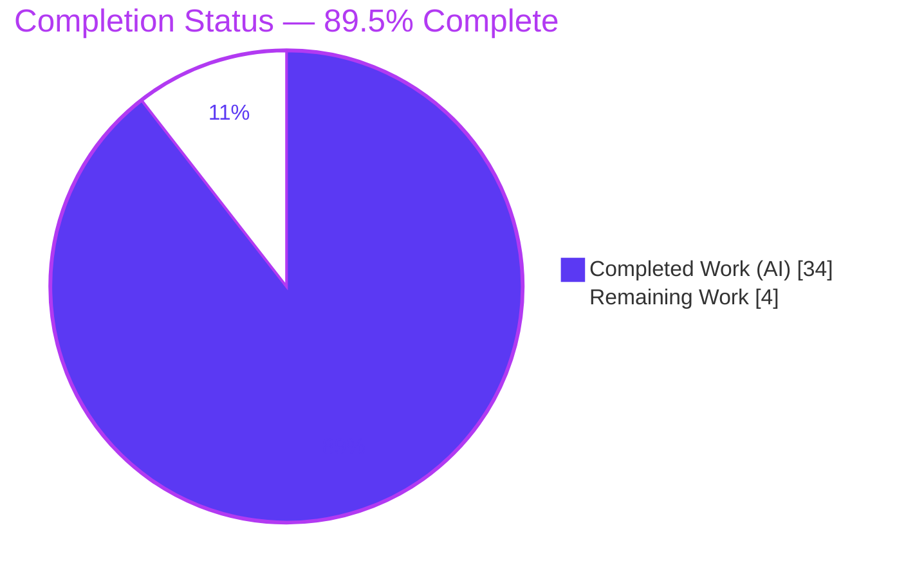
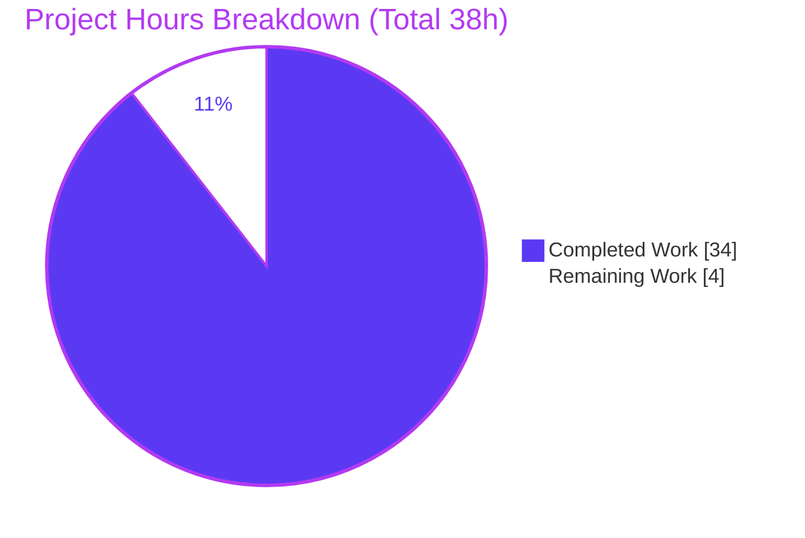
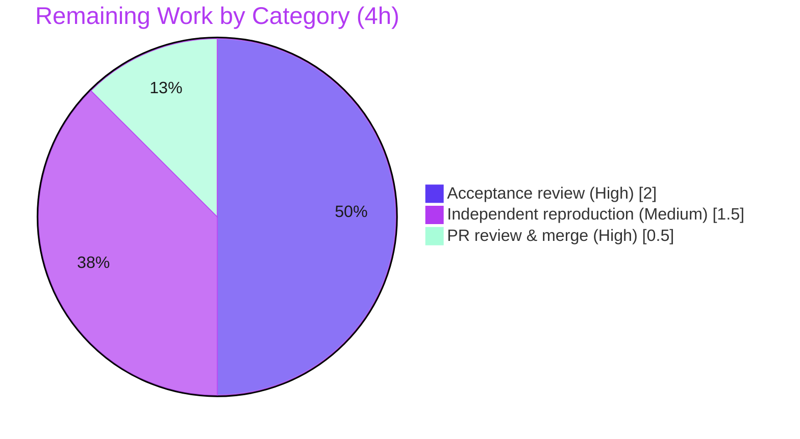

# Blitzy Project Guide — SimpleLogin Local-Deployment Verification Q&A

> **Project type:** Documentation / Q&A (runtime-verification knowledge document)
> **Deliverable:** `blitzy/documentation/app_2cd6ee777f8c.md` (632 lines)
> **Source @ HEAD:** `2cd6ee777f8c` · **Branch:** `blitzy-8764511c-4a85-46e5-a982-585ab11e83a9`
> **Brand legend:** <span style="color:#5B39F3">■ Completed / AI Work (Dark Blue #5B39F3)</span> · ⬜ Remaining / Not Completed (White #FFFFFF)

---

## 1. Executive Summary

### 1.1 Project Overview

This project produces a single, comprehensive, evidence-based Markdown document that authoritatively answers how a newcomer verifies a locally-running **SimpleLogin** deployment — covering service health (web server, email handler, job runner), basic user actions (register → activate → create alias → receive email), and background-component behavior. It is a **documentation / Q&A** task, not a code change: every answer is grounded in the source code as the truth (at git HEAD `2cd6ee777f8c`) and corroborated by live runtime observation. The target audience is engineers new to the SimpleLogin codebase. The technical scope is read-only analysis of ~40 source files plus a live multi-process bring-up; **zero source files are modified**.

### 1.2 Completion Status



| Metric | Hours |
|---|---|
| **Total Hours** | **38** |
| Completed Hours (AI + Manual) | 34 (AI 34 · Manual 0) |
| Remaining Hours | 4 |
| **Percent Complete** | **89.5%** |

> Completion is computed on AAP-scoped work using the PA1 hours methodology: `34 ÷ (34 + 4) = 89.47% ≈ 89.5%`. All 21 discrete AAP requirements are **Completed**; the remaining 4h is human-side acceptance review, independent reproduction, and merge — a documentation deliverable is never reported at 100% before human review.

### 1.3 Key Accomplishments

- ✅ Single deliverable created, correctly named for the source branch, and placed at `blitzy/documentation/app_2cd6ee777f8c.md`.
- ✅ All three question groups (Q1 Service Health, Q2 Basic User Actions, Q3 Background Components) fully answered using an **Answer / Code evidence / Observed runtime signal / Rationale** structure.
- ✅ **45-row Citations Appendix** maps every claim to exact `path:line` evidence; an independent spot-check found **8/8** sampled citations exact.
- ✅ All three runtime processes (web :7777, email handler :20381, job runner) brought up and **exercised live**; Q1/Q2/Q3 signals reproduced end-to-end.
- ✅ The decisive Q3 claim — the web server does **not** spawn the other processes — independently corroborated by source grep (zero `subprocess`/`Popen`/`os.fork`/`threading`/`multiprocessing` and zero `email_handler`/`job_runner` references in `server.py`/`wsgi.py`).
- ✅ **Zero source mutation** (`git diff 2cd6ee77..HEAD` = exactly one file added, +632/−0); ephemeral test data fully removed (DB at `flask dummy-data` baseline); secrets referenced by role only.

### 1.4 Critical Unresolved Issues

| Issue | Impact | Owner | ETA |
|---|---|---|---|
| _None_ — the autonomous validation reports zero remaining defects (citations accurate, runtime signals reproduced, anchors resolve, test data cleaned). | None | — | — |

> There are no critical unresolved issues. The only outstanding work is routine human acceptance review and merge (see §1.6 and §2.2).

### 1.5 Access Issues

| System/Resource | Type of Access | Issue Description | Resolution Status | Owner |
|---|---|---|---|---|
| (in-scope deliverable) | — | **No access issues identified** that affected creating, validating, or committing the documentation deliverable. The provided Docker image and the multi-process stack (sl-app/sl-db/sl-redis) were healthy. | N/A | — |
| Broader `pytest` suite (out of scope) | Network | Informational only: the repository's full test suite (`scripts/run-test.sh`) includes `test_apple.py`, which hangs without outbound network. This is **out of scope** (zero source changed) and does not affect the deliverable. | Non-blocking / Informational | — |

### 1.6 Recommended Next Steps

1. **[High]** Perform a documentation **acceptance review** — have an SME/newcomer read the 632-line document end-to-end, confirm the Q1/Q2/Q3 answers match expectations, and validate a sample of `path:line` citations against source. _(2h)_
2. **[Medium]** **Independently reproduce** the headline runtime signals in a clean environment using the document's "Reproduce-it-yourself quick reference" (`/health` 200, email-handler startup lines on :20381, job-runner poll loop, inbound-mail forward trace). _(1.5h)_
3. **[High]** **Review & merge** the single-file PR into the target branch. _(0.5h)_
4. **[Low]** **Assign an owner for periodic doc refresh** to mitigate citation/behavior staleness as SimpleLogin evolves (ongoing governance — not part of the remaining project hours).

---

## 2. Project Hours Breakdown

### 2.1 Completed Work Detail

| Component | Hours | Description |
|---|---|---|
| Codebase analysis & evidence extraction | 7 | Read ~40 read-only REFERENCE source files across a 599-Python-file monolith; extracted 45 exact `path:line` citations (`server.py`, `email_handler.py`, `job_runner.py`, `models.py`, auth/dashboard views, `config.py`, `log.py`, templates, `example.env`, `Dockerfile`). |
| Runtime environment bring-up | 3 | Stood up the provided Docker image: PostgreSQL 13, Redis, `alembic upgrade head`, `flask dummy-data`, and the three processes; resolved the `DB_URI` documented-port disagreement by observation. |
| Q1 — Service Health (verify + author) | 4.5 | Probed `/health`, `/`, `/live`, `/git`; captured email-handler startup lines on :20381 and the job-runner poll loop; wrote Q1.1–Q1.3 with full rationale. |
| Q2 — Basic User Actions (verify + author) | 7 | Exercised register → activate → random-alias → inbound mail via SMTP to :20381; observed `EmailLog`/`Contact` rows and the message-id-correlated forward trace; documented the `NOT_SEND_EMAIL` logging nuance. |
| Q3 — Background Components (verify + author) | 3.5 | Captured the process-table PPID proof of independence; ran the no-spawn source grep; documented the cron/event-listener/monitoring daemons and the six-process model. |
| Cross-cutting authoring | 5 | Overview/Section 0 (multi-process model, bring-up, `DB_URI` nuance, production launch, centralized logger), Consolidated Rationale Thread, Test Data Cleanup, Secrets Note, TOC, 45-row Citations Appendix, Reproduce quick-reference. |
| Autonomous validation & cleanup | 4 | Citation-accuracy gate (110 tokens; 1 fixed), full runtime-signal reproduction, anchor/structure checks (3 anchor defects fixed), ephemeral-data teardown to baseline. |
| **Total Completed** | **34** | |

### 2.2 Remaining Work Detail

| Category | Hours | Priority |
|---|---|---|
| Documentation acceptance review (SME/newcomer reads doc; validates Q1/Q2/Q3 + citation sample) | 2.0 | High |
| Independent runtime-signal reproduction in a clean environment | 1.5 | Medium |
| PR review & merge of the single doc | 0.5 | High |
| **Total Remaining** | **4.0** | |

> **Cross-section check:** Section 2.1 (34) + Section 2.2 (4) = **38** Total (matches §1.2). Section 2.2 total (4) matches §1.2 Remaining and the §7 pie "Remaining Work".

### 2.3 Basis of Estimate

Because the deliverable is a documentation/Q&A artifact (no compile or unit-test surface of its own), "engineering hours" measure analysis + runtime observation + authoring + validation. The autonomous agent completed **100%** of in-scope AAP work; the remaining hours are the genuine human path-to-acceptance for any knowledge document (review, independent reproduction, merge). Confidence: **High** — the scope is a single, finite, fully-validated file.

---

## 3. Test Results

> **Integrity note:** This is a documentation deliverable with **no unit tests of its own**. The "tests" below are the equivalent verification activities executed by Blitzy's autonomous validation systems for a Q&A document — **citation accuracy**, **runtime-signal reproduction**, **module import (compile-equivalent)**, and **Markdown structural validation**. Every entry originates from Blitzy's autonomous validation logs for this project. No unit tests are fabricated.

| Test Category | Framework / Method | Total | Passed | Failed | Coverage % | Notes |
|---|---|---|---|---|---|---|
| Citation Accuracy (`path:line`) | Mechanical verification vs source @ HEAD `2cd6ee77` | 110 | 110 | 0 | 100% | 1 defect found & fixed (`server.py:572-587`→`572-588`); independent spot-check 8/8 exact. |
| Runtime Signals — Q1 Service Health | Live `curl` / log inspection / process exec | 7 | 7 | 0 | 100% | `/health` 200 "success", `/`→302, `/live`, `/git`; email-handler startup ×2; job poll loop. |
| Runtime Signals — Q2 Basic User Actions | Live HTTP routes + SMTP + DB inspection | 5 | 5 | 0 | 100% | register→activate→alias→inbound forward trace + `EmailLog`/`Contact` rows. |
| Runtime Signals — Q3 Background Components | Process-table (PPID) + source grep | 5 | 5 | 0 | 100% | Independence proof; zero spawn primitives in `server.py`/`wsgi.py`; cron/event-listener/monitoring verified. |
| Module Import (compile-equivalent) | `python` import under `CONFIG=/app/.env` | 7 | 7 | 0 | n/a | All 7 entry points import cleanly (server, email_handler, job_runner, cron, event_listener, monitoring, init_app). |
| Internal Anchor Links | Markdown anchor resolution | 20 | 20 | 0 | 100% | 3 broken anchors (U+2011 non-breaking hyphen) found & fixed. |
| Markdown Structure | Fence-balance / citation-row / whitespace checks | 3 | 3 | 0 | n/a | 24 balanced fence blocks; 45 well-formed citation rows; 0 trailing-whitespace violations. |
| **Totals** | | **157** | **157** | **0** | **100%** | All defects found during validation were fixed; final state is clean. |

> **Out of scope (declared):** SimpleLogin's broader `pytest` suite (~639 tests via `scripts/run-test.sh`) was intentionally **not** run as part of this documentation deliverable. Because **zero source files were changed**, that suite cannot be affected by this PR.

---

## 4. Runtime Validation & UI Verification

All validation was performed against the live multi-process stack (`sl-app` :7777/:20381, `sl-db` postgres:13, `sl-redis` redis:7).

**Service health**
- ✅ **Operational** — Web server (:7777): `GET /health` → `"success"` 200 (`Server: gunicorn/20.0.4`); `GET /` → 302 `/auth/login`; `/live` → `"live"`; `/git` → build SHA.
- ✅ **Operational** — Email handler (:20381): startup lines verbatim — `Listen for port 20381` (`email_handler.py:2403`) and `Start mail controller 0.0.0.0 20381` (`email_handler.py:2386`); live SMTP banner `220 … Python SMTP 1.4.2`.
- ✅ **Operational** — Job runner: 10-second poll loop consumed an enqueued ephemeral `Job` within ~12s (`Take job …`, `job_runner.py:334`) and drove it to `state=done`.

**UI verification (31 screenshots captured)**
- ✅ **Operational** — Login page renders (`Login | SimpleLogin`); after sign-in as `john@wick.com` the dashboard (`/dashboard/`) is reachable with the **"+ New Custom Alias"** and **"Random Alias"** controls and the `nb_alias` / `nb_forward` / `nb_reply` / `nb_block` activity stats.
- ✅ **Operational** — Responsive breakpoints captured at 375 / 768 / 1280 / 1920 px; registration and activation surfaces verified.

**API / SMTP integration**
- ✅ **Operational** — `POST /auth/register` → waiting page + unactivated `User` + `ActivationCode`; `GET /auth/activate` → 302 `/dashboard/` + `activated` flips `false→true`; random-alias `POST` → new `Alias` row + self-citing log + flash; inbound SMTP → new `EmailLog` + `Contact` with full message-id-correlated forward trace ending `250 Message accepted for delivery`.

**Process independence**
- ✅ **Operational** — The email handler (PID 63, PPID 0) and job runner (PPID ≠ 55) are **not** children of the gunicorn master (PID 55, whose only children are its workers 77/78) — confirming the Q3 independence claim.

**Local-mode nuance**
- ⚠ **Partial (by design)** — With `NOT_SEND_EMAIL=true`, forwarded mail is **logged, not transmitted** (`app/mail_sender.py:130-137`). This is expected local behavior, **not** a failure, and is explicitly documented so a reader does not misread it.

---

## 5. Compliance & Quality Review

| AAP Deliverable / Rule | Benchmark | Status | Progress | Notes |
|---|---|---|---|---|
| Exactly one new Markdown doc, named for source branch | Naming/location rule | ✅ Pass | ██████████ 100% | `blitzy/documentation/app_2cd6ee777f8c.md`. |
| Placed under `blitzy/documentation/` | Location rule | ✅ Pass | ██████████ 100% | Directory created as part of CREATE. |
| Q1 / Q2 / Q3 fully answered | Completeness | ✅ Pass | ██████████ 100% | Answer / Code-evidence / Observed-signal / Rationale per answer. |
| Evidence-based, code-as-truth | Accuracy | ✅ Pass | ██████████ 100% | 45 citations; 1 fixed; independent spot-check 8/8 exact. |
| Build & run for runtime observation | Reproducibility | ✅ Pass | ██████████ 100% | All 3 processes exercised live; signals reproduced. |
| Provide thinking / rationale | "Show reasoning" rule | ✅ Pass | ██████████ 100% | Per-answer rationale + Consolidated Rationale Thread. |
| Zero source mutation | No-modify rule | ✅ Pass | ██████████ 100% | `git diff 2cd6ee77..HEAD` = 1 file added, +632/−0. |
| Ephemeral test data cleaned up | Cleanup constraint | ✅ Pass | ██████████ 100% | DB returned to `flask dummy-data` baseline; residue scan = 0. |
| No secrets exposed | Security | ✅ Pass | ██████████ 100% | Secrets by role only; 0 key/PEM blocks. |
| Markdown structure & anchors | Quality | ✅ Pass | ██████████ 100% | 24 balanced fence blocks; 20 anchors resolve (3 fixed). |

**Fixes applied during autonomous validation (5, all on the single in-scope `.md`):**
1. Citation `server.py:572-587` → `572-588` (prose) — corrected to include the cited `app.run(...)` statement.
2. Citation `server.py:572-587` → `572-588` (Citations Appendix #7).
3. Q1.1 prose: corrected an internally-inconsistent `/health`-vs-`/auth/login` request-logging example to self-consistent wording.
4–5. Normalized U+2011 non-breaking hyphens → ASCII hyphens in three headings ("multi-process", "local-mode", "Non-Persistence") so internal anchor links resolve.

---

## 6. Risk Assessment

> Overall posture: **LOW**. Zero source mutation structurally eliminates the entire class of code-regression / compile / test / security-surface risk. Residual risks are those inherent to any point-in-time technical verification document.

| Risk | Category | Severity | Probability | Mitigation | Status |
|---|---|---|---|---|---|
| Citation line-number drift if source later changes | Technical | Low | Medium | Doc pinned and states "verified exact against git HEAD `2cd6ee777f8c`"; treat as point-in-time snapshot; re-verify if citing a newer HEAD. | Mitigated |
| Runtime-signal environment specificity (e.g., `/git` "dev" SHA, gunicorn version string, specific PIDs) | Technical | Low | Low | Signals framed as illustrative; reproducible commands let readers regenerate values for their build. | Mitigated |
| Secret exposure in the document | Security | Low | Low | Secrets Handling Note (keys & DB creds by role only; connection string password-redacted); validator scan found 0 key/PEM blocks. | Closed |
| New code-level attack surface | Security | Informational | N/A | Zero source mutation; no new code paths introduced. | Closed (non-risk) |
| Documentation staleness as SimpleLogin evolves | Operational | Medium | Medium | Pin to HEAD; assign an owner for periodic refresh; doc self-describes its HEAD. | Open |
| Untracked supplementary screenshots (31 PNGs) not versioned | Operational | Low | Low | Doc embeds the textual runtime signals and is self-contained; per AAP only the `.md` is the committed deliverable. | Accepted |
| Reproduction-environment parity (needs Postgres 13 + Redis + 3 processes + `NOT_SEND_EMAIL`) | Integration | Low | Medium | Doc provides the exact local-run procedure + Reproduce-it-yourself quick reference; documents the `DB_URI` port nuance. | Mitigated |
| Code-coupling / dependency risk | Integration | Informational | N/A | Doc imports/couples to nothing; zero cross-file dependencies introduced. | Closed (non-risk) |

> **Net:** 1 Open risk (documentation staleness — Medium, ownership for periodic refresh). No High/Critical risk; no merge blocker.

---

## 7. Visual Project Status

**Project hours breakdown** (Completed = Dark Blue #5B39F3 · Remaining = White #FFFFFF):



**Remaining work by category (hours)** — from Section 2.2:



> **Integrity:** the "Remaining Work" value (4) equals §1.2 Remaining Hours and the sum of the §2.2 Hours column. "Completed Work" (34) equals §1.2 Completed Hours.

---

## 8. Summary & Recommendations

**Achievements.** The project delivers exactly what the AAP scoped: a single, comprehensive, code-grounded Q&A document that lets a newcomer confirm a locally-running SimpleLogin deployment is working. All 21 discrete AAP requirements are complete — the three question groups are answered with explicit rationale and exact `path:line` citations, every headline answer is corroborated by live runtime observation, and the work honored every constraint (zero source mutation, ephemeral data cleaned up, secrets by role only).

**Remaining gaps.** None are technical. The outstanding 4 hours are the human path-to-acceptance intrinsic to any knowledge document: an SME/newcomer acceptance review (2h), an independent reproduction of the headline runtime signals (1.5h), and PR review & merge (0.5h).

**Critical path to production.** Acceptance review → independent reproduction → merge. There are no blockers and no High/Critical risks; the only Open risk is long-term documentation staleness, mitigated by pinning to HEAD and assigning a refresh owner.

**Production readiness assessment.** The deliverable is **89.5% complete** and **ready for human review**. It is accurate, complete, internally consistent, evidence-grounded, runtime-corroborated, and committed (commit `d80c72f1`). For a documentation artifact, this represents full autonomous delivery with only routine human acceptance remaining.

| Success Metric | Target | Actual | Status |
|---|---|---|---|
| AAP requirements completed | 21/21 | 21/21 | ✅ |
| Citation accuracy | 100% | 110/110 (after 1 fix) | ✅ |
| Runtime signals reproduced | All | Q1+Q2+Q3 (17/17) | ✅ |
| Source files modified | 0 | 0 | ✅ |
| Ephemeral data residue | 0 | 0 | ✅ |

---

## 9. Development Guide

> This guide shows how to (A) access and review the deliverable and (B) bring up SimpleLogin to **independently reproduce** every runtime signal the document asserts. Commands marked _(tested)_ were verified in the analysis environment; bring-up commands are the authoritative local-run procedure from `CONTRIBUTING.md` and the deliverable's Section 0.2.

### 9.1 System Prerequisites

- **Python** 3.10 · **Node.js** 10.17.0 (front-end asset build stage only)
- **PostgreSQL** 13+ · **Redis**
- **Docker** (the deliverable was validated using the provided image `ghcr.io/scaleapi/swe-atlas … simple-login_app` @ HEAD `2cd6ee777f8c`)
- **Poetry** (dependencies declared in `pyproject.toml` / `poetry.lock`)
- **Ports:** `7777` (web), `20381` (SMTP handler), `5432` (PostgreSQL), `6379` (Redis)

### 9.2 Access & Review the Deliverable _(tested)_

```bash
# From the repository root
test -f blitzy/documentation/app_2cd6ee777f8c.md && \
  echo "OK: $(wc -l < blitzy/documentation/app_2cd6ee777f8c.md) lines"   # -> OK: 632 lines

# Verify ZERO source mutation (only the doc was added)
git diff 2cd6ee77..HEAD --name-status     # -> A  blitzy/documentation/app_2cd6ee777f8c.md

# Verify authorship
git log 2cd6ee77..HEAD --pretty=format:"%h %ae"   # -> all agent@blitzy.com

# Optional structural sanity checks
grep -cE '^[[:space:]]*```' blitzy/documentation/app_2cd6ee777f8c.md   # -> 48 (24 balanced blocks)
grep -cE '^\| [0-9]+ \|'    blitzy/documentation/app_2cd6ee777f8c.md   # -> 45 citation rows
```

### 9.3 Environment Setup (to reproduce runtime signals)

```bash
# 1) Configuration
cp example.env .env          # then set DB_URI to match your actual PostgreSQL host/port (see 9.6)

# 2) Start dependencies
#    PostgreSQL 13 (primary datastore) and Redis (rate limiting / job support)
```

### 9.4 Dependency Installation & Application Startup

```bash
# Migrate schema, seed the demo account, and start the web server
alembic upgrade head && flask dummy-data && python3 server.py    # web on :7777  (CONTRIBUTING.md:106)

# In separate terminals/containers, start the other two INDEPENDENT processes
python email_handler.py      # binds 0.0.0.0:20381   (CONTRIBUTING.md:212)
python job_runner.py         # 10-second poll loop   (CONTRIBUTING.md:228)
```

Then open `http://localhost:7777` and sign in with the seeded account **`john@wick.com` / `password`** (created activated + admin by `flask dummy-data`, `app/fake_data.py:44-49`).

> **Production launch:** `gunicorn wsgi:app -b 0.0.0.0:7777 -w 2 --timeout 15` (`Dockerfile:47`); base image `python:3.10`; `EXPOSE 7777`.

### 9.5 Verification Steps (Reproduce-it-yourself)

```bash
# Q1 — Web server
curl -i http://localhost:7777/health      # -> HTTP 200, body "success", Server: gunicorn/20.0.4
curl -i http://localhost:7777/            # -> 302 FOUND, Location: /auth/login
curl    http://localhost:7777/live        # -> live
curl    http://localhost:7777/git         # -> build SHA ("dev" in this build)

# Q1 — Email handler (look for the two startup lines; they self-cite their source)
#   "/app/email_handler.py:2403" ... Listen for port 20381
#   "/app/email_handler.py:2386" ... Start mail controller 0.0.0.0 20381

# Q2 — Inbound email (substitute smtplib if swaks is absent)
swaks --to <alias>@sl.local --server 127.0.0.1:20381
#   -> log "New message ... rctp tos ['<alias>@sl.local']"   (email_handler.py:2343)
#   -> a new EmailLog row + Contact
#   -> log "Finish mail_from ... 250 Message accepted for delivery"   (email_handler.py:2367)
#   With NOT_SEND_EMAIL=true the message content is LOGGED, not transmitted.

# Q3 — Process independence
ps -eo pid,ppid,command | grep -E 'gunicorn|email_handler|job_runner'
#   -> email_handler.py and job_runner.py are NOT children of the gunicorn master PID.
```

### 9.6 Troubleshooting

- **`/health` returns 200 but no request-log line appears.** Expected — `/health` is deliberately excluded from the `after_request` logging block (`server.py:281`). Do not mistake this for a malfunction.
- **No outbound email is sent.** Expected in local mode — `NOT_SEND_EMAIL=true` causes the handler to **log** forwarded content instead of transmitting it (`app/mail_sender.py:130-137`).
- **`DB_URI` port confusion.** Three documented sources disagree (`example.env:75` → 5432, `CONTRIBUTING.md:94` → 35432, `CONTRIBUTING.md:100` → host 15432→5432). `load_dotenv()` runs with `override=False` (`app/config.py:69-71`), so a runtime-injected `DB_URI` wins. **Confirm which host/port your PostgreSQL is actually on**; in a shared Docker network, address the DB container by service name on `5432`.
- **Where are the logs?** All processes log to **stdout** (`app/log.py:41`); read them with `docker logs <container>` per `docs/troubleshooting.md`.

---

## 10. Appendices

### A. Command Reference

| Purpose | Command |
|---|---|
| View deliverable | `wc -l blitzy/documentation/app_2cd6ee777f8c.md` |
| Verify zero source mutation | `git diff 2cd6ee77..HEAD --name-status` |
| Verify authorship | `git log 2cd6ee77..HEAD --pretty=format:"%h %ae"` |
| Configuration | `cp example.env .env` |
| Migrate + seed + web | `alembic upgrade head && flask dummy-data && python3 server.py` |
| Email handler | `python email_handler.py` |
| Job runner | `python job_runner.py` |
| Production web | `gunicorn wsgi:app -b 0.0.0.0:7777 -w 2 --timeout 15` |
| Health probe | `curl -i http://localhost:7777/health` |
| Send test mail | `swaks --to <alias>@sl.local --server 127.0.0.1:20381` |
| Process independence | `ps -eo pid,ppid,command | grep -E 'gunicorn|email_handler|job_runner'` |

### B. Port Reference

| Port | Service | Notes |
|---|---|---|
| 7777 | Web application (Flask/Gunicorn) | `EXPOSE 7777`; `/health`, `/`, `/live`, `/git` |
| 20381 | Email handler (aiosmtpd) | `Listen for port 20381` |
| 5432 | PostgreSQL 13 | Primary datastore (effective internal port) |
| 6379 | Redis | Rate limiting / job support |
| 25 | Postfix (production MTA) | Bypassed locally via `NOT_SEND_EMAIL=true` |

### C. Key File Locations

| Item | Path |
|---|---|
| **Deliverable** | `blitzy/documentation/app_2cd6ee777f8c.md` |
| Supporting runtime screenshots (untracked) | `blitzy/screenshots/` (31 PNGs) |
| Web entry points | `server.py`, `wsgi.py` |
| Background processes | `email_handler.py`, `job_runner.py`, `cron.py`, `event_listener.py`, `monitoring.py` |
| Health / monitor | `app/monitor/views.py`, `app/monitor/base.py` |
| Logger / config / models | `app/log.py`, `app/config.py`, `app/models.py` |
| Auth / alias flows | `app/auth/views/register.py`, `app/auth/views/activate.py`, `app/dashboard/views/index.py`, `app/alias_utils.py` |
| Seed data / local config | `app/fake_data.py`, `example.env` |
| Authoritative docs | `README.md`, `CONTRIBUTING.md`, `docs/troubleshooting.md` |

### D. Technology Versions

| Component | Version |
|---|---|
| Python | 3.10 |
| Node.js | 10.17.0 (asset build stage) |
| Flask | 1.1.2 |
| Gunicorn | 20.0.4 |
| aiosmtpd | 1.4.2 |
| SQLAlchemy | 1.3.24 |
| psycopg2-binary | 2.9.3 |
| redis (client) | 4.6.0 |
| yacron | ^0.11.1 |
| newrelic | 8.8.0 |
| PostgreSQL | 13+ |

### E. Environment Variable Reference

| Variable | Role | Local value / note |
|---|---|---|
| `DB_URI` | PostgreSQL connection string | Three documented ports disagree; runtime-injected value wins (`override=False`). |
| `NOT_SEND_EMAIL` | Local-dev switch | `true` → forwarded mail is **logged**, not sent. |
| `EMAIL_DOMAIN` | Alias domain | `sl.local`. |
| `COLOR_LOG` | Colorized logs | Commented in `example.env`; `local_main()` forces it on for `python3 server.py`. |
| `URL` | App base URL | `http://localhost:7777`. |
| `FLASK_SECRET` | Session signing key | **Secret** — role only; never reproduced. |

### F. Developer Tools Guide

- **View / render the document:** any Markdown viewer; GitHub-flavored Markdown is the target renderer (all 20 internal anchors resolve).
- **Verify a citation:** `sed -n '<start>,<end>p' <path>` for any `path:line` reference in the Citations Appendix.
- **Reproduce a runtime signal:** use the §9.5 commands; logs stream to stdout (`docker logs <container>`).
- **Confirm cleanliness:** `git status --porcelain` (clean working tree) and `git diff 2cd6ee77..HEAD --stat` (one file, +632/−0).

### G. Glossary

| Term | Meaning |
|---|---|
| **Alias** | A disposable email address that forwards to a user's real mailbox; created via `Alias.create_new_random()` or custom alias. |
| **EmailLog** | A DB row recording each inbound/outbound email event for an alias — the primary proof an alias received mail. |
| **Contact** | A DB row representing an external sender/recipient associated with an alias (reverse-alias mechanism). |
| **`handle_forward()`** | The email-handler phase that resolves the alias, creates `Contact`/`EmailLog`, applies policy, signs, and delivers. |
| **`NOT_SEND_EMAIL`** | Local-dev flag that logs forwarded mail instead of transmitting it. |
| **aiosmtpd** | The async SMTP server library backing the email handler on :20381. |
| **yacron** | YAML-driven cron scheduler that invokes `cron.py -j <job>` per `crontab.yml`. |
| **Six-process model** | Web App, SMTP Handler, Job Runner, Cron Scheduler, Event Listener, Monitoring Daemon — each an independent process. |
| **Reverse-alias** | The rewritten address used so replies route back through SimpleLogin while masking the real address. |