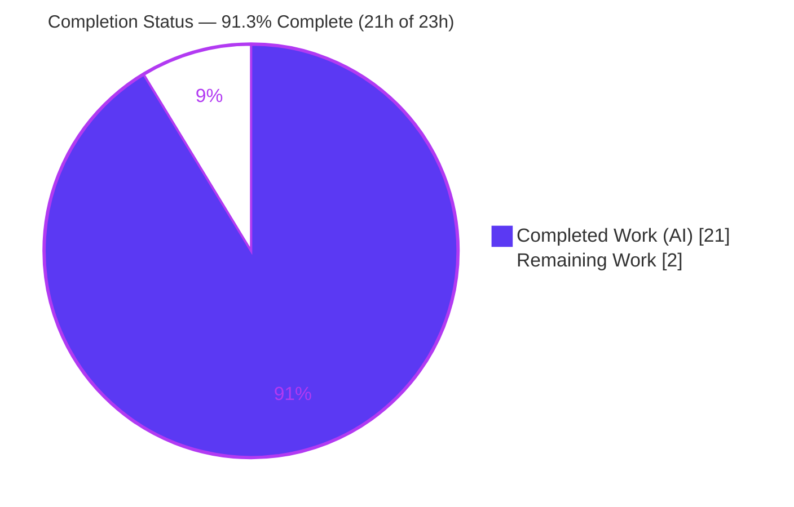
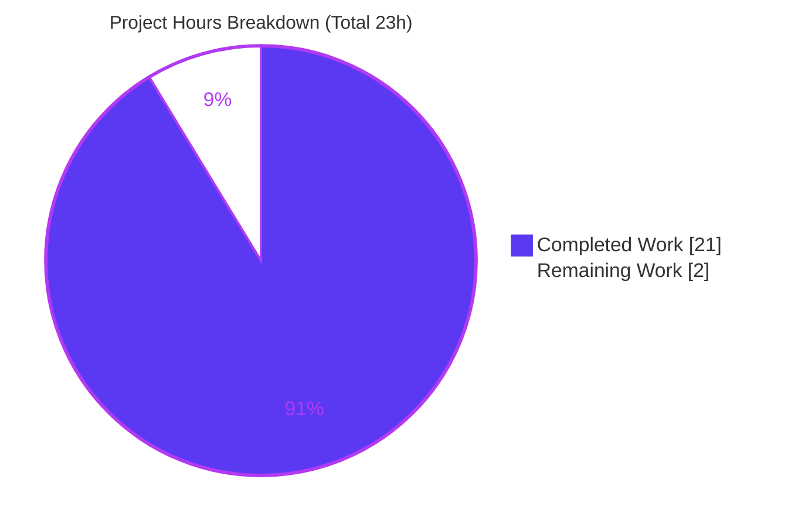
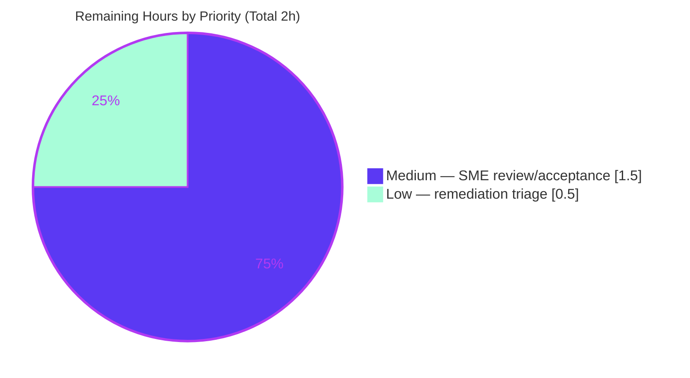

# Blitzy Project Guide — SimpleLogin Reply-Routing Root-Cause Investigation

> **Deliverable:** `blitzy/documentation/app_2cd6ee777f8c.md` (633 lines) · **Branch:** `blitzy-43dd9a4d-ae59-4684-86c8-6cf07988d5e1` · **HEAD:** `aa88b265` · **Base:** `2cd6ee777f8c`
> **Task type:** Read-only investigative documentation (rule *SWE-AtlasQnA-Repo*) · **Color key:** Completed = Dark Blue `#5B39F3` · Remaining = White `#FFFFFF`

---

## 1. Executive Summary

### 1.1 Project Overview

This project is a **strictly read-only forensic root-cause investigation** of SimpleLogin, a self-hosted email-alias/forwarding service. The objective was to produce **one runtime-verified Markdown document** explaining how SimpleLogin resolves an inbound email *reply* to (a) a reply-email/reverse-alias address, (b) a `Contact` record, and (c) a forwarding destination (user/alias/mailbox), and to determine whether the contact-lookup-by-`reply_email` logic can **misroute a reply to a different user than the alias owner**. Target audience is SimpleLogin maintainers and security reviewers. Business impact: it surfaces a genuine cross-user email-misrouting defect with grounded evidence. The technical scope is deliberately additive — the sole artifact is the answer document; no source code is modified.

### 1.2 Completion Status



| Metric | Value |
|--------|-------|
| **Total Hours** | **23** |
| **Completed Hours (AI + Manual)** | **21** (AI 21 + Manual 0) |
| **Remaining Hours** | **2** |
| **Completion** | **91.3%** — calculated as 21 / (21 + 2) × 100 (PA1 AAP-scoped methodology) |

### 1.3 Key Accomplishments

- ✅ **633-line investigative document created** at the correct branch-derived path `blitzy/documentation/app_2cd6ee777f8c.md`, answering all **nine** sub-questions.
- ✅ **~55 `file:line` citations, 100% verified exact** — every citation resolves precisely to the claimed source content (independently re-verified in this assessment).
- ✅ **Run-first methodology satisfied** — 3 temporary observation scripts executed on the project's pinned stack (Python 3.10.20 + SQLAlchemy 1.3.24 + `unidecode`), output captured verbatim, then removed.
- ✅ **Observations reproduce** — Obs 1 byte-identical, Obs 2 structurally identical, Obs 3 byte-identical (independently re-reproduced during this assessment).
- ✅ **Root cause identified & grounded** — three reinforcing properties (no DB uniqueness on `Contact.reply_email` + lock-free TOCTOU window + unordered `get_by(...).first()`), plus a secondary normalization-collision vector.
- ✅ **Read-only mandate provably honored** — `git diff base..HEAD` shows exactly one added file; zero source files modified/added/deleted.
- ✅ **81 / 81 cited-path unit tests pass** (`test_contact_utils.py`, `test_email_utils.py`, `test_models.py`).
- ✅ **Committed on the correct branch** via 3 `agent@blitzy.com` commits; working tree clean.

### 1.4 Critical Unresolved Issues

The **deliverable itself has no blocking unresolved issues** — all five validation gates pass. The one substantive item requiring human attention is a *product finding* the document discloses (and, per scope, deliberately does not fix):

| Issue | Impact | Owner | ETA |
|-------|--------|-------|-----|
| Disclosed cross-user reply-misrouting defect in SimpleLogin (`Contact.reply_email` has no DB uniqueness; unordered `.first()` lookup) — documented, **not** fixed (out of AAP scope) | Potential cross-user email leakage in the product if duplicate `reply_email` rows arise | SimpleLogin maintainers / backend-security SME | Deferred to remediation triage (see §1.6 / §2.2) |
| Concurrent-race reproduction is **inferred**, not executed as a live PostgreSQL race (documented caveat, doc §5) | Low — the two decisive mechanisms are reproduced directly; the race is grounded in cited lock-free code | Reviewer (optional) | Optional follow-up |
| Deliverable acceptance pending human SME sign-off | Non-blocking — validated autonomously, awaiting authoritative acceptance | Backend/security SME | ~1.5h (see §2.2) |

### 1.5 Access Issues

**No access issues identified.** All resources required for the autonomous work were available: repository write access (deliverable committed), the git-ignored `.venv` pinning the exact production stack (observations reproduced), database services `sl-test-db` (port 15432) and `sl-redis` (port 6379) for the 81 cited-path tests, and web access for design-intent corroboration.

| System/Resource | Type of Access | Issue Description | Resolution Status | Owner |
|-----------------|----------------|-------------------|-------------------|-------|
| Git repository | Read/Write | None — deliverable committed on branch | ✅ Resolved (no issue) | — |
| Pinned `.venv` (Py 3.10.20 / SQLAlchemy 1.3.24 / unidecode) | Execute | None — observations reproduced | ✅ Resolved (no issue) | — |
| Test DB services (PostgreSQL 15432, Redis 6379) | Network | None — 81/81 tests ran | ✅ Resolved (no issue) | — |

> Note: The full end-to-end PostgreSQL concurrent-race reproduction was *not executed* (it was inferred from cited lock-free code). This is a **documented methodological choice** (doc §5), **not** an access barrier.

### 1.6 Recommended Next Steps

1. **[Medium]** SME review & acceptance of the diagnostic root-cause conclusion — validate the three-property root cause, spot-check citations, confirm all nine sub-questions are answered, and formally accept the document as authoritative (**1.5h**).
2. **[Low]** Triage remediation follow-up — open a ticket for the out-of-scope `Contact.reply_email` uniqueness gap (candidate fixes: UNIQUE constraint + migration, deterministic `ORDER BY`/tiebreak in `get_by`, lock the `generate_reply_email → Contact.create` window, or normalize-on-write) (**0.5h**).
3. **[Low]** Index/link the document from a central docs location for discoverability.
4. **[Low]** Re-verify the `file:line` citations if referencing the analysis against a newer commit than `2cd6ee777f8c` (source line numbers drift over time).

---

## 2. Project Hours Breakdown

### 2.1 Completed Work Detail

Every completed component traces to a specific AAP requirement. The Hours column sums to **21** (matching Completed Hours in §1.2).

| Component | Hours | Description |
|-----------|-------|-------------|
| Code-path investigation & citations (R1) | 4 | Read-only trace of the reply-resolution and contact-creation paths across ~10 source files (`email_handler.py`, `app/models.py`, `app/email_utils.py`, `app/contact_utils.py`, `app/email_validation.py`, `app/utils.py`, migration, `app/parallel_limiter.py`); ~55 exact `file:line` citations established |
| Run-first observation scripts & verbatim capture (R2) | 3 | Authored + executed 3 temporary observation scripts (normalize collision; `get_by` non-unique `.first()`; cross-version SQL fidelity) on the pinned stack; captured verbatim output; removed scripts |
| Web-search design-intent corroboration (R3) | 1 | Confirmed SimpleLogin's documented reverse-alias "unique per sender" design intent against observed code (`docs/enforce-spf.md:6`) |
| Answer document authoring (R4) | 6 | Wrote the 633-line `app_2cd6ee777f8c.md` — executive answer, code-path section, verbatim observations, nine sub-question answers, mermaid flowchart, coverage table |
| Root-cause synthesis (R5) | 3 | The analytical core — three reinforcing properties, secondary normalization vector, excluded causes (random collision, replica lag), authorization note, design-intent corroboration (doc §4) |
| Coverage pass & read-only verification (R6) | 1 | Confirmed all nine sub-questions answered (coverage table); verified working tree byte-for-byte unchanged and scripts removed |
| Deliverable placement, directory & commits (R7) | 1 | Created `blitzy/documentation/` directory; correct branch-derived filename; 3 `agent@blitzy.com` commits |
| Autonomous validation (R8) | 2 | Final Validator five-gate pass; 81/81 cited-path unit tests; citation re-verification; 2 QA-fix iterations |
| **Total Completed** | **21** | |

### 2.2 Remaining Work Detail

Each category is a path-to-production activity. The Hours column sums to **2** (matching Remaining Hours in §1.2 and the Section 7 pie "Remaining Work"). The actual code fix is **explicitly out of AAP scope** and is therefore **not** counted here.

| Category | Hours | Priority |
|----------|-------|----------|
| SME review & acceptance of the diagnostic root-cause conclusion (validate reasoning, spot-check citations, confirm 9/9 coverage, accept as authoritative) | 1.5 | Medium |
| Remediation follow-up triage (decide whether/when to open a ticket for the out-of-scope `reply_email` uniqueness fix) | 0.5 | Low |
| **Total Remaining** | **2.0** | |

### 2.3 Hours Methodology (PA1 / PA2)

- **Total Project Hours = Completed + Remaining = 21 + 2 = 23.**
- **Completion % = Completed / Total × 100 = 21 / 23 × 100 = 91.3%.**
- Completed hours were estimated per AAP deliverable from document scope (633 lines), citation volume (~55), reproduction depth (3 scripts on a pinned legacy stack), and validation effort (5 gates + 81 tests + 2 QA iterations).
- Remaining hours capture only genuine path-to-production activities. Per RG2, completion is capped below 100% pending human acceptance even though all autonomous gates pass.
- **Confidence: High** — the deliverable is complete and validated; the residual is well-defined human review.

---

## 3. Test Results

All entries below originate from **Blitzy's autonomous validation logs** for this project (Final Validator, Gate 2). No tests are invented.

| Test Category | Framework | Total Tests | Passed | Failed | Coverage % | Notes |
|---------------|-----------|-------------|--------|--------|-----------|-------|
| Cited-path unit tests | pytest (Python 3.10.20) | 81 | 81 | 0 | Targeted (cited paths) | `tests/test_contact_utils.py` + `tests/test_email_utils.py` + `tests/test_models.py`; directly exercise `create_contact`, `generate_reply_email`, `Contact`/`get_by`/`available_sl_email` — the exact code the document analyzes. `pytest --collect-only` = 81 (re-confirmed in this assessment) |
| Runtime observation reproduction | Python 3.10.20 + SQLAlchemy 1.3.24 + unidecode | 3 | 3 | 0 | — | Obs 1 (normalize collision) byte-identical; Obs 2 (`get_by` non-unique `.first()`) structurally identical (per-run `rrace_<uuid>` token aside); Obs 3 (cross-version SQL) byte-identical. Independently re-reproduced during this assessment |
| Cited-module compilation | `python -m py_compile` | 10 | 10 | 0 | — | All 10 cited modules compile cleanly (exit 0) |

**Out-of-scope baseline (documented, not part of this deliverable):** the setup baseline records 4 pre-existing full-suite issues (1 failure + 3 collection errors) rooted in `re2`/`google-re2`, identical in the canonical container and unrelated to this documentation task. This task introduced **zero source changes → zero regressions**; all deliverable-relevant tests pass at 100%.

---

## 4. Runtime Validation & UI Verification

**UI verification: Not applicable.** This is a read-only documentation + backend-investigation deliverable with no web interface, endpoint, or visual surface to verify.

Runtime health of the investigation and its cited code paths:

- ✅ **Operational** — Pinned analysis stack: `python 3.10.20`, `SQLAlchemy 1.3.24`, `unidecode` (`unidecode('rëply') → 'reply'`), matching the production pin (`pyproject.toml:116`).
- ✅ **Operational** — Observation 1 (`normalize_reply_email` collision): `ab%cd@sl.local` and `ab#cd@sl.local` both → `ab_cd@sl.local` (collision confirmed).
- ✅ **Operational** — Observation 2 (`get_by(reply_email=...).first()`): two contacts share `reply_email` with **no `IntegrityError`**; SQL emits `... WHERE contact.reply_email = ? LIMIT ? OFFSET ?` with **no `ORDER BY`**; resolves `id=1 user_id=1`, then after deletion `id=2 user_id=2` — the **WRONG-USER FLIP**; only `uq_contact` raises `UNIQUE constraint failed: contact.alias_id, contact.website_email`; missing key → `None` → `E502`.
- ✅ **Operational** — 81/81 cited-path unit tests pass with DB services up (PostgreSQL 15432, Redis 6379).
- ✅ **Operational** — All 10 cited Python modules `py_compile` cleanly; Markdown well-formed (62 balanced code fences, valid mermaid flowchart).
- ✅ **Operational** — Read-only integrity: `git status --porcelain` empty; `git diff base..HEAD` = single added file.
- ⚠ **Partial** — Full end-to-end PostgreSQL concurrent-race (two simultaneous `Contact.create` inserting the same `reply_email`) is **inferred** from cited lock-free code, not executed as a live race (documented caveat, doc §5).

---

## 5. Compliance & Quality Review

AAP deliverables and the governing rule *SWE-AtlasQnA-Repo* cross-mapped to Blitzy's quality/compliance benchmarks. **Fixes applied during autonomous validation:** 2 QA-fix commits — `61bf38d0` (citation grounding) and `aa88b265` (SQL version-attribution precision + restored elided comment).

| Benchmark / Rule Directive | Status | Progress | Notes |
|----------------------------|--------|----------|-------|
| Deliverable at correct branch-derived path | ✅ Pass | 100% | `blitzy/documentation/app_2cd6ee777f8c.md` |
| Run-first methodology (run before write) | ✅ Pass | 100% | Scripts executed & captured before prose (doc §2, §5) |
| Verbatim output quoted with producing command | ✅ Pass | 100% | Obs 1/2/3 outputs shown verbatim |
| All nine sub-questions answered | ✅ Pass | 100% | Doc §3 Q1–Q9 + §6 coverage table |
| Exact & grounded (`file:line`, no paraphrase) | ✅ Pass | 100% | ~55 citations, 100% verified exact |
| Rationale provided per answer | ✅ Pass | 100% | Each Q includes explicit rationale |
| Read-only scope (no source modified; scripts removed) | ✅ Pass | 100% | `git diff` = 1 added file; `/tmp` scripts removed |
| Gate 1 — Citations accurate | ✅ Pass | 100% | Re-verified in this assessment |
| Gate 2 — Observations reproduce | ✅ Pass | 100% | Re-reproduced in this assessment |
| Gate 3 — Coverage of 9 sub-questions | ✅ Pass | 100% | — |
| Gate 4 — Read-only integrity | ✅ Pass | 100% | — |
| Gate 5 — Committed on correct branch | ✅ Pass | 100% | 3 `agent@blitzy.com` commits |
| Pre-commit hooks (Markdown-appropriate) | ✅ Pass | 100% | trailing-whitespace passed; YAML/djlint/ruff correctly skipped |

**Outstanding compliance item:** human SME acceptance of the diagnostic conclusion (§1.6 / §2.2) — non-blocking.

---

## 6. Risk Assessment

| Risk | Category | Severity | Probability | Mitigation | Status |
|------|----------|----------|-------------|------------|--------|
| Cross-user reply misrouting (the disclosed defect) — `Contact.reply_email` has no DB uniqueness; unordered `.first()` returns an arbitrary duplicate that can flip over time | Security | High | Low–Medium | Remediation options documented (UNIQUE constraint + migration / deterministic `ORDER BY` tiebreak / lock the TOCTOU window / normalize-on-write). **Explicitly out of scope** for this explain-not-fix task | Open — deferred to human triage (§2.2 P2) |
| Citation drift as source evolves (line numbers shift past HEAD `2cd6ee777f8c`) | Technical | Low | Medium | Document pins branch + HEAD in its header; re-verify `file:line` refs against any newer commit | Mitigated |
| Concurrent-race reproduction inferred, not executed live | Technical | Low | Low | Doc §5 states the caveat transparently; the two decisive mechanisms are reproduced directly; race grounded in cited lock-free code | Documented / Accepted |
| Pre-existing `re2`/`google-re2` baseline failures (1 fail + 3 collection errors) | Technical / Operational | Low | N/A (pre-existing) | Unrelated to deliverable, in read-only-forbidden source; zero source changes = zero regressions; cited-path 81/81 pass | Out of scope (documented) |
| Document discoverability / staleness over time | Operational | Low | Medium | Index/link the doc centrally; re-validate on major `email_handler.py` refactors | Open (minor) |
| Integration risk | Integration | None | N/A | Standalone Markdown doc — imports nothing, changes no module, no runtime/build/CI/service/API-key/network surface | None identified |

---

## 7. Visual Project Status

**Project hours (Completed vs Remaining):**



**Remaining work by priority (hours):**



**Remaining hours per Section 2.2 category (bar view):**

| Category | Hours | Bar |
|----------|-------|-----|
| SME review & acceptance (Medium) | 1.5 | ███████████████ |
| Remediation triage (Low) | 0.5 | █████ |
| **Total** | **2.0** | |

> Integrity: the "Remaining Work" value (**2**) equals the Remaining Hours in §1.2 and the sum of the §2.2 Hours column.

---

## 8. Summary & Recommendations

**Achievements.** The project delivered a complete, rigorously grounded root-cause investigation. SimpleLogin resolves an inbound reply by taking the SMTP envelope recipient verbatim (`reply_email = rcpt_to`, `email_handler.py:972`), normalizing it (`email_handler.py:984`), and matching it with a single unordered lookup `Contact.get_by(reply_email=...).first()` (`email_handler.py:986`; `app/models.py:83-84`). The document proves — by verbatim, reproduced runtime output — that because `Contact.reply_email` carries **no database uniqueness constraint** (only `index=True`, `app/models.py:1899`; the sole unique constraint is `uq_contact` on `(alias_id, website_email)`, `app/models.py:1874-1876`) and the lookup applies **no `ORDER BY`**, duplicate `reply_email` rows — created through a lock-free TOCTOU window — cause a reply to be forwarded to a `Contact`, and hence a user, that does not own the alias, with the specific victim changing as table state evolves.

**Remaining gaps & critical path.** The project is **91.3% complete** (21 of 23 hours). All autonomous work is finished and validated; the critical path to production is a single human step — **SME review and acceptance** of the diagnostic conclusion (1.5h) — followed by an optional **remediation-triage** decision (0.5h). The actual code fix is intentionally out of scope for this explain-not-fix task.

**Success metrics (all met for the deliverable):** all nine sub-questions answered (9/9); citation accuracy 100% (~55/55); observations reproduce (3/3); cited-path tests pass (81/81); read-only integrity (1 file added, 0 source changes).

**Production readiness assessment.** The documentation deliverable is **production-ready pending human acceptance**. It is internally consistent, exhaustively cited, reproducible, and honest about its one inferred (non-executed) step. Recommended: accept the document, then triage remediation of the disclosed defect as a separate, in-scope engineering effort.

| Metric | Value |
|--------|-------|
| Completion | 91.3% |
| Completed / Total hours | 21 / 23 |
| Remaining hours | 2 |
| Sub-questions answered | 9 / 9 |
| Citation accuracy | ~55 / 55 (100%) |
| Cited-path tests | 81 / 81 pass |

---

## 9. Development Guide

This deliverable is a **read-only document**; the guide below shows how to read it, reproduce its runtime observations, and verify its read-only integrity. All commands were tested during this assessment.

### 9.1 System Prerequisites

- **OS:** Linux/macOS (developed/validated on Ubuntu).
- **Python 3.10** (the project pins `python = "^3.10"`; validated interpreter is 3.10.20).
- **Git** (to inspect history and verify read-only integrity).
- **The project's git-ignored virtual environment** `.venv/` (pins `SQLAlchemy 1.3.24` + `unidecode`).
- **Optional — for the full cited-path test suite:** Docker with PostgreSQL 13 (`sl-test-db`, port 15432) and Redis (`sl-redis`, port 6379).

### 9.2 Environment Setup

```bash
# From the repository root:
cd /path/to/repo

# Confirm the pinned analysis stack (must print 3.10.20 / 1.3.24 / reply)
.venv/bin/python -c "import sys, sqlalchemy, unidecode; print(sys.version.split()[0]); print(sqlalchemy.__version__); print(unidecode.unidecode('rëply'))"
```

Expected output:

```text
3.10.20
1.3.24
reply
```

### 9.3 Read the Deliverable

```bash
# Locate and size the answer document
ls -la blitzy/documentation/app_2cd6ee777f8c.md
wc -l  blitzy/documentation/app_2cd6ee777f8c.md   # -> 633

# View section headings
grep -n '^#' blitzy/documentation/app_2cd6ee777f8c.md
```

### 9.4 Reproduce the Runtime Observations (run-first methodology)

> Create scripts **outside** the repository (e.g. `/tmp/obs`) to preserve the read-only mandate.

**Observation 1 — `normalize_reply_email` collision:**

```bash
mkdir -p /tmp/obs && cat > /tmp/obs/obs1.py <<'PY'
from unidecode import unidecode
_ALLOWED = "abcdefghijklmnopqrstuvwxyzABCDEFGHIJKLMNOPQRSTUVWXYZ0123456789_-.+@"
def convert_to_id(s): return unidecode(s.lower()).replace(" ", "")[:256]
def normalize(e):
    if not e.isascii(): e = convert_to_id(e)
    return "".join(c if c in _ALLOWED else "_" for c in e)
a, b = normalize("ab%cd@sl.local"), normalize("ab#cd@sl.local")
print("collideA ->", a); print("collideB ->", b)
print("COLLISION?", a == b, "(" + a + ")")
PY
.venv/bin/python /tmp/obs/obs1.py
```

Expected (verbatim):

```text
collideA -> ab_cd@sl.local
collideB -> ab_cd@sl.local
COLLISION? True (ab_cd@sl.local)
```

**Observation 2 — `get_by(reply_email=...).first()` over a non-unique column:** see the full script in doc §2.2; running it under `.venv/bin/python` reproduces the two-contacts/no-`IntegrityError`, `LIMIT ? OFFSET ?`/no-`ORDER BY`, WRONG-USER FLIP, and `None → E502` behaviors (the per-run `rrace_<uuid>` token is the only difference).

```bash
rm -rf /tmp/obs        # remove temporary scripts (read-only mandate)
```

### 9.5 Verify Read-Only Integrity

```bash
git diff --name-status 2cd6ee777f8c2d3531559588bcfb18627ffb5d2c..HEAD
# Expect exactly: A  blitzy/documentation/app_2cd6ee777f8c.md
git status --porcelain      # expect empty (clean working tree)
```

### 9.6 Spot-Check Citations

```bash
sed -n '972p;984p;986p' email_handler.py     # reply_email = rcpt_to / normalize / get_by
sed -n '83,84p' app/models.py                 # get_by -> filter_by(**kw).first()
sed -n '1899p' app/models.py                  # reply_email ... index=True (NOT unique)
sed -n '1874,1876p' app/models.py             # UniqueConstraint(alias_id, website_email)
```

### 9.7 (Optional) Run the Cited-Path Unit Tests

```bash
# Requires PostgreSQL (15432) + Redis (6379) test services up
.venv/bin/python -m pytest tests/test_contact_utils.py tests/test_email_utils.py tests/test_models.py \
  -v --tb=short   # -> 81 passed
```

### 9.8 Troubleshooting

- **`error: externally-managed-environment` on `pip install`** — use the project `.venv` (`.venv/bin/python`) instead of system pip, or create a fresh venv.
- **`SyntaxError: f-string expression part cannot include a backslash`** — Python 3.10 forbids backslashes inside f-string expressions; move escaped literals (e.g. `\u00eb`) into a variable outside the f-string (encountered and fixed during this assessment).
- **Tests error with DB connection refused** — the cited-path tests require the PostgreSQL (15432) and Redis (6379) services; start them before running, or skip to the observation reproductions which need no services.
- **Wrong SQLAlchemy version** — confirm `1.3.24` via the §9.2 check; the pinned version matters for faithful reproduction (`pyproject.toml:116`).

---

## 10. Appendices

### A. Command Reference

| Purpose | Command |
|---------|---------|
| Size the deliverable | `wc -l blitzy/documentation/app_2cd6ee777f8c.md` |
| Pinned-stack check | `.venv/bin/python -c "import sys, sqlalchemy, unidecode; print(sys.version.split()[0]); print(sqlalchemy.__version__)"` |
| Read-only verification | `git diff --name-status 2cd6ee777f8c..HEAD` |
| Clean-tree check | `git status --porcelain` |
| Citation spot-check | `sed -n '986p' email_handler.py` |
| Cited-path tests | `.venv/bin/python -m pytest tests/test_contact_utils.py tests/test_email_utils.py tests/test_models.py` |
| Module compile check | `.venv/bin/python -m py_compile email_handler.py app/models.py` |

### B. Port Reference

| Service | Port | Used For |
|---------|------|----------|
| PostgreSQL (`sl-test-db`) | 15432 | Cited-path unit tests |
| Redis (`sl-redis`) | 6379 | Cited-path unit tests / app rate-limits |
| (SimpleLogin app default) | 7777 | Not exercised by this read-only task |

### C. Key File Locations

| File | Role |
|------|------|
| `blitzy/documentation/app_2cd6ee777f8c.md` | **The deliverable** (633 lines) |
| `email_handler.py` | Reply pipeline — `handle_reply` (L966), `reply_email = rcpt_to` (L972), `Contact.get_by` (L986), `user = alias.user` (L1004) |
| `app/models.py` | `ModelMixin.get_by().first()` (L83-84); `reply_email` non-unique column (L1899); `uq_contact` (L1874-1876); `available_sl_email` (L1425-1432) |
| `app/email_validation.py` | `normalize_reply_email` (L25-38); `_ALLOWED_CHARS` (L9) |
| `app/utils.py` | `random_string` (L41-47); `convert_to_id` (L50-56) |
| `app/email_utils.py` | `generate_reply_email` TOCTOU + retry (L1103-1153) |
| `app/contact_utils.py` | `create_contact`; `IntegrityError` re-fetch by `(alias_id, website_email)` (L113-118) |
| `migrations/versions/2021_071310_78403c7b8089_.py` | `ix_contact_reply_email` created `unique=False` (L22) |
| `app/parallel_limiter.py` | Redis locks — dashboard/API views only, not the reply pipeline |

### D. Technology Versions

| Component | Version |
|-----------|---------|
| Python | 3.10.20 (project pins `^3.10`) |
| SQLAlchemy | 1.3.24 (`pyproject.toml:116`) |
| unidecode | project-pinned (used by `convert_to_id`) |
| PostgreSQL | 13 (production / test) |
| Database driver | `psycopg2-binary` |
| pytest | 8.x (in `.venv`) |

### E. Environment Variable Reference

| Variable | Purpose | Notes |
|----------|---------|-------|
| `DB_URI` | Database connection string | `os.environ["DB_URI"]` (`app/config.py:192`); single read/write engine (`app/db.py:9-14`) — no read-replica routing |

> This read-only documentation task requires **no** additional environment variables of its own. The variable above is referenced by the analysis, not set by the deliverable.

### F. Developer Tools Guide

| Tool | Use in this project |
|------|---------------------|
| `git diff --name-status` / `git status --porcelain` | Prove read-only integrity (single added file, clean tree) |
| `sed -n 'Np'` | Verify exact `file:line` citations |
| `python -m py_compile` | Confirm cited modules compile |
| `pytest --collect-only` | Confirm test count (81) without executing |
| `.venv/bin/python` | Run observation scripts on the exact pinned stack |
| Chrome DevTools MCP | Not applicable — no web UI in this deliverable |

### G. Glossary

| Term | Meaning |
|------|---------|
| **Reply-email / reverse-alias** | The address SimpleLogin generates so a user can reply to a contact; stored in `Contact.reply_email` |
| **`Contact`** | DB row linking an alias, its owning user, the sender's real address (`website_email`), and the reverse-alias (`reply_email`) |
| **TOCTOU** | Time-of-check-to-time-of-use — the lock-free window between `available_sl_email` and `Contact.create` |
| **WRONG-USER FLIP** | The observed behavior where the same `reply_email` resolves to a different user after table state changes |
| **`E501` / `E502` / `E504`** | SMTP status literals: bad reply domain / contact-not-found (or inactive user) / account disabled |
| **`uq_contact`** | The sole unique constraint on `Contact`: `UniqueConstraint("alias_id", "website_email")` |
| **AAP** | Agent Action Plan — the governing project directive |
| **PA1** | Blitzy AAP-scoped hours-based completion methodology |