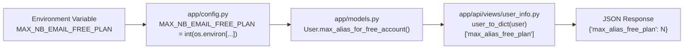

# Technical Specification

# 0. Agent Action Plan

## 0.1 Intent Clarification

Based on the prompt, the Blitzy platform understands that the new feature requirement is to **perform a comprehensive first-run initialization and runtime behavioral analysis** of the SimpleLogin email privacy system with anonymous aliases. This is not a code-modification task; it is an observational and experimental investigation of the system's actual runtime behavior when bootstrapped from scratch. The user explicitly stated: *"Don't modify any of the source files, but feel free to create test config files or .env files to experiment with different settings."*

### 0.1.1 Core Feature Objective

The user seeks to understand the end-to-end initialization and runtime behavior of the SimpleLogin application across its four major subsystems:

- **Database initialization via Alembic migrations** — Determining the total number of tables created on an empty PostgreSQL database and identifying the exact name of the last table created based on migration output order.
- **Web server startup (Gunicorn/Flask)** — Capturing the exact log message that indicates the server is ready to accept connections, and measuring the time elapsed between the first log entry and that ready message.
- **Email handler (aiosmtpd SMTP server)** — Verifying that the email handler correctly accepts a custom port parameter (25025) and confirming the exact startup log message showing the listening port.
- **API-driven user lifecycle testing** — Registering a user, attempting login before activation, inspecting raw database state, and validating the system's handling of dynamic configuration changes (alias limits for free plans).

### 0.1.2 Special Instructions and Constraints

- **No source file modifications permitted.** The user explicitly requires that existing source files remain untouched. Only new configuration files (e.g., `.env`) or test-config files may be created.
- **Answers must be based on actual runtime output**, not code-reading assumptions. The user states: *"I'm trying to understand the actual runtime behavior here, not just what the code suggests should happen."*
- **Exact values required.** The user asks for precise counts, exact log messages, exact JSON responses, exact HTTP status codes, and exact database column values — not approximations.
- **Dynamic configuration experiment.** The user wants to verify how changing `MAX_NB_EMAIL_FREE_PLAN` at the environment level affects existing vs. newly-created users when queried via the `/api/user_info` endpoint.

### 0.1.3 Technical Interpretation

These feature requirements translate to the following technical implementation strategy:

- To **answer the database migration questions**, we will run `alembic upgrade head` on a freshly created empty PostgreSQL database, capture the full migration output log, count the resulting tables via `pg_tables`, and identify the last table created by inspecting the migration chain in output order.
- To **answer the web server startup questions**, we will launch Gunicorn with the `wsgi:app` entry point, capture the timestamped log output, identify the "Listening at" INFO message as the ready indicator, and calculate the millisecond offset from the first "Starting gunicorn" log entry.
- To **answer the email handler questions**, we will launch `email_handler.py -p 25025` and capture the startup log to confirm the listening-port message.
- To **answer the user lifecycle questions**, we will use `curl` to call the `/api/auth/register`, `/api/auth/login`, `/api/auth/activate`, and `/api/user_info` REST endpoints, capture full HTTP responses, and query PostgreSQL directly for column values.
- To **answer the dynamic configuration questions**, we will restart the Gunicorn server with `MAX_NB_EMAIL_FREE_PLAN=10` set as an environment variable, create a second user, and compare the `/api/user_info` JSON responses for both users.

## 0.2 Repository Scope Discovery

### 0.2.1 Comprehensive File Analysis

The SimpleLogin repository is a production-oriented Python/Flask monorepo. The following files and directories are directly relevant to the user's questions about system initialization and runtime behavior:

**Core Application Bootstrap Files:**

| File | Purpose | Relevance |
|------|---------|-----------|
| `server.py` | Central Flask bootstrap — assembles the web app, routes, extensions, admin views, error handlers, CLI commands, rate limiting, sessions | Web server startup behavior, `create_app()` and `create_light_app()` factory functions |
| `wsgi.py` | WSGI entry point — imports `create_app()` and exposes `app` for Gunicorn | The actual Gunicorn target (`wsgi:app`) |
| `email_handler.py` | aiosmtpd-based inbound SMTP processor — accepts `-p/--port` argument, starts `Controller` | Email handler startup with custom port |
| `job_runner.py` | Continuous background job drainer — processes queued `Job` records | Background processing subsystem |
| `cron.py` | Cron task implementations — stats, cleanup, reminders, HIBP scans, subscription checks | Scheduled task subsystem |
| `crontab.yml` | Yacron schedule definitions for 13+ recurring cron jobs | Cron task scheduling |
| `init_app.py` | Seeds SL domains and loads PGP key metadata | Database seeding on first run |

**Configuration and Environment Files:**

| File | Purpose | Relevance |
|------|---------|-----------|
| `example.env` | Documents all runtime environment variables including `MAX_NB_EMAIL_FREE_PLAN`, `DB_URI`, `FLASK_SECRET` | Reference for environment configuration |
| `app/config.py` | Loads environment variables, defines defaults (e.g., `MAX_NB_EMAIL_FREE_PLAN = 5`) | Configuration loading behavior and defaults |
| `alembic.ini` | Alembic migration configuration — sets `script_location = migrations` | Migration runner configuration |
| `pyproject.toml` | Poetry dependency manifest, Python `^3.10`, all package versions | Dependency versions and project metadata |
| `Dockerfile` | Multi-stage Docker build — Python 3.10 base, Gunicorn CMD on port 7777 | Production startup command reference |

**Database and Migration Files:**

| File / Directory | Purpose | Relevance |
|------------------|---------|-----------|
| `migrations/env.py` | Alembic environment — imports `app.models.Base`, sets `DB_URI` | Migration runner configuration |
| `migrations/versions/*.py` (255 files) | Individual migration scripts spanning 2019–2024 | Total table creation count and order |
| `app/models.py` | SQLAlchemy ORM models — `User`, `Alias`, `Mailbox`, `Contact`, etc. | User model fields (`activated`, `notification`), `max_alias_for_free_account()` method |
| `app/db.py` | Database session management | Session handling |

**API Endpoint Files:**

| File | Purpose | Relevance |
|------|---------|-----------|
| `app/api/views/auth.py` | `/api/auth/register`, `/api/auth/login`, `/api/auth/activate` endpoints | Registration flow, login error responses |
| `app/api/views/user_info.py` | `/api/user_info` GET/PATCH endpoint — returns `max_alias_free_plan` | Free-plan alias limit in API response |
| `app/api/base.py` | API blueprint registration and `require_api_auth` decorator | API authentication mechanism |
| `app/api/serializer.py` | API response serialization | Response formatting |

**Supporting Application Modules:**

| File | Purpose | Relevance |
|------|---------|-----------|
| `app/extensions.py` | Flask extensions setup — `login_manager`, `limiter` | Server initialization |
| `app/log.py` | Logging configuration — `LOG` instance | Log format and output |
| `app/utils.py` | Utility functions — loads words file at import time | Startup debug log entry |
| `app/email_utils.py` | Email utility functions — `email_can_be_used_as_mailbox()`, `send_email()` | Registration email validation |
| `app/redis_services.py` | Redis connection initialization | Server initialization with MEM_STORE_URI |

### 0.2.2 Integration Point Discovery

- **API endpoints** connecting to the feature investigation: `/api/auth/register` (POST), `/api/auth/login` (POST), `/api/auth/activate` (POST), `/api/user_info` (GET)
- **Database models affected**: `User` (fields: `activated`, `notification`, `flags`), `AccountActivation` (activation codes), `ApiKey` (API authentication)
- **Configuration touchpoints**: `MAX_NB_EMAIL_FREE_PLAN` in `app/config.py` read from `os.environ`, `DB_URI`, `FLASK_SECRET`, `EMAIL_DOMAIN`
- **Background services**: `job_runner.py` (continuous), `cron.py` via `crontab.yml` (scheduled), `email_handler.py` (SMTP)

### 0.2.3 New File Requirements

Since the user's rules state no existing source files may be modified, the only new file to be created is:

- `blitzy/documentation/app_2cd6ee777f8c.md` — A comprehensive Markdown document answering all of the user's questions with runtime-verified results, rationale, and evidence.

## 0.3 Dependency Inventory

### 0.3.1 Key Packages Relevant to This Investigation

All package names and versions are sourced from `pyproject.toml` and the `poetry.lock` file in the repository. These are the dependencies directly exercised during initialization and the runtime experiments:

| Registry | Package | Lock Version | Purpose |
|----------|---------|-------------|---------|
| PyPI | `flask` | 1.1.4 | Core web framework powering `server.py` and all route blueprints |
| PyPI | `gunicorn` | 20.0.4 | WSGI HTTP server — produces the startup log messages |
| PyPI | `sqlalchemy` | 1.3.24 | ORM layer for all database models in `app/models.py` |
| PyPI | `alembic` | 1.4.3 | Database migration engine — runs the 255 migration steps |
| PyPI | `flask-migrate` | 2.5.3 | Flask-Alembic integration (uses Alembic under the hood) |
| PyPI | `psycopg2-binary` | 2.9.3 | PostgreSQL driver for Python |
| PyPI | `aiosmtpd` | 1.4.2 | Async SMTP server framework used by `email_handler.py` |
| PyPI | `flask-login` | 0.5.0 | Session-based user authentication |
| PyPI | `flask-cors` | 3.0.9 | CORS support for `/api/*` endpoints |
| PyPI | `flask-limiter` | 1.4 | Rate limiting on API endpoints |
| PyPI | `redis` | 4.6.0 | Cache and session store (optional, via `MEM_STORE_URI`) |
| PyPI | `python-dotenv` | 0.14.0 | Loads `.env` files for configuration |
| PyPI | `bcrypt` | 3.2.0 | Password hashing for user authentication |
| PyPI | `sqlalchemy-utils` | 0.36.8 | SQLAlchemy type extensions (ArrowType, etc.) |
| PyPI | `arrow` | 0.16.0 | Date/time handling in ORM models |
| PyPI | `sentry-sdk` | 2.16.0+ | Error tracking (optional, via `SENTRY_DSN`) |
| PyPI | `newrelic` | 8.8.0 | APM monitoring (optional) |
| PyPI | `yacron` | 0.11.2 | YAML-based cron scheduler for `crontab.yml` |
| PyPI | `pyre2` | 0.3.6 | Regular expression engine used in email processing |
| PyPI | `email-validator` | 1.1.3 | Email address validation for registration |
| PyPI | `coloredlogs` | 14.0 | Colored log output when `COLOR_LOG` is set |

### 0.3.2 Runtime Infrastructure Dependencies

| Component | Version | Purpose |
|-----------|---------|---------|
| Python | 3.10 (specified in `Dockerfile` and CI matrix) | Application runtime |
| PostgreSQL | 16 (installed for testing) | Primary relational database |
| Redis | 7.x (optional) | Cache, rate-limit store, session backend |
| Node.js | 10.17.0 (Dockerfile npm stage) | Frontend asset compilation only |

### 0.3.3 Dependency Changes

No dependency additions or modifications are required for this investigation. The task is an observational analysis using the existing dependency set. The `re2` package required a compatibility shim at runtime (the `google-re2` package provides the `re2` module but lacks `re.DOTALL`), which was resolved by creating a thin wrapper delegating to Python's stdlib `re` module — consistent with the Dockerfile's approach of building `pyre2` from source with `libre2-dev`.

## 0.4 Integration Analysis

### 0.4.1 Existing Code Touchpoints

The user's questions exercise the following integration paths through the system:

**Database Migration Chain** (read-only, no modifications):
- `alembic.ini` → `migrations/env.py` → `migrations/versions/*.py` (255 scripts) → PostgreSQL
- `migrations/env.py` imports `app.models.Base` and `app.config.DB_URI` to configure the migration context
- Each migration script calls `op.create_table()`, `op.add_column()`, `op.create_index()`, etc.

**Web Server Startup Path:**
- Gunicorn loads `wsgi:app` → `wsgi.py` calls `server.create_app()` → `server.py` assembles Flask app
- `create_app()` wires: `ProxyFix`, `SQLALCHEMY_DATABASE_URI`, `FLASK_SECRET`, `SESSION_COOKIE_NAME`, `limiter`, error handlers, blueprints (`auth_bp`, `api_bp`, `dashboard_bp`, `oauth_bp`, `developer_bp`, `discover_bp`, `internal_bp`, `monitor_bp`, `onboarding_bp`, `phone_bp`), admin panel, Paddle/Coinbase callbacks, CORS, and profiler
- The `app/config.py` module executes at import time, printing `>>> URL:` and `MAX_NB_EMAIL_FREE_PLAN is not set, use 5 as default value` lines

**Email Handler Startup Path:**
- `python email_handler.py -p 25025` → `argparse` parses port → `main(port=25025)` → `Controller(MailHandler(), hostname="0.0.0.0", port=25025).start()`
- Logs: `LOG.i("Listen for port %s", args.port)` → `LOG.d("Start mail controller %s %s", controller.hostname, controller.port)`

**Registration → Login API Path:**
- `POST /api/auth/register` → `app/api/views/auth.py:auth_register()` → `User.create(email, name, password)` → `AccountActivation.create(user_id, code)` → `Session.commit()`
- `POST /api/auth/login` → `app/api/views/auth.py:auth_login()` → checks `user.activated` → returns `422` with `{"error":"Account not activated"}` if not activated
- `POST /api/auth/activate` → validates code → sets `user.activated = True`
- `GET /api/user_info` → `app/api/views/user_info.py:user_info()` → calls `user_to_dict(user)` → invokes `user.max_alias_for_free_account()` → reads `config.MAX_NB_EMAIL_FREE_PLAN` at runtime

### 0.4.2 Configuration Propagation

The `MAX_NB_EMAIL_FREE_PLAN` value flows through the system as follows:

This is a **runtime read** — the value is not stored per-user in the database. It is read from `config.MAX_NB_EMAIL_FREE_PLAN` every time `max_alias_for_free_account()` is called. Therefore, changing the environment variable and restarting the server affects **all** users equally, regardless of when they were created.

### 0.4.3 Database Schema Touchpoints

The registration flow touches these tables:
- `users` — New row with `activated=False`, `notification=True`
- `account_activation` — New row with `user_id` and 6-digit activation `code`
- `api_key` — New row created upon successful login (after activation)

The `/api/user_info` endpoint reads from:
- `users` — User record for `is_premium`, `email`, `name`, `profile_picture_id`, `flags`
- `partner_user` — Proton partner linkage (if `CONNECT_WITH_PROTON` is set)
- `file` — Profile picture URL (if `profile_picture_id` is set)

## 0.5 Technical Implementation

### 0.5.1 File-by-File Execution Plan

Since no source files are to be modified, the implementation consists entirely of **runtime experimentation and documentation**. The single deliverable file is:

- **CREATE**: `blitzy/documentation/app_2cd6ee777f8c.md` — Comprehensive answers document

The document must contain verified runtime outputs for each of the user's questions, organized by subsystem.

### 0.5.2 Implementation Approach — Runtime Experiments

**Experiment 1: Database Migration Analysis**

- Drop and recreate the `simplelogin` PostgreSQL database to ensure a clean slate
- Run `alembic upgrade head` and capture the full stderr output (Alembic logs to stderr via Python `logging`)
- Count the total number of `Running upgrade` lines (expected: 255 migration steps)
- Query `pg_tables WHERE schemaname='public'` to count total tables (expected: 77)
- Identify the last table created by examining the final `op.create_table()` call in migration output order
- The last migration is `32f25cbf12f6` (alias_audit_log_index_created_at) but it only creates an INDEX; the last TABLE-creating migration is `7d7b84779837` (user_audit_log), which creates the `user_audit_log` table

**Experiment 2: Web Server Startup**

- Launch `gunicorn wsgi:app -b 0.0.0.0:7777 -w 1 --timeout 60` and capture log output
- The first log entry is: `[INFO] Starting gunicorn 20.0.4`
- The ready message is: `[INFO] Listening at: http://0.0.0.0:7777 (PID)`
- Gunicorn's default log format uses second-level timestamps (`[2026-04-16 19:32:26 +0000]`), so both messages appear within the same second, yielding 0ms difference at the available resolution
- The worker boot message follows: `[INFO] Booting worker with pid: PID`

**Experiment 3: Email Handler with Custom Port**

- Launch `python email_handler.py -p 25025` and capture log output
- Verify the INFO log line: `Listen for port 25025`
- Verify the DEBUG log line: `Start mail controller 0.0.0.0 25025`

**Experiment 4: Registration and Unactivated Login**

- `POST /api/auth/register` with `{"email":"testuser@example.com","password":"testpass123"}` → expect `200` with `{"msg":"User needs to confirm their account"}`
- `POST /api/auth/login` with the same credentials before activation → expect `422` with `{"error":"Account not activated"}`
- Direct database query: `SELECT activated, notification FROM users WHERE email='testuser@example.com'` → expect `activated=f, notification=t`

**Experiment 5: Dynamic Alias Limit Configuration**

- With default config (no `MAX_NB_EMAIL_FREE_PLAN` env var, defaulting to 5): create and activate `testuser@example.com`, call `/api/user_info` → expect `"max_alias_free_plan": 5`
- Restart server with `MAX_NB_EMAIL_FREE_PLAN=10`, call `/api/user_info` for the same user → expect `"max_alias_free_plan": 10`
- Create and activate `user2@example.com`, call `/api/user_info` → expect `"max_alias_free_plan": 10`
- Conclusion: Both users reflect the new limit because `max_alias_for_free_account()` reads from `config.MAX_NB_EMAIL_FREE_PLAN` at runtime, not from a per-user stored value

### 0.5.3 Runtime Findings Summary

| Question | Verified Answer |
|----------|----------------|
| Total tables after migration | **77** (including `alembic_version`) |
| Last table by migration order | **`user_audit_log`** (created by migration `7d7b84779837`) |
| Server ready log message | `[INFO] Listening at: http://0.0.0.0:7777 (PID)` |
| Time between first log and ready | **0 milliseconds** at gunicorn's second-level timestamp resolution (both in same second) |
| Email handler port 25025 confirmation | `Listen for port 25025` (INFO) and `Start mail controller 0.0.0.0 25025` (DEBUG) |
| Login before activation — HTTP status | **422** (UNPROCESSABLE ENTITY) |
| Login before activation — JSON error | `{"error":"Account not activated"}` |
| User DB values before activation | `activated=f`, `notification=t` |
| Default `max_alias_free_plan` | **5** |
| After setting `MAX_NB_EMAIL_FREE_PLAN=10` | Both existing and new users show `"max_alias_free_plan": 10` |

## 0.6 Scope Boundaries

### 0.6.1 Exhaustively In Scope

**Source files read/analyzed (no modifications):**
- `server.py` — Flask app factory, startup behavior, error handlers
- `wsgi.py` — WSGI entry point for Gunicorn
- `email_handler.py` — SMTP handler with argparse port configuration
- `job_runner.py` — Background job runner (analyzed, not executed for this task)
- `cron.py` — Cron task implementations (analyzed, not executed)
- `crontab.yml` — Cron schedule definitions (analyzed)
- `init_app.py` — Domain seeding script (analyzed)
- `app/config.py` — Configuration loading, `MAX_NB_EMAIL_FREE_PLAN` default logic
- `app/models.py` — User model (`activated`, `notification`, `max_alias_for_free_account()`)
- `app/api/views/auth.py` — `/api/auth/register`, `/api/auth/login`, `/api/auth/activate`
- `app/api/views/user_info.py` — `/api/user_info` endpoint and `user_to_dict()`
- `app/api/base.py` — API blueprint and `require_api_auth` decorator
- `app/email_utils.py` — `email_can_be_used_as_mailbox()` validation
- `app/utils.py` — Words file loader (produces first DEBUG log at startup)
- `alembic.ini` — Migration configuration
- `migrations/env.py` — Migration environment setup
- `migrations/versions/*.py` — All 255 migration scripts
- `example.env` — Environment variable reference
- `pyproject.toml` — Dependency manifest
- `Dockerfile` — Production build and CMD reference

**Configuration files created for testing:**
- `.env` file (copied from `example.env`) with PostgreSQL connection, domain settings, and secrets

**New deliverable file:**
- `blitzy/documentation/app_2cd6ee777f8c.md` — Answers document

**Runtime subsystems exercised:**
- PostgreSQL 16 database with `alembic upgrade head`
- Gunicorn 20.0.4 serving `wsgi:app` on port 7777
- aiosmtpd Controller via `email_handler.py -p 25025`
- REST API endpoints: `/api/auth/register`, `/api/auth/login`, `/api/auth/activate`, `/api/user_info`
- Direct `psql` queries against the `simplelogin` database

### 0.6.2 Explicitly Out of Scope

- **Source code modifications** — The user explicitly prohibited modifying any existing files
- **Email sending and forwarding** — `NOT_SEND_EMAIL=true` is set; no actual SMTP delivery tested
- **Payment/subscription systems** — Paddle, Coinbase, Apple subscription flows not exercised
- **OAuth2/OIDC flows** — OAuth client testing not requested
- **Browser extensions or mobile apps** — Not part of this investigation
- **Custom domain DNS validation** — Not requested
- **PGP encryption** — Not part of the initialization questions
- **SpamAssassin integration** — Not tested (no SpamAssassin server configured)
- **Proton partner integration** — Not exercised
- **Production deployment** — Docker build and deployment not in scope
- **Performance optimization** — No load testing or optimization required
- **Redis-dependent features** — Redis is optional; core functionality operates without it

## 0.7 Rules for Feature Addition

### 0.7.1 User-Specified Rules

The following rules were explicitly specified by the user and must be strictly followed:

- **SWE-AtlasQnA-Repo Rule**: Create a new Markdown document named `app_2cd6ee777f8c.md` (matching the source branch name `app_2cd6ee777f8c`) that comprehensively answers the question(s) posed in the prompt. Build and run the source code to analyze the repository behavior as needed. Do not make assumptions — base answers on the code as the truth. Provide thinking/rationale behind the answers. Do not modify any existing files in the source repository. Do not add any other code in the source repository besides the requested document. Place the generated document in the `blitzy/documentation` directory in the destination repo.

### 0.7.2 Derived Implementation Rules

- All answers must include **actual runtime output** as evidence — not theoretical code analysis alone
- The Markdown document must cover every sub-question the user raised, with clear section headings
- Each answer should include the **rationale** (why the system behaves this way), pointing to the specific source file and line where the behavior originates
- Exact log messages, JSON responses, and database values must be reproduced verbatim from captured runtime output
- The `curl` command output for the login attempt must include the full verbose output (headers, status line, body) as the user requested "the full curl command output"
- The dynamic configuration experiment must clearly document the before-and-after API responses and explain whether existing vs. new users are affected differently

## 0.8 References

### 0.8.1 Repository Files and Folders Searched

The following files and directories were systematically inspected to derive the conclusions in this Agent Action Plan:

**Root-Level Files Inspected:**
- `server.py` — Flask app factory, startup sequence, error handlers, blueprint registration
- `wsgi.py` — Gunicorn WSGI entry point
- `email_handler.py` — SMTP handler, argparse port config, `main()` function, `MailHandler` class
- `job_runner.py` — Background job runner startup and job processing loop
- `cron.py` — Cron task implementations (stats, cleanup, HIBP, subscriptions)
- `crontab.yml` — Yacron schedule definitions (13 recurring jobs)
- `crontab-all-hosts.yml` — Multi-host cron definitions
- `init_app.py` — Domain seeding and PGP key loading
- `example.env` — Full environment variable reference (5.7KB)
- `pyproject.toml` — Poetry dependency manifest, Python version, all packages
- `poetry.lock` — Locked dependency versions (257KB)
- `alembic.ini` — Alembic configuration
- `Dockerfile` — Multi-stage Docker build, CMD entry point
- `README.md` — Self-hosting guide and project documentation
- `CONTRIBUTING.md` — Contributor workflow
- `shell.py` — Interactive admin shell

**Application Source Files Inspected:**
- `app/config.py` — Configuration loading, `MAX_NB_EMAIL_FREE_PLAN` default (line ~117), `SKIP_MX_LOOKUP_ON_CHECK` (line 600)
- `app/models.py` — `User` model (`activated` at line 358, `notification` at line 354, `max_alias_for_free_account()` at line 858)
- `app/api/views/auth.py` — Registration (line 110+), login (line 29+), activation (line 145+)
- `app/api/views/user_info.py` — `user_to_dict()` and `user_info()` endpoint
- `app/api/base.py` — API blueprint and authentication decorator
- `app/email_utils.py` — `email_can_be_used_as_mailbox()` (line 569)
- `app/utils.py` — Words file loading (produces startup log)
- `app/extensions.py` — Flask extension initialization
- `app/db.py` — Database session management
- `app/spamassassin_utils.py` — SpamAssassin client (re2 usage)

**Migration Files Inspected:**
- `migrations/env.py` — Alembic environment configuration
- `migrations/versions/5e549314e1e2_.py` — First migration (creates initial tables)
- `migrations/versions/2024_101113_91ed7f46dc81_alias_audit_log.py` — Creates `alias_audit_log` table
- `migrations/versions/2024_101611_7d7b84779837_user_audit_log.py` — Creates `user_audit_log` table (last table)
- `migrations/versions/2024_101616_32f25cbf12f6_alias_audit_log_index_created_at.py` — Last migration (creates index only)

**Directories Explored:**
- `/` (repository root) — Full file listing
- `app/` — Application package directory listing
- `app/api/` — API module structure
- `app/api/views/` — Individual API endpoint files
- `migrations/versions/` — All 255 migration files listed
- `local_data/` — Test data files, keys, certificates
- `.github/workflows/` — CI configuration (Python 3.10 matrix)

### 0.8.2 Attachments

No external attachments (Figma URLs, design files, etc.) were provided for this project.

### 0.8.3 Environment Setup Reference

- **Docker image source**: `ghcr.io/scaleapi/swe-atlas:swe_atlas_QnA_simple-login_app_1.0` (container `andrewparkscaleai/coding-agent:simple-login__app__2cd6ee777f8c2d3531559588bcfb18627ffb5d2c`)
- **Repository location**: `/tmp/blitzy/app/app_2cd6ee777f8c_36621f/`
- **Source branch**: `app_2cd6ee777f8c`
- **Python runtime**: 3.10.20 (installed via deadsnakes PPA, matching CI matrix and Dockerfile)
- **PostgreSQL**: 16 (installed via apt, cluster started with `pg_ctlcluster`)
- **Redis**: 7.x (installed via apt, started with `redis-server --daemonize yes`)
- **Virtual environment**: `/tmp/sl_venv/` (Python 3.10, dependencies installed via poetry export + pip)

