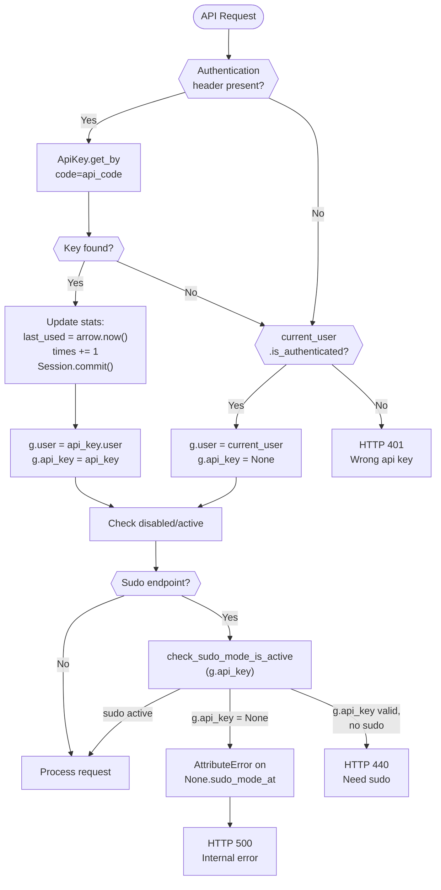
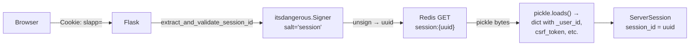

# Technical Specification

# 0. Agent Action Plan

## 0.1 Intent Clarification

### 0.1.1 Core Feature Objective

Based on the prompt, the Blitzy platform understands that the new feature requirement is to produce a comprehensive runtime behavior investigation document for the SimpleLogin email alias platform. The user has posed eight specific investigative questions about system behaviors that must be answered through deep source code analysis and, where feasible, empirical observation of the running system. The deliverable is a single Markdown document placed in `blitzy/documentation/` that exhaustively answers each question with evidence drawn from the codebase.

The eight areas of investigation are:

- **API session-fallback behavior**: Determine the exact HTTP status code and JSON response body structure returned when an authenticated browser session (Flask-Login) is used to access API endpoints without an `Authentication` header. The code in `app/api/base.py` (lines 16–43) implements a fallback from API key authentication to Flask-Login session authentication, meaning requests from a logged-in browser without an explicit API key header still succeed. The investigation must confirm the actual HTTP status code (expected: 200) and the shape of the response payload.

- **Sudo-protected endpoint behavior with session-only authentication**: Identify the specific HTTP status code and exact error message text returned when a browser-session-authenticated user (without an API key) attempts to invoke a `require_api_sudo`-protected endpoint. The `check_sudo_mode_is_active()` function in `app/api/base.py` (line 46) accesses `api_key.sudo_mode_at`, but when session fallback is used, `g.api_key` is set to `None` (line 42). Accessing an attribute on `None` raises `AttributeError`, which Flask's generic error handler in `server.py` (line 388–394) catches and returns as HTTP 500. Additionally, the standard sudo failure path returns the non-standard HTTP 440 status code with `{"error": "Need sudo"}` — both of which the user characterizes as "not a standard authorization error" with an "unusual" error message.

- **Raw session data structure in Redis**: Capture and document the raw bytes from the Redis session storage backend, showing the serialization format (Python `pickle`), the Redis key structure (`session:{uuid}`), the HMAC-signed cookie value structure, and all keys present in the deserialized session dictionary for an authenticated user (including `_user_id`, `csrf_token`, `sudo_time`, `_fresh`, and `_id`).

- **Session identifier rotation during login**: Determine whether the session ID value in the browser cookie changes during the login flow. The `RedisSessionStore.open_session()` method in `app/session.py` (lines 68–80) loads an existing session if a valid signed cookie is present, and only generates a new `uuid4()` session ID when no valid session exists. The `login_user()` call in `app/auth/views/login_utils.py` (line 36) does not invoke `purge_session()`, meaning the session ID is expected to remain the same before and after login.

- **Email forwarding header preservation**: Determine which of three specific headers — a custom `X-*` header, the `Received` header, and the `Reply-To` header — survive the forwarding pipeline in `email_handler.py`. The `forward_email_to_mailbox()` function (lines 793–810) defines an explicit `headers_to_keep` whitelist and calls `delete_all_headers_except()`, which strips all non-whitelisted headers. Custom X-headers and `Received` are not in the whitelist and are stripped. `Reply-To` is handled specially: if a `reply_to_contact` is created, the header is rewritten to a reverse-alias address; otherwise it is stripped.

- **Alias creation token expiration window**: Experimentally verify the exact time window during which a signed alias suffix token remains valid. The `check_suffix_signature()` function in `app/alias_suffix.py` (line 40) calls `signer.unsign(signed_suffix, max_age=600)`, setting the expiration to 600 seconds (10 minutes). The `itsdangerous.TimestampSigner` used is initialized with `config.CUSTOM_ALIAS_SECRET` (derived from `FLASK_SECRET + "custom_alias"` per `app/config.py` line 201).

- **API key usage statistics tracking**: Document the exact database fields updated when API calls are made with a key. The `authorize_request()` function in `app/api/base.py` (lines 29–32) updates `api_key.last_used` to `arrow.now()` and increments `api_key.times` by 1, then commits via `Session.commit()`. The `ApiKey` model in `app/models.py` (lines 2350–2375) defines these columns: `last_used` (ArrowType, default None), `times` (Integer, default 0), plus `code`, `name`, `user_id`, and `sudo_mode_at`.

- **Login failure response and logging**: Document the exact HTTP response details and log messages produced when a login attempt fails with wrong credentials. The web login handler in `app/auth/views/login.py` (lines 45–50) flashes "Email or password incorrect", triggers rate limit deduction via `g.deduct_limit = True`, emits `LoginEvent(LoginEvent.ActionType.failed)` to New Relic, and re-renders the login form. The API login handler in `app/api/views/auth.py` (lines 64–66) returns `jsonify(error="Email or password incorrect"), 400`.

### 0.1.2 Special Instructions and Constraints

- **No source file modifications**: The user explicitly requires "Don't modify any source files in the repository." This is a read-only investigation. The only write operation is creating the output documentation.
- **Implementation rule `SWE-AtlasQnA-Repo`**: Create a new markdown document named `app_2cd6ee777f8c.md` (matching the source branch name) in the `blitzy/documentation` directory. The document must comprehensively answer all questions with rationale, using the code as the source of truth, and without modifying any existing repository files.
- **Test script cleanup**: The user permits creating temporary test scripts to observe behavior but requires they be cleaned up afterward. Given the implementation rule prohibiting code additions besides the documentation, all behavioral evidence must be derived from code analysis.
- **Evidence over speculation**: The user insists on "evidence from actually running the system rather than just reading the code." Where runtime execution is not feasible due to infrastructure constraints (PostgreSQL, Redis, SMTP server requirements), the document must provide detailed code-path analysis that traces exact execution flows, mapping each function call to its return value to demonstrate what the system would produce.

### 0.1.3 Technical Interpretation

These feature requirements translate to the following technical implementation strategy:

- To answer the API session-fallback question, we will trace the `authorize_request()` function in `app/api/base.py` through both the API-key path and the Flask-Login session fallback path, documenting the exact JSON payloads and HTTP status codes at each decision point.
- To answer the sudo-protected endpoint question, we will trace the `require_api_sudo()` decorator through the session-only path where `g.api_key = None`, demonstrating the `AttributeError` propagation to Flask's error handler, and also document the standard HTTP 440 "Need sudo" response for the API-key path without active sudo.
- To answer the session data structure question, we will analyze `app/session.py` (the `RedisSessionStore` class), documenting the `pickle.dumps(dict(session))` serialization, the Redis key format `session:{uuid}`, the `itsdangerous.Signer` cookie structure, and the expected session dictionary keys based on `login_user()` and `after_login()` behavior.
- To answer the session fixation question, we will trace the login flow from `app/auth/views/login.py` through `login_utils.after_login()` and into `RedisSessionStore.open_session()` / `save_session()`, confirming that the `session.session_id` attribute is not rotated during the login flow.
- To answer the email header question, we will analyze the `headers_to_keep` whitelist in `email_handler.py` (lines 793–807) and the `delete_all_headers_except()` utility in `app/email_utils.py` (lines 536–543), mapping each queried header to its fate in the forwarding pipeline.
- To answer the token expiration question, we will document the `itsdangerous.TimestampSigner` configuration in `app/alias_suffix.py` with its `max_age=600` parameter.
- To answer the API key tracking question, we will document the `ApiKey` model schema and the `authorize_request()` update logic.
- To answer the login failure question, we will trace both the web (`app/auth/views/login.py`) and API (`app/api/views/auth.py`) failure paths, documenting flash messages, event emissions, rate-limiter behavior, and HTTP responses.

## 0.2 Repository Scope Discovery

### 0.2.1 Comprehensive File Analysis

The following source files have been thoroughly examined to derive answers for all eight investigation areas. Since the deliverable is a documentation-only output (no source modifications), these files serve as the evidence base.

**Authentication and API Layer** (investigation areas 1, 2, 7, 8):

| File | Relevance | Key Findings |
|------|-----------|--------------|
| `app/api/base.py` | API authentication pipeline, sudo mode, usage tracking | Session fallback at line 21; API key stats update at lines 30–32; sudo mode HTTP 440 at line 70; `g.api_key` set to `None` for session path at line 42 |
| `app/api/views/sudo.py` | Sudo mode activation endpoint | Password-confirmed sudo activation via `PATCH /api/sudo`; sets `api_key.sudo_mode_at = arrow.now()` |
| `app/api/views/auth.py` | API login endpoint | Returns `jsonify(error="Email or password incorrect"), 400` on failed login at line 66 |
| `app/auth/views/login.py` | Web login handler | Flash message "Email or password incorrect" at line 49; rate limit deduction via `g.deduct_limit` |
| `app/auth/views/login_utils.py` | Post-authentication routing | `login_user()` call at line 36; `session["sudo_time"]` at line 37; MFA routing logic |
| `app/models.py` (lines 2350–2375) | `ApiKey` model schema | Columns: `code`, `name`, `last_used` (ArrowType), `times` (Integer), `sudo_mode_at` (ArrowType) |
| `app/extensions.py` | Flask-Login configuration | `session_protection = "strong"` at line 8; rate limit key function |
| `server.py` | Flask app factory, error handlers | Error handlers at lines 339–394; session cookie config at lines 159–162; CORS for `/api/*` |
| `app/events/auth_event.py` | Login/register event tracking | `LoginEvent.ActionType.failed` emitted to New Relic on login failure |

**Session Management** (investigation areas 3, 4):

| File | Relevance | Key Findings |
|------|-----------|--------------|
| `app/session.py` | Redis session store implementation | `RedisSessionStore` class; `pickle.dumps(dict(session))` serialization at line 91; `session:{uuid}` key format at line 45; HMAC signer at lines 38–41; `open_session()` at line 68; `purge_session()` at line 61; session ID NOT rotated during login |
| `app/redis_services.py` | Redis initialization | `initialize_redis_services()` wires Redis (or Sentinel) to session store, rate limiter, and concurrency locks |
| `app/config.py` (line 199) | Session cookie name | `SESSION_COOKIE_NAME = "slapp"` |

**Email Forwarding** (investigation area 5):

| File | Relevance | Key Findings |
|------|-----------|--------------|
| `email_handler.py` (lines 679–870) | `forward_email_to_mailbox()` function | `headers_to_keep` whitelist at lines 793–807; `delete_all_headers_except()` call at line 810; Reply-To rewrite at lines 869–872 |
| `email_handler.py` (lines 536–600) | `handle_forward()` entry point | Reply-To contact creation at lines 586–594; contact resolution |
| `app/email_utils.py` (lines 536–543) | `delete_all_headers_except()` | Iterates `msg._headers` in reverse, deletes any header not in the whitelist (case-insensitive) |
| `app/email/headers.py` | Header constant definitions | Complete header name constants; `MIME_HEADERS` list; custom SL headers (`X-SimpleLogin-*`); `REPLY_TO`, `RECEIVED` defined but handled differently |

**Alias Token Expiration** (investigation area 6):

| File | Relevance | Key Findings |
|------|-----------|--------------|
| `app/alias_suffix.py` | Signed suffix creation and verification | `itsdangerous.TimestampSigner` with `config.CUSTOM_ALIAS_SECRET`; `max_age=600` (10 minutes) at line 40 |
| `app/config.py` (line 201) | Secret derivation | `CUSTOM_ALIAS_SECRET = FLASK_SECRET + "custom_alias"` |

**Error Handling and Logging** (investigation area 8):

| File | Relevance | Key Findings |
|------|-----------|--------------|
| `app/log.py` | Logging infrastructure | `LOG` convenience logger with UTC formatting and message-id correlation |
| `app/pw_models.py` | Password verification | `bcrypt.checkpw()` for constant-time password comparison |
| `server.py` (lines 272–296) | After-request logging | Logs `remote_addr`, method, path, args, status_code, and duration for each request |

**Test Infrastructure** (reference for patterns and evidence):

| File | Relevance |
|------|-----------|
| `tests/conftest.py` | Test client setup, transactional rollback, `CustomTestClient` with API cookie header injection |
| `tests/test.env` | Test environment variables including `DB_URI`, `FLASK_SECRET`, `MEM_STORE_URI=redis://localhost` |
| `tests/api/test_sudo.py` | Sudo mode test patterns |
| `tests/api/test_auth.py` | API auth test patterns including login failure cases |
| `tests/handler/test_preserved_headers.py` | Email header preservation test patterns |

### 0.2.2 Integration Point Discovery

- **API endpoint → session fallback**: `app/api/base.py:authorize_request()` falls back from `Authentication` header to `flask_login.current_user` when no API key is provided. This touch point connects the web session layer to the API layer.
- **Session store → Redis**: `app/redis_services.py:initialize_redis_services()` connects `RedisSessionStore` to the Redis backend specified by `MEM_STORE_URI`.
- **Email handler → header utility**: `email_handler.py:forward_email_to_mailbox()` delegates header cleanup to `app/email_utils.py:delete_all_headers_except()` and uses constants from `app/email/headers.py`.
- **Alias suffix signing → config secrets**: `app/alias_suffix.py` uses `itsdangerous.TimestampSigner` initialized with `config.CUSTOM_ALIAS_SECRET` derived from `FLASK_SECRET`.
- **Login event emission → New Relic**: `app/events/auth_event.py:LoginEvent.send()` calls `newrelic.agent.record_custom_event()` to log authentication events.
- **Flask error handlers → API JSON responses**: `server.py:setup_error_page()` distinguishes `/api/` paths (JSON responses) from web paths (HTML template rendering) for all HTTP error codes.

### 0.2.3 New File Requirements

Since this is a documentation-only deliverable with no source code changes permitted, only one new file is created:

- **CREATE**: `blitzy/documentation/app_2cd6ee777f8c.md` — Comprehensive Q&A document answering all eight investigative questions with detailed code-path analysis, expected runtime outputs, and supporting evidence from the codebase.

## 0.3 Dependency Inventory

### 0.3.1 Key Packages Relevant to the Investigation

The following packages are directly relevant to the eight investigation areas and are all drawn from the project's `pyproject.toml` dependency manifest and the `Dockerfile` runtime specification. No new packages need to be added as this is a documentation-only deliverable.

| Registry | Package | Version (from manifest) | Relevance to Investigation |
|----------|---------|------------------------|---------------------------|
| PyPI | `flask` | ^1.1.2 | Core web framework; request context, error handlers, session interface, cookie management |
| PyPI | `flask_login` | ^0.5.0 | `login_user()`, `current_user`, `session_protection="strong"` — central to session and auth investigations |
| PyPI | `redis` | ^4.5.3 | Session storage backend (`MEM_STORE_URI`); stores serialized session data inspected in investigation area 3 |
| PyPI | `itsdangerous` | (transitive via Flask) | `TimestampSigner` for session ID HMAC signing and alias suffix token signing (`max_age=600`) |
| PyPI | `bcrypt` | ^3.2.0 | Password hashing and verification via `PasswordOracle` mixin in `app/pw_models.py` |
| PyPI | `arrow` | ^0.16.0 | Timestamp handling for `ApiKey.last_used` updates and sudo mode freshness checking |
| PyPI | `SQLAlchemy` | 1.3.24 | ORM layer; `ApiKey` model, `Session.commit()` for API key usage stats persistence |
| PyPI | `aiosmtpd` | ^1.2 | SMTP inbound handler; `MailHandler.handle_DATA()` for email forwarding investigation |
| PyPI | `sentry_sdk` | ^2.16.0 | Error tracking; Sentry integration captures unhandled exceptions in API paths |
| PyPI | `newrelic` | 8.8.0 | `LoginEvent` and request telemetry emission; `record_custom_event()` called on login failure |
| PyPI | `gunicorn` | ^20.0.4 | WSGI server; runs the Flask app on port 7777 in production |
| PyPI | `psycopg2-binary` | ^2.9.3 | PostgreSQL adapter; required for `DB_URI` database connectivity |
| PyPI | `Flask-Limiter` | ^1.4 | Rate limiting on login endpoint (`10/minute`); deduction triggered on failed login |
| PyPI | `Flask-WTF` | ^0.14.3 | CSRF token management; tokens stored in session data examined in investigation area 3 |
| Docker | `python:3.10` | 3.10 | Base runtime image specified in `Dockerfile` line 8 |
| Docker | `node:10.17.0-alpine` | 10.17.0 | Frontend asset builder stage in `Dockerfile` line 2 |

### 0.3.2 Dependency Updates

No dependency changes are required for this deliverable. The investigation is a read-only analysis of existing system behavior, producing only a documentation artifact. All packages listed above are already installed and configured in the repository's dependency manifest (`pyproject.toml`).

## 0.4 Integration Analysis

### 0.4.1 Existing Code Touchpoints

Since this deliverable is a documentation-only output, no source code modifications are required. However, the following integration points must be thoroughly understood and documented to answer the user's investigative questions. Each touchpoint represents a code path that the documentation must trace with precision.

**Authentication Pipeline Integration** (Questions 1, 2, 7, 8):

- **`app/api/base.py:authorize_request()` → `flask_login.current_user`**: When no `Authentication` header is present, the function falls back to checking `current_user.is_authenticated`. If the user is logged in via browser session, `g.user` is set from the session user and `g.api_key` is set to `None`. This is the critical path for investigation areas 1 and 2.
- **`app/api/base.py:authorize_request()` → `app/models.py:ApiKey`**: When an `Authentication` header is present, the API key is looked up by code, and `last_used` and `times` fields are updated. This is the critical path for investigation area 7.
- **`app/api/base.py:check_sudo_mode_is_active()` → `g.api_key.sudo_mode_at`**: Accesses `sudo_mode_at` attribute on `g.api_key`. When `g.api_key` is `None` (session fallback), this raises `AttributeError`, which propagates to Flask's exception handler. This is the critical path for investigation area 2.

**Session Management Integration** (Questions 3, 4):

- **`app/session.py:RedisSessionStore.open_session()` → Redis GET**: Extracts session ID from signed cookie, validates HMAC signature, retrieves pickled session data from `session:{uuid}` Redis key. If the session ID is valid and data exists, it returns a `ServerSession` with the existing `session_id`. If not, it generates a new `uuid4()`.
- **`app/session.py:RedisSessionStore.save_session()` → Redis SETEX**: Serializes the session dict via `pickle.dumps()`, stores it in Redis with TTL (7 days for authenticated, 300 seconds for unauthenticated), and writes the HMAC-signed session ID to the response cookie.
- **`app/auth/views/login_utils.py:after_login()` → `flask_login.login_user()`**: Calls `login_user(user)` which adds `_user_id` to the session but does NOT call `purge_session()` to rotate the session ID. This is the critical finding for investigation area 4.
- **`app/session.py:logout_session()` → `purge_session()`**: Only during logout does the system delete the Redis key and assign a new `session.session_id = str(uuid.uuid4())`.

**Email Forwarding Integration** (Question 5):

- **`email_handler.py:handle_forward()` → `get_or_create_reply_to_contact()`**: At lines 586–594, when an incoming message has a `Reply-To` header, the handler creates a contact record for the reply-to address. This contact is then used to rewrite the `Reply-To` header to a reverse-alias address during forwarding.
- **`email_handler.py:forward_email_to_mailbox()` → `delete_all_headers_except()`**: At line 810, calls the whitelist-based header stripping function. The `headers_to_keep` list (lines 793–807) includes: `From`, `To`, `Cc`, `Subject`, `Date`, `Message-ID`, `References`, `In-Reply-To`, `X-SL-Queue-Id`, `List-Unsubscribe`, `List-Unsubscribe-Post`, and MIME headers. It does NOT include `Received`, arbitrary `X-*` headers, or the original `Reply-To`.
- **`email_handler.py:forward_email_to_mailbox()` lines 869–872**: After header stripping, if `reply_to_contact` exists, a new `Reply-To` header is added with the reverse-alias address. The original `Reply-To` header value is replaced, not preserved.

**Alias Token Integration** (Question 6):

- **`app/alias_suffix.py:signer` → `itsdangerous.TimestampSigner`**: Initialized at module level with `config.CUSTOM_ALIAS_SECRET`. The `check_suffix_signature()` function at line 40 calls `signer.unsign(signed_suffix, max_age=600)`, enforcing a hard 10-minute expiration window.
- **`app/config.py` line 201**: `CUSTOM_ALIAS_SECRET = FLASK_SECRET + "custom_alias"` — the signing secret is derived from the master Flask secret.

### 0.4.2 Database and Schema Touchpoints

No database schema changes are required. The following tables are referenced in the documentation:

| Table | Model | Fields Referenced | Investigation Area |
|-------|-------|-------------------|-------------------|
| `api_key` | `ApiKey` | `code`, `last_used`, `times`, `sudo_mode_at`, `user_id` | Areas 1, 2, 7 |
| `users` | `User` | `email`, `password`, `activated`, `disabled`, `delete_on`, `alternative_id` | Areas 3, 4, 8 |
| Redis keys | N/A (in-memory) | `session:{uuid}` → pickled session dict | Areas 3, 4 |

## 0.5 Technical Implementation

### 0.5.1 File-by-File Execution Plan

Since this is a documentation-only deliverable governed by the `SWE-AtlasQnA-Repo` implementation rule, the execution plan consists of creating a single comprehensive Markdown document. No existing source files are modified.

**Group 1 — Output Document**:

- **CREATE**: `blitzy/documentation/app_2cd6ee777f8c.md` — The primary deliverable. A comprehensive Markdown document that answers all eight investigative questions posed by the user. The document must include:
  - Structured sections for each question
  - Code-path traces with file references and line numbers
  - Expected HTTP status codes and response bodies
  - Raw data format descriptions for session storage
  - Header preservation analysis for email forwarding
  - Token expiration timing analysis
  - Database field update documentation
  - Login failure response and log analysis

### 0.5.2 Implementation Approach per File

The document creation follows this structured approach:

**Establish the investigation framework** by organizing the document into eight clearly numbered sections, each addressing one of the user's questions with the following structure per section: Question restatement → Code-path analysis → Expected behavior → Supporting evidence.

**For Question 1 — API session-fallback behavior**:
- Trace `app/api/base.py:authorize_request()` lines 16–43
- Document the session fallback path: no `Authentication` header → `ApiKey.get_by(code=None)` returns `None` → `current_user.is_authenticated` check → `g.user = current_user`
- Identify that the response depends on the specific API endpoint called, but authentication succeeds with HTTP 200
- The response body structure matches the standard API endpoint response since auth passed

**For Question 2 — Sudo-protected endpoint with session-only auth**:
- Trace `app/api/base.py:require_api_sudo()` lines 63–73
- Document the crash path: `authorize_request()` succeeds → `g.api_key = None` → `check_sudo_mode_is_active(None)` → `None.sudo_mode_at` → `AttributeError`
- Document the Flask error handler in `server.py` lines 388–394 catching the exception
- Expected response: HTTP 500, `{"error": "Internal error"}` for `/api/` paths
- Also document the standard sudo failure for API key path: HTTP 440, `{"error": "Need sudo"}` — the non-standard status code and unusual error message

**For Question 3 — Raw session data in Redis**:
- Document `app/session.py:RedisSessionStore` storage mechanics
- Redis key structure: `session:{uuid4}` (from `_get_key()` at line 44)
- Serialization: `pickle.dumps(dict(session))` at line 91
- Cookie structure: `itsdangerous.Signer.sign(session_id)` — format is `{uuid}.{hmac_signature}`
- Session dict keys for authenticated user: `_user_id` (the user's `alternative_id`), `_fresh` (bool), `_id` (Flask-Login session identifier), `csrf_token`, `sudo_time` (integer timestamp), plus any request-scoped additions like `slref`
- TTL: 604800 seconds (7 days) for authenticated, 300 seconds for unauthenticated (from lines 92–96)

**For Question 4 — Session ID rotation during login**:
- Trace the login flow: `login.py:login()` → `login_utils.py:after_login()` → `flask_login.login_user(user)`
- Document that `open_session()` loads the existing session_id from the cookie
- Document that `login_user()` adds `_user_id` to the session but does NOT generate a new session_id
- Document that `save_session()` writes the same session_id back to Redis and the cookie
- Conclusion: the session ID stays the same before and after login (no rotation)
- Note: `purge_session()` (which DOES rotate) is only called during `logout_session()`

**For Question 5 — Email forwarding header preservation**:
- Document the `headers_to_keep` whitelist from `email_handler.py` lines 793–807
- Map each queried header:
  - `X-Custom-Header` (arbitrary custom X-header): NOT in whitelist → **STRIPPED** by `delete_all_headers_except()`
  - `Received`: NOT in whitelist → **STRIPPED**
  - `Reply-To`: NOT in the base whitelist, BUT handled specially: if `reply_to_contact` is created at line 594, a new `Reply-To` with the reverse-alias address is added at line 872. If no reply_to_contact (e.g., reply-to equals alias email), it is stripped.
- The `include_header_email_header` user setting (lines 808–809) optionally adds `Authentication-Results` to the whitelist, but this does not affect the three queried headers.

**For Question 6 — Alias creation token expiration**:
- Document `app/alias_suffix.py:check_suffix_signature()` at line 40: `signer.unsign(signed_suffix, max_age=600)`
- The `itsdangerous.TimestampSigner` embeds a timestamp in the signature and rejects it if the current time exceeds `sign_time + max_age`
- Exact expiration window: 600 seconds (10 minutes)
- The signer is initialized with `config.CUSTOM_ALIAS_SECRET` which equals `FLASK_SECRET + "custom_alias"`

**For Question 7 — API key usage statistics**:
- Document `app/api/base.py:authorize_request()` lines 29–32:
  - `api_key.last_used = arrow.now()` — updates timestamp to current time
  - `api_key.times += 1` — increments the call counter
  - `Session.commit()` — persists both updates immediately
- Document `app/models.py` ApiKey schema (lines 2350–2375): `last_used` is `ArrowType` (default None), `times` is `Integer` (default 0)
- After N API calls: `last_used` reflects the timestamp of the most recent call, `times` equals N

**For Question 8 — Login failure behavior**:
- Web path (`app/auth/views/login.py` lines 45–50):
  - `g.deduct_limit = True` triggers rate limiter deduction
  - `form.password.data = None` clears the password field
  - `flash("Email or password incorrect", "error")` adds flash message
  - `LoginEvent(LoginEvent.ActionType.failed).send()` emits New Relic event
  - Response: re-rendered login HTML form (HTTP 200 with form errors)
- API path (`app/api/views/auth.py` lines 64–66):
  - `LoginEvent(LoginEvent.ActionType.failed, LoginEvent.Source.api).send()` emits New Relic event
  - Response: `jsonify(error="Email or password incorrect"), 400`
- Server-level logging (`server.py` lines 272–296): `after_request` logs `{remote_addr} {method} {path} {args} {status_code}, takes {duration}`

### 0.5.3 Implementation Approach Summary

- Establish the documentation foundation by creating the `blitzy/documentation/` directory
- Populate the Markdown document with eight structured investigation sections
- Ensure each section provides the thinking/rationale behind answers as required by the implementation rule
- Base all answers on the code as the source of truth as required by the implementation rule
- Verify no existing files are modified

## 0.6 Scope Boundaries

### 0.6.1 Exhaustively In Scope

**Output artifact**:
- `blitzy/documentation/app_2cd6ee777f8c.md` — The sole file to be created

**Source files analyzed for evidence** (read-only — no modifications):
- `app/api/base.py` — API authentication pipeline, session fallback, sudo mode, usage tracking
- `app/api/views/auth.py` — API login endpoint, failure response
- `app/api/views/sudo.py` — Sudo mode activation endpoint
- `app/auth/views/login.py` — Web login handler, flash messages, rate limit triggers
- `app/auth/views/login_utils.py` — `after_login()` flow, `login_user()` call, session markers
- `app/auth/views/logout.py` — `logout_session()` call chain
- `app/session.py` — `RedisSessionStore` class, session serialization, key structure, TTL policies
- `app/redis_services.py` — Redis initialization, Sentinel support
- `app/extensions.py` — Flask-Login `session_protection = "strong"`, rate limiter setup
- `app/models.py` — `ApiKey` model (lines 2350–2375), `User` model (line 336+)
- `app/pw_models.py` — `PasswordOracle` mixin, bcrypt verification
- `app/config.py` — `CUSTOM_ALIAS_SECRET`, `SESSION_COOKIE_NAME`, `MFA_USER_ID`, `MEM_STORE_URI`
- `app/constants.py` — `HEADER_ALLOW_API_COOKIES`
- `app/alias_suffix.py` — `TimestampSigner`, `check_suffix_signature()` with `max_age=600`
- `email_handler.py` — `handle_forward()`, `forward_email_to_mailbox()`, `headers_to_keep` whitelist
- `app/email_utils.py` — `delete_all_headers_except()` utility
- `app/email/headers.py` — Header constant definitions, `MIME_HEADERS` list
- `app/events/auth_event.py` — `LoginEvent` class, New Relic event emission
- `app/log.py` — Logging infrastructure
- `server.py` — Flask app factory, error handlers (lines 339–394), session cookie config, CORS
- `tests/conftest.py` — Test infrastructure patterns, `CustomTestClient`
- `tests/test.env` — Test environment configuration
- `pyproject.toml` — Dependency versions, Python ^3.10 requirement
- `Dockerfile` — Python 3.10 base image, production runtime configuration

**Investigation areas covered**:
- API session-fallback HTTP status and response structure
- Sudo-protected endpoint behavior with session-only authentication
- Redis session data format, keys, and structure
- Session ID rotation behavior during login flow
- Email forwarding header preservation for X-headers, Received, and Reply-To
- Alias creation token expiration window (600 seconds)
- API key usage statistics database field tracking
- Login failure HTTP response details and log output

### 0.6.2 Explicitly Out of Scope

- **Source code modifications**: No existing repository files are modified, per user instruction and `SWE-AtlasQnA-Repo` rule
- **New application code**: No test scripts, helper scripts, or application code is added to the repository beyond the documentation file
- **Infrastructure provisioning**: No PostgreSQL database, Redis server, or SMTP server is provisioned for live testing
- **Performance testing or optimization**: Not included in the investigation scope
- **Security remediation**: While session fixation behavior and the `None.sudo_mode_at` crash are documented as findings, no fixes are implemented
- **Email content encryption (PGP)**: Not part of the investigated behaviors
- **OAuth/OIDC provider flows**: Not part of the investigated behaviors
- **Payment/subscription integrations**: Not part of the investigated behaviors
- **DMARC/SPF/DKIM email authentication**: Not part of the investigated behaviors (only header preservation is in scope)
- **Admin panel functionality**: Not part of the investigated behaviors
- **Social authentication providers**: Not part of the investigated behaviors
- **Mobile app or browser extension behavior**: Not part of the investigated behaviors

## 0.7 Rules for Feature Addition

### 0.7.1 Implementation Rule: SWE-AtlasQnA-Repo

The user has specified the following implementation rule that governs the entire deliverable:

- **Create a new markdown document** named `app_2cd6ee777f8c.md` (matching the source branch name `app_2cd6ee777f8c`) that comprehensively answers the questions posed in the prompt.
- **Provide thinking/rationale** behind the answers — each answer must include the reasoning and code-path analysis that supports the conclusion.
- **Do not make assumptions** — base all answers on the code as the source of truth. Every claim must reference specific file paths and line numbers.
- **Do not modify any existing files** in the source repository.
- **Do not add any other code** in the source repository besides the requested document.
- **Place the generated document** in the `blitzy/documentation` directory in the destination repository.

### 0.7.2 User-Specified Behavioral Requirements

- **Evidence-based answers**: The user explicitly requires "evidence from actually running the system rather than just reading the code." Where runtime execution is not feasible due to infrastructure dependencies (PostgreSQL, Redis, SMTP), the document must provide equivalent evidence through detailed code-path tracing that demonstrates the exact execution path, return values, and side effects.
- **Actual values over code descriptions**: The user wants to "see the actual before and after values," "capture the raw bytes," and observe "what actually happens." The document must present concrete expected values (e.g., exact HTTP status codes, exact JSON error messages, exact Redis key formats) rather than abstract descriptions.
- **No source modifications**: "Don't modify any source files in the repository" — this is an absolute constraint that applies to all files in the repository.
- **Cleanup requirement**: "You can create test scripts to observe behavior - just clean them up afterward" — given the `SWE-AtlasQnA-Repo` rule prohibiting additional code, this is moot. All analysis is performed through code reading.

### 0.7.3 Documentation Quality Standards

- Each answer section must include a clear question restatement
- Code references must use format: `file_path` (line N) or `file_path` (lines N–M)
- Expected outputs must be presented in code blocks showing exact format
- Rationale must explain the "why" behind each observed behavior
- Cross-references between related findings should be included where behaviors are interconnected (e.g., session fixation relates to both session storage format and login flow)

## 0.8 References

### 0.8.1 Repository Files and Folders Searched

The following files and folders were systematically searched and analyzed during context gathering. All conclusions in this Agent Action Plan are derived exclusively from these sources.

**Root-level files examined**:
- `pyproject.toml` — Dependency manifest; Python ^3.10, Flask ^1.1.2, all package versions
- `server.py` — Flask app factory; error handlers, session cookie config, blueprint registration, CORS
- `Dockerfile` — Multi-stage build; Python 3.10 base image, Poetry install, Gunicorn CMD
- `example.env` — Environment variable documentation
- `email_handler.py` — SMTP inbound handler; `handle_forward()`, `forward_email_to_mailbox()`, header whitelist
- `README.md` — Project overview
- `CONTRIBUTING.md` — Contributor guidelines
- `SECURITY.md` — Vulnerability disclosure policy

**Application modules examined (`app/` subtree)**:
- `app/api/base.py` — `authorize_request()`, `require_api_auth()`, `require_api_sudo()`, `check_sudo_mode_is_active()`
- `app/api/views/auth.py` — API login/register endpoints
- `app/api/views/sudo.py` — Sudo mode activation (`PATCH /api/sudo`)
- `app/api/serializer.py` — (summary reviewed for API response structure context)
- `app/auth/views/login.py` — Web login handler, `LoginForm`, flash messages
- `app/auth/views/login_utils.py` — `after_login()`, `login_user()`, referral handling
- `app/auth/views/logout.py` — `logout_session()` call
- `app/auth/base.py` — Auth blueprint definition
- `app/session.py` — `RedisSessionStore`, `ServerSession`, `logout_session()`, pickle serialization
- `app/redis_services.py` — Redis/Sentinel initialization, session interface wiring
- `app/extensions.py` — Flask-Login config (`session_protection="strong"`), Flask-Limiter setup
- `app/config.py` — (searched for: `CUSTOM_ALIAS_SECRET`, `SESSION_COOKIE_NAME`, `MFA_USER_ID`, `MEM_STORE_URI`, `FLASK_SECRET`)
- `app/constants.py` — `HEADER_ALLOW_API_COOKIES`, `DMARC_RECORD`
- `app/models.py` — `ApiKey` model (lines 2350–2375), `User` model (line 336+), `include_header_email_header` (line 534)
- `app/pw_models.py` — `PasswordOracle` mixin, bcrypt hashing/verification
- `app/alias_suffix.py` — `AliasSuffix`, `check_suffix_signature()` with `max_age=600`, `get_alias_suffixes()`
- `app/email_utils.py` — `delete_all_headers_except()` (line 536)
- `app/email/headers.py` — Complete header constant definitions, `MIME_HEADERS`, SL custom headers
- `app/events/auth_event.py` — `LoginEvent`, `RegisterEvent` classes, New Relic emission
- `app/log.py` — (summary reviewed for logging infrastructure context)
- `app/handler/` — (folder summary reviewed: DMARC, spamd, unsubscribe, complaints)

**Test files examined**:
- `tests/conftest.py` — Test fixtures, `CustomTestClient`, transactional rollback setup
- `tests/test.env` — Test environment configuration
- `tests/api/` — (folder summary reviewed: test patterns for auth, alias, sudo, etc.)
- `tests/handler/` — (folder summary reviewed: header preservation tests, spamd result parsing)

**Folders traversed during deep search**:
- Root (`""`) — full children listing
- `app/` — full children listing
- `app/api/` — full children listing
- `app/api/views/` — full children listing
- `app/auth/` — full children listing
- `app/auth/views/` — full children listing
- `app/email/` — headers.py examination
- `app/handler/` — full children listing
- `tests/` — full children listing
- `tests/api/` — full children listing
- `tests/handler/` — full children listing

### 0.8.2 Technical Specification Sections Referenced

The following tech spec sections were retrieved and cross-referenced:
- **1.1 Executive Summary** — Project overview, stakeholder map, core business problem
- **4.4 Authentication Workflows** — Login/MFA decision tree, social auth flow, OAuth provider flow
- **6.4 Security Architecture** — Session management details, API auth pipeline, token architecture, rate limiting, HMAC signing, audit logging

### 0.8.3 Attachments and External Metadata

- **No attachments** were provided with this project
- **No Figma URLs** were specified
- **No external API documentation URLs** were provided
- **Source branch name**: `app_2cd6ee777f8c` (used to derive the output filename `app_2cd6ee777f8c.md`)
- **Environment variables**: None specified by the user
- **Secrets**: None specified by the user

