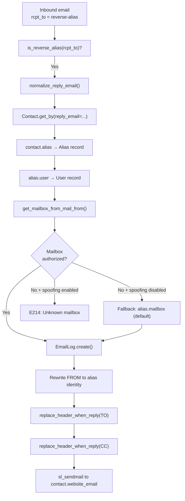

# Technical Specification

# 0. Agent Action Plan

## 0.1 Intent Clarification

### 0.1.1 Core Feature Objective

Based on the prompt, the Blitzy platform understands that the new feature requirement is to **conduct a live runtime analysis of the alias reply-handling pipeline in the SimpleLogin application** and produce a comprehensive written explanation of the data flow and potential routing issues. Specifically:

- **Simulate an inbound email reply** through the development environment to observe actual runtime behavior when a reply is sent from a user's personal mailbox to a reverse-alias address (the reply phase of the email handling pipeline)
- **Trace the end-to-end data flow** by observing each decision point within the `email_handler.py` dispatch logic: how the incoming message is classified as a reply, how the reverse-alias is resolved to a `Contact` record, how the `Contact` maps to an `Alias` and `User`, how the sending mailbox is authorized, and how the final delivery destination (`contact.website_email`) is determined
- **Identify the most likely point of incorrect routing** where a reply might be forwarded to the wrong user, despite logs showing the alias being correctly recognized — this means the error likely occurs after alias recognition but before or during final destination resolution
- **Produce a new markdown document** named `<source_branch_name>.md` (which is `app_2cd6ee777f8c.md`) placed in `blitzy/documentation/` that comprehensively answers the question with rationale derived from code analysis and live execution
- **Leave the codebase unchanged** — any temporary scripts or logs created during the investigation must be cleaned up

### 0.1.2 Special Instructions and Constraints

- **Critical Rule (SWE-AtlasQnA-Repo):** The user has specified an implementation rule requiring the output to be a new markdown document placed in `blitzy/documentation/` — no existing source files may be modified, and no code should be added beyond the requested document
- **Investigation-first approach:** The user explicitly wants the analysis to be grounded in the actual codebase behavior ("Do not make assumptions, base your answers on the code as the truth")
- **Clean-up mandate:** Any temporary instrumentation created for tracing must be removed; the repository must remain in its original state
- **Build and run:** The user expects the source code to be built and run as needed to analyze runtime behavior
- **No architectural changes:** This is a diagnostic/analytical feature — no modifications to application logic, database schema, or external integrations are required

### 0.1.3 Technical Interpretation

These feature requirements translate to the following technical implementation strategy:

- To **simulate an inbound reply**, we will construct a synthetic email message and envelope (using Python's `email` library and `aiosmtpd.smtp.Envelope`) with the `rcpt_to` set to a known reverse-alias address and `mail_from` set to the user's mailbox email, then feed it to `email_handler.handle()` within a Flask app context
- To **trace the runtime flow**, we will instrument the call chain starting at `MailHandler._handle()` → `handle()` → `is_reverse_alias()` → `handle_reply()`, observing each decision point: reverse-alias domain validation, Contact lookup via `Contact.get_by(reply_email=...)`, Alias resolution via `contact.alias`, User resolution via `alias.user`, mailbox authorization via `get_mailbox_from_mail_from()`, EmailLog creation, header rewriting, and final delivery via `sl_sendmail()`
- To **identify the most likely routing failure point**, we will analyze each junction where the pipeline resolves identity — particularly the Contact→Alias→User chain, the `get_mailbox_from_mail_from()` fallback behavior when `disable_email_spoofing_check` is enabled, the `canonicalize_email()` normalization that may match unintended mailboxes, and the multi-mailbox scenario where `alias.mailboxes` returns mailboxes from different users via `AliasMailbox` join records
- To **produce the output document**, we will create `blitzy/documentation/app_2cd6ee777f8c.md` containing the full analysis with rationale

## 0.2 Repository Scope Discovery

### 0.2.1 Comprehensive File Analysis

The investigation targets the SimpleLogin email-aliasing monolith, a full-stack Python/Flask application. The following files are directly involved in or adjacent to the alias reply-handling pipeline and must be analyzed in depth:

**Core Email Handler — Reply Pipeline (Primary Investigation Target)**

| File | Purpose | Relevance to Reply Routing |
|------|---------|---------------------------|
| `email_handler.py` (root) | Central SMTP inbound processor — 2404 lines. Contains `handle()`, `handle_reply()`, `handle_forward()`, `MailHandler` class, and all dispatch logic | The entry point and complete reply-phase implementation; lines 966–1262 define `handle_reply()`, lines 1945–2234 define the routing `handle()` function |
| `app/email_utils.py` | Email rendering, composition, header manipulation, VERP handling, reverse-alias generation and detection | Contains `is_reverse_alias()` (line 1156), `generate_reply_email()` (line 1103), `normalize_reply_email` reference, VERP utilities |
| `app/email_validation.py` | Reply email normalization and validation | Contains `normalize_reply_email()` (line 25) which sanitizes reverse-alias addresses before Contact lookup |
| `app/contact_utils.py` | Contact creation and update logic | `create_contact()` generates the `reply_email` field on Contact records that is the key lookup value in reply routing |
| `app/utils.py` | General utilities including `sanitize_email()` and `canonicalize_email()` | `canonicalize_email()` (line 78) is used in `get_mailbox_from_mail_from()` and can alter mailbox matching behavior for Gmail/Proton addresses |

**Data Model Layer**

| File | Purpose | Relevance to Reply Routing |
|------|---------|---------------------------|
| `app/models.py` | SQLAlchemy ORM models — `User`, `Alias`, `Contact`, `Mailbox`, `EmailLog`, `SLDomain`, `AliasMailbox`, `VerpType` | The `Contact.reply_email` column (line 1899) is the indexed lookup key for reply routing; `Alias.mailboxes` property (line 1590) determines authorized senders; `Contact.alias_id` and `Contact.user_id` establish the routing chain |
| `app/config.py` | Centralized environment-driven configuration | `EMAIL_DOMAIN`, `ENFORCE_SPF`, `ENABLE_ALL_REVERSE_ALIAS_REPLACEMENT`, and other flags that affect reply-phase behavior |

**Security and Policy Handlers**

| File | Purpose | Relevance to Reply Routing |
|------|---------|---------------------------|
| `app/handler/dmarc.py` | DMARC policy enforcement for reply phase | `apply_dmarc_policy_for_reply_phase()` can reject reply messages before routing |
| `app/handler/spamd_result.py` | Rspamd result parsing for SPF/DMARC checks | Provides `SpamdResult` and `SPFCheckResult` used in reply-phase authorization |
| `app/email/rate_limit.py` | Rate limiting for alias/mailbox activity | `rate_limited()` is called before reply dispatch; currently short-circuited with `return False` |
| `app/email/status.py` | SMTP status code constants | All E-codes returned by reply handling: E200, E201, E214, E402, E501–E506 |
| `app/email/headers.py` | Canonical header name constants | Used throughout reply-phase header stripping and rewriting |

**Error Handling and Logging**

| File | Purpose | Relevance to Reply Routing |
|------|---------|---------------------------|
| `app/errors.py` | Custom exception hierarchy | `NonReverseAliasInReplyPhase`, `VERPReply`, `CannotCreateContactForReverseAlias` |
| `app/log.py` | Shared logging infrastructure | `LOG` logger and `set_message_id()` for per-message correlation |
| `app/mail_sender.py` | SMTP delivery via `sl_sendmail()` | Final delivery point in reply phase — sends to `contact.website_email` |

**Test Infrastructure**

| File | Purpose | Relevance |
|------|---------|-----------|
| `tests/test_email_handler.py` | 413-line test suite covering reply and forward flows | Contains `test_replace_contacts_and_user_in_reply_phase`, `test_send_email_from_non_canonical_address_on_reply`, `test_send_email_from_non_canonical_matches_already_existing_user`, `test_get_mailbox_from_mail_from` |
| `tests/conftest.py` | Pytest fixtures including Flask app, test client, DB rollback | Provides `flask_client` fixture with transactional rollback |
| `tests/test.env` | Test environment configuration | Defines `EMAIL_DOMAIN=sl.local`, DB_URI, and feature flags for test execution |
| `tests/utils.py` | Test helpers: user creation, email generation, EML loading | `create_new_user()`, `random_email()`, `load_eml_file()` |
| `tests/example_emls/replacement_on_reply_phase.eml` | Jinja2-templated EML fixture for reply-phase testing | Used in `test_replace_contacts_and_user_in_reply_phase` to verify reverse-alias replacement |
| `tests/handler/` | Handler-specific test suite (7 test modules) | Tests for DMARC, unsubscribe, PGP, provider complaints, preserved headers |

**Server and Application Bootstrap**

| File | Purpose | Relevance |
|------|---------|-----------|
| `server.py` | Flask app factory and blueprint registration | `create_light_app()` used by `MailHandler._handle()` for app context |
| `init_app.py` | Seed SL domains and PGP keys | `add_sl_domains()` used in test setup |
| `app/db.py` | SQLAlchemy engine and session management | `Session` used for all ORM operations in the reply pipeline |

### 0.2.2 Integration Point Discovery

The reply-phase pipeline touches the following integration points:

- **Database (PostgreSQL):** `Contact.get_by(reply_email=...)` lookup, `Alias` resolution via `contact.alias`, `Mailbox` lookup via `alias.mailboxes`, `EmailLog.create()`, `SLDomain.get_by()` for domain validation
- **SMTP Delivery (Postfix):** `sl_sendmail()` in `app/mail_sender.py` sends the final reply to `contact.website_email` via VERP-addressed envelope
- **DKIM Signing:** `add_dkim_signature()` signs outbound replies for the alias domain
- **DMARC Policy Engine:** `apply_dmarc_policy_for_reply_phase()` checks rspamd headers before authorizing the reply
- **SPF Verification:** `spf_pass()` optionally enforced when `ENFORCE_SPF` is enabled and `mailbox.force_spf` is set
- **PGP Encryption:** Optional encryption when `contact.pgp_finger_print` is set and user is premium

### 0.2.3 New File Requirements

The only new file to create is the analysis document:

- `blitzy/documentation/app_2cd6ee777f8c.md` — Comprehensive markdown document answering the user's question about the alias reply-handling flow, the data flow trace, and the most likely point of incorrect routing

No new source files, test files, or configuration files are required per the user's implementation rules (SWE-AtlasQnA-Repo).

## 0.3 Dependency Inventory

### 0.3.1 Key Packages Relevant to the Reply-Handling Investigation

The following packages from `pyproject.toml` are directly involved in the alias reply-handling pipeline and the investigation runtime:

| Registry | Package | Version | Purpose in Reply Pipeline |
|----------|---------|---------|--------------------------|
| PyPI | python | ^3.10 | Runtime — Dockerfile specifies `python:3.10` base image |
| PyPI | flask | ^1.1.2 | App context via `create_light_app()` used in `MailHandler._handle()` |
| PyPI | aiosmtpd | ^1.2 | SMTP server — `MailHandler.handle_DATA()` entry point for inbound email |
| PyPI | sqlalchemy | 1.3.24 (pinned) | ORM for `Contact`, `Alias`, `Mailbox`, `EmailLog` model queries in reply flow |
| PyPI | psycopg2-binary | ^2.9.3 | PostgreSQL driver for all database operations |
| PyPI | pyre2 | ^0.3.6 | Regex engine used in `app/spamassassin_utils.py` (imported as `re2`) |
| PyPI | dkimpy | ^1.0.5 | DKIM signing of outbound reply messages |
| PyPI | pyspf | ^2.0.14 | SPF verification in reply-phase mailbox authorization |
| PyPI | dnspython | ^2.0.0 | DNS lookups for domain validation and SPF/DKIM |
| PyPI | flanker | ^0.9.11 | Email address parsing in `replace_header_when_forward()` |
| PyPI | email_validator | ^1.1.1 | Email validation for contact and mailbox addresses |
| PyPI | arrow | ^0.16.0 | Timestamp utilities for EmailLog and alias lifecycle |
| PyPI | sentry_sdk | ^2.16.0 | Error tracking and exception reporting |
| PyPI | newrelic | 8.8.0 (pinned) | APM instrumentation — `@newrelic.agent.background_task()` on `_handle()` |
| PyPI | redis | ^4.5.3 | Session store and rate limiting backend |
| PyPI | python-gnupg | ^0.4.6 | PGP encryption for contacts with PGP keys |
| PyPI | PGPy | 0.5.4 (pinned) | PGP key management and signing operations |
| PyPI | aiospamc | 0.10 (pinned) | Async SpamAssassin client for spam scoring |
| PyPI | pytest | ^7.0.0 | Test runner for existing reply-phase test suite |

### 0.3.2 Dependency Updates

No dependency additions, removals, or version changes are required. This is a diagnostic investigation that produces a documentation artifact only. All existing dependencies remain unchanged.

### 0.3.3 Import Analysis for Reply-Phase Code Path

The reply-phase code path in `email_handler.py` imports from the following internal modules (lines 55–178):

- `app.alias_utils` — `try_auto_create`, `change_alias_status`, `get_alias_recipient_name`
- `app.config` — `EMAIL_DOMAIN`, `ENFORCE_SPF`, `ALERT_REVERSE_ALIAS_UNKNOWN_MAILBOX`, and 20+ other config constants
- `app.db` — `Session` for all ORM operations
- `app.email` — `status`, `headers` submodules
- `app.email.rate_limit` — `rate_limited()` 
- `app.email_utils` — `is_reverse_alias()`, `generate_reply_email()`, `sl_formataddr()`, header manipulation utilities
- `app.email_validation` — `normalize_reply_email()`
- `app.errors` — `NonReverseAliasInReplyPhase`, VERP exception classes
- `app.handler.dmarc` — `apply_dmarc_policy_for_reply_phase()`
- `app.handler.spamd_result` — `SpamdResult`, `SPFCheckResult`
- `app.log` — `LOG`, `set_message_id()`
- `app.mail_sender` — `sl_sendmail()`
- `app.models` — `Alias`, `Contact`, `EmailLog`, `Mailbox`, `User`, `SLDomain`, `VerpType`, and others
- `app.utils` — `sanitize_email()`, `canonicalize_email()`

## 0.4 Integration Analysis

### 0.4.1 Existing Code Touchpoints — Reply-Phase Data Flow

The reply-phase pipeline traverses the following code touchpoints in strict order. Each step is a potential point where incorrect routing could originate:

**Step 1: Entry and Dispatch (`email_handler.py`, lines 1945–2234)**

- `handle()` sanitizes `mail_from` and `rcpt_tos` via `sanitize_email()`
- For each `rcpt_to`, calls `is_reverse_alias(rcpt_to)` to classify as reply vs. forward
- If `True`, dispatches to `handle_reply(envelope, msg, rcpt_to)`

**Step 2: Domain Validation (`email_handler.py`, lines 966–980)**

- Validates `reply_email` ends with `EMAIL_DOMAIN` or a registered `SLDomain`
- Calls `normalize_reply_email()` to handle legacy non-ASCII characters

**Step 3: Contact Resolution (`email_handler.py`, lines 982–990)**

- `Contact.get_by(reply_email=reply_email)` — the critical lookup
- If no contact found → returns `E502`
- Retrieves `contact.alias` (via `alias_id` foreign key) and `contact.user` (via `user_id` foreign key)

**Step 4: Alias and User Validation (`email_handler.py`, lines 991–1010)**

- `is_valid_alias_address_domain(alias.email)` — confirms the alias domain is managed
- `user = alias.user` — resolves the owning user
- `user.can_send_or_receive()` — verifies the account is active

**Step 5: DMARC Policy Check (`email_handler.py`, lines 1012–1016)**

- `apply_dmarc_policy_for_reply_phase(alias, contact, envelope, msg)` — can short-circuit the pipeline

**Step 6: Mailbox Authorization (`email_handler.py`, lines 1019–1034)**

- `get_mailbox_from_mail_from(mail_from, alias)` — checks if `envelope.mail_from` matches an authorized mailbox
- Iterates `alias.mailboxes` (from `Alias.mailboxes` property which joins `Mailbox` via `AliasMailbox`)
- Also checks `mailbox.authorized_addresses` for each mailbox
- Falls back to `canonicalize_email(mail_from)` for secondary match (Gmail dot-insensitivity, Proton subaddressing)
- If no match found and `alias.disable_email_spoofing_check` is True → uses `alias.mailbox` (default)
- If no match found and spoofing check enabled → calls `handle_unknown_mailbox()` and returns `E214`

**Step 7: EmailLog Creation (`email_handler.py`, lines 1044–1053)**

- Creates `EmailLog` with `contact_id`, `alias_id=contact.alias_id`, `is_reply=True`, `user_id=contact.user_id`, `mailbox_id=mailbox.id`

**Step 8: Header Rewriting and Delivery (`email_handler.py`, lines 1080–1262)**

- Strips non-essential headers
- Rewrites `FROM` header to alias identity via `get_alias_recipient_name(alias)`
- Calls `replace_header_when_reply(msg, alias, headers.TO)` — converts reverse-alias addresses in TO back to `contact.website_email`
- Calls `replace_header_when_reply(msg, alias, headers.CC)` — same for CC
- Calls `sl_sendmail()` to deliver to `contact.website_email` with VERP envelope

### 0.4.2 Critical Routing Decision Points

The following junctions are where incorrect routing decisions can originate:

| Decision Point | Location | What Could Go Wrong |
|---------------|----------|---------------------|
| `Contact.get_by(reply_email=...)` | `email_handler.py:982` | If `reply_email` collides between two Contacts (shouldn't due to uniqueness, but race conditions during `generate_reply_email()` are possible) |
| `contact.alias` relationship | `models.py:1906` (FK) | If `contact.alias_id` was corrupted or points to a re-assigned alias |
| `contact.user_id` vs `alias.user_id` | `models.py:1883, 1475` | If `contact.user_id` diverges from `alias.user_id` (e.g., after alias transfer) |
| `get_mailbox_from_mail_from()` | `email_handler.py:1364` | `canonicalize_email()` may match a different user's mailbox if address normalization collapses two distinct addresses |
| `alias.mailboxes` property | `models.py:1590` | Multi-mailbox aliases return multiple mailboxes — the `_mailboxes` join via `AliasMailbox` could include stale entries |
| `replace_header_when_reply()` | `email_handler.py:345` | Converts reverse-alias TO/CC entries to `contact.website_email` — if a TO entry resolves to a different contact's `website_email`, the reply goes to the wrong recipient |
| `alias.mailbox` default fallback | `email_handler.py:1028` | When `disable_email_spoofing_check` is True, the system silently uses the default mailbox, potentially masking routing mismatches |

### 0.4.3 Database/Schema Relationships in Reply Routing

No schema changes are required. The existing schema relationships critical to reply routing:

- `contact.reply_email` → indexed column used for reverse-alias lookup (unique in practice, enforced by `generate_reply_email()` collision check)
- `contact.alias_id` → FK to `alias.id` (with `ON DELETE CASCADE`)
- `contact.user_id` → FK to `users.id` (with `ON DELETE CASCADE`)
- `alias.user_id` → FK to `users.id` (with `ON DELETE CASCADE`)
- `alias.mailbox_id` → FK to `mailbox.id` (the default/primary mailbox)
- `alias_mailbox` → junction table linking aliases to additional mailboxes
- `mailbox.authorized_addresses` → additional email addresses allowed to send on behalf of a mailbox

## 0.5 Technical Implementation

### 0.5.1 File-by-File Execution Plan

Since the user's implementation rule (SWE-AtlasQnA-Repo) requires producing a single markdown document without modifying any existing source files, the execution plan focuses on investigation steps that culminate in one deliverable:

**Group 1 — Investigation and Runtime Tracing (Read-Only Analysis)**

- **READ:** `email_handler.py` — Trace the complete `handle()` → `handle_reply()` call chain; document each decision point and the data it uses
- **READ:** `app/models.py` — Verify the `Contact`, `Alias`, `Mailbox`, and `AliasMailbox` relationships that form the routing chain
- **READ:** `app/email_utils.py` — Analyze `is_reverse_alias()`, `generate_reply_email()`, and `normalize_reply_email()` for edge cases
- **READ:** `app/utils.py` — Examine `canonicalize_email()` and `sanitize_email()` for address normalization that could cause mailbox mismatch
- **READ:** `app/contact_utils.py` — Analyze `create_contact()` to understand how `reply_email` is generated and assigned
- **READ:** `app/email_validation.py` — Review `normalize_reply_email()` for potential address corruption
- **RUN:** Execute existing reply-phase tests (`tests/test_email_handler.py -k reply`) to confirm baseline behavior
- **RUN:** Create and execute a temporary diagnostic script that simulates an inbound reply and traces the runtime flow through the pipeline, capturing Contact resolution, Alias resolution, User resolution, mailbox authorization, and final delivery destination — then delete the script

**Group 2 — Analysis Document Creation**

- **CREATE:** `blitzy/documentation/app_2cd6ee777f8c.md` — Comprehensive analysis answering:
  - Which part of the system handles the incoming reply message
  - How the alias is resolved to a user
  - What user ID the system ultimately decides to forward the reply to
  - The actual data flow in detail
  - The most likely point where incorrect routing could originate

### 0.5.2 Implementation Approach

The implementation follows a strict diagnostic methodology:

- **Establish the foundation** by reading and understanding the complete reply-phase code path from `MailHandler.handle_DATA()` through `handle()` through `handle_reply()` to `sl_sendmail()`
- **Verify runtime behavior** by executing a simulated reply within the test framework, using `mail_sender.store_emails_test_decorator` to capture outbound messages without actual SMTP delivery
- **Trace the routing chain** by observing how `Contact.get_by(reply_email=...)` resolves to a specific Contact, how that Contact's `alias_id` maps to an Alias, how the Alias's `user_id` maps to a User, and how `get_mailbox_from_mail_from()` authorizes the sending mailbox
- **Identify the failure mode** by analyzing the junctions where data resolution could produce incorrect results — focusing on the `canonicalize_email()` fallback in mailbox matching, the multi-mailbox scenario, and the `disable_email_spoofing_check` silent fallback
- **Document the findings** with code references, data flow diagrams, and rationale in the output markdown file
- **Clean up** by removing any temporary diagnostic scripts, leaving only the documentation artifact

### 0.5.3 Key Code Paths to Exercise

The simulation must exercise these specific code paths:

- **Happy path:** `mail_from` = authorized mailbox email, `rcpt_to` = valid reverse-alias → expect delivery to `contact.website_email`
- **Canonical mismatch path:** `mail_from` = non-canonical variant of mailbox email (e.g., `john.doe@gmail.com` vs `johndoe@gmail.com`) → observe `canonicalize_email()` behavior in `get_mailbox_from_mail_from()`
- **Spoofing-disabled fallback path:** `mail_from` = unknown address with `alias.disable_email_spoofing_check = True` → observe silent fallback to `alias.mailbox`
- **Multi-mailbox path:** An alias with multiple mailboxes via `AliasMailbox` → observe which mailbox is selected and how other mailboxes receive notifications via `notify_mailbox()`

## 0.6 Scope Boundaries

### 0.6.1 Exhaustively In Scope

**Source files analyzed for the reply-handling investigation:**
- `email_handler.py` — Complete file (2404 lines), focus on `handle()` and `handle_reply()`
- `app/email_utils.py` — `is_reverse_alias()`, `generate_reply_email()`, `normalize_reply_email()`, `generate_verp_email()`
- `app/email_validation.py` — `normalize_reply_email()`
- `app/contact_utils.py` — `create_contact()` and reply email assignment
- `app/models.py` — `Contact`, `Alias`, `Mailbox`, `AliasMailbox`, `EmailLog`, `User`, `SLDomain`
- `app/utils.py` — `sanitize_email()`, `canonicalize_email()`
- `app/config.py` — Email configuration constants
- `app/handler/dmarc.py` — `apply_dmarc_policy_for_reply_phase()`
- `app/handler/spamd_result.py` — SPF check results
- `app/email/status.py` — SMTP status codes
- `app/email/headers.py` — Header name constants
- `app/email/rate_limit.py` — Rate limiting in reply phase
- `app/errors.py` — Reply-phase exceptions
- `app/mail_sender.py` — `sl_sendmail()` delivery
- `app/log.py` — Logging infrastructure
- `app/db.py` — Session management
- `server.py` — `create_light_app()` used in `MailHandler._handle()`

**Test files analyzed:**
- `tests/test_email_handler.py` — All reply-related test cases
- `tests/conftest.py` — Test fixture infrastructure
- `tests/test.env` — Test environment configuration
- `tests/utils.py` — Test helpers
- `tests/example_emls/replacement_on_reply_phase.eml` — Reply-phase EML fixture
- `tests/handler/**` — Handler-specific test modules

**Configuration files analyzed:**
- `pyproject.toml` — Dependency versions and project metadata
- `example.env` — Runtime environment variable documentation
- `tests/test.env` — Test environment variable settings
- `alembic.ini` — Database migration configuration

**Output artifact:**
- `blitzy/documentation/app_2cd6ee777f8c.md` — The sole deliverable file

### 0.6.2 Explicitly Out of Scope

- **Forward-phase pipeline** (`handle_forward()`, `forward_email_to_mailbox()`) — Only analyzed to the extent it creates Contacts that are later used in the reply phase
- **Bounce handling** (`handle_bounce_forward_phase()`, `handle_bounce_reply_phase()`) — Not relevant to reply routing correctness
- **Unsubscribe handling** (`app/handler/unsubscribe_*.py`) — Separate pipeline
- **Provider complaint handling** (`app/handler/provider_complaint.py`) — Separate pipeline
- **OAuth/OIDC flows** (`app/oauth/`, `app/auth/`) — Not related to email routing
- **Dashboard routes** (`app/dashboard/`) — Web UI not involved in SMTP processing
- **API endpoints** (`app/api/`) — REST API not involved in SMTP processing
- **Cron jobs** (`cron.py`, `crontab.yml`) — Background maintenance not related to reply routing
- **Event system** (`events/`, `event_listener.py`) — Event sourcing not involved in reply routing
- **Payment integrations** (`app/paddle_*.py`, `app/payments/`) — Billing not related
- **Any source code modifications** — Per the SWE-AtlasQnA-Repo rule, no existing files may be modified
- **Performance optimization** — Not the goal of this investigation
- **Refactoring** — Not applicable

## 0.7 Rules for Feature Addition

### 0.7.1 User-Specified Rules

The user has specified the following implementation rule that must be strictly observed:

**SWE-AtlasQnA-Repo Rule:**
- Create a new markdown document named `app_2cd6ee777f8c.md` (derived from the source branch name `app_2cd6ee777f8c`) that comprehensively answers the question(s) posed in the prompt
- Build and run the source code to analyze the repository behavior as needed
- Do not make assumptions — base answers on the code as the truth
- Do not modify any existing files in the source repository
- Do not add any other code in the source repository besides the requested document
- Place the generated document in the `blitzy/documentation` directory in the destination repo

### 0.7.2 Investigation-Specific Constraints

- **Temporary scripts allowed, must be cleaned up:** The user explicitly permits creating temporary scripts or logs for tracing, but mandates they be removed before completion ("clean them up and leave the codebase as you found it")
- **Evidence-based analysis:** All conclusions about the reply-handling flow must cite specific file paths, line numbers, and function names from the codebase
- **Runtime verification required:** The user expects the code to be built and executed, not just statically analyzed
- **No modification to existing files:** The investigation must be non-invasive — no patches, no monkey-patching of production code, no database schema changes

### 0.7.3 Documentation Standards

The output markdown document must:
- Explain the actual data flow of an inbound email reply end-to-end
- Identify which part of the system handles the incoming message
- Describe how the alias is resolved to a user
- State what user ID the system ultimately decides to forward the reply to
- Identify the most likely point where incorrect routing could originate
- Provide thinking/rationale behind all answers
- Reference specific code locations as evidence

## 0.8 References

### 0.8.1 Repository Files and Folders Searched

The following files and folders were systematically searched and analyzed to derive the conclusions in this Agent Action Plan:

**Root-level files inspected:**
- `email_handler.py` — Full file read (2404 lines), primary investigation target
- `pyproject.toml` — Dependency versions and Python version constraints
- `example.env` — Environment variable documentation
- `Dockerfile` — Build and runtime configuration (Python 3.10 base)
- `server.py` — Flask app factory and `create_light_app()`
- `init_app.py` — Database seeding for SL domains
- `alembic.ini` — Migration configuration

**Application modules inspected (`app/` directory):**
- `app/__init__.py` — Package marker
- `app/config.py` — Configuration constants
- `app/models.py` — ORM models (Contact, Alias, Mailbox, EmailLog, User, SLDomain, AliasMailbox, VerpType)
- `app/email_utils.py` — `is_reverse_alias()`, `generate_reply_email()`, `generate_verp_email()`, `get_verp_info_from_email()`, `is_valid_alias_address_domain()`
- `app/email_validation.py` — `normalize_reply_email()`
- `app/contact_utils.py` — `create_contact()`
- `app/utils.py` — `sanitize_email()`, `canonicalize_email()`
- `app/errors.py` — Exception hierarchy
- `app/mail_sender.py` — `sl_sendmail()` delivery
- `app/log.py` — Logging infrastructure
- `app/db.py` — Database session
- `app/spamassassin_utils.py` — Spam scanning (uses `re2`)
- `app/regex_utils.py` — Regex matching utility

**Handler modules inspected (`app/handler/` directory):**
- `app/handler/__init__.py` — Package marker
- `app/handler/dmarc.py` — DMARC enforcement
- `app/handler/spamd_result.py` — Rspamd result parsing
- `app/handler/provider_complaint.py` — Complaint handling
- `app/handler/unsubscribe_encoder.py` — Unsubscribe token encoding
- `app/handler/unsubscribe_generator.py` — List-Unsubscribe headers
- `app/handler/unsubscribe_handler.py` — Unsubscribe request processing

**Email modules inspected (`app/email/` directory):**
- `app/email/__init__.py` — Package marker
- `app/email/rate_limit.py` — Rate limiting
- `app/email/spam.py` — Spam scoring
- `app/email/headers.py` — Header constants
- `app/email/status.py` — SMTP status codes

**Test files inspected (`tests/` directory):**
- `tests/__init__.py` — Package marker
- `tests/conftest.py` — Pytest fixtures
- `tests/test.env` — Test environment configuration
- `tests/utils.py` — Test helper utilities
- `tests/test_email_handler.py` — Email handler test suite (413 lines)
- `tests/handler/__init__.py` — Handler test package
- `tests/handler/test_preserved_headers.py` — Header preservation tests
- `tests/handler/test_spamd_result.py` — Rspamd parsing tests
- `tests/handler/test_encrypt_pgp.py` — PGP encryption tests
- `tests/handler/test_provider_complaints.py` — Complaint handling tests
- `tests/handler/test_unsubscribe_encoder.py` — Unsubscribe encoding tests
- `tests/handler/test_unsubscribe_generator.py` — Unsubscribe generation tests
- `tests/handler/test_unsubscribe_handler.py` — Unsubscribe handling tests
- `tests/example_emls/replacement_on_reply_phase.eml` — Reply-phase test fixture

**Folders explored via `get_source_folder_contents`:**
- Root folder (`""`)
- `app/`
- `app/handler/`
- `app/email/`
- `tests/`
- `tests/handler/`

**Tech spec sections consulted:**
- Section 4.2: Core Email Processing Workflows — Detailed flow diagrams for inbound routing, forward phase, reply phase, and bounce handling
- Section 6.1: Core Services Architecture — Five-process entry point design, SMTP handler component, inter-service communication patterns

### 0.8.2 Attachments

No external attachments were provided with this project. No Figma screens or external design assets are applicable to this investigation.

### 0.8.3 Environment Setup Summary

- **Runtime:** Python 3.10.20 (installed from deadsnakes PPA, matching Dockerfile specification of `python:3.10`)
- **Virtual environment:** `/tmp/slvenv` created with `python3.10 -m venv`
- **Dependencies:** Installed via `poetry export` → `pip install -r requirements.txt` with the following adjustments:
  - `pyre2 ^0.3.6` replaced with `pyre2 0.3.10` (pre-built wheel available) with `re2` module patched to expose `DOTALL` and `split` compatibility flags
  - `cbor2 5.2.0` replaced with `cbor2 5.4.6` (build compatibility fix for Python 3.10)
- **PostgreSQL:** Version 16 running on port 15432, matching `tests/test.env` `DB_URI`
- **Redis:** Running on default port 6379, matching `tests/test.env` `MEM_STORE_URI`
- **Database migrations:** Applied via `alembic upgrade head`
- **Test verification:** Reply-related tests (`tests/test_email_handler.py -k reply`) pass successfully (6 passed)

