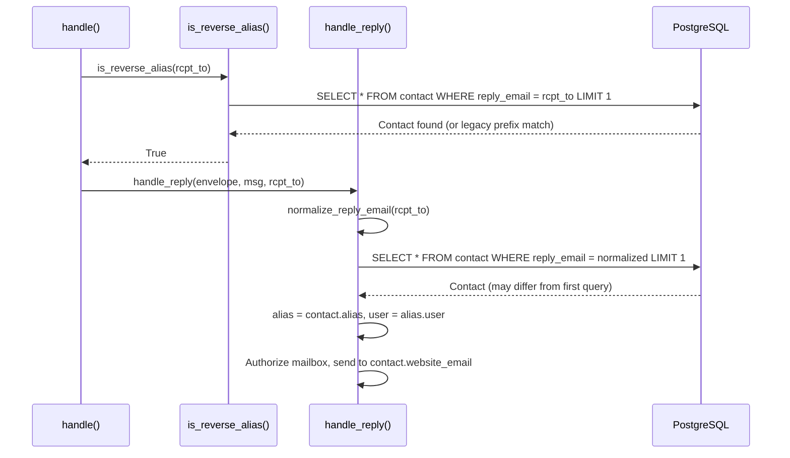

# Technical Specification

# 0. Agent Action Plan

## 0.1 Intent Clarification

### 0.1.1 Core Feature Objective

Based on the prompt, the Blitzy platform understands that the new feature requirement is to produce a comprehensive, code-grounded analysis document that investigates the runtime behavior of SimpleLogin's inbound reply-email resolution logic — specifically the mechanism by which a reply email address (reverse alias) is used to identify a `Contact` record and route the reply to the correct alias owner. The document must be placed at `blitzy/documentation/app_2cd6ee777f8c.md`.

The specific investigation objectives are:

- **Reply-email derivation**: Trace how the system derives a reply email address (reverse alias) during the forward phase and how that address is later used to resolve the associated `Contact` during the reply phase.
- **Contact resolution logic**: Observe and document the exact code path that looks up a `Contact` by its `reply_email` field, identifying the runtime values involved — the extracted reply email string, the resolved contact (or lack thereof), and the alias/user ultimately selected as the forwarding destination.
- **Cross-event behavioral consistency**: Determine whether the same reply email ever resolves to different contacts over time, fails to resolve temporarily, or resolves correctly but later results in forwarding to a different user than expected.
- **Race condition and uniqueness analysis**: Evaluate whether the reply-handling logic — specifically the lookup of contacts by `reply_email` — exhibits any race conditions, uniqueness assumption violations, or timing-related inconsistencies that could explain why a reply is routed to the wrong user.
- **Runtime value documentation**: Describe the runtime values observed during reply resolution and explain how those values lead to the observed behavior.

Implicit requirements detected:

- The investigation must be **code-analysis-driven**: conclusions must reference specific files, functions, line numbers, and data model definitions.
- The repository must remain **completely unmodified** — no source file changes are permitted. Only the output markdown document and temporary diagnostic scripts (which must be cleaned up) are allowed.
- The analysis must cover both the **forward phase** (where `reply_email` values are generated and stored) and the **reply phase** (where those values are used for contact lookup and routing).
- The analysis must consider **concurrent processing scenarios** since the SMTP handler (`aiosmtpd`) can process multiple inbound emails simultaneously.

### 0.1.2 Special Instructions and Constraints

- **CRITICAL: No repository modifications.** The implementation rule `SWE-AtlasQnA-Repo` explicitly states: "Do not modify any existing files in the source repository." and "Do not add any other code in the source repository (besides the above requested document)."
- **Output format**: Create a markdown document named `app_2cd6ee777f8c.md` (matching the source branch name) in the `blitzy/documentation` directory.
- **Temporary tooling**: If temporary scripts or diagnostic tooling are needed to observe runtime behavior, they must be cleaned up afterward — the repository must be left unchanged.
- **Evidence-based conclusions**: All findings must be grounded in actual code paths, data model definitions, and database schema constraints observed in the repository.

### 0.1.3 Technical Interpretation

These feature requirements translate to the following technical implementation strategy:

- To **trace reply-email derivation**, we will analyze `generate_reply_email()` in `app/email_utils.py` (lines 1103–1153), `create_contact()` in `app/contact_utils.py` (lines 42–120), and `get_or_create_contact()` in `email_handler.py` (lines 180–211).
- To **document contact resolution**, we will analyze `handle_reply()` in `email_handler.py` (lines 966–1261), focusing on the `Contact.get_by(reply_email=reply_email)` call at line 986 and the `normalize_reply_email()` normalization at line 984.
- To **evaluate uniqueness and race conditions**, we will examine the `Contact` model in `app/models.py` (lines 1863–2057), noting that `reply_email` has only a non-unique index (`index=True` at line 1899, confirmed by migration `2021_071310_78403c7b8089` with `unique=False`), and that `Contact.get_by()` uses `.first()` (line 84 of `ModelMixin`).
- To **assess concurrent processing risks**, we will analyze the session management in `app/db.py` (scoped sessions with no explicit isolation level override), the `available_sl_email()` check-then-insert pattern in `app/models.py` (lines 1425–1432), and the `IntegrityError` handling in `app/contact_utils.py` (lines 113–119).
- To **create the output document**, we will create `blitzy/documentation/app_2cd6ee777f8c.md` with comprehensive findings, code references, and runtime behavior analysis.

## 0.2 Repository Scope Discovery

### 0.2.1 Comprehensive File Analysis

The following files and modules were identified as directly relevant to the reply-email resolution investigation. All paths are relative to the repository root.

#### Core Reply-Phase Processing

| File | Lines of Interest | Purpose | Relevance |
|------|-------------------|---------|-----------|
| `email_handler.py` | 966–1261 | `handle_reply()` — main reply-phase entry point | **Primary**: contains the contact-by-reply-email lookup, mailbox authorization, header rewriting, and delivery logic |
| `email_handler.py` | 1945–2234 | `handle()` — central routing hub | **Primary**: decides forward vs. reply routing via `is_reverse_alias()` |
| `email_handler.py` | 2194–2200 | Reply dispatch inside `handle()` | **Primary**: the `is_reverse_alias(rcpt_to)` check that triggers reply-phase processing |
| `email_handler.py` | 345–384 | `replace_header_when_reply()` | **Primary**: resolves reverse-alias addresses in To/CC headers during reply phase via `Contact.get_by(reply_email=...)` |

#### Forward-Phase Contact & Reply-Email Generation

| File | Lines of Interest | Purpose | Relevance |
|------|-------------------|---------|-----------|
| `email_handler.py` | 180–211 | `get_or_create_contact()` | **Primary**: creates contacts during forward phase, delegating to `contact_utils.create_contact()` |
| `email_handler.py` | 536–928 | `handle_forward()` and `forward_email_to_mailbox()` | **Primary**: forward-phase flow where contacts are created and reverse aliases generated |
| `email_handler.py` | 239–318 | `replace_header_when_forward()` | **Secondary**: creates contacts for CC/To header addresses during forward phase |
| `app/contact_utils.py` | 42–120 | `create_contact()` | **Primary**: orchestrates contact creation including `generate_reply_email()` call and `IntegrityError` handling |
| `app/email_utils.py` | 1103–1153 | `generate_reply_email()` | **Primary**: generates random reverse-alias strings and checks uniqueness via `available_sl_email()` |
| `app/email_utils.py` | 1156–1163 | `is_reverse_alias()` | **Primary**: determines if an address is a reverse alias by querying `Contact.get_by(reply_email=address)` |

#### Data Models and Schema

| File | Lines of Interest | Purpose | Relevance |
|------|-------------------|---------|-----------|
| `app/models.py` | 1863–2057 | `Contact` model class | **Primary**: defines `reply_email` column as `sa.Column(sa.String(512), nullable=False, index=True)` with NO unique constraint |
| `app/models.py` | 62–84 | `ModelMixin.get_by()` | **Primary**: implements `Session.query(cls).filter_by(**kw).first()` — returns indeterminate first match |
| `app/models.py` | 1425–1432 | `available_sl_email()` | **Primary**: application-level uniqueness check using `Contact.get_by(reply_email=email)` |
| `app/models.py` | 1469–1601 | `Alias` model and `mailboxes` property | **Secondary**: alias-to-user-to-mailbox resolution chain |
| `app/models.py` | 2710–2770 | `Mailbox` model | **Secondary**: mailbox authorization structure |
| `app/models.py` | 3116–3151 | `SLDomain` model | **Secondary**: `use_as_reverse_alias` flag affects reply-email domain |

#### Normalization and Validation

| File | Lines of Interest | Purpose | Relevance |
|------|-------------------|---------|-----------|
| `app/email_validation.py` | 25–38 | `normalize_reply_email()` | **Primary**: normalizes non-ASCII and special characters in reply email before lookup |
| `app/utils.py` | 41–47 | `random_string()` | **Secondary**: generates the random portion of reverse-alias addresses |
| `app/utils.py` | 50–56 | `convert_to_id()` | **Secondary**: used in reply-email normalization for non-ASCII handling |

#### Database and Session Management

| File | Lines of Interest | Purpose | Relevance |
|------|-------------------|---------|-----------|
| `app/db.py` | 1–18 | Database engine and scoped session creation | **Primary**: scoped session with default PostgreSQL READ COMMITTED isolation — critical for race condition analysis |
| `migrations/versions/2021_071310_78403c7b8089_.py` | 22 | Index creation on `contact.reply_email` | **Primary**: confirms `unique=False` on the `reply_email` index |
| `migrations/versions/5fa68bafae72_.py` | 28 | Original `reply_email` column definition | **Secondary**: historical schema context |

#### Mailbox Authorization in Reply Phase

| File | Lines of Interest | Purpose | Relevance |
|------|-------------------|---------|-----------|
| `email_handler.py` | 1364–1387 | `get_mailbox_from_mail_from()` | **Secondary**: determines which mailbox is sending the reply |
| `email_handler.py` | 1390–1430 | `handle_unknown_mailbox()` | **Secondary**: handles replies from unrecognized senders |

#### Tests Covering Reply Behavior

| File | Lines of Interest | Purpose | Relevance |
|------|-------------------|---------|-----------|
| `tests/test_email_handler.py` | 165–335 | Reply-phase tests including DMARC, contact replacement, and canonical address handling | **Secondary**: validates expected reply-phase behavior |
| `tests/test_contact_utils.py` | 1–197 | Contact creation tests including IntegrityError and idempotency | **Secondary**: validates contact creation edge cases |

### 0.2.2 New File Requirements

The only new file to be created is the analysis document:

- `blitzy/documentation/app_2cd6ee777f8c.md` — Comprehensive markdown document answering all posed questions about reply-email resolution, contact lookup behavior, race conditions, and routing correctness.

No new source files, test files, or configuration files are required. The repository must remain unmodified per explicit user instructions.

### 0.2.3 Integration Point Discovery

The investigation touches the following integration points in the system:

- **SMTP inbound pipeline**: `MailHandler.handle_DATA()` → `handle()` → `is_reverse_alias()` → `handle_reply()`
- **Contact resolution chain**: `Contact.get_by(reply_email=X)` → `Contact.alias` → `Alias.user` → `Alias.mailboxes`
- **Forward-phase contact creation**: `get_or_create_contact()` → `contact_utils.create_contact()` → `generate_reply_email()` → `available_sl_email()`
- **Database session lifecycle**: `app/db.py` scoped sessions → PostgreSQL READ COMMITTED isolation
- **Concurrent processing model**: `aiosmtpd.Controller` handling multiple SMTP connections concurrently, each creating its own Flask app context via `create_light_app()`

## 0.3 Dependency Inventory

### 0.3.1 Key Packages Relevant to This Investigation

The following packages from `pyproject.toml` are directly relevant to the reply-email resolution analysis:

| Registry | Package | Version | Purpose |
|----------|---------|---------|---------|
| PyPI | `SQLAlchemy` | `1.3.24` (pinned) | ORM layer — `Contact.get_by()` uses `filter_by().first()` for reply_email lookup |
| PyPI | `psycopg2-binary` | `^2.9.3` | PostgreSQL driver — determines connection isolation behavior |
| PyPI | `flask` | `^1.1.2` | Web framework — app context used in SMTP handler |
| PyPI | `Flask-Migrate` | `^2.5.3` | Alembic wrapper — manages schema migrations including reply_email index |
| PyPI | `aiosmtpd` | `^1.2` | Async SMTP server — processes inbound email; handles concurrent connections |
| PyPI | `email_validator` | `^1.1.1` | Email validation — used in normalize and validate flows |
| PyPI | `flanker` | `^0.9.11` | Email address parsing — used in header rewriting during forward/reply |
| PyPI | `arrow` | `^0.16.0` | Datetime handling — timestamps on model records |
| PyPI | `sqlalchemy_utils` | `^0.36.8` | SQLAlchemy extensions — ArrowType for model columns |
| PyPI | `python-gnupg` | `^0.4.6` | PGP encryption — optional encryption in reply phase |
| PyPI | `PGPy` | `0.5.4` (pinned) | PGP fallback — used when python-gnupg fails |
| PyPI | `dkimpy` | `^1.0.5` | DKIM signing — message integrity in reply phase |
| PyPI | `newrelic` | `8.8.0` (pinned) | APM monitoring — records custom metrics for email handling |
| PyPI | `pytest` | `^7.0.0` (dev) | Test framework — existing tests validate reply-phase behavior |

### 0.3.2 Dependency Updates

No dependency changes are required for this investigation task. All analysis is performed against the existing codebase and its current dependency versions. The output is a standalone markdown document with no code dependencies.

### 0.3.3 Critical Dependency Notes for Analysis

- **SQLAlchemy 1.3.24**: This is a legacy pinned version. The `scoped_session` in `app/db.py` uses `sessionmaker(bind=connection)` without explicit `isolation_level` configuration, which means PostgreSQL's default `READ COMMITTED` isolation level is in effect. This isolation level allows non-repeatable reads between transactions, which is relevant to the race condition analysis.
- **aiosmtpd ^1.2**: The `Controller` class spawns a dedicated thread for the SMTP server. Each `handle_DATA` call creates a new Flask app context via `create_light_app()`, meaning concurrent SMTP connections each operate with independent database sessions. This is the foundation for the concurrency analysis.

## 0.4 Integration Analysis

### 0.4.1 Existing Code Touchpoints

The investigation centers on the following interconnected code paths that collectively implement the reply-email resolution pipeline:

#### Reply-Phase Entry and Contact Resolution

- **`email_handler.py` (line 2195)**: The routing decision point. `is_reverse_alias(rcpt_to)` is called for each recipient, performing a `Contact.get_by(reply_email=address)` query. If a contact is found, the message enters reply-phase processing.
- **`email_handler.py` (line 984)**: Inside `handle_reply()`, the reply email is normalized via `normalize_reply_email()` to handle non-ASCII and special characters.
- **`email_handler.py` (line 986)**: The critical lookup: `contact = Contact.get_by(reply_email=reply_email)`. This returns the first matching contact record. From this contact, the entire routing chain is derived: `contact.alias` → `alias.user` → `alias.mailboxes`.
- **`email_handler.py` (line 1004)**: `user = alias.user` — the user is determined entirely from the contact found by `reply_email`.
- **`email_handler.py` (line 1019)**: `mailbox = get_mailbox_from_mail_from(mail_from, alias)` — mailbox authorization is checked against the alias's mailboxes.
- **`email_handler.py` (line 1226)**: The reply is delivered to `contact.website_email` via `sl_sendmail()`.

#### Forward-Phase Reply-Email Generation

- **`app/contact_utils.py` (line 89)**: `reply_email = generate_reply_email(email, alias)` — generates the reverse alias string that will later be used to resolve this contact.
- **`app/email_utils.py` (line 1136)**: The generation loop runs up to 1000 iterations. For each attempt, it generates a random string and checks `available_sl_email(reply_email)`.
- **`app/models.py` (line 1428)**: `available_sl_email()` checks `Contact.get_by(reply_email=email)` — a SELECT query with no locking. If no contact exists with this reply_email, the value is considered available.
- **`app/contact_utils.py` (line 92–103)**: The contact is then created with `Contact.create(commit=True)`. Between the `available_sl_email()` check and this INSERT, no database lock prevents another process from inserting a contact with the same `reply_email`.

#### Double-Lookup TOCTOU Pattern

The `is_reverse_alias()` → `handle_reply()` flow performs the contact lookup **twice**:

### 0.4.2 Database Schema Dependencies

- **`contact` table**: The `reply_email` column has a B-tree index (`ix_contact_reply_email`) with `unique=False`. The only unique constraint on the table is `uq_contact` on `(alias_id, website_email)`. This means the database permits multiple rows with identical `reply_email` values.
- **`alias` table**: `email` column is `UNIQUE`. Each alias belongs to exactly one user via `user_id` FK.
- **`mailbox` table**: `UNIQUE(user_id, email)`. Each alias has one default mailbox and potentially additional mailboxes via `alias_mailbox` junction table.
- **Session isolation**: `app/db.py` uses `scoped_session(sessionmaker(bind=connection))` with no explicit isolation level — defaults to PostgreSQL `READ COMMITTED`.

### 0.4.3 Concurrency Model

The email handler runs as an `aiosmtpd.Controller` which spawns an SMTP server in a dedicated thread. Each incoming SMTP `DATA` command triggers `MailHandler.handle_DATA()` (line 2289), which:

- Creates a new Flask app context via `create_light_app()` (line 2352)
- This creates a new SQLAlchemy scoped session
- Processes the email synchronously within that context
- Multiple concurrent SMTP connections are handled by the aiosmtpd event loop, but each `handle_DATA` call runs within `create_light_app().app_context()`

This means concurrent emails are processed with independent database sessions, and any check-then-act patterns (like `available_sl_email()` → `Contact.create()`) are vulnerable to race conditions between concurrent sessions.

## 0.5 Technical Implementation

### 0.5.1 File-by-File Execution Plan

Since the user's directive prohibits modifying any existing repository files, the execution plan consists solely of analysis activities and the creation of a single output document.

- **CREATE**: `blitzy/documentation/app_2cd6ee777f8c.md` — The comprehensive analysis document answering all questions about reply-email resolution, contact lookup behavior, race conditions, and routing correctness. This document will contain:
  - A detailed trace of the reply-email resolution code path
  - Analysis of the `Contact.reply_email` column's lack of a UNIQUE constraint
  - Examination of the `generate_reply_email()` → `available_sl_email()` → `Contact.create()` check-then-insert pattern
  - Assessment of the `is_reverse_alias()` → `handle_reply()` double-lookup TOCTOU pattern
  - Evaluation of the `.first()` indeterminacy when multiple contacts share a `reply_email`
  - Concurrency analysis considering the aiosmtpd threading model and SQLAlchemy session scoping
  - Practical likelihood assessment of each identified risk

### 0.5.2 Implementation Approach

The analysis document will be structured as follows:

#### Section 1: Reply-Email Resolution Flow

Document the complete code path from inbound email receipt to contact resolution:

- `MailHandler.handle_DATA()` → `handle()` → routing decision → `handle_reply()`
- The `reply_email` normalization via `normalize_reply_email()` (character substitution for non-ASCII and disallowed chars)
- The `Contact.get_by(reply_email=reply_email)` lookup using `ModelMixin.get_by()` which invokes `.first()`
- The derivation chain: `contact` → `contact.alias` → `alias.user` → `alias.mailboxes`

#### Section 2: Reply-Email Generation (Forward Phase)

Document how reply emails are created during the forward phase:

- `generate_reply_email(contact_email, alias)` generates a random string with either the sender's email prefix (if `include_sender_in_reverse_alias`) or a pure random string (20–50 chars)
- `available_sl_email()` performs an application-level uniqueness check
- The reply domain is `EMAIL_DOMAIN` unless the alias's SL domain has `use_as_reverse_alias=True`

#### Section 3: Uniqueness and Race Condition Analysis

Document the architectural vulnerabilities:

- **Missing UNIQUE constraint**: `Contact.reply_email` is `index=True` but not `unique=True`. The migration `2021_071310_78403c7b8089` explicitly created the index with `unique=False`. This means the database does not enforce reply_email uniqueness.
- **Check-then-insert race**: `generate_reply_email()` calls `available_sl_email()` (a SELECT), then the caller performs a `Contact.create()` (an INSERT). No lock is held between these operations. Two concurrent sessions could observe the same `reply_email` as available and both insert contacts with that value.
- **`.first()` indeterminacy**: `Contact.get_by(reply_email=X)` returns `Session.query(Contact).filter_by(reply_email=X).first()`. If multiple contacts share the same `reply_email`, `.first()` returns whichever row the database optimizer returns first (typically by primary key order, but not guaranteed). This could cause a reply to be routed to the wrong alias/user.
- **TOCTOU in routing**: `is_reverse_alias()` performs a `Contact.get_by(reply_email=address)` check, then `handle_reply()` performs the same query again. Between these two queries, the contact could be deleted (e.g., if the alias owner deletes the alias), resulting in an E502 error.
- **IntegrityError handling scope**: The `IntegrityError` catch in `contact_utils.create_contact()` (line 113) handles the `uq_contact(alias_id, website_email)` constraint violation, NOT a `reply_email` uniqueness violation (since no such constraint exists).

#### Section 4: Practical Risk Assessment

Provide evidence-based likelihood analysis:

- The random string space for reply emails is enormous: 20–50 character lowercase strings yield approximately 26^20 to 26^50 possible values, making accidental collisions astronomically unlikely.
- The race window is narrow: the time between `available_sl_email()` and `Contact.create(commit=True)` is microseconds under normal operation.
- However, the architectural pattern represents a **defense-in-depth gap**: the system relies solely on application-level randomness rather than database-level uniqueness enforcement.

### 0.5.3 Key Code Findings to Document

The analysis document must highlight these specific runtime observations:

- **`email_handler.py:986`** — `contact = Contact.get_by(reply_email=reply_email)` is the single point of contact resolution. All downstream routing depends entirely on which contact is returned by this query.
- **`app/models.py:84`** — `get_by()` uses `.first()`, which is defined by SQLAlchemy as returning the first result or `None`. When the result set has exactly one row, this is deterministic. When it has multiple rows (which the schema permits), the result is database-order-dependent.
- **`app/models.py:1899`** — `reply_email = sa.Column(sa.String(512), nullable=False, index=True)` — the column definition confirms no uniqueness constraint.
- **`app/email_utils.py:1136`** — The 1000-iteration loop in `generate_reply_email()` generates random candidates and checks `available_sl_email()`. This is the sole mechanism preventing `reply_email` collisions.
- **`app/contact_utils.py:113-119`** — The `IntegrityError` handler catches the `uq_contact` constraint on `(alias_id, website_email)` but does not detect or handle duplicate `reply_email` values.

## 0.6 Scope Boundaries

### 0.6.1 Exhaustively In Scope

The following files, components, and concerns are in scope for this investigation:

**Reply-phase email handling:**
- `email_handler.py` — `handle()`, `handle_reply()`, `is_reverse_alias()`, `replace_header_when_reply()`, `get_mailbox_from_mail_from()`, `handle_unknown_mailbox()`

**Forward-phase contact creation (for understanding reply-email generation):**
- `email_handler.py` — `handle_forward()`, `get_or_create_contact()`, `get_or_create_reply_to_contact()`, `replace_header_when_forward()`
- `app/contact_utils.py` — `create_contact()`
- `app/email_utils.py` — `generate_reply_email()`, `is_reverse_alias()`

**Data models and schema:**
- `app/models.py` — `Contact`, `Alias`, `User`, `Mailbox`, `SLDomain`, `ModelMixin.get_by()`, `available_sl_email()`
- `app/email_validation.py` — `normalize_reply_email()`
- `app/utils.py` — `random_string()`, `convert_to_id()`, `convert_to_alphanumeric()`

**Database and session infrastructure:**
- `app/db.py` — session management and isolation level
- `migrations/versions/2021_071310_78403c7b8089_.py` — `reply_email` index creation (unique=False)
- `migrations/versions/5fa68bafae72_.py` — original `forward_email` table creation with `reply_email` column

**Tests providing behavioral evidence:**
- `tests/test_email_handler.py` — reply-phase test cases
- `tests/test_contact_utils.py` — contact creation edge cases

**Configuration:**
- `app/config.py` — `EMAIL_DOMAIN`, `ENFORCE_SPF`, concurrency-related settings
- `example.env` — environment variable documentation

**Output deliverable:**
- `blitzy/documentation/app_2cd6ee777f8c.md` — the analysis document to be created

### 0.6.2 Explicitly Out of Scope

- **Modifying any existing repository files** — explicitly prohibited by user instructions
- **Forward-phase delivery mechanics** — PGP encryption, DKIM signing, spam filtering are not relevant to the reply-email resolution investigation
- **Bounce and complaint handling** — `handle_bounce_forward_phase()`, `handle_bounce_reply_phase()`, provider complaints
- **Unsubscribe flow** — `unsubscribe_handler.py`, `unsubscribe_encoder.py`, `unsubscribe_generator.py`
- **DMARC policy enforcement** — `app/handler/dmarc.py` (tangential to the core resolution question)
- **OAuth, authentication, dashboard** — `app/oauth/`, `app/auth/`, `app/dashboard/`
- **Payment and subscription logic** — `app/paddle_utils.py`, `app/paddle_callback.py`
- **Frontend templates and static assets** — `templates/`, `static/`
- **CI/CD and deployment** — `.github/`, `Dockerfile`, `crontab.yml`
- **Performance optimization** — beyond the scope of this behavioral investigation
- **Refactoring recommendations** — the document should describe findings, not prescribe fixes (unless naturally following from the analysis)

## 0.7 Rules for Feature Addition

### 0.7.1 User-Specified Rules

The following rules were explicitly provided by the user and must be strictly followed:

- **SWE-AtlasQnA-Repo Rule**: Create a new markdown document named `app_2cd6ee777f8c.md` (matching the source branch name) that comprehensively answers the questions posed in the prompt.
- **Build and run the source code** to analyze repository behavior as needed — the analysis should be grounded in actual code behavior, not assumptions.
- **Do not make assumptions** — base all answers on the code as the source of truth.
- **Provide thinking/rationale** behind the answers — each conclusion must be supported by specific code references.
- **Do not modify any existing files** in the source repository.
- **Do not add any other code** in the source repository besides the requested document.
- **Place the generated document** in the `blitzy/documentation` directory in the destination repo.

### 0.7.2 Investigation-Specific Constraints

- All findings must reference specific file paths, function names, and line numbers from the codebase.
- The analysis must distinguish between **theoretical vulnerabilities** (architecturally possible) and **practical risks** (likely to occur under real-world conditions).
- The document must address all five investigation dimensions: reply-email derivation, contact resolution, cross-event consistency, race conditions, and runtime value documentation.
- Temporary diagnostic scripts, if needed, must be cleaned up — the repository must be left in its original state after document creation.

## 0.8 References

### 0.8.1 Files and Folders Searched

The following files and folders were systematically retrieved and analyzed during the context-gathering phase:

**Root-level files examined:**
- `email_handler.py` (2404 lines) — complete SMTP inbound processing pipeline
- `pyproject.toml` — dependency manifest with exact version pins
- `example.env` — environment variable documentation
- `pytest.ci.ini` — test configuration

**`app/` package — core modules examined:**
- `app/models.py` — entity definitions including `Contact`, `Alias`, `User`, `Mailbox`, `SLDomain`, `ModelMixin`
- `app/contact_utils.py` — contact creation logic with `IntegrityError` handling
- `app/email_utils.py` — `generate_reply_email()`, `is_reverse_alias()`, email composition utilities
- `app/email_validation.py` — `normalize_reply_email()` implementation
- `app/utils.py` — `random_string()`, `convert_to_id()`, `convert_to_alphanumeric()`
- `app/db.py` — database engine, scoped session, connection management
- `app/config.py` — configuration loading and environment variable parsing
- `app/mail_sender.py` — SMTP delivery infrastructure

**`app/handler/` package examined:**
- `app/handler/__init__.py` — package marker
- `app/handler/dmarc.py` — DMARC policy engine (folder summary reviewed)
- `app/handler/provider_complaint.py` — provider complaint handling (folder summary reviewed)
- `app/handler/spamd_result.py` — Rspamd result parsing (folder summary reviewed)
- `app/handler/unsubscribe_encoder.py` — unsubscribe token format (folder summary reviewed)
- `app/handler/unsubscribe_generator.py` — List-Unsubscribe header generation (folder summary reviewed)
- `app/handler/unsubscribe_handler.py` — unsubscribe request processing (folder summary reviewed)

**`migrations/versions/` — schema history examined:**
- `migrations/versions/2021_071310_78403c7b8089_.py` — `ix_contact_reply_email` index creation (`unique=False`)
- `migrations/versions/5fa68bafae72_.py` — original `forward_email` table with `reply_email` column

**`tests/` — test files examined:**
- `tests/test_email_handler.py` — reply-phase tests, DMARC tests, contact replacement tests
- `tests/test_contact_utils.py` — contact creation, IntegrityError handling, idempotency tests

**Folders explored at directory level:**
- Root (`""`) — complete repository structure
- `app/` — all first-order children enumerated
- `app/handler/` — all handler modules enumerated
- `tests/` — relevant test files identified via grep

### 0.8.2 Technical Specification Sections Referenced

The following sections from the existing technical specification document were retrieved for additional context:

- **Section 1.1 — Executive Summary**: Provided project overview, core business problem (email alias privacy), and stakeholder context.
- **Section 4.2 — Core Email Processing Workflows**: Provided detailed flow diagrams for inbound routing (Section 4.2.1), forward phase (Section 4.2.2), reply phase (Section 4.2.3), and bounce handling (Section 4.2.4).
- **Section 6.2 — Database Design**: Provided complete schema documentation including the `Contact` table definition (Section 6.2.1.2), indexing strategy (Section 6.2.1.4), connection management (Section 6.2.4.2), and data lifecycle (Section 6.2.6.2).

### 0.8.3 Attachments

No external attachments (Figma files, design documents, or supplementary materials) were provided for this investigation. All analysis is derived from the repository source code and the existing technical specification document.

### 0.8.4 Environment Information

- **Source branch**: `app_2cd6ee777f8c`
- **Docker image**: `andrewparkscaleai/coding-agent:simple-login__app__2cd6ee777f8c2d3531559588bcfb18627ffb5d2c` from `ghcr.io/scaleapi/swe-atlas:swe_atlas_QnA_simple-login_app_1.0`
- **Python version in project**: `^3.10` (per `pyproject.toml`)
- **Database**: PostgreSQL (per `DB_URI` configuration in `example.env`)
- **ORM**: SQLAlchemy 1.3.24 (pinned in `pyproject.toml`)

