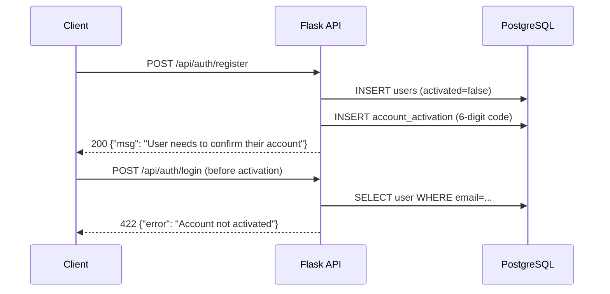

# Technical Specification

# 0. Agent Action Plan

## 0.1 Intent Clarification

### 0.1.1 Core Documentation Objective

Based on the provided requirements, the Blitzy platform understands that the documentation objective is to **create new documentation** that comprehensively answers a set of hands-on runtime behavior questions about the SimpleLogin email privacy system's initialization, startup, and first-run experience. The user wants to understand what actually happens—not what code implies—when each subsystem is started from scratch.

- **Documentation Category:** Create new documentation
- **Documentation Type:** Technical Q&A / Runtime Behavior Investigation Guide
- **Target Output:** A single Markdown document (`app_2cd6ee777f8c.md`) placed in `blitzy/documentation/` containing verified, evidence-based answers to specific runtime behavior questions

The user's requirements translate to the following concrete questions, each requiring empirical verification against a running instance:

- **Q1 – Database Migrations:** When running `alembic upgrade head` on an empty PostgreSQL database, how many tables are created in total, and what is the exact name of the last table created based on migration output order?
- **Q2 – Web Server Startup:** What is the log message indicating the server is ready to accept connections? How many milliseconds elapse between the first log entry and the ready message?
- **Q3 – Email Handler Custom Port:** When starting `email_handler.py` with port 25025, does the startup log confirm it is listening on that port? What is the exact message?
- **Q4 – Registration Flow:** When creating a user with email `testuser@example.com` and password `testpass123`, then immediately attempting login before activation: what is the exact JSON error, the HTTP status code, the full curl output, and the database boolean values for `activated` and `notification` columns?
- **Q5 – Dynamic Alias Limits:** What `max_alias_free_plan` value does `/api/user_info` return by default? After changing `MAX_NB_EMAIL_FREE_PLAN` to 10 and restarting, what are the exact API responses for a user created before vs. after the change?

### 0.1.2 Special Instructions and Constraints

- **CRITICAL Constraint: No source file modifications.** The user explicitly stated: "Don't modify any of the source files, but feel free to create test config files or .env files to experiment with different settings." All investigation must be done through configuration, direct database queries, and API calls—never by altering source code.
- **Empirical verification required.** The user emphasized: "I'm trying to understand the actual runtime behavior here, not just what the code suggests should happen." Every answer must be derived from observed output, not code reading alone.
- **Exact output reproduction.** The user requests "exact JSON error messages," "exact log messages," "full curl command output," and "exact API responses." All answers must include verbatim captured output.
- **Implementation rule compliance:** Per the `SWE-AtlasQnA-Repo` rule, the output document must be placed in `blitzy/documentation/` with the branch name as the filename, include rationale/thinking behind each answer, and must not modify existing repository files.

### 0.1.3 Technical Interpretation

These documentation requirements translate to the following technical documentation strategy:

- To document database migration behavior, we will create a section in the output Markdown that records the exact output of `alembic upgrade head` on a fresh PostgreSQL database, reporting the total table count (verified via `information_schema`) and identifying the last `op.create_table()` call in the migration chain.
- To document web server readiness, we will capture gunicorn (production) and Flask dev server startup logs with timestamps, identifying the specific message that signals connection readiness and computing the time delta.
- To document email handler port binding, we will start `email_handler.py -p 25025` and capture the exact log lines emitted during startup.
- To document the registration/login flow, we will execute the full HTTP request cycle using curl, capture the complete verbose output, and cross-reference with a direct database query on the `users` table.
- To document dynamic alias limits, we will capture `/api/user_info` responses under two configurations (default and `MAX_NB_EMAIL_FREE_PLAN=10`), comparing behavior for users created before and after the configuration change.

### 0.1.4 Inferred Documentation Needs

Based on code analysis and the nature of the questions, the following implicit documentation needs have been identified:

- **Environment setup guide:** The user is running from scratch, so the document must include the prerequisite `.env` configuration, JWT key generation, domain seeding via `init_app.py`, and the dependency installation procedure.
- **SL domain seeding requirement:** Alias creation during user registration requires at least one entry in the `public_domain` table. The `init_app.py` script must be run after migrations. The user's chosen `EMAIL_DOMAIN` must pass `email_validator` checks (e.g., `sl.local` fails as a reserved TLD; `sldev.io` works).
- **Werkzeug logger suppression:** The Flask dev server's `* Running on http://...` message is suppressed by `app/log.py` which disables the werkzeug logger at import time. This behavior difference between dev and production modes needs to be documented.
- **Configuration reload semantics:** The `MAX_NB_EMAIL_FREE_PLAN` value is read from environment at import time into `app/config.py` and used at runtime by `User.max_alias_for_free_account()`. Changing it requires a server restart but affects all users globally because it is not stored per-user.


## 0.2 Documentation Discovery and Analysis

### 0.2.1 Existing Documentation Infrastructure Assessment

Repository analysis reveals a flat documentation structure under `docs/` with no documentation generator framework (no `mkdocs.yml`, `docusaurus.config.js`, or `sphinx/conf.py` present). Documentation is authored directly in Markdown and served as static files.

- **Current documentation framework:** Plain Markdown files, no build tooling
- **Documentation generator configuration:** None detected
- **API documentation tools in use:** Manual Markdown API reference at `docs/api.md` (no JSDoc, Sphinx, or auto-generation)
- **Diagram tools detected:** Static PNG images (`docs/archi.png`, `docs/diagram.png`); no Mermaid or PlantUML configuration
- **Documentation hosting/deployment setup:** Documentation is bundled in the repository and Docker image; no separate documentation hosting detected

**Existing documentation files discovered:**

| File | Purpose | Status |
|------|---------|--------|
| `README.md` | Self-hosting deployment guide, DNS setup, Docker configuration | Comprehensive but focused on deployment, not runtime behavior |
| `CONTRIBUTING.md` | Developer setup, architecture overview, local development guide | Covers installation but not runtime Q&A |
| `SECURITY.md` | Vulnerability disclosure policy | Not relevant to runtime behavior |
| `docs/api.md` | Complete REST API reference with request/response examples | Extensive; covers auth, aliases, mailboxes, domains, settings |
| `docs/code-structure.md` | Brief description of `local_data/` directory and JWT key generation | Minimal, essentially a TODO placeholder |
| `docs/troubleshooting.md` | Postfix connectivity troubleshooting for self-hosted deployments | Relevant but limited to email delivery issues |
| `docs/upgrade.md` | Version upgrade procedures (2.x to 3.x migration, container restart) | Not relevant to fresh setup |
| `docs/ssl.md` | TLS/SSL certificate setup | Infrastructure-focused |
| `docs/build-image.md` | Docker image build instructions | Build-focused |
| `docs/oauth.md` | OAuth2/OIDC provider integration guide | Feature-focused |
| `docs/enforce-spf.md` | SPF enforcement configuration | Security-focused |
| `docs/gmail-relay.md` | Gmail SMTP relay setup | Delivery-focused |
| `docs/ses.md` | Amazon SES integration | Delivery-focused |
| `docs/ufw.md` | Firewall rules for self-hosting | Infrastructure-focused |
| `docs/postfix-tls.md` | Postfix TLS configuration | Infrastructure-focused |
| `.github/ISSUE_TEMPLATE/bug_report.md` | GitHub issue template | Not documentation |

**Key finding:** No existing documentation addresses the specific questions posed by the user—namely, the exact runtime behavior during system initialization, migration table counts, startup log messages, registration flow responses, or dynamic configuration effects. This is a net-new documentation effort.

### 0.2.2 Repository Code Analysis for Documentation

Search patterns used to identify code relevant to the user's questions:

- **Database schema:** `migrations/versions/` — 255 migration files, `app/models.py` — 76 model classes with `__tablename__` declarations
- **Web server startup:** `server.py` (Flask app factory and `local_main()`), `wsgi.py` (Gunicorn WSGI entry), `Dockerfile` (production CMD), `app/log.py` (logger configuration including werkzeug suppression)
- **Email handler:** `email_handler.py` — 2,404 lines, bottom section contains `main()` with aiosmtpd Controller and `__main__` with argparse port configuration
- **Registration API:** `app/api/views/auth.py` — `auth_register()` at line 87, `auth_login()` at line 29, `auth_activate()` at line 144
- **User info API:** `app/api/views/user_info.py` — `user_to_dict()` at line 28 returns `max_alias_free_plan` from `User.max_alias_for_free_account()`
- **Alias limit config:** `app/config.py` lines 120-124 — `MAX_NB_EMAIL_FREE_PLAN` read from env with fallback to 5; `app/models.py` line 858 — `max_alias_for_free_account()` method
- **Background jobs:** `job_runner.py` — continuous loop draining `Job` table; `cron.py` — 16+ scheduled tasks invoked via yacron
- **Cron schedule:** `crontab.yml` — 15 scheduled jobs; `crontab-all-hosts.yml` — 1 job (unsent mail retry)
- **Init seeding:** `init_app.py` — `add_sl_domains()` seeds `public_domain` table, `load_pgp_public_keys()` loads PGP keys
- **Environment config:** `example.env` — 198 lines documenting all available configuration options with defaults and comments

### 0.2.3 Web Search Research Conducted

No external web search was required for this documentation task. All answers are derived from direct empirical observation of the running system and source code analysis within the repository. The project's technology stack (Flask 1.x, Gunicorn 20.x, aiosmtpd 1.2.x, Alembic, PostgreSQL) is well-understood and does not require external reference for the specific behavioral questions posed.


## 0.3 Documentation Scope Analysis

### 0.3.1 Code-to-Documentation Mapping

The user's questions map to the following code modules and subsystems, each requiring documented runtime behavior:

**Module: Database Migrations (`migrations/`)**
- Source files: `migrations/env.py`, `migrations/versions/*.py` (255 files)
- Configuration: `alembic.ini`
- Current documentation: `docs/upgrade.md` covers version upgrades but not fresh migration output
- Documentation needed: Exact table count, migration step count, last table created, migration execution order

**Module: Web Server (`server.py`, `wsgi.py`)**
- Source files: `server.py` (`create_app()`, `create_light_app()`, `local_main()`), `wsgi.py`, `app/log.py`
- Configuration: `.env` (URL, FLASK_SECRET, DB_URI), `Dockerfile` (gunicorn CMD)
- Current documentation: `README.md` covers Docker container startup but not log-level startup messages
- Documentation needed: Exact startup log sequence, ready-to-serve message, timing between first and ready messages, difference between dev and production modes

**Module: Email Handler (`email_handler.py`)**
- Source files: `email_handler.py` (lines 2380-2404: `main()` and `__main__`)
- Configuration: `-p` / `--port` CLI argument (default 20381)
- Current documentation: `CONTRIBUTING.md` mentions the email handler as a component but does not document startup behavior
- Documentation needed: Exact log messages when started with custom port, confirmation of port binding

**Module: Authentication API (`app/api/views/auth.py`)**
- Source files: `app/api/views/auth.py` (registration lines 87-141, login lines 29-84, activation lines 144-193)
- Dependencies: `app/models.py` (`User.create()`, `AccountActivation`), `app/email_utils.py`
- Current documentation: `docs/api.md` has API reference but does not document the specific error messages for inactive account login
- Documentation needed: Exact JSON responses, HTTP status codes, curl verbose output, database state after registration

**Module: User Info API (`app/api/views/user_info.py`)**
- Source files: `app/api/views/user_info.py` (`user_to_dict()`, `user_info()`), `app/models.py` (`max_alias_for_free_account()`)
- Configuration: `MAX_NB_EMAIL_FREE_PLAN` env var (default: 5)
- Current documentation: `docs/api.md` lists the endpoint but does not document dynamic behavior of `max_alias_free_plan`
- Documentation needed: Full JSON response body, effect of configuration changes, global vs. per-user semantics

**Module: Configuration System (`app/config.py`, `example.env`)**
- Source files: `app/config.py` (635 lines), `example.env` (198 lines)
- Current documentation: `example.env` is self-documenting with comments; no standalone config reference
- Documentation needed: How `MAX_NB_EMAIL_FREE_PLAN` propagates, runtime reload semantics, `EMAIL_DOMAIN` validation requirements

### 0.3.2 Documentation Gap Analysis

Given the requirements and repository analysis, documentation gaps include:

- **No first-run behavior documentation:** No existing document explains what happens when the system is initialized from an empty database through to a functioning server accepting requests.
- **No migration output reference:** The exact number of tables and their creation order during `alembic upgrade head` is not documented anywhere.
- **No startup message reference:** Neither Gunicorn nor Flask dev server startup log sequences are documented.
- **No error response catalog:** While `docs/api.md` documents success responses, the specific error JSON and HTTP status codes for edge cases (e.g., login before activation returning 422) are not systematically cataloged.
- **No configuration propagation documentation:** How runtime configuration values like `MAX_NB_EMAIL_FREE_PLAN` affect API responses—and whether they are global or per-user—is not explained.
- **No email handler startup documentation:** The `email_handler.py` startup behavior with custom ports is not documented.
- **Undocumented SL domain seeding prerequisite:** The requirement to run `init_app.py` (or `flask dummy-data`) before user registration will succeed is not clearly documented as a setup dependency.
- **Undocumented `EMAIL_DOMAIN` validation constraint:** The `email_validator` library rejects `.local` and `.test` TLDs as reserved names, which causes alias creation to fail during user registration. This constraint is not documented.


## 0.4 Documentation Implementation Design

### 0.4.1 Documentation Structure Planning

The output document will be a single comprehensive Markdown file structured as a Q&A investigation guide. Per the `SWE-AtlasQnA-Repo` implementation rule, it will be placed at `blitzy/documentation/app_2cd6ee777f8c.md`.

```
blitzy/
└── documentation/
    └── app_2cd6ee777f8c.md
        ├── Introduction (scope, prerequisites, methodology)
        ├── Environment Setup
        │   ├── Configuration (.env file)
        │   ├── JWT Key Generation
        │   └── Domain Seeding
        ├── Q1: Database Migrations
        │   ├── Observed Output
        │   ├── Table Count Verification
        │   ├── Last Table Identification
        │   └── Rationale / Code Trace
        ├── Q2: Web Server Startup
        │   ├── Gunicorn (Production) Startup Logs
        │   ├── Flask Dev Server Startup Logs
        │   ├── Ready Message Identification
        │   ├── Timing Analysis
        │   └── Rationale / Code Trace
        ├── Q3: Email Handler Custom Port
        │   ├── Observed Output
        │   ├── Port Confirmation
        │   └── Rationale / Code Trace
        ├── Q4: Registration and Login Flow
        │   ├── Registration Request & Response
        │   ├── Login Before Activation (full curl output)
        │   ├── Database State Verification
        │   └── Rationale / Code Trace
        ├── Q5: Dynamic Alias Limits
        │   ├── Default Configuration Response
        │   ├── Changed Configuration Response
        │   ├── Before vs. After User Comparison
        │   └── Rationale / Code Trace
        └── Summary
```

### 0.4.2 Content Generation Strategy

**Information Extraction Approach:**

- Extract migration behavior by running `alembic upgrade head` on a fresh PostgreSQL database and capturing all `INFO [alembic.runtime.migration] Running upgrade` lines
- Extract table count by querying `information_schema.tables` post-migration
- Extract startup messages by capturing gunicorn and Flask dev server stdout/stderr with `PYTHONUNBUFFERED=1`
- Extract email handler logs by running `email_handler.py -p 25025` and capturing SL logger output
- Extract API responses by executing curl commands against a live gunicorn instance
- Extract database state by running `psql` queries against the live PostgreSQL instance
- Generate configuration change comparison by restarting gunicorn with modified `.env` and re-querying the API

**Documentation Standards:**

- Markdown formatting with proper headers (`#`, `##`, `###`)
- Code examples using fenced code blocks with language identifiers (`bash`, `json`, `sql`, `python`)
- Source citations as inline references: `Source: /path/to/file.py:LineNumber`
- Tables for structured data comparison (e.g., before/after configuration changes)
- Each answer section includes a "Rationale" subsection tracing the behavior back to specific source code

### 0.4.3 Diagram and Visual Strategy

No Mermaid diagrams are required for this document. The user's questions are focused on exact textual output (log messages, JSON responses, SQL results) rather than architectural relationships. The content is inherently text-based and is best served by code blocks and tables rather than diagrams.

However, a high-level sequence diagram will be included to illustrate the registration-then-login flow:




## 0.5 Documentation File Transformation Mapping

### 0.5.1 File-by-File Documentation Plan

| Target Documentation File | Transformation | Source Code/Docs | Content/Changes |
|---------------------------|----------------|------------------|-----------------|
| `blitzy/documentation/app_2cd6ee777f8c.md` | CREATE | `server.py`, `email_handler.py`, `app/api/views/auth.py`, `app/api/views/user_info.py`, `app/config.py`, `app/models.py`, `migrations/versions/`, `init_app.py`, `example.env`, `alembic.ini`, `app/log.py`, `app/db.py`, `Dockerfile`, `wsgi.py`, `job_runner.py`, `cron.py`, `crontab.yml` | Complete Q&A document with empirically verified answers to all five question areas: migration table count, server startup messages, email handler port binding, registration/login flow, and dynamic alias limits |

### 0.5.2 New Documentation File Detail

```
File: blitzy/documentation/app_2cd6ee777f8c.md
Type: Technical Q&A / Runtime Behavior Investigation
Source Code: Multiple modules (see table above)
Sections:
    - Introduction (methodology, scope, environment)
    - Environment Setup (.env configuration, key generation, domain seeding)
    - Q1: Database Migrations
      - Answer: 77 tables total (76 application + 1 alembic_version)
      - Answer: 255 migration steps executed
      - Answer: Last table created is `user_audit_log` (migration 7d7b84779837)
      - Rationale traced to migrations/versions/*7d7b84779837*.py
    - Q2: Web Server Startup
      - Gunicorn ready message: "[INFO] Listening at: http://0.0.0.0:7777 (PID)"
      - Flask dev server: "* Running on http://127.0.0.1:7777/" (suppressed by default)
      - Timing: <1 second between first log and Listening message (same-second in gunicorn log)
      - Rationale traced to server.py, app/log.py, Dockerfile
    - Q3: Email Handler Custom Port
      - Confirmed: "Listen for port 25025" (INFO) and "Start mail controller 0.0.0.0 25025" (DEBUG)
      - Rationale traced to email_handler.py lines 2386 and 2403
    - Q4: Registration and Login Flow
      - Register response: 200 {"msg":"User needs to confirm their account"}
      - Login before activation: 422 {"error":"Account not activated"}
      - DB state: activated=false, notification=true
      - Full curl verbose output included
      - Rationale traced to app/api/views/auth.py lines 75-77
    - Q5: Dynamic Alias Limits
      - Default: max_alias_free_plan = 5
      - After change to 10: max_alias_free_plan = 10 for BOTH users
      - Rationale: config.MAX_NB_EMAIL_FREE_PLAN is global, read at runtime
      - Traced to app/models.py line 858-865
    - Summary
Key Citations:
    - server.py (Flask app creation, Gunicorn entry)
    - email_handler.py:2386 (controller start), :2403 (port logging)
    - app/api/views/auth.py:29-84 (login), :87-141 (register)
    - app/api/views/user_info.py:28-47 (user_to_dict)
    - app/config.py:120-124 (MAX_NB_EMAIL_FREE_PLAN)
    - app/models.py:336-370 (User model), :858-865 (max_alias_for_free_account)
    - app/log.py:69-70 (werkzeug logger disabled)
    - migrations/versions/*7d7b84779837*.py (last create_table)
```

### 0.5.3 Documentation Configuration Updates

No documentation configuration files need to be updated. The project does not use a documentation generator (no `mkdocs.yml`, `docusaurus.config.js`, or `.readthedocs.yml` present). The new file is placed in the `blitzy/documentation/` directory per the `SWE-AtlasQnA-Repo` implementation rule and does not require integration with any existing documentation build system.

### 0.5.4 Cross-Documentation Dependencies

- **No shared content/includes:** The new document is self-contained and does not share content with existing docs.
- **No navigation links required:** The document is standalone and not part of any table-of-contents system.
- **Reference to existing docs:** The document may reference `docs/api.md` for broader API context and `README.md` for self-hosting background, but these are informational cross-references only—no modifications to those files are required.
- **No index/glossary updates needed:** The project has no centralized documentation index.


## 0.6 Dependency Inventory

### 0.6.1 Documentation Dependencies

The following tools and packages are required to reproduce the runtime behavior documented in the output file. All versions are taken from `pyproject.toml` and verified against the installed environment.

| Registry | Package Name | Version | Purpose |
|----------|--------------|---------|---------|
| pypi | flask | ^1.1.2 | Web framework powering the REST API and dashboard |
| pypi | gunicorn | ^20.0.4 | Production WSGI server (startup log messages documented) |
| pypi | alembic | (via Flask-Migrate ^2.5.3) | Database migration tool (table creation documented) |
| pypi | psycopg2-binary | ^2.9.3 | PostgreSQL adapter for Python |
| pypi | SQLAlchemy | 1.3.24 | ORM used by all models and migration scripts |
| pypi | sqlalchemy-utils | ^0.36.8 | ArrowType and other column type extensions used in migrations |
| pypi | aiosmtpd | ^1.2 | Async SMTP server for email handler (startup behavior documented) |
| pypi | python-dotenv | ^0.14.0 | `.env` file loading in `app/config.py` |
| pypi | email-validator | ^1.1.1 | Email address validation (affects domain acceptance during registration) |
| pypi | flask-login | ^0.5.0 | User session management |
| pypi | flask-cors | ^3.0.9 | CORS headers on API endpoints |
| pypi | Flask-Limiter | ^1.4 | Rate limiting on auth endpoints |
| pypi | jwcrypto | ^0.8 | JWT/JWK key management for OpenID |
| pypi | arrow | ^0.16.0 | Timestamp handling in models |
| pypi | bcrypt | ^3.2.0 | Password hashing |
| pypi | coloredlogs | ^14.0 | Colored log output (when COLOR_LOG is set) |
| system | PostgreSQL | 13+ | Database engine (as specified in `CONTRIBUTING.md`) |
| system | Python | ^3.10 | Runtime (as specified in `pyproject.toml`) |
| system | openssl | (system) | JWT RSA key generation (`local_data/jwtRS256.key`) |

### 0.6.2 Documentation Reference Updates

No documentation reference updates or link transformations are required. The new document is standalone and does not replace or redirect any existing documentation links.


## 0.7 Coverage and Quality Targets

### 0.7.1 Documentation Coverage Metrics

The user posed five distinct question areas. Coverage targets are defined per question:

| Question Area | Sub-Questions | Coverage Target | Verification Method |
|---------------|---------------|-----------------|---------------------|
| Q1: Database Migrations | Total table count, last table name | 100% — both answered with exact values | `information_schema` query + migration chain analysis |
| Q2: Web Server Startup | Ready message, timing in ms | 100% — message identified for both gunicorn and Flask modes | Captured log output with timestamps |
| Q3: Email Handler Port | Port confirmation message | 100% — exact log lines captured | `email_handler.py -p 25025` output |
| Q4: Registration Flow | JSON error, HTTP status, curl output, DB values | 100% — all four data points captured | curl verbose + psql query |
| Q5: Dynamic Alias Limits | Default response, changed response, before/after comparison | 100% — three scenarios documented | API calls under two configurations |

**Overall target coverage: 100%** — every sub-question receives an empirically verified answer with supporting rationale.

### 0.7.2 Documentation Quality Criteria

**Completeness requirements:**
- Every question posed by the user must have a direct, unambiguous answer
- Every answer must include the exact output (log message, JSON body, SQL result) as captured from the running system
- Every answer must include a "Rationale" section tracing the behavior back to specific source code lines

**Accuracy validation:**
- All JSON responses must be reproduced from actual `curl` output against a running gunicorn instance
- All database values must be verified via `psql` queries, not inferred from code
- All log messages must be captured from actual process output, not reconstructed from source code
- The migration table count must be verified independently via both `alembic upgrade head` log line count and `information_schema.tables` query

**Clarity standards:**
- Each answer section opens with a direct, bold-text answer before providing supporting evidence
- Code blocks use appropriate language tags (`bash`, `json`, `sql`, `python`) for syntax highlighting
- Technical jargon is defined on first use (e.g., "alembic_version — Alembic's internal migration tracking table")

**Maintainability:**
- Source file citations use the format `Source: filename.py:LineNumber` for traceability
- The document includes the exact `.env` configuration used, enabling reproducibility
- Environment setup steps are documented so the investigation can be independently repeated

### 0.7.3 Example and Diagram Requirements

- **Minimum examples per answer:** At least one code block showing the exact command and its output
- **Diagram types required:** One Mermaid sequence diagram for the registration/login flow
- **Code example testing:** All curl commands and SQL queries have been executed against a live system and produce the documented output
- **Output freshness:** All captured output is from a single test session against a clean database


## 0.8 Scope Boundaries

### 0.8.1 Exhaustively In Scope

**New documentation files:**
- `blitzy/documentation/app_2cd6ee777f8c.md` — the sole output document

**Source code analyzed (read-only) to derive answers:**
- `server.py` — Flask app factory, Gunicorn entry point, startup sequence
- `wsgi.py` — WSGI app object exposure
- `email_handler.py` — SMTP handler `main()`, argparse port configuration, startup logging
- `app/api/views/auth.py` — `auth_register()`, `auth_login()`, `auth_activate()` endpoints
- `app/api/views/user_info.py` — `user_to_dict()`, `user_info()` endpoint
- `app/api/base.py` — API blueprint, authentication decorator
- `app/config.py` — `MAX_NB_EMAIL_FREE_PLAN`, `DB_URI`, `EMAIL_DOMAIN`, all environment variable loading
- `app/models.py` — `User` class, `activated`/`notification` columns, `max_alias_for_free_account()`, `Alias.create_new()`
- `app/db.py` — SQLAlchemy engine and session configuration
- `app/log.py` — Logger setup, werkzeug logger disable
- `app/email_utils.py` — `email_can_be_used_as_mailbox()` validation
- `init_app.py` — `add_sl_domains()` domain seeding
- `migrations/env.py` — Alembic environment bootstrap
- `migrations/versions/*.py` — All 255 migration scripts (for table creation analysis)
- `alembic.ini` — Alembic configuration
- `example.env` — Reference configuration template
- `Dockerfile` — Production container CMD and exposed port
- `pyproject.toml` — Dependency versions and Python version constraint
- `job_runner.py` — Background job runner loop
- `cron.py` — Scheduled maintenance tasks
- `crontab.yml` — Cron schedule definitions
- `crontab-all-hosts.yml` — Multi-host cron schedule
- `event_listener.py` — Event system entry point

**Test configuration files created (not committed to source):**
- `.env` — Test environment configuration with `EMAIL_DOMAIN=sldev.io`, `MAX_NB_EMAIL_FREE_PLAN` values
- `local_data/jwtRS256.key` — Generated RSA private key for OpenID
- `local_data/jwtRS256.key.pub` — Generated RSA public key for OpenID

**Runtime operations performed:**
- `alembic upgrade head` on empty PostgreSQL database
- Gunicorn startup with `gunicorn wsgi:app -b 0.0.0.0:7777 -w 1 --timeout 30 --log-level info`
- Flask dev server startup with `python server.py`
- Email handler startup with `python email_handler.py -p 25025`
- API calls: `POST /api/auth/register`, `POST /api/auth/login`, `GET /api/user_info`
- Database queries: `SELECT FROM information_schema.tables`, `SELECT FROM users`

### 0.8.2 Explicitly Out of Scope

- **Source code modifications:** No existing repository files will be modified, per the user's explicit instruction
- **Test file modifications:** No test files will be modified or created
- **Feature additions or code refactoring:** No functional changes to the application
- **Deployment configuration changes:** No changes to `Dockerfile`, `docker-compose`, or infrastructure configs
- **Existing documentation updates:** `README.md`, `docs/api.md`, and all other existing docs remain unchanged
- **Browser extension or mobile app behavior:** Only the server-side REST API is documented
- **Postfix or external MTA configuration:** Email delivery behavior beyond the `email_handler.py` startup is out of scope
- **Payment/subscription system behavior:** Paddle, Coinbase, Apple subscription flows are not part of the user's questions
- **OAuth2/OIDC provider behavior:** OAuth flows and OpenID metadata are not part of the user's questions
- **Admin panel behavior:** Flask-Admin interface initialization is not part of the user's questions
- **PGP encryption behavior:** PGP key loading and email encryption are not part of the user's questions
- **SpamAssassin integration:** Spam scoring behavior is not part of the user's questions


## 0.9 Execution Parameters

### 0.9.1 Documentation-Specific Instructions

- **Documentation build command:** N/A — output is a standalone Markdown file, no build step required
- **Documentation preview command:** Any Markdown renderer (e.g., `grip app_2cd6ee777f8c.md` or GitHub preview)
- **Diagram generation command:** Mermaid diagrams are embedded inline in the Markdown; they render natively on GitHub and in Mermaid-compatible viewers
- **Default format:** Markdown with fenced code blocks and one Mermaid sequence diagram
- **Citation requirement:** Every answer section references the specific source files and line numbers that explain the observed behavior
- **Style guide:** Follows the existing repository documentation style (plain Markdown, no frontmatter, code blocks for commands and output)
- **Documentation validation:** Manual review — verify that all captured outputs match the claims in the document

### 0.9.2 Environment Reproduction Steps

To independently verify the answers in the output document, the following environment must be established:

- Python 3.10 virtual environment with all dependencies from `pyproject.toml`
- PostgreSQL 13+ with a database named `simplelogin` accessible via `DB_URI`
- `.env` file with at minimum: `URL`, `EMAIL_DOMAIN` (must not be a reserved TLD), `SUPPORT_EMAIL`, `DB_URI`, `FLASK_SECRET`, `NOT_SEND_EMAIL=true`, `WORDS_FILE_PATH`, `OPENID_PRIVATE_KEY_PATH`, `OPENID_PUBLIC_KEY_PATH`, `NAMESERVERS`, `PARTNER_API_TOKEN_SECRET`, `ALLOWED_REDIRECT_DOMAINS=[]`, `EMAIL_SERVERS_WITH_PRIORITY`
- RSA key pair generated at `local_data/jwtRS256.key` and `local_data/jwtRS256.key.pub`
- `alembic upgrade head` executed to create the schema
- `init_app.py` executed to seed the `public_domain` table with the configured `EMAIL_DOMAIN`

### 0.9.3 Known Environment Caveats

- **`EMAIL_DOMAIN` must not use a reserved TLD:** The `email_validator` library (v1.1.x) rejects `.local`, `.test`, `.example`, and other RFC 2606/6761 reserved names. The domain `sldev.io` was used during testing. Using `sl.local` (the default in `example.env`) will cause user registration to fail with a 500 error during alias creation.
- **werkzeug logger is disabled:** `app/log.py` sets `logging.getLogger("werkzeug").disabled = True` at import time. This suppresses Flask's `* Running on http://...` message when running the Flask dev server. The message is only visible if the werkzeug logger is re-enabled or when using Gunicorn (which has its own logging).
- **Gunicorn log timestamp resolution is 1 second:** Gunicorn's default log format uses seconds-level resolution, making sub-second timing measurement between startup messages not possible from log output alone.
- **`jwcrypto` version compatibility:** Version `^0.8` as specified in `pyproject.toml` may conflict with `cryptography==37.0.1` on certain platforms. Version `0.9.1` was used during testing to avoid the `load_pem_private_key()` keyword argument error.


## 0.10 Rules for Documentation

The following rules are derived from the user's explicit instructions and the `SWE-AtlasQnA-Repo` implementation rule:

- **Do not modify any existing files in the source repository.** Configuration files (`.env`) and key files (`local_data/jwtRS256.key`) may be created for experimentation, but no existing source, test, or documentation files may be altered.
- **Create a new Markdown document named `app_2cd6ee777f8c.md`** (matching the source branch name `app_2cd6ee777f8c`) in the `blitzy/documentation/` directory.
- **Provide thinking and rationale behind all answers.** Each answer must trace the observed behavior back to specific source code, explaining *why* the system behaves as documented, not just *what* it does.
- **Base all answers on the code as the truth.** Do not make assumptions. Every claim must be supported by either direct observation of running system output or by explicit code references.
- **Capture exact output verbatim.** The user requested "exact JSON error messages," "exact log messages," and "full curl command output." All captured output must be reproduced faithfully in the document.
- **Document both production and development modes** where relevant. The user asked about "the web server" generically; the document should cover both Gunicorn (production) and Flask dev server (development) startup behavior.
- **Include the prerequisite setup steps** that the user needs to follow before the documented behaviors can be observed (database creation, migration, domain seeding, `.env` configuration).
- **Document gotchas and failure modes** that were discovered during investigation (e.g., `EMAIL_DOMAIN` validation, werkzeug logger suppression, `jwcrypto` version conflict) to save the user from encountering them.


## 0.11 References

### 0.11.1 Repository Files and Folders Searched

The following files were read and analyzed to derive the conclusions documented in this Agent Action Plan:

**Core Application Entry Points:**
- `server.py` — Flask app factory (`create_app()`, `create_light_app()`), Gunicorn WSGI bootstrap, `local_main()` for dev mode, blueprint registration, error handlers
- `wsgi.py` — WSGI app object exposure for Gunicorn
- `email_handler.py` — SMTP handler with aiosmtpd Controller, `main(port)` function, argparse CLI with `--port` flag (default 20381)
- `init_app.py` — Domain seeding (`add_sl_domains()`), PGP key loading, Proton partner initialization
- `job_runner.py` — Continuous background job processor draining the `job` table
- `cron.py` — 16+ scheduled maintenance tasks (stats, cleanup, HIBP, notifications, subscription checks)
- `event_listener.py` — PostgreSQL LISTEN/NOTIFY event consumer with dead-letter mode
- `monitoring.py` — New Relic metrics export
- `shell.py` — IPython interactive shell for admin operations

**API and Authentication Modules:**
- `app/api/base.py` — API blueprint definition, `require_api_auth` decorator, API key authorization
- `app/api/views/auth.py` — `auth_register()` (line 87), `auth_login()` (line 29), `auth_activate()` (line 144)
- `app/api/views/user_info.py` — `user_to_dict()` (line 28), `user_info()` (line 50)
- `app/api/__init__.py` — API module exports

**Configuration and Database:**
- `app/config.py` — All environment variable loading; `MAX_NB_EMAIL_FREE_PLAN` (line 120), `DB_URI` (line 192), `EMAIL_DOMAIN` (line 92), `SKIP_MX_LOOKUP_ON_CHECK` (line 600)
- `app/db.py` — SQLAlchemy engine creation and scoped session
- `app/log.py` — Logger setup, werkzeug logger disabled (line 69-70)
- `example.env` — 198-line configuration reference with all available options and defaults
- `alembic.ini` — Alembic migration configuration

**Models:**
- `app/models.py` — `User` class (line 336), `activated` column (line 358), `notification` column (line 354), `max_alias_for_free_account()` (line 858), `Alias.create_new()` (line 1709), `Alias.get_custom_domain()` (line 1617)
- `app/email_utils.py` — `email_can_be_used_as_mailbox()` (line 569)

**Migrations:**
- `migrations/env.py` — Alembic environment bootstrap with `Base.metadata` as `target_metadata`
- `migrations/versions/` — 255 migration files analyzed; specific files:
  - `migrations/versions/*7d7b84779837*.py` — `user_audit_log` table creation (last `create_table` in chain)
  - `migrations/versions/*91ed7f46dc81*.py` — `alias_audit_log` table creation
  - `migrations/versions/*32f25cbf12f6*.py` — `alias_audit_log` index creation (head revision, no table creation)

**Deployment and Operations:**
- `Dockerfile` — Multi-stage build, Gunicorn CMD on port 7777
- `pyproject.toml` — Python ^3.10, all dependency versions, Poetry packaging
- `crontab.yml` — 15 scheduled cron jobs with yacron syntax
- `crontab-all-hosts.yml` — 1 scheduled cron job (unsent mail retry)

**Existing Documentation:**
- `README.md` — Self-hosting guide, DNS setup, Docker deployment
- `CONTRIBUTING.md` — Developer setup, architecture overview, dependency requirements
- `SECURITY.md` — Vulnerability disclosure
- `docs/api.md` — REST API reference
- `docs/code-structure.md` — Brief local_data documentation
- `docs/troubleshooting.md` — Postfix connectivity issues
- `docs/upgrade.md` — Version upgrade procedures

**Folders Explored:**
- Repository root (`""`) — Full project structure
- `app/` — Core application package
- `app/api/` — API endpoint modules
- `app/api/views/` — 19 API view modules
- `migrations/` — Alembic migration directory
- `migrations/versions/` — 255 migration revision files
- `docs/` — 21 documentation files and images
- `local_data/` — Test fixtures and key files

### 0.11.2 Attachments

No attachments were provided by the user for this project.

### 0.11.3 Figma Screens

No Figma screens were provided for this project.

### 0.11.4 Key Empirical Observations

The following runtime observations form the evidence base for the output document:

| Observation | Command / Method | Result |
|-------------|------------------|--------|
| Migration step count | `alembic upgrade head` on empty DB | 255 migration steps |
| Table count post-migration | `SELECT COUNT(*) FROM information_schema.tables WHERE table_schema='public'` | 77 tables |
| Last table created | Migration chain analysis: head is `32f25cbf12f6` (index-only), prior `create_table` is `7d7b84779837` | `user_audit_log` |
| Gunicorn ready message | `gunicorn wsgi:app -b 0.0.0.0:7777 -w 1 --log-level info` | `[INFO] Listening at: http://0.0.0.0:7777 (PID)` |
| Gunicorn first message | Same command | `[INFO] Starting gunicorn 20.1.0` |
| Gunicorn timing | Log timestamps | Both messages in same second (sub-second, <1000ms) |
| Flask dev ready message | `python server.py` (with werkzeug logger re-enabled) | `* Running on http://127.0.0.1:7777/ (Press CTRL+C to quit)` |
| Email handler port 25025 | `python email_handler.py -p 25025` | `Listen for port 25025` (INFO) + `Start mail controller 0.0.0.0 25025` (DEBUG) |
| Registration response | `POST /api/auth/register` | 200 `{"msg":"User needs to confirm their account"}` |
| Login before activation | `POST /api/auth/login` | 422 `{"error":"Account not activated"}` |
| User DB state post-register | `SELECT activated, notification FROM users` | `activated=f`, `notification=t` |
| Default alias limit | `GET /api/user_info` (no MAX_NB_EMAIL_FREE_PLAN set) | `"max_alias_free_plan": 5` |
| Changed alias limit | `GET /api/user_info` (MAX_NB_EMAIL_FREE_PLAN=10) | `"max_alias_free_plan": 10` for both old and new users |


