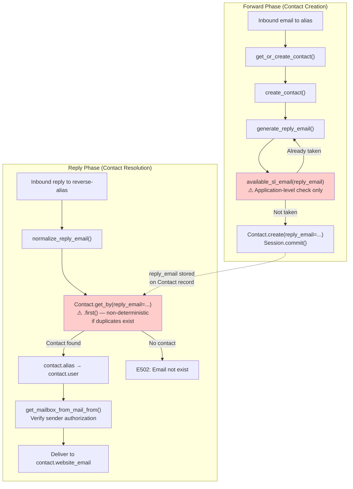

# Technical Specification

# 0. Agent Action Plan

## 0.1 Intent Clarification

### 0.1.1 Core Feature Objective

Based on the prompt, the Blitzy platform understands that the new feature requirement is to conduct a deep investigative analysis of SimpleLogin's inbound reply-email resolution logic—specifically how the system derives the reply email address from an inbound SMTP envelope, resolves it to an associated `Contact` record, and selects the forwarding destination (alias and user). The investigation must determine whether the reply-handling code path exhibits race conditions, uniqueness assumption violations, or timing-related inconsistencies that could cause a reply to be routed to the wrong user.

The requirements, restated with enhanced clarity, are:

- **Trace the reply resolution data flow**: Starting from when `email_handler.py` receives an inbound message whose `rcpt_to` is a reverse-alias address, follow the exact sequence of operations that extracts the reply email, normalizes it, looks up the corresponding `Contact`, traverses to the contact's `Alias` and owning `User`, and selects the mailbox for outbound delivery.
- **Observe runtime values at each resolution step**: Document the concrete values involved—`rcpt_to` (raw reverse-alias), the normalized `reply_email`, the `Contact` record returned by `Contact.get_by(reply_email=...)`, the `contact.alias`, the `contact.user`, and the `mailbox` selected by `get_mailbox_from_mail_from()`.
- **Detect cross-contact and cross-user mismatch scenarios**: Determine whether the same `reply_email` can ever resolve to different `Contact` records over time, whether a reply email can transiently fail to resolve (returning `None`), and whether a successfully resolved contact can forward to a user other than the alias owner.
- **Identify race conditions and uniqueness gaps**: Analyze whether the `reply_email` field on the `Contact` model is protected by a database-level unique constraint, whether the application-level uniqueness check in `generate_reply_email()` is susceptible to time-of-check-to-time-of-use (TOCTOU) races under concurrent processing, and whether the `Contact.get_by(reply_email=...)` lookup could return a non-deterministic result if duplicates exist.
- **Produce a written analysis document**: Deliver all findings as a markdown document placed in `blitzy/documentation/app_2cd6ee777f8c.md`, with rationale grounded in actual source code behavior. No existing source files in the repository may be modified.

Implicit requirements detected:

- Understanding the forward-phase contact creation path is essential context, since this is where `reply_email` values are generated and stored on `Contact` records.
- The investigation must account for multi-process deployment topologies (multiple `email_handler` instances) where concurrent SMTP sessions can trigger parallel contact creation.
- The single-connection, scoped-session architecture in `app/db.py` must be evaluated for its implications on transaction isolation during concurrent reply-email generation and lookup.

### 0.1.2 Special Instructions and Constraints

- **CRITICAL: Read-only investigation**: The user explicitly requires that no repository source files are modified. The sole deliverable is a markdown analysis document.
- **Implementation rule "SWE-AtlasQnA-Repo"**: The document must be named `app_2cd6ee777f8c.md` and placed in the `blitzy/documentation` directory. It must provide thinking and rationale behind all answers, base conclusions on code as the source of truth, and not make assumptions.
- **Temporary tooling permitted**: If observation scripts are needed, they must be cleaned up afterward, leaving the repository unchanged.
- **Architectural convention**: The analysis must follow the existing codebase patterns—referencing specific files, line numbers, and code constructs—to ground every conclusion in observable evidence.

### 0.1.3 Technical Interpretation

These feature requirements translate to the following technical implementation strategy:

- To **trace the reply resolution flow**, we will analyze the `handle_reply()` function in `email_handler.py` (lines 966–1261), the `normalize_reply_email()` function in `app/email_validation.py` (lines 25–38), the `Contact.get_by()` method inherited from `ModelMixin` in `app/models.py` (line 83–84), and the `get_mailbox_from_mail_from()` function in `email_handler.py` (lines 1364–1387).
- To **trace the reply-email generation path** (forward phase), we will analyze `get_or_create_contact()` (lines 180–211), `contact_utils.create_contact()` in `app/contact_utils.py` (lines 42–120), `generate_reply_email()` in `app/email_utils.py` (lines 1103–1153), and `available_sl_email()` in `app/models.py` (lines 1425–1432).
- To **assess uniqueness and race condition risks**, we will examine the `Contact` model's column definitions in `app/models.py` (lines 1863–1962), the database migration `2021_071310_78403c7b8089_.py` which creates a non-unique index on `reply_email`, and the scoped-session/single-connection architecture in `app/db.py`.
- To **deliver the analysis**, we will create a comprehensive markdown document at `blitzy/documentation/app_2cd6ee777f8c.md` that synthesizes all observations with direct source code citations.

## 0.2 Repository Scope Discovery

### 0.2.1 Comprehensive File Analysis

The investigation scope encompasses every source file involved in the reply-email resolution chain—from SMTP envelope reception through contact lookup and mailbox delivery selection. The following files were identified through systematic hierarchical exploration and targeted semantic search.

#### Primary Reply-Phase Files (Critical Path)

| File | Purpose | Key Lines/Functions |
|------|---------|---------------------|
| `email_handler.py` | Central SMTP inbound processor; contains `handle_reply()`, `handle_forward()`, `handle()`, `MailHandler`, and all routing logic | `handle_reply()` L966–1261, `handle()` L1945–2234, `get_or_create_contact()` L180–211, `replace_header_when_forward()` L239–317, `replace_header_when_reply()` L345–384, `get_mailbox_from_mail_from()` L1364–1387, `handle_unknown_mailbox()` L1390–1429, `is_reverse_alias()` delegation |
| `app/contact_utils.py` | Contact creation/reconciliation workflow; generates `reply_email` on new contacts | `create_contact()` L42–120, `__update_contact_if_needed()` L28–39 |
| `app/email_utils.py` | Reply email generation, normalization, VERP handling, reverse-alias identification | `generate_reply_email()` L1103–1153, `is_reverse_alias()` L1156–1163, `available_sl_email()` (referenced) |
| `app/email_validation.py` | Reply email normalization for non-ASCII and control characters | `normalize_reply_email()` L25–38 |
| `app/models.py` | ORM model definitions; `Contact` model with `reply_email` column, `ModelMixin.get_by()` | `Contact` class L1863–2057, `ModelMixin.get_by()` L82–84, `available_sl_email()` L1425–1432, `Alias` class L1469–1601, `Mailbox` class L2710–2740, `AliasMailbox` L2939–2953 |
| `app/db.py` | Database engine and session management; single connection, scoped session | `engine` L9–11, `connection` L12, `Session` (scoped_session) L14 |

#### Supporting Infrastructure Files

| File | Purpose | Relevance to Investigation |
|------|---------|---------------------------|
| `app/errors.py` | Custom exception hierarchy | `NonReverseAliasInReplyPhase` L36–38, `CannotCreateContactForReverseAlias` L29–33 |
| `app/email/status.py` | SMTP status code constants | `E501`–`E506` reply-phase status codes |
| `app/email/rate_limit.py` | Rate limiting for forward and reply phases | `rate_limited_reply_phase()` L86–93; uses `Contact.get_by(reply_email=...)` |
| `app/handler/dmarc.py` | DMARC policy enforcement for reply phase | `apply_dmarc_policy_for_reply_phase()` called from `handle_reply()` |
| `app/utils.py` | Utility functions | `random_string()` L41–47, `sanitize_email()` L97+, `convert_to_id()` L50–56 |
| `app/config.py` | Configuration constants | `EMAIL_DOMAIN` L192, `DB_URI`, feature flags |
| `server.py` | Flask app factory | `create_light_app()` L127–136 — creates app context for email handler |

#### Database Schema and Migrations

| File | Purpose | Key Detail |
|------|---------|------------|
| `migrations/versions/2021_071310_78403c7b8089_.py` | Creates index on `contact.reply_email` | `unique=False` — explicitly non-unique index |
| `migrations/versions/2020_031711_0809266d08ca_.py` | Creates `uq_contact` unique constraint | On `(alias_id, website_email)` only — no `reply_email` uniqueness |
| `migrations/versions/5fa68bafae72_.py` | Original contact table creation | `reply_email` column defined, no unique constraint |

#### Test Files (Behavioral Evidence)

| File | Purpose | Key Tests |
|------|---------|-----------|
| `tests/test_email_handler.py` | Email handler integration tests | `test_replace_contacts_and_user_in_reply_phase()` L274, `test_send_email_from_non_canonical_address_on_reply()` L315 |
| `tests/test_email_utils.py` | Reply email generation tests | `test_generate_reply_email()` L540, `test_generate_reply_email_include_sender_in_reverse_alias()` L567 |
| `tests/test_contact_utils.py` | Contact creation/reconciliation tests | Full suite L36–197; covers creation, deduplication, and update flows |
| `tests/test_models.py` | Model behavior tests | Contact model creation tests |
| `tests/email_tests/test_rate_limit.py` | Rate limit tests for reply phase | `rate_limited_reply_phase()` usage L85–109 |

#### Configuration Files

| File | Purpose |
|------|---------|
| `pyproject.toml` | Dependency manifest — SQLAlchemy 1.3.24, aiosmtpd ^1.2, Python ^3.10 |
| `alembic.ini` | Alembic migration configuration |
| `example.env` | Environment variable documentation including `DB_URI` |

### 0.2.2 Integration Point Discovery

The reply resolution flow touches the following integration points:

- **SMTP Inbound (aiosmtpd)**: `MailHandler.handle_DATA()` → `_handle()` → `handle()` — async entry point that dispatches to the synchronous `handle_reply()` path
- **Database (PostgreSQL via SQLAlchemy)**: `Contact.get_by(reply_email=...)` using `Session.query(Contact).filter_by(reply_email=...).first()` — the critical lookup that resolves a reverse-alias to a contact
- **Contact creation (forward phase)**: `create_contact()` → `generate_reply_email()` → `available_sl_email()` — where reply_email values are generated and persisted
- **Mailbox authorization**: `get_mailbox_from_mail_from()` — verifies the sending mailbox is authorized for the alias
- **DMARC enforcement**: `apply_dmarc_policy_for_reply_phase()` — policy check before delivery
- **SMTP Outbound**: `sl_sendmail()` via VERP envelope — final delivery to contact's website_email

### 0.2.3 Web Search Research Conducted

No external web searches were necessary for this investigation. All findings are derived directly from the source code, database schema, migration history, and test suite present in the repository. The codebase provides complete evidence for all conclusions.

### 0.2.4 New File Requirements

Per the investigation scope and the "SWE-AtlasQnA-Repo" implementation rule, only one new file is required:

- **CREATE**: `blitzy/documentation/app_2cd6ee777f8c.md` — Comprehensive markdown analysis document answering all questions about reply-email resolution behavior, race conditions, and uniqueness gaps. This file contains the full investigative findings with code-grounded rationale.

## 0.3 Dependency Inventory

### 0.3.1 Private and Public Packages

The following packages are directly relevant to the reply-email resolution logic under investigation. All versions are sourced from `pyproject.toml`.

| Registry | Package | Version | Purpose |
|----------|---------|---------|---------|
| PyPI | `SQLAlchemy` | 1.3.24 (pinned) | ORM layer; `scoped_session`, `filter_by().first()` for contact lookup, `IntegrityError` handling |
| PyPI | `psycopg2-binary` | ^2.9.3 | PostgreSQL driver underlying all DB operations |
| PyPI | `aiosmtpd` | ^1.2 | Async SMTP server; `MailHandler.handle_DATA()` entry point |
| PyPI | `flask` | ^1.1.2 | `create_light_app()` provides app context for email handler DB operations |
| PyPI | `Flask-Migrate` | ^2.5.3 | Alembic-based migration management for Contact schema |
| PyPI | `email_validator` | ^1.1.1 | Email address validation in contact creation and normalization |
| PyPI | `flanker` | ^0.9.11 | RFC-compliant email address parsing in header rewriting |
| PyPI | `arrow` | ^0.16.0 | Timestamp handling in `ModelMixin` base class |
| PyPI | `newrelic` | 8.8.0 (pinned) | Performance monitoring; `@background_task()` decorator on `_handle()` |
| PyPI | `dkimpy` | ^1.0.5 | DKIM signing for outbound reply delivery |
| PyPI | `python` | ^3.10 | Runtime; `target-version = ['py310']` in pyproject.toml |

### 0.3.2 Dependency Updates

This investigation does not require any dependency updates, additions, or import changes. The task is a read-only code analysis producing a documentation artifact. No packages need to be installed, upgraded, or modified.

### 0.3.3 External Reference Updates

No external reference updates are required. The sole deliverable is a new markdown document in `blitzy/documentation/`. No configuration files, build files, CI/CD pipelines, or existing documentation files will be modified.

## 0.4 Integration Analysis

### 0.4.1 Existing Code Touchpoints

The reply-email resolution chain traverses the following code touchpoints in sequence. Each represents a critical point in the investigation where runtime values determine routing behavior.

#### Touchpoint 1: SMTP Entry and Reply Detection

- **`email_handler.py` — `MailHandler.handle_DATA()`** (line 2289): Receives raw SMTP DATA, parses into `email.message.Message`, delegates to `_handle()`.
- **`email_handler.py` — `_handle()`** (line 2335): Creates a Flask app context via `create_light_app().app_context()`, calls `handle()`.
- **`email_handler.py` — `handle()`** (line 1945): Sanitizes `mail_from` and `rcpt_tos`, checks for reverse-alias misuse at lines 1996–2011 via `Contact.get_by(reply_email=mail_from)` and `Contact.get_by(reply_email=from_header_address)`.
- **`email_handler.py` — routing decision** (line 2195): `is_reverse_alias(rcpt_to)` determines whether to enter the reply phase. This function at `app/email_utils.py` line 1156 performs `Contact.get_by(reply_email=address)` — the first lookup that can resolve a reply email to a contact.

#### Touchpoint 2: Reply-Email Normalization and Contact Lookup

- **`email_handler.py` — `handle_reply()`** (line 966): Receives `rcpt_to` as the raw reverse-alias address.
  - Line 972: `reply_email = rcpt_to` — raw assignment
  - Line 974: Domain validation against `EMAIL_DOMAIN` or registered `SLDomain`
  - Line 984: `reply_email = normalize_reply_email(reply_email)` — applies character normalization from `app/email_validation.py`
  - **Line 986**: `contact = Contact.get_by(reply_email=reply_email)` — **THE CRITICAL LOOKUP**: This uses `Session.query(Contact).filter_by(reply_email=reply_email).first()` from `ModelMixin.get_by()`. The `.first()` call returns the first row matching the filter or `None`. If multiple contacts share the same `reply_email`, `.first()` returns a non-deterministic result (database-order dependent).
  - Lines 987–989: If `contact` is `None`, returns `E502` ("Email not exist").

#### Touchpoint 3: Alias, User, and Mailbox Derivation

- Line 994: `alias = contact.alias` — SQLAlchemy relationship traversal from Contact to Alias
- Line 1004: `user = alias.user` — traversal from Alias to User
- **Line 1019**: `mailbox = get_mailbox_from_mail_from(mail_from, alias)` — verifies the sending address (`envelope.mail_from`) matches one of the alias's authorized mailboxes. This is an anti-spoofing check to ensure only the alias owner's mailbox(es) can send through the reverse alias.
  - If no matching mailbox is found and `alias.disable_email_spoofing_check` is `False`, the system calls `handle_unknown_mailbox()` at line 1032 and returns `E214`.
  - If `disable_email_spoofing_check` is `True`, falls back to `alias.mailbox` (the default mailbox).

#### Touchpoint 4: Reply-Email Generation (Forward Phase Origin)

The `reply_email` values resolved during the reply phase originate from the forward phase:

- **`email_handler.py` — `get_or_create_contact()`** (line 180): Called during `handle_forward()` (line 581) to create contacts from the FROM header.
- **`app/contact_utils.py` — `create_contact()`** (line 42): Core creation logic.
  - Line 85: Checks for existing contact via `Contact.get_by(alias_id=alias.id, website_email=email)`.
  - Line 89: If no existing contact, calls `generate_reply_email(email, alias)`.
  - Lines 90–103: `Contact.create(reply_email=reply_email, ...)` — inserts the new contact with the generated reply email.
  - Lines 113–119: `IntegrityError` handler catches violations of `uq_contact` (the `(alias_id, website_email)` uniqueness constraint) but does NOT detect or handle duplicate `reply_email` values.

- **`app/email_utils.py` — `generate_reply_email()`** (line 1103): Generates a random reply email.
  - Lines 1136–1151: Loops up to 1000 times, generating random strings and checking `available_sl_email(reply_email)`.
  - **`app/models.py` — `available_sl_email()`** (line 1425): Checks `Contact.get_by(reply_email=email)` — application-level uniqueness check with no database-level guarantee.

- **`email_handler.py` — `replace_header_when_forward()`** (line 239): Also creates contacts (for CC/To header rewriting) with `generate_reply_email()` at line 299 — a parallel code path subject to the same race condition.

#### Touchpoint 5: Session and Connection Architecture

- **`app/db.py`**: A single database connection (`connection = engine.connect()` at line 12) is shared across all scoped sessions. `Session = scoped_session(sessionmaker(bind=connection))` at line 14 creates thread-scoped session proxies.
- **`server.py` — `create_light_app()`** (line 127): Each `_handle()` call runs within a fresh Flask app context. The teardown callback (`Session.remove()` at line 134) cleans up the session at the end of each email processing cycle.
- This architecture means that within a single `email_handler` process, email processing is effectively sequential (aiosmtpd is single-threaded, and `_handle()` blocks the event loop). However, in a multi-process deployment, concurrent `email_handler` instances with separate database connections can execute overlapping transactions.

### 0.4.2 Identified Race Condition and Uniqueness Analysis Points

The two red-highlighted nodes represent the primary areas of concern:
- **`available_sl_email()`**: Application-level TOCTOU check without database-level uniqueness enforcement
- **`Contact.get_by(reply_email=...).first()`**: Non-deterministic result when duplicate `reply_email` values exist in the database

## 0.5 Technical Implementation

### 0.5.1 File-by-File Execution Plan

This is a read-only investigation that produces a single analysis document. No source files will be modified. The execution plan focuses on the analysis methodology and document creation.

- **Group 1 — Analysis Document Creation**:
  - CREATE: `blitzy/documentation/app_2cd6ee777f8c.md` — Comprehensive markdown document answering the investigative questions about reply-email resolution, race conditions, and uniqueness gaps. Structured into sections covering the forward-phase creation path, the reply-phase resolution path, the database schema analysis, the TOCTOU race condition analysis, and the behavioral conclusions.

- **Group 2 — No Source Modifications**:
  - No existing repository source files are modified per the explicit user constraint.
  - No temporary scripts are needed; the investigation is conducted through static code analysis of the repository contents.

### 0.5.2 Implementation Approach

The analysis document will be constructed by synthesizing findings from the following investigation axes:

**Axis 1: Forward-Phase Reply-Email Generation**
- Establish the foundation by documenting how `reply_email` values are created in `generate_reply_email()` (`app/email_utils.py` lines 1103–1153), including the random string generation, domain selection, and `available_sl_email()` uniqueness check.
- Document the two code paths that create contacts with reply emails: `get_or_create_contact()` (line 180) and `replace_header_when_forward()` (line 239) in `email_handler.py`.

**Axis 2: Reply-Phase Contact Resolution**
- Trace the exact resolution sequence in `handle_reply()` (lines 966–1261): envelope reception → domain validation → normalization → `Contact.get_by()` lookup → alias/user derivation → mailbox authorization → outbound delivery.
- Document each runtime value at each step and how it determines routing.

**Axis 3: Database Schema and Constraint Analysis**
- Present the Contact model definition (`app/models.py` lines 1863–1962) showing `reply_email` is indexed but NOT unique.
- Present the migration evidence (`2021_071310_78403c7b8089_.py`) confirming `unique=False` on the `ix_contact_reply_email` index.
- Contrast with the `uq_contact` constraint on `(alias_id, website_email)` which IS the only uniqueness enforcement.

**Axis 4: Race Condition and Concurrency Analysis**
- Analyze the TOCTOU gap between `available_sl_email()` check and `Contact.create()` commit.
- Evaluate the single-connection architecture in `app/db.py` and its implications for multi-process deployments.
- Assess the `ModelMixin.get_by()` → `.first()` behavior when duplicate `reply_email` records exist.
- Document the absence of distributed locking for reply-email generation (contrast with the Redis-based `parallel_limiter.py` used for alias creation).

**Axis 5: Behavioral Conclusions**
- Determine the practical likelihood and conditions under which misrouting could occur.
- Explain the specific runtime values that would lead to a reply being delivered to the wrong user.
- Assess whether the `IntegrityError` handling in `create_contact()` provides any implicit protection.

### 0.5.3 Key Analytical Findings to Document

The analysis document will establish the following evidence-based findings:

**Finding 1: `reply_email` lacks a database-level unique constraint**
The `Contact.reply_email` column is defined as `sa.Column(sa.String(512), nullable=False, index=True)` in `app/models.py` line 1899. The index created in migration `2021_071310_78403c7b8089_.py` explicitly specifies `unique=False`. The only unique constraint on the `contact` table is `uq_contact` covering `(alias_id, website_email)`. This means PostgreSQL will accept multiple rows with identical `reply_email` values without raising an error.

**Finding 2: Application-level uniqueness check has a TOCTOU window**
`generate_reply_email()` calls `available_sl_email(reply_email)` which performs `Contact.get_by(reply_email=email)` — a SELECT query. If no existing contact is found, the function returns the generated reply email, which is then used in a subsequent `Contact.create(..., commit=True)`. Between the SELECT check and the INSERT+COMMIT, another process can insert a contact with the same reply_email. No database-level unique constraint exists to prevent this.

**Finding 3: `.first()` produces non-deterministic results for duplicates**
`ModelMixin.get_by()` uses `Session.query(cls).filter_by(**kw).first()`. If multiple `Contact` rows share the same `reply_email`, `.first()` returns whichever row the database engine returns first (typically by primary key order in PostgreSQL, but this is not guaranteed). This could return a `Contact` belonging to a different alias and different user than intended.

**Finding 4: Single-process serialization mitigates but does not eliminate the risk**
Within a single `email_handler` process, `aiosmtpd` calls `_handle()` synchronously (no `await`), which blocks the event loop and serializes email processing. This eliminates intra-process races. However, production deployments may run multiple `email_handler` processes or have web application endpoints that also create contacts, introducing inter-process concurrency.

**Finding 5: The `IntegrityError` handler does not guard reply_email**
The `try/except IntegrityError` in `create_contact()` (lines 113–119) catches violations of the `uq_contact` constraint on `(alias_id, website_email)`. Since there is no unique constraint on `reply_email`, an `IntegrityError` will never be raised for duplicate reply emails. The handler performs a fallback `Contact.get_by(alias_id=..., website_email=...)` which is correct for the `uq_contact` case but irrelevant to `reply_email` duplication.

## 0.6 Scope Boundaries

### 0.6.1 Exhaustively In Scope

The following files, components, and analysis areas are exhaustively in scope for this investigation:

- **Reply-phase resolution logic**:
  - `email_handler.py` — `handle_reply()`, `handle()`, `_handle()`, `MailHandler.handle_DATA()`, `get_mailbox_from_mail_from()`, `handle_unknown_mailbox()`, `replace_header_when_reply()`, `is_reverse_alias()`
  - `app/email_validation.py` — `normalize_reply_email()`
  - `app/email_utils.py` — `generate_reply_email()`, `is_reverse_alias()`, `available_sl_email()` (referenced)

- **Contact creation and lookup logic**:
  - `app/contact_utils.py` — `create_contact()`, `__update_contact_if_needed()`
  - `app/models.py` — `Contact` class, `ModelMixin.get_by()`, `Contact.create()`, `available_sl_email()`

- **Forward-phase contact creation paths** (as context for reply_email generation):
  - `email_handler.py` — `get_or_create_contact()`, `get_or_create_reply_to_contact()`, `replace_header_when_forward()`, `handle_forward()`, `forward_email_to_mailbox()`

- **Database architecture and schema**:
  - `app/db.py` — Session and connection management
  - `app/models.py` — `Contact.__table_args__`, column definitions, index definitions
  - `migrations/versions/2021_071310_78403c7b8089_.py` — `ix_contact_reply_email` index (non-unique)
  - `migrations/versions/2020_031711_0809266d08ca_.py` — `uq_contact` unique constraint
  - `migrations/versions/5fa68bafae72_.py` — Original contact table creation

- **Supporting infrastructure**:
  - `server.py` — `create_light_app()` app context factory
  - `app/errors.py` — `NonReverseAliasInReplyPhase`, `CannotCreateContactForReverseAlias`
  - `app/email/status.py` — SMTP status codes
  - `app/email/rate_limit.py` — `rate_limited_reply_phase()`
  - `app/utils.py` — `random_string()`, `sanitize_email()`, `convert_to_id()`
  - `app/config.py` — `EMAIL_DOMAIN`, `DB_URI`

- **Test suite** (as behavioral evidence):
  - `tests/test_email_handler.py` — Reply-phase test cases
  - `tests/test_contact_utils.py` — Contact creation tests
  - `tests/test_email_utils.py` — Reply email generation tests
  - `tests/email_tests/test_rate_limit.py` — Rate limit tests using reply_email lookup

- **Configuration and dependency manifests**:
  - `pyproject.toml` — SQLAlchemy 1.3.24, aiosmtpd ^1.2, Python ^3.10
  - `alembic.ini` — Migration configuration

- **Deliverable**:
  - `blitzy/documentation/app_2cd6ee777f8c.md` — Analysis document (to be created)

### 0.6.2 Explicitly Out of Scope

- **PGP encryption and DKIM signing logic**: While referenced in the reply flow, these do not affect contact resolution or routing
- **SpamAssassin/Rspamd integration**: Spam scoring occurs after contact resolution; does not affect which contact is selected
- **Web dashboard and API endpoints**: The investigation focuses exclusively on the SMTP inbound processing path
- **OAuth/OIDC provider functionality**: Unrelated to email processing
- **Subscription/billing logic**: Premium checks occur post-resolution and don't affect contact lookup
- **Proton partner integration**: Not relevant to the reply-email resolution chain
- **Frontend assets (static/, templates/)**: No UI changes
- **Event system (events/, app/events/)**: Not involved in reply-phase processing
- **Cron jobs and background workers (cron.py, job_runner.py)**: Not involved in real-time reply processing
- **Modifications to any existing source files**: Explicitly forbidden by user instruction
- **Performance optimizations**: Not within scope of this investigation
- **Refactoring of existing code**: Not within scope

## 0.7 Rules for Feature Addition

### 0.7.1 User-Specified Rules

The following rules and requirements have been explicitly emphasized by the user:

- **No source file modifications**: "Don't modify any repository source files." This is the paramount constraint governing the entire investigation. The repository must remain in its original state after the analysis is complete.
- **SWE-AtlasQnA-Repo implementation rule**: Create a new markdown document named `app_2cd6ee777f8c.md` (matching the source branch name) that comprehensively answers the question(s) posed in the prompt. The document must provide thinking and rationale behind the answers, base all conclusions on the code as the source of truth, and avoid assumptions. The document must be placed in the `blitzy/documentation` directory.
- **Temporary tooling permitted with cleanup**: "If temporary scripts or tooling are needed to observe behavior, that's fine, but clean them up afterward and leave the repository unchanged."
- **Evidence-based conclusions**: The user specifically requires observations of "runtime values involved in this resolution" and asks the investigator to "describe the runtime values you observed during reply resolution and explain how those values lead to the observed behavior." All conclusions must be grounded in the actual code paths, not hypothetical scenarios.
- **Specific focus areas**: The investigation must specifically address:
  - Whether the same reply email ever resolves to different contacts over time
  - Whether resolution fails temporarily
  - Whether resolution succeeds but forwards to a different user than expected
  - Whether the reply-handling logic exhibits race conditions, uniqueness assumptions, or timing-related inconsistencies

### 0.7.2 Analytical Convention Requirements

- All findings in the analysis document must cite specific file paths, line numbers, and function names
- The document must distinguish between confirmed vulnerabilities (provable from code) and theoretical risks (possible but unlikely under normal conditions)
- The document must explain the chain of causation: which specific code path, operating under which specific conditions, produces which specific undesirable outcome
- Database schema evidence must reference both the ORM model definitions and the migration history to establish authoritative ground truth about constraints

## 0.8 References

### 0.8.1 Files and Folders Searched

The following files and folders were comprehensively searched and analyzed to derive the conclusions in this Agent Action Plan:

#### Core Reply-Resolution Files (Full Content Retrieved)

| File | Lines Retrieved | Purpose |
|------|----------------|---------|
| `email_handler.py` | 1–100, 100–250, 239–400, 536–700, 700–870, 966–1160, 1160–1365, 1364–1430, 1930–2050, 2100–2350, 2335–2405 | Complete reply-phase and forward-phase handling logic |
| `app/contact_utils.py` | 1–121 (complete) | Contact creation, deduplication, IntegrityError handling |
| `app/email_utils.py` | 1103–1165 | Reply email generation and reverse-alias identification |
| `app/email_validation.py` | 1–39 (complete) | Reply email normalization |
| `app/models.py` | 70–120, 1425–1470, 1469–1570, 1580–1610, 1863–2010, 2008–2060, 2710–2790, 2939–2980 | Contact, Alias, Mailbox, AliasMailbox models; ModelMixin.get_by(); available_sl_email() |
| `app/db.py` | 1–19 (complete) | Database connection and session architecture |
| `app/errors.py` | 1–131 (complete) | Custom exception types for reply-phase errors |
| `app/email/rate_limit.py` | 1–113 (complete) | Rate limiting logic for reply phase |
| `app/email/status.py` | Full content | SMTP status code definitions |
| `app/utils.py` | 1–60 | random_string(), convert_to_id(), sanitize_email() |
| `server.py` | 127–170 | create_light_app() and session teardown |

#### Test Files (Full or Partial Content Retrieved)

| File | Lines Retrieved | Purpose |
|------|----------------|---------|
| `tests/test_email_handler.py` | 1–50, 274–360 | Reply-phase test cases, test utilities |
| `tests/test_contact_utils.py` | 1–197 (complete) | Contact creation and update test suite |
| `tests/test_email_utils.py` | Grep results | Reply email generation test locations |

#### Migration Files (Searched via grep)

| File | Key Finding |
|------|-------------|
| `migrations/versions/2021_071310_78403c7b8089_.py` | `ix_contact_reply_email` index with `unique=False` |
| `migrations/versions/2020_031711_0809266d08ca_.py` | `uq_contact` unique constraint on `(alias_id, website_email)` |
| `migrations/versions/5fa68bafae72_.py` | Original `reply_email` column definition |

#### Configuration Files (Partial Content Retrieved)

| File | Lines Retrieved | Purpose |
|------|----------------|---------|
| `pyproject.toml` | 1–130 | Dependency versions, Python version, tooling config |
| `app/config.py` | Grep results | DB_URI, EMAIL_DOMAIN, DB_CONN_NAME configuration |
| `example.env` | Grep results | Environment variable documentation |
| `alembic.ini` | Referenced | Migration configuration |

#### Folders Explored

| Folder | Depth | Method |
|--------|-------|--------|
| Root (`""`) | Level 0 | `get_source_folder_contents` |
| `app/` | Level 1 | `get_source_folder_contents` |
| `app/handler/` | Level 2 | `get_source_folder_contents` |
| `tests/` | Level 1 | `find` and `grep` commands |
| `migrations/versions/` | Level 2 | `grep` for `reply_email` and `unique` patterns |

### 0.8.2 Tech Spec Sections Referenced

| Section | Purpose |
|---------|---------|
| 1.1 Executive Summary | Project context, core business problem, and stakeholder identification |
| 4.2 Core Email Processing Workflows | Forward-phase and reply-phase flowcharts, validation rules, decision points |
| 6.2 Database Design | Contact model schema, constraint documentation, indexing strategy, session architecture |

### 0.8.3 Attachments

No attachments were provided by the user for this project. No Figma URLs or external design references are applicable to this investigation.

