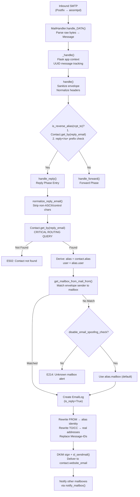

# Technical Specification

# 0. Agent Action Plan

## 0.1 Intent Clarification

Based on the prompt, the Blitzy platform understands that the new feature requirement is to **investigate and document the alias reply-handling flow in the SimpleLogin email aliasing system, tracing the end-to-end runtime path for inbound reply messages and identifying the most likely point where incorrect user routing could originate.**

### 0.1.1 Core Feature Objective

The user has observed unexpected behavior in the reply-handling pipeline: when a user replies to a forwarded email through an alias, some replies appear to be routed to the wrong recipient even though server logs show the alias being correctly recognized. The deliverable is a comprehensive investigative analysis document that:

- **Simulates an inbound email reply** within the development environment and traces the runtime flow end-to-end through the SMTP handler
- **Maps the exact data flow** from message reception through alias resolution, contact lookup, mailbox authorization, and final delivery to the outbound recipient
- **Identifies the specific component** in the pipeline where an incorrect routing decision could originate, based on the actual code paths in `email_handler.py` and its dependencies
- **Explains the complete reply-phase mechanism** including reverse-alias generation, Contact record resolution, mailbox authorization logic, header rewriting, and VERP-based delivery
- **Documents findings** in a markdown file placed in the `blitzy/documentation` directory

### 0.1.2 Implicit Requirements Detected

- The analysis must be grounded in actual code inspection — no assumptions or speculation about how the system works
- The investigation must cover all routing decision points, not just the obvious ones — including edge cases like canonical vs. non-canonical email matching, multi-mailbox aliases, disabled spoofing checks, and stale Contact records
- The system must remain in its original state after investigation — any temporary scripts, logs, or instrumentation must be cleaned up
- The deliverable must provide actionable insight — not just "what happens" but "where things can go wrong and why"
- The investigation must account for the `normalize_reply_email()` normalization step that could transform the lookup key before Contact resolution
- The `is_reverse_alias()` function's dual-path logic (database lookup OR prefix-matching) must be examined as a potential source of inconsistency

### 0.1.3 Special Instructions and Constraints

- **Implementation Rule (SWE-AtlasQnA-Repo)**: Create a new markdown document named `app_2cd6ee777f8c.md` in the `blitzy/documentation` directory that comprehensively answers the investigation questions
- **No code modifications**: Do not modify any existing files in the source repository
- **No additional code**: Do not add any code in the source repository besides the requested documentation file
- **Rationale required**: Provide thinking and rationale behind all answers
- **Evidence-based**: Base all answers on the actual code, not assumptions

### 0.1.4 Technical Interpretation

These requirements translate to the following technical implementation strategy:

- To **trace the inbound reply flow**, we will analyze the complete call chain starting from `MailHandler.handle_DATA()` (line 2289 in `email_handler.py`) → `_handle()` (line 2335) → `handle()` (line 1945) → the reply-phase branch at line 2195 → `handle_reply()` (line 966), documenting each decision point and data transformation
- To **map alias resolution**, we will document how `Contact.get_by(reply_email=reply_email)` at line 986 resolves the reverse-alias address to a Contact record, and how `contact.alias` and `alias.user` chain upward to determine the target user
- To **identify routing failure points**, we will analyze the `get_mailbox_from_mail_from()` function (line 1364), the `canonicalize_email()` logic in `app/utils.py`, the `normalize_reply_email()` function in `app/email_validation.py`, and the `is_reverse_alias()` function in `app/email_utils.py` — all of which participate in routing decisions
- To **produce the deliverable**, we will create `blitzy/documentation/app_2cd6ee777f8c.md` containing the complete investigation findings with code references and data flow diagrams


## 0.2 Repository Scope Discovery

### 0.2.1 Comprehensive File Analysis

The alias reply-handling investigation requires deep analysis of the following existing repository files. Since the implementation rule prohibits code modifications, all files below are **read-only analysis targets** — the only new file to be created is the documentation deliverable.

#### Core Email Handling Pipeline (Primary Analysis Targets)

| File Path | Role in Reply Pipeline | Relevance |
|---|---|---|
| `email_handler.py` | Central SMTP inbound processor; contains `handle()`, `handle_reply()`, `handle_forward()`, `get_mailbox_from_mail_from()`, `replace_header_when_reply()`, `MailHandler` class | **Critical** — main investigation target |
| `app/email_utils.py` | `generate_reply_email()`, `is_reverse_alias()`, VERP generation/validation, DKIM signing, header manipulation helpers | **Critical** — reverse-alias generation and detection logic |
| `app/email_validation.py` | `normalize_reply_email()` — normalizes reply addresses before Contact lookup | **Critical** — normalization step that may alter routing |
| `app/contact_utils.py` | `create_contact()` — creates Contact records with `reply_email` field | **High** — determines how reply addresses are assigned to contacts |
| `app/utils.py` | `sanitize_email()`, `canonicalize_email()` — email address normalization | **High** — canonical address matching in mailbox authorization |

#### Data Model Layer (Schema Understanding)

| File Path | Key Models | Relevance |
|---|---|---|
| `app/models.py` | `Alias` (lines 1469+), `Contact` (lines 1863+), `Mailbox` (lines 2710+), `EmailLog` (lines 2060+), `MessageIDMatching` (lines 3365+), `User`, `SLDomain`, `AliasMailbox` | **Critical** — defines the database schema and relationships that the reply pipeline queries |

#### Email Sub-handler Layer

| File Path | Purpose | Relevance |
|---|---|---|
| `app/handler/dmarc.py` | DMARC policy for reply phase — `apply_dmarc_policy_for_reply_phase()` | **Medium** — can reject replies based on DMARC |
| `app/handler/spamd_result.py` | SpamAssassin/Rspamd result parsing | **Medium** — spam scoring during reply phase |
| `app/handler/provider_complaint.py` | Hotmail/Yahoo complaint handling | **Low** — separate from reply routing |
| `app/handler/unsubscribe_handler.py` | Unsubscribe request processing | **Low** — separate from reply routing |
| `app/handler/unsubscribe_encoder.py` | Unsubscribe token encoding/decoding | **Low** — separate from reply routing |
| `app/handler/unsubscribe_generator.py` | List-Unsubscribe header generation | **Low** — forward-phase only |

#### Email Infrastructure

| File Path | Purpose | Relevance |
|---|---|---|
| `app/email/status.py` | SMTP status code constants (E200, E214, E501, E502, etc.) | **Medium** — defines return codes for reply routing decisions |
| `app/email/headers.py` | Header name constants (FROM, TO, CC, MESSAGE_ID, etc.) | **Medium** — header constants used in reply rewriting |
| `app/email/rate_limit.py` | Rate limiting logic (currently disabled via `return False` at line 97) | **Low** — rate limiting short-circuited |
| `app/email/spam.py` | SpamAssassin integration for spam scoring | **Low** — spam check after routing |
| `app/mail_sender.py` | Outbound SMTP delivery via `sl_sendmail()` | **Medium** — final delivery step in reply phase |
| `app/message_utils.py` | Email message serialization helpers | **Low** — utility layer |

#### Configuration and Infrastructure

| File Path | Purpose | Relevance |
|---|---|---|
| `app/config.py` | Environment-driven configuration constants (EMAIL_DOMAIN, ENFORCE_SPF, etc.) | **Medium** — configuration values affecting reply behavior |
| `app/db.py` | SQLAlchemy engine/session management | **Low** — database infrastructure |
| `app/errors.py` | Custom exception classes: `NonReverseAliasInReplyPhase`, `VERPReply`, `CannotCreateContactForReverseAlias` | **Medium** — exception types raised during reply processing |
| `app/log.py` | Logging configuration with message-ID correlation filter | **Low** — logging infrastructure |
| `example.env` | Environment variable documentation | **Low** — reference for configuration options |

#### Test Infrastructure (Behavior Validation Reference)

| File Path | Purpose | Relevance |
|---|---|---|
| `tests/test_email_handler.py` | Main email handler test suite — covers reply-phase routing, canonical address matching, header replacement | **High** — existing test patterns for reply flow |
| `tests/handler/test_preserved_headers.py` | Header preservation tests during forwarding | **Medium** — validates header handling |
| `tests/conftest.py` | Test fixtures, Flask app creation, database rollback | **Medium** — test infrastructure reference |
| `tests/utils.py` | Test helpers: `create_new_user()`, `load_eml_file()`, `random_email()` | **Medium** — test utility reference |
| `tests/example_emls/replacement_on_reply_phase.eml` | EML fixture for reply-phase testing | **High** — existing reply-phase test fixture |
| `tests/example_emls/dmarc_reply_check.eml` | EML fixture for DMARC reply checks | **Medium** — DMARC reply-phase fixture |

#### Alias and Domain Utilities

| File Path | Purpose | Relevance |
|---|---|---|
| `app/alias_utils.py` | `try_auto_create()`, `get_alias_recipient_name()`, alias lifecycle | **Medium** — alias creation during forward phase (not reply) |
| `app/alias_suffix.py` | Alias suffix validation | **Low** — alias creation, not reply routing |
| `app/alias_mailbox_utils.py` | Alias-mailbox assignment and rewriting | **Medium** — multi-mailbox handling |
| `app/pgp_utils.py` | PGP encryption/signing helpers | **Low** — optional encryption step |

### 0.2.2 Integration Point Discovery

The reply-handling pipeline involves the following integration touchpoints:

- **SMTP Inbound Entry Point**: `MailHandler.handle_DATA()` in `email_handler.py` (line 2289) — receives raw SMTP DATA from Postfix/aiosmtpd
- **Database Lookups**: `Contact.get_by(reply_email=...)` — resolves reverse-alias to Contact; `Alias` fetched via `contact.alias`; `Mailbox` matched via `get_mailbox_from_mail_from()`
- **Email Normalization**: `sanitize_email()` in `app/utils.py` normalizes envelope addresses; `normalize_reply_email()` in `app/email_validation.py` normalizes the reply address
- **Canonical Matching**: `canonicalize_email()` in `app/utils.py` applies Gmail/Proton-specific dot-stripping and plus-truncation for mailbox matching
- **Header Rewriting**: `replace_header_when_reply()` in `email_handler.py` (line 345) restores original email addresses from reverse-aliases in TO/CC headers
- **DKIM Signing**: `add_dkim_signature()` signs the outbound message before delivery
- **VERP Delivery**: `generate_verp_email(VerpType.bounce_reply, ...)` creates a unique bounce-tracking return path; `sl_sendmail()` delivers to `contact.website_email`
- **Multi-Mailbox Notification**: After delivery, other mailboxes associated with the alias are notified via `notify_mailbox()` (line 1264)

### 0.2.3 New File Requirements

Per the **SWE-AtlasQnA-Repo** implementation rule, exactly one new file will be created:

| File Path | Purpose |
|---|---|
| `blitzy/documentation/app_2cd6ee777f8c.md` | Comprehensive investigation document answering the user's questions about alias reply-handling flow, data flow trace, and identification of the most likely point of incorrect routing |

No new source files, test files, or configuration files will be created. No existing files will be modified.


## 0.3 Dependency Inventory

### 0.3.1 Key Packages Relevant to Investigation

The following packages are directly involved in the email reply-handling pipeline under investigation. All versions are sourced from the `pyproject.toml` dependency manifest at the repository root.

| Registry | Package | Version | Purpose in Reply Pipeline |
|---|---|---|---|
| PyPI | `python` | `^3.10` | Runtime — targeted via `target-version = ['py310']` in Black config |
| PyPI | `flask` | `^1.1.2` | Web framework — provides app context for SMTP handler via `create_light_app()` |
| PyPI | `SQLAlchemy` | `1.3.24` (pinned) | ORM layer — all Contact, Alias, Mailbox lookups via `Session` and model queries |
| PyPI | `psycopg2-binary` | `^2.9.3` | PostgreSQL adapter — database driver for model persistence |
| PyPI | `aiosmtpd` | `^1.2` | Async SMTP server — `MailHandler.handle_DATA()` entry point for inbound email |
| PyPI | `email_validator` | `^1.1.1` | Email address validation — used in `normalize_reply_email()` and contact validation |
| PyPI | `flanker` | `^0.9.11` | Email address parsing — `address.parse_list()` in header processing |
| PyPI | `dkimpy` | `^1.0.5` | DKIM signing — `add_dkim_signature()` for outbound reply messages |
| PyPI | `dnspython` | `^2.0.0` | DNS lookups — used in SPF verification and domain checks |
| PyPI | `pyspf` | `^2.0.14` | SPF verification — `spf_pass()` enforcement in reply phase |
| PyPI | `pycryptodome` | `^3.9.8` | Cryptographic primitives — used by PGP and signing utilities |
| PyPI | `PGPy` | `0.5.4` (pinned) | PGP encryption — optional per-contact encryption in reply phase |
| PyPI | `python-gnupg` | `^0.4.6` | GnuPG integration — PGP key management |
| PyPI | `arrow` | `^0.16.0` | Date/time utilities — timestamp handling in email logs |
| PyPI | `newrelic` | `8.8.0` (pinned) | APM instrumentation — `@background_task()` on `_handle()`, custom metrics |
| PyPI | `sentry_sdk` | `^2.16.0` | Error tracking — exception capture in email processing |
| PyPI | `aiospamc` | `0.10` (pinned) | SpamAssassin async client — reply-phase spam scoring |
| PyPI | `redis` | `^4.5.3` | Session store and rate limiter backend |
| PyPI | `boto3` | `^1.15.9` | S3 storage — refused email archival during bounce handling |

### 0.3.2 Dependency Updates

No dependency updates are required for this investigation task. The deliverable is a documentation file — no new packages will be installed, and no existing package versions will be changed. All analysis is performed against the existing codebase and its current dependency set.

### 0.3.3 Import Mapping for Reply Pipeline

The following import chains are critical to understanding the reply-handling data flow. These are the actual imports at the top of `email_handler.py` that directly participate in reply routing:

- `from app.email_utils import is_reverse_alias, generate_reply_email, normalize_reply_email` — reverse-alias detection and normalization
- `from app.email_validation import normalize_reply_email` — reply address normalization (line 128)
- `from app.models import Alias, Contact, Mailbox, EmailLog, MessageIDMatching, SLDomain` — ORM models for routing decisions
- `from app.utils import sanitize_email, canonicalize_email` — address sanitization and canonical matching
- `from app.handler.dmarc import apply_dmarc_policy_for_reply_phase` — DMARC enforcement
- `from app.errors import NonReverseAliasInReplyPhase, VERPReply` — exception types for reply-phase errors
- `from app.mail_sender import sl_sendmail` — final outbound delivery
- `from app.contact_utils import create_contact` — contact creation during forward phase (creates the `reply_email` field used in reply phase)


## 0.4 Integration Analysis

### 0.4.1 Existing Code Touchpoints

The reply-handling pipeline traverses multiple modules in a strict sequential order. The following documents every touchpoint the investigation must cover, with exact file locations and the routing decisions made at each step.

#### Stage 1 — SMTP Reception and Dispatch (`email_handler.py`)

- **`MailHandler.handle_DATA()`** (line 2289): Parses raw SMTP payload into `email.message.Message` object; delegates to `_handle()`
- **`_handle()`** (line 2335): Wraps processing in Flask app context via `create_light_app().app_context()`; calls `handle()`; applies post-processing SPF-based 5xx→E216 downgrade
- **`handle()`** (line 1945): Central routing hub — sanitizes `mail_from` and `rcpt_tos` via `sanitize_email()`, normalizes headers, runs the multi-stage decision tree (VERP → complaints → rate limiting → forward/reply classification)
- **Decision point at line 2195**: `is_reverse_alias(rcpt_to)` determines reply vs. forward routing — this is the **primary dispatch decision** for the pipeline

#### Stage 2 — Reverse-Alias Detection (`app/email_utils.py`)

- **`is_reverse_alias(address)`** (line 1156): Two-path detection logic:
  - Path A: Database lookup — `Contact.get_by(reply_email=address)` returns `True` if a Contact record exists with this reply address
  - Path B: Pattern matching — `address.endswith(f"@{config.EMAIL_DOMAIN}")` AND starts with `"reply+"` or `"ra+"` (legacy prefixes)
  - **Routing risk**: Path A hits the database for every recipient address; Path B is a string check for legacy addresses. Modern reply addresses (random strings without `reply+`/`ra+` prefix) rely entirely on Path A.

#### Stage 3 — Reply Phase Processing (`email_handler.py: handle_reply()`)

- **Reply email normalization** (line 984): `normalize_reply_email(reply_email)` strips non-ASCII and control characters, replacing invalid characters with underscores
  - **Routing risk**: If the original reply_email stored in the Contact record contains characters that get normalized differently than the incoming address, the lookup at line 986 will fail
- **Contact resolution** (line 986): `Contact.get_by(reply_email=reply_email)` — the **critical routing query** that resolves the reverse-alias to a specific Contact, which in turn provides the alias and user
  - **Routing risk**: If multiple contacts share similar reply_email values (due to normalization), or if a reply_email was reassigned, the wrong Contact could be returned
- **Alias and user derivation** (lines 994-1004): `alias = contact.alias` → `user = alias.user` — the user is determined entirely by the Contact→Alias→User chain
  - **Routing risk**: If the Contact record points to the wrong alias (database integrity issue), the wrong user receives the reply
- **Mailbox authorization** (line 1019): `get_mailbox_from_mail_from(mail_from, alias)` — verifies that the sending mailbox is authorized for this alias
  - **Routing risk**: The canonical email matching at line 1387 (`canonicalize_email()`) strips dots and truncates at `+` for Gmail/Proton addresses. If a user's mailbox email is stored in non-canonical form, the first check fails but the canonical fallback succeeds — or vice versa.
- **Unknown mailbox handling** (lines 1020-1034): If mailbox not found and `alias.disable_email_spoofing_check` is False → alert sent, return E214. If spoofing check disabled → falls back to `alias.mailbox` (default mailbox)
  - **Routing risk**: The `disable_email_spoofing_check` fallback silently uses the default mailbox, which may not be the intended sender

#### Stage 4 — Header Rewriting and Delivery (`email_handler.py`)

- **Header stripping** (lines 1096-1112): All headers except FROM, TO, CC, SUBJECT, DATE, MESSAGE_ID, REFERENCES, IN_REPLY_TO, SL_QUEUE_ID, and MIME headers are deleted
- **Reverse-alias replacement in body** (lines 1119-1148): If `user.replace_reverse_alias` is True, all reverse-alias strings in the message body are replaced with real email addresses
- **FROM header rewriting** (lines 1168-1172): `get_alias_recipient_name(alias)` determines the display name; FROM is set to the alias identity
- **TO/CC header rewriting** (lines 1174-1184): `replace_header_when_reply()` (line 345) resolves each address in TO/CC:
  - If address equals alias email → skip (no transformation needed)
  - If address matches a Contact's reply_email → replace with `contact.website_email`
  - If no Contact found → raises `NonReverseAliasInReplyPhase` exception
  - **Routing risk**: If a non-reverse-alias address appears in TO/CC during reply phase, the exception causes the email to be dropped with an alert
- **Message-ID replacement** (lines 1202, function at 1296): `replace_original_message_id()` maps original Message-IDs to SL-generated IDs in the `MessageIDMatching` table for threading continuity
- **DKIM signing** (line 1220-1221): `add_dkim_signature(msg, alias_domain)` if the domain supports DKIM
- **Outbound delivery** (lines 1224-1231): `sl_sendmail()` sends to `contact.website_email` using a VERP return path `generate_verp_email(VerpType.bounce_reply, email_log.id, alias_domain)`
- **Multi-mailbox notification** (lines 1233-1236): Other mailboxes on the alias are notified about the reply via `notify_mailbox()`

### 0.4.2 Data Flow Diagram — Reply Phase



### 0.4.3 Critical Routing Decision Points Summary

| Decision Point | Location | Input | Output | Failure Mode |
|---|---|---|---|---|
| Reverse-alias detection | `is_reverse_alias()` in `app/email_utils.py:1156` | Recipient address | True/False (reply vs forward) | False negative → message enters forward phase instead of reply phase |
| Reply email normalization | `normalize_reply_email()` in `app/email_validation.py:25` | Raw reply address | Normalized reply address | Over-normalization changes lookup key → Contact not found |
| Contact resolution | `Contact.get_by(reply_email=...)` in `email_handler.py:986` | Normalized reply address | Contact record (or None) | Wrong Contact → wrong alias → wrong user → wrong routing |
| Mailbox authorization | `get_mailbox_from_mail_from()` in `email_handler.py:1364` | Envelope sender, alias | Matching Mailbox (or None) | Canonical mismatch → unauthorized sender alert or silent fallback |
| TO/CC reverse-alias resolution | `replace_header_when_reply()` in `email_handler.py:345` | TO/CC header addresses | Real email addresses | Non-reverse-alias in headers → `NonReverseAliasInReplyPhase` → email dropped |
| Final delivery target | `sl_sendmail(..., contact.website_email, ...)` in `email_handler.py:1226` | Contact's website_email | SMTP delivery | Wrong contact.website_email → reply goes to wrong external recipient |


## 0.5 Technical Implementation

### 0.5.1 File-by-File Execution Plan

Per the **SWE-AtlasQnA-Repo** implementation rule, no existing files will be modified. The single deliverable is a new documentation file. The execution plan focuses on the **analysis methodology** and the **content structure** of the output document.

#### Group 1 — Documentation Deliverable

- **CREATE**: `blitzy/documentation/app_2cd6ee777f8c.md` — Comprehensive investigation document containing:
  - End-to-end trace of the reply-handling data flow from SMTP reception to outbound delivery
  - Annotated walkthrough of each routing decision point with exact code references (file, function, line numbers)
  - Identification of the most likely point where incorrect routing could originate, with evidence-based rationale
  - Analysis of edge cases: canonical email matching, multi-mailbox aliases, `disable_email_spoofing_check`, stale contacts
  - Diagram of the complete reply-phase data flow

#### Group 2 — Analysis Targets (Read-Only)

The following files will be analyzed but **not modified**:

- **ANALYZE**: `email_handler.py` — Trace the complete reply flow from `handle_reply()` (line 966) through header rewriting to `sl_sendmail()` (line 1224)
- **ANALYZE**: `app/email_utils.py` — Examine `is_reverse_alias()` (line 1156) and `generate_reply_email()` (line 1103) for consistency in reverse-alias handling
- **ANALYZE**: `app/email_validation.py` — Examine `normalize_reply_email()` (line 25) for normalization side effects that could alter the Contact lookup key
- **ANALYZE**: `app/models.py` — Examine `Contact.reply_email` column (line 1899), `Alias.mailboxes` property (line 1580), and `Alias.authorized_addresses()` method (line 1591) for data integrity assumptions
- **ANALYZE**: `app/utils.py` — Examine `canonicalize_email()` (line 78) for Gmail/Proton dot-stripping and plus-truncation logic that affects mailbox matching
- **ANALYZE**: `app/contact_utils.py` — Examine `create_contact()` for how `reply_email` is assigned during Contact creation and how duplicate detection works
- **ANALYZE**: `app/errors.py` — Document the `NonReverseAliasInReplyPhase` exception that causes reply emails to be dropped when TO/CC contains non-reverse-alias addresses

### 0.5.2 Implementation Approach

The investigation will follow this systematic approach:

**Phase 1: Trace the Happy Path**
- Walk through `handle_reply()` line-by-line for a successful reply scenario
- Document the complete data transformation: inbound SMTP envelope → Contact lookup → alias resolution → header rewriting → outbound delivery
- Map each database query and its expected results

**Phase 2: Identify Failure Modes**
- For each routing decision point identified in Section 0.4.3, enumerate the conditions under which the decision could produce an incorrect result
- Focus on the **Contact resolution** step as the single most impactful routing decision (wrong Contact → wrong alias → wrong user → wrong recipient)
- Analyze the **mailbox authorization** step for canonical vs. non-canonical email mismatches
- Examine the **`is_reverse_alias()`** two-path detection for inconsistency between database lookup (Path A) and prefix matching (Path B)

**Phase 3: Analyze Edge Cases**
- Multi-mailbox aliases where `alias.mailboxes` returns multiple mailboxes — how `get_mailbox_from_mail_from()` selects the correct one
- The `disable_email_spoofing_check` flag that bypasses mailbox authorization and falls back to `alias.mailbox` (default)
- `normalize_reply_email()` behavior with non-ASCII characters, control characters, and edge-case email addresses
- The `canonicalize_email()` function's special handling of Gmail, ProtonMail, Proton.me, and pm.me domains (dot removal, plus truncation)
- IntegrityError handling during Contact creation that could lead to stale Contact records

**Phase 4: Synthesize Findings**
- Identify the **most likely single point of failure** for "replies routed to wrong user" based on the code analysis
- Provide a ranked list of potential failure points with likelihood assessment
- Document the complete data flow with annotated decision points

### 0.5.3 Key Code Paths to Trace

The document will trace these specific execution paths in detail:

**Path 1 — Successful Reply Delivery:**
```
handle_DATA → _handle → handle → is_reverse_alias(rcpt_to)=True → handle_reply
  → normalize_reply_email → Contact.get_by(reply_email=X) → contact found
  → alias=contact.alias, user=alias.user → get_mailbox_from_mail_from → matched
  → EmailLog.create → header rewrite → sl_sendmail(contact.website_email) → E200
```

**Path 2 — Unknown Mailbox with Spoofing Check Disabled:**
```
handle_reply → get_mailbox_from_mail_from → None
  → alias.disable_email_spoofing_check=True → mailbox=alias.mailbox (default)
  → continues with default mailbox → potential wrong mailbox used
```

**Path 3 — Canonical Email Mismatch:**
```
handle_reply → get_mailbox_from_mail_from(mail_from, alias)
  → __check(mail_from, alias) → no match (e.g., "john.doe@gmail.com")
  → __check(canonicalize_email(mail_from), alias) → matches "johndoe@gmail.com"
  → returns mailbox → but what if stored email was also non-canonical?
```

**Path 4 — Contact Lookup Failure After Normalization:**
```
handle_reply → normalize_reply_email(rcpt_to) → normalized differs from stored
  → Contact.get_by(reply_email=normalized) → None → E502: Contact not found
  → reply silently fails
```


## 0.6 Scope Boundaries

### 0.6.1 Exhaustively In Scope

**Deliverable File:**
- `blitzy/documentation/app_2cd6ee777f8c.md` — The sole output artifact

**Primary Analysis Targets (Reply Pipeline — Exhaustive Trace):**
- `email_handler.py` — Complete reply-phase flow: `handle()` dispatch, `handle_reply()`, `get_mailbox_from_mail_from()`, `replace_header_when_reply()`, `notify_mailbox()`, `replace_original_message_id()`
- `app/email_utils.py` — `is_reverse_alias()`, `generate_reply_email()`, VERP utilities, header helpers
- `app/email_validation.py` — `normalize_reply_email()` normalization logic
- `app/utils.py` — `sanitize_email()`, `canonicalize_email()` address transformation
- `app/contact_utils.py` — `create_contact()` reply_email assignment
- `app/models.py` — `Contact` (reply_email field, alias relationship), `Alias` (mailboxes property, authorized_addresses), `Mailbox` (email field, verified flag, authorized_addresses), `EmailLog` (is_reply, mailbox_id, contact_id, alias_id), `User` (is_active, can_send_or_receive), `SLDomain`, `AliasMailbox`, `MessageIDMatching`

**Secondary Analysis Targets (Supporting Context):**
- `app/handler/dmarc.py` — `apply_dmarc_policy_for_reply_phase()` enforcement logic
- `app/email/status.py` — SMTP status codes returned during reply processing
- `app/email/headers.py` — Header name constants used in reply-phase header manipulation
- `app/errors.py` — `NonReverseAliasInReplyPhase`, `VERPReply` exception definitions
- `app/mail_sender.py` — `sl_sendmail()` final delivery mechanics
- `app/config.py` — `EMAIL_DOMAIN`, `ENFORCE_SPF`, `ALERT_REVERSE_ALIAS_UNKNOWN_MAILBOX` and other reply-relevant configuration constants

**Test Reference (Existing Behavior Validation):**
- `tests/test_email_handler.py` — `test_replace_contacts_and_user_in_reply_phase()`, `test_send_email_from_non_canonical_address_on_reply()`
- `tests/conftest.py` — Test fixture infrastructure
- `tests/utils.py` — `create_new_user()`, `load_eml_file()`
- `tests/example_emls/replacement_on_reply_phase.eml` — Reply-phase EML test fixture
- `tests/example_emls/dmarc_reply_check.eml` — DMARC reply check fixture

### 0.6.2 Explicitly Out of Scope

- **No code modifications**: No existing source files, test files, configuration files, or migration scripts will be modified
- **No new application code**: No new Python modules, test scripts, or utility scripts will be added (besides the documentation file)
- **Forward-phase analysis**: The `handle_forward()` and `forward_email_to_mailbox()` functions will only be referenced to explain how Contact records and reply_email values are initially created — the forward phase itself is not under investigation
- **Bounce handling**: `handle_bounce_forward_phase()`, `handle_bounce_reply_phase()`, and the VERP bounce detection pipeline are outside the investigation scope
- **Provider complaint handling**: Hotmail/Yahoo complaint processing is unrelated to reply routing
- **Unsubscribe processing**: The unsubscribe handler, encoder, and generator are unrelated to reply routing
- **Cron jobs and background processing**: `cron.py`, `job_runner.py`, scheduled tasks are not part of the reply pipeline
- **Web dashboard and API endpoints**: Flask routes in `app/dashboard/`, `app/api/`, `app/auth/` are not involved in SMTP reply handling
- **Event system**: `event_listener.py`, protobuf events, and the Proton sync infrastructure are outside scope
- **Performance optimization**: No performance analysis, benchmarking, or optimization work
- **Refactoring**: No refactoring of existing code, even if issues are identified
- **Database schema changes**: No migration files or schema alterations
- **Deployment/infrastructure changes**: No Dockerfile, Docker Compose, CI/CD, or infrastructure modifications


## 0.7 Rules for Feature Addition

### 0.7.1 User-Specified Implementation Rules

The user has specified the following explicit rule under **SWE-AtlasQnA-Repo**:

- **Create a new markdown document** named `app_2cd6ee777f8c.md` (derived from the source branch name `app_2cd6ee777f8c`) that comprehensively answers the question(s) posed in the prompt
- **Provide thinking / rationale** behind the answers — every conclusion must be supported by specific code references with file paths and line numbers
- **Do not make assumptions** — base all answers on the code as the truth; do not speculate about intended behavior beyond what the code implements
- **Do not modify any existing files** in the source repository — the investigation is purely analytical
- **Do not add any other code** in the source repository besides the requested documentation file
- **Place the generated document** in the `blitzy/documentation` directory in the destination repository

### 0.7.2 Investigation-Specific Conventions

- All code references in the documentation must include the exact file path and line number(s) as verified through the repository analysis
- The data flow description must follow the actual execution order in the code, not a hypothetical or idealized flow
- Edge cases and failure modes must be identified based on actual code logic, not theoretical possibilities
- The "most likely point of incorrect routing" conclusion must be supported by specific evidence from the code analysis, not general pattern recognition
- Temporary scripts or instrumentation mentioned in the user prompt will not be created, as the investigation is conducted through static code analysis and documented comprehensively in the markdown deliverable

### 0.7.3 Cleanup Requirements

The user explicitly stated: "You can create temporary scripts or logs that's fine but clean them up and leave the codebase as you found it." Since the implementation rule restricts changes to only creating the documentation file, this cleanup requirement is automatically satisfied — no temporary artifacts will be created in the source repository.


## 0.8 References

### 0.8.1 Files and Folders Searched Across the Codebase

The following files and folders were systematically inspected during the context-gathering phase to derive the conclusions in this Agent Action Plan:

#### Root-Level Files Inspected

| File Path | Inspection Method | Key Findings |
|---|---|---|
| `email_handler.py` | `read_file` (lines 1-100, 100-200, 180-345, 345-390, 536-700, 700-966, 966-1200, 1200-1400, 1390-1450, 1930-2100, 2100-2280, 2288-2400) | Complete reply-handling pipeline traced; routing decision points identified at lines 986, 1019, 1156, 1364, 2195 |
| `pyproject.toml` | `read_file` (full file) | Python 3.10 target; all dependency versions cataloged; SQLAlchemy 1.3.24, aiosmtpd ^1.2, Flask ^1.1.2 |
| `example.env` | `get_file_summary` | Environment variable documentation reference |

#### Application Module Files Inspected

| File Path | Inspection Method | Key Findings |
|---|---|---|
| `app/email_utils.py` | `get_file_summary`, `read_file` (lines 1103-1200) | `generate_reply_email()` uses random strings with domain-based routing; `is_reverse_alias()` has dual-path logic |
| `app/email_validation.py` | `read_file` (full file) | `normalize_reply_email()` strips non-ASCII and replaces disallowed chars with underscores |
| `app/contact_utils.py` | `get_file_summary` | Contact creation with reply_email assignment; duplicate handling via IntegrityError rollback |
| `app/models.py` | `get_file_summary`, `read_file` (lines 1469-1570, 1575-1660, 1863-1960, 2060-2120, 2710-2830) | Alias, Contact, Mailbox, EmailLog model structures; mailboxes property; authorized_addresses |
| `app/utils.py` | `read_file` (lines 78-120) | `canonicalize_email()` handles Gmail/Proton dot-stripping; `sanitize_email()` lowercases and strips whitespace |
| `app/errors.py` | `read_file` (full file) | Exception hierarchy: NonReverseAliasInReplyPhase, VERPReply, CannotCreateContactForReverseAlias |
| `app/alias_utils.py` | `get_file_summary` | Alias auto-creation, transfer, deletion; `get_alias_recipient_name()` for FROM header in reply phase |
| `app/mail_sender.py` | `get_file_summary` | `sl_sendmail()` delivery mechanics; retry and filesystem dead-letter persistence |
| `app/config.py` | Referenced via summaries | EMAIL_DOMAIN, ENFORCE_SPF, and other reply-relevant configuration constants |

#### Handler Module Files Inspected

| File Path | Inspection Method | Key Findings |
|---|---|---|
| `app/handler/dmarc.py` | Referenced via folder summary | DMARC policy enforcement for reply phase |
| `app/handler/spamd_result.py` | Referenced via folder summary | SpamAssassin/Rspamd result parsing |
| `app/handler/provider_complaint.py` | Referenced via folder summary | Out of scope (complaint handling) |
| `app/handler/unsubscribe_*.py` | Referenced via folder summaries | Out of scope (unsubscribe processing) |

#### Email Sub-Package Files Inspected

| File Path | Inspection Method | Key Findings |
|---|---|---|
| `app/email/status.py` | `read_file` (full file) | Complete SMTP status code catalog: E200-E525 |
| `app/email/headers.py` | Referenced via folder summary | Header name constants |
| `app/email/rate_limit.py` | `read_file` (full file) | Rate limiting disabled (`return False` at line 97) |
| `app/email/spam.py` | Referenced via folder summary | SpamAssassin async/sync scoring paths |

#### Test Infrastructure Files Inspected

| File Path | Inspection Method | Key Findings |
|---|---|---|
| `tests/test_email_handler.py` | `get_file_summary`, `read_file` (lines 274-340) | Reply-phase tests: `test_replace_contacts_and_user_in_reply_phase`, `test_send_email_from_non_canonical_address_on_reply` |
| `tests/conftest.py` | `read_file` (lines 1-78) | Flask test app setup, transactional rollback, pg_trgm extension |
| `tests/utils.py` | `read_file` (lines 1-80) | `create_new_user()`, `load_eml_file()`, `random_email()` helpers |

#### Folders Explored

| Folder Path | Inspection Method | Key Findings |
|---|---|---|
| `` (root) | `get_source_folder_contents` | Full-stack Python/Flask monolith; 14 top-level directories + 28 config/source files |
| `app/` | `get_source_folder_contents` | 46 modules + 17 subpackages; core domain logic in root modules |
| `app/handler/` | `get_source_folder_contents` | 7 files: DMARC, complaints, spam, unsubscribe encoder/generator/handler |
| `app/email/` | `get_source_folder_contents` | 5 files: rate_limit, spam, headers, status, __init__ |
| `tests/` | `get_source_folder_contents` | 35+ test files + 14 subpackages; comprehensive regression suite |
| `tests/handler/` | `get_source_folder_contents` | 8 test modules covering handler stack |
| `tests/example_emls/` | `bash ls` | 20 EML fixtures including reply_phase and DMARC test fixtures |

#### Git Repository Metadata

| Item | Value |
|---|---|
| Source branch name | `app_2cd6ee777f8c` |
| HEAD commit | `2cd6ee77` — "chore: emit some missing contact audit logs (#2269)" |
| Repository type | SimpleLogin email aliasing application — Python/Flask monolith |

### 0.8.2 Technical Specification Sections Referenced

| Section | Key Information Extracted |
|---|---|
| 4.2 Core Email Processing Workflows | Complete forward/reply/bounce phase flowcharts; routing decision tables; SMTP status code mappings |
| 6.1 Core Services Architecture | Five-process entry point design; SMTP handler architecture; inter-service communication patterns; scalability and resilience |

### 0.8.3 Attachments and External Metadata

- **Attachments**: No attachments were provided by the user (0 attachments confirmed)
- **Figma URLs**: None provided — no design system analysis required
- **Environment files**: No environment files provided in `/tmp/environments_files`
- **Setup instructions**: None provided — no custom environment setup required
- **Environment variables**: None specified
- **Secrets**: None specified


