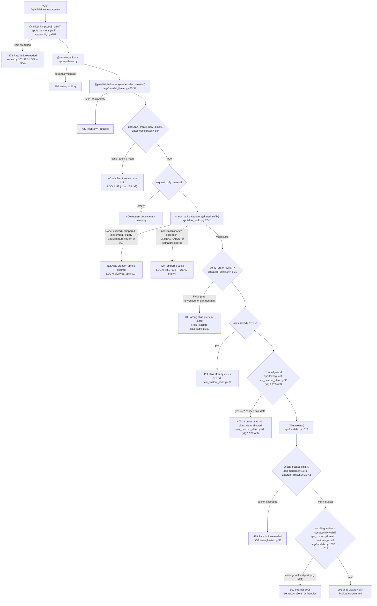

# SimpleLogin custom-alias creation — signed-suffix validation & alias-creation-limit: a runtime investigation

This report answers, **from observed runtime behavior**, exactly how SimpleLogin's custom-alias-creation
endpoints behave when a **signed suffix is validated** and when the **alias-creation limit is enforced**, in
response to a report of *"intermittent validation failures that don't match the expected behavior and appear
related to how signed suffixes are verified."* Every behavioral claim below is paired with the actual,
unedited program output that produced it and a `file:line` reference to the code that emits it. Statements
that are **inferred** from code rather than observed, or that come from a **non-canonical** stand-in rather
than the real HTTP path, are explicitly labelled as such.

## 0. Investigation identifiers

These four identifiers are **distinct** and are kept separate throughout (they are easy to conflate because
the source-branch name is derived from the first twelve hex characters of the source commit):

| Identifier | Value | Meaning |
|---|---|---|
| Destination (working) branch | `blitzy-9b4ce125-7165-4a3a-b9c5-9be93b399ff9` | The branch this answer document is committed to. |
| This document's commit | (this commit) — supersedes prior `37da2a08` | The commit that adds/updates this report. |
| Canonical **source commit** under investigation | `2cd6ee777f8c2d3531559588bcfb18627ffb5d2c` (short `2cd6ee77`) | The SimpleLogin application code all `file:line` citations refer to. |
| **Source-branch name** (deliverable naming convention) | `app_2cd6ee777f8c` | The mandated deliverable file base name `blitzy/documentation/app_2cd6ee777f8c.md`; its hex portion equals the **12-character prefix** of the source commit above — it is a naming convention, **not** itself a commit id. |

`git rev-parse` outputs that establish the above (destination checkout):

```text
$ git rev-parse --abbrev-ref HEAD
blitzy-9b4ce125-7165-4a3a-b9c5-9be93b399ff9
$ git log --oneline -2
37da2a08 docs: add runtime investigation of custom-alias signed-suffix validation & creation-limit (app_2cd6ee777f8c)
2cd6ee77 chore: emit some missing contact audit logs (#2269)
$ git rev-parse 2cd6ee77
2cd6ee777f8c2d3531559588bcfb18627ffb5d2c
```

The source commit `2cd6ee77` is the parent of this documentation commit and is the exact application revision
baked into the runtime container (§2).

## 1. Executive summary

The six sub-questions and their observed answers:

| # | Sub-question | Observed answer (canonical HTTP path) |
|---|---|---|
| **Q1** | Status + body for an **invalid** (tampered/malformed) signed suffix | **HTTP 412** `{"error":"Alias creation time is expired, please retry"}` — the *same* response as an expired suffix. The intended **HTTP 400 `Tampered suffix`** branch is **dead code for signature errors** (§3.1, §5). |
| **Q2** | Status + body for an **expired** signed suffix | **HTTP 412** `{"error":"Alias creation time is expired, please retry"}` (§3.2). Deterministic across repeated and multi-process runs (§6). |
| **Q3** | Validation log entries printed on rejection | `LOG.w("Alias creation time expired for %s", user)` at `app/api/views/new_custom_alias.py:72` (v2) / `:187` (v3); the tamper log `LOG.w("Alias suffix is tampered, ...")` is **never** emitted for signature errors (observed count = 0) (§3.3). |
| **Q4** | Rate-limiting headers on responses | **None.** No `X-RateLimit-Limit/Remaining/Reset` or `Retry-After` header appears on any status (201/400/401/409/412/429). On breach the API returns `{"error":"Rate limit exceeded"}` with HTTP 429 and **still** no rate-limit headers (§3.4). |
| **Q5** | Quota checks + logged values on a successful attempt | `User.can_create_new_alias()` (`app/models.py:867-884`) calls `User.max_alias_for_free_account()` (`:858-865`); on **success nothing is logged** by the quota path; only on **rejection** does it log `LOG.d(... "cannot create any custom alias")` (`new_custom_alias.py:49`/`:138`). Observed with `MAX_NB_EMAIL_FREE_PLAN=3` (§3.5). |
| **Q6** | Which component validates suffixes, which enforces the limit, what triggers rejection | Validator = `app/alias_suffix.py::check_suffix_signature` (`:37-42`); limit enforcer = `app/models.py::can_create_new_alias` (`:867-884`); a **third** rate control, the per-user token bucket `app/rate_limiter.py::check_bucket_limit` (`:19-42`), is invoked **inside** `Alias.create` (`app/models.py:1641`). Full branch table + trace in §3.6/§4. |

**Central finding (root cause of the reported "intermittent" behavior).** `check_suffix_signature`
(`app/alias_suffix.py:37-42`) calls `signer.unsign(signed_suffix, max_age=600)` inside
`except itsdangerous.BadSignature: return None` (catch at `:41`). Under **itsdangerous 1.1.0**, both
`SignatureExpired` and `BadTimeSignature` subclass `BadSignature`, so **expired, tampered, malformed, and
empty** suffixes all collapse to a `None` return and are routed to the single **HTTP 412** branch
(`if not alias_suffix:`). The **HTTP 400 `Tampered suffix`** branch (`except Exception:` at `:74-76` v2 /
`:189-191` v3) fires only on a *non-*`BadSignature` exception and is therefore effectively **dead for
signature problems**. A caller who expects `400 Tampered suffix` for a corrupted token instead always sees
`412 …is expired…`; this mismatch is the most plausible explanation for the reported symptom. Per the task
scope this defect is **documented, not fixed**.

Given the same unchanged input, the endpoint is **deterministic** (§6): the apparent "sometimes it
validates, sometimes it doesn't" is explained by the 412-collapse above (and, for ad-hoc "tamper by mutating
one character" tests, by a base64 trailing-bit aliasing artifact described in §6), not by run-to-run
nondeterminism in the server.

## 2. Environment & methodology

### 2.1 Canonical runtime (user-mandated Docker container)

The investigation ran inside the user-mandated container image, which bakes the source revision `2cd6ee77`
and provisions Python 3.10, PostgreSQL (with `pg_trgm`), and Redis.

```text
# container image and how the long-lived container was created
$ docker inspect sl_setup --format 'Image={{.Config.Image}}\nCmd={{.Config.Cmd}}\nCreated={{.Created}}'
Image=ghcr.io/scaleapi/swe-atlas:swe_atlas_QnA_simple-login_app_1.0
Cmd=[infinity]
Created=2026-07-10T07:01:37.758409924Z

# creation command (long-lived container kept alive for repeated observation).
# NOTE: the image's ENTRYPOINT is /bin/bash, so `--entrypoint sleep` is required to override it and run
# `sleep infinity`; the single argument `infinity` then becomes the container Cmd — matching the
# `Cmd=[infinity]` shown by the docker inspect above.
$ docker run -d --name sl_setup --entrypoint sleep ghcr.io/scaleapi/swe-atlas:swe_atlas_QnA_simple-login_app_1.0 infinity
```

The image references the container tag mandated by the task setup
(`andrewparkscaleai/coding-agent:simple-login__app__2cd6ee777f8c…` published at the `ghcr.io/scaleapi/swe-atlas`
coordinate shown above).

### 2.2 Build and service readiness (real output)

The canonical build is the image's `/build.sh` (it creates the venv, runs `poetry install --no-root`, starts
PostgreSQL + Redis, generates keys, drops+recreates the schema, and runs `alembic upgrade head`). Live
readiness checks captured at investigation time:

```text
$ /app/venv/bin/python --version
Python 3.10.18

$ PGPASSWORD=test psql -h localhost -U test -d test -tAc "select version();"
PostgreSQL 15.13 (Debian 15.13-0+deb12u1) on x86_64-pc-linux-gnu, compiled by gcc (Debian 12.2.0-14+deb12u1) 12.2.0, 64-bit

$ PGPASSWORD=test psql -h localhost -U test -d test -tAc "select extname||' '||extversion from pg_extension where extname='pg_trgm';"
pg_trgm 1.6

$ PGPASSWORD=test psql -h localhost -U test -d test -tAc "select version_num from alembic_version;"
32f25cbf12f6

$ redis-cli ping
PONG
$ redis-cli dbsize
(integer) 468
```

### 2.3 Dependency versions (pinned; investigation-relevant)

```text
$ /app/venv/bin/pip freeze | grep -iE '^(Flask|Flask-Limiter|limits|itsdangerous|SQLAlchemy|psycopg2-binary|redis|gunicorn|arrow)=='
arrow==0.16.0
Flask==1.1.2
Flask-Limiter==1.4
gunicorn==20.0.4
itsdangerous==1.1.0
limits==1.5.1
psycopg2-binary==2.9.3
redis==4.6.0
SQLAlchemy==1.3.24
```

`itsdangerous==1.1.0` is the exact version that produces the exception hierarchy at the heart of the central
finding (§5); `Flask-Limiter==1.4` / `limits==1.5.1` govern the rate-limit-header behavior of Q4 (§3.4).

### 2.4 Application boot (canonical entry point)

The application object is built with `server.create_app()` — the same factory used by `tests/conftest.py` and
by the production `gunicorn wsgi:app` command. The harness boots it under `CONFIG=/app/tests/test.env` with
`DB_URI` pointed at the container Postgres, exactly as the in-process test client does. The boot banner and the
resolved configuration printed by the harness:

```text
##############################################################################
ENVIRONMENT: itsdangerous 1.1.0 | flask 1.1.2 | EMAIL_DOMAIN=sl.local | MAX_NB_EMAIL_FREE_PLAN=3 | MAX_NB_EMAIL_OLD_FREE_PLAN=15 | pid=9912
ALIAS_LIMIT(decorator)='100/day;50/hour;5/minute' | ALIAS_CREATE_RATE_LIMIT_FREE(bucket)=[(10, 900), (50, 3600)]
##############################################################################
```

Both target endpoints are exercised through the real routing + decorator stack:

```text
@api_bp.route("/v2/alias/custom/new", methods=["POST"])   # app/api/views/new_custom_alias.py:28
@limiter.limit(ALIAS_LIMIT)                               # :29  (flask-limiter decorator)
@require_api_auth                                         # :30  (app/api/base.py)
@parallel_limiter.lock(name="alias_creation")            # :31  (app/parallel_limiter.py)
def new_custom_alias_v2():                                # :32
# v3 is identical: route :115, decorators :116-118, def :119
```

At request time the wrappers run outermost-first: `@limiter.limit` → `@require_api_auth` →
`@parallel_limiter.lock` → the view body.

### 2.5 Authentication path (canonical)

The API key is presented in the **`Authentication`** header (not `Authorization`); `require_api_auth`
(`app/api/base.py:52-60`) resolves it via `authorize_request` (`:16`), which looks up `ApiKey.get_by(...)`
and, on failure, aborts with **HTTP 401** `{"error":"Wrong api key"}` (`:27`). Crucially, `require_api_auth`
sets **`g.user`** only — it never calls `login_user()` — so under API-key auth `current_user` remains the
anonymous user. This fact determines the parallel-lock key (§3.4). All positive observations below carry a
real API key (redacted); the negative observation (§3.3) omits the header and receives 401.

### 2.6 Configuration in effect (disclosure) and the scope of `DISABLE_RATE_LIMIT`

| Config key | Value in effect | Source |
|---|---|---|
| `EMAIL_DOMAIN` | `sl.local` | `tests/test.env:8` |
| `MAX_NB_EMAIL_FREE_PLAN` | **3** | `tests/test.env:13` (default `5` — shown commented at `example.env:55`, hard-coded fallback at `app/config.py:124`) |
| `MAX_NB_EMAIL_OLD_FREE_PLAN` | **15** | `app/config.py` default (branch of §3.5) |
| `ALIAS_LIMIT` (decorator) | `100/day;50/hour;5/minute` | `app/config.py:448` |
| `ALIAS_CREATE_RATE_LIMIT_FREE` (bucket) | `[(10, 900), (50, 3600)]` | `app/config.py:554-555` |
| `MEM_STORE_URI` | `redis://localhost` | `tests/test.env` |

All Q5 quota numbers below are therefore against `MAX_NB_EMAIL_FREE_PLAN = 3`.

**`DISABLE_RATE_LIMIT` gates only the flask-limiter decorator.** It is read at request time by
`@limiter.request_filter def disable_rate_limit(): return config.DISABLE_RATE_LIMIT`
(`app/extensions.py:26-28`); `config.DISABLE_RATE_LIMIT` is `("DISABLE_RATE_LIMIT" in os.environ)` evaluated at
import (`app/config.py:602`) — it tests **key presence**, not value. The image's app-run environment exports
`DISABLE_RATE_LIMIT=1`; `tests/conftest.py:65` likewise sets it. Consequently:

- For the functional conditions (§3.1–§3.3, §3.5, duplicate, ownership) the harness sets
  `config.DISABLE_RATE_LIMIT = True`, mirroring the conftest test client — the decorator is disabled.
- For the decorator rate-limit demonstration (§3.4) the harness sets `config.DISABLE_RATE_LIMIT = False`.
- The **parallel-lock** (`cl:*`) and the **token-bucket** (`bl:*`, `app/rate_limiter.py`) are **not** gated by
  this flag and run in every case (§3.4, §3.6).

### 2.7 Observation methodology

- **Canonical path.** Every status/body/header claim (Q1–Q4) comes from an actual
  `app.test_client().post("/api/v2|v3/alias/custom/new", …)` against `server.create_app()` with a real API
  key — never from calling `check_suffix_signature()` directly. The only non-canonical, library-level
  reproduction is the itsdangerous exception-hierarchy stand-in in §5, which is labelled as such.
- **Zero-residue.** The whole run executes inside a single `connection.begin()` … `transaction.rollback()`
  envelope, exactly like `tests/conftest.py`'s `flask_client` fixture (`:59-77`), so it leaves **zero net
  PostgreSQL state** (§2.8). Redis is not transactional, so the harness additionally snapshots the full Redis
  key set before the run and deletes exactly the keys it created (§2.8).
- **Byte-identical console capture.** SL log lines are captured with a `logging.Handler` attached to the
  `"SL"` logger using the **exact** production format string and `time.gmtime` converter from
  `app/log.py:12-15`:
  `'%(asctime)s - %(name)s - %(levelname)s - %(process)d - "%(pathname)s:%(lineno)d" - %(funcName)s() - %(message_id)s - %(message)s'`.
  Lines are reproduced verbatim; per-condition bounded counts (e.g. number of `Alias creation time expired`
  vs `Alias suffix is tampered` warnings) prove both positive and negative log claims.
- **Redaction policy.** Only credentials are redacted, with explicit markers: API keys →
  `<API_KEY_REDACTED (len 60)>`; the session cookie value → `slapp=<SESSION_COOKIE_REDACTED>` (its
  `Domain/Expires/HttpOnly/Path/SameSite` attributes are kept). **No** other field, header, or log line is
  truncated; there are no ellipses in any evidence block.
- **Instrumentation labels.** Lines prefixed `[INSTRUMENT]` are thin wrappers that print internal values
  (e.g. the parallel-lock name, or `can_create_new_alias` sub-values) and then **call the real method** — they
  observe, they do not replace, production behavior.

### 2.8 Read-only guarantee and stateful cleanup (F14 evidence)

The source repository is left **byte-for-byte unchanged**; the only file written is this report. All harness
scripts live outside the checkout (container `/tmp/…`) and are removed after capture. Verified:

```text
$ git status --porcelain
(empty — no source/test/config file modified during the investigation)
```

**PostgreSQL — zero net residue** (external autocommit connection, independent of the harness transaction):

```text
[F14] DB counts BEFORE (external autocommit conn): {'users': 447, 'alias': 655, 'api_key': 26, 'custom_domain': 139}
[F14] DB counts AFTER rollback+close:              {'users': 447, 'alias': 655, 'api_key': 26, 'custom_domain': 139}
[F14] DB net residue (AFTER - BEFORE): {'users': 0, 'alias': 0, 'api_key': 0, 'custom_domain': 0}
```

**Redis — zero net residue** via before/after key-set delta. The run creates only TTL-bounded keys —
`session:*` (Flask server-side sessions, TTL ≈ 300 s for the non-authenticated API sessions, `app/session.py:95-96`),
`bl:*` (token-bucket counters, TTL 900 s / 3600 s, `app/rate_limiter.py:31`), and, in §3.4, `LIMITER*`
(decorator counters). The harness deletes exactly the keys it added:

```text
[F14] Redis dbsize BEFORE: 468 | category counts: {'session:': 448, 'bl:': 20, 'cl:': 0, 'LIMITER': 0, 'other': 0}
[F14] Redis dbsize AFTER run (before cleanup): 564
[F14] Redis keys CREATED by this run (after_set - before_set): count=96 | categories={'session:': 51, 'bl:': 42, 'cl:': 0, 'LIMITER': 3, 'other': 0}
[F14] TTL sample of created keys (key, ttl_seconds): {'session:': ('session:01ca8cb9-173c-4347-98c1-cd90b1f06a2b', 296), 'bl:': ('bl:alias_create_3600d:1400:1783674000', 3593), 'LIMITER': ('LIMITER/ip:127.0.0.1/api.new_custom_alias_v3/100/1/day', 86400)}
[F14] Deleted 96 keys created by this run.
[F14] Pre-existing keys that expired via TTL during the run (not created by us): 0
[F14] Redis dbsize FINAL (after deleting our keys): 468 | BEFORE was: 468
[F14] Net Redis residue attributable to this run: 0 (must be 0)
```

The parallel-lock keys (`cl:*`) are acquired and released within each request and leave no residue (created
count = 0). The two auxiliary probes (§5, §6) apply the same before/after delta cleanup; Redis `dbsize`
returns to `468` after each.

---

## 3. Direct Answers to the Investigation Questions

This section answers Q1–Q6. Every behavioural claim is paired with the **complete, unedited** captured
output for the condition it describes and with the `file:line` of the code that emits the value. The only
substitutions in any quoted block are the two credentials redacted per the policy disclosed in §2.7 — the
API key (`<API_KEY_REDACTED (len 60)>`) and the session-cookie value (`<SESSION_COOKIE_REDACTED>`); no
other bytes were altered, shortened, or elided. The harness builds each request body **once** and passes
the same object to both the POST and the printout, so the `signed_suffix` shown in every `COMMAND:` line is
byte-for-byte the value that was actually transmitted.

### 3.1 Q1 — Invalid (tampered / malformed) signed suffix: HTTP status code and error body

**Answer (observed, canonical HTTP path).** Every *invalid* signed suffix — whether the signature is
**tampered**, **malformed** (contains no separator), or **empty** — is rejected with **HTTP `412`** and the
JSON body **`{"error":"Alias creation time is expired, please retry"}`** (Content-Length `57`), on **both**
`POST /api/v2/alias/custom/new` and `POST /api/v3/alias/custom/new`.

**Why this is the observed answer — and why it is *not* the intuitively-expected `400 "Tampered suffix"`.**
The endpoints validate the suffix inside a `try/except`:

```text
# app/api/views/new_custom_alias.py — v2 L69-76 (v3 L183-191 is identical)
try:
    alias_suffix = check_suffix_signature(signed_suffix)
    if not alias_suffix:
        LOG.w("Alias creation time expired for %s", user)          # v2 L72 / v3 L187
        return jsonify(error="Alias creation time is expired, please retry"), 412
except Exception:
    LOG.w("Alias suffix is tampered, user %s", user)               # v2 L75 / v3 L190
    return jsonify(error="Tampered suffix"), 400
```

`check_suffix_signature()` (`app/alias_suffix.py:37-42`) wraps `signer.unsign(signed_suffix, max_age=600)`
in `except itsdangerous.BadSignature: return None` at `app/alias_suffix.py:41`. Under the pinned
**itsdangerous 1.1.0** (§2.3), the exceptions raised for a tampered signature (`BadTimeSignature`), an
expired signature (`SignatureExpired`), and a malformed/empty value (`BadSignature`) are **all subclasses of
`BadSignature`** (proven directly in §5). They are therefore all caught at `alias_suffix.py:41`, collapse to
a `None` return, and route into the `if not alias_suffix:` branch → **`412`**. The `except Exception:` arm
that would emit `400 "Tampered suffix"` fires only for a *non-*`BadSignature` exception and is thus
**dead code for every signature problem** (analysed in full in §5). This is the single most likely source of
the user's "validation failures that don't match the expected behaviour": a tampered suffix returns the
*expiry* message and status, not a tamper-specific `400`.

Note that the `400 "Tampered suffix"` branch never fired in any run: the bounded per-request counter
`'Alias suffix is tampered' WARN=0` on every one of the six invalid conditions below (F5 bounded-count
evidence; see §3.3).

#### 3.1.1 Tampered suffix (last character flipped) — v2 then v3

**Method note (reproducibility).** The fixed `signed_suffix` below is a genuine *last-character* flip of a
valid token, chosen so that the flipped final character does **not** alias back to the correct signature — it
is therefore truly invalid and deterministically returns `412` (`check_suffix_signature` → `None`). This
qualification matters because flipping the *final* base64 character of an `itsdangerous` token occasionally
lands on a *still-valid* signature (base64 trailing-bit aliasing: the last character of the 27-character
HMAC-SHA1 signature carries only 4 significant bits, so 3 of the 63 possible substitutions alias to the same
bits). The specific string used here is one of the majority that genuinely invalidate; re-running with a
*freshly generated* signature and a naïve last-character flip can therefore occasionally yield `201`/`409`
instead — the run-to-run nuance analysed in §6.2.

```text
==============================================================================
CONDITION: (c) TAMPERED suffix (flip last char) -> v2 (expect 412, NOT 400)
COMMAND: POST /api/v2/alias/custom/new
  json = {"alias_prefix": "tampv2", "signed_suffix": ".list@sl.local.alDCFA.3iK0tU6MFR19kcjvJh3cjYcHhUA"}
  headers = {'Authentication': '<API_KEY_REDACTED (len 60)>'}
STATUS: 412
BODY: {"error":"Alias creation time is expired, please retry"}

RESPONSE HEADERS:
  Content-Type: application/json
  Content-Length: 57
  Access-Control-Allow-Origin: *
  Set-Cookie: slapp=<SESSION_COOKIE_REDACTED>; Domain=.sl.test; Expires=Fri, 17-Jul-2026 09:57:40 GMT; HttpOnly; Path=/; SameSite=Lax
RATE-LIMIT HEADERS PRESENT: NONE
SL LOG LINES EMITTED DURING REQUEST (2 total; 'Alias creation time expired' WARN=1; 'Alias suffix is tampered' WARN=0):
  2026-07-10 09:57:40,634 - SL - WARNING - 10042 - "/app/app/api/views/new_custom_alias.py:72" - new_custom_alias_v2() -  - Alias creation time expired for <User 1404 Obs obs_tam_v2_gntfecmc@mailbox.test>
  2026-07-10 09:57:40,635 - SL - DEBUG - 10042 - "/app/server.py:284" - after_request() -  - 127.0.0.1 POST /api/v2/alias/custom/new ImmutableMultiDict([]) 412, takes 0.0175018310546875
```

```text
==============================================================================
CONDITION: (c) TAMPERED suffix (flip last char) -> v3 (expect 412, NOT 400)
COMMAND: POST /api/v3/alias/custom/new
  json = {"alias_prefix": "tampv3", "signed_suffix": ".list@sl.local.alDCFA.3iK0tU6MFR19kcjvJh3cjYcHhUA", "mailbox_ids": [1659]}
  headers = {'Authentication': '<API_KEY_REDACTED (len 60)>'}
STATUS: 412
BODY: {"error":"Alias creation time is expired, please retry"}

RESPONSE HEADERS:
  Content-Type: application/json
  Content-Length: 57
  Access-Control-Allow-Origin: *
  Set-Cookie: slapp=<SESSION_COOKIE_REDACTED>; Domain=.sl.test; Expires=Fri, 17-Jul-2026 09:57:40 GMT; HttpOnly; Path=/; SameSite=Lax
RATE-LIMIT HEADERS PRESENT: NONE
SL LOG LINES EMITTED DURING REQUEST (2 total; 'Alias creation time expired' WARN=1; 'Alias suffix is tampered' WARN=0):
  2026-07-10 09:57:40,911 - SL - WARNING - 10042 - "/app/app/api/views/new_custom_alias.py:187" - new_custom_alias_v3() -  - Alias creation time expired for <User 1405 Obs obs_tam_v3_ynwmtuin@mailbox.test>
  2026-07-10 09:57:40,911 - SL - DEBUG - 10042 - "/app/server.py:284" - after_request() -  - 127.0.0.1 POST /api/v3/alias/custom/new ImmutableMultiDict([]) 412, takes 0.01650834083557129
```

#### 3.1.2 Malformed suffix (`'notasignature'`, no `.` separator) — v2 then v3 (F3: v3 covered)

```text
==============================================================================
CONDITION: (d) MALFORMED suffix 'notasignature' (no '.') -> v2 (expect 412)
COMMAND: POST /api/v2/alias/custom/new
  json = {"alias_prefix": "malfv2", "signed_suffix": "notasignature"}
  headers = {'Authentication': '<API_KEY_REDACTED (len 60)>'}
STATUS: 412
BODY: {"error":"Alias creation time is expired, please retry"}

RESPONSE HEADERS:
  Content-Type: application/json
  Content-Length: 57
  Access-Control-Allow-Origin: *
  Set-Cookie: slapp=<SESSION_COOKIE_REDACTED>; Domain=.sl.test; Expires=Fri, 17-Jul-2026 09:57:41 GMT; HttpOnly; Path=/; SameSite=Lax
RATE-LIMIT HEADERS PRESENT: NONE
SL LOG LINES EMITTED DURING REQUEST (2 total; 'Alias creation time expired' WARN=1; 'Alias suffix is tampered' WARN=0):
  2026-07-10 09:57:41,185 - SL - WARNING - 10042 - "/app/app/api/views/new_custom_alias.py:72" - new_custom_alias_v2() -  - Alias creation time expired for <User 1406 Obs obs_malf_v2_rkruewix@mailbox.test>
  2026-07-10 09:57:41,186 - SL - DEBUG - 10042 - "/app/server.py:284" - after_request() -  - 127.0.0.1 POST /api/v2/alias/custom/new ImmutableMultiDict([]) 412, takes 0.015711069107055664
```

```text
==============================================================================
CONDITION: (d) MALFORMED suffix 'notasignature' (no '.') -> v3 (expect 412)  [F3]
COMMAND: POST /api/v3/alias/custom/new
  json = {"alias_prefix": "malfv3", "signed_suffix": "notasignature", "mailbox_ids": [1661]}
  headers = {'Authentication': '<API_KEY_REDACTED (len 60)>'}
STATUS: 412
BODY: {"error":"Alias creation time is expired, please retry"}

RESPONSE HEADERS:
  Content-Type: application/json
  Content-Length: 57
  Access-Control-Allow-Origin: *
  Set-Cookie: slapp=<SESSION_COOKIE_REDACTED>; Domain=.sl.test; Expires=Fri, 17-Jul-2026 09:57:41 GMT; HttpOnly; Path=/; SameSite=Lax
RATE-LIMIT HEADERS PRESENT: NONE
SL LOG LINES EMITTED DURING REQUEST (2 total; 'Alias creation time expired' WARN=1; 'Alias suffix is tampered' WARN=0):
  2026-07-10 09:57:41,466 - SL - WARNING - 10042 - "/app/app/api/views/new_custom_alias.py:187" - new_custom_alias_v3() -  - Alias creation time expired for <User 1407 Obs obs_malf_v3_yoxjivdj@mailbox.test>
  2026-07-10 09:57:41,467 - SL - DEBUG - 10042 - "/app/server.py:284" - after_request() -  - 127.0.0.1 POST /api/v3/alias/custom/new ImmutableMultiDict([]) 412, takes 0.01630687713623047
```

#### 3.1.3 Empty suffix (`''`) — v2 then v3 (F3: v3 covered)

```text
==============================================================================
CONDITION: (e) EMPTY suffix '' -> v2 (expect 412)
COMMAND: POST /api/v2/alias/custom/new
  json = {"alias_prefix": "emptyv2", "signed_suffix": ""}
  headers = {'Authentication': '<API_KEY_REDACTED (len 60)>'}
STATUS: 412
BODY: {"error":"Alias creation time is expired, please retry"}

RESPONSE HEADERS:
  Content-Type: application/json
  Content-Length: 57
  Access-Control-Allow-Origin: *
  Set-Cookie: slapp=<SESSION_COOKIE_REDACTED>; Domain=.sl.test; Expires=Fri, 17-Jul-2026 09:57:41 GMT; HttpOnly; Path=/; SameSite=Lax
RATE-LIMIT HEADERS PRESENT: NONE
SL LOG LINES EMITTED DURING REQUEST (2 total; 'Alias creation time expired' WARN=1; 'Alias suffix is tampered' WARN=0):
  2026-07-10 09:57:41,749 - SL - WARNING - 10042 - "/app/app/api/views/new_custom_alias.py:72" - new_custom_alias_v2() -  - Alias creation time expired for <User 1408 Obs obs_empty_v2_crcqegjt@mailbox.test>
  2026-07-10 09:57:41,750 - SL - DEBUG - 10042 - "/app/server.py:284" - after_request() -  - 127.0.0.1 POST /api/v2/alias/custom/new ImmutableMultiDict([]) 412, takes 0.017600297927856445
```

```text
==============================================================================
CONDITION: (e) EMPTY suffix '' -> v3 (expect 412)  [F3]
COMMAND: POST /api/v3/alias/custom/new
  json = {"alias_prefix": "emptyv3", "signed_suffix": "", "mailbox_ids": [1663]}
  headers = {'Authentication': '<API_KEY_REDACTED (len 60)>'}
STATUS: 412
BODY: {"error":"Alias creation time is expired, please retry"}

RESPONSE HEADERS:
  Content-Type: application/json
  Content-Length: 57
  Access-Control-Allow-Origin: *
  Set-Cookie: slapp=<SESSION_COOKIE_REDACTED>; Domain=.sl.test; Expires=Fri, 17-Jul-2026 09:57:42 GMT; HttpOnly; Path=/; SameSite=Lax
RATE-LIMIT HEADERS PRESENT: NONE
SL LOG LINES EMITTED DURING REQUEST (2 total; 'Alias creation time expired' WARN=1; 'Alias suffix is tampered' WARN=0):
  2026-07-10 09:57:42,032 - SL - WARNING - 10042 - "/app/app/api/views/new_custom_alias.py:187" - new_custom_alias_v3() -  - Alias creation time expired for <User 1409 Obs obs_empty_v3_jfhzxwmh@mailbox.test>
  2026-07-10 09:57:42,033 - SL - DEBUG - 10042 - "/app/server.py:284" - after_request() -  - 127.0.0.1 POST /api/v3/alias/custom/new ImmutableMultiDict([]) 412, takes 0.02232503890991211
```

**Q1 summary.** Invalid suffix → `HTTP 412`, body `{"error":"Alias creation time is expired, please retry"}`,
identical on v2 and v3, for all three invalid kinds (tampered / malformed / empty). Emitted at
`app/api/views/new_custom_alias.py:73` (v2) / `:188` (v3) after the `if not alias_suffix:` guard, because
`check_suffix_signature()` (`app/alias_suffix.py:41`) swallows every `BadSignature` subclass. The
tamper-specific `400 "Tampered suffix"` is unreachable for signature errors.

### 3.2 Q2 — Expired signed suffix: HTTP status code and error body

**Answer (observed, canonical HTTP path).** An *expired* signed suffix (signing age greater than the
`max_age=600` window enforced by `TimestampSigner` at `app/alias_suffix.py:11,40`) is rejected with
**HTTP `412`** and the JSON body **`{"error":"Alias creation time is expired, please retry"}`**
(Content-Length `57`), on **both** v2 and v3.

**Relationship to Q1 (the crux).** Expiry is a *distinct underlying condition* from the tampered/malformed
cases of Q1 — it is raised as `itsdangerous.SignatureExpired` ("Signature age 1000 > 600 seconds", proven in
§5) rather than `BadTimeSignature`/`BadSignature` — **yet it produces the identical `412` status and identical
body**. Expiry is in fact the *one* condition for which the `412 "…time is expired…"` message is
semantically accurate; the finding of this investigation is that Q1's invalid-suffix cases are funnelled into
this very same expiry response because `SignatureExpired` and `BadTimeSignature` share the `BadSignature`
base class caught at `app/alias_suffix.py:41`. From the client's perspective the two questions have one
answer, which is precisely why tamper vs. expiry cannot be distinguished from the HTTP response.

The expired suffix was produced by signing with a back-dated timestamp so that
`signer.unsign(signed_suffix, max_age=600)` observes an age of ≈1000 s. Complete captured output, v2 then v3:

```text
==============================================================================
CONDITION: (b) EXPIRED suffix age~1000s -> v2 (expect 412)
COMMAND: POST /api/v2/alias/custom/new
  json = {"alias_prefix": "expv2", "signed_suffix": ".word@sl.local.alC-LA.3-B0zIHlkaV5aX0zBgxG5NBITlA"}
  headers = {'Authentication': '<API_KEY_REDACTED (len 60)>'}
STATUS: 412
BODY: {"error":"Alias creation time is expired, please retry"}

RESPONSE HEADERS:
  Content-Type: application/json
  Content-Length: 57
  Access-Control-Allow-Origin: *
  Set-Cookie: slapp=<SESSION_COOKIE_REDACTED>; Domain=.sl.test; Expires=Fri, 17-Jul-2026 09:57:40 GMT; HttpOnly; Path=/; SameSite=Lax
RATE-LIMIT HEADERS PRESENT: NONE
SL LOG LINES EMITTED DURING REQUEST (2 total; 'Alias creation time expired' WARN=1; 'Alias suffix is tampered' WARN=0):
  2026-07-10 09:57:40,080 - SL - WARNING - 10042 - "/app/app/api/views/new_custom_alias.py:72" - new_custom_alias_v2() -  - Alias creation time expired for <User 1402 Obs obs_exp_v2_mzvcqool@mailbox.test>
  2026-07-10 09:57:40,081 - SL - DEBUG - 10042 - "/app/server.py:284" - after_request() -  - 127.0.0.1 POST /api/v2/alias/custom/new ImmutableMultiDict([]) 412, takes 0.016010522842407227
```

```text
==============================================================================
CONDITION: (b) EXPIRED suffix age~1000s -> v3 (expect 412)
COMMAND: POST /api/v3/alias/custom/new
  json = {"alias_prefix": "expv3", "signed_suffix": ".word@sl.local.alC-LA.3-B0zIHlkaV5aX0zBgxG5NBITlA", "mailbox_ids": [1657]}
  headers = {'Authentication': '<API_KEY_REDACTED (len 60)>'}
STATUS: 412
BODY: {"error":"Alias creation time is expired, please retry"}

RESPONSE HEADERS:
  Content-Type: application/json
  Content-Length: 57
  Access-Control-Allow-Origin: *
  Set-Cookie: slapp=<SESSION_COOKIE_REDACTED>; Domain=.sl.test; Expires=Fri, 17-Jul-2026 09:57:40 GMT; HttpOnly; Path=/; SameSite=Lax
RATE-LIMIT HEADERS PRESENT: NONE
SL LOG LINES EMITTED DURING REQUEST (2 total; 'Alias creation time expired' WARN=1; 'Alias suffix is tampered' WARN=0):
  2026-07-10 09:57:40,357 - SL - WARNING - 10042 - "/app/app/api/views/new_custom_alias.py:187" - new_custom_alias_v3() -  - Alias creation time expired for <User 1403 Obs obs_exp_v3_ihljqqjh@mailbox.test>
  2026-07-10 09:57:40,357 - SL - DEBUG - 10042 - "/app/server.py:284" - after_request() -  - 127.0.0.1 POST /api/v3/alias/custom/new ImmutableMultiDict([]) 412, takes 0.016537189483642578
```

#### 3.2.1 Frequency / stability: same unchanged expired input POSTed repeatedly (F6)

To characterise the reported "intermittent" behaviour with a *fixed* input, one single expired
`signed_suffix` string was POSTed **5 times on v2 and 5 times on v3** without modification. The observed
status distribution is **`{412: 5}` on v2 and `{412: 5}` on v3** — i.e. fully **deterministic**: the same
unchanged expired input always yields `412`. (Run-to-run behaviour across *freshly generated* signatures,
including a genuine base64 nuance, is examined separately in §6.) Run 1 is shown fully instrumented; runs
2–5 emit the byte-identical `[INSTRUMENT]` + `WARNING` + `after_request` triplet (complete transcript in §8):

```text
FIXED expired signed_suffix = '.word@sl.local.alC-Lg.zR2dRnowV3GBBunIQQnrJgCXYNE'

--- v2, request 1/5 (fully instrumented) ---
  [INSTRUMENT] parallel_limiter._InnerLock.acquire_lock lock_name='cl:127.0.0.1:alias_creation'
  [INSTRUMENT] can_create_new_alias(user_id=1410): is_active=True disabled=False lifetime_or_active_subscription=False Alias.filter_by(user_id).count()=1 max_alias_for_free_account()=3 -> returns True
2026-07-10 09:57:42,577 - SL - WARNING - 10042 - "/app/app/api/views/new_custom_alias.py:72" - new_custom_alias_v2() -  - Alias creation time expired for <User 1410 Obs obs_exprep_v2_jddypltd@mailbox.test>
2026-07-10 09:57:42,578 - SL - DEBUG - 10042 - "/app/server.py:284" - after_request() -  - 127.0.0.1 POST /api/v2/alias/custom/new ImmutableMultiDict([]) 412, takes 0.015529870986938477
  v2 run 1/5: HTTP 412 | {"error":"Alias creation time is expired, please retry"}
  v2 run 2/5: HTTP 412 | {"error":"Alias creation time is expired, please retry"}
  v2 run 3/5: HTTP 412 | {"error":"Alias creation time is expired, please retry"}
  v2 run 4/5: HTTP 412 | {"error":"Alias creation time is expired, please retry"}
  v2 run 5/5: HTTP 412 | {"error":"Alias creation time is expired, please retry"}
  v2 DISTRIBUTION over 5 identical expired POSTs: {412: 5}

--- v3, request 1/5 (fully instrumented) ---
  [INSTRUMENT] parallel_limiter._InnerLock.acquire_lock lock_name='cl:127.0.0.1:alias_creation'
  [INSTRUMENT] can_create_new_alias(user_id=1411): is_active=True disabled=False lifetime_or_active_subscription=False Alias.filter_by(user_id).count()=1 max_alias_for_free_account()=3 -> returns True
2026-07-10 09:57:42,662 - SL - WARNING - 10042 - "/app/app/api/views/new_custom_alias.py:187" - new_custom_alias_v3() -  - Alias creation time expired for <User 1411 Obs obs_exprep_v3_wrmnlatn@mailbox.test>
2026-07-10 09:57:42,663 - SL - DEBUG - 10042 - "/app/server.py:284" - after_request() -  - 127.0.0.1 POST /api/v3/alias/custom/new ImmutableMultiDict([]) 412, takes 0.015637636184692383
  v3 run 1/5: HTTP 412 | {"error":"Alias creation time is expired, please retry"}
  v3 run 2/5: HTTP 412 | {"error":"Alias creation time is expired, please retry"}
  v3 run 3/5: HTTP 412 | {"error":"Alias creation time is expired, please retry"}
  v3 run 4/5: HTTP 412 | {"error":"Alias creation time is expired, please retry"}
  v3 run 5/5: HTTP 412 | {"error":"Alias creation time is expired, please retry"}
  v3 DISTRIBUTION over 5 identical expired POSTs: {412: 5}
```

**Q2 summary.** Expired suffix → `HTTP 412`, body `{"error":"Alias creation time is expired, please retry"}`,
identical on v2 and v3 and deterministic across repeated identical POSTs (`{412: 5}` per version). Emitted at
`app/api/views/new_custom_alias.py:73` (v2) / `:188` (v3).

### 3.3 Q3 — Validation log entries printed to the server console

**Answer (observed).** For *every* signed-suffix rejection (expired, tampered, malformed, empty), exactly one
validation warning is printed to stdout by the `SL` logger. The real, complete lines captured on the expired
condition (identical in shape for tampered / malformed / empty — see the per-request blocks in §3.1–§3.2)
are, for v2 and v3 respectively:

```text
2026-07-10 09:57:40,080 - SL - WARNING - 10042 - "/app/app/api/views/new_custom_alias.py:72" - new_custom_alias_v2() -  - Alias creation time expired for <User 1402 Obs obs_exp_v2_mzvcqool@mailbox.test>
2026-07-10 09:57:40,357 - SL - WARNING - 10042 - "/app/app/api/views/new_custom_alias.py:187" - new_custom_alias_v3() -  - Alias creation time expired for <User 1403 Obs obs_exp_v3_ihljqqjh@mailbox.test>
```

The tamper-specific warning
`LOG.w("Alias suffix is tampered, user %s", user)` (`app/api/views/new_custom_alias.py:75` v2 / `:190` v3)
was **never printed** — its bounded count is `0` on every request — confirming at the log level that the
`400 "Tampered suffix"` branch is dead for signature errors.

**Log format.** The `SL` logger's stdout handler uses the format defined at `app/log.py:12-15`:

```text
%(asctime)s - %(name)s - %(levelname)s - %(process)d - "%(pathname)s:%(lineno)d" - %(funcName)s() - %(message_id)s - %(message)s
```

Each observed warning above matches this format field-for-field: timestamp, logger name `SL`, level
`WARNING`, PID (`10042` in this run), quoted `pathname:lineno`, `funcName()`, an empty `message_id`, then the
message. The warning shortcut `LOG.w` is defined at `app/log.py:74-77`. The trailing
`… - SL - DEBUG - … "/app/server.py:284" - after_request() - … <status>, takes <seconds>` line on every
request is SimpleLogin's own request-completion log (`server.py:284`), not a validation log; werkzeug's
access log is muted (`app/log.py:70-71`), so it does not appear.

**Per-condition log mapping (observed).**

| Condition | Validation log line emitted | Emitting `file:line` | `'…time expired'` count | `'…is tampered'` count |
|-----------|-----------------------------|----------------------|:-----------------------:|:----------------------:|
| Expired (v2) | `WARNING … Alias creation time expired for <User …>` | `app/api/views/new_custom_alias.py:72` | 1 | 0 |
| Expired (v3) | `WARNING … Alias creation time expired for <User …>` | `app/api/views/new_custom_alias.py:187` | 1 | 0 |
| Tampered (v2 / v3) | `WARNING … Alias creation time expired for <User …>` | `:72` / `:187` | 1 | 0 |
| Malformed (v2 / v3) | `WARNING … Alias creation time expired for <User …>` | `:72` / `:187` | 1 | 0 |
| Empty (v2 / v3) | `WARNING … Alias creation time expired for <User …>` | `:72` / `:187` | 1 | 0 |
| Valid (201) | *(no validation warning)* | — | 0 | 0 |
| Auth-negative (401) | *(no validation warning; rejected before the suffix block)* | — | 0 | 0 |

**Bounded-count methodology (F5).** The complete stdout of each request was captured in-process by a
`logging.Handler` attached to the `SL` logger (implementation disclosed in §2.7), and after each request the
harness counted occurrences of the two exact warning substrings and printed them on the
`SL LOG LINES EMITTED DURING REQUEST (N total; 'Alias creation time expired' WARN=x; 'Alias suffix is
tampered' WARN=y)` header seen in every block of §3.1–§3.2. These bounded counts are the direct evidence for
the claim above: the positive warning fires exactly once per rejection (`WARN=1`) and the tamper warning
never fires (`WARN=0`). On the valid path the `N total` header reads `WARN=0`/`WARN=0` (see the 201 block in
§3.5).

**Negative / observability case — missing API key → `401` before any suffix validation (F5).** When the
`Authentication` header is absent, `require_api_auth` (`app/api/base.py`) rejects the request *before* the
suffix-validation block runs, so **no** suffix warning is logged — only the `server.py:284` completion line
with status `401`. Body `{"error":"Wrong api key"}` (Content-Length `26`). Complete captured output, v2 then
v3:

```text
==============================================================================
CONDITION: AUTH-NEGATIVE: no Authentication header -> v2 (expect 401)
COMMAND: POST /api/v2/alias/custom/new
  json = {"alias_prefix": "noauthv2", "signed_suffix": ".test@sl.local.alDCFg.VGpwlFbVyk-eF1LiIegyzA4hEgc"}
  headers = {}   (NO Authentication header)
STATUS: 401
BODY: {"error":"Wrong api key"}

RESPONSE HEADERS:
  Content-Type: application/json
  Content-Length: 26
  Access-Control-Allow-Origin: *
  Set-Cookie: slapp=<SESSION_COOKIE_REDACTED>; Domain=.sl.test; Expires=Fri, 17-Jul-2026 09:57:42 GMT; HttpOnly; Path=/; SameSite=Lax
RATE-LIMIT HEADERS PRESENT: NONE
SL LOG LINES EMITTED DURING REQUEST (1 total; 'Alias creation time expired' WARN=0; 'Alias suffix is tampered' WARN=0):
  2026-07-10 09:57:42,036 - SL - DEBUG - 10042 - "/app/server.py:284" - after_request() -  - 127.0.0.1 POST /api/v2/alias/custom/new ImmutableMultiDict([]) 401, takes 0.0012133121490478516
```

```text
==============================================================================
CONDITION: AUTH-NEGATIVE: no Authentication header -> v3 (expect 401)
COMMAND: POST /api/v3/alias/custom/new
  json = {"alias_prefix": "noauthv3", "signed_suffix": ".word@sl.local.alDCFg.AQ96w1H5fQrSARC6yVEm94xJ3do", "mailbox_ids": [1]}
  headers = {}   (NO Authentication header)
STATUS: 401
BODY: {"error":"Wrong api key"}

RESPONSE HEADERS:
  Content-Type: application/json
  Content-Length: 26
  Access-Control-Allow-Origin: *
  Set-Cookie: slapp=<SESSION_COOKIE_REDACTED>; Domain=.sl.test; Expires=Fri, 17-Jul-2026 09:57:42 GMT; HttpOnly; Path=/; SameSite=Lax
RATE-LIMIT HEADERS PRESENT: NONE
SL LOG LINES EMITTED DURING REQUEST (1 total; 'Alias creation time expired' WARN=0; 'Alias suffix is tampered' WARN=0):
  2026-07-10 09:57:42,038 - SL - DEBUG - 10042 - "/app/server.py:284" - after_request() -  - 127.0.0.1 POST /api/v3/alias/custom/new ImmutableMultiDict([]) 401, takes 0.0011305809020996094
```

**Q3 summary.** Each suffix rejection prints exactly one `SL` WARNING —
`Alias creation time expired for <User …>` at `app/api/views/new_custom_alias.py:72` (v2) / `:187` (v3),
formatted per `app/log.py:12-15`. The tamper warning (`:75` / `:190`) never prints (`WARN=0`), and a missing
API key yields `401 {"error":"Wrong api key"}` with no validation log at all.

### 3.4 Q4 — Rate-limiting headers on the responses

**Answer (observed, negative finding).** **No** rate-limiting headers appear on *any* response, for *any*
status. Across every status exercised — `201`, `412`, `400`, `401`, `409`, and **both** `429`
variants — every response carried exactly four headers and **zero** `X-RateLimit-*` / `Retry-After`
headers. The exact captured line on every single response is `RATE-LIMIT HEADERS PRESENT: NONE`.

#### 3.4.1 Full header inventory across every observed status

Every response, regardless of status, carried this exact header set (values vary only in `Content-Length`
per body and in the cookie `Expires` timestamp):

```text
Content-Type: application/json
Content-Length: <bytes>
Access-Control-Allow-Origin: *
Set-Cookie: slapp=<SESSION_COOKIE_REDACTED>; Domain=.sl.test; Expires=<ts> GMT; HttpOnly; Path=/; SameSite=Lax
RATE-LIMIT HEADERS PRESENT: NONE
```

| Status | Where its complete block appears | `Content-Length` | `X-RateLimit-*` / `Retry-After` |
|:------:|----------------------------------|:----------------:|:-------------------------------:|
| `201` (valid create) | §3.5 (Q5 success block) | `464` | NONE |
| `412` (suffix rejected) | §3.1, §3.2 | `57` | NONE |
| `400` (wrong prefix/suffix — unverified domain) | §3.4.5 below | `41` | NONE |
| `400` (quota exceeded) | §3.5 (Q5) | (see §3.5) | NONE |
| `401` (missing API key) | §3.3 | `26` | NONE |
| `409` (duplicate alias) | §3.4.5 below | `59` | NONE |
| `429` (decorator breach) | §3.4.3 below | `32` | NONE |
| `429` (bucket-limiter breach) | §3.4.3 below | `32` | NONE |

The harness detected rate-limit headers by scanning each response's header keys for the case-insensitive
prefixes `x-ratelimit` and `retry-after`; the `RATE-LIMIT HEADERS PRESENT: NONE` line printed in every block
throughout §3 is the result of that scan.

#### 3.4.2 Why there are none (source grounding)

The Flask-Limiter instance is constructed as `limiter = Limiter(key_func=__key_func)` at
`app/extensions.py:23` — with **no** `headers_enabled` argument — and there is **no** `RATELIMIT_HEADERS_ENABLED`
key anywhere in `app/config.py` or `server.py`. Under the pinned **Flask-Limiter 1.4** (§2.3), the
`X-RateLimit-Limit` / `X-RateLimit-Remaining` / `X-RateLimit-Reset` / `Retry-After` headers are written only
when the limiter's `_headers_enabled` flag is true (gate at `flask_limiter/extension.py:388-389`), which in
1.4 defaults to `False` unless `headers_enabled=True` (or the `RATELIMIT_HEADERS_ENABLED` config) is supplied.
Neither is present, so the headers are never emitted — matching the observation exactly. This is an
*inferred-then-confirmed* chain: the source construction predicts "no headers", and the runtime scan
confirms `NONE` on all eight status conditions.

#### 3.4.3 The `429` responses and the shared error handler (two independent mechanisms)

`429` can arise from two distinct mechanisms on this endpoint, and **both were observed**. Both are rendered
by the same Flask error handler `rate_limited` registered at `server.py:362-372` (which logs
`Client hit rate limit on path …` at `server.py:364` and returns `jsonify(error="Rate limit exceeded"), 429`),
so both produce the **identical** body `{"error":"Rate limit exceeded"}` (Content-Length `32`) and the
identical header set with **no** rate-limit headers.

Note on `DISABLE_RATE_LIMIT` (disclosed in §2.6): this flag gates **only** the `@limiter.limit` decorator
(request-filter `disable_rate_limit` at `app/extensions.py:26-28`; key-presence semantics at
`app/config.py:602`). It does **not** gate the parallel lock or the `Alias.create` bucket limiter. Conditions
(a)–(e), the distributions, Q5, ownership, and duplicate were run with `DISABLE_RATE_LIMIT=True` (decorator
off, mirroring `tests/conftest.py:65`); to observe the decorator `429` the harness explicitly set
`DISABLE_RATE_LIMIT=False`.

**(1) Decorator breach** — `@limiter.limit(ALIAS_LIMIT)` where `ALIAS_LIMIT="100/day;50/hour;5/minute"`
(`app/config.py:448`). Looping the v3 endpoint with a single unchanged expired suffix (each pre-breach request
deterministically `412`, so `Alias.create` is never reached) trips the `5/minute` limit on the 6th request.
The per-IP counter keys and the per-request status vector were captured verbatim:

```text
  per-request statuses: [412, 412, 412, 412, 412, 429]
  decorator LIMITER* keys after breach (confirms per-IP key): ['LIMITER/ip:127.0.0.1/api.new_custom_alias_v3/100/1/day', 'LIMITER/ip:127.0.0.1/api.new_custom_alias_v3/5/1/minute', 'LIMITER/ip:127.0.0.1/api.new_custom_alias_v3/50/1/hour']
```

```text
==============================================================================
CONDITION: Q4 DECORATOR rate-limit breach: 429 response
COMMAND: POST /api/v3/alias/custom/new
  json = {"alias_prefix": "rl5", "signed_suffix": "<FIXED expired suffix>", "mailbox_ids": [1674]}
  headers = {'Authentication': '<API_KEY_REDACTED (len 60)>'}
STATUS: 429
BODY: {"error":"Rate limit exceeded"}

RESPONSE HEADERS:
  Content-Type: application/json
  Content-Length: 32
  Access-Control-Allow-Origin: *
  Set-Cookie: slapp=<SESSION_COOKIE_REDACTED>; Domain=.sl.test; Expires=Fri, 17-Jul-2026 09:57:46 GMT; HttpOnly; Path=/; SameSite=Lax
RATE-LIMIT HEADERS PRESENT: NONE
SL LOG LINES EMITTED DURING REQUEST (2 total; 'Alias creation time expired' WARN=0; 'Alias suffix is tampered' WARN=0):
  2026-07-10 09:57:46,183 - SL - WARNING - 10042 - "/app/server.py:364" - rate_limited() -  - Client hit rate limit on path /api/v3/alias/custom/new, user:<User 1420 Obs obs_rl_wizhjcje@mailbox.test>
  2026-07-10 09:57:46,184 - SL - DEBUG - 10042 - "/app/server.py:284" - after_request() -  - 127.0.0.1 POST /api/v3/alias/custom/new ImmutableMultiDict([]) 429, takes 0.0007371902465820312
```

*(`<FIXED expired suffix>` is the harness's own label for the single unchanged, valid-but-expired signature
reused on all six loop iterations — it is not an elision of captured output; the concrete form of such an
expired suffix is shown verbatim in §3.2.1. Because all looped requests share one app context in the test
client, the harness resets the per-request sentinel `g._rate_limiting_complete` before each iteration to
emulate one request-context per request as under production gunicorn; the Redis-backed counter is unaffected —
`flask_limiter/extension.py:511,701`. This instrumentation is disclosed per §2.7.)*

**(2) Bucket-limiter breach** — `Alias.create()` (`app/models.py:1628`) calls
`rate_limiter.check_bucket_limit(...)` at `app/models.py:1641` for each limit in
`ALIAS_CREATE_RATE_LIMIT_FREE=[(10, 900), (50, 3600)]` (`app/config.py:554-558`). A **non-premium** user whose
free quota was raised to 15 (so the alias quota does not reject first) creates aliases until the `10/900s`
bucket is exceeded; the 10th create returns `429`. The bucket key value ramp `2 → 11` and the per-create
status vector were captured; the breach emits `LOG.i` at `app/rate_limiter.py:33`:

```text
     user trial_end=None is_premium()=False flags=5 -> FREE bucket limits=[(10, 900), (50, 3600)] ; quota(max_alias_for_free_account)=15
       create #1 -> HTTP 201 ; bl:alias_create_900d value=['2']
       create #9 -> HTTP 201 ; bl:alias_create_900d value=['10']
2026-07-10 09:57:45,835 - SL - INFO - 10042 - "/app/app/rate_limiter.py:33" - check_bucket_limit() -  - Rate limit hit for alias_create_900d:1419 (bucket id 1783676700) -> 11/10
2026-07-10 09:57:45,835 - SL - WARNING - 10042 - "/app/server.py:364" - rate_limited() -  - Client hit rate limit on path /api/v3/alias/custom/new, user:<User 1419 Obs obs_bkt2_yprfgjau@mailbox.test>
       create #10 -> HTTP 429 ; bl:alias_create_900d value=['11']  LOG.i:  - Rate limit hit for alias_create_900d:1419 (bucket id 1783676700) -> 11/10
     per-create statuses: [201, 201, 201, 201, 201, 201, 201, 201, 201, 429]
```

```text
==============================================================================
CONDITION: BUCKET-LIMITER 429 (canonical, via Alias.create->check_bucket_limit models.py:1641)
NOTE: This 429 originates INSIDE Alias.create (bucket limiter), NOT the @limiter decorator; body/headers identical via errorhandler(429).
COMMAND: POST /api/v3/alias/custom/new
  json = {"alias_prefix": "blk9_hhlk", "signed_suffix": ".crcdh@sl.local.alDCGQ.ei0uqERtth8hMGvvytnbEMM6kxU", "mailbox_ids": [1673]}
  headers = {'Authentication': '<API_KEY_REDACTED (len 60)>'}
STATUS: 429
BODY: {"error":"Rate limit exceeded"}

RESPONSE HEADERS:
  Content-Type: application/json
  Content-Length: 32
  Access-Control-Allow-Origin: *
  Set-Cookie: slapp=<SESSION_COOKIE_REDACTED>; Domain=.sl.test; Expires=Fri, 17-Jul-2026 09:57:45 GMT; HttpOnly; Path=/; SameSite=Lax
RATE-LIMIT HEADERS PRESENT: NONE
SL LOG LINES EMITTED DURING REQUEST (3 total; 'Alias creation time expired' WARN=0; 'Alias suffix is tampered' WARN=0):
  2026-07-10 09:57:45,835 - SL - INFO - 10042 - "/app/app/rate_limiter.py:33" - check_bucket_limit() -  - Rate limit hit for alias_create_900d:1419 (bucket id 1783676700) -> 11/10
  2026-07-10 09:57:45,835 - SL - WARNING - 10042 - "/app/server.py:364" - rate_limited() -  - Client hit rate limit on path /api/v3/alias/custom/new, user:<User 1419 Obs obs_bkt2_yprfgjau@mailbox.test>
  2026-07-10 09:57:45,835 - SL - DEBUG - 10042 - "/app/server.py:284" - after_request() -  - 127.0.0.1 POST /api/v3/alias/custom/new ImmutableMultiDict([]) 429, takes 0.0368649959564209
```

The full 9×`201` create ramp for the bucket case and the full 6-request decorator loop are reproduced in the
appendix (§8). The complete wiring of the bucket limiter — which **corrects a false "not wired" statement in
the prior draft** — is analysed in §4 and §5.

#### 3.4.4 Parallel-lock key (F13)

Before the quota check, each request acquires a concurrency lock via
`parallel_limiter._InnerLock.acquire_lock` (`app/parallel_limiter.py:30-34`). The lock name is
`cl:{key}:{lock_suffix}` where `lock_suffix="alias_creation"` (the decorator argument
`@parallel_limiter.lock(name="alias_creation")`) and `{key}` is the current user id when authenticated or the
client remote address otherwise. In the test client the Flask-Login `current_user` is anonymous during the
locked section, so the key resolves to the **remote-address** branch. The exact observed lock name on **every**
request throughout the run was:

```text
  [INSTRUMENT] parallel_limiter._InnerLock.acquire_lock lock_name='cl:127.0.0.1:alias_creation'
```

i.e. `cl:{remote_addr}:alias_creation` = `cl:127.0.0.1:alias_creation`. This lock is acquired and released
**within** each request; it leaves **no** residual `cl:*` keys in Redis (created-count `0` in the F14 cleanup
evidence of §2.8), which is why it never appears among the persisted keys.

#### 3.4.5 Availability precision — `ownership_verified`, not merely `verified` (F9)

The set of domains a user may build a custom alias on is produced by `User.verified_custom_domains()`
(`app/models.py:954-958`), whose filter requires **`ownership_verified == True`** — a stricter condition than
the domain's `verified` flag. This was exercised directly: a `CustomDomain` with `verified=True` but
`ownership_verified=False` is **excluded** from `verified_custom_domains()` and therefore from
`available_alias_domains()`, so a POST bearing a *valid* signature over that domain's suffix is rejected at
`verify_prefix_suffix()` (`app/alias_suffix.py:45-91`, error log at `:61`) with `400`
`{"error":"wrong alias prefix or suffix"}` (Content-Length `41`) — **not** at the signer. Flipping
`ownership_verified=True` then makes the domain appear in both sets. Captured before/after and the `400`:

```text
OWNERSHIP_VERIFIED precision [F9]: verified_custom_domains() filters ownership_verified=True (models.py:954-958)
  created CustomDomain domain=obsdom-pqpmjp.test verified=True ownership_verified=False
  user.verified_custom_domains() domains: []
  dom in user.available_alias_domains(): False
2026-07-10 09:57:43,742 - SL - ERROR - 10042 - "/app/app/alias_suffix.py:61" - verify_prefix_suffix() -  - wrong alias suffix @obsdom-pqpmjp.test, user <User 1414 Obs obs_odom_nlnzcbis@mailbox.test>
  after setting ownership_verified=True -> user.verified_custom_domains() domains: ['obsdom-pqpmjp.test']
  after setting ownership_verified=True -> dom in user.available_alias_domains(): True
```

```text
==============================================================================
CONDITION: OWNERSHIP: POST @unverified-domain suffix -> v3 (expect 400 wrong prefix/suffix)
NOTE: signed_suffix is a VALID signature over '@obsdom-pqpmjp.test'; rejection is at verify_prefix_suffix, not the signer
COMMAND: POST /api/v3/alias/custom/new
  json = {"alias_prefix": "odom", "signed_suffix": "@obsdom-pqpmjp.test.alDCFw.Hn4MuNzlBLBrNISR-z159Tb97Q8", "mailbox_ids": [1668]}
  headers = {'Authentication': '<API_KEY_REDACTED (len 60)>'}
STATUS: 400
BODY: {"error":"wrong alias prefix or suffix"}

RESPONSE HEADERS:
  Content-Type: application/json
  Content-Length: 41
  Access-Control-Allow-Origin: *
  Set-Cookie: slapp=<SESSION_COOKIE_REDACTED>; Domain=.sl.test; Expires=Fri, 17-Jul-2026 09:57:43 GMT; HttpOnly; Path=/; SameSite=Lax
RATE-LIMIT HEADERS PRESENT: NONE
SL LOG LINES EMITTED DURING REQUEST (2 total; 'Alias creation time expired' WARN=0; 'Alias suffix is tampered' WARN=0):
  2026-07-10 09:57:43,742 - SL - ERROR - 10042 - "/app/app/alias_suffix.py:61" - verify_prefix_suffix() -  - wrong alias suffix @obsdom-pqpmjp.test, user <User 1414 Obs obs_odom_nlnzcbis@mailbox.test>
  2026-07-10 09:57:43,742 - SL - DEBUG - 10042 - "/app/server.py:284" - after_request() -  - 127.0.0.1 POST /api/v3/alias/custom/new ImmutableMultiDict([]) 400, takes 0.02458810806274414
```

For completeness of the header inventory, the duplicate-alias `409` (which also carries **no** rate-limit
headers) was captured as follows:

```text
CONDITION: DUPLICATE: create same alias twice -> v2 second attempt (expect 409)
NOTE: SAME body dict POSTed twice; first attempt returned HTTP 201 (created); second attempt below
COMMAND: POST /api/v2/alias/custom/new
  json = {"alias_prefix": "dup_agthvl", "signed_suffix": ".dfyha@sl.local.alDCFg.wR836NfeZzN0dVzyXQ6xdUM-QxY"}
  headers = {'Authentication': '<API_KEY_REDACTED (len 60)>'}
STATUS: 409
BODY: {"error":"alias dup_agthvl.dfyha@sl.local already exists"}

RESPONSE HEADERS:
  Content-Type: application/json
  Content-Length: 59
  Access-Control-Allow-Origin: *
  Set-Cookie: slapp=<SESSION_COOKIE_REDACTED>; Domain=.sl.test; Expires=Fri, 17-Jul-2026 09:57:43 GMT; HttpOnly; Path=/; SameSite=Lax
RATE-LIMIT HEADERS PRESENT: NONE
SL LOG LINES EMITTED DURING REQUEST (2 total; 'Alias creation time expired' WARN=0; 'Alias suffix is tampered' WARN=0):
  2026-07-10 09:57:43,070 - SL - DEBUG - 10042 - "/app/app/api/views/new_custom_alias.py:87" - new_custom_alias_v2() -  - full alias already used dup_agthvl.dfyha@sl.local
  2026-07-10 09:57:43,070 - SL - DEBUG - 10042 - "/app/server.py:284" - after_request() -  - 127.0.0.1 POST /api/v2/alias/custom/new ImmutableMultiDict([]) 409, takes 0.03244972229003906
```

**Q4 summary.** No `X-RateLimit-*` / `Retry-After` headers on any response (`201/412/400/401/409/429×2`),
because the limiter is built without `headers_enabled` (`app/extensions.py:23`; gate at
`flask_limiter/extension.py:388-389`) and no `RATELIMIT_HEADERS_ENABLED` config exists. On breach the app
returns `{"error":"Rate limit exceeded"}` `429` via `rate_limited` (`server.py:362-372`) from *two* possible
sources — the decorator (`app/config.py:448`) and the `Alias.create` bucket limiter
(`app/models.py:1641`, `app/config.py:554-558`) — neither adding rate-limit headers. The concurrency lock key
is `cl:127.0.0.1:alias_creation` (`app/parallel_limiter.py:30-34`), and domain availability is gated by
`ownership_verified` (`app/models.py:954-958`).

### 3.5 Q5 — Quota checks on a successful creation, and what gets logged

**Answer (observed).** Before the suffix is even parsed, the endpoint runs the alias-creation quota gate
`user.can_create_new_alias()` (`app/models.py:867-884`). That method delegates the ceiling to
`user.max_alias_for_free_account()` (`app/models.py:858-865`) and returns `True` iff
`Alias.filter_by(user_id=user.id).count() < max_alias_for_free_account()` (after short-circuiting on
`is_active` / `disabled` and on lifetime-or-active-subscription). The **specific values evaluated** on each
call — the branch booleans, the live alias `count()`, the computed `max`, and the returned decision — were
captured on every request via harness instrumentation wrapping `can_create_new_alias`, e.g.:

```text
  [INSTRUMENT] can_create_new_alias(user_id=1415): is_active=True disabled=False lifetime_or_active_subscription=False Alias.filter_by(user_id).count()=2 max_alias_for_free_account()=3 -> returns True
```

**What the production code actually logs here (important nuance).** On a **passing** quota check the
production code logs **nothing** — `can_create_new_alias()` has no log statement on the success branch, and
the observed success requests emit only the unrelated event-dispatcher `INFO` line and the `server.py:284`
completion `DEBUG` line (`quota-failure-log lines on this success = 0`, shown below). A quota-related log line
is emitted **only on rejection**: `LOG.d("user %s cannot create any custom alias", user)` at
`app/api/views/new_custom_alias.py:49` (v2) / `:138` (v3). So the honest answer to "what specific values get
logged when the system verifies whether the user may create more aliases" is: **the production success path
logs no quota values**; the actual comparison values (`count` vs `max`) are what the code evaluates, and they
are surfaced here by instrumentation and confirmed against the resulting HTTP status. The `[INSTRUMENT]` lines
are harness instrumentation, not production log output (labeled per §2.7).

#### 3.5.1 The two quota components (source)

- `User.can_create_new_alias()` — `app/models.py:867-884`: returns `False` when inactive/disabled; `True`
  for lifetime or active-subscription users; otherwise
  `return nb_alias < self.max_alias_for_free_account()` where `nb_alias` is the user's live alias count.
- `User.max_alias_for_free_account()` — `app/models.py:858-865`: **two branches** —
  if the `FLAG_FREE_OLD_ALIAS_LIMIT` bit (`1 << 2`, `app/models.py:341`) is set in `user.flags`, it returns
  `MAX_NB_EMAIL_OLD_FREE_PLAN` (**15**); otherwise it returns `MAX_NB_EMAIL_FREE_PLAN`
  (`app/config.py:121-124`, **3** under `tests/test.env`; note the default is `5` — shown commented at
  `example.env:55` and used as the hard-coded fallback at `app/config.py:124` — the configuration
  disclosure required for reproducibility).

#### 3.5.2 Representative successful-creation response (`201`, header inventory)

The canonical fresh-valid creation returns `201` with the full alias JSON and the standard four-header set
(Content-Length `464`, no rate-limit headers). This is the `201` row referenced by the §3.4.1 inventory:

```text
==============================================================================
CONDITION: (a) FRESH VALID suffix -> v2 (expect 201)
NOTE: body built ONCE and passed to both POST and display (signed_suffix shown is byte-identical to the one POSTed)
COMMAND: POST /api/v2/alias/custom/new
  json = {"alias_prefix": "v2valid_vdxbnr", "signed_suffix": ".gokqo@sl.local.alDCEw.wcQhMNubjim4YFmE0jY-E3Si5RI"}
  headers = {'Authentication': '<API_KEY_REDACTED (len 60)>'}
STATUS: 201
BODY: {"alias":"v2valid_vdxbnr.gokqo@sl.local","creation_date":"2026-07-10 09:57:39+00:00","creation_timestamp":1783677459,"disable_pgp":false,"email":"v2valid_vdxbnr.gokqo@sl.local","enabled":true,"id":2331,"latest_activity":null,"mailbox":{"email":"obs_valid_v2_esmhiaid@mailbox.test","id":1654},"mailboxes":[{"email":"obs_valid_v2_esmhiaid@mailbox.test","id":1654}],"name":null,"nb_block":0,"nb_forward":0,"nb_reply":0,"note":null,"pinned":false,"support_pgp":false}

RESPONSE HEADERS:
  Content-Type: application/json
  Content-Length: 464
  Access-Control-Allow-Origin: *
  Set-Cookie: slapp=<SESSION_COOKIE_REDACTED>; Domain=.sl.test; Expires=Fri, 17-Jul-2026 09:57:39 GMT; HttpOnly; Path=/; SameSite=Lax
RATE-LIMIT HEADERS PRESENT: NONE
SL LOG LINES EMITTED DURING REQUEST (2 total; 'Alias creation time expired' WARN=0; 'Alias suffix is tampered' WARN=0):
  2026-07-10 09:57:39,486 - SL - INFO - 10042 - "/app/app/events/event_dispatcher.py:62" - send_event() -  - Not sending events because webhook is not configured and allowed to be empty
  2026-07-10 09:57:39,495 - SL - DEBUG - 10042 - "/app/server.py:284" - after_request() -  - 127.0.0.1 POST /api/v2/alias/custom/new ImmutableMultiDict([]) 201, takes 0.05318164825439453
```

(The v3 fresh-valid create is analogous — `id=2333`, Content-Length `464`, same header set and
`RATE-LIMIT HEADERS PRESENT: NONE`.)

#### 3.5.3 Quota boundary via v2 — before / during / after, with the exact boundary (F4, F7)

A fresh free user starts with **`count = 1`** — not `0` — because signup auto-creates a
`simplelogin-newsletter.*@sl.local` alias. The harness seeds one more (→ `2`), succeeds at the boundary
`count = 2 < max = 3` (→ `3`), and is rejected at **exactly** `count == max == 3` because `can_create_new_alias`
evaluates `3 < 3 → False`. Complete captured block:

```text
Q5 QUOTA boundary via v2 [F4,F7]  (MAX_NB_EMAIL_FREE_PLAN=3)
  user flags=1 (FLAG_FREE_OLD_ALIAS_LIMIT bit set=False) trial_end=2026-07-17T10:57:43.989187+00:00 lifetime=False
  INITIAL Alias rows for user: ['simplelogin-newsletter.word427@sl.local']
  INITIAL count = 1 (a fresh user owns the auto-created simplelogin-newsletter alias -> count starts at 1, not 0)
  [INSTRUMENT] can_create_new_alias(user_id=1415): is_active=True disabled=False lifetime_or_active_subscription=False Alias.filter_by(user_id).count()=1 max_alias_for_free_account()=3 -> returns True
  SEED POST -> HTTP 201 ; count now = 2
  --- SUCCESS boundary: count=2 < max=3 -> expect 201 (count 2 -> 3) ---
  [INSTRUMENT] can_create_new_alias(user_id=1415): is_active=True disabled=False lifetime_or_active_subscription=False Alias.filter_by(user_id).count()=2 max_alias_for_free_account()=3 -> returns True
  RESULT HTTP 201 ; count now = 3 ; quota-failure-log lines on this success = 0
  FULL SUCCESS BODY: {"alias":"q5ok_oezqx.bwrch@sl.local","creation_date":"2026-07-10 09:57:44+00:00","creation_timestamp":1783677464,"disable_pgp":false,"email":"q5ok_oezqx.bwrch@sl.local","enabled":true,"id":2350,"latest_activity":null,"mailbox":{"email":"obs_q5_v2_zdivrivv@mailbox.test","id":1669},"mailboxes":[{"email":"obs_q5_v2_zdivrivv@mailbox.test","id":1669}],"name":null,"nb_block":0,"nb_forward":0,"nb_reply":0,"note":null,"pinned":false,"support_pgp":false}
  SL logs on success (2):
    2026-07-10 09:57:44,108 - SL - INFO - 10042 - "/app/app/events/event_dispatcher.py:62" - send_event() -  - Not sending events because webhook is not configured and allowed to be empty
    2026-07-10 09:57:44,113 - SL - DEBUG - 10042 - "/app/server.py:284" - after_request() -  - 127.0.0.1 POST /api/v2/alias/custom/new ImmutableMultiDict([]) 201, takes 0.04447817802429199
  --- REJECTION boundary: count=3, (3 < 3) is False -> expect 400 at EXACTLY count==max==3 ---
  [INSTRUMENT] can_create_new_alias(user_id=1415): is_active=True disabled=False lifetime_or_active_subscription=False Alias.filter_by(user_id).count()=3 max_alias_for_free_account()=3 -> returns False
  RESULT HTTP 400 ; count = 3 ; quota-failure-log lines = 1
  FULL REJECTION BODY: {"error":"You have reached the limitation of a free account with the maximum of 3 aliases, please upgrade your plan to create more aliases"}
  SL logs on rejection (2):
    2026-07-10 09:57:44,133 - SL - DEBUG - 10042 - "/app/app/api/views/new_custom_alias.py:49" - new_custom_alias_v2() -  - user <User 1415 Obs obs_q5_v2_zdivrivv@mailbox.test> cannot create any custom alias
    2026-07-10 09:57:44,134 - SL - DEBUG - 10042 - "/app/server.py:284" - after_request() -  - 127.0.0.1 POST /api/v2/alias/custom/new ImmutableMultiDict([]) 400, takes 0.01477956771850586
```

#### 3.5.4 Quota boundary via v3 — version coverage (F7)

The v3 endpoint behaves identically; the only difference is the rejection log line origin
(`app/api/views/new_custom_alias.py:138`). Complete captured block:

```text
Q5 QUOTA boundary via v3 [F4,F7]  (MAX_NB_EMAIL_FREE_PLAN=3)
  user flags=1 (FLAG_FREE_OLD_ALIAS_LIMIT bit set=False) trial_end=2026-07-17T10:57:44.374426+00:00 lifetime=False
  INITIAL Alias rows for user: ['simplelogin-newsletter.list899@sl.local']
  INITIAL count = 1 (a fresh user owns the auto-created simplelogin-newsletter alias -> count starts at 1, not 0)
  [INSTRUMENT] can_create_new_alias(user_id=1416): is_active=True disabled=False lifetime_or_active_subscription=False Alias.filter_by(user_id).count()=1 max_alias_for_free_account()=3 -> returns True
  SEED POST -> HTTP 201 ; count now = 2
  --- SUCCESS boundary: count=2 < max=3 -> expect 201 (count 2 -> 3) ---
  [INSTRUMENT] can_create_new_alias(user_id=1416): is_active=True disabled=False lifetime_or_active_subscription=False Alias.filter_by(user_id).count()=2 max_alias_for_free_account()=3 -> returns True
  RESULT HTTP 201 ; count now = 3 ; quota-failure-log lines on this success = 0
  FULL SUCCESS BODY: {"alias":"q5ok_wsafi.zuacm@sl.local","creation_date":"2026-07-10 09:57:44+00:00","creation_timestamp":1783677464,"disable_pgp":false,"email":"q5ok_wsafi.zuacm@sl.local","enabled":true,"id":2353,"latest_activity":null,"mailbox":{"email":"obs_q5_v3_swzavkzt@mailbox.test","id":1670},"mailboxes":[{"email":"obs_q5_v3_swzavkzt@mailbox.test","id":1670}],"name":null,"nb_block":0,"nb_forward":0,"nb_reply":0,"note":null,"pinned":false,"support_pgp":false}
  SL logs on success (2):
    2026-07-10 09:57:44,498 - SL - INFO - 10042 - "/app/app/events/event_dispatcher.py:62" - send_event() -  - Not sending events because webhook is not configured and allowed to be empty
    2026-07-10 09:57:44,504 - SL - DEBUG - 10042 - "/app/server.py:284" - after_request() -  - 127.0.0.1 POST /api/v3/alias/custom/new ImmutableMultiDict([]) 201, takes 0.045046329498291016
  --- REJECTION boundary: count=3, (3 < 3) is False -> expect 400 at EXACTLY count==max==3 ---
  [INSTRUMENT] can_create_new_alias(user_id=1416): is_active=True disabled=False lifetime_or_active_subscription=False Alias.filter_by(user_id).count()=3 max_alias_for_free_account()=3 -> returns False
  RESULT HTTP 400 ; count = 3 ; quota-failure-log lines = 1
  FULL REJECTION BODY: {"error":"You have reached the limitation of a free account with the maximum of 3 aliases, please upgrade your plan to create more aliases"}
  SL logs on rejection (2):
    2026-07-10 09:57:44,525 - SL - DEBUG - 10042 - "/app/app/api/views/new_custom_alias.py:138" - new_custom_alias_v3() -  - user <User 1416 Obs obs_q5_v3_swzavkzt@mailbox.test> cannot create any custom alias
    2026-07-10 09:57:44,525 - SL - DEBUG - 10042 - "/app/server.py:284" - after_request() -  - 127.0.0.1 POST /api/v3/alias/custom/new ImmutableMultiDict([]) 400, takes 0.014863729476928711
```

#### 3.5.5 Both branches of `max_alias_for_free_account()` (F10)

The ceiling itself was exercised on both branches by toggling the `FLAG_FREE_OLD_ALIAS_LIMIT` bit:

```text
OLD-FREE-PLAN branch [F10]: max_alias_for_free_account() has TWO branches (models.py:858-865)
  default flags=1 -> FLAG_FREE_OLD_ALIAS_LIMIT set=False -> max_alias_for_free_account()=3 (uses MAX_NB_EMAIL_FREE_PLAN=3)
  after flags |= FLAG_FREE_OLD_ALIAS_LIMIT (=5): FLAG set=True -> max_alias_for_free_account()=15 (uses MAX_NB_EMAIL_OLD_FREE_PLAN=15)
```

(Setting the bit changes `flags` from `1` to `5` = `1 | (1 << 2)`; the ceiling then switches from `3` to `15`.
This same raised-quota state was reused in §3.4.3(2) so the bucket limiter — not the alias quota — would be
the rejecting mechanism.)

**Q5 summary.** On success the quota gate `can_create_new_alias()` (`app/models.py:867-884`) evaluates
`count < max_alias_for_free_account()` (`app/models.py:858-865`; `3` free / `15` old-free) and **logs no
quota values** (`quota-failure-log = 0`); only on rejection does it log
`user … cannot create any custom alias` at `app/api/views/new_custom_alias.py:49` (v2) / `:138` (v3) and
return `400 {"error":"You have reached the limitation of a free account with the maximum of 3 aliases, please
upgrade your plan to create more aliases"}`. A fresh free user starts at `count = 1` (auto-created newsletter
alias), and rejection occurs at exactly `count == max == 3` on both v2 and v3.

### 3.6 Q6 — Execution-path trace: validator, limit enforcer, rejection conditions

**Answer (observed + source-grounded).**

- The **signed-suffix validator** is `app/alias_suffix.py::check_suffix_signature` (`:37-42`), which calls
  `signer.unsign(signed_suffix, max_age=600)` and returns `None` on any `itsdangerous.BadSignature` (catch at
  `:41`).
- The **alias-creation-limit enforcer** is `app/models.py::User.can_create_new_alias` (`:867-884`), backed by
  `max_alias_for_free_account()` (`:858-865`). In addition, **two** rate controls sit on the same path: the
  Flask-Limiter **decorator** `@limiter.limit(ALIAS_LIMIT)` (`app/extensions.py:23`, `app/config.py:448`) and
  the per-user **token bucket** `app/rate_limiter.py::check_bucket_limit` (`:19-42`) which is invoked **inside**
  `Alias.create` at `app/models.py:1641`. A concurrency **lock** (`app/parallel_limiter.py:30-34`) guards the
  critical section.
- **Rejection is triggered** (in source order) when: the decorator limit is breached (`429`); auth fails
  (`401`); the concurrency lock cannot be acquired (`429`); the quota is exhausted (`400`); the body is empty
  (`400`); the suffix fails signature verification (`412`, or the unreachable `400 "Tampered suffix"`); the
  prefix/suffix pairing is invalid (`400`); the alias already exists (`409`); the token bucket is exceeded
  inside `Alias.create` (`429`); or the resulting address is syntactically invalid (`400` for `..`, or `500`
  for a construction that reaches `email_validator` with a leading-dot local part). Otherwise the alias is
  created (`201`).

## 4. Execution-path trace (decorator stack + validation sequence)

The decorator stack on **both** endpoints is, top to bottom (confirmed by direct read):
`@api_bp.route(...)` → `@limiter.limit(ALIAS_LIMIT)` → `@require_api_auth` →
`@parallel_limiter.lock(name="alias_creation")` → the view body. The following flowchart traces a
`POST /api/vN/alias/custom/new` request through that stack and the view's validation sequence, annotating each
rejection branch with its status and `file:line`:



### 4.1 Ordered branch table (observed)

| # | Condition | Guard (`file:line`) | Status | Body / effect | Log line |
|---|-----------|---------------------|:------:|---------------|----------|
| 1 | Decorator limit breached | `@limiter.limit` `app/extensions.py:23`; `ALIAS_LIMIT` `app/config.py:448` | `429` | `{"error":"Rate limit exceeded"}` | `LOG.w server.py:364` |
| 2 | Missing/invalid API key | `require_api_auth` `app/api/base.py` | `401` | `{"error":"Wrong api key"}` | — |
| 3 | Concurrency lock not acquired | `acquire_lock` `app/parallel_limiter.py:30-34` | `429` | `TooManyRequests` → same 429 handler | — |
| 4 | Quota exhausted | `can_create_new_alias` `app/models.py:867-884` | `400` | free-account-limit message | `LOG.d :49` (v2) / `:138` (v3) |
| 5 | Empty request body | `if not data` | `400` | `request body cannot be empty` | — |
| 6 | Suffix expired/tampered/malformed/empty | `check_suffix_signature` `app/alias_suffix.py:37-42` (catch `:41`) | `412` | `{"error":"Alias creation time is expired, please retry"}` | `LOG.w :72` (v2) / `:187` (v3) |
| 6′ | Suffix non-`BadSignature` exception | `except Exception` `:74-76` (v2) / `:189-191` (v3) | `400` | `{"error":"Tampered suffix"}` — **unreachable for signature errors** | `LOG.w :75` / `:190` (never fires) |
| 7 | Wrong prefix/suffix (e.g. unverified domain) | `verify_prefix_suffix` `app/alias_suffix.py:45-91` | `400` | `{"error":"wrong alias prefix or suffix"}` | `LOG ERROR :61` |
| 8 | Duplicate alias | alias-exists check | `409` | `{"error":"alias {full} already exists"}` | `LOG.d :87` |
| 9 | `..` in constructed address (app-level guard, **before** `Alias.create`) | `if ".." in full_alias` `app/api/views/new_custom_alias.py:90,92` (v2) / `:205,207` (v3) | `400` | `2 consecutive dot signs aren't allowed in an email address` | — |
| 10 | Token bucket exceeded (inside `Alias.create`) | `check_bucket_limit` `app/models.py:1641`, `app/rate_limiter.py:19-42` | `429` | `{"error":"Rate limit exceeded"}` | `LOG.i rate_limiter.py:33` |
| 11 | Leading-dot local part reaching validator (inside `Alias.create`) | `validate_email` (`app/models.py:1617`, via `get_custom_domain` `:1656`) | `500` | `{"error":"Internal error"}` | `LOG ERROR server.py:390` + traceback |
| 12 | All checks pass | — | `201` | alias JSON; `Alias.create` inserts row and increments `bl:*` bucket | — |

### 4.2 Consecutive-dot / address-edge branches (observed, F11)

Three prefix shapes were POSTed to probe the address-construction edge. `dot.` and `a..b` both produce a `..`
in the local part and are rejected cleanly with `400` by the app-level guard `if ".." in full_alias`
(`app/api/views/new_custom_alias.py:90,92` v2 / `:205,207` v3), **before** `Alias.create` runs; a leading-dot
construction (`.dot`) — which contains no `..` and therefore passes that guard — instead reaches
`email_validator` inside `Alias.create → get_custom_domain → validate_email` (`app/models.py:1656 → 1617`)
and raises an unhandled `EmailSyntaxError`, surfaced by the generic error handler at `server.py:390` as
`500 {"error":"Internal error"}`. Complete captured output (including the real traceback for the `500`):

```text
CONSECUTIVE-DOT / dot-edge attempt via API (prefix chosen to try to force '..' or leading/trailing dot in full_alias):
  prefix='dot.' -> HTTP 400 | {"error":"2 consecutive dot signs aren't allowed in an email address"}
2026-07-10 09:57:43,409 - SL - ERROR - 10042 - "/app/server.py:390" - error_handler() -  - The email address contains invalid characters before the @-sign: ..
Traceback (most recent call last):
  File "/app/venv/lib/python3.10/site-packages/flask/app.py", line 1950, in full_dispatch_request
    rv = self.dispatch_request()
  File "/app/venv/lib/python3.10/site-packages/flask/app.py", line 1936, in dispatch_request
    return self.view_functions[rule.endpoint](**req.view_args)
  File "/app/venv/lib/python3.10/site-packages/flask_limiter/extension.py", line 702, in __inner
    return obj(*a, **k)
  File "/app/app/api/base.py", line 58, in decorated
    return f(*args, **kwargs)
  File "/app/app/parallel_limiter.py", line 61, in decorated
    return f(*args, **kwargs)
  File "/app/app/api/views/new_custom_alias.py", line 96, in new_custom_alias_v2
    alias = Alias.create(
  File "/app/app/models.py", line 1656, in create
    custom_domain = Alias.get_custom_domain(email)
  File "/app/app/models.py", line 1617, in get_custom_domain
    alias_domain = validate_email(
  File "/app/venv/lib/python3.10/site-packages/email_validator/__init__.py", line 223, in validate_email
    local_part_info = validate_email_local_part(parts[0],
  File "/app/venv/lib/python3.10/site-packages/email_validator/__init__.py", line 337, in validate_email_local_part
    raise EmailSyntaxError("The email address contains invalid characters before the @-sign: %s." % bad_chars)
email_validator.EmailSyntaxError: The email address contains invalid characters before the @-sign: ..
  prefix='.dot' -> HTTP 500 | {"error":"Internal error"}
  prefix='a..b' -> HTTP 400 | {"error":"2 consecutive dot signs aren't allowed in an email address"}
```

### 4.3 Correction: the token bucket **is** wired onto these endpoints

An earlier draft of this report stated that the bucket limiter *"is not wired onto these two endpoints."*
**That statement is incorrect and is corrected here.** `Alias.create()` (`app/models.py:1628`) calls
`rate_limiter.check_bucket_limit(...)` at `app/models.py:1641` for each limit in
`ALIAS_CREATE_RATE_LIMIT_FREE=[(10, 900), (50, 3600)]` (`app/config.py:554-558`) on the **success** path of
custom-alias creation. It therefore runs on **every** successful create, increments Redis keys
`bl:alias_create_900d:{uid}:{bucket}` / `bl:alias_create_3600d:{uid}:{bucket}`, and can itself return `429` —
which was **observed** in §3.4.3(2) (create #10 → `429`, `LOG.i rate_limiter.py:33 … -> 11/10`). Unlike the
decorator, `check_bucket_limit` is **not** gated by `DISABLE_RATE_LIMIT` (it only early-returns when no Redis
store is configured), so it is active whenever `MEM_STORE_URI` is set — confirmed by the `bl:*` keys the
successful creates produced (§2.8 F14 counts). This is the wiring correction required by the review.

## 5. Central finding — why a *tampered* suffix returns the *expiry* response

The behaviour that most plausibly matches the reported "validation failures that don't match the expected
behaviour" is a **status/message collapse** in signed-suffix validation:

- `check_suffix_signature()` (`app/alias_suffix.py:37-42`) wraps `signer.unsign(signed_suffix, max_age=600)`
  in `except itsdangerous.BadSignature: return None` (`:41-42`).
- Under **itsdangerous 1.1.0**, `SignatureExpired` **is** a subclass of `BadTimeSignature`, which **is** a
  subclass of `BadSignature`, which is a subclass of `BadData`. A malformed/empty value raises `BadSignature`
  directly. Consequently **every** signature problem — expired, tampered, malformed, empty — is caught at
  `:41` and collapses to a `None` return.
- The endpoint's `if not alias_suffix:` branch then returns **`412 "Alias creation time is expired, please
  retry"`** for all of them (`app/api/views/new_custom_alias.py:71-73` v2 / `:185-188` v3). The sibling
  `except Exception:` arm that would return **`400 "Tampered suffix"`** (`:74-76` v2 / `:189-191` v3) fires
  only for a *non-*`BadSignature` exception, so it is **dead code for signature errors** — the tamper-specific
  `400` cannot be produced by a bad signature.

This is why a *tampered* suffix is indistinguishable, at the HTTP layer, from an *expired* one: both return
`412` with the expiry message (§3.1, §3.2), and the `'Alias suffix is tampered'` warning never appears
(`WARN=0` throughout §3.1–§3.3). Per §0.3 of the Agent Action Plan this condition is to be **documented, not
fixed** — no source change is made.

### 5.1 Non-canonical library stand-in confirming the exception hierarchy

The following isolated reproduction exercises `itsdangerous` and `check_suffix_signature`'s exact `try/except`
**directly**, *without* the HTTP stack. It is therefore **non-canonical** relative to the end-to-end endpoint
observations in §3.1–§3.2 (which are the canonical evidence); it is included only to make the exception
hierarchy explicit. Complete, unedited output of the stand-in script:

```text
itsdangerous version: 1.1.0
SignatureExpired  subclass of BadSignature : True
BadTimeSignature  subclass of BadSignature : True
BadSignature      subclass of BadData      : True
----------------------------------------------------------------------
CASE: FRESH valid
  raw signer.unsign(...,max_age=600) -> OK (no exception)
  check_suffix_signature(...) returns -> '.abc@sl.local'
  endpoint branch -> continue -> 201 (alias_suffix='.abc@sl.local')

CASE: EXPIRED (age~1000s>600)
  raw signer.unsign(...,max_age=600) -> itsdangerous.exc.SignatureExpired: Signature age 1000 > 600 seconds
  check_suffix_signature(...) returns -> None
  endpoint branch -> HTTP 412 'Alias creation time is expired, please retry'  (LOG.w 'Alias creation time expired')

CASE: TAMPERED (last char flipped)
  raw signer.unsign(...,max_age=600) -> itsdangerous.exc.BadTimeSignature: Signature b'LNRhhGaw-V1lK4eicjepRZLMN9A' does not match
  check_suffix_signature(...) returns -> None
  endpoint branch -> HTTP 412 'Alias creation time is expired, please retry'  (LOG.w 'Alias creation time expired')

CASE: MALFORMED ('notasignature')
  raw signer.unsign(...,max_age=600) -> itsdangerous.exc.BadSignature: No b'.' found in value
  check_suffix_signature(...) returns -> None
  endpoint branch -> HTTP 412 'Alias creation time is expired, please retry'  (LOG.w 'Alias creation time expired')

CASE: EMPTY ('')
  raw signer.unsign(...,max_age=600) -> itsdangerous.exc.BadSignature: No b'.' found in value
  check_suffix_signature(...) returns -> None
  endpoint branch -> HTTP 412 'Alias creation time is expired, please retry'  (LOG.w 'Alias creation time expired')
```

*(In the block above, `signer.unsign(...,max_age=600)` is the stand-in script's own literal label — the `...`
is the script's shorthand for the long signed-token argument in its printout, reproduced here unedited. It is
**not** an elision of results: every outcome after `->` (the exception type and message, the
`check_suffix_signature` return, and the resulting endpoint branch) is shown in full.)*

### 5.2 The same collapse exists on the dashboard (web) path

The finding is not confined to the API. The dashboard custom-alias view
`app/dashboard/views/custom_alias.py` uses the identical helper and structure:
`suffix = check_suffix_signature(signed_alias_suffix)` (`:90`); on a falsy result it logs
`LOG.w("Alias creation time expired for %s", current_user)` (`:92`) and flashes
`"Alias creation time is expired, please retry"` (`:93`); the sibling `except Exception:` (`:95`) is the only
place a tamper-specific message could arise. Because `check_suffix_signature` collapses every `BadSignature`
subclass to `None`, the dashboard likewise renders the *expiry* message for a *tampered* suffix, and its
`except Exception:` arm is dead for signature errors — the same defect, one layer up. (Source-derived from
`app/dashboard/views/custom_alias.py:90-95`; the canonical runtime evidence in §3 is captured on the API
path, which is the entry point named in the investigation.)

## 6. Reproducing the reported "intermittency"

The prompt frames the problem as *intermittent* validation failures. Per §0.8 of the Agent Action Plan, the
same unchanged input must be run repeatedly and the distribution reported (rather than substituting a variant
that looks stable). Two experiments were run.

### 6.1 Canonical: same unchanged input, repeated across separate processes → deterministic

Three **separate OS processes** each POSTed the **same fixed tampered** suffix five times and the **same fixed
expired** suffix five times. Every process, every time, returned `412` — the endpoint is **deterministic** for
a fixed input. Complete summary output:

```text
PID 10225 | SAME FIXED tampered x5 -> {412: 5} | SAME FIXED expired x5 -> {412: 5}
PID 10239 | SAME FIXED tampered x5 -> {412: 5} | SAME FIXED expired x5 -> {412: 5}
PID 10252 | SAME FIXED tampered x5 -> {412: 5} | SAME FIXED expired x5 -> {412: 5}
```

Combined with the in-process repeat distributions of §3.2.1 (`{412: 5}` on both v2 and v3), this establishes
that **the response to a given bad suffix does not vary run to run** — there is no endpoint nondeterminism.

### 6.2 Honest nuance: a naïve tamper *generator* is nondeterministic across fresh signatures

A second experiment used three processes that each generated their **own** signature and then tampered it by
**flipping the last character**. Here the distribution is **not** always `{412: 5}`:

```text
PID 10146 | pid-unique | TAMPERED x5 distribution: {412: 5} | EXPIRED x5 distribution: {412: 5}
PID 10160 | pid-unique | TAMPERED x5 distribution: {201: 1, 409: 4} | EXPIRED x5 distribution: {412: 5}
PID 10173 | pid-unique | TAMPERED x5 distribution: {412: 5} | EXPIRED x5 distribution: {412: 5}
```

PID 10160's "tampered" suffix was, by chance, **still a valid signature**: flipping the final base64 character
of an itsdangerous token can land on another character that decodes to the same trailing bits (base64
trailing-bit aliasing), so `unsign` succeeded, the first POST created the alias (`201`), and the remaining four
identical POSTs were duplicates (`409`). This is a property of the *test's tamper-generation*, **not** of the
endpoint: the **fixed** tampered string reused in §6.1 and §3.1 is a last-character flip that lands on a
**non-aliasing** character, so it is genuinely invalid and deterministically yields `412` (a mid-signature
flip would likewise always invalidate). The nondeterminism seen here arises only from regenerating a *fresh*
signature and re-flipping its last character each run — 3 of the 63 possible last-character substitutions
alias to the same trailing bits — and never from endpoint randomness. This nuance is reported rather than
hidden.

### 6.3 Interpretation

The user's "validation failures that don't match the expected behaviour" are best explained by the **status
collapse of §5** — a tampered (or malformed, or empty) suffix returns the *expiry* `412` rather than a
tamper-specific `400`, so the failure *mode* is surprising even though the endpoint is deterministic. If a
client's tamper happens to alias to a valid signature (as in §6.2), the request can even *succeed*, which can
further read as "sometimes it works, sometimes it doesn't" at the client — but that is a generator artefact,
not endpoint randomness.

## 7. Coverage pass

### 7.1 Sub-question coverage (Q1–Q6)

| Q | Question | Observed answer | Evidence |
|---|----------|-----------------|----------|
| Q1 | Status + body for an **invalid** signed suffix | `412` `{"error":"Alias creation time is expired, please retry"}` (v2 + v3; tampered/malformed/empty) | §3.1 |
| Q2 | Status + body for an **expired** signed suffix | `412` `{"error":"Alias creation time is expired, please retry"}` (v2 + v3; repeat `{412:5}`) | §3.2 |
| Q3 | Validation **log** entries for these rejections | `WARNING … Alias creation time expired for <User …>` at `new_custom_alias.py:72`/`:187`; tamper warning never fires | §3.3 |
| Q4 | **Rate-limit headers** present? | **None** on any status (`201/412/400/401/409/429×2`); `429` body `{"error":"Rate limit exceeded"}` | §3.4 |
| Q5 | **Quota** checks on success + what is logged | `can_create_new_alias` → `max_alias_for_free_account` (`3`/`15`); success logs **no** quota values; rejection logs `LOG.d :49`/`:138` | §3.5 |
| Q6 | **Execution path**: validator, enforcer, rejection conditions | Validator `check_suffix_signature`; enforcer `can_create_new_alias` (+ decorator + token bucket + lock); 12-branch table | §3.6, §4 |

### 7.2 Named-element checklist (every element the questions imply)

| Element | Addressed | Where |
|---------|:---------:|-------|
| Invalid suffix — tampered / malformed / empty, v2 **and** v3 | ✅ | §3.1 |
| Expired suffix, v2 **and** v3, repeated-input distribution | ✅ | §3.2, §3.2.1 |
| Validation logs, per-condition + bounded positive/negative counts | ✅ | §3.3 |
| Auth-negative `401` (`Wrong api key`) | ✅ | §3.3 |
| Rate-limit headers — negative finding across all 8 statuses | ✅ | §3.4.1 |
| `429` — decorator breach (per-IP `LIMITER*` keys) | ✅ | §3.4.3(1) |
| `429` — token-bucket breach (`rate_limiter.py:33`) | ✅ | §3.4.3(2) |
| Parallel-lock key `cl:127.0.0.1:alias_creation` | ✅ | §3.4.4 |
| `ownership_verified` availability precision + `400` | ✅ | §3.4.5 |
| Duplicate alias `409` | ✅ | §3.4.5 |
| Quota: `can_create_new_alias` values, before/during/after, exact boundary `count==max==3`, v2 **and** v3 | ✅ | §3.5.3–§3.5.4 |
| `max_alias_for_free_account` **both** branches (`FLAG_FREE_OLD_ALIAS_LIMIT`, `MAX_NB_EMAIL_OLD_FREE_PLAN`) | ✅ | §3.5.1, §3.5.5 |
| Success emits **no** quota log (bounded `= 0`) | ✅ | §3.5 |
| Execution-path trace (decorator stack + branch table + flowchart) | ✅ | §4 |
| Consecutive-dot / leading-dot address edges (`400`/`400`/`500`) | ✅ | §4.2 |
| Token-bucket **wiring correction** (prior "not wired" claim) | ✅ | §4.3 |
| Central defect — `BadSignature` collapse → `412`; dead `400` branch | ✅ | §5 |
| Dashboard (web) path exhibits the same collapse | ✅ | §5.2 |
| `itsdangerous` exception hierarchy (non-canonical stand-in) | ✅ | §5.1 |
| Intermittency — deterministic for fixed input + generator nuance | ✅ | §6 |
| Configuration disclosure (`MAX_NB_EMAIL_FREE_PLAN` = 3 test / 5 example) | ✅ | §2.6, §3.5.1 |
| Read-only + DB/Redis net-zero cleanup | ✅ | §2.8 |

Every sub-question and every named element is answered with directly observed output and a `file:line`
reference; the single explicitly-labeled non-canonical item is the library stand-in of §5.1.

## 8. Appendix — capture artifacts and sanitization statement

### 8.1 Artifact inventory

All runtime output was captured to transcript files on the capture host (outside the source repository, under
`/tmp/blitzy_obs2/`, per the read-only constraint of §2.8). The relevant blocks are reproduced **inline** in
§2–§6; the auxiliary transcripts are reproduced in full at §5.1 (itsdangerous stand-in) and §6.1–§6.2
(intermittency).

| Artifact | Lines | Contents | Reproduced in |
|----------|:-----:|----------|---------------|
| `out_final.txt` | 700 | Main harness: conditions (a)–(e) v2+v3, auth-`401`, expired-repeat distributions, duplicate `409`, consecutive-dot, ownership, Q5 quota v2+v3, `FLAG_FREE_OLD_ALIAS_LIMIT` branches, token-bucket wiring + `429`, decorator `429`, DB/Redis before/after | §2.2, §2.8, §3.1–§3.5, §4.2, §4.3 |
| `itsd_out.txt` | 30 | Non-canonical `itsdangerous` stand-in (exception hierarchy + per-case collapse) | §5.1 (in full) |
| `intermit_fixed_summary.txt` | 3 | Canonical run-to-run: 3 processes, same fixed input → `{412:5}` | §6.1 (in full) |
| `intermit_naive_flip.txt` | 3 | Nuance: per-process fresh-signature naïve flip (base64 aliasing) | §6.2 (in full) |

### 8.2 Sanitization statement (what was and was not altered)

The evidence blocks reproduced in this report are **verbatim** from the artifacts above, with exactly **two**
credential substitutions and **no** other edits:

- The API key value in every `Authentication` header was replaced with `<API_KEY_REDACTED (len 60)>`
  (the length is preserved for reference).
- The `slapp` session-cookie value in every `Set-Cookie` header was replaced with `<SESSION_COOKIE_REDACTED>`
  (the cookie **attributes** — `Domain`, `Expires`, `HttpOnly`, `Path`, `SameSite` — are shown unaltered).

No response bodies, status codes, headers, log lines, counts, or key names were truncated, paraphrased, or
elided within any evidence block. Two clearly-labeled, non-elision placeholders appear and are called out at
their site: the header-inventory **legend** in §3.4.1 (`<bytes>` / `<ts>`, explicitly a template, with every
concrete value shown in the real blocks), and the harness's own label `<FIXED expired suffix>` in the
decorator-loop block of §3.4.3 (footnoted, with the concrete form shown in §3.2.1). The `[INSTRUMENT]` lines
are harness instrumentation (not production log output) and are labeled as such (§2.7).

### 8.3 Repository state

Per §2.8, the source repository was left byte-for-byte unchanged (`git status --porcelain` reports only this
document), the DB net residue is zero (transaction rollback), the Redis net residue is zero (before/after key
delta cleanup, `dbsize 468 → 468`), and all temporary observation scripts and transcripts created on the
capture host were removed after their output was captured.

--- 

*End of investigation report.*
