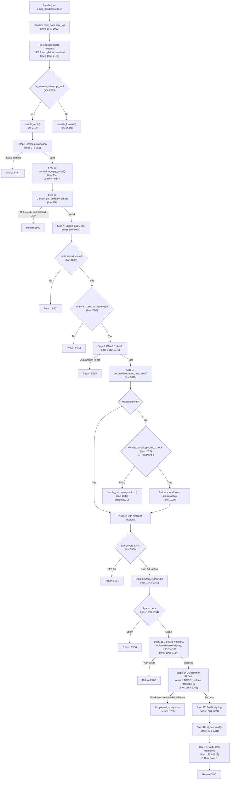
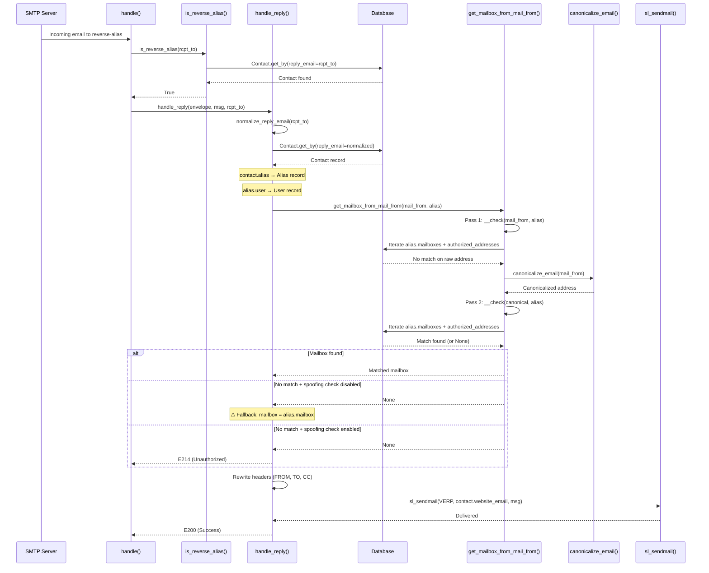
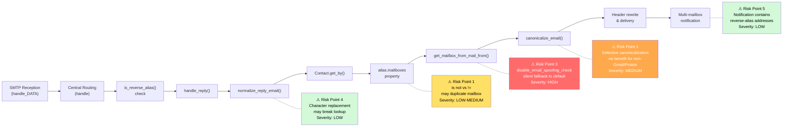

# Investigative Analysis: Alias Reply-Handling Flow in SimpleLogin

## Overview and Context

### Purpose

This document provides a comprehensive, code-grounded investigative analysis of the **reply-phase** email-handling pipeline in the SimpleLogin email aliasing system. It traces the complete runtime data flow when a user replies to a forwarded email via a reverse-alias, from the moment the SMTP server receives the message through to final outbound delivery.

### Problem Statement

Operators have observed that some replies sent through reverse-aliases appear to be routed to the wrong user. Specifically:

- A user replies to a forwarded email via its reverse-alias address
- Logs indicate the alias is recognized correctly during the `is_reverse_alias()` check
- Yet the final forwarding destination — the mailbox attributed to the reply — is incorrect

This analysis traces the end-to-end pipeline to identify every decision point where an incorrect routing decision could originate.

### Scope

- **In scope:** The reply-phase pipeline — from `MailHandler.handle_DATA()` through `handle_reply()` to `sl_sendmail()` delivery
- **Out of scope:** The forward phase (`handle_forward()`), bounce handling, unsubscribe processing, PGP internals, and REST API endpoints. These are referenced for context only where they intersect with the reply flow.

### Document Conventions

**Citation format:** All code references use `Source: file_path:LineNumber` pointing to the exact location in the repository.

**Mermaid diagrams:** Embedded `mermaid` code blocks provide visual flowcharts and sequence diagrams. These render natively on GitHub.

**Terminology:**

| Term | Definition |
|------|-----------|
| **Reverse-alias** | A unique, system-generated email address (stored as `Contact.reply_email`) that maps back to a specific contact-alias pair. When a user replies to this address, the system routes the reply to the original sender. |
| **Forward phase** | The inbound flow where an external sender emails an alias, and the system forwards the message to the user's mailbox. |
| **Reply phase** | The outbound flow where a user replies via a reverse-alias, and the system sends the reply to the original external sender (contact) on behalf of the alias. |
| **Mailbox** | The user's real email address (e.g., `user@gmail.com`) registered in SimpleLogin. A user can have multiple verified mailboxes. |
| **Contact** | A record representing an external sender who has emailed a particular alias. Each contact has a unique `reply_email` (reverse-alias). |
| **Alias** | A proxy email address (e.g., `myalias@simplelogin.co`) that hides the user's real mailbox. |

---

## End-to-End Reply Flow Trace

### 1. SMTP Reception: `MailHandler.handle_DATA()`

The entry point for all inbound email is the `MailHandler` class, which implements the aiosmtpd `handle_DATA` callback.

**Source: email_handler.py:2288-2332**

```
MailHandler.handle_DATA(server, session, envelope)
  → email.message_from_bytes(envelope.original_content)   # Parse raw bytes (line 2290)
  → self._handle(envelope, msg)                            # Delegate to internal handler (line 2292)
```

The method parses the raw SMTP envelope into a Python `email.message.Message` object, then delegates to `_handle()`. Three exception types are caught at this level:

| Exception | Status | Meaning |
|-----------|--------|---------|
| `CannotCreateContactForReverseAlias` | E524 (`550 SL E524 Wrong use of reverse-alias`) | A reverse-alias was used during the forward phase, causing a recursive contact creation attempt. Source: email_handler.py:2297-2307 |
| `VERPReply` / `VERPForward` / `VERPTransactional` | E213 (`250 SL E213 Unknown email ignored`) | An unhandled VERP email that doesn't match any known bounce pattern. Source: email_handler.py:2308-2318 |
| Generic `Exception` | E404 (`421 SL E404 Unexpected error - Retry later`) | Any unhandled error; the envelope is saved for debugging. Source: email_handler.py:2319-2332 |

### 2. Internal Handler: `_handle()`

**Source: email_handler.py:2334-2378**

The `_handle()` method is decorated with `@newrelic.agent.background_task()` (line 2334) for APM instrumentation. It performs the following setup:

1. **Generate tracking UUID** (line 2339): Creates a unique `message_id` via `uuid.uuid4()` for lifecycle tracking across log entries.
2. **Create Flask app context** (line 2352): Wraps the handler in `create_light_app().app_context()` to enable SQLAlchemy database access and Flask configuration.
3. **Call `handle(envelope, msg)`** (line 2353): Delegates to the central routing function.
4. **Post-processing backscatter prevention** (lines 2356-2365): After `handle()` returns, if the return status starts with `"5"` (a 5xx error) AND the SPF check result from the spamd headers indicates `fail` or `soft_fail`, the status is replaced with E216 (`250 SL E216 Handled spf policy`). **Rationale:** This prevents Postfix from generating bounce reports to forged senders, mitigating backscatter attacks.

### 3. Central Routing: `handle()`

**Source: email_handler.py:1945-2234**

The `handle()` function is the central routing dispatcher. It processes the envelope through multiple pre-checks before determining whether the email is a **forward** or **reply**.

#### Pre-processing Steps (lines 1948-1994)

| Step | Lines | Action |
|------|-------|--------|
| 1. Sanitize addresses | 1949-1952 | `mail_from` and each `rcpt_to` are passed through `sanitize_email()` — strips whitespace, newlines, right-to-left marks, and lowercases. Source: app/utils.py:97-102 |
| 2. Default encoding | 1954-1957 | Sets `Content-Transfer-Encoding: 7bit` if the header is missing |
| 3. Queue ID extraction | 1959-1967 | Extracts the Postfix queue ID from the `Received` header for log correlation |
| 4. Ignore check | 1969-1971 | `should_ignore(mail_from, rcpt_tos)` → returns E204 if the email should be silently dropped |
| 5. Header sanitization | 1973-1978 | Sanitizes FROM, TO, CC, REPLY_TO, and MESSAGE_ID headers |

#### Reverse-Alias-as-Sender Detection (lines 1996-2027)

Before routing, the system checks if `mail_from` or the parsed `From:` header address is itself a reverse-alias (i.e., stored as some contact's `reply_email`). If detected, it alerts the user that SimpleLogin should not be chained with another forwarding system. This is a safety check — it does NOT block the email.

#### VERP and Bounce Handling (lines 2034-2118)

The system checks if the recipient matches any VERP (Variable Envelope Return Path) pattern for transactional bounces, forward-phase bounces, reply-phase bounces, or iCloud-specific bounces. These are all handled before the forward/reply classification and are out of scope for this analysis.

#### Provider Complaints (lines 2120-2143)

Hotmail and Yahoo complaint emails to the POSTMASTER address are intercepted and handled.

#### Rate Limiting (lines 2145-2163)

The `rate_limited()` function is called. Note: inspection of `app/email/rate_limit.py` reveals the function currently returns `False` unconditionally — rate limiting is effectively disabled.

#### Out-of-Office to Reverse-Alias (lines 2166-2173)

If the email is sent to a single reverse-alias recipient with an empty `mail_from` (`<>`), it is treated as an out-of-office auto-response and returns E206.

#### The Critical Fork: Forward vs. Reply (lines 2175-2211)

**Source: email_handler.py:2194-2211**

For each `rcpt_to` in the recipient list:

```
if is_reverse_alias(rcpt_to):          # line 2195
    handle_reply(envelope, msg, rcpt_to)   # line 2199 — REPLY PHASE
else:
    handle_forward(envelope, msg, rcpt_to) # line 2208 — FORWARD PHASE
```

The routing decision hinges entirely on `is_reverse_alias()`. If the recipient address is recognized as a reverse-alias, the email enters the reply phase.

### 4. Reply Phase Entry: `is_reverse_alias()`

**Source: app/email_utils.py:1156-1163**

```python
def is_reverse_alias(address: str) -> bool:
    # to take into account the new reverse-alias that doesn't start with "ra+"
    if Contact.get_by(reply_email=address):       # Primary check: DB lookup (line 1158)
        return True

    return address.endswith(f"@{config.EMAIL_DOMAIN}") and (
        address.startswith("reply+") or address.startswith("ra+")  # Legacy check (lines 1161-1162)
    )
```

**Two detection mechanisms:**

1. **Primary (database lookup):** Queries the `contact` table for a row where `reply_email` matches the address exactly. This is the authoritative check — new-style reverse-aliases use random strings without any prefix, so only a DB lookup can identify them.
2. **Legacy (pattern matching):** Falls back to checking if the address ends with `@EMAIL_DOMAIN` and starts with `reply+` or `ra+`. This catches old-format reverse-aliases that may not yet be in the database.

**Key insight for routing analysis:** The `is_reverse_alias()` check performs its own `Contact.get_by()` lookup, but the result is NOT passed to `handle_reply()`. The contact lookup is performed again inside `handle_reply()` — this is a redundant query but does not affect correctness because the lookup is deterministic (same input → same result).

### 5. Reply Handler: `handle_reply()`

**Source: email_handler.py:966-1261**

This is the core function of the reply phase. It takes the envelope, parsed message, and the `rcpt_to` (the reverse-alias address) and processes the reply through 19 distinct steps.

#### Step 1 — Domain Validation (lines 972-981)

```python
reply_email = rcpt_to
reply_domain = get_email_domain_part(reply_email)

if not reply_email.endswith(EMAIL_DOMAIN):
    sl_domain = SLDomain.get_by(domain=reply_domain)
    if sl_domain is None:
        return False, status.E501  # "550 SL E501"
```

The reverse-alias domain must be either the primary `EMAIL_DOMAIN` or a recognized `SLDomain` configured for reverse-alias use. If neither matches, the email is rejected with E501.

**Rationale:** This prevents processing of emails addressed to arbitrary domains that happen to reach the SimpleLogin SMTP server.

#### Step 2 — Reply Email Normalization (line 984)

```python
reply_email = normalize_reply_email(reply_email)
```

**Source: app/email_validation.py:25-38**

The `normalize_reply_email()` function handles historically generated reverse-aliases that may contain non-standard characters:

1. If the address is not ASCII, `convert_to_id()` transliterates Unicode to ASCII
2. Each character is checked against `_ALLOWED_CHARS` (alphanumerics, `_`, `-`, `.`, `+`, `@`). Non-allowed characters are replaced with `_`.

> **⚠ RISK POINT 4** — If normalization modifies the reply email (e.g., replacing a non-standard character with `_`), the subsequent `Contact.get_by(reply_email=...)` lookup may fail to find a match, because the stored `reply_email` in the database contains the original un-normalized value. See [Risk Point 4](#risk-point-4-normalize_reply_email-character-replacement) for full analysis.

#### Step 3 — Contact Lookup (lines 986-992)

```python
contact = Contact.get_by(reply_email=reply_email)
if not contact:
    return False, status.E502  # "550 SL E502 Email not exist"
if not contact.user.is_active():
    return False, status.E502
```

The system queries the `contact` table using the normalized reverse-alias address. The `Contact.reply_email` column is indexed (Source: app/models.py:1899) for fast lookup. If no contact is found, or if the contact's user account has been soft-deleted, the email is rejected with E502.

#### Step 4 — Alias and User Extraction (lines 994-1004)

```python
alias = contact.alias            # ORM relationship → Alias record (Source: app/models.py:1907)
alias_address = contact.alias.email
alias_domain = get_email_domain_part(alias_address)

# Sanity check: verify alias domain is managed by SimpleLogin
if not is_valid_alias_address_domain(alias.email):
    return False, status.E503    # "550 SL E503"

user = alias.user                # ORM relationship → User record (Source: app/models.py:1576)
mail_from = envelope.mail_from
```

This step traverses the ORM relationship chain:
- `Contact.alias` → follows `Contact.alias_id` FK (Source: app/models.py:1881-1882) to the `Alias` record
- `Alias.user` → follows `Alias.user_id` FK (Source: app/models.py:1474-1475) to the `User` record

An additional sanity check verifies the alias domain is still managed by SimpleLogin (guards against stale aliases from removed custom domains).

#### Step 5 — User Send/Receive Check (lines 1007-1009)

```python
if not user.can_send_or_receive():
    return False, status.E504  # "550 SL E504 Account disabled"
```

Ensures the user's account is active and has sending/receiving capability.

#### Step 6 — DMARC Policy Check (lines 1011-1016)

```python
dmarc_delivery_status = apply_dmarc_policy_for_reply_phase(alias, contact, envelope, msg)
if dmarc_delivery_status is not None:
    return False, dmarc_delivery_status
```

**Source: app/handler/dmarc.py:154-194**

The DMARC check extracts the spamd result headers and checks if the DMARC policy indicates `quarantine`, `reject`, or `soft_fail`. If so, the email is quarantined and the user is alerted. Returns E215 (`250 SL E215 Handled dmarc policy`).

#### Step 7 — Mailbox Authorization (lines 1018-1034) — CRITICAL SECTION

```python
mailbox = get_mailbox_from_mail_from(mail_from, alias)
if not mailbox:
    if alias.disable_email_spoofing_check:
        mailbox = alias.mailbox          # ⚠ RISK POINT 3: Silent fallback to default
    else:
        handle_unknown_mailbox(envelope, msg, reply_email, user, alias, contact)
        return False, status.E214        # "250 SL E214 Unauthorized"
```

This is the **most critical decision point** for correct routing. The system must determine WHICH of the alias's mailboxes is sending the reply.

**`get_mailbox_from_mail_from()`** (Source: email_handler.py:1364-1387) performs a **two-pass check**:

**Pass 1 — Raw address match** (lines 1369-1383):
```python
def __check(email_address, alias):
    for mailbox in alias.mailboxes:          # Uses the @property (Source: app/models.py:1579)
        if mailbox.email == email_address:
            return mailbox
        for authorized_address in mailbox.authorized_addresses:
            if authorized_address.email == email_address:
                return mailbox
    return None
```

Iterates through all of the alias's verified mailboxes (via the `Alias.mailboxes` property) and their authorized addresses, comparing against the raw `mail_from`.

**Pass 2 — Canonicalized address match** (line 1387):
```python
return __check(mail_from, alias) or __check(canonicalize_email(mail_from), alias)
```

If Pass 1 finds no match, the `mail_from` is canonicalized and the check is repeated.

**If no mailbox is found:**
- If `alias.disable_email_spoofing_check` is `True` (Source: app/models.py:1528-1530): The system **silently falls back** to `alias.mailbox` — the default/primary mailbox. This is **Risk Point 3**.
- If the spoofing check is NOT disabled: `handle_unknown_mailbox()` (Source: email_handler.py:1390-1430) alerts the user and returns E214.

#### Step 8 — SPF Enforcement (lines 1036-1040)

```python
if ENFORCE_SPF and mailbox.force_spf and not alias.disable_email_spoofing_check:
    if not spf_pass(envelope, mailbox, user, alias, contact.website_email, msg):
        return True, status.E201  # "250 SL E201"
```

If SPF enforcement is active for this mailbox and the spoofing check is not disabled, the SPF result is verified. A failure returns E201 (note: uses 250 status to prevent bounce reports).

#### Step 9 — EmailLog Creation (lines 1042-1050)

```python
email_log = EmailLog.create(
    contact_id=contact.id,
    alias_id=contact.alias_id,
    is_reply=True,
    user_id=contact.user_id,
    mailbox_id=mailbox.id,        # Records which mailbox was attributed
    message_id=msg[headers.MESSAGE_ID],
    commit=True,
)
```

Creates an audit record. **Notably, `mailbox_id` is set here** — this is the mailbox that the system decided is the sender. If the routing decision in Step 7 was incorrect, this log entry will record the wrong mailbox.

#### Step 10 — Spam Check (lines 1053-1094)

If SpamAssassin is enabled, the message is scored against `MAX_REPLY_PHASE_SPAM_SCORE`. Spam → E506.

#### Step 11 — Header Stripping (lines 1096-1112)

All headers are removed except: FROM, TO, CC, SUBJECT, DATE, MESSAGE_ID, REFERENCES, IN_REPLY_TO, SL_QUEUE_ID, and MIME headers. This prevents information leakage from the user's mail client headers.

#### Step 12 — Reverse-Alias Replacement in Body (lines 1117-1148)

If `user.replace_reverse_alias` is enabled, reverse-alias strings in the message body are replaced with actual contact email addresses. This is a cosmetic transformation for readability.

#### Step 13 — PGP Encryption (lines 1150-1164)

If the contact has a PGP public key and the user is a premium subscriber, the message is encrypted. On PGP failure → E402 (retry later).

#### Step 14 — FROM Header Rewrite (lines 1168-1172)

```python
recipient_name = get_alias_recipient_name(alias)
add_or_replace_header(msg, headers.FROM, recipient_name.name)
```

The FROM header is rewritten to show the **alias identity** (e.g., `My Alias <myalias@simplelogin.co>`). This hides the user's real mailbox address from the contact.

#### Step 15 — TO/CC Header Restoration (lines 1174-1200)

```python
replace_header_when_reply(msg, alias, headers.TO)   # line 1179
replace_header_when_reply(msg, alias, headers.CC)    # line 1181
```

**Source: email_handler.py:345-384**

The `replace_header_when_reply()` function iterates through all addresses in the TO or CC header:
- If the address equals `alias.email` → skip (user clicked "Reply All", alias is already in the header)
- Otherwise → look up `Contact.get_by(reply_email=address)`:
  - If found → replace with `contact.website_email` (the actual external address)
  - If NOT found → raise `NonReverseAliasInReplyPhase` exception

If `NonReverseAliasInReplyPhase` is raised (line 1182), the email is **dropped**, the `EmailLog` is deleted, and the user is notified via email. Returns E200 (the user is informed and can retry).

**Rationale:** In the reply phase, all TO/CC addresses should be reverse-aliases (except the alias itself). If a non-reverse-alias address appears, it likely means the user is trying to add external recipients directly, which would leak the alias's identity.

#### Step 16 — Message-ID Replacement (line 1202)

**Source: email_handler.py:1296-1361**

`replace_original_message_id()` replaces the original `Message-ID` header with a SimpleLogin-generated ID, creating a `MessageIDMatching` record for future reference chain tracking. The `References` header is also updated to replace any previously-seen original message IDs with their SL equivalents.

#### Step 17 — DKIM Signing (lines 1220-1221)

If the alias domain should have DKIM signatures, one is added to the outgoing message.

#### Step 18 — Final Delivery via `sl_sendmail()` (lines 1224-1231)

```python
sl_sendmail(
    generate_verp_email(VerpType.bounce_reply, email_log.id, alias_domain),  # VERP sender
    contact.website_email,   # Recipient: the actual external sender
    msg,
    envelope.mail_options,
    envelope.rcpt_options,
    is_forward=False,
)
```

The reply is sent from a VERP-encoded bounce address to `contact.website_email` — the original external sender's address. The VERP encoding includes the `email_log.id` so that bounces can be correlated back to this specific delivery.

#### Step 19 — Multi-Mailbox Notification (lines 1233-1236)

```python
other_mailboxes = [mb for mb in alias.mailboxes if mb.email != mailbox.email]
for mb in other_mailboxes:
    notify_mailbox(alias, mailbox, mb, msg, orig_to, orig_cc, alias_domain)
```

If the alias is associated with multiple verified mailboxes, all mailboxes OTHER than the sending one are notified about the reply. This uses value equality (`mb.email != mailbox.email`), unlike the `Alias.mailboxes` property which uses identity comparison.

> **⚠ RISK POINT 5** — The notification includes original (pre-rewrite) TO/CC headers containing reverse-alias addresses, captured at lines 1114-1115. See [Risk Point 5](#risk-point-5-multi-mailbox-notification-flow) for full analysis.

---

## Alias-to-User Resolution Chain

### Contact Lookup by `reply_email`

The resolution chain begins when the system receives a reverse-alias address and must determine which contact, alias, and user it maps to.

**Source: app/models.py:1895-1899**

The `Contact.reply_email` field:
```
reply_email = sa.Column(sa.String(512), nullable=False, index=True)
```

- **Type:** `String(512)`, non-nullable, indexed for fast lookups
- **Purpose:** Stores the unique reverse-alias address per contact-alias pair
- **Generation:** Created by `generate_reply_email()` (Source: app/email_utils.py:1103-1153)
- **Uniqueness:** Guaranteed by a retry loop that calls `available_sl_email()` (line 1150) up to 1000 times

**Generation algorithm** (Source: app/email_utils.py:1112-1153):
- If `user.include_sender_in_reverse_alias` is enabled: generates `{sanitized_contact_email}_{random(5-10)}@{reply_domain}`
- Otherwise: generates `{random(20-50)}@{reply_domain}`
- The `reply_domain` is either `EMAIL_DOMAIN` or the alias's SL domain if `use_as_reverse_alias` is configured on that domain

The lookup at line 986 of `email_handler.py` is a standard SQLAlchemy `get_by()`:
```python
contact = Contact.get_by(reply_email=reply_email)
```
This translates to `SELECT * FROM contact WHERE reply_email = :value`. Because `reply_email` is indexed, this is an efficient B-tree lookup.

### Alias and User Traversal

Once the `Contact` record is found, the resolution chain follows ORM relationships:

```
reply_email
    → Contact record (via Contact.get_by(reply_email=...))
        → Contact.alias_id (FK, Source: app/models.py:1881-1882)
            → Alias record (via Contact.alias relationship, Source: app/models.py:1907)
                → Alias.user_id (FK, Source: app/models.py:1474-1475)
                    → User record (via Alias.user relationship, Source: app/models.py:1576)
```

**Key relationships:**
- `Contact.alias` — defined as `orm.relationship(Alias, backref="contacts")` at Source: app/models.py:1907
- `Contact.user` — defined as `orm.relationship(User)` at Source: app/models.py:1908
- `Contact.alias_id` — FK to `Alias.id` with `ondelete="cascade"` at Source: app/models.py:1881-1882
- `Contact.user_id` — FK to `User.id` with `ondelete="cascade"` at Source: app/models.py:1878-1880

The chain is deterministic: a given `reply_email` always resolves to exactly one `Contact`, one `Alias`, and one `User`. There is no ambiguity in this part of the resolution.

### Mailbox Authorization: `get_mailbox_from_mail_from()`

After resolving the alias and user, the system must determine **which of the user's mailboxes** is the authorized sender of this reply.

**Source: email_handler.py:1364-1387**

The function performs a **two-pass authorization check**:

**Pass 1 — Raw `mail_from` match:**
```python
def __check(email_address, alias):
    for mailbox in alias.mailboxes:
        if mailbox.email == email_address:
            return mailbox
        for authorized_address in mailbox.authorized_addresses:
            if authorized_address.email == email_address:
                return mailbox
    return None
```

For each verified mailbox associated with the alias:
1. Compare `mailbox.email` against the raw `mail_from`
2. If no direct match, check each of the mailbox's `authorized_addresses` (Source: app/models.py:3190-3208)

**Pass 2 — Canonicalized `mail_from` match:**
```python
return __check(mail_from, alias) or __check(canonicalize_email(mail_from), alias)
```

If Pass 1 returns `None`, the `mail_from` is canonicalized via `canonicalize_email()` (Source: app/utils.py:78-94) and the entire check is repeated.

**Design rationale:** The two-pass approach exists because historical users may have non-canonicalized email addresses stored in the database. The raw match is tried first to prefer exact matches; canonicalized matching is the fallback.

### Email Canonicalization Behavior

**Source: app/utils.py:78-94**

```python
def canonicalize_email(email_address: str) -> str:
    email_address = sanitize_email(email_address)       # line 79
    parts = email_address.split("@")
    if len(parts) != 2:
        return ""
    domain = parts[1]
    if domain not in ("gmail.com", "protonmail.com", "proton.me", "pm.me"):
        return email_address                             # line 85: EARLY RETURN for non-Gmail/Proton
    first = parts[0]
    try:
        plus_idx = first.index("+")
        first = first[:plus_idx]                         # Strip everything after +
    except ValueError:
        pass
    first = first.replace(".", "")                       # Remove all dots
    return f"{first}@{parts[1]}".lower().strip()
```

**Domain-specific behavior:**

| Domain | Canonicalization Applied |
|--------|------------------------|
| `gmail.com` | Strip `+` suffix, remove dots |
| `protonmail.com` | Strip `+` suffix, remove dots |
| `proton.me` | Strip `+` suffix, remove dots |
| `pm.me` | Strip `+` suffix, remove dots |
| **All others** | **No normalization** — returns as-is after basic sanitization |

> **⚠ RISK POINT 2** — For any domain not in the hardcoded list (Yahoo, Outlook, Fastmail, custom domains, etc.), the canonicalized version is identical to the sanitized raw version. The second pass in `get_mailbox_from_mail_from()` provides **zero additional matching benefit** for these domains. See [Risk Point 2](#risk-point-2-selective-email-canonicalization) for full analysis.

**`sanitize_email()`** (Source: app/utils.py:97-102):
```python
def sanitize_email(email_address: str, not_lower=False) -> str:
    if email_address:
        email_address = email_address.strip().replace(" ", "").replace("\n", " ")
        if not not_lower:
            email_address = email_address.lower()
    return email_address.replace("\u200f", "")
```

Strips whitespace, spaces, newlines, and right-to-left Unicode marks. Lowercases by default.

### `Alias.mailboxes` Property

**Source: app/models.py:1579-1589**

```python
@property
def mailboxes(self):
    ret = [self.mailbox]                                # Line 1581: Start with default mailbox
    for m in self._mailboxes:                           # Line 1582: Iterate additional mailboxes
        if m.id is not self.mailbox.id:                 # Line 1583: ⚠ IDENTITY check
            ret.append(m)

    ret = [mb for mb in ret if mb.verified]             # Line 1586: Filter verified only
    ret = sorted(ret, key=lambda mb: mb.email)          # Line 1587: Sort alphabetically

    return ret
```

This property constructs the list of all mailboxes associated with an alias:

1. **Start with the primary/default mailbox** (`self.mailbox` — FK `Alias.mailbox_id`, Source: app/models.py:1506-1508)
2. **Add secondary mailboxes** from the `AliasMailbox` join table (`self._mailboxes`, Source: app/models.py:1512), excluding the primary mailbox
3. **Filter to verified mailboxes only** (unverified mailboxes are excluded)
4. **Sort alphabetically** by email address

> **⚠ RISK POINT 1** — Line 1583 uses `is not` (Python identity comparison) instead of `!=` (value equality) to check for duplicates. See [Risk Point 1](#risk-point-1-identity-vs-equality-in-aliasmailboxes) for full analysis.

**Key model references:**
- `self.mailbox` → Primary mailbox via `Alias.mailbox_id` FK (Source: app/models.py:1506-1508)
- `self._mailboxes` → Secondary mailboxes via `AliasMailbox` join table (Source: app/models.py:1512)
- `Mailbox.authorized_addresses` → backref defined on `AuthorizedAddress` model (Source: app/models.py:3205)

---

## Header Rewriting and Delivery

### FROM Header Rewrite to Alias Identity

**Source: email_handler.py:1168-1172**

```python
recipient_name = get_alias_recipient_name(alias)
add_or_replace_header(msg, headers.FROM, recipient_name.name)
```

The FROM header is replaced with the alias's display name and email address. This ensures the contact sees the reply as coming from the alias (e.g., `My Alias <myalias@simplelogin.co>`), not from the user's real mailbox address.

### TO/CC Restoration via `replace_header_when_reply()`

**Source: email_handler.py:345-384**

When the user composes a reply in their mail client, the TO and CC headers contain reverse-alias addresses (because that's what was in the Reply-To and CC headers of the forwarded email). The `replace_header_when_reply()` function restores these to the original contact addresses:

```python
for _, reply_email in getaddresses(headers):
    if reply_email == alias.email:       # Skip the alias itself (Reply All case)
        continue

    contact = Contact.get_by(reply_email=reply_email)
    if not contact:
        raise NonReverseAliasInReplyPhase(reply_email)  # Email will be dropped
    else:
        new_addrs.append(sl_formataddr((contact.name, contact.website_email)))
```

If a non-reverse-alias address is found in TO/CC (other than the alias itself), a `NonReverseAliasInReplyPhase` exception is raised. The email is dropped, the EmailLog is deleted, and the user is notified to retry without the offending address.

### Message-ID Replacement

**Source: email_handler.py:1296-1361**

`replace_original_message_id()` replaces the original `Message-ID` with a SimpleLogin-generated one:

1. If the original Message-ID has a matching `MessageIDMatching` record, the existing SL Message-ID is reused (for multi-recipient replies)
2. Otherwise, a new SL Message-ID is generated via `make_msgid()` and a `MessageIDMatching` record is created
3. The `References` header is also updated — any original message IDs that have SL counterparts are replaced

This ensures message threading works correctly while preventing the user's mail client Message-ID format from leaking to the contact.

### VERP-based SMTP Delivery

**Source: email_handler.py:1224-1231**

The final delivery uses `sl_sendmail()`:

```python
sl_sendmail(
    generate_verp_email(VerpType.bounce_reply, email_log.id, alias_domain),
    contact.website_email,
    msg,
    envelope.mail_options,
    envelope.rcpt_options,
    is_forward=False,
)
```

- **Envelope FROM (VERP):** A VERP-encoded address containing `VerpType.bounce_reply` and the `email_log.id`, used to correlate any bounces back to this delivery
- **Envelope TO:** `contact.website_email` — the actual external email address of the original sender
- **Direction:** `is_forward=False` — indicates this is a reply, not a forward

The reply exits the system addressed to the original contact, appearing to come from the alias identity.

---

## Likely Points of Incorrect Routing

This section identifies five specific points in the reply-handling pipeline where incorrect routing decisions could originate. Each point is documented with its location, mechanism, trigger conditions, consequences, and user-visible symptoms.

### Risk Point 1: Identity vs. Equality in `Alias.mailboxes`

**Location:** `app/models.py:1583`

**Code:**
```python
if m.id is not self.mailbox.id:
```

**Mechanism:** This line uses Python's `is not` operator, which performs **object identity comparison** (checking if two references point to the same object in memory), rather than `!=` which performs **value equality** comparison (checking if two values are numerically equal).

**Why this matters:** In CPython, small integers (typically -5 to 256) are cached as singleton objects — `is` comparison works identically to `==` for these values. However, for integer values outside this cache range (i.e., database primary key IDs greater than 256), or when SQLAlchemy returns different ORM instances for the same row (possible with session detachment, expiry, or lazy loading in SQLAlchemy 1.3.24), `m.id is not self.mailbox.id` may evaluate to `True` even when the IDs are numerically equal.

**Trigger condition:**
- The alias's `mailbox_id` (primary mailbox) has an integer ID value > 256
- AND the same mailbox also appears in the `_mailboxes` relationship (via the `AliasMailbox` join table)
- AND SQLAlchemy returns different Python int objects for the same ID value

**Consequence:** The primary mailbox would appear **twice** in the returned `mailboxes` list. This affects:
1. `get_mailbox_from_mail_from()` — iterates the list and may match the duplicated mailbox on either instance (functionally benign for matching, but unexpected)
2. The multi-mailbox notification at line 1234 — could trigger a spurious notification to the sending mailbox

**User-visible symptom:** Generally benign due to the subsequent verified-status filter and alphabetical sort. However, in edge cases with multi-mailbox aliases, the duplicate entry could cause unexpected notification behavior.

**Severity:** LOW-MEDIUM — CPython's integer caching covers most production ID ranges, but this is a latent defect that could manifest as the database grows.

### Risk Point 2: Selective Email Canonicalization

**Location:** `app/utils.py:78-94`

**Code:**
```python
if domain not in ("gmail.com", "protonmail.com", "proton.me", "pm.me"):
    return email_address
```

**Mechanism:** The `canonicalize_email()` function only applies normalization (dot removal, plus-suffix stripping) to four specific email domains: Gmail, ProtonMail, Proton.me, and PM.me. For ALL other email providers — Yahoo, Outlook/Hotmail, Fastmail, iCloud, custom domains, corporate email — the function returns the address unchanged after basic `sanitize_email()` processing.

**Why this matters:** The two-pass check in `get_mailbox_from_mail_from()` (Source: email_handler.py:1387) is designed as a fallback: `__check(mail_from, alias) or __check(canonicalize_email(mail_from), alias)`. For non-Gmail/Proton domains, the second pass uses an identical input to the first pass, providing **zero additional matching benefit**.

**Trigger condition:**
- User has a mailbox on a non-Gmail/Proton provider (e.g., `user@outlook.com`)
- User sends from an address variant of their mailbox (e.g., `user+shopping@outlook.com` via Outlook's plus-addressing feature)
- The mailbox stored in the database is `user@outlook.com`, but `mail_from` is `user+shopping@outlook.com`

**Consequence:** Both passes in `get_mailbox_from_mail_from()` compare against `user+shopping@outlook.com` — neither matches `user@outlook.com`. The function returns `None`, triggering either the `disable_email_spoofing_check` fallback (Risk Point 3) or the unknown mailbox error (E214).

**User-visible symptom:** "Attempt to use your alias from user+shopping@outlook.com" alert email, with the reply blocked (E214). The user must resend from the exact mailbox address. For users who habitually use plus-addressing, this is a recurring frustration.

**Severity:** MEDIUM — Affects all users with non-Gmail/Proton mailboxes who use plus-addressing or subaddressing features of their email provider.

### Risk Point 3: `disable_email_spoofing_check` Fallback to Default Mailbox

**Location:** `email_handler.py:1021-1029`

**Code:**
```python
if alias.disable_email_spoofing_check:
    # ignore this error, use default alias mailbox
    LOG.w(
        "ignore unknown sender to reverse-alias %s: %s -> %s",
        mail_from, alias, contact,
    )
    mailbox = alias.mailbox
```

**Mechanism:** When `get_mailbox_from_mail_from()` returns `None` (no mailbox matches the `mail_from`) AND the alias has `disable_email_spoofing_check=True` (Source: app/models.py:1528-1530), the system **silently falls back** to `alias.mailbox` — the default/primary mailbox — regardless of the actual sender's address.

**Why this is the highest risk:** This code path completely bypasses mailbox authorization. It means:
1. **Any address** can send to a reverse-alias on this alias and it will be treated as a legitimate reply
2. The reply will be attributed to the **default mailbox** even if the actual sender is a different mailbox (or not a mailbox at all)
3. The only log evidence is a `LOG.w()` warning — there is no user notification

**Trigger condition:**
- An alias has `disable_email_spoofing_check=True`
- AND a reply is sent to a reverse-alias of that alias from an address that doesn't match any of the alias's mailboxes or their authorized addresses
- This includes:
  - A user sending from a secondary mailbox not in the alias's mailbox list
  - A user sending from a forwarded address
  - A malicious sender deliberately targeting the reverse-alias

**Consequence:**
1. `mailbox` is set to `alias.mailbox` (the default/primary mailbox)
2. `EmailLog.mailbox_id` records the default mailbox (line 1047), not the actual sender
3. The FROM header is rewritten to the alias identity (line 1172), hiding the actual sender
4. The multi-mailbox notification (line 1234) uses the wrong `mailbox` reference, potentially notifying the default mailbox about "its own" send

**User-visible symptom:**
- Reply appears to originate from the wrong mailbox in the SimpleLogin dashboard
- In multi-mailbox setups, the actual sending mailbox receives a "notification" about a reply it actually sent itself
- EmailLog records show incorrect mailbox attribution

**Severity:** HIGH — This is the **most likely source of incorrect routing** for aliases with the email spoofing check disabled. The silent fallback with only a warning log makes it difficult to detect.

### Risk Point 4: `normalize_reply_email()` Character Replacement

**Location:** `app/email_validation.py:25-38`

**Code:**
```python
def normalize_reply_email(reply_email: str) -> str:
    if not reply_email.isascii():
        reply_email = convert_to_id(reply_email)
    ret = []
    for c in reply_email:
        if c not in _ALLOWED_CHARS:
            ret.append("_")
        else:
            ret.append(c)
    return "".join(ret)
```

Where `_ALLOWED_CHARS = "abcdefghijklmnopqrstuvwxyzABCDEFGHIJKLMNOPQRSTUVWXYZ0123456789_-.+@"` (Source: app/email_validation.py:9).

**Mechanism:** This function normalizes the reply email by:
1. Transliterating non-ASCII characters to ASCII via `convert_to_id()`
2. Replacing any remaining character not in `_ALLOWED_CHARS` with an underscore `_`

**Why this matters:** The normalization happens AFTER the `is_reverse_alias()` check in `handle()` (which uses the original, un-normalized address) but BEFORE the `Contact.get_by(reply_email=...)` lookup inside `handle_reply()`. If normalization modifies the address, the database lookup uses a **different string** than what was originally stored.

**Trigger condition:**
- A reverse-alias was generated historically with characters outside `_ALLOWED_CHARS`
- OR the receiving mail system (or an intermediate relay) modified the address encoding, introducing non-standard characters
- OR the address contains Unicode characters that `convert_to_id()` transliterates differently than expected

**Consequence:** The normalized `reply_email` no longer matches the stored `Contact.reply_email` → `Contact.get_by()` returns `None` → E502 ("550 SL E502 Email not exist").

**User-visible symptom:** The user's reply bounces with a "550 SL E502 Email not exist" error even though they are replying to a valid forwarded email. This is particularly confusing because the reverse-alias worked correctly during the forward phase.

**Severity:** LOW — This primarily affects legacy contacts created before the allowed character set was standardized, or emails passing through mail systems that perform non-standard address encoding. Modern reverse-aliases are generated using only characters in `_ALLOWED_CHARS`.

### Risk Point 5: Multi-Mailbox Notification Flow

**Location:** `email_handler.py:1233-1236`

**Code:**
```python
other_mailboxes = [mb for mb in alias.mailboxes if mb.email != mailbox.email]
for mb in other_mailboxes:
    notify_mailbox(alias, mailbox, mb, msg, orig_to, orig_cc, alias_domain)
```

**Mechanism:** After successful delivery of the reply, the system notifies all other mailboxes associated with the alias about the sent reply. The notification is constructed by `notify_mailbox()` (Source: email_handler.py:1264-1293):

1. A header is prepended: "Email sent on behalf of alias {alias.email} using mailbox {mailbox.email}"
2. FROM is set to `alias.email`
3. TO and CC are set to `orig_to` and `orig_cc` — the **original** headers captured BEFORE the reverse-alias-to-contact replacement (Source: email_handler.py:1114-1115)
4. DKIM is added for the alias domain
5. The notification is sent as a transactional email

**Why this matters:** The `orig_to` and `orig_cc` contain **reverse-alias addresses**, not the real contact addresses (the replacement happens at lines 1179-1181, AFTER `orig_to`/`orig_cc` are captured at lines 1114-1115). Other mailbox owners receive a notification with cryptic reverse-alias addresses in the TO/CC fields.

**Trigger condition:**
- An alias is associated with 2 or more verified mailboxes
- A reply is sent from one of those mailboxes

**Consequence:**
- Other mailbox owners receive a notification that looks like a garbled email with reverse-alias addresses
- Users may attempt to reply to the notification, creating unintended reply chains
- The notification header says to "remove this section if you reply," but the reverse-alias addresses in TO/CC may cause confusion

**User-visible symptom:** Other mailbox owners receive a confusing notification with reverse-alias addresses instead of real contact addresses. While this is informational and not actual misrouting, it can lead users to believe their email was incorrectly processed.

**Severity:** LOW — This is a UX issue, not actual misrouting. The primary reply is delivered correctly; only the notification to other mailboxes is potentially confusing.

### Summary of Risk Points

| # | Risk Point | Location | Severity | Trigger | Effect |
|---|-----------|----------|----------|---------|--------|
| 1 | Identity vs. equality in `Alias.mailboxes` | `app/models.py:1583` | LOW-MEDIUM | Mailbox ID > 256 with detached ORM objects | Primary mailbox may appear twice in mailbox list |
| 2 | Selective email canonicalization | `app/utils.py:84` | MEDIUM | Non-Gmail/Proton user with plus-addressing | Two-pass matching provides no benefit; reply rejected as E214 |
| 3 | `disable_email_spoofing_check` fallback | `email_handler.py:1021-1029` | **HIGH** | Alias with spoofing check disabled + unknown sender | Reply silently attributed to default mailbox regardless of sender |
| 4 | `normalize_reply_email()` character replacement | `app/email_validation.py:25-38` | LOW | Legacy contacts or address encoding changes | Contact lookup fails; reply bounces with E502 |
| 5 | Multi-mailbox notification with reverse-aliases | `email_handler.py:1233-1236` | LOW | Alias with 2+ mailboxes | Other mailboxes get notification with cryptic reverse-alias addresses |

---

## Mermaid Diagrams

### Diagram 1: Reply Phase End-to-End Flowchart



### Diagram 2: Alias Resolution Sequence Diagram



### Diagram 3: Routing Risk Point Map



---

## Conclusion and Recommendations

### Key Findings

Based on this code-grounded analysis of the reply-handling pipeline, the three most impactful findings are:

**1. `disable_email_spoofing_check` Fallback (Risk Point 3) — Highest Impact**

The silent fallback to `alias.mailbox` when the spoofing check is disabled (Source: email_handler.py:1021-1029) is the **most likely cause of incorrect routing**. When a reply arrives from an address not matching any of the alias's mailboxes or their authorized addresses, and the alias has `disable_email_spoofing_check=True`, the reply is attributed to the default/primary mailbox with only a warning log. This means:
- The wrong mailbox is recorded in `EmailLog`
- Multi-mailbox notifications reference the wrong sender
- There is no user-facing indication that a fallback occurred

**2. Selective Canonicalization (Risk Point 2) — Moderate Impact**

The `canonicalize_email()` function (Source: app/utils.py:78-94) only normalizes four domains. For all other providers, the two-pass check in `get_mailbox_from_mail_from()` is effectively single-pass. Users with non-Gmail/Proton mailboxes who use plus-addressing or other address variants will have their replies rejected (E214) or silently misattributed (if Risk Point 3 applies).

**3. Identity Comparison in `Alias.mailboxes` (Risk Point 1) — Low-Medium Impact**

The use of `is not` instead of `!=` at Source: app/models.py:1583 is a latent defect. While CPython's integer caching makes it safe for small IDs, it becomes a real risk as the database grows and mailbox IDs exceed 256.

### Assessment of the Contact Lookup

The `Contact.get_by(reply_email=...)` lookup itself (Source: email_handler.py:986) is **sound**:
- The `reply_email` column is indexed (Source: app/models.py:1899)
- Each `reply_email` is unique, generated by a retry loop with uniqueness checking (Source: app/email_utils.py:1150)
- The lookup is deterministic — the same input always produces the same result

The incorrect routing problem is **not** in the contact resolution step. The most likely source is in the **mailbox authorization step** (Step 7) that occurs AFTER the contact is found — specifically in the interaction between `get_mailbox_from_mail_from()`, `canonicalize_email()`, and the `disable_email_spoofing_check` fallback.

### Recommendations

1. **Investigate `disable_email_spoofing_check` aliases first** when debugging misrouted replies. Query for aliases where this flag is `True` and cross-reference with `EmailLog` entries where `mailbox_id` doesn't match the expected sender. These aliases are the primary candidates for incorrect routing.

2. **Change `is not` to `!=` in `Alias.mailboxes` property** (Source: app/models.py:1583) as a defensive fix. This eliminates the potential for duplicate mailbox entries caused by Python integer identity semantics, with no behavioral change for correctly-functioning cases.

3. **Extend `canonicalize_email()` to support additional providers** or implement a more generic normalization strategy (e.g., always strip `+` suffixes) to ensure the two-pass check provides meaningful fallback matching for all mailbox providers, not just Gmail and Proton.

4. **Add user notification for the spoofing-check-disabled fallback** — when the system falls back to `alias.mailbox` at line 1029, consider sending an informational notification to the user (similar to `handle_unknown_mailbox()`) so the routing decision is visible rather than silent.

---

*This document was generated from source code analysis of the SimpleLogin repository. All citations reference specific file paths and line numbers as verified against the codebase.*
