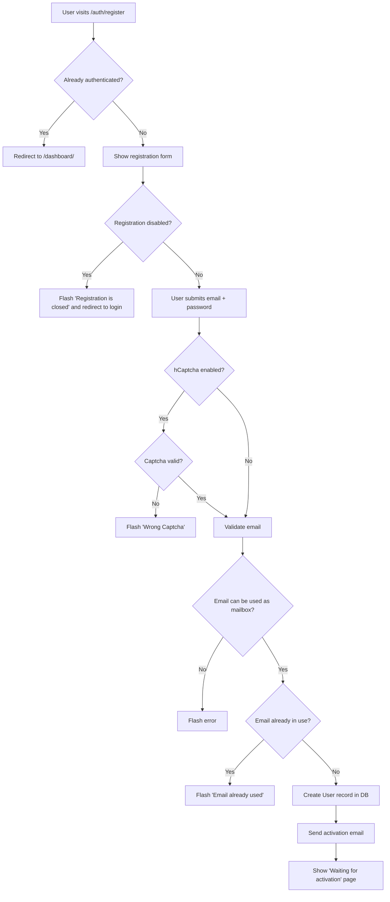
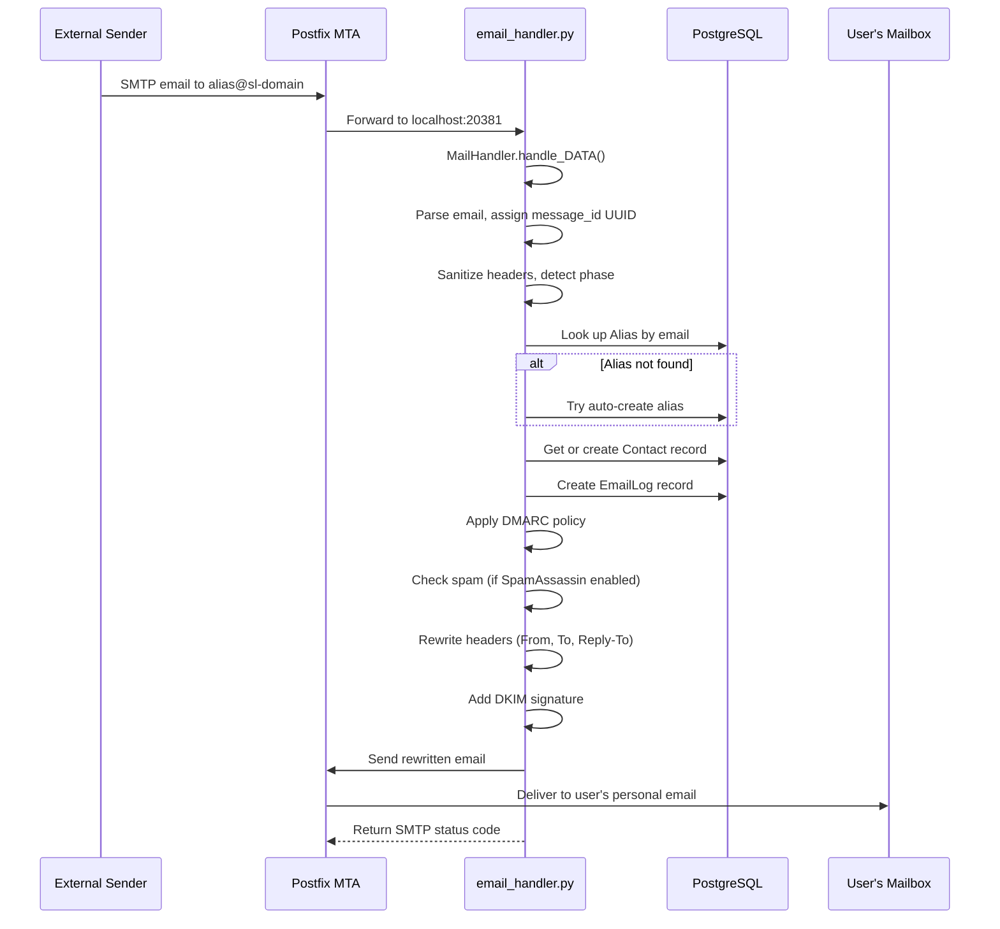
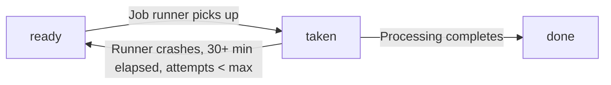
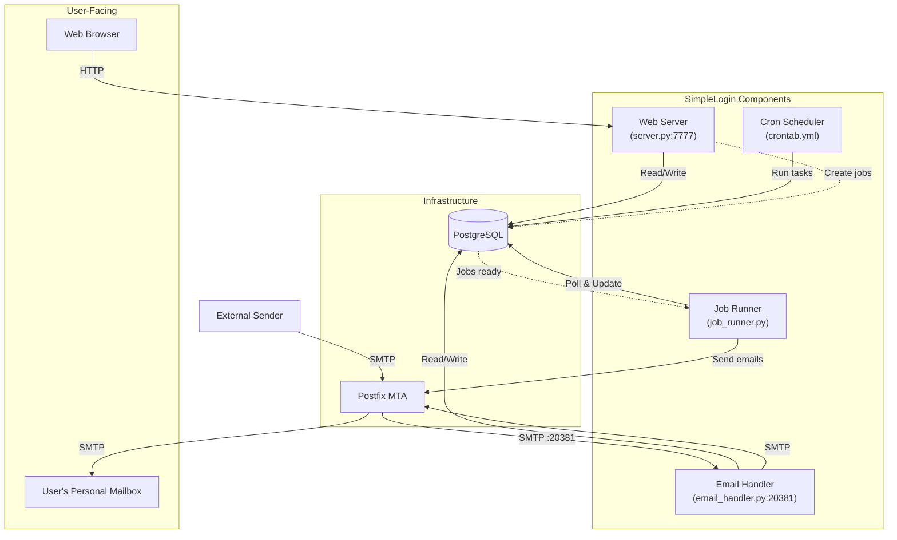

# SimpleLogin Self-Hosted: Runtime Behavior and Operational Verification Guide

## Introduction

This document answers key operational questions about the SimpleLogin self-hosted email aliasing application. It is written for a user who has deployed SimpleLogin locally and wants to understand what is happening under the hood — how to verify each component is alive, what the dashboard shows, what happens when you perform core user actions, and how background processes support the system.

**Every answer in this document is grounded in the SimpleLogin source code.** File paths and line numbers are cited so you can trace each claim back to its origin. No assumptions are made beyond what the code explicitly states.

SimpleLogin comprises three core runtime components:

| Component | Entry Point | Default Port | Role |
|-----------|-------------|-------------|------|
| **Web Server** | `server.py` | 7777 | Flask/Gunicorn application serving the UI, API, and admin panel |
| **Email Handler** | `email_handler.py` | 20381 | aiosmtpd-based SMTP server processing incoming email (forwarding and replying) |
| **Job Runner** | `job_runner.py` | N/A | Continuous polling loop that drains background jobs from the database |

Additionally, a **cron scheduler** (`cron.py` driven by `crontab.yml`) handles periodic maintenance tasks, and a **monitoring script** (`monitoring.py`) exports operational metrics. These are secondary but documented where relevant.

---

## Q1: How Can I Confirm Each Component Is Up and Responding?

### 1.1 Web Server (Flask / Gunicorn)

#### 1.1.1 Health Endpoint

The most direct way to verify the web server is to hit the `/health` endpoint. This route is defined inside the `create_app()` factory function:

```python
@app.route("/health", methods=["GET"])
def healthcheck():
    return "success", 200
```

*Source: `server.py:213–215`*

**Verification command:**

```bash
curl -s http://localhost:7777/health
# Expected output: success
```

A `200` response with the body `success` confirms the Flask application is loaded, all blueprints are registered, database connectivity is established (via the SQLAlchemy engine initialized in `create_app()`), and the WSGI server (Gunicorn in production, Flask dev server locally) is accepting connections.

**Thinking / Rationale:** The `/health` route is registered inside `create_app()` after `init_extensions(app)`, `register_blueprints(app)`, and `set_index_page(app)` have all completed (lines 171–173). This means that if `/health` returns successfully, the full application factory has executed — including database engine configuration (`app.config["SQLALCHEMY_DATABASE_URI"] = DB_URI` at line 146), login manager initialization (`init_extensions` at line 171 → `login_manager.init_app(app)` at line 438), and all blueprint registrations (line 172 → `register_blueprints` at lines 233–246 which registers `auth_bp`, `dashboard_bp`, `api_bp`, and 8 other blueprints). The health endpoint is deliberately excluded from request logging (line 281: `not request.path.startswith("/health")`), so it will not clutter your logs.

#### 1.1.2 Startup Log Messages

When running locally via `python3 server.py`, the entry point is `local_main()`:

```python
def local_main():
    config.COLOR_LOG = True
    app = create_app()
    # ...
    app.run(debug=True, port=7777)
```

*Source: `server.py:572–588`*

You will see Flask's standard startup banner:

```
 * Running on http://127.0.0.1:7777/ (Press CTRL+C to quit)
 * Restarting with stat
 * Debugger is active!
```

In Docker production mode, the `Dockerfile` CMD launches Gunicorn:

```
CMD ["gunicorn","wsgi:app","-b","0.0.0.0:7777","-w","2","--timeout","15"]
```

*Source: `Dockerfile:47`*

Gunicorn will log its worker startup:

```
[INFO] Starting gunicorn 20.0.4
[INFO] Listening at: http://0.0.0.0:7777
[INFO] Using worker: sync
[INFO] Booting worker with pid: ...
```

Before any of the above, the logging subsystem prints a marker line when the `app.log` module is first imported:

```
>>> init logging <<<
```

*Source: `app/log.py:67`*

#### 1.1.3 Request Logging

Once the server is running, every non-static request is logged by the `after_request` hook. The log line includes the remote IP, HTTP method, path, query args, status code, and elapsed time:

```python
LOG.d(
    "%s %s %s %s %s, takes %s",
    request.remote_addr,
    request.method,
    request.path,
    request.args,
    res.status_code,
    time.time() - start_time,
)
```

*Source: `server.py:284–292`*

Requests to `/static/`, `/admin/static/`, `/_debug_toolbar/`, `/git`, `/favicon.ico`, and `/health` are excluded from this logging to reduce noise (lines 275–282).

**Thinking / Rationale:** The `before_request` hook (lines 257–270) records `g.start_time` for all non-static requests. The `after_request` hook (lines 272–296) reads this to compute elapsed time. This gives you an automatic access log for every meaningful request without requiring a separate logging middleware.

#### 1.1.4 Root URL Redirect Confirmation

Navigating to `http://localhost:7777/` provides an immediate functional test of routing:

```python
@app.route("/", methods=["GET", "POST"])
def index():
    if current_user.is_authenticated:
        return redirect(url_for("dashboard.index"))
    else:
        return redirect(url_for("auth.login"))
```

*Source: `server.py:250–255`*

- **Not logged in:** You will be redirected to `/auth/login` — if the login page renders, the auth blueprint is working.
- **Logged in:** You will be redirected to `/dashboard/` — if the dashboard renders, the dashboard blueprint, database, and session management are all functional.

---

### 1.2 Email Handler (aiosmtpd)

#### 1.2.1 SMTP Server Startup

The email handler starts an asynchronous SMTP server using the `aiosmtpd` library's `Controller` class:

```python
def main(port: int):
    """Use aiosmtpd Controller"""
    controller = Controller(MailHandler(), hostname="0.0.0.0", port=port)
    controller.start()
    LOG.d("Start mail controller %s %s", controller.hostname, controller.port)
```

*Source: `email_handler.py:2381–2386`*

The default port is `20381`, set via the argument parser:

```python
parser.add_argument(
    "-p", "--port", help="SMTP port to listen for", type=int, default=20381
)
```

*Source: `email_handler.py:2398–2400`*

At startup you will see two log messages:

```
Listen for port 20381
Start mail controller 0.0.0.0 20381
```

*Source: `email_handler.py:2403` and `email_handler.py:2386`*

After starting the controller, the script enters an infinite sleep loop (`while True: time.sleep(2)` at lines 2392–2393) to keep the process alive while the aiosmtpd controller runs in a background thread.

#### 1.2.2 Verifying the Email Handler Is Listening

**Using telnet or netcat:**

```bash
# Check if the SMTP port is open
nc -zv localhost 20381
# Expected: Connection to localhost 20381 port [tcp/*] succeeded!
```

**Using swaks (as recommended in CONTRIBUTING.md):**

```bash
swaks --to alias@your-sl-domain.com --from sender@example.com --server localhost:20381
```

*Source: Reference in `CONTRIBUTING.md:109`*

If the email handler is running, `swaks` will show a successful SMTP conversation including a `250` response.

#### 1.2.3 Per-Email Processing Logs

When an email arrives, the `MailHandler.handle_DATA()` method is invoked (line 2289). The `_handle` method generates a unique UUID for tracking:

```python
message_id = str(uuid.uuid4())
set_message_id(message_id)
LOG.d("====>=====>====>====>====>====>====>====>")
LOG.i("New message, mail from %s, rctp tos %s ", envelope.mail_from, envelope.rcpt_tos)
```

*Source: `email_handler.py:2339–2346`*

After processing completes, a summary log is emitted:

```python
LOG.i(
    "Finish mail_from %s, rcpt_tos %s, takes %s seconds with return code '%s'<<===",
    envelope.mail_from, envelope.rcpt_tos, elapsed, return_status,
)
```

*Source: `email_handler.py:2367–2373`*

The arrow banners (`====>` and `<<===`) make it easy to visually identify the start and end of each email's processing in the log stream.

**Thinking / Rationale:** The `set_message_id()` function (defined in `app/log.py:22–25`) stores a global message ID that the `EmailHandlerFilter` logging filter (lines 28–37) injects into every log line as `%(message_id)s`. This means every log line emitted during a single email's processing carries the same correlation ID, making it possible to trace the complete lifecycle of one email through multi-line log output. The log format is defined at `app/log.py:12–14`:

```
%(asctime)s - %(name)s - %(levelname)s - %(process)d - "%(pathname)s:%(lineno)d" - %(funcName)s() - %(message_id)s - %(message)s
```

---

### 1.3 Job Runner (Background Poller)

#### 1.3.1 Polling Loop Mechanics

The job runner is a simple infinite loop that queries the database every 10 seconds for ready jobs:

```python
if __name__ == "__main__":
    while True:
        with create_light_app().app_context():
            for job in get_jobs_to_run():
                LOG.d("Take job %s", job)
                job.taken = True
                job.taken_at = arrow.now()
                job.state = JobState.taken.value
                job.attempts += 1
                Session.commit()
                process_job(job)
                job.state = JobState.done.value
                Session.commit()
            time.sleep(10)
```

*Source: `job_runner.py:329–347`*

The runner uses `create_light_app()` (a minimal Flask app without blueprints, defined in `server.py:127–136`) to get a database context.

#### 1.3.2 Verifying the Job Runner Is Active

The job runner does **not** expose a network port or health endpoint. You verify it by:

1. **Checking the process is running:**

```bash
ps aux | grep job_runner
# Should show: python job_runner.py
```

2. **Watching log output:** When there are no pending jobs, the runner is silent (it simply sleeps for 10 seconds). When a job is picked up, you will see:

```
Take job <Job description>
```

3. **Checking the database:** Jobs transition through states defined in the `JobState` enum: `ready` → `taken` → `done`. A healthy job runner will not accumulate `ready` or stale `taken` jobs.

#### 1.3.3 Job Query Logic

The `get_jobs_to_run()` function retrieves jobs matching these criteria:

- Job state is `ready`, **OR** job state is `taken` AND `taken_at` is more than 30 minutes ago AND `attempts` is less than the max (retry safety net)
- `run_at` is null (run immediately) **OR** `run_at` is within the next 10 minutes

*Source: `job_runner.py:307–326`*

**Thinking / Rationale:** The retry logic (lines 316–321) ensures that if the job runner crashes mid-processing, stale `taken` jobs will be re-picked after 30 minutes (configured via `config.JOB_TAKEN_RETRY_WAIT_MINS`). The 10-minute lookahead for `run_at` (line 323) means scheduled jobs (like onboarding emails) are picked up slightly before their exact target time rather than being missed.

#### 1.3.4 Job Types Handled

The `process_job()` function dispatches based on `job.name`:

| Job Name | Purpose | Source |
|----------|---------|--------|
| `JOB_ONBOARDING_1` | Send "send from alias" onboarding email | `job_runner.py:189–197` |
| `JOB_ONBOARDING_2` | Send "multiple mailboxes" onboarding email | `job_runner.py:198–206` |
| `JOB_ONBOARDING_4` | Send PGP onboarding email | `job_runner.py:207–220` |
| `JOB_BATCH_IMPORT` | Process batch alias import from CSV | `job_runner.py:222–225` |
| `JOB_DELETE_ACCOUNT` | Delete user account and send confirmation | `job_runner.py:226–244` |
| `JOB_DELETE_MAILBOX` | Delete mailbox and optionally transfer aliases | `job_runner.py:245–246` |
| `JOB_DELETE_DOMAIN` | Delete custom domain and its aliases | `job_runner.py:248–284` |
| `JOB_SEND_USER_REPORT` | Export user data report | `job_runner.py:285–288` |
| `JOB_SEND_PROTON_WELCOME_1` | Send Proton partner welcome email | `job_runner.py:289–294` |
| `JOB_SEND_ALIAS_CREATION_EVENTS` | Dispatch alias creation events | `job_runner.py:295–302` |

Unrecognized job names are logged as errors: `LOG.e("Unknown job name %s", job.name)` at line 304.

---

## Q2: What Should I See in the Dashboard That Confirms Things Are Working?

### 2.1 Login and Initial Redirect

#### 2.1.1 Accessing the Login Page

When you navigate to `http://localhost:7777/`, the root route checks authentication status:

- **Not authenticated:** Redirects to `/auth/login` (the login page).
- **Authenticated:** Redirects to `/dashboard/` (the dashboard landing page).

*Source: `server.py:250–255`*

The login form is handled by the `login()` view function:

```python
@auth_bp.route("/login", methods=["GET", "POST"])
def login():
    # ...
    form = LoginForm(request.form)
    # ...
```

*Source: `app/auth/views/login.py:21–82`*

#### 2.1.2 Using the Seeded Test Account

If you ran `flask dummy-data` during setup (as described in `CONTRIBUTING.md:106`), a test user is available:

| Field | Value |
|-------|-------|
| Email | `john@wick.com` |
| Password | `password` |
| Name | `John Wick` |
| Admin | Yes |
| Activated | Yes |

*Source: `app/fake_data.py:44–54`*

This user is created with `activated=True` and `is_admin=True`, so it can log in immediately and access the admin panel at `/admin`.

#### 2.1.3 Login Flow

When you submit valid credentials, the `login()` view:

1. Sanitizes and canonicalizes the email input (line 41–42).
2. Looks up the user by email (line 43).
3. Verifies the password via `user.check_password()` (line 45).
4. Checks the user is not disabled, not scheduled for deletion, and is activated (lines 51–69).
5. On success, calls `after_login(user, next_url)` (line 72) which calls `flask_login.login_user()` to create a session.
6. Redirects to the dashboard (or the `next` URL if provided).

*Source: `app/auth/views/login.py:40–72`*

A failed login flashes: `"Email or password incorrect"` and triggers rate limiting via `g.deduct_limit = True` (lines 47–50).

### 2.2 Dashboard Landing Page

#### 2.2.1 Statistics Display

After successful login, the dashboard landing page (`/dashboard/`) is rendered by the `index()` view. It computes and displays four key statistics via the `get_stats()` function:

```python
def get_stats(user: User) -> Stats:
    nb_alias = Alias.filter_by(user_id=user.id).count()
    nb_forward = (
        Session.query(EmailLog)
        .filter_by(user_id=user.id, is_reply=False, blocked=False, bounced=False)
        .count()
    )
    nb_reply = (
        Session.query(EmailLog)
        .filter_by(user_id=user.id, is_reply=True, blocked=False, bounced=False)
        .count()
    )
    nb_block = (
        Session.query(EmailLog)
        .filter_by(user_id=user.id, is_reply=False, blocked=True, bounced=False)
        .count()
    )
    return Stats(nb_alias=nb_alias, nb_forward=nb_forward, nb_reply=nb_reply, nb_block=nb_block)
```

*Source: `app/dashboard/views/index.py:32–52`*

The dashboard template receives these stats and renders:

| Statistic | Meaning | Database Query |
|-----------|---------|----------------|
| **Aliases** | Total number of aliases owned by the user | `Alias.filter_by(user_id=...)` |
| **Forwarded** | Emails forwarded to the user's mailbox (not replies, not blocked, not bounced) | `EmailLog` where `is_reply=False, blocked=False, bounced=False` |
| **Replied** | Emails sent by the user through an alias (reply phase) | `EmailLog` where `is_reply=True, blocked=False, bounced=False` |
| **Blocked** | Emails that were blocked (alias disabled or contact blocked) | `EmailLog` where `blocked=True, bounced=False` |

**For the `john@wick.com` test user** (after `flask dummy-data`), the seeded data at `app/fake_data.py:70–100` creates one random alias with a bounced email log. Additionally, lines 138–176 create several more aliases (`e0@`, `e1@`, `e2@` on `FIRST_ALIAS_DOMAIN`) and aliases on the custom domain `ab.cd`. The exact counts will depend on the `FIRST_ALIAS_DOMAIN` configuration, but you should see several aliases and at least one email log entry.

#### 2.2.2 Alias List with Pagination

Below the statistics, the dashboard shows a paginated list of aliases. The list is fetched via:

```python
alias_infos = get_alias_infos_with_pagination_v3(
    current_user, page, query, sort, alias_filter, mailbox_id, directory_id,
    page_limit=PAGE_LIMIT + 1,
)
```

*Source: `app/dashboard/views/index.py:189–199`*

Each alias entry shows: the alias email address, its enabled/disabled status, associated mailbox(es), and activity counts. The `PAGE_LIMIT` constant controls how many aliases appear per page.

#### 2.2.3 Introductory Tour

For new users (first login), the dashboard checks `current_user.intro_shown`:

```python
show_intro = False
if not current_user.intro_shown:
    LOG.d("Show intro to %s", current_user)
    show_intro = True
    current_user.intro_shown = True
    Session.commit()
```

*Source: `app/dashboard/views/index.py:170–177`*

The `john@wick.com` test user is seeded with `intro_shown=True` (line 52 of `app/fake_data.py`), so the intro tour will **not** appear. For a freshly registered user, the intro tour would display on first dashboard visit.

#### 2.2.4 Notification Indicators

The test user has 6 seeded notifications:

```python
for i in range(6):
    Notification.create(user_id=user.id, message=f"""Hey hey <b>{i}</b> """ * 10)
```

*Source: `app/fake_data.py:231–233`*

These appear as notification indicators in the dashboard UI, confirming that the notification subsystem is functioning.

**Thinking / Rationale:** The `get_stats()` function (lines 32–52) makes four separate COUNT queries against the database — one for aliases and three for different email log categories. This confirms that database connectivity is working and that the ORM layer is properly initialized. If you see non-zero statistics, it proves the full data path (Flask session → SQLAlchemy → PostgreSQL) is operational.

---

## Q3: What Happens When I Perform Core User Actions?

### 3.1 Creating a New Account

#### 3.1.1 Registration Flow



**Step-by-step code trace:**

1. **Route entry:** `@auth_bp.route("/register", methods=["GET", "POST"])` at `app/auth/views/register.py:31`.

2. **Guard checks:** If the user is already authenticated, redirect to dashboard (lines 33–36). If `config.DISABLE_REGISTRATION` is true, redirect to login with an error flash (lines 38–40).

3. **Form validation:** The `RegisterForm` requires an email and a password of 8–100 characters (lines 23–28).

4. **Email validation:** The email is canonicalized (line 73: `canonicalize_email()`), then checked against `email_can_be_used_as_mailbox()` (line 74) which verifies the domain is not blocked. Duplicate check via `personal_email_already_used()` (lines 79–81).

5. **User creation:**
```python
user = User.create(
    email=email,
    name=form.email.data,
    password=form.password.data,
    referral=get_referral(),
)
Session.commit()
```
*Source: `app/auth/views/register.py:86–92`*

6. **Activation email:** `send_activation_email(user, next_url)` is called (line 95), which creates an `ActivationCode` record with a random 30-character code (line 120) and sends an email containing a link like `{URL}/auth/activate?code={code}`.

*Source: `app/auth/views/register.py:117–129`*

7. **Daily metric update:** The registration increments `nb_new_web_non_proton_user` on the daily metric record (line 97).

**Runtime artifacts confirming account creation:**
- **Database:** A new `User` row exists with `activated=False`, and an `ActivationCode` row references it.
- **Log:** `LOG.d("create user %s", email)` at line 85.
- **Email:** An activation email is dispatched via `email_utils.send_activation_email()`.

#### 3.1.2 Account Activation

When the user clicks the activation link, the `activate()` view handles it:

```python
@auth_bp.route("/activate", methods=["GET", "POST"])
def activate():
    # ...
    activation_code: ActivationCode = ActivationCode.get_by(code=code)
    # ...
    user = activation_code.user
    user.activated = True
    login_user(user)
    ActivationCode.delete(activation_code.id)
    Session.commit()
    flash("Your account has been activated", "success")
    email_utils.send_welcome_email(user)
```

*Source: `app/auth/views/activate.py:13–58`*

The activation:
1. Looks up the `ActivationCode` by its code string (line 26).
2. Checks expiration — activation codes are valid for 1 hour (line 38: `is_expired()`).
3. Sets `user.activated = True` (line 49).
4. Logs the user in immediately via `login_user(user)` (line 50).
5. Deletes the activation code (single-use, line 53).
6. Sends a welcome email (line 58).
7. Redirects to the dashboard or the original `next` URL (lines 61–67).

**Runtime artifacts confirming activation:**
- **Database:** `User.activated` is now `True`. The `ActivationCode` row is deleted.
- **UI:** Flash message "Your account has been activated" appears. User is redirected to the dashboard.
- **Log:** `LOG.d("redirect user to dashboard")` at line 66.

---

### 3.2 Creating an Alias

#### 3.2.1 Random Alias Creation via Dashboard

On the dashboard page (`/dashboard/`), submitting the "Create Random Alias" form triggers:

```python
elif request.form.get("form-name") == "create-random-email":
    if current_user.can_create_new_alias():
        scheme = int(
            request.form.get("generator_scheme") or current_user.alias_generator
        )
        if not scheme or not AliasGeneratorEnum.has_value(scheme):
            scheme = current_user.alias_generator
        alias = Alias.create_new_random(user=current_user, scheme=scheme)
        alias.mailbox_id = current_user.default_mailbox_id
        Session.commit()
        LOG.d("create new random alias %s for user %s", alias, current_user)
        flash(f"Alias {alias.email} has been created", "success")
```

*Source: `app/dashboard/views/index.py:97–121`*

The process:
1. **Authorization check:** `current_user.can_create_new_alias()` verifies the user hasn't exceeded their plan's alias limit (line 98).
2. **Generator scheme:** The alias format (random words vs UUID) is determined by `AliasGeneratorEnum` (lines 99–103).
3. **Alias creation:** `Alias.create_new_random()` generates a random email address on the configured alias domain (line 104).
4. **Mailbox assignment:** The alias is assigned to the user's default mailbox (line 106).
5. **Database commit:** The alias is persisted (line 108).
6. **Redirect:** The user is redirected back to the dashboard with the new alias highlighted via `highlight_alias_id` (lines 113–121).

**Runtime artifacts confirming alias creation:**
- **Database:** A new `Alias` row exists with a random email address, linked to the user and their default mailbox.
- **UI:** Flash message `"Alias {alias.email} has been created"` appears. The alias appears in the list, highlighted.
- **Log:** `LOG.d("create new random alias %s for user %s", alias, current_user)` at line 110.
- **Stats update:** The "Aliases" count on the dashboard will increment by 1 on the next page load (since `get_stats()` recalculates from the database).

#### 3.2.2 Custom Alias Creation

Clicking "Create Custom Alias" redirects to `/dashboard/custom_alias` (line 93) where the user can specify the alias prefix, domain, and other options. This follows a similar flow but with user-specified parameters.

#### 3.2.3 Auto-Created Aliases (Email Handler Path)

Aliases can also be auto-created when an email arrives for a non-existent alias that matches a directory or custom domain catch-all rule. In `handle_forward()`:

```python
alias = Alias.get_by(email=alias_address)
if not alias:
    LOG.d("alias %s not exist. Try to see if it can be created on the fly", alias_address)
    alias = try_auto_create(alias_address)
    if not alias:
        LOG.d("alias %s cannot be created on-the-fly, return 550", alias_address)
```

*Source: `email_handler.py:543–551`*

The `try_auto_create()` function (in `app/alias_utils.py`) checks if the address matches a directory or custom domain auto-create rule before creating the alias.

---

### 3.3 Receiving an Email on an Alias

This is the most complex flow, involving the email handler component.

#### 3.3.1 Email Reception Sequence



#### 3.3.2 Step-by-Step Code Trace

**1. SMTP Reception**

The `MailHandler.handle_DATA()` async method receives the raw email bytes and parses them:

```python
class MailHandler:
    async def handle_DATA(self, server, session, envelope: Envelope):
        msg = email.message_from_bytes(envelope.original_content)
        ret = self._handle(envelope, msg)
        return ret
```

*Source: `email_handler.py:2288–2293`*

**2. Message ID Assignment and Logging**

The `_handle` method creates a UUID for log correlation:

```python
message_id = str(uuid.uuid4())
set_message_id(message_id)
LOG.d("====>=====>====>====>====>====>====>====>")
LOG.i("New message, mail from %s, rctp tos %s ", envelope.mail_from, envelope.rcpt_tos)
```

*Source: `email_handler.py:2339–2346`*

**3. The `handle()` Function — Phase Routing**

The central `handle()` function (line 1945) sanitizes addresses, extracts the Postfix queue ID for logging, and then routes the email based on the recipient:

- If the recipient is a **reverse alias** (`is_reverse_alias(rcpt_to)` is true): route to `handle_reply()` (line 2195–2200).
- Otherwise: route to `handle_forward()` (lines 2201–2211).

```python
if is_reverse_alias(rcpt_to):
    LOG.d("Reply phase %s(%s) -> %s", mail_from, copy_msg[headers.FROM], rcpt_to)
    is_delivered, smtp_status = handle_reply(envelope, copy_msg, rcpt_to)
else:  # Forward case
    LOG.d("Forward phase %s(%s) -> %s", mail_from, copy_msg[headers.FROM], rcpt_to)
    for is_delivered, smtp_status in handle_forward(envelope, copy_msg, rcpt_to):
        res.append((is_delivered, smtp_status))
```

*Source: `email_handler.py:2195–2211`*

**4. Forward Phase — `handle_forward()`**

For an incoming email to an alias (the forward phase):

1. **Alias lookup:** `Alias.get_by(email=alias_address)` (line 543). If not found, attempts auto-creation via `try_auto_create()` (line 549).

2. **User validation:** Checks the user is active (`user.is_active()`, line 559) and can receive emails (`user.can_send_or_receive()`, line 563).

3. **Cycle detection:** If the email is from one of the alias's own mailbox addresses, it's a cycle and is handled specially (lines 572–577).

4. **Contact creation:** `get_or_create_contact(from_header, envelope.mail_from, alias)` creates or retrieves the `Contact` record representing the sender (line 581). This record is what maps the sender to a reverse alias for future replies.

5. **Block check:** If the alias is disabled or the contact is blocked, creates an `EmailLog` with `blocked=True` and returns a success status (lines 596–612).

6. **DMARC policy:** `apply_dmarc_policy_for_forward_phase()` evaluates the sender's DMARC record (lines 615–619).

7. **Mailbox delivery:** For each verified mailbox, calls `forward_email_to_mailbox()` (lines 632–674):
   - Creates an `EmailLog` record (lines 732–739).
   - Optionally checks spam score via SpamAssassin (lines 742–783).
   - Rewrites email headers: replaces From with the contact's reverse alias, sets To to the alias address, adds Reply-To pointing to the reverse alias.
   - Adds a DKIM signature.
   - Sends via `sl_sendmail()`.

*Source: `email_handler.py:536–676` and `679–810+`*

**5. Completion Logging**

After processing, the handler logs the final status:

```
Finish mail_from sender@example.com, rcpt_tos ['alias@sl-domain.com'], takes 0.45 seconds with return code '250 Message accepted for delivery'
```

*Source: `email_handler.py:2367–2373`*

#### 3.3.3 Runtime Artifacts Confirming Email Reception

| Artifact | Location | What to Check |
|----------|----------|---------------|
| **EmailLog record** | Database `email_log` table | New row with `contact_id`, `alias_id`, `user_id`, `is_reply=False` |
| **Contact record** | Database `contact` table | New or existing row linking the sender to the alias, with a generated `reply_email` (reverse alias) |
| **Log lines** | Email handler stdout | "New message" → "Forward phase" → "Create EmailLog" → "Finish" sequence |
| **SMTP response** | Email handler return | `250 Message accepted for delivery` (status `E200`) |
| **Dashboard stats** | `/dashboard/` | "Forwarded" count increments by 1 |
| **Email delivery** | User's personal mailbox | The forwarded email arrives with rewritten headers |

#### 3.3.4 SMTP Status Codes Reference

The email handler returns custom status codes defined in `app/email/status.py`. Here are the key codes you may see in logs:

| Code | SMTP Response | Meaning |
|------|---------------|---------|
| `E200` | `250 Message accepted for delivery` | Email successfully forwarded |
| `E201` | `250 SL E201` | SPF enforcement: email accepted but not forwarded |
| `E202` | `250 Unsubscribe request accepted` | Alias unsubscribe processed |
| `E204` | `250 SL E204 ignore` | Email intentionally ignored |
| `E205` | `250 SL E205 bounce handled` | Bounce notification handled |
| `E206` | `250 SL E206 Out of office` | Out-of-office auto-reply handled |
| `E207` | `250 SL E207 No bounce report` | Bounce suppressed (ignored sender) |
| `E209` | `250 SL E209 Email Loop` | Cycle detected: email from mailbox to own alias |
| `E402` | `421 SL E402 Encryption failed - Retry later` | PGP encryption failed, retry |
| `E404` | `421 SL E404 Unexpected error - Retry later` | General error, Postfix will retry |
| `E502` | `550 SL E502 Email not exist` | Alias or contact does not exist |
| `E504` | `550 SL E504 Account disabled` | User account is disabled |
| `E515` | `550 SL E515 Email not exist` | Alias does not exist and cannot be auto-created |
| `E519` | `550 SL E519 Email detected as spam` | Spam score exceeded threshold |
| `E522` | `550 SL E522 ... rate ...` | Rate limiting applied |
| `E525` | `550 SL E525 Alias loop` | Mailbox is also an alias (loop detected) |

*Source: `app/email/status.py:1–64`*

**Thinking / Rationale:** The 2xx status codes (E200–E216) indicate the email handler accepted and processed the message, even if it wasn't forwarded (e.g., blocked, ignored, bounce handled). The 4xx codes (E402–E407) tell Postfix to retry later — used for transient errors. The 5xx codes (E501–E525) indicate permanent failures. This three-tier scheme aligns with SMTP conventions: 2xx = success, 4xx = temporary failure, 5xx = permanent failure.

---

## Q4: Do the Email Handler and Job Runner Automatically Come Online?

### 4.1 Email Handler Lifecycle

#### 4.1.1 Persistent Listener

The email handler is a **persistent, always-on process**. Once started, it:

1. Creates an `aiosmtpd.Controller` bound to `0.0.0.0:{port}` (line 2383).
2. Calls `controller.start()` which spawns a background thread running the async SMTP server (line 2385).
3. Enters an infinite `while True: time.sleep(2)` loop to keep the main thread alive (lines 2392–2393).

*Source: `email_handler.py:2381–2393`*

The email handler does **not** start automatically alongside the web server. In a local development setup, you must start it explicitly:

```bash
python email_handler.py
```

*Source: `CONTRIBUTING.md` (implied by the separate component architecture)*

In Docker deployments, the email handler runs as a separate container (`sl-email`) with its own entry point, as described in `README.md`.

#### 4.1.2 PGP Key Loading

If `LOAD_PGP_EMAIL_HANDLER` is enabled, the email handler loads PGP public keys into the keyring at startup:

```python
if LOAD_PGP_EMAIL_HANDLER:
    LOG.w("LOAD PGP keys")
    load_pgp_public_keys()
```

*Source: `email_handler.py:2388–2390`*

The `load_pgp_public_keys()` function (in `init_app.py:13–36`) iterates over all mailboxes and contacts with PGP keys and loads them into the system keyring. This is a one-time operation at startup.

#### 4.1.3 Resilience

The `MailHandler.handle_DATA()` method has comprehensive error handling:

- `CannotCreateContactForReverseAlias`: Returns `E524` (line 2297–2307).
- `VERPReply`, `VERPForward`, `VERPTransactional`: Returns `E213` (lines 2308–2318).
- General `Exception`: Logs the full error, saves the email for debugging, and returns `E404` (retry later) (lines 2319–2332).

*Source: `email_handler.py:2291–2332`*

This means the email handler process itself will not crash on individual email processing failures — each email is isolated in its own error handling scope.

---

### 4.2 Job Runner Lifecycle

#### 4.2.1 Persistent Poller

The job runner is a **persistent polling loop**. Like the email handler, it must be started explicitly:

```bash
python job_runner.py
```

Once running, it:

1. Enters an infinite `while True` loop (line 330).
2. Creates a fresh Flask app context on each iteration via `create_light_app().app_context()` (line 332) — this ensures clean database sessions per cycle.
3. Queries for ready jobs via `get_jobs_to_run()` (line 333).
4. Processes each job synchronously (lines 334–345).
5. Sleeps for 10 seconds before the next poll (line 347).

*Source: `job_runner.py:329–347`*

#### 4.2.2 Job State Machine

Jobs follow a three-state lifecycle:



When a job is picked up:
- `job.taken = True` and `job.taken_at = arrow.now()` (lines 337–338)
- `job.state = JobState.taken.value` (line 339)
- `job.attempts += 1` (line 340)
- After successful processing: `job.state = JobState.done.value` (line 344)

*Source: `job_runner.py:336–345`*

The retry safety net in `get_jobs_to_run()` ensures that if the runner crashes, stale `taken` jobs (older than 30 minutes with fewer than max attempts) are re-queued automatically on the next poll cycle.

#### 4.2.3 What Triggers New Jobs?

Jobs are created by various parts of the application and inserted into the `job` table:

- **Account registration:** Creates onboarding jobs (`JOB_ONBOARDING_1`, `JOB_ONBOARDING_2`, `JOB_ONBOARDING_4`) with staggered `run_at` times so tip emails arrive on different days.
- **Mailbox deletion:** Creates a `JOB_DELETE_MAILBOX` job for async processing.
- **Account deletion:** Creates a `JOB_DELETE_ACCOUNT` job.
- **Domain deletion:** Creates a `JOB_DELETE_DOMAIN` job.
- **Batch import:** Creates a `JOB_BATCH_IMPORT` job when a user uploads a CSV.
- **Data export:** Creates a `JOB_SEND_USER_REPORT` job.

The job runner does not need to "know" about these in advance — it simply polls the database for any jobs that are ready.

---

### 4.3 Cron Scheduler

#### 4.3.1 Scheduled Maintenance Tasks

In addition to the email handler and job runner, a cron scheduler (`crontab.yml` driven by `yacron`) handles periodic maintenance. There are 14 scheduled jobs:

| Schedule | Task | Source |
|----------|------|--------|
| `0 0 * * *` | Growth statistics collection | `cron.py -j stats` |
| `15 1 * * *` | Delete old monitoring records | `cron.py -j delete_old_monitoring` |
| `15 2 * * *` | Custom domain DNS verification | `cron.py -j check_custom_domain` |
| `15 3 * * *` | HIBP (Have I Been Pwned) breach check | `cron.py -j check_hibp` |
| `15 4 * * *` | Notify users of HIBP breaches | `cron.py -j notify_hibp` |
| `15 5 * * *` | Delete old email logs | `cron.py -j delete_logs` |
| `30 5 * * *` | Delete old data (bounces, transactional emails) | `cron.py -j delete_old_data` |
| `15 6 * * *` | Poll Apple subscription status | `cron.py -j poll_apple_subscription` |
| `15 8 * * *` | Notify users of trial ending | `cron.py -j notify_trial_end` |
| `15 9 * * *` | Notify manual subscription ending | `cron.py -j notify_manual_subscription_end` |
| `15 10 * * *` | Notify premium subscription ending | `cron.py -j notify_premium_end` |
| `15 11 * * *` | Delete users scheduled for deletion | `cron.py -j delete_scheduled_users` |
| `*/5 * * * *` | Retry sending undelivered emails | `cron.py -j send_undelivered_mails` |
| `0 * * * *` | Clear old audit log entries | `cron.py -j clear_alias_audit_log` and `clear_user_audit_log` |

*Source: `crontab.yml:1–96`*

In a local development setup, these cron jobs are **not** running automatically. They are designed for Docker deployments where `yacron` is installed and configured. For local testing, you can run any cron task manually:

```bash
python cron.py -j stats
```

---

### 4.4 Monitoring Script

The `monitoring.py` script runs as a separate persistent process (in Docker) that:

1. Checks Postfix queue sizes (incoming, active, deferred) every 60 seconds.
2. Logs database connection counts.
3. Tracks pending sync events and dead-letter events.
4. Exports all metrics to New Relic via the `MetricExporter`.

```python
if __name__ == "__main__":
    exporter = MetricExporter(get_newrelic_license())
    while True:
        log_postfix_metrics()
        log_nb_db_connection()
        # ...
        sleep(60)
```

*Source: `monitoring.py:157–171`*

This is optional for local development and only relevant if you have New Relic configured.

---

## Cross-Component Interaction Summary



The key interactions:
- **Web Server ↔ Database:** All user actions (registration, alias creation, settings changes) write to PostgreSQL. The dashboard reads from it.
- **Email Handler ↔ Database:** Email processing reads aliases, contacts, and user settings; writes EmailLog records and creates new contacts.
- **Email Handler ↔ Postfix:** Receives inbound email from Postfix; sends rewritten outbound email back through Postfix for delivery.
- **Job Runner ↔ Database:** Polls for and processes asynchronous jobs created by the web server or other components.
- **Web Server → Job Runner:** Indirect communication via the database — the web server inserts Job records that the job runner picks up.

---

## Conclusion

To confirm your SimpleLogin deployment is operational:

1. **Web Server:** `curl http://localhost:7777/health` returns `success`. Navigate to `http://localhost:7777/` and verify you see the login page or dashboard.

2. **Email Handler:** Log output shows `"Start mail controller 0.0.0.0 20381"`. Port 20381 accepts SMTP connections (test with `nc -zv localhost 20381` or `swaks`).

3. **Job Runner:** Process is running (`ps aux | grep job_runner`). Log shows `"Take job"` messages when jobs are pending, otherwise silent polling every 10 seconds.

4. **Dashboard:** After login, the dashboard displays alias count, forwarded/replied/blocked statistics, and a paginated alias list. For the `john@wick.com` test user, you should see seeded aliases and notifications.

5. **End-to-end email flow:** Send a test email to an alias via `swaks`. Verify the email handler logs show the complete forward cycle (`"New message"` → `"Forward phase"` → `"Create EmailLog"` → `"Finish"`), the EmailLog count in the database increments, and the forwarded email arrives at the user's personal mailbox.

All behaviors described in this document are derived from static analysis of the SimpleLogin source code. File paths and line numbers are provided for every claim so you can independently verify each answer.
