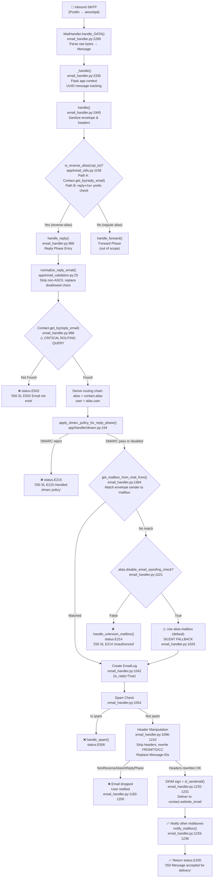

# Investigation: Alias Reply-Handling Flow in SimpleLogin

## End-to-End Trace of Inbound Reply Messages and Routing Failure Point Identification

**Branch:** `app_2cd6ee777f8c`
**Commit:** `2cd6ee77` — "chore: emit some missing contact audit logs (#2269)"
**Date:** Generated via static code analysis of the SimpleLogin repository

---

### Executive Summary

This document traces the complete runtime path of an inbound reply message through the SimpleLogin email aliasing system, from SMTP reception to outbound delivery. The investigation identifies **seven distinct routing decision points** in the reply pipeline, analyzes each for potential failure modes, and concludes that the **most likely single point where incorrect user routing could originate** is the `Contact.get_by(reply_email=...)` database lookup at `email_handler.py:986`, preceded by the `normalize_reply_email()` normalization step at line 984. A secondary concern is the asymmetric canonical email matching in `get_mailbox_from_mail_from()` at line 1387, where the envelope sender is canonicalized but the stored mailbox email is not.

---

## Table of Contents

1. [End-to-End Reply Flow Trace](#1-end-to-end-reply-flow-trace)
2. [Identification of the Most Likely Point of Incorrect Routing](#2-identification-of-the-most-likely-point-of-incorrect-routing)
3. [Edge Case Analysis](#3-edge-case-analysis)
4. [Data Flow Diagram](#4-data-flow-diagram)
5. [Summary and Conclusion](#5-summary-and-conclusion)

---

## 1. End-to-End Reply Flow Trace

This section documents each stage of the reply-handling pipeline with exact code references verified against the source repository.

### Stage 1 — SMTP Reception

**Entry point:** `MailHandler.handle_DATA()` at `email_handler.py:2289`

The `MailHandler` class (line 2288) implements the aiosmtpd `handle_DATA` callback. When Postfix delivers an inbound email to the SimpleLogin SMTP server, this async method is invoked:

```python
# email_handler.py:2289-2292
async def handle_DATA(self, server, session, envelope: Envelope):
    msg = email.message_from_bytes(envelope.original_content)
    try:
        ret = self._handle(envelope, msg)
        return ret
```

**Key operations:**
- Parses the raw SMTP payload into a `email.message.Message` object via `email.message_from_bytes(envelope.original_content)` (line 2290)
- Delegates all processing to `self._handle(envelope, msg)` (line 2292)

**Exception handling hierarchy:**
- `CannotCreateContactForReverseAlias` → returns `status.E524` ("550 SL E524 Wrong use of reverse-alias") (lines 2297–2307)
- `VERPReply`, `VERPForward`, `VERPTransactional` → returns `status.E213` ("250 SL E213 Unknown email ignored") (lines 2308–2318)
- Generic `Exception` → saves envelope for debugging, returns `status.E404` ("421 SL E404 Unexpected error - Retry later") (lines 2319–2332)

**Routing relevance:** This stage does not make routing decisions — it is a pure pass-through to `_handle()`. The exception handling ensures that known error classes produce deterministic SMTP status codes.

---

### Stage 2 — Flask Context & Instrumentation

**Function:** `_handle()` at `email_handler.py:2335`

```python
# email_handler.py:2334-2335
@newrelic.agent.background_task()
def _handle(self, envelope: Envelope, msg: Message):
```

**Key operations:**
- Decorated with `@newrelic.agent.background_task()` for APM instrumentation (line 2334)
- Generates a unique tracking ID: `message_id = str(uuid.uuid4())` (line 2339)
- Sets the tracking ID into a context variable via `set_message_id(message_id)` (line 2340)
- Wraps all processing inside a Flask application context: `with create_light_app().app_context():` (line 2352)
- Calls the central routing hub: `return_status = handle(envelope, msg)` (line 2353)
- **Post-processing SPF downgrade** (lines 2357–2365): If the return status starts with `"5"` and the SPF check result is `fail` or `soft_fail`, the 5xx status is downgraded to `status.E216` ("250 SL E216 Handled spf policy") to prevent Postfix from generating bounce reports for messages with failed SPF — avoiding backscatter.

**Routing relevance:** This stage does not make routing decisions itself, but the SPF-based 5xx→2xx downgrade at lines 2357–2365 can silently swallow delivery errors when the inbound SPF check fails.

---

### Stage 3 — Central Routing Hub

**Function:** `handle()` at `email_handler.py:1945`

This is the central dispatcher that determines whether an email enters the **reply phase** or the **forward phase**.

**Envelope sanitization (lines 1948–1952):**
```python
# email_handler.py:1949-1952
mail_from = sanitize_email(envelope.mail_from)
rcpt_tos = [sanitize_email(rcpt_to) for rcpt_to in envelope.rcpt_tos]
envelope.mail_from = mail_from
envelope.rcpt_tos = rcpt_tos
```
`sanitize_email()` (defined at `app/utils.py:97`) lowercases the address, strips whitespace, and replaces newlines.

**Header sanitization (lines 1974–1978):**
```python
# email_handler.py:1974-1978
sanitize_header(msg, headers.FROM)
sanitize_header(msg, headers.TO)
sanitize_header(msg, headers.CC)
sanitize_header(msg, headers.REPLY_TO)
sanitize_header(msg, headers.MESSAGE_ID)
```

**Pre-dispatch checks (lines 1996–2163):**
Before reaching the reply/forward dispatch, the function processes several special cases in order:
1. **Reverse-alias in mail_from or FROM header** (lines 1996–2027): Detects and alerts if a reverse-alias is used as the sender — this should never happen in normal operation.
2. **VERP bounce/transactional emails** (lines 2034–2117): Handles bounce reports and out-of-office replies to VERP addresses (transactional, forward, and reply VERPs).
3. **Hotmail/Yahoo complaints** (lines 2120–2142): Processes ISP complaint feedback loops.
4. **Rate limiting** (line 2145): Applies via `rate_limited()` — currently always returns `False` as the rate limiter is disabled at `app/email/rate_limit.py:97`.
5. **Out-of-office to reverse-alias** (line 2166): If `mail_from == "<>"` and the recipient is a reverse-alias, the email is treated as an out-of-office notification → `status.E206`.

**CRITICAL DISPATCH — Reply vs. Forward (lines 2194–2211):**

```python
# email_handler.py:2194-2199
# Reply case: the recipient is a reverse alias. Used to start with "reply+" or "ra+"
if is_reverse_alias(rcpt_to):
    LOG.d(
        "Reply phase %s(%s) -> %s", mail_from, copy_msg[headers.FROM], rcpt_to
    )
    is_delivered, smtp_status = handle_reply(envelope, copy_msg, rcpt_to)
```

If `is_reverse_alias(rcpt_to)` returns `True`, the email enters the **reply phase** via `handle_reply()`. Otherwise, it enters the **forward phase** via `handle_forward()` (lines 2201–2211).

**Routing relevance:** This is the **first routing decision point**. An incorrect result from `is_reverse_alias()` would send the email to the wrong phase entirely — a reply could be treated as a forward, or vice versa.

---

### Stage 4 — Reverse-Alias Detection

**Function:** `is_reverse_alias()` at `app/email_utils.py:1156`

```python
# app/email_utils.py:1156-1163
def is_reverse_alias(address: str) -> bool:
    # to take into account the new reverse-alias that doesn't start with "ra+"
    if Contact.get_by(reply_email=address):
        return True

    return address.endswith(f"@{config.EMAIL_DOMAIN}") and (
        address.startswith("reply+") or address.startswith("ra+")
    )
```

This function uses **two-path detection logic**:

- **Path A (Database lookup, line 1158):** Queries `Contact.get_by(reply_email=address)`. If a Contact record exists with this `reply_email`, returns `True`. This is the primary detection method for modern reply addresses.
- **Path B (Prefix matching, lines 1161–1163):** Checks if the address ends with `@{EMAIL_DOMAIN}` AND starts with `"reply+"` or `"ra+"`. This is a legacy fallback for older reverse-alias formats.

**How modern reply addresses are generated:**
The `generate_reply_email()` function at `app/email_utils.py:1103` creates reply addresses using:
- **With sender included** (lines 1137–1143): `{sanitized_contact_email}_{random_string(5-10)}@{reply_domain}` — no `reply+` or `ra+` prefix.
- **Without sender** (lines 1144–1148): `{random_string(20-50)}@{reply_domain}` — purely random, no prefix.

Before returning a generated reply email, it checks `available_sl_email(reply_email)` (line 1150, defined at `app/models.py:1425`) which verifies the address isn't already used by an Alias, Contact, or DeletedAlias.

**Routing risk analysis:**
- Path A hits the database for every recipient address. If the database is slow or temporarily unavailable, the query may fail silently, and Path B would only catch legacy `reply+`/`ra+` addresses.
- Path B catches legacy addresses that may have been **deleted** from the Contact table — passing `is_reverse_alias()` but subsequently failing `Contact.get_by()` in `handle_reply()`.
- Modern reply addresses (random strings without prefix) rely **entirely** on Path A. A database issue would cause them to fall through to `handle_forward()`, where they would be treated as unknown aliases.

---

### Stage 5 — Reply Phase Entry

**Function:** `handle_reply()` at `email_handler.py:966`

```python
# email_handler.py:966-984
def handle_reply(envelope, msg: Message, rcpt_to: str) -> (bool, str):
    reply_email = rcpt_to  # line 972

    reply_domain = get_email_domain_part(reply_email)  # line 974

    # reply_email must end with EMAIL_DOMAIN or a domain that can be used as reverse alias domain
    if not reply_email.endswith(EMAIL_DOMAIN):  # line 977
        sl_domain: SLDomain = SLDomain.get_by(domain=reply_domain)  # line 978
        if sl_domain is None:
            LOG.w(f"Reply email {reply_email} has wrong domain")
            return False, status.E501  # line 981

    # handle case where reply email is generated with non-allowed char
    reply_email = normalize_reply_email(reply_email)  # line 984
```

**Key operations:**
1. Assigns `reply_email = rcpt_to` (line 972) — the recipient address from the SMTP envelope is the reverse-alias.
2. **Domain validation** (lines 977–981): The reply domain must either be `EMAIL_DOMAIN` or an `SLDomain` configured for reverse aliases. If neither matches → `status.E501`.
3. **Normalization** (line 984): `normalize_reply_email(reply_email)` from `app/email_validation.py:25`.

**`normalize_reply_email()` implementation** (`app/email_validation.py:25-38`):

```python
# app/email_validation.py:25-38
def normalize_reply_email(reply_email: str) -> str:
    """Handle the case where reply email contains *strange* char that was wrongly generated in the past"""
    if not reply_email.isascii():
        reply_email = convert_to_id(reply_email)  # line 28

    ret = []
    # drop all control characters like shift, separator, etc
    for c in reply_email:  # line 32
        if c not in _ALLOWED_CHARS:  # line 33
            ret.append("_")  # line 34
        else:
            ret.append(c)  # line 36

    return "".join(ret)
```

Where `_ALLOWED_CHARS` is defined at `app/email_validation.py:9`:
```python
_ALLOWED_CHARS = "abcdefghijklmnopqrstuvwxyzABCDEFGHIJKLMNOPQRSTUVWXYZ0123456789_-.+@"
```

And `convert_to_id()` at `app/utils.py:50-56`:
```python
# app/utils.py:50-56
def convert_to_id(s: str):
    """convert a string to id-like: remove space, remove special accent"""
    s = s.lower()
    s = unidecode(s)
    s = s.replace(" ", "")
    return s[:256]
```

**Routing risk:** This normalization is **lossy**. If the stored `reply_email` in the Contact table contains characters that normalize differently than the inbound address, the subsequent lookup will fail or match the wrong record. Specifically:
- `convert_to_id()` applies `unidecode()` transliteration and lowercasing — an irreversible transformation.
- Any character NOT in `_ALLOWED_CHARS` is replaced with `_`. If two different reply addresses differ only in characters outside `_ALLOWED_CHARS`, they would normalize to the same value, creating a potential collision.

---

### Stage 6 — Contact Resolution (CRITICAL ROUTING QUERY)

**Location:** `email_handler.py:986-1002`

```python
# email_handler.py:986-1002
contact = Contact.get_by(reply_email=reply_email)
if not contact:
    LOG.w(f"No contact with {reply_email} as reverse alias")
    return False, status.E502  # "550 SL E502 Email not exist"
if not contact.user.is_active():
    LOG.w(f"User {contact.user} has been soft deleted")
    return False, status.E502

alias = contact.alias  # line 994
alias_address: str = contact.alias.email  # line 995
alias_domain = get_email_domain_part(alias_address)  # line 996

# Sanity check: verify alias domain is managed by SimpleLogin
if not is_valid_alias_address_domain(alias.email):  # line 1000
    LOG.e("%s domain isn't known", alias)
    return False, status.E503
```

**This is the CRITICAL ROUTING QUERY.** The `Contact.get_by(reply_email=reply_email)` call at line 986 is the **single query that determines the entire downstream routing path:**

- `contact` → provides the Contact record
- `contact.alias` (line 994) → provides the Alias record
- `alias.user` (line 1004) → provides the User who owns this alias
- `contact.website_email` (used at line 1226) → provides the **final delivery target**

The `reply_email` column is defined at `app/models.py:1899`:
```python
# app/models.py:1895-1899
# when user clicks on "reply", they will reply to this address.
# This address allows to hide user personal email
# this reply email is created every time a website sends an email to user
# it used to have the prefix "reply+" or "ra+"
reply_email = sa.Column(sa.String(512), nullable=False, index=True)
```

**Critical observation:** The `reply_email` column is `index=True` but is **NOT marked as unique**. The uniqueness is enforced programmatically by `available_sl_email()` at `app/models.py:1425-1432`, which checks `Contact.get_by(reply_email=email)` during `generate_reply_email()`. However, race conditions during concurrent Contact creation could theoretically result in duplicate `reply_email` values. In that case, `Contact.get_by()` (which uses SQLAlchemy's `filter_by().first()`) would return the **first matching record** — which might not be the intended one.

**Post-lookup validations:**
- If `contact.user.is_active()` is False → `status.E502` (lines 990–992)
- If `alias.email` domain is not a valid alias address domain → `status.E503` (lines 1000–1002)
- If `user.can_send_or_receive()` is False → `status.E504` (lines 1007–1009)

---

### Stage 7 — DMARC Policy for Reply Phase

**Location:** `email_handler.py:1011-1016`

```python
# email_handler.py:1011-1016
# Check if we need to reject or quarantine based on dmarc
dmarc_delivery_status = apply_dmarc_policy_for_reply_phase(
    alias, contact, envelope, msg
)
if dmarc_delivery_status is not None:
    return False, dmarc_delivery_status
```

The `apply_dmarc_policy_for_reply_phase()` function is defined at `app/handler/dmarc.py:154`:

```python
# app/handler/dmarc.py:154-194
def apply_dmarc_policy_for_reply_phase(
    alias_from: Alias, contact_recipient: Contact, envelope: Envelope, msg: Message
) -> Optional[str]:
    spam_result = SpamdResult.extract_from_headers(msg, Phase.reply)
    if not DMARC_CHECK_ENABLED or not spam_result:
        return None  # line 160

    if spam_result.dmarc not in (
        DmarcCheckResult.quarantine,
        DmarcCheckResult.reject,
        DmarcCheckResult.soft_fail,
    ):
        return None  # line 168

    # ... sends alert to user ...
    return status.E215  # "250 SL E215 Handled dmarc policy"
```

**Routing relevance:** DMARC enforcement can reject a legitimate reply if the user's mailbox domain has a strict DMARC policy and the SPF/DKIM checks fail. The reply is rejected with `status.E215` (a 2xx code to avoid backscatter) and the user is notified via email. This is a policy-based rejection, not a routing error.

---

### Stage 8 — Mailbox Authorization (Anti-Spoofing)

**Function:** `get_mailbox_from_mail_from()` at `email_handler.py:1364`

Called at line 1019:
```python
# email_handler.py:1019
mailbox = get_mailbox_from_mail_from(mail_from, alias)
```

**Implementation:**

```python
# email_handler.py:1364-1387
def get_mailbox_from_mail_from(mail_from: str, alias) -> Optional[Mailbox]:
    """return the corresponding mailbox given the mail_from and alias
    Usually the mail_from=mailbox.email but it can also be one of the authorized address
    """

    def __check(email_address: str, alias: Alias) -> Optional[Mailbox]:
        for mailbox in alias.mailboxes:  # line 1370
            if mailbox.email == email_address:  # line 1371
                return mailbox

            for authorized_address in mailbox.authorized_addresses:  # line 1374
                if authorized_address.email == email_address:  # line 1375
                    return mailbox
        return None

    # We need to first check for the uncanonicalized version because we still have users
    # in the db with the email non canonicalized. So if it matches the already existing one
    # use that, otherwise check the canonical one
    return __check(mail_from, alias) or __check(canonicalize_email(mail_from), alias)
```

**Two-pass matching (line 1387):**
1. **First pass:** `__check(mail_from, alias)` — exact match against raw `mail_from`
2. **Second pass:** `__check(canonicalize_email(mail_from), alias)` — match against canonicalized `mail_from`

The `Alias.mailboxes` property at `app/models.py:1580-1589`:
```python
# app/models.py:1580-1589
@property
def mailboxes(self):
    ret = [self.mailbox]
    for m in self._mailboxes:
        if m.id is not self.mailbox.id:
            ret.append(m)
    ret = [mb for mb in ret if mb.verified]
    ret = sorted(ret, key=lambda mb: mb.email)
    return ret
```

This returns the **default mailbox first**, then additional mailboxes sorted by email, filtering to only verified ones.

**`canonicalize_email()` at `app/utils.py:78-94`:**
```python
# app/utils.py:78-94
def canonicalize_email(email_address: str) -> str:
    email_address = sanitize_email(email_address)
    parts = email_address.split("@")
    if len(parts) != 2:
        return ""
    domain = parts[1]
    if domain not in ("gmail.com", "protonmail.com", "proton.me", "pm.me"):
        return email_address  # No transformation for other domains
    first = parts[0]
    try:
        plus_idx = first.index("+")
        first = first[:plus_idx]  # Truncate at "+"
    except ValueError:
        pass
    first = first.replace(".", "")  # Remove all dots
    return f"{first}@{parts[1]}".lower().strip()
```

Only applies to Gmail, ProtonMail, Proton.me, and PM.me domains. For all other domains, returns the email unchanged.

**Routing risk — asymmetric canonical comparison:**
The second pass (line 1387) canonicalizes `mail_from` but does **NOT** canonicalize `mailbox.email` for the comparison inside `__check()`. This means:

| Scenario | `mail_from` | `canonicalize(mail_from)` | Stored `mailbox.email` | Match? |
|---|---|---|---|---|
| User sends from dotted form | `john.doe@gmail.com` | `johndoe@gmail.com` | `johndoe@gmail.com` | ✅ Second pass |
| User sends from canonical form | `johndoe@gmail.com` | `johndoe@gmail.com` | `john.doe@gmail.com` | ❌ Neither pass |
| User sends from dotted form | `john.doe@gmail.com` | `johndoe@gmail.com` | `john.doe@gmail.com` | ✅ First pass |

The code comment at lines 1385–1386 explicitly acknowledges this limitation: _"We need to first check for the uncanonicalized version because we still have users in the db with the email non canonicalized."_

**When mailbox is not found (lines 1020–1034):**
```python
# email_handler.py:1020-1034
if not mailbox:
    if alias.disable_email_spoofing_check:  # line 1021
        # ignore this error, use default alias mailbox
        LOG.w(...)
        mailbox = alias.mailbox  # line 1029 — SILENT FALLBACK
    else:
        # only mailbox can send email to the reply-email
        handle_unknown_mailbox(envelope, msg, reply_email, user, alias, contact)
        # return 2** to avoid Postfix sending out bounces and avoid backscatter issue
        return False, status.E214  # line 1034 — "250 SL E214 Unauthorized"
```

---

### Stage 9 — SPF Enforcement

**Location:** `email_handler.py:1036-1040`

```python
# email_handler.py:1036-1040
if ENFORCE_SPF and mailbox.force_spf and not alias.disable_email_spoofing_check:
    if not spf_pass(envelope, mailbox, user, alias, contact.website_email, msg):
        return True, status.E201  # "250 SL E201"
```

SPF enforcement is conditional on three flags:
1. `ENFORCE_SPF` config constant must be `True`
2. `mailbox.force_spf` must be `True` (default per `app/models.py:2717`)
3. `alias.disable_email_spoofing_check` must be `False`

**Routing relevance:** SPF failure causes the reply to be silently accepted (2xx) but not delivered. The user is not explicitly told the email failed SPF.

---

### Stage 10 — EmailLog Creation

**Location:** `email_handler.py:1042-1051`

```python
# email_handler.py:1042-1051
email_log = EmailLog.create(
    contact_id=contact.id,
    alias_id=contact.alias_id,
    is_reply=True,
    user_id=contact.user_id,
    mailbox_id=mailbox.id,
    message_id=msg[headers.MESSAGE_ID],
    commit=True,
)
```

Creates an `EmailLog` record marking this as a reply (`is_reply=True`) with the resolved `contact_id`, `alias_id`, `user_id`, and `mailbox_id`. This record is used for:
- Bounce tracking (via VERP return paths)
- Email threading (via `MessageIDMatching`)
- Audit logging and analytics

---

### Stage 11 — Spam Check

**Location:** `email_handler.py:1053-1094`

```python
# email_handler.py:1054
if ENABLE_SPAM_ASSASSIN:
```

If SpamAssassin is enabled, the reply is scored against `MAX_REPLY_PHASE_SPAM_SCORE`. Two scoring paths:
1. **SpamAssassin host available** (lines 1059–1074): Direct scoring via `get_spam_score(msg, email_log)`
2. **Fallback** (lines 1076–1078): `get_spam_info(msg, max_score=MAX_REPLY_PHASE_SPAM_SCORE)`

If spam is detected (line 1080): `handle_spam()` is called and the function returns `status.E506` ("550 SL E506 Email detected as spam") (line 1094).

---

### Stage 12 — Header Manipulation

**Location:** `email_handler.py:1096-1210`

**Step 12a — Header stripping (lines 1096–1112):**
`delete_all_headers_except()` preserves only: `FROM`, `TO`, `CC`, `SUBJECT`, `DATE`, `MESSAGE_ID`, `REFERENCES`, `IN_REPLY_TO`, `SL_QUEUE_ID`, and all MIME headers. All other headers (including `Received`, `X-*`, `Authentication-Results`, etc.) are removed.

**Step 12b — Save original TO/CC (lines 1114–1115):**
```python
orig_to = msg[headers.TO]
orig_cc = msg[headers.CC]
```
These are preserved for the multi-mailbox notification step (Stage 13).

**Step 12c — Reverse-alias replacement in body (lines 1119–1148):**
If `user.replace_reverse_alias` is True:
1. Replaces the specific `reply_email` with `contact.website_email` in the message body (line 1121)
2. Replaces `mailbox.email` with `alias.email` (line 1123)
3. If `config.ENABLE_ALL_REVERSE_ALIAS_REPLACEMENT` is True: queries all contacts for this alias (up to `MAX_NB_REVERSE_ALIAS_REPLACEMENT`) and replaces each `reply_email` with the corresponding `website_email` (lines 1125–1148)

**Step 12d — PGP encryption (lines 1151–1164):**
If `contact.pgp_finger_print` is set and `user.is_premium()`: encrypts the message via `prepare_pgp_message()`. On PGP failure: deletes the EmailLog and returns `status.E402` for retry.

**Step 12e — FROM header rewriting (lines 1168–1172):**
```python
recipient_name = get_alias_recipient_name(alias)  # line 1168
add_or_replace_header(msg, headers.FROM, recipient_name.name)  # line 1172
```
The FROM header is set to the alias identity (e.g., `alias@domain.com` or `"Display Name" <alias@domain.com>`).

**Step 12f — TO/CC header rewriting (lines 1174–1184):**
```python
# email_handler.py:1174-1181
try:
    if str(msg[headers.TO]).lower() == "undisclosed-recipients:;":
        LOG.d("email is sent in BCC mode")
    else:
        replace_header_when_reply(msg, alias, headers.TO)

    replace_header_when_reply(msg, alias, headers.CC)
```

The `replace_header_when_reply()` function at `email_handler.py:345`:
```python
# email_handler.py:345-384
def replace_header_when_reply(msg: Message, alias: Alias, header: str):
    for _, reply_email in getaddresses(headers):
        # no transformation when alias is already in the header
        if reply_email == alias.email:  # line 361
            continue

        contact = Contact.get_by(reply_email=reply_email)  # line 364
        if not contact:
            raise NonReverseAliasInReplyPhase(reply_email)  # line 372
        else:
            new_addrs.append(sl_formataddr((contact.name, contact.website_email)))
```

For each address in the TO/CC headers:
- If it equals the alias email → skip (no transformation)
- If a Contact exists with this `reply_email` → replace with `contact.website_email`
- If no Contact found → raise `NonReverseAliasInReplyPhase` (line 372)

When `NonReverseAliasInReplyPhase` is caught (lines 1182–1200):
- The EmailLog is deleted (line 1186)
- The user is sent a notification email explaining the issue (lines 1188–1198)
- Returns `status.E200` — the email is silently dropped

**Step 12g — Message-ID replacement (line 1202):**
`replace_original_message_id(alias, email_log, msg)` (function at line 1296) maps the original Message-ID to a SimpleLogin-generated Message-ID in the `MessageIDMatching` table, preserving email thread continuity.

**Step 12h — Direction header (line 1209):**
```python
msg[headers.SL_DIRECTION] = "Reply"
```

---

### Stage 13 — DKIM Signing and Delivery

**Location:** `email_handler.py:1220-1261`

**DKIM signing (lines 1220–1221):**
```python
if should_add_dkim_signature(alias_domain):
    add_dkim_signature(msg, alias_domain)
```

**Outbound delivery (lines 1224–1231):**
```python
# email_handler.py:1224-1231
sl_sendmail(
    generate_verp_email(VerpType.bounce_reply, email_log.id, alias_domain),
    contact.website_email,  # <-- THIS IS THE FINAL ROUTING TARGET
    msg,
    envelope.mail_options,
    envelope.rcpt_options,
    is_forward=False,
)
```

- **Return path:** `generate_verp_email(VerpType.bounce_reply, email_log.id, alias_domain)` — a VERP address that encodes the `email_log.id` for bounce tracking.
- **Recipient:** `contact.website_email` — the external email address that the original sender used. This is the **final routing target** — the email goes to whatever address is stored in this field.

**Multi-mailbox notification (lines 1233–1236):**
```python
other_mailboxes = [mb for mb in alias.mailboxes if mb.email != mailbox.email]
for mb in other_mailboxes:
    notify_mailbox(alias, mailbox, mb, msg, orig_to, orig_cc, alias_domain)
```

The `notify_mailbox()` function at line 1264 sends a notification to each additional mailbox associated with the alias, informing them that a reply was sent.

**Delivery failure handling (lines 1238–1261):**
If `sl_sendmail()` raises an exception:
- The EmailLog is deleted (line 1240)
- An error notification is sent to the mailbox (lines 1241–1258)
- Returns `status.E200` (line 1261) — the error is swallowed with a 2xx status to prevent backscatter

---

## 2. Identification of the Most Likely Point of Incorrect Routing

This section ranks all identified routing decision points by their likelihood of causing "replies routed to the wrong user," with evidence-based rationale grounded in the actual code.

### Failure Point #1 (HIGHEST LIKELIHOOD): Contact Resolution Query

**Location:** `Contact.get_by(reply_email=reply_email)` at `email_handler.py:986`

**Rationale:** This is the **single database query** that determines which Contact — and therefore which Alias, which User, and which `website_email` delivery target — a reply is associated with. Every downstream routing decision is derived from this query result.

**Evidence of risk:**

1. **The `reply_email` column is not unique at the database level.** At `app/models.py:1899`, the column is defined as `sa.Column(sa.String(512), nullable=False, index=True)` — it has an index but no unique constraint. While `available_sl_email()` at `app/models.py:1425-1432` checks for uniqueness during generation, race conditions during concurrent `create_contact()` calls (see `app/contact_utils.py:90-103`) could result in duplicate `reply_email` values. In that case, `get_by()` (which uses `filter_by().first()`) would return an arbitrary matching record.

2. **The normalization step at line 984 transforms the lookup key.** The `normalize_reply_email()` function replaces any character not in `_ALLOWED_CHARS` with `_`. If two different `reply_email` values stored in the database differ only in characters outside `_ALLOWED_CHARS`, they would normalize to the same string, and the query would return whichever Contact happens to be first in the database — which could be the wrong one.

3. **The entire downstream routing chain depends on this one result:**
   - Wrong Contact → wrong `contact.alias` → wrong user
   - Wrong Contact → wrong `contact.website_email` → reply delivered to wrong external recipient
   - Wrong Contact → wrong alias → wrong mailbox authorization → different mailbox accepted or rejected

**Impact:** If the wrong Contact is returned, the reply is delivered to the wrong external recipient (`contact.website_email`), attributed to the wrong user, and logged against the wrong alias. This is the highest-impact failure mode in the entire pipeline.

---

### Failure Point #2 (HIGH LIKELIHOOD): Reply Email Normalization

**Location:** `normalize_reply_email()` at `app/email_validation.py:25`

**Rationale:** This function transforms the reply address **before** the Contact lookup. Any transformation that changes the lookup key relative to what is stored in the database will cause the lookup to either fail (returning `None` → `status.E502`) or match the wrong record (if normalization produces a collision).

**Evidence of risk:**

1. **Lossy transformation chain:** When the input is non-ASCII, `convert_to_id()` (at `app/utils.py:50-56`) applies `unidecode()` transliteration followed by lowercasing — this is irreversible. For example, `ü` becomes `u`, `é` becomes `e`, etc.

2. **Character replacement creates collisions:** The character filter (lines 32–36) replaces any character NOT in `_ALLOWED_CHARS` with `_`. Consider two stored reply emails:
   - `abc!def@domain.com` → normalizes to `abc_def@domain.com`
   - `abc#def@domain.com` → normalizes to `abc_def@domain.com`
   Both normalize to the same value, creating an ambiguous lookup.

3. **Asymmetry between generation and lookup:** The `generate_reply_email()` function at `app/email_utils.py:1136-1148` generates reply emails using `random_string()` (which produces only lowercase ASCII letters) and processes contact email prefixes through `convert_to_id()` and `convert_to_alphanumeric()`. These transformations SHOULD produce safe values. However, legacy reply emails with `reply+` or `ra+` prefixes (mentioned at `app/models.py:1898`) may contain characters that normalize differently under the current `normalize_reply_email()` implementation than they did when originally stored.

**Impact:** If normalization changes the lookup key, the reply either fails with `status.E502` (Contact not found) or — in the collision scenario — matches a different Contact, leading to the same cascading wrong-routing as Failure Point #1.

---

### Failure Point #3 (MEDIUM LIKELIHOOD): `is_reverse_alias()` Dual-Path Inconsistency

**Location:** `is_reverse_alias()` at `app/email_utils.py:1156`

**Rationale:** Path A (database lookup) and Path B (prefix matching) can give **different answers** for the same address, leading to inconsistent routing decisions.

**Evidence of risk:**

1. **Deleted legacy Contact:** A `reply+xyz@domain.com` address where the Contact record has been deleted from the database:
   - Path A: `Contact.get_by(reply_email="reply+xyz@domain.com")` → `None` → returns `False`
   - Path B: address ends with `@{EMAIL_DOMAIN}` AND starts with `"reply+"` → returns `True`
   - Result: `is_reverse_alias()` returns `True`, email enters `handle_reply()`, but `Contact.get_by()` at line 986 returns `None` → `status.E502`. The email is bounced instead of being routed to `handle_forward()`.

2. **Database unavailability for modern addresses:** A modern reply address (random string, no prefix) where the database query in Path A fails or times out:
   - Path A: query fails → falls through
   - Path B: no `reply+`/`ra+` prefix → returns `False`
   - Result: `is_reverse_alias()` returns `False`, the email enters `handle_forward()` instead of `handle_reply()`. The reply is treated as a forward to an unknown alias, potentially creating a new alias or returning an error.

**Impact:** Scenario 1 causes a reply to bounce instead of being delivered. Scenario 2 causes a reply to enter the wrong processing phase entirely. Neither results in delivery to a wrong user, but both result in failed delivery.

---

### Failure Point #4 (MEDIUM LIKELIHOOD): Mailbox Authorization Canonical Mismatch

**Location:** `get_mailbox_from_mail_from()` at `email_handler.py:1364-1387`

**Rationale:** The two-pass matching at line 1387 canonicalizes `mail_from` in the second pass but does **NOT** canonicalize `mailbox.email` inside `__check()`. This creates an asymmetric comparison.

**Evidence of risk:**

The matching logic at line 1387:
```python
return __check(mail_from, alias) or __check(canonicalize_email(mail_from), alias)
```

Inside `__check()`, the comparison is `mailbox.email == email_address` (line 1371). The stored `mailbox.email` is never canonicalized.

**Concrete scenario:**
- Stored `mailbox.email` = `john.doe@gmail.com` (non-canonical — dots present)
- `mail_from` = `johndoe@gmail.com` (canonical form — no dots)
- First pass: `"johndoe@gmail.com" == "john.doe@gmail.com"` → `False`
- Second pass: `canonicalize_email("johndoe@gmail.com")` = `"johndoe@gmail.com"` (already canonical); compared against stored `"john.doe@gmail.com"` → `False`
- **Result: No mailbox match.** The mailbox is not found despite being the same Gmail account.

The code comment at lines 1385–1386 explicitly acknowledges this design trade-off.

**Downstream impact:**
- If `alias.disable_email_spoofing_check` is `False` → `handle_unknown_mailbox()` is called (line 1032), user receives an alert, and the reply is rejected with `status.E214`.
- If `alias.disable_email_spoofing_check` is `True` → the system silently falls back to `alias.mailbox` (line 1029), which may be a different mailbox than the actual sender.

**Existing test coverage:** `test_send_email_from_non_canonical_address_on_reply` at `tests/test_email_handler.py:315` tests the scenario where the user's default mailbox email IS the canonical form, and they send from the non-canonical form. This specific test passes because `Mailbox.create()` at `app/models.py:2819-2822` calls `sanitize_email()` (which lowercases but does NOT canonicalize), and the user was created with the canonical form. The test does NOT cover the reverse case (stored non-canonical, sending canonical).

---

### Failure Point #5 (MEDIUM-LOW LIKELIHOOD): `disable_email_spoofing_check` Silent Fallback

**Location:** `email_handler.py:1021-1029`

```python
if alias.disable_email_spoofing_check:
    LOG.w(...)
    mailbox = alias.mailbox  # SILENT FALLBACK to default mailbox
```

**Rationale:** When the spoofing check is disabled and no mailbox matches the sender, the system silently uses the **default mailbox** (`alias.mailbox`) regardless of which mailbox actually sent the email.

**Impact assessment:** The final delivery target (`contact.website_email`) is **unaffected** by this fallback — the reply still goes to the correct external recipient. However:
- The EmailLog records the wrong `mailbox_id` (line 1047)
- Multi-mailbox notifications (lines 1233–1236) may notify the wrong set of mailboxes
- Bounce tracking (via VERP) will attribute the bounce to the wrong mailbox

This is primarily a logging/attribution error, not a routing error. The external recipient still receives the correct reply.

---

### Failure Point #6 (LOW LIKELIHOOD): `replace_header_when_reply()` Email Drop

**Location:** `replace_header_when_reply()` at `email_handler.py:345-384`

**Rationale:** When replacing TO/CC headers, each address is looked up via `Contact.get_by(reply_email=reply_email)` at line 364. If a non-reverse-alias address appears in TO or CC, `NonReverseAliasInReplyPhase` is raised at line 372.

**Exception definition** (`app/errors.py:36-39`):
```python
class NonReverseAliasInReplyPhase(SLException):
    """raised when a non reverse-alias is used during a reply phase"""
    pass
```

**Common trigger:** A user hits "Reply All" on a forwarded email that had additional recipients in CC. Those recipients' real email addresses appear in the CC header as-is (they are not reverse-aliases), causing the exception.

**Impact:** The **entire email is dropped** — not just the problematic CC. The EmailLog is deleted (line 1186), and the user receives a notification. The email is not delivered to anyone.

---

### Failure Point #7 (LOW LIKELIHOOD): Stale or Reassigned Contact Records

**Location:** `create_contact()` in `app/contact_utils.py:42-120`

**Rationale:** The Contact creation function handles `IntegrityError` by rolling back the session and fetching the existing contact (lines 113–119):

```python
# app/contact_utils.py:113-119
except IntegrityError:
    Session.rollback()
    LOG.info(f"Contact with email {email} for alias_id {alias.id} already existed, fetching from DB")
    contact = Contact.get_by(alias_id=alias.id, website_email=email)
    return __update_contact_if_needed(contact, name, mail_from)
```

The `IntegrityError` is caught due to the unique constraint on `(alias_id, website_email)` at `app/models.py:1874-1876`. The `reply_email` is generated BEFORE the try block (line 89) but is only stored if the insert succeeds. If the insert fails, the generated `reply_email` is discarded and the existing contact (with its original `reply_email`) is returned.

**Risk scenario:** There is no production code path that reassigns a Contact's `reply_email` after creation. The value is set once during `Contact.create()` (line 92–103 of `contact_utils.py`) and never updated. However, if a manual database operation or migration were to change a `reply_email`, replies to the old address would fail (Contact not found → `E502`) and replies to the new address would succeed only if the new address was also a valid reverse-alias.

**Impact:** Under normal operation, this is extremely unlikely. The risk exists only through direct database manipulation.

---

### Ranked Failure Points Summary

| Rank | Failure Point | Location | Likelihood | Impact | Mechanism |
|---|---|---|---|---|---|
| 1 | Contact resolution query | `email_handler.py:986` | **Highest** | Wrong recipient delivery | Wrong Contact → wrong alias → wrong user → wrong `website_email` |
| 2 | Reply email normalization | `app/email_validation.py:25` | **High** | Wrong or failed lookup | Lossy normalization transforms lookup key → collision or miss |
| 3 | `is_reverse_alias()` dual-path | `app/email_utils.py:1156` | **Medium** | Wrong phase or bounce | Database/prefix inconsistency → wrong phase selection |
| 4 | Canonical email mismatch | `email_handler.py:1387` | **Medium** | Rejected or wrong mailbox | Asymmetric canonicalization → mailbox not found |
| 5 | Spoofing check fallback | `email_handler.py:1021-1029` | **Medium-Low** | Wrong mailbox attribution | Silent default mailbox → wrong EmailLog attribution |
| 6 | `replace_header_when_reply()` | `email_handler.py:345` | **Low** | Email dropped entirely | Non-reverse-alias in TO/CC → `NonReverseAliasInReplyPhase` |
| 7 | Stale Contact records | `app/contact_utils.py:113-119` | **Low** | Failed delivery | Reassigned `reply_email` → lookup miss or wrong match |

---

## 3. Edge Case Analysis

### 3.1 Canonical vs. Non-Canonical Email Matching

**`canonicalize_email()` at `app/utils.py:78-94`** applies Gmail/ProtonMail-specific transformations:
- Truncates the local part at the first `+` sign (lines 88–92)
- Removes all dots from the local part (line 93)
- Only applies to domains: `gmail.com`, `protonmail.com`, `proton.me`, `pm.me` (line 84)
- For all other domains, returns the address unchanged after `sanitize_email()` (line 85)

**`Mailbox.create()` at `app/models.py:2819-2822`** sanitizes via `sanitize_email()` (lowercase, strip whitespace) but does **NOT** canonicalize:
```python
@classmethod
def create(cls, **kw):
    if "email" in kw:
        kw["email"] = sanitize_email(kw["email"])
    return super().create(**kw)
```

**Consequence:** A user who registers their mailbox as `john.doe+tag@gmail.com` will have that non-canonical form stored in the database. Sending from `johndoe@gmail.com` (canonical form) would fail the mailbox authorization check at `get_mailbox_from_mail_from()` because:
1. First pass: `"johndoe@gmail.com" != "john.doe+tag@gmail.com"` → miss
2. Second pass: `canonicalize_email("johndoe@gmail.com")` = `"johndoe@gmail.com"` vs. `"john.doe+tag@gmail.com"` → miss (stored email not canonicalized)

The canonical matching only works when the **stored** email is already in canonical form OR when the stored email exactly matches the raw `mail_from`.

---

### 3.2 Multi-Mailbox Aliases

**`Alias.mailboxes` property at `app/models.py:1580-1589`:**
- Returns the default mailbox (`self.mailbox`) first
- Appends additional mailboxes (`self._mailboxes`) excluding duplicates
- Filters to only **verified** mailboxes (line 1586)
- Sorts by email (line 1587)

**`get_mailbox_from_mail_from()` at `email_handler.py:1369-1383`** iterates this sorted list and returns the **first match**. For each mailbox, it checks:
1. `mailbox.email == email_address` (line 1371)
2. Each `mailbox.authorized_addresses` (lines 1374–1382)

**Order dependency:** If two mailboxes have emails that are canonically equivalent (e.g., `john.doe@gmail.com` and `johndoe@gmail.com`), the one that appears first in the sorted list would always be matched, regardless of which one the user actually sent from. Since mailboxes are sorted alphabetically by email (line 1587), `johndoe@gmail.com` would sort before `john.doe@gmail.com` (because `d` < `.`), so the canonical form would always win.

---

### 3.3 `is_reverse_alias()` Dual-Path Detection Inconsistency

**Modern reply addresses** from `generate_reply_email()` at `app/email_utils.py:1136-1148`:
- Without sender prefix: `{random_string(20-50)}@{reply_domain}` (line 1148) — purely random lowercase letters
- With sender prefix: `{contact_email}_{random_string(5-10)}@{reply_domain}` (line 1142)
- Neither uses the `reply+` or `ra+` prefix

**Legacy addresses** used the format `reply+{...}@{EMAIL_DOMAIN}` or `ra+{...}@{EMAIL_DOMAIN}` (commented out at lines 1141, 1147).

**Path B only catches legacy formats.** A legacy address whose Contact record has been deleted will:
1. Pass `is_reverse_alias()` via Path B (prefix + domain match)
2. Enter `handle_reply()`
3. Fail at `Contact.get_by(reply_email=reply_email)` (line 986) → `status.E502`

This results in a confusing bounce message ("550 SL E502 Email not exist") for an address that "looks like" a valid reverse-alias.

---

### 3.4 `NonReverseAliasInReplyPhase` Exception

**Defined at `app/errors.py:36-39`:**
```python
class NonReverseAliasInReplyPhase(SLException):
    """raised when a non reverse-alias is used during a reply phase"""
    pass
```

**Triggered by `replace_header_when_reply()` at `email_handler.py:372`** when a TO or CC header contains an address that:
- Is NOT the alias email (line 361 check)
- Does NOT have a matching Contact with that `reply_email` (line 364 check)

**Common triggers:**
1. **Reply All:** User replies to a forwarded email that had additional CC recipients. The CC addresses are real email addresses, not reverse-aliases.
2. **Manual TO/CC editing:** User adds a real email address to the TO or CC field alongside the reverse-alias.
3. **Email client auto-completion:** Email client replaces the reverse-alias with the real address from the address book.

**Impact:** The entire email is dropped. The EmailLog is deleted (line 1186), and the user receives a transactional email explaining the issue (lines 1188–1198). The reply is not delivered to anyone — not even the primary intended recipient.

---

## 4. Data Flow Diagram



---

## 5. Summary and Conclusion

### Primary Finding

The **most likely single point of failure** for "replies routed to the wrong user" is the **`Contact.get_by(reply_email=...)` database lookup** at `email_handler.py:986`, preceded by the **`normalize_reply_email()` normalization** at line 984.

**Why this is the critical point:**

The Contact→Alias→User chain is determined **entirely** by this single query. Once the Contact record is resolved, every subsequent step in the pipeline is downstream of that decision:
- The **alias** is `contact.alias` (line 994)
- The **user** is `alias.user` (line 1004)
- The **mailbox authorization** checks against `alias.mailboxes` (line 1019)
- The **final delivery target** is `contact.website_email` (line 1226)

If the wrong Contact is returned — due to normalization collision, non-unique `reply_email` values from race conditions, or stale data — the entire downstream routing is wrong: wrong alias, wrong user, wrong mailbox authorization, and ultimately delivery to the wrong `contact.website_email`.

The `normalize_reply_email()` step at line 984 amplifies this risk because it performs a **lossy transformation** on the lookup key before the query. The character replacement logic (replacing non-allowed characters with `_`) can cause distinct reply addresses to normalize to the same string, making the query ambiguous.

### Secondary Finding

The **`get_mailbox_from_mail_from()` canonical matching** at `email_handler.py:1387` has a subtle asymmetry: `mail_from` is canonicalized in the second pass, but `mailbox.email` is **never** canonicalized for the comparison. The code comment at lines 1385–1386 explicitly acknowledges this trade-off. This asymmetry can cause legitimate replies from Gmail/ProtonMail users to be rejected (if `disable_email_spoofing_check` is `False`) or attributed to the wrong mailbox (if `disable_email_spoofing_check` is `True`).

### Complete Failure Points Table

| Rank | Failure Point | File:Line | Likelihood | Impact Severity | User-Visible Effect |
|---|---|---|---|---|---|
| **1** | Contact resolution query | `email_handler.py:986` | **Highest** | **Critical** | Reply delivered to wrong external recipient |
| **2** | Reply email normalization | `app/email_validation.py:25` | **High** | **Critical** | Reply fails (E502) or wrong Contact matched |
| **3** | `is_reverse_alias()` dual-path | `app/email_utils.py:1156` | **Medium** | **High** | Reply enters wrong phase or bounces |
| **4** | Canonical email mismatch | `email_handler.py:1387` | **Medium** | **Medium** | Reply rejected (E214) or wrong mailbox used |
| **5** | Spoofing check fallback | `email_handler.py:1021` | **Medium-Low** | **Low** | Wrong mailbox in EmailLog (delivery unaffected) |
| **6** | `replace_header_when_reply()` | `email_handler.py:345` | **Low** | **High** | Entire email dropped, no delivery |
| **7** | Stale Contact records | `app/contact_utils.py:113` | **Low** | **Critical** | Wrong Contact → wrong routing (requires DB anomaly) |

### Key Takeaway

The reply-handling pipeline's routing correctness depends fundamentally on the **integrity and uniqueness of the `reply_email` column** in the Contact table and the **idempotency of the `normalize_reply_email()` transformation**. Strengthening the database-level uniqueness constraint on `Contact.reply_email` and ensuring that normalization is applied consistently at both generation time (in `generate_reply_email()`) and lookup time (in `handle_reply()`) would mitigate the highest-ranked failure points.
