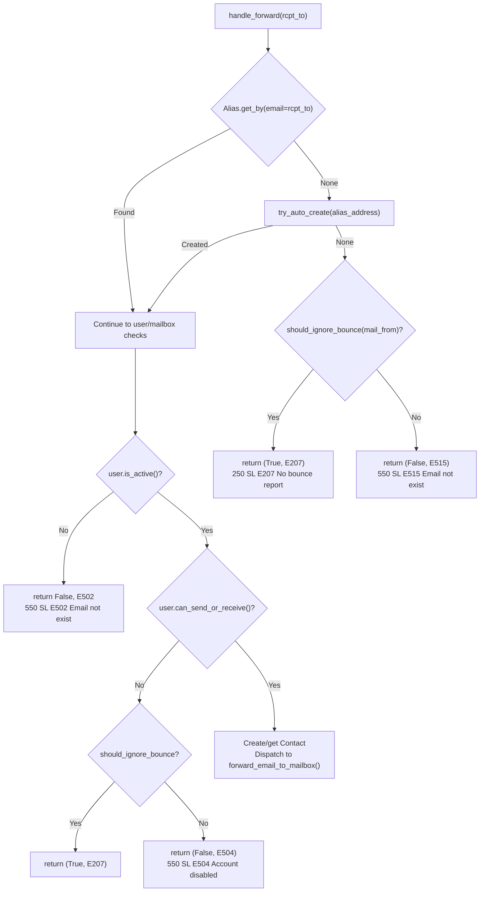
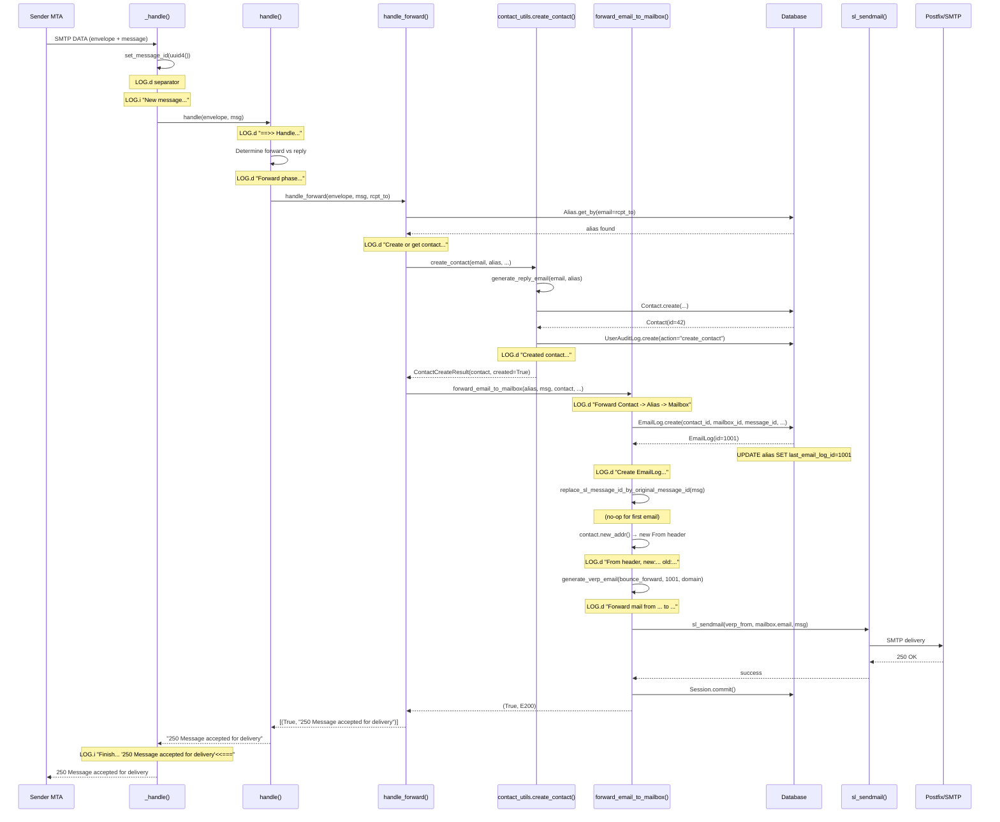

# SimpleLogin Email Forward Pipeline — Runtime Behavior Trace

## Introduction

This is an investigative code-trace document that answers four specific runtime questions about SimpleLogin's email forward operation. The investigation is grounded entirely in static code analysis of the SimpleLogin repository — every claim traces to a specific file and line number, and every example value is derived deterministically from the code logic.

**Methodology:** Static code analysis tracing the exact code paths executed during a single alias forward operation. No source files were modified during this investigation.

**Primary code entry point:** `email_handler.py` — the SMTP inbound processor that receives all incoming email via `aiosmtpd` and routes it through the forward or reply pipeline.

**Key functions traced (call chain):**

- `MailHandler._handle(envelope, msg)` — entry point, sets up correlation ID and app context
- `handle(envelope, msg)` — routing logic, determines forward vs reply phase
- `handle_forward(envelope, msg, rcpt_to)` — alias resolution, contact creation, per-mailbox dispatch
- `forward_email_to_mailbox(alias, msg, contact, envelope, mailbox, user, reply_to_contact)` — header transformation, DB writes, SMTP delivery

Source: `email_handler.py:2334-2378` (line 2334 is the `@newrelic.agent.background_task()` decorator; `def _handle` at line 2335), `email_handler.py:1945-2233`, `email_handler.py:536-676`, `email_handler.py:679-928`

### Scenario Used for Tracing

All example values in this document are derived from the following scenario:

- **Sender:** `sender@example.com` with display name `"John Doe"`
- **Alias:** `alias123@simplelogin.co` (enabled, belonging to an active user)
- **User's personal mailbox:** `user@example.net` (verified, not disabled)
- **First-time contact:** No existing `Contact` record for this (alias, sender) pair
- **User's `sender_format`:** Default — `SenderFormatEnum.AT` (value `0`), which produces `"John Doe - sender at example.com"`
- **`EMAIL_DOMAIN`:** `simplelogin.co`
- **Original email Message-ID:** `<original123@sender-mta.example.com>`

---

## Q1: Log Messages — Success vs Failure

### Log Format Reference

Every log line emitted by the email handler follows this format template:

```
%(asctime)s - %(name)s - %(levelname)s - %(process)d - "%(pathname)s:%(lineno)d" - %(funcName)s() - %(message_id)s - %(message)s
```

Source: `app/log.py:12-14`

**Field breakdown:**

- `%(asctime)s` — UTC timestamp (e.g., `2024-01-15 10:30:45,123`)
- `%(name)s` — Logger name, always `"SL"` (Source: `app/log.py:79`)
- `%(levelname)s` — Level: `DEBUG`, `INFO`, `WARNING`, or `ERROR`
- `%(process)d` — OS process ID
- `%(pathname)s:%(lineno)d` — Source file path and line number (clickable in PyCharm)
- `%(funcName)s()` — Function name with trailing parentheses
- `%(message_id)s` — Correlation UUID set by `set_message_id()` at the start of each email lifecycle — this is NOT the email's Message-ID header, but a per-request tracking UUID generated via `uuid.uuid4()` (Source: `email_handler.py:2339`)
- `%(message)s` — The actual log message

**Logger level shortcuts** (Source: `app/log.py:73-77`):

- `LOG.d` = `logging.Logger.debug` → produces `DEBUG` level
- `LOG.i` = `logging.Logger.info` → produces `INFO` level
- `LOG.w` = `logging.Logger.warning` → produces `WARNING` level
- `LOG.e` = `logging.Logger.exception` → produces `ERROR` level with traceback

**Correlation ID mechanism:** At the start of `_handle()`, a UUID is generated and stored globally via `set_message_id(str(uuid.uuid4()))`. The `EmailHandlerFilter` class (Source: `app/log.py:28-37`) injects this value into every log record's `message_id` field, enabling correlation of all log lines belonging to a single email processing lifecycle.

Source: `email_handler.py:2338-2340`, `app/log.py:22-25`

### Success Path — Log Messages in Execution Order

The following traces every `LOG.*()` call on the happy path where an email is successfully forwarded from `sender@example.com` to the user's mailbox `user@example.net` via alias `alias123@simplelogin.co`.

---

**Entry — `_handle()` separator**

- **Level:** DEBUG
- **Code:** `LOG.d("====>=====>====>====>====>====>====>====>")` 
- **Rendered:** `====>=====>====>====>====>====>====>====>`
- Source: `email_handler.py:2342`

---

**Entry — `_handle()` new message**

- **Level:** INFO
- **Code:** `LOG.i("New message, mail from %s, rctp tos %s ", envelope.mail_from, envelope.rcpt_tos)`
- **Rendered:** `New message, mail from sender@example.com, rctp tos ['alias123@simplelogin.co'] `
- Source: `email_handler.py:2343-2346`

**Complete example rendered log line (all format fields populated):**

```
2024-01-15 10:30:45,123 - SL - INFO - 12345 - "email_handler.py:2343" - _handle() - a1b2c3d4-e5f6-7890-abcd-ef1234567890 - New message, mail from sender@example.com, rctp tos ['alias123@simplelogin.co'] 
```

**Rationale:** The `message_id` field (`a1b2c3d4-e5f6-7890-abcd-ef1234567890`) is the correlation UUID set two lines earlier at `email_handler.py:2339-2340`, not the email's Message-ID header. This UUID appears in every subsequent log line for this email, enabling operators to trace the entire lifecycle with a single grep.

---

**Routing — `handle()` main diagnostic log**

- **Level:** DEBUG
- **Code:**
  ```python
  LOG.d(
      "==>> Handle mail_from:%s, rcpt_tos:%s, header_from:%s, header_to:%s, "
      "cc:%s, reply-to:%s, message_id:%s, client_ip:%s, headers:%s, mail_options:%s, rcpt_options:%s",
      mail_from, rcpt_tos, msg[headers.FROM], msg[headers.TO],
      msg[headers.CC], msg[headers.REPLY_TO], msg[headers.MESSAGE_ID],
      msg[headers.SL_CLIENT_IP], msg._headers, envelope.mail_options, envelope.rcpt_options,
  )
  ```
- **Rendered:** `==>> Handle mail_from:sender@example.com, rcpt_tos:['alias123@simplelogin.co'], header_from:John Doe <sender@example.com>, header_to:alias123@simplelogin.co, cc:None, reply-to:None, message_id:<original123@sender-mta.example.com>, client_ip:None, headers:[...], mail_options:[], rcpt_options:[]`
- Source: `email_handler.py:1980-1994`

---

**Routing — `handle()` forward phase dispatch**

- **Level:** DEBUG
- **Code:** `LOG.d("Forward phase %s(%s) -> %s", mail_from, copy_msg[headers.FROM], rcpt_to)`
- **Rendered:** `Forward phase sender@example.com(John Doe <sender@example.com>) -> alias123@simplelogin.co`
- Source: `email_handler.py:2202-2207`

**Rationale:** The code reaches this branch because `is_reverse_alias(rcpt_to)` returned `False` for `alias123@simplelogin.co` — it is a regular alias, not a reverse-alias (reply address). This means the email enters the forward phase.

---

**Contact resolution — `handle_forward()` contact creation**

- **Level:** DEBUG
- **Code:** `LOG.d("Create or get contact for from_header:%s", from_header)`
- **Rendered:** `Create or get contact for from_header:John Doe <sender@example.com>`
- Source: `email_handler.py:580`

---

**Contact creation — inside `contact_utils.create_contact()`**

- **Level:** DEBUG
- **Code:** `LOG.d(f"Created contact {contact} for alias {alias} with email {email} invalid_email={contact.invalid_email}")`
- **Rendered:** `Created contact <Contact 42 sender@example.com 101> for alias <Alias 101 alias123@simplelogin.co> with email sender@example.com invalid_email=False`
- Source: `app/contact_utils.py:110-112`

**Rationale:** This log is emitted only for newly created contacts. The `Contact.__repr__()` format is `<Contact {id} {website_email} {alias_id}>` (Source: `app/models.py:2056-2057`). If the contact already existed, the code would have returned at line 87 without this log message.

---

**Forward dispatch — `forward_email_to_mailbox()` entry**

- **Level:** DEBUG
- **Code:** `LOG.d("Forward %s -> %s -> %s", contact, alias, mailbox)`
- **Rendered:** `Forward <Contact 42 sender@example.com 101> -> <Alias 101 alias123@simplelogin.co> -> <Mailbox 5 user@example.net>`
- Source: `email_handler.py:688`

---

**EmailLog creation**

- **Level:** DEBUG
- **Code:** `LOG.d("Create %s for %s, %s, %s", email_log, contact, user, mailbox)`
- **Rendered:** `Create <EmailLog 1001> for <Contact 42 sender@example.com 101>, <User 7 John user@example.net>, <Mailbox 5 user@example.net>`
- Source: `email_handler.py:740`

---

**Message-ID restoration — `replace_sl_message_id_by_original_message_id()`**

- For a first-time email with no `In-Reply-To` or `References` headers containing SL Message-IDs: **NO log messages are emitted from this function**
- The function checks `msg[headers.IN_REPLY_TO]` (line 933) and `msg[headers.REFERENCES]` (line 947), but since our scenario email has neither, both branches are skipped entirely
- Source: `email_handler.py:931-963`

---

**From header rewrite**

- **Level:** DEBUG
- **Code:** `LOG.d("From header, new:%s, old:%s", new_from_header, old_from_header)`
- **Rendered:** `From header, new:John Doe - sender at example.com <qwertyuiopasdfghjklzxcvbn@simplelogin.co>, old:John Doe <sender@example.com>`
- Source: `email_handler.py:867`

**Rationale:** The new From header is generated by `contact.new_addr()` which uses `SenderFormatEnum.AT` (default) formatting. See Q3 for full details on how this value is constructed.

---

**SMTP delivery log**

- **Level:** DEBUG
- **Code:**
  ```python
  LOG.d(
      "Forward mail from %s to %s, mail_options:%s, rcpt_options:%s ",
      contact.website_email, mailbox.email, envelope.mail_options, envelope.rcpt_options,
  )
  ```
- **Rendered:** `Forward mail from sender@example.com to user@example.net, mail_options:[], rcpt_options:[] `
- Source: `email_handler.py:893-899`

---

**Success return**

- After `sl_sendmail()` completes without exception, the code enters the `else` branch (line 926-928):
  - `Session.commit()` — commits all database changes
  - Returns `True, status.E200`
- **Status code value:** `"250 Message accepted for delivery"`
- Source: `email_handler.py:926-928`, `app/email/status.py:2`

---

**Exit — `_handle()` finish log**

- **Level:** INFO
- **Code:** `LOG.i("Finish mail_from %s, rcpt_tos %s, takes %s seconds with return code '%s'<<===", envelope.mail_from, envelope.rcpt_tos, elapsed, return_status)`
- **Rendered:** `Finish mail_from sender@example.com, rcpt_tos ['alias123@simplelogin.co'], takes 0.42 seconds with return code '250 Message accepted for delivery'<<===`
- Source: `email_handler.py:2367-2373`

---

### Failure Path — Non-Existent Alias

The following traces the path where an email is sent to `nonexistent@simplelogin.co` — an alias that does not exist and cannot be auto-created.

---

**Entry logs — identical to success path**

- Same `_handle()` separator (line 2342), new message INFO (lines 2343-2346), `handle()` diagnostic DEBUG (lines 1980-1994), and forward phase dispatch DEBUG (lines 2202-2207)

---

**Alias lookup fails — `handle_forward()`**

- **Level:** DEBUG
- **Code:** `LOG.d("alias %s not exist. Try to see if it can be created on the fly", alias_address)`
- **Rendered:** `alias nonexistent@simplelogin.co not exist. Try to see if it can be created on the fly`
- Source: `email_handler.py:545-548`

**Rationale:** `Alias.get_by(email=alias_address)` at line 543 returned `None`. The code then attempts auto-creation via `try_auto_create(alias_address)` at line 549. This function (Source: `app/alias_utils.py:202`) tries three strategies: suffix-based auto-creation, directory-based, and domain-based catch-all. If all return `None`, auto-creation fails.

---

**Auto-creation fails**

- **Level:** DEBUG
- **Code:** `LOG.d("alias %s cannot be created on-the-fly, return 550", alias_address)`
- **Rendered:** `alias nonexistent@simplelogin.co cannot be created on-the-fly, return 550`
- Source: `email_handler.py:551`

---

**Return status — branch on `should_ignore_bounce()`**

- If `should_ignore_bounce(envelope.mail_from)` returns `True`:
  - Returns `(True, status.E207)` — `"250 SL E207 No bounce report"`
  - Source: `email_handler.py:552-553`, `app/email/status.py:12`
- If `should_ignore_bounce(envelope.mail_from)` returns `False` (normal case):
  - Returns `(False, status.E515)` — `"550 SL E515 Email not exist"`
  - Source: `email_handler.py:554-555`, `app/email/status.py:51`

**Rationale:** The `should_ignore_bounce()` check prevents bounce loops. If the sender is a known no-reply/bounce address, SL accepts the email silently (2xx) rather than returning a 5xx that would trigger another bounce.

---

**Exit — `_handle()` finish log**

- **Level:** INFO
- **Rendered:** `Finish mail_from sender@example.com, rcpt_tos ['nonexistent@simplelogin.co'], takes 0.05 seconds with return code '550 SL E515 Email not exist'<<===`
- Source: `email_handler.py:2367-2373`

---

### Alias Resolution Decision Flowchart



Source: `email_handler.py:536-676`

---

## Q2: SL Message-ID Generation

### Critical Distinction: Forward vs Reply Phase

**The forward phase does NOT generate SL Message-IDs — it CONSUMES them.**

This is the single most important point for understanding the Message-ID lifecycle in SimpleLogin:

- **Forward phase** (`forward_email_to_mailbox()`, line 860): calls `replace_sl_message_id_by_original_message_id(msg)` which LOOKS UP existing `MessageIDMatching` records and REPLACES any SL Message-IDs found in `In-Reply-To` and `References` headers back to their originals
- **Reply phase** (`handle_reply()`, lines 1296-1361): calls `replace_original_message_id(alias, email_log, msg)` which CREATES new SL Message-IDs via `make_msgid()` and stores mappings in `MessageIDMatching`

Source: `email_handler.py:860`, `email_handler.py:931-963`, `email_handler.py:1296-1361`

**Rationale:** This asymmetry exists because SL acts as a proxy. When a user replies from their mailbox, the reply's Message-ID must be replaced with an SL-generated ID so the original sender's MTA never sees the user's real mailbox domain. When the sender subsequently replies back, and that email is forwarded to the user, the SL Message-IDs in threading headers must be swapped back to the originals so the user's mail client can correctly thread the conversation.

### Forward Phase: `replace_sl_message_id_by_original_message_id()` (lines 931-963)

This function runs during every forward operation at line 860. It performs two checks:

**Check `In-Reply-To` header (lines 932-944):**
- If `msg[headers.IN_REPLY_TO]` is present, queries `MessageIDMatching.get_by(sl_message_id=str(msg[headers.IN_REPLY_TO]))`
- If a match is found: replaces the SL Message-ID with `matching.original_message_id`
- Emits: `LOG.d("replace SL message id by original one in in-reply-to header, %s -> %s", ...)` (lines 938-942)
- Source: `email_handler.py:932-944`

**Check `References` header (lines 946-963):**
- If `msg[headers.REFERENCES]` is present, splits by whitespace and checks each Message-ID individually
- For each that matches a `MessageIDMatching.sl_message_id`: replaces it with the original
- Emits: `LOG.d("replace SL message id by original one in references header, %s -> %s", ...)` (lines 953-957)
- Source: `email_handler.py:946-963`

**For our scenario** (first email, no prior threading): Both headers are absent or empty, so this function is a no-op — no log messages emitted, no database queries made.

### Reply Phase: `replace_original_message_id()` (lines 1296-1361)

This is where SL Message-IDs are actually **created**. Called during the reply phase, not the forward phase.

**Step-by-step logic:**

- Gets the original Message-ID from the reply message: `original_message_id = msg[headers.MESSAGE_ID]` (line 1301)
- Checks if a `MessageIDMatching` record already exists for this original Message-ID (line 1303) — this handles the case where a user replies to multiple recipients from their alias; the same SL Message-ID is reused
- If no existing match, generates a new SL Message-ID (lines 1311-1312):
  ```python
  sl_message_id = make_msgid(str(email_log.id), get_email_domain_part(alias.email))
  ```
- Creates a `MessageIDMatching` record (lines 1316-1321):
  ```python
  MessageIDMatching.create(
      sl_message_id=sl_message_id,
      original_message_id=original_message_id,
      email_log_id=email_log.id,
      commit=True,
  )
  ```
- Replaces the `Message-ID` header in the outgoing email with the SL Message-ID (lines 1338-1339)
- Stores the SL Message-ID on the `EmailLog` record: `email_log.sl_message_id = sl_message_id` (line 1341)

Source: `email_handler.py:1296-1342`

### `make_msgid()` Format

`make_msgid()` is from Python's standard library `email.utils` (imported at `email_handler.py:42`).

The function signature is `make_msgid(idstring=None, domain=None)` and it produces Message-IDs in the format:

```
<idstring.timestamp.random_hex@domain>
```

- `idstring` — passed as `str(email_log.id)`, e.g., `"1001"`
- The timestamp portion is derived from the current time
- The random hex portion is generated internally by Python's random module
- `domain` — the domain part of the alias email, e.g., `"simplelogin.co"`

**Concrete example:**

```
make_msgid("1001", "simplelogin.co")
→ <1001.20240115103045.7f3a2b1c@simplelogin.co>
```

The exact format of the middle portion varies by Python version, but the structure is always `<idstring.unique_part@domain>`.

### `MessageIDMatching` Model Schema

- **Table name:** `message_id_matching`
- **Fields:**
  - `id` — Integer, primary key, auto-increment (from `ModelMixin`, Source: `app/models.py:63`)
  - `created_at` — ArrowType, default `arrow.utcnow`, not nullable (from `ModelMixin`, Source: `app/models.py:64`)
  - `updated_at` — ArrowType, default None, set on update (from `ModelMixin`, Source: `app/models.py:65`)
  - `sl_message_id` — String(512), unique, not nullable
  - `original_message_id` — String(1024), unique, not nullable
  - `email_log_id` — ForeignKey to `email_log.id`, nullable, indexed

Source: `app/models.py:3365-3379`

### Complete Message-ID Lifecycle Example

**Step-by-step through a conversation:**

- **Email arrives** from `sender@example.com` with `Message-ID: <original123@sender-mta.example.com>`
- **Forward phase** processes it: `replace_sl_message_id_by_original_message_id()` runs but does nothing (no SL Message-IDs in headers). The original `Message-ID: <original123@sender-mta.example.com>` is **preserved** in the forwarded email. **No `MessageIDMatching` record is created.**
- **User replies** from `user@example.net`: reply has `Message-ID: <user-reply456@example.net>` and `In-Reply-To: <original123@sender-mta.example.com>`
- **Reply phase** processes it: `replace_original_message_id()` creates a new SL Message-ID:
  - `make_msgid("1001", "simplelogin.co")` → `<1001.20240115103045.7f3a2b1c@simplelogin.co>`
  - Creates `MessageIDMatching` record:
    ```
    MessageIDMatching {
        id: 200,
        sl_message_id: "<1001.20240115103045.7f3a2b1c@simplelogin.co>",
        original_message_id: "<user-reply456@example.net>",
        email_log_id: 1001
    }
    ```
  - The outgoing email's `Message-ID` header is replaced with the SL Message-ID
- **Sender replies back** with `In-Reply-To: <1001.20240115103045.7f3a2b1c@simplelogin.co>`
- **Forward phase** processes it: `replace_sl_message_id_by_original_message_id()` finds the `MessageIDMatching` record and replaces the SL Message-ID in `In-Reply-To` back to `<user-reply456@example.net>` — so the user's mail client correctly threads the conversation

---

## Q3: From Header Transformation

### Contact Creation and `reply_email` Generation

When a new sender contacts an alias for the first time, the forward phase creates a `Contact` record. The key field for From header transformation is `reply_email` — the reverse-alias email address.

**Call chain:**

- `handle_forward()` calls `get_or_create_contact(from_header, envelope.mail_from, alias)` at line 581
- `get_or_create_contact()` (lines 180-211) parses the From header and calls `contact_utils.create_contact()` at line 202
- `create_contact()` (Source: `app/contact_utils.py:42-120`) calls `generate_reply_email(email, alias)` at line 89 to produce the `reply_email`

Source: `email_handler.py:580-581`, `email_handler.py:180-211`, `app/contact_utils.py:88-103`

### `generate_reply_email()` — Reverse-Alias Address Generation

Source: `app/email_utils.py:1103-1153`

This function generates a unique email address that serves as the reverse-alias — when the user replies to a forwarded email, they reply to this address, and SL routes it back to the original sender.

**Default behavior** (when `user.include_sender_in_reverse_alias` is `None` or `False`):

- Random length: `random.randint(20, 50)` (line 1145)
- Format: `{random_string(random_length)}@{reply_domain}` (line 1148)
- `random_string()` (Source: `app/utils.py:41-47`) generates a string using `string.ascii_lowercase` only — 26 lowercase English letters (`a-z`), no digits, no uppercase, no special characters. It uses `secrets.choice()` for cryptographic randomness.
- `reply_domain` defaults to `config.EMAIL_DOMAIN` (line 1129) unless the alias's domain is an `SLDomain` with `use_as_reverse_alias=True`
- **Example:** `qwertyuiopasdfghjklzxcvbn@simplelogin.co` (25 random lowercase letters)

Source: `app/email_utils.py:1144-1148`, `app/utils.py:41-47`

**When `include_sender_in_reverse_alias` is `True`:**

- Contact email is sanitized through a pipeline (lines 1121-1127):
  - `convert_to_id()` — lowercases and removes accents/spaces (Source: `app/utils.py:50-56`)
  - `sanitize_email()` — normalizes the email
  - Truncated to 45 characters
  - `@` replaced with `_at_`, `.` replaced with `_`
  - `convert_to_alphanumeric()` — replaces any character not in `[a-zA-Z0-9_-.]` with `_` (Source: `app/utils.py:59-71`)
- Random length: `random.randint(5, 10)` (line 1138)
- Format: `{sanitized_contact_email}_{random_string(random_length)}@{reply_domain}` (line 1142)
- **Example:** `sender_at_example_com_abcde@simplelogin.co`

Source: `app/email_utils.py:1119-1142`

**Uniqueness guarantee:** The function loops up to 1000 times (line 1136), checking `available_sl_email(reply_email)` each iteration to ensure the generated address isn't already in use.

### `Contact.new_addr()` — From Header Formatting

Source: `app/models.py:2008-2046`

This method generates the new `From` header value for forwarded emails. It reads the user's `sender_format` preference and formats the display name accordingly, combining it with the `reply_email`.

**`sender_format`** defaults to `SenderFormatEnum.AT.value` (which is `0`) if no user preference is set (line 2019).

Source: `app/models.py:2019`

**Format by `SenderFormatEnum` value:**

---

**`SenderFormatEnum.AT` (value=0, default)** — lines 2028-2034:

- `formatted_email = self.website_email.replace("@", " at ").strip()` → `"sender at example.com"`
- If contact has a name AND name ≠ email: `new_name = name + " - " + formatted_email` → `"John Doe - sender at example.com"`
- Otherwise: `new_name = formatted_email`
- Returns `sl_formataddr((new_name, self.reply_email)).strip()`
- **Example output:** `John Doe - sender at example.com <qwertyuiopasdfghjklzxcvbn@simplelogin.co>`

Source: `app/models.py:2028-2034`

---

**`SenderFormatEnum.A` (value=2)** — lines 2035-2041:

- Same as AT but uses `"(a)"` instead of `" at "`
- `formatted_email = self.website_email.replace("@", "(a)").strip()` → `"sender(a)example.com"`
- **Example output:** `John Doe - sender(a)example.com <qwertyuiopasdfghjklzxcvbn@simplelogin.co>`

Source: `app/models.py:2035-2041`

---

**`SenderFormatEnum.NAME_ONLY` (value=5)** — lines 2024-2025:

- `new_name = self.name` → `"John Doe"`
- **Example output:** `John Doe <qwertyuiopasdfghjklzxcvbn@simplelogin.co>`

Source: `app/models.py:2024-2025`

---

**`SenderFormatEnum.AT_ONLY` (value=6)** — lines 2026-2027:

- `new_name = self.website_email.replace("@", " at ").strip()` → `"sender at example.com"`
- **Example output:** `sender at example.com <qwertyuiopasdfghjklzxcvbn@simplelogin.co>`

Source: `app/models.py:2026-2027`

---

**`SenderFormatEnum.NO_NAME` (value=7)** — lines 2021-2022:

- Returns `self.reply_email` directly — no display name, no angle brackets
- **Example output:** `qwertyuiopasdfghjklzxcvbn@simplelogin.co`

Source: `app/models.py:2021-2022`

---

### `sl_formataddr()` — RFC-Compliant Address Formatting

Source: `app/email_utils.py:1501-1505`

```python
def sl_formataddr(name_address_tuple: Tuple[str, str]):
    name, addr = name_address_tuple
    return str(formataddr((name, Header(addr, "utf-8"))))
```

- Wraps Python's `email.utils.formataddr()` but forces UTF-8 encoding via `email.header.Header(addr, "utf-8")`
- Always converts the result to `str` (never returns a `Header` object)
- If the display name contains non-ASCII characters, the output will use RFC 2047 encoded-word syntax (e.g., `=?utf-8?q?...?=`)

### The From Header Rewrite in `forward_email_to_mailbox()`

Source: `email_handler.py:864-867`

```python
old_from_header = msg[headers.FROM]
new_from_header = contact.new_addr()
add_or_replace_header(msg, "From", new_from_header)
LOG.d("From header, new:%s, old:%s", new_from_header, old_from_header)
```

**Concrete example for our scenario (default `AT` format):**

- **Original From header:** `John Doe <sender@example.com>`
- **Contact fields:** `name="John Doe"`, `website_email="sender@example.com"`, `reply_email="qwertyuiopasdfghjklzxcvbn@simplelogin.co"`
- **`contact.new_addr()` computes:**
  - `formatted_email = "sender@example.com".replace("@", " at ").strip()` → `"sender at example.com"`
  - `self.name` (`"John Doe"`) exists and differs from `self.website_email` (`"sender@example.com"`)
  - `new_name = "John Doe" + " - " + "sender at example.com"` → `"John Doe - sender at example.com"`
  - `sl_formataddr(("John Doe - sender at example.com", "qwertyuiopasdfghjklzxcvbn@simplelogin.co"))` → `"John Doe - sender at example.com" <qwertyuiopasdfghjklzxcvbn@simplelogin.co>`
- **New From header:** `John Doe - sender at example.com <qwertyuiopasdfghjklzxcvbn@simplelogin.co>`

**Rationale:** The From header is rewritten to hide the user's real email address (`user@example.net`) from the sender. The reverse-alias (`qwertyuiopasdfghjklzxcvbn@simplelogin.co`) routes replies back through SimpleLogin. The display name preserves the original sender's identity so the user knows who sent the email.

---

## Q4: Database Records Created During Forward

### `ModelMixin` Base Class

Every model in SimpleLogin inherits from `ModelMixin`, which provides three auto-managed fields:

- `id` — Integer, primary key, auto-increment
- `created_at` — ArrowType, default `arrow.utcnow`, not nullable
- `updated_at` — ArrowType, default `None`, set to `arrow.utcnow` on update

Source: `app/models.py:62-65`

### Record: Contact

**Created during:** `contact_utils.create_contact()` at `app/contact_utils.py:92-103`

**Table name:** `contact`

Source: `app/models.py:1863-1962`

**Schema:**

| Field | Type | Nullable | Default | Description |
|-------|------|----------|---------|-------------|
| `id` | Integer | No | auto-increment | Primary key (from ModelMixin) |
| `created_at` | ArrowType | No | `arrow.utcnow` | Creation timestamp (from ModelMixin) |
| `updated_at` | ArrowType | Yes | `None` | Update timestamp (from ModelMixin) |
| `user_id` | FK → User.id | No | — | Owner of the alias |
| `alias_id` | FK → Alias.id | No | — | Associated alias |
| `name` | String(512) | Yes | `None` | Parsed display name from From header |
| `website_email` | String(512) | No | — | Sender's actual email address |
| `website_from` | String(1024) | Yes | — | Not set during auto-creation |
| `reply_email` | String(512) | No | — | Generated reverse-alias address |
| `is_cc` | Boolean | No | `False` | Whether contact was created via CC |
| `mail_from` | Text | Yes | `None` | Envelope MAIL FROM |
| `invalid_email` | Boolean | No | `False` | Whether email address is invalid |
| `block_forward` | Boolean | No | `False` | Whether to block forwards from this contact |
| `automatic_created` | Boolean | Yes | `False` | Set to `True` in forward phase |
| `flags` | Integer | No | `0` | Bitfield for contact flags |

**Additional fields not shown:** `pgp_public_key` (Text, nullable) and `pgp_finger_print` (String(512), nullable, indexed) — these PGP-related fields are not populated during the forward contact creation flow. Source: `app/models.py:1904-1905`

**Unique constraint:** `(alias_id, website_email)` — named `uq_contact`

Source: `app/models.py:1874-1876`

**Example record for our scenario:**

```json
{
    "id": 42,
    "created_at": "2024-01-15T10:30:45.123456+00:00",
    "updated_at": null,
    "user_id": 7,
    "alias_id": 101,
    "name": "John Doe",
    "website_email": "sender@example.com",
    "website_from": null,
    "reply_email": "qwertyuiopasdfghjklzxcvbn@simplelogin.co",
    "is_cc": false,
    "mail_from": "sender@example.com",
    "invalid_email": false,
    "block_forward": false,
    "automatic_created": true,
    "flags": 0
}
```

Source: `app/contact_utils.py:89-103`

### Record: UserAuditLog

**Created during:** `contact_utils.create_contact()` immediately after Contact creation, at `app/contact_utils.py:104-109`

**Table name:** `user_audit_log`

Source: `app/models.py:3829-3843`

**Schema:**

| Field | Type | Nullable | Default | Description |
|-------|------|----------|---------|-------------|
| `id` | Integer | No | auto-increment | Primary key (from ModelMixin) |
| `created_at` | ArrowType | No | `arrow.utcnow` | Creation timestamp (from ModelMixin) |
| `updated_at` | ArrowType | Yes | `None` | Update timestamp (from ModelMixin) |
| `user_id` | Integer | No | — | NOT a foreign key — plain integer |
| `user_email` | String(255) | No | — | User's email at time of action |
| `action` | String(255) | No | — | Action identifier string |
| `message` | Text | Yes | `None` | Human-readable description |

**Note:** `user_id` is deliberately NOT a foreign key (Source: `app/models.py:3834`) — it is a plain integer. Because there is no foreign key constraint, audit log records are preserved even if the referenced user is deleted from the `users` table.

**Creation call chain:**

```python
emit_user_audit_log(
    user=alias.user,
    action=UserAuditLogAction.CreateContact,   # value: "create_contact"
    message=f"Created contact {contact.id} ({contact.email})",
    commit=True,
)
```

Source: `app/contact_utils.py:104-108`, `app/user_audit_log_utils.py:35-44`, `app/user_audit_log_utils.py:23`

**Example record:**

```json
{
    "id": 500,
    "created_at": "2024-01-15T10:30:45.234567+00:00",
    "updated_at": null,
    "user_id": 7,
    "user_email": "user@example.net",
    "action": "create_contact",
    "message": "Created contact 42 (sender@example.com)"
}
```

### Record: EmailLog

**Created at:** `email_handler.py:732-739`

**Table name:** `email_log`

Source: `app/models.py:2060-2167`

**Creation call:**

```python
email_log = EmailLog.create(
    contact_id=contact.id,
    user_id=contact.user_id,
    mailbox_id=mailbox.id,
    alias_id=contact.alias_id,
    message_id=str(msg[headers.MESSAGE_ID]),
    commit=True,
)
```

Source: `email_handler.py:732-739`

**The `EmailLog.create()` override** (lines 2152-2164) performs additional work beyond the standard `ModelMixin.create()`:

- Calls `Session.flush()` to get the auto-increment `id` immediately (line 2156)
- Executes raw SQL to update the alias pointer (lines 2157-2161):
  ```sql
  UPDATE alias SET last_email_log_id = :el_id WHERE id = :alias_id
  ```
- If `commit=True`, calls `Session.commit()` (lines 2162-2163)

Source: `app/models.py:2152-2164`

**Schema:**

| Field | Type | Nullable | Default | Description |
|-------|------|----------|---------|-------------|
| `id` | Integer | No | auto-increment | Primary key |
| `created_at` | ArrowType | No | `arrow.utcnow` | Creation timestamp |
| `updated_at` | ArrowType | Yes | `None` | Update timestamp |
| `user_id` | FK → User.id | No | — | Owner |
| `contact_id` | FK → Contact.id | No | — | Sender contact |
| `alias_id` | FK → Alias.id | Yes | — | Receiving alias |
| `is_reply` | Boolean | No | `False` | Whether this is a reply (False for forward) |
| `blocked` | Boolean | No | `False` | Whether forwarding was blocked |
| `bounced` | Boolean | No | `False` | Whether the email bounced |
| `auto_replied` | Boolean | No | `False` | Whether an auto-reply was sent |
| `is_spam` | Boolean | No | `False` | Whether detected as spam |
| `spam_score` | Float | Yes | — | SpamAssassin score |
| `spam_status` | Text | Yes | `None` | Spam status text |
| `refused_email_id` | FK → RefusedEmail.id | Yes | — | Associated refused email |
| `mailbox_id` | FK → Mailbox.id | Yes | — | Target mailbox |
| `bounced_mailbox_id` | FK → Mailbox.id | Yes | — | Mailbox that bounced |
| `message_id` | String(1024) | Yes | — | Original email Message-ID (deferred load) |
| `sl_message_id` | String(512) | Yes | — | SL Message-ID — NOT set during forward phase |

**Additional field not shown:** `spam_report` (JSON, nullable, deferred load) — not populated during the standard forward flow. Source: `app/models.py:2094`

Source: `app/models.py:2060-2117`

**Example record:**

```json
{
    "id": 1001,
    "created_at": "2024-01-15T10:30:45.345678+00:00",
    "updated_at": null,
    "user_id": 7,
    "contact_id": 42,
    "alias_id": 101,
    "is_reply": false,
    "blocked": false,
    "bounced": false,
    "auto_replied": false,
    "is_spam": false,
    "spam_score": null,
    "spam_status": null,
    "refused_email_id": null,
    "mailbox_id": 5,
    "bounced_mailbox_id": null,
    "message_id": "<original123@sender-mta.example.com>",
    "sl_message_id": null
}
```

**Key observation:** `sl_message_id` is `null` during the forward phase. It is only populated during the reply phase by `replace_original_message_id()` at `email_handler.py:1341`.

### VERP Envelope Sender

**Generated at:** `email_handler.py:903-905`

```python
generate_verp_email(VerpType.bounce_forward, email_log.id, contact_domain)
```

- `VerpType.bounce_forward` has value `0` (Source: `app/models.py:248`)
- `contact_domain` = domain part of `contact.reply_email`, which is `"simplelogin.co"`

Source: `email_handler.py:901-911`

**`generate_verp_email()` logic** (Source: `app/email_utils.py:1438-1464`):

- Constructs a payload: `data = [verp_type.value, object_id, minutes_since_epoch]`
  - `verp_type.value` = `0` (bounce_forward)
  - `object_id` = `email_log.id` = `1001`
  - `minutes_since_epoch` = `int((time.time() - 1640995200) / 60)` — minutes since 2022-01-01 00:00:00 UTC (Source: `app/email_utils.py:68`)
- JSON-encodes the data: `json.dumps([0, 1001, 1071990]).encode("utf-8")` (1071990 = minutes since 2022-01-01 00:00:00 UTC to 2024-01-15 10:30:00 UTC, computed as `int((1705314600 - 1640995200) / 60)`)
- Signs with HMAC-SHA3-224 using `VERP_EMAIL_SECRET`, takes first 8 bytes (lines 1454-1456)
- Base32-encodes both payload and signature, strips padding `=` characters (lines 1457-1458)
- Final format: `{VERP_PREFIX}.{base32_payload}.{base32_signature}@{sender_domain}`
  - `VERP_PREFIX` = `"sl"` (Source: `app/config.py:500`)
  - All lowercased (line 1464)

**Example VERP address:**

```
sl.lmycyibrgaydclbageydomjzheyf2.{hmac_signature_base32}@simplelogin.co
```

- `lmycyibrgaydclbageydomjzheyf2` is the base32 encoding of `[0, 1001, 1071990]`
- `{hmac_signature_base32}` depends on the secret value of `VERP_EMAIL_SECRET` — the first 8 bytes of HMAC-SHA3-224, base32-encoded and lowercased

**Rationale:** The VERP (Variable Envelope Return Path) address encodes the `email_log.id` and a timestamp, signed with HMAC to prevent tampering. When the recipient's mail server bounces the email, the bounce goes to this VERP address, and SimpleLogin can decode it to identify exactly which `EmailLog` record the bounce belongs to — enabling precise bounce tracking per forwarded email.

Source: `app/email_utils.py:1438-1464`

### Alias `last_email_log_id` Update

Inside the `EmailLog.create()` override (Source: `app/models.py:2157-2161`):

```python
if "alias_id" in kwargs:
    sql = "UPDATE alias SET last_email_log_id = :el_id WHERE id = :alias_id"
    Session.execute(sql, {"el_id": email_log.id, "alias_id": kwargs["alias_id"]})
```

This is a raw SQL `UPDATE`, not a separate record creation. It sets the alias's `last_email_log_id` pointer to the newly created `EmailLog`, enabling the UI to show the most recent email activity for each alias.

### Complete Timeline of Database Writes

The following is the exact sequence of database writes during a single forward operation (first-time contact):

- **Write: `Contact.create()`** — new contact record linking the sender to the alias, with generated `reply_email`
  - Source: `app/contact_utils.py:92-103`
- **Write: `UserAuditLog.create()`** — audit entry recording the contact creation with action `"create_contact"`
  - Source: `app/contact_utils.py:104-108`
- **Write: `EmailLog.create()`** — forward email log record with `message_id` set to original email's Message-ID, `sl_message_id` left null
  - Source: `email_handler.py:732-739`
- **Write: `UPDATE alias SET last_email_log_id = ...`** — alias pointer update (executed inside `EmailLog.create()` override)
  - Source: `app/models.py:2157-2161`
- **Write: `Session.commit()`** — final commit after successful SMTP delivery via `sl_sendmail()`
  - Source: `email_handler.py:927`

**Important:** NO `MessageIDMatching` record is created during the forward phase. That only happens during the reply phase in `replace_original_message_id()`.

---

## Forward Operation — Complete Sequence Diagram



---

## Summary and Rationale

### Key Findings

- **Q1 (Log Messages):** A successful forward emits approximately a dozen log messages — two at INFO level (`_handle()` entry and exit) and the rest at DEBUG level throughout the call chain. The failure path for a non-existent alias is short: only the entry logs, two DEBUG messages about alias lookup failure, and the exit log. The key status codes are `E200` (`"250 Message accepted for delivery"`) for success and `E515` (`"550 SL E515 Email not exist"`) for non-existent aliases.

- **Q2 (SL Message-ID):** SL Message-IDs are NOT generated during the forward phase — they are generated exclusively during the reply phase by `replace_original_message_id()` using Python's `make_msgid()`. During forward, the function `replace_sl_message_id_by_original_message_id()` runs but only performs lookups to restore any previously-created SL Message-IDs back to their originals in threading headers.

- **Q3 (From Header):** The forwarded email's From header is rewritten to `"John Doe - sender at example.com" <qwertyuiopasdfghjklzxcvbn@simplelogin.co>` (for the default `AT` format). The email address portion is a randomly-generated reverse-alias stored in `Contact.reply_email`, and the display name combines the sender's name with their email (with `@` replaced by ` at `).

- **Q4 (Database Records):** A single forward operation with a new contact creates exactly three records: `Contact` (with the generated `reply_email`), `UserAuditLog` (audit entry for contact creation), and `EmailLog` (the forwarding record with `sl_message_id=null`). Additionally, the alias's `last_email_log_id` is updated via raw SQL inside `EmailLog.create()`.

### Design Rationale

- **Why the From header is rewritten:** To protect the user's real email address (`user@example.net`) from being exposed to the sender. The reverse-alias address routes replies back through SimpleLogin, maintaining the privacy barrier. The display name preserves the original sender's identity so the user knows who sent the email.

- **Why VERP is used:** The VERP (Variable Envelope Return Path) address encodes the `EmailLog.id` and a timestamp, signed with HMAC. This allows SimpleLogin to deterministically match any bounce notification back to the exact `EmailLog` record — and therefore the exact alias, contact, and mailbox — without relying on the bounce email's content, which varies wildly across mail servers.

- **Why SL Message-IDs are NOT created during forward but ARE during reply:** During forward, the original sender's Message-ID is preserved so the user's mail client can correctly identify the email. During reply, the user's real Message-ID (which contains their personal mailbox domain) must be replaced with an SL-generated one to prevent domain leakage. The `MessageIDMatching` table bridges the two phases, enabling correct thread reconstruction in both directions.

- **Why Contact records map to (alias, sender_email) pairs:** Each unique (alias, sender) combination gets a stable `reply_email`. This means replying to the same sender always uses the same reverse-alias address, maintaining a consistent reply path. The unique constraint `(alias_id, website_email)` enforces this 1:1 mapping.

### Key Code Files

- `email_handler.py` — SMTP inbound processor, forward and reply logic
- `app/models.py` — `Contact`, `EmailLog`, `MessageIDMatching`, `SenderFormatEnum`, `ModelMixin`
- `app/email_utils.py` — `generate_reply_email()`, `generate_verp_email()`, `sl_formataddr()`
- `app/contact_utils.py` — `create_contact()`, contact creation orchestration
- `app/log.py` — Log format template, correlation ID mechanism
- `app/email/status.py` — SMTP status code constants
- `app/user_audit_log_utils.py` — `emit_user_audit_log()`, `UserAuditLogAction`
