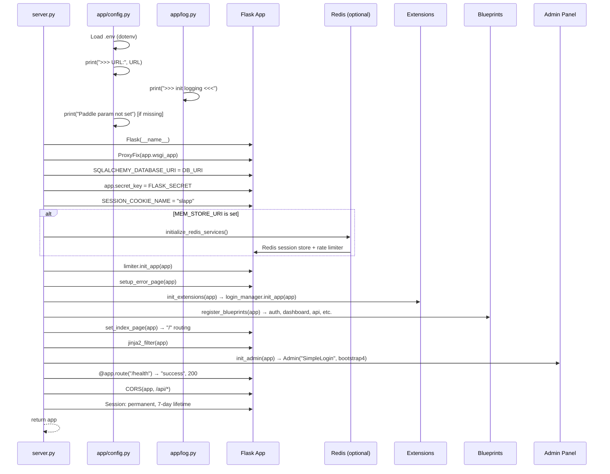
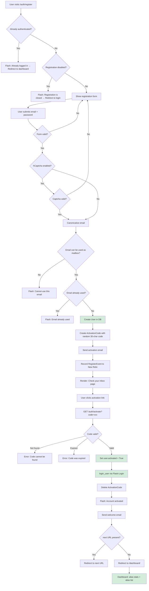
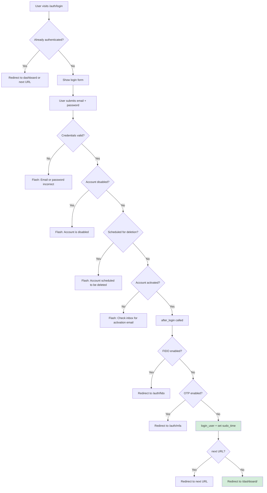
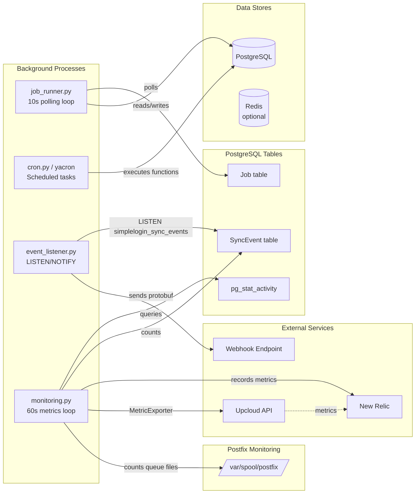

# SimpleLogin Self-Hosted: Operational Q&A Guide & Verification Runbook

## Introduction

This document answers three interlocking questions about the SimpleLogin self-hosted platform's runtime behavior:

1. **Startup Readiness Verification** — What observable evidence confirms that the Flask web application, SMTP email handler, job runner, and supporting infrastructure are fully initialized and ready to serve requests?
2. **New-User Registration Walkthrough** — A step-by-step narrative tracing the complete product experience from registration through email activation to the dashboard.
3. **Background Services and Runtime Indicators** — What background jobs, scheduled tasks, event dispatching, and monitoring processes should be active, and how to confirm they are operational?

### Assumptions and Context

| Item | Value | Source |
|------|-------|--------|
| **Local dev startup** | `alembic upgrade head && flask dummy-data && python3 server.py` | `CONTRIBUTING.md` |
| **Web app URL** | `http://localhost:7777` | `server.py:588`, `example.env:6` |
| **Email behavior** | `NOT_SEND_EMAIL=true` — emails are logged to stdout, NOT sent via SMTP | `example.env:19`, `app/config.py:91` |
| **Demo user** | `john@wick.com` / `password` (seeded by `flask dummy-data`) | `app/fake_data.py:44-56` |

### Conventions

- All claims are grounded in source code with `file:line` or `function()` citations.
- **No source code was modified** to produce this document.
- Terminology follows SimpleLogin conventions: **activation** (not "verification"), **alias** (not "forward address"), **mailbox** (not "real email").

---

## Q1: Startup Readiness Verification

> **Question:** What observable evidence confirms that the Flask web application, SMTP email handler, job runner, and supporting infrastructure (PostgreSQL, Redis, Postfix) are fully initialized and ready to serve requests?

### Thinking / Rationale

SimpleLogin's local development environment comprises three Python processes (`server.py`, `email_handler.py`, `job_runner.py`) plus PostgreSQL. Each emits distinct log messages and exposes specific endpoints during initialization. By tracing the `create_app()` factory, the `main()` functions, and the configuration module, we can catalog every observable readiness indicator.

---

### 1.1 Flask Web Application Startup

The Flask app is created via `server.py:create_app()` (lines 139–217). The initialization sequence is:

| Step | What Happens | Source |
|------|-------------|--------|
| 1. Flask instance | `Flask(__name__)` created, wrapped with `ProxyFix` for NGINX reverse proxy | `server.py:140-142` |
| 2. Database config | `SQLALCHEMY_DATABASE_URI` set from `DB_URI` env var | `server.py:146`, `app/config.py:192` |
| 3. Secret key | `app.secret_key = FLASK_SECRET`; raises `RuntimeError` if empty | `server.py:151`, `app/config.py:196-198` |
| 4. Session cookie | Cookie named `slapp`, `SameSite=Lax`, secure if URL starts with `https` | `server.py:159-162`, `app/config.py:199` |
| 5. Redis (optional) | If `MEM_STORE_URI` is set, calls `initialize_redis_services()` for session store + rate limiter | `server.py:163-165`, `app/redis_services.py:9-25` |
| 6. Rate limiter | `limiter.init_app(app)` — Flask-Limiter initialized | `server.py:167`, `app/extensions.py:23` |
| 7. Error pages | Custom error handlers for 400, 401, 403, 404, 405, 429, 500 | `server.py:169`, `server.py:339-394` |
| 8. Extensions | `init_extensions(app)` → `login_manager.init_app(app)` (Flask-Login) | `server.py:171`, `server.py:437-438` |
| 9. Blueprints | `register_blueprints(app)` — registers `auth_bp`, `monitor_bp`, `dashboard_bp`, `developer_bp`, `phone_bp`, `oauth_bp` (at `/oauth` and `/oauth2`), `onboarding_bp`, `discover_bp`, `internal_bp`, `api_bp` | `server.py:172`, `server.py:233-246` |
| 10. Index routing | Root `/` redirects authenticated users to `dashboard.index`, others to `auth.login` | `server.py:173`, `server.py:250-255` |
| 11. Jinja2 filters | Template filters and context processors registered | `server.py:174`, `server.py:403-434` |
| 12. Admin panel | `Admin(name="SimpleLogin", template_mode="bootstrap4")` with model views | `server.py:179`, `server.py:441-458` |
| 13. Health endpoint | `GET /health` returns `("success", 200)` | `server.py:213-215` |
| 14. CORS | Enabled on `/api/*` endpoints | `server.py:200` |
| 15. Session lifetime | Sessions set to permanent with 7-day expiration | `server.py:204-207` |

#### Observable Log Output During Startup

These messages appear in stdout/stderr when the Flask app starts:

| Message | Condition | Source |
|---------|-----------|--------|
| `load config file <path>` | Only if `CONFIG` env var is set | `app/config.py:68` |
| `>>> URL: http://localhost:7777` | **Always printed** | `app/config.py:80` |
| `MAX_NB_EMAIL_FREE_PLAN is not set, use 5 as default value` | If `MAX_NB_EMAIL_FREE_PLAN` env var is missing | `app/config.py:123` |
| `Paddle param not set` | If Paddle payment env vars are missing | `app/config.py:217` |
| `>>> init logging <<<` | **Always printed** (module-level in `app/log.py`) | `app/log.py:67` |
| `enable sentry` | Only if `SENTRY_DSN` is set | `server.py:112` |
| `Enable flask-profiler` | Only if `FLASK_PROFILER_PATH` is set | `server.py:186` |

#### Health Endpoint Verification

The most definitive readiness check is the health endpoint:

```bash
curl http://localhost:7777/health
# Expected response: "success" with HTTP 200
```

> **Source:** `server.py:213-215` — `@app.route("/health", methods=["GET"])` returns `"success", 200`

#### Local Development Mode (`local_main()`)

When running via `python3 server.py`, the `local_main()` function (lines 572–588) is invoked:

- Sets `config.COLOR_LOG = True` for colored log output (`server.py:573`)
- Creates the app via `create_app()` (`server.py:574`)
- Enables Flask DebugToolbar (`server.py:577-582`)
- Runs on **port 7777** with `debug=True` (`server.py:588`)

#### Production Mode (`wsgi.py` + Gunicorn)

In the Docker container, Gunicorn serves the app:

```bash
gunicorn wsgi:app -b 0.0.0.0:7777 -w 2 --timeout 15
```

> **Source:** `Dockerfile:47`, `wsgi.py:1-3` — `wsgi.py` imports `create_app` from `server` and creates `app = create_app()`

---

### 1.2 SMTP Email Handler Startup

The inbound email handler (`email_handler.py`) uses aiosmtpd to receive SMTP traffic:

| Step | What Happens | Source |
|------|-------------|--------|
| 1. Controller creation | `Controller(MailHandler(), hostname="0.0.0.0", port=port)` | `email_handler.py:2383` |
| 2. Controller start | `controller.start()` | `email_handler.py:2385` |
| 3. Startup log | `"Start mail controller %s %s"` with hostname and port | `email_handler.py:2386` |
| 4. PGP loading (optional) | If `LOAD_PGP_EMAIL_HANDLER` is set: `"LOAD PGP keys"` and calls `load_pgp_public_keys()` | `email_handler.py:2388-2390` |
| 5. Keep-alive loop | `while True: time.sleep(2)` | `email_handler.py:2392-2393` |

**Default port:** `20381` (`email_handler.py:2399`)

**Entry log message:** `"Listen for port %s"` (`email_handler.py:2403`)

**Readiness indicators:**
- `"Listen for port 20381"` appears in the log
- `"Start mail controller 0.0.0.0 20381"` appears immediately after

---

### 1.3 Job Runner Startup

The job runner (`job_runner.py`) polls the PostgreSQL `Job` table in an infinite loop:

```python
while True:
    with create_light_app().app_context():
        for job in get_jobs_to_run():
            LOG.d("Take job %s", job)
            # ... process job ...
        time.sleep(10)
```

> **Source:** `job_runner.py:329-347`

| Behavior | Detail | Source |
|----------|--------|--------|
| Polling interval | 10 seconds | `job_runner.py:347` |
| App context | Creates a `create_light_app()` context per iteration (lightweight Flask app with DB only) | `job_runner.py:332`, `server.py:127-136` |
| Job query | `get_jobs_to_run()` fetches jobs where `state == ready` OR stale `taken` jobs (older than `JOB_TAKEN_RETRY_WAIT_MINS` with `attempts < JOB_MAX_ATTEMPTS`), and `run_at` is NULL or within 10 minutes | `job_runner.py:307-326` |
| Processing log | `"Take job %s"` for each job picked up | `job_runner.py:334` |

**Readiness indicator:** The job runner is "ready" as soon as it starts its polling loop. If there are no pending jobs, it simply sleeps every 10 seconds with no log output. If jobs exist, you'll see `"Take job ..."` messages.

---

### 1.4 UI Readiness Indicators

When navigating to `http://localhost:7777` in a browser:

- **Not logged in:** Redirected to `/auth/login` — the login page renders with email/password fields.
- **Logged in:** Redirected to `/dashboard/` — the dashboard renders with alias statistics.

> **Source:** `server.py:250-255` — the index route checks `current_user.is_authenticated`

---

### 1.5 `NOT_SEND_EMAIL` Mode

This is a critical local development behavior:

```python
NOT_SEND_EMAIL = "NOT_SEND_EMAIL" in os.environ
```

> **Source:** `app/config.py:91`

When `NOT_SEND_EMAIL=true` is set (the **default** in `example.env:19`), the mail sender short-circuits:

```python
if config.NOT_SEND_EMAIL:
    LOG.d(
        "send email with subject '%s', from '%s' to '%s'",
        send_request.msg[headers.SUBJECT],
        send_request.msg[headers.FROM],
        send_request.msg[headers.TO],
    )
    return True
```

> **Source:** `app/mail_sender.py:130-137`

**What this means:**
- Emails are **logged to stdout** with subject, from, and to addresses.
- Emails are **NOT delivered** to any inbox.
- The activation link code is **NOT included** in the log output — only the subject/from/to are logged.
- To retrieve the activation code, either query the database (`SELECT code FROM activation_code WHERE user_id = <id>`) or disable `NOT_SEND_EMAIL` and configure a local MTA like MailHog.

**To receive actual emails**, comment out `NOT_SEND_EMAIL=true` in your `.env` file and configure MailHog:
- Set `POSTFIX_SERVER=localhost` and `POSTFIX_PORT=1025`
- Run MailHog and access its UI at `http://localhost:8025`

> **Source:** `CONTRIBUTING.md` email testing section

---

### 1.6 Redis Dependency

Redis is **optional** for local development:

- If `MEM_STORE_URI` is set: `initialize_redis_services()` configures Redis/Sentinel-backed sessions and rate limiters (`server.py:163-165`, `app/redis_services.py:9-25`)
- If `MEM_STORE_URI` is **not** set: Sessions fall back to Flask's default cookie-based sessions, and rate limiting uses in-memory storage.
- No error is thrown when Redis is absent — the app starts normally.

---

### 1.7 Startup Readiness Checklist

| Component | How to Verify | Expected Result | Source |
|-----------|--------------|-----------------|--------|
| Flask web app | `curl http://localhost:7777/health` | Returns `success` with HTTP 200 | `server.py:213-215` |
| Flask web app | Check stdout | `>>> URL: http://localhost:7777` | `app/config.py:80` |
| Flask web app | Check stdout | `>>> init logging <<<` | `app/log.py:67` |
| Flask web app | Open browser at `http://localhost:7777` | Login page renders at `/auth/login` | `server.py:250-255` |
| Email handler | Check log output | `Start mail controller 0.0.0.0 20381` | `email_handler.py:2386` |
| Email handler | Check log output | `Listen for port 20381` | `email_handler.py:2403` |
| Job runner | Check log output | Polling loop runs every 10s; `Take job ...` if jobs exist | `job_runner.py:334,347` |
| PostgreSQL | App starts without crash | DB_URI connection succeeds | `app/config.py:192` |
| Redis (optional) | No error if `MEM_STORE_URI` unset | Sessions use cookies; rate limits use memory | `app/redis_services.py` |

---

### 1.8 Startup Initialization Sequence Diagram



---

## Q2: New User Registration Walkthrough

> **Question:** What is the step-by-step experience of a first-time user from registration through email activation to the dashboard?

### Thinking / Rationale

The registration-to-dashboard flow traverses five view modules in sequence: `register.py` → `activate.py` → `login.py` → `login_utils.py` → `index.py`. Each module performs specific validation, database mutations, and redirects. The `NOT_SEND_EMAIL` flag fundamentally changes the activation experience in local development.

---

### 2.1 Step 1: Registration (`POST /auth/register`)

**Route:** `@auth_bp.route("/register", methods=["GET", "POST"])` — Full URL: `/auth/register`

> **Source:** `app/auth/views/register.py:31`, blueprint prefix `/auth` from `app/auth/base.py`

**Flow:**

1. **Already authenticated?** If `current_user.is_authenticated`, flashes `"You are already logged in"` (warning) and redirects to `dashboard.index`.
   > Source: `register.py:33-36`

2. **Registration disabled?** If `config.DISABLE_REGISTRATION` is set, flashes `"Registration is closed"` (error) and redirects to `auth.login`.
   > Source: `register.py:38-40`

3. **Form validation:** Uses `RegisterForm` with `email` (required) and `password` (required, 8–100 characters).
   > Source: `register.py:23-28`

4. **hCaptcha check:** If `HCAPTCHA_SECRET` is configured, verifies the captcha token. Flashes `"Wrong Captcha"` on failure.
   > Source: `register.py:47-71`

5. **Email canonicalization:** `canonicalize_email(form.email.data)` normalizes the email address.
   > Source: `register.py:73`

6. **Mailbox eligibility:** `email_can_be_used_as_mailbox(email)` — if the email domain is an alias domain, flashes `"You cannot use this email address as your personal inbox."`.
   > Source: `register.py:74-76`

7. **Duplicate check:** `personal_email_already_used(email)` — if already registered, flashes `"Email {email} already used"`.
   > Source: `register.py:79-83`

8. **User creation:** `User.create(email=email, name=form.email.data, password=form.password.data, referral=get_referral())` followed by `Session.commit()`.
   > Source: `register.py:86-92`

9. **Activation email:** Calls `send_activation_email(user, next_url)`.
   > Source: `register.py:95`

10. **Telemetry:** Records `RegisterEvent(RegisterEvent.ActionType.success)` to New Relic, increments `DailyMetric.nb_new_web_non_proton_user`.
    > Source: `register.py:96-98`

11. **Waiting page:** Renders `auth/register_waiting_activation.html` — tells the user to check their inbox.
    > Source: `register.py:104`

#### Activation Email Preparation (`send_activation_email`)

Located in the same file (`register.py:117-129`):

1. Deletes all previous `ActivationCode` records for the user (`register.py:119`)
2. Creates a new `ActivationCode` with `code=random_string(30)` (`register.py:120`)
3. Builds the activation link: `{URL}/auth/activate?code={activation.code}` (`register.py:124`)
4. If `next_url` is present, appends `&next=<encoded_url>` (`register.py:125-127`)
5. Calls `email_utils.send_activation_email(user, activation_link)` (`register.py:129`)

---

### 2.2 Step 2: Activation Email Dispatch

**Function:** `app/email_utils.py:send_activation_email()` (lines 125–141)

- **Subject:** `"Just one more step to join SimpleLogin"` (`email_utils.py:128`)
- **Templates:** `transactional/activation.txt` and `transactional/activation.html` (`email_utils.py:129-141`)
- Under the hood, calls `send_email()` → `sl_sendmail()` → `mail_sender.send()`

#### `NOT_SEND_EMAIL` Behavior During Activation

With `NOT_SEND_EMAIL=true` (the default in `example.env:19`):

- The mail sender logs via `LOG.d`: `"send email with subject 'Just one more step to join SimpleLogin', from '...' to '...'"` (`app/mail_sender.py:131-136`)
- The **activation link** (containing the code) is **NOT included** in the log output — only the email metadata (subject, from, to) is logged.
- **To obtain the activation code in local dev**, either:
  - Query the database: `SELECT code FROM activation_code WHERE user_id = <id>;`
  - Or disable `NOT_SEND_EMAIL` and configure MailHog (see Testing and Cleanup Notes → NOT_SEND_EMAIL Implications for Testing below).

---

### 2.3 Step 3: Account Activation (`GET /auth/activate`)

**Route:** `@auth_bp.route("/activate", methods=["GET", "POST"])` — Full URL: `/auth/activate?code=<code>`

> **Source:** `app/auth/views/activate.py:13`

**Rate limited:** 10 requests per minute (with deduction on failure) (`activate.py:14-16`)

**Flow:**

1. **Already authenticated?** Renders error `"You are already logged in"` with HTTP 400.
   > Source: `activate.py:18-22`

2. **Code extraction:** Gets `code` from the query string (`activate.py:24`)

3. **Code lookup:** `ActivationCode.get_by(code=code)` (`activate.py:26`)

4. **Code not found?** Triggers rate limiter, renders `"Activation code cannot be found"` with HTTP 400.
   > Source: `activate.py:28-36`

5. **Code expired?** Renders `"Activation code was expired"` with `show_resend_activation=True` and HTTP 400.
   > Source: `activate.py:38-46`

6. **Success path:**
   - Sets `user.activated = True` (`activate.py:49`)
   - Calls `login_user(user)` from Flask-Login — establishes the session (`activate.py:50`)
   - Deletes the activation code (`activate.py:53`)
   - Commits the transaction (`activate.py:54`)
   - Flashes `"Your account has been activated"` (success) (`activate.py:56`)
   - Sends welcome email via `email_utils.send_welcome_email(user)` (`activate.py:58`)
   - If `next` parameter present: redirects to sanitized `next_url` (`activate.py:61-64`)
   - Otherwise: redirects to `dashboard.index` (`activate.py:67`)

#### Welcome Email

**Function:** `app/email_utils.py:send_welcome_email()` (lines 97–112)

- **Subject:** `"Welcome to SimpleLogin"` (`email_utils.py:107`)
- **Templates:** `com/welcome.txt` and `com/welcome.html` (`email_utils.py:108-109`)
- Checks `user.get_communication_email()` for an alternate communication address (`email_utils.py:98`)

---

### 2.4 Step 4: Login (`POST /auth/login`)

**Route:** `@auth_bp.route("/login", methods=["GET", "POST"])` — Full URL: `/auth/login`

> **Source:** `app/auth/views/login.py:21`

**Rate limited:** 10 requests per minute (`login.py:22-24`)

**Flow:**

1. **Already authenticated?** Redirects to `next_url` or `dashboard.index`.
   > Source: `login.py:28-34`

2. **Form:** `LoginForm` with `email` and `password` fields (`login.py:16-18`)

3. **Email normalization:** `sanitize_email()` then `canonicalize_email()` (`login.py:41-42`)

4. **User lookup:** `User.get_by(email=email) or User.get_by(email=canonical_email)` (`login.py:43`)

5. **Credential check:** `user.check_password(form.password.data)` (`login.py:45`)

6. **Failure cases** (each triggers rate limiter or flashes error):

   | Condition | Flash Message | Telemetry Event | Source |
   |-----------|--------------|-----------------|--------|
   | Wrong password or no user | `"Email or password incorrect"` | `LoginEvent(failed)` | `login.py:45-50` |
   | Account disabled | `"Your account is disabled..."` | `LoginEvent(disabled_login)` | `login.py:51-56` |
   | Account scheduled for deletion | `"Your account is scheduled to be deleted on {date}"` | `LoginEvent(scheduled_to_be_deleted)` | `login.py:57-62` |
   | Account not activated | `"Please check your inbox for the activation email..."` | `LoginEvent(not_activated)` | `login.py:63-69` |

7. **Success:** Records `LoginEvent(success)` and calls `after_login(user, next_url)`.
   > Source: `login.py:71-72`

---

### 2.5 Step 5: MFA Routing Decision (`after_login`)

**Function:** `app/auth/views/login_utils.py:after_login()` (lines 12–45)

This function implements a three-way decision tree:

```
after_login(user, next_url)
│
├── Is login from Proton? → Skip MFA checks
│
├── user.fido_enabled()?
│   ├── YES → session[MFA_USER_ID] = user.id → redirect to auth.fido
│   │         (with optional ?next=next_url)
│   │         Source: login_utils.py:20-27
│   │
│   └── NO ↓
│
├── user.enable_otp?
│   ├── YES → session[MFA_USER_ID] = user.id → redirect to auth.mfa
│   │         (with optional ?next=next_url)
│   │         Source: login_utils.py:28-33
│   │
│   └── NO ↓
│
└── Direct login:
    ├── LOG.d("log user %s in", user)           (login_utils.py:35)
    ├── login_user(user)                         (login_utils.py:36)
    ├── session["sudo_time"] = int(time())       (login_utils.py:37)
    ├── if next_url → redirect(next_url)         (login_utils.py:40-41)
    └── else → redirect(dashboard.index)         (login_utils.py:43-45)
```

**Priority order:** FIDO (WebAuthn) → TOTP (OTP) → Direct login

For a freshly registered user with no MFA configured, the flow goes directly to `login_user()` + redirect to `dashboard.index`.

---

### 2.6 Step 6: Dashboard Landing

**Route:** `@dashboard_bp.route("/", methods=["GET", "POST"])` — Full URL: `/dashboard/`

> **Source:** `app/dashboard/views/index.py:55`, blueprint prefix `/dashboard` from `app/dashboard/base.py:3-8`

**Requires authentication:** `@login_required` decorator (`index.py:56`)

**What the user sees:**

1. **Statistics** computed via `get_stats(user)` (`index.py:32-52`):
   - `nb_alias` — total alias count
   - `nb_forward` — total forwarded emails
   - `nb_reply` — total replies sent
   - `nb_block` — total blocked emails

2. **Intro screen:** Shown on first visit if `current_user.intro_shown` is `False` (`index.py` intro logic). The demo user has `intro_shown=True` (`app/fake_data.py:52`), so this is skipped.

3. **Alias list** with pagination via `get_alias_infos_with_pagination_v3()` (`index.py` alias loading logic)

4. **Alias management:** Supports creating (random and custom), deleting, and disabling aliases via POST actions.

---

### 2.7 Registration-to-Dashboard Flow Diagram



#### Login Flow (Returning User)



---

## Q3: Background Services and Runtime Indicators

> **Question:** What background jobs, scheduled tasks, event dispatching, and monitoring processes should be active, and how to confirm they are operational?

### Thinking / Rationale

SimpleLogin runs several background processes alongside the web server. Each has distinct patterns of log output and database interaction. By examining the source code of each process, we can document exactly what to look for to confirm they are running.

---

### 3.1 Job Runner Processing

**Entry point:** `job_runner.py` (lines 329–347) — `python job_runner.py`

The job runner polls the `Job` database table every 10 seconds and dispatches work based on `job.name`.

#### Job Type Dispatch (`process_job`)

> **Source:** `job_runner.py:188-304`

| Job Name | Purpose | Action | Source |
|----------|---------|--------|--------|
| `JOB_ONBOARDING_1` | Send "send-from-alias" tip email | Sends onboarding email to user if `user.notification` and `user.activated` | `job_runner.py:189-197` |
| `JOB_ONBOARDING_2` | Send "mailbox" tip email | Same conditions as above | `job_runner.py:198-206` |
| `JOB_ONBOARDING_4` | Send "PGP" tip email | Skips if user's only mailbox is Proton | `job_runner.py:207-220` |
| `JOB_BATCH_IMPORT` | CSV batch alias import | Processes `BatchImport` record | `job_runner.py:222-225` |
| `JOB_DELETE_ACCOUNT` | Delete user account | Sends deletion confirmation email, then `User.delete()` | `job_runner.py:226-244` |
| `JOB_DELETE_MAILBOX` | Delete a mailbox | Transfers aliases to another mailbox, then deletes | `job_runner.py:245-246` |
| `JOB_DELETE_DOMAIN` | Delete custom domain | Deletes domain and all aliases, sends confirmation | `job_runner.py:248-284` |
| `JOB_SEND_USER_REPORT` | Export user data | Creates ZIP file and emails it to user | `job_runner.py:285-288` |
| `JOB_SEND_PROTON_WELCOME_1` | Proton welcome email | Sends Proton-specific welcome if user is activated | `job_runner.py:289-294` |
| `JOB_SEND_ALIAS_CREATION_EVENTS` | Alias creation events | Sends protobuf events via `PostgresDispatcher` | `job_runner.py:295-302` |
| Unknown | Error | Logs `"Unknown job name %s"` | `job_runner.py:304` |

> **Note:** `JOB_ONBOARDING_3` is defined in `app/config.py:303` as `"onboarding-3"` but has no corresponding handler in `process_job()`. It appears to be a removed or unused job type, which explains the numbering skip from `JOB_ONBOARDING_2` to `JOB_ONBOARDING_4` in the table above.

#### Job State Machine

```
ready  ──(picked up)──►  taken  ──(processed)──►  done
                           │
                           │ (stale after JOB_TAKEN_RETRY_WAIT_MINS
                           │  AND attempts < JOB_MAX_ATTEMPTS)
                           │
                           └──────(re-picked)──► taken (retry)
```

> **Source:** `job_runner.py:307-326` (`get_jobs_to_run`), `job_runner.py:337-344` (state transitions)

- Job is marked `taken` before processing: `job.taken = True`, `job.taken_at = arrow.now()`, `job.state = taken`, `job.attempts += 1` (`job_runner.py:337-341`)
- Job is marked `done` after successful processing: `job.state = done` (`job_runner.py:344`)
- Stale jobs (taken longer than `JOB_TAKEN_RETRY_WAIT_MINS` ago with `attempts < JOB_MAX_ATTEMPTS`) are retried (`job_runner.py:311,318-320`)

**How to confirm:** Look for `"Take job <Job...>"` log messages in the job_runner output (`job_runner.py:334`). If no jobs are pending, the runner silently sleeps every 10 seconds.

---

### 3.2 Cron Scheduled Tasks

**Scheduler:** yacron, configured via `crontab.yml`

**Command pattern:** `python /code/cron.py -j <job_name>`

> **Source:** `crontab.yml:1-96`

| Job Name | Schedule | Purpose | Source |
|----------|----------|---------|--------|
| `stats` | `0 0 * * *` (daily at midnight) | Compute growth statistics | `crontab.yml:2-6` |
| `delete_old_monitoring` | `15 1 * * *` (daily at 1:15 AM) | Clean up old Monitoring records | `crontab.yml:8-12` |
| `check_custom_domain` | `15 2 * * *` (daily at 2:15 AM) | Verify custom domain DNS records | `crontab.yml:14-18` |
| `check_hibp` | `15 3 * * *` (daily at 3:15 AM) | Check Have I Been Pwned breaches | `crontab.yml:20-25` |
| `notify_hibp` | `15 4 * * *` (daily at 4:15 AM) | Notify users of HIBP breaches | `crontab.yml:27-32` |
| `delete_logs` | `15 5 * * *` (daily at 5:15 AM) | Delete old email log records | `crontab.yml:34-38` |
| `delete_old_data` | `30 5 * * *` (daily at 5:30 AM) | Delete stale miscellaneous data | `crontab.yml:40-44` |
| `poll_apple_subscription` | `15 6 * * *` (daily at 6:15 AM) | Poll Apple subscription status | `crontab.yml:46-50` |
| `notify_trial_end` | `15 8 * * *` (daily at 8:15 AM) | Notify users of trial ending | `crontab.yml:52-56` |
| `notify_manual_subscription_end` | `15 9 * * *` (daily at 9:15 AM) | Notify manual subscription expiry | `crontab.yml:58-62` |
| `notify_premium_end` | `15 10 * * *` (daily at 10:15 AM) | Notify premium subscription ending | `crontab.yml:64-68` |
| `delete_scheduled_users` | `15 11 * * *` (daily at 11:15 AM) | Delete users scheduled for deletion | `crontab.yml:70-75` |
| `send_undelivered_mails` | `*/5 * * * *` (every 5 minutes) | Retry unsent transactional emails | `crontab.yml:77-82` |
| `clear_alias_audit_log` | `0 * * * *` (hourly) | Clear old alias audit log entries | `crontab.yml:84-89` |
| `clear_user_audit_log` | `0 * * * *` (hourly) | Clear old user audit log entries | `crontab.yml:91-96` |

**How to confirm:** Cron output appears in the yacron process logs. In local development, cron is typically not running unless you explicitly start yacron.

---

### 3.3 Event System (LISTEN/NOTIFY)

The event system uses PostgreSQL's `LISTEN/NOTIFY` mechanism to dispatch events in near-real-time.

#### Event Dispatcher (`app/events/event_dispatcher.py`)

> **Source:** `app/events/event_dispatcher.py:1-96`

- **Notification channel:** `simplelogin_sync_events` (`event_dispatcher.py:14`)
- `EventDispatcher.send_event()` checks `EVENT_WEBHOOK_DISABLE` and `EVENT_WEBHOOK` config, resolves the partner user, builds a protobuf `event_pb2.Event`, and serializes it (`event_dispatcher.py:48-84`)
- `PostgresDispatcher.send()` creates a `SyncEvent` record and issues `NOTIFY simplelogin_sync_events, '<event_id>'` (`event_dispatcher.py:24-26`)

#### Event Listener (`event_listener.py`)

> **Source:** `event_listener.py:1-113`

Two operational modes:

| Mode | Source Class | Behavior | Source |
|------|-------------|----------|--------|
| `listener` | `PostgresEventSource` | Connects to PostgreSQL, executes `LISTEN simplelogin_sync_events`, uses `select.select` to wait for notifications, loads `SyncEvent` by ID, marks taken, invokes callback | `event_listener.py:34`, `events/event_source.py:27-82` |
| `dead_letter` | `DeadLetterEventSource` | Polls for stale events (older than 10 minutes), retries up to `max_retries` | `event_listener.py:31`, `events/event_source.py:84-100+` |

**Event sinks:**
- `HttpEventSink` — sends protobuf payload to configured webhook URL
- `ConsoleEventSink` — logs event details to console (dry-run mode)

> **Source:** `events/event_sink.py` (referenced in `event_listener.py:10`)

**Runner** (`events/runner.py:11-46`):
- Binds source to sink via `Runner(source, sink).run()`
- On success: deletes the `SyncEvent` record and logs `"Marked {event_id} as done"` (`events/runner.py:27-28`)
- On failure: increments `event.retry_count` (`events/runner.py:42-43`)

**Startup log indicators:**
- `"Using PostgresEventSource"` (for listener mode) (`event_listener.py:34`)
- `"Using DeadLetterEventSource"` (for dead_letter mode) (`event_listener.py:31`)
- `"Starting with ConsoleEventSink"` or `"Starting with HttpEventSink"` (`event_listener.py:40,43`)

---

### 3.4 Monitoring and Metrics

**Entry point:** `monitoring.py` (lines 157–171) — `python monitoring.py`

The monitoring process runs an infinite loop with a 60-second interval, collecting metrics and exporting them to New Relic.

| Function | What It Measures | Log Output | Source |
|----------|-----------------|------------|--------|
| `log_postfix_metrics()` | Files in `/var/spool/postfix/{incoming,active,deferred}` + smtp/smtpd/bounce/cleanup process counts | `"postfix queue sizes %s %s %s"` | `monitoring.py:38-55` |
| `log_nb_db_connection()` | Total PostgreSQL connections via `pg_stat_activity` | `"number of db connections %s"` | `monitoring.py:87-94` |
| `log_nb_db_connection_by_app_name()` | DB connections grouped by `application_name` | `"number of db connections for app %s = %s"` | `monitoring.py:97-108` |
| `log_pending_to_process_events()` | `SyncEvent` records where `taken_time IS NULL` | `"number of events pending to process %s"` | `monitoring.py:111-119` |
| `log_events_pending_dead_letter()` | Stale events (older than 10 minutes) | `"number of events pending dead letter %s"` | `monitoring.py:122-139` |
| `log_failed_events()` | Events with `retry_count >= 10` | `"number of failed events %s"` | `monitoring.py:142-154` |
| `MetricExporter.run()` | Fetches Upcloud DB metrics, exports to New Relic | `"Upcloud metrics sent to NewRelic"` | `monitoring.py:168`, `monitor/metric_exporter.py:14-20` |

All metrics are recorded via `newrelic.agent.record_custom_metric()` as `Custom/*` metrics.

**How to confirm:** The monitoring process logs metric values every 60 seconds. In local development, this process is typically not running unless explicitly started.

---

### 3.5 Auth Telemetry Events

**Module:** `app/events/auth_event.py` (lines 1–47)

Both `LoginEvent` and `RegisterEvent` send custom events to New Relic via `newrelic.agent.record_custom_event()`.

#### `LoginEvent`

> **Source:** `app/events/auth_event.py:6-25`

| Action Type | Enum Value | When Sent | Source |
|-------------|-----------|-----------|--------|
| `success` | 0 | Successful login | `login.py:71` |
| `failed` | 1 | Wrong password or no user found | `login.py:50` |
| `disabled_login` | 2 | Account is disabled | `login.py:56` |
| `not_activated` | 3 | Account not yet activated | `login.py:69` |
| `scheduled_to_be_deleted` | 4 | Account pending deletion | `login.py:62` |

Recorded as: `newrelic.agent.record_custom_event("LoginEvent", {"action": action_name, "source": source_name})` (`auth_event.py:23-25`)

#### `RegisterEvent`

> **Source:** `app/events/auth_event.py:28-47`

| Action Type | Enum Value | When Sent | Source |
|-------------|-----------|-----------|--------|
| `success` | 0 | Successful registration | `register.py:96` |
| `failed` | 1 | General registration failure | — |
| `catpcha_failed` | 2 | hCaptcha verification failed | `register.py:65` |
| `email_in_use` | 3 | Email already registered or not usable | `register.py:76,83` |
| `invalid_email` | 4 | Invalid email address | `register.py:101` |

Recorded as: `newrelic.agent.record_custom_event("RegisterEvent", {"action": action_name, "source": source_name})` (`auth_event.py:45-47`)

**Note:** Auth telemetry requires New Relic agent to be configured. In local development without New Relic, these calls are no-ops.

---

### 3.6 Background Services Summary

| Service | How to Confirm It's Active | Source |
|---------|---------------------------|--------|
| **Job Runner** | `"Take job <Job...>"` log messages in job_runner output (polling every ~10s) | `job_runner.py:334,347` |
| **Cron / yacron** | Cron output matching `crontab.yml` schedules in yacron process logs | `crontab.yml` |
| **Event Listener** | `"Using PostgresEventSource"` or `"Using DeadLetterEventSource"` in log | `event_listener.py:31,34` |
| **Monitoring** | `"postfix queue sizes"` and `"number of db connections"` logs every 60s | `monitoring.py:44,93` |
| **Auth Telemetry** | `LoginEvent`/`RegisterEvent` New Relic custom events on each auth action | `app/events/auth_event.py` |

---

### 3.7 Background Services Architecture Diagram



---

## Testing and Cleanup Notes

### Demo User

The `flask dummy-data` command (which calls `app/fake_data.py:fake_data()`) seeds a demo user:

| Property | Value | Source |
|----------|-------|--------|
| Email | `john@wick.com` | `fake_data.py:45` |
| Password | `password` | `fake_data.py:47` |
| Name | `John Wick` | `fake_data.py:46` |
| Activated | `True` | `fake_data.py:48` |
| Is Admin | `True` | `fake_data.py:49` |
| OTP Secret | `base32secret3232` (set but OTP **not enabled** by default) | `fake_data.py:51` |
| Intro Shown | `True` (dashboard intro is skipped) | `fake_data.py:52` |
| Trial End | `None` | `fake_data.py:55` |

This user can log in immediately without activation and has admin access to `/admin/`.

### Temporary Artifact Guidance

When testing the registration-to-dashboard flow:

- You **may** create temporary test users and aliases for testing purposes.
- All temporary artifacts **MUST** be cleaned up afterward.
- **Cleanup options:**
  1. **Admin panel:** Navigate to `/admin/` (available because the admin panel is initialized in `server.py:init_admin()` lines 441–458). Use the User admin view to find and delete test users.
  2. **Database directly:**
     ```sql
     DELETE FROM "user" WHERE email = 'test@example.com';
     ```
  3. **API:** Use the SimpleLogin API with an admin API key to manage users.

### `NOT_SEND_EMAIL` Implications for Testing

| Scenario | With `NOT_SEND_EMAIL=true` (default) | Without `NOT_SEND_EMAIL` |
|----------|--------------------------------------|--------------------------|
| Activation email | Logged to stdout (subject/from/to only) | Delivered to configured MTA |
| Welcome email | Logged to stdout | Delivered to configured MTA |
| Onboarding emails | Logged to stdout | Delivered to configured MTA |
| Activation code retrieval | Must query DB directly | Check MailHog UI at `http://localhost:8025` |

**To test the full email flow:**

1. Comment out or remove `NOT_SEND_EMAIL=true` from your `.env` file
2. Set `POSTFIX_SERVER=localhost` and `POSTFIX_PORT=1025`
3. Start MailHog: `mailhog` (or via Docker: `docker run -p 1025:1025 -p 8025:8025 mailhog/mailhog`)
4. Access MailHog UI at `http://localhost:8025` to see captured emails

> **Source:** `CONTRIBUTING.md` email testing section

---

## Appendix: Quick Reference

### Key File Paths

| File | Purpose |
|------|---------|
| `server.py` | Flask app factory, blueprints, health endpoint, startup |
| `wsgi.py` | WSGI app object for Gunicorn |
| `Dockerfile` | Container build and Gunicorn CMD |
| `email_handler.py` | aiosmtpd SMTP handler for inbound email |
| `job_runner.py` | Background job polling loop |
| `cron.py` + `crontab.yml` | Scheduled maintenance tasks |
| `event_listener.py` | LISTEN/NOTIFY event system |
| `monitoring.py` | Postfix queue and DB connection monitoring |
| `app/config.py` | All configuration constants |
| `app/log.py` | Logger initialization |
| `app/extensions.py` | Flask-Login and Flask-Limiter setup |
| `app/redis_services.py` | Redis session and rate limiter initialization |
| `app/auth/views/register.py` | Registration route handler |
| `app/auth/views/activate.py` | Activation route handler |
| `app/auth/views/login.py` | Login route handler |
| `app/auth/views/login_utils.py` | Post-login MFA routing logic |
| `app/dashboard/views/index.py` | Dashboard landing page |
| `app/email_utils.py` | Activation and welcome email functions |
| `app/mail_sender.py` | SMTP delivery with `NOT_SEND_EMAIL` bypass |
| `app/fake_data.py` | Demo user seeding |
| `app/events/auth_event.py` | Login/Register telemetry events |
| `app/events/event_dispatcher.py` | SyncEvent dispatch to PostgreSQL |
| `events/event_source.py` | PostgresEventSource / DeadLetterEventSource |
| `events/runner.py` | Event processing orchestration |
| `monitor/metric_exporter.py` | Upcloud → New Relic metric export |
| `example.env` | Configuration variable reference |

### Key URLs

| URL | Purpose | Auth Required |
|-----|---------|--------------|
| `http://localhost:7777/health` | Health check endpoint | No |
| `http://localhost:7777/` | Root — redirects to login or dashboard | No (redirects) |
| `http://localhost:7777/auth/login` | Login page | No |
| `http://localhost:7777/auth/register` | Registration page | No |
| `http://localhost:7777/auth/activate?code=...` | Account activation | No |
| `http://localhost:7777/dashboard/` | Main dashboard | Yes |
| `http://localhost:7777/admin/` | Admin panel | Yes (admin only) |
