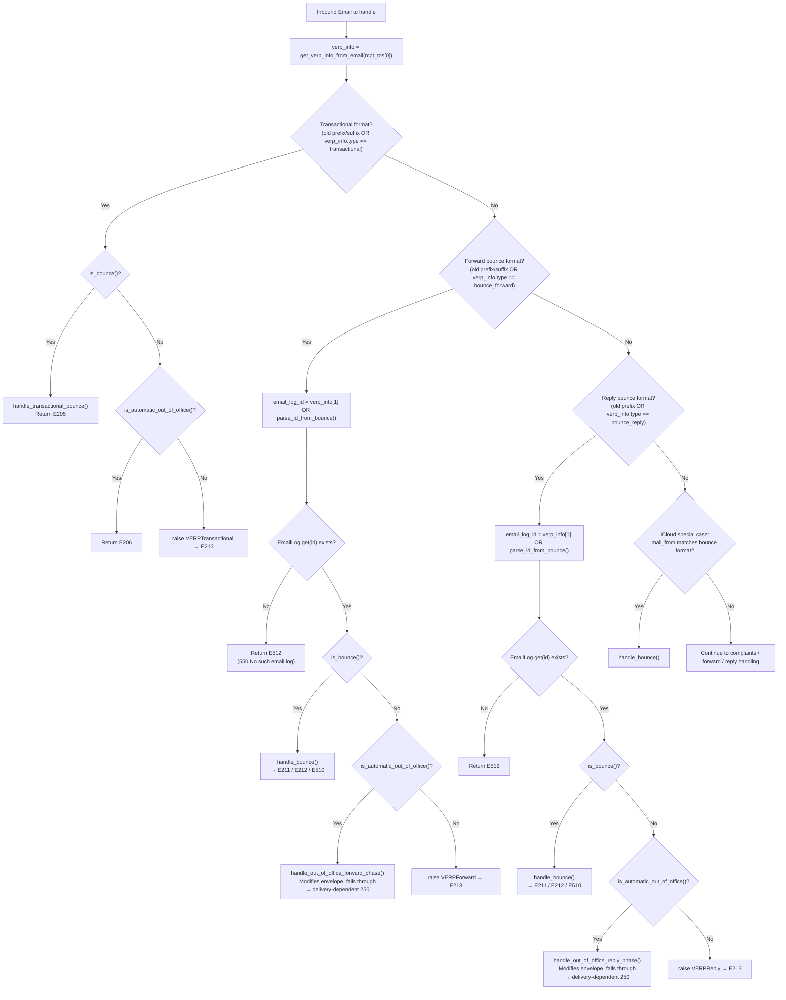
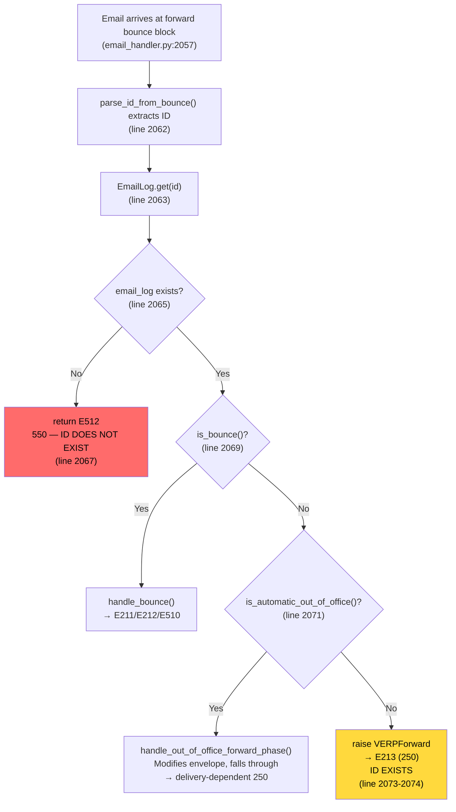
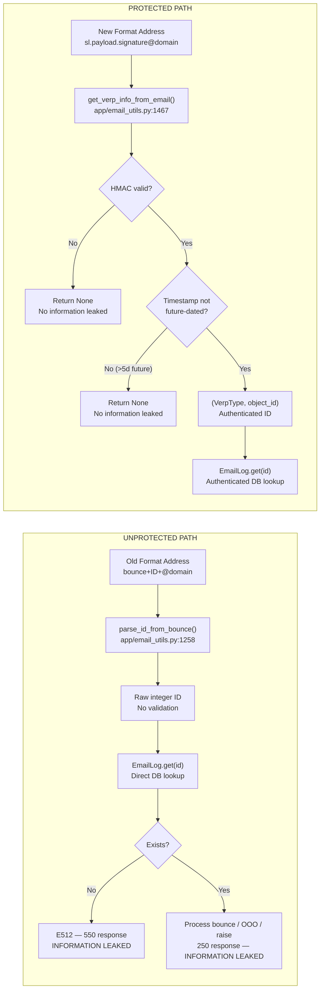

# Bounce Email Handling Security Analysis

> **Date of Analysis:** 2026-04-09
> **Repository:** SimpleLogin (self-hosted email aliasing service)
> **Scope:** Bounce email handling subsystem — `email_handler.py`, `app/email_utils.py`, `app/config.py`, `app/email/status.py`, `app/models.py`, `app/errors.py`, `app/email/rate_limit.py`, `app/handler/spamd_result.py`, `app/email/headers.py`
> **Purpose:** Evidence-based security investigation of the bounce email handling system, documenting information leakage vulnerabilities arising from the coexistence of unsigned and cryptographically signed bounce address formats.

---

## Executive Summary

This analysis documents a security gap in SimpleLogin's bounce email handling system caused by the coexistence of two bounce address formats: a **legacy unsigned format** and a **newer HMAC-signed VERP format**. The legacy format (`bounce+{email_log_id}+@domain`) relies on `parse_id_from_bounce()` at `app/email_utils.py:1258-1259`, which performs **zero cryptographic validation** — it simply extracts the integer between `+` characters using string slicing and passes it directly to a database lookup. The newer signed format (`{VERP_PREFIX}.{base32_payload}.{base32_signature}@domain`) uses HMAC-SHA3-224 validation in `get_verp_info_from_email()` at `app/email_utils.py:1467-1498`, providing cryptographic integrity, a forward-timestamp sanity check, and tamper resistance.

The primary security finding is that the legacy format's unvalidated ID extraction, combined with **differential SMTP response codes**, creates an oracle that allows an external attacker to enumerate valid email log IDs. The `handle()` function in `email_handler.py:2057-2067` performs the `EmailLog.get()` database lookup **before** checking `is_bounce()` criteria — meaning even a regular (non-bounce) email sent to an old-format bounce address produces a `550 E512 No such email log` response for invalid IDs versus a `250 E213 Unknown email ignored` response for valid IDs. This 550-vs-250 differential is observable by the sending MTA and requires no spoofing of bounce criteria.

Compounding this vulnerability, rate limiting is **completely disabled** in the codebase: the `rate_limited()` function at `app/email/rate_limit.py:95-97` unconditionally returns `False` with a `# todo: re-enable rate limiting` comment. This means there is no throttle on enumeration probing — an attacker can probe IDs at SMTP line rate. The SPF-based 5xx downgrade mechanism in `MailHandler._handle()` at `email_handler.py:2357-2365` partially masks the differential when the attacker's domain fails SPF, but an attacker who controls their domain's SPF record (or has no record, resulting in `not_available`) bypasses this masking entirely.

---

## 1. Dual Bounce Address Format Analysis

### 1.1 Legacy Format (Unsigned)

The codebase defines three legacy bounce address patterns using environment-configurable prefixes and suffixes. All three follow the same structural pattern: a fixed prefix, an integer email log ID (or transactional email ID), and a fixed suffix.

**Forward phase bounce address:**
- Configuration: `BOUNCE_PREFIX` + email_log_id + `BOUNCE_SUFFIX`
- Default `BOUNCE_PREFIX`: `"bounce+"` — *Source: app/config.py:100*
- Default `BOUNCE_SUFFIX`: `"+@{EMAIL_DOMAIN}"` — *Source: app/config.py:101*
- Example: `bounce+12345+@sl.local`

**Reply phase bounce address:**
- Configuration: `BOUNCE_PREFIX_FOR_REPLY_PHASE` + `"+"` + email_log_id + `"+@"` + domain
- Default `BOUNCE_PREFIX_FOR_REPLY_PHASE`: `"bounce_reply"` — *Source: app/config.py:108-109*
- Note: this prefix does **not** include a trailing `+` sign, unlike `BOUNCE_PREFIX` — *Source: app/config.py:107*
- Example: `bounce_reply+12345+@sl.local`

**Transactional bounce address:**
- Configuration: `TRANSACTIONAL_BOUNCE_PREFIX` + transactional_id + `TRANSACTIONAL_BOUNCE_SUFFIX`
- Default `TRANSACTIONAL_BOUNCE_PREFIX`: `"transactional+"` — *Source: app/config.py:113-114*
- Default `TRANSACTIONAL_BOUNCE_SUFFIX`: `"+@{EMAIL_DOMAIN}"` — *Source: app/config.py:116-117*
- Example: `transactional+67890+@sl.local`

**The parsing function — `parse_id_from_bounce()`:**

*Source: app/email_utils.py:1258-1259*

```python
def parse_id_from_bounce(email_address: str) -> int:
    return int(email_address[email_address.find("+") : email_address.rfind("+")])
```

**Critical security finding:** This function performs **no validation whatsoever**:
- No cryptographic signature check
- No HMAC verification
- No timestamp validation
- No format validation beyond locating `+` characters

The function extracts the substring from the first `+` (inclusive) to the last `+` (exclusive) in the email address and converts it to an integer. For input `bounce+12345+@sl.local`, the slice yields `+12345`; Python's `int("+12345")` correctly parses this as `12345` because `int()` accepts a leading `+` sign. Any email sent to `bounce+{any_integer}+@domain` will have that integer extracted and used as an `email_log_id` for a direct database lookup via `EmailLog.get()`.

### 1.2 New Signed VERP Format

The newer VERP (Variable Envelope Return Path) format provides cryptographic integrity through HMAC signing.

**Generation — `generate_verp_email()`:**

*Source: app/email_utils.py:1438-1464*

The function constructs a signed bounce address as follows:

1. **Payload construction** (line 1446-1450): A JSON list `[verp_type.value, object_id, time_in_minutes]` where:
   - `verp_type.value` is the integer from the `VerpType` enum (*Source: app/models.py:247-250*):
     - `bounce_forward = 0`
     - `bounce_reply = 1`
     - `transactional = 2`
   - `object_id` is the email log ID or transactional email ID (or `0` if None)
   - `time_in_minutes` is `int((time.time() - VERP_TIME_START) / 60)` — minutes since epoch `VERP_TIME_START = 1640995200` (2022-01-01 00:00:00 UTC) — *Source: app/email_utils.py:67-68*

2. **HMAC signing** (line 1454-1456): Uses `hmac.new()` with:
   - Key: `config.VERP_EMAIL_SECRET` encoded to UTF-8 — minimum 32 characters, derived from `FLASK_SECRET + "pleasegenerateagoodrandomtoken"` as fallback — *Source: app/config.py:502-504*
   - Algorithm: `VERP_HMAC_ALGO = "sha3-224"` — *Source: app/email_utils.py:69*
   - The HMAC digest is **truncated to 8 bytes** (`.digest()[:8]`) — *Source: app/email_utils.py:1456*

3. **Encoding** (line 1457-1458): Both the JSON payload and the 8-byte signature are base32-encoded with padding (`=`) stripped.

4. **Final format** (line 1459-1464): `{VERP_PREFIX}.{base32_payload}.{base32_signature}@{domain}` — all lowercased.
   - Default `VERP_PREFIX`: `"sl"` — *Source: app/config.py:500*
   - `VERP_MESSAGE_LIFETIME`: `5 * 86400` = 432000 seconds (5 days) — *Source: app/config.py:499*

**Validation — `get_verp_info_from_email()`:**

*Source: app/email_utils.py:1467-1498*

The validation function performs the following checks in sequence:

1. Splits the local part (before `@`) by `.` — expects exactly 3 fields (line 1475-1476)
2. Validates the first field equals `VERP_PREFIX` (line 1476)
3. Decodes base32 payload and signature with proper padding restoration (lines 1479-1484)
4. Recomputes the HMAC using the same key and algorithm, then compares against the provided signature (lines 1487-1491)
5. Parses the JSON payload and validates it has exactly 3 elements (lines 1492-1495)
6. Performs a forward-timestamp sanity check (line 1496-1497): rejects if `generation_time > (current_time + VERP_MESSAGE_LIFETIME - VERP_TIME_START) / 60` — i.e., rejects messages with timestamps claiming to be generated more than 5 days (`VERP_MESSAGE_LIFETIME` = 432000 seconds) in the future. **Note:** This does NOT expire old VERP addresses; messages generated in the past (even weeks or months old) always pass this check. It is a forward-looking sanity guard against tampered timestamps, not a backward-looking expiration mechanism.

**On any failure** — bad format, bad base32, bad signature, or future-dated timestamp — the function returns `None`. This is a critical security property: **no information is leaked about why validation failed.** On success, it returns the tuple `(VerpType, object_id)`.

### 1.3 Comparative Security Assessment

| Property | Legacy Format | Signed VERP Format |
|---|---|---|
| Cryptographic validation | **None** | HMAC-SHA3-224 (8-byte truncated) |
| Timestamp validation | **None** | Forward-timestamp sanity check only: rejects timestamps >5 days in the future. Does **not** expire old addresses — past-generated messages always pass. |
| ID extraction method | String slicing between `+` characters | JSON payload decoded from base32 |
| Forgery resistance | **Zero** — any integer can be crafted | Requires knowledge of `VERP_EMAIL_SECRET` (min 32 chars) |
| Information leakage on parse failure | N/A (parsing always "succeeds") | Returns `None` — no indication of failure reason |
| Parse function | `parse_id_from_bounce()` (line 1258) | `get_verp_info_from_email()` (line 1467) |
| Address example | `bounce+12345+@sl.local` | `sl.giytemjugu3c4mzr.mfqxa5bofvvhk4tvnfuca@sl.local` |

---

## 2. Bounce Routing Decision Tree

### 2.1 VERP Detection Region (email_handler.py:2034-2117)

The main SMTP handler entry point is the `handle()` function at `email_handler.py:1945`. After initial sanitization and checks (unsubscribe handling, etc.), the code enters the **VERP detection region** at line 2034.

*Source: email_handler.py:2034-2035*

The first action in this region is:
```python
verp_info = get_verp_info_from_email(rcpt_tos[0])
```

This attempts to parse the first recipient address as a signed VERP address. The result is computed **once** at the top and reused across all three subsequent detection blocks. If parsing fails (invalid format, bad signature, or future-dated timestamp), `verp_info` is `None`.

### 2.2 Parallel Format Check Logic

The VERP region contains three sequential detection blocks, each checking for both the old format and the new signed format in parallel using OR conditions.

> **Note:** All three old-format entry conditions also include a `len(rcpt_tos) == 1` guard — the block is only entered via the old-format path when there is exactly one recipient. The signed VERP path (right side of the OR) does not include this guard. The simplified entry conditions below omit this for brevity.

**Block 1: Transactional bounce detection (lines 2038-2054)**

*Source: email_handler.py:2038-2054*

Entry condition:
```
(len(rcpt_tos) == 1
 AND rcpt_tos[0].startswith(TRANSACTIONAL_BOUNCE_PREFIX)
 AND rcpt_tos[0].endswith(TRANSACTIONAL_BOUNCE_SUFFIX))
OR (verp_info AND verp_info[0] == VerpType.transactional)
```

Behavior within block:
- If `is_bounce(envelope, msg)` → calls `handle_transactional_bounce()`, returns `E205` (`"250 SL E205 bounce handled"`)
- Else if `is_automatic_out_of_office(msg)` → returns `E206` (`"250 SL E206 Out of office"`)
- Else → `raise VERPTransactional` (caught at line 2308, returns `E213`)

Note: The transactional block does **not** perform an `EmailLog.get()` lookup or return `E512` — it passes `verp_info and verp_info[1]` as the `transactional_id` parameter to `handle_transactional_bounce()`, which then performs `TransactionalEmail.get(transactional_id)` internally (*Source: email_handler.py:1831*).

**Block 2: Forward bounce detection (lines 2057-2074)**

*Source: email_handler.py:2057-2074*

Entry condition:
```
(len(rcpt_tos) == 1
 AND rcpt_tos[0].startswith(BOUNCE_PREFIX)
 AND rcpt_tos[0].endswith(BOUNCE_SUFFIX))
OR (verp_info AND verp_info[0] == VerpType.bounce_forward)
```

Behavior within block:
1. **ID extraction** (line 2062): `email_log_id = (verp_info and verp_info[1]) or parse_id_from_bounce(rcpt_tos[0])`
   - If `verp_info` is valid (signed format), uses authenticated `verp_info[1]`
   - If `verp_info` is `None` (old format matched), falls through to `parse_id_from_bounce()` — the **unvalidated** parser
2. **Database lookup** (line 2063): `email_log = EmailLog.get(email_log_id)`
3. **Existence check** (lines 2065-2067): `if not email_log: return status.E512` — returns `"550 SL E512 No such email log"`
   - **CRITICAL: This check happens BEFORE `is_bounce()` is evaluated** — this is the information leakage point
4. **Bounce criteria** (line 2069): `if is_bounce(envelope, msg): return handle_bounce(envelope, email_log, msg)`
5. **OOO check** (line 2071-2072): `elif is_automatic_out_of_office(msg):` → calls `handle_out_of_office_forward_phase()`, which modifies `envelope.rcpt_tos` to the contact's reverse alias but has **no return statement** — the code falls through the `if/elif/else` block and continues to subsequent routing, where the modified envelope is processed through normal email handling. **This does NOT return E206** — the E206 code is only returned from the transactional block (line 2052).
6. **Fallthrough** (line 2073-2074): `else: raise VERPForward` (caught at line 2308, returns `E213`)

**Block 3: Reply bounce detection (lines 2077-2098)**

*Source: email_handler.py:2077-2098*

Entry condition:
```
(len(rcpt_tos) == 1
 AND rcpt_tos[0].startswith(f"{BOUNCE_PREFIX_FOR_REPLY_PHASE}+"))
OR (verp_info AND verp_info[0] == VerpType.bounce_reply)
```

The behavior is structurally identical to Block 2:
1. **ID extraction** (line 2082): Same `(verp_info and verp_info[1]) or parse_id_from_bounce(rcpt_tos[0])` pattern
2. **Database lookup** (line 2083): `email_log = EmailLog.get(email_log_id)`
3. **Existence check** (lines 2085-2087): `if not email_log: return status.E512`
4. **Bounce criteria** (line 2090): `if is_bounce(envelope, msg): return handle_bounce(envelope, email_log, msg)`
5. **OOO check** (line 2092-2093): `elif is_automatic_out_of_office(msg):` → calls `handle_out_of_office_reply_phase()`, which modifies `envelope.rcpt_tos` to the alias address but has **no return statement** — the code falls through and continues to subsequent routing. As with the forward block, **this does NOT return E206**.
6. **Fallthrough** (lines 2094-2098): `raise VERPReply` (caught at line 2308, returns `E213`)

### 2.3 Priority: Signed Over Unsigned

The code uses OR patterns in both the block entry conditions and the ID extraction:

**Block entry:** `(old_format_check) or (verp_info and verp_info[0] == VerpType.X)` — the block is entered if **either** format matches. The old format prefix/suffix check is evaluated **first** (left side of OR).

**ID extraction:** `(verp_info and verp_info[1]) or parse_id_from_bounce(rcpt_tos[0])` — due to Python's short-circuit evaluation, if `verp_info` is not `None` and `verp_info[1]` is truthy (non-zero), the signed ID is used and `parse_id_from_bounce()` is never called. However, if `verp_info` is `None` (because the address doesn't match the signed format or the signature is invalid), the code falls through to the unvalidated legacy parser.

This means:
- For old-format addresses: `verp_info` will always be `None` (the address doesn't have the `sl.payload.signature` structure), so `parse_id_from_bounce()` is always called
- For new-format addresses: `verp_info` provides the authenticated ID, and the legacy parser is bypassed
- Both formats remain fully operational in parallel — there is no deprecation or disablement of the old format

### 2.4 iCloud Special Case (lines 2100-2116)

*Source: email_handler.py:2100-2116*

iCloud mail servers return bounces with an unusual addressing: `mail_from=bounce+{email_log_id}+@simplelogin.co` and `rcpt_to=alias` (the alias email address, not the bounce address). The code handles this case separately:

1. Re-calls `get_verp_info_from_email(mail_from[0])` on the MAIL FROM address (line 2101)
   - Note: `mail_from` is a string at this point (*Source: email_handler.py:1949*), so `mail_from[0]` yields only the first **character** of the string, which cannot be a valid VERP email address — `get_verp_info_from_email()` will always return `None` for a single character (no `@` present)
2. Checks if `mail_from` matches the old bounce format OR if the (always-None) `verp_info` indicates a forward bounce (line 2102-2106)
3. Extracts ID: `(verp_info and verp_info[1]) or parse_id_from_bounce(mail_from)` — since `verp_info` is always `None` here, this always falls through to `parse_id_from_bounce(mail_from)` (line 2107)
4. **Directly calls `handle_bounce()`** — no `is_bounce()` check is performed (line 2116)
5. Returns whatever `handle_bounce()` returns

**Secondary security impacts of the iCloud path:**

Because the iCloud block calls `handle_bounce()` directly without a prior `is_bounce()` gate, the behavior inside `handle_bounce()` (*Source: email_handler.py:1851-1914*) determines what happens next based on the `email_log.is_reply` flag and the actual email content:

- **When `email_log.is_reply` is `False`** (forward phase): `handle_bounce()` unconditionally calls `handle_bounce_forward_phase()` at line 1912-1913. This function (*Source: email_handler.py:1432-1593*) creates a `Bounce` record (line 1449-1454), sets `email_log.bounced = True` (line 1493), stores the email to S3 as a `RefusedEmail` (line 1487-1489), and invokes `should_disable(alias)` at line 1500. If the bounce count exceeds the thresholds in `should_disable()` (*Source: app/email_utils.py:1166-1255*), the alias is **automatically disabled** via `change_alias_status(alias, enabled=False)` at line 1505-1507. An attacker who can trigger this path with a spoofed old-format iCloud-style bounce address could accumulate `Bounce` records against a target alias and eventually trigger its auto-disable.

- **When `email_log.is_reply` is `True`** and the email does **not** satisfy the DSN criteria (`content_type != "multipart/report"` or `mail_from != "<>"`): `handle_bounce()` enters the auto-reply forwarding path at lines 1873-1908. This path sets `email_log.auto_replied = True` (line 1887), replaces the `To` header with the alias email (line 1891), sets `envelope.rcpt_tos = [alias.email]` (line 1892), and calls `handle_forward()` (line 1899) — effectively **forwarding the attacker's email to the alias owner's mailbox**. This occurs because the iCloud path bypasses `is_bounce()`, and `handle_bounce()` interprets a non-DSN email to a reply-phase log entry as an auto-reply that should be forwarded.

These secondary effects extend beyond information leakage into potential denial-of-service (alias auto-disable) and unsolicited email delivery (auto-reply forwarding) vectors, both reachable through the same unvalidated legacy bounce address format.

### 2.5 Bounce Routing Decision Flowchart



---

## 3. SMTP Response Differential Analysis

### 3.1 Response Code Inventory

The following SMTP status codes are relevant to bounce processing. All strings are exact matches from the source code.

*Source: app/email/status.py:1-65*

| Code | Exact String | Line | Context |
|------|-------------|------|---------|
| `E205` | `"250 SL E205 bounce handled"` | 7 | Transactional bounce processed successfully |
| `E206` | `"250 SL E206 Out of office"` | 9 | Out-of-office auto-reply detected |
| `E207` | `"250 SL E207 No bounce report"` | 12 | Bounce sender is in `IgnoreBounceSender` list |
| `E211` | `"250 SL E211 Bounce Forward phase handled"` | 19 | Forward-phase bounce processed |
| `E212` | `"250 SL E212 Bounce Reply phase handled"` | 20 | Reply-phase bounce processed |
| `E213` | `"250 SL E213 Unknown email ignored"` | 21 | VERP exception caught (VERPForward/VERPReply/VERPTransactional) |
| `E216` | `"250 SL E216 Handled spf policy"` | 24 | SPF-based downgrade of 5xx response |
| `E404` | `"421 SL E404 Unexpected error - Retry later"` | 32 | Unhandled exception in `handle_DATA()` |
| `E510` | `"550 SL E510 so such user"` | 47 | User account is inactive (note: typo "so" instead of "no" in source) |
| `E512` | `"550 SL E512 No such email log"` | 49 | Email log ID does not exist in database |

### 3.2 Probe Scenario Matrix

The following table documents the SMTP responses an external actor observes when sending emails to old-format and new-format bounce addresses under various conditions. Each scenario traces a specific code path.

| # | Probe Scenario | Address Format | Bounce Criteria Met? | Email Log ID | Code Path (Source) | SMTP Response | Information Leaked |
|---|---|---|---|---|---|---|---|
| 1 | Valid ID, proper bounce, forward phase email_log | Legacy | Yes (`<>` + `multipart/report`) | Valid, `is_reply=False` | Forward block → `handle_bounce()` → line 1912-1914 | `250 SL E211` | ID exists; forward-phase activity confirmed |
| 2 | Valid ID, proper bounce, reply phase email_log | Legacy | Yes | Valid, `is_reply=True` | Forward block → `handle_bounce()` → line 1910-1911 | `250 SL E212` | ID exists; reply-phase activity confirmed |
| 3 | Invalid ID, proper bounce | Legacy | Yes | Invalid (no record) | Forward block → line 2065-2067 | `550 SL E512` | ID does **not** exist |
| 4 | Valid ID, not a bounce | Legacy | No | Valid | Forward block → line 2065 (passes) → line 2069 (fails) → line 2073-2074 `raise VERPForward` → line 2308 | `250 SL E213` | ID exists (implicitly — E512 was not returned) |
| 5 | Invalid ID, not a bounce | Legacy | No | Invalid | Forward block → line 2065-2067 | `550 SL E512` | ID does **not** exist |
| 6 | Valid ID, OOO auto-reply | Legacy | No (`Auto-Submitted: auto-replied`) | Valid | Forward block → line 2071-2072: `handle_out_of_office_forward_phase()` modifies envelope, **no return** — falls through to normal routing | Delivery-dependent `250` (not E206) | ID exists (E512 was not returned) |
| 7 | Valid ID, inactive user, proper bounce | Legacy | Yes | Valid, user inactive | Forward block → `handle_bounce()` → line 1869-1871 | `550 SL E510` | ID exists; user is inactive/deleted |
| 8 | Signed VERP, valid signature, proper bounce | Signed | Yes | Valid | Forward block → `handle_bounce()` | `250 SL E211` | Nothing useful (requires `VERP_EMAIL_SECRET`) |
| 9 | Signed VERP, invalid signature | Signed | N/A | N/A | `verp_info=None`, old prefix check also fails → falls through VERP region | Depends on subsequent routing | Nothing — address not recognized as bounce |
| 10 | Any probe producing 5xx + SPF fail | Either | Any | Any (producing 5xx) | `_handle()` SPF check → line 2357-2365 | `250 SL E216` | 5xx is masked to 250 |
| 11 | Valid ID via reply-format address, not a bounce | Legacy (reply) | No | Valid | Reply block → line 2085 (passes) → line 2094-2098 `raise VERPReply` → line 2308 | `250 SL E213` | ID exists |
| 12 | Invalid ID via reply-format address | Legacy (reply) | No | Invalid | Reply block → line 2085-2087 | `550 SL E512` | ID does **not** exist |
| 13 | Non-integer/malformed ID (e.g. `bounce+abc+@domain`, `bounce++@domain`, `bounce+-1+@domain`) | Legacy | Any | Malformed | `parse_id_from_bounce()` → `int("+abc")` raises `ValueError` → propagates uncaught through forward/reply block → generic `except Exception` handler at line 2319-2332 → *Source: email_handler.py:2319-2332* | `421 SL E404` | Address format recognized as bounce (confirms `BOUNCE_PREFIX`/`BOUNCE_SUFFIX` match), but no information about ID validity. Creates a **3-way response differential**: 421 (malformed ID) vs 550 (valid integer, no record) vs 250 (valid integer, record exists). The 421 response confirms the recipient address matched the bounce format pattern. |

**Key observation from scenarios 4 and 5:** The **critical ordering insight** is that `EmailLog.get()` (line 2063) is evaluated **before** `is_bounce()` (line 2069). When an invalid ID is probed:
- Invalid ID → `E512` (550) returned at line 2065-2067, regardless of bounce criteria
- Valid ID + non-bounce → passes line 2065 check → reaches line 2073-2074 `raise VERPForward` → `E213` (250)

This means **no bounce spoofing is required** for the enumeration to work. A regular email produces the same 550-vs-250 differential.

### 3.3 SPF Downgrade Interaction

*Source: email_handler.py:2334-2378*

The `MailHandler._handle()` method wraps the main `handle()` function and applies a post-processing step that can mask 5xx responses:

*Source: email_handler.py:2356-2365*

```python
spamd_result = SpamdResult.extract_from_headers(msg)
if return_status[0] == "5":
    if spamd_result and spamd_result.spf in (
        SPFCheckResult.fail,
        SPFCheckResult.soft_fail,
    ):
        LOG.i("Replacing 5XX to 216 status because the return-path failed the spf check")
        return_status = status.E216
```

**Mechanism:** After `handle()` returns, the code extracts Rspamd's SPF check result from the `X-Spamd-Result` header (*Source: app/email/headers.py:16*). If the return status starts with `"5"` (any 5xx error) **and** the SPF result is `fail` or `soft_fail`, the 5xx is replaced with `E216` (`"250 SL E216 Handled spf policy"`).

**`SPFCheckResult` enum values:**

*Source: app/handler/spamd_result.py:32-39*

| Name | Value | Triggers downgrade? |
|------|-------|---------------------|
| `allow` | 0 | No |
| `fail` | 1 | **Yes** |
| `soft_fail` | 1 | **Yes** (same value as `fail`) |
| `neutral` | 2 | No |
| `temp_error` | 3 | No |
| `not_available` | 4 | No |
| `perm_error` | 5 | No |

Note: `fail` and `soft_fail` share the same integer value (`1`) — *Source: app/handler/spamd_result.py:34-35*.

**Security implications:**
- If an attacker sends probes from a domain with **failing SPF**, the `E512` (550) response for invalid IDs is converted to `E216` (250), making it indistinguishable from valid-ID responses. The enumeration signal is **masked**.
- If the attacker controls their domain's SPF (sends from a domain with valid SPF, `allow`), or has no SPF record (`not_available`), the 5xx codes are **not** downgraded. The enumeration signal is **preserved**.
- An attacker who configures their sending domain with a passing SPF record fully bypasses this masking mechanism.

### 3.4 Observable Information Per Scenario

What an attacker learns from each distinct SMTP response code:

| Response Code | SMTP Class | What It Reveals |
|---|---|---|
| `E512` (550) | Permanent failure | "The email log ID I probed does **not** exist in the database" — binary existence oracle |
| `E510` (550) | Permanent failure | "The email log ID **exists**, but the associated user account is inactive or deleted" — reveals account status |
| `E211` (250) | Success | "The email log ID **exists** and a forward-phase bounce was processed" — confirms active forwarding |
| `E212` (250) | Success | "The email log ID **exists** and a reply-phase bounce was processed" — confirms active reply phase; leaks `is_reply` flag |
| `E213` (250) | Success | "The address matched a bounce pattern but my email didn't satisfy bounce criteria" — confirms the ID exists (since E512 was not returned before this point) |
| `E206` (250) | Success | "An OOO auto-reply was received for a **transactional** bounce address" — E206 is **exclusively** returned from the transactional block (line 2052). The forward and reply block OOO paths do **not** return E206; they modify the envelope and fall through to normal routing. |
| `E216` (250) | Success | "My email triggered a 5xx but it was downgraded due to SPF failure" — **ambiguous**, masks the real status |
| `E404` (421) | Temporary failure | "An unexpected error occurred" — no useful information about ID **validity**, but the 421 response confirms the recipient address matched the bounce format pattern (the code entered the bounce handling block and the `ValueError` from `parse_id_from_bounce()` propagated to the generic exception handler). This creates a 3-way differential: 421 (malformed ID, format recognized), 550 (valid integer format, no record), 250 (valid integer format, record exists). |

---

## 4. Bounce Detection Criteria & Spoofability

### 4.1 is_bounce() Criteria

*Source: email_handler.py:1813-1818*

```python
def is_bounce(envelope: Envelope, msg: Message):
    """Detect whether an email is a Delivery Status Notification"""
    return (
        envelope.mail_from == "<>"
        and msg.get_content_type().lower() == "multipart/report"
    )
```

Two criteria must **both** be true (logical AND):

1. **Null sender:** `envelope.mail_from == "<>"` — the SMTP MAIL FROM command must specify the null reverse-path (`<>`)
2. **DSN content type:** `msg.get_content_type().lower() == "multipart/report"` — the `Content-Type` header must be `multipart/report`

**Spoofability assessment:** Both criteria are **fully controllable** by the SMTP client:
- The MAIL FROM value is set by the sending MTA during the SMTP handshake (`MAIL FROM:<>`)
- The `Content-Type` header is set by the sender within the message body

**Conclusion:** Any entity controlling an SMTP session can trivially satisfy `is_bounce()` by sending with MAIL FROM `<>` and Content-Type `multipart/report`.

### 4.2 is_automatic_out_of_office() Criteria

*Source: email_handler.py:1793-1810*

The function checks the `Auto-Submitted` header (*Source: app/email/headers.py:56*, constant value `"Auto-Submitted"`):

- If the header is absent → returns `False` (line 1799-1800)
- If the lowercased header value is `"auto-replied"` or `"auto-generated"` → returns `True` (line 1802-1808)
- Otherwise → returns `False` (line 1810)

**Spoofability:** Fully controllable — `Auto-Submitted` is a standard email header that any sender can include.

### 4.3 External Satisfiability Assessment

An attacker can craft SMTP sessions that satisfy either detection path:

**To satisfy `is_bounce()`:**
```
MAIL FROM:<>
RCPT TO:<bounce+{target_id}+@{domain}>
DATA
Content-Type: multipart/report; ...
```

**To satisfy `is_automatic_out_of_office()`:**
```
MAIL FROM:<attacker@example.com>
RCPT TO:<bounce+{target_id}+@{domain}>
DATA
Auto-Submitted: auto-replied
```

Both paths lead to code that performs `EmailLog.get(email_log_id)` before the criteria check — enabling the enumeration.

**However, as documented in Section 3.2 (scenarios 4 and 5), satisfying neither criterion is actually sufficient for enumeration.** A regular email (no bounce spoofing, no OOO header) sent to an old-format bounce address produces a differential response: `E512` for invalid IDs, `E213` for valid IDs.

### 4.4 Criteria Pass vs. Fail Behavior

The following traces the exact code path through the forward bounce block (*Source: email_handler.py:2057-2074*), which illustrates why bounce criteria satisfaction is irrelevant to the enumeration vulnerability:

```
Line 2062: email_log_id = (verp_info and verp_info[1]) or parse_id_from_bounce(rcpt_tos[0])
Line 2063: email_log = EmailLog.get(email_log_id)
Line 2065: if not email_log:         ← EXISTENCE CHECK (FIRST)
Line 2067:     return status.E512     ← 550 response for invalid ID
Line 2069: if is_bounce(envelope, msg):   ← BOUNCE CHECK (SECOND)
Line 2070:     return handle_bounce(envelope, email_log, msg)
Line 2071: elif is_automatic_out_of_office(msg):
Line 2072:     handle_out_of_office_forward_phase(...)
Line 2073: else:
Line 2074:     raise VERPForward      ← 250 E213 for valid ID, non-bounce
```

**Critical ordering:** The `EmailLog.get()` existence check (line 2063-2067) happens **before** `is_bounce()` (line 2069). This means:

- **Invalid ID + any email type** → `E512` (550) returned at line 2067
- **Valid ID + non-bounce, non-OOO** → passes existence check → reaches line 2073-2074 → `raise VERPForward` → caught at line 2308 → `E213` (250)

This is an existence oracle that requires **no spoofing of bounce or OOO criteria**.



---

## 5. Information Leakage Surface

### 5.1 Email Log ID Enumeration Attack

The combination of the unvalidated legacy bounce address format, the pre-bounce-check existence oracle, and the sequential nature of email log IDs creates a straightforward enumeration attack:

**Attack procedure:**

1. Attacker sends **any** email (no special headers required) to `bounce+{N}+@{domain}` where `N` is a candidate `email_log_id`
2. The address matches the forward bounce format check at `email_handler.py:2057-2060` (starts with `bounce+`, ends with `+@{domain}`)
3. `parse_id_from_bounce()` at `app/email_utils.py:1258-1259` extracts integer `N` with **no validation**
4. `EmailLog.get(N)` performs a database lookup at `email_handler.py:2063`
5. **If N is invalid** (no matching record) → returns `E512` (`"550 SL E512 No such email log"`) at line 2067
6. **If N is valid** (record exists) → continues to `is_bounce()` check → fails (regular email) → `raise VERPForward` → caught at line 2308 → returns `E213` (`"250 SL E213 Unknown email ignored"`)
7. The 550-vs-250 SMTP response differential is observable by the sending MTA in the SMTP transaction response

**No bounce spoofing required:** The attacker does **not** need to craft a bounce-format email (null sender, `multipart/report`). A completely ordinary email triggers the differential response because `EmailLog.get()` is checked before `is_bounce()`.

**Sequential IDs enable efficient enumeration:** Email log IDs are standard SQLAlchemy auto-increment integers (*Source: app/models.py:2060-2062*, inherits from `Base, ModelMixin`), meaning they are sequential. An attacker can probe by incrementing `N` from 1 upward, efficiently discovering the range of valid IDs.

**The reply-phase address works identically:** The same attack applies to `bounce_reply+{N}+@{domain}` addresses, which enter the reply bounce block at `email_handler.py:2077-2098` with the same existence-check-before-bounce-check pattern (lines 2083-2087).

### 5.2 What Response Codes Reveal

For each distinguishable response an attacker observes during enumeration:

| Observed Response | What the Attacker Learns |
|---|---|
| `550 SL E512 No such email log` | The probed ID does **not** exist in the `email_log` table |
| `250 SL E213 Unknown email ignored` | The probed ID **exists** (non-bounce email triggered VERPForward/VERPReply exception) |
| `250 SL E211 Bounce Forward phase handled` | The ID exists **and** the email log's `is_reply` flag is `False` (forward phase) — requires spoofing `is_bounce()` |
| `250 SL E212 Bounce Reply phase handled` | The ID exists **and** the email log's `is_reply` flag is `True` (reply phase) — requires spoofing `is_bounce()` |
| `550 SL E510 so such user` | The ID exists but the associated user is **inactive or deleted** — requires spoofing `is_bounce()` to reach `handle_bounce()` at line 1869-1871 |
| `250 SL E206 Out of office` | An OOO was received for a **transactional** bounce address — E206 is exclusively returned from the transactional block (line 2052). Forward/reply OOO paths fall through to normal routing and do not produce E206. |
| `250 SL E216 Handled spf policy` | A 5xx was produced but masked due to SPF failure — **ambiguous**, no useful enumeration data |

**Additional inference:** If an attacker spoofs bounce criteria and observes `E211` vs `E212`, they learn the `is_reply` flag value of the `EmailLog` record (*Source: app/models.py:2074-2075*), revealing whether the email associated with that log entry was a forward or a reply.

### 5.3 Rate Limiting Gap

*Source: app/email/rate_limit.py:95-97*

```python
def rate_limited(mail_from: str, rcpt_tos: [str]) -> bool:
    # todo: re-enable rate limiting
    return False
```

Rate limiting is **completely disabled** — the `rate_limited()` function unconditionally returns `False`. The rate limit check is invoked at `email_handler.py:2145` but has no effect.

The unreachable code below `return False` (lines 99-109) reveals the **intended** behavior that is currently inactive:

*Source: app/email/rate_limit.py:99-109*

```python
    for rcpt_to in rcpt_tos:
        if is_reverse_alias(rcpt_to):
            if rate_limited_reply_phase(rcpt_to):
                return True
        else:
            # Forward phase
            address = rcpt_to  # alias@SL
            if rate_limited_forward_phase(address):
                return True

    return False
```

The intended behavior would check per-alias and per-mailbox rate limits for both forward and reply phases (*Source: app/email/rate_limit.py:14-37, 40-65, 68-83, 86-92*), using configurable thresholds `MAX_ACTIVITY_DURING_MINUTE_PER_ALIAS` and `MAX_ACTIVITY_DURING_MINUTE_PER_MAILBOX`.

**Impact on enumeration:** With rate limiting disabled, an attacker can probe email log IDs at SMTP connection line rate with **no throttling**, making large-scale enumeration practical.

### 5.4 Timing and Activity Inference

Beyond simple ID existence, the enumeration reveals several categories of metadata:

**Email volume estimation:** Since email log IDs are sequential auto-increment integers, the maximum valid ID approximates the total number of emails processed through the system. Gaps in valid IDs may indicate deleted log entries — the `delete_logs()` function is referenced at `email_handler.py:1832` in the context of bounce handling.

**Forward vs. reply activity:** If an attacker spoofs bounce criteria, the `E211` vs `E212` response differential leaks the `is_reply` flag (*Source: app/models.py:2074-2075*), revealing whether each email log entry represents a forward-phase or reply-phase email.

**Account status:** The `E510` response (`"550 SL E510 so such user"`) is returned when `email_log.user.is_active()` returns `False` (*Source: email_handler.py:1869-1871*), leaking user account activity status.

**Data retention windows:** `Bounce` records have 7-day retention — *Source: app/models.py:3290-3291* (docstring: "Deleted after 7 days"). `TransactionalEmail` records also have 7-day retention — *Source: app/models.py:3300-3302*. However, `EmailLog` records may persist longer, as no explicit retention policy is documented in the model definition (*Source: app/models.py:2060-2100*).

**SL_EMAIL_LOG_ID header exposure:** Email log IDs are embedded in forwarded and replied emails via the `SL_EMAIL_LOG_ID` header. During forward-phase processing, the ID is set at `msg[headers.SL_EMAIL_LOG_ID] = str(email_log.id)` — *Source: email_handler.py:845*. During reply-phase processing, the same header is set at `msg[headers.SL_EMAIL_LOG_ID] = str(email_log.id)` — *Source: email_handler.py:1210*. This is the design-intent mechanism by which email log IDs become visible to mailbox owners receiving forwarded emails. However, the enumeration attack described in Section 5.1 does not depend on obtaining IDs through this header — sequential integer probing from 1 upward is sufficient because the IDs are auto-increment integers.

---

## 6. Security Boundary Map

### 6.1 Cryptographically Protected Paths

The signed VERP format, processed by `get_verp_info_from_email()` (*Source: app/email_utils.py:1467-1498*), provides the following security properties:

- **HMAC-SHA3-224 signature validation** with 8-byte truncated digest — an attacker cannot forge a valid bounce address without knowledge of `VERP_EMAIL_SECRET` (minimum 32 characters, *Source: app/config.py:505-508*)
- **Base32 payload encoding** — prevents injection of special characters into the address
- **Forward-timestamp sanity check** — rejects messages with generation timestamps claiming to be more than `VERP_MESSAGE_LIFETIME` (5 days / 432000 seconds, *Source: app/config.py:499*) in the future. **Important:** This does NOT expire old VERP addresses — messages generated in the past (even weeks or months old) always pass this check. It prevents only future-dated timestamp tampering, not replay of legitimately-generated old addresses.
- **Uniform failure response** — returns `None` on **any** validation failure (bad format, bad base32, bad HMAC, or future-dated timestamp), with no indication of which check failed. This is a critical security property: no information is leaked about the nature of the failure.

When the signed format is successfully parsed, `verp_info[1]` provides the authenticated `object_id`, and `parse_id_from_bounce()` is **never called** due to Python's short-circuit evaluation in `(verp_info and verp_info[1]) or parse_id_from_bounce(rcpt_tos[0])`.

### 6.2 Unprotected Paths

The legacy format, processed by `parse_id_from_bounce()` (*Source: app/email_utils.py:1258-1259*), provides **zero** security properties:

- **No signature verification** — any integer can be embedded in the address
- **No timestamp check** — addresses never expire
- **No format validation** — the function only looks for `+` characters, performing simple string slicing
- **Direct exposure** of the extracted integer to `EmailLog.get()` — the unvalidated ID goes straight to a database lookup

The old-format addresses are **still active** and checked in parallel with the new format in all three detection blocks:
- Transactional: lines 2038-2042 — *Source: email_handler.py:2038-2042*
- Forward: lines 2057-2061 — *Source: email_handler.py:2057-2061*
- Reply: lines 2077-2080 — *Source: email_handler.py:2077-2080*

The old format check appears **first** (left side) in each OR condition. This means if an address matches the old format's prefix and suffix, the code enters the block even if a signed VERP would also have matched — though in practice the two formats are structurally distinct (`bounce+N+@domain` vs `sl.payload.signature@domain`) and cannot both match the same address.

### 6.3 Boundary Summary Diagram



**Summary of the security boundary:**

| Aspect | Unprotected (Legacy) | Protected (Signed VERP) |
|---|---|---|
| Address validation | None — string slicing only | HMAC-SHA3-224 + base32 + forward-timestamp sanity check |
| ID forgery | Trivial — embed any integer | Requires `VERP_EMAIL_SECRET` |
| Enumeration possible | **Yes** — differential 550/250 responses | **No** — invalid signatures return `None`, no block entered |
| Rate limiting | Disabled (`return False`) | Disabled (same global rate limiter) |
| SPF downgrade masks signal | Only when attacker's SPF fails | Not applicable — no 550 produced for invalid addresses |

---

## 7. Source References

All files examined during this analysis, with the specific line ranges referenced in this document:

| File | Lines | Components Documented |
|---|---|---|
| `email_handler.py` | 1793-1810 | `is_automatic_out_of_office()` — OOO detection via `Auto-Submitted` header |
| `email_handler.py` | 1813-1818 | `is_bounce()` — DSN detection via null sender + `multipart/report` |
| `email_handler.py` | 1821-1849 | `handle_transactional_bounce()` — transactional bounce processing |
| `email_handler.py` | 1851-1914 | `handle_bounce()` — central bounce dispatch, `E512`/`E510`/`E211`/`E212` return paths |
| `email_handler.py` | 845 | `SL_EMAIL_LOG_ID` header set in forward-phase email processing |
| `email_handler.py` | 1210 | `SL_EMAIL_LOG_ID` header set in reply-phase email processing |
| `email_handler.py` | 1432-1593 | `handle_bounce_forward_phase()` — forward bounce processing, `Bounce` record creation, `should_disable()` invocation at line 1500 |
| `email_handler.py` | 1595-1640 | `handle_bounce_reply_phase()` — reply bounce processing |
| `email_handler.py` | 1945-1960 | `handle()` — main routing entry point, sanitization |
| `email_handler.py` | 2034-2054 | Transactional VERP detection block |
| `email_handler.py` | 2057-2074 | Forward VERP detection block — **primary information leakage point** |
| `email_handler.py` | 2077-2098 | Reply VERP detection block |
| `email_handler.py` | 2100-2116 | iCloud special case bounce handling |
| `email_handler.py` | 2145-2160 | `rate_limited()` call site (disabled) |
| `email_handler.py` | 2288-2318 | `MailHandler.handle_DATA()` — exception handling for VERP exceptions → `E213` |
| `email_handler.py` | 2319-2332 | Generic `except Exception` handler — `ValueError` from malformed bounce IDs → `E404` |
| `email_handler.py` | 2334-2378 | `MailHandler._handle()` — SPF-based 5xx downgrade to `E216` |
| `app/email_utils.py` | 67-69 | `VERP_TIME_START` (1640995200), `VERP_HMAC_ALGO` ("sha3-224") constants |
| `app/email_utils.py` | 1258-1259 | `parse_id_from_bounce()` — **unvalidated** legacy ID extraction |
| `app/email_utils.py` | 1166-1255 | `should_disable()` — alias auto-disable based on multi-tier bounce count thresholds |
| `app/email_utils.py` | 1361-1366 | `should_ignore_bounce()` — bounce sender ignore list |
| `app/email_utils.py` | 1438-1464 | `generate_verp_email()` — signed VERP address generation |
| `app/email_utils.py` | 1467-1498 | `get_verp_info_from_email()` — signed VERP validation and parsing |
| `app/config.py` | 99-101 | `BOUNCE_PREFIX` (`"bounce+"`), `BOUNCE_SUFFIX` (`"+@{EMAIL_DOMAIN}"`) |
| `app/config.py` | 108-109 | `BOUNCE_PREFIX_FOR_REPLY_PHASE` (`"bounce_reply"`) |
| `app/config.py` | 113-117 | `TRANSACTIONAL_BOUNCE_PREFIX` (`"transactional+"`), `TRANSACTIONAL_BOUNCE_SUFFIX` (`"+@{EMAIL_DOMAIN}"`) |
| `app/config.py` | 498-508 | `VERP_MESSAGE_LIFETIME` (432000s), `VERP_PREFIX` (`"sl"`), `VERP_EMAIL_SECRET` (min 32 chars) |
| `app/email/status.py` | 1-65 | All SMTP status codes (E200-E525) |
| `app/models.py` | 247-250 | `VerpType` enum (`bounce_forward=0`, `bounce_reply=1`, `transactional=2`) |
| `app/models.py` | 2060-2100 | `EmailLog` model — `is_reply`, `bounced`, `auto_replied` fields |
| `app/models.py` | 3290-3298 | `Bounce` model — 7-day retention |
| `app/models.py` | 3300-3322 | `TransactionalEmail` model — 7-day retention |
| `app/errors.py` | 42-57 | `VERPTransactional`, `VERPForward`, `VERPReply` exception classes |
| `app/email/rate_limit.py` | 95-97 | `rate_limited()` — disabled (`return False`) with TODO comment |
| `app/email/rate_limit.py` | 99-109 | Unreachable intended rate limiting logic |
| `app/handler/spamd_result.py` | 32-39 | `SPFCheckResult` enum (note: `fail` and `soft_fail` share value `1`) |
| `app/handler/spamd_result.py` | 54-119 | `SpamdResult.extract_from_headers()` — Rspamd header parsing |
| `app/email/headers.py` | 16 | `SPAMD_RESULT` = `"X-Spamd-Result"` header constant |
| `app/email/headers.py` | 56 | `AUTO_SUBMITTED` = `"Auto-Submitted"` header constant |
