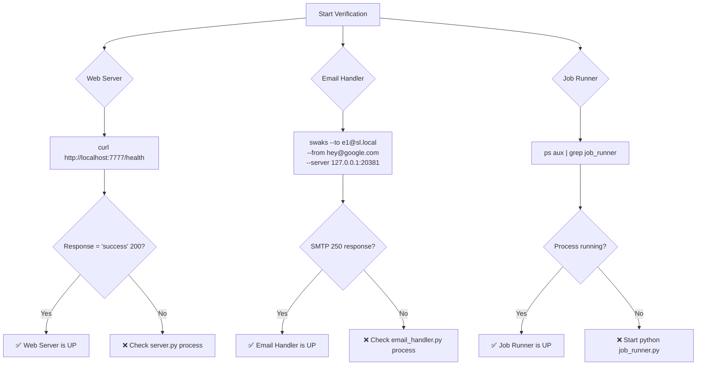
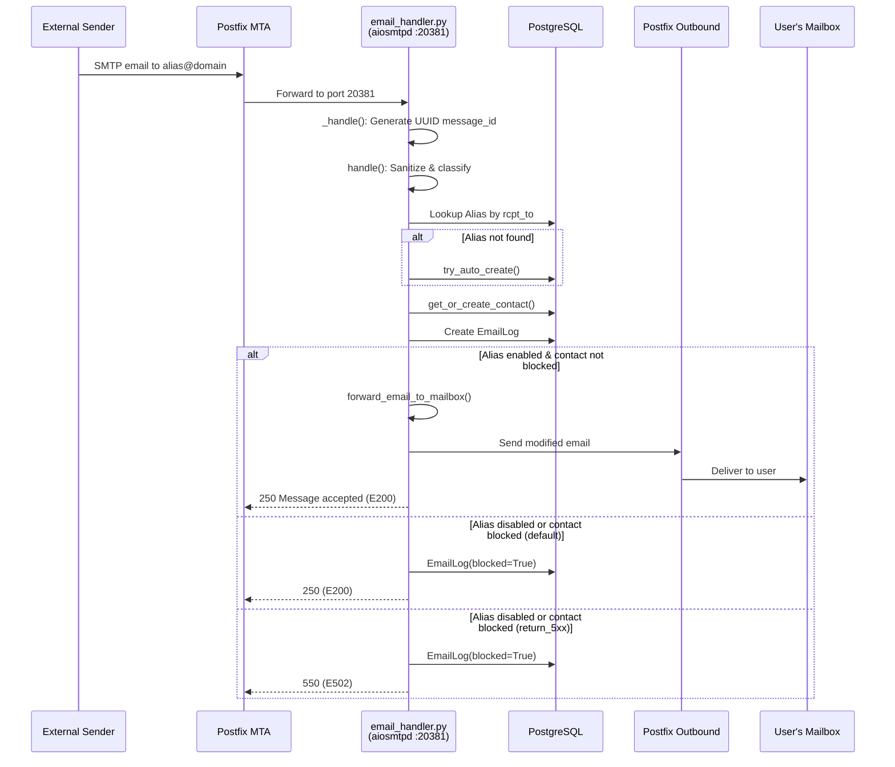
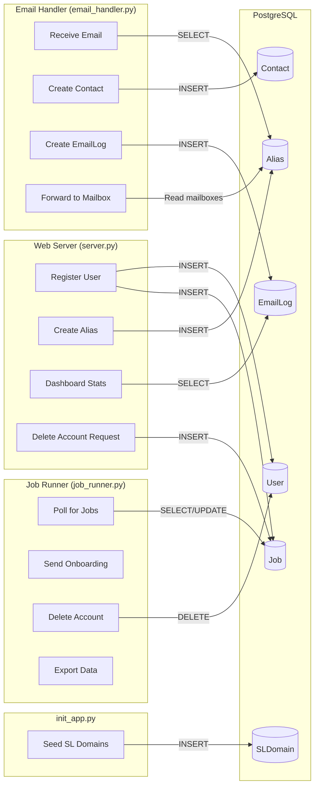

# SimpleLogin Self-Hosted: Runtime Behavior & Operational Q&A Guide

## Introduction

This document answers operational questions about the **SimpleLogin** self-hosted email aliasing application. It targets users who have just deployed SimpleLogin locally and want to understand the observable runtime behavior of its three core components:

| Component | Entry Point | Default Port | Role |
|-----------|-------------|-------------|------|
| **Web Server** | `server.py` | 7777 | Flask/Gunicorn HTTP interface for dashboard, auth, and API |
| **Email Handler** | `email_handler.py` | 20381 | aiosmtpd SMTP server that processes incoming emails |
| **Job Runner** | `job_runner.py` | N/A | Background polling loop that executes deferred tasks |

**Code-as-truth principle:** Every answer in this document is derived from static analysis of the SimpleLogin source code. Each technical claim cites the originating file and line number. No assumptions are made; where behavior cannot be confirmed from code, this is stated explicitly.

**Local development test credentials:** After running `flask dummy-data`, a seeded test user is available — email: `john@wick.com`, password: `password`. This user is created with `activated=True` and `is_admin=True`. (Source: `app/fake_data.py:44-54`)

**Local development startup workflow:**

```bash
alembic upgrade head && flask dummy-data && python3 server.py
```

(Source: `CONTRIBUTING.md:106`)

---

## Table of Contents

- [Q1: How Can I Confirm All Three Components Are Up and Responding?](#q1-how-can-i-confirm-all-three-components-are-up-and-responding)
  - [Web Server (Flask/Gunicorn)](#web-server-flaskgunicorn)
  - [Email Handler (aiosmtpd)](#email-handler-aiosmtpd)
  - [Job Runner](#job-runner)
- [Q2: What Should I See in the Dashboard That Confirms Everything Is Working?](#q2-what-should-i-see-in-the-dashboard-that-confirms-everything-is-working)
  - [Root URL Redirect Behavior](#root-url-redirect-behavior)
  - [Login Flow](#login-flow)
  - [Dashboard Landing Page](#dashboard-landing-page)
- [Q3: What Happens When I Create an Account, Create an Alias, and Receive an Email?](#q3-what-happens-when-i-create-an-account-create-an-alias-and-receive-an-email)
  - [Account Creation Walkthrough](#account-creation-walkthrough)
  - [Alias Creation Walkthrough](#alias-creation-walkthrough)
  - [Email Reception Walkthrough](#email-reception-walkthrough)
- [Q4: Do the Email Handler and Job Runner Automatically Come Online?](#q4-do-the-email-handler-and-job-runner-automatically-come-online)
  - [Email Handler Persistent Listener](#email-handler-persistent-listener)
  - [Job Runner Persistent Poller](#job-runner-persistent-poller)
  - [Cron Scheduled Tasks](#cron-scheduled-tasks)
  - [Monitoring Process](#monitoring-process)
- [Cross-Component Interaction Patterns](#cross-component-interaction-patterns)
- [Appendix A: SMTP Status Code Reference](#appendix-a-smtp-status-code-reference)
- [Appendix B: Log Format Reference](#appendix-b-log-format-reference)
- [Conclusion](#conclusion)

---

## Q1: How Can I Confirm All Three Components Are Up and Responding?

### Web Server (Flask/Gunicorn)

#### Health Endpoint

The web server exposes a dedicated health check endpoint. (Source: `server.py:213-215`)

```python
@app.route("/health", methods=["GET"])
def healthcheck():
    return "success", 200
```

**Verification command:**

```bash
curl http://localhost:7777/health
```

**Expected response:** Plain text `success` with HTTP status code `200`. Any other response (connection refused, timeout, 5xx) indicates the web server is not running.

#### Startup Behavior

When started locally via `python3 server.py`, the `local_main()` function executes. (Source: `server.py:572-588`)

It performs these steps:

1. Sets `config.COLOR_LOG = True` to enable colored log output (Source: `server.py:573`)
2. Calls `create_app()` which initializes the full Flask application (Source: `server.py:574`)
3. Enables the Flask Debug Toolbar for development (Source: `server.py:577-582`)
4. Starts the Flask development server on port 7777: `app.run(debug=True, port=7777)` (Source: `server.py:588`)

**Expected startup log:** When the logging module initializes, you will see the line `>>> init logging <<<` printed to stdout. (Source: `app/log.py:67`)

#### App Factory: `create_app()`

The `create_app()` function at `server.py:139-217` builds the full Flask application:

- Configures SQLAlchemy with `DB_URI` (Source: `server.py:146`)
- Applies `ProxyFix` middleware for Nginx reverse proxy (Source: `server.py:142`)
- Initializes rate limiting via `flask-limiter` (Source: `server.py:167`)
- Calls `register_blueprints(app)` to mount all route groups (Source: `server.py:172`)
- Calls `set_index_page(app)` which sets up the root redirect and request logging hooks (Source: `server.py:173`)
- Registers the `/health` endpoint (Source: `server.py:213-215`)

The `register_blueprints()` function registers `auth_bp`, `dashboard_bp`, `api_bp`, `monitor_bp`, `developer_bp`, `phone_bp`, `oauth_bp`, `onboarding_bp`, `discover_bp`, and `internal_bp`. (Source: `server.py:233-246`)

#### Lightweight App: `create_light_app()`

A separate `create_light_app()` factory exists for background processes. (Source: `server.py:127-136`)

This creates a minimal Flask app with only SQLAlchemy database configuration and session cleanup — it does **not** register blueprints, login manager, or rate limiter. Both `job_runner.py` and `email_handler.py` use this lightweight context for database access.

#### Request Logging

Every HTTP request (except static assets and health checks) is logged via an `after_request` hook. (Source: `server.py:272-296`)

**Log format:**

```text
<remote_addr> <method> <path> <args> <status_code>, takes <elapsed_seconds>
```

**Excluded paths:** `/static`, `/admin/static`, `/_debug_toolbar`, `/git`, `/favicon.ico`, `/health` (Source: `server.py:275-282`)

When you see log lines like `127.0.0.1 GET /dashboard/ {} 200, takes 0.045`, this confirms the web server is processing HTTP requests.

#### Thinking / Rationale

> **Files examined:** `server.py` (entry point, app factory, health route, request logging), `app/log.py` (log format and initialization).
>
> **Why:** The health endpoint is the most direct programmatic confirmation of liveness. The request logging in the `after_request` hook provides ongoing evidence that the server is handling requests. The `create_app()` and `create_light_app()` distinction is documented because background components use the light app, and understanding this is critical for interpreting runtime behavior.

---

### Email Handler (aiosmtpd)

#### Startup: `main()` Function

The email handler starts an aiosmtpd `Controller` that listens for SMTP connections. (Source: `email_handler.py:2381-2386`)

```python
def main(port: int):
    controller = Controller(MailHandler(), hostname="0.0.0.0", port=port)
    controller.start()
```

After starting the controller, it logs: `"Start mail controller 0.0.0.0 20381"` (Source: `email_handler.py:2386`)

The process then enters an infinite keep-alive loop: `while True: time.sleep(2)` (Source: `email_handler.py:2392-2393`)

#### Default Port and CLI

The `__main__` block accepts a `-p`/`--port` argument with default value `20381`. (Source: `email_handler.py:2397-2401`)

Before calling `main()`, it logs: `"Listen for port <port>"` (Source: `email_handler.py:2403`)

**Expected startup log sequence:**

```text
Listen for port 20381
Start mail controller 0.0.0.0 20381
```

#### PGP Key Loading

If `LOAD_PGP_EMAIL_HANDLER` is set to true, PGP public keys for all mailboxes and contacts are loaded into the keyring at startup. (Source: `email_handler.py:2388-2390`)

#### Verification Command

You can verify the email handler is listening by sending a test email with `swaks`: (Source: `CONTRIBUTING.md:218`)

```bash
swaks --to e1@sl.local --from hey@google.com --server 127.0.0.1:20381
```

A successful SMTP conversation (ending with `250 Message accepted`) confirms the handler is up.

#### Per-Email Processing Logs

When an email arrives, `MailHandler.handle_DATA()` delegates to `_handle()`. (Source: `email_handler.py:2334-2378`)

Each email generates:

1. A unique UUID `message_id` for lifecycle tracking (Source: `email_handler.py:2339`)
2. A visual separator: `"====>=====>====>====>====>====>====>====>"`  (Source: `email_handler.py:2342`)
3. An intake log: `"New message, mail from <sender>, rctp tos <recipients>"` (Source: `email_handler.py:2343-2346`)
4. A completion log: `"Finish mail_from <sender>, rcpt_tos <recipients>, takes <N> seconds with return code '<status>'<<===" ` (Source: `email_handler.py:2367-2373`)

Seeing these log lines confirms the email handler is actively processing incoming emails.

#### Thinking / Rationale

> **Files examined:** `email_handler.py` (main function, `_handle` lifecycle, CLI parsing), `CONTRIBUTING.md` (swaks test command).
>
> **Why:** The `main()` function's `Controller.start()` call is the definitive proof that SMTP listening begins. The `_handle()` method provides the per-email log evidence. The swaks command from CONTRIBUTING.md is the recommended manual verification method.

---

### Job Runner

#### Polling Loop

The job runner operates as an infinite polling loop. (Source: `job_runner.py:329-347`)

```python
while True:
    for job in get_jobs_to_run():
        LOG.d("Take job %s", job)
```

**Key characteristics:**

- **Polling interval:** 10 seconds between cycles (Source: `job_runner.py:347`)
- **App context:** Creates a fresh `create_light_app()` context per cycle for database access (Source: `job_runner.py:332`)
- **Job state transitions:** `ready → taken → done` (Source: `job_runner.py:339, 344`)
- **Confirmation log:** `"Take job <job>"` for each job picked up (Source: `job_runner.py:334`)

#### Job Query Logic: `get_jobs_to_run()`

The `get_jobs_to_run()` function at `job_runner.py:307-326` fetches eligible jobs matching these criteria:

- State is `ready`, **OR** state is `taken` AND `taken_at` is older than `JOB_TAKEN_RETRY_WAIT_MINS` AND `attempts` < `JOB_MAX_ATTEMPTS`
- `run_at` is NULL **OR** `run_at` is within 10 minutes from now

This retry logic ensures stuck jobs are re-attempted. (Source: `job_runner.py:309-310`)

#### Verification

The job runner does **not** expose an HTTP endpoint or listen on a port. Verification relies on:

1. **Process visibility:** Confirm the Python process is running (`ps aux | grep job_runner`)
2. **Log output:** Look for `"Take job"` messages in stdout when jobs exist
3. **Silence is normal:** If no jobs are pending, the runner simply sleeps — absence of log output is expected behavior when the `job` table has no `ready` jobs

#### Thinking / Rationale

> **Files examined:** `job_runner.py` (main loop, `get_jobs_to_run`, `process_job`), `server.py` (`create_light_app` for DB access).
>
> **Why:** The job runner has no health endpoint, so verification is observation-based. The 10-second polling interval and the `"Take job"` log message are the primary health signals. The `create_light_app()` dependency confirms that the runner needs a valid database connection to operate.

---

### Component Health Verification Flowchart



---

## Q2: What Should I See in the Dashboard That Confirms Everything Is Working?

### Root URL Redirect Behavior

Visiting `http://localhost:7777/` triggers the root route handler. (Source: `server.py:250-255`)

- **If authenticated:** Redirects to `dashboard.index` (the dashboard landing page)
- **If not authenticated:** Redirects to `auth.login` (the login page)

This means a fresh browser session will always land on the login page.

### Login Flow

The login page is served at `/auth/login` with both GET and POST methods, rate-limited to 10 requests per minute. (Source: `app/auth/views/login.py:21-24`)

**Form fields:** email and password (defined in `LoginForm` at `app/auth/views/login.py:16-18`)

**Authentication process:**

1. Sanitizes the email input and looks up the user by email or canonical email (Source: `app/auth/views/login.py:41-43`)
2. Validates password via `user.check_password(form.password.data)` (Source: `app/auth/views/login.py:45`)
3. On success: calls `after_login(user, next_url)` which establishes the Flask-Login session (Source: `app/auth/views/login.py:71-72`)

**Failure states and flash messages:**

| Condition | Flash Message | Source |
|-----------|---------------|--------|
| Wrong credentials | `"Email or password incorrect"` | `app/auth/views/login.py:49` |
| Disabled account | `"Your account is disabled..."` | `app/auth/views/login.py:52-55` |
| Scheduled deletion | `"Your account is scheduled to be deleted on <date>"` | `app/auth/views/login.py:57-61` |
| Not activated | `"Please check your inbox for the activation email..."` | `app/auth/views/login.py:63-68` |

**Already authenticated** users visiting `/auth/login` are redirected directly to the dashboard. (Source: `app/auth/views/login.py:28-34`)

#### Test User for Local Development

After running `flask dummy-data`, the following test user is available: (Source: `app/fake_data.py:44-54`)

| Field | Value |
|-------|-------|
| Email | `john@wick.com` |
| Name | `John Wick` |
| Password | `password` |
| Activated | `True` |
| Admin | `True` |
| Intro shown | `True` |

This user also has: Paddle subscription, Coinbase subscription, two API keys (`Chrome` and `Firefox`), a PGP-enabled mailbox (`pgp@example.org`), a custom domain (`ab.cd`), two directories, six notifications, and several seeded aliases. (Source: `app/fake_data.py:102-233`)

### Dashboard Landing Page

After successful login, the user is redirected to the dashboard index route at `/dashboard/`. (Source: `app/dashboard/views/index.py:55-67`)

This route is protected by `@login_required` and rate-limited to `10/minute` for GET requests and `ALIAS_LIMIT` for POST requests (alias creation). (Source: `app/dashboard/views/index.py:56-62`)

#### Statistics Display: `get_stats()`

The dashboard calls `get_stats(current_user)` to compute and display four key metrics. (Source: `app/dashboard/views/index.py:32-52`)

| Metric | Description | Query Logic |
|--------|-------------|-------------|
| `nb_alias` | Total aliases owned by user | `Alias.filter_by(user_id=user.id).count()` |
| `nb_forward` | Emails forwarded | `EmailLog` where `is_reply=False, blocked=False, bounced=False` |
| `nb_reply` | Emails replied | `EmailLog` where `is_reply=True, blocked=False, bounced=False` |
| `nb_block` | Emails blocked | `EmailLog` where `is_reply=False, blocked=True, bounced=False` |

These statistics are returned as a `Stats` dataclass defined at `app/dashboard/views/index.py:24-29`.

#### Alias Listing

Below the statistics, the dashboard displays a paginated list of the user's aliases via `get_alias_infos_with_pagination_v3()`. This function is called with query, sort, and filter parameters from the URL. (Source: `app/dashboard/views/index.py:189-199`)

#### Intro Screen

On the very first login (when `intro_shown` is `False`), an introduction overlay is displayed. (Source: `app/dashboard/views/index.py:170-177`)

For the seeded test user `john@wick.com`, `intro_shown` is set to `True` during creation, so the intro screen will **not** appear. (Source: `app/fake_data.py:52`)

#### Notification Indicators

The seeded test user has 6 notifications created via `Notification.create()`. (Source: `app/fake_data.py:231-233`) These appear as notification indicators in the dashboard UI.

#### What Confirms "Everything Is Working"

When you log in as `john@wick.com` and see the dashboard, the following confirms the system is operational:

1. **Statistics panel** shows alias/forward/reply/block counts (confirms database connectivity and query execution)
2. **Alias list** displays seeded aliases like `e0@<domain>`, `e1@<domain>`, `e2@<domain>` (confirms Alias table is populated)
3. **Notification badge** shows pending notifications (confirms notification system is active)
4. **No error flash messages** (confirms authentication, session management, and template rendering are working)

### Thinking / Rationale

> **Files examined:** `server.py` (root redirect), `app/auth/views/login.py` (login flow), `app/dashboard/views/index.py` (dashboard stats and rendering), `app/fake_data.py` (test user and seeded data).
>
> **Why:** The root redirect logic determines what users see first. The login flow validates authentication. The `get_stats()` function is the key indicator of dashboard health — it proves the database is connected and ORM queries execute correctly. The seeded test data provides a known baseline for visual confirmation.

---

## Q3: What Happens When I Create an Account, Create an Alias, and Receive an Email?

### Account Creation Walkthrough

#### Step 1: Registration

The registration route at `/auth/register` handles both GET (form display) and POST (submission). (Source: `app/auth/views/register.py:31-114`)

**Form fields:** (Source: `app/auth/views/register.py:23-28`)

- `email` — required
- `password` — required, 8-100 characters

**Registration flow on POST:**

1. If `HCAPTCHA_SECRET` is configured, validates the hCaptcha response (Source: `app/auth/views/register.py:47-71`)
2. Canonicalizes the email address via `canonicalize_email()` (Source: `app/auth/views/register.py:73`)
3. Checks `email_can_be_used_as_mailbox()` — rejects alias domains and disposable emails (Source: `app/auth/views/register.py:74`)
4. Checks `personal_email_already_used()` — prevents duplicate accounts (Source: `app/auth/views/register.py:79-80`)
5. Creates the user: `User.create(email=email, name=form.email.data, password=form.password.data, referral=get_referral())` (Source: `app/auth/views/register.py:86-91`)
6. Commits the database transaction (Source: `app/auth/views/register.py:92`)
7. Calls `send_activation_email(user, next_url)` (Source: `app/auth/views/register.py:95`)
8. Renders `auth/register_waiting_activation.html` (Source: `app/auth/views/register.py:104`)

**Log message:** `"create user <email>"` (Source: `app/auth/views/register.py:85`)

#### Step 2: Activation Email

The `send_activation_email()` function at `app/auth/views/register.py:117-129`:

1. Deletes any prior `ActivationCode` rows for this user (Source: `app/auth/views/register.py:119`)
2. Creates a new `ActivationCode` with a random 30-character code (Source: `app/auth/views/register.py:120`)
3. Builds the activation link: `{URL}/auth/activate?code={code}` (Source: `app/auth/views/register.py:124`)
4. Sends the activation email via `email_utils.send_activation_email()` (Source: `app/auth/views/register.py:129`)

#### Step 3: Account Activation

The activation route at `/auth/activate` processes the code from the URL. (Source: `app/auth/views/activate.py:13-69`)

1. Looks up the `ActivationCode` by code (Source: `app/auth/views/activate.py:26`)
2. Checks if the code is expired (Source: `app/auth/views/activate.py:38`)
3. Sets `user.activated = True` (Source: `app/auth/views/activate.py:49`)
4. Calls `login_user(user)` via Flask-Login to establish the session (Source: `app/auth/views/activate.py:50`)
5. Deletes the one-time `ActivationCode` (Source: `app/auth/views/activate.py:53`)
6. Shows flash message: `"Your account has been activated"` (Source: `app/auth/views/activate.py:56`)
7. Sends a welcome email via `email_utils.send_welcome_email(user)` (Source: `app/auth/views/activate.py:58`)
8. Redirects to the `next` URL or the dashboard (Source: `app/auth/views/activate.py:61-67`)

#### Database Artifacts After Account Creation

| Table | Row Created | Purpose |
|-------|-------------|---------|
| `user` | New user row | Stores email, hashed password, activation status |
| `mailbox` | Default mailbox | User's email becomes their default mailbox |
| `activation_code` | Created, then deleted | One-time activation token (deleted after use) |

### Alias Creation Walkthrough

#### Dashboard Random Alias Creation

When a user clicks "Create Random Alias" on the dashboard, a POST request is sent with `form-name == "create-random-email"`. (Source: `app/dashboard/views/index.py:97-121`)

**Flow:**

1. Checks `current_user.can_create_new_alias()` — validates the user's plan allows more aliases (Source: `app/dashboard/views/index.py:98`)
2. Determines the alias generator scheme (word-based or UUID) from the form or user preference (Source: `app/dashboard/views/index.py:99-103`)
3. Creates the alias: `Alias.create_new_random(user=current_user, scheme=scheme)` (Source: `app/dashboard/views/index.py:104`)
4. Sets `alias.mailbox_id = current_user.default_mailbox_id` (Source: `app/dashboard/views/index.py:106`)
5. Commits the database transaction (Source: `app/dashboard/views/index.py:108`)
6. Shows flash message: `"Alias <alias.email> has been created"` (Source: `app/dashboard/views/index.py:111`)
7. Redirects back to dashboard with `highlight_alias_id` to visually highlight the new alias (Source: `app/dashboard/views/index.py:113-121`)

**Log message:** `"create new random alias <alias> for user <user>"` (Source: `app/dashboard/views/index.py:110`)

#### Auto-Creation During Email Reception

Aliases can also be created on-the-fly when an email arrives for a non-existent alias on a custom domain or directory. The `get_user_if_alias_would_auto_create()` function at `app/alias_utils.py:58-89` checks:

1. The address does not start with the VERP bounce prefix (Source: `app/alias_utils.py:61-63`)
2. The email address is valid (no unicode characters) (Source: `app/alias_utils.py:66-71`)
3. The domain matches a custom domain with catch-all or an auto-create rule enabled (Source: `app/alias_utils.py:73-82`)
4. Or the address matches a directory auto-creation pattern (Source: `app/alias_utils.py:83-87`)

#### Database Artifacts After Alias Creation

| Table | Row Created | Purpose |
|-------|-------------|---------|
| `alias` | New alias row | Stores email address, user_id, mailbox_id |
| `alias_mailbox` | If multiple mailboxes | Maps alias to additional mailboxes beyond the primary |

The `nb_alias` count in `get_stats()` increments immediately after creation.

### Email Reception Walkthrough

#### Entry Point: SMTP Data Receipt

When an external sender delivers an email to the aiosmtpd server, `MailHandler.handle_DATA()` is triggered. It delegates to `_handle()`. (Source: `email_handler.py:2334-2378`)

**Per-email lifecycle in `_handle()`:**

1. Generates a UUID `message_id` for log correlation: `message_id = str(uuid.uuid4())` (Source: `email_handler.py:2339`)
2. Sets the message_id in the logging context via `set_message_id()` (Source: `email_handler.py:2340`)
3. Logs the visual separator and intake message (Source: `email_handler.py:2342-2346`)
4. Creates a `create_light_app()` context for database access (Source: `email_handler.py:2352`)
5. Calls the main `handle()` function (Source: `email_handler.py:2353`)
6. Logs completion with elapsed time and return status code (Source: `email_handler.py:2367-2373`)

#### Dispatch: `handle()` Function

The `handle()` function at `email_handler.py:1945-2233` is the central dispatch:

1. **Sanitizes** `mail_from` and `rcpt_tos` (Source: `email_handler.py:1949-1952`)
2. **Sets Postfix queue ID** as `message_id` if available (Source: `email_handler.py:1959-1961`)
3. **Checks for ignored emails** via `should_ignore()` (Source: `email_handler.py:1969-1971`)
4. **Sanitizes headers:** FROM, TO, CC, REPLY_TO, MESSAGE_ID (Source: `email_handler.py:1974-1978`)
5. **Logs comprehensive details** of the incoming email (Source: `email_handler.py:1980-1994`)
6. **Determines the email type** and routes to the appropriate handler:
   - Unsubscribe requests → `UnsubscribeHandler`
   - VERP bounces → `handle_bounce()`
   - Forward phase → `handle_forward()`
   - Reply phase → `handle_reply()`

#### Forward Phase: `handle_forward()`

The `handle_forward()` function at `email_handler.py:536-676` processes emails sent **to** an alias:

1. **Looks up the alias** by the recipient address (Source: `email_handler.py:543`)
2. **If not found**, attempts auto-creation via `try_auto_create()` (Source: `email_handler.py:549`)
3. **Checks user status:** `user.is_active()` and `user.can_send_or_receive()` (Source: `email_handler.py:559-568`)
4. **Creates or gets the Contact** record via `get_or_create_contact()` — this maps the sender to the alias (Source: `email_handler.py:581`)
5. **If alias is disabled or contact is blocked:** Creates an `EmailLog` with `blocked=True` and returns (Source: `email_handler.py:596-612`)
6. **Applies DMARC policy** checks (Source: `email_handler.py:615-619`)
7. **Iterates over alias mailboxes** (Source: `email_handler.py:632-676`):
   - Skips unverified mailboxes with status `E517` (Source: `email_handler.py:633-635`)
   - Detects alias-loop if mailbox email is also an alias, returns `E525` (Source: `email_handler.py:638-668`)
   - For each verified mailbox: calls `forward_email_to_mailbox()` (Source: `email_handler.py:670-673`)

#### Database Artifacts After Email Reception

| Table | Row Created/Updated | Purpose |
|-------|---------------------|---------|
| `contact` | Created if new sender | Maps external sender → alias relationship |
| `email_log` | Created for every email | Records forward/reply/block/bounce status |

#### Email Forwarding Sequence Diagram



### Thinking / Rationale

> **Files examined:** `app/auth/views/register.py` (registration flow), `app/auth/views/activate.py` (activation), `app/dashboard/views/index.py` (alias creation), `app/alias_utils.py` (auto-creation), `email_handler.py` (`_handle`, `handle`, `handle_forward`), `app/email/status.py` (SMTP return codes).
>
> **Why:** These three user actions (register, create alias, receive email) form the core user journey. Tracing each through the code reveals the exact database writes, log messages, and status codes that confirm success. The sequence diagram visualizes the multi-component email forwarding flow.

---

## Q4: Do the Email Handler and Job Runner Automatically Come Online?

### Email Handler Persistent Listener

**Yes.** The email handler is a persistent, long-running process. Once started, it listens indefinitely for incoming SMTP connections.

**How it stays alive:**

The `main()` function starts the aiosmtpd `Controller` which spawns a background thread to accept SMTP connections. (Source: `email_handler.py:2383-2386`)

The main thread then enters an infinite sleep loop: (Source: `email_handler.py:2392-2393`)

```python
while True:
    time.sleep(2)
```

This keeps the process alive while the Controller's background thread handles incoming emails. Each email triggers `MailHandler.handle_DATA()` → `_handle()` → `handle()` with a fresh `create_light_app()` context for database access. (Source: `email_handler.py:2352`)

**Confirmation signals:**

- **Startup log:** `"Start mail controller 0.0.0.0 20381"` (Source: `email_handler.py:2386`)
- **Per-email logs:** `"New message, mail from <sender>, rctp tos <recipients>"` (Source: `email_handler.py:2343-2346`)
- **Port listening:** The process binds to port 20381 and accepts TCP connections (verifiable with `swaks` or `telnet`)

The email handler does **not** need to be restarted for each email — it processes them continuously as they arrive.

### Job Runner Persistent Poller

**Yes.** The job runner is a persistent, long-running process that polls the database for pending jobs every 10 seconds.

**How it operates:** (Source: `job_runner.py:329-347`)

Each polling cycle:

1. Creates a fresh `create_light_app()` context (Source: `job_runner.py:332`)
2. Calls `get_jobs_to_run()` to fetch eligible jobs (Source: `job_runner.py:333`)
3. For each job:
   - Logs `"Take job <job>"` (Source: `job_runner.py:334`)
   - Marks `job.taken = True`, `job.state = taken`, increments `job.attempts` (Source: `job_runner.py:337-340`)
   - Calls `process_job(job)` to execute the job (Source: `job_runner.py:342`)
   - Marks `job.state = done` (Source: `job_runner.py:344`)
4. Sleeps 10 seconds before the next cycle (Source: `job_runner.py:347`)

#### Job State Machine

```text
ready ──→ taken ──→ done
  ↑          │
  └──────────┘  (retry if taken_at older than JOB_TAKEN_RETRY_WAIT_MINS
                 AND attempts < JOB_MAX_ATTEMPTS)
```

(Source: `job_runner.py:307-326`)

#### Supported Job Types

The `process_job()` function at `job_runner.py:188-304` dispatches by job name:

| Job Name (config constant) | Action | Source |
|---------------------------|--------|--------|
| `JOB_ONBOARDING_1` | Send "send-from-alias" tip email | `job_runner.py:189-197` |
| `JOB_ONBOARDING_2` | Send "mailbox" tip email | `job_runner.py:198-206` |
| `JOB_ONBOARDING_4` | Send "PGP" tip email | `job_runner.py:207-220` |
| `JOB_BATCH_IMPORT` | Process batch alias import | `job_runner.py:222-225` |
| `JOB_DELETE_ACCOUNT` | Delete user account and notify | `job_runner.py:226-244` |
| `JOB_DELETE_MAILBOX` | Delete mailbox and associated aliases | `job_runner.py:245-246` |
| `JOB_DELETE_DOMAIN` | Delete custom domain and aliases | `job_runner.py:248-284` |
| `JOB_SEND_USER_REPORT` | Export user data (GDPR) | `job_runner.py:285-288` |
| `JOB_SEND_PROTON_WELCOME_1` | Send Proton welcome email | `job_runner.py:289-294` |
| `JOB_SEND_ALIAS_CREATION_EVENTS` | Dispatch alias creation events | `job_runner.py:295-302` |

Unknown job names trigger: `LOG.e("Unknown job name %s", job.name)` (Source: `job_runner.py:304`)

### Cron Scheduled Tasks

SimpleLogin uses **yacron** (a YAML-configured cron scheduler) to run periodic maintenance tasks defined in `crontab.yml`. (Source: `crontab.yml:1-97`)

All tasks invoke `python /code/cron.py -j <job_name>` via `/bin/bash` with `captureStderr: true`.

| Job Name | Schedule | Description | Concurrency |
|----------|----------|-------------|-------------|
| `stats` | `0 0 * * *` (daily 00:00) | Growth statistics collection | Allowed |
| `delete_old_monitoring` | `15 1 * * *` (daily 01:15) | Purge old monitoring records | Allowed |
| `check_custom_domain` | `15 2 * * *` (daily 02:15) | Verify custom domain DNS | Allowed |
| `check_hibp` | `15 3 * * *` (daily 03:15) | Check Have I Been Pwned breaches | **Forbid** |
| `notify_hibp` | `15 4 * * *` (daily 04:15) | Notify users of HIBP breaches | **Forbid** |
| `delete_logs` | `15 5 * * *` (daily 05:15) | Purge old email logs | Allowed |
| `delete_old_data` | `30 5 * * *` (daily 05:30) | Delete stale data | Allowed |
| `poll_apple_subscription` | `15 6 * * *` (daily 06:15) | Verify Apple subscriptions | Allowed |
| `notify_trial_end` | `15 8 * * *` (daily 08:15) | Notify users of trial expiration | Allowed |
| `notify_manual_subscription_end` | `15 9 * * *` (daily 09:15) | Notify manual subscription expiry | Allowed |
| `notify_premium_end` | `15 10 * * *` (daily 10:15) | Notify premium plan expiry | Allowed |
| `delete_scheduled_users` | `15 11 * * *` (daily 11:15) | Delete users scheduled for removal | **Forbid** |
| `send_undelivered_mails` | `*/5 * * * *` (every 5 min) | Retry undelivered emails | **Forbid** |
| `clear_alias_audit_log` | `0 * * * *` (hourly) | Purge old alias audit entries | **Forbid** |
| `clear_user_audit_log` | `0 * * * *` (hourly) | Purge old user audit entries | **Forbid** |

### Monitoring Process

A separate monitoring process (`monitoring.py`) runs continuously to collect infrastructure metrics. (Source: `monitoring.py:157-171`)

It executes in a `while True` loop with a 60-second sleep interval, calling:

- `log_postfix_metrics()` — Counts files in Postfix queue directories (Source: `monitoring.py:39-48`)
- `log_nb_db_connection()` — Queries `pg_stat_activity` for active DB connections (Source: `monitoring.py:88-94`)
- `log_pending_to_process_events()` — Counts unprocessed sync events (Source: `monitoring.py:112-119`)
- `log_events_pending_dead_letter()` — Counts stale events older than 10 minutes (Source: `monitoring.py:123-139`)
- `log_failed_events()` — Counts events with retry_count >= 10 (Source: `monitoring.py:143-154`)

Metrics are exported to New Relic via `MetricExporter`. (Source: `monitoring.py:158, 168`)

### Thinking / Rationale

> **Files examined:** `email_handler.py` (persistent listener lifecycle), `job_runner.py` (polling loop, job dispatch, state machine), `crontab.yml` (cron schedule definitions), `cron.py` (cron task implementations), `monitoring.py` (metrics collection loop).
>
> **Why:** The user needs to know whether these background components require manual startup or run automatically. Both are designed as persistent processes with infinite loops. The cron tasks represent a third category of background work — scheduled rather than event-driven or poll-driven. The monitoring process is a fourth distinct component that provides operational visibility.

---

## Cross-Component Interaction Patterns

The three core components share a PostgreSQL database and interact through it:



### Key Interaction Patterns

**1. Web Server → Job Runner (via Job table)**

When a user registers, the web server creates `Job` rows for onboarding emails (JOB_ONBOARDING_1, JOB_ONBOARDING_2, JOB_ONBOARDING_4). The job runner picks these up within 10 seconds and sends the onboarding email series. Similarly, account deletion and mailbox deletion are queued as jobs. (Source: `job_runner.py:189-246`)

**2. Email Handler → Dashboard (via Contact and EmailLog tables)**

When the email handler processes an incoming email via `handle_forward()`, it creates `Contact` and `EmailLog` rows. (Source: `email_handler.py:581, 598-604`) These rows are read by the dashboard's `get_stats()` function to display forward/reply/block counts. (Source: `app/dashboard/views/index.py:32-52`)

**3. init_app.py → Alias Creation (via SLDomain table)**

The `add_sl_domains()` function seeds the `SLDomain` table with configured alias domains. (Source: `init_app.py:39-56`) Both the web server (alias creation in dashboard) and email handler (alias auto-creation) depend on these domains being present.

---

## Appendix A: SMTP Status Code Reference

All status codes are defined in `app/email/status.py:1-64`.

### 2xx — Success Codes

| Code | Status String |
|------|--------------|
| E200 | `250 Message accepted for delivery` |
| E201 | `250 SL E201` |
| E202 | `250 Unsubscribe request accepted` |
| E203 | `250 SL E203 email can't be sent from a reverse-alias` |
| E204 | `250 SL E204 ignore` |
| E205 | `250 SL E205 bounce handled` |
| E206 | `250 SL E206 Out of office` |
| E207 | `250 SL E207 No bounce report` |
| E208 | `250 SL E208 Hotmail complaint handled` |
| E209 | `250 SL E209 Email Loop` |
| E210 | `250 SL E210 Yahoo complaint handled` |
| E211 | `250 SL E211 Bounce Forward phase handled` |
| E212 | `250 SL E212 Bounce Reply phase handled` |
| E213 | `250 SL E213 Unknown email ignored` |
| E214 | `250 SL E214 Unauthorized for using reverse alias` |
| E215 | `250 SL E215 Handled dmarc policy` |
| E216 | `250 SL E216 Handled spf policy` |

### 4xx — Retry Codes

| Code | Status String |
|------|--------------|
| E402 | `421 SL E402 Encryption failed - Retry later` |
| E404 | `421 SL E404 Unexpected error - Retry later` |
| E405 | `421 SL E405 Mailbox domain problem - Retry later` |
| E407 | `421 SL E407 Retry later` |

### 5xx — Permanent Failure Codes

| Code | Status String |
|------|--------------|
| E501 | `550 SL E501` |
| E502 | `550 SL E502 Email not exist` |
| E503 | `550 SL E503` |
| E504 | `550 SL E504 Account disabled` |
| E505 | `550 SL E505` |
| E506 | `550 SL E506 Email detected as spam` |
| E507 | `550 SL E507 Wrongly formatted subject` |
| E508 | `550 SL E508 Email not exist` |
| E509 | `550 SL E509 unauthorized` |
| E510 | `550 SL E510 so such user` |
| E511 | `550 SL E511 unsubscribe error` |
| E512 | `550 SL E512 No such email log` |
| E514 | `550 SL E514 Email sent to noreply address` |
| E515 | `550 SL E515 Email not exist` |
| E516 | `550 SL E516 invalid mailbox` |
| E517 | `550 SL E517 unverified mailbox` |
| E518 | `550 SL E518 Disabled mailbox` |
| E519 | `550 SL E519 Email detected as spam` |
| E521 | `550 SL E521 Cannot reach mailbox` |
| E522 | `550 SL E522 The user you are trying to contact is receiving mail at a rate that prevents additional messages from being delivered.` |
| E523 | `550 SL E523 Unknown error` |
| E524 | `550 SL E524 Wrong use of reverse-alias` |
| E525 | `550 SL E525 Alias loop` |

---

## Appendix B: Log Format Reference

### Log Format String

All SimpleLogin components use a structured log format defined in `app/log.py:12-14`:

```text
%(asctime)s - %(name)s - %(levelname)s - %(process)d - "%(pathname)s:%(lineno)d" - %(funcName)s() - %(message_id)s - %(message)s
```

| Field | Description |
|-------|-------------|
| `asctime` | UTC timestamp |
| `name` | Logger name (always `SL`) |
| `levelname` | DEBUG, INFO, WARNING, or ERROR |
| `process` | OS process ID |
| `pathname:lineno` | Source file path and line number (clickable in PyCharm) |
| `funcName` | Function that generated the log |
| `message_id` | Email lifecycle correlation ID (UUID or Postfix queue ID) |
| `message` | The log message content |

### Message ID Correlation

The `message_id` field is critical for tracing an email's journey through the system. It is set via `set_message_id()` at `app/log.py:22-25`.

In the email handler:

- Initially set to a random UUID when an email arrives (Source: `email_handler.py:2339-2340`)
- Overwritten with the Postfix queue ID if available (Source: `email_handler.py:1959-1961`)
- All subsequent log lines for that email include this ID, enabling grep-based filtering

### LOG Shortcuts

The `LOG` object provides shorthand methods: (Source: `app/log.py:73-77`)

| Shortcut | Maps To | Level |
|----------|---------|-------|
| `LOG.d(...)` | `logging.Logger.debug` | DEBUG |
| `LOG.i(...)` | `logging.Logger.info` | INFO |
| `LOG.w(...)` | `logging.Logger.warning` | WARNING |
| `LOG.e(...)` | `logging.Logger.exception` | ERROR (with traceback) |

### Colored Logs

When `COLOR_LOG` is `True` (set by `local_main()` during development), the `coloredlogs` package renders log output with color coding. (Source: `app/log.py:61-62`, `server.py:573`)

### Werkzeug Log Suppression

Flask's default Werkzeug request logs (e.g., `127.0.0.1 - - [date] "GET /path HTTP/1.1" 200`) are explicitly disabled: (Source: `app/log.py:70-71`)

```python
log = logging.getLogger("werkzeug")
log.disabled = True
```

This means HTTP request logging is handled entirely by the custom `after_request` hook in `server.py`, not by Werkzeug.

---

## Conclusion

### Quick Verification Commands

| Component | Command | Expected Result |
|-----------|---------|-----------------|
| Web Server | `curl http://localhost:7777/health` | `success` (HTTP 200) |
| Email Handler | `swaks --to e1@sl.local --from hey@google.com --server 127.0.0.1:20381` | SMTP 250 response |
| Job Runner | `ps aux \| grep job_runner` | Python process running |

### Expected Log Signatures for Healthy Operation

| Component | Log Signature | Meaning |
|-----------|---------------|---------|
| Web Server | `>>> init logging <<<` | Logging initialized |
| Web Server | `127.0.0.1 GET /dashboard/ {} 200, takes 0.0xx` | HTTP requests being served |
| Email Handler | `Start mail controller 0.0.0.0 20381` | SMTP listener started |
| Email Handler | `New message, mail from ..., rctp tos ...` | Email being processed |
| Email Handler | `Finish mail_from ..., takes X seconds with return code '250 ...'<<===` | Email processing completed |
| Job Runner | `Take job <Job ...>` | Job being processed |

### Local Development Workflow

Start PostgreSQL in Docker:

```bash
docker run -e POSTGRES_PASSWORD=mypassword -e POSTGRES_USER=myuser \
  -e POSTGRES_DB=simplelogin -p 15432:5432 postgres:13
```

Initialize the database, seed test data, and start the web server:

```bash
alembic upgrade head && flask dummy-data && python3 server.py
```

In separate terminals, start the email handler and job runner:

```bash
python email_handler.py   # terminal 2
python job_runner.py       # terminal 3
```

Then open `http://localhost:7777` and log in with `john@wick.com` / `password`. (Source: `CONTRIBUTING.md:99-109, 209-229`)

All three components are designed as persistent, long-running processes. The web server handles HTTP requests, the email handler accepts SMTP connections, and the job runner polls the database — each independently and continuously, sharing state through PostgreSQL.
