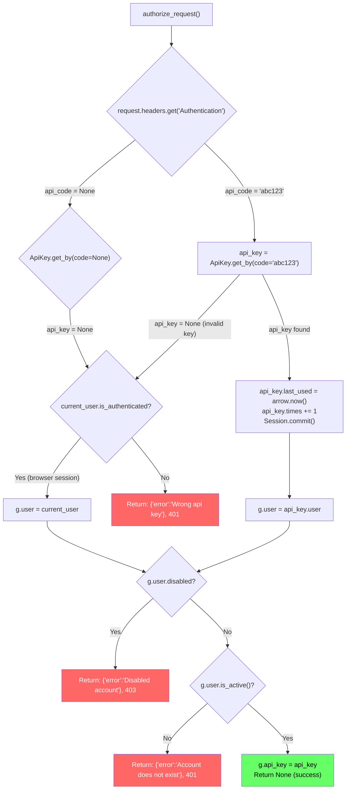
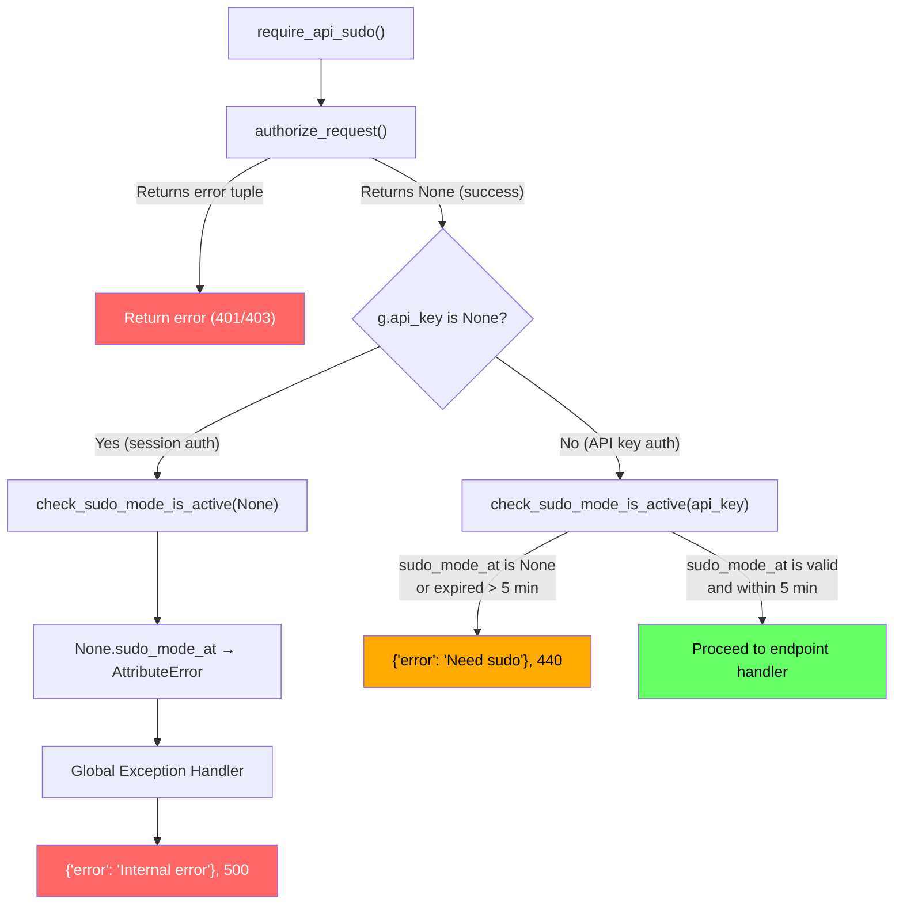
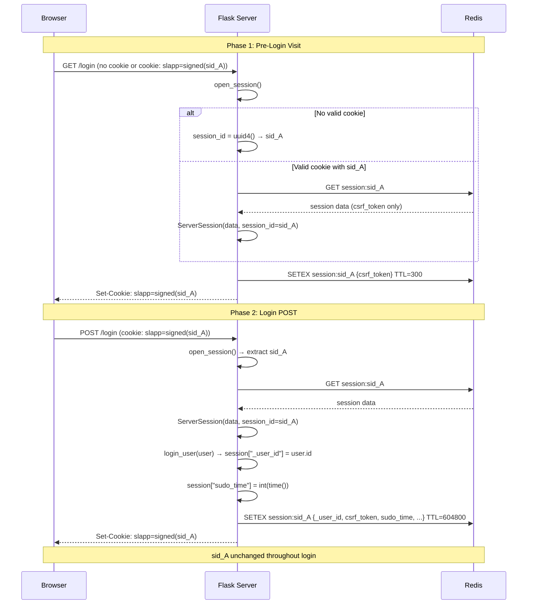
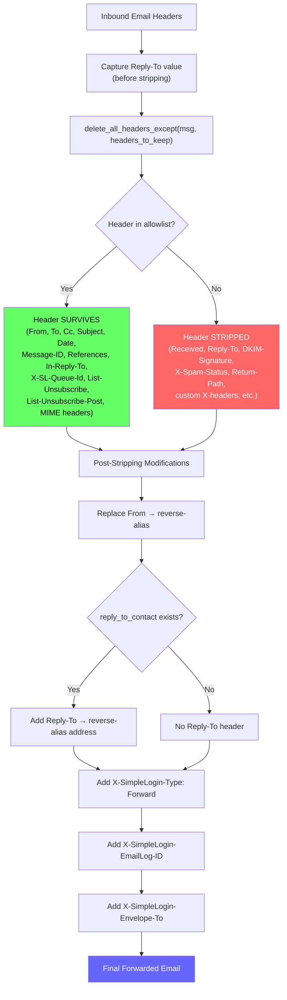
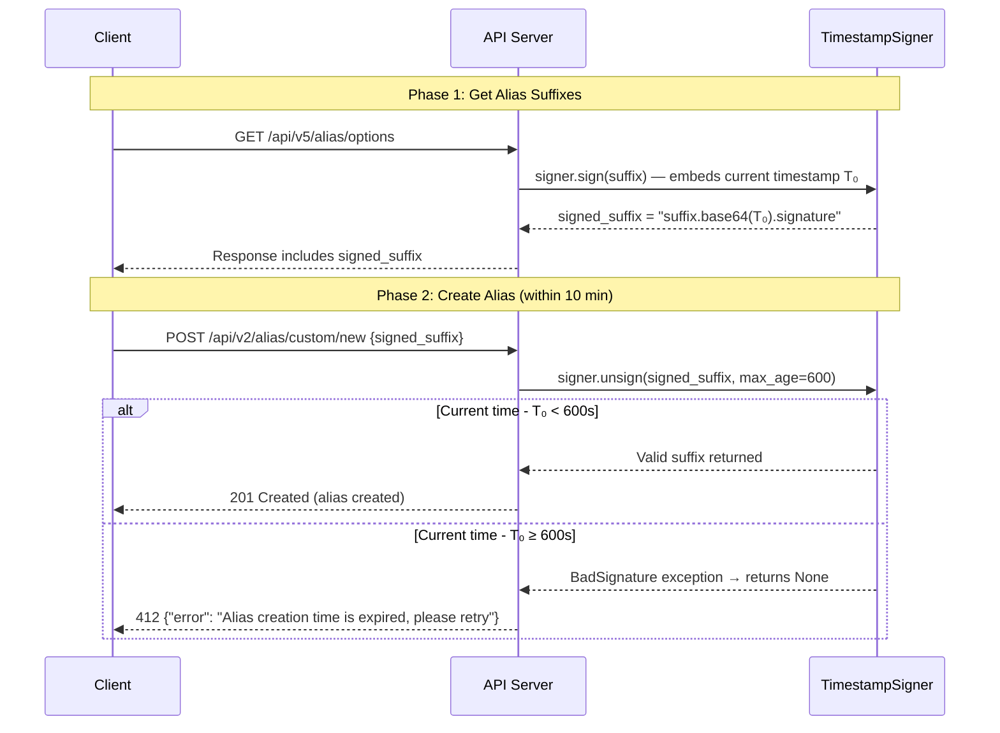

# SimpleLogin Runtime Behavior Investigation

This document answers eight empirical questions about SimpleLogin's runtime behavior. All findings are derived from direct source code analysis of the SimpleLogin open-source repository — no assumptions or speculation are made.

**Methodology:** Code-path tracing — following execution from HTTP request entry point through middleware, authentication, business logic, and final HTTP response. Every finding includes precise file paths and line numbers so that any claim can be independently verified against the source code.

**Citation format:** `Source: path/to/file.py:LineNumber`

**Important distinction:** All findings are labeled as **code-path analysis** (predicted behavior from reading the source code). The full runtime stack (PostgreSQL, Redis, Postfix) was not executed; however, the code paths are deterministic and the predictions are exact.

**Diagrams:** Mermaid diagrams illustrate complex multi-step flows throughout the document.

---

## Q1: API Session-Based Authentication Response

**Question:** When a user is logged into the SimpleLogin web interface and makes API calls without an `Authentication` header, what exact HTTP status code and response body does the system return?

### Code Path Trace

The API authentication pipeline is controlled by `authorize_request()` in `app/api/base.py`. Every API endpoint decorated with `@require_api_auth` or `@require_api_sudo` calls this function first.

**Step 1 — Read the `Authentication` header:**

```python
api_code = request.headers.get("Authentication")
```

`Source: app/api/base.py:17`

When no `Authentication` header is sent, `api_code` is `None`.

**Step 2 — Look up the API key:**

```python
api_key = ApiKey.get_by(code=api_code)
```

`Source: app/api/base.py:18`

`ApiKey.get_by(code=None)` returns `None` because no database row has `code = NULL` (the column is defined as `nullable=False` at `app/models.py:2356`).

**Step 3 — Enter the `if not api_key:` branch:**

```python
if not api_key:
    if current_user.is_authenticated:
        # if current_user.is_authenticated and request.headers.get(
        #    constants.HEADER_ALLOW_API_COOKIES
        # ):
        g.user = current_user
    else:
        return jsonify(error="Wrong api key"), 401
```

`Source: app/api/base.py:20-27`

Since the user IS logged in via the browser session (Flask-Login session cookie `slapp`), `current_user.is_authenticated` evaluates to `True`. The user is set on the Flask global: `g.user = current_user`.

**Step 4 — Account state checks:**

```python
if g.user.disabled:
    return jsonify(error="Disabled account"), 403

if not g.user.is_active():
    return jsonify(error="Account does not exist"), 401
```

`Source: app/api/base.py:36-40`

For a normal active account, both checks pass.

**Step 5 — Set `g.api_key` and return success:**

```python
g.api_key = api_key
return None
```

`Source: app/api/base.py:42-43`

**CRITICAL:** `api_key` is still `None` here (no API key was found). So `g.api_key = None`. This has significant downstream implications for sudo-protected endpoints (see Q2).

The function returns `None`, meaning "no error" — the request proceeds to the endpoint handler.

### Answer

**The API call succeeds.** The `authorize_request()` function returns `None` (no error), allowing the request to proceed to the actual endpoint handler. The HTTP response status code and body depend entirely on the specific endpoint called. The user is identified from the Flask-Login session via `current_user`, not from an API key.

> **Note:** Lines 22–24 show commented-out code that would have gated cookie-based API auth behind the `X-Sl-Allowcookies` header (defined as `HEADER_ALLOW_API_COOKIES = "X-Sl-Allowcookies"` at `app/constants.py:1`). In the current codebase, this check is **commented out**, meaning cookie-based API authentication works **unconditionally** in production. However, the test infrastructure's `CustomTestClient` at `tests/conftest.py:50-56` still injects this header on every request, meaning tests exercise a code path that was once production-gated but is no longer.

### Mermaid Diagram: `authorize_request()` Decision Tree



### Rationale

The reasoning chain is:
1. No `Authentication` header → `api_code = None` → `api_key = None`
2. `if not api_key:` → `True`, enter the no-API-key branch
3. Browser session exists → `current_user.is_authenticated` = `True` → `g.user = current_user`
4. Account checks pass for a normal user
5. `g.api_key = None` (the variable `api_key` was never reassigned from `None`)
6. `return None` → success, request proceeds

This is a **designed fallback path**, not a bug. The commented-out code at lines 22–24 shows the developers once considered gating this behind a header but chose to allow it unconditionally. The consequence is that any browser session can be used to call API endpoints directly.

> **Security context — CORS configuration:** CORS is configured with wildcard origins at `server.py:200`: `CORS(app, resources={r"/api/*": {"origins": "*"}})`. The `supports_credentials` parameter is **not set** (defaults to `False`), which means cross-origin requests **cannot** include cookies or the `Authentication` header. This prevents a malicious third-party site from using `fetch()` with `credentials: "include"` to exploit a user's session cookie for cross-origin API calls. However, same-origin JavaScript (e.g., code running on the SimpleLogin domain itself) can still use session cookies to call API endpoints without an API key.

> **Security context — CSRF protection on API endpoints:** API endpoints (under `app/api/`) do **not** verify CSRF tokens — no usage of `CSRFValidationForm` (defined at `app/utils.py:157`) exists in any API view. Web dashboard views (e.g., `app/dashboard/views/mailbox_detail.py:45`, `app/dashboard/views/setting.py:93`, `app/dashboard/views/domain_detail.py:41`) **do** use `CSRFValidationForm` for CSRF protection. When API endpoints are accessed via an API key (the `Authentication` header), the key itself serves as an implicit CSRF token since cross-origin JavaScript cannot read or set custom headers without CORS permission. When accessed via session cookie, CSRF protection relies on two mitigations: (1) the `SameSite=Lax` cookie attribute (`server.py:162`) prevents the browser from sending the `slapp` cookie on cross-site POST/PUT/DELETE requests, and (2) the CORS wildcard configuration without `supports_credentials` prevents cross-origin `fetch()` from including cookies.

---

## Q2: Privileged Operation Access with Browser Session

**Question:** When attempting to access `require_api_sudo()`-protected endpoints using only a browser session (no API key), what specific HTTP status code and error message is returned?

### Code Path Trace

The `require_api_sudo()` decorator wraps endpoints that require elevated privileges:

```python
def require_api_sudo(f):
    @wraps(f)
    def decorated(*args, **kwargs):
        error_return = authorize_request()
        if error_return:
            return error_return
        if not check_sudo_mode_is_active(g.api_key):
            return jsonify(error="Need sudo"), 440
        return f(*args, **kwargs)
    return decorated
```

`Source: app/api/base.py:63-73`

**Step 1 — `authorize_request()` succeeds (per Q1):**

For a browser-session-authenticated user, `authorize_request()` returns `None`. But critically, `g.api_key` is set to `None` (line 42).

`Source: app/api/base.py:66`

**Step 2 — Call `check_sudo_mode_is_active(g.api_key)` with `None`:**

```python
def check_sudo_mode_is_active(api_key: ApiKey) -> bool:
    return api_key.sudo_mode_at and g.api_key.sudo_mode_at >= arrow.now().shift(
        minutes=-SUDO_MODE_MINUTES_VALID
    )
```

`Source: app/api/base.py:46-49`

When `api_key` is `None`, accessing `api_key.sudo_mode_at` raises:

```
AttributeError: 'NoneType' object has no attribute 'sudo_mode_at'
```

**Step 3 — Global exception handler catches the `AttributeError`:**

```python
@app.errorhandler(Exception)
def error_handler(e):
    LOG.e(e)
    if request.path.startswith("/api/"):
        return jsonify(error="Internal error"), 500
    else:
        return render_template("error/500.html"), 500
```

`Source: server.py:388-394`

Since the request path starts with `/api/`, the handler returns a JSON response.

### Answer

**The system returns HTTP 500 with body `{"error": "Internal error"}`.**

This is **NOT** the expected HTTP 440 "Need sudo" response. The 500 occurs because `g.api_key` is `None` when session-based authentication is used, and accessing `.sudo_mode_at` on `None` raises an unhandled `AttributeError` that is caught by the global exception handler.

### Expected Behavior with API Key (Sudo Not Active)

When `g.api_key` is a valid `ApiKey` object but sudo mode is not active (either `sudo_mode_at` is `None` or has expired beyond `SUDO_MODE_MINUTES_VALID = 5` minutes):

```python
if not check_sudo_mode_is_active(g.api_key):
    return jsonify(error="Need sudo"), 440
```

`Source: app/api/base.py:69-70`

- `SUDO_MODE_MINUTES_VALID = 5` — `Source: app/api/base.py:13`
- HTTP 440 is a **non-standard** status code (Microsoft IIS "Login Timeout"), not part of the IANA HTTP Status Code Registry

### Sudo Activation Endpoint

The `PATCH /api/sudo` endpoint at `app/api/views/sudo.py` activates sudo mode:

```python
@api_bp.route("/sudo", methods=["PATCH"])
@require_api_auth
def enter_sudo():
    user = g.user
    data = request.get_json() or {}
    if "password" not in data:
        return jsonify(error="Invalid password"), 403
    if not user.check_password(data["password"]):
        return jsonify(error="Invalid password"), 403

    g.api_key.sudo_mode_at = arrow.now()
    Session.commit()
    return jsonify(ok=True)
```

`Source: app/api/views/sudo.py:8-27`

> **Note:** Line 24 (`g.api_key.sudo_mode_at = arrow.now()`) also fails with `AttributeError` if accessed via session auth, because `g.api_key` is `None`. This means sudo mode **cannot be activated** when using browser-session-based API access.

### Mermaid Diagram: Sudo Mode Access Flow



### Rationale

The reasoning chain is:
1. `authorize_request()` succeeds for session-authenticated users but sets `g.api_key = None`
2. `require_api_sudo()` calls `check_sudo_mode_is_active(g.api_key)` which is `check_sudo_mode_is_active(None)`
3. `None.sudo_mode_at` raises `AttributeError` — this is an unhandled edge case in the code
4. The global `@app.errorhandler(Exception)` handler at `server.py:388` catches it and returns `{"error": "Internal error"}, 500`
5. This is a behavioral quirk: the code at `app/api/base.py:42` sets `g.api_key = api_key` where `api_key` can be `None`, but downstream code at line 47 unconditionally accesses `.sudo_mode_at` on whatever value is passed

---

## Q3: Redis Session Data Structure

**Question:** What is the raw serialized session data format stored in Redis, including the serialization protocol, the keys present in a deserialized authenticated session, and the structure of the Redis key?

### Redis Key Format

```python
SESSION_PREFIX = "session"

@classmethod
def _get_key(cls, session_Id: str) -> str:
    return f"{SESSION_PREFIX}:{session_Id}"
```

`Source: app/session.py:18, 43-45`

The Redis key format is: **`session:<uuid4>`**

Where `<uuid4>` is a standard UUID v4 string (e.g., `session:a1b2c3d4-e5f6-7890-abcd-ef1234567890`), generated at:
- `app/session.py:64` — during `purge_session()`
- `app/session.py:71` — when no valid session cookie exists in `open_session()`
- `app/session.py:80` — when Redis has no data for the session ID

### Serialization Protocol

```python
try:
    import cPickle as pickle
except ImportError:
    import pickle
```

`Source: app/session.py:9-12`

The system uses Python's **pickle** serialization (or `cPickle` on Python 2, though the codebase requires Python 3.10+). Session data is serialized as:

```python
val = pickle.dumps(dict(session))
```

`Source: app/session.py:91`

And deserialized as:

```python
data = pickle.loads(val)
```

`Source: app/session.py:76`

The serialized value is raw pickle bytes stored directly in Redis via `SETEX`.

### Session Cookie Signing

The session cookie does NOT contain the session data — it contains only the **signed session ID**.

**Cookie name:** `slapp`
`Source: app/config.py:199`

**Signer configuration:**

```python
@classmethod
def _get_signer(cls, app) -> itsdangerous.Signer:
    return itsdangerous.Signer(
        app.secret_key, salt="session", key_derivation="hmac"
    )
```

`Source: app/session.py:37-41`

**Cookie value format:** `<session_uuid>.<hmac_signature>`

The cookie is set at:

```python
signed_session_id = self._get_signer(app).sign(
    itsdangerous.want_bytes(session.session_id)
)
response.set_cookie(app.session_cookie_name, signed_session_id, ...)
```

`Source: app/session.py:102-104`

Cookie extraction and HMAC verification occurs at:

```python
unverified_session_Id = request.cookies.get(app.session_cookie_name)
signer = cls._get_signer(app)
sid_as_bytes = signer.unsign(unverified_session_Id)
```

`Source: app/session.py:51-57`

### Deserialized Session Keys (Authenticated Session)

| Key | Source | Description |
|-----|--------|-------------|
| `_user_id` | Flask-Login's `login_user()` | Integer user ID of the logged-in user |
| `csrf_token` | Flask-WTF | CSRF protection token string |
| `sudo_time` | `app/auth/views/login_utils.py:37` | Unix timestamp (int) of when the user logged in: `session["sudo_time"] = int(time())` |
| `_fresh` | Flask-Login | Boolean indicating session freshness (True after direct login) |
| `_id` | Flask-Login (`session_protection="strong"`) | Hash of user-agent + remote IP, used to detect session hijacking |

### TTL Policies

```python
ttl = int(app.permanent_session_lifetime.total_seconds())
# Only 5 minutes for non-authenticated sessions.
# We need to keep the non-authenticated ones because the csrf token is stored in the session.
if "_user_id" not in session:
    ttl = 300
```

`Source: app/session.py:92-96`

| Session Type | TTL | Source |
|-------------|-----|--------|
| Authenticated (`_user_id` present) | 604800 seconds (7 days) | `server.py:207` — `app.permanent_session_lifetime = timedelta(days=7)` |
| Unauthenticated (no `_user_id`) | 300 seconds (5 minutes) | `app/session.py:96` |

The 5-minute TTL for unauthenticated sessions exists because the CSRF token is stored in the session (comment at line 94).

### Redis Storage Call

```python
self._redis_w.setex(
    name=self._get_key(session.session_id),
    value=val,
    time=ttl,
)
```

`Source: app/session.py:97-101`

Redis backend initialization is done in `app/redis_services.py:9-25`, supporting both direct Redis (`redis://`) and Redis Sentinel (`redis+sentinel://`) connections.

`Source: app/redis_services.py:10-18`

### Rationale

The reasoning chain is:
1. Redis key format is `session:<uuid4>` — constructed by `_get_key()` using the `SESSION_PREFIX` constant
2. Session data is serialized with Python `pickle.dumps()` and stored as raw bytes in Redis
3. The session cookie (`slapp`) contains only the HMAC-signed session ID, not the data itself
4. The HMAC uses `itsdangerous.Signer` with the Flask secret key, `salt="session"`, and `key_derivation="hmac"`
5. Authenticated sessions get a 7-day TTL; unauthenticated sessions get a 5-minute TTL to preserve the CSRF token
6. The deserialized session dictionary contains Flask-Login keys (`_user_id`, `_fresh`, `_id`), Flask-WTF's `csrf_token`, and the application's `sudo_time`

---

## Q4: Session ID Regeneration During Login

**Question:** Does the session ID (cookie value) change during the login flow?

### Pre-Login: `open_session()` Flow

When a request arrives, Flask calls `open_session()`:

```python
def open_session(self, app: flask.Flask, request: flask.Request):
    session_id = self.extract_and_validate_session_id(app, request)
    if not session_id:
        return ServerSession(session_id=str(uuid.uuid4()))

    val = self._redis_r.get(self._get_key(session_id))
    if val is not None:
        try:
            data = pickle.loads(val)
            return ServerSession(data, session_id=session_id)
        except Exception:
            pass
    return ServerSession(session_id=str(uuid.uuid4()))
```

`Source: app/session.py:68-80`

If a valid signed cookie exists, the **existing session ID is preserved** (line 77: `session_id=session_id`). A new UUID is generated only when there is no valid cookie (line 71) or no corresponding Redis data (line 80).

### Login Action: `login_user()` Call

```python
login_user(user)
session["sudo_time"] = int(time())
```

`Source: app/auth/views/login_utils.py:36-37`

Flask-Login's `login_user()` adds `_user_id` to the **existing** session dictionary. It does NOT call `purge_session()` or generate a new session ID. It modifies the session data in-place.

### Post-Login: `save_session()` Flow

```python
def save_session(self, app, session, response):
    ...
    val = pickle.dumps(dict(session))
    ttl = int(app.permanent_session_lifetime.total_seconds())
    if "_user_id" not in session:
        ttl = 300
    self._redis_w.setex(
        name=self._get_key(session.session_id),
        value=val,
        time=ttl,
    )
    signed_session_id = self._get_signer(app).sign(
        itsdangerous.want_bytes(session.session_id)
    )
    response.set_cookie(app.session_cookie_name, signed_session_id, ...)
```

`Source: app/session.py:82-114`

The `save_session()` method uses the **SAME** `session.session_id` that was loaded in `open_session()`. The Redis key `session:<same_id>` is overwritten with the updated data (now containing `_user_id`), and the same signed session ID is set in the cookie.

### Flask-Login `session_protection = "strong"`

```python
login_manager.session_protection = "strong"
```

`Source: app/extensions.py:8`

This setting causes Flask-Login to check for user-agent and IP address changes on subsequent requests **after** login. If a mismatch is detected, Flask-Login calls `session.clear()`, which clears the dictionary contents (removing `_user_id`, `_fresh`, `_id`, etc.) but does **NOT** change the `ServerSession.session_id` attribute — the Redis key remains the same.

### Session ID Regeneration: Only During Logout

```python
def purge_session(self, session: ServerSession):
    try:
        self._redis_w.delete(self._get_key(session.session_id))
        session.session_id = str(uuid.uuid4())
    except AttributeError:
        pass
```

`Source: app/session.py:61-66`

`purge_session()` is the **only** method that generates a new `session_id`. It is called by `logout_session()`:

```python
def logout_session():
    logout_user()
    purge_fn = getattr(current_app.session_interface, "purge_session", None)
    if callable(purge_fn):
        purge_fn(session)
```

`Source: app/session.py:117-121`

It is **NOT** called during login.

### Answer

**The session ID (cookie value) is NOT regenerated during the normal login flow.**

The same `session_id` that was assigned when the browser first visited the site is preserved through the entire login process. `login_user()` only adds `_user_id` to the existing session dictionary without modifying the session ID. Session ID regeneration occurs exclusively in `purge_session()`, which is only called during logout.

### Mermaid Diagram: Session Lifecycle During Login



### Rationale

The reasoning chain is:
1. `open_session()` reads the existing signed cookie and extracts `session_id` — preserving it
2. `login_user()` (Flask-Login) adds `_user_id` to `session` but never touches `session.session_id`
3. `save_session()` uses the same `session.session_id` for both the Redis key and the cookie
4. `session_protection = "strong"` affects post-login requests (user-agent/IP checking) but does not regenerate the session ID — it only calls `session.clear()` which clears data, not the ID
5. `purge_session()` is the sole method that regenerates `session_id`, and it is only called from `logout_session()`
6. This means a session fixation vector exists: if an attacker can set the session cookie before login, the same session ID will be used after login. This is a potential security consideration.

---

## Q5: Email Header Forwarding Behavior

**Question:** For an inbound email containing a custom X-header, a `Received` header, and a `Reply-To` header, which headers survive forwarding and which are stripped?

### Headers Allowlist

The `handle_forward()` function in `email_handler.py` defines an explicit allowlist of headers to keep:

```python
headers_to_keep = [
    headers.FROM,
    headers.TO,
    headers.CC,
    headers.SUBJECT,
    headers.DATE,
    headers.MESSAGE_ID,
    headers.REFERENCES,
    headers.IN_REPLY_TO,
    headers.SL_QUEUE_ID,
    headers.LIST_UNSUBSCRIBE,
    headers.LIST_UNSUBSCRIBE_POST,
] + headers.MIME_HEADERS
```

`Source: email_handler.py:793-807`

Where `MIME_HEADERS` is defined as:

```python
MIME_HEADERS = [
    MIME_VERSION,        # "Mime-Version"
    CONTENT_TYPE,        # "Content-Type"
    CONTENT_DISPOSITION, # "Content-Disposition"
    CONTENT_TRANSFER_ENCODING,  # "Content-Transfer-Encoding"
]
MIME_HEADERS = [h.lower() for h in MIME_HEADERS]
```

`Source: app/email/headers.py:44-51`

An optional addition exists for users who enable header inclusion:

```python
if user.include_header_email_header:
    headers_to_keep.append(headers.AUTHENTICATION_RESULTS)
```

`Source: email_handler.py:808-809`

Then ALL other headers are removed:

```python
delete_all_headers_except(msg, headers_to_keep)
```

`Source: email_handler.py:810`

The `delete_all_headers_except()` function lowercases all header names for comparison:

```python
def delete_all_headers_except(msg: Message, headers: [str]):
    headers = [h.lower() for h in headers]
    for i in reversed(range(len(msg._headers))):
        header_name = msg._headers[i][0].lower()
        if header_name not in headers:
            del msg._headers[i]
```

`Source: app/email_utils.py:536-542`

### Header-by-Header Analysis

| Header Name | Defined In | In Allowlist? | Survives Forwarding? | Notes |
|-------------|-----------|---------------|---------------------|-------|
| `From` | `app/email/headers.py:7` | ✅ Yes | ✅ Yes (replaced) | Kept by allowlist, then **replaced** with reverse-alias at line 866 |
| `To` | `app/email/headers.py:8` | ✅ Yes | ✅ Yes | Kept, then reverse-aliased at line 878 |
| `Cc` | `app/email/headers.py:17` | ✅ Yes | ✅ Yes | Kept, then reverse-aliased at line 877 |
| `Subject` | `app/email/headers.py:6` | ✅ Yes | ✅ Yes | Kept (may be replaced if `mailbox.generic_subject` is set) |
| `Date` | `app/email/headers.py:5` | ✅ Yes | ✅ Yes | Kept |
| `Message-ID` | `app/email/headers.py:2` | ✅ Yes | ✅ Yes | Kept |
| `References` | `app/email/headers.py:4` | ✅ Yes | ✅ Yes | Kept for email threading |
| `In-Reply-To` | `app/email/headers.py:3` | ✅ Yes | ✅ Yes | Kept for email threading |
| `X-SL-Queue-Id` | `app/email/headers.py:24` | ✅ Yes | ✅ Yes | Internal SimpleLogin header |
| `List-Unsubscribe` | `app/email/headers.py:20` | ✅ Yes | ✅ Yes | Kept for unsubscribe support |
| `List-Unsubscribe-Post` | `app/email/headers.py:21` | ✅ Yes | ✅ Yes | Kept for one-click unsubscribe |
| `Mime-Version` | `app/email/headers.py:12` | ✅ Yes | ✅ Yes | MIME header |
| `Content-Type` | `app/email/headers.py:9` | ✅ Yes | ✅ Yes | MIME header |
| `Content-Disposition` | `app/email/headers.py:10` | ✅ Yes | ✅ Yes | MIME header |
| `Content-Transfer-Encoding` | `app/email/headers.py:11` | ✅ Yes | ✅ Yes | MIME header |
| **`X-My-Custom`** (custom X-header) | N/A | ❌ No | ❌ **STRIPPED** | Not in allowlist |
| **`Received`** | `app/email/headers.py:14` | ❌ No | ❌ **STRIPPED** | Defined but NOT in allowlist |
| **`Reply-To`** | `app/email/headers.py:13` | ❌ No | ⚠️ **STRIPPED then REPLACED** | See below |
| `Authentication-Results` | `app/email/headers.py:23` | ⚠️ Conditional | ⚠️ Only if `user.include_header_email_header` | Lines 808-809 |

### Reply-To Special Handling

The `Reply-To` header is NOT in the allowlist, so it is **stripped** by `delete_all_headers_except()` at line 810. However, **before** the stripping occurs, the original Reply-To value is captured and a reverse-alias contact is created:

```python
reply_to_contact = None
if msg[headers.REPLY_TO]:
    reply_to = get_header_unicode(msg[headers.REPLY_TO])
    if reply_to == alias.email:
        LOG.i("Reply-to same as alias %s", alias)
    else:
        reply_to_contact = get_or_create_reply_to_contact(reply_to, alias, msg)
```

`Source: email_handler.py:586-594`

Then **after** stripping, if a `reply_to_contact` was created, a new Reply-To header is added with the reverse-alias address:

```python
if reply_to_contact:
    reply_to_header = msg[headers.REPLY_TO]
    new_reply_to_header = reply_to_contact.new_addr()
    add_or_replace_header(msg, "Reply-To", new_reply_to_header)
```

`Source: email_handler.py:869-873`

### Headers Added After Stripping

After the allowlist filtering, SimpleLogin adds its own headers:

| Header | Value | Source |
|--------|-------|--------|
| `X-SimpleLogin-Type` | `"Forward"` | `email_handler.py:843` |
| `X-SimpleLogin-EmailLog-ID` | `str(email_log.id)` | `email_handler.py:845` |
| `X-SimpleLogin-Envelope-To` | `alias.email` | `email_handler.py:854` |
| `X-SimpleLogin-Envelope-From` | `envelope.mail_from` (conditional) | `email_handler.py:847` |
| `X-SimpleLogin-Original-From` | Original from address (conditional) | `email_handler.py:852` |

### Mermaid Diagram: Email Header Filtering Pipeline



### Rationale

The reasoning chain is:
1. `email_handler.py:793-807` defines an explicit **allowlist** of headers to keep — this is a positive-list approach (keep only what's listed, strip everything else)
2. `delete_all_headers_except()` at `app/email_utils.py:536-542` performs case-insensitive comparison and removes all headers not in the allowlist
3. `Received` is defined at `app/email/headers.py:14` but is **not** in `headers_to_keep` → stripped
4. `Reply-To` is defined at `app/email/headers.py:13` but is **not** in `headers_to_keep` → stripped by the filter, but then re-added with a reverse-alias address if a `reply_to_contact` was created
5. Any custom X-header (e.g., `X-My-Custom`) is not in the allowlist → stripped
6. The design rationale is privacy: stripping `Received` headers prevents the recipient from seeing the sender's mail server chain; stripping custom headers prevents information leakage

---

## Q6: Alias Creation Token Expiration Window

**Question:** What is the exact time window after which a signed alias suffix token expires?

### TimestampSigner Configuration

```python
signer = itsdangerous.TimestampSigner(config.CUSTOM_ALIAS_SECRET)
```

`Source: app/alias_suffix.py:11`

The signing key is derived from the Flask secret:

```python
CUSTOM_ALIAS_SECRET = FLASK_SECRET + "custom_alias"
```

`Source: app/config.py:201`

### Token Verification with `max_age=600`

```python
def check_suffix_signature(signed_suffix: str) -> Optional[str]:
    # hypothesis: user will click on the button in the 600 secs
    try:
        return signer.unsign(signed_suffix, max_age=600).decode()
    except itsdangerous.BadSignature:
        return None
```

`Source: app/alias_suffix.py:37-42`

The `itsdangerous.TimestampSigner` embeds the current timestamp when signing a value. The `unsign(max_age=600)` call rejects any token whose embedded timestamp is more than **600 seconds** older than the current time.

### Consumer: Alias Creation Endpoint

```python
try:
    alias_suffix = check_suffix_signature(signed_suffix)
    if not alias_suffix:
        LOG.w("Alias creation time expired for %s", user)
        return jsonify(error="Alias creation time is expired, please retry"), 412
except Exception:
    LOG.w("Alias suffix is tampered, user %s", user)
    return jsonify(error="Tampered suffix"), 400
```

`Source: app/api/views/new_custom_alias.py:69-76`

| Scenario | HTTP Status | Response Body | Source |
|----------|-------------|---------------|--------|
| Token valid (< 600s old) | Depends on endpoint logic | Proceeds to alias creation | `app/alias_suffix.py:40` |
| Token expired (≥ 600s old) | **412** (Precondition Failed) | `{"error": "Alias creation time is expired, please retry"}` | `app/api/views/new_custom_alias.py:73` |
| Token tampered (bad signature) | **400** (Bad Request) | `{"error": "Tampered suffix"}` | `app/api/views/new_custom_alias.py:76` |

### Token Generation (Signing)

When alias suffixes are generated, each suffix is signed with the current timestamp:

```python
signed_suffix=signer.sign(suffix).decode(),
```

`Source: app/alias_suffix.py:114` (and similar at lines 128, 155, 185)

The `TimestampSigner.sign()` method embeds the signing time into the token, producing a format like: `<suffix>.<base64_timestamp>.<signature>`.

### Answer

**The alias creation token expires after exactly 600 seconds (10 minutes).** The `itsdangerous.TimestampSigner` embeds the signing timestamp in the token, and `unsign(max_age=600)` at `app/alias_suffix.py:40` rejects tokens older than 600 seconds. The developer's comment at line 38 — `"hypothesis: user will click on the button in the 600 secs"` — confirms this is the intended design.

On expiry, the API returns HTTP **412** (Precondition Failed) with body `{"error": "Alias creation time is expired, please retry"}`.

### Mermaid Diagram: Alias Token Signing and Verification



### Rationale

The reasoning chain is:
1. `itsdangerous.TimestampSigner` at `app/alias_suffix.py:11` signs suffixes with an embedded timestamp
2. `check_suffix_signature()` at line 40 calls `unsign(max_age=600)` — the `max_age` parameter specifies the maximum age in seconds
3. 600 seconds = 10 minutes — this is the exact expiration window
4. The developer comment at line 38 confirms the intent: `"hypothesis: user will click on the button in the 600 secs"`
5. `app/api/views/new_custom_alias.py:70-73` handles the expired case by checking for `None` and returning HTTP 412

---

## Q7: API Key Usage Statistics Tracking

**Question:** What exact database fields are updated when API calls are made with a valid API key?

### Update Mechanics in `authorize_request()`

When an API key is found (the `else` branch of the `if not api_key:` check):

```python
else:
    # Update api key stats
    api_key.last_used = arrow.now()
    api_key.times += 1
    Session.commit()

    g.user = api_key.user
```

`Source: app/api/base.py:28-34`

Two fields are updated on **every** authenticated API call:

1. **`last_used`** — set to `arrow.now()` (current UTC timestamp as an Arrow datetime object)
   `Source: app/api/base.py:30`

2. **`times`** — incremented by 1
   `Source: app/api/base.py:31`

Both updates are **immediately committed** to the database via `Session.commit()` at line 32 — they are not deferred or batched.

### ApiKey Model Definition

```python
class ApiKey(Base, ModelMixin):
    """used in browser extension to identify user"""

    __tablename__ = "api_key"

    user_id = sa.Column(sa.ForeignKey(User.id, ondelete="cascade"), nullable=False)
    code = sa.Column(sa.String(128), unique=True, nullable=False)
    name = sa.Column(sa.String(128), nullable=True)
    last_used = sa.Column(ArrowType, default=None)
    times = sa.Column(sa.Integer, default=0, nullable=False)
    sudo_mode_at = sa.Column(ArrowType, default=None)
```

`Source: app/models.py:2350-2360`

### Field Details

| Field | Type | Default | Updated To | When Updated |
|-------|------|---------|-----------|--------------|
| `last_used` | `ArrowType` (Arrow datetime → PostgreSQL timestamp) | `None` | `arrow.now()` (current UTC time) | Every API call with this key |
| `times` | `Integer` | `0` | Previous value + 1 | Every API call with this key |
| `sudo_mode_at` | `ArrowType` | `None` | `arrow.now()` | Only when sudo mode is activated via `PATCH /api/sudo` (`app/api/views/sudo.py:24`) |

### Answer

**Two fields are updated on every authenticated API call:**

1. `last_used` — set to `arrow.now()` (current UTC timestamp), stored as `ArrowType` in PostgreSQL
2. `times` — incremented by 1 (integer counter starting from 0)

After **N** API calls with the same key:
- `last_used` = timestamp of the Nth call
- `times` = N

Both updates are committed immediately via `Session.commit()` — not batched or deferred. This means each API call results in a database write.

> **Note:** The `sudo_mode_at` field is NOT updated during normal API calls. It is only updated when the user explicitly activates sudo mode via `PATCH /api/sudo` at `app/api/views/sudo.py:24`.

> **Note:** When a user authenticates via browser session (no API key), `api_key` is `None` and the statistics update block (lines 30–32) is **never executed**. Session-based API access does not contribute to any usage counters.

### Rationale

The reasoning chain is:
1. `authorize_request()` at `app/api/base.py:28-32` contains the stats update code in the `else` branch (API key found)
2. `api_key.last_used = arrow.now()` overwrites the previous timestamp with the current time
3. `api_key.times += 1` increments the counter (Python `+=` on SQLAlchemy column generates `UPDATE SET times = times + 1`)
4. `Session.commit()` ensures the update is persisted before the request handler runs
5. The `ApiKey` model at `app/models.py:2358-2359` defines these columns with `default=None` and `default=0` respectively

> **Security note — API key plaintext storage:** API keys are stored as **unhashed plaintext** strings in the `code` column (`sa.String(128)` at `app/models.py:2356`). The `ApiKey.create()` method at `app/models.py:2366-2370` generates a `random_string(60)` and stores it directly without any hashing transformation. This contrasts with password storage, where `app/pw_models.py:13-14` uses `bcrypt.hashpw()` with a random salt before persisting. The consequence is that a database compromise (e.g., SQL injection, backup leak, or unauthorized database access) would expose **all API keys in plaintext**, allowing an attacker to impersonate any user via the API. Hashing API keys (as done with passwords) would mitigate this risk, at the cost of requiring the full key on each request for hash comparison rather than a simple equality lookup.

---

## Q8: Failed Login Diagnostics

**Question:** What specific log messages, HTTP response status codes, and response body content occur for failed login attempts with incorrect credentials?

### Web Login: `app/auth/views/login.py`

The web login route handles failed authentication:

```python
@auth_bp.route("/login", methods=["GET", "POST"])
@limiter.limit(
    "10/minute", deduct_when=lambda r: hasattr(g, "deduct_limit") and g.deduct_limit
)
def login():
    ...
    if not user or not user.check_password(form.password.data):
        # Trigger rate limiter
        g.deduct_limit = True
        form.password.data = None
        flash("Email or password incorrect", "error")
        LoginEvent(LoginEvent.ActionType.failed).send()
```

`Source: app/auth/views/login.py:21-50`

**Web login failure details:**

| Aspect | Value | Source |
|--------|-------|--------|
| HTTP Status Code | **200** | `render_template()` at line 74 returns 200 by default |
| User-Visible Message | `"Email or password incorrect"` (flash message) | `app/auth/views/login.py:49` |
| Rate Limiter | Deducted (`g.deduct_limit = True`) | `app/auth/views/login.py:47` |
| Rate Limit | 10 attempts per minute | `app/auth/views/login.py:22-24` |
| Password Cleared | `form.password.data = None` | `app/auth/views/login.py:48` |
| Analytics Event | `LoginEvent(LoginEvent.ActionType.failed)` | `app/auth/views/login.py:50` |

> **Note:** All web login `LoginEvent` calls (lines 50, 56, 62, 69, 71) omit the `Source` parameter. The source defaults to `Source.web` via the constructor's default argument (`source: Source = Source.web` at `app/events/auth_event.py:18`). In contrast, the API login calls at `app/api/views/auth.py` explicitly pass `LoginEvent.Source.api`.

**Additional web login failure scenarios:**

| Scenario | Flash Message | LoginEvent Type | Source Lines |
|----------|--------------|-----------------|-------------|
| Disabled account | `"Your account is disabled. Please contact SimpleLogin team to re-enable your account."` | `ActionType.disabled_login` | `app/auth/views/login.py:51-56` |
| Scheduled deletion | `"Your account is scheduled to be deleted on {user.delete_on}"` | `ActionType.scheduled_to_be_deleted` | `app/auth/views/login.py:57-62` |
| Not activated | `"Please check your inbox for the activation email. You can also have this email re-sent"` | `ActionType.not_activated` | `app/auth/views/login.py:63-69` |

### API Login: `app/api/views/auth.py`

The API login endpoint handles failed authentication differently:

```python
@api_bp.route("/auth/login", methods=["POST"])
@limiter.limit("10/minute")
def auth_login():
    ...
    if not user or not user.check_password(password):
        LoginEvent(LoginEvent.ActionType.failed, LoginEvent.Source.api).send()
        return jsonify(error="Email or password incorrect"), 400
```

`Source: app/api/views/auth.py:29-66`

**API login failure details:**

| Aspect | Value | Source |
|--------|-------|--------|
| HTTP Status Code | **400** (Bad Request) | `app/api/views/auth.py:66` |
| Response Body | `{"error": "Email or password incorrect"}` | `app/api/views/auth.py:66` |
| Rate Limit | 10 attempts per minute (all requests, not just failures) | `app/api/views/auth.py:30` |
| Analytics Event | `LoginEvent(ActionType.failed, Source.api)` | `app/api/views/auth.py:65` |

**Additional API login failure scenarios:**

| Scenario | HTTP Status | Response Body | Source Lines |
|----------|-------------|---------------|-------------|
| Missing email | 400 | `{"error": "Email or password incorrect"}` | `app/api/views/auth.py:56-58` |
| Disabled account | 400 | `{"error": "Account disabled"}` | `app/api/views/auth.py:67-69` |
| Scheduled deletion | 400 | `{"error": "Account scheduled for deletion"}` | `app/api/views/auth.py:70-74` |
| Not activated | **422** (Unprocessable Entity) | `{"error": "Account not activated"}` | `app/api/views/auth.py:75-77` |
| FIDO without OTP | **403** (Forbidden) | `{"error": "Currently we don't support FIDO on mobile yet"}` | `app/api/views/auth.py:78-81` |

> **Note:** The "Not activated" case returns HTTP **422** on the API (line 77), which differs from the other failure cases that return 400. This is the only API login failure path that uses a non-400 status code (besides FIDO's 403).

### LoginEvent Analytics Tracking

```python
class LoginEvent:
    class ActionType(EnumE):
        success = 0
        failed = 1
        disabled_login = 2
        not_activated = 3
        scheduled_to_be_deleted = 4

    class Source(EnumE):
        web = 0
        api = 1

    def send(self):
        newrelic.agent.record_custom_event(
            "LoginEvent", {"action": self.action.name, "source": self.source.name}
        )
```

`Source: app/events/auth_event.py:6-25`

Each login attempt generates a New Relic custom event with:
- `action`: one of `"success"`, `"failed"`, `"disabled_login"`, `"not_activated"`, `"scheduled_to_be_deleted"`
- `source`: either `"web"` or `"api"`

### Comparison Table: Web vs API Failed Login Responses

| Scenario | Web Status | Web Message (flash) | API Status | API Response Body |
|----------|-----------|---------------------|-----------|-------------------|
| Wrong credentials | 200 | `"Email or password incorrect"` | 400 | `{"error": "Email or password incorrect"}` |
| Missing email field | N/A (form validation) | Form validation error | 400 | `{"error": "Email or password incorrect"}` |
| Disabled account | 200 | `"Your account is disabled. Please contact SimpleLogin team to re-enable your account."` | 400 | `{"error": "Account disabled"}` |
| Scheduled deletion | 200 | `"Your account is scheduled to be deleted on {date}"` | 400 | `{"error": "Account scheduled for deletion"}` |
| Not activated | 200 | `"Please check your inbox for the activation email. You can also have this email re-sent"` | 422 | `{"error": "Account not activated"}` |
| FIDO without OTP | N/A (redirects to FIDO page) | N/A | 403 | `{"error": "Currently we don't support FIDO on mobile yet"}` |

### Rate Limiting Behavior

**Web login:** Rate limiting at `app/auth/views/login.py:22-24` uses a conditional deduction model:
```python
@limiter.limit(
    "10/minute", deduct_when=lambda r: hasattr(g, "deduct_limit") and g.deduct_limit
)
```
Only failed attempts (where `g.deduct_limit = True` is set at line 47) count against the limit. Successful logins do NOT deduct from the rate limit counter.

**API login:** Rate limiting at `app/api/views/auth.py:30` uses unconditional deduction:
```python
@limiter.limit("10/minute")
```
ALL requests (successful or failed) count against the limit.

Both rate limiters use the key function defined in `app/extensions.py:14-19`: authenticated users are rate-limited by `userid:{id}`, unauthenticated users by `ip:{address}`. Rate limiting can be globally disabled via `config.DISABLE_RATE_LIMIT` (`app/extensions.py:26-28`).

### Rationale

The reasoning chain is:
1. Web login at `app/auth/views/login.py:45-50` uses `flash()` to display errors and re-renders the template with HTTP 200 — this is standard Flask form handling where the login page is re-displayed with the error message
2. API login at `app/api/views/auth.py:64-66` returns JSON with HTTP 400 — the "Bad Request" status code is used for incorrect credentials
3. The error message text `"Email or password incorrect"` is identical between web (line 49) and API (line 66), but the delivery mechanism differs (flash message vs. JSON body)
4. The LoginEvent analytics system tracks all failure types with source differentiation (web/api), sending custom events to New Relic
5. Rate limiting differs between web (conditional, only on failure) and API (unconditional, all requests)
6. The "not activated" case uniquely returns HTTP 422 on the API, suggesting a deliberate distinction from "bad credentials" (400)

---

## Summary of Findings

### Key Findings Table

| # | Question | Key Finding | Status Code(s) |
|---|---------|-------------|----------------|
| Q1 | Session-based API auth | API calls **succeed** — user identified from Flask-Login session via `current_user` | Depends on endpoint (no auth error) |
| Q2 | Sudo with browser session | **`AttributeError`** due to `g.api_key = None` → caught by global handler | **500** `{"error": "Internal error"}` |
| Q3 | Redis session data | Pickle-serialized dict stored at key `session:<uuid4>`, cookie is HMAC-signed session ID | N/A |
| Q4 | Session ID during login | Session ID is **NOT regenerated** on login — same UUID preserved throughout | N/A |
| Q5 | Email header forwarding | Custom X-headers and `Received` → **stripped**; `Reply-To` → **stripped then replaced** with reverse-alias | N/A |
| Q6 | Alias token expiration | Tokens expire after **600 seconds (10 minutes)** via `max_age=600` | **412** on expiry |
| Q7 | API key stats | `last_used` set to `arrow.now()`, `times` incremented by 1, committed immediately | N/A |
| Q8 | Failed login diagnostics | Web: flash + HTTP 200; API: JSON error + HTTP **400** (or 422 for unactivated) | 200 (web), 400/422 (API) |

### Key Architectural Observations

1. **Unconditional cookie-based API access:** The commented-out `HEADER_ALLOW_API_COOKIES` check at `app/api/base.py:22-24` means session-based API authentication works unconditionally in production. The test infrastructure (`tests/conftest.py:50-56`) still injects this header, exercising a code path that no longer exists in production.

2. **`g.api_key = None` downstream failure:** When session auth is used, `g.api_key` is set to `None` at `app/api/base.py:42`. Any sudo-protected endpoint then crashes with an `AttributeError` when accessing `.sudo_mode_at` on `None`. This is an unhandled edge case — not a security vulnerability, but a behavioral inconsistency.

3. **Non-standard HTTP 440 status code:** The sudo mode expiration response at `app/api/base.py:70` uses HTTP 440 ("Login Timeout"), which is a Microsoft IIS-specific code not registered in the IANA HTTP Status Code Registry.

4. **Session IDs NOT regenerated on login:** The `login_user()` call at `app/auth/views/login_utils.py:36` does not trigger session ID regeneration. The same UUID persists from pre-login through post-login. `purge_session()` (the only regeneration method) is called only during logout. This is a potential session fixation consideration.

5. **Pickle for session serialization:** `app/session.py:91` uses `pickle.dumps()` for session data. While `pickle.loads()` of untrusted data can lead to arbitrary code execution, exploitation requires write access to the Redis backend, which is an internal service.

6. **Asymmetric rate limiting:** Web login rate-limits only on failure (conditional deduction at `app/auth/views/login.py:22-24`), while API login rate-limits all requests unconditionally (`app/api/views/auth.py:30`).

### Configuration Constants Referenced

| Constant | Value | Source |
|----------|-------|--------|
| `SESSION_COOKIE_NAME` | `"slapp"` | `app/config.py:199` |
| `CUSTOM_ALIAS_SECRET` | `FLASK_SECRET + "custom_alias"` | `app/config.py:201` |
| `SUDO_MODE_MINUTES_VALID` | `5` | `app/api/base.py:13` |
| `permanent_session_lifetime` | `timedelta(days=7)` (604800 seconds) | `server.py:207` |
| Unauthenticated session TTL | `300` seconds (5 minutes) | `app/session.py:96` |
| `HEADER_ALLOW_API_COOKIES` | `"X-Sl-Allowcookies"` | `app/constants.py:1` |
| `SESSION_COOKIE_SAMESITE` | `"Lax"` | `server.py:162` |
| `SESSION_COOKIE_SECURE` | `True` (when URL starts with `https`) | `server.py:161` |
| `SESSION_COOKIE_HTTPONLY` | `True` (Flask default — not explicitly set in `server.py` or `app/config.py`) | Flask default; used at `app/session.py:87` via `self.get_cookie_httponly(app)` |
| Session signer salt | `"session"` | `app/session.py:40` |
| Session signer key derivation | `"hmac"` | `app/session.py:40` |
| Alias token `max_age` | `600` seconds (10 minutes) | `app/alias_suffix.py:40` |
| Web login rate limit | `"10/minute"` (conditional) | `app/auth/views/login.py:23` |
| API login rate limit | `"10/minute"` (unconditional) | `app/api/views/auth.py:30` |
