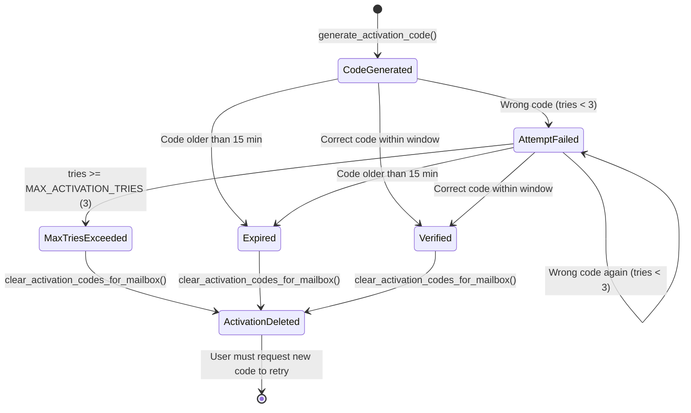
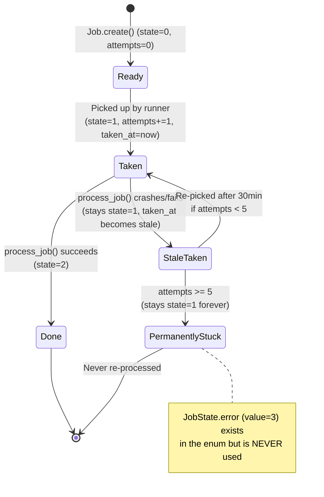
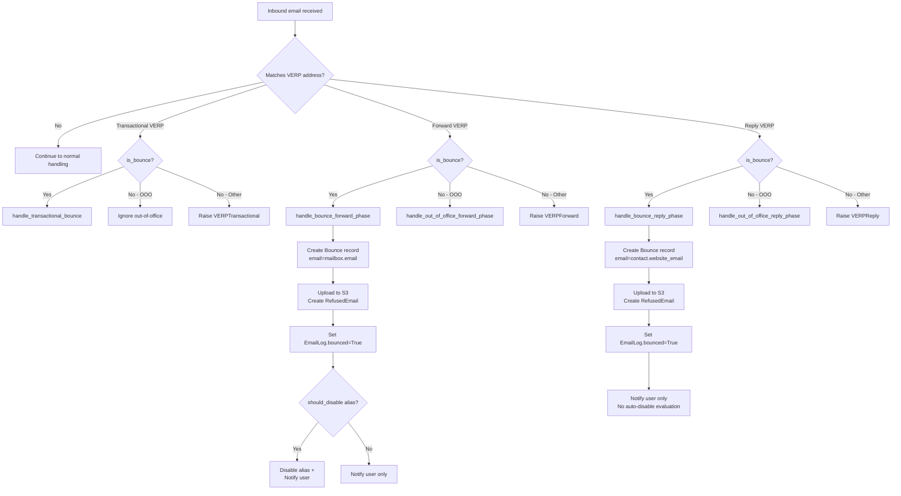

# SimpleLogin Runtime Behavior Analysis

## Introduction

This document traces the runtime behavior of three internal SimpleLogin workflows through direct source code analysis. Every behavioral claim in this document is derived from reading the actual source code of the repository — no assumptions are made, and no external documentation is relied upon. Each observation is cited with the specific source file and line number from which it was derived.

The three workflows analyzed are:

1. **Mailbox Verification Code Enforcement** — How the system processes multi-step mailbox verification, tracks failed attempts, enforces limits, and handles terminal states.
2. **Background Task Lifecycle** — How background jobs are created, scheduled, picked up, executed, retried on failure, and what observable state reflects each stage.
3. **Email Forwarding Bounce Address (VERP) and Handling** — How the system generates special bounce return addresses during email forwarding, identifies the original email when a bounce arrives, records state changes, and how handling differs between the forward and reply directions.

---

## Workflow 1: Mailbox Verification Code Enforcement

This section documents the complete lifecycle of mailbox verification code enforcement — from code generation through submission attempts to terminal outcomes. The core logic resides in `app/mailbox_utils.py`, with the data model defined in `app/models.py` and the web route in `app/dashboard/views/mailbox.py`.

### Activation Code Generation

When a new mailbox is created (and is not pre-verified), the system generates an activation code via `generate_activation_code()`.

**Source: `app/mailbox_utils.py:223-239`**

The function performs the following steps:

1. **Clear existing codes** (line 226): Calls `clear_activation_codes_for_mailbox(mailbox)` to delete ALL existing `MailboxActivation` records for that mailbox. This ensures only one active code exists at any time.
2. **Generate the code** (lines 227-233):
   - If `use_digit_code=True`:
     - If the environment variable `config.MAILBOX_VERIFICATION_OVERRIDE_CODE` is set, that override value is used (lines 228-229). This exists for testing environments.
     - Otherwise, a 6-digit zero-padded random integer is generated: `"{:06d}".format(random.randint(1, 999999))` (line 231).
   - If `use_digit_code=False`: A URL-safe random token is generated via `secrets.token_urlsafe(16)` (line 233).
3. **Persist the activation record** (lines 234-238): Creates a `MailboxActivation` record with `mailbox_id=mailbox.id`, `code=code`, `tries=0`, and commits immediately.

**Rationale:** By clearing all previous codes before generating a new one, the system enforces a single-active-code invariant. This prevents users from accumulating multiple valid codes and bypassing the attempt limit by switching between them.

### Verification Attempt Processing

The core verification logic is implemented in `verify_mailbox_code(user, mailbox_id, code)`.

**Source: `app/mailbox_utils.py:166-220`**

The function processes a verification attempt through an ordered sequence of checks:

**Step 1 — Mailbox existence check** (lines 167-172):
Retrieves the mailbox by ID using `Mailbox.get(mailbox_id)`. If not found, raises `MailboxError("Invalid mailbox")`.

**Step 2 — Already-verified check** (lines 173-178):
If `mailbox.verified` is already `True`, the function calls `clear_activation_codes_for_mailbox(mailbox)` and returns the mailbox immediately. This provides **idempotent success** — re-verifying an already-verified mailbox is a no-op that cleans up any stale activation records.

**Step 3 — Ownership check** (lines 179-183):
If `mailbox.user_id != user.id`, raises `MailboxError("Invalid mailbox")`. This prevents users from verifying mailboxes owned by other accounts.

**Step 4 — Activation record retrieval** (lines 185-194):
Queries `MailboxActivation` filtered by `mailbox_id`, ordered by `created_at` descending, and takes the first result (`.first()`). If no activation record exists, raises `MailboxError("Invalid code")`.

**Rationale:** The `order_by(created_at.desc()).first()` pattern ensures that if multiple activation records somehow exist (which should not happen given the clearing logic), the most recent one is used.

**Step 5 — Max tries check** (lines 195-198):
If `activation.tries >= MAX_ACTIVATION_TRIES` (where `MAX_ACTIVATION_TRIES = 3`, defined at line 43):
- Calls `clear_activation_codes_for_mailbox(mailbox)` — **deletes the activation record entirely**
- Raises `CannotVerifyError("Invalid activation code. Please request another code.")`

**Step 6 — Expiry check** (lines 199-204):
If `activation.created_at < arrow.now().shift(minutes=-15)` (i.e., the code is older than 15 minutes):
- Calls `clear_activation_codes_for_mailbox(mailbox)` — **deletes the activation record entirely**
- Raises `CannotVerifyError("Invalid activation code. Please request another code.")`

**Rationale for check ordering:** The max-tries check is evaluated **before** the expiry check. This means that even if a code is still within its 15-minute window, it will be rejected and deleted if the attempt limit has been reached. The ordering ensures that attempt exhaustion is always enforced regardless of timing.

**Step 7 — Code mismatch** (lines 205-211):
If the submitted `code != activation.code`:
- Increments the tries counter: `activation.tries = activation.tries + 1` (line 209)
- Commits to database (line 210)
- Raises `CannotVerifyError("Invalid activation code")` — note the different error message (no "Please request another code" suffix)

**Step 8 — Success** (lines 212-220):
If the code matches:
- Sets `mailbox.verified = True` (line 213)
- Emits a `UserAuditLogAction.VerifyMailbox` audit log entry (lines 214-218)
- Calls `clear_activation_codes_for_mailbox(mailbox)` — **deletes the activation record** (line 219)
- Returns the verified mailbox (line 220)

### State Transitions and Enforcement Limits

**Key constants:**

| Constant | Value | Source |
|----------|-------|--------|
| `MAX_ACTIVATION_TRIES` | `3` | `app/mailbox_utils.py:43` |
| Expiry window | 15 minutes | `app/mailbox_utils.py:199` (`arrow.now().shift(minutes=-15)`) |

**The `tries` counter** starts at 0 when the `MailboxActivation` record is created (line 237) and is incremented by 1 on each wrong code submission (line 209). The check at line 195 uses `>=`, meaning a code with `tries=3` (i.e., three prior failed attempts) will trigger the max-tries enforcement.

**The `MailboxActivation` model** is defined at `app/models.py:2828-2835`:

| Column | Type | Constraints | Description |
|--------|------|-------------|-------------|
| `mailbox_id` | ForeignKey → `Mailbox.id` | `ondelete="cascade"`, not null, indexed | Links to the mailbox being verified |
| `code` | `String(32)` | Not null, indexed | The verification code |
| `tries` | `Integer` | Default 0, not null | Counter of failed verification attempts |
| *(inherited)* `created_at` | `ArrowType` | Auto-set on creation | Timestamp used for expiry calculation |

**Enforcement summary table:**

| Condition | Tries Threshold | Time Window | Outcome |
|-----------|----------------|-------------|---------|
| Wrong code, tries < 3 | `tries < MAX_ACTIVATION_TRIES` | Within 15 min | `tries` incremented, `CannotVerifyError` raised |
| Wrong code, tries ≥ 3 | `tries >= MAX_ACTIVATION_TRIES` | Any | Activation **deleted**, `CannotVerifyError` raised |
| Code expired | Any | > 15 minutes | Activation **deleted**, `CannotVerifyError` raised |
| Correct code | Any | Within 15 min | `mailbox.verified=True`, activation **deleted** |

### Terminal States and Recovery

A critical behavioral observation is that enforcement is **destructive**: the system deletes the `MailboxActivation` record rather than merely flagging it as exhausted or expired.

**Source: `app/mailbox_utils.py:159-163`**

```python
def clear_activation_codes_for_mailbox(mailbox: Mailbox):
    Session.query(MailboxActivation).filter(
        MailboxActivation.mailbox_id == mailbox.id
    ).delete()
    Session.commit()
```

This function performs a hard `DELETE` from the database — the record is fully removed, not marked with a status flag.

**Rationale for destructive enforcement:** By deleting the activation record, the system ensures a clean state. There is no possibility of a stale record with an exhausted tries counter lingering in the database and interfering with future verification attempts. The trade-off is that the attempt history is lost — there is no persistent record of how many times a user failed to verify a particular mailbox.

**Recovery path:** After the activation record is deleted (whether due to max tries, expiry, or successful verification), the user must request a **completely new** activation code. This triggers `generate_activation_code()`, which creates a fresh `MailboxActivation` record with `tries=0` and a new `created_at` timestamp, starting the 15-minute window and 3-attempt budget from scratch.

**Web dashboard route** (`app/dashboard/views/mailbox.py:120-135`):
The `/dashboard/mailbox_verify` GET route extracts `mailbox_id` and `code` from query parameters and passes them to `verify_mailbox_code()`. On `MailboxError` (the parent of `CannotVerifyError`), it flashes the error message and redirects to the mailbox dashboard page.

**Legacy verification path** (lines 125-127): If no `code` parameter is present in the request, the system falls back to `verify_with_signed_secret()` (line 127), which uses `TimestampSigner` with a `max_age=900` seconds (15 minutes, matching the activation code expiry). This legacy path validates a signed token in the `mailbox_id` parameter rather than a separate code.

Source: `app/dashboard/views/mailbox.py:138-142`

### Verification State Machine



### Behavioral Validation from Tests

The test suite at `tests/test_mailbox_utils.py` validates the enforcement behavior:

- **`test_verify_fail`** (line 288): Creates a mailbox and submits wrong codes `MAX_ACTIVATION_TRIES - 1` times (i.e., 2 times). After each failed attempt, it asserts that `activation.tries == i + 1`, confirming that the counter increments by exactly 1 per wrong submission.
  Source: `tests/test_mailbox_utils.py:288-298`

- **`test_verify_too_may`** (line 302): Sets `activation.tries = MAX_ACTIVATION_TRIES` (i.e., 3), then submits the **correct** code. Asserts that `CannotVerifyError` is raised — confirming that the tries check fires **before** code comparison, and even the correct code is rejected after exhaustion.
  Source: `tests/test_mailbox_utils.py:302-309`

- **`test_verify_too_old_code`** (line 313): Sets `activation.created_at = arrow.now().shift(minutes=-30)` (30 minutes ago, well past the 15-minute window), then submits the correct code. Asserts `CannotVerifyError` — confirming expiry enforcement.
  Source: `tests/test_mailbox_utils.py:313-320`

- **`test_verify_ok`** (line 324): Submits the correct code within the window. Asserts that `MailboxActivation.get_by(mailbox_id=...)` returns `None` (activation deleted) and `mailbox.verified` is `True`.
  Source: `tests/test_mailbox_utils.py:324-330`

---

## Workflow 2: Background Task Lifecycle

This section traces the complete lifecycle of a background job from creation through execution to terminal state, including error recovery and retry semantics. The core logic resides in `job_runner.py`, with the data model in `app/models.py` and configuration constants in `app/config.py`.

### Job Creation and Scheduling

**The `Job` model** is defined at `app/models.py:2683-2707`:

| Column | Type | Default | Description |
|--------|------|---------|-------------|
| `name` | `String(128)` | Not null | Identifies the job type (e.g., `"onboarding-1"`) |
| `payload` | `JSON` | Nullable | Job-specific data (e.g., `{"user_id": 42}`) |
| `taken` | `Boolean` | `False` | Legacy flag indicating if job has been picked up (superseded by `state`) |
| `run_at` | `ArrowType` | Nullable | Earliest eligible execution time; `NULL` means immediately eligible |
| `state` | `Integer` | `JobState.ready` (0) | Current state of the job, indexed |
| `attempts` | `Integer` | `0` | Number of times the job has been picked up for execution |
| `taken_at` | `ArrowType` | Nullable | Timestamp of when the job was last picked up |

A composite index `ix_state_run_at_taken_at` covers `(state, run_at, taken_at)` for efficient eligibility queries.

Source: `app/models.py:2683-2707`

**The `JobState` enum** is defined at `app/models.py:253-257`:

| Value | Name | Description |
|-------|------|-------------|
| 0 | `ready` | Job is waiting to be picked up |
| 1 | `taken` | Job has been picked up by the runner |
| 2 | `done` | Job completed successfully |
| 3 | `error` | **Exists in the enum but is NEVER SET by the job runner** |

**Critical observation:** `JobState.error` (value 3) is defined in the enum but no code path in `job_runner.py` ever sets a job's state to this value. A search of the entire job runner confirms that `JobState.error` is never referenced. This is a significant design decision discussed further in the Error Recovery section.

Source: `app/models.py:253-257`

**Job creation examples:**

Onboarding jobs are scheduled during user registration at `app/models.py:651-665`:
```
Job.create(name=config.JOB_ONBOARDING_1, payload={"user_id": user.id}, run_at=arrow.now().shift(days=1))
Job.create(name=config.JOB_ONBOARDING_2, payload={"user_id": user.id}, run_at=arrow.now().shift(days=2))
Job.create(name=config.JOB_ONBOARDING_4, payload={"user_id": user.id}, run_at=arrow.now().shift(days=3))
```

Mailbox deletion is scheduled at `app/mailbox_utils.py:145-155`:
```
Job.create(name=JOB_DELETE_MAILBOX, payload={"mailbox_id": ..., "transfer_mailbox_id": ...}, run_at=arrow.now(), commit=True)
```

**All job name constants** from `app/config.py:301-311`:

| Constant | Value |
|----------|-------|
| `JOB_ONBOARDING_1` | `"onboarding-1"` |
| `JOB_ONBOARDING_2` | `"onboarding-2"` |
| `JOB_ONBOARDING_3` | `"onboarding-3"` |
| `JOB_ONBOARDING_4` | `"onboarding-4"` |
| `JOB_BATCH_IMPORT` | `"batch-import"` |
| `JOB_DELETE_ACCOUNT` | `"delete-account"` |
| `JOB_DELETE_MAILBOX` | `"delete-mailbox"` |
| `JOB_DELETE_DOMAIN` | `"delete-domain"` |
| `JOB_SEND_USER_REPORT` | `"send-user-report"` |
| `JOB_SEND_PROTON_WELCOME_1` | `"proton-welcome-1"` |
| `JOB_SEND_ALIAS_CREATION_EVENTS` | `"send-alias-creation-events"` |

### Job Eligibility Query

The function `get_jobs_to_run()` determines which jobs are eligible for processing.

**Source: `job_runner.py:307-326`**

The eligibility query uses the following exact SQL logic:

```
(Job.state == JobState.ready)
OR
(Job.state == JobState.taken AND Job.taken_at < now - 30_minutes AND Job.attempts < 5)
```
**AND**
```
(Job.run_at IS NULL) OR (Job.run_at <= now + 10_minutes)
```

Key constants governing this query:

| Constant | Value | Source |
|----------|-------|--------|
| `JOB_TAKEN_RETRY_WAIT_MINS` | `30` | `app/config.py:565` |
| `JOB_MAX_ATTEMPTS` | `5` | `app/config.py:564` |

The variable `taken_at_earliest = arrow.now().shift(minutes=-config.JOB_TAKEN_RETRY_WAIT_MINS)` (line 311) computes the 30-minute threshold.

The variable `run_at_earliest = arrow.now().shift(minutes=+10)` (line 312) allows jobs to be picked up up to **10 minutes before** their scheduled `run_at` time. Combined with the file-level docstring "Not meant for running job at precise time (+- 1h)" (line 2-3), this confirms that the job system prioritizes eventual execution over precise timing.

**Rationale for stale-taken recovery:** The second eligibility condition (`state == taken AND taken_at < now - 30_min AND attempts < 5`) handles the case where a job was picked up but the process crashed or failed before marking it as done. After 30 minutes of being in the `taken` state, the job is presumed failed and becomes eligible for re-processing — provided it hasn't exceeded 5 total attempts.

### Job Processing Loop

The main execution loop runs when `job_runner.py` is executed directly.

**Source: `job_runner.py:329-347`**

```python
if __name__ == "__main__":
    while True:
        with create_light_app().app_context():
            for job in get_jobs_to_run():
                LOG.d("Take job %s", job)
                # Step 1: Mark as taken
                job.taken = True
                job.taken_at = arrow.now()
                job.state = JobState.taken.value
                job.attempts += 1
                Session.commit()
                # Step 2: Execute
                process_job(job)
                # Step 3: Mark as done
                job.state = JobState.done.value
                Session.commit()
            time.sleep(10)
```

**Step 1 — Mark as taken** (lines 337-341): Before executing the job, the runner:
- Sets `job.taken = True` (legacy flag)
- Records `job.taken_at = arrow.now()` (current timestamp)
- Sets `job.state = JobState.taken.value` (state = 1)
- Increments `job.attempts += 1`
- Commits these changes to the database

This commit **before** execution is critical: it establishes the "lease" on the job. If the process crashes during execution, the job will have `state=1` and `taken_at` set, which enables the stale-taken recovery mechanism.

**Step 2 — Execute** (line 342): Calls `process_job(job)`, which dispatches to the appropriate handler based on `job.name`.

**Step 3 — Mark as done** (lines 344-345): On successful return from `process_job()`, sets `job.state = JobState.done.value` (state = 2) and commits.

**Polling interval** (line 347): After processing all eligible jobs, the loop sleeps for 10 seconds (`time.sleep(10)`) before querying again.

### Error Recovery and Retry Behavior

**What happens when `process_job()` fails:**

If `process_job(job)` raises an exception, the line `job.state = JobState.done.value` at line 344 is **never reached**. The job remains in the database with:
- `state = JobState.taken.value` (1)
- `taken_at` = the timestamp when it was picked up
- `attempts` = already incremented (reflects this failed attempt)

**There is no explicit `try/except` around `process_job()`** — the exception propagates up through the `for` loop. The `with create_light_app().app_context()` context manager handles Flask application teardown, but does **not** catch the exception or set the job state to `error`.

Source: `job_runner.py:329-347`

**Critical observation — `JobState.error` is never set:**

`JobState.error = 3` exists in the model definition (`app/models.py:257`) but is **never explicitly set** anywhere in `job_runner.py`. A thorough search of the file confirms zero references to `JobState.error`. This means there is no code path that transitions a job to the explicit error state.

**Rationale:** The design uses an **implicit "stale lock" pattern** rather than explicit error states. The `taken_at` timestamp acts as a time-limited lease on the job:
1. When a job is picked up, `taken_at` is set to the current time and `state` is set to `taken`.
2. If processing succeeds, `state` transitions to `done`.
3. If processing fails (exception), the state remains `taken` with a stale `taken_at`.
4. The eligibility query detects jobs where `state == taken AND taken_at < now - 30_min`, treating them as failed and re-eligible.

This pattern avoids the need for exception handling at the runner level — the passage of time itself serves as the failure detection mechanism. The trade-off is that failed jobs must wait the full 30-minute window before retry, regardless of whether the failure was immediate.

**Retry timing:**
- A failed job becomes re-eligible **30 minutes** after its `taken_at` timestamp.
- The eligibility query checks `Job.attempts < config.JOB_MAX_ATTEMPTS` (i.e., `< 5`).
- After 5 failed attempts, the job's `attempts` value equals or exceeds `JOB_MAX_ATTEMPTS`, and the stale-taken condition no longer matches. The job becomes **permanently stuck** in `taken` state and is never re-processed.

### Observable State Reflecting Failure

The following table summarizes what a job looks like in the database at each stage of its lifecycle:

| State | `state` | `attempts` | `taken_at` | Description |
|-------|---------|------------|------------|-------------|
| Never picked up | `0` (ready) | `0` | `NULL` | Waiting for runner |
| Currently processing | `1` (taken) | `1+` | Recent | Being executed right now |
| Failed once, awaiting retry | `1` (taken) | `1` | Stale (> 30 min old) | Will be retried |
| Failed multiple times | `1` (taken) | `2-4` | Stale | Will be retried |
| Terminally failed | `1` (taken) | `≥ 5` | Stale | **Permanently stuck** — never re-processed |
| Successfully completed | `2` (done) | `1+` | Set | Processing finished |

**Key insight:** There is no way to distinguish "currently processing" from "recently failed" by looking at a single database snapshot — both have `state=1`. The difference is revealed only by the age of `taken_at` relative to the current time and the 30-minute threshold.

### Job Lifecycle State Machine



### Process Job Dispatcher

The `process_job(job)` function at `job_runner.py:188-304` dispatches each job to its handler based on `job.name`:

| Job Name | Handler | Key Behavior |
|----------|---------|-------------|
| `JOB_ONBOARDING_1` | `onboarding_send_from_alias(user)` | Sends only if user exists, is activated, and has notifications enabled |
| `JOB_ONBOARDING_2` | `onboarding_mailbox(user)` | Same activation/notification guards |
| `JOB_ONBOARDING_4` | `onboarding_pgp(user)` | Skips if user's only mailbox is a Proton mailbox |
| `JOB_BATCH_IMPORT` | `handle_batch_import(batch_import)` | Processes a batch alias import |
| `JOB_DELETE_ACCOUNT` | Inline: deletes user, sends confirmation | Sends email before deletion, commits |
| `JOB_DELETE_MAILBOX` | `delete_mailbox_job(job)` | Transfers aliases to another mailbox, then deletes |
| `JOB_DELETE_DOMAIN` | Inline: deletes custom domain, sends confirmation | Handles both subdomains and custom domains |
| `JOB_SEND_USER_REPORT` | `ExportUserDataJob.create_from_job(job).run()` | Generates and sends user data export |
| `JOB_SEND_PROTON_WELCOME_1` | `welcome_proton(user)` | Sends only if user exists and is activated |
| `JOB_SEND_ALIAS_CREATION_EVENTS` | `send_alias_creation_events_for_user(user, dispatcher)` | Dispatches alias creation events via `PostgresDispatcher` |
| *(unknown name)* | `LOG.e("Unknown job name %s", job.name)` | Logs an error but does **not** raise an exception (line 304) |

Source: `job_runner.py:188-304`

**Note on unknown job names:** When `job.name` matches none of the known constants, the dispatcher logs an error but returns normally. This means the job will be marked as `done` (state=2) despite not performing any useful work — it will not be retried.

---

## Workflow 3: Email Forwarding Bounce Address and Handling

This section documents the Variable Envelope Return Path (VERP) address format used during email forwarding, how bounces are detected and routed, and how handling differs between the forward and reply directions. The core logic spans `app/email_utils.py` (VERP generation/parsing, bounce thresholds), `email_handler.py` (bounce processing), and `app/models.py` (data models).

### VERP Address Format Specification

When SimpleLogin forwards an email through an alias, it sets the envelope sender (`mail_from`) to a specially constructed VERP address. If the recipient's mail server bounces the email, the bounce notification is delivered back to this VERP address, allowing the system to identify which email bounced.

**Source: `app/email_utils.py:1438-1464`**

The VERP address has the format:

```
{VERP_PREFIX}.{base32_payload}.{base32_signature}@{domain}
```

**Default prefix:** `VERP_PREFIX = "sl"` — Source: `app/config.py:500`

**Payload construction** (lines 1446-1451):

The payload is a JSON-encoded list of three elements:
```python
[verp_type.value, object_id or 0, int((time.time() - VERP_TIME_START) / 60)]
```

| Element | Description |
|---------|-------------|
| `verp_type.value` | Integer identifying the bounce direction (0=forward, 1=reply, 2=transactional) |
| `object_id` | The `email_log.id` or `transactional_email.id` of the original email (0 if not applicable) |
| Time component | Minutes elapsed since `VERP_TIME_START` (2022-01-01 00:00:00 UTC, epoch `1640995200`) |

Source: `app/email_utils.py:67-68` for `VERP_TIME_START = 1640995200`

**Rationale for time encoding:** Using minutes granularity (rather than seconds) and a recent epoch (2022-01-01 rather than Unix epoch) minimizes the byte count of the time component, keeping the generated email address short. Email address length matters because some mail systems have limits.

**Signature** (lines 1454-1456):
```python
hmac.new(config.VERP_EMAIL_SECRET.encode("utf-8"), json_payload, "sha3-224").digest()[:8]
```
- Algorithm: HMAC-SHA3-224 (`VERP_HMAC_ALGO = "sha3-224"`, Source: `app/email_utils.py:69`)
- The signature is **truncated to 8 bytes** to keep the address compact
- Secret: `VERP_EMAIL_SECRET`, which must be at least 32 characters (enforced at `app/config.py:505-508`)

**Encoding** (lines 1457-1458):
Both the JSON payload and the HMAC signature are base32-encoded with padding stripped (`.rstrip(b"=")`). Base32 is used instead of base64 because base32 produces only uppercase letters and digits — characters that are safe in email addresses (no `+`, `/`, or `=` which could cause issues).

**Final assembly** (lines 1459-1464):
```python
"{}.{}.{}@{}".format(config.VERP_PREFIX, encoded_payload, encoded_signature, sender_domain or config.EMAIL_DOMAIN).lower()
```
The entire address is lowercased.

**The `VerpType` enum** is defined at `app/models.py:247-251`:

| Value | Name | Usage |
|-------|------|-------|
| 0 | `bounce_forward` | Bounce during forward phase (external sender → alias → user's mailbox) |
| 1 | `bounce_reply` | Bounce during reply phase (user's mailbox → alias → external contact) |
| 2 | `transactional` | Bounce of transactional/system email sent by SimpleLogin itself |

**VERP message lifetime:** `VERP_MESSAGE_LIFETIME = 5 * 86400` (5 days, i.e., 432,000 seconds) — Source: `app/config.py:499`. Bounce notifications arriving after this window are rejected during VERP parsing.

### VERP Address Parsing

When a bounce arrives, the system parses the VERP address to identify the original email.

**Source: `app/email_utils.py:1467-1498`**

The parsing function `get_verp_info_from_email(email)` performs the following steps:

1. **Extract local part** (lines 1471-1474): Splits the email at `@` to get the username portion.
2. **Split on `.`** (lines 1475-1477): Expects exactly 3 dot-separated fields: `[prefix, encoded_payload, encoded_signature]`. Returns `None` if the count is wrong or the prefix doesn't match `config.VERP_PREFIX`.
3. **Restore base32 padding** (lines 1479-1484): Adds back the `=` padding that was stripped during generation: `(8 - (len(field) % 8)) % 8` padding characters.
4. **Decode and verify** (lines 1487-1491): Decodes the base32 payload and signature, then recomputes the HMAC. If the computed signature doesn't match the decoded signature, returns `None` (tampered or invalid).
5. **Parse JSON** (lines 1492-1494): Deserializes the payload and validates it has exactly 3 elements.
6. **Expiry check** (line 1496): `data[2] > (time.time() + VERP_MESSAGE_LIFETIME - VERP_TIME_START) / 60` — if the time component is too far in the future (accounting for the message lifetime), the VERP is considered expired.
7. **Return** (line 1498): Returns a tuple `(VerpType(data[0]), data[1])` — the VERP type and the object ID.

On any failure (format mismatch, signature mismatch, expiry, or decode error), the function returns `None`.

### Legacy Bounce Address Formats

In addition to the newer HMAC-signed VERP format, the system supports legacy bounce address patterns for backward compatibility.

**Source: `app/config.py:99-117`**

| Phase | Prefix | Suffix | Example |
|-------|--------|--------|---------|
| Forward (legacy) | `BOUNCE_PREFIX = "bounce+"` | `BOUNCE_SUFFIX = "+@{EMAIL_DOMAIN}"` | `bounce+123+@simplelogin.co` |
| Reply (legacy) | `BOUNCE_PREFIX_FOR_REPLY_PHASE = "bounce_reply"` | *(plus sign + id)* | `bounce_reply+123+@domain` |
| Transactional (legacy) | `TRANSACTIONAL_BOUNCE_PREFIX = "transactional+"` | `TRANSACTIONAL_BOUNCE_SUFFIX = "+@{EMAIL_DOMAIN}"` | `transactional+456+@simplelogin.co` |

**Note:** `BOUNCE_PREFIX_FOR_REPLY_PHASE` does **not** have a trailing `+` sign, unlike `BOUNCE_PREFIX` which is `"bounce+"`. This is explicitly documented in the code comment at line 107: "Note BOUNCE_PREFIX_FOR_REPLY_PHASE doesn't have the trailing plus sign (+) as BOUNCE_PREFIX."

The `handle()` function in `email_handler.py:2034-2098` checks **both** the legacy prefix patterns **and** the newer HMAC-signed VERP format. Legacy email log ID extraction uses `parse_id_from_bounce()` from `app/email_utils.py:1258-1259`, which extracts the integer between the first and last `+` characters.

### Bounce Detection and Routing

**Bounce detection** is implemented by `is_bounce()` at `email_handler.py:1813-1818`:

```python
def is_bounce(envelope: Envelope, msg: Message):
    return (
        envelope.mail_from == "<>"
        and msg.get_content_type().lower() == "multipart/report"
    )
```

A message is classified as a bounce when **both** conditions are true:
1. The envelope sender (`mail_from`) is `"<>"` (the null sender, per RFC 3461)
2. The Content-Type is `multipart/report` (the DSN format, per RFC 3464)

**VERP routing decision tree** in `handle()` at `email_handler.py:2034-2098`:

**Step 1** (line 2035): Parse VERP info from `rcpt_tos[0]` using `get_verp_info_from_email()`.

**Step 2 — Transactional VERP routing** (lines 2038-2054):
Matches if the recipient starts with `TRANSACTIONAL_BOUNCE_PREFIX` and ends with `TRANSACTIONAL_BOUNCE_SUFFIX`, OR if `verp_info[0] == VerpType.transactional`:
- If `is_bounce()` → calls `handle_transactional_bounce()` → returns `status.E205`
- If out-of-office → logs and ignores → returns `status.E206`
- Otherwise → raises `VERPTransactional` exception

**Step 3 — Forward VERP routing** (lines 2057-2074):
Matches if the recipient starts with `BOUNCE_PREFIX` and ends with `BOUNCE_SUFFIX`, OR if `verp_info[0] == VerpType.bounce_forward`:
- Extracts `email_log_id` from VERP info or legacy format (line 2062)
- Retrieves the `EmailLog` record (line 2063)
- If `is_bounce()` → calls `handle_bounce(envelope, email_log, msg)` which dispatches to `handle_bounce_forward_phase()` (since `email_log.is_reply` is `False`)
- If out-of-office → calls `handle_out_of_office_forward_phase()`
- Otherwise → raises `VERPForward`

**Step 4 — Reply VERP routing** (lines 2077-2098):
Matches if the recipient starts with `BOUNCE_PREFIX_FOR_REPLY_PHASE + "+"`, OR if `verp_info[0] == VerpType.bounce_reply`:
- Extracts `email_log_id` from VERP info or legacy format (line 2082)
- Retrieves the `EmailLog` record (line 2083)
- If `is_bounce()` → calls `handle_bounce(envelope, email_log, msg)` which dispatches to `handle_bounce_reply_phase()` (since `email_log.is_reply` is `True`)
- If out-of-office → calls `handle_out_of_office_reply_phase()`
- Otherwise → raises `VERPReply`

The `handle_bounce()` dispatcher at `email_handler.py:1851-1914` routes based on `email_log.is_reply`:
- If `is_reply` is `True` → `handle_bounce_reply_phase()` (line 1910)
- If `is_reply` is `False` → `handle_bounce_forward_phase()` (line 1913)

### Forward-Phase Bounce Handling

**Source: `email_handler.py:1432-1592`**

**Context:** Called when a forwarded email bounces — the recipient's mailbox rejected an email that was being forwarded from an external sender through an alias.

The function `handle_bounce_forward_phase(msg, email_log)` performs:

**Step 1 — Bounce record creation** (lines 1447-1454):
Creates a `Bounce` record with `email=mailbox.email`. If bounce info can be extracted from the DSN, it's stored in the `info` field. The `Bounce` model (`app/models.py:3290-3297`) records the bounced email address and optional diagnostic information, with a `created_at` index for time-based queries.

**Step 2 — S3 archival** (lines 1460-1485):
- Generates a random UUID-based filename
- Uploads the full bounce report to `refused-emails/full-{uuid}.eml`
- Attempts to extract the original message via `get_orig_message_from_bounce(msg)`. If successful, uploads it to `refused-emails/{uuid}.eml`
- If the original message cannot be extracted, only the full report is stored

**Step 3 — RefusedEmail creation** (lines 1487-1491):
Creates a `RefusedEmail` record linking the S3 paths to the user. The `RefusedEmail` model (`app/models.py:2858-2870`) stores `full_report_path`, `path` (original email), and `user_id`.

**Step 4 — EmailLog state update** (lines 1493-1496):
```python
email_log.bounced = True
email_log.refused_email_id = refused_email.id
email_log.bounced_mailbox_id = mailbox.id
```
These three fields on the `EmailLog` record (`app/models.py:2060-2150`) permanently mark the email as bounced and link it to the refused email archive and the mailbox that rejected it.

**Step 5 — Auto-disable evaluation** (lines 1500-1540):
Calls `should_disable(alias)` to determine if the alias should be automatically disabled:
- **If alias should be disabled:** Calls `change_alias_status(alias, enabled=False)`, creates a `Notification` informing the user, and sends an alert email about the automatic disabling.
- **If alias should NOT be disabled:** Creates a `Notification` and sends an informational email about the bounce, including links to disable the alias or block the sender.

### Reply-Phase Bounce Handling

**Source: `email_handler.py:1595-1687`**

**Context:** Called when a reply bounces — the contact's email server rejected an email that the user sent through their alias.

The function `handle_bounce_reply_phase(envelope, msg, email_log)` performs:

**Step 1 — Bounce record creation** (lines 1607-1618):
Creates a `Bounce` record with `email=contact.website_email` (the **contact's** email address, not the user's mailbox). This is a key difference from forward-phase handling.

**Step 2 — S3 archival** (lines 1622-1635):
Same pattern as forward phase: uploads full bounce report and original message to S3.

**Step 3 — RefusedEmail creation** (lines 1637-1640):
Same as forward phase.

**Step 4 — EmailLog state update** (lines 1642-1647):
```python
email_log.bounced = True
email_log.refused_email_id = refused_email.id
email_log.bounced_mailbox_id = mailbox.id
```
Same fields updated as forward phase.

**Step 5 — Notification only** (lines 1657-1687):
Creates a `Notification` and sends an email to the user about the bounce. **Crucially, `should_disable()` is NOT called** — the alias is never auto-disabled due to reply bounces.

### Forward vs. Reply Bounce Handling Comparison

| Aspect | Forward Phase | Reply Phase |
|--------|--------------|-------------|
| **Function** | `handle_bounce_forward_phase()` | `handle_bounce_reply_phase()` |
| **Source** | `email_handler.py:1432-1592` | `email_handler.py:1595-1687` |
| **Bounce record email** | `mailbox.email` (user's mailbox) | `contact.website_email` (external contact) |
| **S3 archival** | Yes | Yes |
| **RefusedEmail created** | Yes | Yes |
| **EmailLog.bounced set** | Yes | Yes |
| **`should_disable()` evaluated** | **Yes** | **No** |
| **Alias may be auto-disabled** | **Yes** | **No** |
| **User notification** | Yes | Yes |

**Rationale for asymmetric handling:** Forward-phase bounces indicate that the user's own mailbox is rejecting incoming mail. This is typically caused by the mailbox being full, the email provider classifying forwarded mail as spam, or misconfiguration — all situations where continued forwarding will generate more bounces. Auto-disabling the alias prevents a feedback loop of bounced emails.

Reply-phase bounces, by contrast, indicate that an external contact's server rejected the email. The user's alias and mailbox are functioning correctly — the problem is on the recipient's side. Auto-disabling the alias would punish the user for an issue they cannot control, so only a notification is sent.

### Alias Auto-Disable Threshold Rules

The `should_disable(alias)` function implements a multi-tier bounce threshold policy that determines whether an alias should be automatically disabled.

**Source: `app/email_utils.py:1166-1255`**

**Bypass conditions** (lines 1171-1176):
- If `alias.cannot_be_disabled` is `True` → always returns `(False, "")`. Some aliases are explicitly protected from auto-disabling.
- If `config.ALIAS_AUTOMATIC_DISABLE` is `False` → always returns `(False, "")`. The feature can be globally disabled.

**Tier 1 — High-volume recent bounces** (lines 1178-1191):
- **Query:** Count of `EmailLog` records where `bounced=True`, `is_reply=False`, `created_at > yesterday`, and `alias_id=alias.id`
- **Threshold:** More than 12 bounces in the last 24 hours
- **Reason:** `"+12 bounces in the last 24h"`

**Tier 2 — Sustained elevated bounces** (lines 1194-1211):
- **Triggered only when** 24h bounce count is >5 but ≤12 (the `elif` at line 1194)
- **Additional query:** Bounce count in the 7-day window **excluding** the last 24 hours (`created_at > one_week_ago AND created_at < yesterday`)
- **Threshold:** More than 5 bounces in last 24h AND more than 10 bounces in the prior 7 days
- **Reason:** `"+5 bounces in the last 24h and +10 bounces in the last 7 days"`

**Tier 3 — Alias-level daily persistence** (lines 1213-1230):
- **Triggered only when** 24h bounce count is ≤5 (the `else` at line 1212)
- **Query:** Group bounces by date for the last 10 days, count distinct days with bounces
- **Threshold:** 9 or more distinct days with bounces out of the last 10 days
- **Reason:** `"Bounces every day for at least 9 days in the last 10 days"`

**Tier 4 — Account-level volume** (lines 1232-1253):
- **Triggered only when** Tier 3 doesn't fire (falls through)
- **Query:** Same grouping as Tier 3 but scoped to ALL aliases of the user (`user_id = alias.user_id` instead of `alias_id = alias.id`)
- **Threshold:** More than 10 bounces per day for more than 4 days in the last 10 days
- **Reason:** `"+10 bounces for +4 days in the last 10 days"`

**Critical note:** All tiers filter `is_reply=False` — only forward-phase bounces are counted. Reply-phase bounces are completely excluded from the threshold calculations, which is consistent with the design decision to not auto-disable on reply bounces.

**Threshold summary table:**

| Tier | Scope | Window | Condition | Reason String |
|------|-------|--------|-----------|---------------|
| 1 | Alias | 24h | >12 bounces | `"+12 bounces in the last 24h"` |
| 2 | Alias | 24h + 7d | >5 bounces/24h AND >10 bounces/prior 7d | `"+5 bounces in the last 24h and +10 bounces in the last 7 days"` |
| 3 | Alias | 10d | Bounces on ≥9 of last 10 days | `"Bounces every day for at least 9 days in the last 10 days"` |
| 4 | Account | 10d | >10 bounces/day for >4 days | `"+10 bounces for +4 days in the last 10 days"` |

### VERP Envelope Generation During Email Delivery

The VERP address is generated and used as the envelope sender when SimpleLogin delivers emails.

**Forward phase** — Source: `email_handler.py:903-905`:
```python
sl_sendmail(
    generate_verp_email(VerpType.bounce_forward, email_log.id, contact_domain),
    mailbox.email, msg, ...
)
```
The VERP address encodes `VerpType.bounce_forward` (0) and the `email_log.id`. If the mailbox bounces the email, the bounce notification arrives at this VERP address, allowing the system to look up the `EmailLog` and process the forward-phase bounce.

**Reply phase** — Source: `email_handler.py:1224-1225`:
```python
sl_sendmail(
    generate_verp_email(VerpType.bounce_reply, email_log.id, alias_domain),
    contact.website_email, msg, ...
)
```
The VERP address encodes `VerpType.bounce_reply` (1) and the `email_log.id`. If the contact's server bounces the email, the bounce notification arrives at this VERP address, routing to the reply-phase bounce handler.

### Bounce Handling Flowchart



---

## Source References

The following source files were analyzed to produce this document:

| File | Content Analyzed |
|------|-----------------|
| `app/mailbox_utils.py` | Mailbox verification logic: `verify_mailbox_code()`, `generate_activation_code()`, `clear_activation_codes_for_mailbox()`, `MAX_ACTIVATION_TRIES` |
| `app/models.py` | Data models: `MailboxActivation` (lines 2828-2835), `Job` (lines 2683-2707), `JobState` (lines 253-257), `VerpType` (lines 247-251), `EmailLog` (lines 2060-2150), `Bounce` (lines 3290-3297), `RefusedEmail` (lines 2858-2870) |
| `app/config.py` | Configuration constants: `JOB_MAX_ATTEMPTS` (line 564), `JOB_TAKEN_RETRY_WAIT_MINS` (line 565), `VERP_PREFIX` (line 500), `VERP_EMAIL_SECRET` (line 502), `VERP_MESSAGE_LIFETIME` (line 499), `BOUNCE_PREFIX` (line 100), `BOUNCE_SUFFIX` (line 101), `BOUNCE_PREFIX_FOR_REPLY_PHASE` (line 108), `TRANSACTIONAL_BOUNCE_PREFIX` (line 113), job name constants (lines 301-311) |
| `job_runner.py` | Background job polling loop (lines 329-347), `process_job()` dispatcher (lines 188-304), `get_jobs_to_run()` eligibility query (lines 307-326) |
| `email_handler.py` | Inbound email handler, VERP routing (lines 2034-2098), `handle_bounce_forward_phase()` (lines 1432-1592), `handle_bounce_reply_phase()` (lines 1595-1687), `handle_bounce()` dispatcher (lines 1851-1914), `is_bounce()` (lines 1813-1818), forward-phase VERP generation (lines 903-905), reply-phase VERP generation (lines 1224-1225) |
| `app/email_utils.py` | `generate_verp_email()` (lines 1438-1464), `get_verp_info_from_email()` (lines 1467-1498), `should_disable()` (lines 1166-1255), `parse_id_from_bounce()` (lines 1258-1259), `VERP_TIME_START` (line 68), `VERP_HMAC_ALGO` (line 69) |
| `app/errors.py` | Exception hierarchy: `SLException`, `VERPTransactional` (line 42), `VERPForward` (line 48), `VERPReply` (line 54) |
| `app/dashboard/views/mailbox.py` | Web dashboard verification route `/dashboard/mailbox_verify` (lines 120-135), legacy `verify_with_signed_secret()` (lines 138-142) |
| `tests/test_mailbox_utils.py` | Verification behavior test suite: `test_verify_fail` (line 288), `test_verify_too_may` (line 302), `test_verify_too_old_code` (line 313), `test_verify_ok` (line 324) |
| `tests/test_email_utils.py` | VERP generation and bounce threshold test suite |
