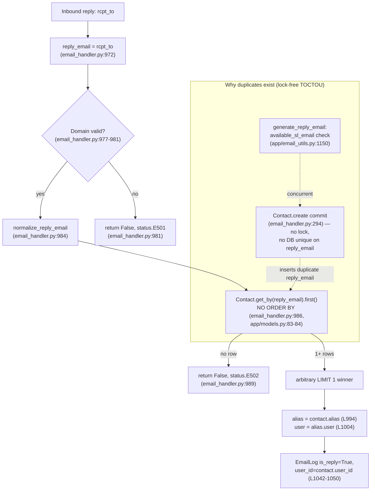

# SimpleLogin Reply-Routing Root-Cause Investigation

**Can the contact-lookup-by-`reply_email` logic misroute an inbound reply to a different user than the alias owner?**

| | |
|---|---|
| **Repository** | SimpleLogin `app` (self-hosted email-alias / forwarding service) |
| **Branch** | `app_2cd6ee777f8c` |
| **HEAD** | `2cd6ee777f8c2d3531559588bcfb18627ffb5d2c` |
| **Task type** | Read-only diagnostic / root-cause investigation (no source modified) |
| **Method** | Run-first: observation scripts executed against the project's pinned stack, output captured verbatim, scripts removed |
| **Pinned stack** | `SQLAlchemy = "1.3.24"` (`pyproject.toml:116`) + the real `unidecode` (`app/utils.py:53`) |

---

## The question

How does SimpleLogin resolve an inbound email **reply** to:

1. a **reply-email** (reverse-alias) address,
2. a **`Contact`** record, and
3. a **forwarding destination** (user / alias / mailbox)?

And can that contact-lookup-by-`reply_email` logic **misroute a reply to a different user than the alias owner** via race conditions, uniqueness assumptions, or timing inconsistencies? The question decomposes into nine sub-questions, answered individually in §3.

---

## Executive answer

**Yes — a reply can be misrouted to a different user than the alias owner.** The reply address is the SMTP envelope recipient taken verbatim (`reply_email = rcpt_to`, `email_handler.py:972`), normalized (`normalize_reply_email`, `email_handler.py:984`), and then resolved by a single lookup `contact = Contact.get_by(reply_email=reply_email)` (`email_handler.py:986`). The forwarding destination is derived *transitively* from whatever row that lookup returns: `alias = contact.alias` (`email_handler.py:994`), `user = alias.user` (`email_handler.py:1004`). Two properties make this unsafe: (1) **`Contact.reply_email` has no database uniqueness constraint** — it is only `index=True` (`app/models.py:1899`), and the sole unique constraint on `Contact` is `UniqueConstraint("alias_id", "website_email", name="uq_contact")` (`app/models.py:1875`); and (2) the resolution lookup `ModelMixin.get_by` is `Session.query(cls).filter_by(**kw).first()` (`app/models.py:83-84`) — an **unordered** `LIMIT 1` query with **no `ORDER BY`**. When duplicate `reply_email` rows exist — which can happen through a lock-free time-of-check-to-time-of-use (TOCTOU) window between the availability check in `generate_reply_email` (`app/email_utils.py:1150`) and the later `Contact.create` (`email_handler.py:294`), a window in which the `IntegrityError` handlers re-fetch only by `(alias_id, website_email)` (`email_handler.py:307`, `app/contact_utils.py:118`) and therefore never notice a duplicate `reply_email` — the query returns an **arbitrary** row whose owning user may not own the alias, and that choice **can change as table state evolves**. All of these behaviors were reproduced and are shown verbatim in §2.

---

## Method & scope (run-first)

This is a **strictly read-only** investigation governed by the rule *"SWE-AtlasQnA-Repo"*. No existing repository file was modified; the only artifact produced is this document. The methodology was **run-first**: before writing any prose, the observation scripts (§2.1, §2.2, plus a short cross-version SQL-fidelity check in §2.3) were re-created under `/tmp/obs` (outside the repository), executed with the project's pinned interpreter, and their output captured verbatim; the scripts were then removed, leaving the working tree byte-for-byte unchanged. See §5 for the exact reproduction commands and the clean-tree confirmation.

The scripts were run with the repository's own git-ignored virtual environment (`.venv/bin/python`), which pins **Python 3.10.20 + SQLAlchemy 1.3.24 + unidecode** — i.e., the exact production stack. This matters: the non-ascii normalization requires the real `unidecode`, and the lookup SQL is exercised under the exact pinned SQLAlchemy 1.3.24 (the `LIMIT 1 OFFSET 0` rendering itself is not version-specific — 1.3.24 and 2.0.x emit it identically for SQLite; see §2.3). Every requested value below is quoted as an exact literal with its `file:line` reference; every factual claim traces to a code citation or to the captured output. Where something cannot be verified from reading or running the code, that is stated explicitly.

---

## 1. How a reply is resolved (the code path)

### 1.1 Reply-email derivation

`handle_reply` is the entry point for the reply phase:

```python
# email_handler.py:966
def handle_reply(envelope, msg: Message, rcpt_to: str) -> (bool, str):
```

The reply address is the SMTP **envelope recipient** taken verbatim — no parsing, no transformation:

```python
# email_handler.py:972
    reply_email = rcpt_to
```

The reply domain is validated. If the address does not end with `EMAIL_DOMAIN` and its domain is not a registered `SLDomain`, the handler rejects the message with `status.E501`:

```python
# email_handler.py:977-981
    if not reply_email.endswith(EMAIL_DOMAIN):
        sl_domain: SLDomain = SLDomain.get_by(domain=reply_domain)
        if sl_domain is None:
            LOG.w(f"Reply email {reply_email} has wrong domain")
            return False, status.E501
```

The address is then **normalized** immediately before the lookup:

```python
# email_handler.py:984
    reply_email = normalize_reply_email(reply_email)
```

`normalize_reply_email` (`app/email_validation.py:25-38`) `unidecode`-folds any non-ascii input and then replaces every character not in `_ALLOWED_CHARS` (`app/email_validation.py:9`) with `_`:

```python
# app/email_validation.py:9
_ALLOWED_CHARS = "abcdefghijklmnopqrstuvwxyzABCDEFGHIJKLMNOPQRSTUVWXYZ0123456789_-.+@"

# app/email_validation.py:25-38
def normalize_reply_email(reply_email: str) -> str:
    """Handle the case where reply email contains *strange* char that was wrongly generated in the past"""
    if not reply_email.isascii():
        reply_email = convert_to_id(reply_email)

    ret = []
    # drop all control characters like shift, separator, etc
    for c in reply_email:
        if c not in _ALLOWED_CHARS:
            ret.append("_")
        else:
            ret.append(c)

    return "".join(ret)
```

`convert_to_id` (`app/utils.py:50-56`) lowercases, applies `unidecode` (`app/utils.py:53`), strips spaces, and truncates to 256 chars.

### 1.2 Contact identification — the single decisive lookup

```python
# email_handler.py:986
    contact = Contact.get_by(reply_email=reply_email)
```

`ModelMixin.get_by` is a thin wrapper over a `filter_by(...).first()` query — crucially, it applies **no `ORDER BY`**:

```python
# app/models.py:83-84
    def get_by(cls, **kw):
        return Session.query(cls).filter_by(**kw).first()
```

The `reply_email` column is declared **indexed but NOT unique**:

```python
# app/models.py:1899
    reply_email = sa.Column(sa.String(512), nullable=False, index=True)
```

The **only** uniqueness guarantee on `Contact` is the composite `(alias_id, website_email)` constraint — never `reply_email`:

```python
# app/models.py:1874-1876
    __table_args__ = (
        sa.UniqueConstraint("alias_id", "website_email", name="uq_contact"),
    )
```

This is confirmed at the migration level, where the `reply_email` index is created with `unique=False`:

```python
# migrations/versions/2021_071310_78403c7b8089_.py:22
    op.create_index(op.f('ix_contact_reply_email'), 'contact', ['reply_email'], unique=False)
```

### 1.3 Forwarding destination — user, alias, mailbox

If no row matches, the handler returns `status.E502` (non-resolution path, Q6):

```python
# email_handler.py:987-989
    if not contact:
        LOG.w(f"No contact with {reply_email} as reverse alias")
        return False, status.E502
```

Otherwise the destination is taken **transitively from the resolved row**:

```python
# email_handler.py:994
    alias = contact.alias
# email_handler.py:1004
    user = alias.user
# email_handler.py:1019
    mailbox = get_mailbox_from_mail_from(mail_from, alias)
```

An `EmailLog` is then written with `is_reply=True` and `user_id=contact.user_id`:

```python
# email_handler.py:1042-1050
    email_log = EmailLog.create(
        contact_id=contact.id,
        alias_id=contact.alias_id,
        is_reply=True,
        user_id=contact.user_id,
        mailbox_id=mailbox.id,
        message_id=msg[headers.MESSAGE_ID],
        commit=True,
    )
```

and, before delivery, the reverse-alias in the message is replaced by `contact.website_email`:

```python
# email_handler.py:1120-1121
        LOG.d("Replace reverse-alias %s by contact email %s", reply_email, contact)
        msg = replace(msg, reply_email, contact.website_email)
```

**Every downstream routing decision — the destination user, the alias, the mailbox, the `EmailLog` ownership — flows from the single `Contact` object returned at `email_handler.py:986`.** Nothing later re-verifies that the resolved contact's alias belongs to the intended recipient.

### 1.4 How duplicates get created (the reverse-alias generation path)

Reverse-aliases are created automatically for each sender in `replace_header_when_forward` (`email_handler.py:239`), which calls `generate_reply_email` and then `Contact.create`:

```python
# email_handler.py:293-307
            try:
                contact = Contact.create(
                    user_id=alias.user_id,
                    alias_id=alias.id,
                    website_email=contact_email,
                    name=contact_name,
                    reply_email=generate_reply_email(contact_email, alias),
                    is_cc=header.lower() == "cc",
                    automatic_created=True,
                )
                Session.commit()
            except IntegrityError:
                LOG.w("Contact %s %s already exist", alias, contact_email)
                Session.rollback()
                contact = Contact.get_by(alias_id=alias.id, website_email=contact_email)
```

`generate_reply_email` (`app/email_utils.py:1103-1153`) generates a candidate and validates it only with an **application-level availability check**, then returns it — there is **no lock** spanning the check and the later `Contact.create`:

```python
# app/email_utils.py:1145-1153
            random_length = random.randint(20, 50)
            # do not use the ra+ anymore
            # reply_email = f"ra+{random_string(random_length)}@{config.EMAIL_DOMAIN}"
            reply_email = f"{random_string(random_length)}@{reply_domain}"

        if available_sl_email(reply_email):
            return reply_email

    raise Exception("Cannot generate reply email")
```

`available_sl_email` (`app/models.py:1425-1432`) is itself just a set of `get_by` reads (including `Contact.get_by(reply_email=email)` at `app/models.py:1428`):

```python
# app/models.py:1425-1432
def available_sl_email(email: str) -> bool:
    if (
        Alias.get_by(email=email)
        or Contact.get_by(reply_email=email)
        or DeletedAlias.get_by(email=email)
    ):
        return False
    return True
```

Both `IntegrityError` handlers — in `email_handler.py:304-307` and in `create_contact` (`app/contact_utils.py:113-118`) — re-fetch **only** by `(alias_id, website_email)`:

```python
# app/contact_utils.py:113-118
    except IntegrityError:
        Session.rollback()
        LOG.info(
            f"Contact with email {email} for alias_id {alias.id} already existed, fetching from DB"
        )
        contact = Contact.get_by(alias_id=alias.id, website_email=email)
```

Because the database enforces uniqueness *only* on `(alias_id, website_email)`, inserting a **duplicate `reply_email`** raises no error and is committed silently — the ingredient the resolution lookup later trips over.

### 1.5 Resolution flow



---

## 2. Observed runtime values (verbatim)

Two observation scripts reproduce the two decisive behaviors using the project's real dependencies. The function bodies were copied from the cited source lines; the scripts were run with the pinned interpreter (`.venv/bin/python` → SQLAlchemy 1.3.24 + unidecode) and their **output is quoted verbatim below, each with the command that produced it**.

### 2.1 Observation 1 — `normalize_reply_email` collision

**Script:** faithful reproduction of `normalize_reply_email` (`app/email_validation.py:25-38`), `convert_to_id` (`app/utils.py:50-56`), and `_ALLOWED_CHARS` (`app/email_validation.py:9`), using the real `unidecode`.

```python
from unidecode import unidecode

# --- app/email_validation.py:9 (verbatim) ---
_ALLOWED_CHARS = "abcdefghijklmnopqrstuvwxyzABCDEFGHIJKLMNOPQRSTUVWXYZ0123456789_-.+@"


# --- app/utils.py:50-56 (verbatim) ---
def convert_to_id(s: str):
    """convert a string to id-like: remove space, remove special accent"""
    s = s.lower()
    s = unidecode(s)
    s = s.replace(" ", "")

    return s[:256]


# --- app/email_validation.py:25-38 (verbatim) ---
def normalize_reply_email(reply_email: str) -> str:
    """Handle the case where reply email contains *strange* char that was wrongly generated in the past"""
    if not reply_email.isascii():
        reply_email = convert_to_id(reply_email)

    ret = []
    # drop all control characters like shift, separator, etc
    for c in reply_email:
        if c not in _ALLOWED_CHARS:
            ret.append("_")
        else:
            ret.append(c)

    return "".join(ret)


def show(label, raw):
    norm = normalize_reply_email(raw)
    print(f"{label}: raw={raw!r} ascii={raw.isascii()} -> normalized={norm!r} changed={norm != raw}")
    return norm


print("=== normalize_reply_email observed behavior ===")
show("typical", "ompnvgflyaxgmsxqwertyuiopas@sl.local")
a = show("collideA", "ab%cd@sl.local")
b = show("collideB", "ab#cd@sl.local")
print(f"COLLISION (A==B after normalize)? {a == b}  ({a!r})")
show("nonascii", "r\u00ebply@sl.local")
show("control", "re\x01ply@sl.local")
```

**Command:**

```bash
.venv/bin/python /tmp/obs/obs1_normalize_reply_email.py
```

**Output (verbatim):**

```text
=== normalize_reply_email observed behavior ===
typical: raw='ompnvgflyaxgmsxqwertyuiopas@sl.local' ascii=True -> normalized='ompnvgflyaxgmsxqwertyuiopas@sl.local' changed=False
collideA: raw='ab%cd@sl.local' ascii=True -> normalized='ab_cd@sl.local' changed=True
collideB: raw='ab#cd@sl.local' ascii=True -> normalized='ab_cd@sl.local' changed=True
COLLISION (A==B after normalize)? True  ('ab_cd@sl.local')
nonascii: raw='rëply@sl.local' ascii=False -> normalized='reply@sl.local' changed=True
control: raw='re\x01ply@sl.local' ascii=True -> normalized='re_ply@sl.local' changed=True
```

**What this shows:** a normal generated reverse-alias passes through unchanged (`changed=False`), but two *distinct* stored addresses differing only in a disallowed character — `ab%cd@sl.local` and `ab#cd@sl.local` — both collapse to the single lookup key **`ab_cd@sl.local`** (`COLLISION ... True`). Non-ascii input is `unidecode`-folded (`rëply@sl.local` → `reply@sl.local`) and a control character is replaced by `_` (`re\x01ply@sl.local` → `re_ply@sl.local`). This is a concrete collision vector: normalization can map two different stored reply-emails onto one lookup key.

### 2.2 Observation 2 — `get_by(reply_email=...).first()` over a non-unique column

**Script:** mirrors `ModelMixin.get_by` (`app/models.py:83-84`), the sole `UniqueConstraint("alias_id","website_email",name="uq_contact")` (`app/models.py:1874-1876`), and the `reply_email = sa.Column(sa.String(512), nullable=False, index=True)` column (`app/models.py:1899`) over SQLite with the pinned SQLAlchemy 1.3.24. (A `before_cursor_execute` hook captures the raw parameterized SQL; the same query is additionally compiled with `literal_binds=True` to show the filled-in literal form — see the honesty note in §2.3.)

```python
import uuid
import sqlalchemy as sa
from sqlalchemy import create_engine, event
from sqlalchemy.ext.declarative import declarative_base
from sqlalchemy.orm import scoped_session, sessionmaker
from sqlalchemy.exc import IntegrityError

print("SQLAlchemy version:", sa.__version__)

engine = create_engine("sqlite://")
Session = scoped_session(sessionmaker(bind=engine))
Base = declarative_base()

_captured = []


@event.listens_for(engine, "before_cursor_execute")
def _cap(conn, cursor, statement, parameters, context, executemany):
    _captured.append((statement, parameters))


class ModelMixin:
    # faithful to app/models.py ModelMixin.get_by (L83-84)
    @classmethod
    def get_by(cls, **kw):
        return Session.query(cls).filter_by(**kw).first()


class Contact(Base, ModelMixin):
    __tablename__ = "contact"
    # app/models.py:1874-1876 - the ONLY unique constraint on Contact
    __table_args__ = (
        sa.UniqueConstraint("alias_id", "website_email", name="uq_contact"),
    )
    id = sa.Column(sa.Integer, primary_key=True)
    user_id = sa.Column(sa.Integer, nullable=False)
    alias_id = sa.Column(sa.Integer, nullable=False)
    website_email = sa.Column(sa.String(512), nullable=False)
    # app/models.py:1899 - indexed, NOT unique
    reply_email = sa.Column(sa.String(512), nullable=False, index=True)


Base.metadata.create_all(engine)

R = f"rrace_{uuid.uuid4().hex}@sl.local"
# ... steps 1-5 print the observations below ...
```

**Command:**

```bash
.venv/bin/python /tmp/obs/obs2_get_by_non_unique.py
```

**Output (verbatim; the `rrace_<uuid>` token is unique to this run):**

```text
SQLAlchemy version: 1.3.24
=== 1) Two contacts for DIFFERENT users/aliases sharing the SAME reply_email ===
inserted contact A id=1 user_id=1 alias_id=1
inserted contact B id=2 user_id=2 alias_id=2  -> NO IntegrityError (reply_email not unique)

=== 2) get_by(reply_email=R).first() with duplicates present (NO ORDER BY -> LIMIT 1) ===
SQL emitted by .first() (parameterized):  SELECT contact.id AS contact_id, contact.user_id AS contact_user_id, contact.alias_id AS contact_alias_id, contact.website_email AS contact_website_email, contact.reply_email AS contact_reply_email  FROM contact  WHERE contact.reply_email = ?  LIMIT ? OFFSET ?
bound params (reply_email, limit, offset): ('rrace_853c5054c6d14455a500c17e73009051@sl.local', 1, 0)
SQL emitted by .first() (literal-bound):   SELECT contact.id, contact.user_id, contact.alias_id, contact.website_email, contact.reply_email  FROM contact  WHERE contact.reply_email = 'rrace_853c5054c6d14455a500c17e73009051@sl.local'  LIMIT 1 OFFSET 0
resolved -> contact id=1 user_id=1 alias_id=1  (reply forwards to user_id=1)

=== 3) Same query, AFTER table state changes over time -> resolves to a DIFFERENT user ===
after deleting A: resolved -> contact id=2 user_id=2 alias_id=2
   SAME reply_email 'rrace_853c5054c6d14455a500c17e73009051@sl.local' now routes to user_id=2 (was user_id=1) -> WRONG-USER FLIP

=== 4) Contrast: the ONLY enforced uniqueness is (alias_id, website_email) ===
duplicate (alias_id, website_email) -> IntegrityError raised: UNIQUE constraint failed: contact.alias_id, contact.website_email

=== 5) 'Temporarily fails to resolve': lookup before the contact row exists ===
get_by(reply_email='never_created@sl.local') -> None  (None => handle_reply returns status.E502)
```

**What this shows (step by step):**

1. Two `Contact` rows with the **same `reply_email`** but different `user_id`/`alias_id` are both committed with **`NO IntegrityError`** — the database does not forbid duplicate reply-emails.
2. `get_by(reply_email=R).first()` emits `... WHERE contact.reply_email = ? LIMIT ? OFFSET ?` (literal form: `... LIMIT 1 OFFSET 0`) with **no `ORDER BY`**, and returns `contact id=1 user_id=1` — i.e. the reply would forward to `user_id=1`.
3. After deleting contact A, the **identical** query now returns `contact id=2 user_id=2` — the same `reply_email` **routes to `user_id=2` (was `user_id=1`)**, the **`WRONG-USER FLIP`**.
4. Inserting a duplicate `(alias_id, website_email)` **does** raise: `UNIQUE constraint failed: contact.alias_id, contact.website_email` — confirming that this composite pair is the *only* enforced uniqueness.
5. A lookup for a `reply_email` that has no row returns **`None`**, which drives `handle_reply` down the `status.E502` path.

### 2.3 Fidelity note — both SQL forms are the same query

The raw `before_cursor_execute` hook captures the **parameterized** statement `... WHERE contact.reply_email = ?  LIMIT ? OFFSET ?` with **bound params `('rrace_...@sl.local', 1, 0)`**. The **literal** form `... LIMIT 1 OFFSET 0` is the *same* query, produced by compiling it with `literal_binds=True`; the `?` placeholders are simply filled by the params `(…, 1, 0)`. Both are shown above so the emitted SQL is presented honestly rather than as an idealized literal. The `LIMIT ... OFFSET` rendering is **not** specific to a single SQLAlchemy release — it is emitted identically by SQLAlchemy 1.3.24 and 2.0.x for SQLite, so the `OFFSET` clause does **not** by itself identify the version (verified by re-running the identical `.first()` query under both stacks, below). The pinned version is confirmed independently by the printed `SQLAlchemy version: 1.3.24` (§2.2), not by the `OFFSET` clause. The two facts that matter for routing — **(a)** `.first()` applies `LIMIT 1`, and **(b)** there is **no `ORDER BY`** — are version-independent, so the single returned row is chosen in an unspecified order.

**Cross-version check** — the identical `.first()` lookup, captured with the same `before_cursor_execute` hook as §2.2, run under each stack:

```bash
.venv/bin/python /tmp/obs/obs3_cross_version_sql.py   # pinned SQLAlchemy 1.3.24
python3          /tmp/obs/obs3_cross_version_sql.py   # system SQLAlchemy 2.0.51
```

```text
v 1.3.24 | actual cursor stmt: SELECT ... WHERE contact.reply_email = ? LIMIT ? OFFSET ? | params: ('x', 1, 0)
v 1.3.24 | contains ORDER BY? False | contains LIMIT? True
v 2.0.51 | actual cursor stmt: SELECT ... WHERE contact.reply_email = ? LIMIT ? OFFSET ? | params: ('x', 1, 0)
v 2.0.51 | contains ORDER BY? False | contains LIMIT? True
```

Both releases emit the byte-identical `... WHERE contact.reply_email = ? LIMIT ? OFFSET ?` with params `('x', 1, 0)` and `contains ORDER BY? False` — confirming the `OFFSET` form is version-independent while the routing-critical `LIMIT 1` / no-`ORDER BY` facts hold across both.


---

## 3. Answers to the nine sub-questions

### Q1 — How is the reply-email derived as inbound reply messages are processed?

The reply address is the **SMTP envelope recipient** taken **verbatim**: `reply_email = rcpt_to` (`email_handler.py:972`), inside `def handle_reply(envelope, msg: Message, rcpt_to: str)` (`email_handler.py:966`). Its domain is validated at `email_handler.py:977-981`; if the domain is unrecognized the handler returns `False, status.E501` (`email_handler.py:981`). It is then **normalized** by `reply_email = normalize_reply_email(reply_email)` (`email_handler.py:984`), which folds non-ascii input via `unidecode` and replaces any character outside `_ALLOWED_CHARS` (`app/email_validation.py:9`) with `_` (`normalize_reply_email`, `app/email_validation.py:25-38`).

**Rationale:** the reply-email is not computed from the message body or headers — it is exactly the address the MTA delivered to (`rcpt_to`), lightly normalized. This is why the *stored* reverse-alias string is the sole key used for resolution.

### Q2 — How is that reply-email used to identify the associated `Contact`?

Through one lookup: `contact = Contact.get_by(reply_email=reply_email)` (`email_handler.py:986`). `ModelMixin.get_by` is `Session.query(cls).filter_by(**kw).first()` (`app/models.py:83-84`).

**Rationale:** resolution is a single-column equality match on `reply_email`, returning the first row via `.first()`. Because there is **no `ORDER BY`** (`app/models.py:83-84`) and **no uniqueness constraint** on `reply_email` (`app/models.py:1899`; migration `unique=False` at `migrations/versions/2021_071310_78403c7b8089_.py:22`), the "first" row is well-defined *only* when exactly one row matches.

### Q3 — What are the concrete extracted reply-email, resolved `Contact`, and chosen forwarding destination (user / alias / mailbox)?

- **Extracted reply-email:** the value returned by `normalize_reply_email(rcpt_to)` (`email_handler.py:984`). In the reproduction this is the literal `rrace_853c5054c6d14455a500c17e73009051@sl.local` (§2.2, step 2).
- **Resolved `Contact`:** whatever row `get_by(reply_email=...).first()` returns. Observed: `contact id=1 user_id=1 alias_id=1` (step 2).
- **Forwarding destination:** derived transitively — `alias = contact.alias` (`email_handler.py:994`), `user = alias.user` (`email_handler.py:1004`), `mailbox = get_mailbox_from_mail_from(mail_from, alias)` (`email_handler.py:1019`). The `EmailLog` records `is_reply=True` and `user_id=contact.user_id` (`email_handler.py:1042-1050`), and the reverse-alias is replaced by `contact.website_email` before delivery (`email_handler.py:1120-1121`). Observed forwarding user: `user_id=1` (step 2).

**Rationale:** the "user/alias/mailbox chosen" is entirely a function of the `Contact` object selected at `email_handler.py:986`. The concrete observed value (`user_id=1`) is simply the owner of the arbitrarily-selected `LIMIT 1` row; it is not independently re-derived from the intended recipient.

### Q4 — How do these values behave when the same and different reply-emails arrive repeatedly?

Each reply **independently** re-runs the same `get_by(reply_email=...).first()` (`email_handler.py:986`, `app/models.py:83-84`).

- **Different reply-email →** a different (or no) `Contact` resolves — each address maps to its own row(s).
- **Same reply-email →** resolution is deterministic **only if exactly one row matches**. If duplicates exist, the winner is unspecified.

**Grounding:** §2.2 steps 1–2 — two rows for the *same* `reply_email` coexist with **`NO IntegrityError`**, and `.first()` returns one of them via `LIMIT 1`. **Rationale:** the handler holds no state between reply events; behavior across events is fully determined by the current table contents matching that one `reply_email` string.

### Q5 — Can the same reply-email resolve to *different* `Contact` rows over time?

**Yes.** The same `reply_email` can resolve to a **different `Contact`** — hence a **different user** — over time.

**Grounding:** §2.2 step 3 — after deleting contact A, the identical query routes the same `reply_email` from `user_id=1` to `user_id=2` (`WRONG-USER FLIP`). **Rationale:** with **no `ORDER BY`** (`app/models.py:83-84`), the `LIMIT 1` winner among duplicates is chosen in an unspecified order that shifts as rows are inserted, deleted, vacuumed, or re-planned by the database.

### Q6 — Can resolution *temporarily fail* (no contact found)?

**Yes.** If no row matches — e.g. the lookup runs before the contact row is committed — `get_by` returns `None` and the handler returns `status.E502`:

```python
# email_handler.py:987-989
    if not contact:
        LOG.w(f"No contact with {reply_email} as reverse alias")
        return False, status.E502
```

The status literal is `E502 = "550 SL E502 Email not exist"` (`app/email/status.py:39`).

**Grounding:** §2.2 step 5 — `get_by(reply_email='never_created@sl.local') -> None`. **Rationale:** resolution is a point-in-time read; before the row exists (the uncommitted-row window) the address is simply not found. Note there is a **second** `E502` return at `email_handler.py:992` when `contact.user.is_active()` is false (checked at `email_handler.py:990`) — a resolved-but-soft-deleted user also yields `E502`.

### Q7 — Can resolution succeed yet later forward to a different user than expected?

**Yes.** Resolution can succeed (a `Contact` *is* found) yet forward to a different user than expected, because the resolved row may be a **duplicate belonging to another user/alias**, and the winner can change over time.

**Grounding:** §2.2 steps 2 → 3 — the same `reply_email` first resolves to `user_id=1`, then (after table state changes) to `user_id=2`. **Rationale:** the reply phase trusts the returned `Contact` as authoritative for the forwarding user (`user = alias.user` at `email_handler.py:1004`; `user_id=contact.user_id` at `email_handler.py:1046`) — it does **not** re-verify that the resolved contact's alias belongs to the intended recipient. A duplicate whose `user_id` differs from the alias owner is honored silently.

### Q8 — Does the contact-lookup-by-`reply_email` logic exhibit race conditions, uniqueness assumptions, or timing inconsistencies?

**Yes — all three.** The misrouting is the product of three reinforcing properties, detailed in §4: (1) **no database uniqueness on `reply_email`** (`app/models.py:1899`; migration `unique=False`), (2) a **lock-free TOCTOU window** between `available_sl_email` (`app/email_utils.py:1150`) and `Contact.create` (`email_handler.py:294`) whose `IntegrityError` handlers re-fetch only by `(alias_id, website_email)` (`email_handler.py:307`, `app/contact_utils.py:118`), and (3) an **unordered single-row lookup** (`get_by(...).first()`, `app/models.py:83-84`). A secondary **normalization collision** vector (§2.1) can additionally map two stored addresses onto one lookup key.

### Q9 — Synthesis: describe the observed runtime values and explain how they produce the reported behavior.

The observed values are:

- Two contacts sharing `reply_email='rrace_853c5054c6d14455a500c17e73009051@sl.local'` committed with **`NO IntegrityError`** (step 1).
- The resolution query `... WHERE contact.reply_email = ? LIMIT ? OFFSET ?` / literal `... LIMIT 1 OFFSET 0` with **no `ORDER BY`**, returning `id=1 user_id=1` (step 2).
- After a table-state change, the same key resolving to `id=2 user_id=2` — the **`WRONG-USER FLIP`** (step 3).
- The *only* enforced uniqueness raising `UNIQUE constraint failed: contact.alias_id, contact.website_email` (step 4).
- A missing key returning `None → E502` (step 5).
- The normalization collision `ab%cd@sl.local` and `ab#cd@sl.local` → `ab_cd@sl.local` (§2.1).

Together these produce the reported behavior: because duplicate reply-emails can be created and stored without error, and because the resolution lookup picks an arbitrary `LIMIT 1` row with no ordering, a reply to a given reverse-alias can be forwarded to a `Contact` — and therefore a `user` (`email_handler.py:1004`) — that does not own the alias, and the specific victim can change over time. This is the **misrouting to a different user than the alias owner**. Restated: *replies can be misrouted because `Contact.reply_email` has no database uniqueness constraint and the resolution lookup is unordered, so when duplicate `reply_email` rows exist (created through a lock-free TOCTOU window) the query returns an arbitrary row whose owning user may not own the alias, and that choice can change as table state evolves.*


---

## 4. Root-cause synthesis

The misrouting is the product of **three reinforcing properties** of the contact-resolution path, plus a secondary collision vector, plus two explicitly excluded causes.

### 4.1 Three reinforcing properties

1. **No database uniqueness on `reply_email`.** Uniqueness is asserted only at *generation* time by the application-level `available_sl_email` (`app/models.py:1425-1432`, which reads `Contact.get_by(reply_email=email)` at `app/models.py:1428`). The column itself is `index=True` but **not** unique — `reply_email = sa.Column(sa.String(512), nullable=False, index=True)` (`app/models.py:1899`) — confirmed at the migration level as `unique=False`: `op.create_index(op.f('ix_contact_reply_email'), 'contact', ['reply_email'], unique=False)` (`migrations/versions/2021_071310_78403c7b8089_.py:22`). The **only** unique constraint on `Contact` is `sa.UniqueConstraint("alias_id", "website_email", name="uq_contact")` (`app/models.py:1874-1876`). *Evidence:* §2.2 steps 1 (duplicate `reply_email` → `NO IntegrityError`) and 4 (duplicate `(alias_id, website_email)` → `UNIQUE constraint failed: contact.alias_id, contact.website_email`).

2. **Lock-free time-of-check-to-time-of-use (TOCTOU) window.** `generate_reply_email` (`app/email_utils.py:1103-1153`) checks availability and returns the candidate (`if available_sl_email(reply_email): return reply_email`, `app/email_utils.py:1150-1151`); the actual `Contact.create` happens *later* in the caller (`email_handler.py:294`, and via `create_contact` in `app/contact_utils.py:42`), with **no lock spanning check → create**. Neither `handle_reply` nor `create_contact` acquires the Redis lock from `app/parallel_limiter.py` — that lock is an HTTP-request-scoped decorator keyed on `current_user.id` (`app/parallel_limiter.py:56`) or `request.remote_addr` (`app/parallel_limiter.py:58`), used by dashboard/API views only, not by the SMTP reply pipeline. Both `IntegrityError` handlers re-fetch **only** by `(alias_id, website_email)` — `email_handler.py:304-307` and `app/contact_utils.py:113-118` — so a duplicate `reply_email` raises nothing and is inserted silently. *Rationale:* two concurrent creations (possibly for different aliases/users) can both pass the availability read and then both insert the same `reply_email`.

3. **Unordered single-row lookup.** `get_by(...).first()` (`app/models.py:83-84`) returns whichever row the database yields first; with **no `ORDER BY`** that choice is unspecified and can change as table state evolves — producing time-varying resolution and forwarding to a user who does not own the alias. *Evidence:* the emitted SQL `LIMIT 1 OFFSET 0` with no `ORDER BY` (§2.2 step 2) and the flip (step 3).

### 4.2 Secondary collision vector — normalization

`normalize_reply_email` (`app/email_validation.py:25-38`) maps distinct stored reply-emails that differ only by disallowed characters onto the same lookup key: `ab%cd@sl.local` and `ab#cd@sl.local` both normalize to **`ab_cd@sl.local`** (§2.1). Non-ascii input is `unidecode`-normalized (`rëply@sl.local` → `reply@sl.local`). This is a *secondary* path to duplicate resolution keys, independent of the concurrency race.

### 4.3 Excluded causes (to bound the claim)

- **Random collision is NOT the cause.** `generate_reply_email` uses `random_string(random.randint(20, 50))` (`app/email_utils.py:1145`, `app/email_utils.py:1148`) over the 26-letter lowercase alphabet `letters = string.ascii_lowercase` (`app/utils.py:43`, within `random_string` at `app/utils.py:41-47`) — an astronomically large space. Duplicates arise from the concurrency race (§4.1.2) and/or normalization (§4.2), **not** from random chance.
- **Replica lag is excluded (application-code inference).** The application binds its ORM to a *single* engine and connection built from one `config.DB_URI` — `engine = create_engine(config.DB_URI, ...)`, `connection = engine.connect()`, `Session = scoped_session(sessionmaker(bind=connection))` (`app/db.py:9-14`), where `DB_URI = os.environ["DB_URI"]` (`app/config.py:192`). The reply path therefore reads and writes through this one connection with **no application-level read-replica routing**, so a temporary failure to resolve corresponds to the **uncommitted-row window** — the lookup returns `None` → `status.E502` (§2.2 step 5) — rather than a stale read from a lagging replica. *(The physical production deployment topology — whether a read replica sits behind `DB_URI` — is a deployment concern that was **not independently verified**; this exclusion rests solely on what the application code proves: a single read/write connection.)*

### 4.4 Authorization note

The reply phase validates the reply domain (`status.E501` at `email_handler.py:981`), contact presence (`status.E502` at `email_handler.py:989`), soft-deleted user (`status.E502` at `email_handler.py:992`), alias-domain sanity (`status.E503` at `email_handler.py:1002`), send/receive capability (`status.E504` at `email_handler.py:1009`), plus mailbox authorization and DMARC/SPF further down. But **it trusts the `Contact` returned by the lookup as authoritative for the forwarding user** — so an arbitrary duplicate is honored. The status literals, quoted verbatim, are:

```python
# app/email/status.py:38
E501 = "550 SL E501"
# app/email/status.py:39
E502 = "550 SL E502 Email not exist"
# app/email/status.py:41
E504 = "550 SL E504 Account disabled"
```

### 4.5 Design-intent corroboration

The project's own documentation describes the reverse-alias as being `generated randomly and is unique for each sender` (`docs/enforce-spf.md:6`) — i.e., uniqueness is the documented **design intent**. Yet, as shown above, it is enforced only at the application level (`available_sl_email` + the `(alias_id, website_email)` constraint) and **not** by any database constraint on `reply_email`. The gap between documented intent and enforced schema is precisely where the misrouting lives.

---

## 5. Reproduction & read-only verification

**Pinned analysis stack.** The observation scripts were executed with the repository's own git-ignored virtual environment, which pins the exact production versions:

```bash
.venv/bin/python -c "import sys, sqlalchemy, unidecode; print(sys.version.split()[0]); print(sqlalchemy.__version__); print(unidecode.unidecode('r\u00ebply'))"
# 3.10.20
# 1.3.24
# reply
```

**Run-first.** The scripts (§2.1, §2.2, and the §2.3 cross-version check) were created under `/tmp/obs` (outside the repository), run with `.venv/bin/python` (and, for the cross-version check, additionally the system `python3` / SQLAlchemy 2.0.51), their output captured verbatim, and then removed.

**Read-only guarantee.** No existing repository file was modified, added, or deleted other than this document. The temporary scripts lived outside the repository and were removed:

```bash
rm -rf /tmp/obs
git status --porcelain
# only the new untracked file: ?? blitzy/documentation/app_2cd6ee777f8c.md
git rev-parse HEAD
# 2cd6ee777f8c2d3531559588bcfb18627ffb5d2c
```

**Verifiability caveats.** The two mechanisms (non-unique `reply_email` + unordered `.first()`) are reproduced directly here on SQLite with the pinned SQLAlchemy 1.3.24, which faithfully renders the same `LIMIT 1 OFFSET 0` / no-`ORDER BY` query and the same absence of a `reply_email` uniqueness constraint. The full concurrent SMTP reproduction (two simultaneous `Contact.create` calls inserting the same `reply_email` under PostgreSQL) is **inferred** from the code — the absence of any lock spanning `available_sl_email` → `Contact.create` and the `(alias_id, website_email)`-only `IntegrityError` handlers — rather than executed as a live race; this inference is stated as such and grounded in the cited lines.

---

## 6. Coverage pass

All nine sub-questions are answered explicitly, each with `file:line` literals and rationale:

| # | Sub-question | Answer | Primary evidence |
|---|--------------|--------|------------------|
| Q1 | Reply-email derivation | §3 · Q1 | `email_handler.py:966,972,977-981,984`; `app/email_validation.py:9,25-38` |
| Q2 | Contact identification | §3 · Q2 | `email_handler.py:986`; `app/models.py:83-84` |
| Q3 | Actual runtime values (Contact + user/alias/mailbox) | §3 · Q3 | `email_handler.py:994,1004,1019,1042-1050,1120-1121`; Obs 2 step 2 |
| Q4 | Behavior across multiple reply events | §3 · Q4 | Obs 2 steps 1–2; `app/models.py:83-84` |
| Q5 | Time-varying resolution (wrong-user flip) | §3 · Q5 | Obs 2 step 3 |
| Q6 | Temporary non-resolution (E502) | §3 · Q6 | `email_handler.py:987-989,990,992`; `app/email/status.py:39`; Obs 2 step 5 |
| Q7 | Correct-then-wrong forwarding | §3 · Q7 | Obs 2 steps 2→3; `email_handler.py:1004,1046` |
| Q8 | Root cause (race / uniqueness / timing) | §3 · Q8 + §4 | `app/models.py:1899,1874-1876`; `app/email_utils.py:1150`; `email_handler.py:294,307` |
| Q9 | Synthesis | §3 · Q9 | All observations |

**Verbatim-value inventory** (each quoted, never paraphrased): the collision key `ab_cd@sl.local`; the parameterized SQL `... WHERE contact.reply_email = ?  LIMIT ? OFFSET ?` with params `('rrace_...@sl.local', 1, 0)`; the literal SQL `... LIMIT 1 OFFSET 0`; the error `UNIQUE constraint failed: contact.alias_id, contact.website_email`; the status literals `550 SL E501`, `550 SL E502 Email not exist`, `550 SL E504 Account disabled`; and the non-resolution result `None`.

> **Bottom line.** SimpleLogin resolves an inbound reply by taking the envelope recipient verbatim, normalizing it, and matching it against `Contact.reply_email` with an unordered `.first()`. Because `reply_email` carries no database uniqueness constraint and can acquire duplicates through a lock-free TOCTOU window (and, secondarily, through normalization collisions), that lookup can return a `Contact` belonging to a different user than the alias owner — and the specific row it returns can change over time. The design intent (a per-sender-unique reverse-alias) is not enforced by the schema, and the reply phase trusts the resolved `Contact` without re-checking alias ownership.

