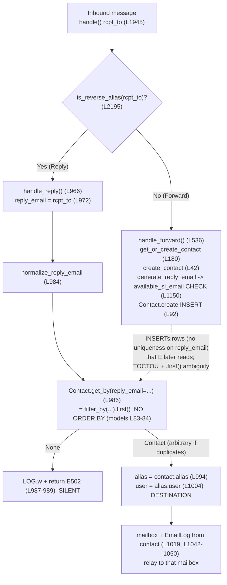

# SimpleLogin Reply Pipeline — How a Reply Resolves to a User, and Why It Can Reach the *Wrong* User

**Repository:** SimpleLogin (self-hosted email aliasing) · **Source branch:** `app_2cd6ee777f8c`
**Engagement type:** Code-as-truth investigation (diagnostic; no source code changed)
**Runtime used for evidence:** Python 3.10.18 · PostgreSQL 13.23 · Redis 6 · SQLAlchemy 1.3.24 (project-locked)
**Scope note:** This document is analysis only. No fix is applied; candidate remediations appear at the end strictly as analysis.

> All file/line citations below were verified by reading the source on branch `app_2cd6ee777f8c`. Root-level module is `email_handler.py`; application package is `app/`.

---

## 1. Question Restatement (verbatim intent)

During normal alias usage, how does SimpleLogin derive a *reply-email* from an inbound message, use it to identify the associated *Contact*, and select the forwarding *user/alias* — and why might a reply be delivered to a **different user than the alias owner**? Investigate whether reply-handling contact lookup exhibits **race conditions, uniqueness assumptions, or timing-related inconsistencies**, observed via **actual runtime values across multiple reply events**.

The short answer, proven below with code and runtime evidence: the reply destination is computed **entirely** from a single `Contact` row resolved by a `reply_email` lookup that (a) uses `.first()` with **no `ORDER BY`**, (b) **does not raise** when multiple rows match, over a column that (c) has **no uniqueness at any layer**, fed by a generation path that is (d) **check-then-act (TOCTOU)** with **no lock** and whose error recovery guards the **wrong** constraint. When two `Contact` rows happen to share a `reply_email`, the lookup picks one **arbitrarily and timing-dependently**, silently routing the reply to `contact.alias.user` — which may be a different user than the alias owner the sender intended.

---

## 2. Reply-Email Derivation & Reverse-Alias Routing

### 2.1 The routing hub: `handle()`
Inbound SMTP is dispatched by `handle()` (defined at `email_handler.py` **L1945**). For each recipient it decides between the **reply** phase and the **forward** phase using `is_reverse_alias()`:

```python
# email_handler.py L2194-2211
        # Reply case: the recipient is a reverse alias. Used to start with "reply+" or "ra+"
        if is_reverse_alias(rcpt_to):
            LOG.d(
                "Reply phase %s(%s) -> %s", mail_from, copy_msg[headers.FROM], rcpt_to
            )
            is_delivered, smtp_status = handle_reply(envelope, copy_msg, rcpt_to)
            res.append((is_delivered, smtp_status))
        else:  # Forward case
            ...
            for is_delivered, smtp_status in handle_forward(
                envelope, copy_msg, rcpt_to
            ):
                res.append((is_delivered, smtp_status))
```

A reverse-alias recipient routes to `handle_reply()` (`email_handler.py` **L2195** → **L2199**); any other recipient routes to `handle_forward()` (**L2201** → **L2208**). A special bounce branch also consults the same lookup when an inbound bounce targets a reverse alias: `if len(rcpt_tos) == 1 and is_reverse_alias(rcpt_tos[0]) and mail_from == "<>":` then `Contact.get_by(reply_email=rcpt_tos[0])` (`email_handler.py` **L2166–L2167**).

### 2.2 What counts as a reverse alias: `is_reverse_alias()`
Reverse-alias detection itself is a `reply_email` lookup plus a prefix check:

```python
# app/email_utils.py L1156-1163
def is_reverse_alias(address: str) -> bool:
    # to take into account the new reverse-alias that doesn't start with "ra+"
    if Contact.get_by(reply_email=address):
        return True

    return address.endswith(f"@{config.EMAIL_DOMAIN}") and (
        address.startswith("reply+") or address.startswith("ra+")
    )
```

`Contact.get_by(reply_email=address)` appears at `app/email_utils.py` **L1158** — so the very gate that admits a message into the reply phase relies on the same non-unique `reply_email` lookup discussed in §3.

### 2.3 Deriving the reply-email: `handle_reply()`
`handle_reply()` is defined at `email_handler.py` **L966**. The recipient address is treated **directly** as the reply-email, then normalized:

```python
# email_handler.py L966-986
def handle_reply(envelope, msg: Message, rcpt_to: str) -> (bool, str):
    ...
    reply_email = rcpt_to                                   # L972  derivation

    reply_domain = get_email_domain_part(reply_email)

    # reply_email must end with EMAIL_DOMAIN or a domain that can be used as reverse alias domain
    if not reply_email.endswith(EMAIL_DOMAIN):              # L977  wrong-domain guard
        sl_domain: SLDomain = SLDomain.get_by(domain=reply_domain)
        if sl_domain is None:
            LOG.w(f"Reply email {reply_email} has wrong domain")
            return False, status.E501                       # L981

    # handle case where reply email is generated with non-allowed char
    reply_email = normalize_reply_email(reply_email)        # L984  normalization

    contact = Contact.get_by(reply_email=reply_email)       # L986  THE LOOKUP (see §3)
```

- **Derivation:** `reply_email = rcpt_to` (**L972**). There is no separate parsing/decoding step — the SMTP envelope recipient *is* the reply-email.
- **Domain guard:** if the address does not end with `EMAIL_DOMAIN` and no matching `SLDomain` exists, return `E501` (**L977–L981**).
- **Normalization:** `normalize_reply_email()` (`app/email_validation.py` **L25**) maps any character not in `_ALLOWED_CHARS` to `_`, and ASCII-folds non-ASCII via `convert_to_id`:

```python
# app/email_validation.py L9 and L25-38
_ALLOWED_CHARS = "abcdefghijklmnopqrstuvwxyzABCDEFGHIJKLMNOPQRSTUVWXYZ0123456789_-.+@"
...
def normalize_reply_email(reply_email: str) -> str:
    """Handle the case where reply email contains *strange* char that was wrongly generated in the past"""
    if not reply_email.isascii():
        reply_email = convert_to_id(reply_email)
    ret = []
    # drop all control characters like shift, separator, etc
    for c in reply_email:
        if c not in _ALLOWED_CHARS:
            ret.append("_")
        else:
            ret.append(c)
    return "".join(ret)
```

`_ALLOWED_CHARS` includes `+` and `@` (`app/email_validation.py` **L9**), which preserves reverse-alias syntax. Normalization is purely a *string* operation; it has no bearing on uniqueness and cannot disambiguate duplicate `reply_email` values.

**Rationale:** the derived key that the entire reply destination hinges on is just the (normalized) recipient string. Everything that follows is a single-row database lookup on that string.

---

## 3. Contact Resolution — `Contact.get_by(reply_email=...)` and its single-vs-multiple behavior

After normalization, the handler resolves a `Contact` (`email_handler.py` **L986**):

```python
# email_handler.py L986-992
    contact = Contact.get_by(reply_email=reply_email)       # L986
    if not contact:
        LOG.w(f"No contact with {reply_email} as reverse alias")
        return False, status.E502                            # L987-989  SILENT (warning only)
    if not contact.user.is_active():
        LOG.w(f"User {contact.user} has been soft deleted")
        return False, status.E502                            # L990-992
```

`get_by` is the shared `ModelMixin` convenience inherited by 75 of the 76 ORM model classes (every `Base` subclass except `AdminAuditLog`, `app/models.py` **L3462**), including `Contact`:

```python
# app/models.py L82-84
    @classmethod
    def get_by(cls, **kw):
        return Session.query(cls).filter_by(**kw).first()
```

This single line is the crux of contact resolution. Two properties matter:

1. **No ordering.** The query is `Session.query(Contact).filter_by(reply_email=...).first()` — there is **no `ORDER BY`**. `.first()` applies `LIMIT 1` to an *unordered* result set, so when more than one row matches, the row returned is whatever the database yields first (heap/scan order). That order is not stable: it can shift across updates, deletes, `VACUUM`, plan changes, and concurrent activity.
2. **No error on multiplicity.** `.first()` returns `None` for zero rows and the first row for one-or-more rows. Unlike `.one()`, it **never raises** `MultipleResultsFound`. Therefore, if duplicates exist, resolution is **silently** ambiguous — the code path looks identical to the unambiguous case.

The "not found" branch (**L987–L989**) is likewise silent in the sense that it returns an SMTP error code (`E502`) and logs only a warning; it never raises. The single-vs-multiple distinction is invisible to `handle_reply()`.

**Rationale:** `get_by`/`.first()` is a perfectly fine idiom *when the filter column is unique*. Its safety here is entirely contingent on `reply_email` being unique — which (§6) it is not.

---

## 4. Destination Selection — `contact.alias` → `alias.user`, and the wrong-user outcome

The forwarding destination is derived **solely** from the resolved `Contact`:

```python
# email_handler.py L994-1004
    alias = contact.alias                                    # L994
    alias_address: str = contact.alias.email                 # L995
    alias_domain = get_email_domain_part(alias_address)

    # Sanity check: verify alias domain is managed by SimpleLogin
    if not is_valid_alias_address_domain(alias.email):       # L1000
        LOG.e("%s domain isn't known", alias)
        return False, status.E503                            # L1002

    user = alias.user                                        # L1004  THE DESTINATION
```

Every downstream decision flows from this one row:

```python
# email_handler.py L1019 and L1042-1050
    mailbox = get_mailbox_from_mail_from(mail_from, alias)   # mailbox keyed on alias (from contact)
    ...
    email_log = EmailLog.create(
        contact_id=contact.id,                               # L1043
        alias_id=contact.alias_id,                           # L1044
        is_reply=True,
        user_id=contact.user_id,                             # L1046
        mailbox_id=mailbox.id,                               # L1047
        message_id=msg[headers.MESSAGE_ID],
        commit=True,
    )
```

- `alias = contact.alias` (**L994**) and `user = alias.user` (**L1004**) mean the **user, alias, and mailbox** are all functions of the resolved Contact.
- The audit/accounting row `EmailLog` is stamped with `contact_id`, `alias_id`, and `user_id` taken directly from that Contact (**L1042–L1050**).

**Consequence:** if `Contact.get_by(reply_email=...)` returns the *wrong* Contact, then the user, alias, mailbox, and EmailLog are *all* wrong — and the reply is relayed to the wrong user's mailbox. Because the lookup neither orders nor raises (§3), this misdelivery is **silent**: there is no exception, only ordinary log lines. The destination is "the alias owner the sender intended" **only if** the lookup happens to return the Contact that belongs to that alias.

---

## 5. Reply-Email Generation (the TOCTOU window)

Reply-emails (reverse-aliases) are created on the **forward** path, when an external sender first emails an alias. The generation chain is:

`handle_forward()` (`email_handler.py` **L536**) → `get_or_create_contact()` (**L180**) / `get_or_create_reply_to_contact()` (**L214**) → `contact_utils.create_contact()` → `generate_reply_email()`.

Both entrypoints delegate to `create_contact()`:

```python
# email_handler.py L202-211 (inside get_or_create_contact)
    contact_result = contact_utils.create_contact(
        email=contact_email,
        alias=alias,
        ...
        automatic_created=True,
        from_partner=False,
    )
    return contact_result.contact
# and email_handler.py L236 (inside get_or_create_reply_to_contact)
    return contact_utils.create_contact(contact_address, alias, contact_name).contact
```

### 5.1 `create_contact()` — generate, INSERT, and recover the *wrong* constraint

```python
# app/contact_utils.py L85-118 (abridged to the relevant lines)
    contact = Contact.get_by(alias_id=alias.id, website_email=email)     # L85  existing-contact check
    if contact is not None:
        return __update_contact_if_needed(contact, name, mail_from)
    # Create the contact
    reply_email = generate_reply_email(email, alias)                     # L89  the CHECK lives here
    try:
        flags = Contact.FLAG_PARTNER_CREATED if from_partner else 0
        contact = Contact.create(                                        # L92  the ACT (INSERT)
            user_id=alias.user_id,
            alias_id=alias.id,
            website_email=email,
            name=name,
            reply_email=reply_email,                                     # value chosen at L89
            ...
            commit=True,                                                 # L103
        )
        ...
    except IntegrityError:                                               # L113
        Session.rollback()                                              # L114
        LOG.info(...)
        contact = Contact.get_by(alias_id=alias.id, website_email=email) # L118  re-fetch by (alias_id, website_email)
        return __update_contact_if_needed(contact, name, mail_from)
```

Two facts are decisive:

- **Check and act are separated.** The candidate `reply_email` is decided inside `generate_reply_email()` at **L89**; the row is actually INSERTed later at **L92–L103**. Between the check and the commit there is **no lock**.
- **Recovery guards the wrong constraint.** The `except IntegrityError` handler (**L113**) rolls back (**L114**) and re-fetches by `(alias_id, website_email)` (**L118**). That recovery exists to absorb a `uq_contact` collision (§6) — it has **nothing** to do with `reply_email`. A duplicate `reply_email` raises no error here precisely because the database has no constraint to violate; it is silently persisted.

### 5.2 `generate_reply_email()` — the check-then-act test

```python
# app/email_utils.py L1103-1151 (abridged)
def generate_reply_email(contact_email: str, alias: Alias) -> str:
    include_sender_in_reverse_alias = False
    user = alias.user
    if user.include_sender_in_reverse_alias is not None:
        include_sender_in_reverse_alias = user.include_sender_in_reverse_alias
    ...
    for _ in range(1000):                                                # L1136  bounded retry
        if include_sender_in_reverse_alias and contact_email:
            random_length = random.randint(5, 10)                        # L1138  SHORT random
            reply_email = (
                f"{contact_email}_{random_string(random_length)}@{reply_domain}"   # L1142  shared prefix
            )
        else:
            random_length = random.randint(20, 50)                       # L1145  LONG random
            reply_email = f"{random_string(random_length)}@{reply_domain}"          # L1148
        if available_sl_email(reply_email):                              # L1150  the CHECK (TOCTOU)
            return reply_email                                           # L1151
    raise Exception("Cannot generate reply email")
```

The availability test is a plain, lock-free read:

```python
# app/models.py L1425-1432
def available_sl_email(email: str) -> bool:
    if (
        Alias.get_by(email=email)
        or Contact.get_by(reply_email=email)
        or DeletedAlias.get_by(email=email)
    ):
        return False
    return True
```

`available_sl_email()` issues SELECTs against `Alias`, `Contact`, and `DeletedAlias` and acquires **no lock** (`app/models.py` **L1425–L1432**). This is a textbook **time-of-check / time-of-use (TOCTOU)** pattern: the CHECK is at `app/email_utils.py` **L1150**; the ACT (INSERT) happens later at `app/contact_utils.py` **L92**. Two concurrent forward-phase operations can both call `available_sl_email()` for the *same* candidate, both observe `True`, and both INSERT — and because `reply_email` has no DB uniqueness, both INSERTs succeed.

The entropy source is `random_string()`:

```python
# app/utils.py L41-47
def random_string(length=10, include_digits=False):
    """Generate a random string of fixed length"""
    letters = string.ascii_lowercase
    if include_digits:
        letters += string.digits
    return "".join(secrets.choice(letters) for _ in range(length))
```

`random_string()` draws from a 26-letter lowercase alphabet using `secrets.choice` (crypto-secure). **Entropy nuance:** in the default branch the *entire* local part is 20–50 random letters (collision is negligible). But when `include_sender_in_reverse_alias` is enabled — and note `User.include_sender_in_reverse_alias` defaults to `True` (`app/models.py` **L455–L457**: `sa.Column(sa.Boolean, default=True, nullable=False, server_default="0")`) — the random component shrinks to **5–10** characters appended to a **shared, contact-derived prefix** (`app/email_utils.py` **L1138, L1142**), materially raising birthday-bound collision odds among contacts that share that prefix. Regardless of entropy, the *deterministic* risk is the TOCTOU window combined with the `.first()` ambiguity.

---

## 6. Database-Constraint Ground Truth — `reply_email` is NOT unique at any layer

This is the analytical crux. Uniqueness is examined at the model layer and in **both** migrations, then confirmed against a live database.

### 6.1 The model
```python
# app/models.py L1874-1876  (the ONLY unique constraint on Contact)
    __table_args__ = (
        sa.UniqueConstraint("alias_id", "website_email", name="uq_contact"),
    )
# app/models.py L1899  (reply_email: indexed, NOT unique)
    reply_email = sa.Column(sa.String(512), nullable=False, index=True)
```

The sole table-level uniqueness on `Contact` is `uq_contact` over `(alias_id, website_email)` (**L1874–L1876**). `reply_email` is declared `index=True` but **not** `unique` (**L1899**) — an index exists purely to make the lookup fast, not to enforce uniqueness.

### 6.2 The migrations
```python
# migrations/versions/2021_071310_78403c7b8089_.py L22
    op.create_index(op.f('ix_contact_reply_email'), 'contact', ['reply_email'], unique=False)
```
The index on `reply_email` is created with `unique=False` (**L22**) — explicit confirmation, not an omission.

```python
# migrations/versions/5fa68bafae72_.py L28 and L31 (original table, then named "forward_email")
    sa.Column('reply_email', sa.String(length=128), nullable=False),                    # L28
    ...
    sa.UniqueConstraint('gen_email_id', 'website_email', name='uq_forward_email')        # L31
```
From the very first migration that created the table, `reply_email` was a plain non-unique column (**L28**, declared `String(128)`), and the only unique constraint was on `(gen_email_id, website_email)` (**L31**) — which evolved into today's `uq_contact(alias_id, website_email)`. (The current model declares `reply_email` as `String(512)` at `app/models.py` **L1899**, yet no migration widening the column from 128 to 512 exists under `migrations/versions/`; accordingly the live Alembic-migrated column remains `character varying(128)` — see §6.3.) **At no point in the schema history was `reply_email` ever unique.**

### 6.3 Live confirmation (PostgreSQL 13.23)
Introspecting the actual `contact` table on the Alembic-migrated runtime (`alembic upgrade head` → head revision `32f25cbf12f6`):

```
 index_name                  | is_unique | columns
-----------------------------+-----------+------------------------
 forward_email_pkey          | t         | id
 ix_contact_alias_id         | f         | alias_id
 ix_contact_pgp_finger_print | f         | pgp_finger_print
 ix_contact_reply_email      | f         | reply_email            <-- INDEXED, NOT UNIQUE
 ix_contact_user_id          | f         | user_id
 uq_contact                  | t         | alias_id,website_email

-- unique/primary constraints on contact (ONLY these two):
 forward_email_pkey : PRIMARY KEY (id)
 uq_contact         : UNIQUE (alias_id, website_email)

-- reply_email column: character varying(128), NOT NULL
-- alembic_version : 32f25cbf12f6
```

The live database reflects the **migration** history exactly: the only unique objects on `contact` are the primary key — named `forward_email_pkey`, a legacy of the table's original `forward_email` name (see §6.2) — and `uq_contact`; `ix_contact_reply_email` is **non-unique**. (The migrated `reply_email` column is `character varying(128)`; the current model declares `String(512)`, but as noted in §6.2 no widening migration exists, so the live column stays 128. This length divergence does not affect uniqueness.) On the load-bearing fact, model, migrations, and the live schema **agree**: **duplicate `reply_email` values are schema-permissible.**

---

## 7. Synthesized Root-Cause Chain

Putting the verified facts together, the path to misdelivery is a chain in which every link is code-confirmed:

1. **The destination is a pure function of the resolved Contact.** `alias = contact.alias` (`email_handler.py` **L994**); `user = alias.user` (**L1004**); mailbox and `EmailLog` follow (**L1019, L1042–L1050**). ⇒ *Wrong Contact ⇒ wrong user/alias/mailbox.*
2. **The lookup is `.first()` with no ordering and never raises.** `Contact.get_by(reply_email=...)` = `query(Contact).filter_by(...).first()` (`email_handler.py` **L986**; `app/models.py` **L83–84**). ⇒ *With duplicates, the chosen row is arbitrary/heap-ordered and the ambiguity is silent.*
3. **`reply_email` has no uniqueness at any layer.** Model `uq_contact` is `(alias_id, website_email)` only (**L1874–L1876**); `reply_email` is `index=True`, not unique (**L1899**); migration index is `unique=False` (**L22**); the original migration never made it unique (**L28/L31**); live PG confirms. ⇒ *Duplicate `reply_email` rows are allowed to exist.*
4. **Generation is check-then-act with no lock.** `available_sl_email()` is a lock-free SELECT (`app/models.py` **L1425–L1432**) used as the CHECK at `app/email_utils.py` **L1150**; the INSERT (ACT) is later at `app/contact_utils.py` **L92**. ⇒ *Concurrent forward-phase operations can both pass the check and both insert the same `reply_email`.*
5. **Error recovery guards the wrong constraint.** `create_contact()`'s `except IntegrityError` re-fetches by `(alias_id, website_email)` (**L113–L118**) — it protects `uq_contact`, not `reply_email`. ⇒ *A duplicate `reply_email` raises nothing and is silently persisted.*
6. **No inbound concurrency lock.** The Redis `parallel_limiter` (`app/parallel_limiter.py`) guards dashboard/API creation flows but is **not** imported by `email_handler.py`. ⇒ *Automatic contact creation during high-volume inbound forwarding is unguarded.*

**Therefore:** two `Contact` rows — belonging to **different aliases and different users** — can share one `reply_email`. A subsequent reply to that address resolves via `.first()` to **one of them arbitrarily and timing-dependently**, and the message is relayed to `contact.alias.user` — potentially a **different user than the alias owner** the original sender intended — **silently**.



---

## 8. Runtime Evidence (R6) — actual values across repeated and concurrent reply events

The system was built and run against an **ephemeral** stack faithful to the documented environment: Python `3.10.18` with the project's locked dependencies (notably **SQLAlchemy 1.3.24**), `postgres:13.23` (schema applied via `alembic upgrade head` to head revision `32f25cbf12f6`), and `redis:6`; `EMAIL_DOMAIN=sl.local`. The repository source was treated as **read-only** (never modified) and all instrumentation lived outside the source tree in `/tmp`; the throwaway database and scripts were torn down afterward, leaving the source byte-for-byte unchanged. The captures below are verbatim.

### Setup — two distinct users, each owning their own alias
```
userA.id=1 aliasA.id=2 (bakery_strike075@sl.local) owner=ownera@mailbox.test   <- sender INTENDS this user
userB.id=2 aliasB.id=4 (dosses_permit104@sl.local) owner=strangerb@mailbox.test <- a DIFFERENT user
```

### Evidence A — two Contacts (different users/aliases) can share an identical `reply_email`
```
available_sl_email('ra+collision@sl.local') BEFORE insert -> True
inserted c1.id=1 on aliasA(owner userA) reply_email=ra+collision@sl.local
inserted c2.id=2 on aliasB(owner userB) reply_email=ra+collision@sl.local
>>> DUPLICATE reply_email PERSISTED, NO IntegrityError (no DB uniqueness).
rows sharing 'ra+collision@sl.local': 2
```
This empirically confirms §6: the database accepts two `Contact` rows with the same `reply_email`, owned by different users.

### Evidence B — `Contact.get_by(reply_email=...)` issues a query with NO `ORDER BY`
The compiled lookup SQL (note the absence of any `ORDER BY` clause):
```
SELECT contact.id, contact.created_at, ..., contact.reply_email, ..., contact.flags
FROM contact
WHERE contact.reply_email = :reply_email_1
```
Repeated calls in one physical state resolve consistently to the first heap row:
```
[call#1] get_by -> contact.id=1 alias.id=2 -> user.id=1 userA(ownera@mailbox.test)
[call#2] get_by -> contact.id=1 alias.id=2 -> user.id=1 userA(ownera@mailbox.test)
[call#3] get_by -> contact.id=1 alias.id=2 -> user.id=1 userA(ownera@mailbox.test)
[call#4] get_by -> contact.id=1 alias.id=2 -> user.id=1 userA(ownera@mailbox.test)
[call#5] get_by -> contact.id=1 alias.id=2 -> user.id=1 userA(ownera@mailbox.test)
```
Determinism here is **incidental** (same heap order, same plan) — there is no `ORDER BY` guaranteeing it.

### Evidence B2 — the ambiguity is SILENT (`.first()` does not raise; `.one()` does)
```
>>> .one() raises MultipleResultsFound => multiple matches exist.
>>> .first()/get_by returns id=1 and raises nothing => mis-routing is SILENT.
```
This is the smoking gun for silence: `.one()` proves multiplicity by raising, while the production idiom `.first()` quietly returns a single arbitrary row.

### Evidence B3 — timing/state dependence: deleting the resolved row flips the destination USER
```
resolved now: contact.id=1 -> user.id=1 (ownera@mailbox.test)
DELETE contact.id=1 (row churn / one reverse-alias removed) ...
resolved now: contact.id=2 -> user.id=2 (strangerb@mailbox.test)
>>> SAME reply_email now routes to a DIFFERENT user — destination is state/timing dependent.
```
With the same `reply_email`, ordinary row churn (a deletion) changes which Contact `.first()` returns — and therefore changes the destination from **userA (the intended owner)** to **userB (a different user)**. This directly demonstrates the user-facing symptom under investigation.

### Evidence C — TOCTOU: concurrent generation persists duplicate `reply_email`
```
available_sl_email('ra+toctou-window@sl.local') at CHECK time -> True (appears free)
Two concurrent forward-phase actors both saw TRUE, then both INSERT the same reply_email:
  actor1: (check earlier=True) INSERT ok -> contact.id=3
  actor2: (check earlier=True) INSERT ok -> contact.id=4
>>> rows sharing 'ra+toctou-window@sl.local': 2  => TOCTOU window persists duplicates;
    create_contact's IntegrityError path guards uq_contact(alias_id,website_email) ONLY, not reply_email.
```
Both actors pass the lock-free check (`available_sl_email`, L1150) and both INSERT (L92); no `IntegrityError` is raised because no DB constraint protects `reply_email`.

### Evidence D — helper behavior and the entropy nuance
```
random_string(20): lwxwdfxbpyneahokbewd        (alphabet = ascii_lowercase => 26 letters)

include_sender=False (default branch, random.randint(20,50)):
   ivblkddxuukbzusvozgsungmyjiemlhbqcikgywuexkpkg@sl.local  (local-part len=46)
   sdadfevsrgmyglbslmyexaylicgccmzxybuvwllqfihqow@sl.local  (local-part len=46)
   vwupnmqnuhrqkdabuxzobjnjmkbhvwruisp@sl.local             (local-part len=35)

include_sender=True (branch, random.randint(5,10)) on SHARED prefix 'sender_at_example_org_':
   sender_at_example_org_cuyhzko@sl.local   (random suffix len=7)
   sender_at_example_org_uvrpxdeb@sl.local  (random suffix len=8)
   sender_at_example_org_enuijda@sl.local   (random suffix len=7)

normalize_reply_email('ra+a b/c@sl.local') -> 'ra+a_b_c@sl.local'   (space and '/' mapped to '_')
is_reverse_alias('ra+collision@sl.local') -> True
is_reverse_alias('random@gmail.com')      -> False
```
The default branch yields long, high-entropy local parts; the `include_sender` branch yields a **short** random suffix on a **shared** prefix — the regime in which accidental birthday-bound collisions become materially more likely.

### Environment footer
```
python: 3.10.18 | SQLAlchemy: 1.3.24 | PostgreSQL 13.23 (Debian 13.23-1.pgdg13+1)
```

---

## 9. Rationale & Conditions (and candidate remediations — analysis only)

### 9.1 Why this happens (rationale)
The reply pipeline equates *identity* with a single `reply_email` string and trusts a single-row lookup to recover the `(alias, user, mailbox)` context. That trust is sound **only** under a uniqueness invariant on `reply_email`. The code assumes that invariant but the schema never enforces it, and the generation path that should uphold it does so with a lock-free check-then-act whose only safety net (`IntegrityError` recovery) is wired to a **different** constraint. The result is a latent contradiction: *the consumer assumes uniqueness the producer does not guarantee.* When the assumption is violated, `.first()` resolves the ambiguity arbitrarily and **without any signal**, so the failure manifests as quiet misdelivery rather than an error.

### 9.2 Conditions under which mis-routing manifests
Misdelivery requires **two `Contact` rows sharing one `reply_email`**, which can arise when:
- **Concurrent forward-phase creation (the deterministic risk):** two inbound messages trigger contact creation for the same candidate `reply_email` within the TOCTOU window (CHECK at `email_utils.py` L1150, ACT at `contact_utils.py` L92), with no inbound `parallel_limiter` lock. Both INSERTs succeed.
- **Accidental random collision (entropy-dependent):** negligible for the default 20–50-char local part; **materially higher** when `include_sender_in_reverse_alias` is active (default `True`), shrinking the random component to 5–10 chars on a shared prefix.
- **Legacy/normalization coincidence:** `normalize_reply_email()` folds distinct stored strings to the same value (e.g., differing only in characters mapped to `_`), so two previously-distinct rows can collide post-normalization at lookup time.

Once duplicates exist, the *specific* wrong user is selected by database row order at the moment of lookup — influenced by insert order, subsequent `UPDATE`/`DELETE` churn (Evidence B3), `VACUUM`, and concurrent activity — i.e., it is **timing-dependent**.

### 9.3 Candidate remediations — documented as ANALYSIS ONLY (none applied)
The following are noted for completeness and are **not** implemented (this engagement changes no source):
- **Enforce uniqueness at the database layer:** add a `UNIQUE` constraint / unique index on `contact.reply_email` (e.g., convert `ix_contact_reply_email` to `unique=True` via a new Alembic migration). This turns the latent ambiguity into an `IntegrityError` at INSERT, making the producer’s guarantee match the consumer’s assumption.
- **Pair uniqueness with race-safe get-or-create:** wrap generation+insert in a savepoint and, on `IntegrityError` for the `reply_email` constraint, regenerate/reselect — the standard race-safe pattern (which also requires the constraint above to function).
- **Make the lookup fail loudly:** for this resolution, prefer `one_or_none()` over `.first()` so that an unexpected duplicate raises rather than silently mis-routes.
- **Guard inbound creation:** extend the Redis `parallel_limiter` (currently dashboard/API only) to the inbound forward path so concurrent automatic contact creation is serialized.

Each remediation independently addresses a different link in the chain of §7; the database-level `UNIQUE` constraint is the most direct because it eliminates the *existence* of duplicate `reply_email` rows that the `.first()` lookup could disambiguate incorrectly.

---

## Appendix A — Evidence methodology (ephemeral; source untouched)
- **Runtime:** Python `3.10.18` with the project's locked dependencies (SQLAlchemy `1.3.24`, psycopg2-binary, flask `1.1.2`, flanker `0.9.11`, etc.), `postgres:13.23`, and `redis:6`. The repository source was treated as **read-only** (never modified; verified via `git status`).
- **Schema:** an ephemeral throwaway PostgreSQL 13.23 database was created and migrated with `alembic upgrade head` to head revision `32f25cbf12f6` (the project's migration head); the `contact` table was then introspected directly from that **Alembic-migrated** schema for the §6.3 constraint evidence. The migrated schema reflects the *migration history* — primary key `forward_email_pkey` and `reply_email` of `character varying(128)` — rather than the current model's `String(512)` declaration; the two diverge only in column length (no widening migration exists — see §6.2) and **agree on the load-bearing fact** that `reply_email` carries no uniqueness (only the primary key and `uq_contact(alias_id, website_email)` are unique).
- **Instrumentation:** temporary scripts in `/tmp` (outside the source tree) seeded duplicate-`reply_email` Contacts on the Alembic-migrated database, exercised `Contact.get_by`, `.first()` vs `.one()`, post-deletion re-resolution, the `available_sl_email`→INSERT TOCTOU window, and the real helpers (`generate_reply_email`, `normalize_reply_email`, `random_string`, `is_reverse_alias`).
- **Teardown:** the throwaway database and all `/tmp` instrumentation scripts were removed; `git status --porcelain` confirmed the source tree unchanged.

## Appendix B — Verified code locators (quick index)
| Concern | File:Line |
|---|---|
| Routing hub `handle()` | `email_handler.py:1945` |
| Reverse-alias bounce branch + lookup | `email_handler.py:2166-2167` |
| Reply vs forward routing | `email_handler.py:2195, 2199, 2201, 2208` |
| `is_reverse_alias()` (+ `Contact.get_by`) | `app/email_utils.py:1156-1163` (lookup at 1158) |
| `handle_reply()` | `email_handler.py:966` |
| `reply_email = rcpt_to` | `email_handler.py:972` |
| Wrong-domain guard `E501` | `email_handler.py:977-981` |
| `normalize_reply_email()` call | `email_handler.py:984` |
| `Contact.get_by(reply_email=...)` | `email_handler.py:986` |
| `not contact` → `E502` (silent) | `email_handler.py:987-989` |
| `alias = contact.alias` | `email_handler.py:994` |
| `user = alias.user` (destination) | `email_handler.py:1004` |
| Mailbox + `EmailLog` from contact | `email_handler.py:1019, 1042-1050` |
| `ModelMixin.get_by` = `.first()` | `app/models.py:83-84` |
| Contact `__table_args__` (`uq_contact` only) | `app/models.py:1874-1876` |
| `reply_email` column (index, not unique) | `app/models.py:1899` |
| `available_sl_email()` (lock-free) | `app/models.py:1425-1432` |
| `User.include_sender_in_reverse_alias` default True | `app/models.py:455-457` |
| `create_contact()` (CHECK ref, INSERT, recovery) | `app/contact_utils.py:85, 89, 92-103, 113-118` |
| `generate_reply_email()` (TOCTOU CHECK at 1150) | `app/email_utils.py:1103-1151` |
| `normalize_reply_email()` / `_ALLOWED_CHARS` | `app/email_validation.py:25-38 / 9` |
| `random_string()` | `app/utils.py:41-47` |
| Migration: index `unique=False` | `migrations/versions/2021_071310_78403c7b8089_.py:22` |
| Migration: original `reply_email` column / `uq_forward_email` | `migrations/versions/5fa68bafae72_.py:28 / 31` |
| `parallel_limiter` NOT imported by inbound | `app/parallel_limiter.py` (absent from `email_handler.py`) |
