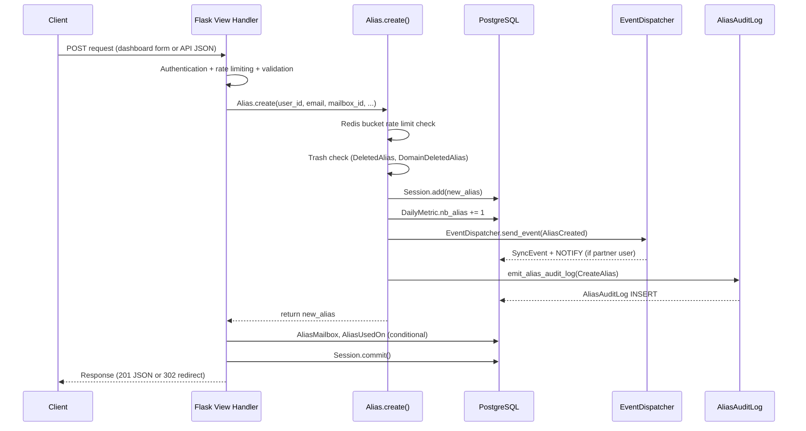
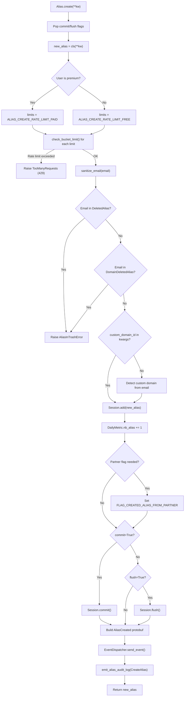
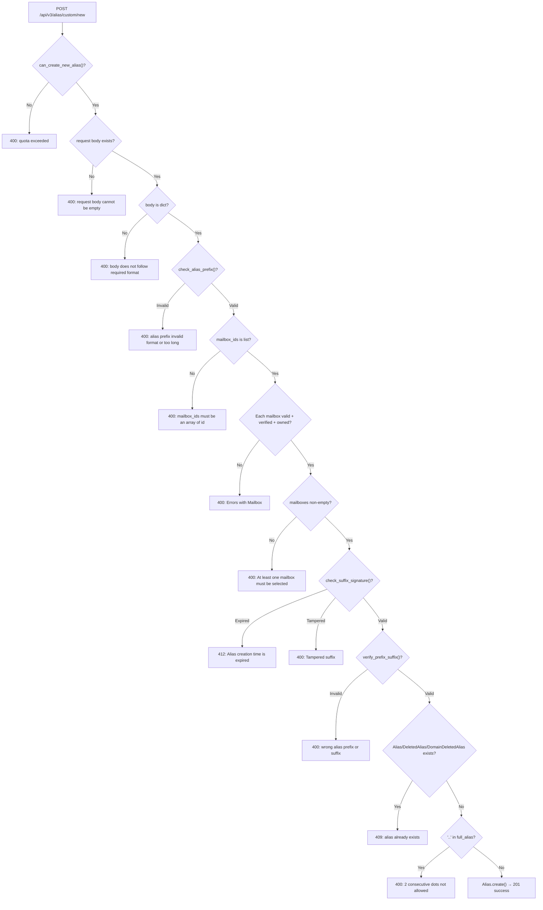
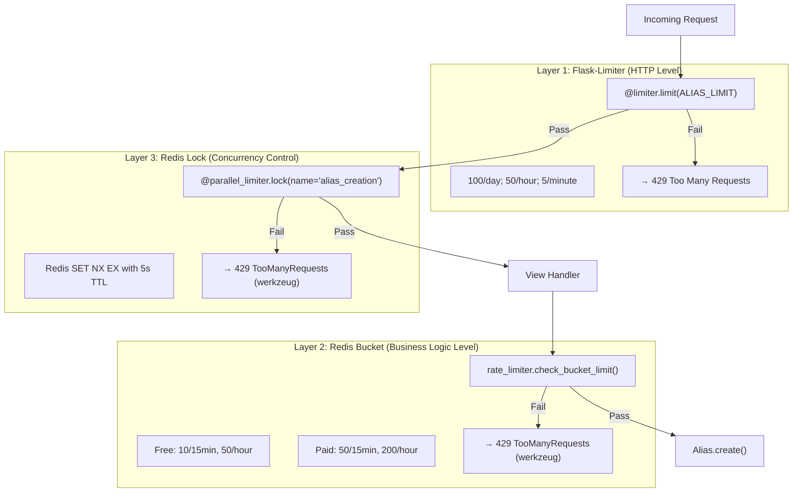

# SimpleLogin Alias-Creation Flow: Technical Investigation

> **Document type:** Technical Investigation / Q&A Document
> **Scope:** Alias creation through dashboard and API entry points
> **Methodology:** Every claim in this document is grounded in specific source code paths. No assumptions — the code is the sole source of truth.

---

## Table of Contents

- [1. Overview](#1-overview)
- [2. Frontend Request — What Does the Frontend Send?](#2-frontend-request--what-does-the-frontend-send)
  - [2.1 Dashboard Custom Alias (Web Form POST)](#21-dashboard-custom-alias-web-form-post)
  - [2.2 Dashboard Random Alias (Web Form POST)](#22-dashboard-random-alias-web-form-post)
  - [2.3 API Custom Alias (JSON API — v2 and v3)](#23-api-custom-alias-json-api--v2-and-v3)
  - [2.4 API Random Alias (JSON API)](#24-api-random-alias-json-api)
- [3. Backend Response — What Does the Backend Return?](#3-backend-response--what-does-the-backend-return)
  - [3.1 Success Responses](#31-success-responses)
  - [3.2 Error Responses](#32-error-responses)
- [4. Database Changes — What Records Are Created or Updated?](#4-database-changes--what-records-are-created-or-updated)
  - [4.1 Tables Touched and Records Inserted](#41-tables-touched-and-records-inserted)
  - [4.2 The Alias.create() Sequence in Detail](#42-the-aliascreate-sequence-in-detail)
  - [4.3 Conditional Side-Effect Writes](#43-conditional-side-effect-writes)
- [5. Background Tasks and Events](#5-background-tasks-and-events)
  - [5.1 EventDispatcher and AliasCreated Protobuf Event](#51-eventdispatcher-and-aliascreated-protobuf-event)
  - [5.2 PostgreSQL NOTIFY and SyncEvent](#52-postgresql-notify-and-syncevent)
  - [5.3 New Relic Telemetry](#53-new-relic-telemetry)
- [6. Error Handling](#6-error-handling)
  - [6.1 Validation Errors and Their API Surface](#61-validation-errors-and-their-api-surface)
  - [6.2 Database Errors (IntegrityError, AliasInTrashError)](#62-database-errors-integrityerror-aliasintrasherror)
  - [6.3 Rate Limiting Errors](#63-rate-limiting-errors)
- [7. Summary — End-to-End Flow Diagram](#7-summary--end-to-end-flow-diagram)

---

## 1. Overview

SimpleLogin provides **five distinct entry points** for creating an email alias. Each entry point performs its own request validation and authentication, but all paths ultimately converge on the same core persistence method — `Alias.create()` — which handles database writes, event emission, and audit logging.

**Entry points:**

| # | Route | Method | Handler | Source |
|---|-------|--------|---------|--------|
| 1 | `/dashboard/custom_alias` | POST | `custom_alias()` | `app/dashboard/views/custom_alias.py:30` |
| 2 | `/dashboard/` | POST | `index()` (with `form-name=create-random-email`) | `app/dashboard/views/index.py:55` |
| 3 | `/api/v2/alias/custom/new` | POST | `new_custom_alias_v2()` | `app/api/views/new_custom_alias.py:28` |
| 4 | `/api/v3/alias/custom/new` | POST | `new_custom_alias_v3()` | `app/api/views/new_custom_alias.py:115` |
| 5 | `/api/alias/random/new` | POST | `new_random_alias()` | `app/api/views/new_random_alias.py:21` |

**Rationale for convergence:** All entry points delegate to `Alias.create()` (Source: `app/models.py:1628`) or `Alias.create_new_random()` (Source: `app/models.py:1721`) which itself calls `Alias.create()` at line 1750. This ensures consistent rate limiting, trash-checking, event dispatch, and audit logging regardless of the creation path.



---

## 2. Frontend Request — What Does the Frontend Send?

### 2.1 Dashboard Custom Alias (Web Form POST)

The dashboard custom alias form sends an HTML form POST to the Flask view handler.

**Request shape:**

| Property | Value | Source |
|----------|-------|--------|
| **Method** | `POST` | `app/dashboard/views/custom_alias.py:30` |
| **URL** | `/dashboard/custom_alias` | `app/dashboard/views/custom_alias.py:30` |
| **Content-Type** | `application/x-www-form-urlencoded` | Standard HTML form |
| **Authentication** | Flask-Login session cookie | `@login_required` decorator at `app/dashboard/views/custom_alias.py:32` |

**Form fields:**

| Field Name | Type | Required | Description | Source |
|------------|------|----------|-------------|--------|
| `csrf_token` | hidden | Yes | CSRF protection token | `app/dashboard/views/custom_alias.py:52,56` via `CSRFValidationForm` |
| `prefix` | text | Yes | Alias prefix string (e.g., `my-alias`) | `app/dashboard/views/custom_alias.py:59` |
| `signed-alias-suffix` | select | Yes | Signed suffix from dropdown (e.g., `.abc123@sl.co.SIGNATURE`) | `app/dashboard/views/custom_alias.py:60` |
| `mailboxes` | multi-select | Yes | List of mailbox IDs to associate | `app/dashboard/views/custom_alias.py:61` |
| `note` | text | No | Optional alias note | `app/dashboard/views/custom_alias.py:62` |

**Decorators applied (in order):**

1. `@limiter.limit(ALIAS_LIMIT, methods=["POST"])` — Flask-Limiter HTTP rate limiting (Source: `custom_alias.py:31`)
2. `@login_required` — Flask-Login session authentication (Source: `custom_alias.py:32`)
3. `@parallel_limiter.lock(name="alias_creation")` — Redis distributed concurrency lock (Source: `custom_alias.py:33`)

**Rationale:** The prefix is stripped, lowercased, and spaces removed at line 59. This normalization ensures aliases are always lowercase per email specification requirements. The signed suffix is cryptographically signed using `itsdangerous.TimestampSigner` with a 600-second (10 minute) TTL, preventing tampering and ensuring the offered suffixes are still valid when submitted.

---

### 2.2 Dashboard Random Alias (Web Form POST)

Random alias creation is handled by the dashboard index view, which multiplexes several form types using a `form-name` discriminator field.

**Request shape:**

| Property | Value | Source |
|----------|-------|--------|
| **Method** | `POST` | `app/dashboard/views/index.py:55` |
| **URL** | `/dashboard/` | `app/dashboard/views/index.py:55` |
| **Content-Type** | `application/x-www-form-urlencoded` | Standard HTML form |
| **Authentication** | Flask-Login session cookie | `@login_required` decorator at `index.py:56` |

**Form fields:**

| Field Name | Type | Required | Description | Source |
|------------|------|----------|-------------|--------|
| `csrf_token` | hidden | Yes | CSRF protection token | `index.py:85,88` via `CSRFValidationForm` |
| `form-name` | hidden | Yes | Must be `"create-random-email"` — discriminator | `index.py:97` |
| `generator_scheme` | select | No | Integer for word vs UUID generation scheme | `index.py:99-100` |

**Rate limiting configuration (conditional):**

The rate limiting and concurrency lock decorators on this endpoint use conditional application, since the same route handles multiple form types:

- **Flask-Limiter:** `exempt_when=lambda: request.form.get("form-name") != "create-random-email"` — only applies when creating random aliases (Source: `index.py:57-60`)
- **Parallel limiter:** `only_when=lambda: request.form.get("form-name") == "create-random-email"` — only acquires the lock for alias creation (Source: `index.py:63-66`)

**Rationale:** The conditional rate limiting is necessary because the `/dashboard/` route also handles alias deletion and disabling. Without the `exempt_when` / `only_when` guards, those operations would incorrectly consume alias creation rate limit quota.

---

### 2.3 API Custom Alias (JSON API — v2 and v3)

The API provides two versions of the custom alias creation endpoint. Both require an API key and accept JSON input.

#### v2 Endpoint

Source: `app/api/views/new_custom_alias.py:28-112`

**Request shape:**

| Property | Value | Source |
|----------|-------|--------|
| **Method** | `POST` | `new_custom_alias.py:28` |
| **URL** | `/api/v2/alias/custom/new` | `new_custom_alias.py:28` |
| **Content-Type** | `application/json` | `request.get_json()` at line 60 |
| **Authentication** | `Authentication: <api_key>` header | `@require_api_auth` at line 30; resolved in `app/api/base.py:17-18` |
| **Query params** | `hostname` (optional) | `request.args.get("hostname")` at line 58 |

**JSON body:**

```json
{
  "alias_prefix": "my-alias",
  "signed_suffix": ".random@sl.co.SIGNATURE",
  "note": "optional note"
}
```

Source: `new_custom_alias.py:64-66`

#### v3 Endpoint

Source: `app/api/views/new_custom_alias.py:115-235`

v3 extends v2 with **required mailbox selection** and an **optional display name**:

**Additional JSON body fields:**

```json
{
  "alias_prefix": "my-alias",
  "signed_suffix": ".random@sl.co.SIGNATURE",
  "mailbox_ids": [1, 2],
  "note": "optional note",
  "name": "Display Name"
}
```

Source: `new_custom_alias.py:156-162`

**Key difference from v2:** The `mailbox_ids` field is **required** in v3 (validated at line 171). The `name` field has newlines stripped at line 164. v3 uses `Session.flush()` (line 218) before adding additional `AliasMailbox` entries, then `Session.commit()` (line 226), enabling multi-mailbox alias creation in a single transaction.

#### Suffix Provisioning (Prerequisite)

Before calling either endpoint, clients should call `GET /api/v5/alias/options` (Source: `app/api/views/alias_options.py:77-153`) to obtain available suffixes. This endpoint returns:

```json
{
  "can_create": true,
  "prefix_suggestion": "groupon",
  "recommendation": { "alias": "existing@sl.co", "hostname": "groupon.com" },
  "suffixes": [
    {
      "suffix": ".abc123@sl.co",
      "signed_suffix": ".abc123@sl.co.SIGNATURE",
      "is_custom": false,
      "is_premium": false
    }
  ]
}
```

Source: `alias_options.py:143-151`

**Rationale:** The suffix provisioning step is essential because the suffix contains a cryptographic signature produced by `itsdangerous.TimestampSigner` (Source: `app/alias_suffix.py:11`). The client cannot forge suffixes — it must request them from the server, then submit the `signed_suffix` back within 600 seconds.

---

### 2.4 API Random Alias (JSON API)

Source: `app/api/views/new_random_alias.py:21-117`

**Request shape:**

| Property | Value | Source |
|----------|-------|--------|
| **Method** | `POST` | `new_random_alias.py:21` |
| **URL** | `/api/alias/random/new` | `new_random_alias.py:21` |
| **Content-Type** | `application/json` (optional body) | `request.get_json(silent=True)` at line 46 |
| **Authentication** | `Authentication: <api_key>` header | `@require_api_auth` at line 23 |
| **Query params** | `hostname` (optional), `mode` (optional: `"word"` or `"uuid"`) | Lines 53, 97 |

**JSON body (optional):**

```json
{ "note": "optional note" }
```

Source: `new_random_alias.py:46-48`

**Hostname-based suggestion behavior:**

When `hostname` is provided AND `user.include_website_in_one_click_alias` is `True`, the endpoint performs intelligent alias suggestion (Source: `new_random_alias.py:54-93`):

1. Extracts domain from hostname via `tldextract` (e.g., `www.groupon.com` → `groupon`) — Source: line 58-59
2. Constructs a suggested alias: `prefix_suggestion + suffixes[0].suffix` — Source: lines 62-64
3. **Reuses** an existing alias if it belongs to the same user AND has an `AliasUsedOn` record for this hostname — Source: lines 66-80
4. **Creates** a new alias with the suggested name if available — Source: lines 82-93
5. **Falls back** to `Alias.create_new_random()` if the suggestion is unavailable or in trash — Source: line 106

**Rationale:** This hostname-based reuse prevents browser extension users from generating a new alias every time they visit the same website. The `AliasInTrashError` on the suggested alias is silently caught (line 91-93) and the flow falls through to random generation, ensuring the user always gets an alias.

---

## 3. Backend Response — What Does the Backend Return?

### 3.1 Success Responses

#### API Endpoints (v2, v3, random)

All three API endpoints return **HTTP 201 Created** with a JSON body containing the full alias details.

**Return statement pattern:**

```python
return jsonify(alias=full_alias, **serialize_alias_info_v2(get_alias_info_v2(alias))), 201
```

Source: `new_custom_alias.py:110-112` (v2), `new_custom_alias.py:232-235` (v3), `new_random_alias.py:114-117` (random)

**Response JSON shape** (derived from `serialize_alias_info_v2` at `app/api/serializer.py:55-93`):

```json
{
  "alias": "prefix.random@sl.co",
  "id": 123,
  "email": "prefix.random@sl.co",
  "creation_date": "2024-01-01 00:00:00+00:00",
  "creation_timestamp": 1704067200,
  "enabled": true,
  "note": "optional note",
  "name": null,
  "nb_forward": 0,
  "nb_block": 0,
  "nb_reply": 0,
  "mailbox": { "id": 1, "email": "user@example.com" },
  "mailboxes": [{ "id": 1, "email": "user@example.com" }],
  "support_pgp": false,
  "disable_pgp": false,
  "latest_activity": null,
  "pinned": false
}
```

**Field explanations:**

- `alias` (top-level): The full alias email string — set from `full_alias` local variable, NOT from `serialize_alias_info_v2`
- `id`, `email`, `creation_date`, `creation_timestamp`: From the `Alias` model fields (Source: `serializer.py:58-61`)
- `nb_forward`, `nb_block`, `nb_reply`: Activity counters from `AliasInfo` dataclass — always 0 for newly created aliases (Source: `serializer.py:66-68`)
- `mailbox`: Primary mailbox object with `id` and `email` (Source: `serializer.py:70`)
- `mailboxes`: Array of all associated mailboxes (Source: `serializer.py:71-74`)
- `latest_activity`: Always `null` for new aliases, populated later from `EmailLog` (Source: `serializer.py:77,80-92`)

#### Dashboard Endpoints

Dashboard endpoints return **HTTP 302 redirects** with flash messages instead of JSON.

**Custom alias success:**

- Flash: `"Alias {full_alias} has been created"` with category `"success"` — Source: `custom_alias.py:159`
- Redirect to: `dashboard.index` with `highlight_alias_id=alias.id` — Source: `custom_alias.py:161`

**Random alias success:**

- Flash: `"Alias {alias.email} has been created"` with category `"success"` — Source: `index.py:111`
- Redirect to: `dashboard.index` with `highlight_alias_id`, `query`, `sort`, `filter` params preserved — Source: `index.py:113-121`

**Rationale:** The dashboard uses the Post/Redirect/Get (PRG) pattern to prevent double-submission on browser refresh. The `highlight_alias_id` parameter ensures the newly created alias is visually highlighted on the dashboard.

---

### 3.2 Error Responses

#### API Error Responses

All API errors return JSON with an `error` key. The following table catalogs every error condition:

| Error Condition | Status | Error Message | Source | Endpoints |
|---|---|---|---|---|
| Free plan alias quota exceeded | 400 | `"You have reached the limitation of a free account with the maximum of {MAX_NB_EMAIL_FREE_PLAN} aliases, please upgrade your plan to create more aliases"` | `new_custom_alias.py:50-56` | v2, v3, random |
| Empty request body | 400 | `"request body cannot be empty"` | `new_custom_alias.py:62` | v2, v3 |
| Invalid body format (not a dict) | 400 | `"request body does not follow the required format"` | `new_custom_alias.py:154` | v3 only |
| Invalid alias prefix (regex/length) | 400 | `"alias prefix invalid format or too long"` | `new_custom_alias.py:168` | v3 only |
| `mailbox_ids` not a list | 400 | `"mailbox_ids must be an array of id"` | `new_custom_alias.py:172` | v3 only |
| Invalid/unverified/foreign mailbox | 400 | `"Errors with Mailbox"` | `new_custom_alias.py:177` | v3 only |
| No mailboxes selected | 400 | `"At least one mailbox must be selected"` | `new_custom_alias.py:181` | v3 only |
| Suffix signature expired (600s TTL) | **412** | `"Alias creation time is expired, please retry"` | `new_custom_alias.py:73` (v2), `new_custom_alias.py:188` (v3) | v2, v3 |
| Tampered suffix signature | 400 | `"Tampered suffix"` | `new_custom_alias.py:76` (v2), `new_custom_alias.py:191` (v3) | v2, v3 |
| Wrong prefix/suffix combination | 400 | `"wrong alias prefix or suffix"` | `new_custom_alias.py:79` (v2), `new_custom_alias.py:194` (v3) | v2, v3 |
| Alias already exists | **409** | `"alias {full_alias} already exists"` | `new_custom_alias.py:88` (v2), `new_custom_alias.py:203` (v3) | v2, v3 |
| Consecutive dots in alias | 400 | `"2 consecutive dot signs aren't allowed in an email address"` | `new_custom_alias.py:92-94` (v2), `new_custom_alias.py:206-209` (v3) | v2, v3 |
| Invalid `mode` parameter | 400 | `"{mode} must be either word or uuid"` | `new_random_alias.py:104` | random only |
| `AliasInTrashError` (hostname flow) | — | Silently caught; falls through to random generation | `new_random_alias.py:91-93` | random only |
| Rate limit exceeded (Flask-Limiter) | **429** | Standard Flask-Limiter response | `config.py:448` | All |
| Rate limit exceeded (Redis bucket) | **429** | `TooManyRequests` werkzeug exception | `rate_limiter.py:40` | All (via `Alias.create()`) |
| Concurrency lock contention | **429** | `TooManyRequests` werkzeug exception | `parallel_limiter.py:34` | All |

**Rationale for 412 (Precondition Failed):** The suffix is time-stamped with `itsdangerous.TimestampSigner` (Source: `app/alias_suffix.py:11,40`) and expires after 600 seconds. Using HTTP 412 signals that the request was structurally valid but a time-based precondition expired. This is distinct from 400 (malformed request) and helps clients distinguish between "try again with fresh suffixes" vs "fix your request."

**Rationale for 409 (Conflict):** The alias existence check queries three tables — `Alias`, `DeletedAlias`, and `DomainDeletedAlias` (Source: `new_custom_alias.py:82-86`). Using 409 signals a resource conflict, prompting the client to choose a different alias prefix.

#### Dashboard Error Responses (Flash Messages)

The dashboard view uses Flask `flash()` messages with redirect instead of JSON errors:

| Error Condition | Flash Message | Category | Source |
|---|---|---|---|
| Free plan quota exceeded | `"You have reached free plan limit, please upgrade to create new aliases"` | `warning` | `custom_alias.py:38-41` |
| Invalid CSRF token | `"Invalid request"` | `warning` | `custom_alias.py:57` |
| Invalid alias prefix | `"Only lowercase letters, numbers, dashes (-), dots (.) and underscores (_) are currently supported for alias prefix. Cannot be more than 40 letters"` | `error` | `custom_alias.py:65-69` |
| Invalid/unverified mailbox | `"Something went wrong, please retry"` | `warning` | `custom_alias.py:81` |
| No mailboxes selected | `"At least one mailbox must be selected"` | `error` | `custom_alias.py:86` |
| Suffix signature expired | `"Alias creation time is expired, please retry"` | `warning` | `custom_alias.py:93` |
| Tampered suffix | `"Unknown error, refresh the page"` | `error` | `custom_alias.py:97` |
| Consecutive dots | `"Your alias can't contain 2 consecutive dots (..)"` | `error` | `custom_alias.py:104` |
| Email validation failure | Dynamic: `str(e)` from `EmailNotValidError` | `error` | `custom_alias.py:111-112` |
| Alias exists (own) | `"You already have this alias {full_alias}"` | `error` | `custom_alias.py:120` |
| Alias exists (other user) | `"{full_alias} cannot be used"` | `error` | `custom_alias.py:122` |
| Previously deleted domain alias | `"You have deleted this alias before. You can restore it on {domain} 'Deleted Alias' page"` | `error` | `custom_alias.py:128-131` |
| Previously deleted (global) | `"{full_alias} cannot be used"` | `error` | `custom_alias.py:135` |
| `IntegrityError` (race condition) | `"Unknown error, please retry"` | `error` | `custom_alias.py:149` |
| Wrong prefix/suffix | `"something went wrong"` | `warning` | `custom_alias.py:164` |

**Key divergence from API:** The dashboard flow provides more user-friendly error messages (e.g., `"Unknown error, refresh the page"` vs `"Tampered suffix"`) and includes additional checks not present in the API, such as `validate_email()` (Source: `custom_alias.py:107-112`) and distinct handling for own-alias vs other-user alias collisions.

---

## 4. Database Changes — What Records Are Created or Updated?

### 4.1 Tables Touched and Records Inserted

The following table documents every database table written to during alias creation:

| Table | Model Class | Operation | When | Source |
|---|---|---|---|---|
| `alias` | `Alias` | INSERT | **Always** — primary record | `app/models.py:1660` (`Session.add(new_alias)`) |
| `daily_metric` | `DailyMetric` | UPDATE (increment `nb_alias`) | **Always** | `app/models.py:1661` |
| `alias_audit_log` | `AliasAuditLog` | INSERT | **Always** — via `emit_alias_audit_log()` | `app/models.py:1688-1689` → `app/alias_audit_log_utils.py:25-32` |
| `sync_event` | `SyncEvent` | INSERT | **Conditional** — only for partner users with webhook configured | `app/models.py:1687` → `app/events/event_dispatcher.py:24-26` |
| `alias_mailbox` | `AliasMailbox` | INSERT (0+ rows) | **Conditional** — when multiple mailboxes specified (v3 API, dashboard custom) | `new_custom_alias.py:220-224` (v3), `custom_alias.py:152-156` (dashboard) |
| `alias_used_on` | `AliasUsedOn` | INSERT | **Conditional** — when `hostname` query parameter provided | `new_custom_alias.py:106` (v2), `new_custom_alias.py:229` (v3), `new_random_alias.py:110-112` |

**Summary:**
- **Always touched (3 tables):** `alias`, `daily_metric`, `alias_audit_log`
- **Conditionally touched (3 tables):** `sync_event` (partner users only), `alias_mailbox` (multi-mailbox only), `alias_used_on` (hostname provided only)
- **Maximum total: 6 tables** in a single alias creation operation

**Design note on `AliasAuditLog`:** This table has **no foreign keys** to `alias` or `user` — it stores `user_id`, `alias_id`, and `alias_email` as plain integers/strings (Source: `app/models.py:3815-3817`). This is a deliberate survivability design: audit records persist even after alias or user deletion, maintaining a complete audit trail regardless of data lifecycle.

---

### 4.2 The Alias.create() Sequence in Detail

The `Alias.create()` classmethod at `app/models.py:1628-1692` is the central persistence point for all alias creation paths. Here is the exact execution sequence:

| Step | Operation | Source Line(s) | Details |
|------|-----------|----------------|---------|
| 1 | Pop control flags | `models.py:1629-1630` | Extract `commit` and `flush` boolean kwargs |
| 2 | Instantiate alias | `models.py:1632` | `new_alias = cls(**kw)` |
| 3 | Rate limit check | `models.py:1633-1641` | Resolve user, check premium status, apply bucket rate limits |
| 4 | Email sanitization | `models.py:1645` | `sanitize_email(email)` — lowercase + strip whitespace |
| 5 | Trash check | `models.py:1648-1652` | Check `DeletedAlias` and `DomainDeletedAlias`; raise `AliasInTrashError` if found |
| 6 | Custom domain detection | `models.py:1655-1658` | If `custom_domain_id` not in kwargs, detect from email domain |
| 7 | Session.add | `models.py:1660` | Add alias to SQLAlchemy session |
| 8 | DailyMetric increment | `models.py:1661` | `DailyMetric.get_or_create_today_metric().nb_alias += 1` |
| 9 | Partner flag update | `models.py:1663-1667` | If alias has `FLAG_PARTNER_CREATED`, set user flag |
| 10 | Optional commit/flush | `models.py:1669-1673` | If `commit=True` → `Session.commit()`; if `flush=True` → `Session.flush()` |
| 11 | Event dispatch | `models.py:1680-1687` | Build `AliasCreated` protobuf → `EventDispatcher.send_event()` |
| 12 | Audit log | `models.py:1688-1689` | `emit_alias_audit_log(new_alias, CreateAlias, "New alias created")` |
| 13 | Return | `models.py:1692` | Return `new_alias` |

**Rate limit details (Step 3):**
- Free users: `[(10, 900), (50, 3600)]` — 10 aliases per 15 minutes, 50 per hour (Source: `app/config.py:554-555`)
- Paid users: `[(50, 900), (200, 3600)]` — 50 aliases per 15 minutes, 200 per hour (Source: `app/config.py:557-558`)



---

### 4.3 Conditional Side-Effect Writes

#### AliasMailbox (Multi-Mailbox Support)

Only created when multiple mailboxes are selected. The first mailbox becomes `alias.mailbox_id` (the primary), and additional mailboxes get `AliasMailbox` junction table entries.

**v3 API flow:**

```python
alias = Alias.create(user_id=user.id, email=full_alias, mailbox_id=mailboxes[0].id, ...)
Session.flush()
for i in range(1, len(mailboxes)):
    AliasMailbox.create(alias_id=alias.id, mailbox_id=mailboxes[i].id)
```

Source: `new_custom_alias.py:211-224`

**Dashboard flow:** Identical pattern. Source: `custom_alias.py:139-156`

**Model definition:** `AliasMailbox` has a unique constraint on `(alias_id, mailbox_id)` (Source: `app/models.py:2942`) and foreign keys to both `alias` and `mailbox` with `CASCADE` delete (Source: `models.py:2945-2949`).

**Rationale:** The first mailbox is stored directly on the `Alias` model's `mailbox_id` column for backward compatibility and fast lookup, while additional mailboxes use the junction table.

#### AliasUsedOn (Hostname Tracking)

Only created when a `hostname` query parameter is provided in the request. This tracks which website/extension an alias was created for.

Source: `new_custom_alias.py:105-107` (v2), `new_custom_alias.py:228-230` (v3), `new_random_alias.py:109-112` (random)

**Model definition:** `AliasUsedOn` has a unique constraint on `(alias_id, hostname)` (Source: `app/models.py:2337`) and stores `alias_id`, `user_id`, and `hostname`.

**Rationale:** `AliasUsedOn` records enable the random alias endpoint's hostname-based reuse feature — when a user revisits the same website, the system can suggest the previously created alias rather than generating a new one (Source: `new_random_alias.py:74-77`).

#### SyncEvent (Partner Event Synchronization)

Only created when ALL of the following conditions are met:

1. `EVENT_WEBHOOK_DISABLE` config is **not** set (Source: `event_dispatcher.py:57-59`)
2. `EVENT_WEBHOOK` is configured **or** `skip_if_webhook_missing=True` (Source: `event_dispatcher.py:61-65`)
3. User has an associated `PartnerUser` record with the Proton partner (Source: `event_dispatcher.py:67-70,87-95`)

**Rationale:** SyncEvent records are exclusively for Proton partner integration. Non-partner users (the majority of SimpleLogin users) never generate these records, keeping the sync_event table lean.

---

## 5. Background Tasks and Events

### 5.1 EventDispatcher and AliasCreated Protobuf Event

The `EventDispatcher.send_event()` method at `app/events/event_dispatcher.py:48-84` orchestrates event emission after alias creation. Here is the complete call chain:

**Step-by-step dispatch process:**

| Step | Action | Source |
|------|--------|--------|
| 1 | Resolve dispatcher: default is `PostgresDispatcher` via `GlobalDispatcher.get_dispatcher()` | `event_dispatcher.py:55-56` |
| 2 | Check `EVENT_WEBHOOK_DISABLE`: if set, skip entirely | `event_dispatcher.py:57-59` |
| 3 | Check `EVENT_WEBHOOK`: if not configured and `skip_if_webhook_missing=True`, skip | `event_dispatcher.py:61-65` |
| 4 | Resolve partner user: look up `PartnerUser` for Proton partner | `event_dispatcher.py:67-70,87-95` |
| 5 | If no partner user found → **return without sending** | `event_dispatcher.py:68-70` |
| 6 | Build `Event` envelope with `user_id`, `external_user_id`, `partner_id`, `content` | `event_dispatcher.py:72-77` |
| 7 | Serialize to protobuf bytes: `event.SerializeToString()` | `event_dispatcher.py:79` |
| 8 | Dispatch via `dispatcher.send(serialized)` | `event_dispatcher.py:80` |
| 9 | Record New Relic custom event `"EventStoredToDb"` | `event_dispatcher.py:82-83` |

**AliasCreated protobuf message fields** (Source: `app/events/generated/event_pb2.pyi:18-30`):

| Field | Type | Description |
|-------|------|-------------|
| `id` | `int` | Alias database ID |
| `email` | `str` | Full alias email address |
| `note` | `str` | Alias note |
| `enabled` | `bool` | Always `True` at creation time |
| `created_at` | `int` | Unix timestamp of creation |

The `AliasCreated` message is wrapped in an `EventContent` oneof (Source: `event_pb2.pyi:58-71`), which is itself wrapped in an `Event` envelope containing `user_id`, `external_user_id`, and `partner_id` (Source: `event_pb2.pyi:74-84`).

**Key insight:** Events are **only** sent for users linked to the Proton partner. The `__partner_user()` method (Source: `event_dispatcher.py:87-95`) checks for a `PartnerUser` record via `get_proton_partner()`. If the user has no partner association (or the Proton partner is not configured), the entire dispatch is silently skipped.

**Rationale:** This partner-gating design ensures that only users who have linked their SimpleLogin account with Proton generate synchronization events. This keeps the `sync_event` table small and prevents unnecessary writes for the majority of standalone SimpleLogin users.

---

### 5.2 PostgreSQL NOTIFY and SyncEvent

The `PostgresDispatcher.send()` method at `app/events/event_dispatcher.py:24-26` performs two operations:

1. **Create SyncEvent record:** `SyncEvent.create(content=event_bytes, flush=True)` — persists the protobuf-serialized event bytes
2. **PostgreSQL NOTIFY:** Executes raw SQL `NOTIFY simplelogin_sync_events, '{instance.id}'` — sends a real-time notification on the `simplelogin_sync_events` channel (constant at line 14)

**SyncEvent model** (Source: `app/models.py:3759-3807`):

| Column | Type | Description |
|--------|------|-------------|
| `id` | Integer (PK) | Auto-incremented primary key (inherited from `ModelMixin`) |
| `created_at` | ArrowType | Record creation timestamp (inherited from `ModelMixin`) |
| `content` | LargeBinary | Protobuf-serialized `Event` message |
| `taken_time` | ArrowType (nullable) | Timestamp when a consumer claimed this event |
| `retry_count` | Integer (default 0) | Number of processing retries |

**Indexes:** `ix_sync_event_created_at` and `ix_sync_event_taken_time` (Source: `models.py:3770-3772`)

**At-least-once delivery semantics:** The `mark_as_taken()` method (Source: `models.py:3774-3786`) uses an atomic SQL `UPDATE ... WHERE taken_time IS NULL` to ensure only one consumer can claim each event. This prevents duplicate processing in multi-consumer scenarios.

**Dead letter handling:** The `get_dead_letter()` classmethod (Source: `models.py:3788-3807`) retrieves events that have either been taken but not completed within a time window, or never taken at all, with `retry_count < max_retries`. This provides automatic recovery for failed event processing.

**Rationale:** The PostgreSQL `NOTIFY` mechanism enables external consumers (such as a Proton Bridge synchronization worker) to receive **real-time** push notifications of new events without polling. The database-backed `SyncEvent` table provides durability — if the consumer is temporarily offline, events accumulate and can be processed when it reconnects.

---

### 5.3 New Relic Telemetry

Two New Relic integration points are triggered during alias creation:

**1. Event dispatch telemetry:**

After `PostgresDispatcher.send()` completes, a custom event is recorded:

```python
newrelic.agent.record_custom_event("EventStoredToDb", {"type": event_type})
```

Source: `app/events/event_dispatcher.py:82-83`

Where `event_type` is determined by `content.WhichOneof("content")` — for alias creation, this resolves to `"alias_created"`.

**2. Bucket rate limit telemetry:**

When a Redis bucket rate limit is hit, a custom event is recorded before raising the exception:

```python
newrelic.agent.record_custom_event("BucketRateLimit", {"lock_name": lock_name, "bucket_seconds": bucket_seconds})
```

Source: `app/rate_limiter.py:36-39`

**Rationale:** These telemetry points enable operations teams to monitor two critical metrics: (1) the volume and type of synchronization events being generated, and (2) the frequency of rate limit hits, which may indicate abuse or misconfigured limits.

---

## 6. Error Handling

### 6.1 Validation Errors and Their API Surface

The v3 custom alias endpoint (`app/api/views/new_custom_alias.py:115-235`) implements the most comprehensive validation chain. Each checkpoint is evaluated in strict order — the first failure short-circuits the request:



**Validation details:**

1. **Quota check** (`can_create_new_alias()`): Verifies the user has not exceeded their alias limit. Free plan limit is `MAX_NB_EMAIL_FREE_PLAN` (default: 5). Source: `new_custom_alias.py:137-145`, `config.py:121-124`

2. **Alias prefix validation** (`check_alias_prefix()`): Validates against regex `[0-9a-z-_.]{1,}` with max length 40 characters. Source: `app/alias_utils.py:415,418-425`

3. **Mailbox validation loop**: For each `mailbox_id`, verifies: (a) mailbox exists, (b) belongs to the requesting user, (c) is verified. Source: `new_custom_alias.py:174-178`

4. **Suffix signature verification** (`check_suffix_signature()`): Uses `itsdangerous.TimestampSigner.unsign()` with `max_age=600` seconds. Returns `None` on expiry (→ 412), raises `BadSignature` on tampering (→ 400). Source: `app/alias_suffix.py:37-42`

5. **Prefix-suffix verification** (`verify_prefix_suffix()`): Confirms the domain portion of the suffix is a valid SL domain or user custom domain, and that the suffix format matches expectations for that domain type. Source: `app/alias_suffix.py:45-91`

6. **Duplicate check**: Queries three tables — `Alias.get_by(email=...)`, `DeletedAlias.get_by(email=...)`, `DomainDeletedAlias.get_by(email=...)`. Source: `new_custom_alias.py:197-201`

---

### 6.2 Database Errors (IntegrityError, AliasInTrashError)

#### AliasInTrashError

**Definition:** Source: `app/errors.py:11-14`

```python
class AliasInTrashError(SLException):
    """raised when alias is deleted before"""
    pass
```

**Raised at:** `app/models.py:1649,1652` — inside `Alias.create()` when the email exists in `DeletedAlias` or `DomainDeletedAlias` tables.

**Handling by entry point:**

| Entry Point | Handling Strategy | Source |
|---|---|---|
| API random alias (hostname flow) | **Caught and silently ignored** — alias set to `None`, falls through to random generation | `new_random_alias.py:91-93` |
| Dashboard custom alias | **Pre-checked** — the dashboard view checks for deleted aliases before calling `Alias.create()`, so this exception should not propagate | `custom_alias.py:117-135` |
| API v2/v3 custom alias | **Not explicitly handled** — if pre-checks somehow miss (race condition), the exception would propagate as an unhandled 500 error | N/A |

**Rationale:** The pre-check pattern in the dashboard and API custom alias flows (checking `DeletedAlias` and `DomainDeletedAlias` before calling `Alias.create()`) creates a small TOCTOU (time-of-check-time-of-use) window. The `AliasInTrashError` inside `Alias.create()` serves as a defense-in-depth backstop.

#### IntegrityError (SQLAlchemy)

**Handling by entry point:**

| Entry Point | Handling Strategy | Source |
|---|---|---|
| Dashboard custom alias | **Caught explicitly** — `Session.rollback()` + flash `"Unknown error, please retry"` | `custom_alias.py:146-150` |
| API v2 custom alias | **NOT caught** — propagates as unhandled 500 | N/A |
| API v3 custom alias | **NOT caught** — propagates as unhandled 500 | N/A |
| API random alias | **NOT caught** — propagates as unhandled 500 | N/A |

**Rationale:** The dashboard catches `IntegrityError` to handle race conditions where two concurrent requests try to create the same alias. Between the duplicate check (lines 117-135) and the `Session.flush()` (line 145), another request could insert the same alias. The `IntegrityError` catch gracefully handles this race.

**Notable asymmetry:** The API endpoints do **not** catch `IntegrityError`. This means a race condition in the API would result in an unhandled 500 error rather than a graceful 409. This is a known difference between dashboard and API error handling.

---

### 6.3 Rate Limiting Errors

Alias creation is protected by **three layers** of rate limiting, each operating at a different level:



#### Layer 1: Flask-Limiter (HTTP Level)

- **Configuration:** `ALIAS_LIMIT = "100/day;50/hour;5/minute"` (Source: `app/config.py:448`)
- **Application:** Decorator `@limiter.limit(ALIAS_LIMIT)` on all alias creation endpoints
- **Response:** Standard 429 Too Many Requests with Flask-Limiter headers
- **Scope:** Per-IP address (Flask-Limiter default)
- **Rationale:** First line of defense, applied before any authentication or business logic

#### Layer 2: Redis Bucket Rate Limiter (Business Logic Level)

- **Called at:** Inside `Alias.create()` at `app/models.py:1639-1641`
- **Implementation:** `app/rate_limiter.py:19-42`
- **Key format:** `f"bl:alias_create_{bucket_seconds}d:{user_id}:{bucket_id}"` — time-bucketed per user
- **Free tier limits:** `[(10, 900), (50, 3600)]` — 10 aliases per 15 min, 50 per hour (Source: `config.py:554-555`)
- **Paid tier limits:** `[(50, 900), (200, 3600)]` — 50 aliases per 15 min, 200 per hour (Source: `config.py:557-558`)
- **Response:** Raises `werkzeug.exceptions.TooManyRequests` (429) (Source: `rate_limiter.py:40`)
- **Telemetry:** Records New Relic `"BucketRateLimit"` event (Source: `rate_limiter.py:36-39`)
- **Rationale:** Per-user rate limiting at the business logic level, inside the model, ensures that all creation paths (including auto-creation during email forwarding) are rate-limited consistently

#### Layer 3: Redis Distributed Lock (Concurrency Control)

- **Application:** Decorator `@parallel_limiter.lock(name="alias_creation")` on all alias creation endpoints
- **Implementation:** `app/parallel_limiter.py:19-73`
- **Lock acquisition:** Redis `SET ... NX EX` for atomic lock with 5-second TTL (Source: `parallel_limiter.py:31-32`)
- **Lock key format:** `f"cl:{user_id}:alias_creation"` for authenticated users (Source: `parallel_limiter.py:56`)
- **Response:** Raises `werkzeug.exceptions.TooManyRequests` (429) if lock cannot be acquired (Source: `parallel_limiter.py:34`)
- **Lock release:** On function exit (in `finally` block), verifies lock value matches before deleting (Source: `parallel_limiter.py:36-39,60-63`)
- **Rationale:** Prevents concurrent alias creation for the same user, eliminating race conditions between duplicate checks and database inserts

---

## 7. Summary — End-to-End Flow Diagram

The following diagram shows the complete end-to-end flow for the **API v3 custom alias creation** path — the most comprehensive path that exercises all features:

```mermaid
sequenceDiagram
    participant Client
    participant FL as Flask-Limiter
    participant PL as parallel_limiter
    participant V3 as new_custom_alias_v3()
    participant AC as Alias.create()
    participant RL as Redis Bucket Limiter
    participant DB as PostgreSQL
    participant ED as EventDispatcher
    participant PD as PostgresDispatcher
    participant NR as New Relic

    Client->>FL: POST /api/v3/alias/custom/new
    FL->>FL: Check 100/day; 50/hour; 5/minute
    FL--xClient: 429 (if exceeded)
    FL->>PL: Pass to parallel_limiter
    PL->>PL: Redis SET NX EX (5s TTL)
    PL--xClient: 429 (if lock held)
    PL->>V3: Execute handler

    V3->>V3: can_create_new_alias() check
    V3--xClient: 400 (if quota exceeded)
    V3->>V3: Parse + validate JSON body
    V3--xClient: 400 (if invalid)
    V3->>V3: Validate each mailbox_id
    V3--xClient: 400 (if invalid mailbox)
    V3->>V3: check_suffix_signature() [600s TTL]
    V3--xClient: 412 (if expired) / 400 (if tampered)
    V3->>V3: verify_prefix_suffix()
    V3--xClient: 400 (if wrong combo)
    V3->>DB: Check Alias + DeletedAlias + DomainDeletedAlias
    V3--xClient: 409 (if exists)
    V3->>V3: Check for consecutive dots
    V3--xClient: 400 (if ".." found)

    V3->>AC: Alias.create(user_id, email, mailbox_id, ...)
    AC->>RL: check_bucket_limit (free or paid limits)
    RL--xClient: 429 (if exceeded)
    RL->>NR: record "BucketRateLimit" (if exceeded)
    AC->>AC: sanitize_email()
    AC->>DB: Check DeletedAlias + DomainDeletedAlias (trash)
    AC->>DB: Session.add(new_alias)
    AC->>DB: DailyMetric.nb_alias += 1
    AC->>AC: Partner flag update (if applicable)

    V3->>DB: Session.flush()

    AC->>ED: EventDispatcher.send_event(AliasCreated)
    ED->>ED: Check EVENT_WEBHOOK_DISABLE
    ED->>ED: Check partner user exists
    alt Partner user exists
        ED->>PD: dispatcher.send(serialized protobuf)
        PD->>DB: SyncEvent.create(content=bytes)
        PD->>DB: NOTIFY simplelogin_sync_events
        ED->>NR: record "EventStoredToDb"
    end
    AC->>DB: AliasAuditLog.create(action="create")

    V3->>DB: AliasMailbox.create() (for mailboxes[1:])
    V3->>DB: Session.commit()

    opt hostname provided
        V3->>DB: AliasUsedOn.create(alias_id, hostname)
        V3->>DB: Session.commit()
    end

    V3-->>Client: 201 + JSON (alias details)
```

### Alternate Creation Paths

For completeness, two additional alias creation paths exist that share the same `Alias.create()` core:

**1. `Alias.create_new_random()`** (Source: `app/models.py:1721-1760`):
- Generates a random email using word or UUID scheme
- Selects domain based on user's default custom domain or SL domain preferences
- Delegates to `Alias.create()` at line 1750
- Called by: dashboard random alias (`index.py:104`) and API random alias fallback (`new_random_alias.py:106`)

**2. Auto-creation via email forwarding** (Source: `app/alias_utils.py:58-89`):
- Triggered when an email arrives for a non-existent alias on a custom domain with catch-all or directory rules enabled
- Uses `get_user_if_alias_would_auto_create()` to determine if auto-creation is appropriate
- Also delegates to `Alias.create()` for persistence
- Touches the same database tables and emits the same events
- **Not user-initiated** — triggered by incoming email, so it bypasses the HTTP-level rate limiting (Layers 1 and 3) but is still subject to the Redis bucket rate limiter (Layer 2) inside `Alias.create()`

---

*Document generated through source code analysis. All claims reference specific file paths and line numbers from the SimpleLogin codebase.*
