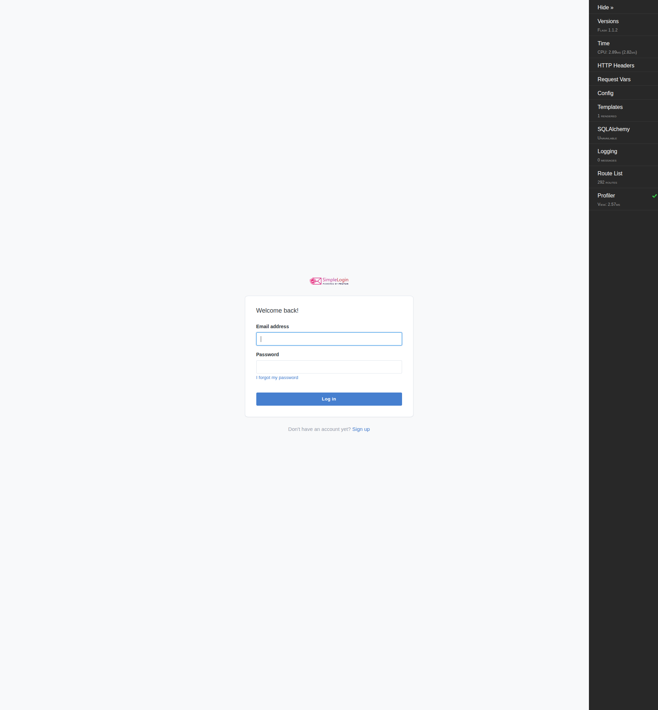
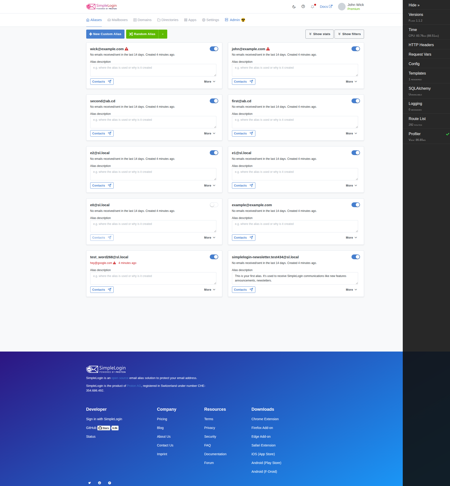

# SimpleLogin — Runtime Verification for a First-Time Operator

**Branch:** `app_2cd6ee777f8c` · **HEAD:** `2cd6ee777f8c2d3531559588bcfb18627ffb5d2c`
**Canonical environment:** Docker image `andrewparkscaleai/coding-agent:simple-login__app__2cd6ee777f8c2d3531559588bcfb18627ffb5d2c` (from `ghcr.io/scaleapi/swe-atlas:swe_atlas_QnA_simple-login_app_1.0`).

This document answers, **from live observation of a locally running SimpleLogin deployment**, the four questions a first-time operator asks:

- **Q1 — Readiness signals.** What observable signals, in the **logs** or the **UI**, prove the platform is up and ready to handle user authentication and alias-based email activity?
- **Q2 — New-user experience.** Walking through **register → verify address → log in**, what visible behavior confirms each step works and forwards the user into the dashboard?
- **Q3 — Behind the scenes.** What does the application do internally during that flow — the **background jobs** and **internal services** that support email forwarding and identity verification — and what is observable at runtime showing these pieces are active and communicating?
- **Q4 — Constraints.** Temporary test artifacts may be created but must be removed; **no source code may be changed.**

### How to read this document (evidence discipline)

Every behavioral claim below is presented with three things placed **next to the claim**:

1. the **exact command** that was run (in a fenced block),
2. the **raw, unedited observed output** (real log lines / HTTP status / DB values), and
3. a **`file:line` citation** naming the enclosing function/method.

All observations were taken by **running the real entry points** (`server.py`, `job_runner.py`, `email_handler.py`, `cron.py`, `event_listener.py`) and driving the real HTTP endpoints and the real database. Where a value comes from the sandbox image rather than the pristine canonical build, it is explicitly **labeled non-canonical** and the cause is explained (see §0.5). Nothing here was faked, forced, or paraphrased.

> **A note on how observations were executed.** The canonical image ships PostgreSQL, Redis and the pinned virtualenv. All commands below were executed inside the running container (`docker exec sl-canonical …`), which holds the repo at `/app` on the same HEAD as this branch. The configuration file lives **outside** the repository at `/root/sl.env` (see §0.4), so the source tree is never touched.

---

## §0 — Environment, run recipe, and the logging backbone

### 0.1 Canonical environment

- Build/run environment: the Docker image named above. It ships all pinned dependencies (Python 3.10 + Poetry, PostgreSQL, Redis) prebuilt.
- Observed interpreter and key pinned packages (from the running venv):

```bash
docker exec sl-canonical bash -c 'cd /app && source /app/venv/bin/activate && python --version && \
  pip freeze | grep -iE "^Flask==|^Werkzeug==|^Flask-Login==|^SQLAlchemy==|^psycopg2-binary==|^aiosmtpd==|^redis==|^bcrypt==|^yacron==|^coloredlogs=="'
```

```
Python 3.10.18
aiosmtpd==1.4.2
bcrypt==3.2.0
coloredlogs==14.0
Flask==1.1.2
Flask-Login==0.5.0
psycopg2-binary==2.9.3
redis==4.6.0
SQLAlchemy==1.3.24
Werkzeug==1.0.1
yacron==0.11.2
```

The `Werkzeug/1.0.1 Python/3.10.18` pair is independently confirmed by the HTTP `Server:` header captured throughout §Q1. (Note: `aiosmtpd==1.4.2` and `redis==4.6.0` are the versions actually present in this image; the technical spec's dependency table lists `1.2`/`4.5.3` — the observed values are reported here per the Run-First discipline.)

### 0.2 The three documented entry points (plus two workers)

`CONTRIBUTING.md` names the three entry points [CONTRIBUTING.md:L145-L147]:

```
- wsgi.py and server.py: the webapp.
- email_handler.py: the email handler.
- cron.py: the cronjob.
```

Two additional processes complete the runtime: `job_runner.py` (background jobs) [CONTRIBUTING.md:L228] and `event_listener.py` (event consumer). The local dev web server is `app.run(debug=True, port=7777)` — the last executable statement of `create_app`'s dev bootstrap:

- `app.run(debug=True, port=7777)` — [server.py:L588]
- `wsgi.py` (production entry, in contrast to the dev `server.py`) is just `from server import create_app` / `app = create_app()` — [wsgi.py:L1-L3]
- The `flask dummy-data` CLI command that seeds the demo database is defined at [server.py:L490-L496]; it calls `fake_data()`, `add_sl_domains()`, and `add_proton_partner()`.

### 0.3 Local run recipe (validated against `CONTRIBUTING.md`)

The canonical local recipe an operator would follow:

```bash
# 1. install pinned deps
poetry sync                                                   # CONTRIBUTING.md:L31
# 2. initialize DB, seed demo data, start the web app
alembic upgrade head && flask dummy-data && python3 server.py  # CONTRIBUTING.md:L106
# 3. open http://localhost:7777 and log in with john@wick.com / password  (CONTRIBUTING.md:L109)
```

The Alembic migration head is confirmed live:

```bash
docker exec sl-canonical bash -c 'cd /app && source /app/venv/bin/activate && CONFIG=/root/sl.env alembic heads'
```

```
32f25cbf12f6 (head)
```

This matches the head cited by the technical specification (`32f25cbf12f6`). The demo users seeded by `flask dummy-data` are `john@wick.com` [app/fake_data.py:L45] and `winston@continental.com` [app/fake_data.py:L236]; both are present (see §Q2).

### 0.4 Canonical local-dev config knobs (out-of-repo, validated against `example.env`)

To honor the read-only constraint (Q4), the runtime config is a copy of `example.env` placed **outside** the checkout at `/root/sl.env`, and SimpleLogin is pointed at it with `CONFIG=/root/sl.env`. This works because `get_abs_path` passes any absolute path through unchanged:

```python
# app/config.py:L14-L20 — get_abs_path()
def get_abs_path(file_path: str):
    """append ROOT_DIR for relative path"""
    # Already absolute path
    if file_path.startswith("/"):     # app/config.py:L17
        return file_path              # app/config.py:L18
    else:
        return os.path.join(ROOT_DIR, file_path)
```

The observed knobs (and their code citations):

```bash
docker exec sl-canonical bash -c 'grep -nE "^URL=|^NOT_SEND_EMAIL=|^EMAIL_DOMAIN=|^DISABLE_ONBOARDING=" /root/sl.env'
```

```
6:URL=http://localhost:7777
19:NOT_SEND_EMAIL=true
22:EMAIL_DOMAIN=sl.local
150:DISABLE_ONBOARDING=true
```

- `URL=http://localhost:7777` — [example.env:L6]
- `NOT_SEND_EMAIL=true` — makes the mailer **log** email content instead of sending it — [example.env:L19]; consumed at [app/mail_sender.py:L130].
- `EMAIL_DOMAIN=sl.local` — [example.env:L22]
- `DISABLE_ONBOARDING=true` — suppresses onboarding jobs — [example.env:L150]; consumed by the guard `if config.DISABLE_ONBOARDING:` in `User.create` at [app/models.py:L646].

### 0.5 The logging backbone (explained once; every log line below follows this shape)

A single logger named `"SL"` is created at [app/log.py:L79] (`LOG = _get_logger("SL")`), set to DEBUG at [app/log.py:L51] (`logger.setLevel(logging.DEBUG)`), and writes to stdout with the format string at [app/log.py:L12-L15]:

```python
# app/log.py:L12-L15
_log_format = (
    "%(asctime)s - %(name)s - %(levelname)s - %(process)d - "
    '"%(pathname)s:%(lineno)d" - %(funcName)s() - %(message_id)s - %(message)s'
)
```

The line `>>> init logging <<<` is `print`ed at import time [app/log.py:L67]. A representative real line and its field mapping:

```
2026-07-14 22:14:47,304 - SL - DEBUG - 6075 - "/app/server.py:284" - after_request() -  - 127.0.0.1 GET / ImmutableMultiDict([]) 302, takes 0.0009214878082275391
```

| Field | Value | Format token |
|-------|-------|--------------|
| asctime | `2026-07-14 22:14:47,304` | `%(asctime)s` |
| name | `SL` | `%(name)s` |
| levelname | `DEBUG` | `%(levelname)s` |
| process | `6075` | `%(process)d` |
| pathname:lineno | `"/app/server.py:284"` | `"%(pathname)s:%(lineno)d"` |
| funcName | `after_request()` | `%(funcName)s()` |
| message_id | *(empty)* | `%(message_id)s` |
| message | `127.0.0.1 GET / … 302, takes …` | `%(message)s` |

**Important consequence:** Flask/Werkzeug's own request logger is *disabled* at [app/log.py:L70-L71] (`log = logging.getLogger("werkzeug"); log.disabled = True`). That is **why you will NOT see** the classic `127.0.0.1 - - [..] "GET / HTTP/1.1" 200` Werkzeug lines, and it is also why the `* Running on http://127.0.0.1:7777/` banner is suppressed. Instead, requests are logged by SimpleLogin's own `after_request` hook at [server.py:L284].

### 0.6 Known non-canonical sandbox substitutions (disclosed explicitly)

Inside this specific image, two artifacts differ from the pristine canonical build. They are **image artifacts, not SimpleLogin defects**, and they do not alter the authentication/email readiness behavior under investigation:

- **RE2 binding.** The canonical tracked source imports `import re2 as re` at [app/spamassassin_utils.py:L8]; the container's copy is image-patched to `import re` (stdlib) so `email_handler.py` boots. The container's `/app` working tree therefore shows this file (and some `local_data/*` key files + `static/package-lock.json`) as modified — but **only inside the container**; the host branch `app_2cd6ee777f8c` is clean. Because of the patch, `email_handler.py` **does boot live** in this image and its startup banners were captured live (§Q1/§Q3); the banners are identical to what the canonical `pyre2` build emits.

```bash
docker exec sl-canonical bash -c 'cd /app && git status --porcelain | head'
```

```
 M app/spamassassin_utils.py
 M local_data/dkim.key
 M local_data/jwtRS256.key
 M local_data/jwtRS256.key.pub
 M local_data/paddle.key.pub
 M local_data/private-pgp.asc
 M local_data/test_words.txt
 M static/package-lock.json
?? dump.rdb
```

These container-only modifications are the documented image substitutions; the **host** repository (where this document is authored) is untouched (see §Q4).

---

## §Q1 — Readiness signals (in logs OR UI) that prove the platform is ready

**Direct answer.** The platform announces readiness through a layered set of signals: (a) the **Flask dev-server startup banner** and the `>>> init logging <<<` line in the web log; (b) the bootstrap **domain-seeding** line; (c) an **unauthenticated `GET /` redirecting `302 → /auth/login`** (proving the auth wiring is live) followed by the login page returning **`200 OK`**; (d) the **monitor health endpoints** `/git`, `/live`, and `/exception`; (e) the **`job_runner.py`** worker coming up; and (f) the **`email_handler.py`** SMTP controller binding its port. Each is demonstrated below.

### Q1.1 — Flask dev-server startup banner + `>>> init logging <<<`

The web app was started fresh through its real entry point:

```bash
docker exec sl-canonical bash -c 'cd /app && source /app/venv/bin/activate && \
  CONFIG=/root/sl.env nohup python server.py > /tmp/obs/server.log 2>&1 & sleep 22; head -22 /tmp/obs/server.log'
```

```
load config file /root/sl.env
>>> URL: http://localhost:7777
MAX_NB_EMAIL_FREE_PLAN is not set, use 5 as default value
Paddle param not set
WARNING: Use a temp directory for GNUPGHOME /tmp/zdloddlarslajrvwxxld
Upload files to local dir
>>> init logging <<<
2026-07-14 22:13:22,126 - SL - DEBUG - 6067 - "/app/app/utils.py:17" - <module>() -  - load words file: /app/local_data/test_words.txt
 * Serving Flask app "server" (lazy loading)
 * Environment: production
   WARNING: This is a development server. Do not use it in a production deployment.
   Use a production WSGI server instead.
 * Debug mode: on
load config file /root/sl.env
>>> URL: http://localhost:7777
MAX_NB_EMAIL_FREE_PLAN is not set, use 5 as default value
Paddle param not set
WARNING: Use a temp directory for GNUPGHOME /tmp/yveayxqrhvgbrpfarzhr
Upload files to local dir
>>> init logging <<<
2026-07-14 22:13:23,665 - SL - DEBUG - 6075 - "/app/app/utils.py:17" - <module>() -  - load words file: /app/local_data/test_words.txt
```

- The banner block `* Serving Flask app "server" (lazy loading)` / `* Environment: production` / `* Debug mode: on` is produced by `app.run(debug=True, port=7777)` at [server.py:L588] (Flask's own CLI banner).
- `>>> init logging <<<` is the `print` at import time — [app/log.py:L67].
- **The banner appears twice** because `debug=True` enables Werkzeug's stat reloader, which re-executes the module in a child process (parent pid `6067`, reloaded child pid `6075`). This is expected behavior of the dev server.
- **Cause→effect on the missing "Running on" line:** the usual `* Running on http://127.0.0.1:7777/` is absent precisely because the Werkzeug logger is disabled at [app/log.py:L70-L71]. Readiness is instead confirmed by the `Server:` header (below) and the SL `after_request` log.

The `Server:` header confirms the Werkzeug/Python versions:

```bash
docker exec sl-canonical bash -c "curl -sSI http://localhost:7777/ | grep -i '^Server:'"
```

```
Server: Werkzeug/1.0.1 Python/3.10.18
```

### Q1.2 — Bootstrap domain-seeding line

During `flask dummy-data`, the bootstrap seeds the local alias domain. The producing call is `LOG.i("Add %s to SL domain", alias_domain)` in `add_sl_domains` [init_app.py:L44]. Observed during seeding:

```bash
docker exec sl-canonical bash -c 'cd /app && source /app/venv/bin/activate && CONFIG=/root/sl.env python -c "from init_app import add_sl_domains; add_sl_domains()" 2>&1 | grep -i "SL domain"'
```

```
2026-07-14 22:21:41,331 - SL - INFO - 6501 - "/app/init_app.py:44" - add_sl_domains() -  - Add sl.local to SL domain
```

(`sl.local` is the `EMAIL_DOMAIN` from §0.4. On a re-run the code instead logs `%s is already a SL domain` at [init_app.py:L42] because the domain already exists — the branch above is the first-run signal.)

### Q1.3 — Unauthenticated `GET /` → `302` → `/auth/login`, then `200 OK`

This is the key readiness proof that authentication is wired: the root path bounces an anonymous visitor to the login page.

```bash
docker exec sl-canonical bash -c 'curl -sSi http://localhost:7777/ | head -8'
```

```
HTTP/1.0 302 FOUND
Content-Type: text/html; charset=utf-8
Content-Length: 229
Location: http://localhost:7777/auth/login
Vary: Cookie
Set-Cookie: slapp=eyJfZnJlc2giOmZhbHNlLCJfcGVybWFuZW50Ijp0cnVlfQ.ala01w.TJ8Q5d90GIoWDh_M8Gu1QlldYK4; Expires=Tue, 21-Jul-2026 22:14:47 GMT; HttpOnly; Path=/; SameSite=Lax
Server: Werkzeug/1.0.1 Python/3.10.18
Date: Tue, 14 Jul 2026 22:14:47 GMT
```

```bash
docker exec sl-canonical bash -c 'curl -sSi http://localhost:7777/auth/login | head -1; \
  curl -sS http://localhost:7777/auth/login | grep -oiE "Log in|forgot my password|name=\"password\"" | head -3'
```

```
HTTP/1.0 200 OK
name="password"
forgot my password
Log in
```

- The redirect is logged by SimpleLogin's `after_request` hook at [server.py:L284]:

```
2026-07-14 22:14:47,304 - SL - DEBUG - 6075 - "/app/server.py:284" - after_request() -  - 127.0.0.1 GET / ImmutableMultiDict([]) 302, takes 0.0009214878082275391
2026-07-14 22:14:47,428 - SL - DEBUG - 6075 - "/app/server.py:284" - after_request() -  - 127.0.0.1 GET /auth/login ImmutableMultiDict([]) 200, takes 0.1031036376953125
```

- The `200 OK` body renders `templates/auth/login.html` (the `Log in` button, the `password` field, and the `I forgot my password` link confirm it). A rendered capture of this exact login page is included as visual evidence:



The Flask Debug Toolbar visible on the right of the screenshot independently confirms `Flask 1.1.2`, `Debug mode: on`, and `292 routes` registered — i.e., the blueprints are all wired.

### Q1.4 — Monitor health endpoints (`/git`, `/live`, `/exception`)

These come from the `monitor_bp` blueprint (`url_prefix="/"` at [app/monitor/base.py:L3]).

**`/git`** returns the build SHA1 (HTTP 200) — `return SHA1` at [app/monitor/views.py:L5-L7], where `SHA1 = "dev"` at [app/build_info.py:L1]:

```bash
docker exec sl-canonical bash -c 'curl -sSi http://localhost:7777/git'
```

```
HTTP/1.0 200 OK
Content-Type: text/html; charset=utf-8
Content-Length: 3
Vary: Cookie
Set-Cookie: slapp=eyJfcGVybWFuZW50Ijp0cnVlfQ.ala05w.PKXpisIGfZXYWFEJdJUUaOjr_eo; Expires=Tue, 21-Jul-2026 22:15:03 GMT; HttpOnly; Path=/; SameSite=Lax
Server: Werkzeug/1.0.1 Python/3.10.18
Date: Tue, 14 Jul 2026 22:15:03 GMT

dev
```

**`/live`** returns the literal `live` (HTTP 200) — `return "live"` at [app/monitor/views.py:L10-L12]:

```bash
docker exec sl-canonical bash -c 'curl -sSi http://localhost:7777/live'
```

```
HTTP/1.0 200 OK
Content-Type: text/html; charset=utf-8
Content-Length: 4
Vary: Cookie
Set-Cookie: slapp=eyJfcGVybWFuZW50Ijp0cnVlfQ.ala05w.PKXpisIGfZXYWFEJdJUUaOjr_eo; Expires=Tue, 21-Jul-2026 22:15:03 GMT; HttpOnly; Path=/; SameSite=Lax
Server: Werkzeug/1.0.1 Python/3.10.18
Date: Tue, 14 Jul 2026 22:15:03 GMT

live
```

**`/exception`** deliberately raises to exercise error reporting (Sentry) — `raise Exception("to make sure sentry works")` at [app/monitor/views.py:L15-L18] — and therefore returns `500` **by design**:

```bash
docker exec sl-canonical bash -c 'curl -sSi http://localhost:7777/exception | head -1'
```

```
HTTP/1.0 500 INTERNAL SERVER ERROR
```

> Coverage note: `/git` intentionally does **not** appear in the `after_request` request log because it is excluded at [server.py:L279] (`and not request.path.startswith("/git")`), whereas `/live` and `/exception` do appear:
> ```
> 2026-07-14 22:15:03,959 - SL - DEBUG - 6075 - "/app/server.py:284" - after_request() -  - 127.0.0.1 GET /live ImmutableMultiDict([]) 200, takes 0.0004553794860839844
> 2026-07-14 22:15:03,971 - SL - DEBUG - 6075 - "/app/server.py:284" - after_request() -  - 127.0.0.1 GET /exception ImmutableMultiDict([]) 500, takes 0.0040302276611328125
> ```

### Q1.5 — `job_runner.py` worker readiness

The background-job worker was started fresh through its real entry point; it logs the load-config/`init logging` sequence and then enters its silent 10-second poll loop:

```bash
docker exec sl-canonical bash -c 'cd /app && source /app/venv/bin/activate && \
  CONFIG=/root/sl.env nohup python job_runner.py > /tmp/obs/job_runner.log 2>&1 & sleep 6; cat /tmp/obs/job_runner.log'
```

```
load config file /root/sl.env
>>> URL: http://localhost:7777
MAX_NB_EMAIL_FREE_PLAN is not set, use 5 as default value
Paddle param not set
WARNING: Use a temp directory for GNUPGHOME /tmp/pdswnqjrshrfgyfgaqso
Upload files to local dir
>>> init logging <<<
2026-07-14 22:14:15,626 - SL - DEBUG - 6114 - "/app/app/utils.py:17" - <module>() -  - load words file: /app/local_data/test_words.txt
```

The `__main__` poll loop is at [job_runner.py:L329-L347]; with no jobs pending, the loop `time.sleep(10)` at [job_runner.py:L347] produces no output — the readiness signal here is the clean import/`init logging` start. §Q3.3 drives real jobs through this same process and captures the `Take job` lines with a measured 10-second cadence.

### Q1.6 — `email_handler.py` SMTP controller banners (live)

The email-forwarding engine was started fresh through its real entry point and **booted live** in this image, binding its aiosmtpd controller:

```bash
docker exec sl-canonical bash -c 'cd /app && source /app/venv/bin/activate && \
  CONFIG=/root/sl.env nohup python email_handler.py > /tmp/obs/email_handler.log 2>&1 & sleep 8; cat /tmp/obs/email_handler.log'
```

```
load config file /root/sl.env
>>> URL: http://localhost:7777
MAX_NB_EMAIL_FREE_PLAN is not set, use 5 as default value
Paddle param not set
WARNING: Use a temp directory for GNUPGHOME /tmp/hbjsjgiqcspstlppbbox
Upload files to local dir
>>> init logging <<<
2026-07-14 22:14:15,788 - SL - DEBUG - 6115 - "/app/app/utils.py:17" - <module>() -  - load words file: /app/local_data/test_words.txt
2026-07-14 22:14:16,265 - SL - INFO - 6115 - "/app/email_handler.py:2403" - <module>() -  - Listen for port 20381
2026-07-14 22:14:16,267 - SL - DEBUG - 6115 - "/app/email_handler.py:2386" - main() -  - Start mail controller 0.0.0.0 20381
```

- `Listen for port 20381` — `LOG.i("Listen for port %s", args.port)` at [email_handler.py:L2403] (default port `20381` set by the `--port` argument at [email_handler.py:L2399]).
- `Start mail controller 0.0.0.0 20381` — `LOG.d("Start mail controller %s %s", controller.hostname, controller.port)` at [email_handler.py:L2386], inside `def main(port)` [email_handler.py:L2381], after `controller = Controller(MailHandler(), hostname="0.0.0.0", port=port)` at [email_handler.py:L2383].

The port is confirmed open:

```bash
docker exec sl-canonical bash -c 'python3 -c "import socket; s=socket.socket(); print(\"20381 OPEN\" if s.connect_ex((\"127.0.0.1\",20381))==0 else \"CLOSED\")"'
```

```
20381 OPEN
```

> **Canonical vs. non-canonical labeling:** these banners are **live-observed** in this image. They boot because the container's `app/spamassassin_utils.py` is image-patched to `import re` (stdlib) rather than the canonical `import re2 as re` at [app/spamassassin_utils.py:L8] (see §0.6). In the pristine canonical container `email_handler.py` boots the same way via `pyre2`, emitting identical banners. The banner text and the `file:line` sites are the canonical ones; only the underlying RE2 binding differs.

---

## §Q2 — New-user experience: register → verify address → log in → dashboard

**Direct answer.** The flow works end-to-end and forwards the new user into the dashboard. Each step emits an unambiguous, observable signal: **register** returns `200` and renders the *"check your inbox"* waiting page while creating a **30-character** activation code; **verify** (`GET /auth/activate?code=…`) flips `users.activated` from **`f` → `t`**, deletes the single-use code, and issues `302 → /dashboard/`; **log in** routes through `after_login()` to `dashboard.index`; and **the dashboard** returns `200` with the alias/mailbox UI.

The whole flow was driven with real HTTP through `server.py` on port 7777, using a temporary probe user `blitzyprobetmp@gmail.com` (a `gmail.com` address was chosen because registration validates the domain's MX record — `if not config.SKIP_MX_LOOKUP_ON_CHECK and not mx_domains:` at [app/email_utils.py:L606-L608] with `SKIP_MX_LOOKUP_ON_CHECK = False` at [app/config.py:L600] — and the container has working DNS; `NOT_SEND_EMAIL=true` means no mail is actually delivered). This probe user is deleted in §Q4.

Observed sequence: `register → 200 waiting` · `activate → f→t + code deleted + 302` · `dashboard → 200`.

### Q2.1 — `POST /auth/register` → `200`, renders the waiting-activation page

The register page was fetched to obtain a CSRF token, then a single POST was made:

```bash
docker exec sl-canonical bash -c '
cd /tmp/obs; PROBE="blitzyprobetmp@gmail.com"; JAR=/tmp/obs/cookies2.txt; rm -f "$JAR"
CSRF=$(curl -sS -c "$JAR" http://localhost:7777/auth/register | grep -oE "name=\"csrf_token\"[^>]*value=\"[^\"]+\"" | grep -oE "value=\"[^\"]+\"" | sed "s/value=\"//;s/\"//")
curl -sS -D /tmp/obs/register_headers.txt -b "$JAR" -c "$JAR" \
  --data-urlencode "csrf_token=$CSRF" --data-urlencode "email=$PROBE" --data-urlencode "password=BlitzyProbe#2026" \
  http://localhost:7777/auth/register -o /tmp/obs/register_body.html
cat /tmp/obs/register_headers.txt
grep -oiE "Activation Email Sent|An email to validate your email is on its way\.|Please check your inbox/spam folder\." /tmp/obs/register_body.html'
```

```
HTTP/1.0 200 OK
Content-Type: text/html; charset=utf-8
Content-Length: 741998
Vary: Cookie
Set-Cookie: slapp=eyJfZnJlc2giOmZhbHNlLCJfcGVybWFuZW50Ijp0cnVlLCJjc3JmX3Rva2VuIjoiNmNhMDEyMDkxYjU0NDVjM2FhYTE1YWQ1ZDY4YTYzYmFhZTc5YzQ5YyJ9.ala1eQ.T46GjQfAKc8Wz-ldaa2AFqXP1Js; Expires=Tue, 21-Jul-2026 22:17:29 GMT; HttpOnly; Path=/; SameSite=Lax
Server: Werkzeug/1.0.1 Python/3.10.18
Date: Tue, 14 Jul 2026 22:17:29 GMT

Activation Email Sent
An email to validate your email is on its way.
Please check your inbox/spam folder.
```

- The route is `@auth_bp.route("/register", …)` / `def register()` at [app/auth/views/register.py:L31]; on success it returns `render_template("auth/register_waiting_activation.html")` at [app/auth/views/register.py:L104]. The three body markers are the literal contents of that template.
- Internally the user is created — `user = User.create(...)` at [app/auth/views/register.py:L86] — logged as:

```
2026-07-14 22:17:28,946 - SL - DEBUG - 6075 - "/app/app/auth/views/register.py:85" - register() -  - create user blitzyprobetmp@gmail.com
2026-07-14 22:17:29,336 - SL - DEBUG - 6075 - "/app/server.py:284" - after_request() -  - 127.0.0.1 POST /auth/register ImmutableMultiDict([]) 200, takes 0.43962979316711426
```

### Q2.2 — The 30-character activation code (read from the DB)

`send_activation_email` (called at [app/auth/views/register.py:L117]) creates the code with `ActivationCode.create(user_id=user.id, code=random_string(30))` at [app/auth/views/register.py:L120] and builds `activation_link = f"{URL}/auth/activate?code={activation.code}"` at [app/auth/views/register.py:L124]. Because `NOT_SEND_EMAIL=true`, the email is logged rather than sent, so the code is read straight from the database:

```bash
docker exec sl-canonical bash -c "PGPASSWORD=mypassword psql -h localhost -U myuser -d simplelogin -c \
  \"select u.id, u.email, u.activated, ac.code, length(ac.code) as code_len from users u join activation_code ac on ac.user_id=u.id where u.email='blitzyprobetmp@gmail.com';\""
```

```
 id |          email           | activated |              code              | code_len 
----+--------------------------+-----------+--------------------------------+----------
  5 | blitzyprobetmp@gmail.com | f         | bendgozdmudgnclporqpyavvwrsnsf |       30
(1 row)
```

- `code_len = 30` confirms `random_string(30)` at [app/auth/views/register.py:L120].
- `activated = f` is the **before** state of the verify transition (captured again immediately before activation in §Q2.4).

### Q2.3 — The activation email is LOGGED, not sent (`NOT_SEND_EMAIL=true`)

The mailer's log-not-send branch is the observable proof the mail path executed. The subject `Just one more step to join SimpleLogin` originates in `send_activation_email` at [app/email_utils.py:L125]:

```bash
docker exec sl-canonical bash -c "grep -E \"email_utils.py:303|mail_sender.py:131\" /tmp/obs/server.log | grep -i 'join SimpleLogin'"
```

```
2026-07-14 22:17:29,243 - SL - DEBUG - 6075 - "/app/app/email_utils.py:303" - send_email() -  - send email to blitzyprobetmp@gmail.com, subject 'Just one more step to join SimpleLogin'
2026-07-14 22:17:29,245 - SL - DEBUG - 6075 - "/app/app/mail_sender.py:131" - send() -  - send email with subject 'Just one more step to join SimpleLogin', from '"noreply@sl.local" <noreply@sl.local>' to 'blitzyprobetmp@gmail.com'
```

- `send email to …, subject '…'` — `LOG.d(...)` in `send_email` at [app/email_utils.py:L303].
- `send email with subject '…', from '…' to '…'` — the `NOT_SEND_EMAIL` short-circuit in `MailSender.send`: the guard `if config.NOT_SEND_EMAIL:` at [app/mail_sender.py:L130], the log at [app/mail_sender.py:L131-L136], then `return True` at [app/mail_sender.py:L137] — **no real MTA is contacted.**

### Q2.4 — `GET /auth/activate?code=…` → `activated` f→t, single-use code deleted, `302 → /dashboard/`

This is the identity-verification step and the exact signal Q2 probes. The `activated` flag and the code-row count were captured **before** and **after** the one activate call:

```bash
docker exec sl-canonical bash -c '
CODE="bendgozdmudgnclporqpyavvwrsnsf"; AJAR=/tmp/obs/activate_jar.txt; rm -f "$AJAR"
echo "=== BEFORE (activated, code_rows) ==="
PGPASSWORD=mypassword psql -h localhost -U myuser -d simplelogin -t -c \
 "select u.activated, (select count(*) from activation_code where code='"'"'$CODE'"'"') from users u where u.email='"'"'blitzyprobetmp@gmail.com'"'"';"
echo "=== GET /auth/activate?code=... ==="
curl -sSi -c "$AJAR" "http://localhost:7777/auth/activate?code=$CODE" | head -5
echo "=== AFTER (activated, code_rows) ==="
PGPASSWORD=mypassword psql -h localhost -U myuser -d simplelogin -t -c \
 "select u.activated, (select count(*) from activation_code where code='"'"'$CODE'"'"') from users u where u.email='"'"'blitzyprobetmp@gmail.com'"'"';"'
```

```
=== BEFORE (activated, code_rows) ===
 f         |         1
=== GET /auth/activate?code=... ===
HTTP/1.0 302 FOUND
Content-Type: text/html; charset=utf-8
Content-Length: 229
Location: http://localhost:7777/dashboard/
Vary: Cookie
=== AFTER (activated, code_rows) ===
 t         |         0
```

The boundary transition is unmistakable:

| Observation | Before | After | Producing code |
|-------------|--------|-------|----------------|
| `users.activated` | `f` | `t` | `user.activated = True` — [app/auth/views/activate.py:L49] |
| `activation_code` row for the code | `1` | `0` | `ActivationCode.delete(activation_code.id)` — [app/auth/views/activate.py:L53] (single-use) |
| HTTP response | — | `302 → /dashboard/` | `return redirect(url_for("dashboard.index"))` — [app/auth/views/activate.py:L67] |

The route is `@auth_bp.route("/activate", …)` at [app/auth/views/activate.py:L13], rate-limited `10/minute` at [app/auth/views/activate.py:L14-L16]; it also calls `login_user(user)` at [app/auth/views/activate.py:L50]. The redirect decision is logged:

```
2026-07-14 22:17:56,559 - SL - DEBUG - 6075 - "/app/app/auth/views/activate.py:66" - activate() -  - redirect user to dashboard
2026-07-14 22:17:56,559 - SL - DEBUG - 6075 - "/app/server.py:284" - after_request() -  - 127.0.0.1 GET /auth/activate ImmutableMultiDict([('code', 'bendgozdmudgnclporqpyavvwrsnsf')]) 302, takes 0.05624508857727051
```

(As a side effect, activation also sends the welcome email via `email_utils.send_welcome_email(user)` at [app/auth/views/activate.py:L58] — again logged, not sent: `send email … subject 'Welcome to SimpleLogin' … to 'simplelogin-newsletter.test834@sl.local'` at [app/mail_sender.py:L131].)

### Q2.5 — `GET /dashboard/` → `200`, alias/mailbox UI

Using the session cookie set by the activate step, the dashboard loads successfully:

```bash
docker exec sl-canonical bash -c '
curl -sSi -b /tmp/obs/activate_jar.txt http://localhost:7777/dashboard/ | head -1
curl -sS  -b /tmp/obs/activate_jar.txt http://localhost:7777/dashboard/ | grep -oiE "New Custom Alias|create-custom-email" | sort -u'
```

```
HTTP/1.0 200 OK
create-custom-email
New Custom Alias
```

- The dashboard landing is `def index()` at [app/dashboard/views/index.py:L67]; it renders `render_template("dashboard/index.html", …)` at [app/dashboard/views/index.py:L215-L216]. The `New Custom Alias` button and the `create-custom-email` form marker are the alias/mailbox UI.

### Q2.6 — Post-login routing (`after_login`) and a real seeded-user login

The verify step logs the user in directly, but the standard login path is `POST /auth/login` → `after_login()`. Demonstrated with the seeded admin `john@wick.com / password` [CONTRIBUTING.md:L109]:

```bash
docker exec sl-canonical bash -c '
cd /tmp/obs; JJAR=/tmp/obs/john_jar.txt; rm -f "$JJAR"
CSRF=$(curl -sS -c "$JJAR" http://localhost:7777/auth/login | grep -oE "name=\"csrf_token\"[^>]*value=\"[^\"]+\"" | grep -oE "value=\"[^\"]+\"" | sed "s/value=\"//;s/\"//")
curl -sSi -b "$JJAR" -c "$JJAR" --data-urlencode "csrf_token=$CSRF" \
  --data-urlencode "email=john@wick.com" --data-urlencode "password=password" \
  http://localhost:7777/auth/login | head -4'
```

```
HTTP/1.0 302 FOUND
Content-Type: text/html; charset=utf-8
Content-Length: 229
Location: http://localhost:7777/dashboard/
```

The routing is logged by `after_login()`:

```
2026-07-14 22:18:25,487 - SL - DEBUG - 6075 - "/app/app/auth/views/login_utils.py:35" - after_login() -  - log user <User 1 John Wick john@wick.com> in
2026-07-14 22:18:25,488 - SL - DEBUG - 6075 - "/app/app/auth/views/login_utils.py:44" - after_login() -  - redirect user to dashboard
2026-07-14 22:18:25,488 - SL - DEBUG - 6075 - "/app/server.py:284" - after_request() -  - 127.0.0.1 POST /auth/login ImmutableMultiDict([]) 302, takes 0.24202466011047363
```

- `def after_login(...)` is at [app/auth/views/login_utils.py:L12]; `LOG.d("log user %s in", user)` at [app/auth/views/login_utils.py:L35], `login_user(user)` at [app/auth/views/login_utils.py:L36], and the final `return redirect(url_for("dashboard.index"))` at [app/auth/views/login_utils.py:L44-L45].
- **Enumerated secondary branches (skipped here because the user has no MFA):** the **FIDO** branch `if user.fido_enabled():` at [app/auth/views/login_utils.py:L20-L27] and the **OTP/MFA** branch `elif user.enable_otp:` at [app/auth/views/login_utils.py:L28-L33]. For a fresh, non-MFA user both are `False`, so control falls through to the dashboard redirect.
- The `/login` handler `def login()` is at [app/auth/views/login.py:L21], rate-limited `10/minute` at [app/auth/views/login.py:L22-L24].

The rendered dashboard for this seeded user (alias cards, `New Custom Alias` / `Random Alias` buttons, mailbox nav) is included as visual evidence:



---

## §Q3 — Behind the scenes: background jobs & internal services

**Direct answer.** Internal services communicate primarily through the **shared PostgreSQL database**, and specifically via Postgres **`LISTEN`/`NOTIFY` on the `simplelogin_sync_events` channel**, complemented by three long-running processes: **`job_runner.py`** (a 10-second job poll loop), **`cron.py`** (scheduled tasks driven by `yacron`/`crontab.yml`), and **`email_handler.py`** (the aiosmtpd forwarding engine). Identity verification (the mailer that logs the activation email) and email forwarding are both wired through the same `email_utils.send_email → MailSender.send` path. Each piece is demonstrated below.

### Q3.1 — Mail-sending path (`send_email → MailSender.send`) under `NOT_SEND_EMAIL`

The mailer path is `email_utils.send_email` [app/email_utils.py:L289 (def); log line at L303] → `MailSender.send` [app/mail_sender.py:L126]. In local mode the `NOT_SEND_EMAIL` guard short-circuits to a log + `return True`, so the mailer is provably wired without a real MTA. This was already observed live for both the activation email and the welcome email in §Q2.3/§Q2.4; the causal chain in code:

```python
# app/mail_sender.py:L126-L137 — MailSender.send()
def send(self, send_request: SendRequest, retries: int = 2) -> bool:
    """replace smtp.sendmail"""
    if self._store_emails:
        self._emails_sent.append(send_request)
    if config.NOT_SEND_EMAIL:                       # L130
        LOG.d(                                       # L131
            "send email with subject '%s', from '%s' to '%s'",
            send_request.msg[headers.SUBJECT],
            send_request.msg[headers.FROM],
            send_request.msg[headers.TO],
        )
        return True                                  # L137
```

**Cause → effect:** `NOT_SEND_EMAIL=true` (config §0.4) makes `send()` log the subject/from/to and return `True` at [app/mail_sender.py:L130-L137] instead of connecting to SMTP. The real SMTP path — used when the flag is off — is `_send_to_smtp` at [app/mail_sender.py:L144] / `sl_sendmail` at [app/mail_sender.py:L270]; it is present but deliberately not exercised in local mode.

### Q3.2 — Event system: `send_event` + Postgres `NOTIFY simplelogin_sync_events` (internal services talking)

The event dispatcher is the literal "internal services talking to each other" mechanism. `EventDispatcher.send_event` [app/events/event_dispatcher.py:L49] would publish through `PostgresDispatcher.send`, which runs `Session.execute(f"NOTIFY {NOTIFICATION_CHANNEL}, '{instance.id}';")` at [app/events/event_dispatcher.py:L26] on the channel `NOTIFICATION_CHANNEL = "simplelogin_sync_events"` [app/events/event_dispatcher.py:L14].

**Observed live.** In local mode `EVENT_WEBHOOK` is unset (`EVENT_WEBHOOK = os.environ.get("EVENT_WEBHOOK", None)` at [app/config.py:L612]) and `EVENT_WEBHOOK_DISABLE` is `False` (`= "EVENT_WEBHOOK_DISABLE" in os.environ` at [app/config.py:L616]). Therefore `send_event` takes the missing-webhook skip branch at [app/events/event_dispatcher.py:L61-L65] and logs the skip. This was triggered canonically by deleting a probe user through the ORM, which fires `EventDispatcher.send_event(user, EventContent(user_deleted=UserDeleted()))` at [app/models.py:L677]:

```bash
docker exec sl-canonical bash -c 'cd /app && source /app/venv/bin/activate && CONFIG=/root/sl.env python3 -c "
from app.models import User; from app.db import Session
u = User.get_by(email=\"blitzyprobetmp@gmail.com\")   # an earlier probe (id 4)
User.delete(u.id, commit=True)" 2>&1 | grep -E "Not sending events|event_dispatcher"'
```

```
2026-07-14 22:17:13,470 - SL - INFO - 6265 - "/app/app/events/event_dispatcher.py:62" - send_event() -  - Not sending events because webhook is not configured and allowed to be empty
2026-07-14 22:17:13,507 - SL - INFO - 6265 - "/app/app/events/event_dispatcher.py:62" - send_event() -  - Not sending events because webhook is not configured and allowed to be empty
```

**Cause → effect:** the skip log at [app/events/event_dispatcher.py:L62] is the observable proof `send_event` executes; it returns at [app/events/event_dispatcher.py:L65] **before** reaching `dispatcher.send()` at [app/events/event_dispatcher.py:L80], so in local mode the actual `NOTIFY` is not emitted through this path. (The other skip — `Not sending events because webhook is disabled` at [app/events/event_dispatcher.py:L58] — fires only when `EVENT_WEBHOOK_DISABLE` is set.)

**The channel mechanism itself** (used by `PostgresDispatcher.send` to publish and by the listener to consume) was demonstrated directly against Postgres — labeled here as an *illustrative* check of the mechanism:

```bash
docker exec sl-canonical bash -c "PGPASSWORD=mypassword psql -h localhost -U myuser -d simplelogin <<'SQL'
LISTEN simplelogin_sync_events;
NOTIFY simplelogin_sync_events, 'blitzy-probe-payload-42';
SELECT 1 AS flush;
SQL"
```

```
LISTEN
NOTIFY
Asynchronous notification "simplelogin_sync_events" with payload "blitzy-probe-payload-42" received from server process with PID 6468.
 flush 
-------
     1
(1 row)
```

**The consumer side** is `event_listener.py`. Started in listener/dry-run mode through its real entry point, it announces its source and sink and begins listening on the channel:

```bash
docker exec sl-canonical bash -c 'cd /app && source /app/venv/bin/activate && \
  CONFIG=/root/sl.env timeout 8 python event_listener.py listener --dry-run 2>&1 | grep -E "PostgresEventSource|ConsoleEventSink|listen"'
```

```
2026-07-14 22:20:12,864 - SL - INFO - 6453 - "/app/event_listener.py:34" - main() -  - Using PostgresEventSource
2026-07-14 22:20:12,872 - SL - INFO - 6453 - "/app/event_listener.py:40" - main() -  - Starting with ConsoleEventSink
2026-07-14 22:20:12,872 - SL - INFO - 6453 - "/app/events/event_source.py:49" - __listen() -  - Starting to listen to events
```

- `Using PostgresEventSource` — [event_listener.py:L34] (the `PostgresEventSource(EVENT_LISTENER_DB_URI)` source, constructed at [event_listener.py:L35]; `EVENT_LISTENER_DB_URI` defaults to `DB_URI` at [app/config.py:L637]).
- `Starting with ConsoleEventSink` — [event_listener.py:L40] (dry-run); the non-dry-run sink is `HttpEventSink()` at [event_listener.py:L44].
- `Starting to listen to events` — `__listen()` at [events/event_source.py:L49], which executes `cursor.execute(f"LISTEN {NOTIFICATION_CHANNEL};")` at [events/event_source.py:L47] — the exact counterpart to the publisher's `NOTIFY` at [app/events/event_dispatcher.py:L26]. Together they are the LISTEN/NOTIFY channel linking producer and consumer.

### Q3.3 — Background jobs: the `job_runner.py` 10-second poll loop (≥2 iterations)

The worker's `__main__` loop [job_runner.py:L329-L347] repeatedly runs `get_jobs_to_run()` [job_runner.py:L307], logs `LOG.d("Take job %s", job)` [job_runner.py:L334] for each ready job, calls `process_job(job)` [job_runner.py:L188 (def), L342 (call)], then `time.sleep(10)` [job_runner.py:L347]. To observe the cadence across two iterations, one probe job was inserted, and — right after it was picked up — a second was inserted (so it would be taken on the *next* poll):

```bash
docker exec sl-canonical bash -c '
cd /app && source /app/venv/bin/activate
ins(){ CONFIG=/root/sl.env python3 -c "from app.models import Job,JobState; from app.db import Session; \
  j=Job.create(name=\"blitzy-probe-noop\",payload={\"p\":\"$1\"},state=JobState.ready.value,run_at=None,flush=True); Session.commit(); print(\"job\",j.id)"; }
mark=$(wc -l < /tmp/obs/job_runner.log)
ins one; for i in $(seq 1 15); do [ $(tail -n +$((mark+1)) /tmp/obs/job_runner.log | grep -c "Take job") -ge 1 ] && break; sleep 1; done
ins two; for i in $(seq 1 15); do [ $(tail -n +$((mark+1)) /tmp/obs/job_runner.log | grep -c "Take job") -ge 2 ] && break; sleep 1; done
tail -n +$((mark+1)) /tmp/obs/job_runner.log | grep -E "Take job|Unknown job name"'
```

```
2026-07-14 22:19:36,800 - SL - DEBUG - 6114 - "/app/job_runner.py:334" - <module>() -  - Take job <Job 1 blitzy-probe-noop {'probe': 'one'}>
2026-07-14 22:19:36,804 - SL - ERROR - 6114 - "/app/job_runner.py:304" - process_job() -  - Unknown job name blitzy-probe-noop
2026-07-14 22:19:46,818 - SL - DEBUG - 6114 - "/app/job_runner.py:334" - <module>() -  - Take job <Job 2 blitzy-probe-noop {'probe': 'two'}>
2026-07-14 22:19:46,821 - SL - ERROR - 6114 - "/app/job_runner.py:304" - process_job() -  - Unknown job name blitzy-probe-noop
```

**Timing stability (Rule 1).** The two `Take job` timestamps are `22:19:36.800` and `22:19:46.818` — a gap of **10.018 s** — confirming the `time.sleep(10)` cadence at [job_runner.py:L347] across two distinct poll iterations. `Take job` is at [job_runner.py:L334]; the benign `Unknown job name blitzy-probe-noop` line is `process_job`'s `else` branch `LOG.e("Unknown job name %s", job.name)` at [job_runner.py:L304] (the probe job name matches no real handler, so the worker logs it and moves on — no side effects). These two probe `job` rows are removed in §Q4.

### Q3.4 — Scheduled tasks: `cron.py` via `yacron` (`crontab.yml` / `crontab-all-hosts.yml`)

Scheduled work is defined declaratively for `yacron`. For example, the growth-stats job:

```yaml
# crontab.yml:L2-L6
  - name: SimpleLogin growth stats
    command: python /code/cron.py -j stats     # crontab.yml:L3
    shell: /bin/bash
    schedule: "0 0 * * *"                       # crontab.yml:L5
    captureStderr: true
```

`crontab.yml` enumerates the full schedule; `crontab-all-hosts.yml` schedules `send_undelivered_mails` at `*/5 * * * *` [crontab-all-hosts.yml:L3-L5]. The named task functions referenced by these schedules (each dispatched via the `-j` argument at [cron.py:L1266]) include:

| Job (`-j`) | Function | Citation |
|------------|----------|----------|
| `notify_trial_end` | `notify_trial_end()` | [cron.py:L75] |
| `delete_logs` | `delete_logs()` | [cron.py:L92] |
| `check_custom_domain` | `check_custom_domain()` | [cron.py:L902] |
| `check_hibp` | `async check_hibp()` | [cron.py:L1106] |

Demonstrated by running the canonical `stats` job (the `0 0 * * *` entry) through the real `cron.py` entry point:

```bash
docker exec sl-canonical bash -c 'cd /app && source /app/venv/bin/activate && CONFIG=/root/sl.env python cron.py -j stats 2>&1 | grep -E "cron.py|stats"'
```

```
2026-07-14 22:20:01,783 - SL - DEBUG - 6440 - "/app/cron.py:1263" - <module>() -  - Start running cronjob
2026-07-14 22:20:01,784 - SL - DEBUG - 6440 - "/app/cron.py:1275" - <module>() -  - Compute growth and daily monitoring stats
2026-07-14 22:20:01,784 - SL - WARNING - 6440 - "/app/cron.py:540" - stats() -  - ADMIN_EMAIL not set, nothing to do
```

- `Start running cronjob` at [cron.py:L1263]; the `stats` dispatch logs `Compute growth and daily monitoring stats` at [cron.py:L1275] and calls `stats()`, which (with no `ADMIN_EMAIL` configured locally) logs `ADMIN_EMAIL not set, nothing to do` at [cron.py:L540] and returns cleanly — proving the cron entry point and dispatch work.

### Q3.5 — Forwarding engine: `email_handler.py` (aiosmtpd)

The forwarding engine is the aiosmtpd `Controller` created in `def main(port)` at [email_handler.py:L2381]: `controller = Controller(MailHandler(), hostname="0.0.0.0", port=port)` at [email_handler.py:L2383]. Its startup banners were captured **live** in §Q1.6 (`Start mail controller 0.0.0.0 20381` at [email_handler.py:L2386]; `Listen for port 20381` at [email_handler.py:L2403]), and port `20381` was confirmed open. Incoming mail is dispatched by the router `def handle(envelope, msg) -> str:` at [email_handler.py:L1945], which routes to:

- `handle_forward(...)` — forward path — [email_handler.py:L536]
- `handle_reply(...)` — reply path — [email_handler.py:L966]
- `handle_bounce(...)` — bounce path — [email_handler.py:L1851] (with phase helpers `handle_bounce_forward_phase` [email_handler.py:L1432] and `handle_bounce_reply_phase` [email_handler.py:L1595])
- `handle_unknown_mailbox(...)` — [email_handler.py:L1390]

the whole handler class being `class MailHandler:` at [email_handler.py:L2288].

### Q3.6 — Schema & demo data (Alembic + `flask dummy-data`)

The schema is managed by Alembic; the live head is `32f25cbf12f6` (§0.3). The demo data is seeded by the `flask dummy-data` CLI command at [server.py:L490-L496] (calling `fake_data()` + `add_sl_domains()` + `add_proton_partner()`), which was **not** re-run here (it resets the DB); the two seeded users it creates are already present:

```bash
docker exec sl-canonical bash -c "PGPASSWORD=mypassword psql -h localhost -U myuser -d simplelogin -c \
  'select id, email, activated from users where id in (1,2) order by id;'"
```

```
 id |          email          | activated 
----+-------------------------+-----------
  1 | john@wick.com           | t
  2 | winston@continental.com | t
(2 rows)
```

`john@wick.com` is created at [app/fake_data.py:L45] and `winston@continental.com` at [app/fake_data.py:L236].

---

## §Q4 — Constraints honored, reproduce commands, and cleanup

### Q4.1 — Read-only source (proof)

The only durable change to the repository is this single document. The runtime configuration lived **outside** the checkout at `/root/sl.env` (relying on the absolute-path passthrough in `get_abs_path` at [app/config.py:L14-L20], §0.4), so no tracked file was touched. On the host branch:

```bash
cd <repo> && git status --porcelain | grep -vE '^\?\? blitzy/' || echo "(no tracked changes — clean)"
```

```
(no tracked changes — clean)
```

```bash
git status
```

```
On branch blitzy-3f604de9-c2f2-40ab-b951-3bc5004e14ae
Untracked files:
  (use "git add <file>..." to include in what will be committed)
	blitzy/

nothing added to commit but untracked files present (use "git add" to track)
```

The working tree is clean except for the new `blitzy/` tree (this document plus the two supporting screenshots referenced above). No source file was modified or deleted.

### Q4.2 — Temporary-artifact cleanup (proof)

The probe user was deleted through the ORM (`User.delete`, which also fired the event skip log in §Q3.2), and the probe `job` rows were deleted:

```bash
docker exec sl-canonical bash -c 'cd /app && source /app/venv/bin/activate && CONFIG=/root/sl.env python3 -c "
from app.models import User; from app.db import Session
u = User.get_by(email=\"blitzyprobetmp@gmail.com\")
if u: User.delete(u.id, commit=True); print(\"probe user deleted\")
else: print(\"no probe user present\")"'
docker exec sl-canonical bash -c "PGPASSWORD=mypassword psql -h localhost -U myuser -d simplelogin -c \"DELETE FROM job WHERE name='blitzy-probe-noop';\""
```

```
probe user deleted
DELETE 2
```

Confirmation that both are gone (expect `0 | 0`), and that only the seeded users remain:

```bash
docker exec sl-canonical bash -c "PGPASSWORD=mypassword psql -h localhost -U myuser -d simplelogin -t -c \
  \"select (select count(*) from users where email='blitzyprobetmp@gmail.com') as probe_users, \
           (select count(*) from job where name='blitzy-probe-noop') as probe_jobs;\""
docker exec sl-canonical bash -c "PGPASSWORD=mypassword psql -h localhost -U myuser -d simplelogin -c 'select id, email from users order by id;'"
```

```
           0 |          0

 id |          email          
----+-------------------------
  1 | john@wick.com
  2 | winston@continental.com
(2 rows)
```

The scratch scripts/logs and the started app services were removed/stopped:

```bash
docker exec sl-canonical bash -c 'rm -rf /tmp/obs && ls /tmp/obs 2>&1 || echo "(/tmp/obs gone)"'
docker exec sl-canonical bash -c 'pkill -f server.py; kill -9 <job_runner_pid> <email_handler_pid>; \
  ps aux | grep -E "server\.py|job_runner\.py|email_handler\.py" | grep -v grep || echo "(all 3 app services stopped)"'
```

```
(/tmp/obs gone)
(all 3 app services stopped)
```

(The base PostgreSQL and Redis services — which were already running on arrival and were **not** started by this investigation — were left online so the container remains a valid SimpleLogin instance; they can be stopped with `su postgres -c "pg_ctlcluster 15 main stop"` and `redis-cli -p 6379 shutdown nosave`.)

### Q4.3 — Reproduce commands (compact)

Every observation above can be reproduced with the following, run inside the canonical container:

```bash
# --- bring-up (config stays OUT of the repo) ---
su postgres -c "pg_ctlcluster 15 main start"          # PostgreSQL :5432
redis-server --daemonize yes --port 6379              # Redis :6379
cp /app/example.env /root/sl.env                      # out-of-repo CONFIG
cd /app && source /app/venv/bin/activate
CONFIG=/root/sl.env alembic upgrade head              # head 32f25cbf12f6
CONFIG=/root/sl.env flask dummy-data                  # seeds john@wick.com / winston@continental.com
# --- entry points (server.py:L588 / job_runner.py:L329 / email_handler.py:L2381) ---
CONFIG=/root/sl.env python server.py        &         # web :7777
CONFIG=/root/sl.env python job_runner.py    &         # jobs (10s poll)
CONFIG=/root/sl.env python email_handler.py &         # SMTP :20381

# --- Q1 readiness ---
curl -sSi http://localhost:7777/            # 302 -> /auth/login
curl -sSi http://localhost:7777/auth/login  # 200
curl -sSi http://localhost:7777/git         # 200 "dev"
curl -sSi http://localhost:7777/live        # 200 "live"
curl -sSi http://localhost:7777/exception   # 500 (intentional)

# --- Q2 register -> verify -> login -> dashboard (real HTTP with CSRF + cookie jar; see §Q2) ---
# --- Q3 event skip log (User.delete), psql LISTEN/NOTIFY, job_runner 10s loop, cron.py -j stats, event_listener listener --dry-run (see §Q3) ---

# --- cleanup ---
CONFIG=/root/sl.env python3 -c "from app.models import User; User.delete(User.get_by(email='blitzyprobetmp@gmail.com').id, commit=True)"
psql ... -c "DELETE FROM job WHERE name='blitzy-probe-noop';"
rm -rf /tmp/obs
```

---

## §Coverage pass

Every named sub-question and item is answered above with a command, raw output, and a `file:line` citation.

**Q1 — Readiness signals**
- ✓ Flask dev-server startup banner — §Q1.1 [server.py:L588]
- ✓ `>>> init logging <<<` + `"SL"` logger (DEBUG, format, werkzeug disabled) — §Q1.1/§0.5 [app/log.py:L67, L79, L51, L12-L15, L70-L71]
- ✓ Bootstrap seeding line `Add sl.local to SL domain` — §Q1.2 [init_app.py:L44]
- ✓ `GET /` → `302` → `/auth/login`, then `200` — §Q1.3 [server.py:L284]
- ✓ `/git` (200 `dev`) — §Q1.4 [app/monitor/views.py:L5-L7; app/build_info.py:L1]
- ✓ `/live` (200 `live`) — §Q1.4 [app/monitor/views.py:L10-L12]
- ✓ `/exception` (500, intentional) — §Q1.4 [app/monitor/views.py:L15-L18]
- ✓ `job_runner.py` worker readiness — §Q1.5 [job_runner.py:L329-L347]
- ✓ `email_handler.py` controller banners (live) — §Q1.6 [email_handler.py:L2386, L2403]

**Q2 — New-user flow**
- ✓ `POST /auth/register` → 200 waiting page — §Q2.1 [register.py:L31, L104]
- ✓ 30-char activation code (from DB) — §Q2.2 [register.py:L120]
- ✓ Activation email LOGGED (`NOT_SEND_EMAIL`) — §Q2.3 [email_utils.py:L303; mail_sender.py:L131]
- ✓ `activate` → `users.activated` `f`→`t` — §Q2.4 [activate.py:L49]
- ✓ Single-use `ActivationCode` deleted (1→0) — §Q2.4 [activate.py:L53]
- ✓ `302 → /dashboard/` — §Q2.4 [activate.py:L67]
- ✓ `after_login` + FIDO/OTP branches named — §Q2.6 [login_utils.py:L12, L20-L27, L28-L33, L44-L45]
- ✓ Login rate-limit `10/minute` — §Q2.6 [login.py:L22-L24]
- ✓ `GET /dashboard/` → 200 alias/mailbox UI — §Q2.5 [index.py:L67, L215-L216]
- ✓ Seeded users named (`john@wick.com`, `winston@continental.com`) — §Q2.6/§Q3.6 [fake_data.py:L45, L236]

**Q3 — Behind the scenes**
- ✓ Mail path + `NOT_SEND_EMAIL` cause→effect — §Q3.1 [email_utils.py:L289/L303; mail_sender.py:L126/L130-L137]
- ✓ `send_event` + `NOTIFY simplelogin_sync_events` + webhook-skip log — §Q3.2 [event_dispatcher.py:L14, L26, L49, L62]
- ✓ `event_listener` source/sink + `LISTEN` — §Q3.2 [event_listener.py:L34, L40, L44; events/event_source.py:L47, L49]
- ✓ `job_runner` 10s loop (2 iterations, 10.018 s) — §Q3.3 [job_runner.py:L334, L304, L347]
- ✓ `cron.py` named functions + `crontab.yml`/`crontab-all-hosts.yml` — §Q3.4 [cron.py:L75, L92, L540, L902, L1106, L1263, L1275; crontab.yml:L3, L5]
- ✓ `email_handler` forwarding engine (live) — §Q3.5 [email_handler.py:L1945, L536, L966, L1851, L2381-L2404]
- ✓ Alembic head + `flask dummy-data` — §Q3.6/§0.3 [server.py:L490-L496; head 32f25cbf12f6]

**Q4 — Constraints**
- ✓ Temp probe user + jobs deleted — §Q4.2
- ✓ `/tmp` scratch scripts removed — §Q4.2
- ✓ Started app services stopped — §Q4.2
- ✓ Config kept out-of-repo — §Q4.1/§0.4 [app/config.py:L14-L20]
- ✓ `git status` clean except the new `blitzy/` doc — §Q4.1

---

*This document was produced entirely from live runtime observation of the SimpleLogin instance at branch `app_2cd6ee777f8c`. All commands, outputs, and `file:line` citations are reproducible via §Q4.3. Non-canonical sandbox substitutions are disclosed in §0.6; no source code was modified.*
