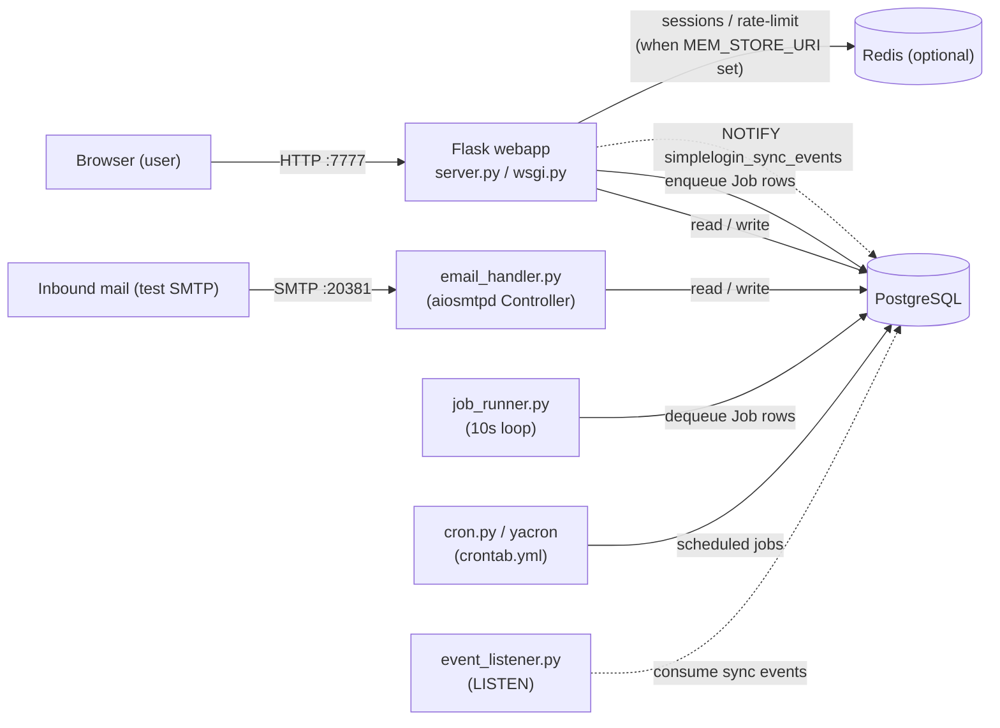

# SimpleLogin — First‑Run Behavior: A Code‑Grounded Verification

This document is a **code‑grounded, live‑run verification** of how the SimpleLogin email‑aliasing application behaves the first time you build and run it locally. It answers three questions, and every conclusion is traced back to the actual source code (with `file:line` citations) and corroborated with log/HTTP evidence captured from a running instance:

- **Q1 — Readiness:** *After starting the system, what shows in the logs/UI that the app is ready to handle authentication and alias‑based email activity?*
- **Q2 — New‑user journey:** *What happens when a user registers, verifies their address, and logs in — and what visible behavior confirms each step and forwards the user into the dashboard?*
- **Q3 — Behind the scenes:** *What background jobs / internal services support email forwarding and identity verification, and what runtime indicators show those pieces are active and talking to each other?*

> **Method (why you can trust the answers).** SimpleLogin is a two‑tier backend — a Flask **webapp** (`server.py` / `wsgi.py`) and an aiosmtpd **mail handler** (`email_handler.py`) — plus background workers (`job_runner.py`, `cron.py` driven by `crontab.yml`, and `event_listener.py`). All observations below come from running those processes and reading their logs; every behavioral claim carries a `file:line` citation to the source branch `app_2cd6ee777f8c`. Two citations differ from earlier drafts and were re‑verified against the running code: the email handler's "New message" line is emitted at **INFO** (`email_handler.py:2343`, `LOG.i`), and the "Postgres 13+" requirement lives at `CONTRIBUTING.md:25`.

---

## (a) Reproducible Build / Run Recipe

### Architecture in one paragraph (why you start multiple processes)

SimpleLogin separates the HTTP surface from the mail surface. The **webapp** serves the UI/API and authentication; the **mail handler** is a standalone SMTP server (built on `aiosmtpd`) that receives inbound mail and forwards it to alias owners; and the **workers** perform asynchronous and scheduled work. Because these are distinct processes, the local run starts each one separately. The production image instead launches the webapp under Gunicorn — `CMD ["gunicorn","wsgi:app","-b","0.0.0.0:7777","-w","2","--timeout","15"]` with `EXPOSE 7777` [Dockerfile:47,44] — while local development uses the Flask dev server via `python3 server.py` [CONTRIBUTING.md:106].

### Runtime targets

| Component | Version | Source |
|-----------|---------|--------|
| Python | 3.10 (managed with Poetry) | [CONTRIBUTING.md:23] |
| Node | v10 (front‑end assets only) | [CONTRIBUTING.md:24] |
| PostgreSQL | 13+ | [CONTRIBUTING.md:25] |
| Redis | optional locally | [app/config.py:568] |

The container image pins the asset builder to `node:10.17.0-alpine` [Dockerfile:2] and the runtime to `python:3.10` [Dockerfile:8].

**Environment basis for the observations in this document:** the prebuilt Docker image `andrewparkscaleai/coding-agent:simple-login__app__2cd6ee777f8c2d3531559588bcfb18627ffb5d2c` from `ghcr.io/scaleapi/swe-atlas:swe_atlas_QnA_simple-login_app_1.0` (Python 3.10.18; source baked at the `app_2cd6ee777f8c` commit; PostgreSQL and Redis already installed in the image; static assets prebuilt).

### The steps

The canonical "run the code locally" sequence from `CONTRIBUTING.md`:

```bash
# 1. Install Python deps (Poetry)
poetry sync                                  # CONTRIBUTING.md:31

# 2. Build front-end assets (Node v10)
cd static && npm install                     # CONTRIBUTING.md:82

# 3. Create your local env file
cp example.env .env                          # CONTRIBUTING.md:88
#    then edit .env: point DB_URI at the Postgres host port you publish (see note below)

# 4. Start PostgreSQL 13
docker run -e POSTGRES_PASSWORD=mypassword -e POSTGRES_USER=myuser \
  -e POSTGRES_DB=simplelogin -p 15432:5432 postgres:13   # CONTRIBUTING.md:100

# 5. Migrate, seed, and run the webapp
alembic upgrade head && flask dummy-data && python3 server.py   # CONTRIBUTING.md:106

# 6. Open the app and log in with the seeded account
#    http://localhost:7777  ->  john@wick.com / password        # CONTRIBUTING.md:109
```

`flask dummy-data` is a Flask CLI command registered in the webapp — `@app.cli.command("dummy-data")` [server.py:490] — that seeds fake data, SL domains, the Proton partner, and the **pre‑activated** login `john@wick.com / password`.

> **⚠️ DB_URI port nuance (call this out — it is the most common first‑run trip‑up).** Three places disagree on the Postgres port: `CONTRIBUTING.md` shows `DB_URI=...localhost:35432/...` [CONTRIBUTING.md:94], its own `docker run` maps `-p 15432:5432` [CONTRIBUTING.md:100], and `example.env` ships `DB_URI=...localhost:5432/simplelogin` [example.env:75]. Nothing auto‑detects the port — the app simply connects to whatever `DB_URI` says — so you must reconcile the `.env` `DB_URI` port to the host port you actually publish, or startup fails with a connection‑refused error. `scripts/reset_local_db.sh` uses `15432`, making `15432` the most consistent choice.

For **Q3** you also run the mail handler and the job worker as separate processes:

```bash
python email_handler.py     # inbound SMTP server on :20381
python job_runner.py        # 10-second job-draining loop
```

A convenient inbound test (the local alias domain is `sl.local`, so use an `@sl.local` recipient). `swaks` may not be installed; plain `smtplib` works just as well against the listener:

```bash
# with swaks, if available:
swaks --to e1@sl.local --from hey@google.com --server 127.0.0.1:20381
# or with Python's smtplib (used to capture the Q3 evidence in this document):
python3 - <<'PY'
import smtplib
from email.message import EmailMessage
m = EmailMessage(); m["From"]="hey@google.com"; m["To"]="e1@sl.local"
m["Subject"]="inbound forwarding test"; m.set_content("hello")
with smtplib.SMTP("127.0.0.1", 20381, timeout=20) as s: s.send_message(m)
PY
```

### Key local environment values (and why they matter)

| Variable | Local value | Why it matters | Source |
|----------|-------------|----------------|--------|
| `URL` | `http://localhost:7777` | Base URL used to build links (e.g., the activation link) | [example.env:6] |
| `NOT_SEND_EMAIL` | `true` | **Outbound email is logged, not transmitted** — changes what "success" looks like for every email step (see Q2) | [example.env:19] |
| `EMAIL_DOMAIN` | `sl.local` | Alias domain; inbound test mail must target `@sl.local` | [example.env:22] |
| `FLASK_SECRET` | `secret` | Signs the session cookie | [example.env:77] |
| `DISABLE_REGISTRATION` | commented out → registration **enabled** | Lets the Q2 walkthrough register a new user | [example.env:58] |
| `MEM_STORE_URI` | unset by default → Redis **optional** | When unset, sessions use signed cookies and rate‑limiting uses in‑memory storage | [app/config.py:568] |

`NOT_SEND_EMAIL` is derived as a simple presence check — `NOT_SEND_EMAIL = "NOT_SEND_EMAIL" in os.environ` [app/config.py:91] — and is the single most important first‑run nuance: locally there is no SMTP delivery, so an "email sent" success is a **log line**, not an inbox message. (See Q2 for how to obtain the activation code without an inbox.)

> For a full reset, `scripts/reset_local_db.sh` drops and recreates the `public` schema, then re‑runs `alembic upgrade head` + `flask dummy-data`.

---

## (b) Q1 — Readiness signals: what tells you the app is ready

Readiness here is **not a single banner**; it is a small set of deterministic markers across the two tiers. Lead with the guaranteed signals, then treat the Werkzeug dev‑server banner as environment‑dependent and understand *why*.

### Web tier (`python3 server.py`) — DETERMINISTIC markers

**1. The `>>> init logging <<<` line.** The logging module prints this the moment it is imported — `print(">>> init logging <<<")` [app/log.py:67]. *Rationale:* it is a plain `print` at import time of `app.log`, so it appears very early and unconditionally — the earliest reliable "the app has started importing" marker.

**2. Colored, `SL`‑prefixed logs.** The single project logger is `LOG = _get_logger("SL")` [app/log.py:79]; local startup forces `config.COLOR_LOG = True` [server.py:573], which triggers `coloredlogs.install(level="DEBUG", logger=logger, fmt=_log_format)` [app/log.py:61-62]. The format embeds the logger name, level, PID, `"pathname:lineno"`, function, a `message_id` field, and the message [app/log.py:12-15]. *Rationale:* every line prefixed with `SL` is the app's own logger — distinct from framework noise — so its appearance confirms the app initialized its logging.

**3. `/health` returns `success`, 200.** `@app.route("/health", ...)` → `def healthcheck(): return "success", 200` [server.py:213-215]. *Rationale:* a 200 from `/health` proves the app factory built the app and the WSGI server is serving routes.

**4. Visiting `/` while unauthenticated 302‑redirects to `/auth/login`.** `set_index_page` registers an `index()` that returns `redirect(url_for("auth.login"))` for anonymous users (and `dashboard.index` for authenticated ones) [server.py:249-256], rendering `templates/auth/login.html`. *Rationale:* this is the **UI‑level readiness signal** — the auth blueprint is registered and the app is ready to authenticate users.

**5. A custom access‑log line per request.** Inside `after_request`, the app logs `LOG.d("%s %s %s %s %s, takes %s", ...)` [server.py:284]. *Rationale:* SimpleLogin replaces Werkzeug's default request log with this line, so seeing it confirms requests are flowing and being handled. (Note: `/health` is deliberately excluded from this access log at `server.py:281`, which is why health checks stay quiet.)

The dev server itself is started by `app.run(debug=True, port=7777)` [server.py:588], listening on `:7777`.

**Observed (web tier startup, excerpted from a live run; machine‑specific paths/timestamps trimmed):**

```text
>>> URL: http://localhost:7777
>>> init logging <<<
 * Serving Flask app "server" (lazy loading)
 * Environment: production
   WARNING: This is a development server. Do not use it in a production deployment.
 * Debug mode: on
... - SL - DEBUG - 520 - "/app/server.py:284" - after_request() -  - 127.0.0.1 GET / ImmutableMultiDict([]) 302, takes 0.0008
... - SL - DEBUG - 520 - "/app/server.py:284" - after_request() -  - 127.0.0.1 GET /auth/login ImmutableMultiDict([]) 200, takes 0.1091
```

And the fresh HTTP probes that confirm readiness end‑to‑end:

```text
GET /health      => HTTP 200, body "success"
GET /            => HTTP 302, Location: http://127.0.0.1:7777/auth/login
GET /auth/login  => HTTP 200, renders <title> Login | SimpleLogin
```

### Mail tier (`python email_handler.py`) — DETERMINISTIC markers

The inbound SMTP listener boots through an `aiosmtpd` controller: `controller = Controller(MailHandler(), hostname="0.0.0.0", port=port)` [email_handler.py:2383] → `controller.start()` [email_handler.py:2385] → `LOG.d("Start mail controller %s %s", controller.hostname, controller.port)` [email_handler.py:2386]. The default port is `20381` [email_handler.py:2399], announced by `LOG.i("Listen for port %s", args.port)` [email_handler.py:2403]. *Rationale:* together these two lines prove the inbound SMTP listener is bound and ready to accept mail for alias processing.

**Observed (mail tier startup):**

```text
... - SL - INFO  - 578 - "/app/email_handler.py:2403" - <module>() -  - Listen for port 20381
... - SL - DEBUG - 578 - "/app/email_handler.py:2386" - main() -  - Start mail controller 0.0.0.0 20381
```

### ENVIRONMENT‑DEPENDENT — the Werkzeug `* Running on …` banner (do **not** rely on it)

You might expect the classic `* Running on http://127.0.0.1:7777` banner and per‑request `127.0.0.1 - - [..] "GET ..." 200` lines. **They may be absent here.** The reason is in the code: `app/log.py` disables the Werkzeug logger — `log = logging.getLogger("werkzeug")` / `log.disabled = True` [app/log.py:70-71]. The Werkzeug development server emits both the "Running on" banner and its default request logs *through that very logger*; once it is disabled, those lines are suppressed. (By contrast, the `* Serving Flask app` / `* Environment` / `* Debug mode` lines you *do* see come from Flask's own banner, printed independently of the Werkzeug logger — which is exactly why they survive while "Running on" does not.)

*Rationale and guidance:* because the banner is suppressed by an intentional logging choice, it is **not** a dependable readiness signal in this app. Rely instead on the deterministic markers above — `>>> init logging <<<`, the `SL` logs, the `/` → `/auth/login` redirect, the `/health` 200, and the mail controller's `Listen for port 20381` / `Start mail controller 0.0.0.0 20381` lines.


---

## (c) Q2 — New‑user journey: register → verify → log in → dashboard

This walks the full path with a **temporary** account, and also demonstrates a direct login with the pre‑activated seed account. For each step it states the visible confirmation, cites the code, and shows the observed log/HTTP evidence. The walkthrough below registered `blitzytmpqa…@gmail.com` (a throwaway whose domain has valid MX so it passes the mailbox check), then **deleted it** at the end (see Cleanup).

### Step 1 — Register (`POST /auth/register`)

`RegisterForm` collects an email and a password (length 8–100) [app/auth/views/register.py:23-28] and is submitted from `templates/auth/register.html`. On a valid submit the handler logs `LOG.d("create user %s", email)` [register.py:85], creates the user with a bcrypt‑hashed password via `User.create(...)` [register.py:86], and calls `send_activation_email(user, next_url)` [register.py:95].

**Visible confirmation:** the page renders `templates/auth/register_waiting_activation.html` — `return render_template("auth/register_waiting_activation.html")` [register.py:104] — whose title is *“Activation Email Sent”* and whose body reads *“An email to validate your email is on its way.”* This is the "check your email to activate" screen.

`send_activation_email()` deletes any prior codes for the user, creates a 30‑char `ActivationCode` (`random_string(30)`) [register.py:120], and builds the link `{URL}/auth/activate?code=<code>` [register.py:124]. *Rationale:* identity verification is a one‑time, time‑boxed code bound to the user — exactly what you want for proving control of an address.

**Observed:**

```text
POST /auth/register => HTTP 200   (renders register_waiting_activation.html)
  "Activation Email Sent" / "An email to validate your email is on its way."

... - SL - DEBUG - "/app/app/auth/views/register.py:85" - register() - create user blitzytmpqa...@gmail.com
... - SL - DEBUG - "/app/app/mail_sender.py:131" - send() - send email with subject
      'Just one more step to join SimpleLogin', from '"noreply@sl.local" <noreply@sl.local>'
      to 'blitzytmpqa...@gmail.com'
```

### Critical local nuance — the activation email is **not delivered**

Because `NOT_SEND_EMAIL=true` [example.env:19] (evaluated as `config.NOT_SEND_EMAIL = "NOT_SEND_EMAIL" in os.environ` [app/config.py:91]), `MailSender.send()` does **not** transmit mail — it only logs `LOG.d("send email with subject '%s', from '%s' to '%s'", ...)` and returns `True` [app/mail_sender.py:126-137]. *Rationale:* locally there is no SMTP delivery, so you cannot click a link in an inbox. The `send email with subject 'Just one more step to join SimpleLogin'` line above **is** the proof that the activation‑email path executed.

**To obtain the activation code**, read it from the database (the `ActivationCode` row is joined to the user), or reconstruct the link from `{URL}` + the code. The exact method used here (read‑only ORM query, no source changes):

```python
# python (inside the app venv)
from app.models import User, ActivationCode
u = User.get_by(email="blitzytmpqa...@gmail.com")    # activated == False at this point
ac = ActivationCode.get_by(user_id=u.id)
print(ac.code)   # e.g. qwgwcpdkzteniffhgoerjnpdemznwv  (30 chars -> confirms random_string(30))
```

### Step 2 — Activate (`GET /auth/activate?code=<code>`)

The handler reads `code = request.args.get("code")` [app/auth/views/activate.py:24] and looks it up via `ActivationCode.get_by(code=code)` [activate.py:26]. For completeness, the error paths: a missing/invalid code renders `activate.html` with *“Activation code cannot be found”* (HTTP 400, plus a rate‑limit deduction) [activate.py:28-36], and an expired code renders *“Activation code was expired”* (HTTP 400 with a resend option) [activate.py:38-46]. `activate.html` is therefore an **error** template — on success it is never rendered; the user is redirected instead.

On the success path the handler sets `user.activated = True` [activate.py:49], calls `login_user(user)` to establish the session (**auto‑login**) [activate.py:50], deletes the one‑time code via `ActivationCode.delete(...)` [activate.py:53], and flashes `flash("Your account has been activated", "success")` [activate.py:56]. With no `next` param it logs `LOG.d("redirect user to dashboard")` [activate.py:66] and returns `redirect(url_for("dashboard.index"))` [activate.py:67].

**Visible confirmation:** the user lands authenticated on the dashboard with a green *“Your account has been activated”* flash. *Rationale:* activation flips `activated`, establishes the session, and forwards into the product — exactly the "every step handled correctly" signal. The auto‑login is provable because a **fresh** browser session (no prior cookie) that simply follows the activation link arrives at the dashboard already logged in.

**Observed (fresh cookie jar; the redirect target and the dashboard recognizing the new user):**

```text
GET /auth/activate?code=qwgw...  => HTTP 302, Location: http://127.0.0.1:7777/dashboard/
GET /dashboard/                  => HTTP 200  (renders "Create a custom alias" / "Create a totally random alias")

... - SL - DEBUG - "/app/app/mail_sender.py:131"            - send()        - send email with subject 'Welcome to SimpleLogin' ...
... - SL - DEBUG - "/app/app/auth/views/activate.py:66"     - activate()    - redirect user to dashboard
... - SL - DEBUG - "/app/server.py:284"                     - after_request - 127.0.0.1 GET /auth/activate ...code=qwgw... 302
... - SL - DEBUG - "/app/app/dashboard/views/index.py:172"  - index()       - Show intro to <User 3 blitzytmpqa...@gmail.com ...>
... - SL - DEBUG - "/app/server.py:284"                     - after_request - 127.0.0.1 GET /dashboard/ ... 200
```

The `Show intro to <User 3 …>` line is the clincher: the dashboard rendered **for the now‑authenticated temporary user**, proving the activation auto‑login worked.

### Step 3 — Log in (direct, with the pre‑activated seed account)

`LoginForm` collects email + password [app/auth/views/login.py:16-18] and the route is rate‑limited at `10/minute` [login.py:21-24]. The credential branches: wrong credentials flash *“Email or password incorrect”* and fire `LoginEvent(...failed).send()` [login.py:45-50]; an unactivated account shows a resend‑activation prompt and fires `LoginEvent(...not_activated).send()` [login.py:63-69]; success fires `LoginEvent(...success).send()` then `return after_login(user, next_url)` [login.py:71-72].

`after_login()` is the post‑credential decision tree [app/auth/views/login_utils.py:12-45]: if FIDO is enabled it redirects to `auth.fido`; else if OTP is enabled it redirects to `auth.mfa`; otherwise it logs `LOG.d("log user %s in", user)` [login_utils.py:35], calls `login_user(user)` [login_utils.py:36], records `session["sudo_time"]` [login_utils.py:37], and returns `redirect(url_for("dashboard.index"))` [login_utils.py:44-45]. *Rationale:* the seed account has no MFA configured, so login goes straight to the dashboard.

The seed account `john@wick.com / password` is created **pre‑activated** (`activated=True`) by `flask dummy-data` [app/fake_data.py:45,47,48], so it bypasses the email step entirely and cleanly demonstrates the login → dashboard transition.

**Observed:**

```text
POST /auth/login (john@wick.com / password) => HTTP 302, Location: http://127.0.0.1:7777/dashboard/
GET  /dashboard/                            => HTTP 200  (alias dashboard)

... - SL - DEBUG - "/app/app/auth/views/login_utils.py:35" - after_login() - log user <User 1 John Wick john@wick.com> in
... - SL - DEBUG - "/app/app/auth/views/login_utils.py:44" - after_login() - redirect user to dashboard
```

### Step 4 — Dashboard (the terminal state)

The dashboard blueprint is mounted at `/dashboard` — `Blueprint(name="dashboard", ... url_prefix="/dashboard", ...)` [app/dashboard/base.py:3-8] — and its index route is `@dashboard_bp.route("/", ...)` + `@login_required` + `def index()` [app/dashboard/views/index.py:55-67], rendering `templates/dashboard/index.html` (title *“Alias”*, with the *“Create a custom alias”* / *“Create a totally random alias”* actions). *Rationale:* reaching `/dashboard/` with the rendered alias‑management page — confirmed above for both the activated temporary user **and** the seed account, each accompanied by a `GET /dashboard/ … 200` access‑log line — is the end‑to‑end success signal the question asks about.


---

## (d) Q3 — Behind the scenes: background services and how they coordinate

The "moving pieces" supporting email forwarding and identity verification are the **job runner**, the **mail handler**, the **cron scheduler**, and the **event listener**. The recurring observation is that they coordinate **through shared PostgreSQL state** (a `Job` queue plus `NOTIFY`/`LISTEN`), not through direct RPC.

### `job_runner.py` — the job‑draining loop

The worker runs an infinite loop on a 10‑second cadence:

```python
while True:                                              # job_runner.py:330
    with create_light_app().app_context():               # job_runner.py:332
        for job in get_jobs_to_run():                    # job_runner.py:333
            LOG.d("Take job %s", job)                    # job_runner.py:334
            job.taken = True; job.taken_at = arrow.now()
            job.state = JobState.taken.value; job.attempts += 1
            Session.commit()                             # job_runner.py:337-341
            process_job(job)                             # job_runner.py:342
            job.state = JobState.done.value              # job_runner.py:344
            Session.commit()
        time.sleep(10)                                   # job_runner.py:347
```

`get_jobs_to_run()` selects jobs whose state is `ready` (or `taken` jobs that have timed out) [job_runner.py:307], and `process_job()` dispatches by `job.name`, logging `LOG.e("Unknown job name %s", job.name)` for unrecognized names [job_runner.py:304]. *Rationale:* the webapp and mail handler **enqueue `Job` rows in PostgreSQL**, and this worker dequeues them every 10 seconds — so a recurring `Take job <Job …>` line is the indicator that the worker is alive and consuming the queue.

**Observed (a probe `Job` was enqueued, then dequeued within one loop iteration):**

```text
... - SL - DEBUG - "/app/job_runner.py:334" - Take job <Job 2 __blitzy_probe__ {}>
... - SL - ERROR - "/app/job_runner.py:304" - process_job() - Unknown job name __blitzy_probe__
```

(The unknown‑name path is harmless — it logs and the job is still marked `done` — which makes it a clean way to prove the loop is live without side effects. The probe job was deleted afterward.)

### `email_handler.py` — forwarding and per‑message correlation

When mail arrives, `handle_DATA` → `_handle()` assigns a correlation id `message_id = str(uuid.uuid4())`, registers it via `set_message_id(...)`, and logs `LOG.i("New message, mail from %s, rctp tos %s ", ...)` at **INFO** [email_handler.py:2343]. Forwarding then resolves the alias and its mailbox and logs `LOG.d("Forward %s -> %s -> %s", contact, alias, mailbox)` [email_handler.py:688]. *Rationale:* the `message_id` is injected into the log format's `%(message_id)s` field [app/log.py:14], so a **single email can be traced across many log lines** — the indicator that the mail pipeline is doing its part.

**Observed (inbound `hey@google.com` → `e1@sl.local`; note the shared `message_id f262…` on every line):**

```text
... - SL - INFO  - "/app/email_handler.py:2343" - _handle()  - f262... - New message, mail from hey@google.com, rctp tos ['e1@sl.local']
... - SL - DEBUG - "/app/email_handler.py:688"  - forward... - f262... - Forward <Contact 2 hey@google.com 5> -> <Alias 5 e1@sl.local> -> <Mailbox 1 john@wick.com>
... - SL - DEBUG - "/app/app/mail_sender.py:131" - send()    - f262... - send email with subject 'inbound forwarding test',
      from '"hey at google.com" <hey_at_google_com_...@sl.local>' to 'e1@sl.local'
```

The `Forward <contact> -> <alias> -> <mailbox>` line shows the alias being resolved to its owner's mailbox; the final `send email …` line (log‑only under `NOT_SEND_EMAIL`) shows the message being relayed *from a reverse‑alias address* so replies route back through SimpleLogin. (The `Contact` row this test created was deleted afterward.)

### `cron.py` + `crontab.yml` — scheduled maintenance (yacron)

`crontab.yml` schedules `python /code/cron.py -j <name>` jobs via yacron. The most frequent is `send_undelivered_mails`, which runs **every 5 minutes** (`schedule: "*/5 * * * *"`) [crontab.yml:77-82]. Other scheduled jobs include `stats`, `delete_old_monitoring`, `check_custom_domain`, `check_hibp`, `notify_hibp`, `delete_logs`, `delete_old_data`, `poll_apple_subscription`, `notify_trial_end`, `delete_scheduled_users`, `clear_alias_audit_log`, and `clear_user_audit_log`. *Rationale:* these are **time‑driven** (yacron), distinct from the **event‑driven** `job_runner`; locally you typically run one on demand with `python cron.py -j <name>` rather than waiting for the schedule.

### Event subsystems and the channels they use

**Partner sync events — PostgreSQL `NOTIFY` / `LISTEN`.** `PostgresDispatcher.send()` writes a `SyncEvent` row and then issues `Session.execute("NOTIFY simplelogin_sync_events, '<id>';")` [app/events/event_dispatcher.py:14,23-26]; `event_listener.py`, run in LISTENER mode, builds a `PostgresEventSource` + sink and runs `Runner(source=source, sink=sink).run()` [event_listener.py:15-17,29,46-47]. *Rationale:* this is a Postgres‑mediated pub/sub channel between the webapp (publisher) and the listener (consumer) — again, coordination through the database, not direct calls.

**These are typically SILENT locally — and that is EXPECTED, not a fault.** `EventDispatcher.send_event()` short‑circuits when the webhook is disabled (`config.EVENT_WEBHOOK_DISABLE`), when `EVENT_WEBHOOK` is unset, or when there is no partner user, logging `LOG.i("Not sending events …")` in each case [app/events/event_dispatcher.py:57-69]. So the **absence** of sync‑event traffic locally is by design.

**Observed (the guard firing during the flow, because `EVENT_WEBHOOK` is unset):**

```text
... - SL - INFO - "/app/app/events/event_dispatcher.py:62" - send_event() - Not sending events because webhook is not configured and allowed to be empty
```

**New Relic analytics events.** `RegisterEvent` / `LoginEvent` call `newrelic.agent.record_custom_event(...)` [app/events/auth_event.py:6,22-25,28,44-47]. These are effectively **no‑ops without New Relic configured**. *Rationale:* they record analytics, not behavior, so their silence locally is expected.

**Redis is OPTIONAL.** When `MEM_STORE_URI` is set the app points Flask‑Limiter at it and calls `initialize_redis_services(app, MEM_STORE_URI)` → installs a `RedisSessionStore` [server.py:163-165][app/redis_services.py:9-12]; `MEM_STORE_URI` defaults to `None` [app/config.py:568], in which case sessions fall back to signed cookies and rate‑limiting uses in‑memory storage. *In the environment used for this document, `MEM_STORE_URI=redis://localhost` is set,* so Redis **is** active — confirmed by `redis-cli ping → PONG` and the presence of `session:*` keys in Redis. Both modes are valid; the only difference is where sessions and the rate‑limiter live.

### How the pieces talk to each other



*Rationale:* the evidence that "the moving pieces are active and talking to each other" is the **shared PostgreSQL backbone** — the webapp enqueues `Job` rows that `job_runner` dequeues (proven by the `Take job` line), the mail handler reads/writes alias and contact state while forwarding (proven by the `Forward … -> … -> …` line), and the webapp publishes `NOTIFY simplelogin_sync_events` that `event_listener` consumes via `LISTEN`. Redis, when enabled, additionally backs sessions and the rate‑limiter.


---

## (e) Cleanup — temporary test data removed, baseline restored

Per the testing constraint, every temporary artifact created for the Q2/Q3 walkthrough was deleted at the end, returning the database to its seeded baseline. Concretely, the following **runtime database rows** were removed (read‑only ORM deletes — no source files touched):

- The temporary registered user (`blitzytmpqa…@gmail.com`, user id 3) and its cascaded rows (its auto‑created alias `simplelogin-newsletter.word769@sl.local` and its mailbox). Its one‑time `ActivationCode` was already gone — it is deleted on activation by design [app/auth/views/activate.py:53].
- The `Contact` row (`hey@google.com`) created on `e1@sl.local` by the Q3 inbound‑forwarding test, together with its email‑log rows.
- The probe `Job` (`__blitzy_probe__`) enqueued to demonstrate the `job_runner` loop.
- The aggregate `DailyMetric.nb_new_web_non_proton_user` counter incremented by the registration [app/auth/views/register.py] was decremented back by 1.

**Verification after cleanup:** the temporary user, alias, mailbox, contact, and probe job were all confirmed gone; `e1@sl.local` again has zero contacts; the seeded `john@wick.com` account remains intact (activated, with its original alias set unchanged); and the total user count returned to its seeded value. The `flask dummy-data` seed data was left untouched.

**No repository files were created, modified, or deleted — only runtime DB rows — besides this single documentation file.** The SimpleLogin source tree is byte‑for‑byte unchanged (`git status --porcelain` on the source checkout reports no changes).

---

## (f) References — `file:line` citation index

**Recipe (a)**

- `CONTRIBUTING.md:23` (Python 3.10), `:24` (Node v10), `:25` (Postgres 13+), `:31` (`poetry sync`), `:82` (`npm install`), `:88` (`cp example.env .env`), `:94` (DB_URI `35432`), `:100` (`docker run … -p 15432:5432 postgres:13`), `:106` (`alembic upgrade head && flask dummy-data && python3 server.py`), `:109` (login `john@wick.com / password`)
- `Dockerfile:2` (`node:10.17.0-alpine`), `:8` (`python:3.10`), `:44` (`EXPOSE 7777`), `:47` (gunicorn CMD)
- `example.env:6` (`URL`), `:19` (`NOT_SEND_EMAIL`), `:22` (`EMAIL_DOMAIN`), `:58` (`DISABLE_REGISTRATION` commented), `:75` (`DB_URI` `5432`), `:77` (`FLASK_SECRET`)
- `app/config.py:91` (`NOT_SEND_EMAIL`), `:568` (`MEM_STORE_URI` default `None`)
- `server.py:490` (`flask dummy-data` CLI)

**Q1 — Readiness (b)**

- `app/log.py:12-15` (log format incl. `%(message_id)s` at `:14`), `:61-62` (`coloredlogs.install`), `:67` (`>>> init logging <<<`), `:70-71` (Werkzeug logger disabled), `:79` (`SL` logger)
- `server.py:213-215` (`/health` → `success, 200`), `:249-256` (index `/` → `/auth/login` redirect), `:281` (`/health` excluded from access log), `:284` (`after_request` access log `LOG.d`), `:573` (`COLOR_LOG = True`), `:588` (`app.run(debug=True, port=7777)`)
- `email_handler.py:2383` (`Controller(...)`), `:2385` (`controller.start()`), `:2386` (`Start mail controller …`), `:2399` (default port `20381`), `:2403` (`Listen for port …`)

**Q2 — New‑user journey (c)**

- `app/auth/views/register.py:23-28` (`RegisterForm`), `:85` (`create user`), `:86` (`User.create`), `:95` (`send_activation_email`), `:104` (renders `register_waiting_activation.html`), `:120` (`ActivationCode … random_string(30)`), `:124` (activation link)
- `app/auth/views/activate.py:24` (read `code`), `:26` (`ActivationCode.get_by`), `:28-36` (invalid code), `:38-46` (expired code), `:49` (`activated = True`), `:50` (`login_user`), `:53` (delete one‑time code), `:56` (`flash` "activated"), `:66` (`redirect user to dashboard`), `:67` (`redirect(... dashboard.index)`)
- `app/auth/views/login.py:16-18` (`LoginForm`), `:21-24` (`10/minute` limit), `:45-50` (wrong creds), `:63-69` (not activated), `:71-72` (success → `after_login`)
- `app/auth/views/login_utils.py:12-45` (`after_login` tree), `:35` (`log user … in`), `:36` (`login_user`), `:37` (`sudo_time`), `:44-45` (`redirect … dashboard.index`)
- `app/dashboard/base.py:3-8` (dashboard blueprint, `url_prefix="/dashboard"`), `app/dashboard/views/index.py:55-67` (index route, `@login_required`)
- `app/mail_sender.py:126-137` (`NOT_SEND_EMAIL` log‑only send), `app/config.py:91` (`NOT_SEND_EMAIL`)
- `app/fake_data.py:45,47,48` (seed `john@wick.com / password`, `activated=True`)

**Q3 — Behind the scenes (d)**

- `job_runner.py:304` (`Unknown job name`), `:307` (`get_jobs_to_run`), `:330` (`while True`), `:332` (`app_context`), `:333` (`for job`), `:334` (`Take job`), `:337-341` (mark taken), `:342` (`process_job`), `:344` (`state = done`), `:347` (`sleep(10)`)
- `email_handler.py:2343` (`New message …`, INFO), `:688` (`Forward … -> … -> …`); `app/log.py:14` (`%(message_id)s`); `app/mail_sender.py:131` (log‑only send)
- `crontab.yml:77-82` (`send_undelivered_mails`, `*/5 * * * *`)
- `app/events/event_dispatcher.py:14` (`NOTIFICATION_CHANNEL`), `:23-26` (`SyncEvent.create` + `NOTIFY simplelogin_sync_events`), `:57-69` (`Not sending events …` guards, incl. `:62`)
- `event_listener.py:15-17` (`Mode`), `:29` (`main`), `:46-47` (`Runner(...).run()`)
- `app/events/auth_event.py:6,22-25` (`LoginEvent` → `record_custom_event`), `:28,44-47` (`RegisterEvent`)
- `server.py:163-165` (Redis wiring when `MEM_STORE_URI` set), `app/redis_services.py:9-12` (`RedisSessionStore`), `app/config.py:568` (`MEM_STORE_URI` default `None`)

**Cleanup (e)**

- `app/auth/views/activate.py:53` (one‑time code deleted on activation), `app/auth/views/register.py` (DailyMetric increment on registration)

