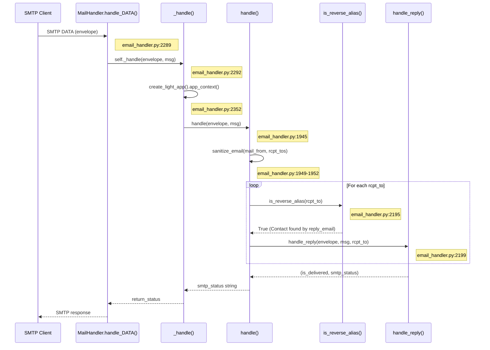
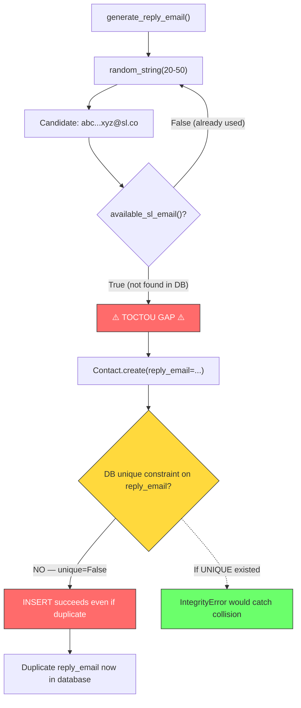
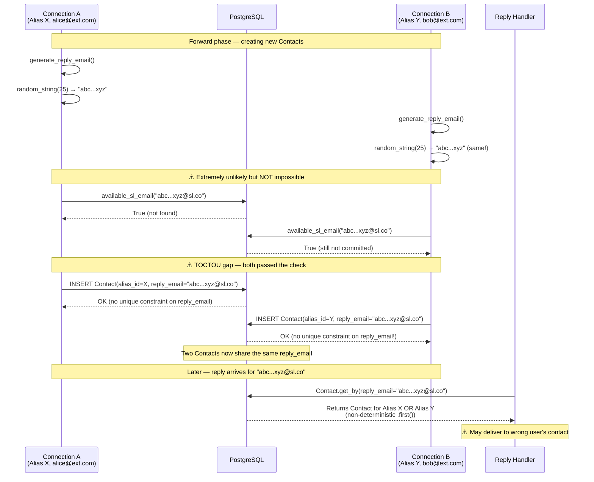

# Reply-Resolution Logic Investigation: SimpleLogin Inbound Reply-Phase Handler

## 1. Overview and Question Statement

This document is a code-level investigative analysis of how SimpleLogin's inbound reply-phase email handler resolves a reply email address to a `Contact` record, derives the associated `Alias` and `User`, and forwards the reply to its intended external destination.

### Investigative Questions

The analysis addresses the following specific questions:

1. **How does the system derive the reply email address** from an inbound reply message's SMTP envelope?
2. **How does it use the reply email to identify the associated Contact** in the database?
3. **What are the runtime values** involved at each step of the resolution chain?
4. **Does the same `reply_email` ever resolve to different Contacts** over time?
5. **Can `reply_email` resolution fail temporarily?**
6. **Can a correct resolution forward to the wrong user?**
7. **Does the contact-by-reply-email lookup exhibit race conditions?**
8. **Does it exhibit uniqueness assumption violations?**
9. **Does it exhibit timing-related inconsistencies?**

### Analytical Approach

Every claim in this document cites specific source files and line numbers. The analysis distinguishes between what the code **guarantees** (via database constraints, transactional semantics, or deterministic logic) versus what the code **probabilistically avoids** (via high-entropy random generation or timing improbability). No assumptions are made about runtime behavior beyond what the code explicitly implements.

---

## 2. Reply Resolution Mechanism

### 2.1 Entry Point: MailHandler and Routing

The inbound email path begins at the `MailHandler` class, which is registered with the `aiosmtpd` SMTP server.

**Step 1 — SMTP DATA receipt:**

`MailHandler.handle_DATA()` is an async method that receives the raw SMTP envelope and parses the email message from its bytes content.

Source: `email_handler.py:2288-2292`

```python
class MailHandler:
    async def handle_DATA(self, server, session, envelope: Envelope):
        msg = email.message_from_bytes(envelope.original_content)
```

It then calls `self._handle(envelope, msg)` at line 2292 and returns the SMTP status string.

**Step 2 — Application context creation:**

`_handle()` is decorated with `@newrelic.agent.background_task()` and creates a lightweight Flask application context before invoking the main `handle()` function.

Source: `email_handler.py:2334-2353`

```python
def _handle(self, envelope: Envelope, msg: Message):
    with create_light_app().app_context():
        return_status = handle(envelope, msg)
```

**Step 3 — Central routing in `handle()`:**

`handle()` at line 1945 sanitizes the `mail_from` and `rcpt_tos` fields via `sanitize_email()` (lines 1949–1952), then evaluates a series of conditions: VERP/bounce detection, unsubscribe handling, complaint processing, and rate limiting (lines 2029–2163).

Source: `email_handler.py:1945-1952`

```python
def handle(envelope: Envelope, msg: Message) -> str:
    mail_from = sanitize_email(envelope.mail_from)
    rcpt_tos = [sanitize_email(rcpt_to) for rcpt_to in envelope.rcpt_tos]
```

**Step 4 — Reply vs. forward routing decision:**

For each `rcpt_to`, the code checks whether it is a reverse alias using `is_reverse_alias(rcpt_to)` at line 2195. If true, it dispatches to `handle_reply()` at line 2199; otherwise, it dispatches to `handle_forward()`.

Source: `email_handler.py:2194-2199`

```python
if is_reverse_alias(rcpt_to):
    ...
    is_delivered, smtp_status = handle_reply(envelope, copy_msg, rcpt_to)
```

The `is_reverse_alias()` function (defined at `app/email_utils.py:1156-1163`) first checks whether any `Contact` record exists with `reply_email` matching the address. If not found via the database, it falls back to a prefix-based check (`reply+` or `ra+`).

Source: `app/email_utils.py:1156-1163`

```python
def is_reverse_alias(address: str) -> bool:
    if Contact.get_by(reply_email=address):
        return True
```



### 2.2 Reply Email Derivation

Inside `handle_reply()`, the reply email lookup key is derived from the raw `rcpt_to` value in three steps.

**Step 1 — Direct assignment:**

Source: `email_handler.py:972`

```python
reply_email = rcpt_to
```

At this point, `reply_email` holds the raw SMTP RCPT TO value (e.g., `abcdefghijklmnopqrst@simplelogin.co`).

**Step 2 — Domain validation:**

The domain portion of `reply_email` is extracted and validated against `EMAIL_DOMAIN` or any `SLDomain` record.

Source: `email_handler.py:974-981`

```python
reply_domain = get_email_domain_part(reply_email)
if not reply_email.endswith(EMAIL_DOMAIN):
    ...  # validates against SLDomain; returns E501 if unrecognized
```

If the domain is neither `EMAIL_DOMAIN` nor a recognized `SLDomain`, the handler returns `E501` ("550 SL E501") immediately.

Source: `app/email/status.py:38`

**Step 3 — Normalization:**

Source: `email_handler.py:984`

```python
reply_email = normalize_reply_email(reply_email)
```

The `normalize_reply_email()` function from `app/email_validation.py:25-38` handles legacy reply emails that contain non-allowed characters:

Source: `app/email_validation.py:25-38`

```python
def normalize_reply_email(reply_email: str) -> str:
    ...  # replaces characters not in _ALLOWED_CHARS with "_"
    return "".join(ret)
```

The allowed character set is `a-zA-Z0-9_-.+@` (defined at `app/email_validation.py:9`). Any character outside this set is replaced with `_`.

**Runtime values at this point:**

| Variable | Value | Description |
|----------|-------|-------------|
| `rcpt_to` | Raw SMTP RCPT TO | e.g., `abcdefghijklmnopqrst@simplelogin.co` |
| `reply_domain` | Domain part of `rcpt_to` | e.g., `simplelogin.co` |
| `reply_email` | Normalized form | Identical to `rcpt_to` for properly generated addresses |

### 2.3 Contact Lookup by reply_email

The critical database lookup occurs at a single line:

Source: `email_handler.py:986`

```python
contact = Contact.get_by(reply_email=reply_email)
```

This delegates to `ModelMixin.get_by()`:

Source: `app/models.py:82-84`

```python
@classmethod
def get_by(cls, **kw):
    return Session.query(cls).filter_by(**kw).first()
```

The executed SQL is equivalent to:

```sql
SELECT * FROM contact WHERE reply_email = :reply_email LIMIT 1
```

**Behavior when `contact` is `None`:**

If no Contact matches, the handler returns `(False, status.E502)` — "550 SL E502 Email not exist".

Source: `email_handler.py:987-989`

```python
if not contact:
    LOG.w(f"No contact with {reply_email} as reverse alias")
    return False, status.E502
```

**Behavior when user is inactive:**

If the Contact's user has been soft-deleted, the same E502 status is returned.

Source: `email_handler.py:990-992`

```python
if not contact.user.is_active():
    LOG.w(f"User {contact.user} has been soft deleted")
    return False, status.E502
```

The `.first()` semantics are critical: when the `reply_email` column is **not** uniquely constrained (as documented in Section 4), `.first()` returns whichever row the database query planner selects first — the result is **non-deterministic** if multiple rows match.

### 2.4 Alias, User, and Mailbox Derivation

Once a Contact is found, the code derives the Alias, User, and authorized Mailbox through a chain of foreign-key relationships and authorization checks.

**Alias derivation:**

Source: `email_handler.py:994-996`

```python
alias = contact.alias
alias_address: str = contact.alias.email
alias_domain = get_email_domain_part(alias_address)
```

A domain validity check ensures the alias domain is still managed by SimpleLogin:

Source: `email_handler.py:1000-1002`

```python
if not is_valid_alias_address_domain(alias.email):
    LOG.e("%s domain isn't known", alias)
    return False, status.E503
```

**User derivation:**

Source: `email_handler.py:1004`

```python
user = alias.user
```

A send/receive capability check follows:

Source: `email_handler.py:1007-1009`

```python
if not user.can_send_or_receive():
    LOG.i(f"User {user} cannot send emails")
    return False, status.E504
```

**DMARC policy enforcement:**

Source: `email_handler.py:1012-1016`

```python
dmarc_delivery_status = apply_dmarc_policy_for_reply_phase(alias, contact, ...)
if dmarc_delivery_status is not None:
    return False, dmarc_delivery_status
```

**Mailbox authorization:**

The `get_mailbox_from_mail_from()` function (defined at `email_handler.py:1364-1387`) determines which Mailbox sent the reply. It iterates through the alias's associated mailboxes, comparing `mail_from` against each mailbox email and its authorized addresses.

Source: `email_handler.py:1019`

```python
mailbox = get_mailbox_from_mail_from(mail_from, alias)
```

Source: `email_handler.py:1364-1387`

```python
def get_mailbox_from_mail_from(mail_from: str, alias) -> Optional[Mailbox]:
    ...  # iterates alias.mailboxes, comparing email and authorized_addresses
    return __check(mail_from, alias) or __check(canonicalize_email(mail_from), alias)
```

If no mailbox matches and `alias.disable_email_spoofing_check` is `False`, the handler calls `handle_unknown_mailbox()` and returns `(False, status.E214)`.

Source: `email_handler.py:1020-1034`

```python
if not mailbox:
    if alias.disable_email_spoofing_check: mailbox = alias.mailbox
    else: ...  # calls handle_unknown_mailbox(), returns E214
```

**Runtime values at this point:**

| Variable | Value | Description |
|----------|-------|-------------|
| `contact` | Contact ORM object | The resolved Contact record |
| `alias` | `contact.alias` | The Alias this reply-email belongs to |
| `user` | `alias.user` | The User who owns the alias |
| `mailbox` | Authorized Mailbox | The mailbox that sent this reply (or default mailbox) |
| `contact.website_email` | External recipient | The original sender's email address |

### 2.5 Delivery to Contact

After authorization, the handler performs final processing and delivers the email.

**EmailLog creation:**

Source: `email_handler.py:1042-1050`

```python
email_log = EmailLog.create(
    contact_id=contact.id, alias_id=contact.alias_id, is_reply=True, ...
)
```

**Spam checking (lines 1054–1094):** If SpamAssassin is enabled, the message is scored. Exceeding `MAX_REPLY_PHASE_SPAM_SCORE` results in `E506`.

Source: `email_handler.py:1054-1094`

**Header manipulation (lines 1096–1148):** Sensitive headers are stripped; reverse-alias addresses in the body are replaced with original contact emails if `user.replace_reverse_alias` is enabled.

Source: `email_handler.py:1096-1148`

**Reverse-alias header replacement:**

The `replace_header_when_reply()` function (defined at `email_handler.py:345-384`) replaces reverse-alias addresses in TO/CC headers with the original contact `website_email` addresses. This function also calls `Contact.get_by(reply_email=...)` for each address in the headers.

Source: `email_handler.py:1174-1184`

```python
replace_header_when_reply(msg, alias, headers.TO)
replace_header_when_reply(msg, alias, headers.CC)
```

Source: `email_handler.py:345-376`

```python
def replace_header_when_reply(msg: Message, alias: Alias, header: str):
    ...  # iterates header addresses via getaddresses()
    contact = Contact.get_by(reply_email=reply_email)
```

**DKIM signing and delivery:**

Source: `email_handler.py:1220-1231`

```python
if should_add_dkim_signature(alias_domain):
    add_dkim_signature(msg, alias_domain)
sl_sendmail(..., contact.website_email, msg, ...)
```

The email is sent to `contact.website_email` — the external recipient — with a VERP bounce envelope for delivery tracking.

**Success return:**

Source: `email_handler.py:1261`

```python
return True, status.E200
```

`E200` is defined as `"250 Message accepted for delivery"`.

Source: `app/email/status.py:2`

---

## 3. Reply Email Generation and Uniqueness

### 3.1 generate_reply_email() Internals

The `generate_reply_email()` function creates a unique reply email address (reverse alias) for each Contact. It is called during the **forward phase** when a new Contact is being created — not during the reply phase.

Source: `app/email_utils.py:1103-1153`

```python
def generate_reply_email(contact_email: str, alias: Alias) -> str:
    """generate a reply_email (aka reverse-alias), make sure it isn't used by any contact"""
```

The function has two generation paths:

**Path A — Include sender in reverse alias (when `user.include_sender_in_reverse_alias` is `True` and `contact_email` is truthy):**

Source: `app/email_utils.py:1116-1143`

1. Sanitizes `contact_email`: `convert_to_id()` → `sanitize_email()` → truncate to 45 chars → replace `@` with `_at_` → replace `.` with `_` → `convert_to_alphanumeric()`
2. Generates a random string of length 5–10: `random_string(random.randint(5, 10))`
3. Format: `{sanitized_contact_email}_{random}@{reply_domain}`

**Path B — Default (opaque) path:**

Source: `app/email_utils.py:1144-1148`

1. Generates a random string of length 20–50: `random_string(random.randint(20, 50))`
2. Format: `{random}@{reply_domain}`

**Loop and availability check:**

The function loops up to 1000 iterations, calling `available_sl_email(reply_email)` on each candidate. If an available address is found, it is returned.

Source: `app/email_utils.py:1136-1153`

```python
for _ in range(1000):
    ...  # generates candidate reply_email
    if available_sl_email(reply_email): return reply_email
```

The `random_string()` function uses `secrets.choice(string.ascii_lowercase)` for cryptographically secure random selection.

Source: `app/utils.py:41-47`

```python
def random_string(length=10, include_digits=False):
    letters = string.ascii_lowercase
    return "".join(secrets.choice(letters) for _ in range(length))
```

### 3.2 available_sl_email() Check

The `available_sl_email()` function performs an **application-level** uniqueness check across three tables:

Source: `app/models.py:1425-1432`

```python
def available_sl_email(email: str) -> bool:
    if Alias.get_by(email=email) or Contact.get_by(reply_email=email) or ...:
        return False
```

This verifies that the candidate reply email is not already used as:
- An `Alias.email`
- A `Contact.reply_email`
- A `DeletedAlias.email`

**Critical observation:** This check is a **point-in-time read** within the current database session. It introduces a **TOCTOU (Time-of-Check-to-Time-of-Use) window**: between the moment `available_sl_email()` returns `True` and the moment `Contact.create()` commits the new row, another concurrent process could insert a row with the same `reply_email`.

### 3.3 Entropy and Collision Probability

**Default path (Path B) entropy analysis:**

- Character set: 26 lowercase ASCII letters (`a-z`)
- Length range: 20–50 characters
- Minimum keyspace: 26^20 ≈ 1.99 × 10^28
- Maximum keyspace: 26^50 ≈ 5.64 × 10^70

For a database with `N` existing reply emails, the probability of a single random generation colliding with an existing value is approximately `N / 26^20`. Even with 1 billion existing contacts (N = 10^9), the probability per generation is approximately 5 × 10^-20 — astronomically low.

**Sender-included path (Path A) entropy analysis:**

- Random portion: 5–10 characters from 26 lowercase letters
- Minimum keyspace of the random portion: 26^5 ≈ 1.19 × 10^7
- The overall uniqueness depends on the combination of the sanitized contact email and the random suffix
- For the **same sender and alias**, only the random portion varies, giving a collision probability of approximately `1 / 26^5` ≈ 8.4 × 10^-8 per attempt — still very low but significantly higher than Path B

**What the code guarantees:** Nothing at the database level. The `reply_email` column has no UNIQUE constraint (see Section 4).

**What the code probabilistically avoids:** Collision, via the large keyspace of `random_string()` and the `available_sl_email()` pre-check.

### 3.4 normalize_reply_email() Behavior

Source: `app/email_validation.py:25-38`

The `normalize_reply_email()` function replaces any character not in `_ALLOWED_CHARS` (`a-zA-Z0-9_-.+@`) with an underscore. Its docstring states it handles "strange char that was wrongly generated in the past."

Source: `app/email_validation.py:26`

**Collision risk from normalization:**

Distinct reply email strings that differ only in characters outside `_ALLOWED_CHARS` could normalize to the same string. For example, `abc\x7fxyz@domain.com` and `abc_xyz@domain.com` would both normalize to `abc_xyz@domain.com`.

**Practical risk assessment:**

The `generate_reply_email()` function only produces characters from `string.ascii_lowercase` (via `random_string()`), `@`, `_`, and domain characters (alphanumeric, `-`, `.`). All of these characters are within `_ALLOWED_CHARS`. Therefore, normalization should be a **no-op** for any reply email generated by current code. The normalization exists solely for backwards compatibility with legacy/incorrectly-generated reply emails.

**What the code guarantees:** Normalization is idempotent — applying it twice yields the same result.

**What the code does NOT guarantee:** That normalization cannot map two distinct (legacy) reply emails to the same string.

---

## 4. Database Constraints and .first() Behavior

### 4.1 Contact Table Schema and Indexes

The `Contact` model is defined in `app/models.py` starting at line 1863. The table-level constraints are:

Source: `app/models.py:1872-1876`

```python
__tablename__ = "contact"
__table_args__ = (sa.UniqueConstraint("alias_id", "website_email", name="uq_contact"),)
```

The **only unique constraint** on the `contact` table is `uq_contact` on the pair `(alias_id, website_email)`. This ensures that for a given alias, there is at most one Contact per sender email address.

The `reply_email` column is defined as:

Source: `app/models.py:1899`

```python
reply_email = sa.Column(sa.String(512), nullable=False, index=True)
```

The `index=True` parameter creates a B-tree index but does **not** imply uniqueness.

### 4.2 reply_email Index (Non-Unique)

The migration that created the `reply_email` index explicitly sets `unique=False`:

Source: `migrations/versions/2021_071310_78403c7b8089_.py:22`

```python
op.create_index(op.f('ix_contact_reply_email'), 'contact', ['reply_email'], unique=False)
```

The migration for the `uq_contact` constraint confirms the (alias_id, website_email) uniqueness:

Source: `migrations/versions/2020_031711_0809266d08ca_.py:45`

```python
op.create_unique_constraint("uq_contact", "contact", ["alias_id", "website_email"])
```

**Key finding:** The database **allows** multiple Contact rows with the same `reply_email` value. The application **assumes** `reply_email` is unique (by using `.first()` to look up a single Contact), but the database does **not enforce** this assumption.

### 4.3 ModelMixin.get_by() and .first() Semantics

Source: `app/models.py:82-84`

```python
@classmethod
def get_by(cls, **kw):
    return Session.query(cls).filter_by(**kw).first()
```

The `Session` object is a `scoped_session` — a thread-local session proxy.

Source: `app/db.py:14`

```python
Session = scoped_session(sessionmaker(bind=connection))
```

In SQLAlchemy 1.3.24 (the pinned version per `pyproject.toml:116`), `.first()` applies `LIMIT 1` to the query and returns the first result or `None`. When multiple rows match the filter, `.first()` returns **whichever row the database returns first**.

With PostgreSQL and a non-unique B-tree index (`ix_contact_reply_email`), the returned row depends on the physical storage order within the index pages. No `ORDER BY` clause is specified, so the result is **non-deterministic** across different invocations if:

- PostgreSQL autovacuum has reorganized pages
- Concurrent updates have caused page splits
- The rows were inserted into different physical locations

### 4.4 Implications for Multi-Row Matches

If a `reply_email` collision has occurred (two or more Contact rows sharing the same `reply_email` value), then:

1. `Contact.get_by(reply_email=reply_email)` at `email_handler.py:986` could return **Contact A** on one invocation and **Contact B** on another
2. Contact A and Contact B may belong to **different Aliases** owned by **different Users**
3. This means:
   - The reply email is authorized against the wrong user's mailbox
   - The reply is sent to the wrong Contact's `website_email` — a completely different external recipient
   - This constitutes a **wrong-user routing** scenario

The probability of this scenario occurring depends entirely on whether `reply_email` collisions can happen in practice. The analysis in Sections 3 and 5 demonstrates that while the probability is astronomically low due to high entropy, the code provides **no structural guarantee** against it.

---

## 5. Concurrency and Timing Analysis

### 5.1 aiosmtpd Concurrency Model

The email handler's entry point creates an `aiosmtpd.Controller`:

Source: `email_handler.py:2381-2385`

```python
def main(port: int):
    controller = Controller(MailHandler(), hostname="0.0.0.0", port=port)
    controller.start()
```

`aiosmtpd.Controller` (version `^1.2` per `pyproject.toml:87`) runs an asyncio event loop in a **separate daemon thread**. Multiple simultaneous SMTP connections are accepted concurrently within this event loop; however, `_handle()` at line 2335 is a **synchronous** method (not `async def`) and is called directly from the `async handle_DATA()` without `await` (line 2292). This means `_handle()` **blocks the asyncio event loop** for the entire duration of its execution. Within the single email handler process, DATA-phase processing is therefore **serial** — only one `handle_DATA()` callback makes progress at a time.

Source: `email_handler.py:2335` (`def _handle(self, envelope, msg)` — synchronous), `email_handler.py:2292` (`ret = self._handle(envelope, msg)` — no `await`)

The concurrent contact-creation risk comes from **cross-process** interaction. The web server runs as a separate process:

Source: `Dockerfile:47`

```python
CMD ["gunicorn","wsgi:app","-b","0.0.0.0:7777","-w","2","--timeout","15"]
```

This means there are 2 Gunicorn worker processes (each with their own database sessions) handling web requests, plus the email handler process — all potentially creating Contacts concurrently.

### 5.2 TOCTOU Window in Reply Email Generation

A Time-of-Check-to-Time-of-Use (TOCTOU) gap exists between the uniqueness check and the database insert:

**Check (Time of Check):**

`available_sl_email(reply_email)` queries `Contact.get_by(reply_email=email)` at `app/models.py:1428`.

Source: `app/email_utils.py:1150`

```python
if available_sl_email(reply_email):
    return reply_email
```

**Use (Time of Use):**

`Contact.create(..., reply_email=reply_email, commit=True)` at `app/contact_utils.py:92-103`.

Source: `app/contact_utils.py:92-103`

```python
contact = Contact.create(
    ..., reply_email=reply_email, ..., commit=True,
)
```

Between these two steps, another concurrent request could generate the same `reply_email` and insert a Contact with that value before the current transaction commits. Because `reply_email` has **no unique constraint**, both inserts would succeed — producing two Contact records with the same `reply_email`.



### 5.3 IntegrityError Recovery in create_contact()

The `create_contact()` function in `app/contact_utils.py` has an `IntegrityError` handler, but it is designed for a **different constraint**.

Source: `app/contact_utils.py:90-119`

```python
reply_email = generate_reply_email(email, alias)
try: contact = Contact.create(..., reply_email=reply_email, commit=True)
except IntegrityError: ...  # Session.rollback(); re-fetches by (alias_id, website_email)
```

The `IntegrityError` handler at line 113 catches the `uq_contact` unique constraint violation on `(alias_id, website_email)` — the scenario where two concurrent requests try to create the same Contact for the same alias and sender email.

Source: `app/contact_utils.py:113-119`

**Critical observation:** There is **no recovery path for a `reply_email` collision** because:

1. There is no unique constraint on `reply_email`, so a duplicate `reply_email` would **not** raise `IntegrityError`
2. The duplicate insert would **silently succeed**, creating a second Contact with the same `reply_email`
3. The `IntegrityError` handler specifically recovers by looking up `(alias_id, website_email)` — it has no awareness of `reply_email` collisions

### 5.4 Absence of Distributed Locking in SMTP Path

The codebase includes a Redis-based distributed lock mechanism:

Source: `app/parallel_limiter.py:1-73`

The `_InnerLock` class acquires a Redis lock keyed on either `current_user.id` or `request.remote_addr`:

Source: `app/parallel_limiter.py:54-58`

```python
if "id" in dir(current_user):
    lock_name = f"cl:{current_user.id}:{lock_suffix}"
else: lock_name = f"cl:{request.remote_addr}:{lock_suffix}"
```

These are **Flask/web-request concepts** — `current_user` comes from `flask_login` and `request` comes from `flask`:

Source: `app/parallel_limiter.py:6-7`

```python
from flask import request
from flask_login import current_user
```

The SMTP handler at `email_handler.py:2288-2378` does **not** import or use `parallel_limiter`. The `_handle()` method creates a `create_light_app().app_context()` (line 2352) but does **not** establish `current_user` or a Flask `request` object.

**Conclusion:** The SMTP processing path has **no distributed locking mechanism**. While the email handler's own SMTP connections are serialized at the DATA-processing level (because `_handle()` is synchronous and blocks the event loop — see Section 5.1), the email handler process and the 2 Gunicorn web worker processes can execute contact creation concurrently without any cross-process serialization. A web API request calling `create_contact()` can race with the email handler's forward-phase `get_or_create_contact()`, and neither path holds a distributed lock.

### 5.5 Multiple Forward Events Creating Contacts Simultaneously

In the forward phase, `get_or_create_contact()` calls `create_contact()` from `app/contact_utils.py`. Consider the scenario where two emails from different senders arrive simultaneously for different aliases:

1. **Connection A** processes a forward email and calls `create_contact()` for Alias X, sender `alice@external.com`
2. **Connection B** processes a forward email and calls `create_contact()` for Alias Y, sender `bob@external.com`
3. Both call `generate_reply_email()` — each generates a random reply email
4. By **extreme coincidence**, both generate the same random string (probability ≈ 1/26^20 per pair)
5. Both call `available_sl_email()` — both get `True` (the value doesn't exist yet)
6. Both call `Contact.create()` — **both succeed** because:
   - The `uq_contact` constraint is on `(alias_id, website_email)`, which is different for each
   - There is **no** unique constraint on `reply_email`
7. Result: Two Contact records with the **same** `reply_email` but belonging to **different** aliases and **different** users



---

## 6. Cross-Event Consistency Assessment

### 6.1 Can the Same reply_email Resolve to Different Contacts?

**Theoretically: YES**, if a `reply_email` collision has occurred (two or more Contact rows with the same `reply_email` value).

**Rationale:**

- `Contact.get_by(reply_email=...)` uses `.first()` without `ORDER BY`

  Source: `app/models.py:83-84`

- `.first()` returns whichever row the database returns first, which depends on physical storage order in the B-tree index

- Between PostgreSQL autovacuum cycles, page splits, or concurrent updates, the physical row order can change

- Therefore, the **same query** executed at different times could return **different Contact records**

**Practically:** The probability of a `reply_email` collision is astronomically low due to 26^20+ entropy in the default generation path.

Source: `app/email_utils.py:1145`

**What the code guarantees:** Nothing — there is no unique constraint on `reply_email`.

Source: `migrations/versions/2021_071310_78403c7b8089_.py:22`

**What the code probabilistically avoids:** Collision, via the large keyspace of `random_string()`.

Source: `app/utils.py:41-47`

### 6.2 Can reply_email Resolution Fail Temporarily?

**YES**, in the following scenario:

1. A Contact is being created in the forward phase — `Contact.create(..., commit=True)` at `app/contact_utils.py:92-103`
2. A reply arrives for that Contact's `reply_email` before the creating transaction's `commit=True` becomes visible to the SMTP handler's database session
3. `Contact.get_by(reply_email=...)` returns `None` because the row is not yet visible due to transaction isolation (PostgreSQL's default `READ COMMITTED` isolation level means uncommitted rows are invisible to other sessions)
4. The handler returns `(False, status.E502)` — "550 SL E502 Email not exist"

  Source: `email_handler.py:987-989`

5. Postfix, upon receiving a 5xx response, would generate a bounce. However, depending on Postfix configuration, it may or may not retry

**Mitigating factor:** The `commit=True` parameter on `Contact.create()` causes an immediate commit. The window between the SQL `INSERT` and the `COMMIT` is very small — typically sub-millisecond. A reply arriving in this narrow window would need to be processed essentially simultaneously with the forward-phase email.

**Session isolation:** The `Session` is a `scoped_session` (from `app/db.py:14`), meaning each thread gets its own session instance. The SMTP handler thread's session and the web/forward handler's session are independent — they do not share uncommitted state.

Source: `app/db.py:14`

### 6.3 Can a Correct Resolution Forward to the Wrong User?

**In the normal (no-collision) case: NO.**

The resolution chain is deterministic and enforced by foreign keys:

1. `Contact.get_by(reply_email=X)` returns a specific Contact record

   Source: `email_handler.py:986`

2. `contact.alias` follows the `alias_id` foreign key to a specific Alias

   Source: `email_handler.py:994`

3. `alias.user` follows the `user_id` foreign key to a specific User

   Source: `email_handler.py:1004`

4. Each Contact belongs to exactly one Alias, which belongs to exactly one User — the ORM relationships enforce this:

   Source: `app/models.py:1907-1908`

   ```python
   alias = orm.relationship(Alias, backref="contacts")
   user = orm.relationship(User)
   ```

**In the collision case: YES.**

If `.first()` returns a Contact belonging to Alias A (User A), but the reply was intended for a Contact belonging to Alias B (User B), then:

- The reply is **authorized** against User A's mailbox at `email_handler.py:1019`
- The reply is **delivered** to the wrong Contact's `website_email` at `email_handler.py:1226`
- This means the email goes to a **completely different external recipient** than intended
- This constitutes a **security-relevant wrong-user routing bug**

The key question is whether this collision can actually occur — which depends on the TOCTOU analysis in Section 5.2 and the entropy analysis in Section 3.3.

---

## 7. Root Cause Assessment

### Primary Root Cause

The `contact.reply_email` column has a **non-unique index** (`ix_contact_reply_email`, `unique=False`) despite the application treating it as a unique lookup key via `Contact.get_by(reply_email=...)`.

Source: `migrations/versions/2021_071310_78403c7b8089_.py:22` — `unique=False`

Source: `email_handler.py:986` — lookup assumes single result

Source: `app/models.py:83-84` — `.first()` silently picks one if multiple exist

### Contributing Factors

1. **Application-level uniqueness check with TOCTOU gap:** `generate_reply_email()` uses `available_sl_email()` to check for existing usage, but the check and the subsequent `Contact.create()` are not atomic. Between the check returning `True` and the insert committing, another concurrent operation could insert the same value.

   Source: `app/email_utils.py:1150` (check) → `app/contact_utils.py:92-103` (use)

2. **No distributed locking in the SMTP path:** The `parallel_limiter.py` module provides Redis-based distributed locks, but these are only usable in the Flask web request context (they depend on `current_user` and `request`). The SMTP handler does not use any locking mechanism.

   Source: `app/parallel_limiter.py:55-58` (Flask-only lock keys)

3. **Non-deterministic `.first()` for non-unique columns:** `ModelMixin.get_by()` uses `.first()` which returns an arbitrary row from the matching set when multiple rows exist. No `ORDER BY` clause is specified.

   Source: `app/models.py:83-84`

4. **IntegrityError recovery only covers `(alias_id, website_email)`:** The `create_contact()` function's `IntegrityError` handler re-fetches by `(alias_id, website_email)`, which is the only unique constraint. A `reply_email` collision would not trigger `IntegrityError` and would not be caught.

   Source: `app/contact_utils.py:113-119`

### Mitigating Factors

1. **High entropy of random string generation:** The default path generates 20–50 characters from 26 lowercase letters, yielding a minimum keyspace of 26^20 ≈ 1.98 × 10^28. The probability of a random collision is negligibly small.

   Source: `app/utils.py:41-47`, `app/email_utils.py:1145`

2. **`normalize_reply_email()` is a no-op for properly generated addresses:** Since `generate_reply_email()` only produces characters within `_ALLOWED_CHARS`, normalization does not introduce collisions for current-generation reply emails.

   Source: `app/email_validation.py:25-38`, `app/email_validation.py:9`

3. **Cryptographically secure randomness:** `random_string()` uses `secrets.choice()` — a cryptographically secure random source — not `random.choice()`.

   Source: `app/utils.py:47`

### Assessment

The code structure exhibits a **theoretical vulnerability**: the combination of a non-unique index, a TOCTOU gap, `.first()` non-determinism, and the absence of distributed locking in the SMTP path could lead to wrong-user routing if a `reply_email` collision were to occur.

However, the **practical risk is extremely low** because:
- The entropy of `random_string(20-50)` makes collision astronomically unlikely
- The `available_sl_email()` check provides an additional application-level guard
- The TOCTOU window is narrow (sub-millisecond between check and commit)

The gap is best characterized as a **defense-in-depth weakness**: the system relies on probabilistic uniqueness (high entropy) rather than structural uniqueness (database constraint). If the random string generation were ever weakened, shortened, or if a normalization collision were discovered, the absence of a unique constraint would allow **silent data corruption** with no error raised and no recovery mechanism.

---

## 8. Conclusions

1. **The reply-resolution mechanism works correctly in the common case.** The chain `rcpt_to` → `normalize_reply_email()` → `Contact.get_by(reply_email=...)` → `contact.alias` → `alias.user` → `get_mailbox_from_mail_from()` → `sl_sendmail()` is a well-defined, deterministic path when each `reply_email` maps to exactly one Contact.

2. **The non-unique `reply_email` index is a design gap.** The application assumes `reply_email` is unique (using `.first()` for lookup), but the database does not enforce this (`ix_contact_reply_email` has `unique=False`). This is a mismatch between application assumptions and database guarantees.

   Source: `migrations/versions/2021_071310_78403c7b8089_.py:22`

3. **A TOCTOU window exists in reply email generation.** The `available_sl_email()` check and the subsequent `Contact.create()` are not atomic, and the SMTP handler path has no distributed locking. Concurrent contact creation could theoretically produce duplicate `reply_email` values.

   Source: `app/email_utils.py:1150`, `app/contact_utils.py:92-103`

4. **`.first()` on a non-unique column yields non-deterministic results.** If duplicate `reply_email` values exist, `Contact.get_by(reply_email=...)` could return different Contact records on different invocations, potentially routing a reply to the wrong user.

   Source: `app/models.py:83-84`

5. **The practical risk is mitigated by high entropy but not eliminated.** The 26^20+ keyspace makes random collisions negligibly probable, but this is a **probabilistic** safeguard, not a **structural** one.

   Source: `app/utils.py:41-47`

6. **A database-level `UNIQUE` constraint on `contact.reply_email` would close this gap.** Adding `unique=True` to the `reply_email` index would:
   - Prevent duplicate `reply_email` values at the database level
   - Cause `IntegrityError` on collision, enabling recovery
   - Align the database guarantees with the application's assumptions
   - Eliminate the theoretical vulnerability regardless of entropy or timing
