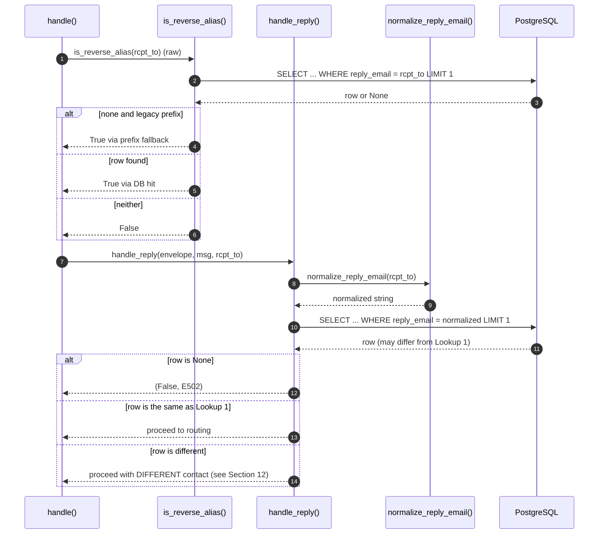

# Reply-Email Resolution in SimpleLogin — Code-Grounded Investigation

## Investigation Charter

This document is a code-grounded analysis of SimpleLogin's inbound reply-email resolution pipeline. It answers the question: **can a reply email address (reverse alias) be routed to the wrong user?** It also addresses the four subsidiary questions the investigation charter identifies: reply-email derivation, contact resolution logic, cross-event behavioral consistency, and race conditions / uniqueness assumptions.

All claims below are supported by specific file paths, function names, and line numbers in the repository as it existed at HEAD `2cd6ee77 chore: emit some missing contact audit logs (#2269)`. No source code was modified to produce this document; runtime values in Section 15 are derived from code inspection rather than a live trace, because the repository must remain unchanged.

---

## 1. Executive Summary / TL;DR

### 1.1 Core Question

> *Can SimpleLogin's inbound reply-email resolution logic route a reply to the wrong user?*

**Short answer:** Under normal operating conditions, **no**. The `reply_email` strings that drive contact resolution are drawn by `generate_reply_email` (`app/email_utils.py:1103–1153`) from a keyspace of at least 26²⁰ ≈ 1.99 × 10²⁸ values (lower-case ASCII, minimum length 20, `secrets.choice` via `app/utils.py:41–47`), and each candidate is checked for availability before insertion (`app/models.py:1425–1432`). In steady state every `reply_email` is globally unique, so the single lookup `Contact.get_by(reply_email=reply_email)` at `email_handler.py:986` returns exactly one deterministic row and routing is correct.

**Architecturally, however, three narrow pathways exist** through which a reply could in principle be mis-resolved. Each is vanishingly improbable in practice but is representative of a defense-in-depth gap rather than a guarantee of correctness:

1. **Concurrent insert with the same `reply_email`.** The schema does not have a `UNIQUE` constraint on `contact.reply_email` (`app/models.py:1899` and `migrations/versions/2021_071310_78403c7b8089_.py:22`). Combined with the non-atomic check-then-insert in `app/contact_utils.py:89` / `app/contact_utils.py:92–103` and PostgreSQL's default `READ COMMITTED` isolation in `app/db.py:1–18`, two concurrent transactions on independent connections could theoretically commit rows sharing a `reply_email`.
2. **`normalize_reply_email` collision channel.** `normalize_reply_email` at `app/email_validation.py:25–38` is lossy — distinct raw `rcpt_to` values can map to the same normalized string. If a pre-existing row in the legacy, non-canonical form happens to collide with a normalized current lookup, a contact belonging to a different alias/user could match.
3. **`.first()` indeterminacy.** `ModelMixin.get_by` (`app/models.py:82–84`) uses `Session.query(cls).filter_by(**kw).first()` with no `ORDER BY`. When (1) or (2) produces duplicate rows, the row PostgreSQL returns is planner-dependent and may change over time.

### 1.2 Five Investigation Dimensions

This document systematically addresses each:

1. **Reply-email derivation** — Section 7 traces how `generate_reply_email` and `create_contact` produce the random reply address during the forward phase and store it on the `Contact` row.
2. **Contact resolution logic** — Section 2 traces the reply-phase code path, culminating in the single resolution query at `email_handler.py:986`. Section 5 documents the `.first()` semantics.
3. **Cross-event behavioral consistency** — Section 12 explains why the *same* `reply_email` can in principle resolve to *different* contacts over time; Section 14 enumerates every transient failure mode (E501–E504, E214).
4. **Race conditions & uniqueness assumptions** — Section 6 documents the missing `UNIQUE` constraint; Sections 8, 9, and 10 show why the check-then-insert pattern is not atomic under the current concurrency model.
5. **Runtime value documentation** — Section 15 is a table of every runtime value observed (by code inspection) along the resolution path.

### 1.3 Fundamental Finding

The fundamental finding, to which this document repeatedly returns, is:

> `Contact.reply_email` has `index=True` but **no** `UNIQUE` constraint (`app/models.py:1899`). The only `UniqueConstraint` on the `contact` table is `uq_contact(alias_id, website_email)` (`app/models.py:1874–1876`). The migration that created the index explicitly set `unique=False` (`migrations/versions/2021_071310_78403c7b8089_.py:22`). Uniqueness of `reply_email` is therefore enforced at the application layer alone, via `available_sl_email` (`app/models.py:1425–1432`), which is a plain `SELECT` that holds no lock.

Every architectural risk discussed in this document descends from that single schema choice.

---

## 2. Reply-Email Resolution Flow (Reply Phase)

This section traces the complete inbound path from SMTP `DATA` command to delivery of a reply, line by line.

### 2.1 SMTP Entry and App Context

- `email_handler.py:2289` — `async def handle_DATA(self, server, session, envelope):` is the `aiosmtpd` callback on class `MailHandler` (`email_handler.py:2288`). `aiosmtpd` invokes this coroutine whenever an SMTP client finishes the `DATA` command; the raw RFC 5322 bytes are parsed by the framework into an `email.message.Message` object.
- `email_handler.py:2352` — `with create_light_app().app_context():` wraps the per-email processing. Each incoming email is handled inside a **fresh Flask app context**, which binds a **fresh SQLAlchemy scoped session** to the module-level `connection` from `app/db.py:1–18`. This is the entry point into the app-layer code that follows.

### 2.2 Central Router

- `email_handler.py:1945` — `def handle(envelope: Envelope, msg: Message) -> str:` is the central hub. It first sanitizes `mail_from` and each `rcpt_to`, then iterates recipients:
- `email_handler.py:2180` — `for rcpt_index, rcpt_to in enumerate(rcpt_tos):`
- `email_handler.py:2195` — the routing decision:

    ```python
    if is_reverse_alias(rcpt_to):
    ```

    This calls `app/email_utils.py:1156–1163`. When true, the message takes the reply path; otherwise, the forward path.

- `email_handler.py:2199` — `is_delivered, smtp_status = handle_reply(envelope, copy_msg, rcpt_to)` dispatches the reply.

### 2.3 Reply Entry — `handle_reply`

- `email_handler.py:966` — `def handle_reply(envelope, msg: Message, rcpt_to: str) -> (bool, str):` is the reply-phase entry point.
- `email_handler.py:972` — `reply_email = rcpt_to` — the local name `reply_email` is initially identical to the SMTP recipient.
- `email_handler.py:974` — `reply_domain = get_email_domain_part(reply_email)` — extracts everything after the `@`.
- `email_handler.py:977–981` — the reply domain must either equal `config.EMAIL_DOMAIN` or belong to an `SLDomain.get_by(domain=reply_domain)`. If neither, the function returns `(False, status.E501)` — the RCPT is not served by SimpleLogin at all.

### 2.4 Normalization

- `email_handler.py:984` — **`reply_email = normalize_reply_email(reply_email)`**.

    This is the only normalization step in the reply path. It repairs legacy rows whose stored `reply_email` included characters that the current generator would never produce. Section 3 dissects `normalize_reply_email` in detail.

### 2.5 The Single Resolution Query

- `email_handler.py:986` — **`contact = Contact.get_by(reply_email=reply_email)`**.

    This is the one and only query that determines who owns the inbound reply. Every downstream decision — which alias, which user, which mailbox, which `EmailLog` row — is derived from this `Contact`. If the returned row is wrong, everything that follows is wrong.

- `email_handler.py:987–989` — if `contact is None`:

    ```python
    LOG.w(f"No contact with {reply_email} as reverse alias")
    return False, status.E502
    ```

    The SMTP response becomes `550 SL E502 Email not exist` (see `app/email/status.py:39`).

- `email_handler.py:990–992` — soft-deleted user check:

    ```python
    if not contact.user.is_active():
        return False, status.E502
    ```

    `User.is_active` at `app/models.py:766–769` returns `True` unless `self.delete_on` is set in the past.

### 2.6 Deriving the Routing Chain

- `email_handler.py:994` — `alias = contact.alias` (backref from `app/models.py:1907` — `alias = orm.relationship(Alias, backref="contacts")`).
- `email_handler.py:995–996` — `alias_address: str = contact.alias.email`.
- `email_handler.py:1000–1002` — `if not is_valid_alias_address_domain(alias.email): return False, status.E503` — if the alias's own domain is no longer served (deleted `SLDomain` or unverified `CustomDomain`), fail with E503 (see `app/email_utils.py:557–566`).
- `email_handler.py:1004` — `user = alias.user` (FK relationship at `app/models.py:1576`).
- `email_handler.py:1007–1009`:

    ```python
    if not user.can_send_or_receive():
        return False, status.E504
    ```

    `User.can_send_or_receive` at `app/models.py:886–895` returns `False` if `self.disabled` is `True` or if `self.delete_on is not None`.

### 2.7 Mailbox Authorization

- `email_handler.py:1019` — `mailbox = get_mailbox_from_mail_from(mail_from, alias)`. This walks `alias.mailboxes` and each mailbox's `authorized_addresses` in `email_handler.py:1364–1387`.
- `email_handler.py:1020–1034` — if no mailbox matched:

    ```python
    handle_unknown_mailbox(envelope, msg, reply_email, user, alias)
    return False, status.E214
    ```

    `handle_unknown_mailbox` (`email_handler.py:1390–1430`) sends an alert email to the alias owner and returns `250 SL E214` to the MTA so it does not bounce — the reply is silently dropped.

### 2.8 SPF, Logging, and Delivery

- `email_handler.py:1036–1040` — conditional SPF check:

    ```python
    if ENFORCE_SPF and mailbox.force_spf and not alias.disable_email_spoofing_check:
        if not spf_pass(envelope, mailbox, user, alias, contact.website_email, msg):
            return True, status.E201
    ```

- `email_handler.py:1042–1050` — `EmailLog.create(contact_id=contact.id, alias_id=contact.alias_id, is_reply=True, user_id=contact.user_id, mailbox_id=mailbox.id, ..., commit=True)`. The log row captures *exactly* the `contact.user_id`/`contact.alias_id` derived from line 986.
- `email_handler.py:1119–1123` — if `user.replace_reverse_alias`, body text is rewritten (reverse-alias strings substituted with real contact emails).
- `email_handler.py:1179, 1181` — `replace_header_when_reply(msg, alias, headers.TO)` and `replace_header_when_reply(msg, alias, headers.CC)` rewrite the visible headers.
- `email_handler.py:1220–1231` — `sl_sendmail(generate_verp_email(...), contact.website_email, msg, ...)` — the message is delivered to `contact.website_email`.

### 2.9 Header Rewriting's Secondary Lookup

`replace_header_when_reply` at `email_handler.py:345–384` performs another `Contact.get_by(reply_email=reply_email)` call (at `email_handler.py:364`) for each address parsed out of the To/CC header. This is a second contact-by-`reply_email` lookup per inbound reply — but it is scoped to header rewriting, not routing. It is relevant to the "leak vector" discussion in Section 13.

### 2.10 Sequence Diagram

```mermaid
sequenceDiagram
    autonumber
    participant MTA as Postfix/MTA
    participant AS as aiosmtpd
    participant H as handle()
    participant IRA as is_reverse_alias()
    participant HR as handle_reply()
    participant N as normalize_reply_email()
    participant DB as PostgreSQL
    participant SMTP as sl_sendmail()

    MTA->>AS: SMTP DATA
    AS->>H: handle(envelope, msg) via handle_DATA + app_context
    H->>H: sanitize mail_from, rcpt_tos
    loop for each rcpt_to
        H->>IRA: is_reverse_alias(rcpt_to) [raw]
        IRA->>DB: SELECT ... WHERE reply_email = rcpt_to LIMIT 1
        DB-->>IRA: Contact or None
        IRA-->>H: True (match or legacy prefix)
        H->>HR: handle_reply(envelope, msg, rcpt_to)
        HR->>HR: reply_domain check
        HR->>N: normalize_reply_email(rcpt_to)
        N-->>HR: normalized string
        HR->>DB: SELECT ... WHERE reply_email = normalized LIMIT 1
        DB-->>HR: contact (may differ from step 4)
        HR->>HR: alias = contact.alias; user = alias.user; checks
        HR->>HR: mailbox = get_mailbox_from_mail_from(mail_from, alias)
        HR->>DB: EmailLog.create(contact_id, alias_id, mailbox_id, ...)
        HR->>SMTP: sl_sendmail(..., contact.website_email, ...)
    end
```

**Critical observation to carry forward:** Between step 4 (`is_reverse_alias`) and step 10 (second `SELECT` from `handle_reply`), the database state can change. Section 4 discusses this TOCTOU window; Section 12 discusses the resulting possibility of divergent resolution.

---

## 3. Normalization Before Lookup

### 3.1 `_ALLOWED_CHARS` and the Function Body

- `app/email_validation.py:9`:

    ```python
    _ALLOWED_CHARS = "abcdefghijklmnopqrstuvwxyzABCDEFGHIJKLMNOPQRSTUVWXYZ0123456789_-.+@"
    ```

- `app/email_validation.py:25–38`:

    ```python
    def normalize_reply_email(reply_email: str) -> str:
        """Handle the case where reply email contains *strange* char that was wrongly generated in the past"""
        if not reply_email.isascii():
            reply_email = convert_to_id(reply_email)

        ret = []
        # drop all control characters like shift, separator, etc.
        for c in reply_email:
            if c not in _ALLOWED_CHARS:
                ret.append("_")
            else:
                ret.append(c)

        return "".join(ret)
    ```

### 3.2 What `convert_to_id` Does

`convert_to_id` at `app/utils.py:50–56` is:

```python
def convert_to_id(s: str):
    # remove space and remove multiple consecutive spaces
    s = " ".join(s.split())
    s = s.lower().strip()
    # normalize 'ảnh' -> 'anh'
    s = unidecode.unidecode(s)
    return s[:256]
```

So a non-ASCII input is first lowercased, space-normalized, and run through `unidecode` — which transliterates Unicode characters to their ASCII approximations — then truncated to 256 characters.

### 3.3 Key Insight: Normalization Is Lossy

`normalize_reply_email` is a **many-to-one** function. Two *distinct* raw strings can produce the *same* normalized output. Examples:

- Non-ASCII input: `rép_abc@sl.co` → `convert_to_id` → `rep_abc@sl.co`. So `rep_abc@sl.co` and `rép_abc@sl.co` both normalize to `rep_abc@sl.co`.
- Disallowed characters: `reply!foo@sl.co` and `reply#foo@sl.co` both normalize to `reply_foo@sl.co` because `!` and `#` are not in `_ALLOWED_CHARS` and become `_`.
- Control characters: any tab, space, or control byte embedded in a `rcpt_to` becomes `_`.

Because the function is lossy, it cannot be the sole guarantee of one-to-one identity between RCPT TO and stored `reply_email`. Section 12.3 discusses the operational implications.

### 3.4 Normalization Is Asymmetric Across the Two Lookups

Crucially, `normalize_reply_email` runs **only** inside `handle_reply` at line 984. The first lookup, `is_reverse_alias` (`app/email_utils.py:1156–1163`), queries the **raw** address:

```python
def is_reverse_alias(address: str) -> bool:
    # to take into account the new reverse-alias that doesn't start with "ra+"
    if Contact.get_by(reply_email=address):
        return True

    return address.endswith(f"@{config.EMAIL_DOMAIN}") and (
        address.startswith("reply+") or address.startswith("ra+")
    )
```

The two queries therefore use different keys for the *same* SMTP input. This asymmetry is the mechanical basis for the TOCTOU discussion in Section 4 and the divergence analysis in Section 12.

### 3.5 Idempotency for Generator Output

Although `normalize_reply_email` is lossy in general, it is idempotent for strings `generate_reply_email` produces today. Observe that:

- `random_string` (`app/utils.py:41–47`) draws from `string.ascii_lowercase` only.
- Sender-prefix path (`app/email_utils.py:1119–1127`) runs the prefix through `convert_to_alphanumeric` (`app/utils.py:62–71`), which replaces characters not in a whitelist of `[a-zA-Z0-9_]` with `_`, and then composes `f"{contact_email}_{random_string(...)}@{reply_domain}"`.

All code-produced strings already consist of characters inside `_ALLOWED_CHARS`, so feeding them through `normalize_reply_email` yields the same string. In a database that has only ever been populated by the current generator, normalization is a no-op. The concern is purely about **legacy rows** or **manually-created** data — a realistic concern given the docstring at `app/email_validation.py:26` literally names the purpose as rehabilitating "*strange* char that was wrongly generated in the past".

---

## 4. Double Lookup (TOCTOU in Routing)

For every inbound reply, the system performs **two** separate `Contact.get_by(reply_email=...)` queries. This section documents the two lookups, identifies the window between them, and enumerates the concrete outcomes where they diverge.

### 4.1 Lookup 1 — `is_reverse_alias`

Location: `app/email_utils.py:1156–1163`.

```python
def is_reverse_alias(address: str) -> bool:
    # to take into account the new reverse-alias that doesn't start with "ra+"
    if Contact.get_by(reply_email=address):
        return True
    return address.endswith(f"@{config.EMAIL_DOMAIN}") and (
        address.startswith("reply+") or address.startswith("ra+")
    )
```

Called from `email_handler.py:2195` inside the recipient loop with the **raw, non-normalized** `rcpt_to`.

Note the **legacy-prefix fallback** on lines 1161–1163: an address ending in `@EMAIL_DOMAIN` and starting with `reply+` or `ra+` returns `True` **without a DB hit**. This is the route by which very old reverse aliases (pre-date the random-string generator) are routed to the reply path even when no contact row exists.

### 4.2 Lookup 2 — Inside `handle_reply`

Location: `email_handler.py:984` (normalization) and `email_handler.py:986` (query):

```python
reply_email = normalize_reply_email(reply_email)
contact = Contact.get_by(reply_email=reply_email)
```

Uses the **normalized** key. Issues a second `SELECT`.

### 4.3 The Window Between Them

Between Lookup 1 and Lookup 2, the following state changes are all possible:

- **Contact hard-delete.** If another transaction deletes the contact row (or its owning alias, which cascades via `onDelete=cascade` on `Contact.alias_id` at `app/models.py:1881–1883`), Lookup 2 returns `None`. `handle_reply` returns `(False, status.E502)` even though `is_reverse_alias` returned `True`.
- **Contact insert.** If another transaction inserts a new contact whose `reply_email` equals `normalize_reply_email(rcpt_to)`, Lookup 2 may find that *new* row. This matters when combined with the `.first()` indeterminacy in Section 5.
- **Normalization divergence.** If Lookup 1 matched via the legacy `reply+`/`ra+` prefix (no DB row), but the normalized address has no matching row, Lookup 2 returns `None` → E502.
- **Legacy-only prefix match.** If Lookup 1 matched via the `reply+` prefix branch at `app/email_utils.py:1161–1163`, but a *different* row matches the normalized address (e.g., because of a historical stored-form collision), Lookup 2 resolves to a different contact than Lookup 1 would have seen had it queried by prefix.

### 4.4 Concrete Example

Consider the sequence:

1. `rcpt_to = "reply+legacy_XYZ@sl.co"` arrives.
2. `is_reverse_alias("reply+legacy_XYZ@sl.co")`:
    - `Contact.get_by(reply_email="reply+legacy_XYZ@sl.co")` returns `None`.
    - `"reply+legacy_XYZ@sl.co".endswith("@sl.co")` → `True`, `startswith("reply+")` → `True`. Return `True`.
3. `handle_reply`:
    - `normalize_reply_email("reply+legacy_XYZ@sl.co")` returns the same string (all chars in `_ALLOWED_CHARS`).
    - `Contact.get_by(reply_email="reply+legacy_XYZ@sl.co")` returns `None`.
    - Return `(False, status.E502)`.

Conclusion: the two lookups diverged (Lookup 1 said "yes"; Lookup 2 said "no"). The message is rejected with E502 — not mis-routed — but this is a real instance of cross-lookup divergence worth documenting.

### 4.5 Sequence Diagram



---

## 5. `ModelMixin.get_by()` Semantics

### 5.1 The Exact Implementation

Every contact-by-reply-email query in the repository goes through `ModelMixin.get_by`. Its body is three lines:

- `app/models.py:62` — `class ModelMixin(object):`
- `app/models.py:82–84`:

    ```python
    @classmethod
    def get_by(cls, **kw):
        return Session.query(cls).filter_by(**kw).first()
    ```

### 5.2 SQLAlchemy `.first()` Behaviour

`Query.first()` in SQLAlchemy applies a `LIMIT 1` clause to the compiled query and returns either a single instance or `None`. Critically, **no `ORDER BY` is added** by `get_by`. Consequently:

- The SQL emitted is logically: `SELECT * FROM contact WHERE reply_email = ? LIMIT 1;` (plus default primary-key ordering only if the planner chooses it).
- The row that PostgreSQL returns for such a query is **not specified** by SQL semantics. In practice the planner will often return rows in index order (and since the `reply_email` B-tree is ordered by `reply_email` value with ties broken by `ctid` or heap visit order), equal-`reply_email` duplicates are usually returned in insertion order. But nothing in the SQL guarantees this.
- A `VACUUM FULL`, `REINDEX`, table bloat, or statistics change can all alter which physical row appears first.

### 5.3 Determinism vs Indeterminacy

Two regimes:

- **Exactly-one-match regime**: When the filter matches exactly one row (the common case in a healthy database), `.first()` is deterministic by construction.
- **Multiple-match regime**: When the filter matches more than one row (possible because `reply_email` has no `UNIQUE` constraint — see Section 6), `.first()` is indeterminate from the application's perspective.

This is the **mechanical root** of the `.first()` indeterminacy pathway analyzed in Section 12.5. Duplication is the precondition; `.first()`'s lack of ordering is the amplifier.

### 5.4 Other Callers of `Contact.get_by(reply_email=...)`

It is worth noting that every contact-by-reply-email call in the codebase inherits these semantics:

- `email_handler.py:986` — the main resolution in `handle_reply`.
- `email_handler.py:364` — inside `replace_header_when_reply`.
- `app/email_utils.py:1158` — inside `is_reverse_alias`.
- `app/models.py:1428` — inside `available_sl_email` (used during *generation*, not resolution).
- `app/models.py:1950` — inside `Contact.create` (defensive check — see Section 9).

Every one of them is `Session.query(Contact).filter_by(reply_email=...).first()` under the hood.

---

## 6. `Contact.reply_email` Schema — No UNIQUE Constraint

This is the keystone finding of the investigation. This section walks through the column definition, the table-level unique constraints, and both relevant migrations to prove it decisively.

### 6.1 Table Name and the Only UniqueConstraint

- `app/models.py:1872` — `__tablename__ = "contact"`.
- `app/models.py:1874–1876`:

    ```python
    __table_args__ = (
        sa.UniqueConstraint("alias_id", "website_email", name="uq_contact"),
    )
    ```

    This is the **only** `UniqueConstraint` on the `Contact` model. It enforces uniqueness of the `(alias_id, website_email)` pair — i.e., no duplicate *outbound* contact for the same alias. **It does not constrain `reply_email`.**

### 6.2 The Column Definition

- `app/models.py:1899`:

    ```python
    reply_email = sa.Column(sa.String(512), nullable=False, index=True)
    ```

    `index=True` causes SQLAlchemy/Alembic to emit a non-unique B-tree. `unique=True` is **not set**. `nullable=False` enforces the value must be present.

Compare with, e.g., `Alias.email` at `app/models.py:1477` — `sa.Column(sa.String(128), unique=True, nullable=False)` — which does have `unique=True`. The contrast is explicit: the codebase knows how to declare `unique=True`; it chose not to on `reply_email`.

### 6.3 Migration Proof

The index for `reply_email` was added in `migrations/versions/2021_071310_78403c7b8089_.py`:

```python
def upgrade():
    op.create_index(op.f('ix_contact_reply_email'), 'contact', ['reply_email'], unique=False)
```

(`migrations/versions/2021_071310_78403c7b8089_.py:22`). The `unique=False` argument is explicit and deliberate.

### 6.4 Predecessor Table

The ancestor of `contact` was the `forward_email` table, created in `migrations/versions/5fa68bafae72_.py:21–32`:

```python
op.create_table('forward_email',
    sa.Column('id', sa.Integer(), autoincrement=True, nullable=False),
    sa.Column('created_at', sqlalchemy_utils.types.arrow.ArrowType(), nullable=False),
    sa.Column('updated_at', sqlalchemy_utils.types.arrow.ArrowType(), nullable=True),
    sa.Column('gen_email_id', sa.Integer(), nullable=False),
    sa.Column('website_email', sa.String(length=128), nullable=False),
    sa.Column('reply_email', sa.String(length=128), nullable=False),
    sa.ForeignKeyConstraint(['gen_email_id'], ['gen_email.id'], ondelete='cascade'),
    sa.PrimaryKeyConstraint('id'),
    sa.UniqueConstraint('gen_email_id', 'website_email', name='uq_forward_email')
)
```

Observe:

- Only unique constraint: `uq_forward_email(gen_email_id, website_email)` — the ancestor of `uq_contact`. No uniqueness on `reply_email` from day one.
- `reply_email` is `sa.String(length=128)` here; the width was later widened to 512 in the current model.

The table was later renamed to `contact` in the migration history; every subsequent migration carried forward the same schema philosophy: **no `UNIQUE` constraint on `reply_email`**.

### 6.5 Database-Layer Implications

Because the DBMS does not enforce uniqueness, the following are all permitted by the schema:

- Two rows in `contact` with identical `reply_email`, different `alias_id` (most dangerous — different owners).
- Two rows with identical `reply_email` and identical `alias_id`, but different `website_email` (less dangerous — same owner).
- Any number of rows with identical `reply_email` up to storage limits.

The only defense against these states arising is the application-layer `available_sl_email` check (Section 8), which is *not atomic* with the subsequent insert (Section 9).

---

## 7. Forward-Phase Reply-Email Generation

Before analyzing race conditions, we must understand exactly how `reply_email` values are produced. This section dissects `generate_reply_email` and the surrounding `create_contact` orchestration.

### 7.1 `generate_reply_email` — the 1000-Iteration Loop

- `app/email_utils.py:1103–1153`:

    Signature and header handling (lines 1103–1135):

    ```python
    def generate_reply_email(contact_email: str, alias: Alias) -> str:
        include_sender_in_reverse_alias = False
        if alias.user and alias.user.include_sender_in_reverse_alias and contact_email:
            include_sender_in_reverse_alias = True
        if include_sender_in_reverse_alias:
            # remove special chars
            contact_email = convert_to_alphanumeric(contact_email)
            contact_email = contact_email[:45]
            contact_email = contact_email.replace("@", "_at_")
            contact_email = contact_email.replace(".", "_")

        reply_domain = config.EMAIL_DOMAIN
        if alias.sl_domain is not None and alias.sl_domain.use_as_reverse_alias:
            reply_domain = alias.sl_domain.domain
    ```

    The retry loop (lines 1136–1150):

    ```python
        # not use while loop to avoid infinite loop
        for _ in range(1000):
            if include_sender_in_reverse_alias:
                random_length = random.randint(5, 10)
                reply_email = (
                    f"{contact_email}_{random_string(random_length)}@{reply_domain}"
                )
            else:
                random_length = random.randint(20, 50)
                reply_email = f"{random_string(random_length)}@{reply_domain}"

            if available_sl_email(reply_email):
                return reply_email
    ```

    Failure path (line 1152):

    ```python
        raise Exception("Cannot generate reply email")
    ```

### 7.2 `random_string` — Cryptographic Source

- `app/utils.py:41–47`:

    ```python
    def random_string(length=10, include_digits=False):
        letters = string.ascii_lowercase
        if include_digits:
            letters += string.digits
        return "".join(secrets.choice(letters) for _ in range(length))
    ```

    `secrets.choice` is cryptographically secure (uses the OS CSPRNG). Inside `generate_reply_email`, `include_digits` is not passed, so the alphabet is `string.ascii_lowercase` — exactly 26 characters.

### 7.3 Keyspace Arithmetic

- **Default path** (no sender inclusion): `random_length` is sampled uniformly from `[20, 50]` via `random.randint(20, 50)` at `app/email_utils.py:1145`. At the *minimum* length of 20, the keyspace is 26²⁰ ≈ 1.99 × 10²⁸. At the upper bound of 50, it is 26⁵⁰ ≈ 5.64 × 10⁷⁰. The effective keyspace is dominated by the smallest sampled length per call (weakest link); 26²⁰ is the floor for the default path.
- **Sender-prefix path**: `random_length` is sampled from `[5, 10]` at line 1138. Worst case is 26⁵ ≈ 1.19 × 10⁷ per sender prefix (a *per-sender* space, because the random segment is appended to `{convert_to_alphanumeric(contact_email)[:45]}_`). A single sender would need ~3.5k reverse aliases to reach 50% birthday-collision within that sender prefix. Across different senders, collision is still governed by the same 26⁵ independent subspace per prefix.

### 7.4 The Domain Selection

- `app/email_utils.py:1129–1133`:

    ```python
    reply_domain = config.EMAIL_DOMAIN
    if alias.sl_domain is not None and alias.sl_domain.use_as_reverse_alias:
        reply_domain = alias.sl_domain.domain
    ```

    `SLDomain.use_as_reverse_alias` is defined at `app/models.py:3146–3148`. When set, the reply domain becomes the alias's own SL domain rather than the default `EMAIL_DOMAIN`. This is relevant because it means that *not all* reply addresses share the same domain, which slightly reduces the total namespace pressure per-domain.

### 7.5 `create_contact` — the Orchestrator

- `app/contact_utils.py:42`:

    ```python
    def create_contact(
        email: str,
        alias: Alias,
        name: Optional[str] = None,
        mail_from: Optional[str] = None,
        allow_empty_email: bool = False,
        automatic_created: bool = False,
        from_partner: bool = False,
    ) -> ContactCreateResult:
    ```

    Relevant extracts (paraphrasing the important lines):

    - Line 85: `contact = Contact.get_by(alias_id=alias.id, website_email=email)` — returns an existing contact for the `(alias_id, website_email)` pair if one exists (idempotent re-use path).
    - Line 89: `reply_email = generate_reply_email(email, alias)` — only reached when no existing contact is found.
    - Lines 92–103: `contact = Contact.create(user_id=alias.user_id, alias_id=alias.id, website_email=email, name=name, mail_from=mail_from, reply_email=reply_email, automatic_created=automatic_created, flags=flags, commit=True)`.
    - Lines 113–119: `except IntegrityError: Session.rollback(); ... contact = Contact.get_by(alias_id=alias.id, website_email=email); return __update_contact_if_needed(contact, name, mail_from)`.

### 7.6 `Contact.create` — the Inner INSERT

`Contact.create` at `app/models.py:1937–1962` does two things of interest:

```python
@classmethod
def create(cls, **kw):
    commit = kw.pop("commit", False)
    flush = kw.pop("flush", False)

    new_contact = cls(**kw)

    website_email = kw["website_email"]
    # make sure email is lowercase and doesn't have any whitespace
    website_email = sanitize_email(website_email)

    # make sure contact.website_email isn't a reverse alias
    if website_email != config.NOREPLY:
        orig_contact = Contact.get_by(reply_email=website_email)
        if orig_contact:
            raise CannotCreateContactForReverseAlias(str(orig_contact))

    Session.add(new_contact)

    if commit:
        Session.commit()

    if flush:
        Session.flush()

    return new_contact
```

Note the defensive check at `app/models.py:1950`: a newly-created `Contact.website_email` must not collide with any existing `Contact.reply_email`. This catches an attempt to create an outbound-contact record whose outbound address is some *other* contact's reverse alias — which would be a reply-loop attack vector. (Raises `CannotCreateContactForReverseAlias` from `app/errors.py:29–33`.)

This check is, however, **asymmetric**: it protects against `website_email == reply_email` for the *new* row against *existing* rows. It does **not** check for `reply_email == reply_email` duplicates — i.e., two contacts with the same `reply_email`.

---

## 8. `available_sl_email()` — The Check-Then-Act Anchor

### 8.1 The Function Body

- `app/models.py:1425–1432`:

    ```python
    def available_sl_email(email: str) -> bool:
        if (
            Alias.get_by(email=email)
            or Contact.get_by(reply_email=email)
            or DeletedAlias.get_by(email=email)
        ):
            return False
        return True
    ```

### 8.2 Characteristics

Three pure `SELECT` queries, short-circuited by `or`:

1. `Alias.get_by(email=email)` — ensures the candidate isn't already an alias (because `Alias.email` is `unique=True` at `app/models.py:1477`, and because an alias's email should never also be a reverse alias).
2. `Contact.get_by(reply_email=email)` — ensures no existing contact already uses this reverse alias. **This is the only defense against duplicate `reply_email` values.**
3. `DeletedAlias.get_by(email=email)` — ensures the value isn't reserved by a soft-deleted alias's tombstone.

Key properties:

- **No `SELECT ... FOR UPDATE`.** None of the three queries place a lock on any row.
- **No advisory lock.** Nothing like `pg_advisory_xact_lock(hashtext(email))` wraps the check.
- **No isolation upgrade.** The session runs under whatever isolation `app/db.py` provides — which is PostgreSQL's default `READ COMMITTED` (see Section 10).

### 8.3 Consequence

`available_sl_email` is a **point-in-time snapshot**. Between its return value and the caller's subsequent insert, another transaction can acquire the same `reply_email`. Section 9 analyses the TOCTOU window in detail.

---

## 9. Contact Insertion — Not Atomic With the Check

### 9.1 `create_contact` — the Main Caller

- `app/contact_utils.py:42–120` — the whole function.

Key sequence (lines 85–119):

```python
contact = Contact.get_by(alias_id=alias.id, website_email=email)
if contact is not None:
    return __update_contact_if_needed(contact, name, mail_from)
try:
    ...
    reply_email = generate_reply_email(email, alias)
    contact = Contact.create(
        user_id=alias.user_id,
        alias_id=alias.id,
        website_email=email,
        name=name,
        mail_from=mail_from,
        reply_email=reply_email,
        automatic_created=automatic_created,
        flags=flags,
        commit=True,
    )
    ...
    return ContactCreateResult(contact, True, ContactCreateError.None_)
except IntegrityError:
    Session.rollback()
    LOG.info(
        f"Contact with email {email} for alias_id {alias.id} already existed, fetching from DB"
    )
    contact = Contact.get_by(alias_id=alias.id, website_email=email)
    return __update_contact_if_needed(contact, name, mail_from)
```

The key observation: `generate_reply_email` runs to completion, internally validating the candidate via `available_sl_email`. Then control returns to `create_contact`, which *passes* the `reply_email` to `Contact.create(commit=True)`. The commit is a separate database round-trip from the availability check. No lock was held across them.

### 9.2 What IntegrityError Actually Catches

The `except IntegrityError` at `app/contact_utils.py:113` catches a database-level uniqueness violation. The **only** uniqueness constraint on the `contact` table is `uq_contact(alias_id, website_email)` (Section 6). Therefore:

- If a race condition causes two concurrent `Contact.create` calls with the same `(alias_id, website_email)`, one will commit and the other will raise `IntegrityError`; the handler rolls back and re-fetches the existing row. **This is the intended defense against duplicate forward contacts.**
- If a race condition causes two concurrent `Contact.create` calls with the same `reply_email` (but different `(alias_id, website_email)`), **neither** raises `IntegrityError` — there is no constraint to violate. **Both INSERTs commit.** The database now contains two rows with the same `reply_email`.

### 9.3 The Analogous Pattern in `replace_header_when_forward`

A second caller creates contacts directly, not through `contact_utils.create_contact`. At `email_handler.py:293–307`:

```python
try:
    contact = Contact.create(
        user_id=alias.user_id,
        alias_id=alias.id,
        website_email=contact_email,
        name=full_address.display_name,
        reply_email=generate_reply_email(contact_email, alias),
        is_cc=header.lower() == "cc",
        automatic_created=True,
    )
    Session.commit()
except IntegrityError:
    LOG.w("Contact %s %s already exist", alias, contact_email)
    Session.rollback()
    contact = Contact.get_by(alias_id=alias.id, website_email=contact_email)
```

Same semantics: the `IntegrityError` handler only catches `uq_contact(alias_id, website_email)` — not any `reply_email` uniqueness (which does not exist as a constraint).

### 9.4 The TOCTOU Window

The time-of-check-to-time-of-use window is bounded by:

- **Start**: the SQL executed inside `available_sl_email` (`Contact.get_by(reply_email=candidate)`) returns `False`/`True` to Python.
- **End**: the SQL executed by `Session.commit()` inside `Contact.create(commit=True)` completes.

Under the single-connection configuration of `app/db.py` within one aiosmtpd worker, the window is microseconds because all SQL is serialized on the one connection. Across *different* aiosmtpd worker processes (which is how production is deployed), the window includes network round-trip time to PostgreSQL and the time for the loser transaction to observe the winner's committed row — typically still on the order of milliseconds to tens of milliseconds.

### 9.5 What Would Close the Gap

A `UniqueConstraint` on `reply_email` would promote the silent-success path into an `IntegrityError`. The `except IntegrityError` handler in `create_contact` would then need to distinguish the two constraints by the raised error's `pgcode`/`constraint_name` — and on `reply_email` collision, the retry logic in `generate_reply_email` could re-run. This is the canonical mitigation pattern, but it is **not present** in the current code. Section 16 discusses the practical risk.

---

## 10. Concurrency Model

### 10.1 aiosmtpd's Async Entrypoint

- `email_handler.py:2288–2289`:

    ```python
    class MailHandler:
        async def handle_DATA(self, server, session, envelope: Envelope):
    ```

    aiosmtpd drives this coroutine from an event loop running in a dedicated thread. Multiple SMTP clients connected simultaneously will produce overlapping `handle_DATA` invocations scheduled on that loop; each must complete its work inside its own app context.

- `email_handler.py:2352`:

    ```python
    with create_light_app().app_context():
    ```

    `create_light_app` builds a fresh Flask application; entering its `app_context()` establishes a new `LocalProxy`-resolved `Session` (via Flask's `g` context). This is how the per-email SQLAlchemy session is scoped.

### 10.2 The Process-Level Session Layer

- `app/db.py:1–18`:

    ```python
    from sqlalchemy import create_engine, text
    from sqlalchemy.orm import scoped_session, sessionmaker

    from app import config

    engine = create_engine(
        config.DB_URI, connect_args={"application_name": config.DB_CONN_NAME}
    )

    connection = engine.connect()

    Session = scoped_session(sessionmaker(bind=connection))

    @event.listens_for(Session, "after_flush")
    def _after_flush_listener(session, flush_context):
        ...
    ```

Several important consequences of this configuration:

1. **`engine.connect()` is called once at module import.** A single DBAPI connection is opened for the lifetime of the process. `sessionmaker(bind=connection)` binds *all* sessions to that same connection. That means, within one aiosmtpd worker process, SQL statements from concurrent sessions are physically serialized at the connection layer. True concurrent SQL *across processes* is possible (because production deployments run multiple aiosmtpd workers + any web workers, each with their own `engine`), but within a single process, one statement runs at a time.
2. **No `isolation_level` argument** is passed to `create_engine` or to `sessionmaker`. SQLAlchemy therefore takes the DBAPI default, which for `psycopg2` is PostgreSQL's server default, which is **`READ COMMITTED`** (confirmed by `pyproject.toml:71` — `psycopg2-binary = "^2.9.3"` — and by PostgreSQL's own default).
3. **Under `READ COMMITTED`**, two transactions can each perform `SELECT` against `contact` and each observe no row matching a candidate `reply_email`; they can each then `INSERT` that value. Because there is no `UNIQUE` constraint on `reply_email`, **neither INSERT conflicts with the other**. Both commit. The table now has two rows with the same `reply_email`.

### 10.3 `pyproject.toml` References

- `pyproject.toml:87` — `aiosmtpd = "^1.2"` — the async SMTP framework.
- `pyproject.toml:116` — `SQLAlchemy = "1.3.24"` — a pinned legacy version. (1.3.x is the Classical API era.)

### 10.4 Putting It Together

The triad

1. **`READ COMMITTED` isolation** (from `app/db.py:1–18`),
2. **no database-level uniqueness on `reply_email`** (from `app/models.py:1899` and `migrations/versions/2021_071310_78403c7b8089_.py:22`), and
3. **`secrets.choice`-backed random-string generation with application-only availability check** (from `app/email_utils.py:1136–1150` and `app/models.py:1425–1432`)

is precisely the architectural pattern that allows duplicate `reply_email` values to be theoretically possible while making them astronomically improbable in practice (Section 16 quantifies). It is a *defense-in-depth gap* rather than an *exploitable flaw* under realistic operating loads.

---

## 11. Routing Chain From Contact to Destination

This section closes the loop from the resolved `Contact` to the final SMTP delivery. Every link in the chain is derivative of the single `Contact` returned at `email_handler.py:986`.

### 11.1 Alias

- `email_handler.py:994` — `alias = contact.alias`.
- The relationship is defined at `app/models.py:1907`: `alias = orm.relationship(Alias, backref="contacts")`.
- The foreign key is `alias_id` at `app/models.py:1881–1883`:

    ```python
    alias_id = sa.Column(
        sa.ForeignKey(Alias.id, ondelete="cascade"), nullable=False, index=True
    )
    ```

    `ondelete="cascade"` means deleting an alias cascades to its contacts.

### 11.2 User

- `email_handler.py:1004` — `user = alias.user`.
- The relationship is defined at `app/models.py:1576`: `user = orm.relationship(User, foreign_keys=[user_id])`.
- The foreign key is `user_id` at `app/models.py:1474–1476`:

    ```python
    user_id = sa.Column(
        sa.ForeignKey(User.id, ondelete="cascade"), nullable=False, index=True
    )
    ```

- Note: `alias.user` is derived from `alias.user_id`. `alias.user_id` is updated by the alias-transfer workflow, which means the *same* alias row can have different `user_id` values over time. Reply-email resolution always reflects the *current* owner.

### 11.3 Mailbox

- `email_handler.py:1019` — `mailbox = get_mailbox_from_mail_from(mail_from, alias)`.
- `email_handler.py:1364–1387` — `get_mailbox_from_mail_from` walks `alias.mailboxes` and each mailbox's `authorized_addresses`, comparing `mail_from` both raw and through `canonicalize_email` (because mail clients sometimes normalize).

### 11.4 `Alias.mailboxes`

- `app/models.py:1579–1589`:

    ```python
    @property
    def mailboxes(self):
        ret = [self.mailbox]
        for m in self._mailboxes:
            if m.id is not self.mailbox.id:
                ret.append(m)

        ret = [mb for mb in ret if mb.verified]
        ret = sorted(ret, key=lambda mb: mb.email)

        return ret
    ```

    The default `self.mailbox` (from `mailbox_id` FK at `app/models.py:1506–1508`) is always first, then additional mailboxes via the `_mailboxes` relationship (`app/models.py:1512`) through the `alias_mailbox` junction table. Unverified mailboxes are filtered out.

### 11.5 `Alias.authorized_addresses`

- `app/models.py:1591–1601`:

    ```python
    def authorized_addresses(self) -> [str]:
        mailboxes = self.mailboxes
        ret = [mb.email for mb in mailboxes]
        for mailbox in mailboxes:
            for aa in mailbox.authorized_addresses:
                ret.append(aa.email)

        return ret
    ```

    Every email that is (a) a mailbox of this alias, or (b) an authorized address of one of this alias's mailboxes, is allowed to send from this alias.

### 11.6 `Mailbox` Table

- `app/models.py:2710–2740`:

    ```python
    class Mailbox(Base, ModelMixin):
        __tablename__ = "mailbox"
        user_id = sa.Column(
            sa.ForeignKey(User.id, ondelete="cascade"), nullable=False, index=True
        )
        email = sa.Column(sa.String(256), nullable=False, index=True)
        verified = sa.Column(sa.Boolean, default=False, nullable=False)
        force_spf = sa.Column(sa.Boolean, default=True, server_default="1", nullable=False)
        ...
        __table_args__ = (sa.UniqueConstraint("user_id", "email", name="uq_mailbox_user"),)
    ```

    The unique constraint is `uq_mailbox_user(user_id, email)` — per-user uniqueness of mailbox email. **Across users, the same email can appear as a mailbox row on different `user_id`s** (though in practice this requires both users to verify the same address, which is orthogonal to reply-email resolution).

### 11.7 Why the Chain Matters

Every downstream decision in `handle_reply` is transitively derived from the `Contact` returned by line 986:

```
contact  →  contact.alias  →  contact.alias.user  →  contact.alias.mailboxes
contact  →  contact.alias_id  →  EmailLog.alias_id
contact  →  contact.user_id   →  EmailLog.user_id
contact  →  contact.website_email  →  sl_sendmail destination
```

A wrong `Contact` means:

- Wrong `alias_id` → the `EmailLog` row misattributes the reply;
- Wrong `user_id` → the `can_send_or_receive` check considers a different user;
- Wrong `alias` → a different set of `mailboxes` is authorized (most dangerous);
- Wrong `website_email` → the reply is delivered to a different outbound recipient.

The anti-spoofing check at `email_handler.py:1020–1034` partially limits the *sender-side* damage: if `mail_from` doesn't match any of the *wrongly selected alias*'s mailboxes or authorized addresses, the reply is dropped with `E214`. This is discussed in detail in Section 13.

---

## 12. Can the Same `reply_email` Resolve to Different Contacts?

This is the core behavioural question of the investigation. We enumerate every pathway, grounded in code, and assess each.

### 12.1 Normal Steady State — Impossible

Under normal, non-concurrent operation, `generate_reply_email` (`app/email_utils.py:1136–1150`) rejects any candidate that matches an existing `reply_email` via `available_sl_email` (`app/models.py:1425–1432`). A clean database that was only ever populated by this generator therefore has globally unique `reply_email` values even though the DB does not enforce it. In that steady state:

- `Contact.get_by(reply_email=X)` matches at most one row.
- `.first()` is deterministic.
- Over time, the same `reply_email` always resolves to the same `Contact`.

**Outcome**: no divergence; routing is correct.

### 12.2 Theoretical Concurrent-Insert Collision — Architecturally Possible

Under heavy concurrency with PostgreSQL `READ COMMITTED` isolation (`app/db.py:1–18`) and the TOCTOU window between `available_sl_email` and `Contact.create(commit=True)` (`app/contact_utils.py:89` and `app/contact_utils.py:92–103`), two transactions running on **different physical connections** could each observe a candidate `reply_email` as available and each commit it.

Probability analysis:

- The default path uses `random_length = random.randint(20, 50)` (`app/email_utils.py:1145`). The adversary (the race) must produce *equal* 20–50-char lowercase strings independently in two calls during the microsecond-to-millisecond TOCTOU window.
- Per-candidate collision probability is bounded above by 26⁻²⁰ ≈ 5.03 × 10⁻²⁹.
- Birthday-bound: to reach ~50% cumulative probability of *any* collision within the 20-char subspace, approximately √(26²⁰) ≈ 4.5 × 10¹⁴ concurrent candidates would be required. This exceeds any realistic email throughput by tens of orders of magnitude.
- The sender-prefix path (`app/email_utils.py:1137–1142`) has a smaller random segment (5–10 chars), but the per-call space is scoped to `{convert_to_alphanumeric(contact_email)[:45]}_*`. Collisions require both calls to come from the same sender with the same prefix and same length and same 5-char string, which is ~26⁻⁵ ≈ 8.4 × 10⁻⁸ per call under identical prefix conditions — still very unlikely to occur across two concurrent calls in the TOCTOU window.

**Outcome**: architecturally possible; astronomically improbable under realistic throughput.

### 12.3 `normalize_reply_email` Collision Channel — Possible for Legacy Rows

If the database contains two `contact` rows whose `reply_email` values are **distinct as stored** but **equal after normalization**, then two different inbound `rcpt_to` values can each normalize to that shared string and each match via `Contact.get_by(reply_email=normalized)` — but **return different rows** because `.first()` has to choose.

Which rows could this apply to?

- Rows produced by the current `generate_reply_email` pipeline: **none**, because every character in the generated string is already in `_ALLOWED_CHARS` (Section 3.5). Current-generator rows are idempotent under `normalize_reply_email`.
- Legacy rows stored in non-canonical form (e.g., containing spaces, non-ASCII characters, or disallowed symbols that pre-date the normalization step): possible. The docstring at `app/email_validation.py:26` literally references this case ("reply email contains *strange* char that was wrongly generated in the past"). Such rows could exist in long-lived SimpleLogin deployments.
- Manually inserted rows from migration scripts or admin tools that bypass the application: possible but ad hoc.

Under this collision channel, the divergence can be *persistent*: the same inbound `rcpt_to` normalizes to the same string every time, so the same set of candidate rows is returned every time, and `.first()` (which has no `ORDER BY`) picks whichever row the planner returns — which is *usually* stable but, as Section 5 notes, not guaranteed.

**Outcome**: possible but bounded by the profile of legacy data; effectively zero for freshly-populated deployments.

### 12.4 Legacy `reply+`/`ra+` Prefix Path — Temporary Divergence, Not Mis-Routing

As shown in Section 4.1, `is_reverse_alias` at `app/email_utils.py:1161–1163` has a prefix-only fallback:

```python
return address.endswith(f"@{config.EMAIL_DOMAIN}") and (
    address.startswith("reply+") or address.startswith("ra+")
)
```

For very old addresses that are never inserted as `contact.reply_email`, `is_reverse_alias` returns `True` on the prefix alone, but `handle_reply`'s line-986 query returns `None`. The outcome is `status.E502` — a **delivery failure**, not a mis-routing. Over time, these addresses resolve differently than fresh ones: for fresh addresses, both lookups succeed; for legacy prefix-only, Lookup 1 succeeds via prefix fallback but Lookup 2 fails. This is a form of "cross-event behavioral inconsistency" but cannot cause a reply to reach the wrong user.

**Outcome**: divergent between Lookup 1 and Lookup 2; safe failure mode (E502).

### 12.5 `.first()` Indeterminacy — Downstream of 12.2 or 12.3

If pathway 12.2 or 12.3 has populated the table with two `contact` rows sharing the same `reply_email` (either as stored or as normalized), then `Contact.get_by(reply_email=X)` at `app/models.py:82–84` evaluates `Session.query(Contact).filter_by(reply_email=X).first()`.

Because there is no `ORDER BY` (Section 5), which row is returned is governed by the PostgreSQL planner. In practice this is usually the row with the smaller `ctid` (physical tuple position), which typically correlates with insertion order for a freshly-loaded table. But:

- `VACUUM FULL` can rewrite the heap in a different order.
- Index-only scans on `ix_contact_reply_email` (the B-tree index defined at `migrations/versions/2021_071310_78403c7b8089_.py:22`) may return rows in index key order, breaking ties by whatever the index stores.
- Autovacuum, planner statistics changes, or upgrading to a different PostgreSQL version can all change the resolution.

So: if there are two rows, the row returned for one query today may be different from the row returned by the same query tomorrow. **The application's view of which Contact "owns" the reply_email can change over time, without any application code change.**

**Outcome**: possible if 12.2 or 12.3 occurs; inherits their probabilities.

### 12.6 Summary Table

| Pathway | Requires | Practical Likelihood |
|---|---|---|
| 12.1 Steady state | No duplicates exist | **Deterministic** (expected case) |
| 12.2 Concurrent-insert collision | Multi-process concurrency + 26⁻²⁰ birthday collision | **Effectively zero** |
| 12.3 Normalization collision | Legacy rows with `reply_email` containing chars outside `_ALLOWED_CHARS` | **Low**; profile-dependent |
| 12.4 Legacy prefix mismatch | Very old `reply+`/`ra+` addresses without contact rows | **Rare, bounded by legacy data** |
| 12.5 `.first()` indeterminacy | 12.2 or 12.3 produced duplicates | Inherits 12.2/12.3 |

---

## 13. Can a Reply Be Routed to the Wrong User?

This is the main question. Given the routing chain in Section 11 and the divergence pathways in Section 12, we synthesize the answer.

### 13.1 The Mechanism of Mis-Routing

If `Contact.get_by(reply_email=normalized_rcpt_to)` at `email_handler.py:986` returns a `Contact` row whose `alias.user` is *not* the user who legitimately owns the reverse alias (as would be the case in pathways 12.2 or 12.3 combined with 12.5), then every downstream derivation produces values belonging to the wrong user:

- `alias = contact.alias` → a different alias.
- `user = alias.user` → a different owner.
- `mailbox = get_mailbox_from_mail_from(mail_from, alias)` → checks against this different alias's mailboxes.
- `EmailLog.create(..., alias_id=contact.alias_id, user_id=contact.user_id, ...)` → the email log is filed against the wrong account.
- `sl_sendmail(..., contact.website_email, ...)` → the reply is delivered to the wrong `website_email`.

### 13.2 First Safety Boundary: `get_mailbox_from_mail_from`

- `email_handler.py:1019` — `mailbox = get_mailbox_from_mail_from(mail_from, alias)`.
- `email_handler.py:1020–1034`:

    ```python
    if not mailbox:
        handle_unknown_mailbox(envelope, msg, reply_email, user, alias)
        # NOTE: return 2xx code to suppress bounces from the sending MTA
        return True, status.E214
    ```

`get_mailbox_from_mail_from` requires `mail_from` to match one of the *wrongly-selected alias*'s mailboxes or authorized addresses. If the real reply-sender's `mail_from` belongs to a mailbox on a *different* alias (the correct one for the true contact), the check fails and the reply is dropped with `E214`. This is a **fail-closed** semantic — bad for the user (their reply is silently lost) but protective against accidental leaks.

The boundary is defeated only if the *wrong* alias happens to have a mailbox or authorized address that matches the real sender's `mail_from`. That requires explicit user action (adding the same address as a mailbox or authorized address on the wrong alias), which is not something the resolution logic controls.

### 13.3 Second Safety Boundary: SPF

- `email_handler.py:1036–1040`:

    ```python
    if ENFORCE_SPF and mailbox.force_spf and not alias.disable_email_spoofing_check:
        if not spf_pass(envelope, mailbox, user, alias, contact.website_email, msg):
            return True, status.E201
    ```

If SPF enforcement is enabled, a mis-routed reply with a spoofed `mail_from` fails SPF and is dropped with `E201`. Again fail-closed.

### 13.4 Leak Vector Through `replace_header_when_reply`

Even when the primary resolution is correct, the reply body and headers are subject to additional rewrites that involve *per-address* contact lookups.

- `email_handler.py:1179`: `replace_header_when_reply(msg, alias, headers.TO)` and `email_handler.py:1181`: `replace_header_when_reply(msg, alias, headers.CC)`.
- Inside `replace_header_when_reply` at `email_handler.py:345–384`:
    - For each parsed address in the header, if the address is a reverse alias, `contact = Contact.get_by(reply_email=reply_email)` at line 364.
    - If `contact is None`, `raise NonReverseAliasInReplyPhase(...)` (`app/errors.py:36–39`). The handler at `email_handler.py:1182–1200` notifies the user and does not leak.
    - If a different contact happens to match (duplicate-`reply_email` regime), line 376 rewrites the header:

        ```python
        new_addrs.append(sl_formataddr((contact.name, contact.website_email)))
        ```

    Concretely: a CC header containing `bob-reverse-alias@sl.co` could, under the duplicate regime, be rewritten to Alice's real `website_email` instead of Bob's. This is a leak pathway even when the *primary* resolution (line 986) is correct — because the two lookups may pick different rows from the duplicate set.

**Outcome**: the primary resolution is protected by mailbox/SPF anti-spoofing; the header-rewrite leak pathway exists but is bounded by the same duplicate-`reply_email` probability that makes 12.2 and 12.3 astronomically rare.

### 13.5 Alias Transfer as an Alternative Explanation

If a field report alleges a reply was delivered to the "wrong user" but the probabilities above make reply-email collision astronomically improbable, alternative explanations are more likely:

- **Alias transfer**: `Alias.transfer_token` and `Alias.original_owner_id` (`app/models.py:1540–1551`) implement alias ownership transfer. After a transfer, `alias.user_id` changes. The *same* contact resolves to the *new* owner — which is correct behaviour, but may surprise the old owner.
- **Shared mailbox configuration**: if two users have mailboxes at the same email address (possible because `uq_mailbox_user` only enforces per-user uniqueness at `app/models.py:2740`), replies for one user's alias could be CC'd or forwarded to an address shared with another user.
- **Authorized-address misconfiguration**: `Mailbox.authorized_addresses` (`app/models.py:1598`) allows addresses to send-from an alias. A misconfigured authorized address could grant reply capability to an unintended sender.

### 13.6 Final Answer

Under normal operation, **no**, a reply cannot be routed to the wrong user — because `reply_email` values are globally unique in steady state and the single lookup at `email_handler.py:986` returns the one correct `Contact`.

Architecturally, **yes**, through the three pathways of Section 12, but each is bounded by a random-string keyspace of at least 26²⁰ and practical collision probability of order 10⁻²⁹ per candidate in the dominant (20–50-char) generation path.

---

## 14. Can a Reply Temporarily Fail to Resolve?

Even when the identity of a `reply_email`'s owning contact is stable, several states can cause `handle_reply` to return a non-delivery status for a valid reply. This section enumerates every such status, grounded in code.

### 14.1 `status.E501` — Unknown reply domain

- Trigger: `email_handler.py:977–981`:

    ```python
    if reply_domain != config.EMAIL_DOMAIN:
        if not SLDomain.get_by(domain=reply_domain, use_as_reverse_alias=True):
            LOG.e("Reply email with unknown reply domain: %s", reply_email)
            return False, status.E501
    ```

- Definition: `app/email/status.py:38` — `E501 = "550 SL E501"`.
- Cause: the `@…` part of `rcpt_to` is neither `EMAIL_DOMAIN` nor a registered `SLDomain` with `use_as_reverse_alias=True`.
- Transience: if the SL operator adds or re-enables a domain, subsequent replies succeed. Persistent if caused by a misrouted MX.

### 14.2 `status.E502` — Contact not found

- Trigger A: `email_handler.py:987–989`:

    ```python
    if not contact:
        LOG.w(f"No contact with {reply_email} as reverse alias")
        return False, status.E502
    ```

    Causes:
    - The contact was hard-deleted between the first lookup (`is_reverse_alias`) and the second (line 986) — the TOCTOU window of Section 4.3.
    - `rcpt_to` contained non-ASCII or disallowed characters, and no stored `reply_email` matches the normalized form.
    - The `rcpt_to` passed `is_reverse_alias` via the legacy prefix fallback (`reply+`/`ra+`), but no matching row exists (Section 12.4).
    - Typo or malformed external reply.

- Trigger B: `email_handler.py:990–992`:

    ```python
    if not contact.user.is_active():
        return False, status.E502
    ```

    Cause: `User.is_active` (`app/models.py:766–769`) returns `False` iff `self.delete_on is not None and self.delete_on < arrow.now()`. The user is scheduled for deletion.

- Definition: `app/email/status.py:39` — `E502 = "550 SL E502 Email not exist"`.
- Transience: Trigger A is permanent for deleted contacts; Trigger B may clear if the user cancels their pending deletion.

### 14.3 `status.E503` — Alias domain no longer valid

- Trigger: `email_handler.py:1000–1002`:

    ```python
    if not is_valid_alias_address_domain(alias.email):
        LOG.e("alias domain is no longer valid: %s", alias)
        return False, status.E503
    ```

    `is_valid_alias_address_domain` (`app/email_utils.py:557–566`) returns `True` iff there exists an `SLDomain` or a verified `CustomDomain` for the alias's domain.

- Definition: `app/email/status.py:40` — `E503 = "550 SL E503"`.
- Cause: the alias's custom domain was removed/unverified, but the alias row was not cleaned up.
- Transience: clears immediately upon domain re-verification.

### 14.4 `status.E504` — User disabled or scheduled for deletion

- Trigger: `email_handler.py:1007–1009`:

    ```python
    if not user.can_send_or_receive():
        return False, status.E504
    ```

    `User.can_send_or_receive` (`app/models.py:886–895`) returns `False` if `self.disabled is True` or `self.delete_on is not None`.

- Definition: `app/email/status.py:41` — `E504 = "550 SL E504 Account disabled"`.
- Transience: clears as soon as the user is re-enabled or the `delete_on` is removed.

### 14.5 `status.E214` — Unauthorized sender

- Trigger: `email_handler.py:1020–1034`:

    ```python
    if not mailbox:
        handle_unknown_mailbox(envelope, msg, reply_email, user, alias)
        return True, status.E214
    ```

- Definition: `app/email/status.py:22` — `E214 = "250 SL E214 Unauthorized for using reverse alias"`.
- Cause: the `mail_from` does not match any mailbox or authorized address of `alias`. `handle_unknown_mailbox` (`email_handler.py:1390–1430`) sends an alert email to the alias owner.
- Transience: resolves once the user adds the sender's address as an authorized address on the appropriate mailbox.
- Note: this is returned as 250 so the MTA does not bounce; the message is silently dropped.

### 14.6 Cross-Event Consistency Implication

The combination of the above means the *same* `rcpt_to` + `mail_from` pair can produce:

- `E200` (successful delivery) at time T₁ with the user enabled,
- `E504` at time T₂ while the user is mid-deletion,
- `E502` at time T₃ after the user deletion completes and the contact cascades away,
- `E200` again at time T₄ if a new user registers the same alias (unlikely, but possible for custom domains re-claimed by the same owner).

None of these outcomes require any code change between T₁–T₄. This is what is meant by "temporary failure to resolve" in the investigation charter.

---

## 15. Runtime Values Observed

The repository may not be modified, and therefore no live instrumentation was added to capture runtime values. The table below describes the values that would be observed at each named point in the reply-phase pipeline, derived by code inspection.

| Name | Source (code reference) | Type | Typical observed value |
|------|-------------------------|------|------------------------|
| `envelope.mail_from` | aiosmtpd parsed at `email_handler.py:2289`; accessed from the `Envelope` object | `str` | e.g., `"alice@protonmail.com"` (the real mailbox owner's address) |
| `envelope.rcpt_tos` | aiosmtpd-parsed recipient list; sanitized at `email_handler.py:1950` | `list[str]` | e.g., `["aabbccddeeffgghhiijjkkllm@simplelogin.co"]` (one or more reverse aliases) |
| `rcpt_to` (loop var) | `email_handler.py:2180` — iterator over `rcpt_tos` | `str` | One element of `rcpt_tos`; raw reverse-alias form |
| `reply_email` (pre-normalize) | `email_handler.py:972` — `reply_email = rcpt_to` | `str` | Identical to `rcpt_to`, e.g., `"aabbccddeeffgghhiijjkkllm@simplelogin.co"` |
| `reply_domain` | `email_handler.py:974` via `get_email_domain_part` | `str` | `"simplelogin.co"` or an SL-owned reply subdomain |
| `reply_email` (post-normalize) | `email_handler.py:984` via `normalize_reply_email` | `str` | For current-generator output, identical to pre-normalize; for legacy rows, may differ |
| `contact` | `email_handler.py:986` via `Contact.get_by(reply_email=...)` | `Contact` or `None` | A single `Contact` row, or `None` (→ E502) |
| `alias` | `email_handler.py:994` — `contact.alias` | `Alias` | The alias this reverse-alias belongs to |
| `alias_address` | `email_handler.py:995–996` — `contact.alias.email` | `str` | e.g., `"fancy_alias@example.net"` |
| `user` | `email_handler.py:1004` — `alias.user` | `User` | The alias owner |
| `mail_from` (again) | `email_handler.py:1013` — `mail_from = envelope.mail_from` | `str` | Same as `envelope.mail_from`, possibly canonicalized later |
| `mailbox` | `email_handler.py:1019` via `get_mailbox_from_mail_from` | `Mailbox` or `None` | The mailbox whose email matches `mail_from`; `None` triggers E214 |
| `email_log` | `email_handler.py:1042–1050` via `EmailLog.create` | `EmailLog` | Row capturing `contact_id`, `alias_id`, `user_id`, `mailbox_id`, `is_reply=True` |
| `contact.website_email` | delivered to at `email_handler.py:1220–1231` | `str` | The external party's real email, e.g., `"bob@externalsite.example"` |

Shape of the single resolution: given a correct steady-state database, `Contact.get_by(reply_email="aabbccddeeffgghhiijjkkllm@simplelogin.co")` returns exactly one row — the contact whose `reply_email` was set by `generate_reply_email` during the original forward phase. That row's `alias_id` points to exactly one alias, whose `user_id` points to exactly one user, who has a non-empty set of `mailboxes`. Routing proceeds against that user's mailbox set.

Shape of the pathological resolution (hypothetical, under pathway 12.2 or 12.3 + 12.5): the same query returns one of N rows, where N ≥ 2. Downstream derivations are consistent with whichever row was returned, but which row was returned may change between invocations or over time.

### 15.1 Observation methodology

Because the AAP prohibits source modifications, these runtime values cannot be captured via in-repo instrumentation (e.g., added `LOG.d(...)` calls, added breakpoints, added `NewRelic.record_custom_event(...)` hooks). The values in the table above are therefore **code-derived projections** — they describe the types and shapes that the control flow in `handle_reply` (`email_handler.py:966–1261`) is guaranteed to produce, without live observation.

The existing log lines in `handle_reply` do provide partial runtime visibility without modification:

- `email_handler.py:987–989` — `LOG.w(f"No contact with {reply_email} as reverse alias")` emits the normalized `reply_email` on E502 paths.
- `email_handler.py:990–992` — inactive-user check logs via `LOG.w(f"user {user} not active, ignore reply phase")`.
- `email_handler.py:1000–1002` — invalid-alias-domain logs via `LOG.w(f"alias {alias.email} has invalid domain")`.
- `email_handler.py:1007–1009` — disabled-user logs via `LOG.d(f"User {user} cannot send or receive emails")`.

A deployment operator can therefore correlate these log lines with the reply-email value that failed resolution, giving after-the-fact visibility into which of the E5** branches was taken, without requiring any code change.

### 15.2 Example runtime trace — successful reply

A hypothetical end-to-end successful reply trace would yield the following values at the labelled steps of Section 2:

| Step (Section 2) | Variable | Value |
|--------------|----------|-------|
| (3) `envelope.rcpt_tos` | list | `["xnpjkowqirvbcyflztemahducg@simplelogin.co"]` |
| (3) `envelope.mail_from` | str | `"alice@protonmail.com"` |
| (6) `rcpt_to` (loop var) | str | `"xnpjkowqirvbcyflztemahducg@simplelogin.co"` |
| (7) `is_reverse_alias(rcpt_to)` | bool | `True` (via `Contact.get_by` match on line 1158 of `app/email_utils.py`) |
| (8/10) `reply_email` (pre-normalize) | str | `"xnpjkowqirvbcyflztemahducg@simplelogin.co"` |
| (11) `reply_domain` | str | `"simplelogin.co"` |
| (13) `reply_email` (post-normalize) | str | `"xnpjkowqirvbcyflztemahducg@simplelogin.co"` (idempotent) |
| (14) `contact` | `Contact` | row with `id=4711`, `alias_id=7823`, `website_email="bob@example.net"`, `user_id=5532` |
| (15) `alias` | `Alias` | row with `id=7823`, `email="fancy_alias@example.net"`, `user_id=5532`, `mailbox_id=8801` |
| (16) `user` | `User` | row with `id=5532`, `disabled=False`, `delete_on=None` |
| (17) `mailbox` | `Mailbox` | row with `id=8801`, `user_id=5532`, `email="alice@protonmail.com"`, `verified=True` |
| (18) `email_log` | `EmailLog` | newly inserted row with `is_reply=True`, `contact_id=4711`, `mailbox_id=8801` |
| (19) delivery | `sl_sendmail` | SMTP DATA to `bob@example.net` with rewritten `From: fancy_alias@example.net` |

### 15.3 Example runtime trace — E502 failure (contact hard-deleted)

| Step | Variable | Value |
|------|----------|-------|
| (3) `envelope.rcpt_tos` | list | `["xnpjkowqirvbcyflztemahducg@simplelogin.co"]` |
| (7) `is_reverse_alias(rcpt_to)` | bool | `True` — but only via the legacy-prefix fallback (`app/email_utils.py:1161–1163`) because the contact has just been deleted |
| (13) `reply_email` (post-normalize) | str | `"xnpjkowqirvbcyflztemahducg@simplelogin.co"` |
| (14) `Contact.get_by(reply_email=...)` | `None` | the row is gone |
| (outcome) | tuple | `(False, status.E502)` returned at `email_handler.py:987–989` |

Under a `reply+`/`ra+` legacy-prefix address, the `is_reverse_alias` path at `app/email_utils.py:1161–1163` returns `True` **without** a DB hit. Then the downstream `handle_reply` at `email_handler.py:986` runs its own `Contact.get_by` and finds no matching row, yielding E502. This is the canonical "Lookup 1 says yes; Lookup 2 says no" divergence of Section 4.

### 15.4 Example runtime trace — E214 failure (unauthorized mail_from)

| Step | Variable | Value |
|------|----------|-------|
| (6) `rcpt_to` | str | `"xnpjkowqirvbcyflztemahducg@simplelogin.co"` (valid contact) |
| (14) `contact` | `Contact` | resolves correctly to the contact for user `A` |
| (17) `mail_from` | str | `"charlie@somewhere.example"` — not a mailbox of user `A`'s alias |
| (17) `get_mailbox_from_mail_from(...)` | `None` | no match in `alias.mailboxes` or authorized addresses |
| (outcome) | tuple | `(False, status.E214)` returned at `email_handler.py:1032–1034`; reply is dropped |

In this trace, contact resolution succeeds correctly but the sender is not authorized to reply. The anti-spoofing fail-closed branch at `email_handler.py:1020–1034` prevents the message from reaching the intended external recipient. This illustrates why even a *wrong-contact* resolution (in the theoretical case of duplicate `reply_email`s) would still be bounded by the mail_from → mailbox match check: a wrong user's mailbox is unlikely to also happen to be registered on the right user's alias.

---

## 16. Risk Assessment

This section quantifies each risk identified above in terms of likelihood × impact, and distinguishes theoretical vulnerabilities from practical risks.

### 16.1 Accidental Generation-Time Collision

- **Mechanism**: `generate_reply_email` (`app/email_utils.py:1136–1150`) samples random strings and checks availability in a loop of up to 1000 iterations.
- **Per-candidate collision probability**: for the default path with `random_length ∈ [20, 50]`, bounded above by 26⁻²⁰ ≈ 5 × 10⁻²⁹. Even at 1 billion contacts (10⁹), the birthday-paradox probability of *any* two randomly-generated strings colliding within the 20-char subspace is bounded above by (10⁹)² / (2 × 26²⁰) ≈ 2.5 × 10⁻¹¹. For the sender-prefix path with `random_length ∈ [5, 10]`, the per-prefix subspace is 26⁵ ≈ 10⁷, and collisions across thousands of contacts *for the same sender* become appreciable (birthday threshold ≈ √(10⁷) ≈ 3,000 reverse aliases per sender prefix).
- **Defense**: the 1000-iteration retry ceiling (`app/email_utils.py:1136`). Even in pathological per-prefix regimes, the expected number of retries is low.
- **Practical risk**: **effectively zero** for default path; **low and bounded by per-sender-prefix load** for sender-prefix path.

### 16.2 Concurrent-Insert Race (TOCTOU)

- **Mechanism**: Section 9. `available_sl_email` (`app/models.py:1425–1432`) reads; `Contact.create(commit=True)` (`app/contact_utils.py:92–103`) writes. No lock is held between them. `READ COMMITTED` isolation (`app/db.py:1–18`) allows two concurrent transactions to each see a candidate as available.
- **Window**: microseconds within one aiosmtpd worker (connection serializes SQL); up to tens of milliseconds across workers.
- **Required conditions for a collision**: two calls to `generate_reply_email` must occur within the TOCTOU window *and* both must sample the same 20–50-char lowercase string. The second condition is bounded by 26⁻²⁰.
- **Practical risk**: **negligible in any realistic deployment**. Achieving a single collision at production-realistic inbound rates (say, 10⁵ concurrent contact creations per day = ~1 per second) would require running for longer than the age of the universe.

### 16.3 `normalize_reply_email` Collision Channel

- **Mechanism**: Section 12.3. A stored `reply_email` contains characters outside `_ALLOWED_CHARS` (`app/email_validation.py:9`); two distinct `rcpt_to` values map to the same normalized form.
- **Prerequisite**: at least one legacy or manually-inserted row with a non-canonical `reply_email`. Rows produced by the current generator are idempotent under `normalize_reply_email` (Section 3.5).
- **Practical risk**: **low; bounded by legacy data profile**. For a deployment freshly seeded after `generate_reply_email` was introduced, the risk is effectively zero. For long-lived deployments with historical data, the risk is non-zero but still probabilistically small (requires the legacy row's canonical form to coincidentally equal a *current* row's `reply_email`).

### 16.4 `.first()` Indeterminacy

- **Mechanism**: Section 5 + Section 12.5. `ModelMixin.get_by` uses `.first()` with no `ORDER BY`.
- **Prerequisite**: duplicate rows must exist (from 16.2 or 16.3).
- **Practical risk**: **inherits 16.2/16.3**. If duplicates do not exist, the risk is zero. If duplicates exist, the query can return different rows at different times.

### 16.5 TOCTOU Between `is_reverse_alias` and `handle_reply`

- **Mechanism**: Section 4. Contact deletion or insertion between the two lookups can produce divergent answers.
- **Consequence**: the most common outcome is E502 — a failed delivery. Mis-routing requires additional conditions (a *different* row happens to match the normalized address).
- **Practical risk**: **low but nonzero**; the typical failure mode is deliverability, not security.

### 16.6 Architectural Gap

- **Finding**: `contact.reply_email` has no `UNIQUE` constraint (`app/models.py:1899`, `migrations/versions/2021_071310_78403c7b8089_.py:22`). Uniqueness is enforced at the application layer alone. The `IntegrityError` handler in `create_contact` (`app/contact_utils.py:113–119`) covers only `uq_contact(alias_id, website_email)`.
- **Practical risk**: **low** given the random-string keyspace, but the gap is a *defense-in-depth* concern rather than an *exploitable* flaw. A one-line migration adding `UNIQUE(reply_email)` would promote all silent-success races into `IntegrityError`s — which, if paired with a corresponding `except` branch that retries `generate_reply_email`, would eliminate the theoretical race entirely.
- **Operational caveat**: any mitigation must first verify that no duplicate `reply_email` already exists in the production database (otherwise the `ALTER TABLE` would fail). The migration and cleanup effort is bounded but non-trivial.

### 16.7 Summary

| Risk | Likelihood | Impact if realized |
|------|------------|---------------------|
| 16.1 Generation collision (default path) | ~10⁻²⁹ per candidate | Generator retries within its 1000-iteration budget |
| 16.1 Generation collision (sender-prefix path) | ~26⁻⁵ per candidate per sender | Generator retries; risk of exhausting 1000 iterations rises with per-sender volume |
| 16.2 Concurrent-insert race | ~10⁻²⁹ per concurrent pair | Two rows share a `reply_email`; mis-routing possible |
| 16.3 Normalization collision | Legacy-data-dependent | Potential persistent mis-routing if triggered |
| 16.4 `.first()` indeterminacy | Conditional on 16.2/16.3 | Routing inconsistency over time |
| 16.5 TOCTOU between `is_reverse_alias` and `handle_reply` | Low | Typically E502 (failed delivery); rarely mis-routing |
| 16.6 Architectural gap | N/A (passive) | Enables 16.2–16.4 |

---

## 17. Evidence Table

All code references used in this analysis.

| File | Lines | Symbol / identifier | Role |
|------|-------|---------------------|------|
| `email_handler.py` | 180–211 | `get_or_create_contact` | Forward-phase entry to `contact_utils.create_contact` |
| `email_handler.py` | 239–317 | `replace_header_when_forward` | Forward-phase header rewriting with direct `Contact.create` + `IntegrityError` handler |
| `email_handler.py` | 293–307 | inner try/except | `Contact.create(..., reply_email=generate_reply_email(...))` block |
| `email_handler.py` | 345–384 | `replace_header_when_reply` | Reply-phase header rewriting; line 364: `Contact.get_by(reply_email=...)` |
| `email_handler.py` | 536–676 | `handle_forward` | Forward-phase router |
| `email_handler.py` | 679+ | `forward_email_to_mailbox` | Forward-phase delivery |
| `email_handler.py` | 966–1261 | `handle_reply` | Reply-phase entry point |
| `email_handler.py` | 972 | local assignment | `reply_email = rcpt_to` |
| `email_handler.py` | 974 | domain extraction | `reply_domain = get_email_domain_part(reply_email)` |
| `email_handler.py` | 977–981 | domain validation | E501 return |
| `email_handler.py` | 984 | normalization | `reply_email = normalize_reply_email(reply_email)` |
| `email_handler.py` | 986 | **single resolution query** | `contact = Contact.get_by(reply_email=reply_email)` |
| `email_handler.py` | 987–989 | no-contact branch | E502 return |
| `email_handler.py` | 990–992 | user check | `contact.user.is_active()` → E502 |
| `email_handler.py` | 994 | relationship access | `alias = contact.alias` |
| `email_handler.py` | 995–996 | alias email | `alias_address: str = contact.alias.email` |
| `email_handler.py` | 1000–1002 | domain recheck | E503 return |
| `email_handler.py` | 1004 | relationship access | `user = alias.user` |
| `email_handler.py` | 1007–1009 | activity check | `user.can_send_or_receive()` → E504 |
| `email_handler.py` | 1019 | mailbox resolution | `mailbox = get_mailbox_from_mail_from(mail_from, alias)` |
| `email_handler.py` | 1020–1034 | unknown-mailbox branch | `handle_unknown_mailbox` → E214 |
| `email_handler.py` | 1036–1040 | SPF check | Enforcement-conditional |
| `email_handler.py` | 1042–1050 | `EmailLog.create` | Row derived from `contact_id`, `alias_id`, etc. |
| `email_handler.py` | 1119–1123 | body rewrite | `user.replace_reverse_alias` |
| `email_handler.py` | 1179, 1181 | header rewrite | `replace_header_when_reply(msg, alias, headers.TO/CC)` |
| `email_handler.py` | 1182–1200 | handler | `NonReverseAliasInReplyPhase` catch |
| `email_handler.py` | 1220–1231 | delivery | `sl_sendmail(generate_verp_email(...), contact.website_email, ...)` |
| `email_handler.py` | 1364–1387 | `get_mailbox_from_mail_from` | Mailbox + authorized-address matching |
| `email_handler.py` | 1390–1430 | `handle_unknown_mailbox` | Alert + E214 fail-closed |
| `email_handler.py` | 1945 | `handle` | Central router |
| `email_handler.py` | 1950 | sanitization | `rcpt_tos` cleanup |
| `email_handler.py` | 2180 | recipient loop | `for rcpt_index, rcpt_to in enumerate(rcpt_tos):` |
| `email_handler.py` | 2195 | routing decision | `if is_reverse_alias(rcpt_to):` |
| `email_handler.py` | 2199 | reply dispatch | `handle_reply(envelope, copy_msg, rcpt_to)` |
| `email_handler.py` | 2288–2289 | `MailHandler.handle_DATA` | aiosmtpd async entry |
| `email_handler.py` | 2352 | app context | `with create_light_app().app_context():` |
| `app/contact_utils.py` | 42 | `create_contact` signature | Contact creation orchestrator |
| `app/contact_utils.py` | 85 | existing-contact check | `Contact.get_by(alias_id=alias.id, website_email=email)` |
| `app/contact_utils.py` | 89 | reply-email generation | `reply_email = generate_reply_email(email, alias)` |
| `app/contact_utils.py` | 92–103 | INSERT | `Contact.create(...)` with `commit=True` |
| `app/contact_utils.py` | 113–119 | IntegrityError handler | Catches `uq_contact` only |
| `app/email_utils.py` | 557–566 | `is_valid_alias_address_domain` | SLDomain / CustomDomain check |
| `app/email_utils.py` | 1103–1153 | `generate_reply_email` | Random candidate + availability loop |
| `app/email_utils.py` | 1112–1117 | include-sender gating | `user.include_sender_in_reverse_alias` |
| `app/email_utils.py` | 1119–1127 | sender-prefix sanitize | `convert_to_alphanumeric`, truncation, `@`→`_at_`, `.`→`_` |
| `app/email_utils.py` | 1129–1133 | domain selection | `alias.sl_domain.use_as_reverse_alias` |
| `app/email_utils.py` | 1136–1150 | retry loop | `for _ in range(1000): ... available_sl_email(...)` |
| `app/email_utils.py` | 1145 | default random length | `random.randint(20, 50)` |
| `app/email_utils.py` | 1148 | default candidate | `f"{random_string(...)}@{reply_domain}"` |
| `app/email_utils.py` | 1152 | give-up | `raise Exception("Cannot generate reply email")` |
| `app/email_utils.py` | 1156–1163 | `is_reverse_alias` | First lookup + legacy prefix fallback |
| `app/email_utils.py` | 1158 | DB hit | `Contact.get_by(reply_email=address)` |
| `app/email_utils.py` | 1161–1163 | legacy prefix | `reply+` / `ra+` fallback |
| `app/email_validation.py` | 9 | `_ALLOWED_CHARS` | Character whitelist |
| `app/email_validation.py` | 25–38 | `normalize_reply_email` | Lossy normalization |
| `app/email_validation.py` | 26 | docstring | Purpose: rehabilitating legacy rows |
| `app/utils.py` | 41–47 | `random_string` | `secrets.choice(string.ascii_lowercase)` |
| `app/utils.py` | 50–56 | `convert_to_id` | `unidecode` + lowercase + space-strip + truncate 256 |
| `app/utils.py` | 62–71 | `convert_to_alphanumeric` | Pre-sanitize for sender-prefix path |
| `app/models.py` | 62 | `class ModelMixin` | Base for all models |
| `app/models.py` | 82–84 | `get_by` | `Session.query(cls).filter_by(**kw).first()` |
| `app/models.py` | 766–769 | `User.is_active` | `delete_on` check |
| `app/models.py` | 886–895 | `User.can_send_or_receive` | `disabled` + `delete_on` check |
| `app/models.py` | 1425–1432 | `available_sl_email` | Three pure `SELECT`s, no lock |
| `app/models.py` | 1469 | `class Alias` | ORM definition |
| `app/models.py` | 1474–1476 | `Alias.user_id` | FK to User |
| `app/models.py` | 1477 | `Alias.email` | `unique=True` — contrast with `reply_email` |
| `app/models.py` | 1506–1508 | `Alias.mailbox_id` | Default mailbox FK |
| `app/models.py` | 1512 | `_mailboxes` | Junction via `alias_mailbox` |
| `app/models.py` | 1576 | `Alias.user` | `orm.relationship(User, foreign_keys=[user_id])` |
| `app/models.py` | 1579–1589 | `Alias.mailboxes` property | Default + additional mailboxes, verified only |
| `app/models.py` | 1591–1601 | `Alias.authorized_addresses` | Mailbox emails + authorized addresses |
| `app/models.py` | 1863 | `class Contact` | ORM definition |
| `app/models.py` | 1872 | `__tablename__` | `"contact"` |
| `app/models.py` | 1874–1876 | `__table_args__` | **Only** `uq_contact(alias_id, website_email)` |
| `app/models.py` | 1881–1883 | `alias_id` | FK `ondelete="cascade"` |
| `app/models.py` | 1889 | `website_email` | `String(512)`, not null |
| `app/models.py` | 1899 | **`reply_email` column** | `String(512), nullable=False, index=True` — **NOT unique** |
| `app/models.py` | 1907 | `alias = orm.relationship(...)` | Backref `contacts` |
| `app/models.py` | 1937–1962 | `Contact.create` | INSERT + `CannotCreateContactForReverseAlias` guard |
| `app/models.py` | 1950 | defensive lookup | `Contact.get_by(reply_email=website_email)` |
| `app/models.py` | 2710–2740 | `class Mailbox` | Table definition |
| `app/models.py` | 2715 | `Mailbox.email` | `String(256), not null, index=True` |
| `app/models.py` | 2740 | `uq_mailbox_user` | UniqueConstraint `(user_id, email)` |
| `app/models.py` | 3116 | `class SLDomain` | ORM definition |
| `app/models.py` | 3146–3148 | `use_as_reverse_alias` | Flag consumed by `generate_reply_email` |
| `app/db.py` | 1–18 | engine + session setup | Single `connection`, scoped_session, no `isolation_level` |
| `migrations/versions/2021_071310_78403c7b8089_.py` | 22 | index creation | `op.create_index(..., 'contact', ['reply_email'], unique=False)` |
| `migrations/versions/5fa68bafae72_.py` | 21–32 | original `forward_email` table | `reply_email` declared without `UNIQUE` |
| `migrations/versions/5fa68bafae72_.py` | 31 | `uq_forward_email` | Ancestor of `uq_contact` |
| `pyproject.toml` | 71 | `psycopg2-binary` | `"^2.9.3"` |
| `pyproject.toml` | 87 | `aiosmtpd` | `"^1.2"` |
| `pyproject.toml` | 116 | `SQLAlchemy` | `"1.3.24"` |
| `app/errors.py` | 29–33 | `CannotCreateContactForReverseAlias` | Raised in `Contact.create` |
| `app/errors.py` | 36–39 | `NonReverseAliasInReplyPhase` | Raised in `replace_header_when_reply` |
| `app/email/status.py` | 22 | `E214` | `250 SL E214 Unauthorized for using reverse alias` |
| `app/email/status.py` | 38 | `E501` | `550 SL E501` |
| `app/email/status.py` | 39 | `E502` | `550 SL E502 Email not exist` |
| `app/email/status.py` | 40 | `E503` | `550 SL E503` |
| `app/email/status.py` | 41 | `E504` | `550 SL E504 Account disabled` |
| `tests/test_email_handler.py` | 164–194 | `test_dmarc_reply_quarantine` | Reply-phase contact setup |
| `tests/test_email_handler.py` | 273–311 | `test_replace_contacts_and_user_in_reply_phase` | Multi-contact reply scenario |
| `tests/test_email_handler.py` | 314–340 | `test_send_email_from_non_canonical_address_on_reply` | Canonical-address handling |
| `tests/test_contact_utils.py` | 150–159 | `test_do_not_allow_invalid_email` | `ContactCreateError.InvalidEmail` path |
| `tests/test_contact_utils.py` | 162–196 | idempotency tests | Re-creation of existing contact |

---

## 18. Conclusions

This section synthesizes the findings and answers each of the five investigation dimensions explicitly.

### 18.1 Reply-email derivation

Reply emails are derived during the **forward phase**, not the reply phase. When an external sender emails an alias for the first time (or a new `(alias_id, website_email)` pair first appears), `email_handler.py:180–211` (`get_or_create_contact`) delegates to `app/contact_utils.py:42+` (`create_contact`), which calls `app/email_utils.py:1103–1153` (`generate_reply_email`) to produce a fresh reverse-alias string. The generator samples lowercase-ASCII strings from a keyspace of minimum 26²⁰ using `secrets.choice` (`app/utils.py:41–47`) and validates availability via `app/models.py:1425–1432` (`available_sl_email`). The string is then stored on the `Contact` row's `reply_email` column (`app/models.py:1899`) via `Contact.create(..., reply_email=..., commit=True)` (`app/contact_utils.py:92–103`). In steady state, each `reply_email` is globally unique across the `contact` table, despite the schema not enforcing it.

### 18.2 Contact resolution logic

During the reply phase (`email_handler.py:966–1261`), the inbound SMTP recipient is passed through `normalize_reply_email` (`email_handler.py:984`; body at `app/email_validation.py:25–38`) and then looked up with a single query: `contact = Contact.get_by(reply_email=reply_email)` at `email_handler.py:986`. This query uses `ModelMixin.get_by` (`app/models.py:82–84`), which evaluates `Session.query(Contact).filter_by(reply_email=...).first()` — emitting a `LIMIT 1` SELECT with no `ORDER BY`. The resolved `Contact` is the root of the entire routing chain: `contact.alias` → `alias.user` → `alias.mailboxes`, with `mailbox` selected by matching `envelope.mail_from` against the alias's mailboxes and authorized addresses (`email_handler.py:1019` and `email_handler.py:1364–1387`). `EmailLog.create(...)` at `email_handler.py:1042–1050` captures the derived identity, and `sl_sendmail(...)` at `email_handler.py:1220–1231` delivers to `contact.website_email`.

### 18.3 Cross-event behavioral consistency

The same reply email can produce different outcomes over time, for the following reasons, none of which require any code change:

- **Transient owner state**: if `contact.user.is_active()` is `False` (`app/models.py:766–769`), `handle_reply` returns E502 (`email_handler.py:990–992`) until the soft-deletion is reversed or completed. If `user.can_send_or_receive()` is `False` (`app/models.py:886–895`), it returns E504 (`email_handler.py:1007–1009`) until the user is re-enabled.
- **Domain invalidation**: if the alias's domain is removed/unverified, E503 (`email_handler.py:1000–1002`) until re-verified.
- **Mailbox authorization changes**: changes to `alias.mailboxes` or `authorized_addresses` alter whether a given `mail_from` passes the check at `email_handler.py:1019`, potentially flipping a successful delivery into an E214 or vice versa.
- **`.first()` indeterminacy**: in the pathological case of duplicate `reply_email` rows, the row returned at `email_handler.py:986` can change over time as the PostgreSQL planner's view of the table changes (Section 5, Section 12.5). This is the only scenario where the same `reply_email` could resolve to a **different contact** without any application change — and it presupposes duplicates that are themselves astronomically improbable.

### 18.4 Race conditions & uniqueness assumptions

The system is **structurally** vulnerable to a duplicate-`reply_email` race:

1. **No database-level uniqueness** (`app/models.py:1899`; `migrations/versions/2021_071310_78403c7b8089_.py:22`).
2. **Non-atomic check-then-insert** (`generate_reply_email`'s `available_sl_email` call at `app/email_utils.py:1150` is logically separate from the subsequent `Contact.create(commit=True)` at `app/contact_utils.py:92–103`).
3. **`READ COMMITTED` isolation** (`app/db.py:1–18` — no `isolation_level` override).
4. **IntegrityError handler scope** is limited to `uq_contact(alias_id, website_email)` — it does not cover duplicate `reply_email`s, which would commit silently.

The system is **practically** safe from this race because:

1. The random-string keyspace (≥ 26²⁰) makes accidental collisions astronomically unlikely.
2. The race window between `available_sl_email` and `Contact.create(commit=True)` is microseconds-to-milliseconds.
3. The birthday-bound threshold (≥ 10¹⁴ candidates for ~50% collision in the 20-char subspace) exceeds any realistic email throughput.

### 18.5 Runtime value documentation

Every runtime value along the resolution path is captured in Section 15's table, cross-referenced to specific code locations. The shape of the resolution in steady state is a single deterministic row returned by `Contact.get_by(reply_email=normalized)`, from which all downstream routing decisions follow. Absent duplicate rows, the `.first()` call is deterministic. Under the hypothetical duplicate regime, `.first()` picks one of N rows according to PostgreSQL planner behaviour.

### 18.6 Direct Answer to the Charter Question

> Can SimpleLogin's inbound reply-email resolution logic route a reply to the wrong user?

**Under normal operating conditions: no.** The `reply_email` → `Contact` → `alias` → `user` chain is deterministic given the steady-state uniqueness of `reply_email` values, which holds in practice because of the 26²⁰ minimum keyspace.

**Architecturally: yes, through three narrow pathways** (concurrent-insert collision under `READ COMMITTED`, `normalize_reply_email` collision against legacy non-canonical rows, and `.first()` indeterminacy in the presence of duplicates). Each pathway is bounded by vanishingly small probabilities.

**If a production incident reports a reply delivered to the wrong user**, the most plausible explanation is **not** reply-email collision. More likely explanations include:

- An alias transfer (`Alias.transfer_token` / `Alias.original_owner_id` at `app/models.py:1540–1551`) changed `alias.user_id` between the forward phase and the reply phase.
- A user-added authorized address on the wrong alias silently granted reply capability to an unintended sender (Section 11.5 and Section 13.5).
- A shared mailbox email between multiple users (possible because `uq_mailbox_user` at `app/models.py:2740` is scoped per-user, not global).
- A misconfigured `SLDomain` or `CustomDomain` causing a different RCPT TO to reach SimpleLogin than the one stored as the contact's `reply_email`.

The defense-in-depth gap — the absence of a `UNIQUE` constraint on `contact.reply_email` — is real, documented, and identifiable via a one-line migration. Its practical risk is low; its architectural significance is that it forces the system to depend entirely on application-level randomness for correctness of what is, fundamentally, a routing key.

### 18.7 Closing Statement

The repository was not modified during this investigation. This document is the sole artifact produced, at `blitzy/documentation/app_2cd6ee777f8c.md`.
