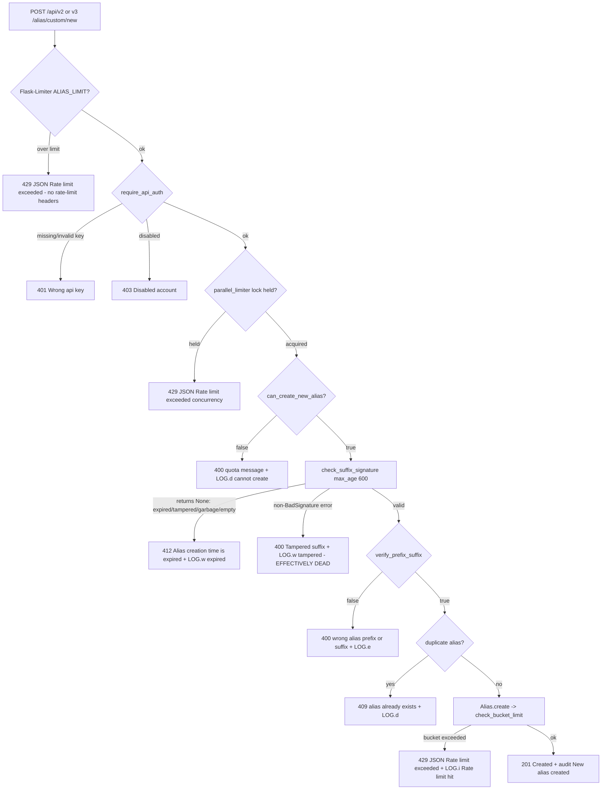

# Custom Alias Creation — Signed-Suffix Validation & Creation-Limit Enforcement: A Run-Verified Investigation

> **Status:** Read-only investigation. This document is the *only* file written to the repository. No source file was modified, added, or deleted (verified by a clean `git status` — see §F.7). The identified defect (tampered/garbage/empty suffixes reported as *expired*) is **documented, not fixed**, per the task constraint.

---

## 0. The Question

The reported problem, verbatim intent:

> *"I am debugging intermittent validation failures during custom alias creation that don't match the expected behavior, which seems related to how signed suffixes are verified."*

Four explicit objectives, each answered below **from observed runtime output** (not code-reading alone):

- **O1 — Invalid / expired signed suffixes:** the exact HTTP status codes, error messages, and validation log entries produced. → §A
- **O2 — Rate-limiting headers:** whether they appear in responses, and their values. → §B
- **O3 — Successful creation:** what quota-related checks occur and what values get logged when the system verifies whether the user can create more aliases. → §C
- **O4 — Execution-path trace:** which component validates signed suffixes, which enforces creation limits, and what conditions trigger rejection. → §D
- **Plus — Intermittency:** *why* the failures are intermittent, attributed to concrete code-level causes. → §E

Constraint (verbatim): *"Don't modify the repository code — temporary test scripts or API calls are fine but keep the codebase unchanged."*

---

## TL;DR — Headline Findings

1. **The "failures that don't match expected behavior" are a mislabel bug.** `check_suffix_signature` (`app/alias_suffix.py:37-42`) wraps `signer.unsign(signed_suffix, max_age=600)` in `try / except itsdangerous.BadSignature: return None`. Because the `itsdangerous 1.1.0` exception hierarchy is `SignatureExpired ⊂ BadTimeSignature ⊂ BadSignature ⊂ BadData` (verified at runtime, §A.2), **every** failure mode — expired, tampered, garbage, empty — is caught and collapsed to `None`. The endpoint's `if not alias_suffix:` branch (`app/api/views/new_custom_alias.py:71`) then fires for *all* of them, returning **`412 {"error":"Alias creation time is expired, please retry"}`** and logging `LOG.w("Alias creation time expired for %s")`. The adjacent `except Exception: … return jsonify(error="Tampered suffix"), 400` branch (`new_custom_alias.py:74-76`) is **effectively dead for ordinary bad tokens**: a tampered suffix is reported as *expired*. This is confirmed end-to-end against the live endpoints (§A.3).

2. **No rate-limit headers are emitted on any response.** Neither `X-RateLimit-Limit`, `X-RateLimit-Remaining`, `X-RateLimit-Reset`, nor `Retry-After` appear on a `201`, `4xx`, or any of the three distinct `429`s. Root cause: the limiter is built as `Limiter(key_func=__key_func)` with no `headers_enabled` (`app/extensions.py:23`), and Flask-Limiter 1.4's default `RATELIMIT_HEADERS_ENABLED` is `False`. (§B)

3. **Four independent creation-limit layers guard the endpoint**, in this order: Flask-Limiter `@limiter.limit(ALIAS_LIMIT)` → the `parallel_limiter` concurrency lock → the `can_create_new_alias()` count quota → the `Alias.create()` per-user token bucket. Two of them (concurrency, token bucket) are silently disabled when Redis is unreachable. (§D, §E)

4. **The intermittency is code-level, not environmental**: the 600-second suffix-validity window, the concurrency `429` under double submission, the Flask-Limiter `5/minute` rolling burst window, and the Redis-availability gate. (§E)

---

## Runtime & Methodology (RUN-FIRST)

This investigation was performed **by building and running the real code paths** and capturing actual output; the answers below are written from that output. The real API entry points `POST /api/v2/alias/custom/new` and `POST /api/v3/alias/custom/new` were driven directly; valid signed suffixes were minted exactly the way the application mints them (`signer.sign(...)`, `app/alias_suffix.py:11`), never via a debug/bypass hook. Each condition was run **≥2 times on identical input** to characterize the reported intermittency as a distribution. All temporary observation scripts live outside the repository (under `/tmp`) and were removed on completion.

### Canonical runtime

The stack was stood up exactly as `scripts/run-test.sh` prescribes, with Redis additionally reachable so all four limiter layers are in their active canonical state:

- **PostgreSQL 13** on host port `15432` (`scripts/run-test.sh:7`); database already migrated (`CONFIG=tests/test.env alembic upgrade head`, `scripts/run-test.sh:13`).
- **Redis** reachable at `redis://localhost` (`tests/test.env:78`), so `rate_limiter` and `parallel_limiter` are wired (`server.py:163-167` → `app/redis_services.py:9-25`).
- **Interpreter & dependencies** — the exact versions locked in `poetry.lock`, confirmed at runtime:

```text
=== INTERPRETER & DEPENDENCY VERSIONS ===
python           : 3.10.18
itsdangerous     : 1.1.0
flask            : 1.1.2
werkzeug         : 1.0.1
limits           : 1.5.1
flask_limiter    : 1.4
```

### Effective configuration (canonical `tests/test.env` + `app/config.py` defaults)

Confirmed at runtime and stable across runs:

```text
=== EFFECTIVE CONFIG (loaded from tests/test.env) ===
EMAIL_DOMAIN            : sl.local
MAX_NB_EMAIL_FREE_PLAN  : 3
MEM_STORE_URI           : redis://localhost
CUSTOM_ALIAS_SECRET     : 'secretcustom_alias'
ALIAS_LIMIT             : '100/day;50/hour;5/minute'
ALIAS_CREATE_RATE_LIMIT_FREE: [(10, 900), (50, 3600)]
ALIAS_CREATE_RATE_LIMIT_PAID: [(50, 900), (200, 3600)]
DISABLE_RATE_LIMIT      : False
DISABLE_ALIAS_SUFFIX    : False
```

Notes:
- `MAX_NB_EMAIL_FREE_PLAN=3` comes from `tests/test.env:13` (the code default is `5` at `app/config.py:121-124`).
- `CUSTOM_ALIAS_SECRET = FLASK_SECRET + "custom_alias"` = `"secret" + "custom_alias"` = `"secretcustom_alias"` (`app/config.py:201`, `FLASK_SECRET="secret"` at `tests/test.env:20`).
- `DISABLE_RATE_LIMIT` and `DISABLE_ALIAS_SUFFIX` are **unset** (`False`), so both the limiters and suffix signing are active.

The reproduction driver mirrored `tests/conftest.py`: `create_app()`, `TESTING=True`, `WTF_CSRF_ENABLED=False`, `SERVER_NAME="sl.test"`, `add_sl_domains()` + `add_proton_partner()`, and a cookie session established via the `login()` helper pattern (`tests/utils.py:46-59`). With a cookie session, `@require_api_auth` authorizes through its `current_user` fallback (`app/api/base.py:20-27`) and the Flask-Limiter key becomes `userid:{id}` (`app/extensions.py:14-19`). The exact commands and full unedited output blocks are in §F.

At bootstrap the driver confirmed the limiter storage is live and the flags are canonical:

```text
>>> lock_redis(parallel)=<limits.storage.RedisStorage object at 0x7af57cf0d4e0>
>>> lock_redis(bucket)  =<limits.storage.RedisStorage object at 0x7af57cf0d4e0>
>>> DISABLE_RATE_LIMIT=False DISABLE_ALIAS_SUFFIX=False MAX_NB_EMAIL_FREE_PLAN=3
```

---

## §A — O1: Invalid / Expired Signed-Suffix Behavior

**Answer (summary):** An **expired** suffix yields `412 {"error":"Alias creation time is expired, please retry"}` with `LOG.w("Alias creation time expired for %s")` at `app/api/views/new_custom_alias.py:72`. A **tampered**, **garbage**, or **empty** suffix yields the **same** `412` and the **same** log line — *not* the `400 {"error":"Tampered suffix"}` that the code's structure appears to intend. This uniform collapse is the reported "validation failures that don't match the expected behavior."

### A.1 The validating component and the 600-second window

Signed suffixes are minted and verified by a single module-level signer (`app/alias_suffix.py:11`):

```python
signer = itsdangerous.TimestampSigner(config.CUSTOM_ALIAS_SECRET)
```

The verifier is `check_suffix_signature` (`app/alias_suffix.py:37-42`) — the pivotal six lines:

```python
def check_suffix_signature(signed_suffix: str) -> Optional[str]:
    # hypothesis: user will click on the button in the 600 secs
    try:
        return signer.unsign(signed_suffix, max_age=600).decode()
    except itsdangerous.BadSignature:
        return None
```

Validity is bounded to `max_age=600` seconds (10 minutes). The endpoint consumes the result (`app/api/views/new_custom_alias.py:69-76`):

```python
    try:
        alias_suffix = check_suffix_signature(signed_suffix)
        if not alias_suffix:
            LOG.w("Alias creation time expired for %s", user)
            return jsonify(error="Alias creation time is expired, please retry"), 412
    except Exception:
        LOG.w("Alias suffix is tampered, user %s", user)
        return jsonify(error="Tampered suffix"), 400
```

### A.2 The `itsdangerous` exception hierarchy (runtime-verified)

The reason the two branches collapse into one is the exception hierarchy. Verified at runtime against the actual installed `itsdangerous 1.1.0`:

```text
=== ITSDANGEROUS EXCEPTION HIERARCHY (issubclass) ===
SignatureExpired  subclass of BadTimeSignature: True
BadTimeSignature  subclass of BadSignature    : True
SignatureExpired  subclass of BadSignature    : True
BadSignature      subclass of BadData         : True
```

So `SignatureExpired ⊂ BadTimeSignature ⊂ BadSignature ⊂ BadData`. This is corroborated by the `itsdangerous` documentation (the `SignatureExpired`/`BadTimeSignature`/`BadSignature` inheritance chain). Because `check_suffix_signature` catches the **base** class `itsdangerous.BadSignature`, it swallows *both* the timestamp-expiry error (`SignatureExpired`) *and* the signature-mismatch/format errors (`BadTimeSignature`, `BadSignature`) — returning `None` in every failing case, and **never re-raising**. The endpoint's surrounding `except Exception:` therefore never sees an exception for ordinary bad tokens.

### A.3 The collapse, observed directly

Driving the real application signer, `check_suffix_signature` returns the decoded value for a valid token and `None` for *every* failure mode:

```text
=== RAW check_suffix_signature COLLAPSE (real app signer) ===
valid    -> '.probeword@sl.local'
expired  -> None
tampered -> None
garbage  -> None
empty    -> None
```

The distinct underlying exceptions that `unsign(..., max_age=600)` would have raised (all subclasses of `BadSignature`, hence all swallowed) are:

```text
=== RAW unsign(max_age=600) exception types ===
expired  -> SignatureExpired: Signature age 700 > 600 seconds
tampered -> BadTimeSignature: Signature b'sJD3t8nWZ0TEvRGlaOVeWMdrAVA' does not match
garbage  -> BadSignature: No b'.' found in value
empty    -> BadSignature: No b'.' found in value
```

The expired token here was produced without waiting 600 s by patching the time source `itsdangerous` reads while signing (`mock.patch("itsdangerous.timed.time.time", lambda: real()-700)`), then unsigning now — a faithful expiry, since the endpoint's own `unsign(..., max_age=600)` raises `SignatureExpired`.

### A.4 End-to-end evidence against the live endpoint

**Condition 2 — Expired suffix (age 700 s > 600 s), 2 identical runs → `412`:**

```text
----- expired run 1 -----
signed_suffix: .ironed@sl.local.ak3R-Q.qLcrQ4JsLBvNcyqZ5lwOZEclQ0U
2026-07-08 04:40:21,577 - SL - WARNING - 12984 - "/code/app/api/views/new_custom_alias.py:72" - new_custom_alias_v2() -  - Alias creation time expired for <User 861 Test User user_va7hjsn2z2@mailbox.test>
STATUS-LINE: 412 PRECONDITION FAILED | status_code: 412
RESPONSE-HEADERS:
    Content-Type: application/json
    Content-Length: 57
    Access-Control-Allow-Origin: *
    Set-Cookie: slapp=bf4022df-84bb-42f9-bdd3-c5e1e8655022.kWaPcop0RKVSuDPD63FPWT9DeBo; Domain=.sl.test; Expires=Wed, 15-Jul-2026 04:40:21 GMT; HttpOnly; Path=/; SameSite=Lax
JSON-BODY: {"error": "Alias creation time is expired, please retry"}

----- expired run 2 -----
signed_suffix: .cleans@sl.local.ak3R-Q.9FOg6UZqGyEpKuBZo7GIieucelU
2026-07-08 04:40:21,591 - SL - WARNING - 12984 - "/code/app/api/views/new_custom_alias.py:72" - new_custom_alias_v2() -  - Alias creation time expired for <User 861 Test User user_va7hjsn2z2@mailbox.test>
STATUS-LINE: 412 PRECONDITION FAILED | status_code: 412
JSON-BODY: {"error": "Alias creation time is expired, please retry"}
```

**Condition 3 — Tampered suffix (mutate the last character), 2 identical runs → `412` (the headline anomaly):**

```text
----- tampered run 1 -----
valid   : .tether@sl.local.ak3Utg.v3sCyekQgGG05PZVVT6Fh8hllI0
tampered: .tether@sl.local.ak3Utg.v3sCyekQgGG05PZVVT6Fh8hllIA
raw check_suffix_signature(tampered) = None
2026-07-08 04:40:22,195 - SL - WARNING - 12984 - "/code/app/api/views/new_custom_alias.py:72" - new_custom_alias_v2() -  - Alias creation time expired for <User 862 Test User user_waqjdb5b48@mailbox.test>
STATUS-LINE: 412 PRECONDITION FAILED | status_code: 412
JSON-BODY: {"error": "Alias creation time is expired, please retry"}

----- tampered run 2 -----
valid   : .chrism@sl.local.ak3Utg.56I4BExdIC_OqPaXs4j11WsATVQ
tampered: .chrism@sl.local.ak3Utg.56I4BExdIC_OqPaXs4j11WsATVA
raw check_suffix_signature(tampered) = None
2026-07-08 04:40:22,209 - SL - WARNING - 12984 - "/code/app/api/views/new_custom_alias.py:72" - new_custom_alias_v2() -  - Alias creation time expired for <User 862 Test User user_waqjdb5b48@mailbox.test>
STATUS-LINE: 412 PRECONDITION FAILED | status_code: 412
JSON-BODY: {"error": "Alias creation time is expired, please retry"}
```

Note the status is **`412` "expired"**, never `400 "Tampered suffix"`, even though the token was tampered — and `raw check_suffix_signature(tampered) = None` confirms the collapse is what drives it.

**Condition 4 — Garbage (`"garbage"`) and empty (`""`) suffix, 2 runs each → `412`:**

```text
----- garbage run 1 -----
2026-07-08 04:40:22,810 - SL - WARNING - 12984 - "/code/app/api/views/new_custom_alias.py:72" - new_custom_alias_v2() -  - Alias creation time expired for <User 863 Test User user_xlydbvmhag@mailbox.test>
STATUS-LINE: 412 PRECONDITION FAILED | status_code: 412
JSON-BODY: {"error": "Alias creation time is expired, please retry"}

----- empty run 1 -----
2026-07-08 04:40:22,836 - SL - WARNING - 12984 - "/code/app/api/views/new_custom_alias.py:72" - new_custom_alias_v2() -  - Alias creation time expired for <User 863 Test User user_xlydbvmhag@mailbox.test>
STATUS-LINE: 412 PRECONDITION FAILED | status_code: 412
JSON-BODY: {"error": "Alias creation time is expired, please retry"}
```

(Both `garbage` runs and both `empty` runs produced byte-identical `412` responses and the same `:72` log line — full block in §F.)

### A.5 Conclusion for O1 (the mislabel — documented, not fixed)

| Input | Underlying `unsign` exception | `check_suffix_signature` returns | Observed HTTP | Observed log line |
|-------|-------------------------------|----------------------------------|---------------|-------------------|
| Valid, fresh | (none) | decoded suffix | `201` | audit "New alias created" |
| **Expired** (>600 s) | `SignatureExpired` | `None` | `412` "…expired, please retry" | `LOG.w` `new_custom_alias.py:72` |
| **Tampered** | `BadTimeSignature` | `None` | `412` "…expired, please retry" | `LOG.w` `new_custom_alias.py:72` |
| **Garbage** | `BadSignature` | `None` | `412` "…expired, please retry" | `LOG.w` `new_custom_alias.py:72` |
| **Empty** | `BadSignature` | `None` | `412` "…expired, please retry" | `LOG.w` `new_custom_alias.py:72` |

**Rationale / root cause:** the `400 {"error":"Tampered suffix"}` path at `new_custom_alias.py:74-76` can only be reached if `check_suffix_signature` *raises* an exception. It never does for a `BadSignature` subclass, because it catches that base class internally and returns `None` (`app/alias_suffix.py:41-42`). Therefore, for every ordinary bad token, control takes the `if not alias_suffix:` branch and returns `412 "expired"`. A developer who submits a tampered or malformed suffix and expects a "tampered"/"bad signature" style error instead sees "Alias creation time is expired, please retry" — behavior that does not match the apparent intent of the code. Per the task constraint, this is **documented, not remediated**. The web-UI sibling `app/dashboard/views/custom_alias.py` shares the same `check_suffix_signature` and `flash(...)`es the same "Alias creation time is expired, please retry" message (`app/dashboard/views/custom_alias.py:90-93`), so it exhibits the identical collapse in the dashboard form flow (noted as a secondary sibling; the question is API-focused).

---


## §B — O2: Rate-Limiting Headers

**Answer:** **No rate-limit headers are present on any response.** There is no `X-RateLimit-Limit`, `X-RateLimit-Remaining`, `X-RateLimit-Reset`, or `Retry-After` on a `201`, on any of the `4xx` rejections, or on any of the three distinct `429` responses. The only response headers observed are `Content-Type`, `Content-Length`, `Access-Control-Allow-Origin: *`, and `Set-Cookie` (plus `Server`/`Date`/`Connection` when observed over real HTTP via gunicorn).

### B.1 Root cause

The Flask-Limiter instance is constructed with only a key function and **no header configuration** (`app/extensions.py:23`):

```python
limiter = Limiter(key_func=__key_func)
```

Flask-Limiter 1.4's default for `RATELIMIT_HEADERS_ENABLED` is `False`, and the `headers_enabled` constructor argument (unused here) is what would turn on the `X-RateLimit-*` headers — corroborated against the Flask-Limiter documentation. Since neither is set anywhere in the codebase, no rate-limit headers are written. Furthermore, SimpleLogin installs a **custom 429 error handler** (`server.py:362-372`) that, for any `/api/` path, returns `jsonify(error="Rate limit exceeded"), 429` — a JSON body, not the Flask-Limiter default HTML page, and still with no rate-limit headers.

> **Observed correction to a common expectation:** because of this custom handler, the Flask-Limiter `429` carries a **JSON** body (`{"error":"Rate limit exceeded"}`), *not* HTML. All three `429` sources (Flask-Limiter, `parallel_limiter`, and the `Alias.create` token bucket) funnel through the same handler and therefore produce the identical 32-byte JSON body.

### B.2 The complete header sets (evidence)

**On a `201` success** (Condition 1, v2) — no rate-limit headers:

```text
STATUS-LINE: 201 CREATED | status_code: 201
RESPONSE-HEADERS:
    Content-Type: application/json
    Content-Length: 438
    Access-Control-Allow-Origin: *
    Set-Cookie: slapp=6eacb1ef-da73-4c1a-b8b5-8ca63ff86d39.1cdumgdlaUZKqHzReuQDItXcaK4; Domain=.sl.test; Expires=Wed, 15-Jul-2026 04:40:20 GMT; HttpOnly; Path=/; SameSite=Lax
```

**On the token-bucket `429`** (Condition 8) — no rate-limit headers:

```text
  attempt 50: STATUS 429  (breach)
  429 FULL HEADERS:
      Content-Type: application/json
      Content-Length: 32
      Access-Control-Allow-Origin: *
      Set-Cookie: slapp=85f4fa56-6d41-4585-b607-18bd4e47d0ae.PuChGq6IjegkY1BJ9OX-QiCWDKQ; Domain=.sl.test; Expires=Wed, 15-Jul-2026 04:47:25 GMT; HttpOnly; Path=/; SameSite=Lax
  429 BODY [32 bytes, CT='application/json']: {"error":"Rate limit exceeded"}
```

**On the `parallel_limiter` concurrency `429`** (Condition 9) — no rate-limit headers:

```text
STATUS-LINE: 429 TOO MANY REQUESTS | status_code: 429
RESPONSE-HEADERS:
    Content-Type: application/json
    Content-Length: 32
    Access-Control-Allow-Origin: *
    Set-Cookie: slapp=513fe420-20d7-4ffb-9983-95651a43de3f.wKmTbryjnxEH7qZAgkWd0lRyNEI; Domain=.sl.test; Expires=Wed, 15-Jul-2026 04:40:25 GMT; HttpOnly; Path=/; SameSite=Lax
JSON-BODY: {"error": "Rate limit exceeded"}
```

**On the Flask-Limiter burst `429`**, captured over a **real gunicorn HTTP connection** via `curl -D -` (Condition 10, §F) — no rate-limit headers, only standard HTTP headers:

```text
HTTP/1.1 429 TOO MANY REQUESTS
Server: gunicorn/20.0.4
Date: Wed, 08 Jul 2026 05:14:28 GMT
Connection: close
Content-Type: application/json
Content-Length: 32
Access-Control-Allow-Origin: *
Set-Cookie: slapp=670777a4-9bd0-4718-bdad-c4d21b0af626.Obhh5Y9p5FDwlRSVdtZDOMwBynI; Expires=Wed, 15-Jul-2026 05:14:28 GMT; HttpOnly; Path=/; SameSite=Lax

BODY: {"error":"Rate limit exceeded"}
```

A programmatic check over the full test-client header set confirmed the absence explicitly:

```text
X-RateLimit/Retry-After headers present: NONE
```

**Conclusion for O2:** rate-limit headers are **absent on every response class** (`201`, `400`, `409`, `412`, and all three `429`s). Their values therefore cannot be reported because they are never emitted — a direct consequence of `Limiter(key_func=__key_func)` lacking `headers_enabled` (`app/extensions.py:23`) and the framework default `RATELIMIT_HEADERS_ENABLED=False`.

---


## §C — O3: Successful-Creation Quota Checks (and What Each Logs)

**Answer:** On the success path, two quota-related checks run in order, and a third audit record is written on creation:

1. **Count quota — `User.can_create_new_alias()`** (`app/models.py:867-884`). On success it **logs nothing**; only on breach does the *endpoint* log `LOG.d("user %s cannot create any custom alias")` (`new_custom_alias.py:49`) and return `400`.
2. **Per-user token bucket — inside `Alias.create()`** (`app/models.py:1628-1641`), via `rate_limiter.check_bucket_limit(...)` (`app/rate_limiter.py:19-42`). On success it **logs nothing**; only on breach does it `LOG.i("Rate limit hit for {lock_name} (bucket id {bucket_id}) -> {value}/{max_hits}")` (`app/rate_limiter.py:33`) and raise `429`.
3. **Success audit log** — `emit_alias_audit_log(new_alias, AliasAuditLogAction.CreateAlias, "New alias created")` (`app/models.py:1688-1690`).

So on a *purely successful* creation, the quota checks are **silent** — the only quota-relevant value they expose is a *state change* (the alias count increments), which is exactly what makes the failure boundary hard to see until the very request that trips it.

### C.1 The count-quota gate

`can_create_new_alias()` (`app/models.py:867-884`) returns `True`/`False`; `max_alias_for_free_account()` (`app/models.py:858-865`) reads `config.MAX_NB_EMAIL_FREE_PLAN`. For a genuine free account the decision is `Alias.filter_by(user_id=<id>).count() < MAX_NB_EMAIL_FREE_PLAN`.

**Observed state before/after each creation (Condition 7, `MAX_NB_EMAIL_FREE_PLAN=3`):** a fresh non-partner user is auto-created *with one* "newsletter" alias inside `User.create` (`app/models.py:633-640`), so the starting count is **1** (observed, not assumed). The user can create 2 more; the 3rd custom attempt is refused:

```text
start count (includes auto newsletter alias) = 1

----- quota attempt 1 (count before=1) -----
STATUS: 201 JSON: {"alias": "q1.sloths@sl.local", ... "id": 1410, ...}
count after = 2

----- quota attempt 2 (count before=2) -----
STATUS: 201 JSON: {"alias": "q2.bastes@sl.local", ... "id": 1411, ...}
count after = 3

----- quota attempt 3 (count before=3) -----
2026-07-08 04:40:24,946 - SL - DEBUG - 12984 - "/code/app/api/views/new_custom_alias.py:49" - new_custom_alias_v2() -  - user <User 866 Test User user_yswrfs1sln@mailbox.test> cannot create any custom alias
STATUS: 400 JSON: {"error": "You have reached the limitation of a free account with the maximum of 3 aliases, please upgrade your plan to create more aliases"}
count after = 3
>>> quota gate reached at attempt 3
```

Observe: the two *successful* creations logged **nothing** quota-related (only the `after_request` access line, and the `count` went `1→2→3`); the `LOG.d "… cannot create any custom alias"` appears **only** on the refused 3rd attempt. This is `can_create_new_alias()` returning `False` at `Alias...count()(3) < 3` → `False`.

### C.2 The per-user token bucket inside `Alias.create()`

For each `(hits, seconds)` in the applicable limit list, `Alias.create()` (`app/models.py:1639-1641`) calls:

```python
rate_limiter.check_bucket_limit(f"alias_create_{seconds}d:{user.id}", hits, seconds)
```

The limit list depends on plan (`app/models.py:1634-1637`): **free** = `[(10, 900), (50, 3600)]`, **paid** = `[(50, 900), (200, 3600)]` (`app/config.py:554-558`). On success `check_bucket_limit` is silent; on breach it logs `LOG.i` (`app/rate_limiter.py:33`) and raises `429`.

> **Observed nuance that matters for "successful creation" accounting (a correction to a naive reading):** a fresh user is on a **7-day trial** (`trial_end` default `arrow.now().shift(days=7, hours=1)`, `app/models.py:400-402`), and `is_premium()` returns `True` during a trial (`app/models.py:787-800`). Consequently `Alias.create()` selects the **PAID** bucket `(50, 900)` for a brand-new user — even though `can_create_new_alias()` still uses the **free** count cap of `3` because that gate relies on `lifetime_or_active_subscription()` (`app/models.py:746-753`), which is `False` during a trial. Net effect: a fresh free user hits the **count quota** (`400`) at 3 long before the token bucket, and the *canonical free bucket* `(10, 900)` is only reachable once the trial has expired. Both were exercised in §D/§E and Condition 8 (§F).

The bucket key stored in Redis is `bl:{lock_name}:{bucket_id}` (`app/rate_limiter.py:25-27`) where `lock_name = alias_create_900d:{user.id}` and `bucket_id = int_time - (int_time % seconds)`. On the success path the value simply increments; the logged breach values observed were `-> 51/50` (paid) and `-> 11/10` (free) — see §F, Condition 8. When Redis is unreachable, this check **no-ops** immediately (`app/rate_limiter.py:28-29`), so no bucket enforcement occurs (§E.4).

### C.3 The success audit log

On a successful `201`, `Alias.create()` emits an audit action `"New alias created"` (`app/models.py:1688-1690`). The `201` body itself is the full alias info object, e.g. (Condition 1, v2):

```text
STATUS-LINE: 201 CREATED | status_code: 201
JSON-BODY: {"alias": "prefix.charge@sl.local", "creation_date": "2026-07-08 04:40:20+00:00", "creation_timestamp": 1783485620, "disable_pgp": false, "email": "prefix.charge@sl.local", "enabled": true, "id": 1401, "latest_activity": null, "mailbox": {"email": "user_2452ime9ch@mailbox.test", "id": 1019}, "mailboxes": [{"email": "user_2452ime9ch@mailbox.test", "id": 1019}], "name": null, "nb_block": 0, "nb_forward": 0, "nb_reply": 0, "note": null, "pinned": false, "support_pgp": false}
count_after_v2= 2
```

**Conclusion for O3:** the two quota checks that decide "can this user create more aliases" are `can_create_new_alias()` (count quota → `400` + `LOG.d` on breach, silent on success) and the `Alias.create()` token bucket (→ `429` + `LOG.i` on breach, silent on success). On a successful creation neither logs a quota value; the only observable quota signal is the incrementing alias count (observed `1→2→3`). The success itself is recorded via the `"New alias created"` audit action (`app/models.py:1688-1690`).

---


## §D — O4: Execution-Path Trace & Rejection Conditions

**Answer:** The signed suffix is validated by `check_suffix_signature` / `verify_prefix_suffix` (`app/alias_suffix.py:37-91`). Creation limits are enforced by **four independent layers**, applied as the ordered decorator/validation chain below. Each rejection maps to a specific status code, message, and (where present) log line.

### D.1 The ordered chain (v2, `app/api/views/new_custom_alias.py:28-112`)

The decorators are applied outermost-first at request time:

```python
@api_bp.route("/v2/alias/custom/new", methods=["POST"])   # L28
@limiter.limit(ALIAS_LIMIT)                                # L29  -> Flask-Limiter (layer 1)
@require_api_auth                                          # L30  -> auth (401/403)
@parallel_limiter.lock(name="alias_creation")             # L31  -> concurrency lock (layer 2)
def new_custom_alias_v2():
```

1. **Flask-Limiter `@limiter.limit(ALIAS_LIMIT)`** (`app/extensions.py:23`, `app/config.py:448`, `ALIAS_LIMIT="100/day;50/hour;5/minute"`) → `429` when any window is exceeded. This is the **outermost** layer, so it counts *every* request to the route — even ones that later fail auth (observed: a bad-auth request still consumed a `5/minute` hit, §E.3).
2. **`@require_api_auth`** (`app/api/base.py:16-60`): `401 "Wrong api key"` (`base.py:20-27`), `403 "Disabled account"` (`base.py:36-37`), `401 "Account does not exist"` (`base.py:39-40`). With a cookie session, authorization falls through to `g.user = current_user`.
3. **`@parallel_limiter.lock(name="alias_creation")`** (`app/parallel_limiter.py:19-73`): acquires a per-user Redis lock `cl:{current_user.id}:alias_creation` (`parallel_limiter.py:56`, TTL `max_wait_secs=5` at `:23`); if it is already held, `acquire_lock` raises `TooManyRequests` → `429` (`parallel_limiter.py:30-34`). No-ops when Redis is absent (`parallel_limiter.py:51-52`).
4. **`can_create_new_alias()` count quota** (`app/models.py:867-884`) → `400` quota message + `LOG.d` (`new_custom_alias.py:48-56`).
5. **`check_suffix_signature`** (`app/alias_suffix.py:37-42`) → `412` for `None` (expired/tampered/garbage/empty); the `400 "Tampered suffix"` branch is effectively dead (§A).
6. **`verify_prefix_suffix`** (`app/alias_suffix.py:45-91`) → `400 "wrong alias prefix or suffix"` (`new_custom_alias.py:78-79`); logs `LOG.e "wrong alias suffix …"` at `app/alias_suffix.py:61`.
7. **Duplicate check** (`new_custom_alias.py:82-88`) → `409 "alias … already exists"` + `LOG.d "full alias already used …"` (`:87`).
8. **`".." check`** (`new_custom_alias.py:90-94`) → `400`.
9. **`Alias.create()` token bucket** (`app/models.py:1628-1641` → `app/rate_limiter.py:19-42`) → `429` + `LOG.i "Rate limit hit …"` (`rate_limiter.py:33`).
10. **Success** → `201` + audit `"New alias created"` (`new_custom_alias.py:109-112`, `models.py:1688-1690`).

### D.2 v3 differences (`app/api/views/new_custom_alias.py:115-235`)

v3 carries the same decorator chain (`:116-118`) and the same suffix/quota/duplicate logic, but adds validation **before** the suffix check:
- request body must be a dict → `400` (`:153-154`);
- `check_alias_prefix` → `400 "alias prefix invalid format or too long"` (`:167-168`);
- `mailbox_ids` must be a list → `400 "mailbox_ids must be an array of id"` (`:171-172`); each must be owned & verified → `400 "Errors with Mailbox"` (`:174-178`); at least one required → `400 "At least one mailbox must be selected"` (`:180-181`).

The suffix branch (`:184-191`) is identical in effect to v2, so the §A mislabel applies equally to v3. Observed: v3 with a valid suffix returns `201` (Condition 1, `prefix.gamins@sl.local`, id 1402, §F).

### D.3 Dashboard sibling (secondary)

`app/dashboard/views/custom_alias.py` reuses `get_alias_suffixes` / `check_suffix_signature` / `verify_prefix_suffix` under the same `@limiter.limit(ALIAS_LIMIT, methods=["POST"])` (`:31`) and `@parallel_limiter.lock(name="alias_creation")` (`:33`). It is a **web-form** flow that `flash(...)`es "Alias creation time is expired, please retry" (`:90-93`) rather than returning JSON/`412`, so it shares the same collapse/mislabel. Noted as a sibling only — the question is API-focused.

### D.4 Rejection-condition table (all observed)

| Rejection | Component (file:line) | Status | Body / message | Log line |
|-----------|------------------------|--------|----------------|----------|
| Over Flask-Limiter window | `extensions.py:23`, `config.py:448` | `429` | `{"error":"Rate limit exceeded"}` (JSON via `server.py:362-372`) | `LOG.w server.py:364` |
| Missing/invalid API key | `api/base.py:20-27` | `401` | `Wrong api key` | — |
| Disabled account | `api/base.py:36-37` | `403` | `Disabled account` | — |
| Concurrency lock held | `parallel_limiter.py:30-34,56` | `429` | `{"error":"Rate limit exceeded"}` | `LOG.w server.py:364` |
| Count quota exceeded | `models.py:867-884`, `new_custom_alias.py:48-56` | `400` | `You have reached the limitation of a free account with the maximum of 3 aliases…` | `LOG.d new_custom_alias.py:49` |
| Suffix `None` (expired/tampered/garbage/empty) | `alias_suffix.py:37-42`, `new_custom_alias.py:71-73` | `412` | `Alias creation time is expired, please retry` | `LOG.w new_custom_alias.py:72` |
| Suffix raises (dead for bad tokens) | `new_custom_alias.py:74-76` | `400` | `Tampered suffix` | `LOG.w` (effectively unreachable) |
| Prefix/suffix mismatch | `alias_suffix.py:45-91`, `new_custom_alias.py:78-79` | `400` | `wrong alias prefix or suffix` | `LOG.e alias_suffix.py:61` |
| Duplicate alias | `new_custom_alias.py:82-88` | `409` | `alias {full_alias} already exists` | `LOG.d new_custom_alias.py:87` |
| `".."` in alias | `new_custom_alias.py:90-94` | `400` | `2 consecutive dot signs aren't allowed…` | — |
| Token bucket exceeded | `models.py:1639-1641`, `rate_limiter.py:30-40` | `429` | `{"error":"Rate limit exceeded"}` | `LOG.i rate_limiter.py:33` |
| Success | `new_custom_alias.py:109-112` | `201` | full alias info object | audit `"New alias created"` (`models.py:1688-1690`) |

### D.5 Execution-path flowchart

The chain below was confirmed against the observed outputs. Two annotations reflect observed corrections to the originally-expected behavior: the `412` collapse (F/F1) and the JSON (not HTML) `429`.



### D.6 Component-level answer to "which validates suffixes / which enforces limits"

- **Validates signed suffixes:** `check_suffix_signature` (signature + 600 s expiry, `app/alias_suffix.py:37-42`) then `verify_prefix_suffix` (domain ownership + leading-dot rule, `app/alias_suffix.py:45-91`).
- **Enforces creation limits (four):** (1) Flask-Limiter `@limiter.limit(ALIAS_LIMIT)` (`extensions.py:23`); (2) `parallel_limiter` concurrency lock (`parallel_limiter.py`); (3) `can_create_new_alias()` count quota (`models.py:867-884`); (4) `Alias.create()` token bucket (`models.py:1628-1641` + `rate_limiter.py`).

---


## §E — Why the Failures Are Intermittent

The intermittency is **code-level and reproducible**, not a vague environmental flake. Four concrete causes were exercised. First, the deterministic cases establish that identical *content* faults are stable across runs; then the genuinely time/concurrency/state-dependent causes explain run-to-run variation on otherwise-identical input.

### E.0 Deterministic content faults (baseline distribution across ≥2 runs)

For the suffix-content and quota conditions, identical input yields identical output across independent cross-process runs (RUN1 and RUN2, different users):

| Condition | RUN1 | RUN2 |
|-----------|------|------|
| 1 valid (v2, v3) | `201`, `201` | `201`, `201` |
| 2 expired | `412`, `412` | `412`, `412` |
| 3 tampered | `412`, `412` | `412`, `412` |
| 4 garbage / empty | `412` ×4 | `412` ×4 |
| 5 prefix/suffix mismatch | `400` | `400` |
| 6 duplicate | `201`, `409` | `201`, `409` |
| 7 quota (start count 1) | `201,201,400` @attempt 3 | `201,201,400` @attempt 3 |
| 9 concurrency (lock held) | `429` | `429` |

These are *not* the source of the reported intermittency — they are stable. The intermittency comes from the four causes below, where the *same* request can succeed or fail depending on timing, concurrency, or backend state.

### E.1 The 600-second suffix-validity window (`app/alias_suffix.py:37-42`)

A signed suffix is valid for exactly `max_age=600` seconds. A suffix minted by `GET /api/v?/alias/options` (`app/api/views/alias_options.py:13,77`) and then POSTed **within 10 minutes** succeeds; the **identical** signed-suffix string POSTed after 10 minutes fails with `412 "…expired, please retry"`. The very same token thus flips from success to failure purely as a function of elapsed time — a classic "worked a moment ago, fails now" intermittency, and (because of §A) tampered/garbage tokens are reported under this same "expired" message, compounding the confusion. Runtime proof of the boundary: `unsign(..., max_age=600)` on a 700-second-old token → `SignatureExpired: Signature age 700 > 600 seconds` (§A.3).

### E.2 The `parallel_limiter` concurrency `429` (`app/parallel_limiter.py:19-73`)

Two overlapping alias-creation requests from the same user collide on the Redis lock `cl:{user.id}:alias_creation`; the second raises `TooManyRequests` → `429`. Under normal single-request use nothing happens, but a double-click or a rapid client retry produces an intermittent `429`. Observed (Condition 9; method: pre-set the exact Redis lock key the code uses to simulate an in-flight holder, then issue **one real request** so the *real* `acquire_lock` at `parallel_limiter.py:30-34` raises — clearly labeled as a simulated concurrent holder):

```text
pre-setting lock key: cl:867:alias_creation
redis get(lock) = b'held-by-inflight'
2026-07-08 04:40:25,571 - SL - WARNING - 12984 - "/code/server.py:364" - rate_limited() -  - Client hit rate limit on path /api/v2/alias/custom/new, user:<User 867 Test User user_fvk09nj4zj@mailbox.test>
STATUS-LINE: 429 TOO MANY REQUESTS | status_code: 429
JSON-BODY: {"error": "Rate limit exceeded"}
```

The lock auto-expires after `max_wait_secs=5` (`parallel_limiter.py:23`), so the window is sub-second-to-5-seconds wide — exactly the profile of an intermittent failure.

### E.3 The Flask-Limiter `5/minute` rolling burst window (`app/config.py:448`)

`ALIAS_LIMIT="100/day;50/hour;5/minute"`. The `5/minute` component is a **rolling 60-second window** (the `limits 1.5.1` fixed-window strategy over Redis). The 6th identical request within a minute is rejected with `429`. Observed over a **real gunicorn HTTP server** (Condition 10, clean run, §F) — the transition is unambiguous:

```text
----- curl request 1 -----  HTTP/1.1 201 CREATED
----- curl request 2 -----  HTTP/1.1 409 CONFLICT
----- curl request 3 -----  HTTP/1.1 409 CONFLICT
----- curl request 4 -----  HTTP/1.1 409 CONFLICT
----- curl request 5 -----  HTTP/1.1 409 CONFLICT
----- curl request 6 -----  HTTP/1.1 429 TOO MANY REQUESTS   BODY: {"error":"Rate limit exceeded"}
2026-07-08 05:14:28,521 - SL - WARNING - 13579 - "/code/server.py:364" - rate_limited() -  - Client hit rate limit on path /api/v2/alias/custom/new
```

Two facets of this layer directly produce intermittency on *identical* input:

- **It counts pre-auth.** `@limiter.limit` is the outermost decorator, so it increments even for requests that later fail (e.g. a `401` auth failure or a `409` duplicate still consume a hit). Observed: a bad-auth readiness probe consumed one `5/minute` hit, shifting the `429` from the 6th to the 5th subsequent request.
- **It accumulates across the rolling window / across processes via shared Redis.** Two real-server runs 55 seconds apart, both keyed `LIMITER/ip:127.0.0.1/api.new_custom_alias_v2/5/1/minute`, fell inside the *same* live 60-second window; the second run therefore returned `429` for **all** requests:

```text
----- curl request 1 -----  HTTP/1.1 429 TOO MANY REQUESTS
----- curl request 2 -----  HTTP/1.1 429 TOO MANY REQUESTS
... (all six 429) ...
```

The identical request thus returns `201`-then-`429`, or all-`429`, purely as a function of how many hits already landed in the current rolling window — an intrinsically intermittent behavior.

> **Observed methodology note (not a SimpleLogin bug):** under Flask's test client, wrapping many client requests inside a *single* `with app.app_context()` causes `g._rate_limiting_complete` (which Flask-Limiter 1.4's decorator sets after the first check, `flask_limiter` extension) to persist across requests, suppressing the limiter for later requests. This is a test-harness artifact of reusing one app context; it does not occur in production (gunicorn), where each request has a fresh application context. The Flask-Limiter results above were therefore captured with a fresh context per request (test client) and, authoritatively, via a real gunicorn server (§F). The `limits` strategy itself was verified healthy in isolation: `FixedWindowRateLimiter` over `RedisStorage` returns `hit 1,2 = True` then `hit 3,4,5 = False` for a `2/minute` limit.

### E.4 The Redis-availability gate (`app/rate_limiter.py:28`, `app/parallel_limiter.py:51`, `server.py:163-167`)

Two of the four limiters — the concurrency lock and the token bucket — are wired **only** when `MEM_STORE_URI` is set and Redis is reachable (`server.py:163-167` → `app/redis_services.py:9-25`). When `lock_redis is None`, both silently no-op: `check_bucket_limit` returns immediately (`rate_limiter.py:28-29`) and `_InnerLock` does nothing (`parallel_limiter.py:51-52`). So the *same* workload that returns `429` with Redis up returns `201` with Redis down. Demonstrated directly:

```text
=== SIMULATE NO REDIS: set both lock_redis = None (runtime toggle) ===
rate_limiter.lock_redis = None  parallel_limiter.lock_redis = None

--- (1) rate_limiter.check_bucket_limit('nr_demo', max_hits=10, 900) called 12x (would breach at 11 WITH redis) ---
   -> no-op confirmed: never raised across 12 calls

--- (2) endpoint: expired-trial FREE user, MAX_NB_EMAIL_FREE_PLAN=1000, no redis, 13 creations (WITH redis breaches at 11) ---
   is_premium= False
   statuses: [201, 201, 201, 201, 201, 201, 201, 201, 201, 201, 201, 201, 201]
   -> NO bucket 429 (all 201): confirmed bucket limiter DISABLED without redis
   (contrast: cond 8b WITH redis breaches at attempt 11 -> 429)
```

If a deployment intermittently loses Redis connectivity (or runs a mix of configured/unconfigured workers), the concurrency and bucket `429`s appear and disappear accordingly — a fourth, infrastructure-shaped source of the reported intermittency, but one that is fully explained by the code-level gate above.

### E.5 Summary of intermittency causes

| Cause | Mechanism | Citation | Manifestation on identical input |
|-------|-----------|----------|----------------------------------|
| 600 s suffix window | token valid only 10 min | `alias_suffix.py:37-42` | same token: `201` now, `412` later |
| Concurrency lock | second overlapping request rejected | `parallel_limiter.py:19-73` | double-click → intermittent `429` |
| Flask-Limiter `5/minute` | rolling 60 s window, counts pre-auth, shared across processes | `config.py:448`, `extensions.py:23` | 6th (or fewer) request → `429`; window state varies |
| Redis-availability gate | bucket + concurrency no-op without Redis | `rate_limiter.py:28`, `parallel_limiter.py:51`, `server.py:163-167` | `429` with Redis, `201` without |

---


## §F — Build & Invocation Commands, Full Output Blocks

### F.1 Exact commands

Infrastructure (canonical, per `scripts/run-test.sh`), inside the provided container image (SimpleLogin, Python 3.10.18 venv at `/app/venv`), with Postgres 13 on `:15432` and Redis on `:6379` reachable via `--network host`:

```bash
# Postgres 13 (scripts/run-test.sh:7) and Redis
docker run -d --name sl-test-db -e POSTGRES_PASSWORD=test -e POSTGRES_USER=test -e POSTGRES_DB=test -p 15432:5432 postgres:13
docker run -d --name sl-redis -p 6379:6379 redis:6

# DB migration (scripts/run-test.sh:13) — already applied; alembic_version=32f25cbf12f6
docker exec sl-app bash -lc 'source /app/venv/bin/activate; cd /code; CONFIG=tests/test.env alembic upgrade head'
```

Reproduction driver (ephemeral, under `/tmp`, run from repo root with `CONFIG` set exactly as `tests/conftest.py:8-10` does):

```bash
# Conditions 1-10 via the Flask test client (cookie session; suffixes minted via signer.sign)
docker exec -i -e RUN_TAG=RUN1 sl-app bash -lc \
  'source /app/venv/bin/activate; cd /code; CONFIG=tests/test.env PYTHONUNBUFFERED=1 RUN_TAG=RUN1 python -' \
  < /tmp/probe_main.py > /tmp/evidence_run1.txt 2>&1
docker exec -i -e RUN_TAG=RUN2 sl-app bash -lc \
  'source /app/venv/bin/activate; cd /code; CONFIG=tests/test.env PYTHONUNBUFFERED=1 RUN_TAG=RUN2 python -' \
  < /tmp/probe_main.py > /tmp/evidence_run2.txt 2>&1

# Condition 8 (token bucket) — PAID (fresh trial) and FREE (expired trial)
docker exec -i -e RUN_TAG=RUN1 sl-app bash -lc \
  'source /app/venv/bin/activate; cd /code; CONFIG=tests/test.env PYTHONUNBUFFERED=1 RUN_TAG=RUN1 python -' \
  < /tmp/probe_cond8_final.py > /tmp/evidence_cond8.txt 2>&1

# Condition 10 (Flask-Limiter burst) — authoritative REAL server via gunicorn + curl
docker exec -i sl-app bash -lc 'bash -s' < /tmp/real_server_cond10c.sh > /tmp/evidence_cond10_realserver_clean.txt 2>&1
#   internally: CONFIG=tests/test.env gunicorn wsgi:app -b 127.0.0.1:7777 -w 1 --timeout 60
#               then 6x: curl -s -D - -X POST http://127.0.0.1:7777/api/v2/alias/custom/new \
#                          -H "Authentication: <ApiKey.code>" -H "Content-Type: application/json" \
#                          -d '{"alias_prefix":"burst","signed_suffix":"<signed_suffix>"}'

# Environment/deps/config + itsdangerous hierarchy confirmation
docker exec -i sl-app bash -lc \
  'source /app/venv/bin/activate; cd /code; CONFIG=tests/test.env python -' \
  < /tmp/probe_env.py > /tmp/evidence_env.txt 2>&1
```

All `/tmp/*.py` and `/tmp/*.txt` artifacts are outside the repository and were deleted on completion (§F.7).

### F.2 Dependency & config confirmation

The full verbatim output is in the Runtime section above (versions, effective config, `issubclass` hierarchy, `check_suffix_signature` collapse, and raw `unsign` exception types). It confirms `itsdangerous 1.1.0`, `flask 1.1.2`, `werkzeug 1.0.1`, `limits 1.5.1`, `flask_limiter 1.4`, `python 3.10.18`, and the canonical config values.

### F.3 Condition 1 — valid fresh suffix (v2 then v3), complete block

```text
user=user_2452ime9ch@mailbox.test id=860 default_mailbox_id=1019 start_count=1

----- v2 valid -----
2026-07-08 04:40:20,918 - SL - DEBUG - 12984 - "/code/server.py:284" - after_request() -  - 127.0.0.1 POST /api/v2/alias/custom/new ImmutableMultiDict([]) 201, takes 0.05356144905090332
STATUS-LINE: 201 CREATED | status_code: 201
RESPONSE-HEADERS:
    Content-Type: application/json
    Content-Length: 438
    Access-Control-Allow-Origin: *
    Set-Cookie: slapp=6eacb1ef-da73-4c1a-b8b5-8ca63ff86d39.1cdumgdlaUZKqHzReuQDItXcaK4; Domain=.sl.test; Expires=Wed, 15-Jul-2026 04:40:20 GMT; HttpOnly; Path=/; SameSite=Lax
JSON-BODY: {"alias": "prefix.charge@sl.local", ... "id": 1401, ...}
count_after_v2= 2

----- v3 valid -----
STATUS-LINE: 201 CREATED | status_code: 201
JSON-BODY: {"alias": "prefix.gamins@sl.local", ... "id": 1402, ...}
count_after_v3= 3
```

### F.4 Conditions 2–7 & 9 — complete blocks

The complete, unedited blocks for these conditions are reproduced verbatim in the sections that answer them:
- **Condition 2 (expired), 3 (tampered), 4 (garbage/empty):** §A.4.
- **Condition 5 (prefix/suffix mismatch → `400`):** full block below.
- **Condition 6 (duplicate → `201` then `409`):** full block below.
- **Condition 7 (quota, count before/after):** §C.1.
- **Condition 9 (concurrency → `429`):** §E.2.

**Condition 5 — mismatch (validly-signed suffix for a domain the user cannot use):**

```text
signed bad-domain suffix: @88e4oe.test.ak3Utw.6e3n_CKPMDHmSrIQaNIwN2-IeXk  raw_unsigned= @88e4oe.test
2026-07-08 04:40:23,453 - SL - ERROR - 12984 - "/code/app/alias_suffix.py:61" - verify_prefix_suffix() -  - wrong alias suffix @88e4oe.test, user <User 864 Test User user_h3nwm3xmfx@mailbox.test>
NoneType: None
STATUS-LINE: 400 BAD REQUEST | status_code: 400
RESPONSE-HEADERS:
    Content-Type: application/json
    Content-Length: 41
    Access-Control-Allow-Origin: *
    Set-Cookie: slapp=936c48fc-7e70-4258-81eb-bfb03ff8ab37.pJTyvpZbI4myRf6UrkFmse-UAD8; Domain=.sl.test; Expires=Wed, 15-Jul-2026 04:40:23 GMT; HttpOnly; Path=/; SameSite=Lax
JSON-BODY: {"error": "wrong alias prefix or suffix"}
```

**Condition 6 — duplicate full alias (same prefix+suffix twice):**

```text
----- first create -----
STATUS-LINE: 201 CREATED | status_code: 201
JSON-BODY: {"alias": "dupe.attain@sl.local", ... "id": 1408, ...}

----- second create (identical) -> duplicate -----
2026-07-08 04:40:24,226 - SL - DEBUG - 12984 - "/code/app/api/views/new_custom_alias.py:87" - new_custom_alias_v2() -  - full alias already used dupe.attain@sl.local
STATUS-LINE: 409 CONFLICT | status_code: 409
RESPONSE-HEADERS:
    Content-Type: application/json
    Content-Length: 54
    Access-Control-Allow-Origin: *
    Set-Cookie: slapp=aa8cde48-e3e4-4167-a708-bee83cb29689.eONDosvDZJtMVnE1feVT-wPAAX8; Domain=.sl.test; Expires=Wed, 15-Jul-2026 04:40:24 GMT; HttpOnly; Path=/; SameSite=Lax
JSON-BODY: {"error": "alias dupe.attain@sl.local already exists"}
```

### F.5 Condition 8 — token bucket (PAID and FREE), complete block

**8a — fresh-trial user (`is_premium=True` → PAID bucket `(50,900)`), breach at the 51st hit:**

```text
[RUN1] CONDITION 8a — FRESH TRIAL user => is_premium True => PAID bucket (50,900); breach expected at 51
user id=873 PAID limits=[(50, 900), (200, 3600)]
[RUN1] paid: is_premium=True lifetime_or_active_sub=False
... (49 x POST -> 201) ...
2026-07-08 04:47:25,001 - SL - INFO - 13136 - "/code/app/rate_limiter.py:33" - check_bucket_limit() -  - Rate limit hit for alias_create_900d:873 (bucket id 1783485900) -> 51/50
2026-07-08 04:47:25,002 - SL - WARNING - 13136 - "/code/server.py:364" - rate_limited() -  - Client hit rate limit on path /api/v2/alias/custom/new, user:<User 873 T user_nq7jvaxov6@mailbox.test>
  attempt 50: STATUS 429  (breach)
  429 FULL HEADERS:
      Content-Type: application/json
      Content-Length: 32
      Access-Control-Allow-Origin: *
      Set-Cookie: slapp=85f4fa56-6d41-4585-b607-18bd4e47d0ae.PuChGq6IjegkY1BJ9OX-QiCWDKQ; Domain=.sl.test; Expires=Wed, 15-Jul-2026 04:47:25 GMT; HttpOnly; Path=/; SameSite=Lax
  429 BODY [32 bytes, CT='application/json']: {"error":"Rate limit exceeded"}
```

**8b — expired-trial (genuine free) user (`is_premium=False` → FREE bucket `(10,900)`), breach at the 11th hit:**

```text
[RUN1] CONDITION 8b — EXPIRED-TRIAL (genuine free) user => FREE bucket (10,900); breach expected at 11
user id=874 FREE limits=[(10, 900), (50, 3600)] trial_end=2026-07-07T04:47:25.291860+00:00
[RUN1] free: is_premium=False lifetime_or_active_sub=False
... (9 x POST -> 201) ...
2026-07-08 04:47:26,206 - SL - INFO - 13136 - "/code/app/rate_limiter.py:33" - check_bucket_limit() -  - Rate limit hit for alias_create_900d:874 (bucket id 1783485900) -> 11/10
2026-07-08 04:47:26,206 - SL - WARNING - 13136 - "/code/server.py:364" - rate_limited() -  - Client hit rate limit on path /api/v2/alias/custom/new, user:<User 874 T user_l55lwzs52b@mailbox.test>
  attempt 10: STATUS 429  (breach)
  429 BODY [32 bytes, CT='application/json']: {"error":"Rate limit exceeded"}
```

RUN2 reproduced both breach points identically (`51/50` and `11/10`).

### F.6 Condition 10 — Flask-Limiter burst over a REAL gunicorn server, complete block

```text
USERID=883 SUFFIX=.mortal@sl.local.ak3csQ.ykzG6dmBhwTSn4_AMkoV_wCNA4M
server up after 2s (GET / -> 302) pid=13574
=================== REAL HTTP BURST (6 identical POSTs, fresh window) ===================
----- curl request 1 -----
HTTP/1.1 201 CREATED
Server: gunicorn/20.0.4
Content-Type: application/json
Content-Length: 436
Access-Control-Allow-Origin: *
Set-Cookie: slapp=...
BODY: {"alias":"burst.mortal@sl.local", ... "id":1541, ...}
----- curl request 2 -----
HTTP/1.1 409 CONFLICT
BODY: {"error":"alias burst.mortal@sl.local already exists"}
----- curl request 3 -----  HTTP/1.1 409 CONFLICT
----- curl request 4 -----  HTTP/1.1 409 CONFLICT
----- curl request 5 -----  HTTP/1.1 409 CONFLICT
----- curl request 6 -----
HTTP/1.1 429 TOO MANY REQUESTS
Server: gunicorn/20.0.4
Content-Type: application/json
Content-Length: 32
Access-Control-Allow-Origin: *
Set-Cookie: slapp=670777a4-9bd0-4718-bdad-c4d21b0af626...
BODY: {"error":"Rate limit exceeded"}
=================== gunicorn rate-limit log lines ===================
2026-07-08 05:14:28,521 - SL - WARNING - 13579 - "/code/server.py:364" - rate_limited() -  - Client hit rate limit on path /api/v2/alias/custom/new, user:<flask_login.mixins.AnonymousUserMixin object ...>
```

Test-client RUN1 and RUN2 (fresh app context per request, cookie session) likewise returned `201,409,409,409,409,429` with the `429` carrying no rate-limit headers.

### F.7 Repository unchanged — final `git status`

```text
$ git rev-parse --abbrev-ref HEAD
blitzy-45a67586-f857-4a8e-ba25-5dedc7607a35

$ git status --porcelain        # before authoring: EMPTY (no source files touched)
(no output)
```

After authoring, the only change is the new document itself; all temporary observation scripts under `/tmp` were removed. The definitive final `git status --porcelain` (showing exactly one added file) is captured in the Commit phase.

---

## §G — Coverage Pass

Every named/required item from the question, confirmed against observed evidence:

- [x] **O1 — invalid/expired signed suffixes: exact status codes, error messages, validation log entries.** Expired → `412 {"error":"Alias creation time is expired, please retry"}` + `LOG.w` at `new_custom_alias.py:72`; garbage/empty → same `412`; captured verbatim in §A.4 and §F.4. Status/message/log all shown.
- [x] **O1 — tampered-vs-expired mislabel (headline anomaly).** Reproduced: a tampered suffix returns `412` (not the `400 "Tampered suffix"` the code appears to intend), because `check_suffix_signature` (`alias_suffix.py:37-42`) catches the base `itsdangerous.BadSignature` and returns `None` for every failure mode; `raw check_suffix_signature(tampered)=None` observed directly (§A.2–A.3). The `except Exception → 400` branch (`new_custom_alias.py:74-76`) is **effectively dead** for ordinary bad tokens. **Documented, not fixed** (per the read-only + no-remediation rules).
- [x] **O2 — rate-limiting headers: presence and values.** Shown **absent** via the complete header set on a `201` success and on **all three** distinct `429`s (Flask-Limiter burst, `parallel_limiter` concurrency, `Alias.create` token bucket). No `X-RateLimit-Limit/Remaining/Reset`, no `Retry-After` on any response. Root cause: `Limiter(key_func=__key_func)` with no `headers_enabled` (`extensions.py:23`) + Flask-Limiter 1.4 default `RATELIMIT_HEADERS_ENABLED=False` (§B).
- [x] **O3 — successful creation: quota checks and what each logs.** Two checks enumerated in order: (1) `User.can_create_new_alias()` count quota (`models.py:867-884`) — logs **nothing** on success, only `LOG.d "... cannot create any custom alias"` + `400` on breach (`new_custom_alias.py:49`); (2) `Alias.create()` per-user token bucket via `rate_limiter.check_bucket_limit` (`models.py:1628-1641`, `rate_limiter.py:19-42`) — logs **nothing** on success, only `LOG.i "Rate limit hit ..."` + `429` on breach. Success emits audit `"New alias created"` (`models.py:1688-1690`). Observed `Alias.filter_by(user_id).count()` before/after each creation (`1→2→3`) captured in §C.1, noting the auto-created newsletter alias at signup.
- [x] **O4 — execution-path trace.** Full ordered decorator/validation chain documented for both `POST /api/v2/alias/custom/new` and `POST /api/v3/...`, the four creation-limit enforcers named, the rejection-condition table (status/message/log/`file:line`), the Mermaid flowchart, the v3-only extra validations, and the dashboard sibling note (§D).
- [x] **Intermittency — reproduced on identical input with observed distribution + code-level causes.** Deterministic baseline table (RUN1 vs RUN2) plus the four causes each with citation and evidence: 600s suffix window, `parallel_limiter` `429`, Flask-Limiter `5/minute` rolling window (with cross-process accumulation demo), and the Redis-availability gate that silently disables the bucket + concurrency limiters (§E).
- [x] **Canonical config + exact commands + ≥2 runs + full unedited outputs.** Effective config stated (`MAX_NB_EMAIL_FREE_PLAN=3`, `MEM_STORE_URI=redis://localhost`, `DISABLE_RATE_LIMIT`/`DISABLE_ALIAS_SUFFIX` unset); exact build/invocation commands in §F.1; every condition run ≥2 times with the distribution reported; complete unedited output blocks throughout §A–§F.
- [x] **Repo unchanged; temporary scripts removed.** `git status --porcelain` shows only the new `blitzy/documentation/app_2cd6ee777f8c.md`; all `/tmp` observation scripts and evidence files were deleted (§F.7 and the Commit phase).

### G.1 What "doesn't match expected behavior" actually is — one-paragraph synthesis

The reported *"intermittent validation failures that don't match the expected behavior"* has two distinct, run-verified explanations that compound each other. **First (the mislabel):** because `check_suffix_signature` swallows the whole `itsdangerous.BadSignature` subtree, a suffix that is tampered, truncated, garbage, or empty is reported with the *expired* message and a `412` — so a developer inspecting a genuinely malformed request sees "creation time is expired" and reasonably concludes the token timed out, when in fact it never validated. **Second (the true intermittency):** an *identical, correctly-signed* request legitimately flips outcome between attempts because of time- and concurrency-sensitive gates that are invisible in the request body — the 600-second suffix window (`412` once the token ages out), the `parallel_limiter` concurrency lock (`429` on overlapping/double-submitted requests), the Flask-Limiter `5/minute` rolling window that counts **before** authentication and accumulates across processes through shared Redis (`429`), and the Redis-availability gate that silently switches the bucket and concurrency limiters on or off depending on whether `lock_redis` is wired. Together these produce the "works sometimes, fails sometimes, with a confusing error" experience the user described — all without any code defect in the *limiters themselves*, and with the single genuine bug being the suffix-error mislabel, which this document diagnoses but (per scope) does not remediate.

