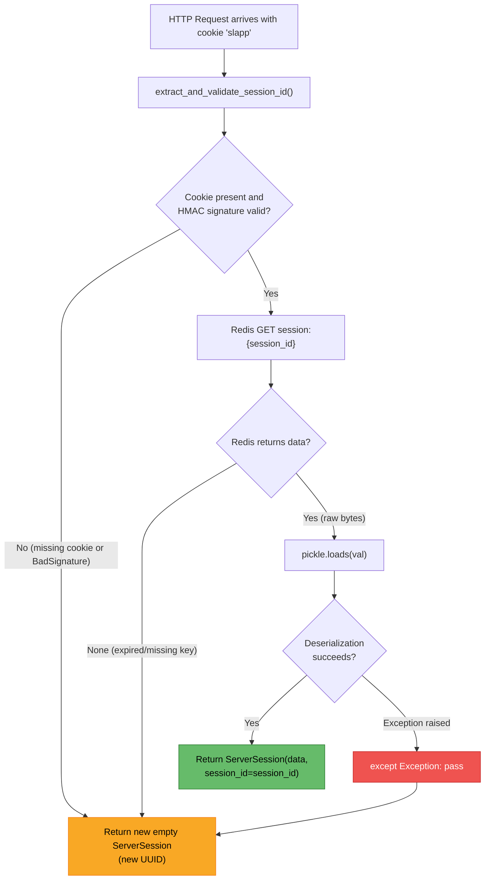
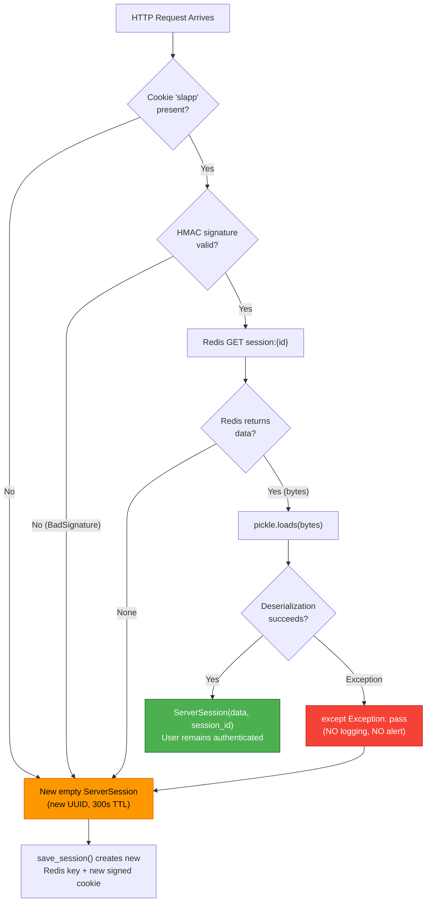
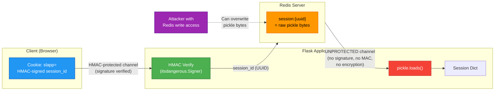

# Session Deserialization Behavior in SimpleLogin

This document presents a comprehensive, code-grounded investigation into how the SimpleLogin application handles server-side session deserialization — both under normal operating conditions and when Redis-stored session data is adversarially corrupted. Every conclusion is traced directly to source code evidence. No assumptions are made; the code is treated as the single source of truth.

The investigation covers five interrelated areas:

1. **Normal session lifecycle behavior** — what happens at runtime as users log in (with or without MFA) and log out
2. **Corruption and malformation handling** — what occurs when pickled session bytes in Redis are replaced with invalid data
3. **Observable runtime evidence** — what appears in HTTP responses, logs, and monitoring when corruption occurs
4. **Deserialization risk boundary** — the line between a benign session reset and a genuine deserialization attack
5. **Threat model nuance** — the security implications when an attacker can tamper with Redis data but cannot forge the HMAC-signed session cookie

---

## Table of Contents

- [Session Architecture Overview](#session-architecture-overview)
- [Normal Session Lifecycle](#normal-session-lifecycle)
- [Session Data Schema](#session-data-schema)
- [Corruption and Malformation Handling](#corruption-and-malformation-handling)
- [Log and Response Observability](#log-and-response-observability)
- [Deserialization Risk Boundary Analysis](#deserialization-risk-boundary-analysis)
- [Threat Model: Signed Cookie vs. Unsigned Redis Data](#threat-model-signed-cookie-vs-unsigned-redis-data)
- [Conclusions and Risk Summary](#conclusions-and-risk-summary)

---

## Session Architecture Overview

SimpleLogin uses a custom server-side session implementation that stores session data in Redis. The overall data flow follows a **Cookie → HMAC Verification → Redis → Pickle Deserialization** pipeline. This section documents each layer of that pipeline grounded in the source code.

### Cookie-to-Redis-to-Pickle Pipeline

1. **Session cookie name:** The browser cookie carrying the session identifier is named `slapp`. This is configured as a constant at `Source: app/config.py:199` (`SESSION_COOKIE_NAME = "slapp"`) and applied to the Flask app at `Source: server.py:159` (`app.config["SESSION_COOKIE_NAME"] = SESSION_COOKIE_NAME`).

2. **Cookie value (HMAC-signed session ID):** The cookie value is not raw data — it is an HMAC-signed UUID session identifier. The signing is performed by `itsdangerous.Signer` configured with `salt="session"` and `key_derivation="hmac"`, using the application's `FLASK_SECRET` as the cryptographic key (`Source: app/session.py:38-41`). The signed value is set on the response at `Source: app/session.py:102-107`.

3. **Redis storage key:** Session data is stored in Redis under a key formatted as `session:{session_id}`, where `session_id` is the UUID. The key construction is at `Source: app/session.py:43-45` where `_get_key` returns `f"{SESSION_PREFIX}:{session_Id}"` with `SESSION_PREFIX = "session"` defined at `Source: app/session.py:18`.

4. **Serialization (write path):** When saving a session, the session dictionary is serialized to bytes using Python's `pickle.dumps(dict(session))` at `Source: app/session.py:91`. These raw pickle bytes are stored in Redis via `SETEX` at `Source: app/session.py:97-101`.

5. **Deserialization (read path):** When opening a session, the raw bytes retrieved from Redis are deserialized using `pickle.loads(val)` at `Source: app/session.py:76`.

6. **Pickle module import:** The code attempts to import `cPickle` first (a C-accelerated pickle implementation available in Python 2), falling back to the standard `pickle` module. This is at `Source: app/session.py:9-12`. On Python 3.10+ (the runtime version per `Dockerfile` and `pyproject.toml`), `cPickle` does not exist as a separate module — `import cPickle` will always raise `ImportError`, and the standard `pickle` module (which is already C-accelerated in Python 3) is used.

### HMAC-Signed Session IDs

The session identifier in the cookie is protected by an HMAC signature to prevent client-side tampering with the session ID.

**Signer construction** (`Source: app/session.py:37-41`):

```python
@classmethod
def _get_signer(cls, app) -> itsdangerous.Signer:
    return itsdangerous.Signer(
        app.secret_key, salt="session", key_derivation="hmac"
    )
```

**Secret key source:** `app.secret_key` is assigned from the `FLASK_SECRET` environment variable at `Source: server.py:151` (`app.secret_key = FLASK_SECRET`). The `FLASK_SECRET` constant is loaded at `Source: app/config.py:196` (`FLASK_SECRET = os.environ["FLASK_SECRET"]`) and is **required** — an empty value raises `RuntimeError` at `Source: app/config.py:197-198`.

**Cookie extraction and validation** (`Source: app/session.py:47-59`):

The `extract_and_validate_session_id()` class method:
1. Reads the cookie value from `request.cookies.get(app.session_cookie_name)` (line 51)
2. If no cookie is present, returns `None` (line 52-53)
3. Calls `signer.unsign(unverified_session_Id)` to verify the HMAC signature (line 56)
4. On success, decodes the bytes to a string and returns the session ID (line 57)
5. On `itsdangerous.BadSignature`, returns `None` (line 58-59)

**Rationale:** The HMAC signature ensures that a client cannot fabricate or modify a session ID. Without knowledge of `FLASK_SECRET`, an attacker cannot produce a valid signed session ID. However — and this is critical for the threat model analysis later — the HMAC protects only the session ID in the cookie, not the session data stored in Redis.

### RedisSessionStore Class Anatomy

The `RedisSessionStore` class implements Flask's `SessionInterface` protocol (`Source: app/session.py:31`).

**Constructor** (`Source: app/session.py:32-35`):
- Accepts `redis_w` (write client), `redis_r` (read client), and `app` (Flask application)
- The read/write split enables Sentinel-based deployments where reads go to replicas

**ServerSession** (`Source: app/session.py:21-28`):
- Extends both `CallbackDict` (from werkzeug) and `SessionMixin` (from Flask)
- Tracks a `session_id` (UUID string) and a `modified` flag
- The `on_update` callback automatically sets `modified = True` when session contents change

**Redis initialization** (`Source: app/redis_services.py:9-25`):

The `initialize_redis_services()` function wires Redis into the Flask app:
- **Standard Redis** (`redis://` or `rediss://` URLs): Uses `limits.storage.RedisStorage`, with `storage.storage` for both read and write clients (`Source: app/redis_services.py:10-14`)
- **Sentinel Redis** (`redis+sentinel://` URLs): Uses `limits.storage.RedisSentinelStorage`, with `storage.storage` for writes and `storage.storage_slave` for reads (`Source: app/redis_services.py:15-21`)
- The same Redis storage instance is shared with the rate limiter (`set_redis_concurrent_lock`) and parallel limiter (`Source: app/redis_services.py:13-14, 20-21`)

**Conditional installation** (`Source: server.py:163-165`):

```python
if MEM_STORE_URI:
    app.config[flask_limiter.extension.C.STORAGE_URL] = MEM_STORE_URI
    initialize_redis_services(app, MEM_STORE_URI)
```

`RedisSessionStore` is only installed when `MEM_STORE_URI` is set. The `MEM_STORE_URI` configuration is optional (`Source: app/config.py:568`: `MEM_STORE_URI = os.environ.get("MEM_STORE_URI", None)`).

**Critical fallback behavior:** If `MEM_STORE_URI` is not set, no `RedisSessionStore` is installed, and Flask uses its **default cookie-based session** mechanism. In that case, there is no Redis involvement, no server-side session storage, and no `pickle` deserialization at all. The entire threat model discussed in this document applies only when `MEM_STORE_URI` is configured (which it is in production, per `Source: tests/test.env` showing `MEM_STORE_URI=redis://localhost`).

### Session Request Lifecycle Flowchart



**Rationale:** All three failure paths (bad/missing cookie, missing Redis key, pickle deserialization error) converge to the same outcome: a brand-new empty `ServerSession` with a fresh random UUID. This is a deliberate design choice that prioritizes availability (the user can still use the application) over error visibility (no failure is reported).

---

## Normal Session Lifecycle

This section traces the complete lifecycle of a session through login, MFA, authenticated request processing, and logout, identifying every session key written and deleted at each stage.

### Login (Credential Verification → login_user → Session Save)

**Step 1: Credential verification** (`Source: app/auth/views/login.py:21-82`)

The `/login` route validates email and password. On success (line 70-72), it calls `after_login(user, next_url)`.

Before reaching `after_login()`, the following checks are performed:
- User existence and password check (line 45)
- Account disabled status (line 51)
- Account deletion schedule (line 57)
- Account activation status (line 63)

**Step 2: MFA routing in `after_login()`** (`Source: app/auth/views/login_utils.py:12-45`)

The `after_login()` function determines the next step based on MFA configuration:

- **If FIDO/WebAuthn is enabled** (`user.fido_enabled()`): writes `session[MFA_USER_ID] = user.id` (`Source: app/auth/views/login_utils.py:23`) and redirects to the FIDO challenge page. At this point, the user is NOT yet authenticated — `login_user()` has not been called. The session contains only `mfa_user_id` and possibly a CSRF token.

- **Else if TOTP is enabled** (`user.enable_otp`): writes `session[MFA_USER_ID] = user.id` (`Source: app/auth/views/login_utils.py:29`) and redirects to the MFA/TOTP challenge page. Same unauthenticated state.

- **If no MFA**: calls `login_user(user)` (Flask-Login writes `_user_id` and `_fresh` into the session) at `Source: app/auth/views/login_utils.py:36`, then sets `session["sudo_time"] = int(time())` at line 37, and redirects to dashboard or `next_url`.

**Step 3: Session persistence via `save_session()`** (`Source: app/session.py:82-114`)

At the end of every request, Flask calls `save_session()`, which:
1. Serializes the session dict to pickle bytes: `val = pickle.dumps(dict(session))` (line 91)
2. Calculates TTL: 7 days for authenticated sessions (`_user_id` present), 300 seconds for unauthenticated (lines 92-96)
3. Writes to Redis: `self._redis_w.setex(name=self._get_key(session.session_id), value=val, time=ttl)` (lines 97-101)
4. Signs the session ID and sets the cookie: `self._get_signer(app).sign(itsdangerous.want_bytes(session.session_id))` (lines 102-103)

**Step 4: Session permanence** (`Source: server.py:204-207`)

A `before_request` hook ensures every session is marked as permanent:

```python
@app.before_request
def make_session_permanent():
    session.permanent = True
    app.permanent_session_lifetime = timedelta(days=7)
```

This runs on every request, making all sessions permanent with a 7-day cookie lifetime. This is significant for Flask-Login's `session_protection = "strong"` behavior (discussed in the observability section).

### MFA Flow (MFA_USER_ID → Challenge → login_user)

When MFA is required, the session enters an intermediate "MFA-pending" state where `mfa_user_id` is set but `_user_id` is not.

**TOTP path** (`Source: app/auth/views/mfa.py:32-107`):
1. Reads `user_id = session.get(MFA_USER_ID)` (line 38)
2. If no `user_id` in session, redirects to login (lines 41-43)
3. On valid TOTP token (line 70): `del session[MFA_USER_ID]` (line 71), then `login_user(user)` (line 75)
4. Note: `sudo_time` is **not** explicitly set in the TOTP path. This means after TOTP-based MFA, the user may be immediately prompted for sudo on sudo-protected pages.

**FIDO/WebAuthn path** (`Source: app/auth/views/fido.py:37-173`):
1. Reads `user_id = session.get(MFA_USER_ID)` (line 43)
2. On GET request: generates a challenge and writes `session["fido_challenge"] = challenge.rstrip("=")` (line 136)
3. On successful verification: `del session[MFA_USER_ID]` (line 109), `session["sudo_time"] = int(time())` (line 111), `login_user(user)` (line 112)
4. Note: Unlike TOTP, the FIDO path **does** set `sudo_time`.

**Recovery code path** (`Source: app/auth/views/recovery.py:21-75`):
1. Reads `user_id = session.get(MFA_USER_ID)` (line 27)
2. On valid recovery code: `del session[MFA_USER_ID]` (line 53), then `login_user(user)` (line 55)
3. Note: `sudo_time` is **not** explicitly set in the recovery code path.

### Authenticated Request Processing (Cookie → Redis → Pickle → Session Dict)

On every HTTP request, Flask calls `open_session()` (`Source: app/session.py:68-80`):

1. `extract_and_validate_session_id(app, request)` reads the `slapp` cookie and verifies the HMAC signature (line 69)
2. If valid: `val = self._redis_r.get(self._get_key(session_id))` fetches the pickled bytes from Redis (line 73)
3. If data exists: `data = pickle.loads(val)` deserializes the session dictionary (line 76)
4. Returns `ServerSession(data, session_id=session_id)` (line 77) — the session is now available via Flask's `session` proxy

On the response side, `save_session()` re-serializes the session and writes it back to Redis with the appropriate TTL.

**The user loader callback** (`Source: server.py:220-230`):

Flask-Login calls `load_user(alternative_id)` using the `_user_id` value from the session. This function:
1. Looks up the user by `alternative_id` (line 222)
2. Sets the Sentry user context (line 224)
3. Returns `None` if the user is disabled (line 226) or inactive (line 228)
4. Returns the user object otherwise (line 230)

### Logout (logout_session → Redis Delete → Cookie Clear)

**Web logout** (`Source: app/auth/views/logout.py:8-17`):
1. Calls `logout_session()` (line 10)
2. Creates a redirect response to the login page (line 12)
3. Deletes cookies: `SESSION_COOKIE_NAME` ("slapp"), `"mfa"`, and `"dark-mode"` (lines 13-15)

**API logout** (`Source: app/api/views/user_info.py:131-144`):
1. Calls `logout_session()` (line 140)
2. Returns JSON response and deletes the `SESSION_COOKIE_NAME` cookie (line 142)

**`logout_session()` implementation** (`Source: app/session.py:117-121`):
1. Calls `logout_user()` — Flask-Login removes `_user_id` and `_fresh` from the session (line 118)
2. Checks if the session interface has a `purge_session` method (line 119)
3. If available, calls `purge_fn(session)` (line 121)

**`purge_session()` implementation** (`Source: app/session.py:61-66`):
1. `self._redis_w.delete(self._get_key(session.session_id))` — deletes the session data from Redis (line 63)
2. `session.session_id = str(uuid.uuid4())` — assigns a new random session ID (line 64)
3. Wrapped in `try/except AttributeError` for safety when called on non-Redis sessions (lines 65-66)

**Rationale:** The logout flow is thorough: it clears Flask-Login state, deletes the Redis key (preventing reuse of the old session), assigns a new session ID (preventing fixation), and deletes the browser cookie. The old Redis key is removed immediately rather than waiting for TTL expiry.

### Login/Logout Session State Diagram

```mermaid
stateDiagram-v2
    [*] --> PreAuth: First visit / New session

    state PreAuth {
        note right of PreAuth
            Session keys: CSRF token only
            TTL: 300 seconds
            _user_id: absent
        end note
    }

    PreAuth --> MFAPending: Credentials valid,\nMFA required\n(writes mfa_user_id)

    state MFAPending {
        note right of MFAPending
            Session keys: mfa_user_id, CSRF token,\nfido_challenge (FIDO only)
            TTL: 300 seconds
            _user_id: absent
        end note
    }

    MFAPending --> Authenticated: MFA challenge passed\n(del mfa_user_id,\nlogin_user → _user_id,\nset sudo_time [FIDO only])

    PreAuth --> Authenticated: Credentials valid,\nno MFA\n(login_user → _user_id,\nset sudo_time)

    state Authenticated {
        note right of Authenticated
            Session keys: _user_id, _fresh,\nsudo_time, _id, CSRF token
            TTL: 7 days (604800s)
        end note
    }

    Authenticated --> LoggedOut: logout_session()\n(logout_user clears _user_id,\npurge_session deletes Redis key,\nnew session_id assigned)

    state LoggedOut {
        note right of LoggedOut
            Redis key: DELETED
            Cookie: DELETED (slapp, mfa, dark-mode)
            New empty session created
        end note
    }

    LoggedOut --> PreAuth: Next request
    Authenticated --> Authenticated: sudo re-auth\n(updates sudo_time)
```

---

## Session Data Schema

This section catalogs every session key used across the application, based on exhaustive code analysis.

### Complete Session Key Inventory

| Key | Type | Set By | Cleared By | Purpose |
|-----|------|--------|-----------|---------|
| `_user_id` | `str` (User.alternative_id) | `flask_login.login_user()` — invoked at `login_utils.py:36`, `mfa.py:75`, `fido.py:112`, `recovery.py:55` | `flask_login.logout_user()` via `session.py:118` | Identifies the authenticated user; managed by Flask-Login |
| `_fresh` | `bool` | `flask_login.login_user()` (sets to `True`) | Flask-Login `session_protection="strong"` may set to `False` on IP/UA mismatch | Indicates if login was direct (vs. cookie-remembered); managed by Flask-Login |
| `_id` | `str` (hash) | Flask-Login `session_protection` (IP + User-Agent hash) | Regenerated on each login | Session fingerprint for `session_protection="strong"` — `Source: app/extensions.py:8` |
| `mfa_user_id` | `int` (User.id) | `after_login()` — `Source: app/auth/views/login_utils.py:23,29` | `del session[MFA_USER_ID]` in `mfa.py:71`, `fido.py:109`, `recovery.py:53` | Holds user ID during MFA challenge flow before full authentication |
| `sudo_time` | `int` (Unix timestamp) | `after_login()` at `login_utils.py:37`, `fido.py:111`, `enter_sudo.py:34` | `exit_sudo.py:8` sets to `0` | Timestamp of last privilege escalation; `sudo_required` decorator checks 120-second gap (`Source: app/dashboard/views/enter_sudo.py:73-75`) |
| `fido_challenge` | `str` | `Source: app/auth/views/fido.py:136` | Implicitly lost on session reset or logout | WebAuthn assertion challenge for FIDO key verification |
| `slref` | `str` (referral code) | `Source: server.py:270` (`session["slref"] = ref_code` in `before_request` hook) | Not explicitly cleared | Stores referral code from URL query parameter `?slref=code` |
| `oauth_state` | `str` | `facebook.py:47`, `google.py:43`, `github.py:34`, `oidc.py:44`, `proton.py:105` | Not explicitly cleared | OAuth2 state parameter for CSRF protection during social login flows |
| `facebook_next_url` | `str` (URL) | `Source: app/auth/views/facebook.py:38` | Not explicitly cleared | Return URL after Facebook OAuth completion |
| `google_next_url` | `str` (URL) | `Source: app/auth/views/google.py:37` | Not explicitly cleared | Return URL after Google OAuth completion |
| `oauth_redirect_next` | `str` or `None` | `Source: app/auth/views/oidc.py:45` | Set to `None` at `oidc.py:118` | OIDC return URL (key name defined as `SESSION_NEXT_KEY` at `oidc.py:26`) |
| `oauth_action` | `str` | `Source: app/auth/views/proton.py:106` | Not explicitly cleared | Proton OAuth action type (key name defined as `SESSION_ACTION_KEY` at `proton.py:36`) |
| `oauth_next` | `str` (URL) | `Source: app/auth/views/proton.py:85` | `del session["oauth_next"]` at `proton.py:87` | Proton OAuth return URL |
| `oauth_scheme` | `str` | `Source: app/auth/views/proton.py:91` | `del session["oauth_scheme"]` at `proton.py:93` | Proton OAuth URL scheme |
| `oauth_mode` | `str` (`"apikey"` or `"session"`) | `Source: app/auth/views/proton.py:97-99` | Not explicitly cleared | Proton OAuth authentication mode |
| CSRF token | `str` | Flask-WTF (automatically generated) | Lost on session reset | CSRF protection token for form submissions |

### TTL Differentiation

Session time-to-live in Redis varies based on authentication state (`Source: app/session.py:92-96`):

| Session State | TTL | Rationale (from code) |
|--------------|-----|----------------------|
| **Authenticated** (`_user_id` present) | `app.permanent_session_lifetime` = **7 days** (604,800 seconds) | `Source: app/session.py:92` uses `int(app.permanent_session_lifetime.total_seconds())`; `Source: server.py:207` sets `app.permanent_session_lifetime = timedelta(days=7)` |
| **Unauthenticated** (`_user_id` absent) | **300 seconds** (5 minutes) | `Source: app/session.py:95-96`; the code comment at line 94 explains: *"We need to keep the non-authenticated ones because the csrf token is stored in the session."* |

**Rationale:** The 300-second TTL for unauthenticated sessions is a compromise — short enough to limit Redis memory consumption from drive-by visitors, but long enough to preserve the CSRF token across a typical login form submission. Authenticated sessions get the full 7-day window to match the cookie lifetime.

### What a Pickled Session Looks Like in Redis

The Redis value for a session is the raw bytes output of `pickle.dumps(dict(session))` (`Source: app/session.py:91`). The Redis key is `session:{uuid4-value}` (`Source: app/session.py:44-45`).

For an authenticated user with a sudo timestamp, the pickled dictionary would contain keys like:

```
{
    "_user_id": "abc123-def456-...",   # User.alternative_id
    "_fresh": True,                     # Direct login
    "_id": "sha256-hash-of-ip-ua",     # Flask-Login fingerprint
    "sudo_time": 1700000000,           # Unix timestamp
    "csrf_token": "random-token-value"  # Flask-WTF CSRF
}
```

This dictionary is serialized with Python's pickle protocol and stored as opaque bytes in Redis. There is **no HMAC, signature, MAC, or encryption** applied to these bytes — they are stored and retrieved as-is.

---

## Corruption and Malformation Handling

**Direct answer:** When the pickled session bytes in Redis are replaced with corrupted, truncated, or otherwise malformed data, the application does **NOT** crash, does **NOT** return an error to the user, and does **NOT** log the event. It silently creates a brand-new empty session with a new random UUID, effectively resetting the user to an unauthenticated state. This behavior is completely invisible in application logs and monitoring.

### Code Evidence — The Critical Method `open_session()`

The entire deserialization and error-handling logic is contained in `open_session()` (`Source: app/session.py:68-80`):

```python
def open_session(self, app: flask.Flask, request: flask.Request):
    session_id = self.extract_and_validate_session_id(app, request)
    if not session_id:
        return ServerSession(session_id=str(uuid.uuid4()))

    val = self._redis_r.get(self._get_key(session_id))
    if val is not None:
        try:
            data = pickle.loads(val)
            return ServerSession(data, session_id=session_id)
        except Exception:
            pass
    return ServerSession(session_id=str(uuid.uuid4()))
```

### Analysis of the Bare `except Exception: pass` Pattern

The error handling at `Source: app/session.py:78-79` is a bare `except Exception: pass`. This has the following behavioral consequences:

1. **All exceptions are caught:** If `pickle.loads(val)` raises **any** exception — `UnpicklingError`, `EOFError`, `ValueError`, `KeyError`, `AttributeError`, `TypeError`, or any other `Exception` subclass — execution falls through to the `pass` statement.

2. **No logging:** The `pass` statement means: no `LOG.w()`, no `LOG.e()`, no `print()`, no `sentry_sdk.capture_exception()`, no counter increment, no metric emission. The exception is silently swallowed.

3. **New session with new UUID:** After the except block, line 80 returns `ServerSession(session_id=str(uuid.uuid4()))` — a completely fresh empty session with a **new** random session ID.

4. **Old Redis key persists:** The new session ID means that on `save_session()`, a new Redis key will be created and a new signed cookie will be sent to the client. The old corrupted Redis key (`session:{old-uuid}`) **remains in Redis until its TTL expires**. It is not cleaned up.

### Three Failure Modes with Identical Outcome

| Failure Mode | Trigger Point | Code Path | Outcome |
|-------------|--------------|-----------|---------|
| **Bad HMAC signature on cookie** | Client sends tampered cookie value | `extract_and_validate_session_id()` catches `BadSignature`, returns `None` → line 70-71 | New empty `ServerSession` (new UUID) |
| **Valid cookie, missing Redis key** | Session expired, Redis flushed, or wrong Redis instance | `self._redis_r.get()` returns `None` → line 74 is falsy → line 80 | New empty `ServerSession` (new UUID) |
| **Valid cookie, Redis key present, corrupted pickle bytes** | Data corruption, adversarial modification, or partial write | `pickle.loads(val)` raises exception → `except Exception: pass` → line 80 | New empty `ServerSession` (new UUID) |

All three failure modes produce the **exact same observable outcome** to the client: an empty session with a new UUID, a new signed cookie, and unauthenticated status.

### CSRF Token Implications

When a session is silently reset, the CSRF token stored in that session is lost. This creates a user-visible side effect:

1. Any HTML form already rendered in the user's browser contains a CSRF token from the now-destroyed session
2. Submitting such a form will fail Flask-WTF's CSRF validation (the submitted token does not match the new session's token)
3. The user will see a CSRF error or be redirected, depending on the application's error handling for CSRF failures
4. This is the **most visible side-effect** of session corruption to end users — not a session error, but a CSRF validation failure

**Rationale:** The CSRF failure is an indirect symptom. An operator investigating "users are getting CSRF errors" would not immediately connect this to session data corruption in Redis, because the session reset itself produces no log entry.

### Corruption Handling Decision Tree



**Key observation:** Every failure path leads to the same orange outcome box. The only successful path is the green box where pickle deserialization completes without error.

---

## Log and Response Observability

**Direct answer:** When session corruption occurs, there is **NO** log entry, **NO** Sentry event, **NO** special HTTP response header, and **NO** error status code that indicates a deserialization failure. The failure is completely silent and invisible to all standard monitoring.

### What the `after_request` Handler Logs

The `after_request` handler (`Source: server.py:272-296`) logs the following for each request:

```
IP, method, path, args, status_code, response_time
```

Specifically (`Source: server.py:284-292`):
```python
LOG.d(
    "%s %s %s %s %s, takes %s",
    request.remote_addr,
    request.method,
    request.path,
    request.args,
    res.status_code,
    time.time() - start_time,
)
```

It also records a NewRelic custom event for the HTTP status code (`Source: server.py:293-295`).

**What is NOT logged:** There is no session state information, no session ID, no session error indicator, and no flag indicating whether the session was freshly created or loaded from Redis. A request where session deserialization failed looks **identical** in logs to a request from a first-time visitor.

### What Sentry Captures (or Does Not)

Sentry is initialized with Flask and SQLAlchemy integrations (`Source: server.py:111-121`):

```python
sentry_sdk.init(
    dsn=SENTRY_DSN,
    release=f"app@{SHA1}",
    integrations=[
        FlaskIntegration(),
        SqlalchemyIntegration(),
    ],
    before_send=sentry_before_send,
)
```

However, Sentry only captures exceptions that **propagate** (unhandled exceptions, or exceptions explicitly sent via `sentry_sdk.capture_exception()`). The `except Exception: pass` block in `open_session()` (`Source: app/session.py:78-79`) **catches and swallows** the exception without re-raising and without calling any Sentry API. Therefore, **Sentry will never capture session deserialization failures.**

### What the Application Logger (`LOG`) Captures

The application logger is configured at `Source: app/log.py:48-64, 79`:
- Logger name: `"SL"` (line 79)
- Level: `DEBUG` (line 51)
- Format (`Source: app/log.py:12-14`): `asctime, name, levelname, process, pathname, lineno, funcName, message_id, message`

The logger provides shortcut methods at `Source: app/log.py:74-77`:
```python
logging.Logger.d = logging.Logger.debug
logging.Logger.i = logging.Logger.info
logging.Logger.w = logging.Logger.warning
logging.Logger.e = logging.Logger.exception
```

**Critical finding:** There is **no** `LOG.w()`, `LOG.e()`, `LOG.d()`, or any other logging call inside the `open_session()` method's except block. The entire error-handling logic at `Source: app/session.py:78-79` consists solely of `except Exception: pass`. No logging infrastructure in the application is invoked during a session deserialization failure.

### What Flask-Login's `session_protection = "strong"` Does

Flask-Login's session protection is configured at `Source: app/extensions.py:8`:
```python
login_manager.session_protection = "strong"
```

**Behavior:** Flask-Login computes a hash of the client's IP address and User-Agent header, storing it as `_id` in the session. On each subsequent request, it compares the stored `_id` with the current request's IP+UA hash.

**Interaction with permanent sessions:** Since `make_session_permanent()` runs on every request (`Source: server.py:204-207`), **all** SimpleLogin sessions are permanent. For permanent sessions with `session_protection = "strong"`:
- If `_id` doesn't match (e.g., user's IP changed): the session is **marked as non-fresh** (`_fresh = False`) but **NOT deleted**
- The session contents remain intact; only `_fresh` is changed
- For non-permanent sessions (which never exist in SimpleLogin): the session would be fully deleted

**Relevance to corruption:** When session corruption causes a silent reset, the new empty session has no `_id` value. Flask-Login will compute a new `_id` from the current request and store it in the new session. There is no observable log or response artifact from this process.

### HTTP Response Behavior on Session Corruption

- **Status code:** The HTTP response will be the normal status code for the requested resource (e.g., 200, 302, etc.). There is no special error code.
- **Headers:** No special header is added to indicate session failure.
- **Body:** No error message related to session deserialization appears in the response body.
- **Redirect behavior:** If the corrupted session belonged to an authenticated user, they will appear unauthenticated on the new empty session. Flask-Login's `@login_required` decorator will redirect them to the login page. From the user's perspective, they were "logged out unexpectedly."

**Rationale:** The silent failure pattern means that session corruption in production would manifest as sporadic "unexpected logouts" without any server-side evidence of the cause. An operator investigating user complaints would find only normal-looking access logs with 302 redirects to the login page — indistinguishable from session expiry.

---

## Deserialization Risk Boundary Analysis

**Direct answer:** There is a critical distinction between two types of corrupted session data that the code does not differentiate:

1. **Benign corruption** (random bytes, truncated data): `pickle.loads()` raises an exception, caught by the bare `except`, session resets silently. No code execution occurs.
2. **Crafted malicious payload** (pickle stream with `__reduce__` instructions): `pickle.loads()` **executes the embedded code DURING deserialization, BEFORE any exception can be raised**. If the payload executes code and then returns a valid dict, `pickle.loads()` succeeds normally — the `except` block is never even reached.

### Benign Failure Path

When the Redis value contains genuinely corrupted or random bytes:

1. `pickle.loads(val)` attempts to interpret the bytes as a pickle protocol stream
2. The pickle VM encounters an invalid opcode, unexpected end-of-stream, or malformed data structure
3. An exception is raised: `UnpicklingError`, `EOFError`, `ValueError`, `KeyError`, etc.
4. The exception is caught by `except Exception: pass` at `Source: app/session.py:78-79`
5. A new empty session is returned at line 80
6. **No code execution occurs** — the pickle VM simply failed to parse the byte stream

**Rationale:** This is the "safe" corruption scenario. The pickle deserializer is a bytecode interpreter; random bytes will almost certainly contain invalid opcodes or malformed structures that cause parsing failures before any object construction occurs.

### Dangerous Payload Path (CWE-502: Deserialization of Untrusted Data)

When an attacker with Redis write access crafts a malicious pickle payload:

1. The attacker constructs a pickle byte stream containing a `__reduce__` method that specifies:
   - A callable (e.g., `os.system`, `subprocess.Popen`, `exec`)
   - Arguments to that callable (e.g., a shell command string)

2. When `pickle.loads(val)` is called at `Source: app/session.py:76`, the pickle VM processes the stream:
   - Encounters the `REDUCE` opcode (or equivalent)
   - **Calls the specified callable with the specified arguments**
   - This execution happens **during** the `pickle.loads()` call, **inside** the `try` block
   - The code executes **before** any return value is produced
   - The code executes **before** any exception could possibly be raised by the `except` block

3. The attacker can design the payload to:
   - **Execute code AND return a valid dict:** `pickle.loads()` returns normally, the session appears valid, and the `except` block is never reached
   - **Execute code AND raise an exception:** The code runs, then the exception is caught by `except Exception: pass` — but the damage is already done
   - **Execute code that persists** (e.g., reverse shell, cron job, file write): The execution occurs in the Flask application's process with the application's permissions

### Why the `except` Block Provides Zero Protection Against RCE

The `except Exception: pass` at `Source: app/session.py:78-79` provides **no protection** against intentional deserialization attacks. The reason is fundamental to how pickle works:

1. **`pickle.loads()` is a bytecode interpreter.** It reads opcodes from the byte stream and executes them sequentially. The `REDUCE` opcode is a first-class instruction that calls an arbitrary Python callable.

2. **Object construction happens DURING deserialization.** The `__reduce__` protocol is how pickle reconstructs objects — it calls the specified function as part of building the deserialized object graph. This is not a post-processing step; it is the core deserialization mechanism.

3. **The `except` block only handles post-deserialization failures.** By the time an exception could be raised (e.g., if the deserialized object is not a valid dict), any side effects from `__reduce__` have already occurred.

4. **Well-crafted payloads don't raise exceptions at all.** A competent attacker's payload will execute the desired code AND return a valid Python dictionary, making `pickle.loads()` succeed normally. The `except` block never fires.

**Python's own documentation** explicitly warns: *"Warning: The pickle module is not secure. Only unpickle data you trust."* This warning exists precisely because of the `__reduce__` execution model.

### Threat Model Boundary Diagram



**Key insight:** The HMAC-protected boundary (blue → green) ensures session ID integrity. But the data channel from Redis to pickle (orange → red) has **no integrity protection**. An attacker who can write to Redis can inject arbitrary pickle bytes that will be deserialized — and potentially executed — without any verification.

---

## Threat Model: Signed Cookie vs. Unsigned Redis Data

**Direct answer:** The HMAC-signed cookie protects the session ID from client-side tampering but does **NOT** protect the session data stored in Redis. If an attacker gains Redis write access but cannot forge the HMAC signature (i.e., does not know `FLASK_SECRET`), they can still achieve Remote Code Execution (RCE) by overwriting the pickle bytes for any active session key in Redis.

### What the HMAC Signature Protects (Session ID Integrity)

The cookie contains `signer.sign(session_id)` (`Source: app/session.py:102-103`). Without knowledge of `FLASK_SECRET`, an attacker **cannot**:

- Forge a valid signed session ID that the application will accept
- Modify an intercepted session ID without invalidating its signature
- Guess which UUID maps to which user's session
- Create a new session ID that `extract_and_validate_session_id()` will return as valid

The HMAC ensures that the session ID in the cookie was originally issued by the application and has not been tampered with in transit.

### What the HMAC Signature Does NOT Protect (Redis-Stored Bytes)

The data stored in Redis at `session:{session_id}` is raw `pickle.dumps()` output (`Source: app/session.py:91`). Examining the code path:

1. **No signature on Redis data:** `Source: app/session.py:73-77` — `self._redis_r.get()` returns raw bytes, which are passed **directly** to `pickle.loads()` with no integrity check, no MAC verification, and no decryption step.

2. **No encryption on Redis data:** The `pickle.dumps()` at line 91 produces plaintext pickle bytes. Anyone who can read the Redis key can deserialize and inspect the session contents.

3. **No audit trail on Redis writes:** The application does not monitor Redis key modifications. A `SET session:{uuid} <malicious-bytes>` command executed by an attacker is indistinguishable from a normal session write.

4. **Silent failure on corruption:** Even if the attacker's payload fails, the bare `except` at `Source: app/session.py:78-79` ensures **no alert is generated**.

### Attack Surface Comparison

| Capability | Redis Access Only | Redis Access + FLASK_SECRET |
|-----------|------------------|---------------------------|
| Read existing session data | **Yes** — `GET session:*` then `pickle.loads()` on values | **Yes** |
| Overwrite existing session data | **Yes** — `SET session:{known_id} <payload>` | **Yes** |
| Inject RCE payload | **Yes** — craft pickle bytes with `__reduce__` | **Yes** |
| Create new valid session cookie | **No** — cannot produce valid HMAC signature | **Yes** — can sign arbitrary session IDs |
| Target a specific user's session | Must enumerate existing keys via `SCAN` | Can create targeted session ID + cookie |
| Trigger payload execution | Must wait for victim's next HTTP request | Can craft cookie and send request directly |
| Stealth | High — silent error handling leaves no trace | Same |

### Risk Assessment

**Redis access without `FLASK_SECRET` is a critical RCE vector.** The attack requires only:

1. **Enumerate active session keys:** `SCAN 0 MATCH session:*` (or `KEYS session:*`) reveals all active session IDs
2. **Overwrite a session value:** `SET session:{target-uuid} <crafted-pickle-payload>` replaces the legitimate session data with a malicious pickle stream
3. **Wait for the victim:** The legitimate user's next HTTP request will trigger `open_session()`, which calls `pickle.loads()` on the attacker's payload, executing arbitrary code in the Flask process

The attack is "blind" in that the attacker must wait for the victim to make a request, but it is **reliable** — every active session with regular traffic will eventually trigger deserialization. An attacker could also overwrite **all** active sessions simultaneously to maximize the probability of rapid execution.

**The HMAC-signed cookie provides defense-in-depth for session ID integrity but creates a false sense of security.** The cookie signing prevents session ID forgery from the client side, but the actual deserialization attack surface is at the Redis data layer — a layer that the HMAC does not protect.

### Runtime Evidence Supporting This Conclusion

1. **No signature verification on Redis data:** The `open_session()` method at `Source: app/session.py:73-77` reads bytes from Redis and passes them directly to `pickle.loads()`. There is no `signer.unsign()`, no `hmac.compare_digest()`, no integrity check of any kind on the Redis-stored bytes.

2. **No encryption on Redis data:** The `save_session()` method at `Source: app/session.py:91` calls `pickle.dumps(dict(session))` and stores the result directly. There is no encryption step.

3. **No audit trail on Redis writes:** Neither `save_session()` nor any middleware in the application monitors or logs Redis write operations. An attacker's `SET` command is silent.

4. **Silent failure guarantees stealth:** The bare `except Exception: pass` at `Source: app/session.py:78-79` ensures that even a failed attack attempt produces no log entry, no Sentry event, and no observable error. The attacker can iterate on their payload without alerting anyone.

5. **Shared Redis instance amplifies risk:** The same Redis instance used for sessions is also used for rate limiting (`Source: app/redis_services.py:13-14, 20-21`). A vulnerability in the rate limiter's Redis usage, or in any other service sharing the same Redis, could provide the write access needed for this attack.

---

## Conclusions and Risk Summary

This section summarizes the findings for each of the five investigation areas.

### 1. Normal Session Lifecycle

Sessions follow a **Cookie → HMAC verify → Redis → pickle.loads()** pipeline. The cookie is named `slapp` and contains an HMAC-signed UUID session ID. Session data is stored in Redis as pickled Python dictionaries.

- **Login** writes `_user_id` (via Flask-Login's `login_user()`) and `sudo_time` for direct logins without MFA (`Source: app/auth/views/login_utils.py:36-37`)
- **MFA** uses `mfa_user_id` as an intermediate state before full authentication, with three paths: TOTP (`Source: app/auth/views/mfa.py`), FIDO (`Source: app/auth/views/fido.py`), and recovery codes (`Source: app/auth/views/recovery.py`)
- **Sessions are permanent** with a 7-day cookie lifetime for authenticated users and 300-second TTL for unauthenticated sessions (`Source: app/session.py:92-96`)
- **Logout** calls `logout_user()`, deletes the Redis key via `purge_session()`, assigns a new session ID, and deletes the browser cookie (`Source: app/session.py:117-121`, `Source: app/auth/views/logout.py:8-17`)

### 2. Corruption and Malformation Handling

All deserialization failures are silently caught by a bare `except Exception: pass` at `Source: app/session.py:78-79`. The consequences:

- The user gets a new empty session with a new random UUID
- **No logging** of the deserialization failure occurs
- **No error response** is sent to the client
- **No metrics or alerts** are generated
- The most visible symptom is CSRF validation failure on already-rendered forms
- The old corrupted Redis key persists until its TTL expires

### 3. Observable Runtime Evidence

**None.** Session deserialization failures are completely invisible to standard monitoring:

- The `after_request` handler (`Source: server.py:272-296`) logs request metadata but not session state
- Sentry does not capture swallowed exceptions (the `except Exception: pass` block does not call `sentry_sdk.capture_exception()`)
- The application logger `LOG` (`Source: app/log.py:79`) has no logging call inside the error handler
- The failure is indistinguishable from a normal first visit by a new user
- Flask-Login's `session_protection = "strong"` (`Source: app/extensions.py:8`) does not detect or log session resets — it only checks IP/UA fingerprint mismatches on existing sessions

### 4. Deserialization Risk Boundary

There is a critical, unbridgeable gap between benign corruption and weaponized payloads:

- **Malformed bytes** (random, truncated, accidental corruption): cause benign exceptions (`UnpicklingError`, `EOFError`, etc.) that are caught by the `except` block. No code execution occurs. The session silently resets.
- **Crafted `__reduce__` payloads**: execute arbitrary code **during** `pickle.loads()` at `Source: app/session.py:76`, before any exception handling can intervene. The `except Exception: pass` block provides **zero protection** against intentional deserialization attacks because the malicious code runs as part of the pickle VM's object reconstruction protocol.
- A well-crafted payload executes code AND returns a valid dict, meaning `pickle.loads()` succeeds normally and the `except` block is never reached.

### 5. Threat Model Nuance

The HMAC-signed cookie (using `itsdangerous.Signer` with `FLASK_SECRET` at `Source: app/session.py:38-41`) protects session ID integrity but does **NOT** protect the Redis-stored pickle data:

- An attacker with Redis write access (but without `FLASK_SECRET`) can achieve RCE by overwriting existing session values with crafted pickle payloads
- The attack requires only: (a) `SCAN` to find active session keys, (b) `SET` to overwrite a value, (c) wait for the victim's next request
- The silent error handling (`except Exception: pass`) ensures the attack leaves **no trace** in application logs, Sentry, or NewRelic
- The same Redis instance serves sessions, rate limiting, and concurrency locks (`Source: app/redis_services.py:13-14, 20-21`), meaning a compromise of any Redis client grants access to session data

**The fundamental issue is that the HMAC protects the pointer (session ID in the cookie) but not the data it points to (session bytes in Redis).** The cookie signing prevents session ID forgery from the client side, which is necessary but insufficient — the deserialization risk resides entirely at the server-to-Redis boundary, which has no integrity protection.
