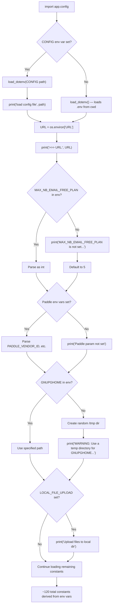
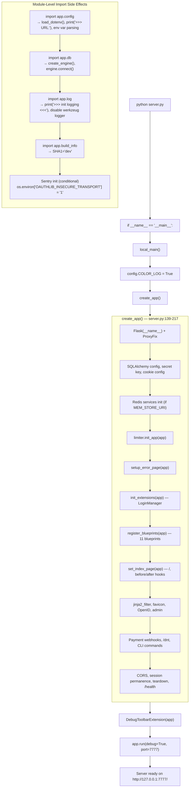
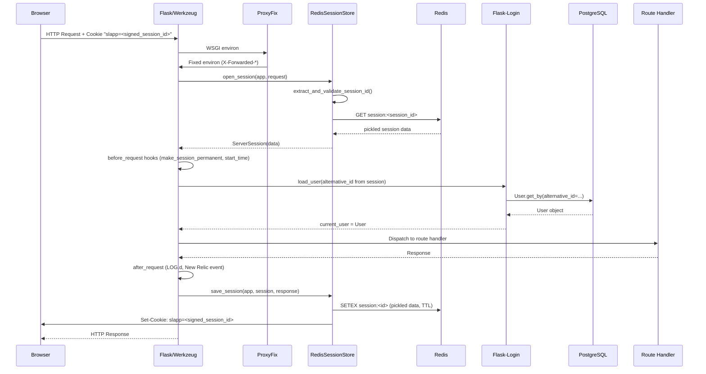
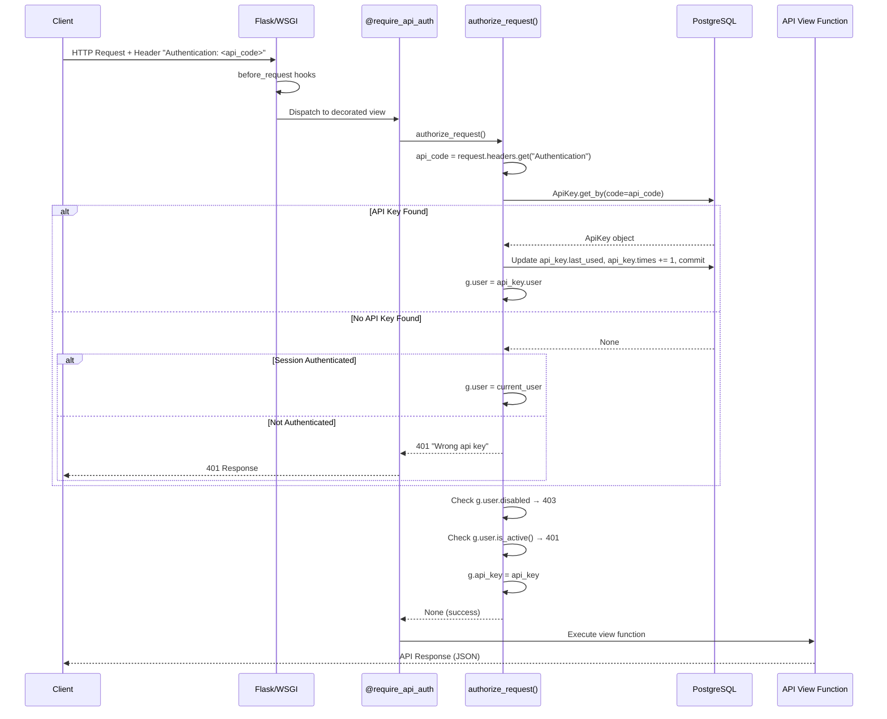
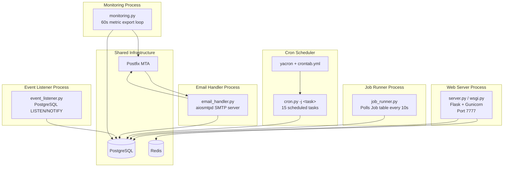

# SimpleLogin Runtime Behavior: A Code-Grounded Technical Investigation

## Introduction

This document is an empirical, code-grounded investigation of what SimpleLogin *actually does* at runtime. Rather than restating documentation or describing intended behavior, every claim here is traced directly to a specific line of source code. The codebase is the single source of truth.

**Methodology:** We trace execution paths through the Python source, starting from the exact entry point (`python server.py`) and following every function call, import side-effect, and `print()` statement to reconstruct what a developer would observe in their terminal. We then follow an HTTP request through the authentication layer to understand how user identity is resolved and propagated. Finally, we enumerate every process entry point to definitively answer whether the development server launches any background work.

**Scope:**
1. **Development server startup lifecycle** — what happens from the moment you run `python server.py` until the server is ready for requests
2. **Authenticated request handling** — how browser sessions and API keys carry identity through a request
3. **Background process architecture** — whether the web server starts any workers, and what the separate process entry points are

**Key constraint:** All observations are derived from reading the source code. No assumptions, no "should" — only "does."

---

## Part 1: Development Server Startup

### 1.1 Entry Point and Invocation

Running `python server.py` triggers Python's standard `__main__` guard:

```python
if __name__ == "__main__":
    local_main()
```

*Source: `server.py:598-599`*

This calls `local_main()`, defined at `server.py:572-588`. The function does exactly five things:

1. Sets `config.COLOR_LOG = True` — enables colored console output via the `coloredlogs` package
2. Calls `create_app()` — the Flask application factory (the heavy lifter)
3. Configures and installs the Flask Debug Toolbar
4. Sets `app.debug = True`
5. Calls `app.run(debug=True, port=7777)` — starts Flask's built-in Werkzeug development server

*Source: `server.py:572-588`*

**Rationale:** `local_main()` is a thin wrapper around `create_app()` that adds development-only conveniences (debug toolbar, colored logs, debug mode). The actual application construction is entirely in `create_app()`.

### 1.2 Module-Level Side Effects During Import

**This is critical:** Before `create_app()` is even called, Python's import system executes module-level code in every file imported at the top of `server.py` (lines 1-109). These imports trigger a cascade of observable side effects — print statements, database connections, and configuration loading — that the developer sees *before* the Flask app exists.

Here is the import-time execution sequence:

#### 1.2.1 `app/config.py` — Configuration Loading

Imported via `from app import config` at `server.py:30`. This is the first application module loaded, and it performs extensive work at import time.

**Step 1: `load_dotenv()` (lines 65-71)**

```python
config_file = os.environ.get("CONFIG")
if config_file:
    config_file = get_abs_path(config_file)
    print("load config file", config_file)
    load_dotenv(get_abs_path(config_file))
else:
    load_dotenv()
```

If the `CONFIG` environment variable is set, it loads the specified file and prints its path. Otherwise, it loads `.env` from the current working directory silently (no print).

*Source: `app/config.py:65-71`*

**Step 2: URL announcement (lines 79-80)**

```python
URL = os.environ["URL"]
print(">>> URL:", URL)
```

This always prints. If `URL` is not set in the environment or `.env` file, this line raises a `KeyError` and the application crashes immediately.

*Source: `app/config.py:79-80`*

**Step 3: `MAX_NB_EMAIL_FREE_PLAN` fallback (lines 120-124)**

```python
try:
    MAX_NB_EMAIL_FREE_PLAN = int(os.environ["MAX_NB_EMAIL_FREE_PLAN"])
except Exception:
    print("MAX_NB_EMAIL_FREE_PLAN is not set, use 5 as default value")
    MAX_NB_EMAIL_FREE_PLAN = 5
```

If the environment variable is missing or non-integer, it prints a fallback message and defaults to 5.

*Source: `app/config.py:120-124`*

**Step 4: Paddle payment parameters (lines 212-220)**

```python
try:
    PADDLE_VENDOR_ID = int(os.environ["PADDLE_VENDOR_ID"])
    PADDLE_MONTHLY_PRODUCT_ID = int(os.environ["PADDLE_MONTHLY_PRODUCT_ID"])
    PADDLE_YEARLY_PRODUCT_ID = int(os.environ["PADDLE_YEARLY_PRODUCT_ID"])
except (KeyError, ValueError):
    print("Paddle param not set")
    PADDLE_VENDOR_ID = -1
    ...
```

If any Paddle environment variable is missing, it prints `"Paddle param not set"` and uses sentinel values of -1.

*Source: `app/config.py:212-220`*

**Step 5: GNUPGHOME fallback (lines 253-262)**

If `GNUPGHOME` is not in the environment, the code creates a random temporary directory and prints a warning:

```python
print("WARNING: Use a temp directory for GNUPGHOME", GNUPGHOME)
```

*Source: `app/config.py:262`*

**Step 6: LOCAL_FILE_UPLOAD (lines 327-332)**

If the `LOCAL_FILE_UPLOAD` environment variable is set, it prints `"Upload files to local dir"` and potentially `"Create upload dir"` if the upload directory doesn't exist.

*Source: `app/config.py:327-332`*

#### 1.2.2 `app/log.py` — Logger Initialization

Imported via `from app.log import LOG` at `server.py:83`. This module executes three things at import time:

```python
print(">>> init logging <<<")
```

This always prints.

*Source: `app/log.py:67`*

Then it disables Flask/Werkzeug's built-in request logger:

```python
log = logging.getLogger("werkzeug")
log.disabled = True
```

*Source: `app/log.py:70-71`*

**Rationale:** This is why you won't see the standard Werkzeug `127.0.0.1 - - [date] "GET /path HTTP/1.1" 200` lines. SimpleLogin replaces them with its own `LOG.d()` calls in the `after_request` hook.

Finally, it creates the application logger `LOG = _get_logger("SL")` with a custom format that includes process ID, file path, function name, and a message-ID field for email lifecycle tracking. If `COLOR_LOG` is set (which `local_main()` does before `create_app()` is called, but *after* the import — see timing note below), `coloredlogs` is installed.

*Source: `app/log.py:48-64, 79`*

**Timing note on COLOR_LOG:** There is a subtlety here. `local_main()` sets `config.COLOR_LOG = True` at line 573, *then* calls `create_app()`. However, `app/log.py` was already imported at the top of `server.py` (line 83), so by the time `config.COLOR_LOG = True` is set, the logger has already been created *without* colored output. The `COLOR_LOG` check happens at `app/log.py:61` during `_get_logger()`, which runs at import time when `COLOR_LOG` is still `False` (its value from `os.environ` at `app/config.py:73`). However, when `debug=True` is set and Flask's reloader forks a child process, the *second* import of `server.py` will see `config.COLOR_LOG = True` set by the parent process's `local_main()`. In practice, with the stat reloader, the module runs twice — and the environment variable `COLOR_LOG` from `os.environ` at config.py:73 (`"COLOR_LOG" in os.environ`) is what controls the first pass, while the second pass (in the reloader child) benefits from `config.COLOR_LOG = True` being set in-memory.

#### 1.2.3 `app/db.py` — Database Connection

Imported via `from app.db import Session` at `server.py:76`. This module establishes the first database connection at import time:

```python
engine = create_engine(
    config.DB_URI, connect_args={"application_name": config.DB_CONN_NAME}
)
connection = engine.connect()
Session = scoped_session(sessionmaker(bind=connection))
```

*Source: `app/db.py:9-14`*

**Rationale:** The `application_name` connect argument (defaulting to `"webapp"` from `config.DB_CONN_NAME`) is what appears in PostgreSQL's `pg_stat_activity` view, allowing DBAs to identify connections from the web server versus other processes. The `connection = engine.connect()` call at line 12 opens a live TCP connection to PostgreSQL — if the database is unreachable, the application crashes here before Flask is even constructed.

#### 1.2.4 `app/build_info.py` — Build Metadata

Imported via `from app.build_info import SHA1` at `server.py:50`:

```python
SHA1 = "dev"
BUILD_TIME = "1652365083"
```

*Source: `app/build_info.py:1-2`*

In development, `SHA1` is always `"dev"`. In production Docker builds, this file is overwritten with the actual git commit hash and build timestamp.

#### 1.2.5 Sentry SDK Initialization

After all imports complete, `server.py:111-121` conditionally initializes Sentry:

```python
if SENTRY_DSN:
    LOG.d("enable sentry")
    sentry_sdk.init(
        dsn=SENTRY_DSN,
        release=f"app@{SHA1}",
        integrations=[FlaskIntegration(), SqlalchemyIntegration()],
        before_send=sentry_before_send,
    )
```

*Source: `server.py:111-121`*

In most development setups, `SENTRY_DSN` is not set, so this block is skipped entirely.

#### 1.2.6 OAuth Insecure Transport

```python
os.environ["OAUTHLIB_INSECURE_TRANSPORT"] = "1"
```

*Source: `server.py:124`*

This tells the `oauthlib` library to allow HTTP (non-HTTPS) OAuth flows, which is necessary because the development server runs behind no TLS terminator.

### 1.3 Configuration Loading Sequence

The following Mermaid diagram shows the `app/config.py` loading flow:



**Key constants established during this phase:**

| Constant | Source | Default |
|----------|--------|---------|
| `URL` | `os.environ["URL"]` (required) | None — crashes if missing |
| `DB_URI` | `os.environ["DB_URI"]` (required) | None — crashes if missing |
| `FLASK_SECRET` | `os.environ["FLASK_SECRET"]` (required) | None — crashes if missing |
| `EMAIL_DOMAIN` | `os.environ["EMAIL_DOMAIN"]` (required) | None — crashes if missing |
| `SESSION_COOKIE_NAME` | Hardcoded | `"slapp"` |
| `MEM_STORE_URI` | `os.environ.get("MEM_STORE_URI", None)` | `None` |
| `DB_CONN_NAME` | `os.environ.get("DB_CONN_NAME", "webapp")` | `"webapp"` |
| `MAX_NB_EMAIL_FREE_PLAN` | `os.environ["MAX_NB_EMAIL_FREE_PLAN"]` | `5` |

*Source: `app/config.py:79, 192, 196, 92, 199, 568, 193, 120-124`*

### 1.4 Flask App Construction — `create_app()`

This is the core factory function. It is called by `local_main()` after all import-time side effects have completed. Every step below executes in the exact order shown.

*Source: `server.py:139-217`*

**Step 1: Flask instance creation (line 140)**

```python
app = Flask(__name__)
```

Creates a new Flask application. The `__name__` resolves to `"server"`, which is what Flask shows in its startup banner.

**Step 2: ProxyFix middleware (line 142)**

```python
app.wsgi_app = ProxyFix(app.wsgi_app, x_for=1, x_host=1)
```

Wraps the WSGI app with Werkzeug's `ProxyFix`, which trusts one level of `X-Forwarded-For` and `X-Forwarded-Host` headers. This is necessary because SimpleLogin is deployed behind NGINX in production. In development, this has no practical effect unless you're using a reverse proxy.

*Source: `server.py:141-142`*

**Step 3: URL routing configuration (line 144)**

```python
app.url_map.strict_slashes = False
```

Disables Flask's default behavior of redirecting `/path` to `/path/` (or vice versa). Routes match regardless of trailing slash.

**Step 4: SQLAlchemy configuration (lines 146-147)**

```python
app.config["SQLALCHEMY_DATABASE_URI"] = DB_URI
app.config["SQLALCHEMY_TRACK_MODIFICATIONS"] = False
```

Sets the database URI and disables SQLAlchemy's modification tracking (which is a performance drain and emits a deprecation warning if not explicitly set).

**Step 5: Flask secret key (line 151)**

```python
app.secret_key = FLASK_SECRET
```

This key is used for session cookie signing (via `itsdangerous`), CSRF token generation, and any other cryptographic operation Flask performs.

**Step 6: Template auto-reload (line 153)**

```python
app.config["TEMPLATES_AUTO_RELOAD"] = True
```

Ensures Jinja2 templates are reloaded on every request when modified — useful for development.

**Step 7: Flask-Admin layout (line 156)**

```python
app.config["FLASK_ADMIN_FLUID_LAYOUT"] = True
```

Configures Flask-Admin to use a full-width fluid layout.

**Step 8: Session cookie configuration (lines 159-162)**

```python
app.config["SESSION_COOKIE_NAME"] = SESSION_COOKIE_NAME  # "slapp"
if URL.startswith("https"):
    app.config["SESSION_COOKIE_SECURE"] = True
app.config["SESSION_COOKIE_SAMESITE"] = "Lax"
```

The session cookie is named `"slapp"` (defined in `app/config.py:199`). If the `URL` starts with `https`, the `Secure` flag is set (browser only sends the cookie over HTTPS). `SameSite=Lax` provides CSRF protection for top-level navigations.

*Source: `server.py:159-162`, `app/config.py:199`*

**Step 9: Redis services initialization (lines 163-165)**

```python
if MEM_STORE_URI:
    app.config[flask_limiter.extension.C.STORAGE_URL] = MEM_STORE_URI
    initialize_redis_services(app, MEM_STORE_URI)
```

If `MEM_STORE_URI` is configured (pointing to a Redis instance), three things happen inside `initialize_redis_services()`:

1. A `RedisSessionStore` replaces Flask's default cookie-based session with server-side Redis sessions
2. A parallel (concurrent) limiter is configured via `set_redis_concurrent_lock()`
3. A bucket-based rate limiter is configured via `rate_limit_set_redis()`

The function supports both standard `redis://` URLs and Sentinel URLs (`redis+sentinel://`). For Sentinel, it uses separate read/write connections (`storage` for writes, `storage_slave` for reads).

*Source: `server.py:163-165`, `app/redis_services.py:9-25`*

**Step 10: Flask-Limiter initialization (line 167)**

```python
limiter.init_app(app)
```

Attaches the rate limiter (defined in `app/extensions.py:23`) to the Flask app. The limiter's key function uses `current_user.id` for authenticated users and the client IP for anonymous requests:

```python
def __key_func():
    if current_user.is_authenticated:
        return f"userid:{current_user.id}"
    else:
        ip_addr = get_remote_address()
        return f"ip:{ip_addr}"
```

*Source: `app/extensions.py:14-19, 23`*

**Step 11: Error page registration (line 169)**

```python
setup_error_page(app)
```

Registers error handlers for HTTP status codes 400, 401, 403, 404, 405, 429, and a catch-all `Exception` handler. Each handler returns JSON for `/api/*` paths and HTML templates for browser routes. The 429 handler additionally logs the rate-limited path and user via `LOG.w()`.

*Source: `server.py:339-394`*

**Step 12: Flask-Login initialization (line 171)**

```python
init_extensions(app)  # calls login_manager.init_app(app)
```

The `LoginManager` instance was created at module level in `app/extensions.py:7-8`:

```python
login_manager = LoginManager()
login_manager.session_protection = "strong"
```

`session_protection = "strong"` means Flask-Login will invalidate the session if the client's IP address or User-Agent changes between requests — a defense against session hijacking.

*Source: `server.py:437-438`, `app/extensions.py:7-8`*

**Step 13: Blueprint registration (line 172)**

```python
register_blueprints(app)
```

Registers all 11 application blueprints. The `oauth_bp` is registered twice with different URL prefixes:

```python
def register_blueprints(app: Flask):
    app.register_blueprint(auth_bp)
    app.register_blueprint(monitor_bp)
    app.register_blueprint(dashboard_bp)
    app.register_blueprint(developer_bp)
    app.register_blueprint(phone_bp)
    app.register_blueprint(oauth_bp, url_prefix="/oauth")
    app.register_blueprint(oauth_bp, url_prefix="/oauth2")
    app.register_blueprint(onboarding_bp)
    app.register_blueprint(discover_bp)
    app.register_blueprint(internal_bp)
    app.register_blueprint(api_bp)
```

*Source: `server.py:233-246`*

**Step 14: Index page and request hooks (line 173)**

```python
set_index_page(app)
```

This function registers three things:
- The `/` route: redirects authenticated users to `/dashboard` and unauthenticated users to `/auth/login`
- A `before_request` hook (see Section 1.6)
- An `after_request` hook (see Section 1.6)

*Source: `server.py:249-296`*

**Step 15: Jinja2 filters and context processor (line 174)**

```python
jinja2_filter(app)
```

Adds the `dt` template filter (humanizes timestamps via `arrow.get(value).humanize()`) and a context processor that injects template globals including `URL`, `VERSION` (SHA1), `FIRST_ALIAS_DOMAIN`, analytics config, OAuth client IDs, and other display constants.

*Source: `server.py:403-434`*

**Step 16: Favicon route (line 176)**

```python
setup_favicon_route(app)  # /favicon.ico → redirect to /static/favicon.ico
```

*Source: `server.py:397-400`*

**Step 17: OpenID metadata endpoints (line 177)**

```python
setup_openid_metadata(app)
```

Registers two CORS-enabled endpoints:
- `/.well-known/openid-configuration` — returns the OpenID Connect discovery document (issuer, authorization/token/userinfo endpoints, supported response types, etc.)
- `/jwks` — returns the JSON Web Key Set for ID token verification

*Source: `server.py:299-329`*

**Step 18: Flask-Admin initialization (line 179)**

```python
init_admin(app)
```

Creates a Flask-Admin instance with 14 model views: `User`, `Alias`, `Mailbox`, `EmailSearch`, `Coupon`, `ManualSubscription`, `CustomDomain`, `AdminAuditLog`, `ProviderComplaint`, `Newsletter`, `NewsletterUser`, `DailyMetric`, `Metric2`, and `InvalidMailboxDomain`. These are accessible at `/admin/` (protected by the `SLAdminIndexView`).

*Source: `server.py:441-458`*

**Step 19: Payment webhooks (lines 180-181)**

```python
setup_paddle_callback(app)     # Paddle payment webhook
setup_coinbase_commerce(app)   # Coinbase Commerce payment webhook
```

*Source: `server.py:180-181`*

**Step 20: Do Not Track route (line 182)**

```python
setup_do_not_track(app)  # /dnt → disables analytics via localStorage
```

*Source: `server.py:553-569`*

**Step 21: Custom CLI commands (line 183)**

```python
register_custom_commands(app)
```

Registers Flask CLI commands: `fill-up-email-log-alias`, `dummy-data`, and `send-newsletter`. These are invoked via `flask <command-name>`.

*Source: `server.py:461-550`*

**Step 22: Flask Profiler (conditional, lines 185-197)**

If `FLASK_PROFILER_PATH` is set, configures `flask_profiler` with SQLite storage and basic auth. Typically not set in development.

*Source: `server.py:185-197`*

**Step 23: CORS (line 200)**

```python
CORS(app, resources={r"/api/*": {"origins": "*"}})
```

Enables Cross-Origin Resource Sharing on all `/api/*` endpoints, allowing any origin. This is necessary for browser extensions and third-party OAuth clients.

*Source: `server.py:200`*

**Step 24: Session permanence (lines 204-207)**

```python
@app.before_request
def make_session_permanent():
    session.permanent = True
    app.permanent_session_lifetime = timedelta(days=7)
```

Every request marks the session as permanent with a 7-day lifetime. This means the session cookie persists after the browser closes.

*Source: `server.py:204-207`*

**Step 25: Database session cleanup (lines 209-211)**

```python
@app.teardown_appcontext
def cleanup(resp_or_exc):
    Session.remove()
```

After every request (and on app context teardown), the SQLAlchemy scoped session is removed, returning the connection to the pool.

*Source: `server.py:209-211`*

**Step 26: Health check endpoint (lines 213-215)**

```python
@app.route("/health", methods=["GET"])
def healthcheck():
    return "success", 200
```

A minimal health check endpoint that returns `"success"` with a 200 status. Used by load balancers and monitoring.

*Source: `server.py:213-215`*

**Step 27: Return the app (line 217)**

```python
return app
```

The fully configured Flask application is returned to the caller.

### 1.5 Development-Mode Enhancements — `local_main()`

After `create_app()` returns, `local_main()` adds development-specific features:

```python
def local_main():
    config.COLOR_LOG = True
    app = create_app()

    from flask_debugtoolbar import DebugToolbarExtension
    app.config["DEBUG_TB_PROFILER_ENABLED"] = True
    app.config["DEBUG_TB_INTERCEPT_REDIRECTS"] = False
    app.debug = True
    DebugToolbarExtension(app)

    app.run(debug=True, port=7777)
```

*Source: `server.py:572-588`*

The debug toolbar injects a sidebar into HTML responses showing request timing, SQL queries, template rendering, and route information. `DEBUG_TB_INTERCEPT_REDIRECTS = False` prevents the toolbar from interrupting redirect responses with an intermediate page. `DEBUG_TB_PROFILER_ENABLED = True` enables the cProfile profiler panel.

Finally, `app.run(debug=True, port=7777)` starts Flask's built-in Werkzeug development server on port 7777 with the stat reloader and debugger enabled.

**Production contrast:** In production, the entry point is `wsgi.py`:

```python
from server import create_app
app = create_app()
```

This is served by Gunicorn: `gunicorn wsgi:app -b 0.0.0.0:7777 -w 2 --timeout 15`

*Source: `wsgi.py:1-3`, `Dockerfile:47`*

### 1.6 Before-Request and After-Request Hooks

These hooks are registered inside `set_index_page(app)` and are crucial for understanding request lifecycle logging.

#### `before_request()` — Request Timing and Referral Capture

```python
@app.before_request
def before_request():
    if (
        not request.path.startswith("/static")
        and not request.path.startswith("/admin/static")
        and not request.path.startswith("/_debug_toolbar")
    ):
        g.start_time = time.time()
        ref_code = request.args.get("slref")
        if ref_code:
            session["slref"] = ref_code
```

For every non-static request, this hook:
1. Records `g.start_time` for duration calculation in `after_request`
2. Captures referral codes from the `slref` query parameter into the session

*Source: `server.py:257-270`*

#### `after_request()` — Logging and New Relic Events

```python
@app.after_request
def after_request(res):
    if (
        not request.path.startswith("/static")
        and not request.path.startswith("/admin/static")
        and not request.path.startswith("/_debug_toolbar")
        and not request.path.startswith("/git")
        and not request.path.startswith("/favicon.ico")
        and not request.path.startswith("/health")
    ):
        start_time = g.start_time or time.time()
        LOG.d(
            "%s %s %s %s %s, takes %s",
            request.remote_addr, request.method, request.path,
            request.args, res.status_code, time.time() - start_time,
        )
        newrelic.agent.record_custom_event(
            "HttpResponseStatus", {"code": res.status_code}
        )
    return res
```

For non-static, non-health, non-favicon, non-git, and non-debug-toolbar requests, this hook:
1. Logs the request via `LOG.d()` with: remote address, HTTP method, path, query args, status code, and request duration
2. Records a New Relic custom event `HttpResponseStatus` with the status code

*Source: `server.py:272-296`*

### 1.7 Expected Console Output

Based on the code trace above, here is the reconstructed console output when running `python server.py` with a standard `.env` file in a development environment:

```
>>> URL: http://localhost:7777
MAX_NB_EMAIL_FREE_PLAN is not set, use 5 as default value
Paddle param not set
WARNING: Use a temp directory for GNUPGHOME /tmp/abcdefghijklmnopqrst
>>> init logging <<<
 * Serving Flask app "server" (lazy loading)
 * Environment: production
   WARNING: This is a development server. Do not use it in a production deployment.
   Use a production WSGI server instead.
 * Debug mode: on
 * Running on http://127.0.0.1:7777/ (Press CTRL+C to quit)
 * Restarting with stat
>>> URL: http://localhost:7777
MAX_NB_EMAIL_FREE_PLAN is not set, use 5 as default value
Paddle param not set
WARNING: Use a temp directory for GNUPGHOME /tmp/qrstuvwxyzabcdefghij
>>> init logging <<<
```

**Key observations:**

1. **Lines appear twice.** With `debug=True`, Flask's stat reloader forks a child process that re-imports the module. All `print()` statements in `app/config.py` and `app/log.py` execute twice — once in the parent and once in the child. The GNUPGHOME temp directory will have a *different* random name each time because `random.choice()` is called independently in each process.

2. **The `"load config file"` line only appears if the `CONFIG` environment variable is set.** Most development setups use a `.env` file loaded by the default `load_dotenv()` call, which produces no output.

3. **The Werkzeug request logger is disabled.** You will *not* see the standard `127.0.0.1 - - [date] "GET / HTTP/1.1" 302 -` lines. Instead, per-request logging comes from `LOG.d()` in the `after_request` hook, formatted with the custom SL log format including timestamp, process ID, file path, and function name.

4. **The `"Environment: production"` warning** is from Flask/Werkzeug, not SimpleLogin. It appears because the `FLASK_ENV` environment variable is not set. Despite this warning, debug mode *is* enabled via `debug=True`.

5. **Missing messages** from `app/config.py` appear conditionally:
   - `"load config file <path>"` — only if `CONFIG` env var is set
   - `"Upload files to local dir"` — only if `LOCAL_FILE_UPLOAD` is set

### 1.8 Ports and Endpoints Exposed

The development server binds to `127.0.0.1:7777` (localhost only, due to Flask's default behavior with `debug=True`).

#### Registered Blueprints

| Blueprint | URL Prefix | Source Definition |
|-----------|------------|-------------------|
| `auth_bp` | `/auth` | `app/auth/base.py:3-5` |
| `monitor_bp` | *(from blueprint definition)* | `app/monitor/base.py` |
| `dashboard_bp` | `/dashboard` | `app/dashboard/base.py:3-8` |
| `developer_bp` | *(from blueprint definition)* | `app/developer/base.py` |
| `phone_bp` | *(from blueprint definition)* | `app/phone/base.py` |
| `oauth_bp` (1st) | `/oauth` | `server.py:240` (override) |
| `oauth_bp` (2nd) | `/oauth2` | `server.py:241` (override) |
| `onboarding_bp` | *(from blueprint definition)* | `app/onboarding/base.py` |
| `discover_bp` | *(from blueprint definition)* | `app/discover/base.py` |
| `internal_bp` | *(from blueprint definition)* | `app/internal/base.py` |
| `api_bp` | `/api` | `app/api/base.py:11` |

*Source: `server.py:233-246`*

#### Standalone Routes

| Route | Method | Description | Source |
|-------|--------|-------------|--------|
| `/` | GET, POST | Redirects to `/dashboard` (authenticated) or `/auth/login` (unauthenticated) | `server.py:250-255` |
| `/health` | GET | Returns `"success"`, 200 | `server.py:213-215` |
| `/favicon.ico` | GET | Redirects to `/static/favicon.ico` | `server.py:397-400` |
| `/.well-known/openid-configuration` | GET | OpenID Connect discovery document (CORS-enabled) | `server.py:300-323` |
| `/jwks` | GET | JSON Web Key Set (CORS-enabled) | `server.py:325-329` |
| `/dnt` | GET | Disables analytics via localStorage | `server.py:553-569` |
| `/admin/` | GET | Flask-Admin dashboard (protected) | `server.py:441-458` |

### 1.9 Startup Sequence Diagram



---

## Part 2: Authenticated Request Handling

### 2.1 Request Entry Point

When an HTTP request arrives at the development server, it follows this path:

1. **Werkzeug dev server** receives the TCP connection on port 7777
2. **`ProxyFix` middleware** processes `X-Forwarded-For` and `X-Forwarded-Host` headers (wraps `app.wsgi_app` at `server.py:142`)
3. **Flask's WSGI handler** performs URL routing via the URL map to dispatch to the appropriate blueprint and view function

In production, Gunicorn replaces Werkzeug as the WSGI server, but the ProxyFix → Flask routing path remains identical.

*Source: `server.py:142`*

### 2.2 Before-Request Hooks

Two `before_request` hooks execute on every request, in registration order:

1. **`make_session_permanent()`** (registered at `server.py:204-207`):
   - Sets `session.permanent = True`
   - Sets `app.permanent_session_lifetime = timedelta(days=7)`
   - This ensures the session cookie survives browser restarts for up to 7 days

2. **`before_request()`** (registered inside `set_index_page()` at `server.py:257-270`):
   - For non-static paths: records `g.start_time = time.time()`
   - Captures `slref` query parameter into session for referral tracking

### 2.3 Browser Authentication — Flask-Login Sessions

This section traces the complete flow from initial login to subsequent authenticated requests.

#### 2.3.1 Flask-Login Setup

The `LoginManager` is created at module level in `app/extensions.py`:

```python
login_manager = LoginManager()
login_manager.session_protection = "strong"
```

*Source: `app/extensions.py:7-8`*

It is attached to the Flask app in `init_extensions()`:

```python
def init_extensions(app: Flask):
    login_manager.init_app(app)
```

*Source: `server.py:437-438`*

The user loader callback is registered as a module-level decorator in `server.py`:

```python
@login_manager.user_loader
def load_user(alternative_id):
    user = User.get_by(alternative_id=alternative_id)
    if user:
        sentry_sdk.set_user({"email": user.email, "id": user.id})
        if user.disabled:
            return None
        if not user.is_active():
            return None
    return user
```

*Source: `server.py:220-230`*

**Rationale:** Flask-Login calls `load_user()` on every request where a session cookie identifies a user. The function uses `alternative_id` (not the primary key `id`) as the session identifier — this is a security measure that allows invalidating all sessions by rotating the user's `alternative_id`. The function returns `None` for disabled or inactive users, which effectively logs them out.

#### 2.3.2 Browser Login Flow

When a user submits the login form:

**Step 1: POST `/auth/login`** (`app/auth/views/login.py:21-82`)

The route is rate-limited at 10 requests per minute, with deduction only on failed attempts:

```python
@auth_bp.route("/login", methods=["GET", "POST"])
@limiter.limit(
    "10/minute", deduct_when=lambda r: hasattr(g, "deduct_limit") and g.deduct_limit
)
def login():
```

*Source: `app/auth/views/login.py:21-24`*

**Step 2: Credential validation** (lines 40-72)

The handler:
1. Sanitizes and canonicalizes the email address
2. Looks up the user: `User.get_by(email=email) or User.get_by(email=canonical_email)`
3. Checks the password: `user.check_password(form.password.data)`
4. Checks for disabled, deleted, or unactivated accounts
5. On success, calls `after_login(user, next_url)`

*Source: `app/auth/views/login.py:40-72`*

**Step 3: MFA routing — `after_login()`** (`app/auth/views/login_utils.py:12-45`)

This function implements the MFA decision tree:

```python
def after_login(user, next_url, login_from_proton: bool = False):
    if not login_from_proton:
        if user.fido_enabled():
            session[MFA_USER_ID] = user.id
            return redirect(url_for("auth.fido", next=next_url))
        elif user.enable_otp:
            session[MFA_USER_ID] = user.id
            return redirect(url_for("auth.mfa", next=next_url))

    login_user(user)
    session["sudo_time"] = int(time())
    return redirect(next_url or url_for("dashboard.index"))
```

*Source: `app/auth/views/login_utils.py:12-45`*

The flow is:
1. **FIDO (WebAuthn) enabled?** → Store `user.id` in `session[MFA_USER_ID]`, redirect to `/auth/fido`
2. **TOTP (OTP) enabled?** → Store `user.id` in `session[MFA_USER_ID]`, redirect to `/auth/mfa`
3. **No MFA:** → Call `login_user(user)` (Flask-Login), set `session["sudo_time"]` for sudo mode, redirect to dashboard

**Step 4: Session establishment**

When `login_user(user)` is called (from Flask-Login), it stores the user's `alternative_id` in the server-side session (or session cookie). Flask-Login uses `get_id()` on the user model, which by convention returns `alternative_id`.

**Step 5: Subsequent requests**

On every subsequent request carrying the session cookie:
1. Flask's session interface reads the cookie and deserializes the session data
2. Flask-Login extracts the stored user identifier from the session
3. Flask-Login calls `load_user(alternative_id)` — the callback registered at `server.py:220-230`
4. If the user is found, not disabled, and active, `current_user` is set to the `User` object
5. If not, `current_user` is set to an anonymous user proxy

#### 2.3.3 Session Storage — `RedisSessionStore`

When `MEM_STORE_URI` is configured (pointing to Redis), Flask's default cookie-based session is replaced with `RedisSessionStore` (`app/session.py:31-114`).

**Session ID generation and signing:**
- New sessions receive a UUID4 session ID: `str(uuid.uuid4())`
- The session ID is signed using `itsdangerous.Signer` with the Flask secret key, salt `"session"`, and HMAC key derivation
- Only the signed session ID is stored in the browser cookie — session data never leaves the server

*Source: `app/session.py:37-41, 71`*

**Session data storage:**
- Session data is serialized with `pickle.dumps(dict(session))` and stored in Redis
- The Redis key format is `session:<session_id>`
- TTL for authenticated sessions: `permanent_session_lifetime` (7 days, set by `make_session_permanent()`)
- TTL for unauthenticated sessions: 300 seconds (5 minutes) — enough to hold CSRF tokens for login forms

*Source: `app/session.py:91-101`*

The TTL distinction is determined by checking for `"_user_id"` in the session dict:

```python
ttl = int(app.permanent_session_lifetime.total_seconds())
if "_user_id" not in session:
    ttl = 300
```

*Source: `app/session.py:92-96`*

**Session opening (per-request):**

```python
def open_session(self, app, request):
    session_id = self.extract_and_validate_session_id(app, request)
    if not session_id:
        return ServerSession(session_id=str(uuid.uuid4()))
    val = self._redis_r.get(self._get_key(session_id))
    if val is not None:
        try:
            data = pickle.loads(val)
            return ServerSession(data, session_id=session_id)
        except Exception:
            pass
    return ServerSession(session_id=str(uuid.uuid4()))
```

*Source: `app/session.py:68-80`*

The flow: extract session ID from cookie → verify HMAC signature → look up session data in Redis → deserialize → return session. If any step fails, a fresh empty session is created.



### 2.4 API Authentication — `Authentication` Header

API endpoints use a completely different authentication mechanism based on API keys passed in the HTTP `Authentication` header.

**Important:** The header is `Authentication`, **not** the standard `Authorization`. This is an intentional design choice in SimpleLogin's API.

*Source: `app/api/base.py:17`*

#### 2.4.1 The `@require_api_auth` Decorator

API view functions are protected by this decorator:

```python
def require_api_auth(f):
    @wraps(f)
    def decorated(*args, **kwargs):
        error_return = authorize_request()
        if error_return:
            return error_return
        return f(*args, **kwargs)
    return decorated
```

*Source: `app/api/base.py:52-60`*

It calls `authorize_request()` before every request. If authorization fails, the error response is returned directly; otherwise, the view function proceeds.

#### 2.4.2 The `authorize_request()` Function

This is the core API authentication logic:

```python
def authorize_request() -> Optional[Tuple[str, int]]:
    api_code = request.headers.get("Authentication")
    api_key = ApiKey.get_by(code=api_code)

    if not api_key:
        if current_user.is_authenticated:
            g.user = current_user
        else:
            return jsonify(error="Wrong api key"), 401
    else:
        api_key.last_used = arrow.now()
        api_key.times += 1
        Session.commit()
        g.user = api_key.user

    if g.user.disabled:
        return jsonify(error="Disabled account"), 403

    if not g.user.is_active():
        return jsonify(error="Account does not exist"), 401

    g.api_key = api_key
    return None
```

*Source: `app/api/base.py:16-43`*

**The authentication flow, step by step:**

1. **Read the `Authentication` header** (line 17): `api_code = request.headers.get("Authentication")`

2. **Look up the API key** (line 18): `api_key = ApiKey.get_by(code=api_code)`

3. **If no API key found** (lines 20-27):
   - **Fallback to session auth:** Check if the browser session has an authenticated user via `current_user.is_authenticated`
   - If session-authenticated: set `g.user = current_user` — this allows browser-based API calls (e.g., from the web app's JavaScript)
   - If not: return 401 `"Wrong api key"`

4. **If API key found** (lines 28-34):
   - Update usage stats: `api_key.last_used = arrow.now()`, `api_key.times += 1`
   - Commit the stats update to the database
   - Set `g.user = api_key.user` — the user who owns this API key

5. **User validation** (lines 36-40):
   - If `g.user.disabled` → return 403 `"Disabled account"`
   - If not `g.user.is_active()` → return 401 `"Account does not exist"`

6. **Set API key context** (line 42): `g.api_key = api_key`

7. **Return `None`** (line 43) — signals success to the decorator



#### 2.4.3 The `@require_api_sudo` Decorator

For sensitive operations (like account deletion), a stronger authentication is required:

```python
def require_api_sudo(f):
    @wraps(f)
    def decorated(*args, **kwargs):
        error_return = authorize_request()
        if error_return:
            return error_return
        if not check_sudo_mode_is_active(g.api_key):
            return jsonify(error="Need sudo"), 440
        return f(*args, **kwargs)
    return decorated
```

*Source: `app/api/base.py:63-73`*

`check_sudo_mode_is_active()` verifies that `api_key.sudo_mode_at` is within the last 5 minutes:

```python
SUDO_MODE_MINUTES_VALID = 5

def check_sudo_mode_is_active(api_key: ApiKey) -> bool:
    return api_key.sudo_mode_at and g.api_key.sudo_mode_at >= arrow.now().shift(
        minutes=-SUDO_MODE_MINUTES_VALID
    )
```

*Source: `app/api/base.py:13, 46-49`*

### 2.5 Identity Propagation

After authentication completes (whether via session or API key), user identity is available through these mechanisms:

| Mechanism | Set By | Available To | Scope |
|-----------|--------|-------------|-------|
| `current_user` | Flask-Login (via `load_user()`) | All views, templates | Per-request (thread-local proxy) |
| `g.user` | `authorize_request()` | API views, any code after the decorator | Per-request (`flask.g`) |
| `g.api_key` | `authorize_request()` | API views | Per-request (`flask.g`) |

**The unifying accessor:** `get_current_user()` bridges both paths:

```python
def get_current_user():
    try:
        return g.user
    except AttributeError:
        return current_user
```

*Source: `server.py:332-336`*

**Rationale:** This function tries `g.user` first (set by the API auth path) and falls back to `current_user` (set by Flask-Login for browser sessions). Code that needs to work in both contexts — like the rate-limit 429 error handler at `server.py:364-368` — uses this function.

### 2.6 After-Request Logging

After the view function returns a response, the `after_request` hook logs the request:

```python
LOG.d(
    "%s %s %s %s %s, takes %s",
    request.remote_addr, request.method, request.path,
    request.args, res.status_code, time.time() - start_time,
)
newrelic.agent.record_custom_event(
    "HttpResponseStatus", {"code": res.status_code}
)
```

*Source: `server.py:284-295`*

This produces log lines like:

```
2024-01-15 10:30:00 - SL - DEBUG - 12345 - "server.py:284" - after_request() -  - 127.0.0.1 GET /dashboard ImmutableMultiDict([]) 200, takes 0.045
```

The log format (defined in `app/log.py:12-14`) includes: timestamp, logger name (`SL`), level, process ID, source file path with line number, function name, message-ID (empty for web requests), and the message.

**Excluded paths:** Static files, admin static files, debug toolbar, git endpoints, favicon, and health checks are excluded from logging to reduce noise.

---

## Part 3: Background Processes and Schedulers

### 3.1 What `server.py` Does NOT Start

Let's be definitive: **`create_app()` and `local_main()` do NOT start any background threads, workers, job schedulers, or cron processes.**

The evidence:
- `create_app()` (`server.py:139-217`) contains no `threading.Thread`, no `multiprocessing.Process`, no scheduler initialization, and no deferred task spawning
- `local_main()` (`server.py:572-588`) calls `create_app()`, configures the debug toolbar, and calls `app.run()` — nothing else
- There are no `import threading` or `import multiprocessing` statements in `server.py`
- The `app.run()` call at line 588 is a blocking call — it starts the Werkzeug server event loop and does not return until the server shuts down

**The web server is purely a web server.** It handles HTTP requests synchronously. All background work is performed by separate processes that must be started independently.

*Source: `server.py:139-217, 572-599`*

### 3.2 Separate Process Entry Points

SimpleLogin has five independent process entry points, each with its own `if __name__ == "__main__"` block:

#### 3.2.1 `job_runner.py` — Asynchronous Job Processor

**Purpose:** Polls the `Job` database table every 10 seconds and processes deferred tasks.

**Entry point:**

```python
if __name__ == "__main__":
    while True:
        with create_light_app().app_context():
            for job in get_jobs_to_run():
                LOG.d("Take job %s", job)
                job.taken = True
                job.taken_at = arrow.now()
                job.state = JobState.taken.value
                job.attempts += 1
                Session.commit()
                process_job(job)
                job.state = JobState.done.value
                Session.commit()
            time.sleep(10)
```

*Source: `job_runner.py:329-347`*

**How to run:** `python job_runner.py`

**Behavior:**
- Creates a lightweight Flask app context (via `create_light_app()`) for database access
- Queries for jobs where `state == ready` or `state == taken` (with retry logic based on `taken_at` age and attempt count)
- Processes each job synchronously, then marks it as `done`
- Sleeps 10 seconds between polling cycles

**Job types handled:** Onboarding emails (steps 1-4), batch imports, account deletion, mailbox deletion, domain deletion, user report sending, Proton welcome emails, and alias creation event dispatching.

*Source: `job_runner.py:1-347`, `app/config.py:301-311`*

#### 3.2.2 `cron.py` + `crontab.yml` — Scheduled Maintenance Tasks

**Purpose:** A CLI that runs scheduled maintenance operations, orchestrated by yacron.

**Entry pattern:** `cron.py` uses argparse with a `-j` flag to select which job to run. It does not run continuously — each invocation executes one task and exits.

**How to run (via yacron):** `yacron -c crontab.yml`

**Scheduled jobs defined in `crontab.yml`:**

| Job Name | Schedule | Description |
|----------|----------|-------------|
| `stats` | Daily 00:00 | Growth statistics |
| `delete_old_monitoring` | Daily 01:15 | Clean up old monitoring records |
| `check_custom_domain` | Daily 02:15 | Validate custom domain DNS |
| `check_hibp` | Daily 03:15 | Scan aliases against HIBP database |
| `notify_hibp` | Daily 04:15 | Notify users of HIBP breaches |
| `delete_logs` | Daily 05:15 | Delete old email logs |
| `delete_old_data` | Daily 05:30 | Clean up old data (refused emails, etc.) |
| `poll_apple_subscription` | Daily 06:15 | Verify Apple subscription receipts |
| `notify_trial_end` | Daily 08:15 | Send trial ending notifications |
| `notify_manual_subscription_end` | Daily 09:15 | Send manual subscription ending notifications |
| `notify_premium_end` | Daily 10:15 | Send premium ending notifications |
| `delete_scheduled_users` | Daily 11:15 | Delete users scheduled for deletion |
| `send_undelivered_mails` | Every 5 min | Retry unsent emails from filesystem |
| `clear_alias_audit_log` | Every hour | Purge old alias audit log entries |
| `clear_user_audit_log` | Every hour | Purge old user audit log entries |

*Source: `crontab.yml:1-97`*

#### 3.2.3 `email_handler.py` — SMTP Email Handler

**Purpose:** An `aiosmtpd`-based SMTP server that handles inbound email forwarding and reply routing.

**How to run:** `python email_handler.py`

**Architecture:** Uses `Controller` from `aiosmtpd.controller` (imported at line 48) to run an async SMTP server. This is the core of SimpleLogin's email alias functionality — it receives emails addressed to aliases and forwards them to the user's real mailbox, and handles replies in the reverse direction.

*Source: `email_handler.py:1-80` (header and imports)*

#### 3.2.4 `event_listener.py` — Event Processing

**Purpose:** Listens for PostgreSQL NOTIFY events and dispatches them to an HTTP sink for processing.

**Entry point:**

```python
if __name__ == "__main__":
    args = args()
    if args.command in [Mode.LISTENER.value, Mode.DEAD_LETTER.value]:
        main(mode=Mode.from_str(args.command), dry_run=args.dry_run, max_retries=args.max_retries)
    elif args.command == "debug":
        debug_event(args.event_id)
    elif args.command == "run":
        run_event(args.event_id, args.delete_on_success)
```

*Source: `event_listener.py:94-113`*

**Modes:**
- `listener` — Uses `PostgresEventSource` with Postgres LISTEN/NOTIFY and an `HttpEventSink`
- `dead_letter` — Uses `DeadLetterEventSource` for retrying failed events
- `debug` — Inspects a specific event by ID
- `run` — Manually runs a specific event

**How to run:** `python event_listener.py listener`

*Source: `event_listener.py:29-47`*

#### 3.2.5 `monitoring.py` — Metrics Export

**Purpose:** Exports infrastructure metrics to New Relic in a 60-second loop.

**Entry point:**

```python
if __name__ == "__main__":
    exporter = MetricExporter(get_newrelic_license())
    while True:
        log_postfix_metrics()
        log_nb_db_connection()
        log_pending_to_process_events()
        log_events_pending_dead_letter()
        log_failed_events()
        log_nb_db_connection_by_app_name()
        Session.close()
        exporter.run()
        sleep(60)
```

*Source: `monitoring.py:157-171`*

**Metrics collected:**
- Postfix queue sizes (incoming, active, deferred)
- Process counts (smtp, smtpd, bounce, cleanup)
- Database connection count (total and per application_name)
- Pending sync events
- Dead letter events (events older than 10 minutes that haven't been processed)
- Failed events (events with retry_count >= 10)

**How to run:** `python monitoring.py`

### 3.3 Process Architecture Summary



**Key architectural observation:** All six processes are completely independent. They share PostgreSQL as their common data store and coordinate through database state (the `Job` table for the job runner, `sync_event` table for the event listener, etc.). There is no inter-process communication via sockets, pipes, or message queues — PostgreSQL is the single source of truth and coordination mechanism.

The web server and job runner also connect to Redis (when `MEM_STORE_URI` is configured) for session storage and rate limiting.

---

## Conclusion

This investigation traced SimpleLogin's runtime behavior through three domains, grounded entirely in the source code:

**1. Development Server Startup:**
Running `python server.py` triggers a cascade of import-time side effects (configuration loading, database connection, logger initialization) before `create_app()` even begins its 27-step initialization sequence. The developer sees multiple `print()` statements from `app/config.py` and `app/log.py` — and sees them *twice* due to Flask's stat reloader. The server binds to `127.0.0.1:7777` with debug mode, the debug toolbar, and 11 registered blueprints covering auth, dashboard, API, OAuth, and admin functionality.

**2. Authenticated Request Handling:**
Two distinct authentication paths exist. Browser requests use Flask-Login sessions: the `slapp` cookie carries a signed session ID, `RedisSessionStore` retrieves the session from Redis, and `load_user()` resolves the user by `alternative_id`. API requests use the `Authentication` header (not `Authorization`): `authorize_request()` looks up the API key, updates usage stats, and sets `g.user` and `g.api_key`. A fallback path allows browser-authenticated users to call API endpoints via session cookies. The `get_current_user()` utility unifies both paths.

**3. Background Processes:**
The web server starts **zero** background processes. All background work is performed by five independent entry points — `job_runner.py` (database job polling), `cron.py` (scheduled maintenance via yacron), `email_handler.py` (SMTP forwarding), `event_listener.py` (PostgreSQL event processing), and `monitoring.py` (New Relic metrics) — each of which must be started as a separate OS process. PostgreSQL serves as the shared coordination layer for all processes.
