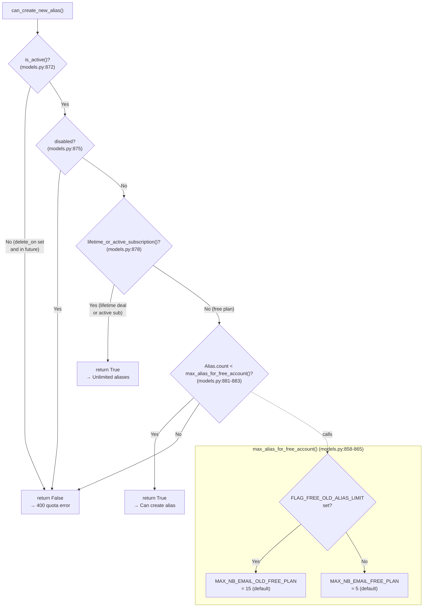
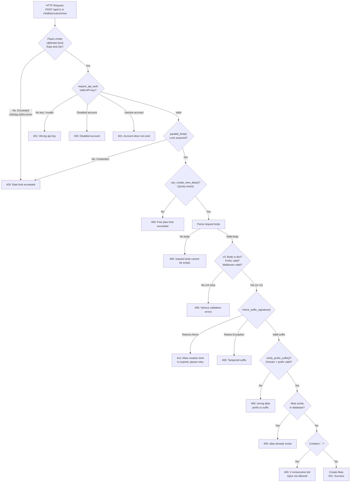
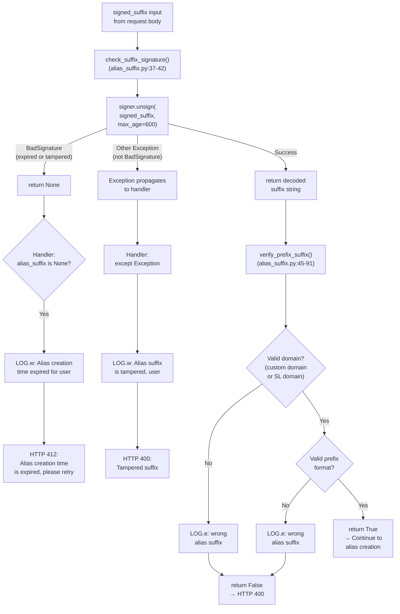

# Custom Alias Creation Validation — Source Code Investigation

## Overview

This document presents a comprehensive, evidence-based investigation into the **custom alias creation validation pathway** in the SimpleLogin application. It traces the complete request lifecycle for the two API endpoints that create custom aliases:

- `POST /api/v2/alias/custom/new` (handler: `new_custom_alias_v2()`)
- `POST /api/v3/alias/custom/new` (handler: `new_custom_alias_v3()`)

**Methodology:** Every claim in this document is derived from static analysis of the source code on branch `app_2cd6ee777f8c`. All file paths and line numbers reference the actual repository files. Error messages are quoted verbatim from the source. No assumptions are made — the code is treated as the single source of truth.

**Branch context:** `app_2cd6ee777f8c`

**Questions investigated:**

1. **Q1:** What HTTP status codes and JSON error messages are returned when an invalid or expired signed suffix is submitted?
2. **Q2:** What server-side log entries appear in the console when validation fails at each stage?
3. **Q3:** Do responses include rate-limiting headers (`X-RateLimit-Limit`, `X-RateLimit-Remaining`, `Retry-After`), and what are their values?
4. **Q4:** What quota-related checks run before a custom alias is successfully created?
5. **Q5:** What is the complete execution path and which components are responsible for each validation stage?

> **Note:** No repository files have been modified as part of this investigation. This is a read-only source code analysis.

---

## Q1: HTTP Status Codes and Error Messages for Invalid/Expired Signed Suffixes

### Thinking / Rationale

The signed suffix validation lives in two places: the **signing/verification function** in `app/alias_suffix.py` and the **endpoint handlers** in `app/api/views/new_custom_alias.py`. Understanding the different error codes requires tracing the exception handling across both modules.

The signing mechanism uses `itsdangerous.TimestampSigner` (initialized at `app/alias_suffix.py:11`) with a shared secret derived from `CUSTOM_ALIAS_SECRET = FLASK_SECRET + "custom_alias"` (`app/config.py:201`). When verifying a signed suffix, the signer's `unsign()` method is called with `max_age=600` (a 600-second / 10-minute expiry window). This produces **two distinct exception types** on failure:

- `itsdangerous.SignatureExpired` — the signature was valid but has expired (> 600 seconds old). This is a **subclass** of `itsdangerous.BadSignature`.
- `itsdangerous.BadSignature` — the signature is entirely invalid (tampered or corrupted).

Crucially, `check_suffix_signature()` at `app/alias_suffix.py:37–42` catches the **parent class** `BadSignature`, which covers **both** expired and tampered signatures. In both cases, it returns `None`. This means the endpoint handler cannot distinguish between the two at the function-return level — it only sees `None` (meaning "bad or expired signature") versus a valid decoded suffix string.

The endpoint handler then wraps the call in its own `try/except Exception` block, creating a two-tier error response:

1. If `check_suffix_signature()` returns `None` → the handler treats it as **expired** → HTTP 412
2. If `check_suffix_signature()` raises an exception that is **not** `BadSignature` (something truly unexpected) → the handler's outer `except Exception` catches it → HTTP 400 "Tampered suffix"

### Expired Suffix — HTTP 412

When `signer.unsign(signed_suffix, max_age=600)` raises `SignatureExpired` (or any `BadSignature`), the `check_suffix_signature()` function catches it and returns `None`:

```python
# Source: app/alias_suffix.py:37-42
def check_suffix_signature(signed_suffix: str) -> Optional[str]:
    try:
        return signer.unsign(signed_suffix, max_age=600).decode()
    except itsdangerous.BadSignature:
        return None
```

The endpoint handler then checks the return value:

```python
# Source: app/api/views/new_custom_alias.py:69-73 (v2)
try:
    alias_suffix = check_suffix_signature(signed_suffix)
    if not alias_suffix:
        LOG.w("Alias creation time expired for %s", user)
        return jsonify(error="Alias creation time is expired, please retry"), 412
```

```python
# Source: app/api/views/new_custom_alias.py:184-188 (v3)
try:
    alias_suffix = check_suffix_signature(signed_suffix)
    if not alias_suffix:
        LOG.w("Alias creation time expired for %s", user)
        return jsonify(error="Alias creation time is expired, please retry"), 412
```

**Response:**
- HTTP status: **412 Precondition Failed**
- JSON body: `{"error": "Alias creation time is expired, please retry"}`

> **Key insight:** Because `check_suffix_signature()` catches `BadSignature` (the parent class of `SignatureExpired`), **both** expired signatures and tampered/corrupted signatures that produce a `BadSignature` exception will result in an HTTP 412 response. The HTTP 400 "Tampered suffix" response is only triggered by exceptions that are **not** subclasses of `BadSignature`.

### Tampered Suffix — HTTP 400

If `check_suffix_signature()` raises an exception that is **not** caught by its internal `except BadSignature` handler (i.e., any exception that is not `itsdangerous.BadSignature` or its subclasses), that exception propagates up to the handler's outer `except Exception` block:

```python
# Source: app/api/views/new_custom_alias.py:74-76 (v2)
except Exception:
    LOG.w("Alias suffix is tampered, user %s", user)
    return jsonify(error="Tampered suffix"), 400
```

```python
# Source: app/api/views/new_custom_alias.py:189-191 (v3)
except Exception:
    LOG.w("Alias suffix is tampered, user %s", user)
    return jsonify(error="Tampered suffix"), 400
```

**Response:**
- HTTP status: **400 Bad Request**
- JSON body: `{"error": "Tampered suffix"}`

> **Important nuance:** In practice, most tampered suffixes will still raise `BadSignature` (which is caught inside `check_suffix_signature()` → returns `None` → 412). The outer `except Exception` only fires for truly unexpected errors (e.g., malformed input that causes a `TypeError`, encoding issues, or other non-signing-related exceptions).

### Wrong Prefix/Suffix Combination — HTTP 400

After the suffix signature is verified, `verify_prefix_suffix()` at `app/alias_suffix.py:45–91` validates that the decoded suffix corresponds to a domain the user actually owns (or an SL domain) and that the prefix format is valid:

```python
# Source: app/api/views/new_custom_alias.py:78-79 (v2)
if not verify_prefix_suffix(user, alias_prefix, alias_suffix):
    return jsonify(error="wrong alias prefix or suffix"), 400
```

```python
# Source: app/api/views/new_custom_alias.py:193-194 (v3)
if not verify_prefix_suffix(user, alias_prefix, alias_suffix):
    return jsonify(error="wrong alias prefix or suffix"), 400
```

**Response:**
- HTTP status: **400 Bad Request**
- JSON body: `{"error": "wrong alias prefix or suffix"}`

### Complete Error Response Table

The following table enumerates **every** possible HTTP response from the custom alias creation endpoints, in the order they are evaluated during request processing:

| HTTP Status | Error Message | Condition | Source |
|-------------|---------------|-----------|--------|
| 429 | `"Rate limit exceeded"` | Flask-Limiter rate limit exceeded (`ALIAS_LIMIT`) or `parallel_limiter` concurrency lock contention | `server.py:370` |
| 401 | `"Wrong api key"` | No valid API key in `Authentication` header and user not session-authenticated | `app/api/base.py:27` |
| 403 | `"Disabled account"` | `user.disabled` is `True` | `app/api/base.py:37` |
| 401 | `"Account does not exist"` | `user.is_active()` returns `False` (account pending deletion) | `app/api/base.py:40` |
| 400 | `"You have reached the limitation of a free account with the maximum of {MAX_NB_EMAIL_FREE_PLAN} aliases, please upgrade your plan to create more aliases"` | `user.can_create_new_alias()` returns `False` | `new_custom_alias.py:51-56` (v2), `new_custom_alias.py:140-145` (v3) |
| 400 | `"request body cannot be empty"` | `request.get_json()` returns `None` (no JSON body) | `new_custom_alias.py:62` (v2), `new_custom_alias.py:151` (v3) |
| 400 | `"request body does not follow the required format"` | Request body is not a `dict` (**v3 only**) | `new_custom_alias.py:154` |
| 400 | `"alias prefix invalid format or too long"` | `check_alias_prefix()` returns `False` (**v3 only**) | `new_custom_alias.py:168` |
| 400 | `"mailbox_ids must be an array of id"` | `mailbox_ids` is not a `list` (**v3 only**) | `new_custom_alias.py:172` |
| 400 | `"Errors with Mailbox"` | Mailbox not found, wrong user, or not verified (**v3 only**) | `new_custom_alias.py:177` |
| 400 | `"At least one mailbox must be selected"` | Empty mailbox list after filtering (**v3 only**) | `new_custom_alias.py:181` |
| 412 | `"Alias creation time is expired, please retry"` | `check_suffix_signature()` returns `None` (expired or bad `BadSignature`) | `new_custom_alias.py:73` (v2), `new_custom_alias.py:188` (v3) |
| 400 | `"Tampered suffix"` | Non-`BadSignature` exception during `check_suffix_signature()` | `new_custom_alias.py:76` (v2), `new_custom_alias.py:191` (v3) |
| 400 | `"wrong alias prefix or suffix"` | `verify_prefix_suffix()` returns `False` | `new_custom_alias.py:79` (v2), `new_custom_alias.py:194` (v3) |
| 409 | `"alias {full_alias} already exists"` | Alias email found in `Alias`, `DeletedAlias`, or `DomainDeletedAlias` tables | `new_custom_alias.py:88` (v2), `new_custom_alias.py:203` (v3) |
| 400 | `"2 consecutive dot signs aren't allowed in an email address"` | `full_alias` contains `".."` | `new_custom_alias.py:91-94` (v2), `new_custom_alias.py:206-209` (v3) |
| 201 | *(success — alias JSON object)* | Alias created successfully | `new_custom_alias.py:109-112` (v2), `new_custom_alias.py:232-235` (v3) |

### v2 vs v3 Differences

The v2 endpoint (`new_custom_alias_v2`) is simpler than v3:

| Feature | v2 | v3 |
|---------|----|----|
| Prefix format validation (`check_alias_prefix`) | **No** | Yes (`new_custom_alias.py:167-168`) |
| Request body must be `dict` | **No** | Yes (`new_custom_alias.py:153-154`) |
| Multiple mailbox support (`mailbox_ids`) | **No** — always uses `user.default_mailbox_id` | Yes (`new_custom_alias.py:170-181`) |
| Alias `name` field | **No** | Yes (`new_custom_alias.py:162`) |
| Mailbox validation | **No** | Yes (existence, ownership, verified status) |

Both endpoints share identical behavior for: rate limiting, authentication, quota checks, suffix signature verification, prefix/suffix validation, alias uniqueness, and consecutive dot checks.

---

## Q2: Validation Log Entries in the Server Console

### Thinking / Rationale

SimpleLogin uses a custom logging infrastructure defined in `app/log.py`. A singleton logger named `"SL"` is created at `app/log.py:79`, with shortcut methods that map to standard Python logging levels. The log format string at `app/log.py:12–14` defines a structured format that includes timestamps, source file paths, line numbers, and function names — making it possible to trace exactly where each log entry originates.

Understanding the log entries requires knowing both the format template and the specific `LOG.*` calls scattered throughout the validation path.

### Log Format Structure

The log format is defined at `app/log.py:12–14`:

```python
# Source: app/log.py:12-14
_log_format = (
    "%(asctime)s - %(name)s - %(levelname)s - %(process)d - "
    '"%(pathname)s:%(lineno)d" - %(funcName)s() - %(message_id)s - %(message)s'
)
```

Each field in the format template:

| Field | Description | Example Value |
|-------|-------------|---------------|
| `%(asctime)s` | UTC timestamp (converter set to `time.gmtime` at `app/log.py:43`) | `2024-01-15 10:32:45,123` |
| `%(name)s` | Logger name — always `"SL"` (from `app/log.py:79`: `LOG = _get_logger("SL")`) | `SL` |
| `%(levelname)s` | Log level | `DEBUG`, `INFO`, `WARNING`, `ERROR` |
| `%(process)d` | OS process ID | `12345` |
| `%(pathname)s:%(lineno)d` | Source file path and line number (in double quotes) | `"app/api/views/new_custom_alias.py:72"` |
| `%(funcName)s()` | Function name with parentheses | `new_custom_alias_v2()` |
| `%(message_id)s` | Email message ID for lifecycle tracking (from `EmailHandlerFilter` at `app/log.py:28–37`; empty string when no email is being processed) | *(empty)* |
| `%(message)s` | The actual log message | `Alias creation time expired for User 42` |

### Log Level Shortcuts

The `LOG` singleton provides shortcut methods defined at `app/log.py:74–77`:

```python
# Source: app/log.py:74-77
logging.Logger.d = logging.Logger.debug
logging.Logger.i = logging.Logger.info
logging.Logger.w = logging.Logger.warning
logging.Logger.e = logging.Logger.exception
```

These are **class-level** assignments on `logging.Logger` itself (not on a specific instance). By patching the `Logger` class, every logger instance — including the `LOG` singleton created at `app/log.py:79` (`LOG = _get_logger("SL")`) — inherits the `.d`, `.i`, `.w`, and `.e` shortcut methods. This means `LOG.d(...)` is equivalent to `LOG.debug(...)`, `LOG.w(...)` is equivalent to `LOG.warning(...)`, and so on.

### Specific Log Entries in the Validation Path

The following table documents **every** `LOG.*` call emitted during the custom alias creation validation path, in the order they may be encountered:

| Log Level | Message Template | Arguments | Source | When Emitted |
|-----------|------------------|-----------|--------|--------------|
| `LOG.d` | `"user %s cannot create any custom alias"` | `user` | `new_custom_alias.py:49` (v2), `new_custom_alias.py:138` (v3) | Quota check fails (`can_create_new_alias()` returns `False`) |
| `LOG.w` | `"Alias creation time expired for %s"` | `user` | `new_custom_alias.py:72` (v2), `new_custom_alias.py:187` (v3) | `check_suffix_signature()` returns `None` (expired or bad signature) |
| `LOG.w` | `"Alias suffix is tampered, user %s"` | `user` | `new_custom_alias.py:75` (v2), `new_custom_alias.py:190` (v3) | Non-`BadSignature` exception during suffix verification |
| `LOG.e` | `"wrong alias suffix %s, user %s"` | `alias_suffix, user` | `app/alias_suffix.py:61` | Domain extracted from suffix not in user's available custom domains (inside `verify_prefix_suffix()`) |
| `LOG.e` | `"User %s submits a wrong alias suffix %s"` | `user, alias_suffix` | `app/alias_suffix.py:78` | SL domain suffix doesn't start with `"."` (inside `verify_prefix_suffix()`) |
| `LOG.e` | `"wrong alias suffix %s, user %s"` | `alias_suffix, user` | `app/alias_suffix.py:84` | Suffix domain is neither a user custom domain nor an SL domain (inside `verify_prefix_suffix()`) |
| `LOG.e` | `"wrong alias suffix %s, user %s"` | `alias_suffix, user` | `app/alias_suffix.py:88` | Final catch-all in `verify_prefix_suffix()` — no valid domain found |
| `LOG.d` | `"full alias already used %s"` | `full_alias` | `new_custom_alias.py:87` (v2), `new_custom_alias.py:202` (v3) | Alias already exists in database |
| `LOG.w` | `"Client hit rate limit on path %s, user:%s"` | `request.path, get_current_user()` | `server.py:364-367` | Rate limit exceeded (429 error handler) |

### Realistic Log Line Example

When a suffix expiry occurs on the v2 endpoint, the full log line (with format template filled in) would look like:

```
2024-01-15 10:32:45,123 - SL - WARNING - 12345 - "app/api/views/new_custom_alias.py:72" - new_custom_alias_v2() -  - Alias creation time expired for User 42 (user@example.com)
```

When a rate limit is hit:

```
2024-01-15 10:33:01,456 - SL - WARNING - 12345 - "server.py:364" - rate_limited() -  - Client hit rate limit on path /api/v2/alias/custom/new, user:User 42 (user@example.com)
```

When a quota check fails:

```
2024-01-15 10:33:15,789 - SL - DEBUG - 12345 - "app/api/views/new_custom_alias.py:49" - new_custom_alias_v2() -  - user User 42 (user@example.com) cannot create any custom alias
```

### Dashboard Variant Log Entry

For cross-reference, the dashboard route at `app/dashboard/views/custom_alias.py:37` emits a similar log entry when quota fails, but uses flash messages instead of JSON responses:

```python
# Source: app/dashboard/views/custom_alias.py:37
LOG.d("%s can't create new alias", current_user)
```

---

## Q3: Rate-Limiting Headers in Responses

### Thinking / Rationale

The custom alias creation endpoints are protected by a **three-layer rate-limiting architecture**. Understanding whether rate-limiting headers appear in responses requires analyzing each layer independently:

1. **Flask-Limiter** (`app/extensions.py`) — HTTP request rate limiting with configurable windows
2. **parallel_limiter** (`app/parallel_limiter.py`) — Redis-backed concurrency lock preventing simultaneous alias creation
3. **bucket-based rate limiter** (`app/rate_limiter.py`) — application-level bucket counting (NOT used on these endpoints)

Each layer has different header-injection behavior, and the Flask-Limiter configuration determines whether standard rate-limit headers are present.

### Flask-Limiter Configuration

The Flask-Limiter instance is created at `app/extensions.py:23`:

```python
# Source: app/extensions.py:23
limiter = Limiter(key_func=__key_func)
```

The key function at `app/extensions.py:14–19` determines how rate limits are tracked per user:

```python
# Source: app/extensions.py:14-19
def __key_func():
    if current_user.is_authenticated:
        return f"userid:{current_user.id}"
    else:
        ip_addr = get_remote_address()
        return f"ip:{ip_addr}"
```

Where `get_remote_address` is imported from `flask_limiter.util` (at `app/extensions.py:2`).

- **Authenticated users:** Rate-limited by `"userid:{user_id}"`
- **Anonymous requests:** Rate-limited by `"ip:{ip_address}"` (using Flask-Limiter's `get_remote_address()` utility for proxy-aware IP resolution)

The rate limit applied to alias creation endpoints is `ALIAS_LIMIT` from `app/config.py:448`:

```python
# Source: app/config.py:448
ALIAS_LIMIT = os.environ.get("ALIAS_LIMIT") or "100/day;50/hour;5/minute"
```

**Default rate limits:** `100/day;50/hour;5/minute` (configurable via environment variable).

Rate limiting can be entirely disabled by setting the `DISABLE_RATE_LIMIT` environment variable (`app/config.py:602`), which triggers a request filter at `app/extensions.py:26–28`:

```python
# Source: app/extensions.py:26-28
@limiter.request_filter
def disable_rate_limit():
    return config.DISABLE_RATE_LIMIT
```

The limiter is initialized with the Flask app at `server.py:167`:

```python
# Source: server.py:167
limiter.init_app(app)
```

### Flask-Limiter Header Behavior — Critical Analysis

The SimpleLogin project specifies `Flask-Limiter = "^1.4"` in `pyproject.toml`. Flask-Limiter supports the following rate-limit response headers:

- `X-RateLimit-Limit` — The rate limit ceiling for the current window
- `X-RateLimit-Remaining` — Remaining requests in the current window
- `X-RateLimit-Reset` — UTC epoch when the limit resets
- `Retry-After` — Seconds until the rate limit resets (typically only on 429 responses)

**However, these headers are NOT enabled by default.** Flask-Limiter's `RATELIMIT_HEADERS_ENABLED` configuration defaults to `False` across all versions (1.x through 4.x). To enable them, the application must either:

1. Set `app.config["RATELIMIT_HEADERS_ENABLED"] = True`, or
2. Pass `headers_enabled=True` to the `Limiter()` constructor

**Codebase verification:** A search of the entire SimpleLogin repository reveals:

- **No** `RATELIMIT_HEADERS_ENABLED` configuration in `server.py`, `app/config.py`, or any other file
- **No** `headers_enabled=True` parameter in the `Limiter()` constructor at `app/extensions.py:23`
- **No** `header_name_mapping` parameter in the `Limiter()` constructor

**Conclusion:** The standard rate-limiting headers (`X-RateLimit-Limit`, `X-RateLimit-Remaining`, `X-RateLimit-Reset`, `Retry-After`) are **NOT present** in responses from the custom alias creation endpoints under the default configuration. The Flask-Limiter instance is initialized with only `key_func` and no header configuration.

### 429 Error Response

When a rate limit IS exceeded, the HTTP 429 response is generated by the error handler at `server.py:362–372`:

```python
# Source: server.py:362-372
@app.errorhandler(429)
def rate_limited(e):
    LOG.w(
        "Client hit rate limit on path %s, user:%s",
        request.path,
        get_current_user(),
    )
    if request.path.startswith("/api/"):
        return jsonify(error="Rate limit exceeded"), 429
    else:
        return render_template("error/429.html"), 429
```

For API paths, the response is:
- HTTP status: **429 Too Many Requests**
- JSON body: `{"error": "Rate limit exceeded"}`

### Parallel Limiter (Concurrency Lock)

The parallel limiter at `app/parallel_limiter.py` provides a Redis-backed concurrency lock, **not** a rate counter. It uses Redis `SET NX` (set-if-not-exists) with an expiration:

```python
# Source: app/parallel_limiter.py:30-34
if not lock_redis.storage.set(
    lock_name, lock_value, ex=timedelta(seconds=max_wait_secs), nx=True
):
    raise TooManyRequests()
```

Key details:
- **Lock name format:** `"cl:{user_id}:{lock_suffix}"` (from `app/parallel_limiter.py:56`) or `"cl:{request.remote_addr}:{lock_suffix}"` (line 58) if the user is not authenticated
- **Lock suffix for alias creation:** `"alias_creation"` (from the decorator `@parallel_limiter.lock(name="alias_creation")` at `new_custom_alias.py:31` and `new_custom_alias.py:118`)
- **Max wait / TTL:** 5 seconds (default from `app/parallel_limiter.py:23`)
- **On contention:** Raises `werkzeug.exceptions.TooManyRequests()` (at `app/parallel_limiter.py:34`), which triggers the same 429 error handler at `server.py:362`
- **Headers injected:** **None** — this is a binary lock (acquired or not), not a sliding window counter. It does not inject any rate-limit headers.

### Bucket-Based Rate Limiter (Not Used on These Endpoints)

For completeness, `app/rate_limiter.py:19–42` implements a bucket-based rate limiter using Redis `INCR`. This limiter is used by other parts of the application but is **NOT applied** to the custom alias creation endpoints. It is not decorated on `new_custom_alias_v2()` or `new_custom_alias_v3()`.

### Summary of Rate-Limiting Headers

| Source | Header Injection | Applied to Alias Endpoints? | Notes |
|--------|------------------|-----------------------------|-------|
| Flask-Limiter | `X-RateLimit-Limit`, `X-RateLimit-Remaining`, `X-RateLimit-Reset`, `Retry-After` | **Not injected** — `RATELIMIT_HEADERS_ENABLED` defaults to `False` and is not enabled | Applied via `@limiter.limit(ALIAS_LIMIT)`, but headers disabled |
| parallel_limiter | None (raises `TooManyRequests` exception only) | Yes — applied via `@parallel_limiter.lock(name="alias_creation")` | Binary lock, no counter headers |
| rate_limiter (bucket) | None | **No** — not used on these endpoints | Used elsewhere in the application |

**Bottom line:** Under the default SimpleLogin configuration, **no rate-limiting headers** are included in responses to the custom alias creation endpoints. The only rate-limit feedback is the HTTP 429 status code with `{"error": "Rate limit exceeded"}` when a limit is breached.

---

## Q4: Quota-Related Checks for Successful Alias Creation

### Thinking / Rationale

Quota enforcement is the **first business-logic check** performed by the endpoint handler — it runs before suffix validation, body parsing (in v2), or any other validation. This is at `new_custom_alias.py:48` (v2) and `new_custom_alias.py:137` (v3). The quota logic is centralized in the `User.can_create_new_alias()` method at `app/models.py:867–884`, which chains through several sub-methods to determine whether the user may create more aliases.

Understanding the quota enforcement requires tracing a decision tree through four user-model methods and two configuration constants.

### `can_create_new_alias()` Decision Tree

The core quota method at `app/models.py:867–884`:

```python
# Source: app/models.py:867-884
def can_create_new_alias(self) -> bool:
    """
    Whether user can create a new alias. User can't create a new alias if
    - has more than 15 aliases in the free plan, *even in the free trial*
    """
    if not self.is_active():
        return False

    if self.disabled:
        return False

    if self.lifetime_or_active_subscription():
        return True
    else:
        return (
            Alias.filter_by(user_id=self.id).count()
            < self.max_alias_for_free_account()
        )
```

### Step-by-Step Trace

#### Step 1: `is_active()` Check

Source: `app/models.py:766–769`

```python
# Source: app/models.py:766-769
def is_active(self) -> bool:
    if self.delete_on is None:
        return True
    return self.delete_on < arrow.now()
```

- If `delete_on` is `None` → user is active (`True`)
- If `delete_on` is set and in the past (`delete_on < arrow.now()`) → returns `True`
- If `delete_on` is set and in the future → returns `False` (user is pending deletion)

> **Note on potentially counterintuitive behavior:** When `delete_on` is a past timestamp, the method returns `True` (active). This may seem unexpected, but examining the code as written: it appears `delete_on` represents a scheduled deletion date, and the condition `delete_on < arrow.now()` evaluates to `True` when the deletion date has passed. The practical interpretation is that accounts with a past `delete_on` are still considered "active" by this method until a cleanup process actually removes them. This is the code's behavior — documented as-is.

#### Step 2: `disabled` Check

Source: `app/models.py:875–876`

```python
if self.disabled:
    return False
```

If the user's `disabled` flag is `True`, they cannot create aliases regardless of subscription status.

#### Step 3: `lifetime_or_active_subscription()` Check

Source: `app/models.py:746–753`

```python
# Source: app/models.py:746-753
def lifetime_or_active_subscription(
    self, include_partner_subscription: bool = True
) -> bool:
    """True if user has lifetime licence or active subscription"""
    if self.lifetime:
        return True

    return self.get_active_subscription(include_partner_subscription) is not None
```

- If the user has a **lifetime deal** (`self.lifetime` is `True`) → unlimited aliases
- If the user has an **active subscription** (Paddle, Apple, Manual, Coinbase, or Partner) → unlimited aliases
- Otherwise → falls through to the free plan alias count check

#### Step 4: Free Plan Alias Count Check

Source: `app/models.py:880–884`

```python
return (
    Alias.filter_by(user_id=self.id).count()
    < self.max_alias_for_free_account()
)
```

This queries the database for the total number of aliases belonging to the user and compares it against the free plan limit.

#### `max_alias_for_free_account()` Method

Source: `app/models.py:858–865`

```python
# Source: app/models.py:858-865
def max_alias_for_free_account(self) -> int:
    if (
        self.FLAG_FREE_OLD_ALIAS_LIMIT
        == self.flags & self.FLAG_FREE_OLD_ALIAS_LIMIT
    ):
        return config.MAX_NB_EMAIL_OLD_FREE_PLAN  # Default: 15
    else:
        return config.MAX_NB_EMAIL_FREE_PLAN  # Default: 5
```

| Condition | Limit | Config Source |
|-----------|-------|---------------|
| User has `FLAG_FREE_OLD_ALIAS_LIMIT` flag set | `MAX_NB_EMAIL_OLD_FREE_PLAN` = **15** | `app/config.py:126` |
| Default (new free accounts) | `MAX_NB_EMAIL_FREE_PLAN` = **5** | `app/config.py:121-124` |

Both values are configurable via environment variables:

```python
# Source: app/config.py:120-124
try:
    MAX_NB_EMAIL_FREE_PLAN = int(os.environ["MAX_NB_EMAIL_FREE_PLAN"])
except Exception:
    print("MAX_NB_EMAIL_FREE_PLAN is not set, use 5 as default value")
    MAX_NB_EMAIL_FREE_PLAN = 5
```

```python
# Source: app/config.py:126
MAX_NB_EMAIL_OLD_FREE_PLAN = int(os.environ.get("MAX_NB_EMAIL_OLD_FREE_PLAN", 15))
```

### `is_premium()` — Important Distinction

Source: `app/models.py:787–800`

```python
# Source: app/models.py:787-800
def is_premium(self, include_partner_subscription: bool = True) -> bool:
    """
    user is premium if they:
    - have a lifetime deal or
    - in trial period or
    - active subscription
    """
    if self.lifetime_or_active_subscription(include_partner_subscription):
        return True

    if self.trial_end and arrow.now() < self.trial_end:
        return True

    return False
```

**Critical distinction:** `is_premium()` includes **trial users** (those with `trial_end` in the future), but `can_create_new_alias()` does **NOT** check trial status. This means users on a free trial are subject to the free plan alias limit (5 or 15), not unlimited. This is explicitly noted in the docstring at `app/models.py:870`: *"has > 15 aliases for free plan, even in the free trial"*.

### Logged Values During Quota Checks

When the quota check fails, the handler logs:

```python
# Source: app/api/views/new_custom_alias.py:49 (v2)
LOG.d("user %s cannot create any custom alias", user)
```

```python
# Source: app/api/views/new_custom_alias.py:138 (v3)
LOG.d("user %s cannot create any custom alias", user)
```

The `%s` placeholder renders the `User` object's string representation, which typically includes the user ID and email address.

**Important:** There are **no** `LOG` calls inside `can_create_new_alias()` itself, `max_alias_for_free_account()`, `is_active()`, `lifetime_or_active_subscription()`, or `is_premium()`. The only log entry for quota failures is the single `LOG.d` call at the handler level. The specific values evaluated during the quota check (alias count, plan tier, limit value) are **not individually logged**.

The quota error response includes the `MAX_NB_EMAIL_FREE_PLAN` value in the message:

```python
# Source: app/api/views/new_custom_alias.py:51-56 (v2)
return (
    jsonify(
        error="You have reached the limitation of a free account with the maximum of "
        f"{MAX_NB_EMAIL_FREE_PLAN} aliases, please upgrade your plan to create more aliases"
    ),
    400,
)
```

With the default configuration, this produces: `"You have reached the limitation of a free account with the maximum of 5 aliases, please upgrade your plan to create more aliases"`

### Quota Check Decision Tree



---

## Q5: Execution Path and Component Responsibility

### Thinking / Rationale

Flask decorators are stacked bottom-up in source code but execute **top-down** (outermost first) at request time. The decorator chain on both v2 and v3 endpoints is:

```python
# Source: app/api/views/new_custom_alias.py:28-32 (v2)
@api_bp.route("/v2/alias/custom/new", methods=["POST"])
@limiter.limit(ALIAS_LIMIT)
@require_api_auth
@parallel_limiter.lock(name="alias_creation")
def new_custom_alias_v2():
```

```python
# Source: app/api/views/new_custom_alias.py:115-119 (v3)
@api_bp.route("/v3/alias/custom/new", methods=["POST"])
@limiter.limit(ALIAS_LIMIT)
@require_api_auth
@parallel_limiter.lock(name="alias_creation")
def new_custom_alias_v3():
```

At request time, the execution order is outermost decorator first: `@limiter.limit` → `@require_api_auth` → `@parallel_limiter.lock` → handler function body. Each layer acts as a gate — if it rejects the request, the inner layers are never reached.

### Decorator Chain Execution Order

**Request-time execution order (outermost first):**

**1. Flask Route Matching** — Flask matches the URL path to the blueprint route registered on `api_bp`.

**2. `@limiter.limit(ALIAS_LIMIT)`** — Flask-Limiter rate limit check
- Source: `app/extensions.py:23`, with `ALIAS_LIMIT = "100/day;50/hour;5/minute"` from `app/config.py:448`
- Rate limit key: `"userid:{id}"` for authenticated users, `"ip:{addr}"` for anonymous (from `app/extensions.py:14-19`)
- If rate limit exceeded → raises `TooManyRequests` → caught by `server.py:362` error handler → **429** `{"error": "Rate limit exceeded"}`
- If `DISABLE_RATE_LIMIT` environment variable is set (`app/config.py:602`), this check is skipped entirely

**3. `@require_api_auth`** — API authentication and account state validation
- Source: `app/api/base.py:52–60`, calls `authorize_request()` at `app/api/base.py:16–43`
- Checks `Authentication` header for valid API key (from `app/api/base.py:17–18`)
- Missing or invalid API key (and no session auth) → **401** `{"error": "Wrong api key"}` (`app/api/base.py:27`)
- Disabled account → **403** `{"error": "Disabled account"}` (`app/api/base.py:37`)
- Inactive account (pending deletion) → **401** `{"error": "Account does not exist"}` (`app/api/base.py:40`)
- On success: sets `g.user` and `g.api_key` on the Flask request context

**4. `@parallel_limiter.lock(name="alias_creation")`** — Redis concurrency lock
- Source: `app/parallel_limiter.py:68–73`, using `_InnerLock` at lines 19–65
- Lock name: `"cl:{user_id}:alias_creation"` (`app/parallel_limiter.py:56`)
- Attempts Redis `SET NX` with 5-second TTL (`app/parallel_limiter.py:30-32`)
- If lock already held → raises `TooManyRequests()` (`app/parallel_limiter.py:34`) → **429**
- Ensures only one alias creation runs per user at a time

**5. Handler function body** (`new_custom_alias_v2()` or `new_custom_alias_v3()`) — business logic validation:

| Step | Validation | Error Response | Source |
|------|-----------|----------------|--------|
| 5a | Quota check: `user.can_create_new_alias()` | 400 — free plan limit exceeded | `new_custom_alias.py:48` (v2), `137` (v3) |
| 5b | Request body parsing | 400 — `"request body cannot be empty"` | `new_custom_alias.py:62` (v2), `151` (v3) |
| 5c | Body is dict (**v3 only**) | 400 — `"request body does not follow the required format"` | `new_custom_alias.py:154` |
| 5d | Prefix format (**v3 only**): `check_alias_prefix()` | 400 — `"alias prefix invalid format or too long"` | `new_custom_alias.py:168` |
| 5e | Mailbox validation (**v3 only**) | 400 — various mailbox errors | `new_custom_alias.py:172-181` |
| 5f | Suffix signature: `check_suffix_signature()` | 412 — expired; 400 — tampered | `new_custom_alias.py:69-76` (v2), `184-191` (v3) |
| 5g | Prefix/suffix combination: `verify_prefix_suffix()` | 400 — `"wrong alias prefix or suffix"` | `new_custom_alias.py:78-79` (v2), `193-194` (v3) |
| 5h | Alias uniqueness check | 409 — `"alias {full_alias} already exists"` | `new_custom_alias.py:82-88` (v2), `197-203` (v3) |
| 5i | Consecutive dots check | 400 — `"2 consecutive dot signs aren't allowed in an email address"` | `new_custom_alias.py:90-94` (v2), `205-209` (v3) |
| 5j | **Create alias** | 201 — success (alias JSON) | `new_custom_alias.py:109-112` (v2), `232-235` (v3) |

### Component Responsibility Matrix

| Component | Module | Responsibility | Rejection Condition | HTTP Code |
|-----------|--------|----------------|---------------------|-----------|
| Flask-Limiter | `app/extensions.py` | HTTP request rate limiting (sliding windows) | Exceeds `100/day;50/hour;5/minute` | 429 |
| API Auth Decorator | `app/api/base.py` | Authentication and account state | Invalid API key, disabled account, inactive account | 401, 403 |
| Parallel Limiter | `app/parallel_limiter.py` | Concurrency control (one-at-a-time lock) | Another alias creation in progress for the same user | 429 |
| Quota Enforcer | `app/models.py` (`User.can_create_new_alias`) | Alias creation quota | Free plan alias count ≥ limit (5 or 15) | 400 |
| Suffix Signer/Verifier | `app/alias_suffix.py` (`check_suffix_signature`) | Signed suffix integrity and freshness | Expired (>600s) or completely invalid signature | 412, 400 |
| Prefix/Suffix Validator | `app/alias_suffix.py` (`verify_prefix_suffix`) | Domain ownership and prefix format | User doesn't own domain, or suffix format invalid | 400 |
| Alias Prefix Checker | `app/alias_utils.py` (`check_alias_prefix`) | Prefix format validation (**v3 only**) | Non-matching regex `[0-9a-z-_.]{1,}` or length >40 | 400 |
| Uniqueness Checker | Handler in `new_custom_alias.py` | Alias deduplication | Alias exists in `Alias`, `DeletedAlias`, or `DomainDeletedAlias` | 409 |
| Consecutive Dots Checker | Handler in `new_custom_alias.py` | Email format validation | Full alias contains `".."` | 400 |

### Complete Execution Flow Diagram



### Signed Suffix Validation Flow



---

## References

All source files cited in this investigation, with the specific line ranges referenced:

| File | Lines Referenced | Content |
|------|-----------------|---------|
| `app/api/views/new_custom_alias.py` | 28–112 (v2), 115–235 (v3) | Custom alias creation endpoint handlers (v2 and v3) |
| `app/alias_suffix.py` | 11, 37–42, 45–91 | Signed suffix signing/verification (`TimestampSigner`, `max_age=600`), prefix/suffix domain validation |
| `app/alias_utils.py` | 415, 418–425 | Alias prefix validation (`check_alias_prefix`, pattern `[0-9a-z-_.]{1,}`, max length 40) |
| `app/models.py` | 746–753, 766–769, 787–800, 858–865, 867–884 | `User.lifetime_or_active_subscription()`, `User.is_active()`, `User.is_premium()`, `User.max_alias_for_free_account()`, `User.can_create_new_alias()` |
| `app/extensions.py` | 14–19, 23, 26–28 | Flask-Limiter setup, rate-limit key function, `DISABLE_RATE_LIMIT` filter |
| `app/parallel_limiter.py` | 19–65, 68–73 | Redis-backed concurrency lock (`_InnerLock`), `lock()` decorator factory |
| `app/rate_limiter.py` | 19–42 | Bucket-based rate limiting with Redis INCR (not used on alias endpoints) |
| `app/api/base.py` | 16–43, 52–60 | API authentication decorator (`authorize_request()`, `require_api_auth()`), account state checks |
| `app/config.py` | 120–124, 126, 201, 448, 602 | `MAX_NB_EMAIL_FREE_PLAN` (default 5), `MAX_NB_EMAIL_OLD_FREE_PLAN` (default 15), `CUSTOM_ALIAS_SECRET`, `ALIAS_LIMIT` (`100/day;50/hour;5/minute`), `DISABLE_RATE_LIMIT` |
| `app/log.py` | 12–14, 28–37, 43, 74–77, 79 | Log format string, `EmailHandlerFilter`, UTC time converter, LOG shortcut methods (`.d`, `.i`, `.w`, `.e`), `LOG` singleton |
| `server.py` | 167, 362–372 | `limiter.init_app(app)`, HTTP 429 error handler |
| `app/errors.py` | 11–14 | Custom exception hierarchy (`AliasInTrashError`, etc.) |
| `app/dashboard/views/custom_alias.py` | 37 | Dashboard variant quota check log entry (cross-reference) |
| `app/utils.py` | 50–56 | `convert_to_id()` — lowercases, unidecodes, removes spaces, truncates to 256 chars |
| `docs/api.md` | 80–92, 381–400 | Existing API reference — error format convention, alias creation endpoint documentation |
| `tests/api/test_new_custom_alias.py` | 1–306 | 10 test cases for custom alias creation validation behavior |
