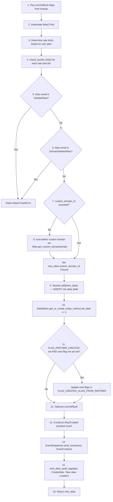
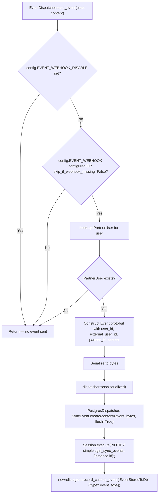
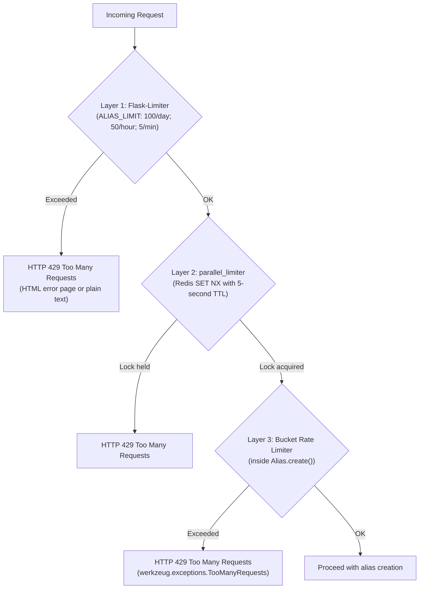
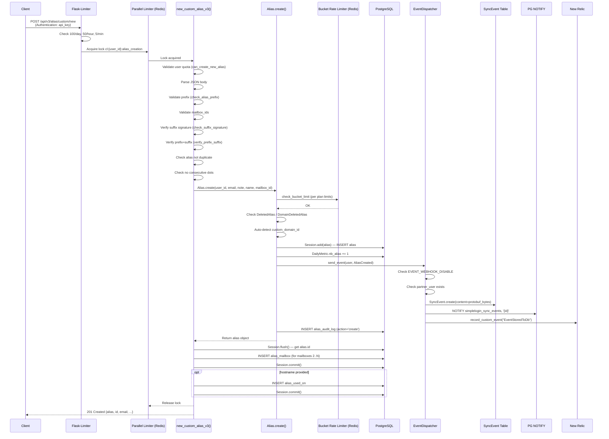

# SimpleLogin Alias-Creation Flow: Deep Code Investigation

This document is a comprehensive technical investigation that traces the complete runtime behavior of SimpleLogin's alias-creation flow — from frontend request initiation through backend processing, database mutations, event dispatching, background task triggers, and error-handling paths. Every claim is grounded in specific source code paths and cited with file locations.

---

## Table of Contents

1. [Overview](#1-overview)
2. [Frontend → Backend Request](#2-frontend--backend-request)
   - [2.1 Dashboard Custom Alias (Web Form POST)](#21-dashboard-custom-alias-web-form-post)
   - [2.2 Dashboard Random Alias (Web Form POST)](#22-dashboard-random-alias-web-form-post)
   - [2.3 API Custom Alias (JSON API — v2 and v3)](#23-api-custom-alias-json-api--v2-and-v3)
   - [2.4 API Random Alias (JSON API)](#24-api-random-alias-json-api)
   - [2.5 Suffix Provisioning (Pre-Requisite)](#25-suffix-provisioning-pre-requisite)
3. [Backend → Frontend Response](#3-backend--frontend-response)
   - [3.1 Success Responses](#31-success-responses)
   - [3.2 Error Responses](#32-error-responses)
4. [Database Changes](#4-database-changes)
   - [4.1 Tables Touched and Records Inserted](#41-tables-touched-and-records-inserted)
   - [4.2 The Alias.create() Sequence in Detail](#42-the-aliascreate-sequence-in-detail)
   - [4.3 Conditional Side-Effect Writes](#43-conditional-side-effect-writes)
5. [Background Tasks and Events](#5-background-tasks-and-events)
   - [5.1 EventDispatcher and AliasCreated Protobuf Event](#51-eventdispatcher-and-aliascreated-protobuf-event)
   - [5.2 PostgreSQL NOTIFY and SyncEvent](#52-postgresql-notify-and-syncevent)
   - [5.3 New Relic Telemetry](#53-new-relic-telemetry)
6. [Error Handling](#6-error-handling)
   - [6.1 Validation Errors and Their API Surface](#61-validation-errors-and-their-api-surface)
   - [6.2 Database Errors (IntegrityError, AliasInTrashError)](#62-database-errors-integrityerror-aliasintrasherror)
   - [6.3 Rate Limiting Errors](#63-rate-limiting-errors)
7. [Summary — End-to-End Flow](#7-summary--end-to-end-flow)

---

## 1. Overview

SimpleLogin provides **five distinct entry points** for alias creation, grouped into two categories:

| Category | Entry Point | HTTP Method & URL | Handler |
|----------|-------------|-------------------|---------|
| **Dashboard (Web)** | Custom alias | `POST /dashboard/custom_alias` | `app/dashboard/views/custom_alias.py:custom_alias()` |
| **Dashboard (Web)** | Random alias | `POST /dashboard/` (form-name=`create-random-email`) | `app/dashboard/views/index.py:index()` |
| **API (JSON)** | Custom alias v2 | `POST /api/v2/alias/custom/new` | `app/api/views/new_custom_alias.py:new_custom_alias_v2()` |
| **API (JSON)** | Custom alias v3 | `POST /api/v3/alias/custom/new` | `app/api/views/new_custom_alias.py:new_custom_alias_v3()` |
| **API (JSON)** | Random alias | `POST /api/alias/random/new` | `app/api/views/new_random_alias.py:new_random_alias()` |

All five entry points converge on the same core persistence method: `Alias.create()` in `app/models.py` (line ~1630). This classmethod is the single point where an alias record is written to the database, metrics are updated, events are dispatched, and audit logs are emitted.

**Rationale:** Centralizing alias creation in `Alias.create()` ensures that every creation path — whether from a browser form, API call, or auto-creation during email forwarding — performs the same set of side effects (rate limiting, trash checking, metric counting, event emission, audit logging). This is a deliberate design choice that prevents inconsistency.

> Source: `app/models.py` lines 1628–1692

---

## 2. Frontend → Backend Request

### 2.1 Dashboard Custom Alias (Web Form POST)

**Endpoint:** `POST /dashboard/custom_alias`

**Authentication:** Flask-Login session cookie (`@login_required` decorator).

> Source: `app/dashboard/views/custom_alias.py` line 32

**Content-Type:** `application/x-www-form-urlencoded` (standard HTML form submission).

**Form fields sent by the browser:**

| Form Field Name | Type | Description | Source |
|-----------------|------|-------------|--------|
| `prefix` | text input | The user-chosen local part of the alias (before the `@` or `.suffix@` portion) | `templates/dashboard/custom_alias.html` line 29 |
| `signed-alias-suffix` | select (dropdown) | The cryptographically signed suffix string, e.g. `.random_word@sl.co.Xq19rQ.s99uWQ7jD1s5JZDZqczYI5TbNNU` | `templates/dashboard/custom_alias.html` line 42 |
| `mailboxes` | multi-select checkboxes | One or more mailbox IDs (integers) identifying which mailboxes receive forwarded emails | `templates/dashboard/custom_alias.html` line 73 |
| `note` | textarea | Optional freeform note attached to the alias | `templates/dashboard/custom_alias.html` line 85 |
| `csrf_token` | hidden | CSRF protection token from `CSRFValidationForm` | `templates/dashboard/custom_alias.html` line 93 |

**How the handler reads these fields:**

```python
alias_prefix = request.form.get("prefix").strip().lower().replace(" ", "")
signed_alias_suffix = request.form.get("signed-alias-suffix")
mailbox_ids = request.form.getlist("mailboxes")
alias_note = request.form.get("note")
```

> Source: `app/dashboard/views/custom_alias.py` lines 59–63

**Rate limiting applied before the handler executes:**

1. **Flask-Limiter:** `@limiter.limit(ALIAS_LIMIT, methods=["POST"])` — defaults to `"100/day;50/hour;5/minute"`.
2. **Parallel limiter:** `@parallel_limiter.lock(name="alias_creation")` — a Redis distributed lock that prevents concurrent alias creation for the same user.

> Source: `app/dashboard/views/custom_alias.py` lines 31–33, `app/config.py` line 448

### 2.2 Dashboard Random Alias (Web Form POST)

**Endpoint:** `POST /dashboard/`

**Authentication:** Flask-Login session cookie (`@login_required`).

> Source: `app/dashboard/views/index.py` line 56

**Content-Type:** `application/x-www-form-urlencoded`

**Form fields sent by the browser:**

| Form Field Name | Type | Description | Source |
|-----------------|------|-------------|--------|
| `form-name` | hidden | Must be `"create-random-email"` to trigger alias creation (other values like `"create-custom-email"` redirect to the custom alias page) | `templates/dashboard/index.html` line 52 |
| `generator_scheme` | hidden | Integer: `1` for word-based aliases, `2` for UUID-based aliases (matches `AliasGeneratorEnum`) | `templates/dashboard/index.html` line 72 |
| `csrf_token` | hidden | CSRF protection token | Via `CSRFValidationForm` in `app/dashboard/views/index.py` line 85 |

**How the handler reads these fields:**

```python
scheme = int(request.form.get("generator_scheme") or current_user.alias_generator)
```

> Source: `app/dashboard/views/index.py` lines 99–100

**Rate limiting:** The Flask-Limiter applies only when `form-name == "create-random-email"` (via the `exempt_when` lambda). The parallel limiter similarly only engages when this specific form is submitted (via the `only_when` lambda).

> Source: `app/dashboard/views/index.py` lines 57–66

### 2.3 API Custom Alias (JSON API — v2 and v3)

**Endpoints:**
- `POST /api/v2/alias/custom/new` — single mailbox
- `POST /api/v3/alias/custom/new` — supports multiple mailboxes

**Authentication:** API key via the `Authentication` HTTP header. The `@require_api_auth` decorator extracts the key, looks up the `ApiKey` record, sets `g.user`, increments usage stats, and checks for disabled/inactive accounts.

> Source: `app/api/base.py` lines 16–43, 52–60

**Content-Type:** `application/json`

**Request body (v3 — superset of v2):**

```json
{
  "alias_prefix": "my-shopping",
  "signed_suffix": ".random_word@simplelogin.co.SIGNATURE",
  "mailbox_ids": [1, 2],
  "note": "Used for shopping sites",
  "name": "Shopping Alias"
}
```

| JSON Field | Required | v2 | v3 | Description |
|------------|----------|----|----|-------------|
| `alias_prefix` | Yes | ✓ | ✓ | The user-chosen local part. Stripped, lowercased, spaces removed, then passed through `convert_to_id()` which also applies `unidecode()` for accent normalization. |
| `signed_suffix` | Yes | ✓ | ✓ | The cryptographically signed suffix from the suffix options endpoint. |
| `mailbox_ids` | v3 only | — | ✓ | Array of integer mailbox IDs. v2 uses the user's default mailbox. |
| `note` | Optional | ✓ | ✓ | Freeform text note. |
| `name` | Optional | — | ✓ | Display name for the alias; newlines are stripped. |

**Query parameter:**

| Param | Description |
|-------|-------------|
| `hostname` | Optional. If provided, an `AliasUsedOn` record is created linking the alias to this hostname. |

> Source: `app/api/views/new_custom_alias.py` lines 28–112 (v2), lines 115–235 (v3)

**Rate limiting stack (all three layers applied):**

1. `@limiter.limit(ALIAS_LIMIT)` — Flask-Limiter: `"100/day;50/hour;5/minute"`
2. `@parallel_limiter.lock(name="alias_creation")` — Redis distributed lock
3. Inside `Alias.create()`: Redis bucket rate limiter via `check_bucket_limit()` — free plan: 10 per 900s + 50 per 3600s; paid plan: 50 per 900s + 200 per 3600s

> Source: `app/api/views/new_custom_alias.py` lines 29–31, `app/models.py` lines 1639–1645, `app/config.py` lines 554–558

### 2.4 API Random Alias (JSON API)

**Endpoint:** `POST /api/alias/random/new`

**Authentication:** API key via `Authentication` header (same as above).

**Content-Type:** `application/json` (optional — the body is parsed with `silent=True`).

**Request body (optional):**

```json
{
  "note": "Auto-generated alias"
}
```

**Query parameters:**

| Param | Description |
|-------|-------------|
| `hostname` | Optional. If present and the user has `include_website_in_one_click_alias` enabled, the hostname's domain is extracted (via `tldextract`) and used as the alias prefix suggestion. |
| `mode` | Optional. Either `"word"` or `"uuid"` to override the user's default alias generator scheme. |

> Source: `app/api/views/new_random_alias.py` lines 21–117

**Hostname-based suggestion logic:** When `hostname` is provided and the user has `include_website_in_one_click_alias` enabled, the handler:
1. Extracts the domain name via `tldextract` (e.g., `www.groupon.com` → `groupon`)
2. Passes it through `convert_to_id()` for normalization
3. Gets the first available suffix via `get_alias_suffixes(user)`
4. Checks if the suggested alias already exists — if it does and belongs to the same user with a matching `AliasUsedOn`, it is reused (no new alias created)
5. If the suggested alias is in trash, falls through to random generation

> Source: `app/api/views/new_random_alias.py` lines 53–93

### 2.5 Suffix Provisioning (Pre-Requisite)

Before creating a custom alias, the frontend must obtain a list of available suffixes from:
- `GET /api/v4/alias/options`
- `GET /api/v5/alias/options`

> Source: `app/api/views/alias_options.py` lines 13, 77

These endpoints call `get_alias_suffixes(user)` from `app/alias_suffix.py`, which:
1. Generates suffixes for each of the user's verified custom domains (with optional random prefix)
2. Generates suffixes for each SimpleLogin domain (e.g., `.random_word@simplelogin.co`)
3. Signs each suffix using `itsdangerous.TimestampSigner` with a secret derived from `FLASK_SECRET + "custom_alias"`

The signed suffix has a **600-second (10-minute) TTL**. If the user submits the alias creation form after this window, the suffix verification fails with a 412 error.

> Source: `app/alias_suffix.py` lines 11, 37–42

---

## 3. Backend → Frontend Response

### 3.1 Success Responses

#### Dashboard Custom Alias (success)

- **HTTP Status:** `302 Found` (redirect)
- **Redirect to:** `url_for("dashboard.index", highlight_alias_id=alias.id)` — the dashboard landing page with the newly created alias highlighted
- **Flash message:** `"Alias {full_alias} has been created"` (category: `"success"`)

> Source: `app/dashboard/views/custom_alias.py` lines 159–161

#### Dashboard Random Alias (success)

- **HTTP Status:** `302 Found` (redirect)
- **Redirect to:** `url_for("dashboard.index", highlight_alias_id=alias.id, query=query, sort=sort, filter=alias_filter)` — preserving current dashboard query parameters
- **Flash message:** `"Alias {alias.email} has been created"` (category: `"success"`)

> Source: `app/dashboard/views/index.py` lines 111–121

#### API Custom Alias v2 / v3 (success)

- **HTTP Status:** `201 Created`
- **Response body:** JSON containing the alias email and full alias metadata:

```json
{
  "alias": "my-shopping.random_word@simplelogin.co",
  "id": 42,
  "email": "my-shopping.random_word@simplelogin.co",
  "creation_date": "2024-01-15 10:30:00+00:00",
  "creation_timestamp": 1705312200,
  "enabled": true,
  "note": "Used for shopping sites",
  "name": null,
  "nb_forward": 0,
  "nb_block": 0,
  "nb_reply": 0,
  "mailbox": { "id": 1, "email": "user@example.com" },
  "mailboxes": [
    { "id": 1, "email": "user@example.com" }
  ],
  "support_pgp": false,
  "disable_pgp": false,
  "latest_activity": null,
  "pinned": false
}
```

The `alias` top-level key is the raw email string. The remaining fields come from `serialize_alias_info_v2(get_alias_info_v2(alias))`.

> Source: `app/api/views/new_custom_alias.py` lines 109–112 (v2), lines 232–235 (v3), `app/api/serializer.py` lines 55–93

#### API Random Alias (success)

- **HTTP Status:** `201 Created`
- **Response body:** Same structure as above (uses the same `serialize_alias_info_v2` serializer)

> Source: `app/api/views/new_random_alias.py` lines 114–117

### 3.2 Error Responses

All error responses for the API endpoints return JSON with an `error` key. Dashboard endpoints use flash messages and HTTP 302 redirects. See [Section 6](#6-error-handling) for the full error taxonomy.

---

## 4. Database Changes

### 4.1 Tables Touched and Records Inserted

During a successful alias creation, the following database tables are written to:

| # | Table Name | Model Class | Operation | Condition | Source |
|---|-----------|-------------|-----------|-----------|--------|
| 1 | `alias` | `Alias` | INSERT | Always | `app/models.py` line 1662 (`Session.add(new_alias)`) |
| 2 | `daily_metric` | `DailyMetric` | INSERT or UPDATE | Always — `get_or_create_today_metric()` retrieves or creates today's row, then increments `nb_alias` | `app/models.py` line 1663 |
| 3 | `alias_audit_log` | `AliasAuditLog` | INSERT | Always — emitted at the end of `Alias.create()` | `app/models.py` line 1689 |
| 4 | `alias_mailbox` | `AliasMailbox` | INSERT (0 to N) | Only when multiple mailboxes are specified (v3 API and dashboard custom alias) — the first mailbox goes into `alias.mailbox_id`, additional ones go into `alias_mailbox` | `app/api/views/new_custom_alias.py` lines 220–224 |
| 5 | `alias_used_on` | `AliasUsedOn` | INSERT | Only when `hostname` query parameter is provided | `app/api/views/new_custom_alias.py` lines 105–107 |
| 6 | `sync_event` | `SyncEvent` | INSERT | Only when the user is a partner user (Proton integration) AND event webhook is configured and not disabled | `app/events/event_dispatcher.py` line 25 |
| 7 | `user` | `User` | UPDATE (flags) | Only when the alias has `FLAG_PARTNER_CREATED` set AND the user hasn't already been flagged with `FLAG_CREATED_ALIAS_FROM_PARTNER` | `app/models.py` lines 1665–1668 |

**Total tables potentially touched: 7** (always 3, conditionally up to 4 more).

### 4.2 The Alias.create() Sequence in Detail

The `Alias.create()` classmethod (`app/models.py` lines ~1628–1692) executes the following operations in order:



**Detailed step-by-step:**

1. **Extract control flags:** `commit` and `flush` booleans are popped from `**kw` (default both `False`).

   > Source: `app/models.py` lines 1631–1632

2. **Instantiate the model:** `new_alias = cls(**kw)` — no database write yet.

3. **Determine rate limit tier:** The user's plan (premium vs. free) selects between `ALIAS_CREATE_RATE_LIMIT_PAID` and `ALIAS_CREATE_RATE_LIMIT_FREE`.

   > Source: `app/models.py` lines 1635–1638

4. **Apply bucket rate limits:** For each `(max_hits, bucket_seconds)` tuple, calls `rate_limiter.check_bucket_limit()`. Free plan defaults: `[(10, 900), (50, 3600)]` — meaning 10 aliases per 15 minutes and 50 per hour. Paid plan defaults: `[(50, 900), (200, 3600)]`. If exceeded, raises `werkzeug.exceptions.TooManyRequests` (HTTP 429).

   > Source: `app/models.py` lines 1640–1645, `app/config.py` lines 554–558, `app/rate_limiter.py` lines 19–42

5. **Check global trash (DeletedAlias):** Queries `deleted_alias` table for the email. If found, raises `AliasInTrashError`.

   > Source: `app/models.py` lines 1651–1652

6. **Check domain trash (DomainDeletedAlias):** Queries `domain_deleted_alias` table. If found, raises `AliasInTrashError`.

   > Source: `app/models.py` lines 1654–1655

7–8. **Auto-detect custom domain:** If `custom_domain_id` was not explicitly provided in kwargs, the method extracts the domain from the email and checks if it matches a `CustomDomain` record (handling the edge case where an SL domain is also a custom domain).

   > Source: `app/models.py` lines 1658–1661

9. **Insert alias:** `Session.add(new_alias)` — the alias row is staged for INSERT. Not yet committed.

   > Source: `app/models.py` line 1662

10. **Increment daily metric:** `DailyMetric.get_or_create_today_metric().nb_alias += 1` — this either creates today's `daily_metric` row or increments the existing one.

    > Source: `app/models.py` line 1663

11. **Update partner flags (conditional):** If the alias is partner-created and the user hasn't been flagged yet, updates `user.flags`.

    > Source: `app/models.py` lines 1665–1668

12. **Commit or flush:** Based on the `commit`/`flush` flags popped in step 1. This is caller-determined — the API v2 endpoint passes `commit=False` and calls `Session.commit()` after `Alias.create()` returns, while the API v3 endpoint calls `Session.flush()` to get the alias ID before inserting `AliasMailbox` records.

    > Source: `app/models.py` lines 1670–1674

13–14. **Dispatch event:** Constructs an `AliasCreated` protobuf message and sends it through `EventDispatcher.send_event()`. See [Section 5](#5-background-tasks-and-events) for details.

    > Source: `app/models.py` lines 1679–1687

15. **Emit audit log:** Calls `emit_alias_audit_log(new_alias, AliasAuditLogAction.CreateAlias, "New alias created")`, which inserts a row into `alias_audit_log`.

    > Source: `app/models.py` lines 1688–1690

16. **Return:** The newly created alias object is returned to the caller.

### 4.3 Conditional Side-Effect Writes

**AliasMailbox (multi-mailbox support):**

When the v3 API or dashboard custom alias handler receives multiple mailbox IDs, the first mailbox is used as the alias's primary `mailbox_id` (stored on the `alias` table itself). Additional mailboxes are inserted as `AliasMailbox` junction records:

```python
for i in range(1, len(mailboxes)):
    AliasMailbox.create(alias_id=alias.id, mailbox_id=mailboxes[i].id)
```

> Source: `app/api/views/new_custom_alias.py` lines 220–224, `app/dashboard/views/custom_alias.py` lines 152–156

**AliasUsedOn (hostname tracking):**

When the `hostname` query parameter is provided, an `AliasUsedOn` record is created linking the alias to the hostname. This is used by the browser extension to display which aliases were created for which websites:

```python
AliasUsedOn.create(alias_id=alias.id, hostname=hostname, user_id=alias.user_id)
```

> Source: `app/api/views/new_custom_alias.py` lines 105–107 (v2), 228–230 (v3), `app/api/views/new_random_alias.py` lines 109–112

**SyncEvent (partner user event):**

Inserted only when the user is a Proton partner user and event webhooks are configured. See [Section 5.2](#52-postgresql-notify-and-syncevent).

---

## 5. Background Tasks and Events

### 5.1 EventDispatcher and AliasCreated Protobuf Event

At the end of `Alias.create()`, the system dispatches an `AliasCreated` event via the `EventDispatcher`:

```python
event = AliasCreated(
    id=new_alias.id,
    email=new_alias.email,
    note=new_alias.note,
    enabled=True,
    created_at=int(new_alias.created_at.timestamp),
)
EventDispatcher.send_event(user, EventContent(alias_created=event))
```

> Source: `app/models.py` lines 1679–1687

The `AliasCreated` protobuf message has these fields:

| Field | Type | Description |
|-------|------|-------------|
| `id` | int | The alias's database primary key |
| `email` | string | The full alias email address |
| `note` | string | The alias note (may be empty) |
| `enabled` | bool | Always `True` for newly created aliases |
| `created_at` | int | Unix timestamp of creation |

> Source: `app/events/generated/event_pb2.pyi` lines 18–30

### 5.2 PostgreSQL NOTIFY and SyncEvent

The `EventDispatcher.send_event()` method in `app/events/event_dispatcher.py` executes the following decision chain:



**Key gating conditions:**

1. **`EVENT_WEBHOOK_DISABLE` environment variable:** If set, no events are sent at all.
2. **`EVENT_WEBHOOK` environment variable:** If not set and `skip_if_webhook_missing=True` (the default), no events are sent.
3. **Partner user check:** The method calls `get_proton_partner()` and then looks up `PartnerUser.get_by(user_id=user_id, partner_id=proton_partner_id)`. If no partner user exists for this user, no event is sent. This means **events are only dispatched for Proton-linked users**.

> Source: `app/events/event_dispatcher.py` lines 47–95

**PostgresDispatcher (the default dispatcher):**

When events pass all gates, the `PostgresDispatcher.send()` method:
1. Creates a `SyncEvent` record with the serialized protobuf bytes as `content` (with `flush=True` to immediately get the row ID)
2. Executes a raw SQL `NOTIFY simplelogin_sync_events, '{instance.id}'` — this is a PostgreSQL asynchronous notification that external listeners (like `event_listener.py`) can subscribe to

> Source: `app/events/event_dispatcher.py` lines 23–30

**Rationale:** The `SyncEvent` table acts as a durable event log, while the PostgreSQL `NOTIFY` provides real-time push notification to event consumers. This two-pronged approach ensures events are never lost (they're persisted in the table) while still enabling near-real-time processing. The `NOTIFICATION_CHANNEL` is hardcoded as `"simplelogin_sync_events"`.

> Source: `app/events/event_dispatcher.py` line 14

### 5.3 New Relic Telemetry

After successfully persisting and dispatching the event, `EventDispatcher.send_event()` records a New Relic custom event:

```python
event_type = content.WhichOneof("content")  # e.g., "alias_created"
newrelic.agent.record_custom_event("EventStoredToDb", {"type": event_type})
```

> Source: `app/events/event_dispatcher.py` lines 82–83

Additionally, the bucket rate limiter records its own New Relic event when a rate limit is hit:

```python
newrelic.agent.record_custom_event(
    "BucketRateLimit",
    {"lock_name": lock_name, "bucket_seconds": bucket_seconds},
)
```

> Source: `app/rate_limiter.py` lines 36–39

---

## 6. Error Handling

### 6.1 Validation Errors and Their API Surface

The following table catalogs every validation check in the alias-creation flow, its trigger condition, and how the error surfaces:

| # | Validation Check | Trigger | API Response | Dashboard Behavior | Source |
|---|-----------------|---------|--------------|-------------------|--------|
| 1 | **Free plan quota exceeded** | `user.can_create_new_alias()` returns `False` (free users with ≥ `MAX_NB_EMAIL_FREE_PLAN` aliases) | `400` — `{"error": "You have reached the limitation of a free account with the maximum of {N} aliases, please upgrade your plan to create more aliases"}` | Flash `"You have reached free plan limit..."` + redirect to dashboard index | `app/api/views/new_custom_alias.py` lines 48–56, `app/dashboard/views/custom_alias.py` lines 36–42, `app/models.py` lines 869–886 |
| 2 | **Empty request body** | `request.get_json()` returns `None` | `400` — `{"error": "request body cannot be empty"}` | N/A (dashboard uses form) | `app/api/views/new_custom_alias.py` lines 61–62 |
| 3 | **Invalid request body format** (v3 only) | `data` is not a `dict` | `400` — `{"error": "request body does not follow the required format"}` | N/A | `app/api/views/new_custom_alias.py` lines 153–154 |
| 4 | **Invalid alias prefix** (v3 and dashboard) | `check_alias_prefix()` returns `False` — prefix is longer than 40 chars or contains chars outside `[0-9a-z-_.]` | `400` — `{"error": "alias prefix invalid format or too long"}` | Flash with allowed character description | `app/api/views/new_custom_alias.py` lines 167–168, `app/dashboard/views/custom_alias.py` lines 64–70, `app/alias_utils.py` lines 418–425 |
| 5 | **Invalid mailbox** (v3 and dashboard) | A mailbox ID doesn't exist, doesn't belong to the user, or is unverified | `400` — `{"error": "Errors with Mailbox"}` | Flash `"Something went wrong, please retry"` | `app/api/views/new_custom_alias.py` lines 174–178, `app/dashboard/views/custom_alias.py` lines 74–83 |
| 6 | **No mailboxes selected** (v3 and dashboard) | `mailbox_ids` list is empty | `400` — `{"error": "At least one mailbox must be selected"}` | Flash `"At least one mailbox must be selected"` | `app/api/views/new_custom_alias.py` lines 180–181, `app/dashboard/views/custom_alias.py` lines 85–87 |
| 7 | **Mailbox IDs not an array** (v3 only) | `mailbox_ids` is not a list | `400` — `{"error": "mailbox_ids must be an array of id"}` | N/A | `app/api/views/new_custom_alias.py` lines 171–172 |
| 8 | **Expired suffix signature** | `check_suffix_signature()` returns `None` (the `itsdangerous.TimestampSigner.unsign()` call exceeds the 600-second `max_age`) | `412` — `{"error": "Alias creation time is expired, please retry"}` | Flash `"Alias creation time is expired, please retry"` | `app/api/views/new_custom_alias.py` lines 70–73, `app/alias_suffix.py` lines 37–42 |
| 9 | **Tampered suffix** | `check_suffix_signature()` raises an `Exception` (the signature is invalid) | `400` — `{"error": "Tampered suffix"}` | Flash `"Unknown error, refresh the page"` | `app/api/views/new_custom_alias.py` lines 74–76, `app/dashboard/views/custom_alias.py` lines 95–98 |
| 10 | **Invalid prefix/suffix combination** | `verify_prefix_suffix()` returns `False` — the suffix domain is not in the user's available domains, or the suffix format doesn't match expected patterns | `400` — `{"error": "wrong alias prefix or suffix"}` | Flash `"something went wrong"` | `app/api/views/new_custom_alias.py` lines 78–79, `app/dashboard/views/custom_alias.py` lines 162–164, `app/alias_suffix.py` lines 45–91 |
| 11 | **Alias already exists** (duplicate) | The full alias email is found in `alias`, `deleted_alias`, or `domain_deleted_alias` tables | `409` — `{"error": "alias {full_alias} already exists"}` | Flash with context-specific message (own alias, deleted from domain, or generic "cannot be used") | `app/api/views/new_custom_alias.py` lines 82–88, `app/dashboard/views/custom_alias.py` lines 117–135 |
| 12 | **Consecutive dots** | The constructed alias contains `".."` | `400` — `{"error": "2 consecutive dot signs aren't allowed in an email address"}` | Flash `"Your alias can't contain 2 consecutive dots (..)"` | `app/api/views/new_custom_alias.py` lines 90–94, `app/dashboard/views/custom_alias.py` lines 103–105 |
| 13 | **Email validation failure** (dashboard only) | `validate_email()` from `email_validator` raises `EmailNotValidError` | N/A (API does not run this check) | Flash with the validator's error message | `app/dashboard/views/custom_alias.py` lines 107–113 |
| 14 | **Invalid random alias mode** | `mode` query param is not `"word"` or `"uuid"` | `400` — `{"error": "{mode} must be either word or uuid"}` | N/A (dashboard uses form select) | `app/api/views/new_random_alias.py` lines 103–104 |

### 6.2 Database Errors (IntegrityError, AliasInTrashError)

**`AliasInTrashError`:**

Raised inside `Alias.create()` when the email exists in `deleted_alias` or `domain_deleted_alias` tables. These are "trash" tables that preserve deleted alias emails to prevent reuse.

- **In the API random alias handler:** Caught explicitly, and the handler falls through to random generation instead:
  ```python
  except AliasInTrashError:
      LOG.i("Alias %s is in trash", suggested_alias)
      alias = None
  ```
  > Source: `app/api/views/new_random_alias.py` lines 91–93

- **In the API custom alias handlers (v2/v3):** The duplicate check before `Alias.create()` queries these tables, so `AliasInTrashError` should not normally be reached. If it were, it would propagate as an unhandled exception (HTTP 500).

- **In the dashboard custom alias handler:** Similarly pre-checked, but the dashboard also provides user-friendly messages for domain-deleted aliases (mentioning the restore page).

  > Source: `app/dashboard/views/custom_alias.py` lines 123–135

**`IntegrityError` (SQLAlchemy):**

The dashboard custom alias handler wraps `Alias.create()` in a try/except for `IntegrityError` to handle race conditions where two concurrent requests create the same alias:

```python
try:
    alias = Alias.create(user_id=current_user.id, email=full_alias, ...)
    Session.flush()
except IntegrityError:
    LOG.w("Alias %s already exists", full_alias)
    Session.rollback()
    flash("Unknown error, please retry", "error")
    return redirect(url_for("dashboard.custom_alias"))
```

> Source: `app/dashboard/views/custom_alias.py` lines 138–150

**Rationale:** The `parallel_limiter` distributed lock prevents most concurrent creation attempts, but it cannot prevent all race conditions (e.g., lock expiry, Redis failure). The `IntegrityError` catch is a safety net for the `UNIQUE` constraint on `alias.email`. The API v2/v3 handlers do **not** catch `IntegrityError`, so a race condition there would result in an HTTP 500 error.

### 6.3 Rate Limiting Errors

Alias creation is protected by **three layers** of rate limiting:



**Layer 1: Flask-Limiter** (`app/extensions.py`, `app/config.py` line 448)
- Default limit: `"100/day;50/hour;5/minute"`
- Applied as a decorator on all alias creation endpoints
- Returns HTTP 429 with Flask-Limiter's default response

**Layer 2: Parallel Limiter** (`app/parallel_limiter.py`)
- Uses Redis `SET key value EX 5 NX` — a distributed lock with a 5-second TTL
- Lock key format: `cl:{user_id}:alias_creation`
- If the lock is already held (another concurrent request), raises `werkzeug.exceptions.TooManyRequests` (HTTP 429)
- The lock is released in a `finally` block after the handler completes

> Source: `app/parallel_limiter.py` lines 30–63

**Layer 3: Bucket Rate Limiter** (`app/rate_limiter.py`)
- Called inside `Alias.create()` before any database writes
- Uses Redis `INCR` with a time-bucketed key: `bl:alias_create_{bucket_seconds}d:{user_id}:{bucket_id}`
- Free plan defaults: 10 per 900 seconds, 50 per 3600 seconds
- Paid plan defaults: 50 per 900 seconds, 200 per 3600 seconds
- If exceeded, raises `werkzeug.exceptions.TooManyRequests` (HTTP 429) and records a New Relic `BucketRateLimit` custom event

> Source: `app/rate_limiter.py` lines 19–42, `app/config.py` lines 554–558

**Rationale for three layers:** Each layer serves a different purpose:
- Flask-Limiter provides general HTTP rate limiting (based on IP or user identity)
- The parallel limiter prevents concurrent requests from the same user (prevents race conditions)
- The bucket rate limiter enforces business-level quotas (prevents alias farming) with plan-specific thresholds

---

## 7. Summary — End-to-End Flow

The following sequence diagram traces the complete alias creation flow through the API v3 endpoint (the most feature-complete path). The dashboard flow follows a similar path but uses form-encoded requests and redirects instead of JSON responses.



### Quick Reference: All Entry Points and Their Key Differences

| Feature | Dashboard Custom | Dashboard Random | API v2 Custom | API v3 Custom | API Random |
|---------|-----------------|-----------------|---------------|---------------|------------|
| **Auth** | Session cookie | Session cookie | API key header | API key header | API key header |
| **Input format** | Form POST | Form POST | JSON | JSON | JSON (optional) |
| **Prefix source** | User-typed | Auto-generated | User-provided | User-provided | Auto or random |
| **Multi-mailbox** | ✓ | ✗ (default mailbox) | ✗ (default mailbox) | ✓ | ✗ (default mailbox) |
| **Suffix required** | ✓ (signed) | ✗ (auto-selected) | ✓ (signed) | ✓ (signed) | ✗ (auto-selected) |
| **prefix validation** | `check_alias_prefix()` | N/A | `convert_to_id()` only | `check_alias_prefix()` + `convert_to_id()` | `convert_to_id()` (hostname mode) |
| **email_validator** | ✓ | ✗ | ✗ | ✗ | ✗ |
| **IntegrityError catch** | ✓ (rollback + flash) | ✗ | ✗ | ✗ | ✗ |
| **hostname tracking** | ✗ | ✗ | ✓ (query param) | ✓ (query param) | ✓ (query param) |
| **Alias reuse** | ✗ | ✗ | ✗ | ✗ | ✓ (hostname match) |
| **Success response** | 302 redirect + flash | 302 redirect + flash | 201 JSON | 201 JSON | 201 JSON |

### Auto-Creation Path (Reference)

Beyond the five explicit entry points documented above, aliases can also be auto-created during email forwarding via the `try_auto_create()` function in `app/alias_utils.py` (line 202). This is triggered by:
- **Custom domain catch-all rules** (`try_auto_create_via_domain()` at line 274)
- **Directory rules** (`try_auto_create_directory()` at line 227)

These paths also call `Alias.create()` and therefore trigger the same database mutations, event dispatch, and audit logging documented in Sections 4 and 5. They are mentioned here for completeness but are not part of the user-initiated dashboard/API creation flows that are the primary focus of this document.

> Source: `app/alias_utils.py` lines 202–330
